# 第一章：Python 基础

本章将讨论基本概念和一些与 Python 相关的广泛使用的函数。本章以及下一章（第二章，*Python 模块简介*）是唯一完全基于 Python 技术的章节。这两章作为对有一定 Python 基础的读者的复习内容。没有任何 Python 基础的初学者，仅通过阅读这两章是不可能掌握 Python 的。对于想要更详细学习 Python 的新手，他们可以找到许多优秀的书籍。从第三章，*货币时间价值*开始，我们将使用 Python 来解释或演示各种金融概念、运行回归分析以及处理与经济学、金融和会计相关的数据。因此，我们将在接下来的每一章中提供更多与 Python 相关的技术和使用方法。

本章特别讨论以下主题：

+   Python 安装

+   变量赋值、空格和编写我们自己的程序

+   编写 Python 函数

+   数据输入

+   数据处理

+   数据输出

# Python 安装

本节将讨论如何安装 Python。更具体地说，我们将讨论两种方法：通过 Anaconda 安装 Python 和直接安装 Python。

有几个原因说明为什么首选第一种方法：

+   首先，我们可以使用一个名为 Spyder 的 Python 编辑器，它对于编写和编辑我们的 Python 程序非常方便。例如，它有几个窗口（面板）：一个用于控制台，我们可以在其中直接输入命令；一个用于程序编辑器，我们可以在其中编写和编辑我们的程序；一个用于 *变量浏览器*，我们可以查看我们的变量及其值；还有一个用于帮助，我们可以在其中寻求帮助。

+   第二，不同颜色的代码或注释行将帮助我们避免一些明显的拼写错误和失误。

+   第三，安装 Anaconda 时，许多模块会同时安装。模块是由专家、专业人士或任何围绕特定主题的人编写的一组程序。它可以看作是某个特定任务的工具箱。为了加速新工具的开发过程，一个新的模块通常依赖于其他已经开发的模块中的功能。这被称为模块依赖性。这样的模块依赖性有一个缺点，就是如何同时安装它们。有关更多信息，请参阅第二章，*Python 模块简介*。

## 通过 Anaconda 安装 Python

我们可以通过几种方式安装 Python。结果是我们将有不同的环境来编写和运行 Python 程序。

以下是一个简单的两步法。首先，我们访问[`continuum.io/downloads`](http://continuum.io/downloads)并找到合适的安装包；请参见以下截图：

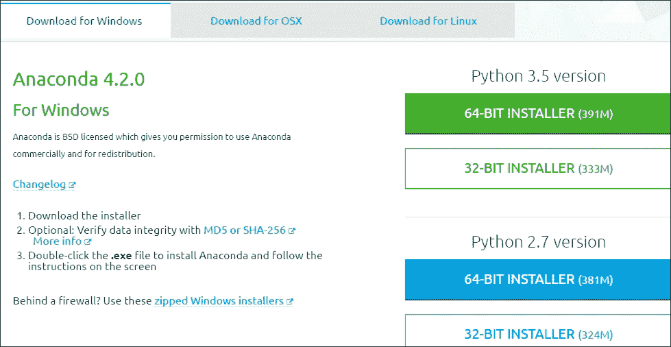

对于 Python，不同版本共存。从前面的截图中，我们看到有两个版本，分别是 3.5 和 2.7。

对于本书，版本并不是非常关键。旧版本问题较少，而新版本通常有新的改进。同样，模块依赖可能会成为一个大难题；详见第二章，*Python 模块简介*，以获取更多信息。Anaconda 的版本是 4.2.0。由于我们将通过 Spyder 启动 Python，因此它也可能有不同的版本。

## 通过 Spyder 启动 Python

通过 Anaconda 安装 Python 后，我们可以导航到**Start**（Windows 版本）|**All Programs**|**Anaconda3(32-bit)**，如以下截图所示：

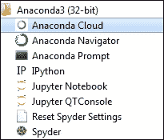

在我们点击**Spyder**，即前面截图中的最后一个条目后，下面将显示四个面板：

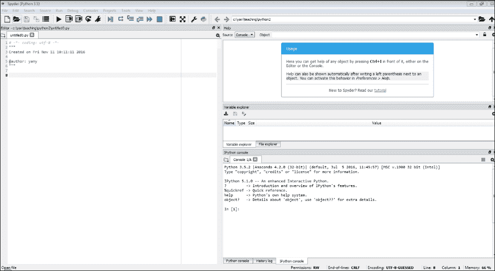

左上方的面板（窗口）是我们的程序编辑器，在这里我们编写程序。右下方的面板是 IPython 控制台，我们可以在其中输入简单的命令。IPython 是默认的控制台。要了解更多关于 IPython 的信息，只需输入一个问号；请参见以下截图：

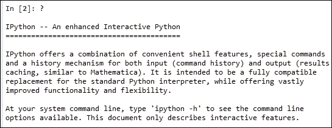

另外，我们可以通过点击菜单栏上的**Consoles**，然后选择**Open a Python console**来启动 Python 控制台。之后，以下窗口将出现：

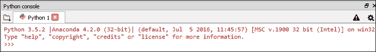

在四个面板的图像中，右上方的面板是我们的帮助窗口，在这里我们可以寻求帮助。中间的面板称为*变量浏览器*，其中显示了变量的名称及其值。根据个人喜好，用户可以调整这些面板的大小或重新组织它们。

## 直接安装 Python

对于大多数用户来说，了解如何通过 Anaconda 安装 Python 已经足够了。为了完整性，下面展示了安装 Python 的第二种方式。

以下是涉及的步骤：

1.  首先，访问[www.python.org/download](http://www.python.org/download)：

1.  根据你的电脑选择合适的安装包，例如 Python 版本 3.5.2。对于本书而言，Python 的版本并不重要。在这个阶段，新的用户可以直接安装最新版本的 Python。安装后，我们将看到以下 Windows 版本的条目：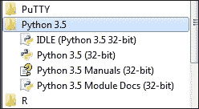

1.  要启动 Python，我们可以点击`IDLE (Python 3.5\. 32 bit)`并看到以下界面：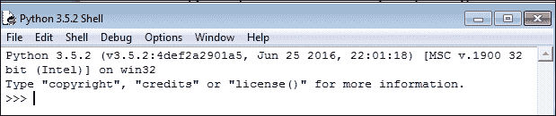

1.  从截图中显示的四个面板中的 IPython，或者从 Python 控制台面板，或从之前显示 Python Shell 的截图中，我们可以输入各种命令，如下所示：

    ```py
    >>>pv=100
    >>>pv*(1+0.1)**20
    672.7499949325611
    >>> import math
    >>>math.sqrt(3)
    1.7320508075688772
    >>>

    ```

1.  要编写一个 Python 程序，我们点击**文件**，然后点击**新建文件**：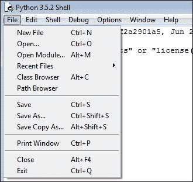

1.  输入这个程序并保存：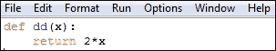

1.  点击**运行**，然后点击**运行模块**。如果没有错误发生，我们就可以像使用其他内置函数一样使用该函数，如下所示：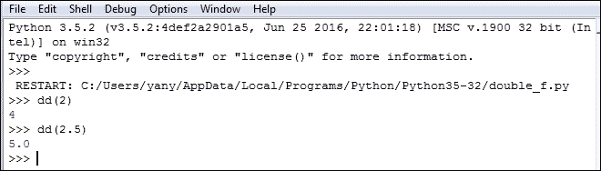

# 变量赋值、空格和编写我们自己的程序

首先，对于 Python 语言，空格或空格非常重要。例如，如果我们在输入`pv=100`之前不小心多了一个空格，我们将看到如下错误信息：

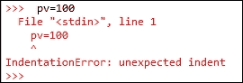

错误的名称是`IndentationError`。原因是，对于 Python 来说，缩进非常重要。在本章稍后的内容中，我们将学习如何通过适当的缩进来规范/定义我们编写的函数，或者为何一组代码属于特定的主题、函数或循环。

假设我们今天在银行存入 100 美元。如果银行提供我们年存款利率 1.5%，那么 3 年后的价值是多少？相关代码如下所示：

```py
>>>pv=100
>>>pv
    100
>>>pv*(1+0.015)**3
    104.56783749999997
>>>
```

在前面的代码中，`**`表示幂运算。例如，`2**3`的值是`8`。要查看变量的值，我们只需输入变量名；请参见前面的例子。使用的公式如下所示：

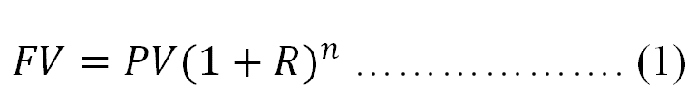

在这里，*FV*是未来值，*PV*是现值，*R*是周期存款利率，而*n*是周期数。在这个例子中，*R*是年利率*0.015*，而*n*是*3*。此时，读者应该专注于简单的 Python 概念和操作。

在第三章中，*时间价值*，该公式将详细解释。由于 Python 是区分大小写的，如果我们输入`PV`而不是`pv`，就会弹出错误信息；请参见以下代码：

```py
>>>PV
NameError: name 'PV' is not defined
>>>Traceback (most recent call last):
  File "<stdin>", line 1, in <module>
```

与一些语言（如 C 和 FORTRAN）不同，Python 中变量不需要在赋值之前定义。要显示所有变量或函数，我们使用`dir()`函数：

```py
>>>dir()
['__builtins__', '__doc__', '__loader__', '__name__', '__package__', '__spec__', 'pv']
>>>
```

要查看所有内置函数，我们输入`dir(__builtings__)`。输出如下所示：

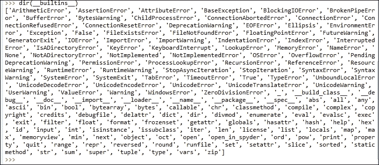

# 编写一个 Python 函数

假设我们有兴趣为方程式（1）编写一个 Python 函数。

启动 Spyder 后，点击**文件**，然后点击**新建文件**。我们编写以下两行代码，如左侧面板所示。关键字`def`表示函数，`fv_f`是函数名称，括号中的三个值`pv`、`r`和`n`是输入变量。

冒号（`:`）表示函数尚未结束。当我们按下 *Enter* 键时，下一行将自动缩进。

当我们输入 `return pv*(1+r)**n` 并按下 *Enter* 键两次时，这个简单的程序就完成了。显然，在第二行中，`**` 代表了一个幂运算。

假设我们将其保存为 `c:/temp/temp.py`：

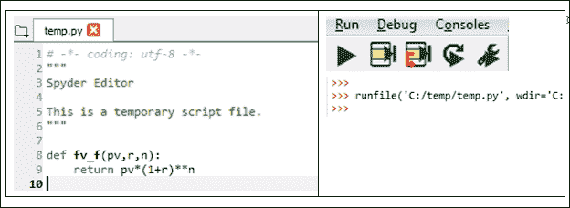

要运行或调试程序，请点击菜单栏下方 **Run** 旁的箭头键；见前面的右上方图像。编译结果由右下方的图像显示（右上方第二张图）。现在，我们可以通过传入三个输入值轻松调用这个函数：

```py
>>>fv_f(100,0.1,2)
     121.00000000000001
>>>fv_f(100,0.02,20)
    148.59473959783548
```

如果在程序中添加一些注释，解释输入变量的含义、使用的公式以及一些示例，将对其他用户或程序员非常有帮助。请查看以下带注释的程序：

```py
def pv_f(fv,r,n):
    """Objective: estimate present value
                     fv
    formula  : pv=-------------
                   (1+r)^n
          fv: fture value
          r : discount periodic rate
          n : number of periods

    Example #1  >>>pv_f(100,0.1,1)
                   90.9090909090909

    Example #2: >>>pv_f(r=0.1,fv=100,n=1)
                    90.9090909090909
    """
    return fv/(1+r)**n
```

注释或解释内容包含在一对三重双引号中（`"""` 和 `"""`）。注释中的缩进不重要。在编译时，底层软件会忽略所有注释。这些注释的美妙之处在于，我们可以通过 `help(pv_f)` 查看它们，如下所示：

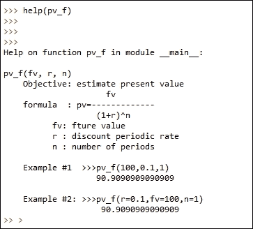

在 第二章，*Python 模块介绍* 中，我们将展示如何上传用 Python 编写的金融计算器；在 第三章，*货币的时间价值* 中，我们将解释如何生成这样的金融计算器。

# Python 循环

在本节中，我们讨论一个非常重要的概念：循环。循环用于重复执行相同的任务，只是输入或其他因素略有不同。

## Python 循环，if...else 条件

让我们来看一个简单的循环，遍历数组中的所有数据项：

```py
>>>import numpy as np
>>>cashFlows=np.array([-100,50,40,30])
>>>for cash in cashFlows:
...    print(cash)
... 
-100
50
40
30
```

一种数据类型叫做元组，我们使用一对圆括号 `()` 来包含所有输入值。元组变量的一个特点是我们不能修改它的值。如果有些变量永远不应该被修改，这个特殊的属性可能非常有用。元组与字典不同，字典通过键值对存储数据。字典是无序的，并且要求键是可哈希的。与元组不同，字典的值是可以修改的。

注意，对于 Python，向量或元组的下标是从 `0` 开始的。如果 `x` 的长度为 `3`，那么下标将是 `0`、`1` 和 `2`：

```py
>>> x=[1,2,3]
>>>x[0]=2
>>>x
>>>
     [2, 2, 3]
>>> y=(7,8,9)
>>>y[0]=10
>>>
TypeError: 'tuple' object does not support item assignment
>>>Traceback (most recent call last):
  File "<stdin>", line 1, in <module>

>>>type(x)
>>>
<class'list'>
>>>type(y)
>>>
<class'tuple'>
>>>
```

假设我们今天投资 $100，并且明年再投资 $30，那么未来 5 年每年年末的现金流入将分别是 $10、$40、$50、$45 和 $20，从第二年年末开始；见下方的时间轴及其对应的现金流：

```py
-100    -30       10       40        50         45       20
|--------|---------|--------|---------|----------|--------|
0        1         2        3         4          5        6
```

如果折现率为 3.5%，**净现值**（**NPV**）是多少？NPV 定义为所有收益的现值减去所有成本的现值。如果现金流入为正，现金流出为负，那么 NPV 可以方便地定义为所有现金流现值的总和。一个未来价值的现值是通过应用以下公式估算的：

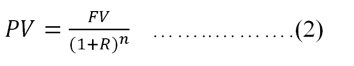

这里，*PV* 是现值，*FV* 是未来值，*R* 是期间折现率，*n* 是期数。在第三章，*货币的时间价值*中，我们将更详细地解释这个公式的意义。目前，我们只想编写一个`npv_f()`函数，应用上述公式*n* 次，其中 n 是现金流的数量。完整的 NPV 程序如下所示：

```py
def npv_f(rate, cashflows):
       total = 0.0
       for i in range(0,len(cashflows)):
             total += cashflows[i] / (1 + rate)**i
       return total
```

在程序中，我们使用了`for`循环。同样，Python 中正确的缩进非常重要。第 2 到第 5 行都缩进了一个单位，因此它们属于同一个函数，名为`npv_f`。类似地，第 4 行缩进了两个单位，也就是在第二个冒号（`:`）后，它属于`for`循环。`total +=a` 命令等价于 `total=total +a`。

对于 NPV 函数，我们使用`for`循环。注意，Python 中向量的索引从零开始，临时变量`i`也从零开始。我们可以通过输入两组值来轻松调用此函数。输出如下所示：

```py
>>>r=0.035
>>>cashflows=[-100,-30,10,40,50,45,20]
>>>npv_f(r,cashflows)
14.158224763725372 
```

这是另一个带有`enumerate()`函数的`npv_f()`函数。这个函数将生成一对索引，从`0`开始，并返回其对应的值：

```py
def npv_f(rate, cashflows):
      total = 0.0
      for i, cashflow in enumerate(cashflows):
               total += cashflow / (1 + rate)**i
      return total
```

这里是一个使用`enumerate()`的例子：

```py
x=["a","b","z"]
for i, value in enumerate(x):
      print(i, value)
```

与之前指定的`npv_f`函数不同，Microsoft Excel 中的 NPV 函数实际上是一个 `PV` 函数，这意味着它只能应用于未来值。其等效的 Python 程序，称为 `npv_Excel`，如下所示：

```py
def npv_Excel(rate, cashflows):
       total = 0.0
       for i, cashflow in enumerate(cashflows):
                total += cashflow / (1 + rate)**(i+1)
       return total
```

比较结果如下表所示。左侧面板显示了 Python 程序的结果，右侧面板显示了调用 Excel NPV 函数的结果。请特别注意前面的程序以及如何调用这样的函数：

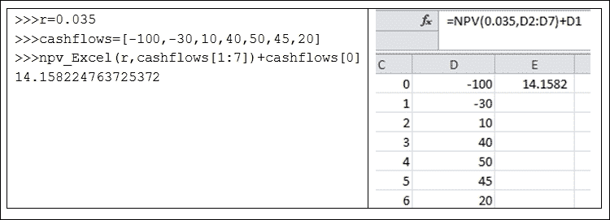

通过使用循环，我们可以用不同的输入重复相同的任务。例如，我们计划打印一组值。以下是一个`while`循环的例子：

```py
i=1
while(i<10):
      print(i)
      i+=1
```

以下程序将报告一个折现率（或多个折现率），使其相应的 NPV 等于零。假设现金流分别为 `550`、`-500`、`-500`、`-500` 和 `1000`，时间点为 `0`，并且接下来 4 年每年的年末。有关此练习的概念，我们将在第三章中进一步解释。

编写一个 Python 程序，找出哪个折扣率使得 NPV 等于零。由于现金流的方向变化两次，我们可能有两个不同的折扣率使得 NPV 为零：

```py
cashFlows=(550,-500,-500,-500,1000)
r=0
while(r<1.0):
     r+=0.000001
     npv=npv_f(r,cashFlows)
     if(abs(npv)<=0.0001):
            print(r)
```

相应的输出如下：

```py
0.07163900000005098
0.33673299999790873
```

在本章后面，将使用`for`循环来估算一个项目的 NPV。

当我们需要使用一些数学函数时，可以先导入`math`模块：

```py
>>>import math
>>>dir(math)
['__doc__', '__loader__', '__name__', '__package__', '__spec__', 'acos', 'acosh', 'asin', 'asinh', 'atan', 'atan2', 'atanh', 'ceil', 'copysign', 'cos', 'cosh', 'degrees', 'e', 'erf', 'erfc', 'exp', 'expm1', 'fabs', 'factorial', 'floor', 'fmod', 'frexp', 'fsum', 'gamma', 'gcd', 'hypot', 'inf', 'isclose', 'isfinite', 'isinf', 'isnan', 'ldexp', 'lgamma', 'log', 'log10', 'log1p', 'log2', 'modf', 'nan', 'pi', 'pow', 'radians', 'sin', 'sinh', 'sqrt', 'tan', 'tanh', 'trunc']
>>>math.pi
3.141592653589793
>>>
```

`sqrt()`平方根函数包含在`math`模块中。因此，要使用`sqrt()`函数，我们需要使用`math.sqrt()`；请参见以下代码：

```py
>>>sqrt(2)
NameError: name 'sqrt' is not defined
>>>Traceback (most recent call last):
  File "<stdin>", line 1, in <module>
math.sqrt(2)
1.4142135623730951
>>>
```

如果我们希望直接调用这些函数，可以使用`from math import *`；请参见以下代码：

```py
>>>from math import *
>>>sqrt(3)
1.7320508075688772
>>>
```

要了解各个嵌入函数，我们可以使用`help()`函数；请参见以下代码：

```py
>>>help(len)
Help on built-in function len in module builtins:
len(obj, /)
    Return the number of items in a container.
>>>
```

# 数据输入

首先，我们生成一个非常简单的输入数据集，如下所示。它的名称和位置为`c:/temp/test.txt`。数据集的格式是文本：

```py
a b
1 2
3 4
```

代码如下：

```py
>>>f=open("c:/temp/test.txt","r")
>>>x=f.read()
>>>f.close()
```

可以使用`print()`函数来显示`x`的值：

```py
>>>print(x)
a b
1 2
3 4
>>>
```

对于第二个示例，首先让我们从**Yahoo!Finance**下载 IBM 的每日历史价格数据。为此，我们访问[`finance.yahoo.com`](http://finance.yahoo.com)：


输入`IBM`以找到其相关网页。然后点击**历史数据**，再点击**下载**：

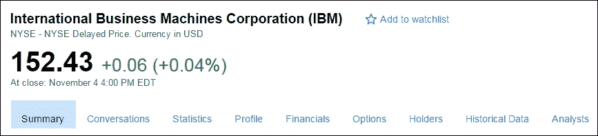

假设我们将每日数据保存为`ibm.csv`，并放在`c:/temp/`目录下。前五行如下所示：

```py
Date,Open,High,Low,Close,Volume,Adj Close
2016-11-04,152.399994,153.639999,151.869995,152.429993,2440700,152.429993
2016-11-03,152.509995,153.740005,151.800003,152.369995,2878800,152.369995
2016-11-02,152.479996,153.350006,151.669998,151.949997,3074400,151.949997
2016-11-01,153.50,153.910004,151.740005,152.789993,3191900,152.789993
```

第一行显示了变量名：日期、开盘价、交易日内的最高价、交易日内的最低价、交易日内最后一次交易的收盘价、交易量和交易日的调整价格。分隔符是逗号。加载文本文件有几种方法，这里讨论了一些方法：

+   **方法一**：我们可以使用`pandas`模块中的`read_csv`：

    ```py
    >>> import pandas as pd
    >>> x=pd.read_csv("c:/temp/ibm.csv")
    >>>x[1:3]
             Date        Open        High         Low       Close   Volume  \
    1  2016-11-02  152.479996  153.350006  151.669998  151.949997  3074400   
    2  2016-11-01  153.500000  153.910004  151.740005  152.789993  3191900   

    Adj.Close
    1  151.949997
    2  152.789993>>>
    ```

+   **方法二**：我们可以使用`pandas`模块中的`read_table`；请参见以下代码：

    ```py
    >>> import pandas as pd
    >>> x=pd.read_table("c:/temp/ibm.csv",sep=',')
    ```

另外，我们可以直接从 Yahoo!Finance 下载 IBM 的每日价格数据；请参见以下代码：

```py
>>> import pandas as pd
>>>url=url='http://canisius.edu/~yany/data/ibm.csv'
>>> x=pd.read_csv(url)
>>>x[1:5]
         Date        Open        High         Low       Close   Volume  \
1  2016-11-03  152.509995  153.740005  151.800003  152.369995  2843600   
2  2016-11-02  152.479996  153.350006  151.669998  151.949997  3074400   
3  2016-11-01  153.500000  153.910004  151.740005  152.789993  3191900   
4  2016-10-31  152.759995  154.330002  152.759995  153.690002  3553200   

Adj Close  
1  152.369995
2  151.949997
3  152.789993
4  153.690002>>>
```

我们可以通过使用`pandas`模块中的`ExcelFile()`函数从 Excel 文件中检索数据。首先，我们生成一个包含少量观测值的 Excel 文件；请参见以下截图：

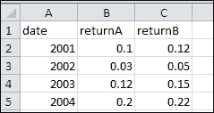

假设我们将此 Excel 文件命名为`stockReturns.xlxs`，并保存到`c:/temp/`。Python 代码如下：

```py
>>>infile=pd.ExcelFile("c:/temp/stockReturns.xlsx")
>>> x=infile.parse("Sheet1")
>>>x
date  returnAreturnB
0  2001     0.10     0.12
1  2002     0.03     0.05
2  2003     0.12     0.15
3  2004     0.20     0.22
>>>
```

要检索扩展名为`.pkl`或`.pickle`的 Python 数据集，我们可以使用以下代码。首先，我们从作者的网页[`www3.canisius.edu/~yany/python/ffMonthly.pkl`](http://www3.canisius.edu/~yany/python/ffMonthly.pkl)下载名为`ffMonthly.pkl`的 Python 数据集。

假设数据集保存在`c:/temp/`目录下。可以使用`pandas`模块中名为`read_pickle()`的函数加载扩展名为`.pkl`或`.pickle`的数据集：

```py
>>> import pandas as pd
>>> x=pd.read_pickle("c:/temp/ffMonthly.pkl")
>>>x[1:3]
>>>
Mkt_RfSMBHMLRf
196308  0.0507 -0.0085  0.0163  0.0042
196309 -0.0157 -0.0050  0.0019 -0.0080
>>>
```

以下是最简单的 `if` 函数：当我们的利率为负时，打印一个警告信息：

```py
if(r<0):
    print("interest rate is less than zero")
```

与逻辑 `AND` 和 `OR` 相关的条件如下所示：

```py
>>>if(a>0 and b>0):
  print("both positive")
>>>if(a>0 or b>0):
  print("at least one is positive")
```

对于多个 `if...elif` 条件，以下程序通过将数字等级转换为字母等级来说明其应用：

```py
grade=74
if grade>=90:
    print('A')
elif grade >=85:
    print('A-')
elif grade >=80:
    print('B+')
elif grade >=75:
    print('B')
elif grade >=70:
    print('B-')
elif grade>=65:
    print('C+')
else:
    print('D')
```

请注意，对于这种多重 `if...elif` 函数，最好以 `else` 条件结尾，因为如果没有满足这些条件，我们确切知道结果是什么。

# 数据操作

数据有很多不同的类型，比如整数、实数或字符串。以下表格列出了这些数据类型：

| 数据类型 | 描述 |
| --- | --- |
| `Bool` | 布尔值（`TRUE` 或 `FALSE`）以字节存储 |
| `Int` | 平台整数（通常为 `int32` 或 `int64`） |
| `int8` | 字节（`-128` 到 `127`） |
| `int16` | 整数（`-32768` 到 `32767`） |
| `int32` | 整数（`-2147483648` 到 `2147483647`） |
| `int64` | 整数（`9223372036854775808` 到 `9223372036854775807`） |
| `unit8` | 无符号整数（`0` 到 `255`） |
| `unit16` | 无符号整数（`0` 到 `65535`） |
| `unit32` | 无符号整数（`0` 到 `4294967295`） |
| `unit64` | 无符号整数（`0` 到 `18446744073709551615`） |
| `float` | 短浮点数，用于 `float6` |
| `float32` | 单精度浮点数：符号位 `bit23` 位尾数；8 位指数 |
| `float64` | 52 位尾数 |
| `complex` | `complex128` 的简写 |
| `complex64` | 复数；由两个 32 位浮点数表示（实部和虚部） |
| `complex128` | 复数；由两个 64 位浮点数表示（实部和虚部） |

> 表 1.1 不同数据类型的列表

在以下示例中，我们将一个标量值赋给 `r`，并将多个值赋给 `pv`，它是一个数组（向量）。`type()` 函数用于显示它们的类型：

```py
>>> import numpy as np
>>> r=0.023
>>>pv=np.array([100,300,500])
>>>type(r)
<class'float'>
>>>type(pv)
<class'numpy.ndarray'>
```

为了选择合适的决策，我们使用 `round()` 函数；见以下示例：

```py
>>> 7/3
2.3333333333333335
>>>round(7/3,5)
2.33333
>>>
```

对于数据操作，我们来看一些简单的操作：

```py
>>>import numpy as np
>>>a=np.zeros(10)                      # array with 10 zeros 
>>>b=np.zeros((3,2),dtype=float)       # 3 by 2 with zeros 
>>>c=np.ones((4,3),float)              # 4 by 3 with all ones 
>>>d=np.array(range(10),float)         # 0,1, 2,3 .. up to 9 
>>>e1=np.identity(4)                   # identity 4 by 4 matrix 
>>>e2=np.eye(4)                        # same as above 
>>>e3=np.eye(4,k=1)                    # 1 start from k 
>>>f=np.arange(1,20,3,float)           # from 1 to 19 interval 3 
>>>g=np.array([[2,2,2],[3,3,3]])       # 2 by 3 
>>>h=np.zeros_like(g)                  # all zeros 
>>>i=np.ones_like(g)                   # all ones
```

一些所谓的 `dot` 函数非常方便和有用：

```py
>>> import numpy as np
>>> x=np.array([10,20,30])
>>>x.sum()
60
```

任何在 `#` 符号后面的内容都是注释。数组是另一种重要的数据类型：

```py
>>>import numpy as np
>>>x=np.array([[1,2],[5,6],[7,9]])      # a 3 by 2 array
>>>y=x.flatten()
>>>x2=np.reshape(y,[2,3]              ) # a 2 by 3 array
```

我们可以将字符串赋值给变量：

```py
>>> t="This is great"
>>>t.upper()
'THIS IS GREAT'
>>>
```

为了找出所有与字符串相关的函数，我们使用 `dir('')`；见以下代码：

```py
>>>dir('')
['__add__', '__class__', '__contains__', '__delattr__', '__dir__', '__doc__', '__eq__', '__format__', '__ge__', '__getattribute__', '__getitem__', '__getnewargs__', '__gt__', '__hash__', '__init__', '__iter__', '__le__', '__len__', '__lt__', '__mod__', '__mul__', '__ne__', '__new__', '__reduce__', '__reduce_ex__', '__repr__', '__rmod__', '__rmul__', '__setattr__', '__sizeof__', '__str__', '__subclasshook__', 'capitalize', 'casefold', 'center', 'count', 'encode', 'endswith', 'expandtabs', 'find', 'format', 'format_map', 'index', 'isalnum', 'isalpha', 'isdecimal', 'isdigit', 'isidentifier', 'islower', 'isnumeric', 'isprintable', 'isspace', 'istitle', 'isupper', 'join', 'ljust', 'lower', 'lstrip', 'maketrans', 'partition', 'replace', 'rfind', 'rindex', 'rjust', 'rpartition', 'rsplit', 'rstrip', 'split', 'splitlines', 'startswith', 'strip', 'swapcase', 'title', 'translate', 'upper', 'zfill']
>>>
```

例如，从前面的列表中，我们看到一个名为 `split` 的函数。输入 `help(''.split)` 后，我们将得到相关的帮助信息：

```py
>>>help(''.split)
Help on built-in function split:

split(...) method of builtins.str instance
S.split(sep=None, maxsplit=-1) -> list of strings

    Return a list of the words in S, using sep as the
delimiter string. If maxsplit is given, at most maxsplit
splits are done. If sep is not specified or is None, any
whitespace string is a separator and empty strings are
removed from the result.
>>>
```

我们可以尝试以下示例：

```py
>>> x="this is great"
>>>x.split()
['this', 'is', 'great']
>>>
```

矩阵操作在我们处理各种矩阵时非常重要：

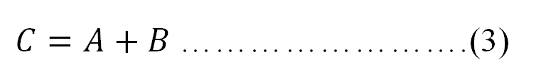

方程（3）的条件是矩阵 *A* 和 *B* 应该有相同的维度。对于两个矩阵的乘积，我们有以下方程：

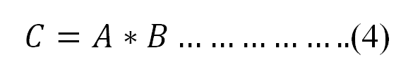

这里，*A* 是一个 *n* 行 *k* 列的矩阵（*n* 行和 *k* 列），而 *B* 是一个 *k* 行 *m* 列的矩阵。记住，第一个矩阵的第二维度应该与第二个矩阵的第一维度相同。在这种情况下，它是 *k*。如果我们假设 *C*、*A* 和 *B* 中的各个数据项分别为 *Ci,j*（第 *i* 行和第 *j* 列）、*Ai,j* 和 *Bi,j*，我们可以得到它们之间的关系：

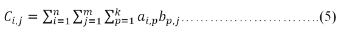

可以使用 NumPy 模块中的 `dot()` 函数进行上述矩阵乘法：

```py
>>>a=np.array([[1,2,3],[4,5,6]],float)    # 2 by 3
>>>b=np.array([[1,2],[3,3],[4,5]],float)  # 3 by 2
>>>np.dot(a,b)                            # 2 by 2
>>>print(np.dot(a,b))
array([[ 19.,  23.],
[ 43.,  53.]])
>>>
```

我们可以手动计算 *c(1,1): 1*1 + 2*3 + 3*4=19*。

在获取数据或从互联网下载数据后，我们需要处理这些数据。这种处理各种类型原始数据的技能对于金融学学生和从事金融行业的专业人士来说至关重要。这里我们将展示如何下载价格数据并估算收益率。

假设我们有 *n* 个 *x1*、*x2*、… 和 *xn* 的值。存在两种类型的均值：算术均值和几何均值；请参阅它们的基因定义：

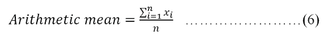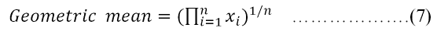

假设存在三个值 `2`、`3` 和 `4`。它们的算术均值和几何均值在此计算：

```py
>>>(2+3+4)/3.
>>>3.0
>>>geo_mean=(2*3*4)**(1./3)
>>>round(geo_mean,4) 
2.8845
```

对于收益率，算术平均数的定义保持不变，而几何平均数的定义则不同；请参阅以下公式：

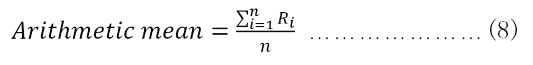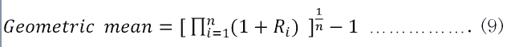

在第三章中，我们将再次讨论这两种均值。

我们可以说，NumPy 是一个基础模块，而 SciPy 是一个更高级的模块。NumPy 尝试保留其前辈所支持的所有特性，而大多数新特性属于 SciPy，而不是 NumPy。另一方面，NumPy 和 SciPy 在金融功能方面有许多重叠的特性。关于这两种定义，请参阅以下示例：

```py
>>> import scipy as sp
>>> ret=sp.array([0.1,0.05,-0.02])
>>>sp.mean(ret)
0.043333333333333342
>>>pow(sp.prod(ret+1),1./len(ret))-1 
0.042163887067679262
```

我们的第二个示例与处理 Fama-French 三因子时间序列相关。由于此示例比前一个更复杂，如果用户觉得难以理解，可以简单跳过此示例。首先，可以从 French 教授的数据库下载名为 `F-F_Research_Data_Factor_TXT.zip` 的 ZIP 文件。解压后，去除前几行和年度数据集，我们将得到一个月度的 Fama-French 因子时间序列。这里展示了前几行和后几行：

```py
DATE    MKT_RFSMBHMLRF
192607    2.96   -2.30   -2.87    0.22
192608    2.64   -1.40    4.19    0.25
192609    0.36   -1.32    0.01    0.23

201607    3.95    2.90   -0.98    0.02
201608    0.49    0.94    3.18    0.02
201609    0.25    2.00   -1.34    0.02
```

假设最终文件名为 `ffMonthly.txt`，位于 `c:/temp/` 目录下。以下程序用于检索和处理数据：

```py
import numpy as np
import pandas as pd
file=open("c:/temp/ffMonthly.txt","r")
data=file.readlines()
f=[]
index=[]
for i in range(1,np.size(data)):
    t=data[i].split()
    index.append(int(t[0]))
    for j in range(1,5):
        k=float(t[j])
        f.append(k/100)
n=len(f) 
f1=np.reshape(f,[n/4,4])
ff=pd.DataFrame(f1,index=index,columns=['Mkt_Rf','SMB','HML','Rf'])
```

要查看名为 `ff` 的数据集的前几行和后几行观察值，可以使用 `.head()` 和 `.tail()` 函数：

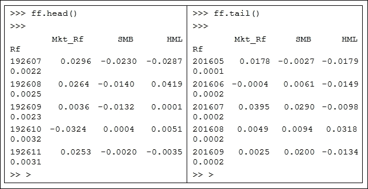

# 数据输出

最简单的示例如下：

```py
>>>f=open("c:/temp/out.txt","w")
>>>x="This is great"
>>>f.write(x)
>>>f.close()
```

对于下一个示例，我们首先下载历史股票价格数据，然后将数据写入输出文件：

```py
import re
from matplotlib.finance import quotes_historical_yahoo_ochl
ticker='dell'
outfile=open("c:/temp/dell.txt","w")
begdate=(2013,1,1)
enddate=(2016,11,9)
p=quotes_historical_yahoo_ochl
(ticker,begdate,enddate,asobject=True,adjusted=True)
outfile.write(str(p))
outfile.close()
```

为了检索文件，我们有以下代码：

```py
>>>infile=open("c:/temp/dell.txt","r")
>>>x=infile.read()
```

一个问题是，前面保存的文本文件包含了许多不必要的字符，比如 `[` 和 `]`。我们可以应用一个名为 `sub()` 的替换函数，它包含在 Python 模块中；请参见这里给出的最简单示例：

```py
>>> import re
>>>re.sub("a","9","abc")
>>>
'9bc'
>>>
```

在前面的示例中，我们将字母 `a` 替换为 `9`。感兴趣的读者可以尝试以下两行代码来运行前面的程序：

```py
p2= re.sub('[\(\)\{\}\.<>a-zA-Z]','', p)
outfile.write(p2)
```

使用扩展名 `.pickle` 生成 Python 数据集是一个好主意，因为我们可以高效地检索此类数据。以下是生成 `ffMonthly.pickle` 的完整 Python 代码。在这里，我们展示了如何下载价格数据并估算收益：

```py
import numpy as np
import pandas as pd
file=open("c:/temp/ffMonthly.txt","r")
data=file.readlines()
f=[]
index=[]
for i in range(1,np.size(data)):
    t=data[i].split()
    index.append(int(t[0]))
    for j in range(1,5):
        k=float(t[j])
        f.append(k/100)
n=len(f)
f1=np.reshape(f,[n/4,4])
ff=pd.DataFrame(f1,index=index,columns=['Mkt_Rf','SMB','HML','Rf'])
ff.to_pickle("c:/temp/ffMonthly.pickle")
```

# 练习

1.  你可以在哪里下载并安装 Python？

1.  Python 是否区分大小写？

1.  如何将一组值以元组的形式赋值给 *pv*？在赋值之后，我们可以更改其值吗？

1.  如果直径为 9.7，使用 Python 估算圆的面积。

1.  如何为一个新变量赋值？

1.  如何找到与 Python 相关的一些示例代码？

1.  如何启动 Python 的帮助函数？

1.  如何获得更多关于某个特定函数的信息，例如 `print()`？

1.  内置函数的定义是什么？

1.  `pow()` 是一个内置函数吗？我们该如何使用它？

1.  如何找到所有内置函数？内置函数共有多少个？

1.  当我们估算 3 的平方根时，应该使用哪个 Python 函数？

1.  假设永久年金的现值为 124 美元，年现金流为 50 美元；那么相应的贴现率是多少？公式如下：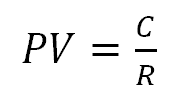

1.  根据上一个问题的解答，什么是相应的季度利率？

1.  对于永久年金，现金流在相同的时间间隔内永远发生。增长的永久年金定义如下：未来的现金流将永远以固定的增长率增长。如果第一个现金流发生在第一个期间结束时，我们有以下公式：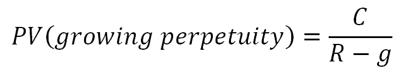

    在这里，*PV* 是现值，*C* 是下一个期间的现金流，*g* 是增长率，*R* 是贴现率。如果第一个现金流为 12.50 美元，常数增长率为 2.5%，贴现率为 8.5%，那么这个持续增长的永久年金的现值是多少？

1.  对于 *n* 天的方差，我们有以下公式：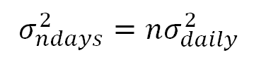

    这里 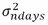 是日波动率，! Exercises 是日标准差（波动率）。如果某只股票的波动率（每日标准差）为 0.2，那么它的 10 天波动率是多少？

1.  我们预计在 5 年内将有 25,000 美元。如果年存款利率为 4.5%，我们今天需要存入多少金额？

1.  这个名为 `sub()` 的替换函数来自一个 Python 模块。找出该模块包含了多少个函数。

1.  编写一个 Python 程序，通过使用以下公式，将基于日数据或月数据估算的标准差转换为年标准差：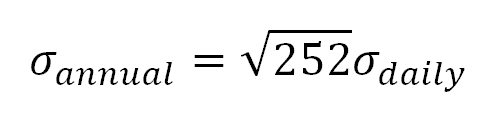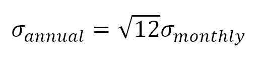

1.  夏普比率是衡量投资（如投资组合）在收益（超额收益）与成本（总风险）之间权衡的一种指标。编写一个 Python 程序，通过以下公式估算夏普比率：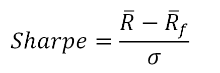

    这里，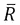是投资组合的平均收益，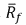是无风险利率的平均值，而σ是投资组合的风险。同样，在此时，读者不理解该比率的经济含义是完全可以接受的，因为夏普比率将在第七章，*多因子模型与绩效衡量*中进行更详细的讨论。

# 总结

在本章中，我们讨论了许多与 Python 相关的基本概念和几个广泛使用的函数。在第二章，*Python 模块介绍*中，我们将讨论 Python 语言的一个关键组成部分：Python 模块及其相关问题。模块是由专家、专业人士或任何围绕特定主题的人编写的一组程序。模块可以视为完成特定任务的工具箱。本章将重点介绍五个最重要的模块：NumPy、SciPy、`matplotlib`、`statsmodels`和`pandas`。
