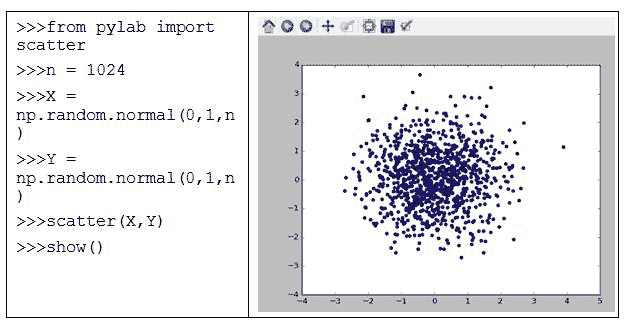

# 第二章 Python 模块简介

在本章中，我们将讨论与 Python 模块相关的最重要问题，这些模块是由专家或任何个人编写的，用于特定目的。在本书中，我们将使用大约十几个模块。因此，模块相关的知识对于我们理解 Python 及其在金融中的应用至关重要。特别地，在本章中，我们将涵盖以下主题：

+   Python 模块简介

+   NumPy 简介

+   SciPy 简介

+   `matplotlib`简介

+   `statsmodels`简介

+   pandas 简介

+   与金融相关的 Python 模块

+   pandas_reader 模块简介

+   用 Python 编写的两个金融计算器

+   如何安装 Python 模块

+   模块依赖关系

# 什么是 Python 模块？

模块是由专家、用户甚至是初学者编写的一组程序或软件包，通常这些人精通某个特定领域，且为了特定的目的而编写这些程序。

例如，一个名为 quant 的 Python 模块用于定量金融分析。quant 结合了 SciPy 和`DomainModel`两个模块。该模块包含一个领域模型，其中有交易所、符号、市场和历史价格等内容。模块在 Python 中非常重要。在本书中，我们将或多或少地讨论十几个模块。特别地，我们将详细讲解五个模块：NumPy、SciPy、`matplotlib`、`statsmodels`和 Pandas。

### 注意

截至 2016 年 11 月 16 日，Python 包索引中有 92,872 个不同领域的 Python 模块（包）。

对于金融和保险行业，目前有 384 个模块可供使用。

假设我们想使用`sqrt()`函数估算`3`的平方根。然而，在执行以下代码后，我们将遇到错误消息：

```py
>>>sqrt(3)
SyntaxError: invalid syntax
>>>
```

原因在于`sqrt()`函数不是内置函数。内置函数可以视为在 Python 启动时就已存在的函数。要使用`sqrt()`函数，我们需要先导入 math 模块，如下所示：

```py
>>>import math
>>>x=math.sqrt(3)
>>>round(x,4)
1.7321
```

要使用`sqrt()`函数，如果我们使用`import math`命令导入 math 模块，则必须输入`math.sqrt()`。在前面的代码中，`round()`函数用于控制小数位数。此外，在执行`dir()`命令后，我们将看到 math 模块的存在，它是此处输出中的最后一个：

```py
>>>dir()
['__builtins__', '__doc__', '__name__', '__package__', 'math']
```

此外，当一个模块是预安装时，我们可以使用`import x_module`来上传它。例如，math 模块是预安装的。在本章后面，我们将看到如何查找所有内置模块。在前面的输出中，发出`dir()`命令后，我们还观察到`__builtins__`。在`builtin`前后都有两个下划线。这个`__builtins__`模块不同于其他内置模块，例如`math`模块。它包含所有内置函数和其他对象。再次发出`dir(__builtins__)`命令可以列出所有内置函数，如以下代码所示：

```py
>>> dir(__builtins__)
['ArithmeticError', 'AssertionError', 'AttributeError', 'BaseException', 'BlockingIOError', 'BrokenPipeError', 'BufferError', 'BytesWarning', 'ChildProcessError', 'ConnectionAbortedError', 'ConnectionError', 'ConnectionRefusedError', 'ConnectionResetError', 'DeprecationWarning', 'EOFError', 'Ellipsis', 'EnvironmentError', 'Exception', 'False', 'FileExistsError', 'FileNotFoundError', 'FloatingPointError', 'FutureWarning', 'GeneratorExit', 'IOError', 'ImportError', 'ImportWarning', 'IndentationError', 'IndexError', 'InterruptedError', 'IsADirectoryError', 'KeyError', 'KeyboardInterrupt', 'LookupError', 'MemoryError', 'NameError', 'None', 'NotADirectoryError', 'NotImplemented', 'NotImplementedError', 'OSError', 'OverflowError', 'PendingDeprecationWarning', 'PermissionError', 'ProcessLookupError', 'RecursionError', 'ReferenceError', 'ResourceWarning', 'RuntimeError', 'RuntimeWarning', 'StopAsyncIteration', 'StopIteration', 'SyntaxError', 'SyntaxWarning', 'SystemError', 'SystemExit', 'TabError', 'TimeoutError', 'True', 'TypeError', 'UnboundLocalError', 'UnicodeDecodeError', 'UnicodeEncodeError', 'UnicodeError', 'UnicodeTranslateError', 'UnicodeWarning', 'UserWarning', 'ValueError', 'Warning', 'WindowsError', 'ZeroDivisionError', '_', '__build_class__', '__debug__', '__doc__', '__import__', '__loader__', '__name__', '__package__', '__spec__', 'abs', 'all', 'any', 'ascii', 'bin', 'bool', 'bytearray', 'bytes', 'callable', 'chr', 'classmethod', 'compile', 'complex', 'copyright', 'credits', 'debugfile', 'delattr', 'dict', 'dir', 'divmod', 'enumerate', 'eval', 'evalsc', 'exec', 'exit', 'filter', 'float', 'format', 'frozenset', 'getattr', 'globals', 'hasattr', 'hash', 'help', 'hex', 'id', 'input', 'int', 'isinstance', 'issubclass', 'iter', 'len', 'license', 'list', 'locals', 'map', 'max', 'memoryview', 'min', 'next', 'object', 'oct', 'open', 'open_in_spyder', 'ord', 'pow', 'print', 'property', 'quit', 'range', 'repr', 'reversed', 'round', 'runfile', 'set', 'setattr', 'slice', 'sorted', 'staticmethod', 'str', 'sum', 'super', 'tuple', 'type', 'vars', 'zip']
```

从前面的输出中，我们发现一个名为`pow()`的函数。可以使用`help(pow)`命令来查找有关这个特定函数的更多信息；见下文：

```py
>>> help(pow)
Help on built-in function pow in module builtins:
pow(x, y, z=None, /)
Equivalent to x**y (with two arguments) or x**y % z 
(with three arguments) 
Some types, such as ints, are able to use a more 
efficient algorithm when invoked using the three argument form.
>> > 
```

为了方便，建议为导入的模块采用简短名称。为了在编程时减少一些输入工作量，我们可以使用`import x_module as short_name`命令，如以下代码所示：

```py
>>>import sys as s
>>>import time as tt
>>>import numpy as np
>>>import matplotlib as mp
```

在调用导入模块中包含的特定函数时，我们使用模块的简短名称，如以下代码所示：

```py
>>> import time as tt
>>> tt.localtime()
time.struct_time(tm_year=2016, tm_mon=11, tm_mday=21, tm_hour=10, tm_min=58, tm_sec=33, tm_wday=0, tm_yday=326, tm_isdst=0)
>>>
```

虽然用户可以自由选择任何简短的名称来导入模块，但遵循一些约定是个不错的主意，例如使用`np`表示 NumPy，使用`sp`表示 SciPy。使用这些常用的简短名称的一个额外好处是能使我们的程序对他人更具可读性。要显示导入模块中的所有函数，可以使用`dir(module)`命令，如以下代码所示：

```py
>>>import math
>>>dir(math)
['__doc__', '__loader__', '__name__', '__package__', 'acos', 'acosh',
'asin', 'asinh', 'atan', 'atan2', 'atanh', 'ceil', 'copysign', 'cos',
'cosh', 'degrees', 'e', 'erf', 'erfc', 'exp', 'expm1', 'fabs',
'factorial', 'floor', 'fmod', 'frexp', 'fsum', 'gamma', 'hypot',
'isfinite', 'isinf', 'isnan', 'ldexp', 'lgamma', 'log', 'log10', 'log1p', 'log2', 'modf', 'pi', 'pow', 'radians', 'sin', 'sinh', 'sqrt', 'tan', 'tanh', 'trunc']
>>>
```

回想一下在第一章，*Python 基础*中，比较了`import math`和`from math import *`。一般来说，为了简化程序，可以使用`from math import *`。这对于刚开始学习 Python 编程的初学者尤其适用。让我们看一下以下代码：

```py
>>>from math import *
>>>sqrt(3)
   1.7320508075688772
```

现在，模块中包含的所有函数将可以直接使用。另一方面，如果我们使用`import math`，我们必须将模块名作为前缀，例如`math.sqrt()`而不是`sqrt()`。熟悉 Python 后，建议使用导入模块的格式，而不是使用`from module import *`。这种偏好背后有两个原因：

+   首先，用户可以准确知道函数来自哪个模块。

+   其次，我们可能已经编写了一个与另一个模块中函数同名的函数。模块名加在函数前面可以将其与我们自己的函数区分开，如以下代码所示：

    ```py
    >>>import math
    >>>math.sqrt(3)
        1.7320508075688772
    ```

`del()`函数用于移除一个被认为不再需要的导入/上传模块，如以下代码所示：

```py
>>>import math
>>>dir()
['__builtins__', '__doc__', '__loader__', '__name__', '__package__', 'math']
>>>del math
>>>dir()
['__builtins__', '__doc__', '__loader__', '__name__', '__package__']
```

另一方面，如果我们使用`from math import *`，我们不能通过`del math`来移除所有函数。必须单独移除这些函数。以下两个命令演示了这种效果：

```py
>>>from math import *
>>>del math
Traceback (most recent call last):
File "<pyshell#23>", line 1, in <module>
del math NameError: name 'math' is not defined
```

为了方便，我们可以只导入几个需要的函数。为了定价一个欧洲看涨期权，需要几个函数，比如`log()`、`exp()`、`sqrt()`和`cdf()`。`cdf()`是累积标准正态分布函数。为了使这四个函数可用，我们指定它们的名称，如下代码所示：

```py
From scipy import log,exp,sqrt,stats
```

这里给出了定价 Black-Scholes-Merton 看涨期权的完整代码：

```py
def bsCall(S,X,T,r,sigma):
    from scipy import log,exp,sqrt,stats
    d1=(log(S/X)+(r+sigma*sigma/2.)*T)/(sigma*sqrt(T))
    d2 = d1-sigma*sqrt(T)
    return S*stats.norm.cdf(d1)-X*exp(-r*T)*stats.norm.cdf(d2) 
```

这里给出了调用`bsCall`函数的一个示例：

```py
>>> bsCall(40,40,0.1,0.05,0.2)
1.1094616585675574
```

要查找所有可用模块，首先应激活帮助窗口。之后，输入`modules`命令。结果如下所示：

```py
>>> help()
>>> 
Welcome to Python 3.5's help utility!
```

如果这是你第一次使用 Python，应该一定访问互联网上的教程：[`docs.python.org/3.5/tutorial/`](http://docs.python.org/3.5/tutorial/)。

输入任何模块、关键字或主题的名称，即可获得关于编写 Python 程序和使用 Python 模块的帮助。要退出该帮助工具并返回解释器，只需输入`quit`。

要获取可用模块、关键字、符号或主题的列表，输入`modules`、`keywords`、`symbols`或`topics`。每个模块还附有一行总结其功能；要列出名称或总结包含给定字符串（如`spam`）的模块，输入`modules spam`：

```py
help>
```

然后，我们在 Python 的`help>`提示符下输入`modules`，如下截图所示（为节省空间，这里仅展示了前部分）：


要查找特定模块，我们只需输入`modules`后跟模块名称。假设我们对名为`cmd`的模块感兴趣，那么我们在帮助窗口中输入`modules cmd`；请参见以下截图：


要获得更多有关模块的信息，请导航至**所有程序** | `Python 3.5` | `Python 3.5 Module Docs`，如下截图所示：


点击`Python 3.5 Module Docs (32-bit)`后，我们将获得更多信息。

# NumPy 简介

在以下示例中，NumPy 中的`np.size()`函数显示了数组的数据项数量，`np.std()`函数用于计算标准差：

```py
>>>import numpy as np
>>>x= np.array([[1,2,3],[3,4,6]])     # 2 by 3 matrix
>>>np.size(x)                         # number of data items
6
>>>np.size(x,1)                       # show number of columns
3
>>>np.std(x)
1.5723301886761005
>>>np.std(x,1)
Array([ 0.81649658, 1.24721913]
>>>total=x.sum()                      # attention to the format
>>>z=np.random.rand(50)               #50 random obs from [0.0, 1)
>>>y=np.random.normal(size=100)       # from standard normal
>>>r=np.array(range(0,100),float)/100 # from 0, .01,to .99
```

与 Python 数组相比，NumPy 数组是一个连续的内存块，直接传递给 LAPACK，这是一个用于数值线性代数的底层软件库，因此在 Python 中矩阵操作非常快速。NumPy 中的数组就像 MATLAB 中的矩阵。与 Python 中的列表不同，数组应该包含相同的数据类型，如下代码所示：

```py
>>>np.array([100,0.1,2],float)
```

实际数据类型是`float64`，数值的默认类型也是`float64`。

在前面的示例中，我们可以看到`np.array()`函数将一个相同数据类型的列表（此例中为整数）转换为数组。要更改数据类型，应使用第二个输入值`dtype`进行指定，如下代码所示：

```py
>>>x=[1,2,3,20]
>>>y=np.array(x1,dtype=float)
>>>y
array([ 1., 2., 3., 20.])
```

在前一个示例中，`dtype`是指定数据类型的关键字。对于列表，不同的数据类型可以共存而不会引发问题。然而，当将包含不同数据类型的列表转换为数组时，会出现错误信息，如以下代码所示：

```py
>>>x2=[1,2,3,"good"]
>>>x2
[1, 2, 3, 'good']
>>>y3=np.array(x2,float)
Traceback (most recent call last):
File "<pyshell#25>", line 1, in <module>
y3=np.array(x2,float)
ValueError: could not convert string to float: 'good'
. ]])
```

为了显示 Numpy 中包含的所有函数，在导入 Numpy 模块后使用`dir(np)`。

以下显示的是前几行代码：

```py
>>> import numpy as np
>>> dir(np)
['ALLOW_THREADS', 'BUFSIZE', 'CLIP', 'ComplexWarning', 'DataSource', 'ERR_CALL', 'ERR_DEFAULT', 'ERR_IGNORE', 'ERR_LOG', 'ERR_PRINT', 'ERR_RAISE', 'ERR_WARN', 'FLOATING_POINT_SUPPORT', 'FPE_DIVIDEBYZERO', 'FPE_INVALID', 'FPE_OVERFLOW', 'FPE_UNDERFLOW', 'False_', 'Inf', 'Infinity', 'MAXDIMS', 'MAY_SHARE_BOUNDS', 'MAY_SHARE_EXACT', 'MachAr', 'ModuleDeprecationWarning', 'NAN', 'NINF', 'NZERO', 'NaN', 'PINF', 'PZERO', 'PackageLoader', 'RAISE', 'RankWarning', 'SHIFT_DIVIDEBYZERO', 'SHIFT_INVALID', 'SHIFT_OVERFLOW', 'SHIFT_UNDERFLOW', 'ScalarType', 'Tester', 'TooHardError', 'True_', 'UFUNC_BUFSIZE_DEFAULT', 'UFUNC_PYVALS_NAME', 'VisibleDeprecationWarning', 'WRAP', '_NoValue', '__NUMPY_SETUP__', '__all__', '__builtins__', '__cached__', '__config__', '__doc__', '__file__', '__git_revision__', '__loader__', '__mkl_version__', '__name__', '__package__', '__path__', '__spec__', '__version__', '_import_tools', '_mat', 'abs', 'absolute', 'absolute_import', 'add', 'add_docstring', 'add_newdoc', 'add_newdoc_ufunc', 'add_newdocs', 'alen', 'all', 'allclose', 'alltrue', 'alterdot', 'amax', 'amin', 'angle', 'any', 'append', 'apply_along_axis', 'apply_over_axes', 'arange', 'arccos', 'arccosh', 'arcsin', 'arcsinh', 'arctan', 'arctan2', 'arctanh', 'argmax', 'argmin', 'argpartition', 'argsort', 'argwhere', 'around', 'array', 'array2string', 'array_equal', 'array_equiv', 'array_repr', 'array_split', 'array_str', 'asanyarray',
```

实际上，更好的方法是生成一个包含所有函数的数组，如下所示：

```py
>>> x=np.array(dir(np))
>>> len(x)
598
```

要显示`200`到`250`的函数，可以输入`x[200:250]`；请参见以下代码：

```py
>>> x[200:250]
array(['disp', 'divide', 'division', 'dot', 'double', 'dsplit', 'dstack',
       'dtype', 'e', 'ediff1d', 'einsum', 'emath', 'empty', 'empty_like',
       'equal', 'errstate', 'euler_gamma', 'exp', 'exp2', 'expand_dims',
       'expm1', 'extract', 'eye', 'fabs', 'fastCopyAndTranspose', 'fft',
       'fill_diagonal', 'find_common_type', 'finfo', 'fix', 'flatiter',
       'flatnonzero', 'flexible', 'fliplr', 'flipud', 'float', 'float16',
       'float32', 'float64', 'float_', 'floating', 'floor', 'floor_divide',
       'fmax', 'fmin', 'fmod', 'format_parser', 'frexp', 'frombuffer',
       'fromfile'], 
      dtype='<U25')
>> > 
```

查找特定函数的更多信息非常简单。执行`dir(np)`后，`std()`函数等将会出现。要获取该函数的更多信息，可以使用`help(np.std)`。为了简洁起见，以下仅显示部分代码：

```py
>>>import numpy as np
>>>help(np.std)
Help on function std in module numpy.core.fromnumeric:

std(a, axis=None, dtype=None, out=None, ddof=0, keepdims=False)
    Compute the standard deviation along the specified axis.
```

该函数返回标准差，它是衡量分布离散程度的指标，表示数组元素的标准差。默认情况下，标准差是针对展平后的数组计算的，或者根据指定的轴进行计算：

```py

    Parameters
    ----------
   a : array_like
      Calculate the standard deviation of these values.
   axis : None or int or tuple of ints, optional
Axis or axes along which the standard deviation is computed. The
default is to compute the standard deviation of the flattened array.

        .. versionadded: 1.7.0
```

# SciPy 简介

以下是几个基于 SciPy 模块中函数的示例。`sp.npv()`函数估算给定现金流的现值，第一个现金流发生在时间零。第一个输入值是贴现率，第二个输入值是所有现金流的数组。

以下是一个示例。请注意，`sp.npv()`函数与 Excel 中的`npv()`函数不同。我们将在第三章中详细解释原因，*货币的时间价值*：

```py
>>>import scipy as sp
>>>cashflows=[-100,50,40,20,10,50]
>>>x=sp.npv(0.1,cashflows)
>>>round(x,2)
>>>31.41
```

`sp.pmt()`函数用于解答以下问题。

每月现金流是多少，用于偿还一笔$250,000 的抵押贷款，贷款期为 30 年，年利率（APR）为 4.5%，按月复利？以下代码显示了答案：

```py
>>>payment=sp.pmt(0.045/12,30*12,250000)
>>>round(payment,2)
-1266.71
```

基于前面的结果，每月支付金额为$1,266.71。出现负值可能让人感到奇怪。实际上，`sp.pmt()`函数模拟了 Excel 中的等效函数，正如我们在以下截图中看到的那样：


输入值包括：有效期利率、期数和现值。顺便提一下，括号中的数字表示负数。

此时，暂时忽略负号。在第三章，*货币的时间价值*中，将更详细讨论这一所谓的 Excel 约定。

类似地，`sp.pv()` 函数复制了 Excel 的 `PV()` 函数。对于 `sp.pv()` 函数，其输入格式为 `sp.pv(rate, nper, pmt, fv=0.0, when='end')`，其中 `rate` 是折现率，`nper` 是期数，`pmt` 是期支付额，`fv` 是未来值，默认为零。最后一个输入变量指定现金流是在每个时间段的末尾还是开始时进行。默认为每期末尾。以下命令演示了如何调用此函数：

```py
>>>pv1=sp.pv(0.1,5,0,100) # pv of one future cash flow
>>>round(pv1,2)
-92.09
>>>pv2=sp.pv(0.1,5,100)   # pv of annuity
>>>round(pv2,2)
-379.08
```

`sp.fv()` 函数的设置类似于 `sp.pv()`。在金融领域，我们估算算术平均值和几何平均值，定义在以下公式中。

对于 *n* 个 *x* 数字，即 *x1*、*x2*、*x3* 和 *xn*，我们有以下公式：


这里， 和 。假设我们有三个数字 *a*、*b* 和 *c*，那么它们的算术平均值是 *(a+b+c)/3*，而它们的几何平均值是 *(a*b*c)^(1/3)*。对于 `2`、`3` 和 `4` 三个值，我们得到以下两种均值：

```py
>>>(2+3+4)/3.
>>>3.0
>>>geo_mean=(2*3*4)**(1./3)
>>>round(geo_mean,4)
2.8845
```

如果给定 *n* 个回报，估算其算术平均值的公式保持不变。然而，回报的几何平均值公式不同，如下所示：


要估算几何平均值，可以使用 `sp.prod()` 函数。该函数为我们提供所有数据项的乘积；请参见以下代码：

```py
>>>import scipy as sp
>>>ret=sp.array([0.1,0.05,-0.02])
>>>sp.mean(ret)                      # arithmetic mean
0.04333
>>>pow(sp.prod(ret+1),1./len(ret))-1 # geometric mean
0.04216
```

实际上，可以通过仅写两行简单的 Python 函数来计算一组给定回报的几何平均值；请参见以下代码：

```py
def geoMeanReturn(ret):
    return pow(sp.prod(ret+1),1./len(ret))-1
```

调用前面的函数非常简单；请参见以下代码：

```py
>>> import scipy as sp
>>> ret=sp.array([0.1,0.05,-0.02])
>>> geoMeanReturn(ret)
0.042163887067679262
```

另外两个有用的函数是 `sp.unique()` 和 `sp.median()`，如以下代码所示：

```py
>>>sp.unique([2,3,4,6,6,4,4])
Array([2,3,4,6])
>>>sp.median([1,2,3,4,5])
3.0
```

Python 的 `sp.pv()`、`sp.fv()` 和 `sp.pmt()` 函数分别与 Excel 的 `pv()`、`fv()` 和 `pmt()` 函数行为相似。它们具有相同的符号约定：现值的符号与未来值相反。

在以下示例中，假设我们输入一个正的未来值来估算现值，最终会得到一个负的现值：

```py
>>>import scipy as sp
>>>round(sp.pv(0.1,5,0,100),2)
>>>-62.09
>>>round(sp.pv(0.1,5,0,-100),2)
>>>62.09
```

有多种方法可以查找 SciPy 模块中包含的所有函数。

首先，我们可以阅读相关手册。其次，我们可以发出以下代码行：

```py
>>>import numpy as np
>>>dir(np)
```

为了节省空间，以下代码仅显示部分输出：

```py
>>> import scipy as sp
>>> dir(sp)
'ALLOW_THREADS', 'BUFSIZE', 'CLIP', 'ComplexWarning', 'DataSource', 'ERR_CALL', 'ERR_DEFAULT', 'ERR_IGNORE', 'ERR_LOG', 'ERR_PRINT', 'ERR_RAISE', 'ERR_WARN', 'FLOATING_POINT_SUPPORT', 'FPE_DIVIDEBYZERO', 'FPE_INVALID', 'FPE_OVERFLOW', 'FPE_UNDERFLOW', 'False_', 'Inf', 'Infinity', 'MAXDIMS', 'MAY_SHARE_BOUNDS', 'MAY_SHARE_EXACT', 'MachAr', 'ModuleDeprecationWarning', 'NAN', 'NINF', 'NZERO', 'NaN', 'PINF', 'PZERO', 'PackageLoader', 'RAISE', 'RankWarning', 'SHIFT_DIVIDEBYZERO', 'SHIFT_INVALID', 'SHIFT_OVERFLOW', 'SHIFT_UNDERFLOW', 'ScalarType', 'Tester', 'TooHardError', 'True_', 'UFUNC_BUFSIZE_DEFAULT', 'UFUNC_PYVALS_NAME', 'VisibleDeprecationWarning', 'WRAP', '__SCIPY_SETUP__', '__all__', '__builtins__', '__cached__', '__config__', '__doc__', '__file__', '__loader__', '__name__', '__numpy_version__', '__package__', '__path__', '__spec__', '__version__', '_lib', 'absolute', 'absolute_import', 'add', 'add_docstring', 'add_newdoc', 'add_newdoc_ufunc', 'add_newdocs', 'alen', 'all', 'allclose', 'alltrue', 'alterdot', 'amax', 'amin', 'angle', 'any', 'append', 'apply_along_axis', 'apply_over_axes', 'arange', 'arccos', 'arccosh', 'arcsin', 'arcsinh', 'arctan', 'arctan2', 'arctanh', 'argmax', 'argmin', 'argpartition', 'argsort', 'argwhere', 'around', 'array', 'array2string', 'array_equal', 'array_equiv', 'array_repr', 'array_split', 'array_str', 'asanyarray', 'asarray', 'asarray_chkfinite', 'ascontiguousarray', 'asfarray', 'asfortranarray', 'asmatrix', 'asscalar', 'atleast_1d', 'atleast_2d', 'atleast_3d', 'average', 'bartlett',
```

类似地，我们可以将所有函数保存到一个向量（数组）中；请参见以下代码：

```py
>>>import scipy as sp
>>> x=dir(sp)
>>> len(x)
588
>>>
```

# matplotlib 介绍

图表和其他可视化表示在解释许多复杂的金融概念、交易策略和公式中变得更加重要。

在这一部分，我们讨论了 `matplotlib` 模块，它用于创建各种类型的图形。此外，模块将在 [第十章，*期权与期货* 中得到广泛应用，当时我们将讨论著名的 Black-Scholes-Merton 期权模型以及各种交易策略。`matplotlib` 模块旨在生成出版质量的图形和图表。`matplotlib` 模块依赖于 NumPy 和 SciPy，这些在前面的章节中已经讨论过。为了保存生成的图形，有多种输出格式可供选择，如 PDF、Postscript、SVG 和 PNG。

## 如何安装 matplotlib

如果 Python 是通过 Anaconda 超级包安装的，那么 `matplotlib` 已经预先安装好了。启动 Spyder 后，输入以下命令进行测试。如果没有错误，说明我们已经成功导入/上传了该模块。这就是使用像 Anaconda 这样超级包的好处：

```py
>>> import matplotlib
```

若要单独安装 `matplotlib` 模块或其他模块，请参见 *模块依赖 - 如何安装模块* 部分。

## 使用 matplotlib 的几种图形展示

理解 `matplotlib` 模块的最佳方式是通过示例。以下示例可能是最简单的，因为它仅包含三行 Python 代码。目标是连接几个点。默认情况下，`matplotlib` 模块假设 *x* 轴从零开始，并且数组的每个元素增加 1。

以下命令行截图说明了这一情况：


在输入最后一个命令 `show()` 并按下 *Enter* 键后，上图右侧的图形将出现。在图形顶部，有一组图标（功能）可供选择。点击它们，我们可以调整图像或保存图像。关闭上述图形后，我们可以返回到 Python 提示符。另一方面，如果我们第二次输入 `show()`，则什么也不会发生。要重新显示上面的图形，我们必须同时输入 `plot([1,2,3,9])` 和 `show()`。可以为 *x* 轴和 *y* 轴添加两个标签，如下所示。

相应的图形显示在右侧的以下截图中：


下一个例子展示了两个余弦函数：


在上述代码中，`linspace()` 函数有四个输入值：`start`、`stop`、`num` 和 `endpoint`。在前面的示例中，我们将从 *-3.1415916* 开始，到 *3.1415926* 结束，中间有 *256* 个值。此外，端点将被包括在内。顺便提一下，`num` 的默认值是 *50*。以下示例显示了散点图。首先，使用 `np.random.normal()` 函数生成两组随机数。由于 `n` 为 `1024`，所以 `X` 和 `Y` 变量都有 1,024 个观测值。关键函数是 `scatter(X,Y)`，如下所示：



这是一个更复杂的图，展示了股票的波动。我们先看看代码：

```py
import datetime
import matplotlib.pyplot as plt
from matplotlib.finance import quotes_historical_yahoo_ochl
from matplotlib.dates import MonthLocator,DateFormatter
ticker='AAPL'
begdate= datetime.date( 2012, 1, 2 )
enddate = datetime.date( 2013, 12,5)
months = MonthLocator(range(1,13), bymonthday=1, interval=3) # every 3rd month
monthsFmt = DateFormatter("%b '%Y")
x = quotes_historical_yahoo_ochl(ticker, begdate, enddate)
if len(x) == 0:
    print ('Found no quotes')
    raise SystemExit
dates = [q[0] for q in x]
closes = [q[4] for q in x]
fig, ax = plt.subplots()
ax.plot_date(dates, closes, '-')
ax.xaxis.set_major_locator(months)
ax.xaxis.set_major_formatter(monthsFmt)
ax.xaxis.set_minor_locator(mondays)
ax.autoscale_view()
ax.grid(True)
fig.autofmt_xdate()
```

相应的图表如下所示：


# 介绍 statsmodels

`statsmodels` 是一个强大的 Python 包，适用于多种类型的统计分析。同样，如果通过 Anaconda 安装了 Python，那么该模块也会随之安装。在统计学中，**普通最小二乘法** (**OLS**) 回归是一种估计线性回归模型中未知参数的方法。它通过最小化观测值与线性近似预测值之间的垂直距离的平方和来进行优化。OLS 方法在金融领域被广泛使用。假设我们有如下方程，其中 *y* 是一个 *n* 行 *1* 列的向量（数组），*x* 是一个 *n* 行 *(m+1)* 列的矩阵，表示回报矩阵（*n* 行 *m* 列），加上一个仅包含 *1* 的向量。*n* 是观测值的数量，*m* 是独立变量的数量：


在以下程序中，生成 `x` 和 `y` 向量后，我们运行一个 OLS 回归（线性回归）。`x` 和 `y` 是人工数据。最后一行只打印参数（截距为 `1.28571420`，斜率为 `0.35714286`）：

```py
>>> import numpy as np
>>> import statsmodels.api as sm
>>> y=[1,2,3,4,2,3,4]
>>> x=range(1,8)
>>> x=sm.add_constant(x)
>>> results=sm.OLS(y,x).fit()
>>> print(results.params)
     [ 1.28571429  0.35714286]
```

若要了解有关此模块的更多信息，可以使用 `dir()` 函数：

```py
>>> import statsmodels as sm
>>> dir(sm)
['CacheWriteWarning', 'ConvergenceWarning', 'InvalidTestWarning', 'IterationLimitWarning', 'NoseWrapper', 'Tester', '__builtins__', '__cached__', '__doc__', '__docformat__', '__file__', '__init__', '__loader__', '__name__', '__package__', '__path__', '__spec__', '__version__', 'api', 'base', 'compat', 'datasets', 'discrete', 'distributions', 'duration', 'emplike', 'errstate', 'formula', 'genmod', 'graphics', 'info', 'iolib', 'nonparametric', 'print_function', 'regression', 'robust', 'sandbox', 'simplefilter', 'stats', 'test', 'tools', 'tsa', 'version']
```

对于各种子模块，也可以使用 `dir()`；请参见这里的示例：

```py
>>> import statsmodels.api as api
>>> dir(api)               
['Categorical', 'CategoricalIndex', 'DataFrame', 'DateOffset', 'DatetimeIndex', 'ExcelFile', 'ExcelWriter', 'Expr', 'Float64Index', 'Grouper', 'HDFStore', 'Index', 'IndexSlice', 'Int64Index', 'MultiIndex', 'NaT', 'Panel', 'Panel4D', 'Period', 'PeriodIndex', 'RangeIndex', 'Series', 'SparseArray', 'SparseDataFrame', 'SparseList', 'SparsePanel', 'SparseSeries', 'SparseTimeSeries', 'Term', 'TimeGrouper', 'TimeSeries', 'Timedelta', 'TimedeltaIndex', 'Timestamp', 'WidePanel', '__builtins__', '__cached__', '__doc__', '__docformat__', '__file__', '__loader__', '__name__', '__package__', '__path__', '__spec__', '__version__', '_np_version_under1p10', '_np_version_under1p11', '_np_version_under1p12', '_np_version_under1p8', '_np_version_under1p9', '_period', '_sparse', '_testing', '_version', 'algos', 'bdate_range', 'compat', 'computation', 'concat', 'core', 'crosstab', 'cut', 'date_range', 'datetime', 'datetools', 'dependency', 'describe_option', 'eval', 'ewma', 'ewmcorr', 'ewmcov', 'ewmstd', 'ewmvar', 'ewmvol', 'expanding_apply', 'expanding_corr', 'expanding_count', 'expanding_cov', 'expanding_kurt', 'expanding_max', 'expanding_mean', 'expanding_median', 'expanding_min', 'expanding_quantile', 'expanding_skew', 'expanding_std', 'expanding_sum', 'expanding_var', 'factorize', 'fama_macbeth', 'formats', 'get_dummies', 'get_option', 'get_store', 'groupby', 'hard_dependencies', 'hashtable', 'index', 'indexes', 'infer_freq', 'info', 'io', 'isnull', 'json', 'lib', 'lreshape', 'match', 'melt', 'merge', 'missing_dependencies', 'msgpack', 'notnull', 'np', 'offsets', 'ols', 'option_context', 'options', 'ordered_merge', 'pandas', 'parser', 'period_range', 'pivot', 'pivot_table', 'plot_params', 'pnow', 'qcut', 'read_clipboard', 'read_csv', 'read_excel', 'read_fwf', 'read_gbq', 'read_hdf', 'read_html', 'read_json', 'read_msgpack', 'read_pickle', 'read_sas', 'read_sql', 'read_sql_query', 'read_sql_table', 'read_stata', 'read_table', 'reset_option', 'rolling_apply', 'rolling_corr', 'rolling_count', 'rolling_cov', 'rolling_kurt', 'rolling_max', 'rolling_mean', 'rolling_median', 'rolling_min', 'rolling_quantile', 'rolling_skew', 'rolling_std', 'rolling_sum', 'rolling_var', 'rolling_window', 'scatter_matrix', 'set_eng_float_format', 'set_option', 'show_versions', 'sparse', 'stats', 'test', 'timedelta_range', 'to_datetime', 'to_msgpack', 'to_numeric', 'to_pickle', 'to_timedelta', 'tools', 'tseries', 'tslib', 'types', 'unique', 'util', 'value_counts', 'wide_to_long']
```

从前面的输出可以看出，有 16 个函数以 `read` 开头；请参见下表：

| 名称 | 描述 |
| --- | --- |
| `read_clipboard` | 从剪贴板输入数据 |
| `read_csv` | 从 CSV（逗号分隔值）输入数据 |
| `read_excel` | 从 Excel 文件输入数据 |
| `read_fwf` | 输入定宽数据 |
| `read_gbq` | 从 Google BigQuery 加载数据 |
| `read_hdf` | 读取 HDF5 格式的数据 |
| `read_html` | 从网页输入数据 |
| `read_json` | 读取 JSON（JavaScript 对象表示法）数据 |
| `read_msgpack` | MessagePack 是一种快速、紧凑的二进制序列化格式，适用于类似 JSON 的数据 |
| `read_pickle` | 输入一个 Python 数据集，称为 pickle |
| `read_sas` | 从 SAS 数据集输入数据 |
| `read_sql` | 从 SQL 数据库输入数据 |
| `read_sql_query` | 从查询中输入数据 |
| `read_sql_table` | 将 SQL 数据库表读入 DataFrame |
| `read_stata` | 从 Stata 数据集输入数据 |
| `read_table` | 从文本文件输入数据 |

> 表 2.1 输入数据所用的函数列表

# pandas 简介

`pandas`模块是一个强大的工具，用于处理各种类型的数据，包括经济、金融和会计数据。如果你通过 Anaconda 在你的机器上安装了 Python，那么`pandas`模块已经安装好了。如果你执行以下命令且没有错误提示，则说明`pandas`模块已经安装：

```py
>>>import pandas as pd
```

在以下示例中，我们生成了两个从 2013 年 1 月 1 日开始的时间序列。这两列时间序列的名称分别是`A`和`B`：

```py
import numpy as np
import pandas as pd
dates=pd.date_range('20160101',periods=5)
np.random.seed(12345)
x=pd.DataFrame(np.random.rand(5,2),index=dates,columns=('A','B'))
```

首先，我们导入了 NumPy 和`pandas`模块。`pd.date_range()`函数用于生成索引数组。`x`变量是一个以日期为索引的 pandas DataFrame。稍后我们将在本章中讨论`pd.DataFrame()`函数。`columns()`函数定义了列的名称。由于程序中使用了`seed()`函数，任何人都可以生成相同的随机值。`describe()`函数提供了这两列的属性，例如均值和标准差。再次调用这样的函数，如下所示：

```py
>>> x
                   A         B
2016-01-01  0.929616  0.316376
2016-01-02  0.183919  0.204560
2016-01-03  0.567725  0.595545
2016-01-04  0.964515  0.653177
2016-01-05  0.748907  0.653570
>>>
>>> x.describe()
              A         B
count  5.000000  5.000000
mean   0.678936  0.484646
std    0.318866  0.209761
min    0.183919  0.204560
25%    0.567725  0.316376
50%    0.748907  0.595545
75%    0.929616  0.653177
max    0.964515  0.653570
>>>
```

为了显示`pandas`模块中包含的所有函数，在导入该模块后，使用`dir(pd)`命令；请参见以下代码及相应的输出：

```py
>>> import pandas as pd
>>> dir(pd)
['Categorical', 'CategoricalIndex', 'DataFrame', 'DateOffset', 'DatetimeIndex', 'ExcelFile', 'ExcelWriter', 'Expr', 'Float64Index', 'Grouper', 'HDFStore', 'Index', 'IndexSlice', 'Int64Index', 'MultiIndex', 'NaT', 'Panel', 'Panel4D', 'Period', 'PeriodIndex', 'RangeIndex', 'Series', 'SparseArray', 'SparseDataFrame', 'SparseList', 'SparsePanel', 'SparseSeries', 'SparseTimeSeries', 'Term', 'TimeGrouper', 'TimeSeries', 'Timedelta', 'TimedeltaIndex', 'Timestamp', 'WidePanel', '__builtins__', '__cached__', '__doc__', '__docformat__', '__file__', '__loader__', '__name__', '__package__', '__path__', '__spec__', '__version__', '_np_version_under1p10', '_np_version_under1p11', '_np_version_under1p12', '_np_version_under1p8', '_np_version_under1p9', '_period', '_sparse', '_testing', '_version', 'algos', 'bdate_range', 'compat', 'computation', 'concat', 'core', 'crosstab', 'cut', 'date_range', 'datetime', 'datetools', 'dependency', 'describe_option', 'eval', 'ewma', 'ewmcorr', 'ewmcov', 'ewmstd', 'ewmvar', 'ewmvol', 'expanding_apply', 'expanding_corr', 'expanding_count', 'expanding_cov', 'expanding_kurt', 'expanding_max', 'expanding_mean', 'expanding_median', 'expanding_min', 'expanding_quantile', 'expanding_skew', 'expanding_std', 'expanding_sum', 'expanding_var', 'factorize', 'fama_macbeth', 'formats', 'get_dummies', 'get_option', 'get_store', 'groupby', 'hard_dependencies', 'hashtable', 'index', 'indexes', 'infer_freq', 'info', 'io', 'isnull', 'json', 'lib', 'lreshape', 'match', 'melt', 'merge', 'missing_dependencies', 'msgpack', 'notnull', 'np', 'offsets', 'ols', 'option_context', 'options', 'ordered_merge', 'pandas', 'parser', 'period_range', 'pivot', 'pivot_table', 'plot_params', 'pnow', 'qcut', 'read_clipboard', 'read_csv', 'read_excel', 'read_fwf', 'read_gbq', 'read_hdf', 'read_html', 'read_json', 'read_msgpack', 'read_pickle', 'read_sas', 'read_sql', 'read_sql_query', 'read_sql_table', 'read_stata', 'read_table', 'reset_option', 'rolling_apply', 'rolling_corr', 'rolling_count', 'rolling_cov', 'rolling_kurt', 'rolling_max', 'rolling_mean', 'rolling_median', 'rolling_min', 'rolling_quantile', 'rolling_skew', 'rolling_std', 'rolling_sum', 'rolling_var', 'rolling_window', 'scatter_matrix', 'set_eng_float_format', 'set_option', 'show_versions', 'sparse', 'stats', 'test', 'timedelta_range', 'to_datetime', 'to_msgpack', 'to_numeric', 'to_pickle', 'to_timedelta', 'tools', 'tseries', 'tslib', 'types', 'unique', 'util', 'value_counts', 'wide_to_long']
```

仔细查看前面的列表，我们会看到与`statsmodels`模块中包含的相同函数，它们以`read_`开头，如表 2.1 所示。这种重复使我们的程序工作变得稍微简单一点。假设我们计划用时间序列的均值替换缺失值（`NaN`）。这时使用的两个函数是`mean()`和`fillna()`：

```py
>>> import pandas as pd
>>> import numpy as np
>>> x=pd.Series([1,4,-3,np.nan,5])
>>> x
0    1.0
1    4.0
2   -3.0
3    NaN
4    5.0
dtype: float64
>>> m=np.mean(x)
>>> m
1.75
>>> x.fillna(m)
0    1.00
1    4.00
2   -3.00
3    1.75
4    5.00
dtype: float64>> >
```

从右侧的输出中可以看到，第四个观察值`NaN`被替换为均值 1.75。在以下代码中，我们通过使用`pandas`模块中包含的`dataFrame()`函数生成了一个 DataFrame：

```py
import pandas as pd
import numpy as np
np.random.seed(123)
df = pd.DataFrame(np.random.randn(10, 4))
```

由于程序中使用了`numpy.random.seed()`函数，不同的用户将得到相同的随机数：

```py
>>> df
>>> 
          0         1         2         3
0 -1.085631  0.997345  0.282978 -1.506295
1 -0.578600  1.651437 -2.426679 -0.428913
2  1.265936 -0.866740 -0.678886 -0.094709
3  1.491390 -0.638902 -0.443982 -0.434351
4  2.205930  2.186786  1.004054  0.386186
5  0.737369  1.490732 -0.935834  1.175829
6 -1.253881 -0.637752  0.907105 -1.428681
7 -0.140069 -0.861755 -0.255619 -2.798589
8 -1.771533 -0.699877  0.927462 -0.173636
9  0.002846  0.688223 -0.879536  0.283627
>>>
```

目前，读者可能会感到困惑，为什么在尝试获取一组随机数时，我们会得到相同的随机值。这个问题将在第十二章，*蒙特卡洛模拟*中进行更详细的讨论和解释。在以下代码中，展示了如何使用不同的方法进行插值：

```py
import pandas as pd
import numpy as np
np.random.seed(123)                   # fix the random numbers 
x=np.arange(1, 10.1, .25)**2      
n=np.size(x)
y = pd.Series(x + np.random.randn(n))
bad=np.array([4,13,14,15,16,20,30])   # generate a few missing values
x[bad] = np.nan                       # missing code is np.nan
methods = ['linear', 'quadratic', 'cubic']
df = pd.DataFrame({m: x.interpolate(method=m) for m in methods})
df.plot()
```

相应的图表如下截图所示：


通常，不同的编程语言有各自的类型数据集。

例如，SAS 有自己的数据集，其扩展名为`.sas7bdat`。

对于 R，其扩展名可能是`.RData`、`.rda`或`.rds`。Python 也有自己的数据集格式。一种数据集类型的扩展名是`.pickle`或`.pkl`。让我们生成一个 pickle 数据集；请查看以下代码：

```py
import numpy as np
import pandas as pd
np.random.seed(123)
df=pd.Series(np.random.randn(100))
df.to_pickle('test.pkl')
```

最后一条命令将变量保存为一个名为`test.pkl`的 pickle 数据集，保存在当前工作目录下。要将 pickle 数据集保存到特定地址的文件中，即绝对路径，我们有以下代码：

```py
df.to_pickle('test.pkl')
```

要读取 pickle 数据集，使用`pd.read_pickle()`函数：

```py
>>>import pandas as pd
>>>x=pd.read_pickle("c:/temp/test.pkl")
>>>x[:5]
>>> 
>>> 
0   -1.085631
1    0.997345
2    0.282978
3   -1.506295
4   -0.578600
dtype: float64
>>>
```

合并两个不同的数据集是研究人员常做的常见操作。以下程序的目的是根据它们的公共变量`key`合并两个数据集：

```py
import numpy as np
import pandas as pd
x = pd.DataFrame({'key':['A','B','C','D'],'value': [0.1,0.2,-0.5,0.9]})
y = pd.DataFrame({'key':['B','D','D','E'],'value': [2, 3, 4, 6]})
z=pd.merge(x, y, on='key')
```

以下代码展示了`x`和`y`的初始值，以及合并后的数据集`z`：

```py
>>> x
  key  value
0   A    0.1
1   B    0.2
2   C   -0.5
3   D    0.9
>>> y
  key  value
0   B      2
1   D      3
2   D      4
3   E      6numpy as np
>>>z
  key  value_x  value_y
0   B      0.2        2
1   D      0.9        3
2   D      0.9        4
>>>
```

对于金融领域，时间序列占据了独特的地位，因为许多数据集是以时间序列的形式存在的，例如股价和回报。因此，了解如何定义`date`变量并研究相关函数，对于处理经济、金融和会计数据至关重要。我们来看一些例子：

```py
>>> date1=pd.datetime(2010,2,3)
>>> date1
datetime.datetime(2010, 2, 3, 0, 0)
```

两个日期之间的差异可以轻松估算；请查看以下代码：

```py
>>>date1=pd.datetime(2010,2,3)
>>>date2=pd.datetime(2010,3,31)
>>> date2-date1
datetime.timedelta(56)
```

来自`pandas`模块的一个子模块`datetools`非常有用；请查看其中包含的函数列表：

```py
>>> dir(pd.datetools)
>>> 
['ABCDataFrame', 'ABCIndexClass', 'ABCSeries', 'AmbiguousTimeError', 'BDay', 'BMonthBegin', 'BMonthEnd', 'BQuarterBegin', 'BQuarterEnd', 'BYearBegin', 'BYearEnd', 'BusinessDay', 'BusinessHour', 'CBMonthBegin', 'CBMonthEnd', 'CDay', 'CustomBusinessDay', 'CustomBusinessHour', 'DAYS', 'D_RESO', 'DateOffset', 'DateParseError', 'Day', 'Easter', 'FY5253', 'FY5253Quarter', 'FreqGroup', 'H_RESO', 'Hour', 'LastWeekOfMonth', 'MONTHS', 'MS_RESO', 'Micro', 'Milli', 'Minute', 'MonthBegin', 'MonthEnd', 'MutableMapping', 'Nano', 'OLE_TIME_ZERO', 'QuarterBegin', 'QuarterEnd', 'Resolution', 'S_RESO', 'Second', 'T_RESO', 'Timedelta', 'US_RESO', 'Week', 'WeekOfMonth', 'YearBegin', 'YearEnd', '__builtins__', '__cached__', '__doc__', '__file__', '__loader__', '__name__', '__package__', '__spec__', 'algos', 'bday', 'bmonthBegin', 'bmonthEnd', 'bquarterEnd', 'businessDay', 'byearEnd', 'cache_readonly', 'cbmonthBegin', 'cbmonthEnd', 'cday', 'com', 'compat', 'customBusinessDay', 'customBusinessMonthBegin', 'customBusinessMonthEnd', 'datetime', 'day', 'deprecate_kwarg', 'format', 'getOffset', 'get_base_alias', 'get_freq', 'get_freq_code', 'get_freq_group', 'get_legacy_offset_name', 'get_offset', 'get_offset_name', 'get_period_alias', 'get_standard_freq', 'get_to_timestamp_base', 'infer_freq', 'isBMonthEnd', 'isBusinessDay', 'isMonthEnd', 'is_subperiod', 'is_superperiod', 'lib', 'long', 'monthEnd', 'need_suffix', 'normalize_date', 'np', 'offsets', 'ole2datetime', 'opattern', 'parse_time_string', 'prefix_mapping', 'quarterEnd', 'range', 're', 'thisBMonthEnd', 'thisBQuarterEnd', 'thisMonthEnd', 'thisQuarterEnd', 'thisYearBegin', 'thisYearEnd', 'time', 'timedelta', 'to_datetime', 'to_offset', 'to_time', 'tslib', 'unique', 'warnings', 'week', 'yearBegin', 'yearEnd', 'zip']
>>>
```

这是一个使用`pandas`模块中`weekday()`函数的例子。该函数在进行所谓的周效应测试时非常重要。该测试将在第四章 *数据来源*中详细解释。让我们来看一下以下代码：

```py
>>import pandas as pd
>>>date1=pd.datetime(2010,10,10)
>>>date1.weekday()
6
```

在某些情况下，用户可能希望将数据堆叠在一起或反过来；请查看以下代码：

```py
import pandas as pd
import numpy as np
np.random.seed(1256)
df=pd.DataFrame(np.random.randn(4,2),columns=['Stock A','Stock B'])
df2=df.stack()
```

原始数据集与堆叠数据集的比较如下。左侧是原始数据集：

```py
>>> df
    Stock A   Stock B
0  0.452820 -0.892822
1 -0.476880  0.393239
2  0.961438 -1.797336
3 -1.168289  0.187016
>>>
>>> df2
>>> 
0  Stock A    0.452820
   Stock B   -0.892822
1  Stock A   -0.476880
   Stock B    0.393239
2  Stock A    0.961438
   Stock B   -1.797336
3  Stock A   -1.168289
   Stock B    0.187016
dtype: float64>> >
```

股票的反操作是应用`unstack()`函数；请查看以下代码：

```py
>>> k=df2.unstack()
>>> k
    Stock A   Stock B
0  0.452820 -0.892822
1 -0.476880  0.393239
2  0.961438 -1.797336
3 -1.168289  0.187016
```

如果输入数据集按股票 ID 和日期排序，即视为按顺序堆叠每只股票，那么此操作可以用于生成回报矩阵。

# 与金融相关的 Python 模块

由于本书是将 Python 应用于金融领域，因此与金融相关的模块（包）将是我们的首要任务。

下表列出了约十个与金融相关的 Python 模块或子模块：

| 名称 | 描述 |
| --- | --- |
| `Numpy.lib.financial` | 提供许多公司财务和财务管理相关的函数。 |
| `pandas_datareader` | 从 Google、Yahoo! Finance、FRED、Fama-French 因子获取数据。 |
| `googlefinance` | Python 模块，用于通过 Google Finance API 获取实时（无延迟）股票数据。 |
| `yahoo-finance` | Python 模块，用于从 Yahoo! Finance 获取股票数据。 |
| `Python_finance` | 下载并分析 Yahoo! Finance 数据，并开发交易策略。 |
| `tstockquote` | 从 Yahoo! Finance 获取股票报价数据。 |
| `finance` | 财务风险计算。通过类构造和运算符重载优化，便于使用。 |
| `quant` | 用于财务定量分析的企业架构。 |
| `tradingmachine` | 一个用于金融算法回测的工具。 |
| `economics` | 经济数据的函数和数据处理。有关更好理解，请访问以下链接：[`github.com/tryggvib/economics`](https://github.com/tryggvib/economics)。 |
| `FinDates` | 处理财务中的日期。 |

> 表 2.2 与财务相关的模块或子模块列表

若要了解更多关于经济学、财务或会计的信息，请访问以下网页：

| 名称 | 位置 |
| --- | --- |
| Python 模块索引（v3.5） | [`docs.python.org/3/py-modindex.html`](https://docs.python.org/3/py-modindex.html) |
| PyPI – Python 包索引 | [`pypi.python.org/pypi`](https://pypi.python.org/pypi) |
| Python 模块索引（v2.7） | [`docs.python.org/2/py-modindex.html`](https://docs.python.org/2/py-modindex.html) |

> 表 2.3 与 Python 模块（包）相关的网站

# pandas_reader 模块介绍

通过该模块，用户可以从 Yahoo! Finance、Google Finance、**联邦储备经济数据**（**FRED**）和 Fama-French 因子下载各种经济和财务数据。

假设已安装`pandas_reader`模块。有关如何安装此模块的详细信息，请参阅*如何安装 Python 模块*部分。首先，让我们看一个最简单的例子，只需两行代码即可获取 IBM 的交易数据；请见下文：

```py
import pandas_datareader.data as web
df=web.get_data_google("ibm")
```

我们可以使用点头和点尾显示部分结果；请见以下代码：

```py
>>> df.head()
>>> 
                  Open        High         Low       Close   Volume  
Date                                                                  
2010-01-04  131.179993  132.970001  130.850006  132.449997  6155300   
2010-01-05  131.679993  131.850006  130.100006  130.850006  6841400   
2010-01-06  130.679993  131.490005  129.809998  130.000000  5605300   
2010-01-07  129.869995  130.250000  128.910004  129.550003  5840600   
2010-01-08  129.070007  130.919998  129.050003  130.850006  4197200   

             Adj Close  
Date                    
2010-01-04  112.285875  
2010-01-05  110.929466  
2010-01-06  110.208865  
2010-01-07  109.827375  
2010-01-08  110.929466 
 >> >df.tail()
>>> 
                  Open        High         Low       Close   Volume  
Date                                                                  
2016-11-16  158.460007  159.550003  158.029999  159.289993  2244100   
2016-11-17  159.220001  159.929993  158.850006  159.800003  2256400   
2016-11-18  159.800003  160.720001  159.210007  160.389999  2958700   
2016-11-21  160.690002  163.000000  160.369995  162.770004  4601900   
2016-11-22  163.000000  163.000000  161.949997  162.669998  2707900   

             Adj Close  
Date                    
2016-11-16  159.289993  
2016-11-17  159.800003  
2016-11-18  160.389999  
2016-11-21  162.770004  
2016-11-22  162.669998  
>>>
```

本模块将在第四章，*数据来源*中再次进行更详细的解释。

# 两个财务计算器

在下一章中，将介绍并讨论许多基本的财务概念和公式。通常，在学习企业财务或财务管理时，学生依赖 Excel 或财务计算器来进行估算。由于 Python 是计算工具，因此用 Python 编写的财务计算器无疑将加深我们对财务和 Python 的理解。

这是第一个用 Python 编写的财务计算器，来自`Numpy.lib.financial`；请见以下代码：

```py
>>> import numpy.lib.financial as fin
>>> dir(fin)
['__all__', '__builtins__', '__cached__', '__doc__', '__file__', '__loader__', '__name__', '__package__', '__spec__', '_convert_when', '_g_div_gp', '_rbl', '_when_to_num', 'absolute_import', 'division', 'fv', 'ipmt', 'irr', 'mirr', 'np', 'nper', 'npv', 'pmt', 'ppmt', 'print_function', 'pv', 'rate']
>>>
```

在第三章，*时间价值*中将使用并讨论的函数包括`fv()`、`irr()`、`nper()`、`npv()`、`pmt()`、`pv()`和`rate()`。以下代码展示了使用`pv()`的一个示例：

```py
>>> import numpy.lib.financial as fin
>>> fin.pv(0.1,1,0,100)
-90.909090909090907
>>>
```

第二个财务计算器由作者提供。使用这个第二个财务计算器有许多优点。首先，所有功能都采用与教科书中公式相同的格式。

换句话说，这里没有 Excel 的符号约定。

例如，`pv_f()`函数将依赖于以下公式：


名为`pvAnnuity()`的函数基于以下公式：


第二，估算一个未来现金流的现值的公式与估算年金现值的公式是分开的。这将帮助学生，特别是初学者，避免不必要的困惑。

为了进行对比，`numpy.lib.financial.pv()`函数实际上结合了公式（6）和（7）。我们将在第三章，*货币的时间价值*中详细讨论这一点。第三，对于每个函数，提供了许多示例。这意味着用户花费更少的时间去理解各个函数的含义。第四，这个第二个金融计算器提供的功能比`numpy.lib.financial`子模块能提供的更多。最后但同样重要的是，用户最终会学会如何用 Python 编写自己的金融计算器。更多细节，请参见第三章，*货币的时间价值*中的最后一节。

要使用这样的金融计算器，用户应从作者的网站下载名为`fincal.cpython-35.syc`的文件（[`canisius.edu/~yany/fincal.cpython-35.pyc`](http://canisius.edu/~yany/fincal.cpython-35.pyc)）。假设可执行文件已保存在`c:/temp/`目录下。要将`c:/temp/`添加到 Python 路径中，请点击菜单栏最右侧的 Python 徽标；请参见下图：


点击前面截图中所示的徽标后，用户将看到以下截图中左侧的屏幕：


点击**添加路径**后，输入`c:/temp/`；请参见前面截图中右侧的屏幕。现在，我们可以使用`import fincal`来使用模块中的所有函数。在第三章，*货币的时间价值*中，我们展示了如何生成这样的`fincal`模块：

```py
>>>import fincal
>>>dir(fincal)
['CND', 'EBITDA_value', 'IRR_f', 'IRRs_f', 'NPER', 'PMT', 'Rc_f', 'Rm_f', '__builtins__', '__cached__', '__doc__', '__file__', '__loader__', '__name__', '__package__', '__request', '__spec__', 'bondPrice', 'bsCall', 'convert_B_M', 'duration', 'exp', 'fincalHelp', 'fvAnnuity', 'fv_f', 'get_200day_moving_avg', 'get_50day_moving_avg', 'get_52week_high', 'get_52week_low', 'get_EBITDA', 'get_all', 'get_avg_daily_volume', 'get_book_value', 'get_change', 'get_dividend_per_share', 'get_dividend_yield', 'get_earnings_per_share', 'get_historical_prices', 'get_market_cap', 'get_price', 'get_price_book_ratio', 'get_price_earnings_growth_ratio', 'get_price_earnings_ratio', 'get_price_sales_ratio', 'get_short_ratio', 'get_stock_exchange', 'get_volume', 'log', 'market_cap', 'mean', 'modified_duration', 'n_annuity', 'npv_f', 'payback_', 'payback_period', 'pi', 'pvAnnuity', 'pvAnnuity_k_period_from_today', 'pvGrowPerpetuity', 'pvGrowingAnnuity', 'pvPerpetuity', 'pvPerpetuityDue', 'pv_excel', 'pv_f', 'r_continuous', 're', 'sign', 'sqrt', 'urllib']
```

要查找每个函数的用法，请使用`help()`函数；请参见以下示例：

```py
>>> import fincal
>>> help(fincal.pv_f)
Help on function pv_f in module fincal:

pv_f(fv, r, n)
    Objective: estimate present value
           fv: fture value
           r : discount period rate
           n : number of periods
     formula : fv/(1+r)**n      
         e.g.,
         >>>pv_f(100,0.1,1)
         90.9090909090909
         >>>pv_f(r=0.1,fv=100,n=1)
         90.9090909090909
         >>>pv_f(n=1,fv=100,r=0.1)
         90.9090909090909
>>>
```

从前面的信息中，用户可以知道该函数的目标、三个输入值的定义、使用的公式以及一些示例。

# 如何安装 Python 模块

如果 Python 是通过 Anaconda 安装的，那么很可能本书中讨论的许多模块已经随着 Python 一起安装。如果 Python 是独立安装的，用户可以使用 PyPi 来安装或更新。

例如，我们对安装 NumPy 感兴趣。在 Windows 上，我们使用以下代码：

```py
python -m pip install -U pip numpy
```

如果`Python.exe`在路径中，我们可以先打开一个 DOS 窗口，然后输入前述命令。如果`Python.exe`不在路径中，我们需要打开一个 DOS 窗口，然后移动到`Python.exe`文件的位置；例如，见下图：


对于 Mac，我们有以下代码。有时，在运行前述命令后，你可能会收到以下信息，提示更新 PiP：


这里给出了更新 `pip` 的命令行：

```py
python –m pip install –upgrade pip
```

请参见以下截图显示的结果：


要独立安装 NumPy，在 Linux 或 OS X 上，我们执行以下命令：

```py
pip install -U pip numpy
```

要为 Anaconda 安装一个新的 Python 模块，我们有以下列表。另见链接：[`conda.pydata.org/docs/using/pkgs.html`](http://conda.pydata.org/docs/using/pkgs.html)：

| 命令 | 描述 |
| --- | --- |
| `conda list` | 列出活动环境中的所有软件包 |
| `conda list -n snowflakes` | 列出安装到名为 `snowflakes` 的非活动环境中的所有软件包 |
| `conda search beautiful-soup` | 使用 `conda install` 将如`Beautiful Soup`等包安装到当前环境 |
| `conda install --name bunnies quant` | 安装名为`quant`的 Python 模块（包） |
| `conda info` | 获取更多信息 |

> 表 2.4 使用 conda 安装新软件包的命令列表

以下截图展示了执行 `conda info` 命令后你将看到的内容：


以下示例与安装名为`pandas_datareader`的 Python 模块有关：


在回答`y`后，模块完成安装后，以下结果将显示：


要获取各种模块的版本，我们有以下代码：

```py
>>>import numpy as np
>>> np.__version__
'1.11.1'
>>> import scipy as sp
>>> sp.__version__
'0.18.1'
>>>import pandas as pd
>>> pd.__version__
'0.18.1'
```

# 模块依赖性

在本书的最开始，我们提到使用 Python 的一个优势是它提供了数百个被称为模块的特殊软件包。

为了避免重复劳动并节省开发新模块的时间，后续模块选择使用早期模块开发的函数；也就是说，它们依赖于早期模块。

这个优势显而易见，因为开发者在构建和测试新模块时可以节省大量时间和精力。然而，一个缺点是安装变得更加困难。

有两种竞争方法：

+   第一种方法是将所有内容打包在一起，确保各部分能够协调运行，从而避免独立安装*n*个软件包的麻烦。假设它能正常工作，这非常棒。但潜在的问题是，单个模块的更新可能不会反映在超级包中。

+   第二种方法是使用最小依赖项。这对包的维护者来说会减少麻烦，但对于需要安装多个组件的用户来说，可能会更加麻烦。Linux 有更好的方法：使用包管理器。包的发布者可以声明依赖项，系统会追踪它们，前提是它们在 Linux 仓库中。SciPy、NumPy 和 quant 都是这样设置的，效果很好。

# 练习

1.  如果我们的 Python 是通过 Anaconda 安装的，是否需要单独安装 NumPy？

1.  使用超级包同时安装多个模块有哪些优点？

1.  如何查找 NumPy 或 SciPy 中包含的所有函数？

1.  有多少种方法可以导入 SciPy 中包含的特定函数？

1.  以下操作有什么问题？

    ```py
    >>>x=[1,2,3]
    >>>x.sum()
    ```

1.  如何打印给定数组的所有数据项？

1.  以下代码行有什么问题？

    ```py
    >>>import np
    >>>x=np.array([True,false,true,false],bool)
    ```

1.  查找 `stats` 子模块（SciPy）中包含的 `skewtest` 函数的含义，并给出一个使用该函数的示例。

1.  算术平均数和几何平均数有什么区别？

1.  调试以下代码行，用于估算给定收益集的几何平均数：

    ```py
    >>>import scipy as sp
    >>>ret=np.array([0.05,0.11,-0.03])
    >>>pow(np.prod(ret+1),1/len(ret))-1
    ```

1.  编写一个 Python 程序，估算给定收益集的算术平均数和几何平均数。

1.  查找 `stats` 子模块（SciPy）中包含的 `zscore()` 函数的含义，并提供一个使用该函数的简单示例。

1.  以下代码行有什么问题？

    ```py
    >>>c=20
    >>>npv=np.npv(0.1,c)
    ```

1.  什么是模块依赖性，如何处理它？

1.  编写依赖其他模块的模块有哪些优缺点？

1.  如何使用 NumPy 中包含的财务函数；例如，`pv()` 或 `fv()` 函数？

1.  对于 `numpy.lib.financial` 中包含的函数，SciPy 中是否有类似的函数？

1.  如何使用作者生成的 `fincal` 模块中包含的函数？

1.  在哪里可以找到所有 Python 模块的列表？

1.  如何查找与财务相关的 Python 模块的更多信息？

# 总结

在本章中，我们讨论了 Python 最重要的特性之一：模块。模块是由专家或任何个人编写的包，用于服务于特定的目的。与模块相关的知识对于我们理解 Python 及其在金融中的应用至关重要。特别地，我们介绍并讨论了最重要的模块，如 NumPy、SciPy、`matplotlib`、`statsmodels`、`pandas` 和 `pandas_reader`。此外，我们简要提及了模块依赖关系和其他问题。还介绍了两个用 Python 编写的金融计算器。在第三章中，*货币的时间价值*，我们将讨论许多与金融相关的基本概念，如单个未来现金流的现值、永续年金的现值、成长永续年金的现值、年金现值以及与未来价值相关的公式。此外，我们将讨论**净现值**（**NPV**）、**内部收益率**（**IRR**）和回收期的定义。之后，我们将解释几个投资决策规则。
