# 第三章 时间价值

就金融本身而言，本章并不依赖于前两章。由于本书中使用 Python 作为计算工具来解决各种金融问题，因此最低要求是读者应安装 Python 以及 NumPy 和 SciPy。如果读者通过 Anaconda 安装了 Python，实际上可以不读前两章。另外，读者可以阅读附录 A 了解如何安装 Python。

本章将介绍并详细讨论与金融相关的各种概念和公式。由于这些概念和公式非常基础，曾学习过一门金融课程的读者，或在金融行业工作了几年的专业人士，可以快速浏览本章内容。再次强调，本书的一个特点与典型金融教材有所不同，即使用 Python 作为计算工具。特别是，以下主题将会涉及：

+   单一未来现金流的现值与永续年金的现值

+   增长永续年金的现值

+   年金的现值与未来值

+   永续年金与永续年金到期，年金与年金到期的区别

+   SciPy 中包含的相关函数以及 `numpy.lib.financial` 子模块

+   一个用 Python 编写的免费财务计算器，名为 `fincal`

+   NPV 和 NPV 法则的定义

+   IRR 和 IRR 法则的定义

+   时间价值与 NPV 图形展示

+   回收期和回收期法则的定义

+   如何使用 Python 编写自己的财务计算器

# 时间价值引论

让我们用一个非常简单的例子来说明。假设今天将 $100 存入银行，年利率为 10%。一年后存款的价值是多少？以下是包含日期和现金流的时间线：

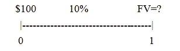

显然，我们的年利息支付将是 $10，即 *100*0.1=10*。因此，总价值将是 *110*，即 *100 + 10*。原始的 $100 是本金。或者，我们有以下结果：

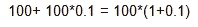

假设 $100 将以相同的 10% 年利率在银行存两年。两年末的未来价值是多少？

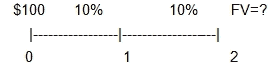

由于在第一年末，我们有 $110，并且应用相同的逻辑，第二年末的未来价值应该是：

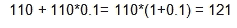

由于 *110 = 100*(1+0.1)*，所以我们有以下表达式：

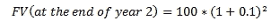

如果 $100 存入银行五年，年利率为 10%，那么五年末的未来价值是多少？根据前述逻辑，我们可以得到以下公式：

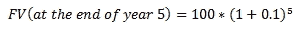

一般化得出我们用来估算给定现值的未来值的第一个公式：

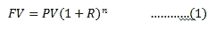

这里，*FV*是未来值，*PV*是现值，*R*是期利率，*n*是期数。在前面的例子中，*R*是年利率，*n*是年数。*R*和*n*的频率应当一致。这意味着，如果*R*是年利率（月利率/季利率/日利率），那么*n*必须是年数（月数/季数/天数）。对应的函数是 SciPy 模块中的`fv()`，可用来估算未来值；请参阅以下代码。若要估算在年末以 10%年利率计算的未来值，代码如下：

```py
>>>import scipy as sp
>>> sp.fv(0.1,2,0,100)
-121.00000000000001
```

对于该函数，输入格式为`sp.fv(rate,nper,pmt,pv=0,when='end')`。目前，暂时忽略最后一个名为 when 的变量。对于*方程式 (1)*，没有 pmt，因此第三个输入应为零。请注意先前结果中的负号。原因在于`scipy.fv()`函数遵循 Excel 符号约定：正的未来值对应负的现值，反之亦然。要了解更多关于此函数的信息，我们可以输入`help(sp.fv)`，查看以下几行内容：

```py
>>> help(sp.fv)
```

`numpy.lib.financial`模块中`fv`函数的帮助文档：

```py
fv(rate, nper, pmt, pv, when='end')
```

计算未来值。

如果我们不小心输入`sp.fv(0.1,2,100,0)`，结果和相应的现金流如下所示：

```py
>>>import scipy as sp
>>> sp.fv(0.1,2,100,0) 
    -210.0000000000002
       >>>
```

本章稍后将展示，`sp.fv(0.1,2,100,0)`对应的是两个相等的 100 美元在第一年和第二年年末发生的现值。从*方程式 (1)*，我们可以轻松推导出第二个公式：

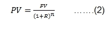

*PV*、*FV*、*R*和*n*的符号与*方程式 (1)*中的符号保持一致。如果我们计划在第五年末得到 234 美元，并且年利率为 1.45%，那么我们今天需要存入多少？应用*方程式 (2)* 手动计算后的结果如下图所示：

```py
>>> 234/(1+0.0145)**5
     217.74871488824184
>>> sp.pv(0.0145,5,0,234)
     -217.74871488824184
```

另外，也可以使用`sp.pv()`函数，参见右侧的结果。要了解更多关于`sp.pv()`函数的信息，我们可以使用`help(sp.pv)`，查看以下输出的一部分：

```py
>>>import scipy as sp
>>> help(sp.pv)
```

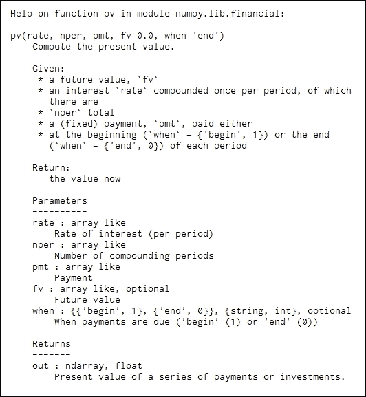

请注意，对于输入变量集的第四个输入变量，`scipy.fv()`和`scipy.pv()`函数的行为不同：`scipy.fv(0.1,1,100)`会给出错误消息，而`scipy.pv(0.1,1,100)`则可以正常工作。原因是`scipy.pv()`函数的第四个输入变量默认值为零，而`scipy.fv()`函数没有第四个输入变量的默认值。这是 Python 编程中的一种不一致之处。

在金融学中，广为人知的是，今天收到的 100 美元比一年后收到的 100 美元更有价值，而一年后收到的 100 美元又比两年后收到的 100 美元更有价值。如果使用不同的大小来表示相对价值，我们将得到以下图形。第一个蓝色圆圈是今天 100 美元的现值，第二个是第一年末 100 美元的现值，依此类推。生成该图像的 Python 程序见*附录 B*：

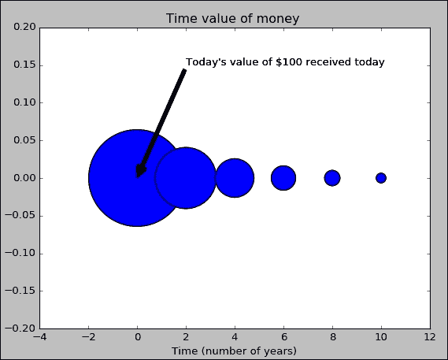

下一个概念是永续年金，它被定义为*相同的恒定现金流，按相同的间隔永远支付*。这里是时间线以及这些恒定现金流：

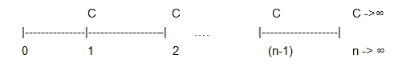

请注意，在前面的例子中，第一个现金流发生在第一个周期结束时。我们可以有其他永续年金，其第一个现金流发生在其他周期的结束。我们先研究这个例子，稍后在本章中，我们会进行一个简单的扩展。当周期贴现率为*R*时，如何计算这种永续年金的现值？

首先，方程式（2）可以应用于每一个未来现金流。因此，所有这些现值的总和将是解：

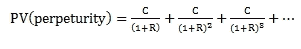

为了简化我们的推导，*永续年金现值（PV）*被替换为*PV*。我们称之为方程式（I）：

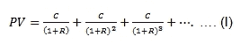

为了推导公式，*方程式（I）*的两边都乘以*1/(1+R)*；见下式。我们称之为*方程式（II）*：

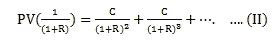

*方程式（I）*减去*方程式（II）*得到下式：

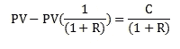

将两边乘以*(1+R)*，我们得到：

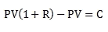

重组前面的结果，最终我们得到了估算永续年金现值的公式：

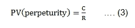

这里有一个例子。约翰计划每年捐赠 3,000 美元给他的母校，用于为即将到来的 MBA 学生举办迎新派对，且每年都会举行。如果年贴现率为 2.5%，且第一次派对将在第一年末举行，那么他今天应该捐赠多少？通过应用前面的公式，答案是 120,000 美元：

```py
>>> 3000/0.025
   120000.0
```

假设第一个现金流为*C*，且随后的现金流享有恒定的增长率 g；见下方时间线和现金流：

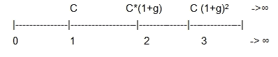

如果贴现率为*R*，那么估算成长型永续年金现值的公式如下：

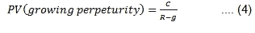

同样，*C*、*R* 和 *g* 的频率应该保持一致，也就是说，它们的频率应该相同。章节末尾有一个问题要求读者证明*方程 (4)*。以约翰的 MBA 欢迎派对捐款为例，每年需要 $3,000 的费用是基于零通货膨胀的。假设年通货膨胀率为 1%，他今天需要捐赠多少钱？每年所需的金额如下所示：

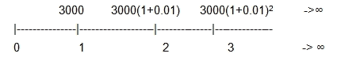

以下结果表明，他今天需要 $200,000：

```py
>>> 3000/(0.025-0.01)
199999.99999999997
```

对于永续年金，如果第一笔现金流发生在第 *k* 期末，我们有以下公式：

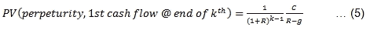

显然，当第一笔现金流发生在第一个时期末时，*方程 (5)* 会简化为*方程 (3)*。年金被定义为*在 n 期内相同时间间隔内的相同现金流*。如果第一笔现金流发生在第一个时期末，则年金的现值通过以下公式估算：

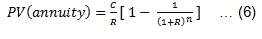

在这里，*C* 是在每个时期末发生的递归现金流，*R* 是期间折现率，*n* 是期数。*方程 (5)* 比其他方程要复杂。然而，稍加想象，*方程 (6)* 可以通过结合*方程 (2)* 和 (3) 推导出来；有关更多细节，请参见*附录 C*。

要估算年金的未来价值，我们有以下公式：

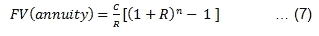

从概念上讲，我们可以将*方程 (7)* 看作是*方程 (6)* 和 (1) 的组合。在之前与永续年金或年金相关的公式中，假设所有现金流都发生在期末。对于年金或永续年金，当现金流发生在每个时间段的开始时，它们被称为期初年金或期初永续年金。计算其现值有三种方法。

对于第一种方法，`scipy.pv()` 或 `numpy.lib.financial.pv()` 中的最后一个输入值将取值为 1。

假设折现率为每年 1%。接下来的 10 年每年现金流为 $20。第一笔现金流今天支付。这些现金流的现值是多少？结果如下所示：

```py
>>>import numpy.lib.financial as fin
>>> fin.pv(0.01,10,20,0,1)
-191.32035152017377
```

请注意，`numpy.lib.financial.pv()` 函数的输入格式为 `rate`、`nper`、`pmt`、`fv` 和 `when`。最后一个变量 `when` 的默认值为零，即发生在期末。当 `when` 取值为 1 时，表示为期初年金。

对于第二种方法，以下公式可以应用：

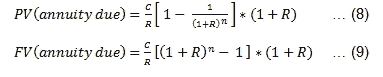

这里是方法：将期初年金视为普通年金，然后将结果乘以 *(1+R)*。应用如下所示：

```py
>>>import numpy.lib.financial as fin
>>> fin.pv(0.01,10,20,0)*(1+0.01)
-191.3203515201738
```

对于第三种方法，我们使用名为 `fincal.pvAnnuityDue()` 的函数，该函数包含在用 Python 编写的财务计算器 `fincal` 包中；请参见以下结果：

```py
>>> import fincal
>>> fincal.pvAnnuityDue(0.01,10,20)
191.32035152017383
```

有关如何下载 `fincal` 模块，请参见 *附录 D - 如何下载一个用 Python 编写的免费财务计算器*。要获取有关此函数的更多信息，可以使用 `help()` 函数；请参见以下代码：

```py
>>>import fincal
>>>help(fincal.pvAnnuityDue)
Help on function pvAnnuityDue in module __main__:

pvAnnuityDue(r, n, c)
     Objective : estimate present value of annuity due
          r    : period rate 
          n    : number of periods    
          c    : constant cash flow 
```

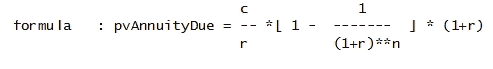

```py
Example 1: >>>pvAnnuityDue(0.1,10,20)
                     135.1804763255031

    Example #2:>>> pvAnnuityDue(c=20,n=10,r=0.1)
                     135.1804763255031
>>>
```

有关名为 `fincal` 的财务计算器的更多详细信息，请参见下一节。如果现金流将以 *g* 的固定速度增长，我们有以下增长年金的公式：

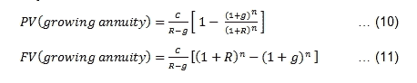

这些函数在 SciPy 或 `numpy.lib.financial` 中没有对应的函数。幸运的是，我们有一个名为 `fincal` 的财务计算器，它包含了 `pvGrowingAnnuity()` 和 `fvGrowingAnnuity()` 函数；有关更多详细信息，请参见以下代码：

```py
>>> import fincal
>>> fincal.pvGrowingAnnuity(0.1,10,20,0.03)
137.67487382555464
>>>
```

要获取有关此函数的更多信息，请输入 `help(fincal.pvGrowingAnnuity)`；请参见以下代码：

```py
>>> import fincal
>>> help(fincal.pvGrowingAnnuity)
Help on function pvGrowingAnnuity in module fincal:
pvGrowingAnnuity(r, n, c, g)
     Objective: estimate present value of a growting annuity    
         r    : period discount rate
         n    : number of periods 
         c    : period payment
         g    : period growth rate  (g<r)
```

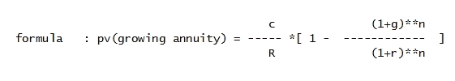

```py
Example #1 >>>pvGrowingAnnuity(0.1,30,10000,0.05)
                    150463.14700582038

    Example #2: >>> pvGrowingAnnuity(g=0.05,r=0.1,c=10000,n=30)
                      150463.14700582038
>> >
```

# 用 Python 编写财务计算器

在讨论货币时间价值的各种概念时，学习者需要一个财务计算器或 Excel 来解决各种相关问题。

从前面的示例可以看出，像 `scipy.pv()` 这样的多个函数可以用来估算一个未来现金流的现值或年金现值。实际上，SciPy 模块中与财务相关的函数来自 `numpy.lib.financial` 子模块：

```py
>>> import numpy.lib.financial as fin
>>> dir(fin)
['__all__', '__builtins__', '__cached__', '__doc__', '__file__', '__loader__', '__name__', '__package__', '__spec__', '_convert_when', '_g_div_gp', '_rbl', '_when_to_num', 'absolute_import', 'division', 'fv', 'ipmt', 'irr', 'mirr', 'np', 'nper', 'npv', 'pmt', 'ppmt', 'print_function', 'pv', 'rate']
>>>
Below are a few examples, below. 
>>>import numpy.lib.financial as fin
>>> fin.pv(0.1,3,0,100)      # pv of one future cash flow
-75.131480090157751
>>> fin.pv(0.1,5,100)        # pv of annuity
-379.07867694084507
>>> fin.pv(0.1,3,100,100)    # pv of annuity plus pv of one fv
-323.81667918858022
>>>
```

首先，我们导入与各种财务函数相关的两个模块。

```py
>>>import scipy as sp
>>>import numpy.lib.financial as fin
```

下表总结了这些函数：

| 函数 | 输入格式 |
| --- | --- |
| `sp.fv()` | `fin.fv()` | `fv(rate, nper, pmt, pv, when='end')` |
| `sp.pv()` | `fin.pv()` | `pv(rate, nper, pmt, fv=0.0, when='end')` |
| `sp.pmt()` | `fin.pmt()` | `pmt(rate, nper, pv, fv=0, when='end')` |
| `sp.npv()` | `fin.npv()` | `npv(rate, values)` |
| `sp.rate()` | `fin.rate()` | `rate(nper, pmt, pv, fv, when='end', guess=0.1, tol=1e-06, maxiter=100)` |
| `sp.nper()` | `fin.nper()` | `nper(rate, pmt, pv, fv=0, when='end')` |
| `sp.irr()` | `fin.irr()` | `irr(values)` |
| `sp.mirr()` | `fin.mirr()` | `mirr(values, finance_rate, reinvest_rate)` |
| `sp.ipmt()` | `fin.ipmt()` | `ipmt(rate, per, nper, pv, fv=0.0, when='end')` |
| `sp.ppmt()` | `fin.ppmt()` | `ppmt(rate, per, nper, pv, fv=0.0, when='end')` |

> 表 3.1 Scipy 和 numpy.lib.financial 中包含的函数列表

另一个财务计算器是由本书作者编写的。*附录 B* 显示了如何下载它。以下是函数列表：

```py
>>> import fincal
>>> dir(fincal)
 ['CND', 'EBITDA_value', 'IRR_f', 'IRRs_f', 'NPER', 'PMT', 'Rc_f', 'Rm_f', '__builtins__', '__cached__', '__doc__', '__file__', '__loader__', '__name__', '__package__', '__request', '__spec__', 'bondPrice', 'bsCall', 'convert_B_M', 'duration', 'exp', 'fincalHelp', 'fvAnnuity', 'fv_f', 'get_200day_moving_avg', 'get_50day_moving_avg', 'get_52week_high', 'get_52week_low', 'get_EBITDA', 'get_all', 'get_avg_daily_volume', 'get_book_value', 'get_change', 'get_dividend_per_share', 'get_dividend_yield', 'get_earnings_per_share', 'get_historical_prices', 'get_market_cap', 'get_price', 'get_price_book_ratio', 'get_price_earnings_growth_ratio', 'get_price_earnings_ratio', 'get_price_sales_ratio', 'get_short_ratio', 'get_stock_exchange', 'get_volume', 'log', 'market_cap', 'mean', 'modified_duration', 'n_annuity', 'npv_f', 'payback_', 'payback_period', 'pi', 'pvAnnuity', 'pvAnnuityDue', 'pvAnnuity_k_period_from_today', 'pvGrowingAnnuity', 'pvGrowingPerpetuity', 'pvPerpetuity', 'pvPerpetuityDue', 'pv_excel', 'pv_f', 'r_continuous', 're', 'sign', 'sqrt', 'urllib']
```

使用这个财务计算器有几个优点，相比于 SciPy 模块和`numpy.lib.financial`子模块中包含的函数。首先，对于三种现值，`pv(单笔现金流)`、`pv(年金)`和`pv(年金到期)`，分别有三个对应的函数，分别是`pv_f()`、`pvAnnuity()`和`pvAnnuityDue()`。因此，对于一个对金融知识了解较少的新学习者来说，他/她更不容易产生困惑。其次，对于每个函数，如单笔未来现金流的现值，输出与典型教材中显示的公式完全一致；请参见以下公式：

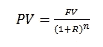

换句话说，没有 Excel 的符号约定。对于*fv=100*、*r=0.1*和*n=1*，根据之前的公式，我们应该得到一个 90.91 的值。通过以下代码，我们展示了没有符号约定和有符号约定的结果：

```py
>>>import fincal 
>>> fincal.pv_f(0.1,1100)
90.9090909090909
>>> import scipy as sp
>>> sp.pv(0.1,1,0,100)
    -90.909090909090907
```

第三，对于`fincal`中的每个函数，我们可以找出使用的公式，并附上一些示例：

```py
>>>import fincal
>>> help(fincal.pv_f)
Help on function pv_f in module __main__:

pv_f(r, n, fv)
    Objective: estimate present value
           r : period rate
           n : number of periods
          fv : future value
```

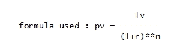

```py
Example 1: >>>pv_f(0.1,1,100)        # meanings of input variables 
                 90.9090909090909        # based on their input order

    Example #2 >>>pv_f(r=0.1,fv=100,n=1) # meanings based on keywords
                 90.9090909090909
>>>
```

最后但同样重要的是，新的学习者可以自己编写财务计算器！更多细节，请参见《*用 Python 编写你自己的财务计算器*》章节和*附录 H*。

从前面的讨论中，我们知道，对于年金的现值，可以使用以下公式：

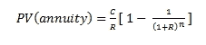

在上述公式中，我们有四个变量：*pv*、*c*、*R*和*n*。为了估算现值，我们给定了*c*、*R*和*n*。实际上，对于任何一组三个值，我们都可以估算出第四个值。让我们使用 SciPy 和 NumPy 中相同的符号：

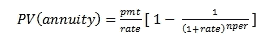

四个对应的函数是：`sp.pv()`、`sp.pmt()`、`sp.rate()`和`sp.nper()`。这是一个例子。约翰计划购买一辆二手车，价格为 $5,000。假设他将支付 $1,000 作为首付，其余部分借款。车贷的年利率为 1.9%，按月复利计算。如果他打算在三年内偿还贷款，那么他的月供是多少？我们可以手动计算月供；请参见以下代码：

```py
>>> r=0.019/12
>>> pv=4000
>>> n=3*12
>>> pv*r/(1-1/(1+r)**n)
114.39577546409993
```

由于年利率是按月复利计算的，实际月利率为 0.019/12。在第五章《债券与股票估值》中，将更详细地讨论如何转换不同的有效利率。根据之前的结果，约翰的月供为 $114.40。或者，我们可以使用`scipy.pmt()`函数；请参见以下代码：

```py
>>import scipy as sp
>>> sp.pmt(0.019/12,3*12,4000)
-114.39577546409993
```

类似地，对于前面公式中的利率，可以使用`scipy.rate()`和`numpy.lib.rate()`函数。这里是一个例子。某公司计划为其 CEO 租赁一辆豪华轿车。如果接下来的三年每月付款$2,000，且汽车的现值为$50,000，隐含的年利率是多少？

```py
>>>import scipy as sp
>>>r=sp.rate(3*12,2000,-50000,0)   # monthly effective rate
>>>r
  0.021211141641636025
>>> r*12
  0.2545336996996323               # annual percentage rate
```

月有效利率为 2.12%，年利率为 25.45%。

按照相同的逻辑，对于前面公式中的`nper`，可以使用`scipy.nper()`和`numpy.lib.financial.nper()`函数。

这里是一个例子。Peter 借了$5,000 来支付获得 Python 证书的费用。如果月利率为 0.25%，他计划每月偿还$200，他需要多少个月才能偿还贷款？

```py
>>>import scipy as sp
>>> sp.nper(0.012,200,-5000,0)
29.900894915842475
```

基于前面的结果，他大约需要 30 个月才能偿还全部贷款。在前面的两个例子中，未来价值为零。按照相同的逻辑，对于未来价值年金，我们有以下公式：

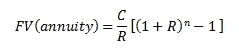

如果使用与 SciPy 和`numpy.lib.financial`相同的符号，我们得到以下公式：

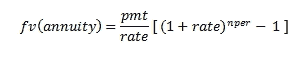

`scipy.pmt()`、`scipy.rate()`、`scipy.nper()`、`numy.lib.financial.pmt()`、`numpy.lib.financial.rate()`和`numpy.lib.financial.nper()`函数可以用来估算这些值。我们将在*Scipy 和`numpy.lib.financial`中的常用公式*部分进一步讨论这些公式。

# 净现值和 NPV 规则的定义

**净现值**（**NPV**）由以下公式定义：

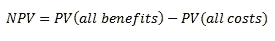

这里是一个例子。初始投资为$100。接下来五年的现金流入分别是$50、$60、$70、$100 和$20，从第一年开始。如果折现率为 11.2%，该项目的 NPV 值是多少？由于只有六个现金流，我们可以手动计算：

```py
>>> r=0.112
>>> -100+50/(1+r)+60/(1+r)**2+70/(1+r)**3+100/(1+r)**4+20/(1+r)**5
121.55722687966407
Using the scipy.npv() function, the estimation process could be simplified dramatically:
>>> import scipy as sp
>>> cashflows=[-100,50,60,70,100,20]
>>> sp.npv(0.112,cashflows)
121.55722687966407
```

根据前面的结果，该项目的 NPV 为$121.56。正常项目定义如下：*首先是现金流出，其次是现金流入*。任何其他情况都是不正常项目。对于正常项目，其 NPV 与折现率呈负相关；见下图。原因是当折现率上升时，未来现金流（大多数情况下是收益）的现值会比当前或最早的现金流（大多数情况下是成本）减少得更多。NPV 曲线描述了 NPV 与折现率之间的关系，见下图。有关生成图表的 Python 程序，请参阅*附录 E*。*y*轴为 NPV，*x*轴为折现率：

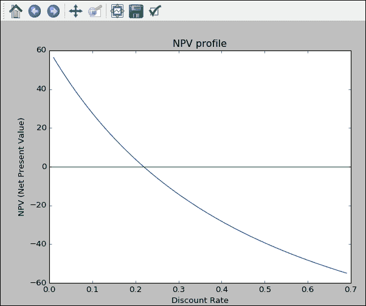

为了估算一个项目的净现值（NPV），我们可以调用`npv()`函数，该函数包含在 SciPy 或`numpy.lib.financial`库中；请参阅以下代码：

```py
>>>import scipy as sp
>>>cashflows=[-100,50,60,70]
>>>rate=0.1
>>>npv=sp.npv(rate,cashflows)
>>>round(npv,2)
47.62
```

`scipy.npv()` 函数估算给定现金流集的现值。第一个输入变量是折现率，第二个输入是现金流数组。注意，这个现金流数组中的第一个现金流发生在时间零。这个 `scipy.npv()` 函数不同于 Excel 的 NPV 函数，后者并不是一个真正的 NPV 函数。实际上，Excel 的 NPV 是一个 PV 函数。它通过假设第一个现金流发生在第一个期间结束时，来估算未来现金流的现值。使用 Excel `npv()` 函数的示例如下：

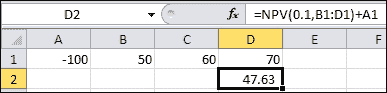

在仅使用一个未来现金流时，`scipy.npv()` 函数的意义通过以下代码行变得更加清晰：

```py
>>>c=[100]
>>>x=np.npv(0.1,c)
>>>round(x,2)
>>>100.0
```

相关的 Excel 函数及其输出如图所示：

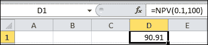

对于只有一个未来现金流，基于 Excel 的 `npv()` 函数的结果如前图所示。对于 `numpy.lib.financial.npv()` 函数，唯一的现金流 $100 会发生在今天，而对于 Excel 的 `npv()` 函数，唯一的现金流 $100 会发生在一个期间后。因此，*100/(1+0.1)* 得出 90.91。

NPV 规则如下：

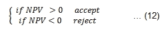

# IRR 和 IRR 规则的定义

**内部收益率**（**IRR**）被定义为使 NPV 等于零的折现率。假设我们今天投资 $100，未来四年的现金流分别为 $30、$40、$40 和 $50。假设所有现金流都发生在年底，那么该投资的 IRR 是多少？在以下程序中，应用了 `scipy.irr()` 函数：

```py
>>>import scipy as sp
>>> cashflows=[-100,30,40,40,50]
>>> sp.irr(cashflows)
       0.2001879105140867
```

我们可以验证这样的利率是否使 NPV 等于零。由于 NPV 为零，20.02% 确实是一个 IRR：

```py
>>> r=sp.irr(cashflows)
>>> sp.npv(r,cashflows)
    1.7763568394002505e-14
>>>
```

对于一个正常项目，IRR 规则如下：

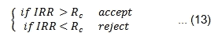

这里，*Rc* 是资本成本。这个 IRR 规则仅适用于正常项目。我们来看下面的投资机会。今天的初始投资是 $100，明年的投资是 $50。未来五年的现金流入分别为 $50、$70、$100、$90 和 $20。如果资本成本是 10%，我们应该接受这个项目吗？时间线及相应的现金流如下：

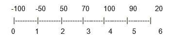

这里给出了 Python 代码：

```py
>>>import scipy as sp
>>> cashflows=[-100,-50,50,70,100,90,20] 
>>> sp.irr(cashflows)
0.25949919326073245
```

由于 IRR 为 25.9%，高于 10% 的资本成本，我们应该根据 IRR 规则接受该项目。在前面的例子中，这是一个正常项目。对于不正常项目或具有多个 IRR 的项目，我们不能应用 IRR 规则。当现金流方向发生超过一次变化时，我们可能会有多个 IRR。假设我们的现金流为 `504`，-`432`，-`432`，-`432` 和 `843`，从今天开始：

```py
>>>import scipy as sp
>>> cashflows=[504, -432,-432, -432,843]
>>> sp.irr(cashflows)
    0.14277225152187745
```

相关图表如图所示：

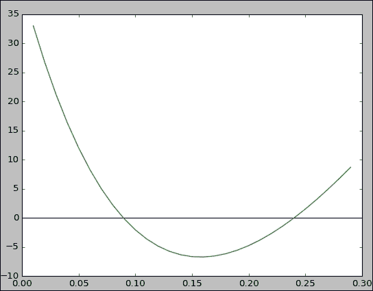

由于我们的现金流方向发生了两次变化，该项目可能会有两个不同的 IRR。前述右侧的图像显示了这是这种情况。对于 Python 程序绘制前述的 NPV 曲线，参见*附录 F*。使用`spicy.npv()`函数，我们只得到了一个 IRR。从`fincal.IRRs_f()`函数中，我们可以得到两个 IRR；请参见以下代码：

```py
>>>import fincal
>>> cashflows=[504, -432,-432, -432,843]
>>> fincal.IRRs_f(cashflows)
 [0.143, 0.192]
```

# 回收期和回收期规则的定义

回收期定义为收回初始投资所需的年数。假设初始投资为$100。如果每年公司能够回收$30，那么回收期为 3.3 年：

```py
>>import fincal
>>>cashflows=[-100,30,30,30,30,30]
>>> fincal.payback_period(cashflows)
    3.3333333333333335
```

回收期规则的决策规则如下所示：

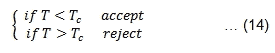

在这里，*T*是项目的回收期，而*Tc*是收回初始投资所需的最大年数。因此，如果*Tc*是四年，那么回收期为 3.3 年的前述项目应该被接受。

回收期规则的主要优点是其简单性。然而，这种规则也存在许多缺点。首先，它没有考虑货币的时间价值。在前面的案例中，第一年末收到的$30 与今天收到的$30 是一样的。其次，回收期之后的任何现金流都被忽略了。这种偏差不利于具有较长未来现金流的项目。最后但同样重要的是，没有理论基础来定义一个好的*Tc*截止点。换句话说，没有合理的理由来解释为什么四年的截止点比五年更好。

# 用 Python 编写你自己的财务计算器

当一个新的 Python 学习者能够编写自己的财务计算器时，这可以视为一个巨大的成就。做到这一点的基本知识包括以下内容：

+   如何编写一个函数的知识

+   相关的财务公式是什么？

对于后者，我们已经从前面的章节中学到了一些内容，比如计算单一未来现金流现值的公式。现在我们来写一个最简单的 Python 函数来对输入值进行加倍：

```py
def dd(x):
    return 2*x
```

这里，`def`是编写函数的关键字，`dd`是函数名，括号中的`x`是输入变量。对于 Python，缩进是至关重要的。前面的缩进表示第二行是`dd`函数的一部分。调用这个函数与调用其他内建的 Python 函数相同：

```py
>>>dd(5)
 10
>>>dd(3.42)
 6.84
```

现在，让我们编写最简单的财务计算器。首先，启动 Python 并使用其编辑器输入以下代码：

```py
def pvFunction(fv,r,n):
    return fv/(1+r)**n
def pvPerpetuity(c,r):
    return c/r
def pvPerpetuityDue(c,r):
    return c/r*(1+r)
```

为了简单起见，前述三个函数中的每个函数只有两行代码。在通过运行整个程序激活这些函数后，可以使用`dir()`函数来显示它们的存在：

```py
>>> dir()
['__builtins__', '__doc__', '__loader__', '__name__', '__package__', '__spec__', 'pvFunction', 'pvPerpetuity','pvPerpetuityDue']
>>>
```

调用这个自生成的财务计算器是微不足道的；请参见以下代码：

```py
>>> pvFunction(100,0.1,1)
90.9090909090909
>>> pvFunction(n=1,r=0.1,fv=100)
90.9090909090909
>>> pvFunction(n=1,fv=100,r=0.1)
90.9090909090909
>>>
```

同样，在输入值时，可以使用两种方法：输入变量的含义取决于它们的顺序，见第一次调用；或者使用关键字，见最后两个示例。

编写个人财务计算器的一种更优雅的方法见于*附录 G*。

# 多个函数的两个通用公式

这一节是可选的，因为在数学表达式上比较复杂。跳过这一节不会影响对其他章节的理解。因此，这一节适合进阶学习者。目前为止，在本章中，我们已经学习了 SciPy 模块或 `numpy.lib.financial` 子模块中包含的几个函数的使用方法，如 `pv()`、`fv()`、`nper()`、`pmt()` 和 `rate()`。第一个通用公式与现值有关：

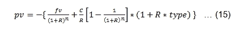

在前述公式的右侧，第一个部分是单个未来现金流的现值，而第二部分是年金的现值。变量*type*的值为零（默认值）；它表示普通年金的现值，而如果*type*的值为 1，则表示到期年金。负号用于符号约定。如果使用与 SciPy 和 `numpy.lib.financial` 中函数相同的符号，我们有以下公式：

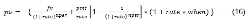

这里有几个使用公式（14）和 `pv()` 函数（来自 SciPy）示例。James 打算今天投资 *x* 美元，投资期限为 10 年。他的年回报率是 5%。在接下来的 10 年里，他将在每年年初提取 5,000 美元。此外，他希望在投资期满时能有 7,000 美元。今天他必须投资多少，即 *x* 的值是多少？通过手动应用前述公式，我们得到了以下结果。请注意负号：

```py
>>> -(7000/(1+0.05)**10 + 5000/0.05*(1-1/(1+0.05)**10)*(1+0.05))
-44836.501153005614 
```

结果与调用 `scipy.pv()` 函数时相同；见以下代码：

```py
>>> import scipy as sp
>>> sp.pv(0.05,10,5000,7000,1)
-44836.5011530056
```

为了将普通年金与到期年金分开，我们有以下两个公式。对于普通年金，我们有以下公式：

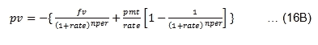

对于到期年金，我们有以下公式：

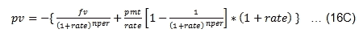

类似地，对于未来值，我们有以下通用公式：

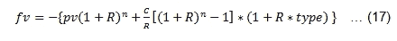

如果使用与 SciPy 和 `numpy.lib.financial` 中相同的符号，我们有以下公式：

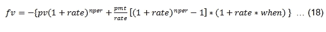

类似地，我们可以将年金与到期年金分开。对于普通年金，我们有以下公式：

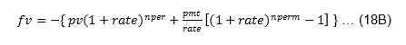

对于到期年金，我们有以下公式：

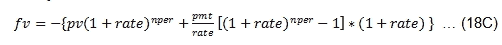

在以下方程中，**现值**（**pv**）出现了两次。然而，它们的含义大不相同。同样，未来值也出现了两次，且含义不同：


让我们用一个简单的例子来解释这两个方程之间的联系。首先，通过去掉符号约定来简化我们的函数，并假设是普通年金，即不考虑期初年金：


实际上，我们将有三个*pv*（现值）和三个*fv*（未来值）。我们投资$100，投资期为三年。此外，在接下来的三年里，每年年底我们再投资$20。如果年回报率为 4%，那么我们的投资的未来值是多少？


显然，我们可以应用最后一个方程来得出我们的答案：

```py
>>> 100*(1+0.04)**3+20/0.04*((1+0.04)**3-1)
     174.91840000000005
>>> import scipy as sp
>>> sp.fv(0.04,3,20,100)
     -174.91840000000005
```

实际上，我们有三个未来值。我们将它们称为**FV(total)**、**FV( annuity)** 和 **FV(one PV)**。它们之间的关系如下：


以下代码展示了如何计算年金的未来值和一个现值的未来值：

```py
>>> fv_annuity=20/0.04*((1+0.04)**3-1)
>>> fv_annuity
62.432000000000045
>>>fv_one_PV=100*(1+0.04)**3
>>> fv_one_PV
112.4864
```

总未来值是这两个未来值的总和：*62.4320+ 112.4864=174.92*。现在，让我们看看如何得到三个对应的现值。我们将它们称为**PV(total)**、**PV( annuity)** 和 **PV(one PV)**。它们之间的关系如下：


我们使用之前展示的相同现金流。显然，第一个$100 本身就是现值。三个$20 的现值可以手动计算；请参见以下代码：

```py
>>>20/0.04*(1-1/(1+0.04)**3)
55.501820664542564
```

因此，总现值将是*100 + 55.51=155.51*。另外，我们可以应用 `scipy.pv()` 来估算年金的现值；请参见以下代码：

```py
>>>import scipy as sp
>>> sp.pv(0.04,3,20)
   -55.501820664542592
>>>import fincal
>>> fincal.pvAnnuity(0.04,3,20)
    55.501820664542564
```

总未来值（`174.92`）和总现值（`155.51`）之间的关系如下：

```py
>>>174.92/(1+0.04)**3
155.5032430587164
```

总结一下，当调用 `scipy.pv()` 和 `scipy.fv()` 函数时，`scipy.pv()` 函数中的 `fv` 含义与 `scipy.fv()` 函数中的最终值是不同的。读者需要理解总未来值、一个现值的未来值和年金的未来值之间的区别。这对于 `scipy.fv()` 函数中的 `pv` 变量和调用 `scipy.pv()` 函数后的最终结果也适用。

## 附录 A – Python、NumPy 和 SciPy 的安装

通过 Anaconda 安装 Python，我们需要以下步骤：

1.  访问[`continuum.io/downloads`](http://continuum.io/downloads)。

1.  找到合适的软件包；请参见以下截图：

对于 Python，不同版本并存。从前面的截图中，我们可以看到存在 **3.5** 和 **2.7** 两个版本。对于本书来说，版本并不是那么关键。旧版本问题较少，而新版本通常有新的改进。在通过 Anaconda 安装 Python 后，NumPy 和 SciPy 将同时安装。启动 Python 并通过 Spyder 发出以下两行命令。如果没有错误，说明这两个模块已预安装：

```py
>>> import numpy as np
>>> import scipy as sp
```

另一种方法是直接安装 Python。

访问 [`www.python.org/download`](http://www.python.org/download)。根据你的计算机，选择合适的安装包，例如 Python 3.5.2 版本。关于安装模块，请查阅 Python 文档。以下命令将从**Python 包索引**（**PIP**）安装模块及其依赖项的最新版本：

```py
python -m pip install SomePackage

```

对于 POSIX 用户（包括 Mac OS X 和 Linux 用户），本指南中的示例假定使用虚拟环境。要安装特定版本，请参见以下代码：

```py
python -m pip install SomePackage==1.0.4    # specific version
python -m pip install "SomePackage>=1.0.4"  # minimum version

```

通常，如果已经安装了适当的模块，再次尝试安装它不会有任何效果。升级现有模块必须明确请求：

```py
python -m pip install --upgrade SomePackage

```

## 附录 B – 时间价值的直观展示

如果读者在理解以下代码时有困难，可以忽略这一部分。在金融学中，我们知道今天收到的 $100 比一年后收到的 $100 更有价值。如果我们用大小来表示差异，我们可以通过以下 Python 程序来表示相同的概念：

```py
from matplotlib.pyplot import *
fig1 = figure(facecolor='white')
ax1 = axes(frameon=False)
ax1.set_frame_on(False)
ax1.get_xaxis().tick_bottom()
ax1.axes.get_yaxis().set_visible(False)
x=range(0,11,2)	
x1=range(len(x),0,-1)
y = [0]*len(x);
name="Today's value of $100 received today"
annotate(name,xy=(0,0),xytext=(2,0.001),arrowprops=dict(facecolor='black',shrink=0.02))
s = [50*2.5**n for n in x1];
title("Time value of money ")
xlabel("Time (number of years)")
scatter(x,y,s=s);
show()
```

这里显示了图表。第一个蓝色圆圈是现值，而第二个是同样 $100 在第二年末的现值：


## 附录 C – 从未来现金流的现值和永久年金的现值推导年金现值

首先，我们有以下两个公式：


这里，*FV* 是未来值，*R* 是折现期利率，*n* 是期数，*C* 是在每个期末发生的相同现金流，第一个现金流发生在第一期末。

年金被定义为*一组未来发生的等值现金流*。如果第一个现金流发生在第一期末，则年金的现值由以下公式给出：


这里，*C*是每期末发生的递归现金流，*R*是期的折现率，*n*是期数。*方程（3）*相当复杂。然而，稍加想象，我们可以通过将方程（1）和（2）结合，推导出方程（3）。这可以通过将年金分解为两个永续年金来完成：


这相当于以下两个永续年金：


从概念上讲，我们可以这样考虑：玛丽将在未来 10 年内每年收到 20 美元。这相当于两个永续年金：她将永远每年收到 20 美元，并且从第 11 年开始，每年支付 20 美元。因此，她的年金现值将是第一个永续年金的现值减去第二个永续年金的现值：


如果相同的现金流在相同的时间间隔内永远发生，则称为永续年金。如果折现率是恒定的，并且第一笔现金流发生在第一个周期结束时，则其现值如下所示。

## 附录 D – 如何下载免费财务计算器

可执行文件位于[`canisius.edu/~yany/fincal.pyc`](http://canisius.edu/~yany/fincal.pyc)。假设它保存在`c:/temp/`中。更改你的路径；请参见以下截图：


这是一个例子：

```py
>>>import fincal 
>>> fincal.pv_f(0.1,1,100)
90.9090909090909
```

要找出所有包含的函数，可以使用`dir()`函数；请参见以下代码：

```py
>>> import fincal
>>> dir(fincal)
['CND', 'EBITDA_value', 'IRR_f', 'IRRs_f', 'NPER', 'PMT', 'Rc_f', 'Rm_f', '__builtins__', '__cached__', '__doc__', '__file__', '__loader__', '__name__', '__package__', '__request', '__spec__', 'bondPrice', 'bsCall', 'convert_B_M', 'duration', 'exp', 'fincalHelp', 'fvAnnuity', 'fvAnnuityDue', 'fv_f', 'get_200day_moving_avg', 'get_50day_moving_avg', 'get_52week_high', 'get_52week_low', 'get_EBITDA', 'get_all', 'get_avg_daily_volume', 'get_book_value', 'get_change', 'get_dividend_per_share', 'get_dividend_yield', 'get_earnings_per_share', 'get_historical_prices', 'get_market_cap', 'get_price', 'get_price_book_ratio', 'get_price_earnings_growth_ratio', 'get_price_earnings_ratio', 'get_price_sales_ratio', 'get_short_ratio', 'get_stock_exchange', 'get_volume', 'log', 'market_cap', 'mean', 'modified_duration', 'n_annuity', 'npv_f', 'payback_', 'payback_period', 'pi', 'pvAnnuity', 'pvAnnuityDue', 'pvAnnuity_k_period_from_today', 'pvGrowingAnnuity', 'pvGrowingPerpetuity', 'pvPerpetuity', 'pvPerpetuityDue', 'pv_excel', 'pv_f', 'r_continuous', 're', 'sign', 'sqrt', 'urllib']
```

要了解每个函数的用途，可以使用`help()`函数：

```py
>>> help(fincal.pv_f)
Help on function pv_f in module fincal:
pv_f(r, n, fv)
    Objective: estimate present value
           r : period rate
           n : number of periods
          fv : future value
```


```py
Example 1: >>>pv_f(0.1,1,100)        # meanings of input variables 
                 90.9090909090909        # based on their input order

    Example #2 >>>pv_f(r=0.1,fv=100,n=1) # meanings based on keywords
                 90.9090909090909
>> >
```

## 附录 E – NPV 与 R 关系的图形表示

NPV 曲线是项目的净现值与其折现率（资本成本）之间的关系。对于正常项目（即现金流先为支出后为收入），其净现值将是折现率的递减函数；请参见以下代码：

```py
import scipy as sp
from matplotlib.pyplot import *
cashflows=[-120,50,60,70]
rate=[]
npv =[]
for i in range(1,70):
    rate.append(0.01*i)
    npv.append(sp.npv(0.01*i,cashflows))

plot(rate,npv)
show()
```

相关图表如下所示：


为了使我们的图表更好，我们可以添加标题、标签以及一条水平线；请参见以下代码：

```py
import scipy as sp
from matplotlib.pyplot import *
cashflows=[-120,50,60,70]
rate=[]
npv=[]
x=(0,0.7)
y=(0,0)
for i in range(1,70):
    rate.append(0.01*i)
    npv.append(sp.npv(0.01*i,cashflows))

title("NPV profile")
xlabel("Discount Rate")
ylabel("NPV (Net Present Value)")
plot(rate,npv)
plot(x,y)
show()
```

输出如下所示：


## 附录 F – 带有两个 IRR 的净现值（NPV）曲线图

由于现金流的方向发生了两次变化，我们可能会有两个内部收益率（IRR）：

```py
import scipy as sp
import matplotlib.pyplot as plt
cashflows=[504,-432,-432,-432,832]
rate=[]
npv=[]
x=[0,0.3]
y=[0,0]
for i in range(1,30): 
    rate.append(0.01*i)
    npv.append(sp.npv(0.01*i,cashflows))

plt.plot(x,y),plt.plot(rate,npv)
plt.show()
```

相应的图表如下所示：


## 附录 G – 用 Python 编写你自己的财务计算器

现在，让我们编写我们最简单的财务计算器。首先，启动 Python 并使用编辑器输入以下代码。为简单起见，每个前面 10 个函数的函数体只有两行。再次强调，正确的缩进非常重要。因此，每个函数的第二行应该有缩进：

```py
def pvFunction(fv,r,n):
    return fv/(1+r)**n
def pvPerpetuity(c,r):
    return c/r
def pvPerpetuityDue(c,r):
    return c/r*(1+r)
def pvAnnuity(c,r,n):
    return c/r*(1-1/(1+r)**n)
def pvAnnuityDue(c,r,n):
    return c/r*(1-1/(1+r)**n)*(1+r)
def pvGrowingAnnuity(c,r,n,g):
    return c/(r-g)*(1-(1+g)**n/(1+r)**n)
def fvFunction(pv,r,n):
    return pv*(1+r)**n
def fvAnnuity(cv,r,n):
    return c/r*((1+r)**n-1)
def fvAnnuityDue(cv,r,n):
    return c/r*((1+r)**n-1)*(1+r)
def fvGrowingAnnuity(cv,r,n):
    return c/(r-g)*((1+r)**n-(1+g)*n)
```

假设前面的程序名为`myCalculator`。

以下程序将生成一个可执行文件，名为`myCalculator.cpython-35.pyc`：

```py
>>> import py_compile
>>> py_compile.compile('myCalculator.py')
'__pycache__\\myCalculator.cpython-35.pyc'
>>> __pycache__
py_compile.compile('c:/temp/myCalculator.py')
```

# 习题

1.  如果年折现率为 2.5%，那么 10 年后收到 206 美元的现值是多少？

1.  永续年金的未来价值是多少，如果年付款为 1 美元，年折现率为 2.4%？

1.  对于一个普通项目，其净现值（NPV）与折现率负相关，为什么？

1.  约翰在银行存入 5,000 美元，存期 25 年。如果年利率为每年 0.25%，未来值是多少？

1.  如果年付款为 55 美元，剩余期限为 20 年，年折现率为 5.41%，按半年复利计算，现值是多少？

1.  如果玛丽计划在第 5 年末拥有 2,400 美元，她每年需要存多少钱，如果对应的年利率为 3.12%？

1.  为什么在以下代码中我们得到了负的期数？

    ```py
    >>>import scipy as sp
    >>> sp.nper(0.012,200,5000,0)
    -21.99461003591637
    ```

1.  如果一家公司每股收益从 2 美元增长到 4 美元，增长周期为 9 年（总增长为 100%），其年增长率是多少？

1.  在本章中，在编写现值函数时，我们使用了`pv_f()`。为什么不使用`pv()`，它和以下公式一样呢？！习题

    这里，*PV* 是现值，*FV* 是未来值，*R* 是周期折现率，*n* 是期数。

1.  一个项目在第一年和第二年分别产生 5,000 美元和 8,000 美元的现金流入。初期投资为 3,000 美元。第一年和第二年的折现率分别为 10%和 12%。该项目的净现值（NPV）是多少？

1.  A 公司将发行年票息为 80 美元，面值为 1,000 美元的新债券。利息支付为半年付，债券将在 2 年后到期。第一年的现货利率为 10%。第一年末，1 年期现货利率预计为 12%：

    +   债券的现值是多少？

    +   如果你愿意在第二年末接受一次性支付的金额是多少？

1.  彼得的富有叔叔承诺如果他在四年内完成大学学业，将支付他 4,000 美元。理查德刚刚完成了非常艰难的二年级（大二），包括修读几门金融课程。理查德非常希望能够享受一个长假。适当的折现率为 10%，半年复利。彼得如果现在去度假，将放弃什么价值？

1.  今天，您有 5000 美元可供投资，投资期限为 25 年。您被提供一个投资计划，未来 10 年每年回报 6%，接下来的 15 年每年回报 9%。在 25 年结束时，您将拥有多少资金？您的年平均回报率是多少？

1.  使用默认输入值的优点和缺点是什么？

1.  我们知道，增长永续年金的现值公式为：

    证明这一点。

1.  今天，简已经 32 岁了。她计划在 65 岁时退休，届时储蓄达到 250 万美元。如果她每年能获得 3.41%的复利回报（按月复利），她每月需要存多少钱？

1.  假设我们有一组小程序组成的文件，名为`fin101.py`。`import fin101`和`from fin101 import *`这两个 Python 命令有什么区别？

1.  如何防止输入错误，如负利率？

1.  编写一个 Python 程序来估算回收期。例如，初始投资为 256 美元，预计未来 7 年内的现金流分别为 34 美元、44 美元、55 美元、67 美元、92 美元、70 美元和 50 美元。该项目的回收期是多少年？

1.  在前面的练习中，如果贴现率是每年 7.7%，则折现回收期是多少？注意：折现回收期是通过检查未来现金流的现值之和来计算如何收回初始投资。

# 摘要

本章介绍了许多与金融相关的基本概念，如单一未来现金流的现值、永续年金的现值、年金的现值、单一现金流/年金的未来值，以及应付年金现值的概念。详细讨论了几种决策规则，如净现值（NPV）规则、内部收益率（IRR）规则和回收期规则。在下一章中，我们将讨论如何从几个开放资源（如 Yahoo!Finance、Google Finance、Prof. French 的数据图书馆和联邦研究的经济数据图书馆）中检索与经济学、金融学和会计学相关的数据。
