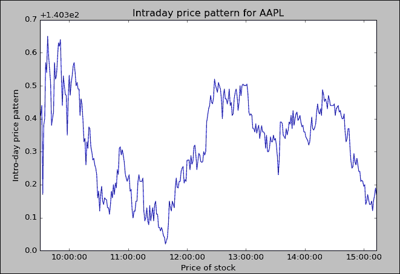

# 第四章：数据来源

自从我们的社会进入所谓的信息时代以来，我们就被大量的信息或数据所包围。正因如此，数据处理技能的人才需求日益增长，例如数据科学家或商业分析专业的毕业生。Kane（2006）提出了一个开源金融概念，包含三个组成部分：

+   开源软件在测试假设和实施投资策略中的应用

+   低成本获取财务数据

+   复制以确认已发布的研究结果

本书中，这三个组成部分简单地称为：开源软件、开源数据和开源代码。Python 是最著名的开源软件之一。目前，公共数据的使用与当前环境不完全一致。在本书中，我们使用了大量数据，特别是公共数据。本章将涵盖以下主题：

+   开源金融

+   宏观经济数据来源

+   会计数据来源

+   财务数据来源

+   其他数据来源

# 深入探讨更深层次的概念

本章的重点将是如何检索与经济、金融和会计相关的数据，尤其是公共数据。例如，雅虎财经提供了丰富的数据，如历史交易价格、当前价格、期权数据、年度和季度财务报表以及债券数据。此类公开可用的数据可用于估算 β（市场风险）、波动性（总风险）、夏普比率、詹森的α、特雷诺比率、流动性、交易成本，并进行财务报表分析（比率分析）和绩效评估。在未来的章节中，将更详细地讨论这些主题。关于经济学、金融和会计的公共数据，有许多优秀的来源，见下表：

| 名称 | 数据类型 |
| --- | --- |
| 雅虎财经 | 历史价格、年度和季度财务报表等 |
| 谷歌财经 | 当前和历史交易价格 |
| 美联储经济数据 | 利率、AAA、AA 评级债券的利率 |
| 法国教授数据图书馆 | 法马-法国因子时间序列、市场指数收益、无风险利率、行业分类 |
| 人口普查局 | 人口普查数据 |
| 美国财政部 | 美国财政收益 |
| 劳工统计局 | 通货膨胀、就业、失业、薪酬和福利 |
| 美国经济分析局 | 国内生产总值（GDP）等 |
| 国家经济研究局 | 经济周期、重要统计数据、总统报告 |

> 表 4.1：开放数据源列表

通常，有两种方式来检索数据：

+   手动从特定位置下载数据，然后编写 Python 程序以检索和处理数据

+   使用各种 Python 模块中包含的功能，例如 `matplotlib.finance` 子模块中的 `quotes_historical_yahoo_ohlc()` 函数

对于这两种方法，各有优缺点。第一种方法的主要优点是我们知道数据的来源。此外，由于我们编写自己的程序来下载和处理数据，这些程序的逻辑更加清晰。第二种方法的优点是获取数据快捷方便。从某种意义上说，用户甚至不需要知道数据的来源以及原始数据集的结构。缺点是使用的函数可能会发生变化，这可能导致某些问题。例如，`quotes_historical_yahoo_ohlc()`的旧版本是`quotes_historical_yahoo()`。

为了从前述数据源中提取有用的信息，可以使用两个子模块：`pandas_datareader.data`和`matplotlib.financial`。要查看`pandas_datareader.data`中包含的函数，可以使用`dir()`函数：


从前面的输出结果来看，似乎我们有八个与 YahooFinance 相关的函数，比如`YahooDailyReader()`、`YahooActionReader()`、`YahooOptions()`、`YahooQuotesReader()`、`get_components_yahoo()`、`get_data_yahoo()`、`get_data_yahoo_actions()`和`get_quote_yahoo()`。实际上，我们也可以使用`theDataReader()`函数。类似地，还有一些函数可以用于从 Google、FRED 以及弗朗西斯教授的数据库中提取数据。

要查看各个函数的用法，可以使用`help()`函数。下面以前述输出中的第一个函数`DataReader()`为例：


从输出结果中可以看到，该函数可以用来从 YahooFinance、Google Finance、圣路易斯联邦储备（FRED）以及弗朗西斯教授的数据库中提取数据。要查看`matplotlib.finance`子模块中包含的所有函数，请参考以下代码：


细心的读者会发现这些名称的定义存在一些不一致之处；请注意某些函数名称的最后四个字母，即`ochl`、`ohlc`和`oclh`。

## 从 Yahoo!Finance 提取数据

Yahoo!Finance 提供历史市场数据、近期的财务报表、几年的财务报告、当前报价、分析师建议、期权数据等。历史交易数据包括每日、每周、每月数据以及股息数据。历史数据包括多个变量：开盘价、最高价、最低价、交易量、收盘价和调整后的收盘价（已对拆股和股息进行了调整）。历史报价通常不会追溯到 1960 年以前。这里我们展示如何手动获取 IBM 的月度数据：

1.  访问[`finance.yahoo.com/`](http://finance.yahoo.com/)。

1.  在搜索框中输入`IBM`。

1.  点击中间的**历史价格**。

1.  选择月度数据，然后点击**应用**。

1.  在**应用**下点击**下载数据**。

这里展示了开头和结尾的几行：


假设上述下载的数据保存在`c:/temp`下，可以使用以下代码来检索它：

```py
>>>import pandas as pd
>>>x=pd.read_csv("c:/temp/ibm.csv")
```

若要查看前几行和后几行观察值，可以使用`.head()`和`.tail()`函数。默认情况下，这两个函数的值为 5。在下面，`x.head()`命令会输出前五行，而`x.tail(2)`则会输出最后两行：


更好的方法是使用包含在各种模块或子模块中的特定函数。这里是一个最简单的例子，只有两行代码即可获取 IBM 的交易数据，见以下代码：

```py
>>>import pandas_datareader.data as getData
df = getData.get_data_google("IBM")
```

同样，`.head()`和`.tail()`函数可以用来展示结果的一部分，见以下代码：

```py
>>>df.head(2)
>>>
                  Open        High         Low       Close   Volume  \
Date                                                                  
2010-01-04  131.179993  132.970001  130.850006  132.449997  6155300   
2010-01-05  131.679993  131.850006  130.100006  130.850006  6841400   
Adj Close  
Date                    
2010-01-04  112.285875
2010-01-05  110.929466
>>>df.tail(2)
                  Open        High         Low       Close   Volume  \
Date                                                                  
2016-12-08  164.869995  166.000000  164.220001  165.360001  3259700   
2016-12-09  165.179993  166.720001  164.600006  166.520004  3143900   
Adj Close  
Date                    
2016-12-08  165.360001
2016-12-09  166.520004
>>>
```

如果需要更长的时间周期，应该指定起始和结束输入变量，见以下代码：

```py
>>>import pandas_datareader.data as getData
>>>import datetime
>>>begdate = datetime.datetime(1962, 11, 1)
>>>enddate = datetime.datetime(2016, 11, 7)
df = getData.get_data_google("IBM",begdate, enddate)
```

在前面的代码中，名为`datetime.datetime()`的函数定义了一个真实的日期变量。在本章后续部分，将展示如何从这样的变量中提取年份和月份。前两条观察结果在这里给出：

```py
>>>df[0:2]
                Open        High         Low       Close   Volume  AdjClose
Date                                                                          
1962-11-01  345.999992  351.999986  341.999996  351.999986  1992000   1.391752
1962-11-02 351.999986369.875014 346.999991 357.249999  3131200   1.412510
>>>
```

仔细的读者应该会发现数据的顺序是不同的。当手动下载数据时，数据的顺序是从最新的（如昨天）向历史回溯。然而，当通过函数提取数据时，最旧的日期会排在最前面。大多数金融数据库采用相同的排序顺序：从最旧到最新。

以下程序使用了另一个名为`quotes_historical_yahoo_ochl`的函数。这个程序是最简单的，仅有两行：

```py
>>>from matplotlib.finance import quotes_historical_yahoo_ochl as getData
>>>p=getData("IBM", (2015,1,1),(2015,12,31),asobject=True,adjusted=True)
```

在前面的程序中，第一行导入了一个名为`quotes_historical_yahoo_ochl()`的函数，它包含在`matplotlib.finance`中。此外，为了方便输入，长函数名被重命名为`getData`。用户也可以使用其他更方便的名称。第二行通过指定的股票代码从 Yahoo!Finance 网页上获取数据，数据的时间范围由起始和结束日期定义。为了展示前几行，我们输入`p[0:4]`：

```py
>>>p[0:4]
rec.array([ (datetime.date(2015, 1, 2), 2015, 1, 2, 735600.0, 150.47501253708967, 151.174636, 152.34067510485053, 150.1858367047493, 5525500.0, 151.174636),
 (datetime.date(2015, 1, 5), 2015, 1, 5, 735603.0, 150.43770546142676, 148.795914, 150.43770546142676, 148.497414517829, 4880400.0, 148.795914),
 (datetime.date(2015, 1, 6), 2015, 1, 6, 735604.0, 148.9451702494383, 145.586986, 149.215699719094, 144.7474294432884, 6146700.0, 145.586986),
 (datetime.date(2015, 1, 7), 2015, 1, 7, 735605.0, 146.64107567217212, 144.635494, 146.64107567217212, 143.68400235493388, 4701800.0, 144.635494),
dtype=[('date', 'O'), ('year', '<i2'), ('month', 'i1'), ('day', 'i1'), ('d', '<f8'), ('open', '<f8'), ('close', '<f8'), ('high', '<f8'), ('low', '<f8'), ('volume', '<f8'), ('aclose', '<f8')])>>>
```

最后几行展示了数据集的结构。例如，`O`表示 Python 对象，`i2`表示整数，`f8`表示浮点数。此时，完全理解这些数据类型的含义并不是那么关键。

为了理解如何从价格数组中估算回报率，我们来看一个简单的例子。假设我们有五个价格，它们的时间线是`t`、`t+1`、`t+2`、`t+3`和`t+4`：

```py
>>> import numpy as np
>>>price=np.array([10,10.2,10.1,10.22,9])
>>>price[1:]
array([ 10.2 ,  10.1 ,  10.22,   9\.  ])
>>>price[:-1]
array([ 10\.  ,  10.2 ,  10.1 ,  10.22])
>>> (price[1:]-price[:-1])/price[:-1]
array([ 0.02      , -0.00980392,  0.01188119, -0.11937378])
>>>
```

对于一个由 `np.array()` 定义的 NumPy 数组，例如之前定义的价格，我们使用 `price[1:]` 来表示从第二项到最后一项，即所有数据项除了第一项。请记住，NumPy 数组的下标是从 `0` 开始的。对于 `price[:-1]`，它表示所有数据项，除了最后一项。我们可以手动验证这些回报值；请参见以下代码，查看前两个回报：

```py
>>> (10.2-10)/10
0.019999999999999928
>>>
>>> (10.1-10.2)/10.2
-0.009803921568627416
```

这是另一个例子：

```py
>>>import scipy as sp
>>>sp.random.seed(123)
>>>price=sp.random.random_sample(10)*15
>>>price
array([ 10.44703778,   4.29209002,   3.4027718 ,   8.26972154,
        10.79203455,   6.3465969 ,  14.71146298,  10.27244608,
         7.21397852,   5.88176277])
>>>price[1:]/price[:-1]-1
array([-0.58915722, -0.20719934,  1.43028978,  0.3050058 , -0.4119184 ,
        1.31800809, -0.30173864, -0.29773508, -0.18467143])
>>>
```

请注意，如果价格数组的排序方式相反：从最新到最旧，那么回报估算应该是 `price[:-1]/price[1:]-1`。根据之前的逻辑，以下程序计算了回报：

```py
from matplotlib.finance import quotes_historical_yahoo_ochl as getData
ticker='IBM'
begdate=(2015,1,1) 
enddate=(2015,11,9)
p = getData(ticker, begdate, enddate,asobject=True, adjusted=True)
ret = p.aclose[1:]/p.aclose[:-1]-1
```

为了使我们的程序更具通用性，在之前的程序中，添加了三个新变量，分别为 `begdate`、`enddate` 和 `ticker`。请注意命令的最后一行。对于给定的两种价格，`p1` 和 `p2`，假设 `p2` 在 `p1` 之后。我们可以通过两种方式来估算回报：`(p2-p1)/p1` 或 `p2/p1-1`。前者在概念上更清晰，而后者使我们的程序更不容易出错。同样，我们可以手动验证几个回报值：

```py
>>>p.aclose[0:4]
array([ 151.174636,  148.795914,  145.586986,  144.635494])>>>
>>>ret[0:3]
array([-0.01573493, -0.02122663, -0.00629399])
>>> (p.aclose[1]-p.aclose[0])/p.aclose[0]
-0.01573492791475934
```

对于以下示例，首先下载了从 2011 年 1 月 1 日到 2015 年 12 月 31 日的 IBM 每日价格数据。然后，计算每日回报。平均日回报为 0.011%：

```py
from scipy import stats
import numpy as np
from matplotlib.finance import quotes_historical_yahoo_ochl as getData
ticker='ibm'
begdate=(2011,1,1)
enddate=(2015,12,31)
p=getData(ticker,begdate,enddate,asobject=True, adjusted=True)
ret=p.aclose[1:]/p.aclose[:-1]-1
mean=np.mean(ret)
print('   Mean '  )
print(round(mean,5))
>>>
   Mean 
>>>
0.00011
```

为了回答这个问题，即 `0.00011` 的平均日回报是否与零在统计学上有显著差异，可以使用 `stats` 模块中的 `ttest_1samp()` 函数：

```py
0.00011
print(' T-test result: T-value and P-value'  )
print(stats.ttest_1samp(ret,0))
>>>
 T-test result: T-value and P-value
>>>
Ttest_1sampResult(statistic=0.3082333300938474, pvalue=0.75795590301241988)
>>>
```

由于 T 值为 0.31，P 值为 0.76，我们接受零假设。换句话说，从 2011 年到 2015 年，IBM 的日均回报在统计学上与零相同。要获取更多关于此函数的信息，可以使用 `help()` 函数。为了节省空间，这里仅显示了前几行：

```py
>>>import scipy.stats
>>>help(stats.ttest_1samp)
Help on function ttest_1samp in module scipy.stats.stats:

ttest_1samp(a, popmean, axis=0, nan_policy='propagate')
```

它计算了单组数据的均值 T 检验。

这是一个双侧检验，用于检验独立观测样本 `a` 的期望值（均值）是否等于给定的总体均值 `popmean`。

以下程序测试了两只股票的相等回报：`IBM` 对 `MSFT`：

```py
import scipy.stats as stats
from matplotlib.finance import quotes_historical_yahoo_ochl as getData
begdate=(2013,1,1)
enddate=(2016,12,9)

def ret_f(ticker,begdate,enddate):
    p = getData(ticker,begdate,
enddate,asobject=True,adjusted=True)
    ret=p.aclose[1:]/p.aclose[:-1]-1
    return(ret)

a=ret_f('IBM',begdate,enddate)
b=ret_f('MSFT',begdate,enddate)
```

这两种回报的计算方法如下所示：

```py
>>>a.mean()*100
0.0022164073263915601
>>>b.mean()*100
0.10399096829827408
>>>
```

请注意，在之前的代码中，使用了 `.mean()` 而不是 `scipy.mean()`。为了进行均值相等的 T 检验，调用了 `ttest_ind()` 函数；请参见以下代码：

```py
>>>print(stats.ttest_ind(a,b))
Ttest_indResult(statistic=-1.652826053660396, pvalue=0.09852448906883747)
```

假设存在两个价格，*p1* 和 *p2*。以下方程定义了一个百分比回报 (*R*) 和对数回报：


……..(1)


……..(2)

这两者之间的关系如下所示：


……..(3)


……..(4)

对数回报的一个优点是，较长周期的回报是短期回报的总和。这意味着年化对数回报是季度对数回报的总和，季度对数回报是月度对数回报的总和。这一性质使我们的编程更加简洁。这里是一个更一般的公式：


……..(5)

对于年化对数回报，我们可以应用以下公式：


……..(6)

以下代码用于将日回报转化为月回报：

```py
from matplotlib.finance import quotes_historical_yahoo_ochl as getData
import numpy as np
import pandas as pd
ticker='IBM'
begdate=(2015,1,1)
enddate=(2015,12,31)
x = getData(ticker, begdate, enddate,asobject=True, adjusted=True)
logret = np.log(x.aclose[1:]/x.aclose[:-1])

date=[]
d0=x.date
for i in range(0,np.size(logret)):
    date.append(''.join([d0[i].strftime("%Y"),d0[i].strftime("%m")]))

y=pd.DataFrame(logret,date,columns=['retMonthly'])
retMonthly=y.groupby(y.index).sum()
```

在前面的程序中，`strftime("%Y")`命令用于提取年份的字符串，如`2016`。这里显示了一个更简单的例子：

```py
>>>import pandas as pd
>>> x=pd.datetime(2016,1,1)
>>>x
datetime.datetime(2016, 1, 1, 0, 0)
>>>x.strftime("%Y")
'2016'
```

同样，`strftime("%m")`命令将提取月份的字符串。要查找前两条和最后两条月度回报，可以使用`.head()`和`.tail()`函数；请参见以下代码：

```py
>>>retMonthly.head(2)
>>>
retMonthly
201501   -0.046737
201502    0.043930
>>>
>>>retMonthly.tail(2)
>>>
retMonthly
201511    0.015798
201512   -0.026248
>>>
```

同理，以下代码将日回报转化为年回报：

```py
from matplotlib.finance import quotes_historical_yahoo_ochl as getData
import numpy as np
import pandas as pd
ticker='IBM'
begdate=(1980,1,1)
enddate=(2012,12,31)
x=getData(ticker,begdate,enddate,asobject=True,adjusted=True)
logret = np.log(x.aclose[1:]/x.aclose[:-1])

date=[]
d0=x.date
for i in range(0,np.size(logret)):
      date.append(d0[i].strftime("%Y"))
#
y=pd.DataFrame(logret,date,columns=['retAnnual'])
ret_annual=exp(y.groupby(y.index).sum())-1
```

这里显示了几条年度回报数据：

```py
>>>ret_annual[0:5]
retAnnual
1980  0.167561
1981 -0.105577
1982  0.679136
1983  0.352488
1984  0.028644
>>>
>>>ret_annual.tail(2)
>>>
retAnnual
2011   0.284586
2012   0.045489
>>>
```

在金融中，标准差和方差用于衡量风险。为了判断哪只股票风险较高，可以比较它们的方差或标准差。以下程序测试了 IBM 和微软的方差是否相等：

```py
import scipy as sp
from matplotlib.finance import quotes_historical_yahoo_ochl as getData
begdate=(2013,1,1)
enddate=(2015,12,31)
def ret_f(ticker,begdate,enddate):
    p = getData(ticker,begdate,
enddate,asobject=True,adjusted=True)
    return(p.aclose[1:]/p.aclose[:-1]-1)
y=ret_f('IBM',begdate,enddate)
x=ret_f('MSFT',begdate,enddate)
```

在`scipy.stats`模块中调用的函数`bartlett()`被使用。以下输出结果表明这两家公司具有不同的方差，因为 F 值为 44.39，而 P 值几乎为零：

```py
>>>print(sp.stats.bartlett(x,y))
BartlettResult(statistic=44.392308291526497, pvalue=2.6874090005526671e-11)
```

要获取更多关于此函数的信息，可以使用`help()`函数。

为节省空间，这里只显示了前几行：

1.  `scipy.stats.morestats`模块中`bartlett`函数的帮助：

    ```py
    bartlett(*args)
    ```

1.  执行 Bartlett 检验以检查方差是否相等。

    ### 注意

    Bartlett 检验的零假设是所有输入样本来自方差相等的总体。

    对于来自显著非正态分布的样本，Levene 检验（`levene`）更为稳健。

在金融中，我们有一个非常重要的假设：股票回报遵循正态分布。因此，最好通过图形展示股票回报的分布；请参见以下图片。附录 A 中的代码相对复杂。本章并不要求理解该程序。对几个描述的程序来说也是如此。

以下图表展示了 IBM 回报的分布情况，并与正态分布进行对比。价格时刻点显示在右侧，相关的 Python 程序可以在附录 A 中找到：


所谓的蜡烛图可以生动地展示股票价格或交易量，如以下截图所示。相应的 Python 程序可以在附录 C 中找到：


右上角的图片非常复杂。由于初学者不需要理解它，本书没有包括该程序。如果读者感兴趣，完整的程序可以在两个位置找到。以下是链接：[`matplotlib.org/examples/pylab_examples/finance_work2.html`](http://matplotlib.org/examples/pylab_examples/finance_work2.html) 和 [`canisius.edu/~yany/python/finance_work2.txt`](http://canisius.edu/~yany/python/finance_work2.txt)。

以下是另一个示例，通过调用`pandas_datareader.data`子模块中的`DataReader()`函数，从 Yahoo! Finance 获取 IBM 的每日数据：

```py
>>>import pandas_datareader.data as getData
>>>x = getData.DataReader('IBM', data_source='yahoo', start='2004/1/30')
>>>x[1:5]
                  Open        High        Low       Close   Volume  Adj Close
Date                                                                         
2004-02-02   99.150002   99.940002  98.500000   99.389999  6200000  77.666352
2004-02-03   99.000000  100.000000  98.949997  100.000000  5604300  78.143024
2004-02-04   99.379997  100.430000  99.300003  100.190002  8387500  78.291498
2004-02-05  100.000000  100.089996  98.260002   98.860001  5975000  77.252194
>>>
```

## 从 Google 财经获取数据

和 Yahoo Finance 一样，Google 财经提供大量公共信息，如新闻、期权链、相关公司（有助于竞争对手和行业分析）、历史价格和财务数据（包括利润表、资产负债表和现金流量表）。我们可以通过直接访问 Google 财经手动下载数据。或者，为了从 Google 财经获取数据，可以使用`pandas_datareader`子模块中的`DataReader()`函数：

```py
>>>import pandas_datareader.data as getData
>>>aapl =getData.DataReader("AAPL", "google") 
>>>aapl.head(2)
>>>
             Open   High    Low  Close     Volume
Date                                             
2010-01-04  30.49  30.64  30.34  30.57  123432050
2010-01-05  30.66  30.80  30.46  30.63  150476004
>>>aapl.tail(2)
              Open    High     Low   Close    Volume
Date                                                
2016-12-08  110.86  112.43  110.60  112.12  27068316
2016-12-09  112.31  114.70  112.31  113.95  34402627
>>>
```

以下截图显示了股票的日内波动。相关的 Python 程序包括在附录 C 中：


## 从 FRED 获取数据

美国联邦储备银行有许多与当前经济和历史时间序列相关的数据集。例如，他们有关于利率的数据，如欧元-美元存款利率。获取此类利率数据有两种方式。首先，我们可以使用他们的数据下载程序，如以下步骤所示：

1.  访问美国联邦储备银行的网页链接：[`www.federalreserve.gov/econresdata/default.html`](https://www.federalreserve.gov/econresdata/default.html)。

1.  点击[`www.federalreserve.gov/data.htm`](https://www.federalreserve.gov/data.htm)上的**数据下载程序**。

1.  选择合适的数据项。

1.  点击**前往下载**。

例如，我们选择联邦基金利率。前几行如下所示：

```py
"Series Description","Federal funds effective rate"
"Unit:","Percent:_Per_Year"
"Multiplier:","1"
"Currency:","NA"
"Unique Identifier: ","H15/H15/RIFSPFF_N.D"
"Time Period","RIFSPFF_N.D"
1954-07-01,1.13
1954-07-02,1.25
1954-07-03,1.25
1954-07-04,1.25
1954-07-05,0.88
1954-07-06,0.25
1954-07-07,1.00
1954-07-08,1.25
```

以下程序可用于获取下载的数据。这里假设数据集保存在`c:/temp/`目录下：

```py
import pandas as pd
importnumpy as np
file=open("c:/temp/fedFundRate.csv","r")
data=pd.read_csv(file,skiprows=6)
```

另外，可以使用`pandas_datareader`模块中的`DataReader()`函数。这里给出了一个示例：

```py
>>>import pandas_datareader.data as getData
>>>vix = DataReader("VIXCLS", "fred")
>>>vis.head()
VIXCLS
DATE              
2010-01-01     NaN
2010-01-04   20.04
2010-01-05   19.35
2010-01-06   19.16
2010-01-07   19.06
>>>
```

## 从法兰西教授的数据库获取数据

French 教授拥有一个非常好且广泛使用的数据库。你可以通过访问这个链接：[`mba.tuck.dartmouth.edu/pages/faculty/ken.french/data_library.html`](http://mba.tuck.dartmouth.edu/pages/faculty/ken.french/data_library.html)获取更多信息。它包含了 Fama-French 因子的日度、周度和月度数据以及其他有用的数据集。点击*Fama-French 因子*后，可以下载名为`F-F_Research_Data_Factors.zip`的 ZIP 文件。解压后，我们将得到一个名为`F_F_Research_Data_Factors.txt`的文本文件，里面包括了从 1926 年 7 月开始的月度和年度 Fama-French 因子。以下是前几行的内容。更多细节请参见第七章，*多因子模型与绩效衡量*，夏普比率、特雷诺比率和詹森α。

该文件是由`CMPT_ME_BEME_RETS`使用`201012 CRSP`数据库创建的：

```py
The 1-month TBill return is from Ibbotson and Associates, Inc.
Mkt-RFSMBHMLRF
192607    2.62   -2.16   -2.92    0.22
192608    2.56   -1.49    4.88    0.25
192609    0.36   -1.38   -0.01    0.23
192610   -3.43    0.04    0.71    0.32
192611    2.44   -0.24   -0.31    0.31
```

假设数据保存在`C:/temp/`下。在运行以下代码之前，请记得删除文件底部的年度数据：

```py
>>>import pandas as pd
>>>file=open("c:/temp/ffMonthly.txt","r")
>>>data=file.readlines()
```

这里展示了前 10 条观测值：

```py
>>>data[0:10]
['DATE    MKT_RFSMBHMLRF\n', '192607    2.96   -2.30   -2.87    0.22\n', '192608    2.64   -1.40    4.19    0.25\n', '192609    0.36   -1.32    0.01    0.23\n', '192610   -3.24    0.04    0.51    0.32\n', '192611    2.53   -0.20   -0.35    0.31\n', '192612    2.62   -0.04   -0.02    0.28\n', '192701   -0.06   -0.56    4.83    0.25\n', '192702    4.18   -0.10    3.17    0.26\n', '192703    0.13   -1.60   -2.67    0.30\n']
>>>
```

另外，我们也可以编写一个 Python 程序来获取 Fama-French 月度时间序列：

```py
import pandas_datareader.data as getData
ff =getData.DataReader("F-F_Research_Data_Factors", "famafrench")
```

再次使用`pandas_datareader()`模块的优点在于，我们可以利用`.head()`和`.tail()`函数来查看获取到的数据集。现在给出几个更多的示例：

```py
import pandas_datareader.data as pdata
ff2=web.DataReader("F-F_Research_Data_Factors_weekly", "famafrench")
ff3 =web.DataReader("6_Portfolios_2x3", "famafrench")
ff4=web.DataReader("F-F_ST_Reversal_Factor", "famafrench")
```

## 从人口普查局、财政部和劳工统计局获取数据

在这一部分，我们简要展示了如何从美国人口普查局获取数据。你可以在[`www.census.gov/compendia/statab/hist_stats.html`](http://www.census.gov/compendia/statab/hist_stats.html)了解更多信息。当我们进入人口普查的历史数据后，以下窗口将弹出。这是链接：[`www.census.gov/econ/census/data/historical_data.html`](http://www.census.gov/econ/census/data/historical_data.html)。以下截图展示了我们可以下载的历史数据类型：


假设我们对**61 教育服务**感兴趣。点击该链接后，我们可以选择一个时间序列进行下载。点击**下载**图标后，将会下载一个包含四个文件的 ZIP 文件。

下一个示例展示了如何从劳工统计局网站获取数据。首先，访问相关网页：[`www.bls.gov/`](http://www.bls.gov/)，然后点击菜单栏上的**数据工具**：


点击**通货膨胀与价格**，再点击**CPI**；我们将被引导到一个页面，在那里我们可以下载相关的数据集，如这个链接所示：[`download.bls.gov/pub/time.series/cu/`](http://download.bls.gov/pub/time.series/cu/)

## 生成二十多个数据集

为了帮助本书的读者，生成了许多数据集。首先，让我们看一个简单的示例，下载并加载一个名为`ffMonthly.pkl`的 Python 数据集。有关该数据集的更多信息，请访问以下链接：[`canisius.edu/~yany/python/ffMonthly.pkl`](http://canisius.edu/~yany/python/ffMonthly.pkl)。

该数据集基于每月的 Fama-French 三因子时间序列生成。假设数据集保存在`c:/temp/`目录下，可以使用以下 Python 程序加载它：

```py
>>>import pandas as pd
>>>ff=pd.read_pickle("c:/temp/ffMonthly.pkl")
```

我们可以查看前几行和最后几行：

```py
>>>import pandas as pd
>>>ff=pd.read_pickle("c:/temp/ffMonthly.pkl")
```

更好的方式是使用`.head()`和`.tail()`函数；请参见以下代码：

```py
>>>import pandas as pd
>>>ff=pd.read_pickle("c:/temp/ffMonthly.pkl")
>>>ff.head(5)
DATE  MKT_RFSMBHMLRF
1  1926-10-01 -0.0324  0.0004  0.0051  0.0032
2  1926-11-01  0.0253  -0.002 -0.0035  0.0031
3  1926-12-01  0.0262 -0.0004 -0.0002  0.0028
4  1927-01-01 -0.0006 -0.0056  0.0483  0.0025
5  1927-02-01  0.0418  -0.001  0.0317  0.0026
>>>ff.tail(3)
DATE  MKT_RFSMBHMLRF
1078  2016-07-01  0.0395   0.029 -0.0098  0.0002
1079  2016-08-01  0.0049  0.0094  0.0318  0.0002
1080  2016-09-01  0.0025    0.02 -0.0134  0.0002
>>>
```

`ff.head(5)`命令将显示前五行，而`ff.tail(3)`将显示最后三行。`date`变量对于时间序列至关重要，主要原因是我们处理的是时间序列数据。在合并不同的数据集时，`date`变量是最常用的合并变量。以下示例展示了如何定义这种`date`变量：

```py
>>>import pandas as pd
>>>from datetime import timedelta
>>>a=pd.to_datetime('12/2/2016', format='%m/%d/%Y')
>>>a+timedelta(40)
>>>
Timestamp('2017-01-11 00:00:00')
>>> b=a+timedelta(40)
>>>b.date()
datetime.date(2017, 1, 11)
```

为了帮助本书的读者，作者生成了大约二十个 Python 数据集，扩展名为`.pkl`。这些数据集来自前面提到的公共数据源，例如来自 Fama 教授的数据集和 Hasbrouck 教授的 TORQ 数据集，后者包含了 1990 年 11 月至 1991 年 1 月期间，144 只纽约证券交易所（NYSE）股票的交易、报价、订单处理数据和审计跟踪数据。为了方便下载，提供了一个名为`loadYan.py`的 Python 程序。你可以在以下链接找到更多信息：[`caniisus.edu/~yany/loadYan.py`](http://http://caniisus.edu/~yany/loadYan.py)。

运行程序后，可以输入`help(loadYan)`来查看所有已生成的数据集；请参见以下代码：

```py
>>>help(loadYan)
Help on function loadYan in module __main__:

loadYan(i, loc='c:/temp/temp.pkl')
    Objective: download datasets with an extension of .pkl
i     : an integer 
loc   : a temporary location, such as c:/temp/temp.pkl

i  dataset           description 
     --- -------            ------------------
1  ffMonthlyFama-French 3 factors monthly 
2  ffDailyFama-French 3 factors daily 
3  ffMonthly5Fama-French 5 factors monthly 
4  ffDaily5Fama-French 5 factors daily 
5  sp500listsCurrent S&P 500 constituents 
6  tradingDaysMonthly trading days monthly 
7  tradingDaysDaily   trading days daily 
8  usGDPannual        US GDP annual 
9  usGDPmonthly       US GDP monthly 
10  usCPI              US Consumer Price Index
11  dollarIndex        US dollar index
12  goldPriceMonthly   gold price monthly 
13  goldPriceDaily     gold price daily 
14  spreadAAA          Moody's spread for AAA rated bonds
15  spreadBBB          Moody's spread for BBB rated bonds
16  spreadCCC          Moody's spread for CCC rated bonds
17  TORQctTORQ Consolidated Trade 
18  TORQcqTORQ Consolidated Quote  
19  TORQcodTORQ Consolidated Order 
20  DTAQibmCTTAQ Consolidated Trade for IBM (one day)
21  DTAQibmCQDTAQ Consolidated Quote for IBM (one day)
22  DTAQ50CTDTAQ Consolidated Trade for 50  (one day)
23  DTAQ50CQDTAQ Consolidated Quote for 50  (one day)
24  spreadCredit   Spreads based on credit ratings
25journalRankings  A list of journals

    Example 1:
>>>x=loadYan(1)
>>>x.head(2)
DATE  MKT_RFSMBHMLRF
1  1926-10-01 -0.0324  0.0004  0.0051  0.0032
2  1926-11-01  0.0253  -0.002 -0.0035  0.0031

>>>x.tail(2)
DATE  MKT_RFSMBHMLRF
1079  2016-08-01  0.0049  0.0094  0.0318  0.0002
1080  2016-09-01  0.0025    0.02 -0.0134  0.0002
>>>
```

## 与 CRSP 和 Compustat 相关的几个数据集

**证券价格研究中心**（**CRSP**）包含所有交易数据，例如收盘价、交易量、流通股数等，从 1926 年起涵盖美国所有上市股票。由于其数据质量高且历史悠久，它已被学术研究者和实践者广泛使用。该数据库由芝加哥大学生成并维护，访问地址为：[`www.crsp.com/`](http://www.crsp.com/)。生成了大约 100 个 Python 数据集，见下表：

| 名称 | 描述 |
| --- | --- |
| `crspInfo.pkl` | 包含 PERMNO、CUSIP 头、股票交易所以及起始和结束交易日期 |
| `stockMonthly.pkl` | 每月股票文件，包含 PERMNO、日期、收益、价格、交易量和流通股数 |
| `indexMonthly.pkl` | 每月频率的指数文件 |
| `indexDaily.pkl` | 每日频率的指数文件 |
| `tradingDaysMonthly.pkl` | 1926 年到 2015 年 12 月 31 日的每月交易日数据 |
| `tradingDaysDaily.pkl` | 1926 年到 2015 年 12 月 31 日的每日交易日数据 |
| `sp500add.pkl` | 标准普尔 500 成分股，即每只股票何时被加入指数以及何时从指数中移除 |
| `sp500daily.pkl` | 标准普尔 500 日常指数水平及回报 |
| `sp500monthly.pkl` | 标准普尔 500 月度指数水平及回报 |
| `d1925.pkl` | 1925 年每日股票价格文件 |
| `d1926.pkl` | 1926 年每日股票价格文件 |
| `…` | [更多内容，请见 1926 年至 2014 年之间的数据] |
| `d2014.pkl` | 2014 年每日股票价格文件 |
| `d2015.pkl` | 2015 年每日股票价格文件 |

> 表 4.2：与 CRSP 相关的 Python 数据集列表

加载数据非常简单，可以使用 `pandas.read_pickle()` 函数：

```py
>>>import pandas as pd
>>>crspInfo=pd.read_pickle("c:/temp/crspInfo.pkl")
```

要查看前几个和后几个观测值，可以使用 `.head()` 和 `.tail()` 函数：

```py
>>>crspInfo.shape
     (31218, 8)
>>>crspInfo.head()
PERMNOPERMCOCUSIP                         NAME TICKER  EX   BEGDATE  \
0   10001    7953  6720410               AS NATURAL INCEGAS   2  19860131   
1   10002    7954  5978R10ANCTRUST FINANCIAL GROUP IN   BTFG   3  19860131   
2   10003    7957  9031810REAT COUNTRY BKASONIA CT   GCBK   3  19860131   
3   10005    7961  5815510ESTERN ENERGY RESOURCES INCWERC   3  19860131   
4   10006   22156  0080010           C F INDUSTRIES INCACF   1  19251231   
ENDDATE
0  20151231
1  20130228
2  19951229
3  19910731
4  19840629
>>>crspInfo.tail(3)
PERMNOPERMCOCUSIP                  NAME TICKER  EX   BEGDATE  \
31215   93434   53427  8513510& W SEED CO   SANW   3  20100630   
31216   93435   53452  2936G20INO CLEAN ENERGY INCSCEI   3  20100630   
31217   93436   53453  8160R10ESLA MOTORS INCTSLA   3  20100630   
ENDDATE
31215  20151231
31216  20120531
31217  20151231>>>
```

`PERMNO` 是 CRSP 的股票 `ID`，`PERMCO` 是公司 ID，`Name` 是公司的当前名称，`Ticker` 是股票代码，也就是当前的股票符号，`EX` 是交易所代码（1 表示纽约证券交易所，2 表示美国证券交易所，3 表示纳斯达克），`BEGDATE` 是首次交易日，而 `ENDDATE` 是某个给定 `PERMNO` 的最后交易日。对于 `pandas` 模块，选择列是通过将列名的列表传递给我们的 DataFrame 来完成的。

例如，要选择 `PERMNO`、`BEGDATE` 和 `ENDDATE` 三列，我们可以使用以下代码：

```py
>>>myColumn=['PERMNO','BEGDATE','ENDDATE']
>>>crspInfo[myColumn].head(6)
>>>
PERMNOBEGDATEENDDATE
0   10001  19860131  20151231
1   10002  19860131  20130228
2   10003  19860131  19951229
3   10005  19860131  19910731
4   10006  19251231  19840629
5   10007  19860131  19901031
>>>
```

`Compustat(CapitalIQ)` 数据库提供了自 1960 年以来美国上市公司如资产负债表、利润表和现金流量表等财务报表。该数据库由标准普尔公司生成。你可以在 [`marketintelligence.spglobal.com/our-capabilities/our-capabilities.html?product=compustat-research-insight`](http://marketintelligence.spglobal.com/our-capabilities/our-capabilities.html?product=compustat-research-insight) 找到更多信息。以下表格列出了几个相关的 Python 数据集：

| Name | 描述 |
| --- | --- |
| `compInfo.pkl` | 所有公司关键头文件 |
| `varDefinitions.pkl` | 数据集中的所有变量定义 |
| `deletionCodes.pkl` | 显示某公司何时从数据库中删除以及原因 |
| `acc1950.pkl` | 1950 年年度财务报表 |
| `acc1951.pkl` | 1951 年年度财务报表 |
| `acc2014.pkl` | 2014 年年度财务报表 |
| `acc2015.pkl` | 2015 年年度财务报表 |

> 表 4.3：与 Compustat 相关的 Python 数据集列表

请注意，由于 CRSP 和 Compustat 都是专有数据库，相关数据集不会在作者的网站上提供。如果教师对这些数据感兴趣，请直接联系作者。以下是一些高频数据集的列表：

| Name | 描述 |
| --- | --- |
| `TORQct.pkl` | TORQ 数据库的合并交易 |
| `TORQcq.pkl` | TORQ 数据库的合并报价 |
| `TORQcod.pkl` | TORQ 数据库的 COD |
| `DTAQibmCT` | DTAQ 代表每日交易与报价，是毫秒级的交易数据，提供 IBM 的一天数据 |
| `DTAQibmCQ` | IBM 的单日数据，综合报价 |
| `DTAQ50CT` | 50 只股票的单日数据（综合交易） |
| `DTAQ50CQ` | 50 只股票的一日数据（综合报价） |

> 表 4.4：与高频交易数据相关的 Python 数据集列表

假设`TORQcq.pkl`文件保存在`c:/temp/`目录下。我们可以查看它的前几条和后几条观测数据：

```py
>>>import pandas as pd
>>>x=pd.read_pickle("c:/temp/TORQcq.pkl")
>>>x.head()
>>>
  SYMBOL      DATE      TIME     BID     OFRBIDSIZOFRSIZ  MODE  QSEQ EX
0     AC  19901101   9:30:44  12.875  13.125      32       5    10  1586  N
1     AC  19901101   9:30:47  12.750  13.250       1       1    12     0  M
2     AC  19901101   9:30:51  12.750  13.250       1       1    12     0  B
3     AC  19901101   9:30:52  12.750  13.250       1       1    12     0  X
4     AC  19901101  10:40:13  12.750  13.125       2       2    12     0  
>>>x.tail()
        SYMBOL      DATE      TIME     BID     OFRBIDSIZOFRSIZ  MODE  \
1111220    ZNT  19910131  13:31:06  12.375  12.875       1       1    12   
1111221    ZNT  19910131  13:31:06  12.375  12.875       1       1    12   
1111222    ZNT  19910131  16:08:44  12.500  12.750       1       1     3   
1111223    ZNT  19910131  16:08:49  12.375  12.875       1       1    12   
1111224    ZNT  19910131  16:16:54  12.375  12.875       1       1     3   
QSEQ EX  
1111220       0  B
1111221       0  X
1111222  237893  N  
1111223       0  X
1111224       0  X
>>>M
```

以下表格显示了不同格式（如 SAS、Matlab 和 Excel）数据的获取示例：

| 格式 | 代码 |
| --- | --- |
|   | `>>>import pandas as pd` |
| CSV | `>>>a=pd.read_csv("c:/temp/ffMonthly.csv",skip=4)` |
| 文本 | `>>>b=pd.read_table("c:/temp/ffMonthly.txt",skip=4)` |
| Pickle | `>>>c=pd.read_pickle("c:/temp/ffMonthly.pkl")` |
| SAS | `>>>d= sp.read_sas('c:/temp/ffMonthly.sas7bdat')` |
| Matlab | `>>>import scipy.io as sio``>>>e= sio.loadmat('c:/temp/ffMonthly.mat')` |
| Excel | `>>>infile=pd.ExcelFile("c:/temp/ffMonthly.xlsx")``>>>f=infile.parse("ffMonthly",header=T)` |

> 表 4.5：使用不同格式获取数据

为了帮助本章的读者，前述表格中的所有输入文件都可以获取。有关更多信息，请参见此链接：[`canisius.edu/~yany/ffMonthly.zip`](http://canisius.edu/~yany/ffMonthly.zip)。

### 注意

**参考文献**：

Kane, David, 2006，《开源金融》，工作论文，哈佛大学，SSRN 链接见[`papers.ssrn.com/sol3/papers.cfm?abstract_id=966354`](http://papers.ssrn.com/sol3/papers.cfm?abstract_id=966354)

### 附录 A – Python 程序用于回报分布与正态分布的比较

```py
from matplotlib.pyplot import *
from matplotlib.finance import quotes_historical_yahoo_ochl as getData
import numpy as np
import matplotlib.mlab as mlab

ticker='IBM'
begdate=(2015,1,1) 
enddate=(2015,11,9)
p = getData(ticker, begdate, enddate,asobject=True, adjusted=True)
ret = (p.aclose[1:] - p.aclose[:-1])/p.aclose[:1] 
[n,bins,patches] = hist(ret, 100)
mu = np.mean(ret) 
sigma = np.std(ret)
x = mlab.normpdf(bins, mu, sigma) 
plot(bins, x, color='red', lw=2) 
title("IBM return distribution") 
xlabel("Returns") 
ylabel("Frequency")
show()
```

相应的图表如下所示：


### 附录 B – Python 程序绘制蜡烛图

```py
import numpy as np
import matplotlib.pyplot as plt
from matplotlib.dates import DateFormatter, WeekdayLocator
from matplotlib.dates import HourLocator,DayLocator, MONDAY
from matplotlib.finance import candlestick_ohlc,plot_day_summary_oclh
from matplotlib.finance import quotes_historical_yahoo_ochl as getData
#
date1 = ( 2013, 10, 20)
date2 = ( 2013, 11, 10 )
ticker='IBM'
mondays = WeekdayLocator(MONDAY)       # major ticks on the mondays
alldays = DayLocator()                 # minor ticks on the days
weekFormatter = DateFormatter('%b %d') # e.g., Jan 12
dayFormatter = DateFormatter('%d')     # e.g., 12
quotes = getData(ticker, date1, date2)
if len(quotes) == 0:
     raiseSystemExit
fig, ax = plt.subplots()
fig.subplots_adjust(bottom=0.2)
ax.xaxis.set_major_locator(mondays)
ax.xaxis.set_minor_locator(alldays)
ax.xaxis.set_major_formatter(weekFormatter)
ax.xaxis.set_minor_formatter(dayFormatter)
plot_day_summary_oclh(ax, quotes, ticksize=3)
candlestick_ohlc(ax, quotes, width=0.6)
ax.xaxis_date()
ax.autoscale_view()
plt.setp(plt.gca().get_xticklabels(), rotation=80,horizontalalignment='right')
plt.figtext(0.35,0.45, '10/29: Open, High, Low, Close')
plt.figtext(0.35,0.42, ' 177.62, 182.32, 177.50, 182.12')
plt.figtext(0.35,0.32, 'Black ==> Close > Open ')
plt.figtext(0.35,0.28, 'Red ==> Close < Open ')
plt.title('Candlesticks for IBM from 10/20/2013 to 11/10/2013')
plt.ylabel('Price')
plt.xlabel('Date')
plt.show()
```

图像如下所示：


### 附录 C – Python 程序用于价格波动

```py
import datetime
import matplotlib.pyplot as plt
from matplotlib.finance import quotes_historical_yahoo_ochl
from matplotlib.dates import MonthLocator,DateFormatter
ticker='AAPL'
begdate= datetime.date( 2012, 1, 2 )
enddate = datetime.date( 2013, 12,4)

months= MonthLocator(range(1,13), bymonthday=1, interval=3)# 3rd month
monthsFmt = DateFormatter("%b '%Y")
x = quotes_historical_yahoo_ochl(ticker, begdate, enddate) 
if len(x) == 0:
     print ('Found no quotes')
     raiseSystemExit
dates = [q[0] for q in x] 
closes = [q[4] for q in x] 
fig, ax = plt.subplots()
ax.plot_date(dates, closes, '-') 
ax.xaxis.set_major_locator(months) 
ax.xaxis.set_major_formatter(monthsFmt)
ax.autoscale_view()
ax.grid(True)
fig.autofmt_xdate()
plt.show()
```

相应的图表如下：


### 附录 D – Python 程序展示股票的日内波动图

```py
import numpy as np
import pandas as pd
import datetime as datetime
import matplotlib.pyplot as plt
ticker='AAPL'
path='http://www.google.com/finance/getprices?q=ttt&i=60&p=1d&f=d,o,h,l,c,v'
p=np.array(pd.read_csv(path.replace('ttt',ticker),skiprows=7,header=None))
#
date=[]
for i in np.arange(0,len(p)): 
    if p[i][0][0]=='a':
        t= datetime.datetime.fromtimestamp(int(p[i][0].replace('a',''))) 
        date.append(t)
    else:
        date.append(t+datetime.timedelta(minutes =int(p[i][0])))
#
final=pd.DataFrame(p,index=date) 
final.columns=['a','Open','High','Low','Close','Vol'] 
del final['a']
#
x=final.index
y=final.Close
#
plt.title('Intraday price pattern for ttt'.replace('ttt',ticker)) 
plt.xlabel('Price of stock')
plt.ylabel('Intro-day price pattern') 
plt.plot(x,y)	
plt.show()
```

相应的图表如下所示：



### 附录 E – pandas DataFrame 的属性

首先，让我们从[`canisius.edu/~yany/python/ffMonthly.pickle`](http://canisius.edu/~yany/python/ffMonthly.pickle)下载一个名为`ffMonthly.pickl` `e`的 Python 数据集。假设该数据集保存在`c:/temp`目录下：

```py
>>>
>>>import pandas as pd
>>>ff=pd.read_pickle("c:/temp/ffMonthly.pickle")
>>>type(ff)
<class'pandas.core.frame.DataFrame'>
>>>
```

最后的结果显示，`ff`数据集的类型是 pandas DataFrame。因此，获取更多有关此数据类型的信息可能是个好主意。当我们输入`ff.`时，可以看到一个下拉列表；请参见以下截图：


我们可以找到一个名为`hist()`的函数；请参见以下代码中的使用方法：

```py
>>>import pandas as pd
>>>infile=("c:/temp/ffMonthly.pickle")
>>>ff=pd.read_pickle(infile)
>>>ff.hist()
```


欲了解更多详情，请参见相关链接：[`pandas.pydata.org/pandas-docs/stable/generated/pandas.DataFrame.html`](http://pandas.pydata.org/pandas-docs/stable/generated/pandas.DataFrame.html)。

### 附录 F – 如何生成扩展名为 .pkl 或 .pickle 的 Python 数据集

首先，让我们看一下最简单的数据集：

```py
>>>import pandas as pd
>>>import numpy.ranom  as random
>>>x=random.randn(10)
>>>y=pd.DataFrame(x)
>>>y.to_pickle("c:/temp/test.pkl")
```

读取扩展名为 `.pkl` 或 `.pickle` 的 Python 数据集时，我们使用 `pd.read_pickle()` 函数：

```py
>>> import pandas as pd
>>>kk=pd.read_pickle("c:/temp/test.pkl")
```

接下来，展示用于生成 `ffMonthly.pkl` 数据集的 Python 程序：

```py
import pandas as pd
import numpy as np
file=open("c:/temp/ffMonthly.txt","r")
data=file.readlines()
dd=mkt=smb=hml=rf=[]
n=len(data)
index=range(1,n-3)
#
for i in range(4,n):
     t=data[i].split()
     dd.append(pd.to_datetime(t[0]+'01', format='%Y%m%d').date())
     mkt.append(float(t[1])/100)
     smb.append(float(t[2])/100)
     hml.append(float(t[3])/100)
      rf.append(float(t[4])/100)
#
d=np.transpose([dd,mkt,smb,hml,rf])
ff=pd.DataFrame(d,index=index,columns=['DATE','MKT_RF','SMB','HML','RF'])
ff.to_pickle("c:/temp/ffMonthly.pkl")
```

以下是第一个和最后几个观测值：

```py
>>>ff.head(2)
DATE  MKT_RFSMBHML
1  1926-10-01 -0.0324  0.0004  0.0051
2  1926-11-01  0.0253  -0.002 -0.0035
>>>ff.tail(2)
DATE  MKT_RFSMBHML
1079  2016-08-01  0.0049  0.0094  0.0318
1080  2016-09-01  0.0025    0.02 -0.0134
```

### 附录 G – 数据案例 #1 - 生成多个 Python 数据集

对于此数据案例，学生需要生成大约五个 Python 数据集，扩展名为 `.pkl`：

```py
>>import pandas as pd
>>>a = pd.Series(['12/1/2014', '1/1/2015'])
>>>b= pd.to_datetime(a, format='%m/%d/%Y')
>>>b
0   2014-12-01
1   2015-01-01
dtype: datetime64[ns]
>>>
```

请使用 Python 格式生成以下数据集，格式为 `.pickle`（`.pkl` 或 `.pickle`）：

| # | 数据集名称 | 描述 |
| --- | --- | --- |
| 1 | `ffDaily` | 每日 Fama 和 French 3 因子时间序列 |
| 2 | `ffMonthly5` | 每月 Fama 和 French 5 因子时间序列 |
| 3 | `usGDPannual` | 美国年度 GDP（国内生产总值） |
| 4 | `usGDPquarterly` | 美国季度 GDP（国内生产总值） |
| 5 | `dollarIndex` | 美元指数 |
| 6 | `goldPriceMonthly` | 每月黄金价格 |
| 7 | `goldPriceDaily` | 每日黄金价格 |
| 8 | `tradingDaysMonthly` | 每月时间序列的交易日 |
| 9 | `tradingDaysDaily` | 每日数据的交易日 |
| 10 | `spreadAAA` | 穆迪 AAA 评级债券的利差 |

## 练习题

1.  我们可以从哪里获取每日股票价格数据？

1.  我们能否直接下载收益率数据？

1.  手动下载 CitiGroup 的每月和每日价格数据。

1.  将 CitiGroup 的每日价格数据转换为每日收益率。

1.  将每月价格转换为每月收益率，并将每日收益率转换为每月收益率。它们相同吗？

1.  以下两行代码是否等效？

    ```py
    >>>ret = p.aclose[1:]/p.aclose[:-1]-1     
    >>>ret = (p.aclose[1:]-p.aclose[:-1]/p.aclose[1:]
    ```

1.  使用公共股票数据与使用私有股票数据（例如来自某些金融数据库）的优缺点是什么？

1.  查找订阅`Compustat`的年费用，涉及会计信息，以及与交易数据相关的 CRSP。

1.  从 Yahoo Finance 下载 IBM 的每月数据。估算其从 2000 年 1 月到 2004 年 12 月的标准差和夏普比率。

1.  2001 到 2010 年间，IBM、DELL 和 MSFT 的年 Beta 值是多少？

1.  2006 到 2010 年间，IBM 和 DELL 之间的相关性是多少？

1.  估算 IBM 的平均工作日收益率。你是否观察到工作日效应？

1.  波动性是否随着年份的推移而下降？例如，你可以选择 IBM、DELL 和 MSFT 来研究这个假设。

1.  S&P500 与 DJI（道琼斯工业平均指数）之间的相关性是多少？注意：在 Yahoo Finance 中，`S&P500` 指数的代码是 `^GSPC`，`DJI` 的代码是 `^DJI`。

1.  如何下载 *n* 个给定股票代码的数据？

1.  编写 R 程序以从输入文件中输入 *n* 个股票代码。

1.  美国股市（`S&P500`）与香港市场（恒生指数）之间的相关系数是多少？

1.  新加坡股市是否与日本股市的相关性比与美国股市的相关性更强？

1.  如何下载 50 只股票的每日价格数据并将其保存到一个文本文件中？

1.  从 Yahoo!Finance 下载数据后，假设*p*向量包含所有的每日价格数据。以下两行代码的含义是什么？我们应该在什么时候应用它们？

    ```py
    >>> ret = p.aclose[1:]/p.aclose[:-1]-1     
    >>> ret = p.aclose[:-1]/p.aclose[1:]-1    
    ```

## 总结

在本章中，我们讨论了经济学、金融和会计学的各种公共数据来源。对于经济学，我们可以访问联邦储备银行的数据库、French 教授的数据库，获取许多有用的时间序列数据。对于金融学，我们可以使用 Yahoo!Finance 和 Google Finance 下载历史价格数据。对于会计信息，比如最新几年的资产负债表和利润表，我们可以使用 Yahoo!Finance、Google Finance 和 SEC 的文件。下一章，我们将解释与利率相关的许多概念，之后我们会解释如何定价债券和股票。
