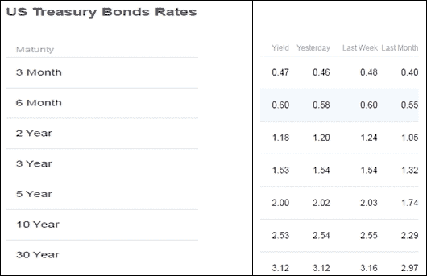
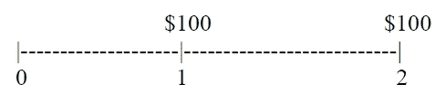
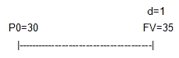
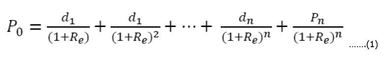

# 第五章 债券与股票估值

债券或固定收益证券与股票是两种广泛使用的投资工具。因此，它们值得进行详细讨论。在讨论债券或股票估值之前，我们必须讨论利率及其相关概念，如**年百分比率**（**APR**）、**有效年利率**（**EAR**）、复利频率、如何将一种有效利率转换为另一种、利率期限结构、如何估算普通债券的售出价格、如何使用所谓的折现股息模型估算股票价格等。特别是，本章将涵盖以下主题：

+   利率介绍

+   各种有效利率之间的转换，APR

+   利率期限结构

+   债券估值与到期收益率（YTM）

+   信用评级与违约利差

+   久期和修正久期的定义

+   股票估值、总回报、资本利得收益率和股息收益率

+   一种新的数据类型——字典

# 利率介绍

毫无疑问，利率在我们的经济中起着重要作用。当经济扩张时，由于资本需求的增加，利率往往会上升，从而推高借贷利率。此外，通货膨胀也可能上升。在这种情况下，中央银行将尽力将通货膨胀控制在适当的水平。应对潜在通胀上涨的一项工具是提高银行的贷款利率。另一方面，债券价格与利率呈负相关关系。

很可能，本书的许多读者对单利与复利之间的区别感到困惑。单利不考虑利息的利息，而复利则会考虑这一点。假设我们今天借款 1,000 美元，借款期限为 10 年。如果年利率为 8%，那么每年末的未来价值将是多少？假设这一年利率既是单利利率，也是复利利率。它们的对应公式如下：


这里，*PV* 是今天的贷款额，*R* 是周期利率，*n* 是周期数。下图展示了本金、单利情况下的未来价值以及复利情况下的未来价值。相关的 Python 程序在*附录 A*中。顶部红色线（复利情况下的未来价值）与中间线（单利情况下的未来价值）之间的差异即为利息的利息：


在第三章，*时间价值*中，我们已经学习了时间价值的概念。我们用同样的简单例子来开始。

今天，100 美元存入银行，年利率为 10%。一年后它会是多少？我们知道它将变成 110 美元。100 美元是我们的本金，而 10 美元是利息支付。或者，可以应用以下公式：


在这里，*FV*是未来值，*PV*是现值，*R*是每期有效利率，*n*是期数。结果是：*100*(1+0.1)=110*。与第三章中讨论的*货币的时间价值*相比，细心的读者会发现，*R*在这里被定义为*有效期利率*，而不是*期利率*。添加了*有效*这个关键词。在之前的章节中，所有公式中的*R*，比如*FV*(一个*PV*)，*PV*(一个*FV*)，*PV*(年金)，*PV*(到期年金)，*PV*(增长年金)，*FV*(年金)，*FV*(到期年金)和*FV*(增长年金)，这些公式中的*R*实际上是有效利率。在这里，我们解释了这一重要概念。

首先，让我们看看估算给定**年百分比率**（**APR**）和复利频率（*m*）的有效利率的常用方法：


在这里，是关于特定周期（由*m*表示）的有效期利率，*APR*是年百分比率，*m*是复利频率。*m*的值可以是 1（年复利），2（半年复利），4（季复利），12（月复利），365（日复利）。如果 APR 为 10%，并且是半年复利，则有效半年利率为 5%（=0.10/2）。另一方面，如果 APR 为 0.08，且是季复利，则有效季利率为 2%（=0.08/4）。

这里有一个与房屋按揭相关的例子。John Doe 打算在纽约布法罗购买一套价格为 240,000 美元的房子。他计划支付房屋价格的 20%作为首付，其余部分向 M&T 银行借款。对于 30 年的按揭贷款，银行提供的年利率为 4.25%。他的每月按揭还款额是多少？如第三章中所讨论的，*货币的时间价值*，可以在这里使用`scipy.pmt()`函数：

```py
>>> import scipy as sp
>>>sp.pmt(0.045/12,30*12,240000*0.8)
-972.83579486570068
```

在上述代码中，有效月利率为 0.045/12。之所以这样计算，是因为假设复利频率为月复利，因为这是一个有规律月还款的按揭贷款。基于这个结果，John 每月需要支付 972.84 美元。

要比较两个具有不同复利频率的利率，我们必须先将它们转换为相同的利率，然后才能进行比较。一种这样的有效利率被称为**有效年利率**（**EAR**）。对于给定的 APR 和复利频率*m*，其*EAR*可以通过以下公式计算：


假设某公司计划借款 1000 万美元用于长期投资项目。A 银行提供年利率 8%，按半年复利，而 B 银行提供年利率 7.9%，按季度复利。对于公司而言，哪个借款利率更便宜？通过应用前面的公式，我们得出以下结果。由于 8.137%低于 8.160%，所以 B 银行的报价更优惠：

```py
>>> (1+0.08/2)**2-1
0.08160000000000012
>>> (1+0.079/4)**4-1
0.08137134208625363
```

显然，我们可以有其他基准。例如，我们知道 A 银行提供的有效半年利率是 4%（=0.08/2）。那么我们会问：B 银行的等效有效季度利率是多少？换句话说，我们比较两个有效的半年利率。为了将一个有效利率转换为另一个，我们引入了所谓的**两步法**：

1.  给定的有效利率是多少？为了解答这个问题，我们只需应用公式（4）。金融机构以这种方式报价，并没有背后的合理性。假设年利率为 10%，按半年复利。有效半年利率为 5%，即*0.1/2=0.05*。如果 APR 为 8%，按月复利，那么有效月利率为 0.833%，即*0.08/12=0.006666667*。

1.  如何将一个给定的有效利率转换为另一个目标有效利率？如果给定的有效半年利率为 5%，那么等效的有效季度利率是多少？我们绘制了一年的时间线，并设定两种频率。上方是给定的有效利率及其对应的复利频率。在这种情况下，5%和 2 期（Rsemi=5%和 n1=2）：

在底部，我们有我们打算估算的有效利率及其对应的频率（*R*和*n2=4*）。然后，我们通过使用不同输入值两次*PV=1*，应用未来公式！利率介绍：


设其相等，即！利率介绍 通过求解*R*，我们得到*R=(1+0.05)**(2/4)-1*。结果如下所示：

```py
>>> (1+0.05)**(2/4)-1
  0.02469508
```

有效季度利率为 2.469508%。这种方法的优点是我们不需要记住其他公式，除了*FV=PV(1+R)n*。顺便提一句，这一步与第一步之间没有任何联系。

或者，我们可以直接应用某些公式。在这里，我们展示了如何推导出两个公式：从*APR*到*Rm*和从*APR1*到*APR2*。两个年利率之间的公式*APR1(m1)*和*APR2(m2)*如下所示：


这里，*APR1*（*APR2*）是第一个（第二个）APR 年利率，而*m1*（*m2*）是其对应的年复利频率。根据前面的公式，我们有以下公式来计算给定 APR（*APR1*）及其对应频率（*m1*）下，在新的复利频率（*m2*）下的有效利率：


对于同一个例子，假设一家银行提供 10%的年利率，半年复利。那么它的等效有效季度利率是多少？通过应用*公式（7）*并设置输入值*APR1=0.10，m1=2*，和*m2=4*，参见以下代码：

```py
>>> (1+0.10/2)**(2/4)-1
>>>
0.02469507659595993
```

我们得到的结果与 2 步法得到的结果相同。实际上，我们可以基于公式（7）编写一个简单的 Python 函数，参见以下代码：

```py
def APR2Rm(APR1,m1,m2):
        return (1+APR1/m1)**(m1/m2)-1
```

调用这个函数很简单，正如我们在下面的代码中看到的那样：

```py
>>> APR2Rm(0.1,2,4)
      0.02469507659595993
>>> APR2Rm(0.08,2,12)
0.008164846051901042
```

加入一些注释，例如这三个输入的定义，估算目标有效利率的公式，再加上一些例子，程序将更加清晰，参见以下代码：

```py
def APR2Rm(APR1,m1,m2):
"""
```

目标：将一个 APR 转换为另一个有效利率`Rm`：

```py
         APR1: annual percentage rate
           m1: compounding frequency for APR1
           m2: effective period rate of our target effective rate
```

使用的公式：*Rm=(1+APR1/m1)**(m1/m2)-1*

```py
    Example #1>>>APR2Rm(0.1,2,4)
                0.02469507659595993
"""
    return (1+APR1/m1)**(m1/m2)-1
```

为了获得给定 APR 及其对应频率的第二个 APR（*APR2*），我们有以下公式：


通过应用*公式（8）*，我们得到了 APR2 的结果：

```py
>>>Rs=(1+0.05/2)**(2/12)-1
>>>Rs*2
0.008247830930288469
>>>
```

对应的 Python 程序行数如下所示。为了节省空间，程序没有额外的解释或注释：

```py
def APR2APR(APR1,m1,m2):
    return m2*((1+APR1/m1)**(m1/m2)-1)
```

对于连续复利利率，可以采用不同的方法来解释这个困惑的概念。首先，我们通过增加* m*的复利频率，应用**有效年利率**（**EAR**）公式：


例如，如果 APR 为 10%，且按半年复利，则 EAR 为 10.25%：

```py
>>> (1+0.1/2)**2-1
>>>
0.10250000000000004
```

由于这个函数相当简单，我们可以改用 Python 函数来编写，参见以下程序：

```py
def EAR_f(APR,m):
    return (1+APR/m)**m-1
```

接下来，假设 APR 为 10%，我们增加复利频率，参见以下程序：

```py
import numpy as np
d=365
h=d*24
m=h*60
s=m*60
ms=s*1000
x=np.array([1,2,4,12,d,h,m,s,ms])
APR=0.1
for i in x:
    print(EAR_f(APR,i))
```

以下是输出图像：


实际上，当复利频率接近无穷大时，极限将是我们的连续复利率，其公式为*EAR=exp(Rc)-1*，参见以下代码：

```py
>>>exp(0.1)-1
  0.10517091807564771
```

解释连续复利率公式的第二种方法是记住另一种计算一个现值现金流未来价值的方法。在第三章，*货币的时间价值*中，我们有以下公式来计算给定现值的未来价值：


这里，*FV*是未来价值，*PV*是现值，*R*是有效期利率，*n*是期数。计算一个现值的未来价值的另一种方法是使用连续复利率，*Rc*。其公式如下：


这里，*Rc*是连续复利率，*T*是计算未来价值的时间（以年为单位）。如果我们选择 1 年作为*T*，并将$1 作为*PV*，使得前面两个公式相等，则得到如下公式：


注意，*Rm=APR/m* 来自 *方程(4)*。然后求解上述方程得到 *Rc*。最后，对于给定的 APR 和 *m*（复利频率），我们有以下公式来估算 *Rc*：


在这里，`log()` 是自然对数函数。假设年利率（APR）为 2.34%，按半年复利计算。它的等效利率 Rc 是多少？

```py
>>>from math import log
>>>2*log(1+0.0234/2)
0.023264168459415393
```

或者，我们可以基于前述公式编写一个 2 行的 Python 函数，将 APR 转换为 Rc：

```py
def APR2Rc(APR,m):
       return m*log(1+APR/m)
```

输出结果如下：

```py
>>> APR2Rc(0.0234,2)
0.023264168459415393
```

同样，对于给定的 *Rc*，我们有以下公式来计算其对应的 *APR*：


相关的 Python 函数如下所示：

```py
def Rc2APR(Rc,m):
       return m*(exp(Rc/m)-1)
```

输出结果如下所示：

```py
>>> Rc2APR(0.02,2)
0.020100334168335898
```

对于有效期利率，我们有以下方程：


函数和示例如下代码所示：

```py
def Rc2Rm(Rc,m):
       return exp(Rc/m)-1
```

输出结果如下所示：

```py
>>> Rc2Rm(0.02,2)
0.010050167084167949
```

在这里，取款$100 的类比与有效利率的概念进行了比较。假设我们去银行取款$100。以下七种组合是等效的：

| 纸币面额 | 纸币数量 |
| --- | --- |
| 100 | 1 |
| 50 | 2 |
| 20 | 5 |
| 10 | 10 |
| 5 | 20 |
| 2 | 50 |
| 1 | 100 |

> 表 5.1 提取$100 的纸币面额和数量

现在，让我们看看与不同的 APR 和复利频率（m）组合相关的有效利率的类似情况。APR 为 10%，按半年复利计算。以下 11 个利率是等效的，其中**NA**表示不可用：

| 利率报价 | M |
| --- | --- |
| 年利率为 10%，按半年复利计算 | 2 |
| 年利率为 10.25%，按年复利计算 | 1 |
| 年利率为 9.87803063838397%，按季度复利计算 | 4 |
| 年利率为 9.79781526228125%，按月复利计算 | 12 |
| 年利率为 9.75933732280154%，按日复利计算 | 365 |
|   |   |
| 年有效利率为 0.1025 | NA |
| 半年有效利率为 0.05 | NA |
| 季度有效利率为 0.0246950765959599 | NA |
| 每月有效利率为 0.00816484605190104 | NA |
| 每日有效利率为 0.000267379104734289 | NA |
| 持续复利率为 0.0975803283388641 | NA |

> 表 5.2 即使 APR 和复利频率不同，它们也是等效的

让我们来看一个不同的类比。玛丽的月薪是$5,000。这样，她的年薪就是 *$60,000 (=50,000 * 12)*。这是我们通常的月薪与年薪计算方式。现在，我们来做一个简单的改变。公司告诉玛丽，她将会在年底一次性拿到所有薪水。与此同时，她可以从公司财务部借到原本的月薪，公司会承担相关费用。从字面上看，这两种情况没有区别。假设月利率为 0.25%。这意味着在 1 月，玛丽会借 5,000 美元，借期为 11 个月，因为她将在年底偿还。这对于 2 月及其他月份同样适用。回顾第三章，*货币的时间价值*，这代表了年金的未来价值。对于这个情况，可以使用 `scipy.fv()` 函数：

```py
>>> import scipy as sp
>>>sp.fv(0.0025,12,5000,0)
>>>
-60831.913827013472
```

结果表明，每月领取 5,000 美元共 12 个月与年底一次性领取$60,831.91 是等价的。显然，与原来的$60,000 年薪相比，额外的$831.91 是用于支付利息。

# 利率期限结构

利率期限结构被定义为无风险利率与时间之间的关系。无风险利率通常定义为无违约的国债利率。从许多来源中，我们可以获得当前的利率期限结构。例如，在 2016 年 12 月 21 日，从 Yahoo!财经 [`finance.yahoo.com/bonds`](http://finance.yahoo.com/bonds)，我们可以获得以下信息。

绘制的利率期限结构可能更具吸引力；请见以下图片：



根据前面图片提供的信息，我们有如下代码来绘制所谓的收益率曲线：

```py
from matplotlib.pyplot import *
time=[3/12,6/12,2,3,5,10,30]
rate=[0.47,0.6,1.18,1.53,2,2.53,3.12]
title("Term Structure of Interest Rate ")
xlabel("Time ")
ylabel("Risk-free rate (%)")
plot(time,rate)
show()
```

相关图表如下：


向上倾斜的利率期限结构意味着长期利率高于短期利率。由于利率期限结构有很多缺失的数值，可以使用 `pandas` 模块中的 `.interpolate()` 函数来进行插值，见下例，其中我们在 `2` 和 `6` 之间有两个缺失值：

```py
>>>import pandas as pd
>>>import numpy as np
>>>x=pd.Series([1,2,np.nan,np.nan,6])
>>>x.interpolate()
```

相关输出如下：

```py
>>>
01.000000
12.000000
23.333333
34.666667
46.000000
```

我们可以手动计算这些缺失的值。首先，估算一个Δ：


这里，Δ是 *v2*（结束值）与 *v1*（起始值）之间的增量值，*n* 是这两个值之间的间隔数量。上述案例中的Δ是 *(6-2)/3=1.33333*。因此，下一个值将是 *v1+Δ=2+1.33333=3.33333*。

对于前面的例子，涉及到利率期限结构，在第 6 年到第 9 年之间没有数据。代码和输出如下：

```py
>>> import pandas as pd
>>> import numpy as np
>>> nan=np.nan
>>> x=pd.Series([2,nan,nan,nan,nan,2.53])
>>>x.interpolate()
```

输出如下：

```py
>>>
0    2.000
1    2.106
2    2.212
3    2.318
4    2.424
5    2.530
dtype: float64
>>>
```

利率期限结构非常重要，因为它作为一个基准，用于估算公司债券的**到期收益率**（**YTM**）。到期收益率是指如果债券持有人持有至债券到期的期间回报。从技术上讲，到期收益率与**内部收益率**（**IRR**）是相同的。在金融行业中，利差定义为公司债券的到期收益率与无风险利率之间的差异，用于估算公司债券的折现率。利差是衡量违约风险的一个指标。因此，它应该与公司的信用评级和债券的信用评级密切相关。

因此，一个名为`spreadBasedOnCreditRating.pkl`的 Python 数据集被用来解释违约利差与信用评级之间的关系。该数据集可以从作者的网页下载：[`canisius.edu/~yany/python/spreadBasedOnCreditRating.pkl`](http://canisius.edu/~yany/python/spreadBasedOnCreditRating.pkl)。以下程序用于检索并打印数据。假设数据集位于`c:/temp/`目录中：

```py
>>>import pandas as pd
>>>spread=pd.read_pickle("c:/temp/spreadBasedOnCreditRating.pkl")
>>> spread
                   1       2       3       5       7      10     30 
Rating                                                                
Aaa/AAA          5.00    8.00   12.00   18.00   28.00   42.00   65.00
Aa1/AA+         10.00   18.00   25.00   34.00   42.00   54.00   77.00
Aa2/AA          14.00   29.00   38.00   50.00   57.00   65.00   89.00
Aa3/AA-         19.00   34.00   43.00   54.00   61.00   69.00   92.00
A1/A+           23.00   39.00   47.00   58.00   65.00   72.00   95.00
A2/A            24.00   39.00   49.00   61.00   69.00   77.00  103.00
A3/A-           32.00   49.00   59.00   72.00   80.00   89.00  117.00
Baa1/BBB+       38.00   61.00   75.00   92.00  103.00  115.00  151.00
Baa2/BBB        47.00   75.00   89.00  107.00  119.00  132.00  170.00
Baa3/BBB-       83.00  108.00  122.00  140.00  152.00  165.00  204.00
Ba1/BB+        157.00  182.00  198.00  217.00  232.00  248.00  286.00
Ba2/BB         231.00  256.00  274.00  295.00  312.00  330.00  367.00
Ba3/BB-        305.00  330.00  350.00  372.00  392.00  413.00  449.00
B1/B+          378.00  404.00  426.00  450.00  472.00  495.00  530.00
B2/B           452.00  478.00  502.00  527.00  552.00  578.00  612.00
B3/B-          526.00  552.00  578.00  604.00  632.00  660.00  693.00
Caa/CCC+       600.00  626.00  653.00  682.00  712.00  743.00  775.00
Treasury-Yield  0.13    0.45    0.93    1.74    2.31    2.73  3.55
>>>
```

指数列是基于穆迪和标准普尔信用评级标准的信用评级。除了最后一行“美国国债收益率”外，数据集中的所有值的单位是基点，每个基点等于 0.01%。换句话说，每个值应该被除以 100 两次。例如，对于一个`AA`评级的债券，其在第 5 年的利差是 50 个基点，即*0.005 (=50/10000)*。如果一个 5 年期零息债券的无风险利率是 2%，那么一个公司债券（AA 评级）的相应利率将是*2.5% (2.5%+ 0.5%)*。

久期是风险分析和对冲中非常重要的概念。久期的定义是：收回初始投资所需的年数。让我们看一个简单的例子：一个零息债券。今天，我们购买一个 1 年期零息债券。一年后，我们将收到其面值 100 美元。其时间表和现金流如下所示：


显然，我们需要等待一年才能收回最初的投资。因此，这个 1 年期债券的久期是 1。对于零息债券，债券的久期与其到期时间相同：


这里，*D*是久期，*T*是零息债券的到期时间（以年为单位）。让我们看第二个例子，其中我们将在前两年末各收到 100 美元的现金流：



我们需要等待多少年才能收回初始投资？事实上，我们需要等待 1 年才能收到第一个 100 美元，并等待 2 年才能收到第二个 100 美元。因此，第一次猜测可能是 1.5 年。然而，阅读了第三章后，*货币的时间价值*，我们知道第 2 年收到的 100 美元与第 1 年收到的 100 美元是不等价的。如果以第 1 年末作为我们的基准，第二个 100 美元的等价值如下所示：

```py
>>> 100/(1+0.05)
95.23809523809524
```

现在，我们可以说我们需要等待 1 年才能收到 100 美元，并等待 2 年才能收到 95.24 美元。平均而言，我们需要等待多少年？解决方案应该是加权平均。两个 100 美元的权重如下所示：

```py
> pv2<-100/(1+0.05)
>w1=100/(100+pv2)
>>>w1
 0.5121951
>>>w2= pv2/(100+pv2)
>>>w2
 0.4878049
>>>w1*1 + w2*2
    1.487281
```

最后，我们得到*D=w1*T1+w2*T2=w1*1+w2*2=0.5122*1 + 0.487805*2=1.487*。答案是我们需要等待 1.487 年才能收回初始投资。在上述推导中，我们将第二个 100 美元折现到第 1 年末，以获得我们的答案。

或者，我们可以将第一个 100 美元复利到第 2 年末，然后进行比较，请参见以下代码：

```py
>>>fv=100*(1+0.05)
>>>fv
   105
```

对应的权重如下所示：

```py
> w1=105/(100+105)
> w1
[1] 0.5121951
> w2=100/(100+105)
> w2
[1] 0.4878049
>
```

解决方案应该与之前相同，因为权重与之前相同。这表明我们可以使用任何时间点来估算那些在不同时间点发生的现金流的权重。通常，现值被用作基准，请参见以下代码：

```py
>>> pv1=100/(1+0.05)
>>> pv2=100/(1+0.05)**2
>>>w1= pv1/(pv1+pv2)
>>>w1
0.5121951219512195
>>>1-w1
0.4878048780487805
```

再次，两个权重保持不变。使用现值作为基准的另一个优点是我们也可以估算总现值。总现值如下所示。我们可以说，如果今天投资 185.94 美元，我们将在第 1 年回收 51.2%，其余部分将在第 2 年末回收。因此，平均而言，我们需要等待 1.487 年：

```py
> pv1+pv2
[1] 185.941
```

用于估算*n*个未来现金流的持续时间的一般公式如下所示：


*D*是持续时间，*n*是现金流的数量，*wi*是第 i 个现金流的权重，*wi*定义为第 i 个现金流的现值与所有现金流现值之比，*Ti*是第 i 个现金流的时间点（以年为单位）。在这里，写了一个名为`duration`的 Python 函数：

```py
def duration(t,cash_flow,y):
    n=len(t)
B,D=0,0
for i in range(n):
        B+=cash_flow[i]*exp(-y*t[i])
for i in range(n):
        D+=t[i]*cash_flow[i]*exp(-y*t[i])/B
    return D
```

如果我们添加一个标题，程序将更具帮助性，请参见以下代码：

```py
def duration(t,cash_flow,y):
    n=len(t)
    B=0     # B is the bond's present value
    for i in range(n):
        B+=cash_flow[i]*exp(-y*t[i])

    D=0     # D is the duration
    for i in range(n):
        D+=t[i]*cash_flow[i]*exp(-y*t[i])/B
    return D
```

# 债券评估

债券也被称为固定收益证券。根据不同的分类方式，债券可以分为短期、中期和长期。对于美国国债，T-bills 是由财政部发行的、到期时间少于 1 年的证券；T-notes 是期限超过 1 年但少于 10 年的政府债券；T-bonds 是到期时间超过 10 年的国债。根据票息支付方式，债券可分为零息债券和票息债券。当债券为中央政府债券时，我们称其为无风险债券，因为中央政府通常拥有印钞的权力，也就是默认的，风险为零。

如果债券持有人可以在到期前将债券转换为预定数量的股票，这种债券称为可转换债券。如果债券发行人可以在债券到期前赎回或回购债券，则称为**可赎回债券**。另一方面，如果债券购买者可以在到期前将债券卖回给原发行人，则称为**可回售债券**。零息债券的现金流如下所示：


这里，*FV* 是面值，n 是到期时间（以年为单位）。为了估算这种零息债券的价格，我们可以很容易地应用单一未来现金流的现值。换句话说，我们可以使用 `scipy.pv()` 函数。

对于票息债券，我们期望定期获得一系列的票息支付。定期的票息支付可以通过以下公式估算：


这里，*FV* 是债券的面值，frequency 是每年支付票息的次数。我们来看一个 3 年期的票息债券。其面值为 100 美元，年票息率为 8%。票息支付为年度支付。接下来的三年中，每年的票息支付为 8 美元，投资者在到期时还将收到 100 美元的面值。这只票息债券的时间线和相关未来现金流如下所示：


回顾一下，对于单一未来现金流的现值和年金的现值，我们有以下两个公式：


这里，*C* 是一个固定的现金流，*n* 是支付期数。票息债券的价格是这两种类型支付的组合：


`scipy.pv()` 函数可以用来计算债券的价格。假设年有效利率为 2.4%：

```py
>>> import scipy as sp
>>>sp.pv(0.024,3,0.08*100,100)
-116.02473258972169
```

根据上述结果，这只 3 年期的票息债券价格为 116.02 美元。

由于债券价格是其所有未来现金流的现值，因此债券价格应与贴现率呈负相关关系。换句话说，如果利率上升，债券价格将下降，反之亦然。

**到期收益率**（**YTM**）与**国际回报率**（**IRR**）是相同的概念。假设我们以 717.25 美元购买了一只零息债券，债券的面值为 1000 美元，且将在 10 年后到期。它的 YTM 是多少？对于零息债券，我们有以下 YTM 公式：


这里，*FV*是面值，*PV*是零息债券的价格，*n*是年限（到期时间）。通过应用该公式，我们得到*717.25*(1+YTM)¹⁰=1000*。因此，我们得到以下结果：

```py
>>> (1000/717.25)**(1/10)-1
>>>
0.033791469771228044
```

假设我们今天以 825 美元购买了一只债券，债券的到期时间为 5 年，票息率为 3%，并且每年支付一次利息。如果面值为 1000 美元，YTM 是多少？可以使用`scipy.rate()`函数来估算 YTM：

```py
>>> import scipy as sp
>>> sp.rate(5,0.03*1000,-818,1000)
0.074981804314870726
```

根据这个结果，YTM 为 7.498%。债券价格、票息率和面值之间的关系如下表所示：

| 条件 | 债券价格与面值的关系 | 溢价、按面值和折价 |
| --- | --- | --- |
| 票息率 > YTM | 债券价格 > 面值 | 溢价 |
| 票息率 = YTM | 债券价格 = 面值 | 按面值发行 |
| 票息率 < YTM | 债券价格 < 面值 | 折价 |

> 表 5.3：债券价格、票息率和面值之间的关系

显然，对于两只零息债券，期限越长，风险越大。原因是，对于长期的零息债券，我们需要等待更长时间才能收回最初的投资。而对于相同期限的附息债券，票息率越高，债券越安全，因为我们可以更早地收到更多的利息支付。不同期限的零息债券和附息债券又会怎样呢？

这里有一个例子，我们有一只 15 年期零息债券，面值为 100 美元，和一只 30 年期附息债券。票息率为 9%，每年支付一次利息。那么哪只债券风险更大呢？如果当前收益率从 4%跃升至 5%，两者的百分比变化是多少？当收益率波动时，风险更大的债券将会有更大的百分比变化：

```py
# for zero-coupon bond
>> p0=sp.pv(0.04,15,0,-100)
>>> p1=sp.pv(0.05,15,0,-100)
>>> (p1-p0)/p0
-0.1337153811552842
```

相关输出如下所示：

```py
>>> p0
>>> 55.526450271327484
>>> p1
48.101709809096995
```

对于附息债券，我们得到了以下结果：

```py
>>> p0
>>> p0=sp.pv(0.04,30,-0.09*100,-100)
>>> p1=sp.pv(0.05,30,-0.09*100,-100)
>>> (p1-p0)/p0
>>>
    -0.13391794539315816
>>> p0
    186.46016650332245
>>> p1
    161.48980410753134
```

根据以上结果，30 年期附息债券的风险高于 15 年期零息债券，因为前者的百分比变化更大。对于 15 年期零息债券，它的久期为 15 年。那么，前述的 30 年期附息债券如何呢？以下结果显示其久期为 17 年。请注意，`p4f`是作者编写的一组 Python 程序：

```py
>>>import p4f
>>>p4f.durationBond(0.04,0.09,30)
>>>
17.036402239014734
```

请注意，为了使用名为`p4f`的模型，本书读者可以在[`canisius.edu/~yany/python/p4f.cpython-35.pyc`](http://canisius.edu/~yany/python/p4f.cpython-35.pyc)下载该程序。债券价格的百分比变化与 YTM 变化之间的关系如下：


这里，*B*是债券价格，ΔB 是债券价格的变化，*y*是到期收益率（YTM），*m*是相应的复利频率。修改久期在此定义：


对于银行来说，存款通常是短期的，而贷款（放贷）通常是长期的。因此，银行面临利率风险。一种对冲策略叫做*久期匹配*，即将负债的久期与资产的久期匹配。

# 股票估值

有几种方法可以估算股票价格。一种方法叫做*股息折现模型*。其逻辑是，今天的股票价格仅仅是所有未来股息的现值总和。我们用最简单的单期模型来说明。我们预期明年末会有$1 的股息，且预计卖出价格为$50。如果适当的股本成本为 12%，那么今天的股票价格是多少？时间线和未来现金流如下所示：


股票的价格仅仅是这两个未来现金流的现值，$45.54：

```py
>> (1+50)/(1+0.12)
>>>
     45.535714285714285
>>> import scipy as sp
>>>sp.pv(0.12,1,1+50)
     -45.53571428571432
```

让我们来看一个两期模型。我们预期在接下来的两年内分别会有$1.5 和$2 的股息。此外，预计卖出价格为$78。那么今天的价格是多少？


假设对于这只股票，适当的折现率为 14%。那么股票的现值为$62.87：

```py
>>>1.5/(1+0.14)+(2+78)/(1+0.14)**2
62.873191751308084
```

同样地，如果给定现值和未来值，我们也可以估算股本成本。如果当前价格是$30，并且预期一年后的卖出价格是$35：



然后我们可以估算总回报率：

```py
>>> (35-30+1)/30
0.2
```

总回报率，股本成本（*Re*），由两个部分组成：资本增值收益和股息收益：


资本增值收益率为 16.667%，而股息收益率为 3.333%。另一种可能的情况是，股票可能享有一个恒定的股息增长率。公司 A 预计明年支付$4 股息，并且其之后的股息增长率为 2%。如果股本成本为 18%，那么今天的股票价格是多少？从第三章，*货币的时间价值*，我们知道可以应用增长永续年金的现值公式：


通过使用正确的符号，即将*P0*表示为今天的股票价格，*d1*表示第一个预期股息，我们可以得到以下等价的定价公式：


从以下结果中，我们知道今天的价格应该是$25：

```py
>>> 4/(0.18-0.02)
>>>
25.0
```

许多年轻的小公司在成立初期不会发放股息，因为它们可能非常需要资金。在成功的阶段后，这些公司可能会享有超常的增长。之后，这些公司通常会进入长期的正常增长阶段。对于这种情况，我们可以应用 n 期模型。对于 n 期模型，我们有*n+1*个未来现金流：n 个股息加上 1 个售价。因此，我们可以得到 n 期模型的一般公式：


第 n 期结束时的售价如下所示：


让我们用一个例子来说明如何应用这个 n 期模型。假设一家公司去年发放了 1.5 美元的股息。未来 5 年，股息将享有 20%、15%、10%、9%和 8%的增长率。之后，增长率将降至 3%的长期增长率，永远不变。如果这种类型的股票的回报率为 18.2%，那么今天的股票价格是多少？以下表格显示了时间期数和增长率：

| 期数=> | 1 | 2 | 3 | 4 | 5 | 6 |
| --- | --- | --- | --- | --- | --- | --- |
| 增长率 | 0.2 | 0.15 | 0.1 | 0.09 | 0.08 | 0.04 |

作为我们的第一步，应该问一下 n 期模型需要多少期数？经验法则是*股息享有长期增长率的年份减去 1 期*。在此情况下，我们可以选择 5：

| 期数=> | 1 | 2 | 3 | 4 | 5 | 6 |
| --- | --- | --- | --- | --- | --- | --- |
| 增长率 | 0.2 | 0.15 | 0.1 | 0.09 | 0.08 | 0.04 |
| 股息 | 1.80 | 2.07 | 2.277 | 2.48193 | 2.680 | 2.7877 |

第一个股息 1.8 来自于*1.5*(1+0.2)*。为了解决这个问题，我们有以下代码：

```py
>>>import scipy as sp
>>>dividends=[1.80,2.07,2.277,2.48193,2.680,2.7877]
>>>R=0.182
>>>g=0.03
>>>sp.npv(R,dividends[:-1])*(1+R)
>>>
9.5233173204508681
>>>sp.pv(R,5,0,2.7877/(R-g))
>>>
-7.949046992374841
```

在前面的代码中，我们去掉了最后的现金流，因为它用于计算 P5 的售价。由于`scipy.npv()`将第一个现金流视为发生在零时刻，因此我们必须通过将其乘以`(1+R)`来调整结果。计算五个未来股息的现值，并与出售价格的现值计算分开，是为了提醒读者所谓的 Excel 符号约定的存在。股票价格为`17.47`（=9.52+7.95）。另外，我们也可以使用`p4f.pvPriceNperiodModel()`函数，见以下代码。Python 程序包含在*附录 D*中：

```py
>>>import p4f
>>> r=0.182
>>> g=0.03
>>> d=[1.8,2.07,2.277,2.48193,2.68,2.7877]
>>> p4f.pvValueNperiodModel(r,g,d)
          17.472364312825711
```

前面的模型依赖于一个重要假设，即股份数量是恒定的。因此，如果公司利用部分收益回购股份，这一假设就被破坏了。因此，我们不能使用*股息折现模型*。对于这种情况，我们可以应用所谓的股票回购和总支付模型。公式如下。首先计算公司的所有股权现值，而不是单一股权：


逻辑解决方案公司预计年末的总收益约为 4 亿美元。该公司计划支付 45%的总收益：其中 30%用于分红，15%用于股票回购。如果公司的长期增长率为 3%，股本成本为 18%，且流通股本为 5000 万股，那么今天的股价是多少？解决方案如下：

```py
>>> 400*0.45/(0.18-0.03)/50
>>>
24.0
```

第三种方法是估算公司的总价值，即企业价值。然后我们估算股本的总价值。最后，我们将股本的总价值除以流通股本数量，得出股价。企业价值在这里定义：


这里，*Equity* 是股本的市场价值，*Debt* 是债务的总账面价值，*Cash* 是现金持有量。企业价值可以视为我们收购整个公司所需的总资本。我们来看一个简单的例子。假设一家公司的市场价值为 600 万美元，总债务为 400 万美元，现金持有量为 100 万美元。似乎投资者需要 1000 万美元才能收购整家公司，因为她需要 600 万美元购买所有的股份，并承担 400 万美元的债务。然而，实际上，由于新所有者可以使用 100 万美元的现金，她只需要筹集 900 万美元。获得企业价值后，下面的公式用于计算每股价格：


这里 *V0* 是企业价值，*Debt* 是当前的债务，*Cash* 是当前的现金。*V0* 可以视为公司由股东和债权人（债券持有者）共同拥有的总价值：


自由现金流在时间 *t* 的定义为：


*FCFt* 是第 *t* 年的自由现金流，*NIt* 是第 *t* 年的净收入，*Dt* 是第 *t* 年的折旧，*CapExt* 是第 *t* 年的资本支出，且  是第 *t* 年净营运资金的变动。净营运资金是流动资产和流动负债之间的差额。由此得出的公式如下：


*WACC* 是加权平均资本成本。原因是我们估算的是整个公司的总价值，因此使用股本成本作为折现率并不合适：


……………(31)

其中 *We* (*Re*) 是股本的权重（成本），*Wd* (*Rd*) 是债务的权重（税前成本），*Tc* 是公司税率。由于 Re 是税后股本成本，我们必须通过乘以 (1-Tc) 将 *Rd*（税前股本成本）转换为税后债务成本。*Vn* 可以视为整个公司的售价：


估算当前股票价格的另一种方法是基于某些倍数，例如行业市盈率。该方法简单明了。假设某公司明年的预期每股收益为 $4。如果行业平均市盈率为 10，那么今天的股票价格是多少？今天的股票价格是 $40。

# 一种新数据类型 – 字典

字典是无序数据集，通过键访问，而不是通过位置访问。字典是一种关联数组（也称为哈希）。字典中的任何键都与一个值相关联（或映射）。第一个变量是 `key`，第二个变量是 `value`；请参见以下示例。使用花括号表示。第二个值可以是任何数据类型，如字符串、整数或实数：

```py
>>>houseHold={"father":"John","mother":"Mary","daughter":"Jane"}
>>> household
{'father': 'John', 'daughter': 'Jane','mother': 'Mary'}
>>> type(houseHold)
<class 'dict'>
>>>houseHold['father']
'John'
```

## 附录 A – 单利率与复利率的对比

单利率的支付公式如下：


复利的未来价值公式如下：


这里，*PV* 是现值，*R* 是周期利率，*n* 是期数。因此，这两个未来的值将分别为 $1,800 和 $2,158.93。

以下程序提供了本金、单利支付和未来价值的图形表示：

```py
import numpy as np 
from matplotlib.pyplot import * 
from pylab import * 
pv=1000 
r=0.08 
n=10  
t=linspace(0,n,n) 
y1=np.ones(len(t))*pv # a horizontal line 
y2=pv*(1+r*t) 
y3=pv*(1+r)**t 
title('Simple vs. compounded interest rates') 
xlabel('Number of years') 
ylabel('Values') 
xlim(0,11) 
ylim(800,2200) 
plot(t, y1, 'b-') 
plot(t, y2, 'g--') 
plot(t, y3, 'r-') 
show()
```

相关图表如下所示：


在上述程序中，`xlim()` 函数用于设置 x 轴的范围。`ylim()` 函数也适用。`xlim()` 和 `ylim()` 函数的第三个输入变量是颜色和线条设置。字母 `b` 代表黑色，`g` 代表绿色，`r` 代表红色。

## 附录 B – 与利息转换相关的几个 Python 函数

```py
def APR2Rm(APR1,m1,m2):
"""
    Objective: convert one APR to another Rm
         APR1: annual percentage rate
           m1:  compounding frequency 
           m2:  effective period rate with this compounding

    Formula used: Rm=(1+APR1/m1)**(m1/m2)-1

    Example #1>>>APR2Rm(0.1,2,4)
                0.02469507659595993
"""
    return (1+APR/m1)**(m1/m2)-1

def APR2APR(APR1,m1,m2):
"""
    Objective: convert one APR to another Rm
         APR1: annual percentage rate
           m1:  compounding frequency 
           m2:  effective period rate with this compounding

    Formula used: Rm=(1+APR1/m1)**(m1/m2)-1

    Example #1>>>APR2APR(0.1,2,4)
                0.09878030638383972
"""
   return m2*((1+APR/m1)**(m1/m2)-1)

def APR2Rc(APR,m):
    return m*log(1+APR/m)

def Rc2Rm(Rc,m):
       return exp(Rc/m)-1

def Rc2APR(Rc,m):
       return m*(exp(Rc/m)-1)
```

## 附录 C – rateYan.py 的 Python 程序

```py
def rateYan(APR,type):
"""Objective: from one APR to another effective rate and APR2
         APR : value of the given Annual Percentage Rate
        type : Converting method, e.g., 's2a', 's2q', 's2c'
's2a' means from semi-annual to annual
a for annual
                 s for semi-annual
                 q for quarterly
                 m for monthly
                 d for daily
                 c for continuously
    Example #1>>>rateYan(0.1,'s2a')
                [0.10250000000000004, 0.10250000000000004]
    Example #2>>>rateYan(0.1,'q2c')
                   0.098770450361485657
"""
    import scipy as sp
    rate=[]
    if(type[0]=='a'):
        n1=1
elif(type[0]=='s'):
        n1=2
elif(type[0]=='q'):
        n1=4
elif(type[0]=='m'):
        n1=12
elif(type[0]=='d'):
        n1=365
    else:        
        n1=-9
    if(type[2]=='a'):
        n2=1
elif(type[2]=='s'):
        n2=2
elif(type[2]=='q'):
        n2=4
elif(type[2]=='m'):
        n2=12
elif(type[2]=='d'):
        n2=365
    else:        
        n2=-9       
    if(n1==-9 and n2==-9):
        return APR           
elif(n1==-9 and not(n2==-9)):
effectiveRate=sp.exp(APR/n2)-1
        APR2=n2*effectiveRate
rate.append(effectiveRate)
rate.append(APR2)
        return rate        
elif(n2==-9 and not(n1==-9)):
Rc=n1*sp.log(1+APR/n1)
        return Rc
    else:
effectiveRate=(1+APR/n1)**(n1/n2)-1
        APR2=n2*effectiveRate
rate.append(effectiveRate)
rate.append(APR2)
        return rate   
```

## 附录 D – 基于 n 期模型估算股票价格的 Python 程序

对于 n 期模型，我们有 n+1 个未来现金流：n 个股息加一个卖出价格：



在 n 期结束时的卖出价格如下所示：


请参见以下代码，用于估算从今天起第一笔现金流 *n+1* 的成长型永续年金现值：

```py
def pvValueNperiodModel(r,longTermGrowthRate,dividendNplus1):
"""Objective: estimate stock price based on an n-period model
                         r: discount rate 
LongTermGrowhRate: long term dividend growth rate
         dividendsNpus1   : a dividend vector n + 1

         PV    = d1/(1+R) + d2/(1+R)**2 + .... + dn/(1+R)**n + 
sellingPrice/(1+R)**n
sellingPrice= d(n+1)/(r-g)
             where g is long term growth rate

    Example #1: >>> r=0.182
>>> g=0.03
>>> d=[1.8,2.07,2.277,2.48193,2.68,2.7877]
>>>pvValueNperiodModel(r,g,d)
                   17.472364312825711
"""
    import scipy as sp
    d=dividendNplus1
    n=len(d)-1
    g=longTermGrowthRate
pv=sp.npv(r,d[:-1])*(1+r)
sellingPrice=d[n]/(r-g)
pv+=sp.pv(r,n,0,-sellingPrice)
    return pv
```

## 附录 E – 估算债券久期的 Python 程序

```py
def durationBond(rate,couponRate,maturity):
"""Objective : estimte the durtion for a given bond
       rate      : discount rate
couponRate: coupon rate 
      maturity   : number of years 

       Example 1: >>>discountRate=0.1
>>>couponRate=0.04
>>> n=4
>>>durationBond(rate,couponRate,n)
                      3.5616941835365492

       Example #2>>>durationBond(0.1,0.04,4)
                     3.7465335177625576                   
"""
    import scipy as sp
    d=0
    n=maturity
    for i in sp.arange(n):
        d+=(i+1)*sp.pv(rate,i+1,0,-couponRate)
    d+=n*sp.pv(rate,nper,0,-1)
    return d/sp.pv(rate,n,-couponRate,-1)
```

## 附录 F – 数据案例 #2 – 从新发行的债券筹集的资金

目前，您正在 **国际商业机器公司**（IBM）担任金融分析师。该公司计划在美国发行总面值为 6000 万美元的 30 年期公司债券。每张债券的面值为 1000 美元。年利率为 3.5%。公司计划每年支付一次利息，支付时间为每年的年末。请回答以下三个问题：

1.  如果你的公司发行 30 年期债券，今天能够获得多少资金？

1.  这只债券的到期收益率（YTM）是多少？

1.  如果你的公司成功提高其信用评级一个等级，你的公司还能获得多少额外的资金？

债券的价格是其所有未来现金流的折现和：


找出每个未来现金流的适当折现率：


这里，*Ri* 是第 *i* 年的折现率，*Rf,i* 是无风险利率，来自政府国债的利率结构（收益曲线）第 *i* 年的利率，而 *Si* 是信用利差，取决于你公司 的信用评级。利差基于 Python 数据集 `calledspreadBasedOnCreditRating.pkl`。该 Python 数据集可在以下网站找到：[`canisius.edu/~yany/python/spreadBasedOnCreditRating.pkl`](http://canisius.edu/~yany/python/spreadBasedOnCreditRating.pkl)：

```py
>>>import pandas as pd
>>>spread=pd.read_pickle("c:/temp/spreadBasedOnCreditRating.pkl")
>>> spread
                     1       2       3       5       7      10     30 
Rating                                                         
Aaa/AAA          5.00    8.00   12.00   18.00   28.00   42.00   65.00
Aa1/AA+         10.00   18.00   25.00   34.00   42.00   54.00   77.00
Aa2/AA          14.00   29.00   38.00   50.00   57.00   65.00   89.00
Aa3/AA-         19.00   34.00   43.00   54.00   61.00   69.00   92.00
A1/A+           23.00   39.00   47.00   58.00   65.00   72.00   95.00
A2/A            24.00   39.00   49.00   61.00   69.00   77.00  103.00
A3/A-           32.00   49.00   59.00   72.00   80.00   89.00  117.00
Baa1/BBB+       38.00   61.00   75.00   92.00  103.00  115.00  151.00
Baa2/BBB        47.00   75.00   89.00  107.00  119.00  132.00  170.00
Baa3/BBB-       83.00  108.00  122.00  140.00  152.00  165.00  204.00
Ba1/BB+        157.00  182.00  198.00  217.00  232.00  248.00  286.00
Ba2/BB         231.00  256.00  274.00  295.00  312.00  330.00  367.00
Ba3/BB-        305.00  330.00  350.00  372.00  392.00  413.00  449.00
B1/B+          378.00  404.00  426.00  450.00  472.00  495.00  530.00
B2/B           452.00  478.00  502.00  527.00  552.00  578.00  612.00
B3/B-          526.00  552.00  578.00  604.00  632.00  660.00  693.00
Caa/CCC+       600.00  626.00  653.00  682.00  712.00  743.00  775.00
US Treasury Yield  0.13    0.45    0.93    1.74    2.31    2.73  3.55
>>>
```

对于第 5 年和双 `AA` 评级，利差为 55 个基点。每个基点是 1% 的 1/100。换句话说，我们应该将 55 除以 100 两次，即 *55/10000=0.0055*。

线性插值的过程如下所示：

1.  首先，让我用一个简单的例子。假设 5 年期债券的到期收益率为 5%，10 年期债券的到期收益率为 10%。那么 6、7、8、9 年期债券的到期收益率是多少？

1.  一个快速答案是，6 年期债券的收益率为 6%，7 年期债券为 7%，8 年期债券为 8%，9 年期债券为 9%。基本思路是增量值相等。

1.  假设 5 年期债券的到期收益率为 *R5*，10 年期债券的到期收益率为 *R10*。在第 5 年和第 10 年之间有五个间隔。因此，每年的增量值为 ：

    +   对于一只 6 年期债券，其价值为 

    +   对于一只 7 年期债券，其价值为 

    +   对于一只 8 年期债券，其价值为 

    +   对于一只 9 年期债券，其价值为 

这里是更详细的解释。如果已知的两个点的坐标为  和 ，线性插值就是这两点之间的直线。对于区间内的一个值 *x*，直线上的值 *y* 可以通过以下公式计算：


这一点可以从右侧的图形中几何地推导出来。这是多项式插值的一个特例，*n=1*。

解这个方程，得到未知值 y，在 x 处的值为：


这是在区间*(x0, x1)*内进行线性插值的公式。

# 总结

在本章中，我们涵盖了与利率相关的各种概念，例如**年利率**（**APR**）、**实际年利率**（**EAR**）、复利频率，如何将一种利率转换为另一种不同复利频率的利率，以及利率的期限结构。然后，我们讨论了如何估算普通债券的销售价格，如何估算**到期收益率**（**YTM**）和久期。为了获得股票价格，可以应用所谓的折现股息模型。

在下一章，我们将讨论资本资产定价模型（CAPM），它可能是资产定价中最广泛使用的模型。在讨论其基本形式后，我们展示了如何下载上市公司和市场指数的历史价格数据。我们将演示如何估算回报并进行线性回归，以计算股票的市场风险。
