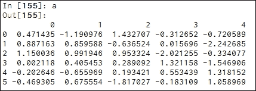
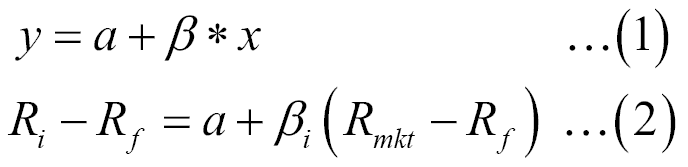

# 第六章。资本资产定价模型

**资本资产定价模型**（**CAPM**）可能是资产定价中使用最广泛的模型。其流行背后有几个原因。首先，它非常简单，因为它是一个单因素线性模型。其次，实施这种单因素模型非常容易。任何感兴趣的读者都可以下载上市公司的历史价格数据和市场指数数据，首先计算回报率，然后估计股票的市场风险。第三，这种最简单的单因素资产定价模型可以作为其他更高级模型的第一模型，例如第七章介绍的 Fama-French 三因子模型、Fama-French-Carhart 四因子模型和五因子模型（第七章，*多因子模型和绩效衡量*）。在本章中，将涵盖以下主题：

+   CAPM 介绍

+   如何从 Yahoo Finance 下载数据

+   滚动贝塔

+   多只股票的贝塔估计的几个 Python 程序

+   调整贝塔和投资组合贝塔估计

+   Scholes 和 Williams（1977 年）对贝塔的调整

+   Dimson（1979 年）对贝塔的调整

+   输出数据到各种类型的外部文件

+   简单的字符串操作

+   Canopy 平台上的 Python

# CAPM 介绍

根据著名的 CAPM，股票的预期回报与预期市场回报线性相关。在此，我们以国际商业机器（IBM）的股票为例，其股票代码为 IBM，这个线性单因素资产定价模型可适用于任何其他股票或投资组合。公式如下：


这里，`E()`表示期望值，*E(R[IBM])*是 IBM 的预期回报，*R[f]*是无风险利率，*E(R[mkt])*是预期市场回报。例如，标准普尔 500 指数可以作为市场指数。前述方程的斜率或是 IBM 的市场风险的度量。为了简化符号，可以省略期望值符号：


实际上，我们可以考虑股票超额回报与市场超额回报之间的关系。下面的公式本质上与前述公式相同，但解释更好更清晰：


回想一下，在第三章，*时间价值*，我们学到，股票预期回报与无风险利率之间的差异称为风险溢价。这对个别股票和市场指数都是如此。因此，*方程（3）*的含义非常容易解释：个别股票的风险溢价取决于两个因素：其市场风险和市场风险溢价。

在数学上，前述线性回归的斜率可以写成如下形式：


这里  是 IBM 股票回报与市场指数回报之间的协方差，! CAPM 简介 是市场回报的方差。由于 ，其中  是 IBM 回报与指数回报之间的相关性，上述方程可以写成以下形式：


贝塔值的含义是，当预期的市场风险溢价增加 1%时，个别股票的预期回报将增加β%；反之亦然。因此，贝塔（市场风险）可以视为一个放大器。所有股票的平均贝塔值为 1。因此，如果某只股票的贝塔值大于 1，则意味着其市场风险高于平均股票的市场风险。

以下几行代码是此示例的一个实现：

```py
>>> import numpy as np
>>> import statsmodels.api as sm
>>> y=[1,2,3,4,2,3,4]
>>> x=range(1,8)
>>> x=sm.add_constant(x)
>>> results=sm.OLS(y,x).fit()
>>> print(results.params)
     [ 1.28571429  0.35714286]
```

要查看 OLS 结果的所有信息，我们将使用 `print(results.summary())` 命令，参见以下屏幕截图：


此时，读者可以关注两个系数的值及其相应的 T 值和 P 值。我们将在第八章，*时间序列分析*中讨论其他结果，例如 Durbin-Watson 统计量和 Jarque-Bera 正态性检验。贝塔值为 0.3571，对应的 T 值为 2.152。由于 T 值大于 2，我们可以声明其显著不同于零。或者，根据 0.084 的 P 值，如果我们选择 10%作为临界点，我们也会得出相同的结论。以下是第二个示例：

```py
>>> from scipy import stats 
>>> ret = [0.065, 0.0265, -0.0593, -0.001,0.0346] 
>>> mktRet = [0.055, -0.09, -0.041,0.045,0.022] 
>>>(beta, alpha, r_value,p_value,std_err)=stats.linregress(ret,mktRet)
```

对应的结果如下所示：

```py
>>> print(beta, alpha) 
0.507743187877 -0.00848190035246
>>> print("R-squared=", r_value**2)
R-squared= 0.147885662966
>>> print("p-value =", p_value)
p-value = 0.522715523909
```

再次使用 `help()` 函数可以获取更多关于此函数的信息，参见以下的前几行：

```py
>>>help(stats.linregress)
```

`scipy.stats._stats_mstats_common` 模块中 `linregress` 函数的帮助：

```py
linregress(x, y=None)
```

计算两组测量数据的线性最小二乘回归。

参数 `x`，`y`：类似数组的两个测量集合。两个数组的长度应相同。如果只给定 `x`（且 `y=None`），则它必须是一个二维数组，其中一个维度的长度为 2。然后，通过沿着长度为 2 的维度拆分数组来获得两个测量集合。

对于第三个示例，我们生成一个已知截距和斜率的 `y` 和 `x` 观测值集，例如 *alpha=1* 和 *beta=0.8*，参见以下公式：


这里，*yi* 是因变量 `y` 的第 *i* 个观测值，1 是截距，0.8 是斜率（贝塔值），*xi* 是自变量 *x* 的第 *i* 个观测值，且


是随机值。对于上述方程，在生成了一组 `y` 和 `x` 数据后，我们可以进行线性回归。为此，使用了一组随机数：

```py
from scipy import stats 
import scipy as sp
sp.random.seed(12456)
alpha=1
beta=0.8
n=100
x=sp.arange(n)
y=alpha+beta*x+sp.random.rand(n)
(beta,alpha,r_value,p_value,std_err)=stats.linregress(y,x) 
print(alpha,beta) 
print("R-squared=", r_value**2)
print("p-value =", p_value)
```

在上述代码中，`sp.random.rand()`函数将会调用一组随机数。为了得到相同的一组随机数，使用了`sp.random.seed()`函数。换句话说，每当使用相同的种子时，任何程序员都会得到相同的随机数。这将在第十二章，*蒙特卡洛模拟*中详细讨论。结果如下：

```py
%run "C:/yan/teaching/Python2/codes/c6_02_random_OLS.py"
(-1.9648401142472594,1.2521836174247121,)
('R-squared=', 0.99987143193925765)
('p-value =', 1.7896498998980323e-192)
```

现在，让我们看看如何估算微软的贝塔值（市场风险）。假设我们对 2012 年 1 月 1 日到 2016 年 12 月 31 日这一时期的数据感兴趣，共计五年的数据。完整的 Python 程序如下：

```py
from scipy import stats 
from matplotlib.finance import quotes_historical_yahoo_ochl as getData
begdate=(2012,1,1)
enddate=(2016,12,31)

ticker='MSFT'
p =getData(ticker, begdate, enddate,asobject=True,adjusted=True)
retIBM = p.aclose[1:]/p.aclose[:1]-1

ticker='^GSPC'
p2 = getData(ticker, begdate, enddate,asobject=True,adjusted=True)
retMkt = p2.aclose[1:]/p2.aclose[:1]-1
(beta,alpha,r_value,p_value,std_err)=stats.linregress(retMkt,retIBM) 
print(alpha,beta) 
print("R-squared=", r_value**2)
print("p-value =", p_value)
```

要使用五年数据估算 IBM 的贝塔值，在前面的 Python 程序中，下载历史价格数据的主要函数是`matplotlib.finance.quotes_historical_yahoo_ochl`。这里是相关链接：[`matplotlib.org/api/finance_api.html`](https://matplotlib.org/api/finance_api.html)。`^GSPC`的股票代码代表 S&P500 市场指数。结果如下：


根据之前的结果，IBM 的贝塔值为 0.41，截距为 0.004。此外，R²为 0.36，P 值几乎为零。在前面的程序中，风险无关利率被忽略了。忽略它对贝塔值（斜率）的影响很小。在下一章，我们将展示如何在讨论 Fama-French 三因素模型时考虑风险无关利率。要获取更多关于`quotes_historical_yahoo_ochl`的信息，可以使用帮助函数：

```py
help(quotes_historical_yahoo_ochl)
Help on function quotes_historical_yahoo_ochl in 
module matplotlib.finance:
quotes_historical_yahoo_ochl(ticker, date1, date2, asobject=False, adjusted=True, cachename=None)
 Get historical data for ticker between date1 and date2.

See :func:`parse_yahoo_historical` for explanation of 
output formats and the *asobject* and *adjusted* kwargs.
Parameters
    ----------
ticker : str   stock ticker
date1 : sequence of form (year, month, day), `datetime`, 
           or `date` start date
date2 : sequence of form (year, month, day), `datetime`, or 
              `date`  end date
  cachename : str or `None`
            is the name of the local file cache.  If None, will
            default to the md5 hash or the url (which incorporates 
            the ticker and date range)
   Examples
    --------
    sp=f.quotes_historical_yahoo_ochl('^GSPC',d1,d2,asobject=True,
        adjusted=True)
      returns = (sp.open[1:] - sp.open[:-1])/sp.open[1:]
     [n,bins,patches] = hist(returns, 100)
     mu = mean(returns)
     sigma = std(returns)
     x = normpdf(bins, mu, sigma)
     plot(bins, x, color='red', lw=2)
```

显然，编写一个函数，通过三个输入值：股票代码、起始日期和结束日期，来获取数据是一个好主意，参见以下代码：

```py
from scipy import stats 
from matplotlib.finance import quotes_historical_yahoo_ochl as aa 
#
def dailyReturn(ticker,begdate,enddate):
     p = aa(ticker, begdate,enddate,asobject=True,adjusted=True)
     return p.aclose[1:]/p.aclose[:-1]-1
#
begdate=(2012,1,1)
enddate=(2017,1,9)
retIBM=dailyReturn("wmt",begdate,enddate)
retMkt=dailyReturn("^GSPC",begdate,enddate)
outputs=stats.linregress(retMkt,retIBM) 
print(outputs)
```

沃尔玛的贝塔值（市场风险）的输出结果如下：


另外，我们可以调用`p4f.dailyReturnYahoo()`函数，参见以下代码：

```py
import p4f
x=dailyReturn("ibm",(2016,1,1),(2016,1,10))
print(x)
Out[51]: array([-0.0007355 , -0.00500558, -0.01708957, -0.00925784])
```

# 移动贝塔值

有时，研究人员需要基于例如三年的移动窗口生成贝塔时间序列。在这种情况下，我们可以编写一个循环或双重循环。让我们来看一个更简单的例子：估算 IBM 在若干年的年化贝塔值。首先，让我们看看从日期变量中获取年份的两种方式：

```py
import datetime
today=datetime.date.today()
year=today.year                   # Method I
print(year)
2017
print(today.strftime("%Y"))       # Method II
 '2017'
```

用于估算年化贝塔值的 Python 程序如下：

```py
import numpy as np
import scipy as sp
import pandas as pd
from scipy import stats 
from matplotlib.finance import quotes_historical_yahoo_ochl 

def ret_f(ticker,begdate, enddate):
    p = quotes_historical_yahoo_ochl(ticker, begdate,    
    enddate,asobject=True,adjusted=True)
    return((p.aclose[1:] - p.aclose[:-1])/p.aclose[:-1])
#
begdate=(2010,1,1)
enddate=(2016,12,31)
#
y0=pd.Series(ret_f('IBM',begdate,enddate))
x0=pd.Series(ret_f('^GSPC',begdate,enddate))
#
d=quotes_historical_yahoo_ochl('^GSPC', begdate, enddate,asobject=True,adjusted=True).date[0:-1]
lag_year=d[0].strftime("%Y")
y1=[]
x1=[]
beta=[]
index0=[]
for i in sp.arange(1,len(d)):
    year=d[i].strftime("%Y")
    if(year==lag_year):
       x1.append(x0[i])
       y1.append(y0[i])
    else:
       (beta,alpha,r_value,p_value,std_err)=stats.linregress(y1,x1) 
       alpha=round(alpha,8)
       beta=round(beta,3)
       r_value=round(r_value,3)
       p_vaue=round(p_value,3)
       print(year,alpha,beta,r_value,p_value)
       x1=[]
       y1=[]
       lag_year=year
```

相应的输出结果如下：


# 调整后的贝塔值

许多研究人员和专业人士发现，贝塔值具有均值回归的趋势。这意味着，如果本期的贝塔值小于 1，那么下期贝塔值较高的概率较大。相反，如果当前贝塔值大于 1，下期贝塔值可能会较小。调整后的贝塔值的公式如下：


这里，*βadj*是调整后的贝塔值，*β*是我们估算的贝塔值。一个投资组合的贝塔值是投资组合中各个股票贝塔值的加权平均值：


这里是投资组合的贝塔，*wi* (*βi*)是其股票的权重（贝塔），*n*是投资组合中的股票数量。*wi*的权重按照以下公式计算：


这里*vi*是股票*i*的价值，前面公式中的分母是所有*vi*的和，即投资组合的价值。

## Scholes 和 William 调整后的贝塔

许多研究人员发现，*β*对于频繁交易的股票会存在上行偏差，而对于不常交易的股票则会存在下行偏差。为了克服这一点，Scholes 和 Williams 建议如下调整方法：


这里，*β*是股票或投资组合的贝塔，*ρm*是市场回报的自相关性。前面公式中的三个贝塔由以下三个方程定义：


这里，我们来看一下如何给数组添加滞后。程序在左侧面板，输出结果显示在右侧面板：

```py
import pandas as pd
import scipy as sp
x=sp.arange(1,5,0.5)
y=pd.DataFrame(x,columns=['Ret'])
y['Lag']=y.shift(1)
print(y)
```

在前面的程序中应用了`.shift()`函数。由于我们需要市场回报滞后一周期，我们可以在`.shift()`函数中指定一个负值`-1`，见以下代码：

```py
import pandas as pd
import scipy as sp
x=sp.arange(1,5,0.5)
y=pd.DataFrame(x,columns=['Ret'])
y['Lag']=y.shift(1)
y['Forward']=y['Ret'].shift(-1)
print(y)

    Ret Lag  Forward
0  1.0  NaN      1.5
1  1.5  1.0      2.0
2  2.0  1.5      2.5
3  2.5  2.0      3.0
4  3.0  2.5      3.5
5  3.5  3.0      4.0
6  4.0  3.5      4.5
7  4.5  4.0      NaN
```

输出结果如下：


首先，看看一个与每月数据相关的 Python 数据集，文件名为`yanMonthly.pkl`，[`canisius.edu/~yany/python/yanMonthly.pkl`](http://canisius.edu/~yany/python/yanMonthly.pkl)。以下代码将读取该数据集：

```py
import pandas as pd
x=pd.read_pickle("c:/temp/yanMonthly.pkl")
print(x[0:10])
```

相关输出显示如下：


让我们看看这个每月数据集中包含了哪些证券，见以下输出：

```py
import pandas as pd
import numpy as np
df=pd.read_pickle("c:/temp/yanMonthly.pkl")
unique=np.unique(df.index)
print(len(unique))
print(unique)
```

从这里显示的输出结果中，我们可以看到有`129`只证券：


为了获取 S&P500 数据，我们将使用^`GSPC`，因为这是 Yahoo!Finance 使用的股票代码：

```py
import pandas as pd
import numpy as np
df=pd.read_pickle("c:/temp/yanMonthly.pkl")
sp500=df[df.index=='^GSPC']
print(sp500[0:5])
ret=sp500['VALUE'].diff()/sp500['VALUE'].shift(1)
print(ret[0:5])
```

这里显示的是前 10 行：


在估计回报后，我们可以估计其滞后和领先，并进行三次不同的回归来估计这三个贝塔。

同样，Dimson（1979）建议以下方法来调整贝塔：


最常用的*k*值是*1*。因此，我们有以下公式：


由于这相当于运行一个三因子线性模型，我们将在下一章中讨论（第七章, *多因子模型与业绩衡量*）。

# 提取输出数据

在本节中，我们将讨论将输出数据提取到不同文件格式的不同方法。

## 输出数据到文本文件

以下代码将下载微软的每日价格数据，并保存到一个文本文件中：

```py
import pandas_datareader.data as getData
import re
ticker='msft'
f=open("c:/temp/msft.txt","w")
p = getData.DataReader(ticker, "google")
f.write(str(p))
f.close()
```

以下是一些保存的观察结果：


## 将数据保存为.csv 文件

以下程序首先获取 IBM 的价格数据，然后将其保存为`.csv`文件，路径为`c:/temp`：

```py
from matplotlib.finance import quotes_historical_yahoo_ochl as getData
import csv
f=open("c:/temp/c.csv","w")

ticker='c'
begdate=(2016,1,1)
enddate=(2017,1,9)
p = getData(ticker, begdate, enddate,asobject=True,adjusted=True)

writer = csv.writer(f)
writer.writerows(p)
f.close()
```

在前面的代码中，我们将`quotes_historical_yahoo_ochl()`函数重命名为`getData`，以便于使用。读者可以使用自己喜欢的名称。

## 将数据保存为 Excel 文件

以下程序首先获取 IBM 的价格数据，然后将其保存为`.csv`文件，路径为`c:/temp`：

```py
import pandas as pd
df=pd.read_csv("http://chart.yahoo.com/table.csv?s=IBM")
f= pd.ExcelWriter('c:/temp/ibm.xlsx')
df.to_excel(f, sheet_name='IBM')
f.save()
```

请注意，如果读者看到`No module named openpyxl`的错误信息，这意味着你需要首先安装该模块。以下截图展示了一些观察结果：


显然，我们很可能不会连接第一列，因为它只是无关的行列指示符：

```py
import pandas as pd
df=pd.read_csv("http://chart.yahoo.com/table.csv?s=IBM")
f= pd.ExcelWriter('c:/temp/ibm.xlsx')
df.to_excel(f,index=False,sheet_name='IBM')
f.save() 
```

## 将数据保存为 pickle 数据集

以下程序首先生成一个简单的数组，包含三个值。我们将它们保存到名为`tmp.bin`的二进制文件中，路径为`C:\temp\`：

```py
>>>import pandas as pd 
>>>import numpy as np 
>>>np.random.seed(1234) 
>>> a = pd.DataFrame(np.random.randn(6,5))
>>>a.to_pickle('c:/temp/a.pickle') 
```

名为`a`的数据集如下所示：



## 将数据保存为二进制文件

以下程序首先生成一个简单的数组，包含三个值。我们将它们保存到名为`tmp.bin`的二进制文件中，路径为`C:\temp\`：

```py
>>>import array 
>>>import numpy as np 
>>>outfile = "c:/temp/tmp.bin" 
>>>fileobj = open(outfile, mode='wb') 
>>>outvalues = array.array('f') 
>>>data=np.array([1,2,3]) 
>>>outvalues.fromlist(data.tolist()) 
>>>outvalues.tofile(fileobj) 
>>>fileobj.close()
```

## 从二进制文件读取数据

假设我们已经生成了一个名为`C:\temp\tmp.bin`的二进制文件，文件中包含三个数字：1、2 和 3。以下 Python 代码用于读取它们：

```py
>>>import array 
>>>infile=open("c:/temp/tmp.bin", "rb") 
>>>s=infile.read() # read all bytes into a string 
>>>d=array.array("f", s) # "f" for float 
>>>print(d) 
>>>infile.close()
```

`d`的内容如下：


# 简单字符串操作

对于 Python，我们可以直接将一个字符串赋值给变量，而无需事先定义：

```py
>>> x="This is great"
>>> type(x)
<class 'str'>
```

用于将有效利率转换为其他利率的公式中，第二个输入值是一个字符串。例如，`'s2a'`：

```py
>>> type='s2a'
>>> type[0]
's'
>>> len(type)
3
```

`len()`函数显示字符串的长度，见以下代码：

```py
>>>x='Hello World!'
>>>len(x)
13
```

这里是几种常用的子字符串选择方法：

```py
string='Hello World!'

# find the length of the string
n_length=len(string)
print(n_length)

# the number of appearance of letter l
n=string.count('l') 
print(n) 

# find teh locatoin of work of 'World'
loc=string.index("World") 
print(loc) 

# number of spaces
n2=string.count(' ')
print(n2)

print(string[0]) # print the first letter 
print(string[0:1]) # print the first letter (same as above)
print(string[0:3]) # print the first three letters
print(string[:3]) # same as above 
print(string[-3:]) # print the last three letters
print(string[3:]) # ignore the first three 
print(string[:-3]) # except the last three
```

相应的输出如下所示：


很多时候，我们希望去除前后多余的空格。在这种情况下，可以使用三个函数，分别是`strip()`、`lstrip()`和`rstrip()`：

```py
string='Hello World!'

print(string.lower())
print(string.title())
print(string.capitalize())
print(string.swapcase())

string2=string.replace("World", "John")
print(string2)

# strip() would remove spaces before and the end of string
# lstrip() would remove spaces before and the end of string
# rstrip() would remove spaces before and the end of string
string3=' Hello World! '
print(string3)
print(string3.strip())
print(string3.lstrip())
print(string3.rstrip())
```

输出如下所示：


以下 Python 程序生成了圣经中所有单词的频率表：

```py
from string import maketrans 
import pandas as pd 
word_freq = {}
infile="c:/temp/AV1611.txt"
word_list = open(infile, "r").read().split() 
ttt='!"#$%&()*+,./:;<=>?@[\\]^_`{|}~0123456789'
for word in word_list:
    word = word.translate(maketrans("",""),ttt )
    if word.startswith('-'): 
        word = word.replace('-','')
    if len(word): 
        word_freq[word] = word_freq.get(word, 0) + 1 
keys = sorted(word_freq.keys())
x=pd.DataFrame(keys) 
x.to_pickle('c:/temp/uniqueWordsBible.pkl')
```

有兴趣的读者可以从作者的网页下载 pickle 文件，地址为[`canisius.edu/~yany/python/uniqueWordsBible.pkl`](http://canisius.edu/~yany/python/uniqueWordsBible.pkl)。输入`x[0:10]`后，我们可以看到前 10 个单词，见以下截图：


# 通过 Canopy 运行 Python

本节是可选的，特别是对于那些没有 Python 或通过 Anaconda 使用 Python 的读者。如果您想让 Python 编程更容易，安装另一个超强包是个不错的主意。在本节中，我们将讨论两个简单的任务：如何通过 Canopy 安装 Python 以及如何检查和安装各种 Python 模块。要安装 Python，请访问相关网页：[`store.enthought.com/downloads/#default`](https://store.enthought.com/downloads/#default)。然后，您将看到以下屏幕：


根据操作系统的不同，您可以下载 Canopy，例如 32 位的 Windows 版本。启动 Canopy 后，以下屏幕将出现：


最常用的两个面板是**编辑器**和**包管理器**。点击**编辑器**后，将弹出以下面板：


显然，我们可以创建一个新文件，或者从现有程序中选择文件。让我们尝试最简单的一个；见下图。点击绿色按钮后，我们可以运行程序：


或者，我们可以点击菜单栏中的**运行**，然后选择相应的操作。Canopy 最重要的优势之一是，它可以极其方便地安装各种 Python 模块。点击**包管理器**后，我们将看到以下屏幕：


从左侧，我们可以看到已安装了 99 个包，还有 532 个可用包。假设名为`statsmodels`的 Python 模块没有预先安装。在左侧点击**可用**后，我们通过输入关键词来搜索该模块。找到该模块后，我们可以决定是否安装。通常，可能会有多个版本，见下图：


# 参考文献

请参考以下文章：

+   Carhart, Mark M., 1997, 《共同基金表现的持久性》，《金融学杂志》52, 57-82。

+   Fama, Eugene 和 Kenneth R. French, 1993, 《股票和债券回报的共同风险因素》，《金融经济学杂志》33, 3056。

+   Fama, Eugene 和 Kenneth R. French, 1992, 《预期股票回报的横截面》，《金融学杂志》47, 427-465。

+   字符串操作：[`www.pythonforbeginners.com/basics/string-manipulation-in-python`](http://www.pythonforbeginners.com/basics/string-manipulation-in-python)

**附录 A – 数据案例 #3 - 贝塔估计**

目标：通过实际操作估算给定公司组的市场风险：

1.  这些公司的 Alpha 和 Beta 值是多少？

1.  评论您的结果。

1.  基于您的月度回报率，S&P500 和无风险利率的年回报均值是多少？

1.  如果预期的市场年回报率为 12.5%，预期的无风险年利率为 0.25%，那么这些公司的股本成本是多少？

1.  投资组合的贝塔值是多少？

    计算工具：Python

    时间段：从 2011 年 2 月 1 日到 2016 年 12 月 31 日（过去五年）。

    技术细节：

    

| 序号 | 公司名称 | 股票代码 | 行业 | 股票数量 |
| --- | --- | --- | --- | --- |
| 1 | 沃尔玛商店公司 | WMT | 大型零售商 | 1000 |
| 2 | 苹果公司 | AAPL | 计算机 | 2000 |
| 3 | 国际商业机器公司 | IBM | 计算机 | 1500 |
| 4 | 通用电气公司 | GE | 科技 | 3000 |
| 5 | 花旗集团 | C | 银行 | 1800 |

数据下载和处理的步骤：

1.  股票月度价格数据来自雅虎财经 ([`finance.yahoo.com`](http://finance.yahoo.com))。

1.  计算月度回报数据。

1.  S&P500 被用作市场指数，其代码为`^GSPC`。

1.  我们使用法兰奇教授的月度数据集中的无风险利率作为我们的无风险利率。

1.  在合并这些数据集时，请注意它们的日期顺序。

**注意 1 – 如何下载数据？这里以 S&P500 为例（代码是^GSPC）：**

1.  访问雅虎财经 ([`finance.yahoo.com`](http://finance.yahoo.com))。

1.  输入`^GSPC`。

1.  点击**历史价格**。

1.  选择起始日期和结束日期。点击**获取价格**。

1.  滚动到页面底部并点击**下载到电子表格**。

1.  给文件命名，例如`sp500.csv`。

**注意 2 – 如何下载月度无风险利率？**

1.  访问法兰奇教授的数据库：[`mba.tuck.dartmouth.edu/pages/faculty/ken.french/data_library.html`](http://mba.tuck.dartmouth.edu/pages/faculty/ken.french/data_library.html)。

1.  选择 Fama-French 3 因子模型，见下图：

以下截图给出了前几行和最后几行的数据：


# 练习

1.  CAPM 是什么意思？它是一个线性模型吗？

1.  一因子线性模型的特点是什么？

1.  总风险和市场风险的定义是什么？你如何衡量它们？

1.  解释以下两个方程式的相似性和区别：

1.  一只股票的总风险与市场风险之间的关系是什么？

1.  谁应该关注 CAPM，或者这个模型有什么用途？

1.  如果股票 A 的市场风险高于股票 B，这是否意味着 A 的预期回报也更高？请解释。

1.  你如何衡量不同类型的风险？

1.  你如何预测预期的市场回报？

1.  如果我们知道预期的市场风险溢价，如何预测一家公司股本成本？

1.  以下的贝塔调整公式背后有什么逻辑？！练习

1.  构建一个不等权重的投资组合，权重分别为 20%、10%、30%、10%、10%和 20%。股票列表包括沃尔玛（WMT）、国际商业机器公司（IBM）、花旗集团（C）、微软（MSFT）、谷歌（GOOG）和戴尔（DELL）。估算这些股票在 2001 年至 2016 年的月度投资组合回报。

1.  查找 IBM 的贝塔值，访问雅虎财经，然后搜索 IBM，点击左侧的“关键统计数据”。[`finance.yahoo.com/q/ks?s=IBM+Key+Statistics`](http://finance.yahoo.com/q/ks?s=IBM+Key+Statistics)

    下载 IBM 的历史价格数据并估算其贝塔系数并进行比较。

1.  如果你使用五年的月度数据，DELL、IBM、GOOG 和 C 的总风险和市场风险是多少？

1.  编写一个 Python 程序，估算以下 10 只股票的*α*和*β*。所使用的时间范围应为过去五年（2012 年 1 月 2 日到 2017 年 1 月 10 日），并使用来自雅虎财经和联邦储备网站的月度数据（用于无风险利率）：

    |   | 公司名称 | 股票代码 | 行业 |
    | --- | --- | --- | --- |
    | 1 | 家庭美元商店 | FDO | 零售 |
    | 2 | 沃尔玛商店 | WMT | 大型超市 |
    | 3 | 麦当劳 | MCD | 餐饮 |
    | 4 | 戴尔 | DELL | 计算机硬件 |
    | 5 | 国际商业机器公司 | IBM | 计算机 |
    | 6 | 微软 | MSFT | 软件 |
    | 7 | 通用电气 | GE | 综合企业 |
    | 8 | 谷歌 | GOOG | 网络服务 |
    | 9 | 苹果 | AAPL | 计算机硬件 |
    | 10 | eBay | EBAY | 网络服务 |

1.  从这一章中我们知道，可以调用`p4f.dailyReturn`函数来下载某个股票代码的历史数据，并指定一个时间范围；参考以下代码：

    ```py
    import p4f
    x=dailyReturn("ibm",(2016,1,1),(2016,1,10))
    ```

    该函数如下所示：

    ```py
    def dailyReturn(ticker,begdate,enddate):
        from scipy import stats 
        from matplotlib.finance import quotes_historical_yahoo_ochl
        p = quotes_historical_yahoo_ochl(ticker, begdate,    
              enddate,asobject=True,adjusted=True)
        return p.aclose[1:]/p.aclose[:-1]-1
    ```

    显然，第二种和第三种起始日期和结束日期的输入格式不够用户友好；参考`dailyReturn("ibm",(2016,1,1),(2016,1,10))`。修改程序使其更加用户友好，例如`dailyReturn2("ibm", 20160101, 20160110)`。

1.  从雅虎财经下载股票价格数据（只要可能），比如 DELL、IBM 和 MSFT。然后计算它们在若干十年中的波动率。例如，估算 IBM 在多个五年期的波动率。波动率的趋势如何？

1.  市场指数之间（或其中）相关性是多少？例如，你可以下载标准普尔 500（其雅虎代码为`^GSPC`）和道琼斯工业平均指数（`^DJI`）的价格数据，时间范围为过去 10 年。然后估算它们的收益并计算相应的相关性。对结果进行评论。

1.  哪五只股票在 2006 到 2010 年期间与 IBM 的相关性最强？（提示：没有唯一答案。你可以尝试十几只股票）。

1.  2017 年 1 月 2 日，你的投资组合包含 2,000 股 IBM，1,500 股花旗集团，以及 500 股微软（MSFT）。这个投资组合的贝塔系数是多少？你可以使用过去五年的历史数据来运行 CAPM 模型。

1.  IBM 股票收益和微软(MSFT)的相关性是多少？

    ### 提示

    你可以使用过去 10 年的历史数据来估算相关性。

1.  找出以下代码中的问题并进行修正：

    ```py
    from scipy import stats 
    from matplotlib.finance import quotes_historical_yahoo_ochl

    def dailyReturn(ticker,begdate=(1962,1,1),enddate=(2017,1,10)):
    p = quotes_historical_yahoo_ochl(ticker, begdate, enddate,asobject=True,adjusted=True)
    return p.aclose[1:]/p.aclose[:-1]-1

    retIBM=dailyReturn("wmt")
    retMkt=dailyReturn("^GSPC")

    outputs=stats.linregress(retIBM,retMkt) 
    print(outputs)
    ```

1.  编写一个名为`beta()`的 Python 函数，利用过去五年的历史数据及标准普尔 500 指数，提供一个贝塔值及其显著性值，如 T 值或 P 值。

# 总结

**资本资产定价模型**（**CAPM**）可能是资产定价中最广泛使用的模型。其流行背后有几个原因。首先，它非常简单。它只是一个单因子线性模型。其次，实现这个单因子模型相当容易。任何感兴趣的读者都可以下载上市公司和市场指数的历史价格数据，以计算它们的回报率，然后估算该股票的市场风险。第三，这个最简单的单因子资产定价模型可以作为其他更高级模型的基础，比如 Fama-French 三因子模型、Fama-French-Carhart 四因子模型和 Fama-French 五因子模型，这些将在下一章介绍。
