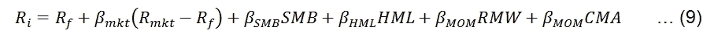
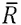

# 第七章：多因子模型与绩效衡量

在第六章，*资本资产定价模型*中，我们讨论了最简单的单因子线性模型：CAPM。如前所述，这个单因子线性模型作为更高级和复杂模型的基准。在本章中，我们将重点讨论著名的 Fama-French 三因子模型、Fama-French-Carhart 四因子模型和 Fama-French 五因子模型。理解这些模型后，读者应该能够开发自己的多因子线性模型，例如通过添加**国内生产总值**（**GDP**）、**消费者价格指数**（**CPI**）、商业周期指标或其他变量作为额外的因子。此外，我们还将讨论绩效衡量标准，如夏普比率、特雷诺比率和詹森阿尔法。具体来说，本章将涵盖以下主题：

+   Fama-French 三因子模型介绍

+   Fama-French-Carhart 四因子模型

+   Fama-French 五因子模型

+   其他多因子模型

+   夏普比率和特雷诺比率

+   下偏标准差和 Sortino 比率

+   詹森阿尔法

+   如何合并不同的数据集

# Fama-French 三因子模型介绍

在讨论 Fama-French 三因子模型和其他模型之前，我们先看一下三因子线性模型的通用方程式：


在这里，*y*是因变量，*α*是截距，*x1*、*x2*和*x3*是三个自变量，*β1*、*β2*和*β3*是三个系数，ε是随机因素。换句话说，我们尝试用三个自变量来解释一个因变量。与单因子线性模型相同，这个三因子线性模型的图形表示是一条直线，位于四维空间中，每个自变量的权重也是一个单位。在这里，我们将通过两个简单的例子来展示如何进行多因子线性回归。第一个例子中，我们有以下代码。数值没有特定的含义，读者也可以输入自己的数值：

```py
from pandas.stats.api import ols
import pandas as pd
y = [0.065, 0.0265, -0.0593, -0.001,0.0346] 
x1 = [0.055, -0.09, -0.041,0.045,0.022]
x2 = [0.025, 0.10, 0.021,0.145,0.012]
x3=  [0.015, -0.08, 0.341,0.245,-0.022]
df=pd.DataFrame({"y":y,"x1":x1, 'x2':x2,'x3':x3})
result=ols(y=df['y'],x=df[['x1','x2','x3']])
print(result)
```

在前面的程序中，应用了`pandas.stats.api.ols()`函数。**OLS**代表**最小二乘法**。有关 OLS 模型的更多信息，我们可以使用`help()`函数；请参阅以下两行代码。为了简洁起见，输出结果在此未显示：

```py
from pandas.stats.api import ols
help(ols) 
```

pandas DataFrame 用于构建我们的数据集。读者应注意{`"y":y`，`"x1":x1`，`'x2':x2`，`'x3':x3`}的结构。它采用字典的数据格式。运行回归的结果如下所示：


从输出结果来看，三因子模型首先列出：`y` 对应三个独立或可解释变量 `x1`、`x2` 和 `x3`。观察次数为 5，而自由度为 4。R2 的值为 0.96，调整后的 R2 为 0.84。R2 值反映了 `x1`、`x2` 和 `x3` 可以解释的 `y` 变动的百分比。由于调整后的 R2 考虑了独立变量的数量影响，因此更具意义。**RMSE** 代表 **均方根误差**，这个值越小，我们的模型越好。F 统计量和 p 值反映了我们线性模型的优度。F 值反映了整个模型的质量。F 值应与其临界 F 值进行比较，临界 F 值又取决于三个输入变量：置信水平、分子的自由度和分母的自由度。可以使用 `scipy.stats.f.ppf()` 函数来计算临界 F 值；请参见以下代码：

```py
import scipy.stats as stats
alpha=0.05
dfNumerator=3
dfDenominator=1
f=stats.f.ppf(q=1-alpha, dfn=dfNumerator, dfd=dfDenominator)
print(f)
215.70734537
```

置信水平等于 1 减去 alpha，即在此案例中为 95%。置信水平越高，结果越可靠，例如 99% 而非 95%。最常用的置信水平有 90%、95% 和 99%。`dfNumerator`（`dfDenominator`）是分子（分母）的自由度，这取决于样本大小。从前面的 OLS 回归结果来看，我们知道这两个值分别是 3 和 1。

根据前面的值，*F=8.1 < 215.7*（临界 F 值），我们应当接受原假设，即所有系数为零，也就是说模型的质量不佳。另一方面，P 值为 0.25，远高于临界值 0.05。这也意味着我们应该接受原假设。这是合理的，因为我们输入的这些值并没有实际意义。

在第二个例子中，使用了一个与 IBM 相关的 CSV 文件，该文件从 Yahoo! Finance 下载，数据集可以在[`canisius.edu/~yany/data/ibm.csv`](http://canisius.edu/~yany/data/ibm.csv)下载。或者，读者也可以访问[`finance.yahoo.com/`](http://finance.yahoo.com/)下载 IBM 的历史数据。以下是前几行内容：


`Date` 是日期变量，`Open` 是开盘价，`High (Low)` 是期间内的最高（最低）价，`Close` 是收盘价，`Volume` 是交易量，`Adj.Close` 是调整后的收盘价，已经考虑了股票拆分和股息分配。在下面的 Python 程序中，我们尝试用 `Open`、`High` 和 `Volume` 三个变量来解释 `Adj.Close`；请参见以下方程式：


再次强调，这个 OLS 回归只是作为一个示范，展示如何运行三因子模型，它可能没有任何经济意义。这个示例的美妙之处在于，我们可以轻松获得数据并测试我们的 Python 程序：

```py
import pandas as pd
import numpy as np
import statsmodels.api as sm
inFile='http://canisius.edu/~yany/data/ibm.csv'
df = pd.read_csv(inFile, index_col=0)
x = df[['Open', 'High', 'Volume']]
y = df['Adj.Close']
x = sm.add_constant(x)
result = sm.OLS(y, x).fit()
print(result.summary())
```

前三条命令导入了三个 Python 模块。`x=sm.add_constant(x)`这条命令将会为数据添加一列 1。如果没有这一行，我们会强制设置零截距。为了丰富运行三因子线性模型的经验，这次应用了不同的 OLS 函数。使用`statsmodels.apilsm.OLS()`函数的优势在于，我们可以获得更多关于结果的信息，例如**赤池信息量准则**（**AIC**）、**贝叶斯信息量准则**（**BIC**）、偏度和峰度。它们的定义将在下一章（第八章，*时间序列分析*）中讨论。运行前面的 Python 程序后的相应输出如下：


同样，我们将避免花时间解释结果，因为我们当前的目标是展示如何运行三因子回归。

# Fama-French 三因子模型

回顾 CAPM 模型，它的形式如下：


在这里，*E()*是期望，*E(Ri)*是股票*i*的预期收益，*Rf*是无风险利率，*E(Rmkt)*是预期市场收益。例如，S&P500 指数可以作为市场指数。上面方程的斜率 () 是股票市场风险的度量。为了求出的值，我们进行线性回归。Fama-French 三因子模型可以看作是 CAPM 模型的自然扩展，详见此处：


*Ri*、*Rf* 和 *Rmkt* 的定义保持不变。*SMB* 是小盘股的投资组合收益减去大盘股的投资组合收益；*HML* 是高账面市值比的投资组合收益减去低账面市值比的投资组合收益。Fama/French 因子是通过基于市值和账面市值比形成的六个价值加权投资组合构建的。**Small Minus Big**（**SMB**）是三个小盘股投资组合的平均收益减去三个大盘股投资组合的平均收益。根据市值（通过市场资本化计算，即流通股数乘以年末股价）来分类所有股票为两类，**S**（小型）和**H**（大型）。类似地，基于账面市值比来将所有股票分类为三组：**H**（高）、**M**（中）、**L**（低）。最终，我们可以得到以下六组：

|   | 按大小排序为两组 |
| --- | --- |
| 按账面市值比排序成三组 |   |   |
| --- | --- | --- |
| SH | BH |   |
| SM | BM |   |
| SL | BL |   |

SMB 由以下六个投资组合构成：


当股本账面价值与市值比率较低（较高）时，这些股票被称为成长型（价值型）股票。因此，我们可以使用另一公式；见下：


**高减低**（**HML**）是两组价值型投资组合的平均回报减去两组成长型投资组合的平均回报；见下方公式：


Rm-Rf，市场超额收益率，所有在美国注册并在 NYSE、AMEX 或 NASDAQ 上市的 CRSP 公司加权平均收益，这些公司在月初时具有 CRSP 股票代码 10 或 11，月初有良好的股票和价格数据，且有 t 月份的良好回报数据，减去 1 个月的国债利率（来源：Ibbotson Associates）。以下程序检索 Fama-French 月度因子，并生成一个`.pickle`格式的数据集。Fama-French 月度数据集的 pandas `.pickle`格式文件可以从[`www.canisius.edu/~yany/python/ffMonthly.pkl`](http://www.canisius.edu/~yany/python/ffMonthly.pkl)下载：

```py
import pandas as pd
x=pd.read_pickle("c:/temp/ffMonthly.pkl")
print(x.head())
print(x.tail())
```

对应的输出如下所示：


接下来，我们展示如何使用 5 年期的月度数据运行 Fama-French 三因子回归。额外的步骤是首先下载历史价格数据。然后我们计算月度收益并将其转换为月度数据，最后与月度 Fama-French 三因子时间序列合并：

```py
from matplotlib.finance import quotes_historical_yahoo_ochl as getData
import numpy as np
import pandas as pd
import scipy as sp
import statsmodels.api as sm

ticker='IBM'
begdate=(2012,1,1)
enddate=(2016,12,31)

p= getData(ticker, begdate, enddate,asobject=True, adjusted=True)
logret = sp.log(p.aclose[1:]/p.aclose[:-1])

ddate=[]
d0=p.date

for i in range(0,sp.size(logret)):
    x=''.join([d0[i].strftime("%Y"),d0[i].strftime("%m"),"01"])
    ddate.append(pd.to_datetime(x, format='%Y%m%d').date())

t=pd.DataFrame(logret,np.array(ddate),columns=[''RET''])
ret=sp.exp(t.groupby(t.index).sum())-1
ff=pd.read_pickle('c:/temp/ffMonthly.pkl')
final=pd.merge(ret,ff,left_index=True,right_index=True)
y=final[''RET'']
x=final[[''MKT_RF'',''SMB'',''HML'']]
x=sm.add_constant(x)
results=sm.OLS(y,x).fit()
print(results.summary())
```

在前面的程序中，起始日期为 2012 年 1 月 1 日，结束日期为 2016 年 12 月 31 日。获取每日价格数据后，我们估算每日收益率，然后将其转换为月度收益率。已上传 Fama-French 月度三因子时间序列，格式为 pandas 的`.pickle`。在前面的程序中，`np.array(date,dtype=int64)`的使用是为了确保两个索引具有相同的数据类型。对应的输出如下：


为了节省空间，我们将不讨论结果。

# Fama-French-Carhart 四因子模型和 Fama-French 五因子模型

Jegadeesh 和 Titman（1993）展示了一种有利可图的动量交易策略：买入赢家，卖出输家。基本假设是，在短期内，比如 6 个月，赢家将继续是赢家，而输家将继续是输家。例如，我们可以根据过去 6 个月的累计总回报，将赢家与输家进行分类。假设我们处于 1965 年 1 月，首先估算过去 6 个月的总回报。然后根据总回报将它们从高到低排序，分为 10 个投资组合。排名前 10%（后 10%）被标记为赢家（输家）。我们做多赢家投资组合，做空输家投资组合，持仓期为 6 个月。下个月，即 1965 年 2 月，我们重复相同的操作。从 1965 年 1 月到 1989 年 12 月，Jegadeesh 和 Titman（1993）的实证结果表明，这种交易策略每月可以产生 0.95% 的回报。基于这一结果，Carhart（2000）将动量因素作为第四因子加入到 Fama-French 三因子模型中：


在这里，*MOM* 是动量因子。以下代码可以上传 `ffcMonthly.pkl` 并打印出前几行和后几行。该 Python 数据集可以从作者的网站下载：[`www.canisius.edu/~yany/python/ffcMonthly.pkl`](http://www.canisius.edu/~yany/python/ffcMonthly.pkl)：

```py
import pandas as pd
x=pd.read_pickle("c:/temp/ffcMonthly.pkl")
print(x.head())
print(x.tail())
```

输出结果如下所示：


在 2015 年，Fama 和 French 开发了所谓的五因子模型；见下方公式：



在前面的方程中，*RMW* 是强盈利和弱盈利股票组合回报的差异，*CMA* 是低投资和高投资公司股票组合回报的差异，Fama 和 French 将其称为保守型和激进型。如果五个因子的暴露能够捕捉到所有预期回报的变化，那么所有证券和投资组合 *i* 的截距应该为零。再次说明，由于运行 Fama-French 五因子模型与运行 Fama-French 三因子模型非常相似，这里我们不展示如何运行五因子模型。相反，以下代码展示了一个名为 `ffMonthly5.pkl` 的 Python 数据集的前几行和后几行。该 Python 数据集可以从作者的网站下载：[`www.canisius.edu/~yany/python/ffMonthly5.pkl`](http://www.canisius.edu/~yany/python/ffMonthly5.pkl)：

```py
import pandas as pd
x=pd.read_pickle("c:/temp/ffMonthly5.pkl")
print(x.head())
print(x.tail())
```

相应的输出结果如下所示：


按照相同的思路，对于日频数据，我们有几个数据集，分别是 `ffDaily`、`ffcDaily` 和 `ffDaily5`；有关更多细节，请参见 *附录 A – 相关 Python 数据集列表*。

# Dimson（1979）对贝塔值的调整实现

Dimson（1979）建议以下方法：


最常用的*k*值是*1*。因此，我们得到以下方程：


在运行基于前述方程的回归之前，先解释两个名为`.diff()`和`.shift()`的函数。这里，我们随机选择了五个价格。然后我们估算它们的价格差回报，并添加滞后和前向回报：

```py
import pandas as pd
import scipy as sp

price=[10,11,12.2,14.0,12]
x=pd.DataFrame({'Price':price})
x['diff']=x.diff()
x['Ret']=x['Price'].diff()/x['Price'].shift(1)
x['RetLag']=x['Ret'].shift(1)
x['RetLead']=x['Ret'].shift(-1)
print(x)
```

输出如下所示：


显然，价格时间序列是假定从最旧到最新的。差异定义为*p(i) – p(i-1)*。因此，第一个差异是`NaN`，即缺失值。我们来看第 4 期，即`index=3`。差异为*1.8（14-12.2）*，回报率为*(14-12.2)/12.2= 0.147541*。滞后回报将是这一期之前的回报，即*0.109091*，而前向回报将是下一期的回报，即*-0.142857*。在下面的 Python 程序中，我们演示了如何运行之前的程序来分析 IBM 股票：

```py
import pandas as pd
import numpy as np
from pandas.stats.api import ols

df=pd.read_pickle("c:/temp/yanMonthly.pkl")
sp500=df[df.index=='^GSPC']
sp500['retMkt']=sp500['VALUE'].diff()/sp500['VALUE'].shift(1)
sp500['retMktLag']=sp500['retMkt'].shift(1)
sp500['retMktLead']=sp500['retMkt'].shift(-1)

ibm=df[df.index=='IBM']
ibm['RET']=ibm['VALUE'].diff()/ibm['VALUE'].shift(1)
y=pd.DataFrame(ibm[['DATE','RET']])
x=pd.DataFrame(sp500[['DATE','retMkt','retMktLag','retMktLead']])
data=pd.merge(x,y)

result=ols(y=data['RET'],x=data[['retMkt','retMktLag','retMktLead']])
print(result)
```

输出如下所示：


# 绩效度量

为了比较共同函数或单个股票的表现，我们需要一个绩效度量。在金融中，我们知道投资者应在风险和回报之间寻求平衡。说投资组合 A 比投资组合 B 更好可能不是一个好主意，因为前者去年给我们带来了 30%的回报，而后者仅带来了 8%的回报。显而易见的原因是我们不应忽视风险因素。因此，我们常常听到“风险调整回报”这个词。 在本节中，将讨论夏普比率、特雷诺比率、索提诺比率和詹森α。夏普比率是一个广泛使用的绩效度量，定义如下：


在这里，是一个投资组合或股票的平均回报，是无风险证券的平均回报，σ是超额投资组合（股票）回报的方差，VaR 是超额投资组合（股票）回报的方差。以下代码用于估算假设的无风险利率下的夏普比率：

```py
import pandas as pd
import scipy as sp
df=pd.read_pickle("c:/temp/yanMonthly.pkl")
rf=0.01
ibm=df[df.index=='IBM']
ibm['RET']=ibm['VALUE'].diff()/ibm['VALUE'].shift(1)
ret=ibm['RET']
sharpe=sp.mean((ret)-rf)/sp.std(ret)
print(sharpe)
```

夏普比率为-0.00826559763423\。以下代码将直接从 Yahoo! Finance 下载每日数据，然后在不考虑无风险利率影响的情况下估算夏普比率：

```py
import scipy as sp
from matplotlib.finance import quotes_historical_yahoo_ochl as getData
begdate=(2012,1,1)
enddate=(2016,12,31)
def ret_f(ticker,begdate,enddate):
     p = getData(ticker,begdate, enddate,asobject=True,adjusted=True)
     return(p.aclose[1:]/p.aclose[:-1]-1)
y=ret_f('IBM',begdate,enddate)
sharpe=sp.mean(y)/sp.std(y)
print(sharpe)
```

结果是`0.00686555838073`。基于前面的代码，开发了一个 Python 程序，并提供了更多解释和两个示例；详情请参见*附录 C*。Sharpe 比率考虑的是总风险，因为标准差作为分母。这个衡量标准适用于当考虑的投资组合是公司或个人的所有财富时。在第六章，*资本资产定价模型*中，我们认为理性投资者在估计预期收益时，应仅考虑市场风险而非总风险。因此，当考虑的投资组合只是部分财富时，使用总风险并不合适。由于这一点，Treynor 建议使用 beta 作为分母：


唯一的修改是将 sigma（总风险）替换为 beta（市场风险）。另一个反对在 Sharpe 比率中使用标准差的理由是，它考虑了均值上下两个方向的偏差。然而，我们知道投资者更担心下行风险（低于均值的偏差）。Sharpe 比率的第二个问题是，对于分子，我们将平均收益与无风险利率进行比较。然而，对于分母，偏差是基于均值回报的，而不是同样的无风险利率。为了克服这两个缺点，开发了所谓的**下行部分标准差**（**LPSD**）。假设我们有 n 个回报和一个**无风险利率**（**Rf**）。进一步假设有 m 个回报低于这个无风险利率。LPSD 在此定义：


或者，我们有以下等效的公式：


Sortino 比率在此定义：


我们可以编写一个 Python 程序来估算 Sortino 比率；请参见以下代码。为了确保获得相同的一组随机数，`sp.random.seed()`函数中应使用相同的种子：

```py
import scipy as sp
import numpy as np

mean=0.10;
Rf=0.02
std=0.20
n=100
sp.random.seed(12456)
x=sp.random.normal(loc=mean,scale=std,size=n)
print("std=", sp.std(x))

y=x[x-Rf<0]  
m=len(y)
total=0.0
for i in sp.arange(m):
    total+=(y[i]-Rf)**2

LPSD=total/(m-1)
print("y=",y)
print("LPSD=",LPSD)
```

相应的输出如下所示：


从输出中，标准差为`0.22`，而 LPSD 值为`0.045`。对于共同基金经理来说，获得一个正的 alpha 值是非常重要的。因此，alpha 值或 Jensen's alpha 是一个绩效衡量标准。Jensen's alpha 定义为实际收益与预期收益之间的差异。其公式如下：


# 如何合并不同的数据集

合并不同的数据集是一个常见的任务，比如将指数数据与股票数据等进行合并。因此，了解合并不同数据集的机制非常重要。这里讨论了`pandas.merge()`函数：

```py
import pandas as pd
import scipy as s
x= pd.DataFrame({'key': ['K0', 'K1', 'K2', 'K3'],
                 'A': ['A0', 'A1', 'A2', 'A3'],
                 'B': ['B0', 'B1', 'B2', 'B3']})
y = pd.DataFrame({'key': ['K0', 'K1', 'K2', 'K6'],
                 'C': ['C0', 'C1', 'C2', 'C3'],
                 'D': ['D0', 'D1', 'D2', 'D3']})
```

`x`和`y`的大小是`4`行`3`列，即四行三列；请参见以下代码：

```py
print(sp.shape(x))
print(x)
```

输出如下所示：


```py
print(sp.shape(y))
print(y)
```


假设我们打算基于名为`key`的变量进行合并，这是两个数据集共享的共同变量。由于该变量的共同值为 K0、K1 和 K2，最终结果应该有三行五列，因为 K3 和 K6 不是两个数据集的共同值；请参见这里显示的结果：

```py
result = pd.merge(x,y, on='key')
print(result)
```

输出结果如下：


由于`key`是两个数据集共享的，我们可以简单地忽略它；请参见以下代码。换句话说，`result`和`result2`是相同的：

```py
result2 = pd.merge(x,y)
print(result2)
```

`pandas.merge()`函数的完整含义如下：

```py
pd.merge(left, right, how='inner', on=None, left_on=None, right_on = None,left_index=False, right_index=False, sort=True,suffixes=('_x', '_y'), copy=True, indicator=False)
```

对于前两个输入变量，`left`是第一个输入数据集，而`right`是第二个输入数据集。对于`how=`条件，我们有以下四种可能的情况：

| `how='inner'` | 含义 | 描述 |
| --- | --- | --- |
| 内连接 | INNER JOIN | 使用两个框架的键的交集 |
| 外连接 | FULL OUTER JOIN | 使用两个框架的键的并集 |
| 左连接 | LEFT OUTER JOIN | 仅使用左框架的键 |
| 右连接 | RIGHT OUTER JOIN | 仅使用右框架的键 |

> 表 7.1 四种连接条件的含义：内连接、外连接、左连接和右连接

内连接的格式要求两个数据集必须有相同的项目。一个类比是来自有父母的家庭的学生。左连接基于左数据集。换句话说，我们的基准是第一个数据集（`left`）。一个类比是从只有妈妈的家庭中选择学生。右连接与左连接相反，也就是说，基准是第二个数据集（`right`）。外连接是包含两个数据集的完整数据集，就像所有家庭的学生一样：有父母的、只有妈妈的和只有爸爸的。

在以下示例中，第一个数据集有 4 年的数据。这些值没有特定的含义，读者可以使用自己的值。我们的共同变量是`YEAR`。对于第一个数据集，我们有 4 年的数据：`2010`、`2011`、`2012`和`2013`。对于第二个数据集，我们有`2011`、`2013`、`2014`和`2015`。显然，只有 2 年是重叠的。总共有 6 年的数据：

```py
import pandas as pd
import scipy as sp
x= pd.DataFrame({'YEAR': [2010,2011, 2012, 2013],
'IBM': [0.2, -0.3, 0.13, -0.2],
'WMT': [0.1, 0, 0.05, 0.23]})
y = pd.DataFrame({'YEAR': [2011,2013,2014, 2015],
'C': [0.12, 0.23, 0.11, -0.1],
'SP500': [0.1,0.17, -0.05, 0.13]})

print(pd.merge(x,y, on='YEAR'))
print(pd.merge(x,y, on='YEAR',how='outer'))
print(pd.merge(x,y, on='YEAR',how='left'))
print(pd.merge(x,y, on='YEAR',how='right'))
```

四个输出结果如下：


当两个数据集中的共同变量有不同的名称时，我们应该通过使用`left_on='left_name'`和`right_on='another_name'`来指定它们的名称；请参见以下代码：

```py
import pandas as pd
import scipy as sp
x= pd.DataFrame({'YEAR': [2010,2011, 2012, 2013],
                 'IBM': [0.2, -0.3, 0.13, -0.2],
                 'WMT': [0.1, 0, 0.05, 0.23]})
y = pd.DataFrame({'date': [2011,2013,2014, 2015],
                 'C': [0.12, 0.23, 0.11, -0.1],
                 'SP500': [0.1,0.17, -0.05, 0.13]})
print(pd.merge(x,y, left_on='YEAR',right_on='date'))
```

如果我们打算基于索引（行号）进行合并，我们指定`left_index='True'`和`right_index='True'`；请参见以下代码。从某种意义上讲，由于两个数据集都有四行数据，我们只是将它们逐行放在一起。真正的原因是，对于这两个数据集，没有特定的索引。做个对比，`ffMonthly.pkl`数据的索引是日期：

```py
import pandas as pd
import scipy as sp
x= pd.DataFrame({'YEAR': [2010,2011, 2012, 2013],
                 'IBM': [0.2, -0.3, 0.13, -0.2],
                 'WMT': [0.1, 0, 0.05, 0.23]})
y = pd.DataFrame({'date': [2011,2013,2014, 2015],
                 'C': [0.12, 0.23, 0.11, -0.1],
                 'SP500': [0.1,0.17, -0.05, 0.13]})
print(pd.merge(x,y, right_index=True,left_index=True))
```

输出结果如下所示。再次强调，我们仅通过合并不同年份的数据来展示结果，而不考虑其经济含义：


这里是另一个基于索引合并的示例，其中`date`作为两个数据集的索引：

```py
import pandas as pd
ff=pd.read_pickle("c:/temp/ffMonthly.pkl")
print(ff.head(2))
mom=pd.read_pickle("c:/temp/ffMomMonthly.pkl")
print(mom.head(3))
x=pd.merge(ff,mom,left_index=True,right_index=True)
print(x.head(2))
```

两个数据集均可用，例如，[`canisius.edu/~yany/python/ffMonthly.pkl`](http://canisius.edu/~yany/python/ffMonthly.pkl)。输出结果如下所示：


有时候，我们需要根据两个键（如股票`ID`和`date`）合并两个数据集；请参见这里的格式：

```py
result = pd.merge(left, right, how='left', on=['key1', 'key2'])
```

我们通过输入一些假设的值来举一个例子：

```py
import pandas as pd
x= pd.DataFrame({'ID': ['IBM', 'IBM', 'WMT', 'WMT'],
'date': [2010, 2011, 2010, 2011],
'SharesOut': [100, 40, 60, 90],
'Asset': [20, 30, 10, 30]})

y = pd.DataFrame({'ID': ['IBM', 'IBM', 'C', 'WMT'],
'date': [2010, 2014, 2010, 2010],
'Ret': [0.1, 0.2, -0.1,0.2],
'ROA': [0.04,-0.02,0.03,0.1]})

z= pd.merge(x,y, on=['ID', 'date'])
```

对于第一个数据集，我们有两只股票在`2010`年和`2011`年的流通股数据。第二个数据集包含三只股票在 2 年（`2010`年和`2014`年）中的年度回报率和资产回报率（ROA）数据。我们的目标是通过股票`ID`和`date`（年份）将这两个数据集合并。输出结果如下所示：


在了解如何运行多因子回归和如何合并不同的数据集之后，读者将能够添加自己的因子。一个问题是，一些因子的频率可能不同，例如季度 GDP 而非月度数据。对于这种情况，我们可以使用各种方法来填充这些缺失的值；请参见以下示例：

```py
import pandas as pd
GDP=pd.read_pickle("c:/temp/usGDPquarterly.pkl")
ff=pd.read_pickle("c:/temp/ffMonthly.pkl")
final=pd.merge(ff,GDP,left_index=True,right_index=True,how='left') 
tt=final['AdjustedGDPannualBillion']
GDP2=pd.Series(tt).interpolate()
final['GDP2']=GDP2

print(GDP.head())
print(ff.head())
print(final.tail(10))
```

输出结果如下所示：


读者应当将这两个 GDP 时间序列与其影响进行对比。

## 附录 A – 相关 Python 数据集列表

这些数据集的前缀是[`canisius.edu/~yany/python`](http://canisius.edu/~yany/python)。例如，对于`ffMonthly.pkl`，我们可以使用[`canisius.edu/~yany/python/ffMonthly.pkl`](http://canisius.edu/~yany/python/ffMonthly.pkl)：

| 文件名 | 描述 |
| --- | --- |
| `ibm3factor.pkl` | IBM 的 FF 三因子模型的简单数据集 |
| `ffMonthly.pkl` | Fama-French 月度三因子数据 |
| `ffMomMonthly.pkl` | 月度动量因子 |
| `ffcMonthly.pkl` | Fama-French-Carhart 月度四因子数据 |
| `ffMonthly5.pkl` | Fama-French 月度五因子数据 |
| `yanMonthly.pkl` | 作者生成的月度数据集 |
| `ffDaily.pkl` | Fama-French-Carhart 日度四因子数据 |
| `ffcDaily.pkl` | Fama-French 日度五因子数据 |
| `ffDaily5.pkl` | Fama-French 月度四因子数据 |
| `usGDPquarterly.pkl` | 美国季度 GDP 数据 |
| `usDebt.pkl` | 美国国债水平 |
| `usCPImonthly.pkl` | 消费者价格指数（CPI）数据 |
| `tradingDaysMonthly.pkl` | 月度数据的交易日数据 |
| `tradingDaysDaily.pkl` | 日度数据的交易日数据 |
| `businessCycleIndicator.pkl` | 商业周期指标 |
| `businessCycleIndicator2.pkl` | 另一个商业周期指标 |
| `uniqueWordsBible.pkl` | 圣经中的所有唯一单词 |

一个示例代码如下所示：

```py
import pandas as pd
x=pd.read_pickle("c:/temp/ffMonthly.pkl")
print(x.head())
print(x.tail())
```

输出结果如下所示：


## 附录 B – 生成 ffMonthly.pkl 的 Python 程序

以下程序用于生成名为 `ffMonthly.pkl` 的数据集：

```py
import scipy as sp
import numpy as np
import pandas as pd
file=open("c:/temp/ffMonthly.txt","r")
data=file.readlines()
f=[]
index=[]
for i in range(4,sp.size(data)):
print(data[i].split())
t=data[i].split()
index.append(pd.to_datetime(t[0]+'01', format='%Y%m%d').date())
#index.append(int(t[0]))
for j in range(1,5):
k=float(t[j])
f.append(k/100)
n=len(f) 
f1=np.reshape(f,[n/4,4])
ff=pd.DataFrame(f1,index=index,columns=['MKT_RF','SMB','HML','Rf'])
ff.to_pickle("c:/temp/ffMonthly.pkl")
```

这里显示的是前几行和最后几行：


## 附录 C – Sharpe 比率的 Python 程序

```py
def sharpeRatio(ticker,begdate=(2012,1,1),enddate=(2016,12,31)):
    Objective: estimate Sharpe ratio for stock
        ticker  : stock symbol 
        begdate : beginning date
        enddate : ending date

       Example #1: sharpeRatio("ibm")
                     0.0068655583807256159

       Example #2: date1=(1990,1,1)
                   date2=(2015,12,23)
                   sharpeRatio("ibm",date1,date2)
                     0.027831010497755326

    import scipy as sp
    from matplotlib.finance import quotes_historical_yahoo_ochl as getData
    p = getData(ticker,begdate, enddate,asobject=True,adjusted=True)
    ret=p.aclose[1:]/p.aclose[:-1]-1
    return sp.mean(ret)/sp.std(ret) 
```

## 附录 D – 数据案例 #4 – 哪个模型最佳，CAPM、FF3、FFC4、FF5，还是其他？

目前，我们有许多资产定价模型。最重要的模型包括 CAPM、Fama-French 三因子模型、Fama-French-Carhart 四因子模型或 Fama-French 五因子模型。本数据案例的目标包括以下内容：

+   熟悉数据下载方法

+   理解 T 值、F 值和调整后的 R2

+   编写各种 Python 程序进行测试

这四个模型的定义 CAPM：


Fama-French 三因子模型：


Fama-French-Carhart 四因子模型：


Fama-French 五因子模型：


在前面的方程中，RMV 是具有强劲和薄弱盈利能力的多元化股票投资组合回报率的差异，CMA 是低投资和高投资公司股票多元化投资组合回报率的差异，Fama 和 French 将其称为保守型和激进型。如果五个因子的曝露能够捕捉到预期回报的所有变动，那么所有证券和投资组合的截距应该为零。数据来源如下：

+   [`mba.tuck.dartmouth.edu/pages/faculty/ken.french/data_library.html`](http://mba.tuck.dartmouth.edu/pages/faculty/ken.french/data_library.html)

+   [`canisius.edu/~yany/python/ffMonthly.pkl`](http://canisius.edu/~yany/python/ffMonthly.pkl)

    | `ffMonthly.pkl` | Fama-French 月度三因子 |
    | --- | --- |
    | `ffcMonthly.pkl` | Fama-French-Carhart 月度四因子 |
    | `ffMonthly5.pkl` | Fama-French 月度五因子 |
    | `yanMonthly.pkl` | Fama-French 日度三因子 |
    | `yanMonthly.pkl` | 作者生成的月度数据集 |
    | `usGDPannual.pkl` | 美国 GDP 年度数据 |
    | `usCPImonthly.pkl` | 消费者物价指数（CPI）月度数据 |

若干问题：

+   使用哪个标准？

+   性能是否与时间段无关？

+   样本内估计与样本外预测

# 参考文献

请参考以下文章：

+   *Carhart, Mark M., 1997, On Persistence in Mutual Fund Performance, Journal of Finance 52, 57-82*

+   *Fama, Eugene 和 Kenneth R. French, 2015, A five-factor asset pricing model, Journal of Financial Economics 116, 1, 1-22*

+   *Fama, Eugene 和 Kenneth R. French, 1993, Common risk factors in the returns on stocks and bonds, Journal of Financial Economics 33, 3056*

+   *Fama, Eugene 和 Kenneth R. French, 1992, The cross-section of expected stock returns, Journal of Finance 47, 427-465*

+   *Jegadeesh, N., & Titman, S., 1993, Returns to buying winners and selling losers: Implications for stock market efficiency, Journal of Finance 48(1): 65–91*

+   *Sharpe, W. F., 1966, Mutual Fund Performance, Journal of Business 39 (S1), 119–138*

+   *Sharpe, William F., 1994, The Sharpe Ratio, The Journal of Portfolio Management 21 (1), 49–58*

+   *Sortino, F.A., Price, L.N., 1994, Performance measurement in a downside risk framework, Journal of Investing 3, 50–8*

+   *Treynor, Jack L., 1965, How to Rate Management of Investment Funds, Harvard Business Review 43, pp. 63–75*

# 练习

1.  CAPM 和 Fama-French 三因子模型有什么不同？

1.  在 Fama-French 三因子模型中，SMB 和 HML 的含义是什么？

1.  在 Fama-French-Carhart 四因子模型中，MOM 代表什么？

1.  在 Fama-French 五因子模型中，RMW 和 CMA 的含义是什么？

1.  运行多因子模型时，R2 和调整后的 R2 有什么区别？

1.  我们可以使用多少种 OLS 函数？请提供至少两个来自不同 Python 模块的函数。

1.  `rolling_kurt`函数包含在哪个模块中？如何使用这个函数？

1.  基于从 Yahoo! Finance 下载的每日数据，通过运行 CAPM 和 Fama-French 三因子模型，查找 IBM 过去五年的结果。哪个模型更好？

1.  什么是动量因子？如何运行 Fama-French-Carhart 四因子模型？请使用几个股票代码进行示例。

1.  Fama-French 五因子模型的定义是什么？如何在花旗集团运行它？该金融机构的股票代码是 C。

1.  对以下股票代码进行回归分析：IBM, DELL, WMT, ^GSPC, C, A, AA 和 MOFT，分别基于 CAPM、FF3、FFC4 和 FF5 进行回归。哪个模型最好？讨论你用来比较的基准或标准。

1.  编写一个 Python 程序，根据 Fama-French 三因子模型每年估算滚动贝塔值。用它来显示 IBM 从 1962 年到 2016 年的年度贝塔值。

1.  更新以下 Python 数据集。原始数据集可以从作者的网页下载。例如，为了下载第一个数据集`ffMonthly.pkl`，请访问[`canisius.edu/~yany/python/ffMonthly.pkl`](http://canisius.edu/~yany/python/ffMonthly.pkl)：

    | `ffMonthly.pkl` | Fama-French 每月三因子数据 |
    | --- | --- |
    | `ffcMonthly.pkl` | Fama-French-Carhart 每月四因子数据 |
    | `ffMonthly5.pkl` | Fama-French 每月五因子数据 |

1.  数据来源: [`mba.tuck.dartmouth.edu/pages/faculty/ken.french/data_library.html`](http://mba.tuck.dartmouth.edu/pages/faculty/ken.french/data_library.html)。

1.  更新以下 Python 数据集：

    | `usGDPannual.pkl` | 美国 GDP 年数据 |
    | --- | --- |
    | `usCPImonthly.pkl` | CPI（消费者价格指数）月数据 |

1.  Fama-French SMH 可以视为一个投资组合。下载每日和每月的 SMB 数据。然后估计 10 年、20 年和 30 年期间的总回报。比较每对总回报之间的差异。例如，比较 1980 到 2000 年期间基于每日 SML 和每月 SML 的总回报。为什么它们会不同？

1.  对市场回报做同样的事情并与 SML 进行比较。为什么市场的差异比 SML 投资组合的差异要小得多？

1.  对 HML 做同样的事情并解释。

1.  有多少种方法可以合并两个数据集？

1.  如果我们有两个按股票代码和日期排序的数据集，如何合并它们？

1.  编写一个函数来估计 Treynor 比率。函数的格式为`treynorRatio`(`ticker`, `rf`, `begdate`, `enddate`)，其中 ticker 是股票代码，例如 IBM，`rf`是无风险利率，`begdate`是开始日期，`enddate`是结束日期。

1.  随机选择 10 只股票，如 IBM、C、WMT、MSFT 等，运行 CAPM 测试它们的截距是否为零。

1.  编写一个 Python 程序来计算 Sortino 比率。程序的格式为`sortinoRatio(ticker,rf,begdate,enddate)`。

1.  如何使用 Python 和 CRSP 数据复制 Jagadeesh 和 Tidman（1993）动量策略？（假设你的学校有 CRSP 订阅）。

1.  当使用`statsmodels.api.ols()`函数进行线性回归时，如果省略以下这一行会有什么后果？

    ```py
    x = sm.add_constant(x)
    ```

1.  调试以下用于估计 LPSD 的程序：

    ```py
    import scipy as sp
    import numpy as np
    mean=0.08;Rf=0.01;std=0.12;n=100
    x=sp.random.normal(loc=mean,scale=std,size=n)
    y=x[x-Rf<0]  
    m=len(y)
    for i in sp.arange(m):
        total=0.0
        total+=(y[i]-Rf)**2
    LPSD=total/(m-1)
    ```

# 总结

本章我们讨论了多因子线性模型。这些模型可以看作是 CAPM（单一因子线性模型）的简单扩展。这些多因子模型包括 Fama-French 三因子模型、Fama-French-Carhart 四因子模型和 Fama-French 五因子模型。

在下一章中，我们将讨论时间序列的各种特性。在金融和经济学中，我们的数据有很大一部分是时间序列格式的，如股价和**国内生产总值**（**GDP**），或者股票的月度或日度历史价格。对于时间序列，存在许多问题，如如何从历史价格数据中估计回报，如何合并具有相同或不同频率的数据集，季节性，以及自相关的检测。理解这些特性对于我们的知识发展至关重要。
