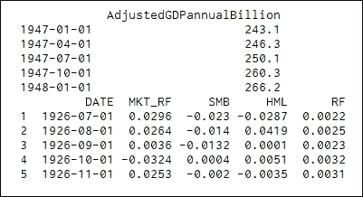

# 第八章 时间序列分析

在金融学和经济学中，我们的大量数据都是时间序列格式，例如股票价格和**国内生产总值**（**GDP**）。从第四章，*数据来源*中可以看出，我们可以从 Yahoo!Finance 下载日、周和月的历史价格时间序列。从**美联储经济数据图书馆**（**FRED**），我们可以提取许多历史时间序列数据，如 GDP。对于时间序列数据，存在许多问题，例如如何从历史价格数据估算回报，如何合并具有相同或不同频率的数据集，季节性，以及检测自相关。理解这些属性对于我们的知识发展至关重要。

本章将涵盖以下主题：

+   时间序列分析简介

+   设计一个好的日期变量，并按日期合并不同的数据集

+   正态分布和正态性检验

+   利率期限结构、52 周最高和最低交易策略

+   回报估算和将日回报转换为月回报或年回报

+   T 检验、F 检验和自相关的 Durbin-Watson 检验

+   Fama-MacBeth 回归

+   Roll（1984）扩展，Amihud（2002）流动性不足指标，以及 Pastor 和 Stambaugh（2003）流动性度量

+   一月效应和星期几效应

+   从 Google Finance 和哈斯布鲁克教授的 TORQ 数据库（交易、订单、报告和报价）中提取高频数据

+   介绍 CRSP（证券价格研究中心）数据库

# 时间序列分析简介

大多数金融数据都是时间序列格式，以下是几个示例。第一个示例展示了如何从 Yahoo!Finance 下载给定股票代码的历史每日股票价格数据，包括起始和结束日期：

```py
from matplotlib.finance import quotes_historical_yahoo_ochl as getData
x = getData("IBM",(2016,1,1),(2016,1,21),asobject=True, adjusted=True)
print(x[0:4])
```

输出如下所示：


数据类型是`numpy.recarray`，如`type(x)`所示。第二个示例打印了两个名为`ffMonthly.pkl`和`usGDPquarterly.pkl`的数据集中的前几个观察值，两个数据集都可以从作者网站获取，例如[`canisius.edu/~yany/python/ffMonthly.pkl`](http://canisius.edu/~yany/python/ffMonthly.pkl)：

```py
import pandas as pd
GDP=pd.read_pickle("c:/temp/usGDPquarterly.pkl")
ff=pd.read_pickle("c:/temp/ffMonthly.pkl")
print(GDP.head())
print(ff.head())
```

相关输出如下所示：



有一个章节末的问题，旨在将*离散数据*与日常数据合并。以下程序从 Google Finance 提取每日价格数据：

```py
import pandas_datareader.data as web
import datetime
ticker='MSFT'
begdate = datetime.datetime(2012, 1, 2)
enddate = datetime.datetime(2017, 1, 10)
a = web.DataReader(ticker, 'google',begdate,enddate)
print(a.head(3))
print(a.tail(2))
```

对应的输出如下所示：


为了获取当前的股票报价，我们有以下程序。请注意，输出结果为 2017 年 1 月 21 日的数据：

```py
import pandas_datareader.data as web
ticker='AMZN'
print(web.get_quote_yahoo(ticker))
```


通过使用下列 Python 程序，可以提取 1947 年 1 月到 2016 年 6 月的**国内生产总值**（**GDP**）数据：

```py
import pandas_datareader.data as web
import datetime
begdate = datetime.datetime(1900, 1, 1)
enddate = datetime.datetime(2017, 1, 27)
x= web.DataReader("GDP", "fred", begdate,enddate)
print(x.head(2))
print(x.tail(3))
```

输出如下所示：


# 基于日期变量合并数据集

为了更好地管理我们的时间序列，生成一个`date`变量是一个很好的主意。谈到这样的变量时，读者可以考虑年份（YYYY）、年份和月份（YYYYMM）或年份、月份和日期（YYYYMMDD）。对于仅包含年份、月份和日期的组合，我们可以有多种形式。以 2017 年 1 月 20 日为例，我们可以有 2017-1-20、1/20/2017、20Jan2017、20-1-2017 等。从某种意义上讲，真正的日期变量在我们看来应该是易于操作的。通常，真正的`date`变量采取*年-月-日*或其变种的其他形式。假设日期变量的值为 2000-12-31，在其值上加一天后，结果应为 2001-1-1。

## 使用 pandas.date_range() 生成一维时间序列

我们可以轻松使用`pandas.date_range()`函数生成我们的时间序列；请参见以下示例：

```py
import pandas as pd
import scipy as sp
sp.random.seed(1257)
mean=0.10
std=0.2
ddate = pd.date_range('1/1/2016', periods=252) 
n=len(ddate)
rets=sp.random.normal(mean,std,n)
data = pd.DataFrame(rets, index=ddate,columns=['RET'])
print(data.head())
```

在前面的程序中，由于使用了`sp.random.seed()`函数，如果读者使用相同的种子，则应获得相同的输出。输出如下所示：

```py
                 RET
2016-01-01  0.431031
2016-01-02  0.279193
2016-01-03  0.002549
2016-01-04  0.109546
2016-01-05  0.068252
```

为了更方便地处理时间序列数据，在以下程序中使用了`pandas.read_csv()`函数，参见以下代码：

```py
import pandas as pd
url='http://canisius.edu/~yany/data/ibm.csv' 
x=pd.read_csv(url,index_
col=0,parse_dates=True)
print(x.head())
```

输出如下所示：


为了查看日期格式，我们有以下代码：

```py
>>>x[0:1]
```


```py
>>>x[0:1].index
```


在以下程序中，应用了`matplotlib.finance.quotes_historical_yahoo_ochl()`函数：

```py
from matplotlib.finance import quotes_historical_yahoo_ochl as getData
x = getData("IBM",(2016,1,1),(2016,1,21),asobject=True, adjusted=True)
print(x[0:4])
```

输出如下所示：


请注意，索引是日期格式，参见以下代码。有关`.strftime("%Y")`的含义，请参见*表 8.2*：

```py
>>>x[0][0]
  datetime.date(2016, 1, 4)
>>>x[0][0].strftime("%Y")
 '2016'
```

这里有几种定义`date`变量的方法：

| 函数 | 描述 | 示例 |
| --- | --- | --- |
| `pandas.date_range` | 1\. 生成一系列日期 | `pd.date_range('1/1/2017', periods=252)` |
| `datetime.date` | 2\. 一天 | `>>>from datetime import datetime``>>>datetime.date(2017,1,20)` |
| `datetime.date.today()` | 3\. 获取今天的日期 | `>>>datetime.date.today()``datetime.date(2017, 1, 26)` |
| `datetime.now()` | 4\. 获取当前时间 | `>>>from datetime import datetime``>>>datetime.now()``datetime.datetime(2017, 1, 26, 8, 58, 6, 420000)` |
| `relativedelta()` | 5\. 向日期变量添加一定数量的天、月或年 | `>>>from datetime import datetime``>>>today=datetime.today().date()``>>>print(today)``2017-01-26``>>>print(today+relativedelta(days=31))``2017-02-26` |

从`date`变量中提取年份、月份和日期在处理时间序列时非常常见——请参见以下使用`strftime()`函数的 Python 程序。相应的输出显示在右侧面板中。年份、月份和日期的结果格式是字符串：

```py
import datetime
today=datetime.date.today()
year=today.strftime("%Y")
year2=today.strftime("%y")
month=today.strftime("%m")
day=today.strftime("%d")
print(year,month,day,year2)
('2017', '01', '24', '17')
```

以下表格总结了它的用法。欲了解更多详细信息，请查看链接：[`strftime.org/`](http://strftime.org/)：

| 函数 | 描述 | 示例 |
| --- | --- | --- |
| `.strftime("%Y")` | 1\. 四位数字的年份字符串 | `a=datetime.date(2017,1,2)``a.strftime("%Y")` |
| `.strftime("%y")` | 2\. 两位数字的年份字符串 | `a.strftime("%y")` |
| `.strftime("%m")` | 3\. 月份字符串 | `a.strftime("%m")` |
| `.strftime("%d")` | 4\. 日期字符串 | `a.strftime("%d")` |

## 回报估算

有了价格数据，我们可以计算回报。此外，有时我们需要将日回报转换为周回报或月回报，或者将月回报转换为季回报或年回报。因此，理解如何估算回报及其转换是至关重要的。假设我们有以下四个价格：

```py
>>>p=[1,1.1,0.9,1.05]
```

了解这些价格是如何排序的非常重要。如果第一个价格发生在第二个价格之前，那么第一个回报应该是*(1.1-1)/1=10%*。接下来，我们学习如何从一个*n*条记录的数组中提取前*n-1*条和后*n-1*条记录。要列出前*n-1*个价格，我们使用`p[:-1]`，而对于最后三个价格，我们使用`p[1:]`，如以下代码所示：

```py
>>>print(p[:-1]) 
>>>print(p[1:]) 
[ 1\. 1.1 0.9] 
[ 1.1 0.9 1.05]
```

要估算回报，我们可以使用以下代码：

```py
>>>ret=(p[1:]-p[:-1])/p[:-1] 
>>>print(ret )
[ 0.1 -0.18181818 0.16666667]
```

当给定两个价格 *x1* 和 *x2*，并假设 *x2* 在 *x1* 之后，我们可以使用 *ret=(x2-x1)/x1*。或者，我们可以使用 *ret=x2/x1-1*。因此，对于前面的例子，我们可以使用 `ret=p[1:]/p[:-1]-1`。显然，这种第二种方法可以避免某些输入错误。另一方面，如果价格顺序颠倒了，例如，第一个是最新价格，最后一个是最旧价格，那么我们必须以以下方式估算回报：

```py
>>>ret=p[:-1]/p[1:]-1 
>>>print(ret )
[-0.09090909 0.22222222 -0.14285714] 
>>>
```

正如在第七章中提到的，*多因子模型与绩效评估*，我们可以使用`.diff()`和`.shift()`函数来估算回报。请参见以下代码：

```py
import pandas as pd
import scipy as sp
p=[1,1.1,0.9,1.05] 
a=pd.DataFrame({'Price':p})
a['Ret']=a['Price'].diff()/a['Price'].shift(1)
print(a)
```

输出如下所示：

```py
Price       Ret
0   1.00       NaN
1   1.10  0.100000
2   0.90 -0.181818
3   1.05  0.166667
```

以下代码演示了如何从 Yahoo!Finance 下载日价格数据并估算日回报：

```py
>>>from matplotlib.finance import quotes_historical_yahoo_ochl as getData 
>>>ticker='IBM' 
>>>begdate=(2013,1,1) 
>>>enddate=(2013,11,9) 
>>>x =getData(ticker, begdate, enddate,asobject=True, adjusted=True) 
>>>ret=x.aclose[1:]/x.aclose[:-1]-1
```

第一行从`matplotlib.finance`上传一个函数。我们使用`tuple`数据类型定义开始和结束日期。下载的历史日价格数据被赋值给`x`。为了验证我们的回报是否正确估算，我们可以打印几个价格到屏幕上。然后，我们可以手动验证一个或两个回报值，如以下代码所示：

```py
>>>x.date[0:3] 
array([datetime.date(2013, 1, 2), datetime.date(2013, 1, 3), 
datetime.date(2013, 1, 4)], dtype=object) 
>>>x.aclose[0:3] 
array([ 192.61, 191.55, 190.3 ]) 
>>>ret[0:2] 
array([-0.00550335, -0.00652571]) 
>>>(191.55-192.61)/192.61 
-0.005503348735787354 
>>>
```

是的，最后的结果确认我们的第一个回报是正确估算的。

## 将日回报转换为月回报

有时，我们需要将日收益率转换为月度或年度收益率。以下是我们的操作步骤。首先，我们估算每日对数收益率。然后，我们对每个月内的所有日对数收益率进行求和，以计算出相应的月度对数收益率。最后一步是将月度对数收益率转换为月度百分比收益率。假设我们有 *p0, p1, p2, …., p20* 的价格数据，其中 *p0* 是上个月最后一个交易日的价格，*p1* 是本月第一个交易日的价格，*p20* 是本月最后一个交易日的价格。那么，本月的百分比收益率可以表示为：


月度对数收益率的定义如下：


月度百分比收益率与月度对数收益率之间的关系如下所示：


每日对数收益率的定义类似如下：


我们来看一下以下对数收益率的求和：


根据之前的步骤，以下 Python 程序将日收益率转换为月收益率：

```py
from matplotlib.finance import quotes_historical_yahoo_ochl as getData
import numpy as np
import pandas as pd 
#
ticker='IBM' 
begdate=(2013,1,1) 
enddate=(2013,11,9)
#
x = getData(ticker, begdate, enddate,asobject=True, adjusted=True)
logret = np.log(x.aclose[1:]/x.aclose[:-1])
yyyymm=[]
d0=x.date
#
for i in range(0,np.size(logret)): 
    yyyymm.append(''.join([d0[i].strftime("%Y"),d0[i].strftime("%m")]))

y=pd.DataFrame(logret,yyyymm,columns=['retMonthly']) 
retMonthly=y.groupby(y.index).sum()

print(retMonthly.head())
```

输出结果如下：


## 按日期合并数据集

以下程序将 IBM 的每日调整收盘价与每日 Fama-French 3 因子时间序列进行合并。`ffMonthly.pkl` 文件可在以下网址获取：[`canisius.edu/~yany/python/ffDaily.pkl`](http://canisius.edu/~yany/python/ffDaily.pkl)：

```py
from matplotlib.finance import quotes_historical_yahoo_ochl as getData
import numpy as np 
import pandas as pd 
ticker='IBM' 
begdate=(2016,1,2) 
enddate=(2017,1,9) 
x =getData(ticker, begdate, enddate,asobject=True, adjusted=True) 
myName=ticker+'_adjClose'
x2=pd.DataFrame(x['aclose'],x.date,columns=[myName]) 
ff=pd.read_pickle('c:/temp/ffDaily.pkl') 
final=pd.merge(x2,ff,left_index=True,right_index=True)
print(final.head())
```

输出结果如下：

```py
            IBM_adjClose  MKT_RF     SMB     HML   RF
2016-01-04    130.959683 -0.0159 -0.0083  0.0053  0.0
2016-01-05    130.863362  0.0012 -0.0021  0.0000  0.0
2016-01-06    130.208315 -0.0135 -0.0013  0.0001  0.0
2016-01-07    127.983111 -0.0244 -0.0028  0.0012  0.0
2016-01-08    126.798264 -0.0111 -0.0047 -0.0004  0.0
```

# 理解插值技术

插值是一种在金融领域中非常常用的技术。在以下示例中，我们需要替换 2 和 6 之间的两个缺失值 `NaN`。我们使用 `pandas.interpolate()` 函数进行线性插值，来填补这两个缺失值：

```py
import pandas as pd 
import numpy as np 
nn=np.nan
x=pd.Series([1,2,nn,nn,6]) 
print(x.interpolate())
```

输出结果如下：

```py
0    1.000000
1    2.000000
2    3.333333
3    4.666667
4    6.000000
dtype: float64
```

上述方法是一种线性插值。实际上，我们可以估算一个Δ，并手动计算这些缺失值：


这里，*v2*(*v1*) 是第二个（第一个）值，*n* 是这两个值之间的间隔数。对于前面的例子，Δ 为 *(6-2)/3=1.33333*。因此，下一个值将是 *v1+Δ=2+1.33333=3.33333*。通过这种方式，我们可以不断估算所有缺失的值。注意，如果有多个时期的值缺失，那么每个时期的Δ必须手动计算，以验证方法的正确性。从 Yahoo!Finance 的债券页面 [`finance.yahoo.com/bonds`](http://finance.yahoo.com/bonds)，我们可以获得以下信息：

| 到期日 | 收益率 | 昨日 | 上周 | 上月 |
| --- | --- | --- | --- | --- |
| 3 个月 | 0.05 | 0.05 | 0.04 | 0.03 |
| 6 个月 | 0.08 | 0.07 | 0.07 | 0.06 |
| 2 年 | 0.29 | 0.29 | 0.31 | 0.33 |
| 3 年 | 0.57 | 0.54 | 0.59 | 0.61 |
| 5 年 | 1.34 | 1.32 | 1.41 | 1.39 |
| 10 年 | 2.7 | 2.66 | 2.75 | 2.66 |
| 30 年 | 3.8 | 3.78 | 3.85 | 3.72 |

> 表 8.3 期限结构利率

基于表格数据，我们有如下代码：

```py
>>>import numpy as np
>>>import pandas as pd
>>>nn=np.nan
>>>x=pd.Series([0.29,0.57,nn,1.34,nn,nn,nn,nn,2.7])
>>>y=x.interpolate()
>>>print(y)
0 0.290
1 0.570
2 0.955
3 1.340
4 1.612
5 1.884
6 2.156
7 2.428
8 2.700
dtype: float64
>>>
```

## 合并不同频率的数据

以下 Python 程序合并了两个数据集：美国**国内生产总值**（**GDP**）数据（按季度频率）和`ffMonthly`，[`canisius.edu/~yany/python/ffMonthly.pkl`](http://canisius.edu/~yany/python/ffMonthly.pkl)（按月度频率）。

前述的插值方法应用于 GDP 数据中缺失的月份。假设`ffMonthly`数据集已保存在`c:/temp/`目录中：

```py
import pandas as pd
import pandas_datareader.data as web
import datetime
begdate = datetime.datetime(1900, 1, 1)
enddate = datetime.datetime(2017, 1, 27)
GDP= web.DataReader("GDP", "fred", begdate,enddate)
ff=pd.read_pickle("c:/temp/ffMonthly.pkl")
final=pd.merge(ff,GDP,left_index=True,right_index=True,how='left') 
tt=final['GDP']
GDP2=pd.Series(tt).interpolate()
final['GDP2']=GDP2
```

输出如下所示。由于 1947 年之前没有 GDP 数据，且`ffMonthly`时间序列从 1926 年 7 月开始，因此合并数据后的最后几项观测结果提供了更多的信息：

```py
print(final.head())
print(final.tail(10))
        MKT_RF     SMB     HML      RF      GDP  GDP2
1926-07-01  0.0296 -0.0230 -0.0287  0.0022  NaN   NaN
1926-08-01  0.0264 -0.0140  0.0419  0.0025  NaN   NaN
1926-09-01  0.0036 -0.0132  0.0001  0.0023  NaN   NaN
1926-10-01 -0.0324  0.0004  0.0051  0.0032  NaN   NaN
1926-11-01  0.0253 -0.0020 -0.0035  0.0031  NaN   NaN
            MKT_RF     SMB     HML      RF      GDP          GDP2
2016-02-01 -0.0007  0.0083 -0.0048  0.0002      NaN  18337.766667
2016-03-01  0.0696  0.0086  0.0111  0.0002      NaN  18393.933333
2016-04-01  0.0092  0.0068  0.0325  0.0001  18450.1  18450.100000
2016-05-01  0.0178 -0.0027 -0.0179  0.0001      NaN  18525.166667
2016-06-01 -0.0005  0.0061 -0.0149  0.0002      NaN  18600.233333
2016-07-01  0.0395  0.0290 -0.0098  0.0002  18675.3  18675.300000
2016-08-01  0.0050  0.0094  0.0318  0.0002      NaN  18675.300000
2016-09-01  0.0025  0.0200 -0.0134  0.0002      NaN  18675.300000
2016-10-01 -0.0202 -0.0440  0.0415  0.0002      NaN  18675.300000
2016-11-01  0.0486  0.0569  0.0844  0.0001      NaN  18675.300000
2016-07-01  0.0395  0.0290 -0.0098  0.0002  18675.3  18675.300000
2016-08-01  0.0050  0.0094  0.0318  0.0002      NaN  18675.300000
2016-09-01  0.0025  0.0200 -0.0134  0.0002      NaN  18675.300000
2016-10-01 -0.0202 -0.0440  0.0415  0.0002      NaN  18675.300000
2016-11-01  0.0486  0.0569  0.0844  0.0001      NaN  18675.300000
```

对于第二个例子，我们合并了一个商业周期指标，名为`businessCycle.pkl`，其可在[`canisius.edu/~yany/python/businessCycle.pkl`](http://canisius.edu/~yany/python/businessCycle.pkl)下载，该数据集按月度频率提供，且与 GDP（按季度频率）合并。请参见以下代码：

```py
import pandas as pd
import pandas_datareader.data as web
import datetime
import scipy as sp
import numpy as np
cycle=pd.read_pickle("c:/temp/businessCycle.pkl")
begdate = datetime.datetime(1947, 1, 1)
enddate = datetime.datetime(2017, 1, 27)
GDP= web.DataReader("GDP", "fred", begdate,enddate)
final=pd.merge(cycle,GDP,left_index=True,right_index=True,how='right')
```

我们可以打印几行来查看结果：

```py
print(cycle.head())
print(GDP.head())
print(final.head())
          cycle
date             
1926-10-01  1.000
1926-11-01  0.846
1926-12-01  0.692
1927-01-01  0.538
1927-02-01  0.385
1947-07-01  0.135  250.1
1947-10-01  0.297  260.3
1948-01-01  0.459  266.2
              GDP
DATE             
1947-01-01  243.1
1947-04-01  246.3
1947-07-01  250.1
1947-10-01  260.3
1948-01-01  266.2
            cycle    GDP
DATE                    
1947-01-01 -0.189  243.1
1947-04-01 -0.027  246.3
```

# 正态性检验

在金融学中，关于正态分布的知识非常重要，原因有二。首先，股票回报被假设为遵循正态分布。其次，良好的计量经济模型中的误差项应遵循零均值的正态分布。然而，在现实世界中，这可能不适用于股票。另一方面，股票或投资组合是否遵循正态分布，可以通过各种所谓的正态性检验来验证。Shapiro-Wilk 检验就是其中之一。对于第一个例子，随机数是从正态分布中抽取的。因此，检验应确认这些观测值遵循正态分布：

```py
from scipy import stats 
import scipy as sp
sp.random.seed(12345)
mean=0.1
std=0.2
n=5000
ret=sp.random.normal(loc=0,scale=std,size=n)
print 'W-test, and P-value' 
print(stats.shapiro(ret))
W-test, and P-value
(0.9995986223220825, 0.4129064679145813)
```

假设我们的置信度为 95%，即 alpha=0.05。结果的第一个值是检验统计量，第二个值是其对应的 P 值。由于 P 值非常大，远大于 0.05，我们接受零假设，即回报符合正态分布。对于第二个例子，随机数是从均匀分布中抽取的：

```py
from scipy import stats
import scipy as sp
sp.random.seed(12345)
n=5000
ret=sp.random.uniform(size=n)
print 'W-test, and P-value' 
print(stats.shapiro(ret)) 
W-test, and P-value
(0.9537619352340698, 4.078975800593137e-37)
```

由于 P 值接近零，我们拒绝零假设。换句话说，这些观测值不符合正态分布。第三个例子验证了 IBM 的回报是否符合正态分布。使用了 Yahoo! Finance 的过去五年的每日数据进行检验。零假设是 IBM 的每日回报来自于正态分布：

```py
from scipy import stats 
from matplotlib.finance import quotes_historical_yahoo_ochl as getData 
import numpy as np 

ticker='IBM' 
begdate=(2012,1,1) 
enddate=(2016,12,31) 

p =getData(ticker, begdate, enddate,asobject=True, adjusted=True) 
ret = (p.aclose[1:] - p.aclose[:-1])/p.aclose[1:] 
print 'ticker=',ticker,'W-test, and P-value' 
print(stats.shapiro(ret))
ticker= IBM W-test, and P-value
(0.9213278889656067, 4.387053202198418e-25)
```

由于此 P 值接近零，我们拒绝原假设。换句话说，我们得出结论：IBM 的日收益不服从正态分布。对于正态性检验，我们还可以应用安德森-达林检验，这是科尔莫哥洛夫-斯米尔诺夫检验的改进版，用于验证观测值是否服从特定分布。请参见以下代码：

```py
print( stats.anderson(ret) )
AndersonResult(statistic=12.613658863646833, critical_values=array([ 0.574,  0.654,  0.785,  0.915,  1.089]), significance_level=array([ 15\. ,  10\. ,   5\. ,   2.5,   1\. ]))
```

在这里，我们有三组值：安德森-达林检验统计量、一组临界值和一组相应的置信水平，例如 15%、10%、5%、2.5%和 1%，如前面的输出所示。如果选择 1%的置信水平——第三组的最后一个值——临界值为 1.089，即第二组的最后一个值。由于我们的检验统计量是 12.61，远高于临界值 1.089，我们拒绝原假设。因此，我们的安德森-达林检验得出的结论与 Shapiro-Wilk 检验的结论相同。`scipy.stats.anderson()`检验的一个优点是，我们可以检验其他分布类型。应用`help()`函数后，我们将得到以下列表。默认的分布是用于正态性检验：

```py
>>>from scipy import stats 
>>>help(stats.anderson)
anderson(x, dist='norm')
Anderson-Darling test for data coming from a particular distribution
dist : {'norm','expon','logistic','gumbel','extreme1'}, optional the type of distribution to test against.  The default is 'norm'  and 'extreme1' is a synonym for 'gumbel'
```

## 估算胖尾

正态分布的一个重要性质是，我们可以使用均值和标准差这两个参数，即前两个矩，来完全定义整个分布。对于某个证券的*n*个收益，其前四个矩如公式（1）所示。均值或平均值定义如下：


它的（样本）方差由以下公式定义。标准差，即σ，是方差的平方根：


偏度由以下公式定义，表示分布是偏向左侧还是右侧。对于对称分布，偏度为零：


峰度反映了极端值的影响，因为它的幂次为四。它有两种定义方法，分别有和没有减去三；参见以下两个公式。公式（10B）中减去三的原因是，对于正态分布，根据公式（10A）计算的峰度为三：


一些书籍通过称公式（10B）为超额峰度来区分这两个公式。然而，基于公式（10B）的许多函数仍被称为峰度。我们知道，标准正态分布具有零均值、单位标准差、零偏度和零峰度（基于公式 10B）。以下输出验证了这些事实：

```py
from scipy import stats,random
import numpy as np
np.random.seed(12345)
ret = random.normal(0,1,500000)
print('mean    =', np.mean(ret))
print('std     =',np.std(ret))
print('skewness=',stats.skew(ret))
print('kurtosis=',stats.kurtosis(ret))
```

相关输出如下所示。请注意，由于应用了`scipy.random.seed()`函数，读者在使用相同的种子 12345 时应该得到相同的结果：


均值、偏度和峰度都接近零，而标准差接近一。接下来，我们基于 S&P500 的每日回报估算其四个矩：

```py
from scipy import stats
from matplotlib.finance import quotes_historical_yahoo_ochl as getData
import numpy as np
ticker='^GSPC'
begdate=(1926,1,1)
enddate=(2016,12,31)
p = getData(ticker, begdate, enddate,asobject=True, adjusted=True)
ret = p.aclose[1:]/p.aclose[:-1]-1
print( 'S&P500  n       =',len(ret))
print( 'S&P500  mean    =',round(np.mean(ret),8))
print('S&P500  std     =',round(np.std(ret),8))
print('S&P500  skewness=',round(stats.skew(ret),8))
print('S&P500  kurtosis=',round(stats.kurtosis(ret),8))
```

这五个值的输出，包括观测数量，结果如下：


这一结果与 Cook Pine Capital（2008）撰写的《厚尾风险研究》论文中的结果非常接近。基于相同的论点，我们得出结论，SP500 的每日回报是左偏的，也就是说，存在负偏度，并且具有厚尾（峰度为 20.81，而非零）。

## T 检验和 F 检验

在金融学中，T 检验可以被视为最广泛使用的统计假设检验之一，若原假设成立，检验统计量将服从学生 t 分布。我们知道标准正态分布的均值为零。在以下程序中，我们从标准正态分布中生成 1,000 个随机数。然后，我们进行两个检验：检验均值是否为 0.5，以及检验均值是否为零：

```py
>>>from scipy import stats 
>>>import numpy as np
>>>np.random.seed(1235) 
>>>x = stats.norm.rvs(size=10000) 
>>>print("T-value P-value (two-tail)") 
>>>print(stats.ttest_1samp(x,0.5)) 
>>>print(stats.ttest_1samp(x,0)) 
T-value P-value (two-tail)
Ttest_1sampResult(statistic=-49.763471231428966, pvalue=0.0)
Ttest_1sampResult(statistic=-0.26310321925083019, pvalue=0.79247644375164861)
```

对于第一个检验，我们测试时间序列的均值是否为 *0.5*，由于 T 值为 *49.76* 且 P 值为 0，故我们拒绝原假设。对于第二个检验，由于 T 值接近 -0.26 且 P 值为 0.79，我们接受原假设。在下面的程序中，我们测试 IBM 2013 年每日回报的均值是否为零：

```py
from scipy import stats 
import scipy as sp
from matplotlib.finance import quotes_historical_yahoo_ochl as getData 
ticker='ibm' 
begdate=(2013,1,1) 
enddate=(2013,12,31) 
p=getData(ticker,begdate,enddate,asobject=True, adjusted=True) 
ret=p.aclose[1:]/p.aclose[:-1]-1
print(' Mean T-value P-value ' ) 
print(round(sp.mean(ret),5), stats.ttest_1samp(ret,0))
Mean T-value P-value 
(-4e-05, Ttest_1sampResult(statistic=-0.049698422671935881, pvalue=0.96040239593479948))
```

从之前的结果来看，我们知道 IBM 的平均每日回报率是 0.00004%。T 值为 -0.049，P 值为 0.96。因此，我们接受原假设，即每日平均回报在统计上与零相同。

## 方差齐性检验

接下来，我们测试 2012 到 2016 年期间，IBM 和 DELL 的两个方差是否相同。名为 `sp.stats.bartlet()` 的函数执行 Bartlett 方差齐性检验，原假设为所有输入样本来自方差相等的总体。输出结果为 T 值和 P 值：

```py
import scipy as sp 
from matplotlib.finance import quotes_historical_yahoo_ochl as getData 
begdate=(2012,1,1) 
enddate=(2016,12,31) 
def ret_f(ticker,begdate,enddate): 
    p = getData(ticker,begdate, enddate,asobject=True,adjusted=True) 
    return p.aclose[1:]/p.aclose[:-1]-1
y=ret_f('IBM',begdate,enddate) 
x=ret_f('DELL',begdate,enddate) 
print(sp.stats.bartlett(x,y)) 
BartlettResult(statistic=108.07747537504794, pvalue=2.5847436899908763e-25)
```

T 值为 108，P 值为 0，我们得出结论，这两只股票在 2012 到 2016 年期间的每日股票回报具有不同的方差，并且无论显著性水平如何，都会有显著差异。

## 测试一月效应

在本节中，我们使用 IBM 的数据来测试所谓的 **一月效应**，即一月的股票回报在统计上不同于其他月份的回报。首先，我们从 Yahoo! Finance 收集 IBM 的每日价格数据。然后，我们将每日回报转化为月度回报。之后，我们将所有的月度回报分为两组：一月的回报与其他月份的回报。

最后，我们测试组均值是否相等，代码如下所示：

```py
from matplotlib.finance import quotes_historical_yahoo_ochl as getData 
import numpy as np 
import scipy as sp 
import pandas as pd
from datetime import datetime 
ticker='IBM' 
begdate=(1962,1,1) 
enddate=(2016,12,31) 
x =getData(ticker, begdate, enddate,asobject=True, adjusted=True) 
logret = sp.log(x.aclose[1:]/x.aclose[:-1]) 
date=[] 
d0=x.date 
for i in range(0,sp.size(logret)): 
    t1=''.join([d0[i].strftime("%Y"),d0[i].strftime("%m"),"01"]) 
    date.append(datetime.strptime(t1,"%Y%m%d")) 

y=pd.DataFrame(logret,date,columns=['logret']) 
retM=y.groupby(y.index).sum() 
ret_Jan=retM[retM.index.month==1] 
ret_others=retM[retM.index.month!=1] 
print(sp.stats.ttest_ind(ret_Jan.values,ret_others.values)) 
Ttest_indResult(statistic=array([ 1.89876245]), pvalue=array([ 0.05803291]))
>>>
```

由于 T 值为 1.89，P 值为 0.058，若以 IBM 为例并选择 5%的显著性水平，我们得出结论：没有 1 月效应。需要注意的是：我们不应该以此结果进行普遍推论，因为它仅基于一只股票。关于星期效应，我们可以应用相同的程序来测试其存在。章节末尾的一个问题旨在基于相同的逻辑测试星期效应。

# 52 周最高和最低交易策略

一些投资者/研究人员认为，我们可以通过采用 52 周最高和最低交易策略来建立一个多头仓位，如果今天的价格接近过去 52 周的最高价，建立一个反向仓位，如果今天的价格接近其 52 周最低价。让我们随机选择一个日期：2016 年 12 月 31 日。以下 Python 程序展示了这个 52 周的范围和今天的仓位：

```py
import numpy as np
from datetime import datetime 
from dateutil.relativedelta import relativedelta 
from matplotlib.finance import quotes_historical_yahoo_ochl as getData
#
ticker='IBM' 
enddate=datetime(2016,12,31)
#
begdate=enddate-relativedelta(years=1) 
p =getData(ticker, begdate, enddate,asobject=True, adjusted=True) 
x=p[-1] 
y=np.array(p.tolist())[:,-1] 
high=max(y) 
low=min(y) 
print(" Today, Price High Low, % from low ") 
print(x[0], x[-1], high, low, round((x[-1]-low)/(high-low)*100,2))
```

相应的输出如下所示：


根据 52 周最高和最低交易策略，我们今天有更多的动机购买 IBM 的股票。这个例子仅仅是展示如何做出决策。并没有进行任何测试来验证这是否是一个有利可图的交易策略。如果读者有兴趣测试这个 52 周最高和最低交易策略，应该使用所有股票组成两个投资组合。更多细节请参见 George 和 Huang（2004）。

# 估算 Roll 的价差

流动性被定义为我们可以多快地处置我们的资产而不失去其内在价值。通常，我们使用价差来表示流动性。然而，我们需要高频数据来估算价差。稍后在本章中，我们将展示如何直接利用高频数据来估算价差。为了基于每日观察间接衡量价差，Roll（1984）显示我们可以通过以下方式基于价格变动的序列协方差来估算价差：


这里，*S*是 Roll 价差，*Pt*是股票在某一天的收盘价，


是 Pt-Pt-1，且


, *t*是估算期内的平均股价。以下 Python 代码使用来自 Yahoo! Finance 的一年期每日价格数据来估算 IBM 的 Roll 价差：

```py
from matplotlib.finance import quotes_historical_yahoo_ochl as getData
import scipy as sp 
ticker='IBM' 
begdate=(2013,9,1) 
enddate=(2013,11,11) 
data= getData(ticker, begdate, enddate,asobject=True, adjusted=True) 
p=data.aclose 
d=sp.diff(p)
cov_=sp.cov(d[:-1],d[1:]) 
if cov_[0,1]<0: 
    print("Roll spread for ", ticker, 'is', round(2*sp.sqrt(-cov_[0,1]),3)) 
else: 
    print("Cov is positive for ",ticker, 'positive', round(cov_[0,1],3))
```

相应的输出如下所示：


因此，在那段时间里，IBM 的 Roll 价差为$1.136。请看下面 Roll 模型的主要假设，


和


.

它们之间的协方差为负值。当协方差值为正时，Roll 模型将失效。在现实中，这种情况可能会发生在许多案例中。通常，实践者采用两种方法：当价差为负时，我们直接忽略这些情况，或者使用其他方法来估算价差。第二种方法是将正协方差前加上负号。

# 估算 Amihud 的非流动性

根据 Amihud (2002) 的观点，流动性反映了订单流对价格的影响。他的非流动性度量定义如下：


其中，*illiq(t)* 是月份 *t* 的 Amihud 非流动性度量，*Ri* 是第 *i* 天的日收益，*Pi* 是第 *i* 天的收盘价，*Vi* 是第 *i* 天的日交易量。由于非流动性是流动性的倒数，非流动性值越低，基础证券的流动性越高。首先，我们来看一下逐项分解：

```py
>>>x=np.array([1,2,3],dtype='float') 
>>>y=np.array([2,2,4],dtype='float') 
>>>np.divide(x,y) 
array([ 0.5 , 1\. , 0.75]) 
>>>
```

在下面的代码中，我们根据 2013 年 10 月的交易数据估算了 IBM 的 Amihud 非流动性。结果是 *1.21*10^-11*。这个值看起来非常小，实际上绝对值并不重要，重要的是相对值。如果我们在同一时期内估算 WMT 的非流动性，我们会得到 *1.52*10^-11* 的值。由于 1.21 小于 1.52，我们得出结论，IBM 比 WMT 更具流动性。这一相关性在下面的代码中得以表示：

```py
import numpy as np 
import statsmodels.api as sm 
from matplotlib.finance import quotes_historical_yahoo_ochl as getData 
begdate=(2013,10,1) 
enddate=(2013,10,30) 
ticker='IBM'                   # or WMT  
data= getData(ticker, begdate, enddate,asobject=True, adjusted=True) 
p=np.array(data.aclose) 
dollar_vol=np.array(data.volume*p) 
ret=np.array((p[1:] - p[:-1])/p[1:]) 
illiq=np.mean(np.divide(abs(ret),dollar_vol[1:])) 
print("Aminud illiq for =",ticker,illiq) 
'Aminud illiq for =', 'IBM', 1.2117639237103875e-11)
 ('Aminud illiq for =', 'WMT', 1.5185471291382207e-11)
```

# 估算 Pastor 和 Stambaugh (2003) 的流动性度量

基于 Campbell、Grossman 和 Wang (1993) 的方法论和实证证据，Pastor 和 Stambaugh (2003) 设计了以下模型来衡量个股的流动性和市场流动性：


这里，*yt* 是超额股票收益，*Rt-Rf*，*t* 是第 *t* 天，*Rt* 是股票的回报，*Rf,t* 是无风险利率，*x1,t* 是市场回报，*x2,t* 是签名美元交易量：


*pt* 是股价，*t* 是交易量。回归基于每月的每日数据进行。换句话说，对于每个月，我们会得到一个 *β2*，它被定义为个股的流动性度量。以下代码估算了 IBM 的流动性。首先，我们下载了 IBM 和 S&P500 的每日价格数据，估算它们的日收益，并进行合并：

```py
import numpy as np 
from matplotlib.finance import quotes_historical_yahoo_ochl as getData
import numpy as np 
import pandas as pd 
import statsmodels.api as sm 
ticker='IBM' 
begdate=(2013,1,1) 
enddate=(2013,1,31) 

data =getData(ticker, begdate, enddate,asobject=True, adjusted=True) 
ret = data.aclose[1:]/data.aclose[:-1]-1 
dollar_vol=np.array(data.aclose[1:])*np.array(data.volume[1:]) 
d0=data.date 

tt=pd.DataFrame(ret,index=d0[1:],columns=['ret']) 
tt2=pd.DataFrame(dollar_vol,index=d0[1:],columns=['dollar_vol']) 
ff=pd.read_pickle('c:/temp/ffDaily.pkl') 
tt3=pd.merge(tt,tt2,left_index=True,right_index=True) 
final=pd.merge(tt3,ff,left_index=True,right_index=True) 
y=final.ret[1:]-final.RF[1:] 
x1=final.MKT_RF[:-1] 
x2=np.sign(np.array(final.ret[:-1]-final.RF[:-1]))*np.array(final.dollar_vol[:-1]) 
x3=[x1,x2] 
n=np.size(x3) 
x=np.reshape(x3,[n/2,2]) 
x=sm.add_constant(x) 
results=sm.OLS(y,x).fit() 
print(results.params)
```

在之前的程序中，*y* 是 IBM 在 *t+1* 时刻的超额收益，*x1* 是 *t* 时刻的市场超额收益，*x2* 是 *t* 时刻的签名美元交易量。*x2* 前的系数就是 Pastor 和 Stambaugh 的流动性度量。相应的输出如下所示：

```py
const    2.702020e-03
x1      -1.484492e-13
x2       6.390822e-12
dtype: float64
```

# Fama-MacBeth 回归

首先，让我们通过使用 `pandas.ols` 函数来看 OLS 回归，如下所示：

```py
from datetime import datetime 
import numpy as np 
import pandas as pd 
n = 252 
np.random.seed(12345) 
begdate=datetime(2013, 1, 2) 
dateRange = pd.date_range(begdate, periods=n) 
x0= pd.DataFrame(np.random.randn(n, 1),columns=['ret'],index=dateRange) 
y0=pd.Series(np.random.randn(n), index=dateRange) 
print pd.ols(y=y0, x=x0)
```

对于 Fama-MacBeth 回归，我们有以下代码：

```py
import numpy as np 
import pandas as pd 
import statsmodels.api as sm
from datetime import datetime 
#
n = 252 
np.random.seed(12345) 
begdate=datetime(2013, 1, 2) 
dateRange = pd.date_range(begdate, periods=n) 
def makeDataFrame(): 
    data=pd.DataFrame(np.random.randn(n,7),columns=['A','B','C','D','E',' F','G'],
    index=dateRange) 
    return data 
#
data = { 'A': makeDataFrame(), 'B': makeDataFrame(), 'C': makeDataFrame() }
Y = makeDataFrame() 
print(pd.fama_macbeth(y=Y,x=data))
```

# Durbin-Watson

Durbin-Watson 统计量与自相关有关。在我们运行回归后，误差项应当没有相关性，且均值为零。Durbin-Watson 统计量定义如下：


在这里，*et* 是时间 *t* 的误差项，*T* 是误差项的总数。Durbin-Watson 统计量用于检验普通最小二乘回归的残差是否没有自相关，零假设是残差没有自相关，备择假设是残差遵循 AR1 过程。Durbin-Watson 统计量的值范围是 0 到 4。接近 2 的值表示没有自相关；接近 0 的值表示正自相关；接近 4 的值表示负自相关，见下表：

| Durbin-Watson 测试 | 描述 |
| --- | --- |
|  | 无自相关 |
| 向 0 靠近 | 正自相关 |
| 向 4 靠近 | 负自相关 |

> 表 8.3 Durbin-Watson 测试

以下 Python 程序通过使用 IBM 的日数据首先运行 CAPM。S&P500 被用作指数，时间段为 2012 年 1 月 1 日至 2016 年 12 月 31 日，为期 5 年的窗口。此处忽略无风险利率。对于回归的残差，运行 Durbin-Watson 测试以检查其自相关性：

```py
import pandas as pd
from scipy import stats 
import statsmodels.formula.api as sm
import statsmodels.stats.stattools as tools 
from matplotlib.finance import quotes_historical_yahoo_ochl as getData
#
begdate=(2012,1,1)
enddate=(2016,12,31)
#
def dailyRet(ticker,begdate,enddate):
    p =getData(ticker, begdate, enddate,asobject=True,adjusted=True)
    return p.aclose[1:]/p.aclose[:-1]-1

retIBM=dailyRet('IBM',begdate,enddate)
retMkt=dailyRet('^GSPC',begdate,enddate)

df = pd.DataFrame({"Y":retIBM, "X": retMkt})
result = sm.ols(formula="Y ~X", data=df).fit()
print(result.params)
residuals=result.resid
print("Durbin Watson")
print(tools.durbin_watson(residuals))
```

输出结果如下：


1.82 接近 2 的正值表示 IBM 的 CAPM 残差的自相关可能为零。我们可以得到更明确的答案。或者，我们只需输入命令 `print(result.summary())`，见下图：


上述结果显示，观测值数量为 1,257，Durbin-Watson 测试值为 1.82。根据以下的上下界限（dL 和 dU）：[`web.stanford.edu/~clint/bench/dwcrit.htm`](https://web.stanford.edu/~clint/bench/dwcrit.htm)，我们可以得出结论，1.82 距离 2 仍然不够接近。因此，残差仍然存在正自相关。**赤池信息量准则** (**AIC**) 是一个用于衡量给定数据集的统计模型相对质量的指标。其公式如下：


在这里，*k* 是模型中需要估计的系数数量，*L* 是对数似然值。在前面的示例中，*k=1* 且 *L=4089.0*。因此，AIC 将是 *2*1-2*4089.9=8177.8*。AIC 会测试这个模型是否在绝对意义上是好的。然而，给定几个候选模型时，首选模型是具有最小 AIC 值的模型。AIC 奖励拟合优度（通过似然函数评估），但它还包括一个惩罚项，该惩罚项是被估计参数数量（*k*）的递增函数。BIC 代表贝叶斯信息准则，其定义如下：


这里，*n* 是观测值的数量，*k* 是需要估计的参数数量，包括截距项。Jarque–Bera 检验是一个拟合优度检验，用于检验我们的数据是否具有与正态分布匹配的偏度和峰度：


这里，*S* 是偏度，*C* 是峰度。原假设是偏度为零和超额峰度为零的联合假设。根据前述结果，由于概率（*JB*）为零，我们拒绝原假设。

# 高频数据的 Python 应用

高频数据是指逐秒或逐毫秒的交易和报价数据。纽约证券交易所的**交易和报价**（**TAQ**）数据库是一个典型的例子（[`www.nyxdata.com/data-products/daily-taq`](http://www.nyxdata.com/data-products/daily-taq)）。以下程序可用于从 Google Finance 获取高频数据：

```py
import tempfile
import re, string 
import pandas as pd 
ticker='AAPL'                    # input a ticker 
f1="c:/temp/ttt.txt"             # ttt will be replace with above sticker
f2=f1.replace("ttt",ticker) 
outfile=open(f2,"w") 
#path="http://www.google.com/finance/getprices?q=ttt&i=300&p=10d&f=d,o, h,l,c,v" 
path="https://www.google.com/finance/getprices?q=ttt&i=300&p=10d&f=d,o,%20h,l,c,v"
path2=path.replace("ttt",ticker) 
df=pd.read_csv(path2,skiprows=8,header=None) 
fp = tempfile.TemporaryFile()
df.to_csv(fp) 
print(df.head())
fp.close()
```

在前面的程序中，我们有两个输入变量：`ticker` 和 `path`。在选择带有嵌入变量 `ttt` 的 `path` 后，我们使用 `string.replace()` 函数将其替换为我们的 `ticker`。使用 `.head()` 和 `.tail()` 函数查看前五行和后五行，代码如下所示：


来自 Google 的当天高频数据的相关网页位于 [`www.google.com/finance/getprices?q=AAPL&i=300&p=10d&f=d,o,%20h,l,c,v`](https://www.google.com/finance/getprices?q=AAPL&i=300&p=10d&f=d,o,%20h,l,c,v)，其标题（前 10 行）如下所示：

```py
EXCHANGE%3DNASDAQ
MARKET_OPEN_MINUTE=570
MARKET_CLOSE_MINUTE=960
INTERVAL=300
COLUMNS=DATE,CLOSE,LOW,OPEN,VOLUME
DATA=
TIMEZONE_OFFSET=-300
a1484145000,118.75,118.7,118.74,415095
1,119.1975,118.63,118.73,1000362
2,119.22,119.05,119.2,661651
3,118.96,118.91,119.225,487105
4,118.91,118.84,118.97,399730
5,118.985,118.82,118.91,334648
```

以下程序的目标是添加时间戳：

```py
import tempfile
import pandas as pd, numpy as np, datetime 
ticker='AAPL' 
path="https://www.google.com/finance/getprices?q=ttt&i=300&p=10d&f=d,o,%20h,l,c,v"
x=np.array(pd.read_csv(path.replace('ttt',ticker),skiprows=7,header=None)) 
#
date=[] 
for i in np.arange(0,len(x)): 
    if x[i][0][0]=='a': 
        t= datetime.datetime.fromtimestamp(int(x[i][0].replace('a',''))) 
        print ticker, t, x[i][1:] 
        date.append(t) 
    else: 
        date.append(t+datetime.timedelta(minutes =int(x[i][0]))) 

final=pd.DataFrame(x,index=date) 
final.columns=['a','CLOSE','LOW','OPEN','VOL'] 
del final['a'] 
fp = tempfile.TemporaryFile()
#final.to_csv('c:/temp/abc.csv'.replace('abc',ticker)) 
final.to_csv(fp) 
print(final.head())
```

运行程序后，我们可以观察到以下输出：

```py
%run "c:\users\yany\appdata\local\temp\tmppuuqpb.py"
AAPL 2017-01-11 09:30:00 [118.75 118.7 118.74 415095L]
AAPL 2017-01-17 09:30:00 [118.27 118.22 118.34 665157L]
AAPL 2017-01-23 09:30:00 [119.96 119.95 120.0 506837L]
```

要查看前几行和后几行，我们可以使用 `.head()` 和 `.tail()` 函数，方法如下：

```py
>>>final.head() 
                       CLOSE     LOW     OPEN      VOL
2017-01-11 09:30:00   118.75   118.7   118.74   415095
2017-01-11 09:31:00  119.198  118.63   118.73  1000362
2017-01-11 09:32:00   119.22  119.05    119.2   661651
2017-01-11 09:33:00   118.96  118.91  119.225   487105
2017-01-11 09:34:00   118.91  118.84   118.97   399730
>>>final.tail() 
                      CLOSE      LOW     OPEN     VOL
2017-01-23 20:05:00  121.86   121.78   121.79  343711
2017-01-  23 20:06:00  121.84  121.815   121.86  162673
2017-01-23 20:07:00  121.77   121.75   121.84  166523
2017-01-23 20:08:00   121.7   121.69   121.78   68754
2017-01-23 20:09:00  121.82  121.704  121.707  103578
```

由于 TAQ 数据库价格昂贵，可能大多数读者无法访问该数据。幸运的是，我们有一个名为**交易、订单、报告和报价**（**TORQ**）的数据库。感谢 Hasbrouck 教授，数据库可以从 [`people.stern.nyu.edu/jhasbrou/Research/`](http://people.stern.nyu.edu/jhasbrou/Research/) 下载。

在同一网页上，我们还可以下载 TORQ 手册。基于 Hasbrouck 教授的二进制数据集，我们生成了几个对应的 pandas pickle 格式数据集。**合并交易**（**CT**）数据集可以从 [`canisius.edu/~yany/python/TORQct.pkl`](http://canisius.edu/~yany/python/TORQct.pkl) 下载。将此数据集保存到 `C:\temp` 后，我们可以发出以下两行 Python 代码来获取它：

```py
import pandas as pd
import pandas as pd
import scipy as sp
x=pd.read_pickle("c:/temp/TORQct.pkl")
print(x.head())
print(x.tail())
print(sp.shape(x))
```

要查看前几行和后几行，我们可以使用 `.head()` 和 `.tail()` 函数，方法如下：

```py
date      time  price  siz  g127  tseq cond ex
symbol                                                    
AC      19901101  10:39:06   13.0  100     0  1587       N
AC      19901101  10:39:36   13.0  100     0     0       M
AC      19901101  10:39:38   13.0  100     0     0       M
AC      19901101  10:39:41   13.0  100     0     0       M
AC      19901101  10:41:38   13.0  300     0  1591       N
            date      time   price    siz  g127    tseq cond ex
symbol                                                         
ZNT     19910131  11:03:31  12.375   1000     0  237884       N
ZNT     19910131  12:47:21  12.500   6800     0  237887       N
ZNT     19910131  13:16:59  12.500  10000     0  237889       N
ZNT     19910131  14:51:52  12.500    100     0  237891       N
ZNT     19910131  14:52:27  12.500   3600     0       0    Z  T
(728849, 8)
```

由于 `ticker` 被用作索引，我们可以列出所有唯一的索引值，从而找出数据集中包含的股票名称，方法如下：

```py
import numpy as np
import pandas as pd
ct=pd.read_pickle("c:/temp/TORQct.pkl")
print(np.unique(np.array(ct.index)))
```

输出如下所示：

```py
['AC' 'ACN' 'ACS' 'ADU' 'AL' 'ALL' 'ALX' 'AMD' 'AMN' 'AMO' 'AR' 'ARX' 'ATE'
 'AYD' 'BA' 'BG' 'BMC' 'BRT' 'BZF' 'CAL' 'CL' 'CLE' 'CLF' 'CMH' 'CMI' 'CMY'
 'COA' 'CP' 'CPC' 'CPY' 'CU' 'CUC' 'CUE' 'CYM' 'CYR' 'DBD' 'DCN' 'DI' 'DLT'
 'DP' 'DSI' 'EFG' 'EHP' 'EKO' 'EMC' 'FBO' 'FDX' 'FFB' 'FLP' 'FMI' 'FNM'
 'FOE' 'FPC' 'FPL' 'GBE' 'GE' 'GFB' 'GLX' 'GMH' 'GPI' 'GRH' 'HAN' 'HAT'
 'HE' 'HF' 'HFI' 'HTR' 'IBM' 'ICM' 'IEI' 'IPT' 'IS' 'ITG' 'KFV' 'KR' 'KWD'
 'LOG' 'LPX' 'LUK' 'MBK' 'MC' 'MCC' 'MCN' 'MDP' 'MNY' 'MO' 'MON' 'MRT'
 'MTR' 'MX' 'NI' 'NIC' 'NNP' 'NSI' 'NSO' 'NSP' 'NT' 'OCQ' 'OEH' 'PCO' 'PEO'
 'PH' 'PIM' 'PIR' 'PLP' 'PMI' 'POM' 'PPL' 'PRI' 'RDA' 'REC' 'RPS' 'SAH'
 'SJI' 'SLB' 'SLT' 'SNT' 'SPF' 'SWY' 'T' 'TCI' 'TEK' 'TUG' 'TXI' 'UAM'
 'UEP' 'UMG' 'URS' 'USH' 'UTD' 'UWR' 'VCC' 'VRC' 'W' 'WAE' 'WBN' 'WCS'
 'WDG' 'WHX' 'WIN' 'XON' 'Y' 'ZIF' 'ZNT']
```

# 基于高频数据估算的价差

基于**合并报价**（**CQ**）数据集，由 Hasbrouck 教授提供，我们生成一个以 pandas pickle 格式保存的数据集，可以从[`canisius.edu/~yany/python/TORQcq.pkl`](http://canisius.edu/~yany/python/TORQcq.pkl)下载。假设以下数据位于`C:\temp`目录下：

```py
import pandas as pd 
cq=pd.read_pickle("c:/temp/TORQcq.pkl") 
print(cq.head() )
```

输出结果如下所示：

```py
           date      time     bid     ofr  bidsiz  ofrsiz  mode  qseq
symbol                                                                
AC      19901101   9:30:44  12.875  13.125      32       5    10    50
AC      19901101   9:30:47  12.750  13.250       1       1    12     0
AC      19901101   9:30:51  12.750  13.250       1       1    12     0
AC      19901101   9:30:52  12.750  13.250       1       1    12     0
AC      19901101  10:40:13  12.750  13.125       2       2    12     0
>>>cq.tail() 
            date      time     bid     ofr  bidsiz  ofrsiz  mode  qseq
symbol                                                                
ZNT     19910131  13:31:06  12.375  12.875       1       1    12     0
ZNT     1  9910131  13:31:06  12.375  12.875       1       1    12     0
ZNT     19910131  16:08:44  12.500  12.750       1       1     3    69
ZNT     19910131  16:08:49  12.375  12.875       1       1    12     0
ZNT     19910131  16:16:54  12.375  12.875       1       1     3     0
```

同样，我们可以使用`unique()`函数找出所有的股票代码。假设我们对以下代码中显示的`MO`股票代码感兴趣：

```py
>>>x=cq[cq.index=='MO'] 
>>>x.head() 
            date     time     bid     ofr  bidsiz  ofrsiz  mode  qseq
symbol                                                               
MO      19901101  9:30:33  47.000  47.125     100       4    10    50
MO      19901101  9:30:35  46.750  47.375       1       1    12     0
MO      19901101  9:30:38  46.875  47.750       1       1    12     0
MO      19901101  9:30:40  46.875  47.250       1       1    12     0
MO      19901101  9:30:47  47.000  47.125     100       3    12    51
```

检查一些观测值是个好主意。从以下输出的第一行可以看出，价差应为 0.125（47.125-47.000）：

```py
>>>x.head().ofr-x.head().bid 
symbol 
MO 0.125 
MO 0.625 
MO 0.875 
MO 0.375 
MO 0.125 
dtype: float64 
>>>
```

要找到平均价差和平均相对价差，我们可以使用以下代码。完整程序如下所示：

```py
import pandas as pd 
import scipy as sp
cq=pd.read_pickle('c:/temp/TORQcq.pkl') 
x=cq[cq.index=='MO'] 
spread=sp.mean(x.ofr-x.bid) 
rel_spread=sp.mean(2*(x.ofr-x.bid)/(x.ofr+x.bid)) 
print(round(spread,5) )
print(round(rel_spread,5) )
0.39671 
0.00788
```

在前面的例子中，我们没有处理或清理数据。通常，我们需要通过添加各种过滤器来处理数据，例如删除负价差的报价、`bidsiz`为零或`ofrsiz`为零的数据，才能估算价差并进行其他估计。

# CRSP 简介

本书的重点是免费的公共数据。因此，我们只讨论一些金融数据库，因为部分读者可能来自具有有效订阅的学校。CRSP 就是其中之一。在本章中，我们仅提到三个 Python 数据集。

**证券价格研究中心**（**CRSP**）。它包含了自 1926 年起所有在美国上市的股票的所有交易数据，如收盘价、交易量和流通股数。由于其数据质量高且历史悠久，学术研究人员和实务工作者广泛使用它。第一组数据称为`crspInfo.pkl`，请参见以下代码：

```py
import pandas as pd
x=pd.read_pickle("c:/temp/crspInfo.pkl")
print(x.head(3))
print(x.tail(2))
```

相关输出如下所示：

```py
   PERMNO  PERMCO     CUSIP                       FIRMNAME TICKER  EXCHANGE  \
0   10001    7953  36720410                GAS NATURAL INC   EGAS         2   
1   10002    7954  05978R10  BANCTRUST FINANCIAL GROUP INC   BTFG         3   
2   10003    7957  39031810     GREAT COUNTRY BK ASONIA CT   GCBK         3   
    BEGDATE   ENDDATE  
0  19860131  20151231  
1  19860131  20130228  
2  19860131  19951229  

       PERMNO  PERMCO     CUSIP               FIRMNAME TICKER  EXCHANGE  \
31216   93435   53452  82936G20  SINO CLEAN ENERGY INC   SCEI         3   
31217   93436   53453  88160R10       TESLA MOTORS INC   TSLA         3   
        BEGDATE   ENDDATE  
31216  20100630  20120531  
31217  20100630  20151231  
```

`PERMNO`是股票`ID`，`PERMCO`是公司`ID`，`CUSIP`是证券`ID`，`FIRMNAME`是公司名称，即今天的名称，`EXCHANGE`是交易所代码，`BEGDATE (ENDDATE)`是数据的起始日期（结束日期）。第二组数据是市场指数，参见以下代码：

```py
import pandas as pd
x=pd.read_pickle("c:/temp/indexMonthly.pkl")
print(x.head())
    DATE    VWRETD    VWRETX    EWRETD    EWRETX  SP500RET  SP500INDEX  \
0  19251231       NaN       NaN       NaN       NaN       NaN       12.46   
1  19260130  0.000561 -0.001390  0.023174  0.021395  0.022472       12.74   
2  19260227 -0.033040 -0.036580 -0.053510 -0.055540 -0.043950       12.18   
3  19260331 -0.064000 -0.070020 -0.096820 -0.101400 -0.059110       11.46   
4  19260430  0.037019  0.034031  0.032946  0.030121  0.022688       11.72   
   TOTALVAL  TOTALN     USEDVAL  USEDN  
0  27487487     503         NaN    NaN  
1  27624240     506  27412916.0  496.0  
2  26752064     514  27600952.0  500.0  
3  25083173     519  26683758.0  507.0  
4  25886743     521  24899755.0  512.0  
```

最后一组数据是关于月度股票的。

# 参考文献

请参考以下文章：

+   *Amihud 和 Yakov, 2002 年*, *流动性不足与股票收益：横截面与时间序列效应*, *《金融市场杂志》，5，31–56*，[`citeseerx.ist.psu.edu/viewdoc/download?doi=10.1.1.145.9505&rep=rep1&type=pdf`](http://citeseerx.ist.psu.edu/viewdoc/download?doi=10.1.1.145.9505&rep=rep1&type=pdf)

+   *Bali, T. G., Cakici, N., 和 Whitelaw, R. F., 2011 年*, *最大化：股票作为彩票及预期收益的横截面分析*, *《金融经济学杂志》，99(2)，427–446* [`www.sciencedirect.com/science/article/pii/S0304405X1000190X`](http://www.sciencedirect.com/science/article/pii/S0304405X1000190X)

+   *Cook Pine Capital LLC, 2008 年 11 月 26 日，胖尾风险研究*, [`www.cookpinecapital.com/pdf/Study%20of%20Fat-tail%20Risk.pdf`](http://www.cookpinecapital.com/pdf/Study%20of%20Fat-tail%20Risk.pdf)

+   CRSP 网站，[`crsp.com/`](http://crsp.com/)

+   CRSP 用户手册， [`www.crsp.com/documentation`](http://www.crsp.com/documentation)

+   *George, T.J., 和 Hwang, C., 2004,* *52 周高点和动量投资，金融学杂志 54(5)，2145–2176，* [`www.bauer.uh.edu/tgeorge/papers/gh4-paper.pdf`](http://www.bauer.uh.edu/tgeorge/papers/gh4-paper.pdf)

+   *Hasbrouck, Joel, 1992,* *使用 TORQ 数据库，纽约大学，* [`people.stern.nyu.edu/jhasbrou/Research/Working%20Papers/TORQDOC3.PDF`](http://people.stern.nyu.edu/jhasbrou/Research/Working%20Papers/TORQDOC3.PDF)

+   *Jegadeesh, N., 和 Titman, S., 1993, 买入赢家卖出输家的回报：对股市效率的影响，金融学杂志 48(1)，65–91，* [`www.e-m-h.org/JeTi93.pdf`](http://www.e-m-h.org/JeTi93.pdf)

+   *Moskowitz, T., 和 Grinblatt, M., 1999, 行业是否解释了动量？金融学杂志 54(4)，2017–2069，* [`faculty.som.yale.edu/Tobiasmoskowitz/documents/DoIndustriesExplainMomentum.pdf`](http://faculty.som.yale.edu/Tobiasmoskowitz/documents/DoIndustriesExplainMomentum.pdf)

+   *Pastor 和 Stambaugh, 2003, 流动性度量与预期股票回报，政治经济学杂志，642-685，* [`people.stern.nyu.edu/lpederse/courses/LAP/papers/TransactionCosts/PastorStam.pdf`](http://people.stern.nyu.edu/lpederse/courses/LAP/papers/TransactionCosts/PastorStam.pdf)

+   *Roll. R., 1984, 在有效市场中有效的买卖差价简单度量，金融学杂志，39，1127-1139，* [`onlinelibrary.wiley.com/doi/10.1111/j.1540-6261.1984.tb03897.x/pdf`](http://onlinelibrary.wiley.com/doi/10.1111/j.1540-6261.1984.tb03897.x/pdf)

## 附录 A – 生成 GDP 数据集 usGDPquarterly2.pkl 的 Python 程序

第一个程序生成一个扩展名为 `.pkl` 的 Python 数据集：

```py
import pandas_datareader.data as web
import datetime
begdate = datetime.datetime(1900, 1, 1)
enddate = datetime.datetime(2017, 1, 27)

x= web.DataReader("GDP", "fred", begdate,enddate)
x.to_pickle("c:/temp/ugGDPquarterly2.pkl")
```

为了检索数据集，我们使用 `pandas.read_pickle()` 函数。请参见以下代码：

```py
import pandas as pd
a=pd.read_pickle("c:/temp/usGDPquarterly2.pkl")
print(a.head())
print(a.tail())

              GDP
DATE             
1947-01-01  243.1
1947-04-01  246.3
1947-07-01  250.1
1947-10-01  260.3
1948-01-01  266.2
                GDP
DATE               
2015-07-01  18141.9
2015-10-01  18222.8
2016-01-01  18281.6
2016-04-01  18450.1
2016-07-01  18675.3
```

## 附录 B – 0.05 显著性水平的 F 临界值

第一行是分母的自由度，第一列是分子的自由度：


用于生成上表的程序关键部分如下：

```py
import scipy.stats as stats
alpha=0.05
dfNumerator=5
dfDenominator=10
f=stats.f.ppf(q=1-alpha, dfn=dfNumerator, dfd=dfDenominator)
print(f)
3.32583453041
```

## 附录 C – 数据案例#4 - 哪个政党更好地管理经济？

在美国，人们已经看到了许多共和党和民主党潜在总统候选人之间的总统辩论。一个潜在选民常问的问题是，哪个党能够更好地管理经济？在这项期末项目中，我们试图提出这个问题：哪个党能够从股市表现角度更好地管理经济？根据[`www.enchantedlearning.com/history/us/pres/list.shtml`](http://www.enchantedlearning.com/history/us/pres/list.shtml)网页，我们可以找到美国总统所属的政党：

| 总统 所属党派 时间段 |
| --- |
|  |

因此，我们可以生成以下表格。PARTY 和 RANGE 变量来自网页，YEAR2 是 RANGE 中第二个数字减去 1，除了最后一行：

| 政党 | 范围 | 年份 1 | 年份 2 |
| --- | --- | --- | --- |
| 共和党 | 1923-1929 | 1923 | 1928 |
| 共和党 | 1929-1933 | 1929 | 1932 |
| 民主党 | 1933-1945 | 1933 | 1944 |
| 民主党 | 1945-1953 | 1945 | 1952 |
| 共和党 | 1953-1961 | 1953 | 1960 |
| 民主党 | 1961-1963 | 1961 | 1962 |
| 民主党 | 1963-1969 | 1963 | 1968 |
| 共和党 | 1969-1974 | 1969 | 1973 |
| 共和党 | 1974-1977 | 1974 | 1976 |
| 民主党 | 1977-1981 | 1977 | 1980 |
| 共和党 | 1981-1989 | 1981 | 1988 |
| 共和党 | 1989-1993 | 1989 | 1992 |
| 民主党 | 1993-2001 | 1993 | 2000 |
| 共和党 | 2001-2009 | 2001 | 2008 |
| 民主党 | 2009-2017 | 2009 | 2016 |

> 表 1：自 1923 年以来的政党与总统

1.  获取每月股票数据。

1.  根据 YEAR1 和 YEAR2 将回报分类为两组：共和党下和民主党下。

1.  测试零假设：两个组的均值相等：

1.  讨论你的结果并回答以下问题：两党下的月均回报是否相等？根据前面的表格，读者可以将所有月均回报排序为两类：民主党下和共和党下。

    ### 注意

    对于没有 CRSP 订阅的学校读者，他们可以从 Yahoo! Finance 下载 S&P500 市场指数。另一方面，对于有 CRSP 订阅的学校读者，他们可以使用**市值加权市场回报**（**VWRETD**）和**等权重市场指数**（**EWRETD**）。

# 练习

1.  哪个模块包含名为 rolling_kurt 的函数？你如何使用这个函数？

1.  基于从 Yahoo! Finance 下载的每日数据，检查沃尔玛的日回报是否符合正态分布。

1.  基于 2016 年的每日回报，IBM 和 DELL 的均值回报是否相同？

    ### 提示

    你可以使用 Yahoo! Finance 作为数据来源

1.  根据历史数据，过去 10 年 IBM 和 DELL 分别分配了多少股息或发生了多少次股票拆分？

1.  编写一个 Python 程序，用 3 年的滚动窗口估算一些股票（如 IBM、WMT、C 和 MSFT）的滚动 beta。

1.  假设我们刚刚从联邦银行的数据库下载了主要利率，网址为：[`www.federalreserve.gov/releases/h15/data.htm`](http://www.federalreserve.gov/releases/h15/data.htm)。我们下载了金融 1 个月工作日的时间序列数据。编写一个 Python 程序来合并这些数据，使用：

    +   访问网页：[`mba.tuck.dartmouth.edu/pages/faculty/ken.french/data_library.html`](http://mba.tuck.dartmouth.edu/pages/faculty/ken.french/data_library.html)。

    +   点击 Fama-French 因子，下载名为 `F-F_Research_Data_Factors.zip` 的月度因子文件。解压 `.zip` 文件并估算市场的月度回报。

    +   例如，对于 1926 年 7 月，*市场回报 = 2.65/100 + 0.22/100*。该文件由 `CMPT_ME_BEME_RETS` 使用 201212 CRSP 数据库创建。

1.  从 Prof. French 的数据库下载月度和日度的 Fama-French 因子，网址为：[`mba.tuck.dartmouth.edu/pages/faculty/ken.french/data_library.html`](http://mba.tuck.dartmouth.edu/pages/faculty/ken.french/data_library.html)。假设你持有一个 SMB 投资组合。回答以下三个问题：

    +   从 1989 年 1 月 1 日到 2016 年 12 月 31 日，使用日数据的总回报是多少？

    +   从 1989 年 1 月 1 日到 2016 年 12 月 31 日，使用月数据的总回报是多少？

    +   它们相同吗？如果不同，解释导致它们差异的一些原因。

1.  如何通过使用 Python 和 CRSP 数据来复制 Jagadeech 和 Tidman（1993）动量策略？[假设你的学校有 CRSP 订阅]。

1.  编写一个 Python 程序来估算回报。函数的格式可以是 `dailyRet(data,sorted=0)`。其中 `sorted` 参数表示价格的排序方式。例如，默认值可以是从最旧到最新，而 `sorted=1` 则表示相反的排序。下面给出一个相关的 Python 程序：

    ```py
    import pandas as pd
    import scipy as sp
    p=[1,1.1,0.9,1.05] 
    a=pd.DataFrame({'Price':p})
    a['Ret']=a['Price'].diff()/a['Price'].shift(1)
    print(a)
       Price       Ret
    0   1.00       NaN
    1   1.10  0.100000
    2   0.90 -0.181818
    3   1.05  0.166667
    ```

    ### 注意

    注意，有两种排序方式：p1 在 p2 之前，或者 p1 在 p2 之后。

1.  复制附录 B 中的 F 临界值表，对于 `0.05` 显著性水平，提供以下 Python 程序：

    ```py
    import scipy.stats as stats
    alpha=0.05
    dfNumerator=5
    dfDenominator=10
    stats.f.ppf(q=1-alpha, dfn=dfNumerator, dfd=dfDenominator)
    ```

1.  此外，为 0.01 和 0.10 的显著性水平生成类似的表格。

1.  基于程序测试 1 月效应，编写一个 Python 程序来测试星期几效应。

1.  生成一个商业周期指标。商业周期数据来自国家经济研究局（National Bureau of Economic Research）。原始起始日期为 1854 年 6 月，[`www.nber.org/cycles/cyclesmain.html`](http://www.nber.org/cycles/cyclesmain.html)。由于股市数据从 1926 年开始，我们可以删除 1923 年之前的数据。对于峰值，赋值为正 1，对于谷值，赋值为负 1。任何位于这些峰值和谷值之间的月份，我们进行线性插值，参见下面的 B 面板。*P* 代表峰值，*T* 代表谷值。*T(t-1)* 代表前一个谷值，*P(t-1)* 代表前一个峰值：

    |   |   | 收缩 | 扩张 | 周期 |
    | --- | --- | --- | --- | --- |
    | 峰值 (P) | 谷值 (T) | 从 P 到 T | 从 T(t-1) 到 P | 从 T(-1) 到 T | 从 P(t-1) 到 P |
    | 1923 年 5 月（II） | 1924 年 7 月（III） | 14 | 22 | 36 | 40 |
    | 1926 年 10 月（III） | 1927 年 11 月（IV） | 13 | 27 | 40 | 41 |
    | 1929 年 8 月（III） | 1933 年 3 月（I） | 43 | 21 | 64 | 34 |
    | 1937 年 5 月（II） | 1938 年 6 月（II） | 13 | 50 | 63 | 93 |
    | 1945 年 2 月（I） | 1945 年 10 月（IV） | 8 | 80 | 88 | 93 |
    | 1948 年 11 月（IV） | 1949 年 10 月（IV） | 11 | 37 | 48 | 45 |
    | 1953 年 7 月（II） | 1954 年 5 月（II） | 10 | 45 | 55 | 56 |
    | 1957 年 8 月（III） | 1958 年 4 月（II） | 8 | 39 | 47 | 49 |
    | 1960 年 4 月（第二季度） | 1961 年 2 月（第一季度） | 10 | 24 | 34 | 32 |
    | 1969 年 12 月（第四季度） | 1970 年 11 月（第四季度） | 11 | 106 | 117 | 116 |
    | 1973 年 11 月（第四季度） | 1975 年 3 月（第一季度） | 16 | 36 | 52 | 47 |
    | 1980 年 1 月（第一季度） | 1980 年 7 月（第三季度） | 6 | 58 | 64 | 74 |
    | 1981 年 7 月（第三季度） | 1982 年 11 月（第四季度） | 16 | 12 | 28 | 18 |
    | 1990 年 7 月（第三季度） | 1991 年 3 月（第一季度） | 8 | 92 | 100 | 108 |
    | 2001 年 3 月（第一季度） | 2001 年 11 月（第四季度） | 8 | 120 | 128 | 128 |
    | 2007 年 12 月（第四季度） | 2009 年 6 月（第二季度） | 18 | 73 | 91 | 81 |

1.  编写一个 Python 程序，下载日价格并估算日收益。然后将日收益转换为月收益。月收益的日期变量应为月末的最后一个交易日。可以使用以下 Python 数据集：[`canisius.edu/~yany/python/tradingDaysMonthly.pkl`](http://canisius.edu/~yany/python/tradingDaysMonthly.pkl)，参见以下代码：

    ```py
    >>>import pandas as pd
    >>>x=pd.read_pickle("c:/temp/tradingDaysMonthly.pk")
    >>>print(x.head())
      tradingDays
    0  1925-12-31
    1  1926-01-30
    2  1926-02-27
    3  1926-03-31
    4  1926-04-30
    ```

1.  编写一个 Python 程序，从历史日价格或历史月价格数据中生成季度收益。

# 总结

本章详细讨论了与时间序列相关的许多概念和问题。话题包括如何设计一个真实的日期变量，如何合并具有不同频率的数据集，如何从雅虎财经下载历史价格；此外，还讨论了不同的收益估算方法，如何估算 Roll（1984）价差，Amihud（2002）的流动性，Pastor 和 Stambaugh（2003）的流动性，如何从 Hasbrouck 教授的 TORQ 数据库（交易、订单、报告和报价）中检索高频数据。此外，还展示了来自 CRSP 的两个数据集。由于本书专注于公开的金融、经济和会计数据，我们可能会简单提到一些金融数据库。

在下一章中，我们讨论与投资组合理论相关的许多概念和理论，例如如何衡量投资组合风险，如何估算 2 只股票和 n 只股票的投资组合风险，如何使用夏普比率、特雷诺比率和索提诺比率等各种指标衡量风险与收益之间的权衡，如何根据这些指标（比率）最小化投资组合风险，如何设置目标函数，如何为一组给定的股票选择高效的投资组合，以及如何构建有效前沿。
