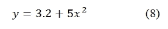
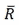
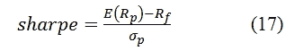
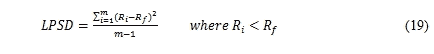

# 第九章 投资组合理论

理解投资组合理论对于学习金融非常重要。众所周知，*不要把所有的鸡蛋放在一个篮子里*，也就是说，分散风险是一个非常好的主意。然而，很少有人知道这种著名谚语背后的隐含假设。在本章中，我们将讨论个别股票或投资组合的各种风险衡量指标，如夏普比率、特雷诺比率、索提诺比率，如何基于这些指标（比率）最小化投资组合风险，如何设置目标函数，如何为给定的股票选择高效投资组合，以及如何构建有效前沿。我们的重点是如何使用实际数据应用投资组合理论。例如，今天我们有 200 万美元的现金，计划购买 IBM 和沃尔玛的股票。如果我们将 30%的资金投资于第一只股票，剩下的投资于第二只股票，那么我们的投资组合风险是多少？我们能基于这两只股票构建出最小风险的投资组合吗？如果是 10 只或 500 只股票呢？本章将涵盖以下主题：

+   投资组合理论简介

+   两只股票的投资组合

+   N 只股票的投资组合

+   相关性与多样化效应

+   生成收益矩阵

+   基于夏普比率、特雷诺比率和索提诺比率生成最优投资组合

+   构建有效前沿

+   莫迪利安尼和莫迪利安尼绩效衡量（M2 衡量）

# 投资组合理论简介

投资组合理论的关键字是**多样化**，而多样化的关键字是**相关性**。换句话说，相关性用于衡量两只股票或投资组合之间的共同运动程度。投资组合理论的目标是根据风险和收益最优地分配我们的资产。马科维茨（1952 年）认为，我们应只考虑证券收益分布的前两个时刻：均值和方差。对于金融市场，做出了一些重要假设，例如股市无效、典型投资者是理性的、套利机会不会持续太长时间。对于两只股票之间的偏好，对于给定的风险，理性投资者会偏好预期收益较高的股票；对于给定的收益，理性投资者偏好风险较低的股票。有时，单期投资组合优化被称为*马科维茨投资组合优化*。输入包括收益矩阵、方差和协方差矩阵，而输出是高效投资组合。通过连接众多高效投资组合，形成了有效前沿。在这里，我们从最简单的情境开始：一个由两只股票组成的投资组合。

# 两只股票的投资组合

显然，两只股票的投资组合是最简单的假设。假设这两只股票的权重分别是*w1*和*w2*。投资组合的收益如下所示：


在这里，*Rp,t* 是在时间 *t* 的投资组合回报，*w1*（*w2*）是股票 1（2）的权重，而 *R1,t*（*R2,t*）是股票 1（2）在时间 *t* 的回报。当谈到预期回报或均值时，我们有一个类似的公式：


在这里， 是均值或预期的投资组合回报，而  是股票 1（2）的均值或预期回报。此类两只股票的投资组合的方差定义如下：


在这里， 是投资组合的方差， 是股票 1（2）的标准差。股票 1 的方差和标准差的定义如下：

  是股票 1 和股票 2 之间的协方差（相关性）。它们在此定义如下：


对于协方差，如果它是正的，那么这两只股票通常会一起变动。另一方面，如果它是负的，它们通常会朝相反的方向变动。如果协方差为零，那么它们没有相关性。然而，如果我们知道，我们不能断言 A 与 B 的相关性比 A 与 C 的相关性强，或反之亦然。另一方面，如果，我们则可以断言 A 与 B 的相关性比 A 与 A 的相关性强。这表明相关性比协方差更有用。相关性的范围从-1 到 1。相关性值越低，分散化效应越强。当相关性为-1（1）时，称为完全负相关（完全正相关）。当两只股票（或投资组合）完全正相关时，就没有分散化。

假设两只股票的波动率（标准差）分别为 0.06 和 0.24，并且它们是完全负相关的。为了形成一个零风险投资组合，需要什么样的权重？有几种方法可以找到解决方案。

方法 1：我们可以手动找到一个解：将给定的值代入方程（3），并设其等于零，其中 *x=x1* 且 *x2=1-x*：


扩展并整理项后，我们将得到以下通用方程：


对于这种通用形式，如果根号内的项为正，即，我们有以下两种解法：


基于一组 *a*、*b* 和 *c*，我们得到了一个解 x=80%，即当 *w1=0.80* 和 *w2=0.2* 时，前述两只股票组合将是无风险的。假设我们有一个方程 *x2+6x+3=0*，以下 Python 程序提供两个解：

```py
import scipy as sp
a=1
b=6
c=3
inside=b**2-4*a*c
if inside>0:
    squared=sp.sqrt(inside)
print("x1=",(b+squared)/(2*a))
print("x2=",(b-squared)/(2*a)) 
('x1=', 5.4494897427831779)
('x2=', 0.55051025721682212)
```

方法 2：对于一对给定的标准差（或一对方差）以及它们之间的相关性，我们生成许多股票 1 的权重，例如 0、0.001、0.002、0.003 等。记住，*w2=1-w1*。通过应用公式（3），我们估计这个两只股票组合的方差。我们的最终解决方案将是实现最小组合方差的 *w1* 和 *w2*，请参见以下代码：

```py
import scipy as sp
sigma1=0.06
sigma2=0.24
var1=sigma1**2
var2=sigma2**2
rho=-1
n=1000
portVar=10   # assign a big number
tiny=1.0/n

for i in sp.arange(n):
    w1=i*tiny
    w2=1-w1
    var=w1**2*var1 +w2**2*var2+2*w1*w2*rho*sigma1*sigma2
    if(var<portVar):
        portVar=var
        finalW1=w1
    #print(vol)
print("min vol=",sp.sqrt(portVar), "w1=",finalW1) ('min vol=', ('min vol=', ('min vol=', 9.3132257461547852e-10, 'w1=', 0.80000000000000004)
```

首先，结果确认了我们之前的结果，其中 *w1=0.8* 和 *w2=0.2*。在程序中，我们有 1000 对 *w1* 和 *w2*。一个很小的值，称为 `tiny`，是 *1/1000=0.001*。第一对两个权重是 0.1% 和 99.9%。我们为我们的解变量分配一个非常大的数字，作为初始值。在这个程序中，`portVar=10`。其他大数字也完全有效，比如 100。这里的逻辑是：基于第一对 *w1* 和 *w2*，我们估计组合方差。如果这个新的组合方差小于 `portVar`，我们就用这个新值替换 `portVar` 并记录 *w1*。如果新的组合方差大于 `portVar`，我们什么也不做。重复相同的过程，直到完成循环。这里有个类比。假设我们想在 1000 人中找到身高最高的人。假设我们有一个变量叫 `tallestPerson`，初始值为 0.1 英寸。由于每个人都会比这个值高，第一个人的身高将替代这个值。如果下一个人的身高比这个变量还高，我们就替换它。否则，我们就到下一个人。这个过程会一直重复，直到最后一个人。在效率方面，有一个小技巧，就是只需估算一次 `var1` 和 `var2`。

在金融领域，使用方差和标准差来表示风险是一种惯例，因为它们描述了不确定性。通常，我们使用收益的标准差来代表波动性。观察相关性对有效前沿的影响是一个不错的主意。首先，让我们学习如何生成一组相关的随机数。涉及两个步骤：

1.  生成两个随机时间序列，*x1* 和 *x2*，其相关性为零。

1.  应用以下公式：

这里 ρ 是预定的两个时间序列之间的相关性。现在，*y1* 和 *y2* 是具有预定相关性的。以下 Python 程序将实现前述方法：

```py
import scipy as sp
sp.random.seed(123)
n=1000
rho=0.3
x1=sp.random.normal(size=n)
x2=sp.random.normal(size=n)
y1=x1
y2=rho*x1+sp.sqrt(1-rho**2)*x2
print(sp.corrcoef(y1,y2))
[[ 1\.          0.28505213]
 [ 0.28505213  1\.        ]]
```

# 优化 – 最小化

在讨论如何生成最优组合之前，有必要研究几个优化函数。在以下示例中，我们最小化目标函数 y：



首先，让我们看一下该目标函数的图形，见以下代码：

```py
import scipy as sp
import matplotlib.pyplot as plt
x=sp.arange(-5,5,0.01)
a=3.2
b=5.0
y=a+b*x**2
plt.plot(x,y)
plt.title("y= "+str(a)+"+"+str(b)+"x²")
plt.ylabel("y")
plt.xlabel("x")
plt.show()
```

图形如下所示：


为了使程序更具通用性，生成了两个系数`a`和`b`。显然，由于`x`的幂为 2，`y`只有在`x`为 0 时才最小化。最小化的 Python 代码如下：

```py
from scipy.optimize import minimize
def myFunction(x):
    return (3.2+5*x**2)
x0=100
res = minimize(myFunction,x0,method='nelder-mead',options={'xtol':1e-8,'disp': True})
```

在前面的程序中，使用的主要函数是`scipy.optimize.minimize()`函数。第一个输入是我们的目标函数，在这个例子中是我们的 y 函数。第二个值是输入值，即初始值。由于`y`函数只有一个自变量`x`，因此`x0`是一个标量。第三个输入值是方法，我们有多个选择：`NelderMead`。下表列出了 11 种变量选择：

| 方法 | 描述 |
| --- | --- |
| `NelderMead` | 使用 Simplex 算法。该算法在许多应用中都具有鲁棒性。然而，如果可以信任数值导数计算，其他使用一阶和/或二阶导数信息的算法可能会因其更好的性能而被优先选择。 |
| `Powell` | 这是 Powell 方法的修改版，Powell 方法是一种共轭方向法。它沿着每个方向向量执行顺序的一维最小化，并在每次主最小化循环迭代时更新方向集。该函数不需要可微性，也不需要计算导数。 |
| `CG` | 使用 Polak 和 Ribiere 的非线性共轭梯度算法，这是 Fletcher-Reeves 方法的一个变种。仅使用一阶导数。 |
| `BFGS` | 使用布罗伊登、弗莱彻、戈尔德法布和香农（BFGS）的拟牛顿法。只使用一阶导数。即使对于非光滑优化，BFGS 也表现出良好的性能。该方法还返回海森矩阵逆的近似值，存储在 OptimizeResult 对象中的 hess_inv 字段。 |
| `NewtonCG` | 使用牛顿-共轭梯度（Newton-CG）算法（也称为截断牛顿法）。它使用共轭梯度法计算搜索方向。 |
| `LBFGSB` | 使用 help()函数来获取更多信息。 |
| `TNC` | [同上] |
| `COBYLA` | [同上] |
| `SLSQP` | [同上] |
| `dogleg` | [同上] |
| `trustncg` | [同上] |

> 表 9.1 求解器类型

输出显示函数值为 3.2，这是通过将`x`赋值为`0`实现的。

优化成功终止：


下一个例子使用`scipy.optimize.brent()`函数进行指数函数的最小化，见下方的目标函数代码：


以下程序尝试最小化目标函数，即`y`：

```py
from scipy import optimize
import numpy as np
import matplotlib.pyplot as plt
# define a function 
a=3.4
b=2.0
c=0.8
def f(x):
    return a-b*np.exp(-(x - c)**2)

x=np.arange(-3,3,0.1)
y=f(x)
plt.title("y=a-b*exp(-(x-c)²)")
plt.xlabel("x")
plt.ylabel("y")
plt.plot(x,y)
plt.show()

# find the minimum
solution= optimize.brent(f) 
print(solution)
```

解决方案是`0.799999999528`，相关图形如下所示：


在经济学和金融学中，有一个重要的概念叫做效用。设计这个概念的主要原因之一是，在许多情况下，我们无法量化某些影响因素，例如幸福感、意愿、风险偏好、健康、情绪等。例如，如果你的老板要求你在周五加班并承诺给你奖金，假设每小时的奖金是*x*美元，并且你对此感到满意。如果任务很紧急，老板可能会要求你工作更长时间。假设你还需要在周六工作，你认为相同的每小时*x*美元还会让你高兴吗？对于大多数员工来说，额外的奖金应该高于 x，因为他们会认为自己现在的付出已经不仅仅是一个周五的晚上了。通常，效用函数可以定义为收益与成本之间的差异。边际效益是我们投入的递减函数。这意味着，额外获得的一美元并不像之前的那一美元那样有价值。另一方面，边际成本将是你投入的递增函数。当你被要求做额外工作时，适当的货币激励应该更高。这里是一个效用函数：


这里，*U*是效用函数，*E(R)*是预期的投资组合回报，我们可以用它的均值来近似，*A*是风险厌恶系数，*σ2*是投资组合的方差。当预期回报更高时，我们的效用也更高。反之，当我们投资组合的风险更高时，效用更低。关键在于*A*，它代表了风险承受能力。在相同的预期回报和风险水平下，风险厌恶的投资者（更高的 A 值）会体验到较低的效用。一般来说，目标是平衡收益（预期回报）与风险（方差）。

假设我们有一组股票，如**国际商用机器公司**（**IBM**）、**沃尔玛**（**WMT**）和**花旗集团**（**C**）。基于前面的效用函数，我们应该根据不同的风险偏好选择哪只股票呢？以下是给出的代码：

```py
from matplotlib.finance import quotes_historical_yahoo_ochl as getData
import numpy as np
import pandas as pd
import scipy as sp

tickers=('IBM','WMT','C')  # tickers
begdate=(2012,1,1)         # beginning date 
enddate=(2016,12,31)       # ending date
n=len(tickers)             # number of observations
A=1                        # risk preference

def ret_f(ticker,begdate,enddte):
    x=getData(ticker,begdate,enddate,asobject=True,adjusted=True)
    ret =x.aclose[1:]/x.aclose[:-1]-1
    return ret

def myUtilityFunction(ret,A=1):
    meanDaily=sp.mean(ret)
    varDaily=sp.var(ret)
    meanAnnual=(1+meanDaily)**252
    varAnnual=varDaily*252
    return meanAnnual- 0.5*A*varAnnual

for i in sp.arange(n):
    ret=ret_f(tickers[i],begdate,enddate)
    print(myUtilityFunction(ret,A))
```

在前面的程序中，均值和标准差都是年化的。252 的数值代表每年的交易天数。使用的时间段是从 2012 年 1 月 1 日到 2016 年 12 月 31 日，即五年的时间段。输出结果如下。再次提醒，结果是针对风险偏好 A=1 的投资者：


基于效用的概念，投资者偏好效用值最高的股票。因此，我们应该选择最后一只股票。换句话说，如果我们必须选择一只股票作为投资，我们应该选择花旗集团。另一方面，当 A=10 时，也就是极度风险厌恶时，这三只股票的效用值如下：


结果表明，这样的投资者应该选择第二只股票，也就是沃尔玛作为唯一的投资。这与我们的常识一致，见其对应的平均回报和风险水平：

```py
from matplotlib.finance import quotes_historical_yahoo_ochl as getData
import numpy as np
import pandas as pd
import scipy as sp

tickers=('IBM','WMT','C')  # tickers
begdate=(2012,1,1)         # beginning date 
enddate=(2016,12,31)       # ending date
n=len(tickers)             # number of observations

def ret_f(ticker,begdate,enddte):
    x=getData(ticker,begdate,enddate,asobject=True,adjusted=True)
    ret =x.aclose[1:]/x.aclose[:-1]-1
    return ret

def meanVarAnnual(ret):
    meanDaily=sp.mean(ret)
    varDaily=sp.var(ret)
    meanAnnual=(1+meanDaily)**252
    varAnnual=varDaily*252
return meanAnnual, varAnnual

print("meanAnnual,      varAnnjal")
for i in sp.arange(n):
    ret=ret_f(tickers[i],begdate,enddate)
    print(meanVarAnnual(ret))
```

输出结果如下：


在前面的程序中，生成了一个名为`meanVarAnnual()`的函数，计算年化的平均回报和年化波动率。我们来比较最后两只股票。第二只股票在同一时间比第三只股票风险更低；它的风险高于第三只股票。第二只股票的年平均回报下降了 12%，然而，它的方差下降了 63%。结果是效用增加了。

对于投资组合优化，或者马克维茨投资组合优化，我们的输入数据集包括：预期收益、标准差和相关矩阵。输出将是一个最优的投资组合。通过连接这些高效的投资组合，可以构建一个有效前沿。在本章其余部分，我们使用历史回报来代表预期回报，并使用历史相关性来代替预期相关性。

# 形成一个 n 只股票的投资组合

以下程序生成一个回报矩阵，包含三只股票和 S&P500：

```py
import statsimport numpy as np
import pandas as pd
tickers=['IBM','dell','wmt']
path1='http://chart.yahoo.com/table.csv?s=^GSPC'
final=pd.read_csv(path1,usecols=[0,6],index_col=0)
final.columns=['^GSPC']
path2='http://chart.yahoo.com/table.csv?s=ttt'
for ticker in tickers:
    print ticker
    x = pd.read_csv(path2.replace('ttt',ticker),usecols=[0,6],index_col=0)
    x.columns=[ticker]
    final=pd.merge(final,x,left_index=True,right_index=True)
```

要显示前几行和最后几行，我们使用`.head()`和`.tail()`函数，如下所示：

```py
>>>final.head()
              ^GSPC     IBM   dell    wmt
Date                                     
2013-10-18  1744.50  172.85  13.83  75.71
2013-10-17  1733.15  173.90  13.85  75.78
2013-10-16  1721.54  185.73  13.85  75.60
2013-10-15  1698.06  183.67  13.83  74.37
2013-10-14  1710.14  185.97  13.85  74.68
>>>final.tail()
             ^GSPC    IBM  dell   wmt
Date                                 
1988-08-23  257.09  17.38  0.08  2.83
1988-08-22  256.98  17.36  0.08  2.87
1988-08-19  260.24  17.67  0.09  2.94
1988-08-18  261.03  17.97  0.09  2.98
1988-08-17  260.77  17.97  0.09  2.98
>>>
```

在前面的程序中，我们首先提取 S&P500 数据。然后将股票数据与市场指数合并。使用的主要函数是`pandas.merge()`。请注意两个输入参数的含义：`left_index=True`和`right_index=True`。它们表示这两个数据集是通过它们的索引进行合并的。在程序中，获取的是日频率数据。学术研究人员和专业人士通常更倾向于使用月度频率数据，其中一个原因是月度数据相比日度数据更少受到所谓的微观结构效应的影响。以下程序使用了月度数据。使用的 Python 数据是`yanMonthly.pkl`，[`canisius.edu/~yany/python/yanMonthly.pkl`](http://canisius.edu/~yany/python/yanMonthly.pkl)。首先，我们打印出所包含的证券列表：

```py
import pandas as pd
import scipy as sp
df=pd.read_pickle("c:/temp/yanMonthly.pkl")
print(sp.unique(df.index))
['000001.SS' 'A' 'AA' 'AAPL' 'BC' 'BCF' 'C' 'CNC' 'COH' 'CPI' 'DELL' 'GE'
 'GOLDPRICE' 'GV' 'GVT' 'HI' 'HML' 'HPS' 'HY' 'IBM' 'ID' 'IL' 'IN' 'INF'
 'ING' 'INY' 'IO' 'ISL' 'IT' 'J' 'JKD' 'JKE' 'JPC' 'KB' 'KCC' 'KFT' 'KIE'
 'KO' 'KOF' 'LBY' 'LCC' 'LCM' 'LF' 'LG' 'LM' 'M' 'MA' 'MAA' 'MD' 'MFL' 'MM'
 'MPV' 'MY' 'Mkt_Rf' 'NEV' 'NIO' 'NP' 'NU' 'NYF' 'OI' 'OPK' 'PAF' 'PFO'
 'PSJ' 'PZZA' 'Q' 'RH' 'RLV' 'Rf' 'Russ3000E_D' 'Russ3000E_X' 'S' 'SBR'
 'SCD' 'SEF' 'SI' 'SKK' 'SMB' 'STC' 'T' 'TA' 'TBAC' 'TEN' 'TK' 'TLT' 'TOK'
 'TR' 'TZE' 'UHS' 'UIS' 'URZ' 'US_DEBT' 'US_GDP2009dollar'
 'US_GDP2013dollar' 'V' 'VC' 'VG' 'VGI' 'VO' 'VV' 'WG' 'WIFI' 'WMT' 'WR'
 'XLI' 'XON' 'Y' 'YANG' 'Z' '^AORD' '^BSESN' '^CCSI' '^CSE' '^FCHI' '^FTSE'
 '^GSPC' '^GSPTSE' '^HSI' '^IBEX' '^ISEQ' '^JKSE' '^KLSE' '^KS11' '^MXX'
 '^NZ50' '^OMX' '^STI' '^STOXX50E' '^TWII']
```

要选择特定的证券，可以将数据集的索引与股票代码进行比较；请参见以下代码选择 IBM 的月度价格数据：

```py
import scipy as sp
import pandas as pd
import numpy as np
n_stocks=10
x=pd.read_pickle('c:/temp/yanMonthly.pkl')
ibm=x[x.index=='IBM']
print(ibm.head(3))
print(ibm.tail(3))
          DATE  VALUE
NAME                 
IBM   19620131   2.36
IBM   19620228   2.34
          DATE   VALUE
NAME                  
IBM   20130930  185.18
IBM   20131031  179.21
IBM   20131104  180.27
```

以下程序先生成回报，然后使用股票代码作为对应的列名，而不是使用生成的术语，如`return`。原因是我们打算选择几只股票并将它们并排放置，即按日期排列：

```py
import scipy as sp
import pandas as pd
import numpy as np
n_stocks=10
x=pd.read_pickle('c:/temp/yanMonthly.pkl')
def ret_f(ticker):
    a=x[x.index==ticker]
    p=sp.array(a['VALUE'])
    ddate=a['DATE']
    ret=p[1:]/p[:-1]-1
    output=pd.DataFrame(ret,index=ddate[1:])
    output.columns=[ticker]
    return output
ret=ret_f('IBM')
print(ret.head())
               IBM
DATE              
19620228 -0.008475
19620330 -0.008547
19620430 -0.146552
19620531 -0.136364
19620629 -0.134503
```

最后，我们可以从`yanMonthly.pkl`构建一个 n 只股票的回报矩阵：

```py
import scipy as sp
import pandas as pd
import numpy as np
n_stocks=10
x=pd.read_pickle('c:/temp/yanMonthly.pkl')
x2=sp.unique(np.array(x.index))
x3=x2[x2<'ZZZZ']                       # remove all indices
sp.random.seed(1234567)
nonStocks=['GOLDPRICE','HML','SMB','Mkt_Rf','Rf','Russ3000E_D','US_DEBT','Russ3000E_X','US_GDP2009dollar','US_GDP2013dollar']
x4=list(x3)

for i in range(len(nonStocks)):
    x4.remove(nonStocks[i])
k=sp.random.uniform(low=1,high=len(x4),size=n_stocks)
y,s=[],[]

for i in range(n_stocks):
    index=int(k[i])
    y.append(index)
    s.append(x4[index])
final=sp.unique(y)
print(s)

def ret_f(ticker):
    a=x[x.index==ticker]
    p=sp.array(a['VALUE'])
    ddate=a['DATE']
    ret=p[1:]/p[:-1]-1
    output=pd.DataFrame(ret,index=ddate[1:])
    output.columns=[ticker]
    return output
final=ret_f(s[0])
for i in sp.arange(1,n_stocks):
    ret=ret_f(s[i])
    final=pd.merge(final,ret,left_index=True, right_index=True)
```

要从一组现有可用股票（其中有 n 个）中随机选择 m 只股票，请参见`scipy.random.uniform(low=1,high=len(x4),size=n_stocks)`命令。由于`n_stocks`的值为 10，我们从`len(x4)`中选择了 10 只股票。输出结果如下：

```py
                IO         A        AA        KB      DELL        IN  \
DATE                                                                   
20110930 -0.330976 -0.152402 -0.252006 -0.206395 -0.048679 -0.115332   
20111031  0.610994  0.185993  0.124464  0.192002  0.117690  0.237730   
20111130 -0.237533  0.011535 -0.066794 -0.106274 -0.002616 -0.090458   
20111230  0.055077 -0.068422 -0.135992 -0.102006 -0.072131 -0.065395   
20120131  0.212072  0.215972  0.173964  0.209317  0.178092  0.230321   

               INF       IBM       SKK        BC  
DATE                                              
20110930 -0.228456  0.017222  0.227586 -0.116382  
20111031  0.142429  0.055822 -0.305243  0.257695  
20111130 -0.038058  0.022314 -0.022372  0.057484  
20111230  0.059345 -0.021882 -0.024262 -0.030140  
20120131  0.079202  0.047379 -0.142131  0.182020
```

在金融领域，构建有效前沿始终是一项具有挑战性的工作，尤其是在使用真实数据时。在这一部分，我们讨论了方差-协方差矩阵的估算及其优化、寻找最优投资组合以及使用从 Yahoo! Finance 下载的股票数据构建有效前沿。当给定回报矩阵时，我们可以估算其方差-协方差矩阵。对于一组给定的权重，我们可以进一步估算投资组合的方差。估算单只股票回报的方差和标准差的公式如下：


这里，是均值，是第*i*期的股票回报，*n*是回报的数量。对于一个 n 股投资组合，我们有以下公式来估算其投资组合回报：


这里，是投资组合回报，是第*i*只股票的权重，是第 i 只股票的回报。这对于投资组合的均值或预期投资组合回报是成立的，见下文：


n 股投资组合的投资组合方差在此定义：


这里，是投资组合方差，*n*是投资组合中的股票数量，是第 i 只股票的权重，是第*i*只股票和第*j*只股票之间的协方差。请注意，当*i*与*j*相同时，就是方差，即：


可以理解的是，2 只股票的投资组合只是 n 股投资组合的一个特例。同样，当回报矩阵和权重向量的值给定时，我们可以如下估算其方差-协方差矩阵和投资组合方差：

```py
import numpy as np
ret=np.matrix(np.array([[0.1,0.2],[0.10,0.1071],[-0.02,0.25],[0.012,0.028],[0.06,0.262],[0.14,0.115]]))
print("return matrix")
print(ret)
covar=ret.T*ret
print("covar")
print(covar)
weight=np.matrix(np.array([0.4,0.6]))
print("weight ")
print(weight)
print("mean return")
print(weight*covar*weight.T)
```

使用的关键命令是`ret.T*ret`。`ret.T`是回报矩阵的转置。由于回报矩阵是一个 6×2 的矩阵，其转置将是一个 2×6 的矩阵。因此，(2×6)与(6×2)的矩阵乘法结果将是(2×2)。相应的输出，如回报矩阵、协方差矩阵、权重和投资组合方差，列示如下：

```py
return matrix
[[ 0.1     0.2   ]
 [ 0.1     0.1071]
 [-0.02    0.25  ]
 [ 0.012   0.028 ]
 [ 0.06    0.262 ]
 [ 0.14    0.115 ]]
covar
[[ 0.043744    0.057866  ]
 [ 0.057866    0.19662341]]
weight 
[[ 0.4  0.6]]
mean return
[[ 0.10555915]]
```

进行矩阵乘法的第二种方法是使用`spcipy.dot()`函数，见以下代码：

```py
import numpy as np
ret=np.matrix(np.array([[0.1,0.2],[0.10,0.1071],[-0.02,0.25],[0.012,0.028],[0.06,0.262],[0.14,0.115]]))
covar=np.dot(ret.T,ret)
print("covar")
print(covar)
```

# 构建一个最优投资组合

在金融学中，我们处理的是风险与收益之间的权衡。一个广泛使用的标准是夏普比率，其定义如下：



以下程序通过改变投资组合中股票的权重来最大化夏普比率。整个程序可以分为几个部分。输入区域非常简单，只需要输入一些股票代码以及起始和结束日期。接下来，我们定义四个函数，分别是将日收益转换为年收益、估算投资组合的方差、估算夏普比率，并在优化过程中估算最后一个（即第 n 个）权重，而前 n-1 个权重已经通过我们的优化程序估算出来：  

```py
from matplotlib.finance import quotes_historical_yahoo_ochl as getData
import numpy as np
import pandas as pd
import scipy as sp
from scipy.optimize import fmin
```

1.  输入区域的代码：

    ```py
    ticker=('IBM','WMT','C')   # tickers
    begdate=(1990,1,1)         # beginning date 
    enddate=(2012,12,31)       # ending date
    rf=0.0003                  # annual risk-free rate
    ```

1.  定义一些函数的代码：

    ```py
    # function 1: 
    def ret_annual(ticker,begdate,enddte):
        x=getData(ticker,begdate,enddate,asobject=True,adjusted=True)
        logret =sp.log(x.aclose[1:]/x.aclose[:-1])
        date=[]
        d0=x.date
        for i in range(0,sp.size(logret)):
            date.append(d0[i].strftime("%Y"))
        y=pd.DataFrame(logret,date,columns=[ticker])
        return sp.exp(y.groupby(y.index).sum())-1

    # function 2: estimate portfolio variance 
    def portfolio_var(R,w):
        cor = sp.corrcoef(R.T)
        std_dev=sp.std(R,axis=0)
        var = 0.0
        for i in xrange(n):
            for j in xrange(n):
                var += w[i]*w[j]*std_dev[i]*std_dev[j]*cor[i, j]
        return var

    # function 3: estimate Sharpe ratio
    def sharpe(R,w):
        var = portfolio_var(R,w)
        mean_return=sp.mean(R,axis=0)
        ret = sp.array(mean_return)
        return (sp.dot(w,ret) - rf)/sp.sqrt(var)

    # function 4: for given n-1 weights, return a negative sharpe ratio
    def negative_sharpe_n_minus_1_stock(w):
        w2=sp.append(w,1-sum(w))
        return -sharpe(R,w2)        # using a return matrix here!!!!!!
    ```

1.  生成收益矩阵（年收益）的代码：

    ```py
    n=len(ticker)              # number of stocks
    x2=ret_annual(*ticker[0],begdate,enddate) 
    for i in range(1,n):
        x_=ret_annual(ticker[i],begdate,enddate) 
        x2=pd.merge(x2,x_,left_index=True,right_index=True)

    # using scipy array format 
    R = sp.array(x2)
    print('Efficient porfolio (mean-variance) :ticker used')
    print(ticker)
    print('Sharpe ratio for an equal-weighted portfolio')
    equal_w=sp.ones(n, dtype=float) * 1.0 /n 
    print(equal_w)
    print(sharpe(R,equal_w))

    # for n stocks, we could only choose n-1 weights
    w0= sp.ones(n-1, dtype=float) * 1.0 /n 
    w1 = fmin(negative_sharpe_n_minus_1_stock,w0)
    final_w = sp.append(w1, 1 - sum(w1))
    final_sharpe = sharpe(R,final_w)
    print ('Optimal weights are ')
    print (final_w)
    print ('final Sharpe ratio is ')
    print(final_sharpe)
    ```

在步骤 2 中，我们将日收益估算为年收益。对于优化而言，最重要的函数是`scipy.optimize.fmin()`函数。该最小化函数的第一个输入是我们的目标函数`negative_sharpe_n_minus_1`。我们的目标是最大化夏普比率。由于这是一个最小化函数，它等同于最小化负的夏普比率。另一个问题是，我们需要 n 个权重来计算夏普比率。然而，由于 n 个权重的总和为 1，我们只有 n-1 个权重作为选择变量。从以下输出可以看出，如果我们使用一个简单的等权重策略，夏普比率为 0.63。另一方面，我们的最优投资组合的夏普比率为 0.67：

```py
Efficient porfolio (mean-variance) :ticker used
('IBM', 'WMT', 'C')
Sharpe ratio for an equal-weighted portfolio
[ 0.33333333  0.33333333  0.33333333]
0.634728319263
Optimization terminated successfully.
         Current function value: -0.669758
         Iterations: 31
         Function evaluations: 60
Optimal weights are 
[ 0.49703463  0.31044168  0.19252369]
final Sharpe ratio is 
0.66975823926
```

# 构建具有 n 只股票的有效前沿

构建有效前沿一直是金融学教授面临的最困难的任务之一，因为这个任务涉及矩阵操作和约束优化过程。一个有效前沿能够生动地解释马科维茨投资组合理论。以下 Python 程序使用五只股票构建有效前沿：

```py
from matplotlib.finance import quotes_historical_yahoo_ochl as getData
import matplotlib.pyplot as plt
import numpy as np
import pandas as pd
import scipy as sp
from numpy.linalg import inv, pinv
```

1.  输入区域的代码：

    ```py
    begYear,endYear = 2001,2013
    stocks=['IBM','WMT','AAPL','C','MSFT']
    ```

1.  定义两个函数的代码：

    ```py
    def ret_monthly(ticker):  #  function 1
        x = getData(ticker,(begYear,1,1),(endYear,12,31),asobject=True,adjusted=True)
        logret=np.log(x.aclose[1:]/x.aclose[:-1]) 
        date=[]
        d0=x.date
        for i in range(0,np.size(logret)): 
            date.append(''.join([d0[i].strftime("%Y"),d0[i].strftime("%m")]))
        y=pd.DataFrame(logret,date,columns=[ticker]) 
        return y.groupby(y.index).sum()

    # function 2: objective function 
    def objFunction(W, R, target_ret):
        stock_mean=np.mean(R,axis=0) 
        port_mean=np.dot(W,stock_mean)          # portfolio mean 
        cov=np.cov(R.T)                         # var-cov matrix
        port_var=np.dot(np.dot(W,cov),W.T)     # portfolio variance 
        penalty = 2000*abs(port_mean-target_ret)# penalty 4 deviation 
        return np.sqrt(port_var) + penalty     # objective function
    ```

1.  生成收益矩阵 R 的代码：

    ```py
    R0=ret_monthly(stocks[0])                   # starting from 1st stock 
    n_stock=len(stocks)                         # number of stocks
    for i in xrange(1,n_stock):                 # merge with other stocks 
        x=ret_monthly(stocks[i]) 
        R0=pd.merge(R0,x,left_index=True,right_index=True)
        R=np.array(R0)
    ```

1.  估算给定收益的最优投资组合的代码：

    ```py
    out_mean,out_std,out_weight=[],[],[] 
    stockMean=np.mean(R,axis=0)
    for r in np.linspace(np.min(stockMean),np.max(stockMean),num=100):
        W = np.ones([n_stock])/n_stock    # starting from equal weights 
        b_ = [(0,1) 
        for i in range(n_stock)]          # bounds, here no short 
        c_ = ({'type':'eq', 'fun': lambda W: sum(W)-1\. })#constraint
        result=sp.optimize.minimize(objFunction,W,(R,r),method='SLSQP',constraints=c_, bounds=b_)
        if not result.success:            # handle error raise 
            BaseException(result.message)
        out_mean.append(round(r,4))       # 4 decimal places 
        std_=round(np.std(np.sum(R*result.x,axis=1)),6) 
        out_std.append(std_)
        out_weight.append(result.x)
    ```

1.  绘制有效前沿的代码：

    ```py
    plt.title('Efficient Frontier')
    plt.xlabel('Standard Deviation of the porfolio (Risk))') 
    plt.ylabel('Return of the portfolio') 
    plt.figtext(0.5,0.75,str(n_stock)+' stock are used: ') 
    plt.figtext(0.5,0.7,' '+str(stocks))
    plt.figtext(0.5,0.65,'Time period: '+str(begYear)+' ------ '+str(endYear)) 
    plt.plot(out_std,out_mean,'--')
    plt.show()
    ```

理解该程序的关键是其目标函数，在*# 函数 2：目标函数*标题下。我们的目标是，对于给定的目标投资组合的均值或预期值，我们将最小化投资组合的风险。命令行的第一部分`np.sqrt(port_var) + penalty`是投资组合方差。第一项没有歧义。现在，让我们转到第二项，称为惩罚项，它定义为投资组合均值与目标均值的绝对偏差乘以一个大数值。这是一种通过使用无约束优化过程来定义目标函数的非常流行的方式。另一种方式是应用带有约束条件的优化过程。输出图像如下所示：


在之前的一个程序中，我们的目标函数是最大化夏普比率。从上一章我们知道，当考虑的投资组合不是我们所有的财富时，夏普比率可能不是一个好的衡量标准。作为夏普比率的修正，特雷诺比率定义如下：


在这里，左侧是特雷诺比率， 是平均投资组合收益， 是无风险利率， 是投资组合的贝塔值。唯一的修改是，将西格玛（总风险）替换为贝塔（市场风险）。

在以下程序中，特雷诺比率将是我们的目标函数：

```py
import matplotlib.pyplot as plt
from matplotlib.finance import quotes_historical_yahoo_ochl as getData
import numpy as np
import pandas as pd
import scipy as sp
from scipy.optimize import fmin

# Step 1: input area
ticker=('IBM','WMT','C')   # tickers
begdate=(1990,1,1)         # beginning date 
enddate=(2012,12,31)       # ending date
rf=0.0003                  # annual risk-free rate
betaGiven=(0.8,0.4,0.3)    # given beta's 

# Step 2: define a few functions

# function 1: 
def ret_annual(ticker,begdate,enddte):
    x=getData(ticker,begdate,enddate,asobject=True,adjusted=True)
    logret =sp.log(x.aclose[1:]/x.aclose[:-1])
    date=[]
    d0=x.date
    for i in range(0,sp.size(logret)):
        date.append(d0[i].strftime("%Y"))
    y=pd.DataFrame(logret,date,columns=[ticker])
    return sp.exp(y.groupby(y.index).sum())-1

# function 2: estimate portfolio beta 
def portfolioBeta(betaGiven,w):
    #print("betaGiven=",betaGiven,"w=",w)
    return sp.dot(betaGiven,w)
# function 3: estimate Treynor
def treynor(R,w):
    betaP=portfolioBeta(betaGiven,w)
    mean_return=sp.mean(R,axis=0)
    ret = sp.array(mean_return)
    return (sp.dot(w,ret) - rf)/betaP

# function 4: for given n-1 weights, return a negative Sharpe ratio
def negative_treynor_n_minus_1_stock(w):
    w2=sp.append(w,1-sum(w))
    return -treynor(R,w2)        # using a return matrix here!!!!!!

# Step 3: generate a return matrix (annul return)
n=len(ticker)                    # number of stocks
x2=ret_annual(ticker[0],begdate,enddate) 
for i in range(1,n):
    x_=ret_annual(ticker[i],begdate,enddate) 
    x2=pd.merge(x2,x_,left_index=True,right_index=True)
# using scipy array format 
R = sp.array(x2)
print('Efficient porfolio (Treynor ratio) :ticker used')
print(ticker)
print('Treynor ratio for an equal-weighted portfolio')
equal_w=sp.ones(n, dtype=float) * 1.0 /n 
print(equal_w)
print(treynor(R,equal_w))

# for n stocks, we could only choose n-1 weights
w0= sp.ones(n-1, dtype=float) * 1.0 /n 
w1 = fmin(negative_treynor_n_minus_1_stock,w0)
final_w = sp.append(w1, 1 - sum(w1))
final_treynor = treynor(R,final_w)
print ('Optimal weights are ')
print (final_w)
print ('final Sharpe ratio is ')
print(final_treynor)
```

输出如下所示：


另一个反对在夏普比率中使用标准差的观点是，它考虑了上下两方面的偏差，低于均值和高于均值。然而，我们知道投资者更关注下行风险（低于均值的偏差）。夏普比率的第二个问题是，对于分子，我们将均值收益与无风险利率进行比较。然而，对于分母，偏差是基于均值收益，而不是相同的无风险利率。为了克服这两个缺点，提出了一种所谓的**下行偏差标准差**（**LPSD**）。假设我们有 n 个收益和一个**无风险利率**（**Rf**）。进一步假设，有 m 个收益低于该无风险利率。我们通过仅使用这 m 个收益来估算 LPSD，其定义如下：



以下程序展示了如何为给定的收益集估算 LPSD：

```py
import scipy as sp
import numpy as np
mean=0.15;
Rf=0.01
std=0.20
n=200
sp.random.seed(3412)
x=sp.random.normal(loc=mean,scale=std,size=n)
def LPSD_f(returns, Rf):
    y=returns[returns-Rf<0]  
    m=len(y)
    total=0.0
    for i in sp.arange(m):
        total+=(y[i]-Rf)**2
    return total/(m-1)
answer=LPSD_f(x,Rf)
print("LPSD=",answer)
('LPSD=', 0.022416749724544906)
```

类似于夏普比率和特雷诺比率，索提诺比率的定义如下：


以下程序将最大化给定几只股票的索提诺比率：

```py
import scipy as sp
import numpy as np
import pandas as pd
from scipy.optimize import fmin
from matplotlib.finance import quotes_historical_yahoo_ochl as getData
#
# Step 1: input area
ticker=('IBM','WMT','C')   # tickers
begdate=(1990,1,1)         # beginning date 
enddate=(2012,12,31)       # ending date
rf=0.0003                  # annual risk-free rate
#
# Step 2: define a few functions
# function 1: 
def ret_annual(ticker,begdate,enddte):
    x=getData(ticker,begdate,enddate,asobject=True,adjusted=True)
    logret =sp.log(x.aclose[1:]/x.aclose[:-1])
    date=[]
    d0=x.date
    for i in range(0,sp.size(logret)):
        date.append(d0[i].strftime("%Y"))
    y=pd.DataFrame(logret,date,columns=[ticker])
    return sp.exp(y.groupby(y.index).sum())-1

# function 2: estimate LPSD
def LPSD_f(returns, Rf):
    y=returns[returns-Rf<0]  
    m=len(y)
    total=0.0
    for i in sp.arange(m):
        total+=(y[i]-Rf)**2
    return total/(m-1)

# function 3: estimate Sortino
def sortino(R,w):
    mean_return=sp.mean(R,axis=0)
    ret = sp.array(mean_return)
    LPSD=LPSD_f(R,rf)
    return (sp.dot(w,ret) - rf)/LPSD

# function 4: for given n-1 weights, return a negative sharpe ratio
def negative_sortino_n_minus_1_stock(w):
    w2=sp.append(w,1-sum(w))
    return -sortino(R,w2)        # using a return matrix here!!!!!!

# Step 3: generate a return matrix (annul return)
n=len(ticker)              # number of stocks
x2=ret_annual(ticker[0],begdate,enddate) 
for i in range(1,n):
    x_=ret_annual(ticker[i],begdate,enddate) 
    x2=pd.merge(x2,x_,left_index=True,right_index=True)

# using scipy array format 
R = sp.array(x2)
print('Efficient porfolio (mean-variance) :ticker used')
print(ticker)
print('Sortino ratio for an equal-weighted portfolio')
equal_w=sp.ones(n, dtype=float) * 1.0 /n 
print(equal_w)
print(sortino(R,equal_w))
# for n stocks, we could only choose n-1 weights
w0= sp.ones(n-1, dtype=float) * 1.0 /n 
w1 = fmin(negative_sortino_n_minus_1_stock,w0)
final_w = sp.append(w1, 1 - sum(w1))
final_sortino = sortino(R,final_w)
print ('Optimal weights are ')
print (final_w)
print ('final Sortino ratio is ')
print(final_sortino)
```

这是相应的输出：


Modigliani 和 Modigliani（1997）提出了另一种绩效衡量方法。他们的基准是一个特定的市场指数。我们以标准普尔 500 指数为例。假设我们的投资组合相比标准普尔 500 市场指数具有更高的风险和更高的回报：


这是他们的两步法：

1.  通过为我们的原始投资组合设置两个权重 w 和(1-w)来形成一个新投资组合，该新投资组合的风险与标准普尔 500 市场指数相同：

    实际上，*w*的权重将由以下公式给出：

    

1.  使用以下公式计算投资组合的平均回报：

最终的判断标准是这个新的风险调整后的投资组合回报是否大于或小于标准普尔 500 指数的平均回报。以下 Python 程序实现了这一点：

```py
from matplotlib.finance import quotes_historical_yahoo_ochl as getData
import matplotlib.pyplot as plt
import pandas as pd
import numpy as np
import scipy as sp

begdate=(2012,1,1)
enddate=(2016,12,31)
ticker='IBM'

def ret_f(ticker):  #  function 1
    x = getData(ticker,begdate,enddate,asobject=True,adjusted=True)
    ret=x.aclose[1:]/x.aclose[:-1]-1 
    ddate=x['date'][1:]
    y=pd.DataFrame(ret,columns=[ticker],index=ddate) 
    return y.groupby(y.index).sum()

a=ret_f(ticker)
b=ret_f("^GSPC")
c=pd.merge(a,b,left_index=True, right_index=True)
print(c.head())
mean=sp.mean(c)
print(mean)
cov=sp.dot(c.T,c)
print(cov)
```

输出结果如下：


有不同的加权方案来估算投资组合的回报。常用的有市值加权、等权重加权和价格加权。在估算某些指数时，市值加权也叫做市值加权法。例如，标准普尔 500 指数的回报是市值加权的，而道琼斯工业平均指数则是价格加权的。等权重加权是最简单的一种：


这里，表示时间*t*时的投资组合回报，表示股票*i*在时间*t*的回报，*n*是投资组合中的股票数量。这里有一个非常简单的例子，假设我们的投资组合中有两只股票。去年，股票 A 的回报为 20%，而股票 B 的回报为-10%，那么基于这两个值的等权重回报是多少？答案是 5%。对于市值加权指数，关键是权重，请看下面的公式：


这里的*vi*是我们对第 i 只股票的投资金额，是投资组合的总价值。假设我们有一个由 2 只股票组成的投资组合。去年，股票 A（B）的回报分别为 20%（-10%）。如果我们对股票 A 和 B 的投资比例为 90%与 10%，那么它们的市值加权回报是多少？答案是*17% (0.9*0.2+0.1*(-0.1))*。对于像标准普尔 500 指数这样的市场指数，*vi*将是股票 i 的市值，所有 500 只股票市值的总和将是该指数投资组合的市场价值。在估算市值加权市场指数时，小市值股票的影响很小，因为它们的权重非常小。这里有一个简单的例子，使用`yanMonthly.pkl`文件，可以从[`canisius.edu/~yany/python/yanMonthly.pkl`](http://canisius.edu/~yany/python/yanMonthly.pkl)下载：

```py
import scipy as sp
import pandas as pd
x=pd.read_pickle("c:/temp/yanMonthly.pkl")
def ret_f(ticker):
    a=x[x.index==ticker]
    p=sp.array(a['VALUE'])
    ddate=a['DATE'][1:]
    ret=p[1:]/p[:-1]-1
    out1=pd.DataFrame(p[1:],index=ddate)
    out2=pd.DataFrame(ret,index=ddate)
    output=pd.merge(out1,out2,left_index=True, right_index=True)
    output.columns=['Price_'+ticker,'Ret_'+ticker]
    return output
a=ret_f("IBM")
b=ret_f('WMT')
c=pd.merge(a,b,left_index=True, right_index=True)
print(c.head())
```

这是输出结果：


由于只有两只股票，我们可以手动计算几个不同权重方案的几天回报。我们以最后的观察数据，1973 年 1 月为例，假设我们有 100 股 IBM 和 200 股沃尔玛股票。等权月度回报为 *-0.08 (0.04-0.2)/2)*。对于价值加权回报，我们估算两个权重，假设我们使用前一个价格来估算这些权重。总值为 *100*7.04 + 200*0.05= 714*。因此 *w1= 0.9859944 (704/714)* 和 *w2=0.0140056*。价值加权回报为 0.0366，即 *0.9859944*0.04 + 0.0140056*(-0.2)*。对于价格加权投资组合，格式与价值加权类似。主要的区别是如何定义其权重：


这里，是 *i* 股票的价格。从某种意义上说，价格加权投资组合可以看作是我们每只股票在投资组合中只有一股，且是同样的 2 只股票投资组合。去年，A 股票（B 股票）的回报分别是 20%（-10%）。如果 A 股票（B 股票）的价格分别为 10 美元（90 美元），那么价格加权投资组合的回报将是-7%，即 *0.2*(10/100)-0.1*(90/100)*。显然，价格较高的股票会有更高的权重。根据前述 IBM 和沃尔玛的结果，价格加权方案的两个权重是 *0.9929478*；即 *7.04/(7.04+0.05)* 和 *0.007052186*。因此，当月的价格加权投资组合回报为 *0.03830747*，即 *0.9929478*0.04 + 0.007052186*(-0.2)*。

估算投资组合或指数收益时会有一些曲折。第一个曲折是收益是否包含股息和其他分红。例如，`CRSP`数据库有`EWRETD`和`EWRETX`。`EWRETD`定义为基于股票收益包括股息的等权市场回报，即总回报。`EWRETX`定义为不包括股息或其他分红的等权市场回报。类似地，对于价值加权收益，有`VWRETD`和`VWRETX`。第二个曲折是，通常使用上一期的市值作为权重，而不是当前的市值。

# 参考文献

请参考以下文章：

+   *Markowitz, Harry, 1952, 投资组合* *选择, 金融杂志 8,77-91*, [`onlinelibrary.wiley.com/doi/10.1111/j.1540-6261.1952.tb01525.x/full`](http://onlinelibrary.wiley.com/doi/10.1111/j.1540-6261.1952.tb01525.x/full)

+   *Modigliani, Franco, 1997, 风险调整后的表现, 投资组合管理杂志, 45–54*

+   *Sharpe, William F., 1994, Sharpe 比率, 投资组合管理杂志 21 (1), 49–58*

+   *Sharpe, W. F., 1966, 共同基金表现, 商业杂志 39 (S1), 119–138*

+   *Scipy 手册, 数学优化：寻找函数的最小值*, [`www.scipy-lectures.org/advanced/mathematical_optimization/`](http://www.scipy-lectures.org/advanced/mathematical_optimization/)

+   *Sortino, F.A., Price, L.N.,1994, Performance measurement in a downside risk framework, Journal of Investing 3, 50–8*

+   *Treynor, Jack L., 1965, How to Rate Management of Investment Funds, Harvard Business Review 43, pp. 63–75*

## 附录 A – 数据案例 #5 - 你更喜欢哪个行业投资组合？

请完成以下目标：

1.  理解 49 个行业的定义。

1.  学习如何从法国教授的数据库下载数据。

1.  理解效用函数，见此处。

1.  找出哪种行业适合不同类型的投资者。

1.  学习如何绘制无差异曲线（仅针对一个最优投资组合）。

    步骤：

1.  访问 *Professor French's Data Library*：[`mba.tuck.dartmouth.edu/pages/faculty/ken.french/data_library.html`](http://mba.tuck.dartmouth.edu/pages/faculty/ken.french/data_library.html)。

1.  点击 **49 Industry Portfolios** 右侧的 `CSV`，查看以下截图：

1.  估算价值加权和等权行业投资组合的收益和方差。

1.  为三种类型的投资者（A=1、2 和 4）估算效用函数：

    这里 *U* 是效用函数，*E(R)* 是预期投资组合回报，我们可以使用其均值进行近似，*A* 是风险厌恶系数，σ2 是投资组合的方差。

1.  选择一个结果，例如，为风险偏好为 1 的投资者绘制最优价值加权投资组合的无差异曲线。

1.  对你的结果进行评论。

从 [`mba.tuck.dartmouth.edu/pages/faculty/ken.french/Data_Library/det_49_ind_port.html`](http://mba.tuck.dartmouth.edu/pages/faculty/ken.french/Data_Library/det_49_ind_port.html)，我们可以找到这 49 个行业的定义。

## 附录 B – 数据案例 #6 - 复制 S&P500 月度回报

为完成这个数据案例，你所在的学校已经订阅了 `CRSP` 数据库。

目标：

1.  理解等权和价值加权市场指数的概念。

1.  编写 Python 程序来复制 S&P500 月度回报。

1.  对你的结果进行评论。

    ### 注意

    数据来源：CRSP

    `sp500monthly.pkl`

    `sp500add.pkl`

    `stockMonthly.pkl`

对于 `sp500monthly.pkl`，请查看以下几点观察：

```py
import pandas as pd
x=pd.read_pickle("c:/temp/sp500monthly.pkl")
print(x.head())
print(x.tail())
      DATE    VWRETD    EWRETD    VWRETX    EWRETX  SP500INDEX  SP500RET   N
0  19251231       NaN       NaN       NaN       NaN       12.46       NaN  89
1  19260130 -0.001780  0.006457 -0.003980  0.003250       12.74  0.022472  89
2  19260227 -0.033290 -0.039970 -0.037870 -0.042450       12.18 -0.043950  89
3  19260331 -0.057700 -0.067910 -0.062000 -0.073270       11.46 -0.059110  89
4  19260430  0.038522  0.031441  0.034856  0.027121       11.72  0.022688  89
          DATE    VWRETD    EWRETD    VWRETX    EWRETX  SP500INDEX  SP500RET \
1076  20150831 -0.059940 -0.052900 -0.062280 -0.054850     1972.18 -0.062580   
1077  20150930 -0.024530 -0.033490 -0.026240 -0.035550     1920.03 -0.026440   
1078  20151030  0.083284  0.073199  0.081880  0.071983     2079.36  0.082983   
1079  20151130  0.003317  0.002952  0.000771  0.000438     2080.41  0.000505   
1080  20151231 -0.015180 -0.025550 -0.017010 -0.027650     2043.94 -0.017530
```

对于 `sp500add.pkl`，请查看以下几点观察：

```py
import pandas as pd
x=pd.read_pickle("c:/temp/sp500add.pkl")
print(x.head())
print(x.tail())
  PERMNO  DATEADDED  DAYDELETED
0   10006   19570301    19840718
1   10030   19570301    19690108
2   10049   19251231    19321001
3   10057   19570301    19920702
4   10078   19920820    20100128
      PERMNO  DATEADDED  DAYDELETED
1847   93002   20140508    20151231
1848   93089   20151008    20151231
1849   93096   20121203    20151231
1850   93159   20120731    20151231
1851   93422   20100701    20150630
```

对于最后一个名为 `stockMonthly.pkl` 的数据集，查看其中的几条观察：

```py
import pandas as pd
x=pd.read_pickle("c:/temp/stockMonthly.pkl")
print(x.head())
print(x.tail())
```

输出结果如下：

```py
         Date    Return  Volume   Price  SharesOutStanding
permno                                                        
10000  1985-12-31       NaN     NaN     NaN                NaN
10000  1986-01-31       NaN  1771.0 -4.3750             3680.0
10000  1986-02-28 -0.257140   828.0 -3.2500             3680.0
10000  1986-03-31  0.365385  1078.0 -4.4375             3680.0
10000  1986-04-30 -0.098590   957.0 -4.0000             3793.0
             Date    Return     Volume     Price  SharesOutStanding
permno                                                             
93436  2014-08-29  0.207792  1149281.0  269.7000           124630.0
93436  2014-09-30 -0.100180  1329469.0  242.6799           125366.0
93436  2014-10-31 -0.004030  1521398.0  241.7000           125382.0
93436  2014-11-28  0.011667  1077170.0  244.5200           125382.0
93436  2014-12-31 -0.090420  1271222.0  222.4100           125382.0
```

# 练习

1.  *不要把所有的鸡蛋放在一个篮子里* 这一说法背后的假设是什么？

1.  风险的衡量标准是什么？

1.  如何衡量两只股票回报之间的共同波动？

1.  为什么在评估两只股票之间的共同波动时，相关性被认为比协方差更为优越？

1.  对于两只股票 A 和 B，分别有两组（σA, σB）和（βA, βB），在比较它们的预期收益时，哪个组合更重要？

1.  历史回报的方差和相关性是否总是具有相同的符号？

1.  找出以下代码中的低效之处：

    ```py
    import scipy as sp
    sigma1=0.02
    sigma2=0.05
    rho=-1
    n=1000
    portVar=10   # assign a big number
    tiny=1.0/n
    for i in sp.arange(n):
        w1=i*tiny
        w2=1-w1
        var=w1**2*sigma1**2 +w2**2*sigma2**2+2*w1*w2*rho*sigma1*sigma2
        if(var<portVar):
            portVar=var
            finalW1=w1
        #print(vol)
    print("min vol=",sp.sqrt(portVar), "w1=",finalW1)
    ```

1.  对于给定的 σA、σB 和相关性（ρ），编写一个 Python 程序来测试我们是否有解。

    ### 注意

    测试这个方程！练习

    

1.  方差和相关性之间有什么区别？编写一个 Python 程序来找出给定回报集的结果。

1.  这里定义了投资组合风险。相关性对投资组合风险的影响是什么？

1.  对于多只股票，如 `MSFT`、`IBM`、`WMT`、`^GSPC`、`C`、`A` 和 `AA`，基于过去五年每月回报数据，估算它们的方差-协方差矩阵和相关性矩阵。哪两只股票的相关性最强？

1.  基于最新的五年每月数据和每日数据，`IBM` 和 `WMT` 之间的相关性是多少？它们是否相同？

1.  为市场指数和几只股票生成一个方差-协方差矩阵。它们的股票代码是 `C`、`MSFT`、`IBM`、`WMT`、`AAPL`、`AF`、`AIG`、`AP` 和 `^GSPC`。

1.  股票之间的相关性是否随时间变化保持不变？

    ### 提示

    你可以选择几只股票，然后估算它们在若干个五年窗口中的相关性。

1.  市值较大的股票，是否比市值较小的股票之间有更强的相关性？

1.  要形成一个投资组合，我们有以下三只股票可供选择：

    +   是否有可能形成一个零风险的 2 股票投资组合？

    +   这两只股票的权重是多少（以形成一个无风险投资组合）？

        | 股票 | 方差 | 股票 | 方差 | 股票 | 方差 |
        | --- | --- | --- | --- | --- | --- |
        | A | 0.0026 | B | 0.0418 | C | 0.0296 |

这里给出了相应的相关性（系数）矩阵：

|   | A | B | C |
| --- | --- | --- | --- |
| A | 1.0 | -1.0 | 0.0 |
| B | -1.0 | 1.0 | 0.7 |
| C | 0.0 | 0.7 | 1.0 |

1.  在计算方差或标准差时，通常有两种定义，基于总体或基于样本。区别在于分母。如果是基于总体，我们有以下公式：

如果是基于样本，我们有以下公式：

1.  了解 `scipy.var()` 和 `scipy.std()` 函数是基于样本还是基于总体。

1.  编写一个 Python 程序，通过使用你自己的权重和最新的 10 年数据，估算 20 只股票的预期投资组合回报率。

1.  对于 50 只股票，选择至少五年的数据。估算每只股票的波动率，它们的平均值将是。然后形成几个等权重的 2 只股票投资组合并估算它们的波动率。它们的平均值将是我们的。继续这个过程，，查看以下的前几行和最后几行。请注意，对于股票，`VALUE`是每月的股票价格；对于法玛-弗伦奇因子，`VALUE`是它们的因子，即它们的每月投资组合回报：

    ```py
    import pandas as pd
    x=pd.read_pickle('c:/temp/yanMonthly.pkl')
    print(x.head(2))
    print(x.tail(3))
                  DATE   VALUE
    NAME                       
    000001.SS  19901231  127.61
    000001.SS  19910131  129.97
               DATE    VALUE
    NAME                    
    ^TWII  20130930  8173.87
    ^TWII  20131031  8450.06
    ^TWII  20131122  8116.78
    ```

1.  对于 Markowitz 的优化，仅使用前两个矩 moments。这是为什么？第三和第四矩的定义是什么？忽略这两个矩时会产生什么影响？如何将它们包含在内？

1.  编写一个 Python 程序，估算 2012 年 1 月 2 日至 2013 年 12 月 31 日，10 只股票的等权重和市值加权每月回报。使用的数据是`yanMonthly.pkl`，[`canisius.edu/~yany/python/yanMonthly.pkl`](http://canisius.edu/~yany/python/yanMonthly.pkl)。对于市值加权回报，权重为上月的股票数量与股票价格的乘积。

1.  对于这个问题，假设你的学校已订阅**证券价格研究中心**（**CRSP**）数据库。在 CRSP 中复制`VWRETD`和`EWRETD`。请注意，应使用每月的 CRSP 数据集。以下是名为`stockMonthly.pkl`的数据集中的一些观测值：

    ```py
    import pandas as pd
    x=pd.read_pickle("c:/temp/stockMonthly.pkl")
    print(x.head())
    print(x.tail())
    ```

    输出如下所示：

    ```py
             Date    Return  Volume   Price  SharesOutStanding
    permno                                                        
    10000  1985-12-31       NaN     NaN     NaN                NaN
    10000  1986-01-31       NaN  1771.0 -4.3750             3680.0
    10000  1986-02-28 -0.257140   828.0 -3.2500             3680.0
    10000  1986-03-31  0.365385  1078.0 -4.4375             3680.0
    10000  1986-04-30 -0.098590   957.0 -4.0000             3793.0
                 Date    Return     Volume     Price  SharesOutStanding
    permno                                                             
    93436  2014-08-29  0.207792  1149281.0  269.7000           124630.0
    93436  2014-09-30 -0.100180  1329469.0  242.6799           125366.0
    93436  2014-10-31 -0.004030  1521398.0  241.7000           125382.0
    93436  2014-11-28  0.011667  1077170.0  244.5200           125382.0
    93436  2014-12-31 -0.090420  1271222.0  222.4100           125382.0
    ```

1.  编写一个 Python 程序，完成 Modigliani 和 Modigliani（1997）的业绩测试。

1.  对于多个绩效衡量标准，如夏普比率、特雷诺比率和索提诺比率，请参见此处，通过将它们进行比较，福利与成本被分开：

    另一方面，效用函数，参见以下公式，也通过选择它们的差值来平衡福利与成本：

    

    比较这两种方法。我们能否有一个更一般的形式来结合这两种方法？

1.  估算法马-法伦奇 49 个行业的夏普比率、特雷诺比率和索提诺比率。无风险利率可以在[`finance.yahoo.com/bonds`](http://finance.yahoo.com/bonds)找到。或者，可以使用来自`ffMonthly.pkl`的无风险利率，[`canisius.edu/~yany/python/ffMonthly.pkl`](http://canisius.edu/~yany/python/ffMonthly.pkl)。使用的数据集是`ff49industries.pkl`，可以从[`canisius.edu/~yany/python/ff49industries.pkl`](http://canisius.edu/~yany/python/ff49industries.pkl)下载。这里展示了几行：

    ```py
    import pandas as pd
    x=pd.read_pickle("c:/temp/ff49industries.pkl")
    print(x.head(2))
              Agric    Food     Soda     Beer     Smoke    Toys     Fun    \
    192607     2.37     0.12   -99.99    -5.19     1.29     8.65     2.50   
    192608     2.23     2.68   -99.99    27.03     6.50    16.81    -0.76   
              Books    Hshld    Clths   ...       Boxes    Trans    Whlsl  \
    192607    50.21    -0.48     8.08   ...        7.70     1.94   -23.79   
    192608    42.98    -3.58    -2.51   ...       -2.38     4.88     5.39   
              Rtail    Meals    Banks    Insur    RlEst    Fin      Other  
    192607     0.07     1.87     4.61    -0.54     2.89    -4.85     5.20  
    192608    -0.75    -0.13    11.83     2.57     5.30    -0.57     6.76  
    [2 rows x 49 columns]
    ```

# 总结

本章首先解释了与投资组合理论相关的各种概念，例如成对股票和投资组合的协方差和相关性。之后，我们讨论了个别股票或投资组合的各种风险衡量标准，如夏普比率、特雷诺比率和索提诺比率，如何基于这些衡量标准（比率）最小化投资组合风险，如何建立目标函数，如何为给定的股票集选择有效的投资组合，以及如何构建有效前沿。

对于下一章，第十章，*期权与期货*，我们将首先解释一些基本概念。接着，我们将讨论著名的布莱克-斯科尔斯-默顿期权模型。此外，还将详细讨论涉及期权的各种交易策略。
