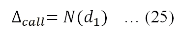

# 第十章 期权与期货

在现代金融中，期权理论（包括期货和远期合约）及其应用发挥着重要作用。许多交易策略、公司激励计划和对冲策略都包含各种类型的期权。例如，许多高管激励计划都基于股票期权。假设一家位于美国的进口商刚刚从英国订购了一台机器，三个月后需支付 1000 万英镑。进口商面临货币风险（或汇率风险）。如果英镑对美元贬值，进口商将受益，因为他/她用更少的美元买入 1000 万英镑。相反，如果英镑对美元升值，那么进口商将遭受损失。进口商可以通过几种方式避免或减少这种风险：立即购买英镑、进入期货市场按今天确定的汇率买入英镑，或者购买一个有固定行使价格的认购期权。在本章中，我们将解释期权理论及其相关应用。特别地，以下主题将被涵盖：

+   如何对冲货币风险以及市场普遍的短期下跌

+   认购期权和认沽期权的支付和盈亏函数及其图形表示

+   欧洲期权与美洲期权

+   正态分布、标准正态分布和累积正态分布

+   布莱克-斯科尔斯-默顿期权模型（有/无股息）

+   各种交易策略及其可视化呈现，例如备兑认购期权、跨式期权、蝶式期权和日历差价期权

+   德尔塔、伽马以及其他希腊字母

+   认购期权和认沽期权的平价关系及其图形表示

+   一步和两步二叉树模型的图形表示

+   使用二叉树方法定价欧洲和美洲期权

+   隐含波动率、波动率微笑和偏斜

期权理论是金融理论的重要组成部分。很难想象一位金融学学生无法理解它。然而，深入理解这一理论是非常具有挑战性的。许多金融专业的学生认为期权理论就像火箭科学一样复杂，因为它涉及到如何解决各种微分方程。为了满足尽可能多的读者需求，本章避免了复杂的数学推导。

一种期权将赋予期权买方在未来以今天确定的固定价格买入或卖出某物的权利。如果买方有权在未来购买某物，则称为认购期权。如果期权买方有权卖出某物，则称为认沽期权。由于每个交易涉及两方（买方和卖方），买方支付以获得某项权利，而卖方则收到现金流入以承担义务。与期权不同，期货合约赋予买卖双方权利和义务。与期权中买方向卖方支付初始现金流不同，期货合约通常没有初始现金流。远期合约与期货合约非常相似，只有少数例外。在本章中，这两种合约（期货和远期合约）没有做区分。远期合约比期货合约更容易分析。如果读者希望进行更深入的分析，应参考其他相关教材。

# 介绍期货

在讨论与期货相关的基本概念和公式之前，我们先回顾一下连续复利利率的概念。在第三章，*货币的时间价值*，我们学到以下公式可以用来估算给定现值的未来价值：


在这里，*FV* 是未来价值，*PV* 是现值，*R* 是有效期利率，*n* 是期数。例如，假设**年利率**（**APR**）为 8%，按半年复利计算。如果我们今天存入 $100，两年后的未来价值是多少？以下代码显示了结果：

```py
import scipy as ps
pv=100
APR=0.08
rate=APR/2.0
n=2
nper=n*2
fv=ps.fv(rate,nper,0,pv)
print(fv)
```

输出如下所示：

```py
-116.985856
```

未来价值是 $116.99。在前面的程序中，有效半年利率为 4%，因为年利率为 8%，并按半年复利计算。在期权理论中，无风险利率和股息收益率定义为连续复利率。推导有效利率（或年利率）与连续复利率之间的关系是很容易的。估算给定现值的未来价值的第二种方法如下：


在这里，*Rc* 是连续复利率，*T* 是年份数。换句话说，在应用公式（1）时，我们可以有许多组合，例如年有效利率和年份数、有效月利率和月数等。然而，公式（2）并非如此，它只有一对：连续复利率和年份数。为了推导一个有效利率与其对应的连续复利率之间的关系，我们推荐以下简单方法：选择 $1 作为当前值，1 年作为投资期限。然后应用前两个公式并将其设为相等。假设我们知道有效半年利率为前述案例中的 4%。那么其等效的 *Rc* 是多少？


我们将它们等同，得到以下方程：


对前一个方程两边取自然对数，我们得到以下解：


对前述方法进行简单的推广，我们得出以下公式，将有效利率转换为对应的连续复利利率：


这里，*m* 是每年的复利频率：*m=1, 2, 4, 12, 52, 365* 分别对应年复利、半年复利、季复利、月复利、周复利和日复利。*Reffective* 是 APR 除以*m*。如果给定一个带有相关复利频率的 APR，我们可以使用以下等效转换公式：


另一方面，从给定的连续利率推导出有效利率的公式是相当简单的：


为了验证前面的方程，请查看以下代码：

```py
import scipy as sp
Rc=2*log(1+0.04)
print(sp.exp(Rc/2)-1
0.040000000000000036
```

类似地，我们得出以下公式来估算从*Rc*计算得到的 APR：


对于期货合约，我们以之前的例子为例，假设一个美国进口商将在三个月后支付 1000 万英镑。通常，汇率有两种表示方式：第一种货币与第二种货币的比值，或者相反的比值。我们假设美国为国内，英国为外国，汇率以美元/英镑表示。假设今天的汇率为 1 英镑 = 1.25 美元，国内利率为 1%，外国利率（在英国）为 2%。以下代码展示了我们今天需要多少英镑和美元：

```py
import scipy as sp
amount=5
r_foreign=0.02
T=3./12.
exchangeRateToday=1.25
poundToday=5*sp.exp(-r_foreign*T)
print("Pound needed today=", poundToday)
usToday=exchangeRateToday*poundToday
print("US dollar needed today", usToday)
('Pound needed today=', 4.9750623959634117)
('US dollar needed today', 6.2188279949542649)
```

结果显示，为了满足三个月后支付 500 万英镑的需求，我们今天需要 497.5 万英镑，因为我们可以将 497.5 万英镑存入银行以赚取额外的利息（按 1%的利率）。如果进口商没有英镑，他们可以花费 621.88 万美元来购买今天所需的英镑。或者，进口商可以通过购买期货合约（或几个期货合约）来锁定一个固定的汇率，在三个月后购买英镑。此处给出的远期汇率（未来汇率）如下：


这里，*F* 是期货价格（在本例中是今天确定的未来汇率），*S0* 是现货价格（在本例中是今天的汇率），*Rd* 是国内的连续复利无风险利率，*Rf* 是外国的连续复利存款利率，*T* 是年化期限。以下 Python 程序显示了今天的期货价格：

```py
import scipy as sp
def futuresExchangeRate(s0,rateDomestic,rateForeign,T):
    futureEx=s0*sp.exp((rateDomestic-rateForeign)*T)
return futureEx

# input area

s0=1.25
rHome=0.01
rForeigh=0.02
T=3./12.
#
futures=futuresExchangeRate(s0,rHome,rForeigh,T)
print("futures=",futures)
```

输出如下：

```py
('futures=', 1.246878902996825)
```

根据结果，三个月后的汇率应该是每英镑 1.2468789 美元。换句话说，美元应该会相对于英镑贬值。其原因基于两种利率。以下是基于无套利原则的逻辑。假设我们今天有 1.25 美元。我们有两种选择：将其存入美国银行享受 2%的利息，或将其兑换成 1 英镑并存入外资银行，享受 1%的利息。进一步假设，如果未来的汇率不是 1.246879，我们将面临套利机会。假设期货价格（汇率）为 1.26 美元，表示英镑相对于美元被高估了。套利者将低买高卖，也就是做空期货。假设我们有一个三个月到期的 1 英镑的义务。以下是套利策略：借入 1.25 美元（USD），并在三个月后以 1.26 美元的期货价格卖出 1 英镑。三个月后，我们的套利利润如下：

```py
import scipy as sp
obligationForeign=1.0           # how much to pay in 3 months
f=1.26                          # future price
s0=1.25                         # today's exchange rate 
rHome=0.01
rForeign=0.02
T=3./12.
todayObligationForeign=obligationForeign*sp.exp(-rForeign*T)
usBorrow=todayObligationForeign*s0  
costDollarBorrow=usBorrow*sp.exp(rHome*T)
profit=f*obligationForeign-costDollarBorrow
print("profit in USD =", profit)
```

输出结果如下：

```py
('profit in USD =', 0.013121097003174764)
```

利润为 0.15 美元。如果期货价格低于 1.246878902996825，套利者将采取相反的头寸，即做多期货合约。对于到期日前没有股息支付的股票，我们有以下期货价格：


这里，*F*是期货价格，*S0*是当前股票价格，*Rf*是持续复利的无风险利率，yield 是持续复利的股息收益率。对于已知到期日前的离散股息，我们有以下公式：


在这里，*PV(D)*是到期日前所有股息的现值。期货可以作为对冲工具或投机工具。假设某个共同基金经理担心市场可能在短期内出现负面波动。进一步假设他/她的投资组合与市场投资组合（如标准普尔 500 指数）正相关。因此，他/她应该做空标准普尔 500 指数的期货。以下是相关的公式：


这里，*n*是做多或做空的期货合约数量，*βtarget*是目标贝塔值，*βp*是当前投资组合的贝塔值，*Vp*是投资组合的价值，*VF*是一个期货合约的价值。如果*n*小于（大于）零，表示做空（做多）头寸。以下是一个例子。假设 John Doe 今天管理着一只价值 5000 万美元的投资组合，他的投资组合与标准普尔 500 指数的贝塔值为 1.10。他担心市场可能在未来六个月内下跌。由于交易成本，他/她无法出售其投资组合或其一部分。假设短期内他的目标贝塔值为零。每个标准普尔 500 指数点的价格是 250 美元。由于今天标准普尔 500 指数为 2297.41 点，一个期货合约的价值为 5,743,550 美元。John 应当做空（或做多）的合约数量如下：

```py
import scipy as ps
# input area
todaySP500index=2297.42
valuePortfolio=50e6    
betaPortfolio=1.1
betaTarget=0
#
priceEachPoint=250  
contractFuturesSP500=todaySP500index*priceEachPoint
n=(betaTarget-betaPortfolio)*valuePortfolio/contractFuturesSP500
print("number of contracts SP500 futures=",n)
```

输出结果如下：

```py
('number of contracts SP500 futures=', -95.75959119359979)
```

负值表示做空头寸。John Doe 应该做空 96 份 S&P500 期货合约。这与常识一致，因为投资组合与 S&P500 指数正相关。以下程序展示了当 S&P500 指数下跌 97 点时，是否对冲的盈亏情况：

```py
# input area

import scipy as sp
sp500indexToday=2297.42
valuePortfolio=50e6    
betaPortfolio=1.1
betaTarget=0
sp500indexNmonthsLater=2200.0
#
priceEachPoint=250  
contractFuturesSP500=sp500indexToday*priceEachPoint
n=(betaTarget-betaPortfolio)*valuePortfolio/contractFuturesSP500
mySign=sp.sign(n)
n2=mySign*sp.ceil(abs(n))
print("number of contracts=",n2)
# hedging result
v1=sp500indexToday
v2=sp500indexNmonthsLater
lossFromPortfolio=valuePortfolio*(v2-v1)/v1
gainFromFutures=n2*(v2-v1)*priceEachPoint
net=gainFromFutures+lossFromPortfolio
print("loss from portfolio=", lossFromPortfolio)
print("gain from futures contract=", gainFromFutures)
print("net=", net)
```

相关输出如下所示：

```py
('number of contracts=', -96.0)
('loss from portfolio=', -2120204.403200113)
('gain from futures contract=', 2338080.0000000019)
('net=', 217875.59679988865)
```

从最后三行可以知道，如果不对冲，投资组合的损失将为$212 万。另一方面，在做空 96 份 S&P500 期货合约后，在 S&P500 指数下跌 98 点的六个月后，净损失仅为$217,876。通过不同的潜在 S&P500 指数水平，我们可以找出其相关的对冲和不对冲结果。这样的对冲策略通常被称为投资组合保险。

# 看涨和看跌期权的回报和盈亏函数

一个期权赋予其买方在未来以预定价格（行使价）购买（看涨期权）或出售（看跌期权）某物给期权卖方的权利。例如，如果我们购买一个欧式看涨期权，以 X 美元（如$30）在三个月后获得某个股票，那么在到期日我们的回报将按照以下公式计算：


这里，是到期日（T）的股票价格，行使价为 X（此例中 X=30）。假设三个月后股票价格为$25。我们不会行使看涨期权以$30 的价格购买股票，因为我们可以在公开市场上以$25 购买相同的股票。另一方面，如果股票价格为$40，我们将行使我们的权利以获取$10 的回报，即以$30 买入股票并以$40 卖出股票。以下程序展示了看涨期权的回报函数：

```py
>>>def payoff_call(sT,x):
        return (sT-x+abs(sT-x))/2
```

应用`payoff`函数是直接的：

```py
>>> payoff_call(25,30)
0
>>> payoff_call(40,30)
10
```

第一个输入变量，即到期时的股票价格*T*，也可以是一个数组：

```py
>> import numpy as np
>> x=20
>> sT=np.arange(10,50,10)
>>> sT
array([10, 20, 30, 40])
>>> payoff_call(s,x)
array([  0.,   0.,  10.,  20.])
>>>
```

为了创建图形化展示，我们有以下代码：

```py
import numpy as np
import matplotlib.pyplot as plt
s = np.arange(10,80,5)
x=30
payoff=(abs(s-x)+s-x)/2
plt.ylim(-10,50)
plt.plot(s,payoff)
plt.title("Payoff for a call (x=30)")
plt.xlabel("stock price")
plt.ylabel("Payoff of a call")
plt.show()
```

这里显示了图形：


看涨期权卖方的回报与买方相反。需要记住的是，这是一个零和游戏：你赢了，我输了。例如，一位投资者以$10 的行使价卖出三个看涨期权。当股价在到期时为$15 时，期权买方的回报是$15，而期权卖方的总损失也是$15。如果看涨期权的溢价（期权价格）为 c，则看涨期权买方的盈亏函数是其回报与初始投资（c）之间的差异。显然，期权溢价提前支付与到期日回报的现金流时间不同。在这里，我们忽略了货币的时间价值，因为到期通常相当短。

对于看涨期权买方：


对于看涨期权卖方：


以下图表展示了看涨期权买方和卖方的盈亏函数：

```py
import scipy as sp
import matplotlib.pyplot as plt
s = sp.arange(30,70,5)
x=45;c=2.5
y=(abs(s-x)+s-x)/2 -c
y2=sp.zeros(len(s))
plt.ylim(-30,50)
plt.plot(s,y)
plt.plot(s,y2,'-.')
plt.plot(s,-y)
plt.title("Profit/Loss function")
plt.xlabel('Stock price')
plt.ylabel('Profit (loss)')
plt.annotate('Call option buyer', xy=(55,15), xytext=(35,20),
             arrowprops=dict(facecolor='blue',shrink=0.01),)
plt.annotate('Call option seller', xy=(55,-10), xytext=(40,-20),
             arrowprops=dict(facecolor='red',shrink=0.01),)
plt.show()
```

这里展示了一个图形表示：


看跌期权赋予其买方在未来以预定价格 *X* 向看跌期权卖方出售证券（商品）的权利。其盈亏函数如下：


这里，*ST* 是到期时的股票价格，*X* 是行使价格（执行价格）。对于看跌期权买方，盈亏函数如下：


卖出看跌期权的盈亏函数正好相反：


以下是看跌期权买方和卖方盈亏函数的相关程序和图形：

```py
import scipy as sp
import matplotlib.pyplot as plt
s = sp.arange(30,70,5)
x=45;p=2;c=2.5
y=c-(abs(x-s)+x-s)/2 
y2=sp.zeros(len(s)) 
x3=[x, x]
y3=[-30,10]
plt.ylim(-30,50)
plt.plot(s,y) 
plt.plot(s,y2,'-.') 
plt.plot(s,-y) 
plt.plot(x3,y3)
plt.title("Profit/Loss function for a put option") 
plt.xlabel('Stock price')
plt.ylabel('Profit (loss)')
plt.annotate('Put option buyer', xy=(35,12), xytext=(35,45), arrowprops=dict(facecolor='red',shrink=0.01),)
plt.annotate('Put option seller', xy=(35,-10), xytext=(35,-25), arrowprops=dict(facecolor='blue',shrink=0.01),)
plt.annotate('Exercise price', xy=(45,-30), xytext=(50,-20), arrowprops=dict(facecolor='black',shrink=0.01),)
plt.show()
```

该图形如下：


# 欧洲期权与美国期权

欧洲期权只能在到期日行使，而美国期权可以在到期日前或到期日当天任何时间行使。由于美国期权可以持有至到期，其价格（期权溢价）应该高于或等于相应的欧洲期权价格：


一个重要的区别是，对于欧洲期权，我们有一个封闭解，即布莱克-斯科尔斯-梅顿期权模型。然而，对于美国期权，我们没有封闭解。幸运的是，我们有几种方法可以定价美国期权。后续章节中，我们将展示如何使用二叉树方法，也称为 CRR 方法，来定价美国期权。

## 理解现金流、期权类型、权利和义务

我们知道，对于每个商业合同，我们有买方和卖方两个方面。期权合同也是如此。看涨期权买方将预付现金（现金流出）以获得一个权利。由于这是一个零和博弈，看涨期权卖方将享有预付现金流入，并承担相应的义务。

下表列出了这些头寸（买方或卖方）、初始现金流的方向（流入或流出）、期权买方的权利（买或卖）以及期权卖方的义务（即满足期权卖方的需求）：

|   | 买方（多头头寸） | 卖方（空头头寸） | 欧洲期权 | 美国期权 |
| --- | --- | --- | --- | --- |
| 看涨期权 | 以预定价格购买证券（商品）的权利 | 以预定价格出售证券（商品）的义务 | 只能在到期日行使 | 可以在到期日前或到期日当天任何时间行使 |
| 看跌期权 | 在预定价格下出售证券的权利 | 购买的义务 |
| 现金流 | 前期现金流出 | 前期现金流入 |

> 表 10.1 多头、空头头寸，初始现金流，以及权利与义务

# 非分红股票的 Black-Scholes-Merton 期权模型

**Black-Scholes-Merton 期权**模型是一个封闭式解，用于为一个没有分红支付的股票定价欧式期权。如果我们使用  或今天的价格，X 为执行价格，*r* 为连续复利的无风险利率，T 为到期年数， 为股票的波动率，则欧式看涨期权 (c) 和看跌期权 (p) 的封闭式公式为：


在这里，`N()` 是累积分布标准正态分布。以下 Python 代码表示前述方程，用于评估一个欧式看涨期权：

```py
from scipy import log,exp,sqrt,stats
def bs_call(S,X,T,r,sigma):
    d1=(log(S/X)+(r+sigma*sigma/2.)*T)/(sigma*sqrt(T))
    d2 = d1-sigma*sqrt(T)
return S*stats.norm.cdf(d1)-X*exp(-r*T)*stats.norm.cdf(d2)
```

在前面的程序中，`stats.norm.cdf()` 是累积正态分布，也就是 Black-Scholes-Merton 期权模型中的 `N()`。当前股票价格为 40 美元，行使价格为 42 美元，到期时间为六个月，无风险利率为 1.5%（连续复利），基础股票的波动率为 20%（连续复利）。基于前述代码，欧式看涨期权的价值为 1.56 美元：

```py
>>>c=bs_call(40.,42.,0.5,0.015,0.2) 
>>>round(c,2)
1.56
```

# 生成我们自己的模块 p4f

我们可以将许多小的 Python 程序组合成一个程序，例如 `p4f.py`。例如，前面的 Python 程序中包含的 `bs_call()` 函数。这样的一组程序提供了多个好处。首先，当我们使用 `bs_call()` 函数时，不需要重新输入那五行代码。为了节省空间，我们仅展示了 `p4f.py` 中包含的几个函数。为了简洁起见，我们去除了每个函数中的所有注释。这些注释是为了帮助未来的用户在调用 `help()` 函数时，例如 `help(bs_call())`：

```py
def bs_call(S,X,T,rf,sigma):
    from scipy import log,exp,sqrt,stats
    d1=(log(S/X)+(rf+sigma*sigma/2.)*T)/(sigma*sqrt(T))
    d2 = d1-sigma*sqrt(T)
    return S*stats.norm.cdf(d1)-X*exp(-rf*T)*stats.norm.cdf(d2)

def binomial_grid(n):
    import networkx as nx 
    import matplotlib.pyplot as plt 
    G=nx.Graph() 
    for i in range(0,n+1):     
        for j in range(1,i+2):         
            if i<n:             
                G.add_edge((i,j),(i+1,j))
                G.add_edge((i,j),(i+1,j+1)) 
    posG={}    #dictionary with nodes position 
    for node in G.nodes():     
        posG[node]=(node[0],n+2+node[0]-2*node[1]) 
    nx.draw(G,pos=posG)      

def delta_call(S,X,T,rf,sigma):
    from scipy import log,exp,sqrt,stats
    d1=(log(S/X)+(rf+sigma*sigma/2.)*T)/(sigma*sqrt(T))
    return(stats.norm.cdf(d1))

def delta_put(S,X,T,rf,sigma):
    from scipy import log,exp,sqrt,stats
    d1=(log(S/X)+(rf+sigma*sigma/2.)*T)/(sigma*sqrt(T))
    return(stats.norm.cdf(d1)-1)
```

要应用 Black-Scholes-Merton 看涨期权模型，我们只需使用以下代码：

```py
>>>import p4f
>>>c=p4f.bs_call(40,42,0.5,0.015,0.2) 
>>>round(c,2)
1.56
```

第二个优点是节省空间并使编程更加简洁。在本章后续内容中，当我们使用一个名为 `binomial_grid()` 的函数时，这一点将变得更加明确。从现在开始，每当首次讨论某个函数时，我们会提供完整的代码。然而，当该程序再次使用且程序比较复杂时，我们会通过 `p4f` 间接调用它。要查找我们的工作目录，使用以下代码：

```py
>>>import os
>>>print os.getcwd()
```

# 具有已知股息的欧式期权

假设我们知道在时间 T1（T1 < T）时分发的股息 *d1*，其中 T 为到期日。我们可以通过将 *S0* 替换为 *S* 来修改原始的 Black-Scholes-Merton 期权模型，其中 ：


在前面的例子中，如果我们有已知的$1.5 股息将在一个月内支付，那么认购期权的价格是多少？

```py
>>>import p4f
>>>s0=40
>>>d1=1.5
>>>r=0.015
>>>T=6/12
>>>s=s0-exp(-r*T*d1)
>>>x=42
>>>sigma=0.2 
>>>round(p4f.bs_call(s,x,T,r,sigma),2)
1.18
```

程序的第一行导入了名为`p4f`的模块，该模块包含了认购期权模型。结果显示，认购期权的价格为$1.18，低于之前的值（$1.56）。这是可以理解的，因为标的股票在一个月内大约会下跌$1.5。由于这个原因，我们行使认购期权的机会会变小，也就是说，股票价格不太可能超过$42。前述论点适用于在 T 之前分配的已知股息，即。

# 各种交易策略

在下表中，我们总结了几种常用的期权交易策略：

| 名称 | 描述 | 初始现金流方向 | 未来价格变动预期 |
| --- | --- | --- | --- |
| 看涨价差（认购期权） | 买入一个认购期权（x1），卖出一个认购期权（x2）[x1 < x2] | 支出 | 上涨 |
| 看涨价差（看跌期权） | 买入一个看跌期权（x1），卖出一个看跌期权（x2）[x1 < x2] | 进账 | 上涨 |
| 熊市价差（看跌期权） | 买入一个看跌期权（x2），卖出一个看跌期权（x1）[x1 < x2] | 支出 | 下跌 |
| 看跌价差（认购期权） | 买入一个认购期权（x2），卖出一个认购期权（x1）[x1 < x2] | 进账 | 下跌 |
| 交易策略 | 买入认购期权并卖出看跌期权（相同执行价格） | 支出 | 上涨或下跌 |
| 条带策略 | 买入两个看跌期权和一个认购期权（相同的执行价格） | 支出 | 下跌的概率 > 上涨的概率 |
| 踏带策略 | 买入两个认购期权和一个看跌期权（相同的执行价格） | 支出 | 上涨的概率 > 下跌的概率 |
| 脱口而出策略 | 买入一个认购期权（x2）并买入一个看跌期权（x1）[x1 < x2] | 支出 | 上涨或下跌 |
| 蝴蝶策略（认购期权） | 买入两个认购期权（x1, x3），卖出两个认购期权（x2）[x2=(x1+x3)/2] | 支出 | 保持在 x2 附近 |
| 蝴蝶策略（看跌期权） | 买入两个看跌期权（x1, x3），卖出两个看跌期权（x2）[x2=(x1+x3)/2] |   | 保持在 x2 附近 |
| 日历价差 | 卖出一个认购期权（T1），买入一个认购期权（T2），具有相同的执行价格，且 T1<T2 | 支出 |   |

> 表 10.2 各种交易策略

## 覆盖认购期权 – 持有股票并卖出认购期权

假设我们购买了 100 股 A 股票，每股价格为$10。那么，总成本为$1,000。如果我们同时写出一个认购期权合同，一个合同对应 100 股，价格为$20。那么，我们的总成本将减少$20。再假设行权价格为$12。以下是我们盈亏函数的图示：

```py
import matplotlib.pyplot as plt 
import numpy as np
sT = np.arange(0,40,5) 
k=15;s0=10;c=2
y0=np.zeros(len(sT))
y1=sT-s0                    # stock only
y2=(abs(sT-k)+sT-k)/2-c     # long a call 
y3=y1-y2                    # covered-call 
plt.ylim(-10,30)
plt.plot(sT,y1) 
plt.plot(sT,y2) 
plt.plot(sT,y3,'red')
plt.plot(sT,y0,'b-.') 
plt.plot([k,k],[-10,10],'black')
plt.title('Covered call (long one share and short one call)') 
plt.xlabel('Stock price')
plt.ylabel('Profit (loss)')
plt.annotate('Stock only (long one share)', xy=(24,15),xytext=(15,20),arrowprops=dict(facecolor='blue',shrink=0.01),)
plt.annotate('Long one share, short a call', xy=(10,4), xytext=(9,25), arrowprops=dict(facecolor='red',shrink=0.01),)
plt.annotate('Exercise price= '+str(k), xy=(k+0.2,-10+0.5))
plt.show()
```

这里给出了一个图示，展示了仅持有股票、认购期权和覆盖认购期权的位置。显然，当股票价格低于$17（15 + 2）时，覆盖认购期权优于单纯持有股票：


## 跨式策略 – 买入认购期权和看跌期权，且行权价格相同

我们来看最简单的情形。一家公司面临下个月的不确定事件，问题在于我们不确定事件的方向，是好事还是坏事。为了利用这样的机会，我们可以同时购买看涨期权和看跌期权，且它们的行使价格相同。这意味着无论股票是上涨还是下跌，我们都将受益。进一步假设行使价格为 $30。此策略的收益如下所示：

```py
import matplotlib.pyplot as plt 
import numpy as np
sT = np.arange(30,80,5)
x=50;    c=2; p=1
straddle=(abs(sT-x)+sT-x)/2-c + (abs(x-sT)+x-sT)/2-p 
y0=np.zeros(len(sT))
plt.ylim(-6,20) 
plt.xlim(40,70) 
plt.plot(sT,y0) 
plt.plot(sT,straddle,'r')
plt.plot([x,x],[-6,4],'g-.')
plt.title("Profit-loss for a Straddle") 
plt.xlabel('Stock price') 
plt.ylabel('Profit (loss)')
plt.annotate('Point 1='+str(x-c-p), xy=(x-p-c,0), xytext=(x-p-c,10),
arrowprops=dict(facecolor='red',shrink=0.01),) 
plt.annotate('Point 2='+str(x+c+p), xy=(x+p+c,0), xytext=(x+p+c,13),
arrowprops=dict(facecolor='blue',shrink=0.01),) 
plt.annotate('exercise price', xy=(x+1,-5))
plt.annotate('Buy a call and buy a put with the same exercise price',xy=(45,16))
plt.show()
```


上图显示了无论股票如何波动，我们都会获利。我们会亏损吗？显然，当股票变化不大时，我们的预期未能实现。

## 使用看涨期权的蝶式交易

当购买两个行使价格为 `x1` 和 `x3` 的看涨期权，并卖出两个行使价格为 `x2` 的看涨期权时，其中 *x2=(x1+x2)/2*，且期权到期日相同，标的股票也相同，我们称之为蝶式交易。其盈亏函数如下所示：

```py
import matplotlib.pyplot as plt 
import numpy as np
sT = np.arange(30,80,5) 
x1=50;    c1=10
x2=55;    c2=7
x3=60;    c3=5
y1=(abs(sT-x1)+sT-x1)/2-c1 
y2=(abs(sT-x2)+sT-x2)/2-c2 
y3=(abs(sT-x3)+sT-x3)/2-c3 
butter_fly=y1+y3-2*y2 
y0=np.zeros(len(sT))
plt.ylim(-20,20) 
plt.xlim(40,70) 
plt.plot(sT,y0) 
plt.plot(sT,y1) 
plt.plot(sT,-y2,'-.') 
plt.plot(sT,y3)
plt.plot(sT,butter_fly,'r') 
plt.title("Profit-loss for a Butterfly") 
plt.xlabel('Stock price')
plt.ylabel('Profit (loss)')
plt.annotate('Butterfly', xy=(53,3), xytext=(42,4), arrowprops=dict(facecolor='red',shrink=0.01),)
plt.annotate('Buy 2 calls with x1, x3 and sell 2 calls with x2', xy=(45,16))
plt.annotate('    x2=(x1+x3)/2', xy=(45,14)) 
plt.annotate('    x1=50, x2=55, x3=60',xy=(45,12)) 
plt.annotate('    c1=10,c2=7, c3=5', xy=(45,10)) 
plt.show()
```

相关图表如下所示：


## 输入值与期权值之间的关系

当标的股票的波动性增加时，其看涨期权和看跌期权的价值都会增加。其逻辑是，当股票变得更具波动性时，我们有更好的机会观察到极端值，也就是说，我们有更大的机会行使我们的期权。以下 Python 程序展示了这一关系：

```py
import numpy as np
import p4f as pf
import matplotlib.pyplot as plt
s0=30
T0=0.5
sigma0=0.2
r0=0.05
x0=30
sigma=np.arange(0.05,0.8,0.05)
T=np.arange(0.5,2.0,0.5)
call_0=pf.bs_call(s0,x0,T0,r0,sigma0)
call_sigma=pf.bs_call(s0,x0,T0,r0,sigma)
call_T=pf.bs_call(s0,x0,T,r0,sigma0)
plt.title("Relationship between sigma and call, T and call")
plt.plot(sigma,call_sigma,'b')
plt.plot(T,call_T,'r')
plt.annotate('x=Sigma, y=call price', xy=(0.6,5), xytext=(1,6), arrowprops=dict(facecolor='blue',shrink=0.01),)
plt.annotate('x=T(maturity), y=call price', xy=(1,3), xytext=(0.8,1), arrowprops=dict(facecolor='red',shrink=0.01),)
plt.ylabel("Call premium")
plt.xlabel("Sigma (volatility) or T(maturity) ")
plt.show()
```

相应的图表如下所示：


## 希腊字母

Delta  定义为期权对其标的证券价格的导数。看涨期权的 delta 定义如下：


欧式看涨期权在没有分红的股票上的 delta 定义为：



`delta_call()` 的程序非常简单。由于它包含在 `p4f.py` 中，我们可以轻松地调用它：

```py
>>>>from p4f import *
>>> round(delta_call(40,40,1,0.1,0.2),4)
0.7257
```

欧式看跌期权在无分红的股票上的 delta 为：


```py
>>>>from p4f import *
>>> round(delta_put(40,40,1,0.1,0.2),4)
-0.2743
```

Gamma 是 delta 对价格的变化率，如下公式所示：


对于欧式看涨期权（或看跌期权），其 gamma 如下所示，其中 ：


欧式看涨期权和看跌期权的希腊字母的数学定义如下表所示：


表 10.1 希腊字母的数学定义

请注意，在表格中，

显然，很少有人能记住这些公式。这里有一个非常简单的方法，基于它们的定义：


表 10.2 估算希腊字母的简单方法

如何记住？

+   **Delta**：一阶导数

+   **Gamma**：二阶导数

+   **Theta**：时间（T）

+   **Vega**：波动性（V）

+   **Rho**：利率（R）

例如，根据 delta 的定义，我们知道它是`c2 - c1`和`s2 - s1`的比率。因此，我们可以生成一个小的数值来生成这两个对；见以下代码：

```py
from scipy import log,exp,sqrt,stats
tiny=1e-9
S=40
X=40
T=0.5
r=0.01
sigma=0.2

def bsCall(S,X,T,r,sigma):
    d1=(log(S/X)+(r+sigma*sigma/2.)*T)/(sigma*sqrt(T))
    d2 = d1-sigma*sqrt(T)
    return S*stats.norm.cdf(d1)-X*exp(-r*T)*stats.norm.cdf(d2)

def delta1(S,X,T,r,sigma):
    d1=(log(S/X)+(r+sigma*sigma/2.)*T)/(sigma*sqrt(T))
    return stats.norm.cdf(d1)

def delta2(S,X,T,r,sigma):
    s1=S
    s2=S+tiny
    c1=bsCall(s1,X,T,r,sigma)
    c2=bsCall(s2,X,T,r,sigma)
    delta=(c2-c1)/(s2-s1)
    return delta

print("delta (close form)=", delta1(S,X,T,r,sigma))
print("delta (tiny number)=", delta2(S,X,T,r,sigma))
('delta (close form)=', 0.54223501331161406)
('delta (tiny number)=', 0.54223835949323917)
```

根据最后两个值，差异非常小。我们可以将此方法应用于其他希腊字母，参见章节末尾的问题。

# 看跌-看涨平价及其图示

让我们来看一个行使价格为$20，期限为三个月，风险自由利率为 5%的看涨期权。这个未来$20 的现值如下面所示：

```py
>>>x=20*exp(-0.05*3/12)   
>>>round(x,2)
19.75
>>>
```

在三个月后，由一个看涨期权和今天$19.75 现金组成的投资组合的财富将是多少？如果股票价格低于$20，我们不会行使看涨期权，而是保留现金。如果股票价格高于$20，我们用$20 现金行使看涨期权以拥有股票。因此，我们的投资组合价值将是这两者中的最大值：三个月后的股票价格或$20，即*max(s,20)*。

另一方面，假设有一个由股票和一个行使价格为$20 的看跌期权组成的投资组合。如果股票价格下跌$20，我们行使看跌期权并获得$20。如果股票价格高于$20，我们就直接持有股票。因此，我们的投资组合价值将是这两者中的最大值：三个月后的股票价格或$20，即*max(s,20)*。

因此，对于这两个投资组合，我们都有相同的最终财富*max(s,20)*。根据无套利原理，这两个投资组合的现值应该相等。我们称之为看跌-看涨平价：


当股票在到期日之前有已知的股息支付时，我们有以下等式：


这里，*D*是所有股息支付在其到期日之前的现值（*T*）。以下 Python 程序提供了看跌-看涨平价的图示：

```py
import pylab as pl 
import numpy as np 
x=10
sT=np.arange(0,30,5) 
payoff_call=(abs(sT-x)+sT-x)/2 
payoff_put=(abs(x-sT)+x-sT)/2 
cash=np.zeros(len(sT))+x

def graph(text,text2=''): 
    pl.xticks(())
    pl.yticks(())
    pl.xlim(0,30)
    pl.ylim(0,20) 
    pl.plot([x,x],[0,3])
    pl.text(x,-2,"X");
    pl.text(0,x,"X")
    pl.text(x,x*1.7, text, ha='center', va='center',size=10, alpha=.5) 
    pl.text(-5,10,text2,size=25)

pl.figure(figsize=(6, 4))
pl.subplot(2, 3, 1); graph('Payoff of call');       pl.plot(sT,payoff_call) 
pl.subplot(2, 3, 2); graph('cash','+');             pl.plot(sT,cash)
pl.subplot(2, 3, 3); graph('Porfolio A ','=');   pl.plot(sT,cash+payoff_call)
pl.subplot(2, 3, 4); graph('Payoff of put ');       pl.plot(sT,payoff_put) 
pl.subplot(2, 3, 5); graph('Stock','+');       pl.plot(sT,sT)
pl.subplot(2, 3, 6); graph('Portfolio B','=');   pl.plot(sT,sT+payoff_put) 
pl.show()
```

输出结果如下：


看跌-看涨比率代表了投资者对未来的共同预期。如果没有明显的趋势，也就是说，我们预期未来是正常的，那么看跌-看涨比率应该接近 1。另一方面，如果我们预期未来会更加光明，那么比率应该低于 1。

以下代码显示了这种类型的比率在多年的变化。首先，我们必须从 CBOE 下载数据。

执行以下步骤：

1.  访问[`www.cboe.com/`](http://www.cboe.com/)。

1.  点击菜单栏中的**报价与数据**。

1.  查找`put call ratio`，即，[`www.cboe.com/data/putcallratio.aspx`](http://www.cboe.com/data/putcallratio.aspx)。

1.  点击**当前**下的**CBOE 总交易量和看涨/看跌比率（2006 年 11 月 1 日至今）**。

    ### 注意

    对于数据，读者可以在[`canisius.edu/~yany/data/totalpc.csv`](http://canisius.edu/~yany/data/totalpc.csv)下载。

以下代码显示了看跌-看涨比率的趋势：

```py
import pandas as pd
import scipy as sp
from matplotlib.pyplot import *
infile='c:/temp/totalpc.csv'
data=pd.read_csv(infile,skiprows=2,index_col=0,parse_dates=True)
data.columns=('Calls','Puts','Total','Ratio') 
x=data.index
y=data.Ratio 
y2=sp.ones(len(y)) 
title('Put-call ratio') 
xlabel('Date') 
ylabel('Put-call ratio') 
ylim(0,1.5)
plot(x, y, 'b-')
plot(x, y2,'r') 
show()
```

相关图表如下所示：


## 带趋势的短期看跌期权与看涨期权比率

基于前面的程序，我们可以选择一个带趋势的较短时期，如以下代码所示：

```py
import scipy as sp
import pandas as pd
from matplotlib.pyplot import * 
import matplotlib.pyplot as plt 
from datetime import datetime 
import statsmodels.api as sm

data=pd.read_csv('c:/temp/totalpc.csv',skiprows=2,index_col=0,parse_dates=True)
data.columns=('Calls','Puts','Total','Ratio') 
begdate=datetime(2013,6, 1) 
enddate=datetime(2013,12,31)
data2=data[(data.index>=begdate) & (data.index<=enddate)] 
x=data2.index
y=data2.Ratio 
x2=range(len(x)) 
x3=sm.add_constant(x2) 
model=sm.OLS(y,x3) 
results=model.fit()

#print results.summary() 
alpha=round(results.params[0],3) 
slope=round(results.params[1],3) 
y3=alpha+sp.dot(slope,x2) 
y2=sp.ones(len(y))
title('Put-call ratio with a trend') 
xlabel('Date') 
ylabel('Put-call ratio') 
ylim(0,1.5)
plot(x, y, 'b-')
plt.plot(x, y2,'r-.')
plot(x,y3,'y+')
plt.figtext(0.3,0.35,'Trend: intercept='+str(alpha)+',slope='+str(slope)) 
show()
```

相应的图表如下所示：


# 二项树及其图形展示

二项树方法是由 Cox、Ross 和 Robinstein 于 1979 年提出的。因此，它也被称为 CRR 方法。基于 CRR 方法，我们有以下两步方法。首先，我们绘制一棵树，例如以下的一步树。假设我们当前的股票价值是 S。那么，结果有两个，`Su`和`Sd`，其中*u>1*且*d<1*，请参见以下代码：

```py
import matplotlib.pyplot as plt 
plt.xlim(0,1) 
plt.figtext(0.18,0.5,'S')
plt.figtext(0.6,0.5+0.25,'Su')
plt.figtext(0.6,0.5-0.25,'Sd')

plt.annotate('',xy=(0.6,0.5+0.25), xytext=(0.1,0.5), arrowprops=dict(facecolor='b',shrink=0.01))
plt.annotate('',xy=(0.6,0.5-0.25), xytext=(0.1,0.5), arrowprops=dict(facecolor='b',shrink=0.01))
plt.axis('off')
plt.show()
```

图表如下所示：


显然，最简单的树是一棵一步树。假设今天的价格为 10 美元，行权价为 11 美元，且一个看涨期权将在六个月后到期。此外，假设我们知道价格将有两个结果：上涨(*u=1.15*)或下跌(d=0.9)。换句话说，最终的价格要么是 11 美元，要么是 9 美元。基于这些信息，我们有以下图表，展示了这种一步二项树的价格：


生成前面图表的代码如下所示。

这些代码基于[`pypi.python.org/pypi/PyFi`](https://pypi.python.org/pypi/PyFi)的代码：

```py
import networkx as nx
import matplotlib.pyplot as plt 
plt.figtext(0.08,0.6,"Stock price=$20") 
plt.figtext(0.75,0.91,"Stock price=$22") 
plt.figtext(0.75,0.87,"Option price=$1")
plt.figtext(0.75,0.28,"Stock price=$18") 
plt.figtext(0.75,0.24,"Option price=0") 
n=1
def binomial_grid(n): 
    G=nx.Graph()
    for i in range(0,n+1):
        for j in range(1,i+2): 
            if i<n:
                G.add_edge((i,j),(i+1,j))
                G.add_edge((i,j),(i+1,j+1))
    posG={}
    for node in G.nodes(): 
        posG[node]=(node[0],n+2+node[0]-2*node[1])
    nx.draw(G,pos=posG) 
binomial_grid(n)
plt.show()
```

在前面的程序中，我们生成了一个名为`binomial_grid()`的函数，因为我们将在本章后面多次调用此函数。由于我们事先知道会有两个结果，因此我们可以选择一个合适的股票和看涨期权组合，以确保我们的最终结果是确定的，即相同的终端值。假设我们选择合适的 delta 份额的基础证券，并加上一份看涨期权，以确保在一个时期结束时具有相同的终端值，即！二项树及其图形展示。

因此，。这意味着，如果我们持有*0.4*股并卖空一份看涨期权，那么当股票上涨时，我们的最终财富将相同，即*0.4*11.5-1 =3.6*；而当股票下跌时，则为*0.4*9=3.6*。进一步假设，如果持续复利的无风险利率为 0.12%，则今天的投资组合的价值将相当于未来确定值的折现值，即*0.4*10 – c=pv(3.6)*。也就是说，。如果使用 Python，我们将得到以下结果：

```py
>>>round(0.4*10-exp(-0.012*0.5)*3.6,2)
0.42
>>>
```

对于二步二项树，我们有以下代码：

```py
import p4f
plt.figtext(0.08,0.6,"Stock price=$20")
plt.figtext(0.08,0.56,"call =7.43")
plt.figtext(0.33,0.76,"Stock price=$67.49")
plt.figtext(0.33,0.70,"Option price=0.93")
plt.figtext(0.33,0.27,"Stock price=$37.40")
plt.figtext(0.33,0.23,"Option price=14.96")
plt.figtext(0.75,0.91,"Stock price=$91.11")
plt.figtext(0.75,0.87,"Option price=0")
plt.figtext(0.75,0.6,"Stock price=$50")
plt.figtext(0.75,0.57,"Option price=2")
plt.figtext(0.75,0.28,"Stock price=$27.44")
plt.figtext(0.75,0.24,"Option price=24.56")
n=2
p4f.binomial_grid(n)
```

基于 CRR 方法，我们有以下程序：

1.  绘制一个*n*步树。

1.  在*n*步结束时，估算终端价格。

1.  根据终端价格、行权、看涨或看跌期权，在每个节点计算期权值。

1.  按照风险中性概率将其向后折现一步，即从第 n 步到第 n-1 步。

1.  重复前一步骤，直到找到第 0 步的最终值。*u*、*d*、*p*的公式如下所示：

这里，*u*是向上波动，*d*是向下波动，是标的证券的波动率，r 是无风险利率，是步长，即，*T*是到期时间（以年为单位），*n*是步数，*q*是股息收益率，p 是向上波动的风险中性概率。`binomial_grid()`函数基于一步二项树图示中的函数。如前所述，该函数包含在名为`p4fy.py`的总主文件中。输出图形如下所示。一个明显的结果是，前面的 Python 程序非常简单且直接。接下来，我们使用一个两步二项树来解释整个过程。假设当前股票价格为 10 美元，行权价格为 10 美元，到期时间为三个月，步数为二，风险自由利率为 2%，标的证券的波动率为 0.2。以下 Python 代码将生成一个两步二项树：

```py
import p4f
from math import sqrt,exp 
import matplotlib.pyplot as plt
s=10
r=0.02
sigma=0.2
T=3./12
x=10
n=2
deltaT=T/n
q=0 
u=exp(sigma*sqrt(deltaT))
d=1/u 
a=exp((r-q)*deltaT)
p=(a-d)/(u-d) 
su=round(s*u,2);
suu=round(s*u*u,2) 
sd=round(s*d,2)
sdd=round(s*d*d,2) 
sud=s

plt.figtext(0.08,0.6,'Stock '+str(s)) 
plt.figtext(0.33,0.76,"Stock price=$"+str(su)) 
plt.figtext(0.33,0.27,'Stock price='+str(sd)) 
plt.figtext(0.75,0.91,'Stock price=$'+str(suu)) 
plt.figtext(0.75,0.6,'Stock price=$'+str(sud)) 
plt.figtext(0.75,0.28,"Stock price="+str(sdd)) 
p4f.binomial_grid(n)
plt.show()
```

树形结构如下所示：


现在，我们使用风险中性概率将每个值向后折现一步。代码和图形如下所示：

```py
import p4f
import scipy as sp
import matplotlib.pyplot as plt
s=10;x=10;r=0.05;sigma=0.2;T=3./12.;n=2;q=0    # q is dividend yield 
deltaT=T/n    # step
u=sp.exp(sigma*sp.sqrt(deltaT)) 
d=1/u
a=sp.exp((r-q)*deltaT) 
p=(a-d)/(u-d)
s_dollar='S=$'
c_dollar='c=$' 
p2=round(p,2)
plt.figtext(0.15,0.91,'Note: x='+str(x)+', r='+str(r)+', deltaT='+str(deltaT)+',p='+str(p2))
plt.figtext(0.35,0.61,'p')
plt.figtext(0.65,0.76,'p')
plt.figtext(0.65,0.43,'p')
plt.figtext(0.35,0.36,'1-p')
plt.figtext(0.65,0.53,'1-p')
plt.figtext(0.65,0.21,'1-p')

# at level 2 
su=round(s*u,2);
suu=round(s*u*u,2) 
sd=round(s*d,2);
sdd=round(s*d*d,2) 
sud=s
c_suu=round(max(suu-x,0),2) 
c_s=round(max(s-x,0),2) 
c_sdd=round(max(sdd-x,0),2) 
plt.figtext(0.8,0.94,'s*u*u') 
plt.figtext(0.8,0.91,s_dollar+str(suu)) 
plt.figtext(0.8,0.87,c_dollar+str(c_suu)) 
plt.figtext(0.8,0.6,s_dollar+str(sud)) 
plt.figtext(0.8,0.64,'s*u*d=s') 
plt.figtext(0.8,0.57,c_dollar+str(c_s)) 
plt.figtext(0.8,0.32,'s*d*d') 
plt.figtext(0.8,0.28,s_dollar+str(sdd)) 
plt.figtext(0.8,0.24,c_dollar+str(c_sdd))

# at level 1
c_01=round((p*c_suu+(1-p)*c_s)*sp.exp(-r*deltaT),2) 
c_02=round((p*c_s+(1-p)*c_sdd)*sp.exp(-r*deltaT),2)

plt.figtext(0.43,0.78,'s*u') 
plt.figtext(0.43,0.74,s_dollar+str(su)) 
plt.figtext(0.43,0.71,c_dollar+str(c_01)) 
plt.figtext(0.43,0.32,'s*d') 
plt.figtext(0.43,0.27,s_dollar+str(sd)) 
plt.figtext(0.43,0.23,c_dollar+str(c_02))
# at level 0 (today)

c_00=round(p*sp.exp(-r*deltaT)*c_01+(1-p)*sp.exp(-r*deltaT)*c_02,2) 
plt.figtext(0.09,0.6,s_dollar+str(s)) 
plt.figtext(0.09,0.56,c_dollar+str(c_00)) 
p4f.binomial_grid(n)
```

树形结构如下所示：


这里，我们解释图中显示的一些值。在最高节点（**s*u*u**）处，由于终端股票价格为 11.52，行权价格为 10，故看涨期权的价值为 1.52（11.52-10）。类似地，在节点**s*u*d=s**处，看涨期权的价值为 0，因为 10-10=0。对于看涨期权值为 0.8，我们进行如下验证：

```py
>>>p
0.5266253390068362
>>>deltaT
0.125
>>>v=(p*1.52+(1-p)*0)*exp(-r*deltaT)
>>>round(v,2)
0.80
>>>
```

## 欧洲期权的二项树（CRR）方法

以下代码是用于使用二项树法定价欧洲期权的：

```py
def binomialCallEuropean(s,x,T,r,sigma,n=100):
    from math import exp,sqrt 
    deltaT = T /n
    u = exp(sigma * sqrt(deltaT)) 
    d = 1.0 / u
    a = exp(r * deltaT)
    p = (a - d) / (u - d)
    v = [[0.0 for j in xrange(i + 1)]  for i in xrange(n + 1)] 
    for j in xrange(i+1):
        v[n][j] = max(s * u**j * d**(n - j) - x, 0.0) 
    for i in xrange(n-1, -1, -1):
        for j in xrange(i + 1):
            v[i][j]=exp(-r*deltaT)*(p*v[i+1][j+1]+(1.0-p)*v[i+1][j]) 
    return v[0][0]
```

为了应用这个函数，我们给它一组输入值。为了比较，基于*Black-Scholes-Merton 期权*模型的结果也在这里显示：

```py
>>> binomialCallEuropean(40,42,0.5,0.1,0.2,1000) 
2.278194404573134
>>> bs_call(40,42,0.5,0.1,0.2) 
2.2777803294555348
>>>
```

## 美国期权的二项树（CRR）方法

与只能应用于欧洲期权的 Black-Scholes-Merton 期权模型不同，二项树（CRR 方法）可以用来定价美国期权。唯一的区别是我们必须考虑提前行权：

```py
def binomialCallAmerican(s,x,T,r,sigma,n=100):
    from math import exp,sqrt
    import numpy as np
    deltaT = T /n
    u = exp(sigma * sqrt(deltaT)) 
    d = 1.0 / u
    a = exp(r * deltaT)
    p = (a - d) / (u - d)
    v = [[0.0 for j in np.arange(i + 1)] for i in np.arange(n + 1)] 
    for j in np.arange(n+1):
        v[n][j] = max(s * u**j * d**(n - j) - x, 0.0) 
    for i in np.arange(n-1, -1, -1):
        for j in np.arange(i + 1):
            v1=exp(-r*deltaT)*(p*v[i+1][j+1]+(1.0-p)*v[i+1][j]) 
            v2=max(v[i][j]-x,0)           # early exercise 
            v[i][j]=max(v1,v2)
    return v[0][0]
```

定价美国看涨期权与定价欧洲看涨期权的关键区别在于其提前行权的机会。在前面的程序中，最后几行反映了这一点。对于每个节点，我们估算两个值：`v1`是折现后的值，`v2`是提前行权的支付。如果使用相同的数值集来应用此二项树定价美国看涨期权，我们会得到以下值。可以理解，最终结果会高于欧洲看涨期权的对应值：

```py
>>> call=binomialCallAmerican(40,42,0.5,0.1,0.2,1000)
>>> round(call,2)
2.28
>>>
```

# 对冲策略

在卖出欧洲看涨期权后，我们可以持有同一只股票的股份来对冲我们的仓位。这被称为 delta 对冲。由于 delta是标的股票（S）的一个函数，为了保持有效的对冲，我们必须不断地重新平衡我们的持仓。这就是动态对冲。一个投资组合的 delta 是该投资组合中各个证券的加权 delta。需要注意的是，当我们做空某个证券时，其权重将为负值：


假设一个美国进口商将在三个月后支付 1000 万英镑。他或她担心美元对英镑的潜在贬值。有几种方法可以对冲这种风险：现在购买英镑，进入期货合约以固定汇率在三个月后购买 1000 万英镑，或者购买以固定汇率为行权价格的看涨期权。第一种选择成本高，因为进口商今天并不需要英镑。进入期货合约也有风险，因为如果美元升值，进口商将面临额外的费用。另一方面，进入看涨期权将保证今天的最大汇率。同时，如果英镑贬值，进口商将获得收益。这种活动被称为对冲，因为我们采取了与我们的风险相反的立场。

对于货币期权，我们有以下方程：


这里，是外币的美元汇率，是国内无风险利率，是外国的无风险利率。

# 隐含波动率

从前面的部分我们知道，对于一组输入变量——`S`（当前股票价格）、`X`（行权价格）、`T`（到期日，单位为年）、`r`（连续复利的无风险利率）以及 `sigma`（股票的波动率，即其收益的年化标准差）——我们可以根据 Black-Scholes-Merton 期权模型来估算看涨期权的价格。回想一下，为了定价欧洲看涨期权，我们有以下五行 Python 代码：

```py
def bs_call(S,X,T,r,sigma):
    from scipy import log,exp,sqrt,stats
d1=(log(S/X)+(r+sigma*sigma/2.)*T)/(sigma*sqrt(T))
d2 = d1-sigma*sqrt(T)
return S*stats.norm.cdf(d1)-X*exp(-r*T)*stats.norm.cdf(d2)
```

在输入一组五个数值后，我们可以按照以下方式估算看涨期权的价格：

```py
>>>bs_call(40,40,0.5,0.05,0.25)
3.3040017284767735
```

另一方面，如果我们知道`S`、`X`、`T`、`r`和`c`，我们如何估算 sigma 呢？这里，`sigma`是我们的隐含波动率。换句话说，如果我们给定一组值，如 S=40、X=40、T=0.5、r=0.05 和 c=3.30，我们应该找出 sigma 的值，并且它应该等于 0.25。在本章中，我们将学习如何估算隐含波动率。实际上，计算隐含波动率的基本逻辑非常简单：试错法。让我们以之前的例子为例进行说明。我们有五个值——*S=40*、*X=40*、*T=0.5*、*r=0.05*和*c=3.30*。基本设计是，在输入 100 个不同的 sigma 值后，加上之前提到的四个输入值，我们将得到 100 个看涨期权价格。隐含波动率就是通过最小化估算的看涨期权价格与 3.30 之间的绝对差值来得到的 sigma 值。当然，我们可以增加试验的次数，以获得更高的精度，也就是更多的小数位。

另外，我们可以采用另一种转换标准：当估算的看涨期权价格与给定的看涨期权值之间的绝对差值小于某个临界值时停止，例如 1 美分，即|c-3.30|<0.01。由于随机选择 100 个或 1,000 个不同的 sigma 值并不是一个好主意，我们将系统地选择这些值，也就是通过循环来系统地选择这些 sigma 值。接下来，我们将讨论两种类型的循环：for 循环和 while 循环。基于欧洲看涨期权的隐含波动率函数。最终，我们可以编写一个基于欧洲看涨期权的隐含波动率估算函数。为了节省空间，我们从程序中移除所有注释和示例，如下所示：

```py
def implied_vol_call(S,X,T,r,c):
    from scipy import log,exp,sqrt,stats
    for i in range(200):
        sigma=0.005*(i+1)
        d1=(log(S/X)+(r+sigma*sigma/2.)*T)/(sigma*sqrt(T))
        d2 = d1-sigma*sqrt(T)
        diff=c-(S*stats.norm.cdf(d1)-X*exp(-r*T)*stats.norm.cdf(d2))
        if abs(diff)<=0.01:
            return i,sigma, diff
```

使用一组输入值，我们可以像下面这样轻松地应用之前的程序：

```py
>>>implied_vol_call(40,40,0.5,0.05,3.3)
 (49, 0.25, -0.0040060797372882817)
```

类似地，我们可以基于欧洲看跌期权模型来估算隐含波动率。在以下程序中，我们设计了一个名为`implied_vol_put_min()`的函数。这个函数与之前的函数有几个区别。首先，当前的函数依赖于看跌期权，而不是看涨期权。因此，最后一个输入值是看跌期权的溢价，而不是看涨期权的溢价。其次，转换标准是估算的价格与给定的看跌期权价格之间的差值最小。在之前的函数中，转换标准是当绝对差值小于 0.01 时。在某种意义上，当前程序将保证输出隐含波动率，而之前的程序则不能保证输出：

```py
def implied_vol_put_min(S,X,T,r,p):
    from scipy import log,exp,sqrt,stats 
    implied_vol=1.0
    min_value=100.0
    for i in xrange(1,10000): 
        sigma=0.0001*(i+1)
        d1=(log(S/X)+(r+sigma*sigma/2.)*T)/(sigma*sqrt(T)) 
        d2 = d1-sigma*sqrt(T)
        put=X*exp(-r*T)*stats.norm.cdf(-d2)-S*stats.norm.cdf(-d1) 
        abs_diff=abs(put-p)
        if abs_diff<min_value: 
            min_value=abs_diff 
            implied_vol=sigma 
            k=i
        put_out=put
    print ('k, implied_vol, put, abs_diff') 
    return k,implied_vol, put_out,min_value
```

让我们使用一组输入值来估算隐含波动率。之后，我们将解释前面程序的逻辑。假设*S=40*、*X=40*、*T=12*个月、*r=0.1*，并且看跌期权价格为$1.50，如以下代码所示：

```py
>>>implied_vol_put_min(40,40,1.,0.1,1.501)
k, implied_vol, put, abs_diff
(1999, 0.2, 12.751879946129757, 0.00036735530273501737)
```

隐含波动率为 20%。其逻辑是我们为一个变量 `min_value` 赋予一个较大的值，例如 100。对于第一个 sigma 值 0.0002，我们几乎得到零的卖出期权值。因此，绝对差值为 1.50，这小于 100。所以，我们的 `min_value` 变量将被 1.50 替换。我们继续这样做，直到完成循环。记录下来的最小值对应的 sigma 就是我们的隐含波动率。我们可以通过定义一些中间值来优化前面的程序。例如，在之前的程序中，我们估算了 *ln(S/X)* 10,000 次。实际上，我们定义一个新变量 `log_S_over_X`，只估算一次，然后在 10,000 次中使用这个值。对于 `sigma*sigma/2.` 和 `sigman*sqrt(T)` 也是如此：

# 二分查找

为了估算隐含波动率，早期方法背后的逻辑是运行 100 次 Black-Scholes-Merton 期权模型，并选择能使估算期权价格与观察价格之间差异最小的 sigma 值。尽管这个逻辑易于理解，但这种方法效率不高，因为我们需要调用几百次 Black-Scholes-Merton 期权模型。为了估算少量的隐含波动率，这种方法不会带来问题。然而，在两种情况下，这种方法会遇到问题。首先，如果我们需要更高的精度，比如 *sigma=0.25333*，或者必须估算几百万个隐含波动率，那么我们需要优化方法。让我们看一个简单的例子。假设我们随机选择一个 1 到 5,000 之间的数。如果我们从 1 到 5,000 顺序地运行循环，需要多少步才能找到这个数？二分查找是 *log(n)* 的最坏情况，而线性查找则是 n 的最坏情况。因此，在 1 到 5,000 范围内搜索一个值时，线性查找在最坏情况下需要 5,000 步（平均 2,050 步），而二分查找在最坏情况下只需 12 步（平均 6 步）。以下是一个实现二分查找的 Python 程序：

```py
def binary_search(x, target, my_min=1, my_max=None):
    if my_max is None:
       my_max = len(x) - 1
    while my_min <= my_max:
      mid = (my_min + my_max)//2
      midval = x[mid]
      if midval < target:
          my_min = my_mid + 1
      elif midval > target:
          my_max = mid - 1
      else:
          return mid
    raise ValueError
```

以下程序展示了其在搜索隐含波动率中的应用：

```py
from scipy import log,exp,sqrt,stats
S=42;X=40;T=0.5;r=0.01;c=3.0
def bsCall(S,X,T,r,sigma):
    d1=(log(S/X)+(r+sigma*sigma/2.)*T)/(sigma*sqrt(T)) 
    d2 = d1-sigma*sqrt(T)
    return S*stats.norm.cdf(d1)-X*exp(-r*T)*stats.norm.cdf(d2)
#
def impliedVolBinary(S,X,T,r,c):
    k=1
    volLow=0.001
    volHigh=1.0
    cLow=bsCall(S,X,T,r,volLow)
    cHigh=bsCall(S,X,T,r,volHigh)
    if cLow>c or cHigh<c:
        raise ValueError
    while k ==1:
        cLow=bsCall(S,X,T,r,volLow)
        cHigh=bsCall(S,X,T,r,volHigh)
        volMid=(volLow+volHigh)/2.0
        cMid=bsCall(S,X,T,r,volMid)
        if abs(cHigh-cLow)<0.01:
            k=2
        elif cMid>c:
            volHigh=volMid
        else:
            volLow=volMid
    return volMid, cLow, cHigh
#
print("Vol,     cLow,      cHigh")
print(impliedVolBinary(S,X,T,r,c))
Vol,     cLow,      cHigh
(0.16172778320312498, 2.998464657758511, 3.0039730848624977)
```

根据结果，隐含波动率为 16.17%。在前面的程序中，转换条件，即程序应该停止的条件，是两个看涨期权之间的差异。读者可以设置其他转换条件。为了避免无限循环，我们设置了一个屏幕条件：

```py
    if cLow>c or cHigh<c:
        raise ValueError
```

# 从 Yahoo! 财经获取期权数据

有许多期权数据来源可以用于我们的投资、研究或教学。其中一个来源是 Yahoo! 财经。

为了检索 IBM 的期权数据，我们有以下程序：

1.  访问 [`finance.yahoo.com`](http://finance.yahoo.com)。

1.  在搜索框中输入 `IBM`。

1.  点击导航栏中的 **期权**。

相关页面是 [`finance.yahoo.com/quote/IBM/options?p=IBM`](http://finance.yahoo.com/quote/IBM/options?p=IBM)。该网页的截图如下：


# 波动率微笑与偏斜

显然，每只股票应有一个波动率值。然而，在估算隐含波动率时，不同的行权价格可能会提供不同的隐含波动率。更具体来说，基于虚值期权、平值期权和实值期权的隐含波动率可能会有显著差异。波动率微笑是指随着行权价格的变化，波动率先下降后上升，而波动率偏斜则表现为向下或向上倾斜。关键在于投资者情绪以及供求关系对波动率偏斜的根本影响。因此，这种微笑或偏斜提供了关于投资者（例如基金经理）是更倾向于卖出看涨期权还是看跌期权的信息，如以下代码所示：

```py
import datetime
import pandas as pd
import matplotlib.pyplot as plt
from matplotlib.finance import quotes_historical_yahoo_ochl as getData

# Step 1: input area
infile="c:/temp/callsFeb2014.pkl"
ticker='IBM'
r=0.0003                          # estimate
begdate=datetime.date(2010,1,1)   # this is arbitrary 
enddate=datetime.date(2014,2,1)   # February 2014

# Step 2: define a function 
def implied_vol_call_min(S,X,T,r,c): 
    from scipy import log,exp,sqrt,stats 
    implied_vol=1.0
    min_value=1000
    for i in range(10000): 
        sigma=0.0001*(i+1)
        d1=(log(S/X)+(r+sigma*sigma/2.)*T)/(sigma*sqrt(T)) 
        d2 = d1-sigma*sqrt(T)
        c2=S*stats.norm.cdf(d1)-X*exp(-r*T)*stats.norm.cdf(d2) 
        abs_diff=abs(c2-c)
        if abs_diff<min_value: 
            min_value=abs_diff 
            implied_vol=sigma 
            k=i
    return implied_vol

# Step 3: get call option data 
calls=pd.read_pickle(infile)
exp_date0=int('20'+calls.Symbol[0][len(ticker):9])  # find expiring date
p = getData(ticker, begdate,enddate,asobject=True, adjusted=True)
s=p.close[-1]                    # get current stock price 
y=int(exp_date0/10000)
m=int(exp_date0/100)-y*100
d=exp_date0-y*10000-m*100
exp_date=datetime.date(y,m,d)    # get exact expiring date 
T=(exp_date-enddate).days/252.0  # T in years

# Step 4: run a loop to estimate the implied volatility 
n=len(calls.Strike)   # number of strike
strike=[]             # initialization
implied_vol=[]        # initialization
call2=[]              # initialization
x_old=0               # used when we choose the first strike 

for i in range(n):
    x=calls.Strike[i]
    c=(calls.Bid[i]+calls.Ask[i])/2.0
    if c >0:
        print ('i=',i,'',    c='',c)
        if x!=x_old:
            vol=implied_vol_call_min(s,x,T,r,c)
            strike.append(x)
            implied_vol.append(vol)
            call2.append(c)
            print x,c,vol
            x_old=x

# Step 5: draw a smile 
plt.title('Skewness smile (skew)') 
plt.xlabel('Exercise Price') 
plt.ylabel('Implied Volatility')
plt.plot(strike,implied_vol,'o')
plt.show()
```

### 注意事项

请注意，`.pickle`数据集可以在 [`canisus.edu/~yan/python/callsFeb2014.pkl`](http://canisus.edu/~yan/python/callsFeb2014.pkl) 下载。

与波动率微笑相关的图表如下：


# 参考文献

请参考以下文章：

+   *Black, F., M. Scholes, 1973, 期权和公司负债定价，《政治经济学杂志》，81(3)，637-654*， [`www.cs.princeton.edu/courses/archive/fall09/cos323/papers/black_scholes73.pdf`](https://www.cs.princeton.edu/courses/archive/fall09/cos323/papers/black_scholes73.pdf)

+   *Cox, J. C., Ross, S. A., Rubinstein, M, 1979, 期权定价：简化方法，《金融经济学杂志》，7(3)，229-263*， [`www.sciencedirect.com/science/article/pii/0304405X79900151`](http://www.sciencedirect.com/science/article/pii/0304405X79900151)

## 附录 A – 数据案例 6：投资组合保险

投资组合保险是一种通过卖空股指期货来对冲股票投资组合市场风险的方法。当市场方向不确定或波动较大时，机构投资者常常使用这种对冲技术。假设你管理着一个价值 5000 万美元的行业投资组合。如果你预计未来三个月整个市场将非常波动——换句话说，市场可能会大幅下跌——此时我们可能有哪些选择？

+   **选项 #1**：立即卖出股票，并在几个月后再买回来

+   **选项 #2**：卖出 S&P500 指数期货

显然，第一个选择因交易成本而昂贵：

1.  获取五个行业投资组合：

    1.  要获取 Fama-French 五行业投资组合，请访问 French 教授的数据图书馆。

    1.  请访问 [`mba.tuck.dartmouth.edu/pages/faculty/ken.french/data_library.html`](http://mba.tuck.dartmouth.edu/pages/faculty/ken.french/data_library.html)。

    1.  搜索关键词`Industry`；见下方截图：

    1.  下载数据并估算这五个行业的贝塔值。让我们看看当市场下跌一个点时会发生什么。今天的 S&P500 水平如下：

    1.  如果市场下跌一个点，多头头寸（S&P500 期货合约）将损失 250 美元，而空头头寸将获得 250 美元。一个 S&P500 期货合约的规模是指数水平 *250。

    1.  如果我们想对冲我们的 5 美元投资组合，应该空头 n 个期货合约。具体说明见[`www3.canisius.edu/~yany/doc/sp500futures.pdf`](http://www3.canisius.edu/~yany/doc/sp500futures.pdf)：

    

    这里，*Vp*是投资组合价值，*βp*是投资组合贝塔值，指数水平是 S&P500 指数水平。应用上述公式，我们应空头十个期货合约。假设三个月后指数为 2090.4，即下跌了十个点。由于我们知道贝塔值是衡量市场风险的指标，假设年化无风险利率为 1%，即三个月的利率为 0.25%。

1.  通过应用以下线性回归来估计投资组合的贝塔值：

1.  确定市场大幅下跌的几个时刻。

    你可以使用一个名为 Business Cycle 的 Python 数据集：

    ```py
    import pandas as pd
    x=pd.read_pickle("c:/temp/businessCycle.pkl")
    print(x.head())
    print(x.tail())
    date             
    1926-10-01  1.000
    1926-11-01  0.846
    1926-12-01  0.692
    1927-01-01  0.538
    1927-02-01  0.385
       cycle
    date             
    2009-02-01 -0.556
    2009-03-01 -0.667
    2009-04-01 -0.778
    2009-05-01 -0.889
    2009-06-01 -1.000
    ```

    ### 提示

    注意，-1 表示经济处于深度衰退，而 1 表示经济在扩张。

1.  估算有无对冲策略时的损失。你的投资组合损失是多少？如果你空头一个 S&P500 期货合约，收益是多少？

1.  重复整个过程，假设我们持有 1,000 股 IBM，2,000 股 DELL，5,000 股 Citi Group 和 7,000 股 IBM。

    +   今天的总市值是多少？

    +   投资组合的贝塔值是多少？[注：你可以使用最新的五年月度数据来估算贝塔值]

    +   如果我们想通过使用 S&P500 期货合约来对冲投资组合，应该做多（做空）多少合约？

    +   如果市场下跌 5%，我们的投资组合损失是多少，套期保值头寸的收益是多少？

以下公式是通用公式：


这里，*n*是合约数，*β*是我们的目标贝塔值，*VF*是一个期货合约的价值。*Vp*和*βp*在前文已定义。如果 n 为正（负），则表示多头（空头）头寸。在前面的 S&P500 期货使用案例中，VF=S&P500 指数水平 *250。

### 提示

通过使用 S&P500 期货来改变投资组合贝塔值以应对市场不利时机，考虑市场时机。

# 练习

1.  如果年利率为 5%，按季度复利计算，其等效的连续复利利率是多少？

1.  一个投资组合今天的价值为 477 万美元，β值为 0.88。如果投资组合经理解释市场将在未来三个月上涨，并且他/她打算在仅三个月内通过使用 S&P500 期货将投资组合的 β 值从 0.88 提高到 1.20，那么他/她应该做多少合约的多头或空头？如果 S&P500 指数上涨 70 点，他/她的盈亏是多少？如果 S&P500 下跌 50 点呢？

1.  编写一个 Python 程序来定价一个看涨期权。

1.  解释在编写复杂的 Python 程序时，“空壳方法”的含义。

1.  解释在编写复杂的 Python 程序时，所谓的“注释掉所有代码”方法背后的逻辑。

1.  解释当我们调试程序时，返回值的用途。

1.  当我们编写 CND（累积分布标准正态分布）时，我们可以单独定义 a1、a2、a3、a4 和 a5。以下两种方法有何不同？

    +   当前方法：（a1,a2,a3,a4,a5）=(0.31938153,-0.356563782,1.781477937,-1.821255978,1.330274429)

1.  一种替代方法：

    +   a1=0.31938153

    +   a2=-0.356563782

    +   a3=1.781477937

    +   a4=-1.821255978

    +   a5=1.330274429

1.  美式看涨期权和欧式看涨期权有什么区别？

1.  在 Black-Scholes-Merton 期权模型中，rf 的单位是什么？

1.  如果给定年利率为 3.4%，半年复利，我们应该在 Black-Scholes-Merton 期权模型中使用哪个 rf 值？

1.  如何使用期权进行对冲？

1.  在定价欧洲看涨期权时，如何处理预定的现金股息？

1.  为什么美式看涨期权比欧式看涨期权更有价值？

1.  假设你是一个共同基金经理，且你的投资组合的β值与市场高度相关。你担心市场会短期下跌，你可以采取什么措施来保护你的投资组合？

1.  股票 A 的当前价格为 38.5 美元，看涨期权和看跌期权的行使价格均为 37 美元。如果无风险利率为 3.2%，到期时间为三个月，股票 A 的波动率为 0.25，那么欧洲看涨期权和看跌期权的价格是多少？

1.  使用买卖平价验证上述解决方案。

1.  在 9.11) 中，当看涨期权和看跌期权的行使价格不同，我们还能应用买卖平价吗？

1.  对于一组输入值，如 S=40、X=40、T=3/12=0.25、r=0.05 和 sigma=0.20，使用 Black-Scholes-Merton 期权模型，我们可以估算看涨期权的价值。现在保持所有参数不变，除了 S（股票的当前价格）；请展示看涨期权和 S 之间的关系，最好以图表形式展示。

1.  在看涨期权模型中，有效年利率、半年有效利率和无风险利率的定义是什么？假设当前年化无风险利率为 5%，半年复利，应该使用哪个值作为 Black-Scholes-Merton 看涨期权模型的输入值？

1.  当股票交易价格为 39 美元，行使价格为 40 美元，到期日为三个月，无风险利率为 3.5%，连续复利，年波动率为 0.15 时，期权的权利金是多少？

1.  对于风险无关利率仍为每年 3.5% 但按半年复利的情况，重复之前的练习。

1.  使用他人的程序有哪些优点和缺点？

1.  你如何调试他人的程序？

1.  编写一个 Python 程序，将任何给定的按每年 m 次复利计算的 APR 转换为连续复利利率。

1.  你如何提高累积正态分布的准确性？

1.  APR 和 Rc（连续复利率）之间的关系是什么？

1.  对于当前股价为 52.34 美元的股票，如果行使价格与当前股价相同，期满时间为六个月，年波动率为 0.16，风险无关利率为 3.1%，且按连续复利计算，计算其看涨期权的价格。

1.  对于一组 *S*、*X*、*T*、*r* 和 sigma，我们可以使用这 13 行 Python 代码来估算一个欧洲看涨期权。当当前股价 *S* 增加，而其他输入值不变时，看涨期权的价格会增加还是减少？为什么？

1.  以图形方式展示前述结果。

1.  当行使价格 *X* 增加时，看涨期权的价值会下降。这个说法对吗？为什么？

    +   如果其他输入值保持不变，股票的 sigma 增加时，看涨期权溢价会增加。这个说法对吗？为什么？

1.  对于一组输入值 *S*、*X*、*T*、*r* 和 sigma，我们可以使用本章中的代码来定价欧洲看涨期权，即 *C*。另一方面，如果我们观察到一个实际的看涨期权溢价（Cobs），并且拥有一组值 *S*、*X*、*T* 和 *r*，我们可以估计出隐含波动率（sigma）。指定一个试错法来粗略估计隐含波动率（如果一个新手没有解答这个问题是完全可以的，因为我们会 dedicating 一整章来讨论如何做到这一点）。

1.  根据所谓的看涨看跌平价公式，它表明一个到期时持有足够现金的看涨期权（X 美元）与持有一只标的股票的看跌期权是等价的——在此，两者的行使价格（X）和到期时间（T）相同，且均为欧洲期权——如果股票价格为 10 美元，行使价格为 11 美元，到期时间为六个月，风险无关利率为 2.9%，且按半年复利计算，那么该欧洲看跌期权的价格是多少？

# 总结

在本章中，我们首先解释了许多与投资组合理论相关的基本概念，例如协方差、相关性，如何计算二股票投资组合的方差以及 n 股票投资组合的方差公式。接着，我们讨论了针对个别股票或投资组合的各种风险衡量标准，如夏普比率、特雷诺比率、索提诺比率，如何基于这些衡量标准（比率）来最小化投资组合风险，如何设置目标函数，如何为给定的股票集选择一个有效的投资组合，以及如何构建有效前沿。

在下一章中，我们将讨论现代金融中最重要的理论之一：期权和期货。我们将从基本概念入手，例如看涨期权和看跌期权的收益函数。接着，我们将解释相关的应用，如各种交易策略、公司激励计划以及对冲策略，包括不同类型的期权和期货。
