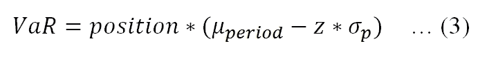
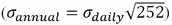
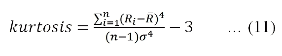
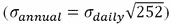

# 第十一章：风险价值（VaR）

在金融领域，理性投资者在隐性或显性地，总是考虑风险与回报之间的权衡。通常，衡量回报没有歧义。然而，在衡量风险方面，我们有许多不同的度量标准，如使用收益的方差和标准差来衡量总风险，个股的贝塔值，或投资组合贝塔值来衡量市场风险。在前几章中，我们知道总风险有两个组成部分：市场风险和公司特定风险。为了平衡回报的收益和风险的成本，可以应用多种度量方法，如夏普比率、特雷诺比率、索提诺比率和 M2 绩效度量（莫迪利安尼与莫迪利安尼绩效度量）。所有这些风险度量或比率都有一个共同的格式：即回报的收益（以风险溢价表示）和风险（以标准差、贝塔值或**下偏标准差**（**LPSD**）表示）之间的权衡。另一方面，这些度量并未考虑概率分布。在本章中，将介绍一个新的风险度量——**风险价值**（**VaR**），并通过使用现实世界的数据来应用它。特别地，将涵盖以下主题：

+   VaR 介绍

+   正态分布的密度函数和累积分布函数回顾

+   方法一—基于正态性假设估算 VaR

+   从 1 天风险转换为 n 天风险，一天 VaR 与 n 天 VaR 的比较

+   正态性检验

+   偏度和峰度的影响

+   通过包含偏度和峰度来修正 VaR 度量

+   方法二—基于历史收益估算 VaR

+   使用蒙特卡洛模拟将两种方法联系起来

+   回测和压力测试

# VaR 介绍

目前为止，我们有几种方法来评估个股或投资组合的风险，比如使用收益的方差和标准差来衡量总风险，或者用贝塔值来衡量投资组合或个股的市场风险。另一方面，许多 CEO 更倾向于使用一个简单的指标，称为**风险价值**（**VaR**），它有一个简单的定义：

> *“在预定时间段内，具有一定置信水平的最大损失。”*

从前面的定义来看，它有三个明确的因素，再加上一个隐含的因素。隐含因素或变量是我们当前的位置，或者说我们当前投资组合或个股的价值。前述陈述提供了未来可能的最大损失，这是第一个因素。第二个因素是在特定的时间段内。这两个因素是相当常见的。然而，最后一个因素是非常独特的：它带有置信水平或概率。以下是几个例子：

+   **示例 #1**：在 2017 年 2 月 7 日，我们持有 300 股国际商业机器公司的股票，市值为$52,911。明天，即 2017 年 2 月 8 日，最大损失为$1,951，置信水平为 99%。

+   **示例 #2**：我们今天的共同基金价值为 1000 万美元。在接下来的三个月里，基于 95%的置信水平，最大损失为 50 万美元。

+   **示例 #3**：我们银行的价值为 2 亿美元。我们银行的 VaR 为 1000 万美元，具有 1%的概率，时间跨度为接下来的 6 个月。

通常，有两种方法来估算 VaR。第一种方法基于假设我们的证券或投资组合回报遵循正态分布，而第二种方法依赖于历史回报的排名。在讨论第一种方法之前，我们先复习一下正态分布的相关概念。正态分布的密度在这里定义：


这里，*f(x)*是密度函数，*x*是输入变量，*μ*是均值，*σ*是标准差。可以使用一个叫做`spicy.stats.norm.pdf()`的函数来估算密度。该函数有三个输入值：*x*、*μ*和*σ*。以下代码调用此函数，并根据前面的公式手动验证结果：

```py
import scipy.stats as stats
from scipy import sqrt, exp,pi
d1=stats.norm.pdf(0,0.1,0.05)      
print("d1=",d1)
d2=1/sqrt(2*pi*0.05**2)*exp(-(0-0.1)**2/0.05**2/2)  # verify manually
print("d2=",d2) 
('d1=', 1.0798193302637611)
('d2=', 1.0798193302637611)
```

在前面的代码中，我们导入了`sqrt()`、`exp()`函数以及π，以简化我们的代码。设置μ=0，σ=1，前面的正态分布密度函数简化为标准正态分布；请看其对应的密度函数：


`spicy.stats.norm.pdf()`函数的第二个和第三个输入值的默认值分别为 0 和 1。换句话说，只需要一个输入值，它就代表了标准正态分布；请查看以下代码并了解如何手动验证：

```py
from scipy import exp,sqrt,stats,pi
d1=stats.norm.pdf(0)
print("d1=",d1)
d2=1/sqrt(2*pi)           # verify manually
print("d2=",d2)
('d1=', 0.3989422804014327)
('d2=', 0.3989422804014327)
```

以下代码生成了标准正态分布的图形，其中`spicy.stats.norm.pdf()`函数只接受一个输入值：

```py
import scipy as sp
import matplotlib.pyplot as plt
x = sp.arange(-3,3,0.1)
y=sp.stats.norm.pdf(x)
plt.title("Standard Normal Distribution")
plt.xlabel("X")
plt.ylabel("Y")
plt.plot(x,y)
plt.show()
```

下面是图形展示：


对于 VaR 估算，通常我们会选择 95%和 99%两个置信水平。对于 95%（99%）置信水平，我们实际上关注的是左尾的 5%（1%）概率。以下图表展示了基于标准正态分布和 95%置信水平的 VaR 概念：

```py
import scipy as sp
from matplotlib import pyplot as plt
z=-2.325       # user can change this number 
xStart=-3.8    # arrow line start x
yStart=0.2     # arrow line start x
xEnd=-2.5      # arrow line start x
yEnd=0.05      # arrow line start x
def f(t):
    return sp.stats.norm.pdf(t) 

plt.ylim(0,0.45)
x = sp.arange(-3,3,0.1) 
y1=f(x)
plt.plot(x,y1)
x2= sp.arange(-4,z,1/40.) 
sum=0
delta=0.05
s=sp.arange(-10,z,delta) 
for i in s:
    sum+=f(i)*delta

plt.annotate('area is '+str(round(sum,4)),xy=(xEnd,yEnd),xytext=(xStart,yStart), arrowprops=dict(facecolor='red',shrink=0.01))
plt.annotate('z= '+str(z),xy=(z,0.01)) 
plt.fill_between(x2,f(x2))
plt.show()
```

要生成图形，应用了三个函数。`matplotlib.pyplot.annotate()`函数的作用是生成一个文本或带有文本描述的箭头。`str()`函数将数字转换为字符串。`matplotlib.pyplot.fill_between()`将填充指定区域。输出的图形如下所示：


基于正态分布假设，我们有以下一般形式来估算 VaR：



在这里，*VaR* 是我们的风险价值，*position* 是我们投资组合的当前市场价值，*μperiod* 是预期的期间回报，*z* 是一个根据置信水平确定的临界值，σ 是我们投资组合的波动性。对于正态分布，*z*=2.33 对应于 99% 的置信水平，而 z=1.64 对应于 95% 的置信水平。由于我们可以使用 `scipy.stats.norm.ppf()` 来获取 z 值，因此前述方程可以重写为：


比较前述两个方程。仔细的读者应该注意到，z 前的符号是不同的。对于前面的方程，它有一个正号，而不是前一个方程中的负号。原因是，应用 `scipy.stats.norm.ppf()` 估算出的 z 值会是负数；请参见以下代码：

```py
from scipy.stats import norm
confidence_level=0.99
z=norm.ppf(1-confidence_level)
print(z)
-2.32634787404
```

当时间周期较短，如 1 天时，我们可以忽略 *μperiod* 的影响。因此，我们有以下最简单的形式：


以下程序显示了一个假设的盈亏概率密度函数的 5% VaR：

```py
import scipy as sp
import scipy as sp
from scipy.stats import norm
from matplotlib import pyplot as plt

confidence_level=0.95   # input 
z=norm.ppf(1-confidence_level) 
def f(t):
    return sp.stats.norm.pdf(t)
#
plt.ylim(0,0.5)
x = sp.arange(-7,7,0.1) 
ret=f(x)
plt.plot(x,ret)
x2= sp.arange(-4,z,1/40.) 
x3=sp.arange(z,4,1/40.)
sum=0
delta=0.05
s=sp.arange(-3,z,delta) 
for i in s:
    sum+=f(i)*delta
note1='Red area to the left of the'
note2='dotted red line reprsesents'
note3='5% of the total area'
#
note4='The curve represents a hypothesis'
note5='profit/loss density function. The'
note6='5% VaR is 1.64 standard deviation'
note7='from the mean, i.e.,zero'
#
note8='The blue area to the righ of the'
note9='red dotted line represents 95%'
note10='of the returns space'
# this is for the vertical line
plt.axvline(x=z, ymin=0.1, ymax = 1, linewidth=2,ls='dotted', color='r')
plt.figtext(0.14,0.5,note1)
plt.figtext(0.14,0.47,note2)
plt.figtext(0.14,0.44,note3)
#
plt.figtext(0.5,0.85,note4)
plt.figtext(0.5,0.82,note5)
plt.figtext(0.5,0.79,note6)
plt.figtext(0.5,0.76,note7)
plt.annotate("",xy=(-2.5,0.08),xytext=(-2.5,0.18), arrowprops=dict(facecolor='red',shrink=0.001))
#
plt.figtext(0.57,0.5,note8)
plt.figtext(0.57,0.47,note9)
plt.figtext(0.57,0.44,note10)
plt.annotate("",xy=(1.5,0.28),xytext=(4.5,0.28), arrowprops=dict(facecolor='blue',shrink=0.001))
#
plt.annotate('z= '+str(z),xy=(2.,0.1)) 
plt.fill_between(x2,f(x2), color='red')
plt.fill_between(x3,f(x3), color='blue')
plt.title("Visual presentation of VaR, 5% vs. 95%")
plt.show()
```

相关图表如下：


这是估算明天最大损失的最简单示例。假设我们在 2017 年 2 月 7 日拥有 1,000 股 IBM 的股票。以 99% 的置信水平，明天的最大损失是多少？为了估算每日回报的标准差，我们使用过去 5 年的数据。实际上，这是一个决策变量。我们可以使用 1 年的数据或多年的数据。每种方法都有其优缺点。基于较长时间段估算的标准差会更稳定，因为我们有更大的样本量。然而，远过去的一些信息肯定会过时：

```py
import numpy as np
import pandas as pd
from scipy.stats import norm
from matplotlib.finance import quotes_historical_yahoo_ochl as getData
#
# input area
ticker='IBM'              # input 1
n_shares=1000             # input 2
confidence_level=0.99     # input 3
begdate=(2012,2,7)        # input 4
enddate=(2017,2,7)        # input 5
#
z=norm.ppf(1-confidence_level) 
x=getData(ticker,begdate,enddate,asobject=True,adjusted=True)
print(x[0])
ret = x.aclose[1:]/x.aclose[:-1]-1
#
position=n_shares*x.close[0] 
std=np.std(ret)
#
VaR=position*z*std
print("Holding=",position, "VaR=", round(VaR,4), "tomorrow")
(datetime.date(2012, 2, 7), 2012, 2, 7, 734540.0, 167.75861437920275, 168.543152, 169.23178870104016, 167.34020198573538, 3433000.0, 168.543152)
('Holding=', 168543.152, 'VaR=', -4603.5087, 'tomorrow')
```

打印数据第一行的目的是为了显示收盘价确实是在 2017 年 2 月 7 日。我们的持仓价值为 168,543 美元，其 1 日 VaR 为 4,604 美元。第二个示例是关于 10 天期间的 VaR。要将每日回报的方差（标准差）转换为 n 天的方差（标准差），我们有以下公式：


例如，年波动率等于日波动率乘以 252 的平方根 。为了将每日平均回报转换为 n 天的平均回报，我们有以下公式：


基于每日回报，我们有以下一般公式来估算 n 天 VaR 的置信水平：


以下代码显示了在 2016 年最后一天，持有 50 股沃尔玛股票，在 99% 置信水平下的 10 天 VaR：

```py
import numpy as np
import pandas as pd
from scipy.stats import norm
from matplotlib.finance import quotes_historical_yahoo_ochl as getData
ticker='WMT'            # input 1
n_shares=50             # input 2
confidence_level=0.99   # input 3
n_days=10               # input 4
begdate=(2012,1,1)      # input 5
enddate=(2016,12,31)    # input 6

z=norm.ppf(confidence_level) 

x=getData(ticker,begdate,enddate,asobject=True,adjusted=True)
ret = x.aclose[1:]/x.aclose[:-1]-1 
position=n_shares*x.close[0] 
VaR=position*z*np.std(ret)*np.sqrt(n_days)
print("Holding=",position, "VaR=", round(VaR,4), "in ", n_days, "Days")
('Holding=', 2650.3070499999999, 'VaR=', 205.0288, 'in ', 10, 'Days')
```

2016 年 12 月 31 日，我们的持仓价值为$2,650。我们在接下来的 10 天内的最大损失为$205，置信水平为 99%。在前面的程序中，我们基于日收益率估算了日均收益和标准差。然后我们将其转换为 10 天的平均收益和 10 天的波动率。另一方面，实际上我们可以直接计算 10 天的收益率。在 10 天收益率可用后，可以直接应用`scipy.mean()`和`scipy.std()`函数。换句话说，我们不需要将日均收益和日标准差转换为 10 天均值和 10 天标准差。相关代码如下。为了节省空间，前 11 行没有重复：

```py
x = getData(ticker, begdate, enddate,asobject=True, adjusted=True)
logret = np.log(x.aclose[1:]/x.aclose[:-1])

# method 2: calculate 10 day returns 
ddate=[]
d0=x.date
for i in range(0,np.size(logret)): 
    ddate.append(int(i/nDays))
y=pd.DataFrame(logret,ddate,columns=['retNdays']) 
retNdays=y.groupby(y.index).sum()
#print(retNdays.head())
position=n_shares*x.close[0] 
VaR=position*z*np.std(retNdays)
print("Holding=",position, "VaR=", round(VaR,4), "in ", nDays, "Days")
('Holding=', 2650.3070499999999, 'VaR=', 209.1118, 'in ', 10, 'Days')
```

我们的新结果显示，VaR 为$209.11，相比之下，原值为$205.03。低估的百分比为-0.01951126，约为-2%。以下代码估算了 Fama-French 五个按市值加权的行业组合的 VaR，数据频率为月度。数据集可以在作者的官网获取，链接：[`canisius.edu/~yany/python/ff5VWindustryMonthly.pkl`](http://canisius.edu/~yany/python/ff5VWindustryMonthly.pkl)。这五个行业分别是消费品、制造业、高科技、健康和其他。以下是前几行和最后几行代码：

```py
import pandas as pd
x=pd.read_pickle("c:/temp/ff5VWindustryMonthly.pkl")
print(x.head())
print(x.tail())
         CNSMR   MANUF   HITEC   HLTH    OTHER
192607  0.0543  0.0273  0.0183  0.0177  0.0216
192608  0.0276  0.0233  0.0241  0.0425  0.0438
192609  0.0216 -0.0044  0.0106  0.0069  0.0029
192610 -0.0390 -0.0242 -0.0226 -0.0057 -0.0285
192611  0.0370  0.0250  0.0307  0.0542  0.0211
         CNSMR   MANUF   HITEC   HLTH    OTHER
201608 -0.0101  0.0040  0.0068 -0.0323  0.0326
201609 -0.0143  0.0107  0.0202  0.0036 -0.0121
201610 -0.0252 -0.0231 -0.0141 -0.0743  0.0059
201611  0.0154  0.0539  0.0165  0.0137  0.1083
201612  0.0132  0.0158  0.0163  0.0084  0.0293
```

以下程序估算了将$1,000 投资于每个行业组合的 VaR，置信水平为 99%，计算的是下一个周期的风险。由于数据频率为月度，因此固定周期为下一个月：

```py
import pandas as pd
import scipy as sp
from scipy.stats import norm
#
confidence_level=0.99   # input 
position=([1000,1000,1000,1000,1000])
z=norm.ppf(1-confidence_level)
x=pd.read_pickle("c:/temp/ff5VWindustryMonthly.pkl")
#
std=sp.std(x,axis=0)
mean=sp.mean(x,axis=0)
#
t=sp.dot(position,z)
VaR=t*std
#
# output area
print(sp.shape(x))
print("Position=",position)
print("VaR=")
print(VaR)
1086, 5)
('Position=', [1000, 1000, 1000, 1000, 1000])
VaR=
CNSMR   -122.952735
MANUF   -128.582446
HITEC   -129.918893
HLTH    -130.020356
OTHER   -149.851230
dtype: float64
```

对于这五个行业，VaR 分别为$122.95、$128.58、$129.92、$130.02 和$149.85，假设每个行业投资$1,000。通过比较这些值，我们可以看到，消费品行业的风险最低，而被定义为“其他”的行业具有最高的最大可能损失。

# 正态性检验

第一个估算 VaR 的方法是基于一个重要的假设，即个别股票或组合的收益符合正态分布。然而，在现实世界中，我们知道股票收益或组合收益不一定符合正态分布。以下程序通过使用 5 年的日数据，检验微软的收益是否满足这个假设：

```py
from scipy import stats 
from matplotlib.finance import quotes_historical_yahoo_ochl as getData 
import numpy as np 
#	
ticker='MSFT' 
begdate=(2012,1,1) 
enddate=(2016,12,31) 
#
p =getData(ticker, begdate, enddate,asobject=True, adjusted=True) 
ret = (p.aclose[1:] - p.aclose[:-1])/p.aclose[1:] 
print 'ticker=',ticker,'W-test, and P-value' 
print(stats.shapiro(ret))
print( stats.anderson(ret))
ticker= MSFT W-test, and P-value
(0.9130843877792358, 3.2116320877511604e-26)
AndersonResult(statistic=14.629260310763584, critical_values=array([ 0.574,  0.654,  0.785,  0.915,  1.089]), significance_level=array([ 15\. ,  10\. ,   5\. ,   2.5,   1\. ]))
```

我们的原假设是微软股票的日收益符合正态分布。根据前面的结果，我们拒绝原假设，因为 F 值远高于临界值 1.089（假设显著性水平为 1%）。即使我们基于单只股票拒绝了这个假设，也有人可能会认为组合的收益可能符合这一假设。下一个程序检验 S&P500 的日收益是否符合正态分布。S&P500 的股票代码是`^GSPC`，可以通过 Yahoo!Finance 获取：

```py
import numpy as np 
from scipy import stats 
from matplotlib.finance import quotes_historical_yahoo_ochl as getData 
#
ticker='^GSPC'    # ^GSPC is for S&P500
begdate=(2012,1,1) 
enddate=(2016,12,31) 
#
p =getData(ticker, begdate, enddate,asobject=True, adjusted=True) 
ret = (p.aclose[1:] - p.aclose[:-1])/p.aclose[1:] 
print 'ticker=',ticker,'W-test, and P-value' 
print(stats.shapiro(ret))
print( stats.anderson(ret) )
ticker= ^GSPC W-test, and P-value
(0.9743353128433228, 3.7362179458122827e-14)
AndersonResult(statistic=8.6962226557502618, critical_values=array([ 0.574,  0.654,  0.785,  0.915,  1.089]), significance_level=array([ 15\. ,  10\. ,   5\. ,   2.5,   1\. ]))
```

从前面的结果来看，我们拒绝了 S&P500 的正态性假设。换句话说，由 S&P500 日收益表示的市场指数不符合正态分布。

# 偏度和峰度

基于正态性假设，VaR 估算只考虑前两个矩：均值和方差。如果股票回报真的遵循正态分布，这两个矩将完全定义它们的概率分布。从前面的章节可以知道，这并不成立。第一种修正方法是除了前两个矩之外，加入其他更高阶的矩。第三和第四阶矩分别称为偏度和峰度。对于一个具有 n 个回报的股票或投资组合，偏度通过以下公式估算：


在这里，*偏度*是偏度，*Ri*是第*i*个回报，是平均回报，*n*是回报的数量，σ是回报的标准差。峰度反映了极端值的影响，因为四次方的值非常高。峰度通常通过以下公式估算：


对于标准正态分布，它的均值为零，方差为 1，偏度为零，峰度为 3。因此，有时峰度被定义为前面的公式减去 3：



一些教科书将这两种定义区分为峰度和超额峰度。然而，也有一些教科书简单地将前面的公式也标记为峰度。因此，当我们进行检验以查看时间序列的峰度是否为零时，我们必须知道使用的是哪个基准。以下程序生成了 500 万随机数来自标准差，并应用四个函数来估算这四个矩，即均值、标准差、偏度和峰度：

```py
from scipy import stats,random
import numpy as np
np.random.seed(12345)
n=5000000   
#
ret = random.normal(0,1,n)
print('mean    =', np.mean(ret))
print('std     =',np.std(ret))
print('skewness=',stats.skew(ret))
print('kurtosis=',stats.kurtosis(ret))
('mean    =', 0.00035852273706422504)
('std     =', 0.99983435063933623)
('skewness=', -0.00040545999711941665)
('kurtosis=', -0.001162270913658947)
```

由于从标准正态分布中抽取的随机数的峰度接近零，`scipy.stats.kurtosis()`函数应基于*公式（11）*而不是*公式（10）*。

# 修正 VaR

从前面的讨论中我们知道，基于假设，股票回报服从正态分布。因此，回报的偏度和峰度都假设为零。然而，在现实世界中，许多股票回报的偏度和超额峰度并不为零。因此，开发了修正 VaR，利用这四个矩而不仅仅是两个；请参见以下定义：


这里，*z*是基于正态分布的值，*S*是偏度，*K*是峰度，*t*是一个中间变量，`scipy.stats.ppf()`函数为给定的置信水平提供一个 z 值。以下程序提供了基于正态性假设和基于前述公式（即使用所有四个矩）计算的两种 VaR。年末时持有的股票数量为 500 只，测试的股票是**沃尔玛**（**WMT**）。1 天 VaR 的置信水平为 99%：

```py
import numpy as np
import pandas as pd
from scipy.stats import stats,norm
from matplotlib.finance import quotes_historical_yahoo_ochl as getData
#
ticker='WMT'            # input 1
n_shares=500            # input 2
confidence_level=0.99   # input 3
begdate=(2000,1,1)      # input 4
enddate=(2016,12,31)    # input 5
#
# Method I: based on the first two moments
z=abs(norm.ppf(1-confidence_level)) x=getData(ticker,begdate,enddate,asobject=True,adjusted=True)
ret = x.aclose[1:]/x.aclose[:-1]-1
position=n_shares*x.close[0] 
mean=np.mean(ret)
std=np.std(ret)
VaR1=position*(mean-z*std)
print("Holding=",round(position,2), "VaR1=", round(VaR1,2), "for 1 day ")
#
# Modified VaR: based on 4 moments
s=stats.skew(ret)
k=stats.kurtosis(ret)
t=z+1/6.*(z**2-1)*s+1/24.*(z**3-3*z)*k-1/36.*(2*z**3-5*z)*s**2
mVaR=position*(mean-t*std)
print("Holding=",round(position,2), "modified VaR=", round(mVaR,2), "for 1 day ")
('Holding=', 24853.46, 'VaR1=', -876.84, 'for 1 day ')
('Holding=', 24853.46, 'modified VaR=', -1500.41, 'for 1 day ')
```

根据最后两行，我们得出基于正态分布的 VaR 为 $876.84，修正后的 VaR 为 $1,500。两者之间的百分比差异为 42%。这一结果表明，忽略偏度和峰度将极大低估 VaR。

# 基于排序的历史收益 VaR

我们知道，股票收益不一定遵循正态分布。另一种方法是使用排序后的收益来评估 VaR。这种方法称为基于历史收益的 VaR。假设我们有一个名为 *ret* 的每日收益向量。我们将其从最小到最大排序。我们将排序后的收益向量称为 *sorted_ret*。对于给定的置信水平，一期 VaR 计算公式如下：


这里，*position* 是我们的财富（投资组合的价值），*confidence* 是置信水平，n 是收益的数量。`len()` 函数显示观察值的数量，`int()` 函数取输入值的整数部分。例如，如果收益向量的长度是 200，且置信水平为 99%，那么排序后的收益向量中第二个值（200*0.01），从最小到最大，再乘以我们的财富，就是我们的 VaR。显然，如果我们有更长的时间序列，也就是更多的收益观察值，我们的最终 VaR 将更加准确。比如拥有 500 股沃尔玛股票，99% 的置信水平下，第二天的最大损失是多少？首先，让我们看看几种排序数据的方法。第一种方法使用 `numpy.sort()` 函数：

```py
import numpy as np
a = np.array([[1,-4],[9,10]])
b=np.sort(a)                
print("a=",a)
print("b=",b)
('a=', array([[ 1, -4],
       [ 9, 10]]))
('b=', array([[-4,  1],
       [ 9, 10]]))
```

这是使用 Python `pandas` 模块进行排序的第二种方法：

```py
import pandas as pd
a = pd.DataFrame([[9,4],[9,2],[1,-1]],columns=['A','B'])
print(a)
# sort by A ascedning, then B descending 
b= a.sort_values(['A', 'B'], ascending=[1, 0])
print(b)
# sort by A and B, both ascedning 
c= a.sort_values(['A', 'B'], ascending=[1, 1])
print(c)
```

为了方便比较，这三个数据集并排放置。左侧面板显示原始数据集。中间面板显示按列 `A` 升序排序后，再按列 `B` 降序排序的结果。右侧面板显示按列 `A` 和 `B` 都升序排序的结果：


接下来的两个程序比较了两种估算 VaR（风险价值）的方法：基于正态分布的方法和基于排序的方法。为了让我们的程序更易理解，时间段仅为 1 天：

```py
#
z=norm.ppf(confidence_level) 
x=getData(ticker,begdate,enddate,asobject=True,adjusted=True)
ret = x.aclose[1:]/x.aclose[:-1]-1
#
position=n_shares*x.close[0] 
std=np.std(ret)
#
VaR=position*z*std
print("Holding=",position, "VaR=", round(VaR,4), "tomorrow")
('Holding=', 26503.070499999998, 'VaR=', 648.3579, 'tomorrow')
```

上面程序中使用的公式是 *VaR=position*z*sigma*。结果告诉我们，持仓为 $26,503，1 天 VaR 为 $648，置信水平为 99%。以下程序基于排序估算同一股票的 VaR：

```py
ret = np.array(x.aclose[1:]/x.aclose[:-1]-1)
ret2=np.sort(ret) 
#
position=n_shares*x.close[0] 
n=np.size(ret2)
leftTail=int(n*(1-confidence_level))
print(leftTail)
#
VaR2=position*ret2[leftTail]
print("Holding=",position, "VaR=", round(VaR2,4), "tomorrow")
('Holding=', 26503.070499999998, 'VaR=', -816.7344, 'tomorrow')
```

结果显示，1 天 VaR 为 $817。回想一下，基于正态分布的 VaR 为 $648。如果第二种方法更准确，第一种方法将我们的潜在损失低估了 20%。在风险评估中，这个差异非常巨大！以下代码是基于排序的 n 天期的 VaR：

```py
ret = x.aclose[1:]/x.aclose[:-1]-1
position=n_shares*x.close[0] 
#
# Method 1: based on normality 
mean=np.mean(ret)
std=np.std(ret)
meanNdays=(1+mean)**nDays-1
stdNdays=std*np.sqrt(nDays)
z=norm.ppf(confidence_level) 
VaR1=position*z*stdNdays
print("Holding=",position, "VaR1=", round(VaR1,0), "in ", nDays, "Days")
#
# method 2: calculate 10 day returns 
ddate=[]
d0=x.date
for i in range(0,np.size(logret)): 
    ddate.append(int(i/nDays))
y=pd.DataFrame(logret,index=ddate,columns=['retNdays']) 
logRet=y.groupby(y.index).sum()
retNdays=np.exp(logRet)-1
# 
VaR2=position*z*np.std(retNdays)
print("Holding=",position, "VaR2=", round(VaR2,0), "in ", nDays, "Days")
# 
# Method III
ret2=np.sort(retNdays) 
n=np.size(ret2)
leftTail=int(n*(1-confidence_level))
print(leftTail)
#
VaR3=position*ret2[leftTail]
print("Holding=",position, "VaR=", round(VaR3,0), "in ",nDays, "Days")
('Holding=', 24853.456000000002, 'VaR1=', 2788.0, 'in ', 10, 'Days')
('Holding=', 24853.456000000002, 'VaR2=', 2223.0, 'in ', 10, 'Days')
4
('Holding=', 24853.456000000002, 'VaR=', 1301.0, 'in ', 10, 'Days')
```

在前面的程序中有两个技巧。第一个技巧是将每日对数收益率的总和转化为 10 天的对数收益率。然后，我们将对数收益率转换为百分比收益率。第二个技巧是如何生成 10 天的收益率。首先，我们使用`int()`函数生成组，即`int(i/nDays)`。由于`nDays`的值为 10，`int(i/10)`会生成 10 个零、10 个一、10 个二，依此类推。基于三种方法的 VaR 分别为$2,788、$2,223 和$1,301。显然，第三种方法存在一些问题。一个问题是，对于 n 天的周期，我们只有 428 个观察值，也就是说样本的大小可能太小。如果我们选择 99%的置信区间，则必须选择计算中的第四低收益。这肯定会导致一些问题。

# 模拟与 VaR

在前面的章节中，我们学习了两种估算单只股票或投资组合 VaR 的方法。第一种方法假设股票收益符合正态分布。第二种方法使用排序后的历史收益。那么这两种方法之间有什么联系呢？实际上，蒙特卡洛模拟可以作为它们之间的桥梁。首先，让我们来看一下基于正态假设的第一种方法。我们在 2016 年最后一天持有 500 股沃尔玛股票。如果明天的置信区间为 99%，那么明天的 VaR 是多少？

```py
#
position=n_shares*x.close[0] 
mean=np.mean(ret)
std=np.std(ret)
#
VaR=position*(mean+z*std)
print("Holding=",position, "VaR=", round(VaR,4), "tomorrow")
('Holding=', 26503.070499999998, 'VaR=', -641.2911, 'tomorrow')
```

明天的 VaR 为$641.29，置信水平为 99%。下面是蒙特卡洛模拟的工作原理。首先，我们基于每日收益计算均值和标准差。由于假设股票收益符合正态分布，我们可以生成 5,000 个收益，均值和标准差相同。如果我们的置信水平为 99%，那么从按升序排列的收益中，位于第 50 个的收益将是我们的截断点，*5000*0.01=50*。以下是代码：

```py
#
position=n_shares*x.close[0] 
mean=np.mean(ret)
std=np.std(ret)
#
n_simulation=5000
sp.random.seed(12345) 
ret2=sp.random.normal(mean,std,n_simulation) 
ret3=np.sort(ret2) 
m=int(n_simulation*(1-confidence_level))
VaR=position*(ret3[m])
print("Holding=",position, "VaR=", round(VaR,4), "tomorrow")
('Holding=', 26503.070499999998, 'VaR=', -627.3443, 'tomorrow')
```

与基于公式的$641.29 相比，蒙特卡洛模拟给出的值为$627.34，差异相对较小。

# 投资组合的 VaR

在第九章中，*投资组合理论*展示了当我们将多只股票放入投资组合时，可以降低或消除公司特定的风险。估算 n 只股票投资组合收益率的公式如下：


这里的*Rp,t*是时刻*t*的投资组合收益，*wi*是股票*i*的权重，*Ri,t*是股票*i*在时刻*t*的收益。谈到预期收益或均值时，我们有一个非常相似的公式：


在这里，是平均或预期的投资组合收益率，是股票*i*的平均或预期收益率。这样一个 n 只股票投资组合的方差公式如下：


在这里，是投资组合方差，σi,j 是股票 i 和股票 j 之间的协方差；请参见以下公式：


股票*i*与股票*j*之间的相关性*ρi,j*定义如下：


当股票之间没有完全正相关时，组合股票会降低我们的投资组合风险。以下程序显示，投资组合的 VaR 不仅仅是单个股票 VaR 的简单加总或加权 VaR：

```py
from matplotlib.finance import quotes_historical_yahoo_ochl as getData

# Step 1: input area
tickers=('IBM','WMT','C')  # tickers
begdate=(2012,1,1)         # beginning date 
enddate=(2016,12,31)       # ending date
weight=(0.2,0.5,0.3)       # weights
confidence_level=0.99      # confidence level 
position=5e6               # total value
#
z=norm.ppf(confidence_level) 
# Step 2: define a function
def ret_f(ticker,begdate,enddte):
    x=getData(ticker,begdate,enddate,asobject=True,adjusted=True)
    ret=x.aclose[1:]/x.aclose[:-1]-1
    d0=x.date[1:]
    return pd.DataFrame(ret,index=d0,columns=[ticker])
# Step 3
n=np.size(tickers)
final=ret_f(tickers[0],begdate,enddate)
for i in np.arange(1,n):
    a=ret_f(tickers[i],begdate,enddate)
    if i>0:
        final=pd.merge(final,a,left_index=True,right_index=True)
#
# Step 4: get porfolio returns
portRet=sp.dot(final,weight)
portStd=sp.std(portRet)
portMean=sp.mean(portRet)
VaR=position*(portMean-z*portStd)
print("Holding=",position, "VaR=", round(VaR,2), "tomorrow")

# compare
total2=0.0
for i in np.arange(n):
    stock=tickers[i]
    ret=final[stock]
    position2=position*weight[i]
    mean=sp.mean(ret)
    std=sp.std(ret)
    VaR=position2*(mean-z*std)
    total2+=VaR
    print("For ", stock, "with a value of ", position2, "VaR=", round(VaR,2))
print("Sum of three VaR=",round(total2,2))
('Holding=', 5000000.0, 'VaR=', -109356.22, 'tomorrow')
('For ', 'IBM', 'with a value of ', 1000000.0, 'VaR=', -27256.67)
('For ', 'WMT', 'with a value of ', 2500000.0, 'VaR=', -60492.15)
('For ', 'C', 'with a value of ', 1500000.0, 'VaR=', -59440.77)
('Sum of three VaR=', -147189.59)
```

我们当前投资组合的 VaR 为$109,356。然而，基于权重计算的这三只股票的 VaR 总和为$147,190。这个结果验证了通过选择不同股票来实现的分散化效应。

# 回测与压力测试

在金融领域，压力测试可以看作是一种分析或模拟，旨在确定特定金融工具（如 VaR）在经济危机中的应对能力。由于估算 VaR 的首个方法基于股票回报服从正态分布的假设，其准确性取决于股票回报在现实中偏离这一假设的程度。模型验证是基于模型的风险管理实施的关键组成部分。也就是说，我们需要某种方法来确定所选择的模型是否准确且一致地执行。对于公司及其监管机构而言，这一步非常重要。根据 Lopez（2000 年）的研究，以下是表格：

| 名称 | 目标 | 方法 |
| --- | --- | --- |
| 回测 | 将观察到的结果与模型的预期输出进行比较 | 预测评估确立了一个具有大量学术文献的经验问题 |
| 压力测试 | 在极端条件下展示模型的预期结果 |

+   投影分析

+   异常值分析

+   情景分析与案例研究

|

> 表 11.1 回测与压力测试

假设我们仅使用 1 年的数据来估算 2017 年 2 月 7 日持有 1,000 股 IBM 的 1 天 VaR，置信度为 99%。程序如下所示：

```py
#
position=n_shares*x.close[0] 
mean=np.mean(ret)
z=norm.ppf(1-confidence_level)
std=np.std(ret)
#
VaR=position*(mean+z*std)
print("Holding=",position, "VaR=", round(VaR,4), "tomorrow")
print("VaR/holding=",VaR/position)
(datetime.date(2016, 2, 8), 2016, 2, 8, 736002.0, 121.65280462310274, 122.598996, 123.11070921267809, 119.84731962624865, 7364000.0, 122.598996)
('Holding=', 122598.996, 'VaR=', -3186.5054, 'tomorrow')
('VaR/holding=', -0.025991284652254254)
```

根据之前的结果，我们的持仓为$122,599，下一天的最大损失为$3,187。请记住，置信度为 99%，这意味着在这一年期间，我们应预期约 2.5 次违例（0.01*252）。252 是指一年中的交易日数。以下程序显示了违例的次数：

```py
VaR=-3186.5054            # from the previous program
position=122598.996       # from the previous program
#('Holding=', 122598.996, 'VaR=', -3186.5054, 'tomorrow')
#('VaR/holding=', -0.025991284652254254)
#
z=norm.ppf(1-confidence_level) 
x=getData(ticker,begdate,enddate,asobject=True,adjusted=True)
print("first day=",x[0])
ret = x.aclose[1:]/x.aclose[:-1]-1
#
cutOff=VaR/position 
n=len(ret)
ret2=ret[ret<=cutOff]
n2=len(ret2)
print("n2=",n2)
ratio=n2*1./(n*1.)
print("Ratio=", ratio)
('first day=', (datetime.date(2016, 2, 8), 2016, 2, 8, 736002.0, 121.65280462310274, 122.598996, 123.11070921267809, 119.84731962624865, 7364000.0, 122.598996))
('n2=', 4)
('Ratio=', 0.015873015873015872)
```

再次，我们期望根据模型看到 2.5 次违例。然而，实际违例次数为 4 次。基于 99%的置信度，我们预期回报低于-2.599%的情况应该约为 1%。不幸的是，基于 1 年的数据，这一比例为 1.58%。如果基于 55 年的历史数据，对于这只特定股票，回报低于该比例的频率超过了 2 倍，分别为 3.66%与 1%。这表明基础模型低估了潜在的最大损失。

# 预期损失

在前面的章节中，我们讨论了与 VaR 相关的许多问题，如其定义和如何估算。然而，VaR 的一个主要问题是它依赖于基础证券或投资组合的分布形态。如果正态分布的假设接近成立，那么 VaR 是一个合理的度量。否则，如果我们观察到胖尾现象，我们可能会低估最大损失（风险）。另一个问题是，VaR 触及后分布的形态被忽略了。如果我们有比正态分布描述的更胖的左尾，那么我们的 VaR 会低估真实风险。反之，如果左尾比正态分布更薄，我们的 VaR 则会高估真实风险。**预期损失**（**ES**）是在 VaR 触及时的预期损失，其定义如下：


这里，*ES*是预期损失，α是我们的显著性水平，如 1%或 5%。基于正态分布假设，对于我们的 Python 示例，我们有以下公式：


预期损失可以通过以下方式估算：


以下程序展示了如何从正态分布中生成回报，然后估算 VaR 和 ES：

```py
import scipy as sp
import scipy.stats as stats
x = sp.arange(-3,3,0.01)
ret=stats.norm.pdf(x)
confidence=0.99
position=10000
z=stats.norm.ppf(1-confidence)
print("z=",z)
zES=-stats.norm.pdf(z)/(1-confidence)
print("zES=", zES)
std=sp.std(ret)
VaR=position*z*std
print("VaR=",VaR)
ES=position*zES*std
print("ES=",ES)
```

同样，我们可以推导出基于历史回报估计预期损失（Expected Shortfall，简称 ES）的公式。从某种意义上说，预期损失是基于低于 VaR 阈值的回报的平均损失。假设我们有 n 个回报观测值，预期损失可以定义如下：


这里，*ES*是预期损失，*position*是我们的投资组合的价值，*m*是比给定置信水平指定的截断点更差的回报观测数，*Ii*是一个虚拟变量，当回报小于*Rcutoff*时其值为 1，否则为 0，*Ri*是第*i*个回报，*Rcutoff*是由给定置信水平确定的截断回报，n 是所有回报观测的总数，m 是小于截断回报的回报数。例如，如果我们有 1,000 个回报观测，且置信水平为 99%，则截断回报将是按从低到高排序的回报中的第 10 个观测值。预期损失将是这 10 个最差情境的平均损失。

假设在 2016 年最后一天，我们持有 500 股沃尔玛股票。假设我们关心的是次日最大损失，并且置信水平为 99%。根据历史回报的排名，VaR 和预期损失是多少？以下代码给出了答案：

```py
x=getData(ticker,begdate,enddate,asobject=True,adjusted=True)
ret = np.array(x.aclose[1:]/x.aclose[:-1]-1)
ret2=np.sort(ret) 
#
position=n_shares*x.close[0] 
n=np.size(ret2)
m=int(n*(1-confidence_level))
print("m=",m)
#
sum=0.0
for i in np.arange(m):
    sum+=ret2[i]
ret3=sum/m
ES=position*ret3
print("Holding=",position, "Expected Shortfall=", round(ES,4), "tomorrow")
('m=', 12)
('Holding=', 26503.070499999998, 'Expected Shortfall=', -1105.1574, 'tomorrow')
```

由于有 11 个回报低于第 12 个回报，预期损失将是这些 12 个回报的平均值，乘以评估日的投资组合市值：

## 附录 A – 数据案例 7 – 个别股票和投资组合的 VaR 估算

本数据集有三个目标：

+   理解与 VaR 相关的概念和方法

+   估算个股的 VaR

+   估算投资组合的 VaR

问题是：在 99%的置信区间下，对于每只股票和一个等权重投资组合，10 天的 VaR 是多少？假设数据期间为 2012 年 2 月 7 日到 2017 年 2 月 7 日，并且你有 100 万美元的投资（公式 1 中的*position*）：

| i | 公司名称 | 股票代码 | 行业 |
| --- | --- | --- | --- |
| 1 | 微软公司 | MSFT | 应用软件 |
| 2 | 苹果公司 | AAPL | 个人计算机 |
| 3 | 家得宝公司 | HD | 家装服务 |
| 4 | 花旗集团公司 | C | 大型银行 |
| 5 | 沃尔玛公司 | WMT | 折扣与杂货店 |
| 6 | 通用电气公司 | GE | 技术 |

具体步骤如下：

1.  从 Yahoo! Finance 获取日数据。

1.  估算日收益。

1.  应用以下公式估算 VaR：

1.  根据排序的历史收益估算 VaR。

1.  如果可能，使用 VBA、R、SAS 或 Matlab 自动化该过程。

VaR 最常用的参数为 1%和 5%的概率（99%和 95%的置信水平），以及 1 天和 2 周的时间范围。基于正态性假设，我们得到以下通用公式：


这里，*position*是我们投资组合的当前市场价值，*µperiod*是预期的周期收益，*z*是根据置信水平决定的截断点，σ是波动性。对于正态分布，z=2.33 对应 99%的置信水平，z=1.64 对应 95%的置信水平。当时间范围很短，如 1 天时，我们可以忽略*µperiod*的影响。因此，我们得到最简单的形式：


根据正态性假设估算 VaR。

如果基础证券遵循正态分布，则 VaR 公式如下：


对于 99%和 95%的置信水平，*公式（5）*变为以下公式：

| 置信水平 | 公式 |
| --- | --- |
| 99% |  |
| 95% |  |

n 天 VaR 的估算取决于如何计算 n 天的收益和标准差。变换基于以下公式，不同频率之间的方差关系：


例如，年波动率等于每日波动率乘以 252 的平方根 。基于日收益率，我们得出以下一般公式，用于 99%或 95%置信水平的 VaR 估算：


这里，是预期的每日收益率，n 是天数，是每日波动率，是 n 天的波动率，confidence 是置信水平，如 99%或 95%，而 p 是头寸。如果我们不知道预期收益率，并且假设预期的均值收益率与实际的均值收益率相同，那么我们有以下公式：


对于 99%和 95%的置信水平，我们有以下内容：


# 参考文献

请参考以下文章：

+   *Jorion, Philippe, 风险价值（Value at Risk）, 第二版, McGraw-Hill, 2001*

+   *Lopez, Jose A., 2000, 关于回测和压力测试的学术视角——信用风险模型和资本管理的未来，旧金山联邦储备银行演讲*，[`www.frbsf.org/economic-research/files/lopezbktesting.pdf`](http://www.frbsf.org/economic-research/files/lopezbktesting.pdf)

+   *Wikiperia*, *风险价值（Value at Risk）*, [`en.wikipedia.org/wiki/Value_at_risk`](https://en.wikipedia.org/wiki/Value_at_risk)

# 练习

1.  VaR 的最简单定义是什么？VaR、方差、标准差和贝塔值之间有什么区别？

1.  假设我们有一个计划，形成一个两只股票的投资组合。置信水平为 99%，周期数为 10 天。如果第一只股票的 VaR 为 x，而第二只股票的 VaR 为 y，那么投资组合的 VaR 是否为加权个别股票的 VaR，即*VaR(投资组合) = wA*x + wB*y*，其中*WA*是股票*A*的权重，而*wB*是股票 B 的权重？请解释。

1.  IBM 的回报是否符合正态分布？它们的偏度和峰度值是否分别为零和三（过度峰度为零）？

1.  正态分布的偏度和峰度值是多少？通过使用`rnorm()`生成 n 个随机数来支持你的结论。

1.  编写一个 Python 函数，估算给定股票代码的均值、标准差、偏度和峰度；例如，`moments4("ticker", begdate, enddate)`。

1.  假设我们持有 134 股微软股票；今天的总价值是多少？在 95%置信水平下，明天的最大损失是多少？如果我们的持有期是 1 个月而不是 1 天，价值是多少？

1.  使用月度收益代替日度收益重复 11.4 中的最后一个问题，答案是否与 11.4 中的不同？

1.  我们的投资组合有 100 股 IBM 股票和 300 股微软股票。在 99%的置信水平下，持有期为 1 天时的 VaR 是多少？

1.  为了估算戴尔公司 1 个月的 VaR，我们可以将日 VaR 转换为月 VaR，或者直接根据月度数据计算 VaR。两者有区别吗？

1.  当我们估算 VaR 时，可以使用不同的时间周期，例如过去 1 年或过去 5 年。这会有区别吗？使用几个股票代码进行探索并评论结果。

1.  评论不同的 VaR 方法，例如基于正态假设、历史收益和修正 VaR 的方法。

1.  如果一个基金投资了 10%的 IBM，12%的谷歌，其余部分投资于沃尔玛，投资组合的波动率是多少？

1.  如果 IBM 股票的权重为 10%，戴尔为 12%，沃尔玛为 20%，其余部分为长期 10 年期国债，那么投资组合的波动率是多少？

1.  基于 11.11，如果投资组合的价值为 1000 万美元，那么在接下来的 6 个月内，99%置信水平下的 VaR 是多少？

1.  使用 99%置信水平和 10 个交易日作为持有期，基于历史收益法估算 VaR：100 股 IBM，200 股花旗，200 股微软和 400 股沃尔玛。

1.  基于正态分布假设的 VaR 通常小于基于历史收益的 VaR，这是真的吗？

    ### 提示

    你可以使用滚动窗口对股票进行处理来显示你的结果（答案）。或者，你可以使用多只股票。

1.  基于偏度的代码，编写一个 Python 函数来计算峰度。将你的函数与`scipy.stats.kurtosis()`函数进行比较。

1.  如果我们的持有期不是 1 天，如何根据历史收益估算 VaR？公式是什么？

1.  如果持有期为 2 周（10 个交易日），如何根据历史收益数据估算 VaR？

1.  如果我们的持有 IBM、戴尔和沃尔玛的股票分别是 100 股、200 股和 500 股，99%的置信水平和 2 周的持有期下，最大可能损失（VaR）是多少？

1.  编写一个 Python 程序，使用历史数据生成 VaR。函数的结构将是`VaR_historical(ticker, confidence_level, n_days)`。

# 总结

在本章中，详细讨论了一种重要的风险度量方法——**风险价值**（**VaR**）。为了估算单只股票或投资组合的 VaR，解释了两种最流行的方法：基于正态性假设的方法和基于历史收益排序的方法。此外，我们还讨论了修改版 VaR 方法，该方法除了考虑收益的前两阶矩，还考虑了第三阶和第四阶矩。在第十二章，*蒙特卡罗模拟*，我们解释了如何将模拟应用于金融领域，例如模拟股票价格波动和收益，复制 Black-Scholes-Merton 期权模型，以及定价一些复杂期权。
