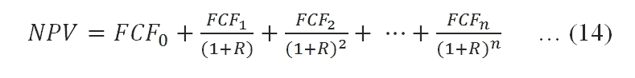
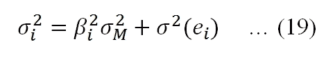

# 第十二章：蒙特卡洛模拟

蒙特卡洛模拟是金融领域中非常有用的工具。例如，因为我们可以通过从对数正态分布中抽取随机数来模拟股票价格，所以著名的**布莱克-斯科尔斯-梅顿期权**模型可以被复制。在第九章，*投资组合理论*中，我们学习到，通过向投资组合中添加更多股票，企业特定风险可以被减少或消除。通过模拟，我们可以更清晰地看到多样化效应，因为我们可以反复从 5000 只股票中随机选择 50 只股票。对于资本预算，我们可以模拟几十个具有不确定未来值的变量。对于这些情况，可以通过模拟生成许多可能的未来结果、事件以及各种类型的组合。在本章中，将涵盖以下主题：

+   从正态分布、均匀分布和泊松分布中生成随机数

+   使用蒙特卡洛模拟估算π值

+   使用对数正态分布模拟股票价格变动

+   构建高效投资组合与有效前沿

+   通过模拟复制布莱克-斯科尔斯-梅顿期权模型

+   定价一些复杂期权，例如带浮动行权价格的回顾期权

+   自助法（有/无放回）

+   长期预期回报预测

+   效率、准蒙特卡洛模拟与 Sobol 序列

# 蒙特卡洛模拟的重要性

**蒙特卡洛模拟**，或称模拟，在金融领域发挥着非常重要的作用，具有广泛的应用。假设我们打算估算一个项目的**净现值**（**NPV**）。未来存在许多不确定性，例如借款成本、最终产品价格、原材料等。对于少数几个变量，我们仍然能够轻松处理。然而，如果面对二十多个具有不确定未来值的变量，寻找解决方案就会成为一个难题。幸运的是，这时可以应用蒙特卡洛模拟。在第十章，*期权与期货*中，我们了解到，布莱克-斯科尔斯-梅顿期权模型背后的逻辑是股票回报的正态性假设。正因为如此，它们的封闭形式解可以通过模拟来复制。另一个例子是从 4500 只可用股票中随机选择 50 只。与传统期权（如布莱克-斯科尔斯-梅顿模型）不同，复杂期权没有封闭形式解。幸运的是，我们可以使用模拟来为其中一些期权定价。

# 从标准正态分布生成随机数

正态分布在金融中起着核心作用。一个主要原因是，许多金融理论（如期权理论及其相关应用）假设股票收益服从正态分布。第二个原因是，如果我们的计量经济学模型设计得当，那么模型中的误差项应该服从零均值的正态分布。生成标准正态分布中的 n 个随机数是一个常见任务。为此，我们有以下三行代码：

```py
import scipy as sp
x=sp.random.standard_normal(size=10)
print(x)
[-0.98350472  0.93094376 -0.81167564 -1.83015626 -0.13873015  0.33408835
  0.48867499 -0.17809823  2.1223147   0.06119195]
```

SciPy/NumPy 中的基本随机数是通过 `numpy.random` 函数中的梅森旋转算法（Mersenne Twister PRNG）生成的。`numpy.random` 中的分布随机数是用 Cython/Pyrex 编写的，运行速度非常快。读者不可能得到与此处相同的`10`个随机数。我们很快会解释如何生成相同的一组随机数。或者，我们可以使用以下代码：

```py
>>>import scipy as sp
>>>x=sp.random.normal(size=10)
```

这个程序等价于以下程序：

```py
>>>import scipy as sp 
>>>x=sp.random.normal(0,1,10)
```

第一个输入是均值，第二个输入是标准差，最后一个输入是随机数的个数，也就是我们期望数据集的大小。对比前两个程序，显然均值和标准差的默认设置是`0`和`1`。我们可以使用 `help()` 函数来查看这三个输入变量的名称。为了节省空间，这里仅显示前几行：

```py
>>>help(sp.random.normal) 
Help on built-in function normal:
normal(...) 
normal(loc=0.0, scale=1.0, size=None)
```

## 从正态分布中抽取随机样本

正态分布的概率密度函数最早由德·莫伊夫（De Moivre）推导出来，200 年后由高斯（Gauss）和拉普拉斯（Laplace）独立推导完成，通常称为钟形曲线，因为它的特征形状；参见下图：


标准正态分布的密度函数如下所示：


这里，*f(x)* 是标准正态分布的密度函数，*x* 是输入值，*e* 是指数函数，*π* 是 *3.1415926*。以下是生成上述钟形曲线的代码：

```py
import scipy as sp
import scipy.stats as stats
import matplotlib.pyplot as plt
x = sp.arange(-3,3,0.01)
y=stats.norm.pdf(x)
plt.plot(x,y)
plt.title("A standard normal distribution")
plt.xlabel('x')
plt.ylabel('y')
plt.show()
```

# 使用种子生成随机数

很多时候，用户希望能够反复生成相同的一组随机数。例如，当教授在讲解如何估计一组随机数的均值、标准差、偏度和峰度时，学生能够生成与教授完全相同的数值是非常有帮助的。另一个例子是，当我们在调试 Python 程序以模拟股票走势时，我们可能更希望得到相同的中间结果。对于这种情况，我们可以使用`scipy.random.seed()`函数，如下所示：

```py
>>>import scipy as sp 
>>>sp.random.seed(12345) 
>>>x=sp.random.normal(0,1,20) 
>>>print x[0:5] 
[-0.20470766 0.47894334 -0.51943872 -0.5557303 1.96578057] 
>>>
```

这里，`12345`是种子。种子的值并不重要，关键是相同的种子会产生相同的随机数值。更一般的正态分布公式如下：


这里，*f(x)*是正态分布的密度函数，*x*是输入值，*e*是指数函数，μ是均值，σ是标准差。

## 正态分布的随机数

要从正态分布中生成*n*个随机数，我们有以下代码：

```py
>>>impimport scipy as sp 
>>>sp.random.seed(12345) 
>>>mean=0.05
>>>std=0.1
>>>n=50
>>>x=sp.random.normal(mean,std,n) 
>>>print(x[0:5])
[ 0.02952923 0.09789433 -0.00194387 -0.00557303 0.24657806]
>>>
```

这个程序与前一个程序的区别在于，均值是`0.05`而不是`0`，而标准差是`0.1`而不是`1`。

## 正态分布的直方图

在分析数据集属性的过程中，直方图被广泛使用。为了为从具有指定均值和标准差的正态分布中抽取的一组随机值生成直方图，我们有以下代码：

```py
import scipy as sp 
import matplotlib.pyplot as plt 
sp.random.seed(12345) 
mean=0.1
std=0.2
n=1000
x=sp.random.normal(mean,std,n) 
plt.hist(x, 15, normed=True) 
plt.title("Histogram for random numbers drawn from a normal distribution")
plt.annotate("mean="+str(mean),xy=(0.6,1.5))
plt.annotate("std="+str(std),xy=(0.6,1.4))
plt.show()
```

结果图形如下所示：


## 对数正态分布的图形展示

当股票回报率遵循正态分布时，其价格应当遵循对数正态分布。对数正态分布的定义如下：


这里，*f(x;μ,σ)*是对数正态分布的密度，`ln()`是自然对数函数。以下代码展示了三个不同的对数正态分布，分别使用了三组参数，如(0, 0.25)、(0, 0.5)和(0, 1.0)。第一个参数是均值(μ)，第二个参数是标准差，见以下代码：

```py
import scipy as sp
import numpy as np
import matplotlib.pyplot as plt 
from scipy import sqrt,exp,log,pi
#
x=np.linspace(0.001,3,200)
mu=0 
sigma0=[0.25,0.5,1]
color=['blue','red','green'] 
target=[(1.2,1.3),(1.7,0.4),(0.18,0.7)]
start=[(1.8,1.4),(1.9,0.6),(0.18,1.6)]
#
for i in sp.arange(len(sigma0)):
    sigma=sigma0[i]
    y=1/(x*sigma*sqrt(2*pi))*exp(-(log(x)-mu)**2/(2*sigma*sigma))
    plt.annotate('mu='+str(mu)+', sigma='+str(sigma),xy=target[i],xytext=start[i],arrowprops=dict(facecolor=color[i],shrink=0.01),) 
    plt.plot(x,y,color[i])
    plt.title('Lognormal distribution') 
    plt.xlabel('x')
    plt.ylabel('lognormal density distribution') 
#
plt.show()
```

这里展示了图形。显然，与正态分布的密度不同，对数正态分布的密度函数是非对称的：


# 从均匀分布中生成随机数

当从*n*个可用的股票中随机选择 m 只股票时，我们可以从均匀分布中抽取一组随机数。为了从均匀分布中生成 10 个介于 1 和 100 之间的随机数，我们有以下代码。为了保证相同的数值集合，使用了`seed()`函数：

```py
>>>import scipy as sp 
>>>sp.random.seed(123345) 
>>>x=sp.random.uniform(low=1,high=100,size=10) 
```

同样，low、high 和 size 是三个输入名称。第一个指定最小值，第二个指定最大值，而 size 指定我们打算生成的随机数的数量。前五个数字如下所示：

```py
>>>print(x[0:5])
[ 30.32749021 20.58006409 2.43703988 76.15661293 75.06929084]
>>>
```

下一个程序随机掷一个骰子，结果为 1、2、3、4、5 或 6：

```py
import random
def rollDice():
    roll = random.randint(1,6)
    return roll
i =1
n=10
result=[]
random.seed(123)
while i<n:
    result.append(rollDice())
    i+=1
print(result)
[1, 1, 3, 1, 6, 1, 4, 2, 6]
```

在前一个程序中，应用了`random.seed()`函数。因此，任何读者都应得到最后一行显示的相同结果。

# 使用模拟估算π值

通过模拟估算π值是一个很好的练习。我们来画一个边长为 2R 的正方形。如果在正方形内部放置一个最大的圆形，那么其半径将是 R，表示为以下方程：


另一方面，正方形的面积是其边长的平方：


将*方程 (4)* 除以*方程 (5)*，我们得到以下结果：


重新组织后，我们得到以下方程：


换句话说，π的值将是*4* Scircle/Square*。在运行仿真时，我们从一个均匀分布中生成*n*对*x*和*y*，范围为 0 到 0.5。然后我们估算一个距离，该距离是*x*和*y*的平方和的平方根，即！使用仿真估算π值。

显然，当*d*小于 0.5（R 值）时，它会落入圆内。我们可以想象扔一个飞镖，飞镖落入圆内时，π的值将呈现以下形式：


下图展示了这些随机点在圆内和方形内的分布：


估算π值的 Python 程序如下所示：

```py
import scipy as sp 
n=100000
x=sp.random.uniform(low=0,high=1,size=n) 
y=sp.random.uniform(low=0,high=1,size=n) 
dist=sp.sqrt(x**2+y**2) 
in_circle=dist[dist<=1] 
our_pi=len(in_circle)*4./n
print ('pi=',our_pi)
print('error (%)=', (our_pi-sp.pi)/sp.pi)
```

每次运行前面的代码时，估算的π值会发生变化，如下所示，且其估算的准确性取决于试验次数，即*n*：

```py
('pi=', 3.14168)
('error (%)=', 2.7803225891524895e-05)
```

# 从泊松分布生成随机数

为了研究私人信息的影响，Easley、Kiefer、O'Hara 和 Paperman（1996 年）设计了一个**信息化交易概率**（**PIN**）度量方法，基于买方发起交易的每日数量和卖方发起交易的数量推导而来。他们模型的基本假设是，订单到达遵循泊松分布。以下代码展示了如何从泊松分布中生成*n*个随机数：

```py
import numpy as np
import scipy as sp 
import matplotlib.pyplot as plt 
x=sp.random.poisson(lam=1, size=100) 
#plt.plot(x,'o') 
a = 5\. # shape 
n = 1000 
s = np.random.power(a, n) 
count, bins, ignored = plt.hist(s, bins=30) 
x = np.linspace(0, 1, 100) 
y = a*x**(a-1.) 
normed_y = n*np.diff(bins)[0]*y 
plt.title("Poisson distribution")
plt.ylabel("y")
plt.xlabel("x")
plt.plot(x, normed_y) 
plt.show()
```

该图如下所示：


# 从 n 个给定股票中随机选择 m 只股票

基于前面的程序，我们可以轻松地从 500 只可用证券中选择 20 只股票。如果我们打算研究随机选择股票数量对投资组合波动性的影响，这将是一个重要的步骤，如下所示的代码所示：

```py
import scipy as sp 
n_stocks_available=500 
n_stocks=20 
sp.random.seed(123345) 
x=sp.random.uniform(low=1,high=n_stocks_available,size=n_stocks)
y=[] 
for i in range(n_stocks): 
    y.append(int(x[i])) 
#print y 
final=sp.unique(y) 
print(final) 
print(len(final))
[  8  31  61  99 124 148 155 172 185 205 226 275 301 334 356 360 374 379
 401 449]
20
```

在前面的程序中，我们从 500 个数字中选择 20 个数字。由于我们必须选择整数，可能最终会得到少于 20 个值，也就是说，一些整数在将实数转换为整数后可能会出现重复。一种解决方法是选择更多的数字，然后取前 20 个整数。另一种方法是使用`randrange()`和`randint()`函数。在下一个程序中，我们从所有可用的股票中选择*n*只股票。首先，我们从[`canisius.edu/~yany/python/yanMonthly.pkl`](http://canisius.edu/~yany/python/yanMonthly.pkl)下载数据集。假设数据集位于`C:/temp/`目录下：

```py
import scipy as sp
import numpy as np
import pandas as pd
#
n_stocks=10 
x=pd.read_pickle('c:/temp/yanMonthly.pkl') 
x2=sp.unique(np.array(x.index)) 
x3=x2[x2<'ZZZZ']                        # remove all indices 
sp.random.seed(1234567) 
nonStocks=['GOLDPRICE','HML','SMB','Mkt_Rf','Rf','Russ3000E_D','US_DEBT','Russ3000E_X','US_GDP2009dollar','US_GDP2013dollar'] 
x4=list(x3) 
#
for i in range(len(nonStocks)): 
    x4.remove(nonStocks[i]) 
#
k=sp.random.uniform(low=1,high=len(x4),size=n_stocks) 
y,s=[],[] 
for i in range(n_stocks): 
    index=int(k[i]) 
    y.append(index) 
    s.append(x4[index]) 
#
final=sp.unique(y) 
print(final) 
print(s)
```

在前面的程序中，我们移除了非股票数据项。这些非股票项是数据项的一部分。首先，我们加载一个名为`yanMonthly.pickle`的数据集，其中包括 200 多只股票、黄金价格、GDP、失业率、**小盘减大盘**（**SMB**）、**高估减低估**（**HML**）、无风险利率、价格率、市场超额收益率以及罗素指数。

pandas 的一种输出格式是`.pkl`和`.png`。由于`x.index`会呈现每个观测值的所有索引，我们需要使用`unique()`函数来选择所有唯一的 ID。因为我们只考虑股票来构建我们的投资组合，所以我们必须移除所有市场指数和其他非股票证券，如 HML 和`US_DEBT`。因为所有股票市场指数都以插入符号（^）开头，所以我们使用小于 ZZZZ 的方式来移除它们。对于其他在 A 和 Z 之间的 ID，我们必须逐个移除它们。为此，我们使用`.remove()`函数，该函数适用于列表变量。最终输出如下：


# 有/没有替换

假设我们拥有一只股票的历史数据，如价格和回报。显然，我们可以估计它们的均值、标准差和其他相关统计数据。那么，明年的预期年均值和风险是多少呢？最简单的，可能也是天真的方法是使用历史均值和标准差。更好的方法是构建年回报和风险的分布。这意味着我们必须找到一种方法，利用历史数据更有效地预测未来。在这种情况下，我们可以应用自助法（bootstrapping）方法。例如，对于一只股票，我们拥有过去 20 年的月度回报数据，即 240 个观测值。

为了估计明年 12 个月的回报，我们需要构建回报分布。首先，我们从历史回报集中随机选择 12 个回报（不放回），并估计它们的均值和标准差。我们重复这个过程 5000 次。最终输出将是我们的回报-标准差分布。基于这个分布，我们也可以估计其他属性。同样地，我们也可以在有替换的情况下进行。NumPy 中一个有用的函数是`numpy.random.permutation()`。假设我们有从 1 到 10 的 10 个数字（包含 1 和 10）。我们可以调用`numpy.random.permutation()`函数来重新洗牌，如下所示：

```py
import numpy as np 
x=range(1,11) 
print(x) 
for i in range(5):
    y=np.random.permutation(x) 
#
print(y)
```

这段代码的输出如下所示：


基于`numpy.random.permutation()`函数，我们可以定义一个函数，输入三个变量：数据、我们计划从数据中随机选择的观测值数量，以及是否选择有或没有替换的自助法，如下代码所示：

```py
import numpy as np 
def boots_f(data,n_obs,replacement=None):
    n=len(data) 
    if (n<n_obs):
        print "n is less than n_obs" 
    else: 
        if replacement==None:
            y=np.random.permutation(data) 
            return y[0:n_obs] 
        else:
            y=[] 
    #
    for i in range(n_obs): 
        k=np.random.permutation(data) 
        y.append(k[0]) 
    return y
```

在之前的程序中指定的约束条件是，给定的观察次数应大于我们计划选择的随机回报次数。这对于无替换的自助法是成立的。对于有替换的自助法，我们可以放宽这个约束；请参考相关习题。

# 年度回报分布

估算年化回报分布并将其表示为图形是一个很好的应用。为了使我们的练习更有意义，我们下载了微软的每日价格数据。然后，我们估算了其每日回报，并将其转换为年回报。基于这些年回报，我们通过应用带替换的自助法进行 5,000 次模拟，从而生成其分布，如下代码所示：

```py
import numpy as np 
import scipy as sp
import pandas as pd
import matplotlib.pyplot as plt
from matplotlib.finance import quotes_historical_yahoo_ochl as getData 
# Step 1: input area
ticker='MSFT'          # input value 1 
begdate=(1926,1,1)      # input value 2 
enddate=(2013,12,31)    # input value 3 
n_simulation=5000       # input value 4
# Step 2: retrieve price data and estimate log returns
x=getData(ticker,begdate,enddate,asobject=True)
logret = sp.log(x.aclose[1:]/x.aclose[:-1])
# Step 3: estimate annual returns 
date=[]
d0=x.date
for i in range(0,sp.size(logret)): 
    date.append(d0[i].strftime("%Y"))
y=pd.DataFrame(logret,date,columns=['logret']) 
ret_annual=sp.exp(y.groupby(y.index).sum())-1 
ret_annual.columns=['ret_annual']
n_obs=len(ret_annual)
# Step 4: estimate distribution with replacement 
sp.random.seed(123577) 
final=sp.zeros(n_obs,dtype=float)
for i in range(0,n_obs):
    x=sp.random.uniform(low=0,high=n_obs,size=n_obs) 
    y=[]
    for j in range(n_obs): 
        y.append(int(x[j]))
        z=np.array(ret_annual)[y] 
    final[i]=sp.mean(z)
# step 5: graph
plt.title('Mean return distribution: number of simulations ='+str(n_simulation))
plt.xlabel('Mean return')
plt.ylabel('Frequency')
mean_annual=round(np.mean(np.array(ret_annual)),4) 
plt.figtext(0.63,0.8,'mean annual='+str(mean_annual)) 
plt.hist(final, 50, normed=True)
plt.show()
```

相应的图表如下所示：


# 股票价格波动模拟

我们在前面的章节中提到，在金融领域，回报假定服从正态分布，而价格则服从对数正态分布。股票在时间 *t+1* 的价格是时间 *t* 股票价格、均值、标准差和时间间隔的函数，如下公式所示：


在此公式中，*St + 1* 是时间 *t+1* 的股票价格，*ˆ μ* 是预期股票回报，*t_* 是时间间隔（*T t n_=* ），*T* 是时间（以年为单位），*n* 是步数，*ε* 是均值为零的分布项，*σ* 是标的股票的波动率。通过简单的操作，方程（4）可以推导出以下我们将在程序中使用的方程：


在一个风险中性世界中，投资者不要求承担风险的补偿。换句话说，在这样的世界里，任何证券（投资）的预期回报率都是无风险利率。因此，在风险中性世界中，前面的方程式变为以下方程式：


如果你想了解更多关于风险中性概率的内容，请参考*《期权、期货及其他衍生品》第七版，约翰·赫尔，皮尔森，2009 年*。模拟股票价格运动（路径）的 Python 代码如下：

```py
import scipy as sp 
import matplotlib.pyplot as plt
# input area
stock_price_today = 9.15 # stock price at time zero 
T =1\.                    # maturity date (in years) 
n_steps=100\.             # number of steps 
mu =0.15                 # expected annual return 
sigma = 0.2              # annualized volatility
sp.random.seed(12345)    # fixed our seed 
n_simulation = 5         # number of simulations 
dt =T/n_steps 
#
S = sp.zeros([n_steps], dtype=float) 
x = range(0, int(n_steps), 1) 
for j in range(0, n_simulation): 
    S[0]= stock_price_today 
    for i in x[:-1]: 
        e=sp.random.normal() 
        S[i+1]=S[i]+S[i]*(mu-0.5*pow(sigma,2))*dt+sigma*S[i]*sp.sqrt(dt)*e; 
    plt.plot(x, S)
#
plt.figtext(0.2,0.8,'S0='+str(S[0])+',mu='+str(mu)+',sigma='+str(sigma)) 
plt.figtext(0.2,0.76,'T='+str(T)+', steps='+str(int(n_steps))) 
plt.title('Stock price (number of simulations = %d ' % n_simulation +')') 
plt.xlabel('Total number of steps ='+str(int(n_steps))) 
plt.ylabel('stock price') 
plt.show()
```

为了使我们的图表更具可读性，我们故意只选择了五次模拟。由于应用了`scipy.random.seed()`函数，你可以通过运行之前的代码来复制以下图表。图表如下所示：


# 期权到期日股票价格的图形展示

到目前为止，我们已经讨论了期权实际上是路径无关的，这意味着期权价格取决于终值。因此，在定价此类期权之前，我们需要知道终期股票价格。为了扩展之前的程序，我们有以下代码来估算一组给定值的终期股票价格：`S0`（初始股票价格），`n_simulation`（终期价格的数量），`T`（到期日，按年计算），`n_steps`（步骤数），`mu`（预期年股票回报率），`sigma`（波动率）：

```py
import scipy as sp 
import matplotlib.pyplot as plt
from scipy import zeros, sqrt, shape 
#input area
S0 = 9.15               # stock price at time zero 
T =1\.                   # years
n_steps=100\.            # number of steps 
mu =0.15                # expected annual return 
sigma = 0.2             # volatility (annual) 
sp.random.seed(12345)   # fix those random numbers 
n_simulation = 1000     # number of simulation 
dt =T/n_steps 
#
S = zeros([n_simulation], dtype=float) 
x = range(0, int(n_steps), 1) 
for j in range(0, n_simulation): 
    tt=S0 
    for i in x[:-1]: 
        e=sp.random.normal() 
        tt+=tt*(mu-0.5*pow(sigma,2))*dt+sigma*tt*sqrt(dt)*e; 
        S[j]=tt 
#
plt.title('Histogram of terminal price') 
plt.ylabel('Number of frequencies') 
plt.xlabel('Terminal price') 
plt.figtext(0.5,0.8,'S0='+str(S0)+',mu='+str(mu)+',sigma='+str(sigma)) 
plt.figtext(0.5,0.76,'T='+str(T)+', steps='+str(int(n_steps))) 
plt.figtext(0.5,0.72,'Number of terminal prices='+str(int(n_simulation))) 
plt.hist(S) 
plt.show()
```

我们模拟的终期价格的直方图如下所示：


正如我们在第九章中提到的，*投资组合理论*，为了生成两个相关的随机时间序列，需要进行两个步骤：生成两个零相关的随机时间序列*x1*和*x2*；然后应用以下公式：


这里，ρ是这两个时间序列之间的预定相关性。现在，`y1`和`y2`与预定的相关性相关。以下 Python 程序将实现上述方法：

```py
import scipy as sp
sp.random.seed(123)
n=1000
rho=0.3
x1=sp.random.normal(size=n)
x2=sp.random.normal(size=n)
y1=x1
y2=rho*x1+sp.sqrt(1-rho**2)*x2
print(sp.corrcoef(y1,y2))
[[ 1\.          0.28505213]
 [ 0.28505213  1\.        ]]
```

# 使用模拟复制布莱克-斯科尔斯-默顿看涨期权

在知道终期价格后，如果给定行权价格，我们可以估算看涨期权的支付。使用无风险利率作为贴现率计算的这些贴现支付的均值将是我们的看涨期权价格。以下代码帮助我们估算看涨期权价格：

```py
import scipy as sp 
from scipy import zeros, sqrt, shape 
#
S0 = 40\.              # stock price at time zero 
X= 40\.                # exercise price 
T =0.5                # years 
r =0.05               # risk-free rate 
sigma = 0.2           # annualized volatility 
n_steps=100          # number of steps 
#
sp.random.seed(12345) # fix those random numbers 
n_simulation = 5000   # number of simulation 
dt =T/n_steps 
call = sp.zeros([n_simulation], dtype=float) 
x = range(0, int(n_steps), 1) 
for j in range(0, n_simulation): 
    sT=S0 
    for i in x[:-1]: 
        e=sp.random.normal() 
        sT*=sp.exp((r-0.5*sigma*sigma)*dt+sigma*e*sqrt(dt)) 
        call[j]=max(sT-X,0) 
#
call_price=sp.mean(call)*sp.exp(-r*T) 
print('call price = ', round(call_price,3))
```

估算的看涨期权价格为$2.748。相同的逻辑适用于定价看跌期权。

## 异型期权 #1 – 使用蒙特卡洛模拟来定价平均值

到目前为止，我们在第九章中已经讨论了欧式期权和美式期权，*投资组合理论*。布莱克-斯科尔斯-默顿期权模型，也叫做普通期权。其特征之一是路径无关。另一方面，异型期权更复杂，因为它们可能有多个触发因素与其支付的确定相关。例如，一家炼油厂担心未来三个月内原油价格的波动。它们计划对潜在的原油价格跳跃进行对冲。公司可以购买看涨期权。然而，由于公司每天消耗大量的原油，自然更关心的是平均价格，而不仅仅是普通看涨期权所依赖的终期价格。对于这种情况，平均期权会更有效。平均期权是一种亚洲期权。对于平均期权，其支付是由一段预设时间内的基础价格的平均值决定的。平均值有两种类型：算术平均和几何平均。亚洲看涨期权（平均价格）的支付函数如下所示：


这里给出了亚洲看跌期权（平均价格）的支付函数：


亚洲期权是另类期权的一种基本形式。亚洲期权的另一个优势是，与欧洲和美式普通期权相比，它们的成本更低，因为平均值的波动要比终值的波动小得多。下面的 Python 程序是针对具有算术平均价格的亚洲期权的：

```py
import scipy as sp
s0=40\.                 # today stock price 
x=40\.                  # exercise price 
T=0.5                  # maturity in years 
r=0.05                 # risk-free rate 
sigma=0.2              # volatility (annualized) 
sp.random.seed(123)    # fix a seed here 
n_simulation=100       # number of simulations 
n_steps=100\.           # number of steps
#	
dt=T/n_steps 
call=sp.zeros([n_simulation], dtype=float) 
for j in range(0, n_simulation): 
    sT=s0 
    total=0 
    for i in range(0,int(n_steps)): 
         e=sp.random.normal()
         sT*=sp.exp((r-0.5*sigma*sigma)*dt+sigma*e*sp.sqrt(dt)) 
         total+=sT 
         price_average=total/n_steps 
    call[j]=max(price_average-x,0) 
#
call_price=sp.mean(call)*sp.exp(-r*T) 
print('call price based on average price = ', round(call_price,3))
('call price based on average price = ', 1.699)
```

根据上述结果，这个平均价格看涨期权的权利金为$1.70。

## 另类期权 #2 – 使用蒙特卡罗模拟法定价障碍期权

与黑-肖尔斯-莫顿期权模型中的看涨和看跌期权不同，后者是路径无关的，障碍期权则是路径相关的。障碍期权在许多方面与普通期权类似，但存在触发条件。`敲入`期权的生命周期从无价值开始，除非标的股票达到预定的敲入障碍。而相反，`敲出`障碍期权从一开始就有效，只有在价格突破敲出障碍时才会变得无效。此外，如果障碍期权到期时没有激活，它可能变得一文不值，或者可能支付一部分权利金作为现金返还。四种障碍期权如下所示：

+   **向上敲出期权**：在这种障碍期权中，价格从较低的障碍水平开始。如果它达到障碍，则被“敲出”。

+   **跌破障碍期权**：在这种障碍期权中，价格从一个较高的障碍开始。如果价格达到障碍，则被“敲出”。

+   **向上敲入期权**：在这种障碍期权中，价格从较低的障碍开始，必须达到该障碍才能激活。

+   **向下敲入期权**：在这种障碍期权中，价格从较高的障碍开始，必须达到该障碍才能激活。

接下来的 Python 程序用于一个向上敲出障碍期权，类型为欧洲看涨期权：

```py
import scipy as sp 
from scipy import log,exp,sqrt,stats 
#
def bsCall(S,X,T,r,sigma):
    d1=(log(S/X)+(r+sigma*sigma/2.)*T)/(sigma*sqrt(T)) 
    d2 = d1-sigma*sqrt(T)
    return S*stats.norm.cdf(d1)-X*exp(-r*T)*stats.norm.cdf(d2)
#
def up_and_out_call(s0,x,T,r,sigma,n_simulation,barrier):
    n_steps=100\. 
    dt=T/n_steps 
    total=0 
    for j in sp.arange(0, n_simulation): 
        sT=s0 
        out=False
        for i in range(0,int(n_steps)): 
            e=sp.random.normal() 
            sT*=sp.exp((r-0.5*sigma*sigma)*dt+sigma*e*sp.sqrt(dt)) 
            if sT>barrier: 
               out=True 
        if out==False: 
            total+=bsCall(s0,x,T,r,sigma) 
    return total/n_simulation
```

基本设计是我们模拟股票价格波动*n*次，例如模拟 100 次。对于每次模拟，我们有 100 个步骤。每当股票价格达到障碍时，支付将为零。否则，支付将为一种普通的欧洲看涨期权。最终价值将是所有未被敲出的看涨期权价格的总和，再除以模拟次数，如下所示的代码：

```py
s0=40\.              # today stock price 
x=40\.               # exercise price 
barrier=42          # barrier level 
T=0.5               # maturity in years 
r=0.05              # risk-free rate 
sigma=0.2           # volatility (annualized) 
n_simulation=100    # number of simulations 
sp.random.seed(12)  # fix a seed
#
result=up_and_out_call(s0,x,T,r,sigma,n_simulation,barrier) 
print('up-and-out-call = ', round(result,3))
('up-and-out-call = ', 0.937)
```

根据上述结果，我们知道这个向上敲出看涨期权的价格为$0.94。

# 喜欢使用模拟法计算 VaR 的两种方法

在上一章，第十一章，*风险价值*中，我们学习了可以使用两种方法来估算个股或投资组合的 VaR：这取决于正态性假设和基于历史回报排序的方法。蒙特卡罗模拟法能够将这两种方法结合起来，见下述代码：

```py
import numpy as np
import numpy as np
import scipy as sp
import pandas as pd
from scipy.stats import norm
#
position=1e6              # portfolio value
std=0.2                   # volatility
mean=0.08                 # mean return
confidence=0.99           # confidence level
nSimulations=50000        # number of simulations
# Method I
z=norm.ppf(1-confidence)
VaR=position*(mean+z*std)
print("Holding=",position, "VaR=", round(VaR,2), "tomorrow")
#
# Method II: Monte Carlo simulaiton 
sp.random.seed(12345) 
ret2=sp.random.normal(mean,std,nSimulations) 
ret3=np.sort(ret2) 
m=int(nSimulations*(1-confidence))
VaR2=position*(ret3[m])
print("Holding=",position, "VaR2=", round(VaR2,2), "tomorrow")
('Holding=', 1000000.0, 'VaR=', -385270.0, 'tomorrow')
('Holding=', 1000000.0, 'VaR2=', -386113.0, 'tomorrow')
```

蒙特卡洛模拟的结果为$386,113，而基于公式计算的结果为$385,270（假设投资组合当前价值为 100 万美元）。

# 使用蒙特卡洛模拟进行资本预算

正如我们在本章开头提到的，当变量的数量有许多不同的值时，我们可以使用蒙特卡洛模拟来进行资本预算。我们的目标是通过对所有未来自由现金流进行折现，来估算给定预算的净现值（NPV）：



这里，*NPV* 是某一提案的净现值，*FCF0* 将是零时点的自由现金流，*FCFt* 将是第 *I* 年末的自由现金流，*R* 是折现率。计算第 *t* 年末自由现金流的公式如下：


这里，*FCTt* 是第 *t* 年的自由现金流，*Dt* 是第 *t* 年的折旧，*CaptExt* 是第 *t* 年的净资本支出，*NWC* 是净营运资金，即流动资产减去流动负债，Δ表示变化。让我们看一个简单的例子。假设公司购买一项长期等效资产，总成本为 50 万美元，使用年限为五年：

| 项目 | 0 | 1 | 2 | 3 | 4 | 5 |
| --- | --- | --- | --- | --- | --- | --- |
| 价格 | 0 | 28 | 28 | 28 | 28 | 28 |
| 单位 | 0 | 100000 | 100000 | 100000 | 100000 | 100000 |
| 销售 | 0 | 2800000 | 2800000 | 2800000 | 2800000 | 2800000 |
| 销售成本 | 0 | 840000 | 840000 | 840000 | 840000 | 840000 |
| 其他成本 | 0 | 100000 | 100000 | 100000 | 100000 | 100000 |
| 销售、一般管理和行政费用 | 15000 | 15000 | 15000 | 15000 | 15000 | 15000 |
| 研发费用 | 20000 |   |   |   |   |   |
| 折旧 |   | 1000000 | 1000000 | 1000000 | 1000000 | 1000000 |
| 息税前利润（EBIT） | -35000 | 845000 | 845000 | 845000 | 845000 | 845000 |
| 税率 35% | -12250 | 295750 | 295750 | 295750 | 295750 | 295750 |
| 净收入（NI） | -47250 | 1140750 | 1140750 | 1140750 | 1140750 | 1140750 |
| 加上折旧 | -47250 | 2140750 | 2140750 | 2140750 | 2140750 | 2140750 |

> 表 12.1 每年的现金流

我们有以下等效代码：

```py
import scipy as sp
nYear=5                 # number of years
costEquipment=5e6       # 5 million 
n=nYear+1               # add year zero
price=28                # price of the product
units=100000            # estimate number of units sold 
otherCost=100000        # other costs
sellingCost=1500        # selling and administration cost 
R_and_D=200000          # Research and development
costRawMaterials=0.3    # percentage cost of raw materials
R=0.15                  # discount rate
tax=0.38                # corporate tax rate
#
sales=sp.ones(n)*price*units
sales[0]=0              # sales for 1st year is zero
cost1=costRawMaterials*sales
cost2=sp.ones(n)*otherCost
cost3=sp.ones(n)*sellingCost
cost4=sp.zeros(n)
cost4[0]=costEquipment
RD=sp.zeros(n)
RD[0]=R_and_D                     # assume R&D at time zero
D=sp.ones(n)*costEquipment/nYear  # straight line depreciation 
D[0]=0                            # no depreciation at time 0
EBIT=sales-cost1-cost2-cost3-cost4-RD-D
NI=EBIT*(1-tax)
FCF=NI+D                         # add back depreciation
npvProject=sp.npv(R,FCF)         # estimate NPV
print("NPV of project=",round(npvProject,0))
('NPV of project=', 1849477.0)
```

该项目的净现值（NPV）为$1,848,477。由于它是正值，如果我们的标准是基于 NPV 规则，那么我们应当接受该提案。现在，让我们加入一些不确定性。假设我们有三个不确定因素：价格、预计销售的产品单位数以及折现率，请参见以下代码：

```py
import scipy as sp
import matplotlib.pyplot as plt
nYear=5                 # number of years
costEquipment=5e6       # 5 million 
n=nYear+1               # add year zero
otherCost=100000        # other costs
sellingCost=1500        # selling and administration cost 
R_and_D=200000          # Research and development
costRawMaterials=0.3    # percentage cost of raw materials
tax=0.38                # corporate tax rate
thousand=1e3            # unit of thousand 
million=1e6             # unit of million 
#
# three uncertainties: price, unit and discount rate
nSimulation=100         # number of simulation
lowPrice=10             # low price
highPrice=30            # high price
lowUnit=50*thousand     # low units expected to sell 
highUnit=200*thousand   # high units expected to sell 
lowRate=0.15            # lower discount rate
highRate=0.25           # high discount rate 
#
n2=nSimulation
sp.random.seed(123)
price0=sp.random.uniform(low=lowPrice,high=highPrice,size=n2)
units0=sp.random.uniform(low=lowUnit,high=highUnit,size=n2)
R0=sp.random.uniform(lowRate,highRate,size=n2)
#
npv=[]
for i in sp.arange(nSimulation):
    units=sp.ones(n)*units0[i]
    price=price0[i]
    R=R0[i]
    sales=units*price
    sales[0]=0              # sales for 1st year is zero
    cost1=costRawMaterials*sales
    cost2=sp.ones(n)*otherCost
    cost3=sp.ones(n)*sellingCost
    cost4=sp.zeros(n)
    cost4[0]=costEquipment
    RD=sp.zeros(n)
    RD[0]=R_and_D                     # assume R&D at time zero
    D=sp.ones(n)*costEquipment/nYear  # straight line depreciation 
    D[0]=0                            # no depreciation at time 0
    EBIT=sales-cost1-cost2-cost3-cost4-RD-D
    NI=EBIT*(1-tax)
    FCF=NI+D                          # add back depreciation
    npvProject=sp.npv(R,FCF)/million  # estimate NPV
    npv.append(npvProject)
print("mean NPV of project=",round(sp.mean(npv),0))
print("min  NPV of project=",round(min(npv),0))
print("max  NPV of project=",round(max(npv),0))
plt.title("NPV of the project: 3 uncertainties")
plt.xlabel("NPV (in million)")
plt.hist(npv, 50, range=[-3, 6], facecolor='blue', align='mid')
plt.show()
```

NPV 分布的直方图如下所示：


# Python SimPy 模块

SimPy 是一个基于标准 Python 的基于过程的离散事件仿真框架。它的事件调度器基于 Python 的生成器，也可以用于异步网络通信或实现多智能体系统（包括模拟和真实通信）。SimPy 中的进程是简单的 Python 生成器函数，用于建模活跃的组件，如顾客、车辆或代理。SimPy 还提供了各种类型的共享资源，用于建模有限容量的拥堵点（如服务器、结账柜台和隧道）。从 3.1 版本开始，它还将提供监控功能，帮助收集有关资源和进程的统计数据：

```py
import simpy
def clock(env, name, tick):
     while True:
         print(name, env.now)
         yield env.timeout(tick)
#
env = simpy.Environment()
env.process(clock(env, 'fast', 0.5))
env.process(clock(env, 'slow', 1))
env.run(until=2)
('fast', 0)
('slow', 0)
('fast', 0.5)
('slow', 1)
('fast', 1.0)
('fast', 1.5)
```

# 两种社会政策的比较——基本收入与基本工作

这个例子借鉴自 Stucchhio（2013）。在过去几十年的发展中，各国的财富持续积累，尤其是在发达国家中尤为明显。支持公平的基本论点之一是每个公民都应拥有基本的生活标准。基于这一论点，许多国家为其公民提供了大量福利，例如普及医疗、免费教育等。一项政策建议是基本收入，即每个公民每年都会获得一笔无附加条件的基本收入。例如，如果我们假设基本时薪为 7.50 美元，每周工作 40 小时，每年工作 50 周，那么基本收入应该为 15,000 美元。Zhong（2017）报告称，印度正在考虑通过普遍基本收入计划来对抗贫困。显而易见的优势是行政成本会相当低。此外，腐败侵占政府为穷人发放的资金的可能性也较小。2017 年，芬兰启动了一个试点项目，加拿大和荷兰的地方当局也宣布了相关实验。2016 年，瑞士选民拒绝了一项最低收入提案。

一种替代方案是所谓的基本工作，在这种工作中，政府保证为无法找到体面工作的人提供一份低薪工作。这些方法各有优缺点。基于一组假设，如时薪、每周工作小时数、每年工作周数、人口、劳动力等，Stucchhio（2013）比较了这两种提案的成本和收益。存在若干不确定性；请参阅下表中的列表：

| 政策 | 命令 | 描述 |
| --- | --- | --- |
| **基本收入** | `unitAdmCost = norm(250,75)` | 每个人的行政费用 |
| `binom(nNonWorkers,tiny).rvs()` | 从二项分布中随机生成一个数字 |
| `nonWorkerMultiplier = uniform(-0.10, 0.15).rvs()` | 非劳动者的乘数 |
| **基本工作** | `unitAdmCost4disabled= norm(500,150).rvs()` | 每个残疾成年人所需的行政费用 |
| `unitAdmCost4worker = norm(5000, 1500).rvs()` | 每个工人的行政费用 |
| `nonWorkerMultiplier = uniform(-0.20, 0.25).rvs()` | 非工作者的乘数 |
| `hourlyProductivity = uniform(0.0,hourlyPay).rvs()` | 每小时生产力 |

> 表 12.2：两种提案的成本与收益

程序使用三种分布：正态分布、均匀分布和二项分布。`uniform(a,b).rvs()`命令生成一个在*a*和*b*之间均匀分布的随机数。`norm(mean,std).rvs()`命令生成一个来自具有指定均值和标准差的正态分布的随机数。`binom(n,k).rvs()`命令生成一个来自二项分布的随机数，输入值为`n`和`k`：

```py
import scipy as sp
import scipy.stats as stats
sp.random.seed(123)
u=stats.uniform(-1,1).rvs()
n=stats.norm(500,150).rvs()
b=stats.binom(10000,0.1).rvs()
x='random number from a '
print(x+"uniform distribution ",u)
print(x+" normal distribution ",n)
print(x+" binomial distribution ",b)
('random number from a uniform distribution ', -0.30353081440213836)
('random number from a  normal distribution ', 357.18541897080166)
('random number from a  binomial distribution', 1003)
```

Stucchhio 的 Python 程序，经过少许修改，显示如下：

```py
from pylab import *
from scipy.stats import *
#input area
million=1e6                        # unit of million 
billion=1e9                        # unit of billion 
trillion=1e12                      # unit of trillion 
tiny=1e-7                          # a small number 
hourlyPay = 7.5                    # hourly wage
workingHoursPerWeek=40             # working hour per week                                
workingWeeksPerYear=50             # working weeks per year
nAdult           = 227*million     # number of adult
laborForce       = 154*million     # labor force
disabledAdults   =  21*million     # disability 
nSimulations     = 1024*32         # number of simulations 
#
basicIncome = hourlyPay*workingHoursPerWeek*workingWeeksPerYear
# define a few function
def geniusEffect(nNonWorkers):
    nGenious = binom(nNonWorkers,tiny).rvs()
    return nGenious* billion
#
def costBasicIncome():
    salaryCost= nAdult * basicIncome
    unitAdmCost = norm(250,75)
    nonWorkerMultiplier = uniform(-0.10, 0.15).rvs()
    nonWorker0=nAdult-laborForce-disabledAdults
    nNonWorker = nonWorker0*(1+nonWorkerMultiplier)
    marginalWorkerHourlyProductivity = norm(10,1)
    admCost = nAdult * unitAdmCost.rvs()
    unitBenefitNonWorker=40*52*marginalWorkerHourlyProductivity.rvs()
    benefitNonWorkers = 1 * (nNonWorker*unitBenefitNonWorker)
    geniusBenefit=geniusEffect(nNonWorker)
    totalCost=salaryCost + admCost - benefitNonWorkers-geniusBenefit
    return totalCost
#
def costBasicJob():
    unitAdmCost4disabled= norm(500,150).rvs()
    unitAdmCost4worker = norm(5000, 1500).rvs()
    nonWorkerMultiplier = uniform(-0.20, 0.25).rvs()
    hourlyProductivity = uniform(0.0, hourlyPay).rvs()
    cost4disabled=disabledAdults * (basicIncome + unitAdmCost4disabled)
    nBasicWorkers=((nAdult-disabledAdults-laborForce)*(1+nonWorkerMultiplier))
    annualCost=workingHoursPerWeek*workingWeeksPerYear*hourlyProductivity
    cost4workers=nBasicWorkers * (basicIncome+unitAdmCost4worker-annualCost)
    return cost4disabled + cost4workers
#
N = nSimulations
costBI = zeros(shape=(N,),dtype=float)
costBJ = zeros(shape=(N,),dtype=float)
for k in range(N):
    costBI[k] = costBasicIncome()
    costBJ[k] = costBasicJob()
#
def myPlot(data,myTitle,key):
    subplot(key)
    width = 4e12
    height=50*N/1024
    title(myTitle)
    #xlabel("Cost (Trillion = 1e12)")
    hist(data, bins=50)
    axis([0,width,0,height])
#
myPlot(costBI,"Basic Income",211)
myPlot(costBJ,"Basic Job",212)
show()
```

根据这里展示的图表，他得出结论，基本工作提案的成本低于基本收入提案。为了节省篇幅，我们不再详细阐述该程序。更多详细解释及相关假设，请参阅 Stucchhio（2013）发布的博客：


# 通过模拟找到基于两只股票的有效前沿

以下程序旨在基于已知均值、标准差和相关性的两只股票生成有效前沿。我们只有六个输入值：两个均值，两个标准差，相关性（ρ）和模拟次数。为了生成相关的* y1 *和* y2 *时间序列，我们首先生成不相关的* x1 *和* x2 *序列。然后，我们应用以下公式：


另一个重要的问题是如何构造一个目标函数来最小化。我们的目标函数是投资组合的标准差，外加一个惩罚项，该惩罚项定义为与目标投资组合均值的绝对偏差的缩放。

换句话说，我们最小化投资组合的风险以及投资组合回报与目标回报之间的偏差，代码如下所示：

```py
import numpy as np 
import scipy as sp 
import pandas as pd
import matplotlib.pyplot as plt
from datetime import datetime as dt 
from scipy.optimize import minimize
#
# Step 1: input area
mean_0=(0.15,0.25)   # mean returns for 2 stocks
std_0= (0.10,0.20)   # standard deviations for 2 stocks 
corr_=0.2       # correlation between 2 stocks
nSimulations=1000    # number of simulations 
#
# Step 2: Generate two uncorrelated time series 
n_stock=len(mean_0)
n=nSimulations
sp.random.seed(12345) # to get the same random numbers 
x1=sp.random.normal(loc=mean_0[0],scale=std_0[0],size=n) 
x2=sp.random.normal(loc=mean_0[1],scale=std_0[1],size=n) 
if(any(x1)<=-1.0 or any(x2)<=-1.0):
    print ('Error: return is <=-100%')
#
# Step 3: Generate two correlated time series 
index_=pd.date_range(start=dt(2001,1,1),periods=n,freq='d') 
y1=pd.DataFrame(x1,index=index_) 
y2=pd.DataFrame(corr_*x1+sp.sqrt(1-corr_**2)*x2,index=index_)
#
# step 4: generate a return matrix called R 
R0=pd.merge(y1,y2,left_index=True,right_index=True) 
R=np.array(R0)
#
# Step 5: define a few functions 
def objFunction(W, R, target_ret):
    stock_mean=np.mean(R,axis=0) 
    port_mean=np.dot(W,stock_mean)            # portfolio mean
    cov=np.cov(R.T)                           # var-covar matrix 
    port_var=np.dot(np.dot(W,cov),W.T)        # portfolio variance 
    penalty = 2000*abs(port_mean-target_ret)  # penalty 4 deviation
    return np.sqrt(port_var) + penalty        # objective function
#
# Step 6: estimate optimal portfolio for a given return 
out_mean,out_std,out_weight=[],[],[] 
stockMean=np.mean(R,axis=0)
#
for r in np.linspace(np.min(stockMean),np.max(stockMean),num=100): 
    W = sp.ones([n_stock])/n_stock             # start equal w
    b_ = [(0,1) for i in range(n_stock)]       # bounds
    c_ = ({'type':'eq', 'fun': lambda W: sum(W)-1\. })# constraint 
    result=minimize(objFunction,W,(R,r),method='SLSQP',constraints=c_,bounds=b_)
    if not result.success:                     # handle error 
        raise BaseException(result.message)
    out_mean.append(round(r,4))                # decimal places
    std_=round(np.std(np.sum(R*result.x,axis=1)),6) 
    out_std.append(std_) 
    out_weight.append(result.x)
#
# Step 7: plot the efficient frontier
plt.title('Simulation for an Efficient Frontier from given 2 stocks') 
plt.xlabel('Standard Deviation of the 2-stock Portfolio (Risk)') 
plt.ylabel('Return of the 2-stock portfolio')
plt.figtext(0.2,0.80,' mean = '+str(stockMean)) 
plt.figtext(0.2,0.75,' std  ='+str(std_0)) 
plt.figtext(0.2,0.70,' correlation ='+str(corr_))
plt.plot(np.array(std_0),np.array(stockMean),'o',markersize=8) 
plt.plot(out_std,out_mean,'--',linewidth=3)
plt.show()
```

输出如下所示：


# 构建带有 n 只股票的有效前沿

当股票数量* n *增加时，每对股票之间的相关性会显著增加。对于* n *只股票，我们有 *n*(n-1)/2* 个相关性。例如，如果* n *是 10，则我们有 45 个相关性。由于这个原因，手动输入这些值并不是一个好主意。相反，我们通过从多个均匀分布中抽取随机数来生成均值、标准差和相关性。为了产生相关的回报，首先我们生成* n *个不相关的股票回报时间序列，然后应用 Cholesky 分解，具体如下：

```py
import numpy as np
import scipy as sp
import pandas as pd
import matplotlib.pyplot as plt
from datetime import datetime as dt
from scipy.optimize import minimize
#
# Step 1: input area
nStocks=20
sp.random.seed(1234)                        # produce the same random numbers 
n_corr=nStocks*(nStocks-1)/2                # number of correlation 
corr_0=sp.random.uniform(0.05,0.25,n_corr)  # generate correlations 
mean_0=sp.random.uniform(-0.1,0.25,nStocks) # means
std_0=sp.random.uniform(0.05,0.35,nStocks)  # standard deviation 
nSimulations=1000                           # number of simulations 
#
# Step 2: produce correlation matrix: Cholesky decomposition
corr_=sp.zeros((nStocks,nStocks))
for i in range(nStocks):
    for j in range(nStocks):
        if i==j:
            corr_[i,j]=1
        else:
            corr_[i,j]=corr_0[i+j]
U=np.linalg.cholesky(corr_)
#
# Step 3: Generate two uncorrelated time series 
R0=np.zeros((nSimulations,nStocks))
for i in range(nSimulations):
    for j in range(nStocks):
        R0[i,j]=sp.random.normal(loc=mean_0[j],scale=std_0[j],size=1)
if(R0.any()<=-1.0):
    print ('Error: return is <=-100%')
#
# Step 4: generate correlated return matrix: Cholesky     
R=np.dot(R0,U)
R=np.array(R)
#
# Step 5: define a few functions
def objFunction(W, R, target_ret): 
    stock_mean=np.mean(R,axis=0)  
    port_mean=np.dot(W,stock_mean)           # portfolio mean
    cov=np.cov(R.T)                          # var-covar matrix
    port_var=np.dot(np.dot(W,cov),W.T)       # portfolio variance
    penalty = 2000*abs(port_mean-target_ret) # penalty 4 deviation 
    return np.sqrt(port_var) + penalty       # objective function 
#
# Step 6: estimate optimal portfolo for a given return 
out_mean,out_std,out_weight=[],[],[] 
stockMean=np.mean(R,axis=0)    
#
for r in np.linspace(np.min(stockMean), np.max(stockMean), num=100):
    W = sp.ones([nStocks])/nStocks             # starting:equal w 
    b_ = [(0,1) for i in range(nStocks)]       # bounds
    c_ = ({'type':'eq', 'fun': lambda W: sum(W)-1\. })# constraint
    result=minimize(objFunction,W,(R,r),method='SLSQP',constraints=c_, bounds=b_)    
    if not result.success:                    # handle error
        raise BaseException(result.message) 
    out_mean.append(round(r,4))               # a few decimal places
    std_=round(np.std(np.sum(R*result.x,axis=1)),6)
    out_std.append(std_)
    out_weight.append(result.x) 
#
# Step 7: plot the efficient frontier
plt.title('Simulation for an Efficient Frontier: '+str(nStocks)+' stocks')
plt.xlabel('Standard Deviation of the Porfolio')
plt.ylabel('Return of the2-stock portfolio')
plt.plot(out_std,out_mean,'--',linewidth=3)
plt.show()
```

图表如下所示：


当 n 是一个很大的数字时，模拟一个 n 股票组合是困难的。原因在于生成方差-协方差矩阵非常耗时，请看这里的协方差（相关性）数量：


假设我们的投资组合中有 500 只股票。那么我们需要估算 124,750 对相关性。为了简化这个计算，我们可以应用资本资产定价模型（CAPM），见下式：


这里 *R*[*i,t*] 是股票 *i* 在时间 *t* 的收益，*α[*i*]* 和 *β[i]* 分别是股票 *i* 的截距和斜率，*R*[*M,t*] 是市场指数在时间 *t* 的收益，*e*[*i*], *t* 是时间 *t* 的误差项。由于单只股票的总风险包含两个成分：系统性风险和公司特定风险。因此，股票 *i* 的方差与市场指数的关系如下所示：



股票 *i* 和 *j* 之间的协方差如下所示：


因此，我们可以将估算从 124,750 减少到仅 1,000。首先估算 500 个 β 值。然后我们应用之前的公式来估算协方差。类似地，估算股票 *i* 和 *j* 之间的相关性的公式如下：


# 长期收益预测

许多研究人员和实践者认为，如果基于过去收益的算术平均数来进行长期收益预测，会导致过高的估计；而如果基于几何平均数，则会导致过低的估计。Jacquier、Kane 和 Marcus（2003）建议使用以下加权方案，利用 80 年的历史收益来预测未来 25 年的收益：


以下程序反映了上述方程：

```py
import numpy as np
import pandas as pd
from matplotlib.finance import quotes_historical_yahoo_ochl as getData 
#
# input area
ticker='IBM'           # input value 1 
begdate=(1926,1,1)     # input value 2 
enddate=(2013,12,31)   # input value 3 
n_forecast=25          # input value 4
#
def geomean_ret(returns): 
    product = 1
    for ret in returns: 
        product *= (1+ret)
    return product ** (1.0/len(returns))-1
#
x=getData(ticker,begdate,enddate,asobject=True, adjusted=True)
logret = np.log(x.aclose[1:]/x.aclose[:-1]) 
date=[]
d0=x.date
for i in range(0,np.size(logret)):
    date.append(d0[i].strftime("%Y"))
#
y=pd.DataFrame(logret,date,columns=['logret'],dtype=float)
ret_annual=np.exp(y.groupby(y.index).sum())-1 
ret_annual.columns=['ret_annual']
n_history=len(ret_annual) 
a_mean=np.mean(np.array(ret_annual))
g_mean=geomean_ret(np.array(ret_annual))
w=n_forecast/n_history
future_ret=w*g_mean+(1-w)*a_mean
print('Arithmetric mean=',round(a_mean,3), 'Geomean=',round(g_mean,3),'forecast=',future_ret)
```

输出结果如下所示：


# 效率、拟蒙特卡洛法和 Sobol 序列

当使用蒙特卡洛模拟来解决各种金融相关问题时，会生成一组随机数。当精度要求非常高时，我们必须生成大量的随机数。例如，在定价期权时，我们使用非常小的间隔或大量的步长来提高解决方案的精度。因此，蒙特卡洛模拟的效率在计算时间和成本方面至关重要。如果需要定价几千个期权，这一点尤其重要。一种提高效率的方法是应用更好的算法，即优化我们的代码。另一种方法是使用一些分布更均匀的特殊类型的随机数，这被称为准蒙特卡洛模拟。一个典型的例子是所谓的 Sobol 序列。Sobol 序列属于低差异序列，满足随机数的属性，但分布更加均匀：

```py
import numpy as np
import matplotlib.pyplot as plt
np.random.seed(12345)
n=200
a = np.random.uniform(size=(n*2))
plt.scatter(a[:n], a[n:])
plt.show()
```

相关图表显示在左侧面板：


另一方面，如果我们使用 Sobol 序列，这些随机数的分布会更加均匀；请参见前面的右侧面板。相关代码如下：

```py
import sobol_seq
import scipy as sp
import matplotlib.pyplot as plt
a=[]
n=100
for i in sp.arange(2*n):
     t=sobol_seq.i4_sobol(1,i)
     a.append(t)
print(a[0:10])
x=sp.random.permutation(a[:n])
y=sp.random.permutation(a[n:])
plt.scatter(x,y,edgecolors='r')
plt.show()
[[array([ 0.]), 1], [array([ 0.5]), 2], [array([ 0.75]), 3], [array([ 0.25]), 4], [array([ 0.375]), 5], [array([ 0.875]), 6], [array([ 0.625]), 7], [array([ 0.125]), 8], [array([ 0.1875]), 9], [array([ 0.6875]), 10]]
>>>
```

对于一个类似的例子，但使用更复杂的 Python 代码，请参见 [`betatim.github.io/posts/quasi-random-numbers/`](http://betatim.github.io/posts/quasi-random-numbers/).

## 附录 A – 数据案例#8 - 蒙特卡洛模拟与二十一点

二十一点是一种双人游戏，包括发牌员和玩家。这里，我们假设你是玩家。

规则#1：2 到 10 的牌按面值计分，而杰克、皇后和国王的点数为 10，A 的点数为 1 或 11（由玩家选择）。

术语：

+   **二十一点**：一张 A 牌加任何一张值 10 点的牌

+   **输**：玩家的赌注被发牌员收走

+   **胜**：玩家赢得与赌注相等的金额

+   **二十一点（自然牌）**：玩家赢得 1.5 倍赌注

+   **平局**：玩家保持赌注，既不赢也不输

+   **步骤 1**：发牌员抽两张牌，一张面朝上，而玩家抽两张牌（面朝上）

+   **步骤 2**：玩家可以抽第三张牌

+   **胜或负**：如果你的牌的点数少于 21 且大于发牌员的点数，你获胜。查看 [`www.pagat.com/banking/ blackjack.html`](http://www.pagat.com/banking/%20blackjack.html)

# 参考文献

请参考以下文章：

+   *布鲁诺，朱塞佩*，*蒙特卡洛模拟在定价欧洲和美式篮子* *期权中的应用*，*意大利银行*，[`www.r-project.org/conferences/ useR-2010/abstracts/Bruno.pdf`](https://www.r-project.org/conferences/%20useR-2010/abstracts/Bruno.pdf)

+   *Easley, D., Kiefer, N.M., O'Hara, M., Paperman, J.B., 1996*，*流动性、信息和不常交易的股票*，*《金融学杂志》51 卷，1405–1436*，[`www.defaultrisk.com/pa_liqty_03.htm`](http://www.defaultrisk.com/pa_liqty_03.htm)

+   *Jacquier, Eric, Alex Kane, and Alan J. Marcus, 2003*, *几何平均数与算术平均数：一种重新考虑*, [`www2.bc.edu/alan-marcus/papers/FAJ_2003.pdf`](https://www2.bc.edu/alan-marcus/papers/FAJ_2003.pdf)

+   *Stucchio, Chris, 2013, 使用 Python 和蒙特卡罗模拟模型构建基本收入*, [`www.chrisstucchio.com/blog/2013/basic_income_vs_basic_job.html`](https://www.chrisstucchio.com/blog/2013/basic_income_vs_basic_job.html)

+   *Zhong, Raymond, 2017, 印度考虑通过普遍基本收入来对抗贫困**, 《华尔街日报》*, [`blogs.wsj.com/indiarealtime/2017/01/31/india-considers-fighting-poverty-witha-universal-basic-income/`](http://blogs.wsj.com/indiarealtime/2017/01/31/india-considers-fighting-poverty-witha-universal-basic-income/)

# 练习

1.  [`finance.yahoo.com`](http://finance.yahoo.com)，下载一些公司（如 IBM、WMT 和 C（花旗集团））过去五年的价格数据。测试它们的每日回报是否符合正态分布。

1.  编写一个 Python 程序，使用`scipy.permutation()`函数，从过去五年的数据中随机选择 12 个月的回报，不放回。为了测试该程序，你可以使用花旗集团的数据，时间范围为 2012 年 1 月 2 日到 2016 年 12 月 31 日，数据来源于 Yahoo! Finance。

1.  编写一个 Python 程序，使用给定的*n*个回报进行自助法抽样。每次选择*m*个回报，其中*m>n*。

1.  为了将均匀分布的随机数转换为正态分布，我们有以下公式：

    根据公式，生成 5,000 个正态分布的随机数；估算它们的均值、标准差，并进行测试。

1.  假设当前股票价格为$10.25，过去五年的均值为$9.35，标准差为 4.24。编写一个 Python 程序，生成 1,000 个未来的股票价格。

1.  下载过去 10 年内 10 只股票的价格数据。构建一个等权重投资组合，并对该组合的每日回报进行 Shapiro-Wilk 检验：

    | 公司名称 | 股票代码 | 戴尔公司 | DELL |
    | --- | --- | --- | --- |
    | 国际商业机器公司 | IBM | 通用电气 | GE |
    | 微软 | MSFT | 谷歌 | GOOG |
    | Family Dollar Stores | FDO | Apple | AAPL |
    | Wal-Mart Stores | WMT | eBay | EBAY |
    | 麦当劳 | MCD |   |   |

1.  前往 Yahoo! Finance 查找今天的 IBM 股票价格，然后下载其历史价格信息，估算过去五年的均值和标准差。生成未来一年每日价格的预测。

1.  对于 20 个股票代码，下载并保存它们的每日价格为 20 个不同的 CSV 文件。编写一个 Python 程序，随机选择五只股票，估算它们的等权重投资组合回报和风险。

1.  重复前一个程序，但将其保存为一个文件，而不是 20 个单独的 CSV 文件。

    ### 提示

    生成一个额外的变量，称为 ticker。

1.  班级里有 30 名学生。编写一个程序，从中随机选择七个学生。

1.  测试提取`ffMonthly.pkl`、`ffDaily.pkl`或`ffMonthly.csv`、`ffDaily.csv`的时间差，并进行一些测试。

1.  通常我们观察到投资组合的波动率与投资组合中股票数量之间存在负相关关系。编写一个程序，显示投资组合方差与其中股票数量之间的关系。

1.  从标记为 1 到 10 的 10 个球中，抽取 1、2、3 和 4 的概率是多少？使用两种方法：a. 使用公式。b. 编写一个程序生成五个随机数。

1.  编写一个程序生成 176 百万组 Mega Millions 游戏的组合。赢得（1、2、3、4、5）和（1）的机会是多少？

1.  对于 Powerball 游戏，我们从 59 个标有 1 到 59 的白球中选择 5 个白球，并从 39 个标有 1 到 39 的红球中选择 1 个红球。编写一个程序随机选择这六个球。

1.  从 20 只股票中选择 7 只，选择前七只股票的概率是多少？使用模拟来证明你的结果。

# 总结

在本章中，我们讨论了几种类型的分布：正态分布、标准正态分布、对数正态分布和泊松分布。由于假设股票遵循对数正态分布且回报遵循正态分布是期权理论的基石，因此蒙特卡洛模拟被用于定价欧式期权。在某些情况下，亚洲期权可能在对冲方面更为有效。奇异期权比标准期权更为复杂，因为前者没有封闭解，而后者可以通过 Black-Scholes-Merton 期权模型定价。定价这些奇异期权的一种方法是使用蒙特卡洛模拟。我们还讨论了定价亚洲期权和回溯期权的 Python 程序。
