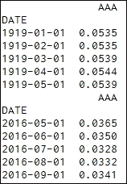
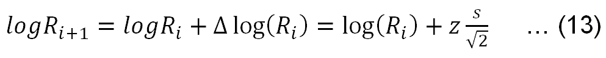

# 第十三章 信用风险分析

信用风险分析的目标是衡量潜在违约支付承诺金额的概率。信用评级反映了一个公司或债券的信用状况。公司的评级不同于其债券的评级，因为后者取决于债券的到期日以及某些特征，比如是否具有可赎回或可出售的选项。在第五章《债券与股票估值》中，我们学到了**到期收益率**（**YTM**），或简称收益率，它与信用质量相关。信用质量越低，要求的回报率越高，即收益率越高。在本章中，我们将讨论与信用风险相关的许多基本概念，如信用评级、信用利差、一年期信用评级迁移矩阵、违约概率、违约损失率、回收率和 KMV 模型。具体来说，将涵盖以下主题：

+   穆迪（Moody's）、标准普尔（Standard and Poor's）和惠誉（Fitch）的信用评级

+   信用利差、一年期和五年期迁移矩阵

+   利率的期限结构

+   未来利率的模拟

+   阿尔特曼 Z 评分预测企业破产

+   KMV 模型估算总资产及其波动性

+   违约概率和违约距离

+   信用违约掉期

# 信用风险分析简介

在本章中，我们将讨论与信用风险相关的基本概念，如信用评级、信用利差、一年期和五年期评级迁移矩阵、违约概率、回收率和违约损失率。信用利差，即债券收益率与基准收益率（无风险利率）之间的差异，反映了其信用风险或违约风险。例如，要估算一只 AA 评级债券在两年后的票息支付现值，折现率（收益率）将是无风险收益率（国债收益率）加上相应的利差。在分析公司或债券的信用状况时，有很多工具可供使用。第一个工具是信用评级，由信用评级机构提供，如穆迪（Moody's）或标普（Standard and Poor's）。其显著的优点是潜在用户可以花费更少的时间和精力评估公司或债券的信用风险。明显的缺点是，信用评级对于大多数用户而言是一个“黑匣子”。换句话说，用户无法复制一个信用评级。因此，想要揭示这种简单字母评级系统背后的逻辑（例如 AA 或 A1）是相当困难的。还有其他方式来评估公司（债券）的信用状况，例如利差，这是一个容易获取的数据。最量化的模型之一是所谓的 KMV 模型，它应用了我们在第十章中学到的期权理论来评估公司的信用风险。

# 信用评级

目前，美国有三大信用评级机构：穆迪、标准普尔和惠誉。它们的网站分别是 [`www.moodys.com/`](http://www.moodys.com/)，[`www.standardandpoors.com/en_US/web/guest/home`](http://www.standardandpoors.com/en_US/web/guest/home) 和 [`www.fitchratings.com/site/home`](https://www.fitchratings.com/site/home)。尽管它们的评级符号（字母）不同，但将一个评级机构的字母评级转换为另一个评级机构的评级是非常容易的。根据以下链接 [`www.quadcapital.com/Rating%20Agency%20Credit%20Ratings.pdf`](http://www.quadcapital.com/Rating%20Agency%20Credit%20Ratings.pdf)，生成了一个名为 `creditRatigs3.pkl` 的数据集，可以从作者的网站下载，网址是 http://canisius.edu/~yany/python/creditRatings3.pkl。假设它位于 `C:/temp/` 目录下。

以下代码显示其内容：

```py
import pandas as pd
x=pd.read_pickle("c:/temp/creditRatings3.pkl")
print(x)
       Moody's S&P Fitch  NAIC  InvestmentGrade
0      Aaa   AAA   AAA     1                1
1      Aa1   AA+   AA+     1                1
2      Aa2    AA    AA     1                1
3      Aa3   AA-   AA-     1                1
4       A1    A+    A+     1                1
5       A2     A     A     1                1
6       A3    A-    A-     1                1
7     Baa1  BBB+  BBB+     2                1
8     Baa2   BBB   BBB     2                1
9     Baa3  BBB-  BBB-     2                1
10     Ba1   BB+   BB+     3                0
11     Ba2    BB    BB     3                0
12     Ba3   BB-   BB-     3                0
13      B1    B+    B+     3                0
14      B2     B     B     3                0
15      B3    B-    B-     3                0
```

第一列是行号，没有特定含义。接下来的三列分别是 **穆迪**、**标准普尔** 和 **惠誉** 的信用评级。**NAIC** 代表 **国家保险委员会协会**。任何评级等于或高于 `BBB` 的被归类为投资级别，参见最后一列（变量），其值为 1 或 0。许多共同基金和养老金基金只能投资评级为投资级别的债券。

当一家公司今年获得 `Aaa` 评级时，它明年保持相同信用评级的概率是多少？根据以下表格，它明年保持 `Aaa` 评级的概率为 89%，穆迪（2007 年）。另一方面，降级的概率是 3%，即从 `Aaa` 降级为 `Aa1`。对于 B1 评级的债券，保持相同评级的概率是 65%。同时，它有 12% 的概率升级，9% 的概率降级。B1 评级债券的违约概率是 3%，请参见以下图表的最后一列，给出了这一年的信用评级迁移矩阵：


一年期信用评级迁移矩阵

注意以下缩写：

+   WR 表示穆迪已撤回其评级

+   DEF 表示违约概率

同样，`Aaa` 评级公司在明年变成 `Aa2` 评级的概率是 3%。主对角线上的数值（从西北到东南）是明年保持相同评级的概率。主对角线下方的数值（左下三角和底部三角）是降级的概率，而主对角线上方的数值（右上三角）是升级的概率。最后一列提供了各种评级的违约概率。例如，`Ba2` 评级的债券违约概率为 1%，而 `Caa3` 评级的债券违约概率为 25%。可以使用名为 `migration1year.pkl` 的 Python 数据集，代码如下所示。数据集可以通过以下网址获取：http://canisius.edu/~yany/python/migration1year.pkl：

```py
import pandas as pd
x=pd.read_pickle("c:/temp/migration1year.pkl")
print(x.head(1))
print(x.tail(1))
    Aaa   Aa1   Aa2  Aa3   A1   A2   A3  Baa1  Baa2  Baa3 ...   Ba3   B1  \
Aaa  0.89  0.03  0.03  0.0  0.0  0.0  0.0   0.0   0.0   0.0 ...   0.0  0.0   
      B2   B3  Caa1  Caa2  Caa3  Ca-C    WR  DEF  
Aaa  0.0  0.0   0.0   0.0   0.0   0.0  0.05  0.0  
[1 rows x 22 columns]
      Aaa  Aa1  Aa2  Aa3   A1   A2   A3  Baa1  Baa2  Baa3 ...   Ba3   B1   B2\
Ca-C  0.0  0.0  0.0  0.0  0.0  0.0  0.0   0.0   0.0   0.0 ...   0.0  0.0  0.0   
       B3  Caa1  Caa2  Caa3  Ca-C    WR  DEF  
Ca-C  0.0  0.01  0.01  0.01  0.35  0.13  0.2  
[1 rows x 22 columns]
```

以下表格展示了穆迪的 5 年过渡（迁移）矩阵。请注意**DEF**列（用于违约概率）：


穆迪的平均 5 年评级过渡矩阵（1920-1992）

来源：穆迪（2007 年）。

注意以下缩写：

+   WR 表示穆迪已撤销其评级

+   DEF 表示违约概率

一个名为`migration5year.pkl`的数据集已生成。该数据集可以在[`canisius.edu/~yany/python/migration5year.pkl`](http://canisius.edu/~yany/python/migration5year.pkl)下载。以下代码将打印其首尾行：

```py
import pandas as pd
x=pd.read_pickle("c:/temp/migration5year.pkl")
print(x.head(1))
print(x.tail(1))
    Aaa   Aa1  Aa2   Aa3    A1    A2   A3  Baa1  Baa2  Baa3 ...   Ba3   B1  \
Aaa  0.56  0.07  0.1  0.03  0.01  0.01  0.0   0.0   0.0   0.0 ...   0.0  0.0   
      B2   B3  Caa1  Caa2  Caa3  Ca-C   WR  DEF  
Aaa  0.0  0.0   0.0   0.0   0.0   0.0  0.2  0.0  
[1 rows x 22 columns]
      Aaa  Aa1  Aa2  Aa3   A1   A2   A3  Baa1  Baa2  Baa3  ...   Ba3   B1  \
Ca-C  0.0  0.0  0.0  0.0  0.0  0.0  0.0   0.0   0.0   0.0  ...   0.0  0.0   
        B2    B3  Caa1  Caa2  Caa3  Ca-C    WR   DEF  
Ca-C  0.02  0.02  0.01  0.01  0.01  0.04  0.43  0.46  
```

评级与违约呈负相关。评级越高，违约概率越低。以下是累积历史违约率（以百分比表示）：

|   | **违约率（%）** |
| --- | --- |
|   | **穆迪** | **标准普尔** |
| **评级类别** | **市政** | **公司** | **市政** | **公司** |
| `Aaa`/`AAA` | 0.00 | 0.52 | 0.00 | 0.60 |
| `Aa`/`AA` | 0.06 | 0.52 | 0.00 | 1.50 |
| `A`/`A` | 0.03 | 1.29 | 0.23 | 2.91 |
| `Baa`/`BBB` | 0.13 | 4.64 | 0.32 | 10.29 |
| `Ba`/`BB` | 2.65 | 19.12 | 1.74 | 29.93 |
| `B`/`B` | 11.86 | 43.34 | 8.48 | 53.72 |
| `Caa-C`/`CCC-C` | 16.58 | 69.18 | 44.81 | 69.19 |
|   |   |   |   |   |
| **平均值** |   |   |   |   |
| 投资级 | 0.07 | 2.09 | 0.20 | 4.14 |
| 非投资级 | 4.29 | 31.37 | 7.37 | 42.35 |
| 所有 | 0.10 | 9.70 | 0.29 | 12.98 |

> 表 13.3 信用评级与 DP（违约概率）之间的关系

数据来自于网站[`monevator.com/bond-default-rating-probability/`](http://monevator.com/bond-default-rating-probability/)。

例如，对于穆迪的`Aaa`级相关公司债券，其违约概率为 0.52%。标准普尔的对应违约概率为 0.60%。给定违约后的回收率是一个重要概念。债务的状态（资历）对回收率有重大影响。根据 Altman 和 Kishore（1997 年）的研究，我们得到了以下表格：

|   | **回收率（占面值的百分比）** |
| --- | --- |
| 高级担保债务 | 58% |
| 高级-非担保债务 | 48% |
| 高级-次级债务 | 35% |
| 次级债务 | 32% |
| 折扣债券和零息债券 | 21% |

> 表 13.4 基于资历的回收率

担保债务是指由资产担保支付的债务。高级债务和次级债务是指优先级结构。另一方面，不同的行业有不同的回收率，这是由于它们各自的行业特征，如固定长期资产和无形资产的比例：

| 行业 | 平均回收率 | 观察数量 |
| --- | --- | --- |
| 公用事业 | 70.5% | 56 |
| 化工、石油、橡胶和塑料制品 | 62.7% | 35 |
| 机械、仪器及相关产品 | 48.7% | 36 |
| 服务业 - 商业和个人 | 46.2% | 14 |
| 食品及相关产品 | 45.3% | 18 |
| 批发和零售贸易 | 44.0% | 12 |
| 多元化制造业 | 42.3% | 20 |
| 赌场、酒店和娱乐 | 40.2% | 21 |
| 建筑材料、金属和加工制品 | 38.8% | 68 |
| 运输和运输设备 | 38.4% | 52 |
| 通信、广播、电影制作 | 37.1% | 65 |
| 印刷和出版 | NA | NA |
| 金融机构 | 35.7% | 66 |
| 建筑和房地产 | 35.3% | 35 |
| 一般商品商店 | 33.2% | 89 |
| 矿业和石油钻探 | 33.0% | 45 |
| 纺织和服装产品 | 31.7% | 31 |
| 木材、纸张和皮革制品 | 29.8% | 11 |
| 住宿、医院和护理设施 | 26.5% | 22 |
| 总计 | 41.0% | 696 |

> 表 13.5 基于行业的回收率

请参见关于*回收率*的文章： [Recovery Rates PDF](http://www.riskworx.com/resources/Recovery%20Rates.pdf)。

前面的表格是根据回收率从高到低排序的。对于印刷和出版行业，根据原始数据没有相关数据。**违约损失**（**LGD**）等于 1 减去*回收率*：


在这里，我们通过一个假设性的例子来解释默认概率和回收率的使用，以计算债券的价格。假设一只一年期债券的面值为 100 美元，票息率为 6%，到期收益率（**YTM**）为 7%。我们有以下四种情况：

+   **情况 #1**：无违约。今天的价格将是其折现后的未来现金流，(6+100)/(1+0.07)。

+   **情况 #2**：确定违约并且无法回收任何金额。对于这种情况，其价格将为零。

+   **情况 #3**：如果发生违约，我们将无法收回任何金额。

+   **情况 #4**：如果发生违约，我们将收到某些金额。

以下表格总结了前面四种情况：

| # | 条件 | 违约概率 回收率 | 今天的价格 |
| --- | --- | --- | --- |
| 1 | 无违约 | P=0, 回收率（NA） | $99.07 |
| 2 | 100% 违约/无回收 | P=100%，回收率=0 | 0 |
| 3 | 如果违约，无法回收任何金额 | O<P<100%，回收率=0 | $99.07 *(1-P) |
| 4 | 如果违约，回收部分金额 | O<P<100%，回收率>0 | $99.07 *1-P*(1- ![信用评级)] |

> 表 13.6 不同违约概率和回收率的四种情况

债券的价格是其所有预期未来现金流现值的总和：


如果*P*是违约概率，我们有以下预期未来现金流：


折现所有未来现金流可以得出债券的价格：


假设根据穆迪评级，信用评级为 A。根据表 13.3，其违约率为 1.29%。进一步假设它是一家公用事业公司。因此，根据表 13.5，违约时的回收率为 70.5%。该债券的面值为 100 美元，要求回报率（YTM）为 5%。根据前述公式，若没有违约，一年期债券的价格将为 95.24 美元，即 100/(1+0.05)。我们这只债券的卖出价格，将在 1.29%的违约概率下为 94.88 美元，即*95.24*(1-0.0129*(1-0.705))*。

# 信用利差

信用利差（违约风险溢价）反映了其违约风险。例如，要估算一个 AA 评级债券在两年后的票息支付现值，折现率（收益率）将是无风险利率加上相应的利差。对于给定的信用评级，可以通过使用历史数据来找到其信用利差。以下是一个典型的表格，显示了信用风险溢价（利差）与信用评级之间的关系，请参见下表：

我们感谢亚当·阿莫多尔教授在其网站上提供的数据集，[`people.stern.nyu.edu/adamodar/pc/datasets/`](http://people.stern.nyu.edu/adamodar/pc/datasets/)：


基于信用评级的信用利差

除了前面表格中的最后一行外，利差的单位是基点，即百分之一的百分之一。例如，对于一个 A-（A 减）评级的五年期债券，其利差为 83.6 个基点。由于无风险利率为 1.582%（五年期国债利率），该债券的到期收益率（YTM）将是 2.418%，即 0.01582+83.6/100/100。根据前面的表格，我们生成了一个名为`bondSpread2014.p`的 Python 数据集，数据集可以在作者的网站上找到，[`canisius.edu/~yany/python/creditSpread2014.pkl`](http://canisius.edu/~yany/python/creditSpread2014.pkl)：

```py
import pandas as pd
x=pd.read_pickle("c:/temp/creditSpread2014.pkl")
print(x.head())
print(x.tail())
  Rating     1     2     3     5     7    10     30
0  Aaa/AAA   5.0   8.0  12.0  18.0  28.0  42.0   65.0
1  Aa1/AA+  11.2  20.0  27.0  36.6  45.2  56.8   81.8
2   Aa2/AA  16.4  32.8  42.6  54.8  62.8  71.2   97.8
3  Aa3/AA-  21.6  38.6  48.6  59.8  67.4  75.2   99.2
4    A1/A+  26.2  44.0  54.2  64.6  71.4  78.4  100.2
               Rating        1        2        3        5        7       10  \
13              B1/B+  383.600  409.600  431.400  455.600  477.600  500.800   
14               B2/B  455.800  481.600  505.200  531.000  555.400  581.400   
15              B3/B-  527.800  553.800  579.400  606.400  633.600  661.800   
16           Caa/CCC+  600.000  626.000  653.000  682.000  712.000  743.000   
17  US Treasury Yield    0.132    0.344    0.682    1.582    2.284    2.892
```

经过仔细研究前面的表格后，我们会发现两个单调趋势。首先，利差是信用质量的递减函数。信用评级越低，其利差越高。其次，对于相同的信用评级，其利差每年都会增加。例如，对于 AAA 评级的债券，一年期的利差为 5 个基点，而五年期的利差为 18 个基点。

# AAA 评级债券的收益率，Altman Z 分数

从前面的章节中，我们已经了解到，债券的收益率与同到期国债收益率之间的差额是违约风险溢价。为了获取`AAA`和`AA`债券的收益率，我们使用以下代码。穆迪的`Aaa`*公司债券收益率*可以在 https://fred.stlouisfed.org/series/AAA 下载。数据集可以在[`canisius.edu/~yany/python/moodyAAAyield.p`](http://canisius.edu/~yany/python/moodyAAAyield.p)下载。请注意，`.p`格式的`.png`文件适用于`.pickle`格式：

```py
import pandas as pd
x=pd.read_pickle("c:/temp/moodyAAAyield.p")
print(x.head())
print(x.tail())
```

输出如下所示：



请注意，名为`moodyAAAyield.p`的数据集中的第二列值是年化的。因此，如果我们想估计 1919 年 1 月的月度收益率（回报率），该收益率应为 *0.4458333%*，即 0.0535/12。

艾尔特曼 Z-score 广泛应用于金融领域的信用分析，用于预测公司破产的可能性。该分数是基于公司资产负债表和损益表的五个比率的加权平均值。对于上市公司，艾尔特曼（1968）提供了以下公式：


在此，*X1*、*X2*、*X3*、*X4* 和 *X5* 的定义列在下表中：

| 变量 | 定义 |
| --- | --- |
| *X1* | 息税前利润/总资产 |
| *X2* | 净销售额/总资产 |
| *X3* | 股本市场价值/总负债 |
| *X4* | 营运资金/总资产 |
| *X5* | 留存收益/总资产 |

> 表 13.8 Z-scores 估算中变量的定义

基于 Z-score 的范围，我们可以将上市公司分为以下四类。Eidlenan（1995）发现，Z-score 正确预测了 72%的破产事件，这些破产事件发生在事件发生前两年：

| Z-score 范围 | 描述 |
| --- | --- |
| > 3.0 | 安全 |
| 2.7 至 2.99 | 警戒状态 |
| 1.8 至 2.7 | 两年内破产的高概率 |
| < 1.80 | 财务困境的概率非常高 |

艾尔特曼 Z-score 属于信用评分（方法）类别。另一方面，更先进的模型，例如 KMV 模型，是基于现代金融理论，如期权理论。

# 使用 KMV 模型估算总资产的市场价值及其波动性

KMV 代表**Kealhofer**、**McQuown**和**Vasicek**，他们创办了一家公司，专注于衡量违约风险。KMV 方法是通过使用公司资产负债表信息和股市信息来估计公司违约概率的最重要方法之一。本节的目标是展示如何估算总资产（A）的市场价值及其相应的波动性（σA）。该结果将在本章后续使用。基本思路是将公司的股本视为一个看涨期权，其债务的账面价值视为行权价。让我们看一个最简单的例子。对于一家公司，如果其债务为$70，股本为$30，则总资产为$100，见下表：

| 100 | 70 |
| --- | --- |
| 30 |

假设总资产跳升至$110，债务保持不变。现在，股本的价值增加到$40。另一方面，如果资产下降到$90，股本将被评估为$20。由于股东是剩余索偿人，他们的价值满足以下表达式：


这里，*E* 是股权的价值，*A* 是总资产，*D* 是总债务水平。回顾欧式看涨期权，我们有以下支付函数：


这里，*ST* 是到期日的终端股票价格，*T* 是到期日，*K* 是执行价格，`max()` 是最大值函数。前两个公式之间的相似性表明，我们可以将股权视为以债务水平为执行价格的看涨期权。通过适当的符号表示，我们将得到以下公司的股权公式。KMV 模型在此定义：


另一方面，以下是股权与总资产波动率之间的关系。在下面的公式中，我们有：


由于 *d1* 和 *d2* 是通过前面公式定义的，我们有两个关于两个未知数 (*A* 和 ) 的方程；请参见以下公式。因此，我们可以使用试错法或联立方程法来求解这两个未知数。最终，我们要解以下两个关于 *A* 和  的方程：


我们应该注意前面公式中估算的 *A*（总资产市场价值），因为它不同于资产市场价值与债务账面价值的总和。

以下 Python 程序用于估算给定 *E*（股权）、*D*（债务）、*T*（到期日）、*r*（无风险利率）和股权波动率（sigmaE）下的总资产（A）及其波动率（sigmA）。该程序的基本逻辑是，我们输入大量的 (*A*, sigmaE) 配对数据，然后根据前面的公式估算 E 和 sigmaE。由于 E 和 sigmaE 都是已知的，我们可以估算出差异，*diff4E=estimatedE – knownE* 和 *diff4sigmaE = estimatedSigmaE – knownSigmaE*。最小化这两个绝对差值和的 (*A*, sigmaE) 配对即为我们的解：

```py
import scipy as sp
import pandas as pd
import scipy.stats as stats
from scipy import log,sqrt,exp
# input area 
D=30\.            # debt
E=70\.            # equity 
T=1\.             # maturity 
r=0.07           # risk-free
sigmaE=0.4       # volatility of equity 
#
# define a function to siplify notations later 
def N(x):
    return stats.norm.cdf(x)
#
def KMV_f(E,D,T,r,sigmaE):
    n=10000
    m=2000
    diffOld=1e6     # a very big number
    for i in sp.arange(1,10):
        for j in sp.arange(1,m):
            A=E+D/2+i*D/n
            sigmaA=0.05+j*(1.0-0.001)/m
            d1 = (log(A/D)+(r+sigmaA*sigmaA/2.)*T)/(sigmaA*sqrt(T))
            d2 = d1-sigmaA*sqrt(T)
            diff4A= (A*N(d1)-D*exp(-r*T)*N(d2)-E)/A  # scale by assets
            diff4sigmaE= A/E*N(d1)*sigmaA-sigmaE     # a small number already
            diffNew=abs(diff4A)+abs(diff4sigmaE)
            if diffNew<diffOld:
               diffOld=diffNew
               output=(round(A,2),round(sigmaA,4),round(diffNew,5))
    return output
#
print("KMV=", KMV_f(D,E,T,r,sigmaE))
print("KMV=", KMV_f(D=65e3,E=110e3,T=1,r=0.01,sigmaE=0.2))
```

输出如下所示：

```py
print("KMV=", KMV_f(D,E,T,r,sigmaE))
```


请注意结果，因为债务的账面价值与股本的市场价值总和为 175,000，而我们估算的结果为 142,559。由于公司的股本是看涨期权，我们可以使用 Black-Scholes-Merton 模型来再次验证我们的结果。

# 利率期限结构

在 第五章《债券与股票估值》中，我们讨论了利率期限结构的概念。利率期限结构被定义为无风险利率与时间之间的关系。无风险利率通常被定义为无违约的国债利率。从许多来源，我们可以获取当前的利率期限结构。例如，在 2017 年 2 月 27 日，我们可以从 http://finance.yahoo.com/bonds 获取以下信息：


绘制的利率期限结构可能更吸引眼球；请参见以下代码：

```py
import matplotlib.pyplot as plt
time=[3./12.,6./12.,2.,3.,5.,10.,30.]
rate=[0.45,0.61,1.12,1.37,1.78,2.29,2.93]
plt.title("Term Structure of Interest Rate ")
plt.xlabel("Time (in years) ")
plt.ylabel("Risk-free rate (%)")
plt.plot(time,rate)
plt.show()
```

相关的图表如下所示：


为了模拟未来的利率变化，我们可以应用所谓的 BIS 模型，使用以下公式。利率变化假设遵循正态分布；请参见以下公式：


这里，Δ表示变化，*R* 是利率，*s* 是利率的标准差。以下是等效的公式：


现在，我们有以下公式来调整我们的模拟：



这里，*z* 是反累积分布函数。以下代码显示了 `scipy.stat.norm.ppf()` 函数和给定 `RV` 在 `q` 时的百分位点函数（`cdf` 的反函数）：

```py
import scipy.stats as stats
#
cumulativeProb=0
print(stats.norm.ppf(cumulativeProb))
#
cumulativeProb=0.5
print(stats.norm.ppf(cumulativeProb))
#
cumulativeProb=0.99
print(stats.norm.ppf(cumulativeProb))
```

相关的三个输出如下所示：


相关的 Python 代码如下所示：

```py
import scipy as sp
import scipy.stats as stats
# input area
R0=0.09              # initial rate
s=0.182              # standard deviation of the risk-free rate
nSimulation=10       # number of simulations
sp.random.seed(123)  # fix the seed
#
num=sp.random.uniform(0,1,size=nSimulation)
z=stats.norm.ppf(num)
#
output=[]
def BIS_f(R,s,n):
    R=R0
    for i in sp.arange(0,n):
        deltaR=z[i]*s/sp.sqrt(2.)
        logR=sp.log(R)
        R=sp.exp(logR+deltaR)
        output.append(round(R,5))
    return output 
#
final=BIS_f(R0,s,nSimulation)
print(final)
[0.09616, 0.08942, 0.0812, 0.08256, 0.08897, 0.08678, 0.11326, 0.1205, 0.11976, 0.11561]
```

# 违约距离

**违约距离** (**DD**) 由以下公式定义；这里 *A* 是总资产的市场价值，

就 *违约点* 而言，目前没有理论指导如何选择理想的违约点。然而，我们可以将所有短期债务加上长期债务的一半作为我们的违约点。在得到资产的市场价值及其波动性后，我们可以使用前述公式来估算违约距离。A 和  来自 *公式（10）* 的输出。另一方面，如果违约点等于 E，我们将得到以下公式：


根据 Black-Scholes-Merton 看涨期权模型，*DD* 与 *DP（违约概率）* 之间的关系如下：


# 信用违约掉期

债权人可以购买一种所谓的**信用违约掉期**（**CDS**）来在违约发生时进行保护。CDS 的买方向卖方支付一系列款项，作为交换，如果贷款发生违约，买方将获得赔偿。我们来看一个简单的例子。一个基金刚刚购买了 1 亿美元的公司债券，债券的到期时间为 15 年。如果发行公司没有发生违约，养老基金将每年享受利息支付，并在到期时拿回 1 亿美元本金。为了保护他们的投资，基金与一家金融机构签订了一份 15 年的 CDS 合约。根据债券发行公司的信用状况，约定的利差为 80 个基点，按年支付。这意味着每年，养老基金（CDS 买方）将在未来 10 年里支付给金融机构（CDS 卖方）80,000 美元。如果发生信用事件，CDS 卖方将根据其损失向 CDS 买方进行赔偿。如果合同规定的是实物结算，CDS 买方可以将债券以 1 亿美元的价格卖给 CDS 卖方。如果合同规定的是现金结算，CDS 卖方将支付*Max（$100m-X,0）*给 CDS 买方，其中 X 是债券的市场价值。如果债券的市场价值为 7000 万美元，则 CDS 卖方将向 CDS 买方支付 3000 万美元。在上述案例中，利差或费用与发行公司违约的概率密切相关。违约概率越高，CDS 的利差越高。下表显示了这种关系：

| CDS | P | CDS | P | CDS | P | CDS | P | CDS | P | CDS | P | CDS | P |
| --- | --- | --- | --- | --- | --- | --- | --- | --- | --- | --- | --- | --- | --- |
| 0 | 0.0% | 100 | 7.8% | 200 | 13.9% | 300 | 19.6% | 500 | 30.2% | 500 | 30.2% | 1000 | 54.1% |
| 5 | 0.6% | 105 | 8.1% | 205 | 14.2% | 310 | 20.2% | 510 | 30.7% | 525 | 31.4% | 1025 | 55.2% |
| 10 | 1.1% | 110 | 8.4% | 210 | 14.5% | 320 | 20.7% | 520 | 31.2% | 550 | 32.7% | 1050 | 56.4% |
| 15 | 1.6% | 115 | 8.7% | 215 | 14.8% | 330 | 21.2% | 530 | 31.7% | 575 | 33.9% | 1075 | 57.5% |
| 20 | 2.0% | 120 | 9.1% | 220 | 15.1% | 340 | 21.8% | 540 | 32.2% | 600 | 35.2% | 1100 | 58.6% |
| 25 | 2.4% | 125 | 9.4% | 225 | 15.4% | 350 | 22.3% | 550 | 32.7% | 625 | 36.4% | 1125 | 59.7% |
| 30 | 2.8% | 130 | 9.7% | 230 | 15.7% | 360 | 22.9% | 560 | 33.2% | 650 | 37.6% | 1150 | 60.9% |
| 35 | 3.2% | 135 | 10.0% | 235 | 16.0% | 370 | 23.4% | 570 | 33.7% | 675 | 38.8% | 1175 | 62.0% |
| 40 | 3.6% | 140 | 10.3% | 240 | 16.2% | 380 | 23.9% | 580 | 34.2% | 700 | 40.0% | 1200 | 63.1% |
| 45 | 4.0% | 145 | 10.6% | 245 | 16.5% | 390 | 24.5% | 590 | 34.7% | 725 | 41.2% | 1225 | 64.2% |
| 50 | 4.3% | 150 | 10.9% | 250 | 16.8% | 400 | 25.0% | 600 | 35.2% | 750 | 42.4% | 1250 | 65.3% |
| 55 | 4.7% | 155 | 11.2% | 255 | 17.1% | 410 | 25.5% | 610 | 35.7% | 775 | 43.6% | 1275 | 66.4% |
| 60 | 5.0% | 160 | 11.5% | 260 | 17.4% | 420 | 26.0% | 620 | 36.1% | 800 | 44.8% | 1300 | 67.5% |
| 65 | 5.4% | 165 | 11.8% | 265 | 17.7% | 430 | 26.6% | 630 | 36.6% | 825 | 46.0% | 1325 | 68.6% |
| 70 | 5.7% | 170 | 12.1% | 270 | 17.9% | 440 | 27.1% | 640 | 37.1% | 850 | 47.2% | 1350 | 69.7% |
| 75 | 6.1% | 175 | 12.4% | 275 | 18.2% | 450 | 27.6% | 650 | 37.6% | 875 | 48.3% | 1375 | 70.7% |
| 80 | 6.4% | 180 | 12.7% | 280 | 18.5% | 460 | 28.1% | 660 | 38.1% | 900 | 49.5% | 1400 | 71.8% |
| 85 | 6.8% | 185 | 13.0% | 285 | 18.8% | 470 | 28.6% | 670 | 38.6% | 925 | 50.6% | 1425 | 72.9% |
| 90 | 7.1% | 190 | 13.3% | 290 | 19.1% | 480 | 29.1% | 680 | 39.1% | 950 | 51.8% | 1450 | 74.0% |
| 95 | 7.4% | 195 | 13.6% | 295 | 19.3% | 490 | 29.6% | 690 | 39.6% | 975 | 52.9% | 1475 | 75.1% |
| 100 | 7.8% | 200 | 13.9% | 300 | 19.6% | 500 | 30.2% | 700 | 40.0% | 1000 | 54.1% | 1500 | 76.1% |

> 表 13.9：违约概率和信用违约掉期。
> 
> 违约概率估计的五年累计违约概率（P）
> 
> 和五年期信用违约掉期（5Y CDS）

## 附录 A – 数据案例#8 - 使用 Z 分数预测破产

Altman 的 Z 分数用于预测公司破产的可能性。该分数是基于公司资产负债表和利润表的五个比率的加权平均值。对于上市公司，Altman（1968）提供了以下公式：


在这里，*X1*、*X2*、*X3*、*X4* 和 *X5* 的定义在下面的表格中给出：

| 变量 | 定义 |
| --- | --- |
| *X1* | 息税前利润/总资产 |
| *X2* | 净销售额/总资产 |
| *X3* | 市场价值的股本/总负债 |
| *X4* | 营运资金/总资产 |
| *X5* | 留存收益/总资产 |

根据 Z 分数的范围，我们可以将 20 家上市公司分为以下四类。Eidlenan（1995）发现，Z 分数能够准确预测事件发生前两年的 72%的破产情况：

| Z 分数范围 | 描述 |
| --- | --- |
| > 3.0 | 安全 |
| 2.7 到 2.99 | 处于警戒状态 |
| 1.8 到 2.7 | 两年内破产的可能性较大 |
| < 1.80 | 财务困境的可能性非常高 |

# 参考文献

+   *Altman, Edward I, 1968*，*财务比率、判别分析与公司破产预测*，*金融学杂志，189–209*，[`onlinelibrary.wiley.com/doi/10.1111/j.1540-6261.1968.tb00843.x/abstract`](http://onlinelibrary.wiley.com/doi/10.1111/j.1540-6261.1968.tb00843.x/abstract)

+   *Altman, E.I., Kishore, V., 1997*。*高收益债务市场的违约与回报*，*1991-1996，纽约大学 Salomon 中心特别报告*

+   *Altman, Edward I., 2000*，*公司财务困境预测*，[`pages.stern.nyu.edu/~ealtman/Zscores.pdf`](http://pages.stern.nyu.edu/~ealtman/Zscores.pdf)

+   *Eidleman, Gregory J.,1995,Z-Scores – A Guide to Failure Prediction, CPA Journal Online*，[`www.easycalculation.com/statistics/altman-z-score.php`](https://www.easycalculation.com/statistics/altman-z-score.php)

+   *Fitch*，[`www.fitchratings.com/site/home`](https://www.fitchratings.com/site/home)。

+   *KMV 模型*，[`github.com/ghlingjun/kmv-model`](https://github.com/ghlingjun/kmv-model)

+   *穆迪网站*，[`www.moodys.com/`](http://www.moodys.com/)

+   *穆迪，2007*，*介绍穆迪信用迁移模型*，[`www.moodysanalytics.com/~/media/Brochures/Credit-Research-Risk-Measurement/Quantative-Insight/Credit-Transition-Model/Introductory-Article-Credit-Transition-Model.pdf`](http://www.moodysanalytics.com/~/media/Brochures/Credit-Research-Risk-Measurement/Quantative-Insight/Credit-Transition-Model/Introductory-Article-Credit-Transition-Model.pdf)

+   *标准普尔*，[`www.standardandpoors.com/en_US/web/guest/home`](http://www.standardandpoors.com/en_US/web/guest/home)

# 练习

1.  美国有多少家信用评级机构？哪些是主要的机构？

1.  风险的定义有几种？信用风险和市场风险有什么区别？

1.  如何估计一个公司的总风险和市场风险？相关的数学公式是什么？

1.  如何估计一个公司的信用风险？相关的数学公式是什么？

1.  为什么债券的信用风险可能与其公司的信用评级不同？

1.  如果一切条件相等，哪种债券的风险更高，是长期债券还是短期债券？

1.  信用利差的定义是什么？为什么它有用？

1.  利率期限结构的用途是什么？

1.  对于 Altman 的 Z-score，*X1*、*X2*、*X3*、*X4*和*X5*的定义是什么？解释为什么 Z-score 越高，破产的概率越低：

1.  确定 Z-score 的一个问题并找到解决方法。

1.  一年期迁移（转移）矩阵是什么？

1.  信用评级与违约概率之间有什么关系？

1.  使用债券现值的概念，如何通过折现预计的未来现金流来推导方程式（1）？

1.  信用迁移矩阵中（从西北到东南）的主对角线上的值是什么？

1.  沃尔玛计划发行 5000 万美元（总面值）的公司债，每个债券的面值为 1000 美元。这些债券将在 10 年后到期，票面利率为 8%，每年支付一次利息。沃尔玛今天能筹集多少资金？如果沃尔玛将其信用评级提高一个等级，该公司能筹集多少额外资金？

1.  下表展示了评级、违约风险（利差）与时间之间的关系。编写一个 Python 程序来插值缺失的利差，如从第 11 年到第 29 年的 S。Python 数据集可以从[`canisius.edu/~yany/python/creditSpread2014.p`](http://canisius.edu/~yany/python/creditSpread2014.p)下载：

    ```py
    import matplotlib.pyplot as plt
    import pandas as pd
    x=pd.read_pickle("c:/temp/creditSpread2014.p")
    print(x.head())
        Rating     1     2     3     5     7    10     30
    0  Aaa/AAA   5.0   8.0  12.0  18.0  28.0  42.0   65.0
    1  Aa1/AA+  11.2  20.0  27.0  36.6  45.2  56.8   81.8
    2   Aa2/AA  16.4  32.8  42.6  54.8  62.8  71.2   97.8
    3  Aa3/AA-  21.6  38.6  48.6  59.8  67.4  75.2   99.2
    4    A1/A+  26.2  44.0  54.2  64.6  71.4  78.4  100.2
    ```

# 总结

在本章中，我们从信用风险分析的基础知识开始，涵盖信用评级、信用利差、1 年期评级迁移矩阵、**违约概率**（**PD**）、**违约损失**（**LGD**）、利率期限结构、Altman Z 分数、KMV 模型、违约概率、违约距离和信用违约掉期。在第十章，*期权与期货*，讨论了一些基本的香草期权，如 Black-Scholes-Merton 期权及其相关应用。此外，在第十二章，*蒙特卡洛模拟*中，解释了两种特殊期权。

在下一章中，我们将讨论更多的特殊期权，因为它们对于缓解许多类型的金融风险非常有用。
