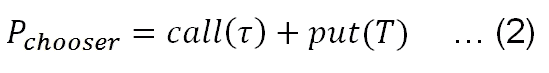

# 第十四章：另类期权

在第十章，*期权与期货*中，我们讨论了著名的布莱克-斯科尔斯-梅顿期权模型以及涉及各种类型期权、期货和基础证券的各种交易策略。布莱克-斯科尔斯-梅顿的闭式解法适用于只能在到期日行使的欧式期权。美式期权可以在到期日之前或当天行使。通常，这些类型的期权被称为香草期权。另一方面，也存在各种类型的另类期权，它们具有各种特性，使其比常见的香草期权更为复杂。

例如，如果期权买方可以在到期日前的多个时刻行使权利，那么它就是一个百慕大期权。在第十二章，*蒙特卡洛模拟*中，讨论了两种类型的另类期权。许多另类期权（衍生品）可能有多个触发条件与其支付有关。另类期权还可能包括非标准的基础证券或工具，专为特定客户或特定市场开发。另类期权通常是**场外交易**（**OTC**）。

在本章中，将涵盖以下主题：

+   欧式、美式和百慕大期权

+   简单选择期权

+   喊叫期权、彩虹期权和双向期权

+   平均价格期权

+   障碍期权——上涨入场期权和上涨退出期权

+   障碍期权——下跌入场期权和下跌退出期权

# 欧式、美式和百慕大期权

在第十章，*期权与期货*中，我们已经学习了对于欧式期权，期权买方只能在到期日行使权利，而对于美式期权买方，他们可以在到期日之前的任何时候行使权利。因此，美式期权的价值通常高于其对应的欧式期权。百慕大期权可以在几个预定的日期内行使一次或多次。因此，百慕大期权的价格应介于欧式期权和美式期权之间，前提是它们具有相同的特征，例如相同的到期日和相同的行权价格，见以下两个关于看涨期权的不等式：


这里是一个关于百慕大期权的例子。假设一家公司发行了一张 10 年期债券。七年后，公司可以在接下来的三年中的每年年底，选择赎回即退还债券。这种可赎回特性最终形成了一个嵌入式百慕大期权，其行使日期为第 8、9 和 10 年的 12 月。

首先，我们来看一下使用二项模型的美式看涨期权的 Python 程序：

```py
def binomialCallAmerican(s,x,T,r,sigma,n=100):
    from math import exp,sqrt
    import numpy as np
    deltaT = T /n
    u = exp(sigma * sqrt(deltaT)) 
    d = 1.0 / u
    a = exp(r * deltaT)
    p = (a - d) / (u - d)
    v = [[0.0 for j in np.arange(i + 1)] for i in np.arange(n + 1)] 
    for j in np.arange(n+1):
        v[n][j] = max(s * u**j * d**(n - j) - x, 0.0) 
    for i in np.arange(n-1, -1, -1):
        for j in np.arange(i + 1):
            v1=exp(-r*deltaT)*(p*v[i+1][j+1]+(1.0-p)*v[i+1][j]) 
            v2=max(v[i][j]-x,0)         # early exercise 
            v[i][j]=max(v1,v2)
    return v[0][0]
#
s=40\.        # stock price today 
x=40\.        # exercise price
T=6./12      # maturity date ii years
tao=1/12     # when to choose
r=0.05       # risk-free rate
sigma=0.2    # volatility 
n=1000       # number of steps
#
price=binomialCallAmerican(s,x,T,r,sigma,n)
print("American call =", price)
('American call =', 2.7549263174936502)
```

这个美式看涨期权的价格是$2.75。为了修改之前的程序以仅满足少数几个行权价格，以下两行是关键：

```py
            v2=max(v[i][j]-x,0)         # early exercise 
            v[i][j]=max(v1,v2)
```

这是一个适用于伯穆达看涨期权的 Python 程序。关键的不同点是名为 T2 的变量，它包含伯穆达期权可以行权的日期：

```py
def callBermudan(s,x,T,r,sigma,T2,n=100):
    from math import exp,sqrt
    import numpy as np
    n2=len(T2)
    deltaT = T /n
    u = exp(sigma * sqrt(deltaT)) 
    d = 1.0 / u
    a = exp(r * deltaT)
    p = (a - d) / (u - d)
    v =[[0.0 for j in np.arange(i + 1)] for i in np.arange(n + 1)] 
    for j in np.arange(n+1):
        v[n][j] = max(s * u**j * d**(n - j) - x, 0.0) 
    for i in np.arange(n-1, -1, -1):
        for j in np.arange(i + 1):
            v1=exp(-r*deltaT)*(p*v[i+1][j+1]+(1.0-p)*v[i+1][j])
            for k in np.arange(n2):
                if abs(j*deltaT-T2[k])<0.01:
                    v2=max(v[i][j]-x,0)  # potential early exercise 
                else: 
                    v2=0
            v[i][j]=max(v1,v2)
    return v[0][0]
#
s=40\.                 # stock price today 
x=40\.                 # exercise price
T=6./12               # maturity date ii years
r=0.05                # risk-free rate
sigma=0.2             # volatility 
n=1000                # number of steps
T2=(3./12.,4./12.)    # dates for possible early exercise 
#
price=callBermudan(s,x,T,r,sigma,T2,n)
print("Bermudan call =", price)
('Bermudan call =', 2.7549263174936502)
```

# 选择权选项

对于选择权期权，它允许期权买方在期权到期之前的某个预定时间点选择是欧洲看涨期权还是欧洲看跌期权。对于一个简单的选择权期权，标的的看涨和看跌期权具有相同的到期日和行权价格。我们来看两个极端案例。期权买方必须在今天做出决策，即当他们进行此类购买时。这个选择权期权的价格应当是看涨和看跌期权的最大值，因为期权买方没有更多的信息。第二个极端情况是投资者可以在到期日做出决策。由于看涨和看跌期权具有相同的行权价格，如果看涨期权处于价内，看跌期权应该是价外的，反之亦然。因此，选择权期权的价格应当是看涨期权和看跌期权的总和。这相当于购买一个看涨期权和一个看跌期权，行权价格和到期日相同。在第十章《期权与期货》中，我们知道这样的交易策略被称为跨式期权（Straddle）。通过这种交易策略，我们押注标的资产会偏离当前的价格，但我们不确定其方向。

首先，我们来看一个简单的选择权期权的定价公式，假设看涨和看跌期权有相同的到期日和行权价格，并假设到期之前没有股息。一个简单的选择权期权的定价公式如下：


这里，*Pchooer* 是选择权的价格或溢价，*call (T)* 是一个到期日为 T 的欧洲看涨期权，*put(τ)* 将很快定义。对于第一个 *call (T)* 期权，我们有以下定价公式：


这里，*call (T)* 是看涨期权的溢价，*S* 是今天的价格，*K* 是行权价格，*T* 是到期日（年），σ 是波动率，*N()* 是累积标准正态分布。实际上，这与 Black-Scholes-Merton 看涨期权模型完全相同。*put (τ)* 的公式如下：


同样，*put(τ)* 是看跌期权的溢价，*τ* 是选择权买方可以做出决策的时刻。为了使 *d1* 和 *d2* 与前面公式中的两个值有所区分，使用了  和  来代替 *d1* 和 *d2*。请注意，前面的公式与 Black-Scholes-Merton 看跌期权模型不同，因为我们有 T 和 τ 而不仅仅是 T。现在，我们来看一个极端情况：期权买方可以在到期日做出决策，即 *τ=T*。从前面的公式可以明显看出，选择权的价格将是这两种期权的总和：


以下 Python 程序是针对选择期权的。为了节省空间，我们可以将看涨期权和看跌期权合并，见下文 Python 代码。为此，我们有两个时间变量输入，分别是`T`和`tao`：

```py
from scipy import log,exp,sqrt,stats 
def callAndPut(S,X,T,r,sigma,tao,type='C'):
    d1=(log(S/X)+r*T+0.5*sigma*sigma*tao)/(sigma*sqrt(tao)) 
    d2 = d1-sigma*sqrt(tao)
    if type.upper()=='C':
        c=S*stats.norm.cdf(d1)-X*exp(-r*T)*stats.norm.cdf(d2)
        return c
    else:
        p=X*exp(-r*T)*stats.norm.cdf(-d2)-S*stats.norm.cdf(-d1)
        return p
#
def chooserOption(S,X,T,r,sigma,tao):
    call_T=callAndPut(S,X,T,r,sigma,T)
    put_tao=callAndPut(S,X,T,r,sigma,tao,type='P')
    return call_T- put_tao
#
s=40\.        # stock price today 
x=40\.        # exercise price
T=6./12      # maturity date ii years
tao=1./12\.   # when to choose
r=0.05       # risk-free rate
sigma=0.2    # volatility 
#
price=chooserOption(s,x,T,r,sigma,tao)
print("price of a chooser option=",price)
('price of a chooser option=', 2.2555170735574421)
```

这个选择权的价格是$2.26。

# 呼叫期权

呼叫期权是一种标准的欧洲期权，不同之处在于，期权买方可以在到期日前对期权卖方*呼叫*，将最小支付设置为*Sτ-X*，其中*Sτ*是买方呼叫时的股票价格，*X*是行权价。行权价的设定可以与现货价格的特定关系相关，例如设定为现货价的 3%或 5%（高于或低于）。Python 代码如下：

```py
def shoutCall(s,x,T,r,sigma,shout,n=100):
    from math import exp,sqrt
    import numpy as np
    deltaT = T /n
    u = exp(sigma * sqrt(deltaT)) 
    d = 1.0 / u
    a = exp(r * deltaT)
    p = (a - d) / (u - d)
    v =[[0.0 for j in np.arange(i + 1)] for i in np.arange(n + 1)] 
    for j in np.arange(n+1):
        v[n][j] = max(s * u**j * d**(n - j) - x, 0.0) 
    for i in np.arange(n-1, -1, -1):
        for j in np.arange(i + 1):
            v1=exp(-r*deltaT)*(p*v[i+1][j+1]+(1.0-p)*v[i+1][j]) 
            v2=max(v[i][j]-shout,0)   # shout  
            v[i][j]=max(v1,v2)
    return v[0][0]
#
s=40\.              # stock price today 
x=40\.              # exercise price
T=6./12            # maturity date ii years
tao=1/12           # when to choose
r=0.05             # risk-free rate
sigma=0.2          # volatility 
n=1000             # number of steps
shout=(1+0.03)*s   # shout out level 
#
price=shoutCall(s,x,T,r,sigma,shout,n)
print("Shout call =", price)
```

# 二元期权

二元期权，或资产无条件期权，是一种期权类型，其支付结构为：若期权到期时处于实值，则支付固定金额的补偿；若期权到期时处于虚值，则支付零。由于这个特性，我们可以应用蒙特卡洛模拟来找到解决方案。Python 代码如下：

```py
import random
import scipy as sp
#
def terminalStockPrice(S, T,r,sigma):
    tao=random.gauss(0,1.0)
    terminalPrice=S * sp.exp((r - 0.5 * sigma**2)*T+sigma*sp.sqrt(T)*tao)
    return terminalPrice
#
def binaryCallPayoff(x, sT,payoff):
    if sT >= x:
        return payoff
    else:
        return 0.0
# input area 
S = 40.0            # asset price
x = 40.0            # exercise price 
T = 0.5             # maturity in years 
r = 0.01            # risk-free rate 
sigma = 0.2         # vol of 20%
fixedPayoff = 10.0  # payoff 
nSimulations =10000 # number of simulations 
#
payoffs=0.0
for i in xrange(nSimulations):
    sT = terminalStockPrice(S, T,r,sigma) 
    payoffs += binaryCallPayoff(x, sT,fixedPayoff)
#
price = sp.exp(-r * T) * (payoffs / float(nSimulations))
print('Binary options call= %.8f' % price)
```

请注意，由于前述程序未固定种子，因此每次运行时，用户应获得不同的结果。

# 彩虹期权

许多金融问题可以总结为或与多项资产的最大值或最小值相关。我们来看一个简单的例子：基于两个资产最大值或最小值的期权。这种类型的期权称为彩虹期权。由于涉及两项资产，我们需要熟悉所谓的二元正态分布。以下代码展示了其图形。原始代码可以在[`scipython.com/blog/visualizing-the-bivariate-gaussian-distribution/`](http://scipython.com/blog/visualizing-the-bivariate-gaussian-distribution/)网站找到：

```py
import numpy as np
from matplotlib import cm
import matplotlib.pyplot as plt
from mpl_toolkits.mplot3d import Axes3D
#
# input area
n   = 60                      # number of intervals
x   = np.linspace(-3, 3, n)   # x dimension
y   = np.linspace(-3, 4, n)   # y dimension 
x,y = np.meshgrid(x, y)       # grid 
#
# Mean vector and covariance matrix
mu = np.array([0., 1.])
cov= np.array([[ 1\. , -0.5], [-0.5,  1.5]])
#
# combine x and y into a single 3-dimensional array
pos = np.empty(x.shape + (2,))
pos[:, :, 0] = x
pos[:, :, 1] = y
#
def multiNormal(pos, mu, cov):
    n = mu.shape[0]
    Sigma_det = np.linalg.det(cov)
    Sigma_inv = np.linalg.inv(cov)
    n2 = np.sqrt((2*np.pi)**n * Sigma_det)
    fac=np.einsum('...k,kl,...l->...', pos-mu, Sigma_inv, pos-mu)
    return np.exp(-fac/2)/n2
#
z    = multiNormal(pos, mu, cov)
fig  = plt.figure()
ax   = fig.gca(projection='3d')
ax.plot_surface(x, y, z, rstride=3, cstride=3,linewidth=1, antialiased=True,cmap=cm.viridis)
cset = ax.contourf(x, y, z, zdir='z', offset=-0.15, cmap=cm.viridis)
ax.set_zlim(-0.15,0.2)
ax.set_zticks(np.linspace(0,0.2,5))
ax.view_init(27, -21)
plt.title("Bivariate normal distribtuion")
plt.ylabel("y values ")
plt.xlabel("x values")
plt.show()
```

图形如下：


假设这两项资产的收益率遵循具有相关系数ρ的二元正态分布。为了简化我们的估算，我们假设在到期日前没有分红。对于基于两个资产最小值的看涨期权，其支付为：


这里，是股票 1（2）的终值股价，T 是到期日（以年为单位）。基于两项资产最小值的看涨期权定价公式如下：


这里，S1（S2）是股票 1（2）的当前股价，N2(a,b,ρ)是具有上限 a 和 b、资产间相关系数ρ的二元正态分布，*K*是行权价。*d11*、*d12*、*d21*、*d22*、*ρ1*和*ρ2*的参数在此定义：


首先，我们应学习这里描述的二元累积正态分布`N2_f(d1,d2,rho)`：

```py
def N2_f(d1,d2,rho):
    """cumulative bivariate standard normal distribution 
       d1: the first value
       d2: the second value
       rho: correlation

       Example1:
               print(N2_f(0,0,1.)) => 0.5
       Example2:
               print(N2_f(0,0,0)  => 0.25
     """
    import statsmodels.sandbox.distributions.extras as extras
    muStandardNormal=0.0    # mean of a standard normal distribution 
    varStandardNormal=1.0   # variance of standard normal distribution 
    upper=([d1,d2])         # upper bound for two values
    v=varStandardNormal     # simplify our notations
    mu=muStandardNormal     # simplify our notations
    covM=([v,rho],[rho,v])
    return extras.mvnormcdf(upper,mu,covM)
#
```

让我们看一些特殊情况。从单变量标准正态分布中，我们知道当输入值为`0`时，我们期望累积标准正态分布为`0.5`，因为基础正态分布是对称的。当两个时间序列完全正相关时，累积标准正态分布也应该为`0.5`，请参见前面的结果。另一方面，如果两个时间序列不相关，当输入都为零时，它们的累积标准正态分布期望为重叠，即，*0.5 * 0.5 = 0.25*。这一点通过调用之前的`N2_f()`函数得到验证。对于这一类期权，相关的 Python 程序如下：

```py
from math import exp,sqrt,log
import statsmodels.sandbox.distributions.extras as extras
#
def dOne(s,k,r,sigma,T):
    #print(s,k,r,sigma,T)
    a=log(s/k)+(r-0.5*sigma**2)*T
    b=(sigma*sqrt(T))
    return a/b
#
def sigmaA_f(sigma1,sigma2,rho):
    return sqrt(sigma1**2-2*rho*sigma1*sigma2+sigma2**2)
#
def dTwo(d1,sigma,T):
    return d1+sigma*sqrt(T)
#
def rhoTwo(sigma1,sigma2,sigmaA,rho):
    return (rho*sigma2-sigma1)/sigmaA
#
def N2_f(d1,d2,rho):
    import statsmodels.sandbox.distributions.extras as extras
    muStandardNormal=0.0    # mean of a standard normal distribution 
    varStandardNormal=1.0   # variance of standard normal distribution 
    upper=([d1,d2])         # upper bound for two values
    v=varStandardNormal     # simplify our notations
    mu=muStandardNormal     # simplify our notations
    covM=([v,rho],[rho,v])
    return extras.mvnormcdf(upper,mu,covM)
#
def dOneTwo(s1,s2,sigmaA,T):
    a=log(s2/s1)-0.5*sigmaA**2*T
    b=sigmaA*sqrt(T)
    return a/b
#
def rainbowCallOnMinimum(s1,s2,k,T,r,sigma1,sigma2,rho):
    d1=dOne(s1,k,r,sigma1,T)
    d2=dOne(s2,k,r,sigma2,T)
    d11=dTwo(d1,sigma1,T)
    d22=dTwo(d2,sigma2,T)
    sigmaA=sigmaA_f(sigma1,sigma2,rho)
    rho1=rhoTwo(sigma1,sigma2,sigmaA,rho)
    rho2=rhoTwo(sigma2,sigma1,sigmaA,rho)
    d12=dOneTwo(s1,s2,sigmaA,T)
    d21=dOneTwo(s2,s1,sigmaA,T)
    #
    part1=s1*N2_f(d11,d12,rho1)
    part2=s2*N2_f(d21,d22,rho2)
    part3=k*exp(-r*T)*N2_f(d1,d2,rho)
    return part1 + part2 - part3
#
s1=100.
s2=95.
k=102.0
T=8./12.
r=0.08
rho=0.75
sigma1=0.15
sigma2=0.20
price=rainbowCallOnMinimum(s1,s2,k,T,r,sigma1,sigma2,rho)
print("price of call based on the minimum of 2 assets=",price)
('price of call based on the minimum of 2 assets=', 3.747423936156629)
```

另一种定价各种类型彩虹期权的方法是使用蒙特卡洛模拟。如我们在第十二章中提到的，*蒙特卡洛模拟*，我们可以生成两个相关的随机数时间序列。这个过程分为两步：生成两个零相关的随机时间序列*x1*和*x2*；然后应用以下公式：


在这里，ρ是这两个时间序列之间的预定相关性。现在，*y1*和*y2*具有预定的相关性。以下 Python 程序将实现上述方法：

```py
import scipy as sp
sp.random.seed(123)
n=1000
rho=0.3
x1=sp.random.normal(size=n)
x2=sp.random.normal(size=n)
y1=x1
y2=rho*x1+sp.sqrt(1-rho**2)*x2
print(sp.corrcoef(y1,y2))
[[ 1\.          0.28505213]
 [ 0.28505213  1\.        ]]
```

接下来，我们应用我们在第十二章中所学的同样技术，*蒙特卡洛模拟*，来定价两个资产最小值的彩虹期权看涨：

```py
import scipy as sp 
from scipy import zeros, sqrt, shape 
#
sp.random.seed(123)  # fix our random numbers
s1=100\.              # stock price 1 
s2=95\.               # stock price 2
k=102.0              # exercise price
T=8./12\.             # maturity in years
r=0.08               # risk-free rate
rho=0.75             # correlation between 2
sigma1=0.15          # volatility for stock 1
sigma2=0.20          # volatility for stock 1
nSteps=100\.          # number of steps 
nSimulation=1000     # number of simulations 
#
# step 1: generate correlated random number
dt =T/nSteps 
call = sp.zeros([nSimulation], dtype=float) 
x = range(0, int(nSteps), 1) 
#
# step 2: call call prices 
for j in range(0, nSimulation): 
    x1=sp.random.normal(size=nSimulation)
    x2=sp.random.normal(size=nSimulation)
    y1=x1
    y2=rho*x1+sp.sqrt(1-rho**2)*x2
    sT1=s1
    sT2=s2 
    for i in x[:-1]: 
        e1=y1[i]
        e2=y2[i]
        sT1*=sp.exp((r-0.5*sigma1**2)*dt+sigma1*e1*sqrt(dt)) 
        sT2*=sp.exp((r-0.5*sigma2**2)*dt+sigma2*e2*sqrt(dt)) 
        minOf2=min(sT1,sT2)
        call[j]=max(minOf2-k,0) 
#
# Step 3: summation and discount back 
call=sp.mean(call)*sp.exp(-r*T) 
print('Rainbow call on minimum of 2 assets = ', round(call,3))
('Rainbow call on minimum of 2 assets = ', 4.127)
```

如果我们增加更多的资产，获得封闭式解将变得更加困难。这里我们展示如何使用蒙特卡洛模拟来定价基于最大终端股价的彩虹看涨期权。基本逻辑相当简单：生成三个终端股价，然后应用以下公式计算看涨期权收益：


最终价格将是折现收益的平均值。关键是如何生成一组三个相关的随机数。这里，我们应用了著名的乔尔斯基分解。假设我们有一个相关矩阵叫做*C*，一个使得的乔尔斯基分解矩阵*L*。进一步假设无关的回报矩阵叫做*U*。现在，相关回报矩阵*R = UL*。以下是对应的 Python 代码：

```py
import numpy as np
# input area
nSimulation=5000              # number of simulations
c=np.array([[1.0, 0.5, 0.3],  # correlation matrix
            [0.5, 1.0, 0.4],
            [0.3, 0.4, 1.0]])
np.random.seed(123)           # fix random numbers 
#
# generate uncorrelated random numbers
x=np.random.normal(size=3*nSimulation)
U=np.reshape(x,(nSimulation,3))
#
# Cholesky decomposition 
L=np.linalg.cholesky(c)
# generate correlated random numbers
r=np.dot(U,L)
#check the correlation matrix
print(np.corrcoef(r.T))
[[ 1\.          0.51826188  0.2760649 ]
 [ 0.51826188  1\.          0.35452286]
 [ 0.2760649   0.35452286  1\.        ]]
```

# 定价平均期权

在第十二章，*蒙特卡罗模拟*中，我们讨论了两种奇异期权。为了方便起见，我们也将它们包括在这一章中。因此，读者可能会看到一些重复的内容。欧洲期权和美式期权是路径无关的期权。这意味着期权的支付仅取决于终端股票价格和执行价格。路径相关期权的一个相关问题是到期日的市场操控。另一个问题是，一些投资者或对冲者可能更关注平均价格而非终端价格。

例如，一家炼油厂担心其主要原料——石油的价格波动，尤其是在接下来的三个月内。他们计划对冲原油价格的潜在跳动。该公司可能会购买看涨期权。然而，由于公司每天消耗大量的原油，它显然更关心的是平均价格，而不是仅仅依赖于普通看涨期权的终端价格。在这种情况下，平均期权会更加有效。平均期权是一种亚洲期权。对于平均期权，其支付取决于某一预定时间段内的基础资产价格的平均值。平均数有两种类型：算术平均数和几何平均数。以下给出了亚洲看涨期权（平均价格）的支付函数：


这里给出了亚洲看跌期权（平均价格）的支付函数：


亚洲期权是奇异期权的一种基本形式。亚洲期权的另一个优点是，相比于欧洲和美式的普通期权，它们的成本更低，因为平均价格的波动会比终端价格的小得多。以下 Python 程序适用于一个具有算术平均价格的亚洲期权：

```py
import scipy as sp 
s0=30\.                 # today stock price 
x=32\.                  # exercise price 
T=3.0/12\.              # maturity in years 
r=0.025                # risk-free rate 
sigma=0.18             # volatility (annualized) 
sp.random.seed(123)    # fix a seed here 
n_simulation=1000      # number of simulations 
n_steps=500\.           # number of steps
#
dt=T/n_steps 
call=sp.zeros([n_simulation], dtype=float) 
for j in range(0, n_simulation): 
    sT=s0 
    total=0 
    for i in range(0,int(n_steps)): 
         e=sp.random.normal()
         sT*=sp.exp((r-0.5*sigma*sigma)*dt+sigma*e*sp.sqrt(dt)) 
         total+=sT 
         price_average=total/n_steps 
    call[j]=max(price_average-x,0) 
#
call_price=sp.mean(call)*sp.exp(-r*T) 
print('call price based on average price = ', round(call_price,3))
('call price based on average price = ', 0.12)
```

# 定价障碍期权

不同于 Black-Scholes-Merton 期权模型中的看涨和看跌期权，这些期权是路径无关的，障碍期权是路径相关的。障碍期权与普通期权在许多方面相似，唯一的区别是存在一个触发条件。*敲入*期权在基础资产触及预定的敲入障碍之前是无效的。相反，*敲出*障碍期权在其生命周期一开始是有效的，只有当价格突破敲出障碍价时，它才变得无效。此外，如果障碍期权到期时未激活，它可能一文不值，或者会按溢价的一定比例支付现金回扣。四种类型的障碍期权如下：

+   **上涨敲出**：在这种障碍期权中，价格从障碍下方开始。如果价格触及障碍，则会被敲出。

+   **下跌敲出**：在这种障碍期权中，价格从障碍上方开始。如果价格触及障碍，则会被敲出。

+   **敲入上涨**：在这种障碍期权中，价格从障碍下方开始，必须触及障碍才能激活。

+   **下行入场**：在这种障碍期权中，价格始于一个障碍点，并且必须达到该障碍点才能被激活。

以下 Python 程序适用于一个带有欧洲看涨期权的上行出场障碍期权：

```py
import scipy as sp 
from scipy import log,exp,sqrt,stats 
#
def bsCall(S,X,T,r,sigma):
    d1=(log(S/X)+(r+sigma*sigma/2.)*T)/(sigma*sqrt(T)) 
    d2 = d1-sigma*sqrt(T)
    return S*stats.norm.cdf(d1)-X*exp(-r*T)*stats.norm.cdf(d2)
#
def up_and_out_call(s0,x,T,r,sigma,n_simulation,barrier):
    n_steps=100\. 
    dt=T/n_steps 
    total=0 
    for j in sp.arange(0, n_simulation): 
        sT=s0 
        out=False
        for i in range(0,int(n_steps)): 
            e=sp.random.normal() 
            sT*=sp.exp((r-0.5*sigma*sigma)*dt+sigma*e*sp.sqrt(dt)) 
            if sT>barrier: 
               out=True 
        if out==False: 
            total+=bsCall(s0,x,T,r,sigma) 
    return total/n_simulation 
#
```

基本设计是模拟股票运动 n 次，例如 100 次。对于每次模拟，我们有 100 步。每当股票价格达到障碍点时，收益为零。否则，收益将是一个普通的欧洲看涨期权。最终的值将是所有未被打击的看涨期权价格的总和，再除以模拟次数，如下代码所示：

```py
s0=30\.              # today stock price 
x=30\.               # exercise price 
barrier=32          # barrier level 
T=6./12\.            # maturity in years 
r=0.05              # risk-free rate 
sigma=0.2           # volatility (annualized) 
n_simulation=100    # number of simulations 
sp.random.seed(12)  # fix a seed
#
result=up_and_out_call(s0,x,T,r,sigma,n_simulation,barrier) 
print('up-and-out-call = ', round(result,3))
('up-and-out-call = ', 0.93)
```

下述是下行入场看跌期权的 Python 代码：

```py
def down_and_in_put(s0,x,T,r,sigma,n_simulation,barrier): 
    n_steps=100.
    dt=T/n_steps 
    total=0
    for j in range(0, n_simulation): 
        sT=s0
        in_=False
        for i in range(0,int(n_steps)): 
            e=sp.random.normal()
            sT*=sp.exp((r-0.5*sigma*sigma)*dt+sigma*e*sp.sqrt(dt)) 
            if sT<barrier:
                in_=True
            #print 'sT=',sT
            #print 'j=',j ,'out=',out if in_==True:
            total+=p4f.bs_put(s0,x,T,r,sigma) 
    return total/n_simulation
#
```

# 进出障碍平价

如果我们购买一个上行出场的欧洲看涨期权和一个上行入场的欧洲看涨期权，则应满足以下平价关系：


逻辑非常简单——如果股票价格触及障碍点，则第一个看涨期权失效，第二个看涨期权被激活。如果股票价格从未触及障碍点，第一个看涨期权保持有效，而第二个则永远不会被激活。无论哪种情况，其中一个期权是有效的。以下 Python 程序演示了这种情境：

```py
def upCall(s,x,T,r,sigma,nSimulation,barrier):
    import scipy as sp
    import p4f 
    n_steps=100
    dt=T/n_steps 
    inTotal=0 
    outTotal=0
    for j in range(0, nSimulation): 
        sT=s
        inStatus=False 
        outStatus=True
        for i in range(0,int(n_steps)):
            e=sp.random.normal()
            sT*=sp.exp((r-0.5*sigma*sigma)*dt+sigma*e*sp.sqrt(dt)) 
            if sT>barrier:
                outStatus=False 
                inStatus=True
        if outStatus==True:
            outTotal+=p4f.bs_call(s,x,T,r,sigma) 
        else:
            inTotal+=p4f.bs_call(s,x,T,r,sigma) 
    return outTotal/nSimulation, inTotal/nSimulation
#
```

我们输入一组值来测试一个上行出场看涨期权与一个上行入场看涨期权的总和是否与一个普通看涨期权相同：

```py
import p4f
s=40\.                 # today stock price 
x=40\.                 # exercise price 
barrier=42.0          # barrier level 
T=0.5                 # maturity in years 
r=0.05                # risk-free rate 
sigma=0.2             # volatility (annualized) 
nSimulation=500       # number of simulations 
#
upOutCall,upInCall=upCall(s,x,T,r,sigma,nSimulation,barrier) 
print 'upOutCall=', round(upOutCall,2),'upInCall=',round(upInCall,2) 
print 'Black-Scholes call', round(p4f.bs_call(s,x,T,r,sigma),2)
```

相关的输出如下所示：

```py
upOutCall= 0.75 upInCall= 2.01
Black-Scholes call 2.76
```

# 上行出场与上行入场平价图

使用蒙特卡罗模拟来呈现这种平价是一个不错的主意。以下代码旨在实现这一点。为了让我们的模拟更清晰，我们故意选择了仅进行五次模拟：

```py
import p4f
import scipy as sp
import matplotlib.pyplot as plt
#
s =9.25              # stock price at time zero
x =9.10              # exercise price
barrier=10.5         # barrier
T =0.5               # maturity date (in years)
n_steps=30           # number of steps
r =0.05              # expected annual return
sigma = 0.2          # volatility (annualized) 
sp.random.seed(125)  # seed()
n_simulation = 5     # number of simulations 
#
dt =T/n_steps
S = sp.zeros([n_steps], dtype=float) 
time_= range(0, int(n_steps), 1) 
c=p4f.bs_call(s,x,T,r,sigma) 
sp.random.seed(124)
outTotal, inTotal= 0.,0\. 
n_out,n_in=0,0

for j in range(0, n_simulation):
    S[0]= s
    inStatus=False
    outStatus=True
    for i in time_[:-1]:
        e=sp.random.normal()
        S[i+1]=S[i]*sp.exp((r-0.5*pow(sigma,2))*dt+sigma*sp.sqrt(dt)*e) 
        if S[i+1]>barrier:
            outStatus=False 
            inStatus=True
    plt.plot(time_, S) 
    if outStatus==True:
        outTotal+=c;n_out+=1 
    else:
        inTotal+=c;n_in+=1 
        S=sp.zeros(int(n_steps))+barrier 
        plt.plot(time_,S,'.-') 
        upOutCall=round(outTotal/n_simulation,3) 
        upInCall=round(inTotal/n_simulation,3) 
        plt.figtext(0.15,0.8,'S='+str(s)+',X='+str(x))
        plt.figtext(0.15,0.76,'T='+str(T)+',r='+str(r)+',sigma=='+str(sigma)) 
        plt.figtext(0.15,0.6,'barrier='+str(barrier))
        plt.figtext(0.40,0.86, 'call price  ='+str(round(c,3)))
        plt.figtext(0.40,0.83,'up_and_out_call ='+str(upOutCall)+' (='+str(n_out)+'/'+str(n_simulation)+'*'+str(round(c,3))+')') 
        plt.figtext(0.40,0.80,'up_and_in_call ='+str(upInCall)+' (='+str(n_in)+'/'+ str(n_simulation)+'*'+str(round(c,3))+')')
#
plt.title('Up-and-out and up-and-in parity (# of simulations = %d ' % n_simulation +')')
plt.xlabel('Total number of steps ='+str(int(n_steps))) 
plt.ylabel('stock price')
plt.show()
```

对应的图形如下所示。请注意，在前面的程序中，由于使用了种子，若使用相同的种子，不同的用户应该得到相同的图形：


# 使用浮动行权价定价回望期权

回望期权取决于标的资产所经历的路径（历史）。因此，它们也被称为路径依赖的奇异期权。其中一种被称为浮动行权价。当行使价格为期权生命周期内达到的最低价格时，给定的看涨期权的收益函数如下所示：


这是该回望期权的 Python 代码：

```py
plt.show()
def lookback_min_price_as_strike(s,T,r,sigma,n_simulation): 
    n_steps=100
    dt=T/n_steps
    total=0
    for j in range(n_simulation): 
        min_price=100000\.  # a very big number 
        sT=s
        for i in range(int(n_steps)): 
            e=sp.random.normal()
            sT*=sp.exp((r-0.5*sigma*sigma)*dt+sigma*e*sp.sqrt(dt)) 
            if sT<min_price:
                min_price=sT
                #print 'j=',j,'i=',i,'total=',total 
                total+=p4f.bs_call(s,min_price,T,r,sigma)
    return total/n_simulation
```

记住，前面的函数需要两个模块。因此，我们必须在调用函数之前导入这些模块，如下代码所示：

```py
import scipy as sp
import p4f
s=40\.             # today stock price
T=0.5               # maturity in years
r=0.05              # risk-free rate
sigma=0.2           # volatility (annualized)
n_simulation=1000   # number of simulations
result=lookback_min_price_as_strike(s,T,r,sigma,n_simulation)
print('lookback min price as strike = ', round(result,3))
```

一次运行的结果如下所示：

```py
('lookback min price as strike = ', 53.31)t(
```

## 附录 A – 数据案例 7 – 对冲原油

假设一家炼油厂每天使用原油。因此，他们必须面对主要原材料——原油价格的不确定性风险。保护底线和确保生产顺利之间存在权衡；公司研究所有可能的结果，例如是否对冲油价，或者完全不对冲。假设总的年原油消耗量为 2000 万加仑。再次强调，公司每天都必须运营。比较以下几种策略，并指出其优缺点：

+   不进行对冲

+   使用期货

+   使用期权

+   使用外汇期权

存在几种策略，例如美国式期权；请参见下表中的规格。以下表格展示了部分原油期权合约的规格：

| **合约单位** | 在交易所交易的轻质甜油看跌（看涨）期权代表着在交易所交易的轻质甜油期货中持有空头（多头）仓位的期权。 |
| --- | --- |
| **最小价格波动** | 每桶$0.01。 |
| **价格报价** | 每桶以美元和美分计。 |
| **产品代码** | CME Globex: LO, CME ClearPort: LO, 清算: LO。 |
| **上市合约** | 当前年份和接下来五个日历年份的每月合约，以及三个额外年份的 6 月和 12 月合约。新日历年的剩余每月合约将在当前年 12 月合约交易终止后加入。 |
| **交易终止** | 交易在相关期货合约的交易终止前三个工作日终止。 |
| **交易风格** | 美国式。 |
| **结算方式** | 可交割。 |
| **标的** | 轻质甜油期货。 |

> 表 1：原油期权合约的一些规格

如果我们使用期货进行对冲，我们有以下公式：


*N* 是期货合约的数量，*VA* 是我们的投资组合价值（我们想要对冲的金额），β 是基于我们材料和标的工具的回归斜率（注意如果我们的材料与标的对冲工具相同，那么 β 等于 1），*VF* 是一个期货合约的价值：

+   来源: [`www.cmegroup.com/trading/energy/crude-oil/light-sweet-crude_contractSpecs_options.html?gclid=CLjWq92Yx9ICFU1MDQodP5EDLg&gclsrc=aw.ds`](http://www.cmegroup.com/trading/energy/crude-oil/light-sweet-crude_contractSpecs_options.html?gclid=CLjWq92Yx9ICFU1MDQodP5EDLg&gclsrc=aw.ds)

+   数据来源: *原油价格：西德克萨斯中质油（WTI）- 俄克拉荷马州库欣（DCOILWTICO）*，[`fred.stlouisfed.org/series/DCOILWTICO/downloaddata`](https://fred.stlouisfed.org/series/DCOILWTICO/downloaddata)

+   一个相关的数据集叫做`crudeOilPriceDaily.pkl`。这里显示的是该数据集的前几条和最后几条观测值。该数据集可以在[`canisius.edu/~yany/python/crudeOilPriceDaily.pkl`](http://canisius.edu/~yany/python/crudeOilPriceDaily.pkl)下载：

    ```py
    import scipy as sp
    import pandas as pd
    x=pd.read_pickle("c:/temp/cruideOilPriceDaily.pkl")
    print(x.head())
    print(x.tail())
                PRICE
    1986-01-02  25.56
    1986-01-03  26.00
    1986-01-06  26.53
    1986-01-07  25.85
    1986-01-08  25.87
                PRICE
    2017-02-28  54.00
    2017-03-01  53.82
    2017-03-02  52.63
    2017-03-03  53.33
    2017-03-06  53.19
    ```

# 参考文献

+   *Clewlow，Les 和 Chris Strickland，1997 年*，*《异型期权，技术前沿》，Thomaston Business Press*

+   *Kurtverstegen*，*《模拟：模拟无相关和相关的随机变量》*， [`kurtverstegen.wordpress.com/2013/12/07/simulation/`](https://kurtverstegen.wordpress.com/2013/12/07/simulation)

+   *张，彼得，1998 年*，*《异型期权》，世界科学出版社，第 2 版*

# 练习

1.  异型期权的定义是什么？

1.  为什么有人说可赎回债券相当于普通债券加上一种 Bermudan 期权（发行公司是这个 Bermudan 期权的买方，而债券买方是卖方）？

1.  编写一个 Python 程序，根据算术平均数定价一个亚洲平均价格看跌期权。

1.  编写一个 Python 程序，根据几何平均数定价一个亚洲平均价格看跌期权。

1.  编写一个 Python 程序，定价一个向上障碍期权（up-and-in call）。

1.  编写一个 Python 程序，定价一个向下障碍期权（down-and-out put）。

1.  编写一个 Python 程序，展示向下障碍期权和向下敲入期权的平价关系。

1.  编写一个 Python 程序，使用 SciPy 中的`permutation()`函数，从过去五年的数据中随机选择 12 个月的回报，并且不放回。测试程序时，可以使用花旗银行的数据，时间段为 2009 年 1 月 1 日到 2014 年 12 月 31 日，数据来自 Yahoo Finance。

1.  编写一个 Python 程序，使用 n 个给定的回报进行自助法。每次选择 m 个回报，其中 m>n。

1.  在本章中，我们学习了一个简单的 chooser 期权的定价公式：

    这里，T 是到期日（以年为单位），τ是期权决定选择看涨还是看跌的时间。是否可以使用以下公式？

    

1.  当股票支付连续复利的股息，股息收益率为δ时，我们有以下的 Chooser 期权定价公式：

    其中*Pchooser*是 chooser 期权的价格或溢价，*call (T)*是到期时间为 T 的欧洲看涨期权，*put(τ)*将在后续定义。对于第一个*call (T)*期权，我们有以下定价公式：

    

    其中*call(T)*是看涨期权价格或期权溢价，*S*是今天的价格，*K*是执行价格，T 是期权到期时间（以年为单位），σ是波动率，*N()*是累积分布函数。实际上，这正是 Black-Scholes-Merton 看涨期权模型。看跌期权(τ)的公式如下：

    

    编写一个相关的 Python 程序。

1.  如果今天两只股票的价格分别是 $40 和 $55，这两只股票的收益率标准差分别为 0.1 和 0.2。它们的相关系数为 0.45。基于这两只股票终端股价的最大值，彩虹看涨期权的价格是多少？行权价为 $60，期限为六个月，无风险利率为 4.5%。

1.  解释单变量累积标准正态分布与双变量累积标准正态分布之间的异同。对于单变量累积标准正态分布 `N_f()` 和双变量累积标准正态分布 `N2_f()`，我们有以下代码：

    ```py
    def N_f(x):
        from scipy import stats
        return stats.norm.cdf(x)
    #
    def N2_f(x,y,rho):
        import statsmodels.sandbox.distributions.extras as extras
        muStandardNormal=0.0    # mean of a standard normal distribution 
        varStandardNormal=1.0   # variance of standard normal distribution 
        upper=([x,y])           # upper bound for two values
        v=varStandardNormal     # simplify our notations
        mu=muStandardNormal     # simplify our notations
        covM=([v,rho],[rho,v])
    return extras.mvnormcdf(upper,mu,covM) 
    ```

1.  编写一个 Python 程序来定价基于两只相关资产终端价格最大值的看涨期权：

    ### 注意

    *S1*、*S2*、*d1*、*d2*、*d11*、*d12*、*d21*、*d22* 和 `N2()` 函数的定义在本章中有说明。

1.  基于蒙特卡洛模拟，编写一个 Python 程序来定价两只相关资产的最小终端价格的卖出期权。

1.  在本章中，涉及美式期权和百慕大期权的两个程序，其输入集为 *s=40*、*x=40*、*T=6./12*、*r=0.05*、*sigma=0.2*、*n=1000*、*T2=(3./12.,4./1)*；对于潜在的提前行使日期，提供相同的结果。为什么？

1.  编写一个 Python 程序来定价百慕大卖出期权。

1.  编写一个 Python 程序来定价基于五个资产最小终端价格的彩虹看涨期权。

# 总结

我们在第十章中讨论的期权，*期权与期货* 通常称为普通期权，它们有封闭形式的解，即 Black-Scholes-Merton 期权模型。除了这些普通期权外，还有许多异域期权存在。在本章中，我们讨论了几种类型的异域期权，如百慕大期权、简单选择期权、喊叫期权和二元期权、平均价格期权、上进期权、上出期权、下进期权和下出期权。对于欧式看涨期权，期权买方只能在到期日行使权利，而对于美式期权买方，他们可以在到期日前或到期日当天随时行使权利。百慕大期权可以在到期前的几个时间点行使。

在下一章，我们将讨论各种波动性度量方法，例如我们常用的标准差，**下偏标准差**（**LPSD**）。将收益的标准差作为风险度量依据了一个关键假设，即股票收益服从正态分布。基于这一点，我们引入了几种正态性检验。此外，我们还通过图示展示了波动性聚集现象——高波动性通常会跟随一个高波动期，而低波动性则通常会跟随一个低波动期。为了解决这一现象，Angel（1982）提出了**自回归条件异方差**（**ARCH**）过程，Bollerslev（1986）则提出了**广义自回归条件异方差**（**GARCH**）过程，这些是 ARCH 过程的扩展。它们的图示及相关的 Python 程序将在下一章中讨论。
