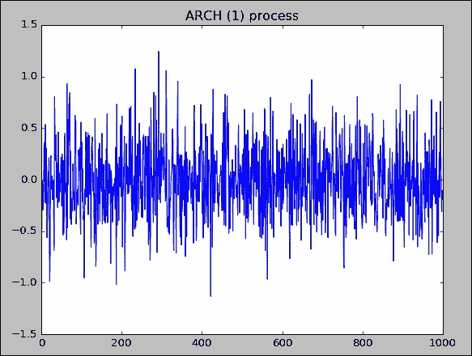
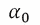

# 第十五章：波动率、隐含波动率、ARCH 和 GARCH

在金融中，我们知道风险被定义为不确定性，因为我们无法更准确地预测未来。基于价格服从对数正态分布且回报服从正态分布的假设，我们可以将风险定义为证券回报的标准差或方差。我们称之为传统的波动率（不确定性）定义。由于正态分布是对称的，它将以与负偏差相同的方式处理均值的正偏差。这与我们的传统认知相悖，因为我们通常将它们区分开来。为了解决这一问题，Sortino（1983）提出了下偏标准差。通常假设时间序列的波动率是常数，显然这是不准确的。另一个观察是波动率聚集性，意味着高波动率通常会跟随一个高波动率期，低波动率也通常会跟随一个低波动率期。为了模拟这种模式，Angel（1982）开发了**自回归条件异方差**（**ARCH**）过程，而 Bollerslev（1986）将其扩展为**广义自回归条件异方差**（**GARCH**）过程。本章将涵盖以下主题：

+   传统的波动率度量——标准差——基于正态性假设

+   正态性和厚尾检验

+   下偏标准差和 Sortino 比率

+   两个时期波动率等价性的检验

+   异方差性检验，Breusch 和 Pagan

+   波动率微笑和偏度

+   ARCH 模型

+   模拟 ARCH(1)过程

+   GARCH 模型

+   GARCH 过程的模拟

+   使用修改版`garchSim()`模拟 GARCH(p,q)过程

+   Glosten、Jagannathan 和 Runkle 提出的 GJR_GARCH 过程

# 传统的波动率度量——标准差

在大多数金融教科书中，我们使用回报的标准差作为风险度量。这基于一个关键假设，即对数回报服从正态分布。标准差和方差都可以用来衡量不确定性；前者通常被称为波动率。例如，如果我们说 IBM 的波动率为 20%，这意味着其年化标准差为 20%。以 IBM 为例，以下程序用于估计其年化波动率：

```py
import numpy as np
from matplotlib.finance import quotes_historical_yahoo_ochl as getData
#
ticker='IBM' 
begdate=(2009,1,1) 
enddate=(2013,12,31)
p =getData(ticker, begdate, enddate,asobject=True, adjusted=True)
ret = p.aclose[1:]/p.aclose[:-1]-1
std_annual=np.std(ret)*np.sqrt(252)
print('volatility (std)=',round(std_annual,4))
('volatility (std)=', 0.2093)
```

# 正态性检验

Shapiro-Wilk 检验是一个正态性检验。以下 Python 程序验证 IBM 的回报是否遵循正态分布。测试使用的是来自 Yahoo! Finance 的过去五年的每日数据。零假设是 IBM 的每日回报来自正态分布：

```py
import numpy as np
from scipy import stats
from matplotlib.finance import quotes_historical_yahoo_ochl as getData 
#
ticker='IBM' 
begdate=(2009,1,1) 
enddate=(2013,12,31)
p =getData(ticker, begdate, enddate,asobject=True, adjusted=True)
ret = p.aclose[1:]/p.aclose[:-1]-1
#
print('ticker=',ticker,'W-test, and P-value') 
print(stats.shapiro(ret))
 ('ticker=', 'IBM', 'W-test, and P-value')
(0.9295020699501038, 7.266549629954468e-24)
```

结果的第一个值是检验统计量，第二个值是其对应的 P 值。由于这个 P 值非常接近零，我们拒绝原假设。换句话说，我们得出结论，IBM 的日收益不遵循正态分布。

对于正态性检验，我们也可以使用安德森-达林检验，这是一种科尔莫哥洛夫-斯米尔诺夫检验的改进方法，用于验证观测数据是否遵循特定分布。`stats.anderson()`函数提供了正态、指数、逻辑和 Gumbel（极值类型 I）分布的检验。默认的检验是正态分布检验。调用该函数并打印测试结果后，我们得到了以下结果：

```py
print(stats.anderson(ret))
AndersonResult(statistic=inf, critical_values=array([ 0.574,  0.654,  0.785,  0.915,  1.089]), significance_level=array([ 15\. ,  10\. ,   5\. ,   2.5,   1\. ]))
```

在这里，我们有三组值：安德森-达林检验统计量、一组临界值和一组对应的置信水平，如 15%、10%、5%、2.5%和 1%，如前面的输出所示。如果我们选择 1%的置信水平——第三组的最后一个值——则临界值为 1.089，即第二组的最后一个值。由于我们的检验统计量是 14.73，远高于临界值 1.089，因此我们拒绝原假设。因此，我们的安德森-达林检验得出的结论与我们的 Shapiro-Wilk 检验相同。

# 估计肥尾

正态分布的一个重要性质是，我们可以使用均值和标准差，即前两个矩，来完全定义整个分布。对于 n 个证券收益，其前四个矩在方程式（1）中定义。均值或平均值定义如下：


它的（样本）方差由以下公式定义。标准差，即σ，是方差的平方根：


以下公式定义的偏度表示分布是偏向左还是偏向右。对于对称分布，其偏度为零：


峰度反映了极值的影响，因为它的四次方特性。峰度有两种定义方式，一种是带有减三的定义，另一种是不带减三的定义；请参见以下两个方程。方程式（4B）中减去三的原因是，对于正态分布，基于方程式（4A）的峰度为三：


有些书籍通过称方程式（4B）为超额峰度来区分这两个方程。然而，许多基于方程式（4B）的函数仍然被称为峰度。因为我们知道标准正态分布具有零均值、单位标准差、零偏度和零峰度（基于方程式 4B）。以下输出确认了这些事实：

```py
import numpy as np
from scipy import stats, random
#
random.seed(12345)
ret=random.normal(0,1,50000)
print('mean =',np.mean(ret))
print('std =',np.std(ret))
print('skewness=',stats.skew(ret))
print('kurtosis=',stats.kurtosis(ret))
('mean =', -0.0018105809899753157)
('std =', 1.002778144574481)
('skewness=', -0.014974456637295455)
('kurtosis=', -0.03657086582842339)
```

均值、偏度和峰度都接近零，而标准差接近一。接下来，我们基于 S&P500 的日收益率估计四个矩，具体如下：

```py
import numpy as np
from scipy import stats
from matplotlib.finance import quotes_historical_yahoo_ochl as getData 
#
ticker='^GSPC' 
begdate=(1926,1,1)
enddate=(2013,12,31)
p = getData(ticker, begdate, enddate,asobject=True, adjusted=True)
ret = p.aclose[1:]/p.aclose[:-1]-1
print( 'S&P500    n    =',len(ret))
print( 'S&P500    mean    =',round(np.mean(ret),8)) 
print( 'S&P500    std    =',round(np.std(ret),8)) 
print( 'S&P500    skewness=',round(stats.skew(ret),8))
print( 'S&P500    kurtosis=',round(stats.kurtosis(ret),8))
```

以下是前面代码中提到的五个值的输出，包括观察次数：

```py
('S&P500\tn\t=', 16102)
('S&P500\tmean\t=', 0.00033996)
('S&P500\tstd\t=', 0.00971895)
('S&P500\tskewness=', -0.65037674)
('S&P500\tkurtosis=', 21.24850493)
```

该结果与题为*Cook Pine Capital 的脂尾风险研究*的论文中的结果非常接近，论文的 PDF 版本可以从[`www.cookpinecapital.com/assets/pdfs/Study_of_Fat-tail_Risk.pdf`](http://www.cookpinecapital.com/assets/pdfs/Study_of_Fat-tail_Risk.pdf)下载。或者，可以从[`www3.canisius.edu/~yany/doc/Study_of_Fat-tail_Risk.pdf`](http://www3.canisius.edu/~yany/doc/Study_of_Fat-tail_Risk.pdf)获得。使用相同的论点，我们得出结论：标准普尔 500 的每日收益呈现左偏，即负偏态，并且具有脂尾（峰度为 38.22，而非零）。

# 下偏标准差和 Sortino 比率

我们已经讨论过这个概念。然而，为了完整起见，本章再次提及它。使用收益的标准差作为风险度量存在一个问题，即正偏差也被视为坏的。第二个问题是偏差是相对于平均值而非固定基准（如无风险利率）。为了克服这些缺点，Sortino（1983）提出了下偏标准差，它被定义为相对于无风险利率的负超额收益条件下的平方偏差的平均值，如下公式所示：


因为我们在此公式中需要无风险利率，所以可以生成一个包含无风险利率作为时间序列的 Fama-French 数据集。首先，从[`mba.tuck.dartmouth.edu/pages/faculty/ken.french/data_library.html`](http://mba.tuck.dartmouth.edu/pages/faculty/ken.french/data_library.html)下载他们的日常因子数据。然后，解压文件并删除文本文件末尾的非数据部分。假设最终的文本文件保存在`C:/temp/`：

```py
import datetime
import numpy as np
import pandas as pd 
file=open("c:/temp/ffDaily.txt","r") 
data=file.readlines()
f=[]
index=[]
#
for i in range(5,np.size(data)): 
    t=data[i].split() 
    t0_n=int(t[0]) 
    y=int(t0_n/10000) 
    m=int(t0_n/100)-y*100 
    d=int(t0_n)-y*10000-m*100
    index.append(datetime.datetime(y,m,d)) 
    for j in range(1,5):
         k=float(t[j]) 
         f.append(k/100)
#
n=len(f) 
f1=np.reshape(f,[n/4,4])
ff=pd.DataFrame(f1,index=index,columns=['Mkt_Rf','SMB','HML','Rf'])
ff.to_pickle("c:/temp/ffDaily.pkl")
```

最终数据集的名称是`ffDaily.pkl`。最好是自己生成这个数据集。不过，也可以从[`canisius.edu/~yany/python/ffDaily.pkl`](http://canisius.edu/~yany/python/ffDaily.pkl)下载该数据集。使用过去五年的数据（2009 年 1 月 1 日到 2013 年 12 月 31 日），我们可以估算 IBM 的 LPSD，如下所示：

```py
import numpy as np
import pandas as pd 
from scipy import stats
from matplotlib.finance import quotes_historical_yahoo_ochl as getData 
#
ticker='IBM' 
begdate=(2009,1,1) 
enddate=(2013,12,31)
p =getData(ticker, begdate, enddate,asobject=True, adjusted=True)
ret = p.aclose[1:]/p.aclose[:-1]-1
date_=p.date
x=pd.DataFrame(data=ret,index=date_[1:],columns=['ret']) 
#
ff=pd.read_pickle('c:/temp/ffDaily.pkl') 
final=pd.merge(x,ff,left_index=True,right_index=True) 
#
k=final.ret-final.RF
k2=k[k<0] 
LPSD=np.std(k2)*np.sqrt(252)
print("LPSD=",LPSD)
print(' LPSD (annualized) for ', ticker, 'is ',round(LPSD,3))
```

以下输出显示 IBM 的 LPSD 为 14.8%，与上一节中显示的 20.9%差异较大：

```py
('LPSD=', 0.14556051947047091)
(' LPSD (annualized) for ', 'IBM', 'is ', 0.146)
```

# 测试两个时期波动性是否相等

我们知道，1987 年 10 月股市大幅下跌。我们可以选择一只股票来测试 1987 年 10 月前后波动性。例如，我们可以使用福特汽车公司，股票代码为 F，来说明如何测试 1987 年股市崩盘前后的方差是否相等。在以下 Python 程序中，我们定义了一个名为`ret_f()`的函数，用于从 Yahoo! Finance 获取每日价格数据并估算其每日收益：

```py
import numpy as np
import scipy as sp
import pandas as pd
from matplotlib.finance import quotes_historical_yahoo_ochl as getData
#
# input area
ticker='F'            # stock
begdate1=(1982,9,1)   # starting date for period 1 
enddate1=(1987,9,1)   # ending date for period   1 
begdate2=(1987,12,1)  # starting date for period 2 
enddate2=(1992,12,1)  # ending   date for period 2
#
# define a function
def ret_f(ticker,begdate,enddate):
    p =getData(ticker, begdate, enddate,asobject=True, adjusted=True)
    ret = p.aclose[1:]/p.aclose[:-1]-1 
    date_=p.date
    return pd.DataFrame(data=ret,index=date_[1:],columns=['ret'])
#
# call the above function twice 
ret1=ret_f(ticker,begdate1,enddate1) 
ret2=ret_f(ticker,begdate2,enddate2)
#
# output
print('Std period #1    vs. std period #2') 
print(round(sp.std(ret1.ret),6),round(sp.std(ret2.ret),6)) 
print('T value ,    p-value ') 
print(sp.stats.bartlett(ret1.ret,ret2.ret))
```

以下截图中极高的 T 值和接近零的 p 值表明拒绝假设：在这两个时间段内，股票的波动率相同。相应的输出如下：

```py
Std period #1   vs. std period #2
(0.01981, 0.017915)
T value ,       p-value 
BartlettResult(statistic=12.747107745102099, pvalue=0.0003565601014515915)
```

# 异方差性检验，Breusch 和 Pagan

Breusch 和 Pagan（1979）设计了一种检验方法，用于确认或拒绝回归残差同质性（即波动率为常数）的零假设。以下公式表示他们的逻辑。首先，我们进行*y*对*x*的线性回归：


这里，*y*是因变量，*x*是自变量，*α*是截距，*β*是回归系数，是误差项。在获得误差项（残差）后，我们运行第二次回归：


假设运行先前回归得到的拟合值为*t f*，则 Breusch-Pagan（1979）检验的公式如下，并且它服从*χ2*分布，具有*k*自由度：


以下示例来自一个名为`lm.test`（线性回归检验）的 R 包，其作者为 Hothorn 等人（2014）。我们生成了*x*、*y1*和*y2*的时间序列。自变量是*x*，因变量是*y1*和*y2*。根据我们的设计，*y1*是同质的，即方差（标准差）为常数，而*y2*是非同质的（异方差的），即方差（标准差）不是常数。对于变量*x*，我们有以下 100 个值：


然后，我们生成两个误差项，每个误差项包含 100 个随机值。对于*error1*，它的 100 个值来自标准正态分布，即均值为零、标准差为 1。对于*error2*，它的 100 个值来自均值为零、标准差为 2 的正态分布。*y1*和*y2*时间序列定义如下：


对于*y2*的奇数项，误差项来自*error1*，而对于偶数项，误差项来自*error2*。要获取与`lm.test`相关的 PDF 文件或 R 包的更多信息，按照以下六个步骤操作：

1.  访问[`www.r-project.org`](http://www.r-project.org)。

1.  在**下载**下点击**CRAN**，然后点击**Packages**。

1.  选择一个靠近的服务器。

1.  点击屏幕左侧的**Packages**。

1.  选择一个列表并搜索`lm.test`。

1.  点击链接并下载与`lm.test`相关的 PDF 文件。

以下是相关的 Python 代码：

```py
import numpy as np
import scipy as sp
import statsmodels.api as sm 
#
def breusch_pagan_test(y,x): 
    results=sm.OLS(y,x).fit() 
    resid=results.resid
    n=len(resid)
    sigma2 = sum(resid**2)/n 
    f = resid**2/sigma2 - 1
    results2=sm.OLS(f,x).fit() 
    fv=results2.fittedvalues 
    bp=0.5 * sum(fv**2) 
    df=results2.df_model
    p_value=1-sp.stats.chi.cdf(bp,df)
    return round(bp,6), df, round(p_value,7)
#
sp.random.seed(12345) 
n=100
x=[]
error1=sp.random.normal(0,1,n) 
error2=sp.random.normal(0,2,n) 
for i in range(n):
    if i%2==1:
        x.append(1) 
    else:
        x.append(-1)
#
y1=x+np.array(x)+error1 
y2=sp.zeros(n)
#
for i in range(n): 
    if i%2==1:
        y2[i]=x[i]+error1[i] 
    else:
        y2[i]=x[i]+error2[i]

print ('y1 vs. x (we expect to accept the null hypothesis)') 
bp=breusch_pagan_test(y1,x)
#
print('BP value,    df,    p-value') 
print 'bp =', bp 
bp=breusch_pagan_test(y2,x)
print ('y2 vs. x    (we expect to rject the null hypothesis)') 
print('BP value,    df,    p-value')
print('bp =', bp)
```

从使用`y1`对`x`进行回归分析的结果来看，我们知道其残差值是齐次的，即方差或标准差是常数。因此，我们预计接受原假设。相反，对于`y2`与`x`的回归分析，由于我们的设计，`y2`的误差项是异质的。因此，我们预计会拒绝原假设。相应的输出如下所示：

```py
y1 vs. x (we expect to accept the null hypothesis)
BP value,       df,     p-value
bp = (0.596446, 1.0, 0.5508776)
y2 vs. x        (we expect to rject the null hypothesis)
BP value,       df,     p-value
('bp =', (17.611054, 1.0, 0.0))
```

# 波动率微笑与偏度

显然，每只股票应该只有一个波动率。然而，在估算隐含波动率时，不同的行使价格可能会给我们不同的隐含波动率。更具体地说，基于虚值期权、平值期权和实值期权的隐含波动率可能会有很大差异。波动率微笑是在行使价格范围内先下降后上升的形态，而波动率偏度则是向下或向上的倾斜。关键在于，投资者的情绪以及供需关系对波动率偏度有着根本的影响。因此，这种微笑或偏度为我们提供了有关投资者（如基金经理）是否偏好写入看涨期权或看跌期权的信息。首先，我们访问雅虎财经网站，下载看涨期权和看跌期权的数据：

1.  访问[`finance.yahoo.com`](http://finance.yahoo.com)。

1.  输入一个代码，比如`IBM`。

1.  点击**期权**（Options）选项。

1.  复制并粘贴看涨期权和期权的数据。

1.  将它们分成两个文件。

如果读者使用的是 2017 年 3 月 17 日到期的数据，可以从作者的网站下载：[`canisius.edu/~yany/data/calls17march.txt`](http://canisius.edu/~yany/data/calls17march.txt)、[`canisius.edu/~yany/data/puts17march.txt`](http://canisius.edu/~yany/data/puts17march.txt)。

看涨期权的 Python 程序如下所示：

```py
import numpy as np
import pandas as pd
import matplotlib.pyplot as plt
infile="c:/temp/calls17march.txt"
data=pd.read_table(infile,delimiter='\t',skiprows=1)
x=data['Strike']
y0=list(data['Implied Volatility'])
n=len(y0)
y=[]
for i in np.arange(n):
    a=float(y0[i].replace("%",""))/100.
    y.append(a)
    print(a)
#
plt.title("Volatility smile")
plt.figtext(0.55,0.80,"IBM calls")
plt.figtext(0.55,0.75,"maturity: 3/17/2017")
plt.ylabel("Volatility")
plt.xlabel("Strike Price")
plt.plot(x,y,'o')
plt.show()
```

在前面的程序中，输入文件用于看涨期权。这里展示的是波动率微笑的图形。另一个截图基于隐含波动率与行使（执行）价格之间的关系。程序与前面的程序完全相同，唯一不同的是输入文件。章节末尾有一个数据案例与前面的程序相关。接下来的图像是基于看涨期权数据的波动率微笑：


基于看涨期权数据的波动率微笑

类似地，下一个波动率微笑图像是基于看跌期权数据：


# 波动性聚集的图形呈现

其中一个观察结果被标注为波动性聚集，这意味着高波动性通常会跟随一个高波动性的时期，而低波动性通常会跟随一个低波动性的时期。以下程序通过使用 1988 到 2006 年的标准普尔 500 每日收益数据展示了这一现象。请注意，在以下代码中，为了在*x*轴上显示 1988 年，我们在 1988 年前添加了几个月的数据：

```py
import numpy as np
import matplotlib.pyplot as plt
from matplotlib.finance import quotes_historical_yahoo_ochl as getData
#
ticker='^GSPC'
begdate=(1987,11,1)
enddate=(2006,12,31)
#
p = getData(ticker, begdate, enddate,asobject=True, adjusted=True)
x=p.date[1:] 
ret = p.aclose[1:]/p.aclose[:-1]-1
#
plt.title('Illustration of volatility clustering (S&P500)') 
plt.ylabel('Daily returns')
plt.xlabel('Date') 
plt.plot(x,ret)
plt.show()
```

该程序的灵感来自于*马尔滕·P·维瑟*绘制的图表；请参阅[`pure.uva.nl/ws/files/922823/67947_09.pdf`](https://pure.uva.nl/ws/files/922823/67947_09.pdf)。对应于前面代码的图表如下所示：


# ARCH 模型

根据前述的论点，我们知道股票收益的波动性或方差不是恒定的。根据 ARCH 模型，我们可以使用前次估算的误差项来帮助我们预测下一期的波动性或方差。这个模型是由 2003 年诺贝尔经济学奖获得者**罗伯特·F·恩格尔**提出的。ARCH (q) 模型的公式如下所示：


这里，是时刻 t 的方差，*i*是第 i 个系数，是*t-i*时期的平方误差项，*q*是误差项的阶数。当*q*为 1 时，我们得到最简单的 ARCH(1)过程，如下所示：


# 模拟 ARCH(1)过程

模拟一个 ARCH(1)过程以更好地理解波动率聚类是一个好主意，这意味着高波动期通常会跟随高波动期，而低波动期通常会跟随低波动期。以下代码反映了这一现象：

```py
import scipy as sp 
import matplotlib.pyplot as plt
#
sp.random.seed(12345)
n=1000        # n is the number of observations
n1=100        # we need to drop the first several observations 
n2=n+n1       # sum of two numbers
#
a=(0.1,0.3)   # ARCH (1) coefficients alpha0 and alpha1, see Equation (3)
errors=sp.random.normal(0,1,n2) 
t=sp.zeros(n2)
t[0]=sp.random.normal(0,sp.sqrt(a[0]/(1-a[1])),1) 
for i in range(1,n2-1):
    t[i]=errors[i]*sp.sqrt(a[0]+a[1]*t[i-1]**2) 
    y=t[n1-1:-1] # drop the first n1 observations 
#
plt.title('ARCH (1) process')
x=range(n) 
plt.plot(x,y)
plt.show()
```

从下图可以看出，确实高波动期通常会跟随高波动，而低波动聚类也是如此：



# GARCH 模型

**广义自回归条件异方差** (**GARCH**) 是 ARCH 的一个重要扩展，由 Bollerslev（1986 年）提出。GARCH (p,q) 过程定义如下：


这里，是时刻*t*的方差，*q*是误差项的阶数，p 是方差的阶数，是常数，是时刻*t-i*的误差项系数，是时刻*t-i*的方差系数。显然，最简单的 GARCH 过程是当*p*和*q*都设为 1 时，即 GARCH(1,1)，其公式如下：


# 模拟 GARCH 过程

基于与 ARCH(1)相关的前一个程序，我们可以模拟一个 GARCH(1,1)过程，如下所示：

```py
import scipy as sp 
import matplotlib.pyplot as plt
#
sp.random.seed(12345)
n=1000          # n is the number of observations
n1=100          # we need to drop the first several observations 
n2=n+n1         # sum of two numbers
#
a=(0.1,0.3)     # ARCH coefficient
alpha=(0.1,0.3)    # GARCH (1,1) coefficients alpha0 and alpha1, see Equation (3)
beta=0.2 
errors=sp.random.normal(0,1,n2) 
t=sp.zeros(n2)
t[0]=sp.random.normal(0,sp.sqrt(a[0]/(1-a[1])),1)
#
for i in range(1,n2-1): 
    t[i]=errors[i]*sp.sqrt(alpha[0]+alpha[1]*errors[i-1]**2+beta*t[i-1]**2)
#
y=t[n1-1:-1]    # drop the first n1 observations 
plt.title('GARCH (1,1) process')
x=range(n) 
plt.plot(x,y)
plt.show()
```

老实说，下面的图表在 ARCH(1)过程下与之前的图表非常相似。对应于前面代码的图表如下所示：


Fig15_04_garch.png

# 使用修改过的 garchSim()模拟 GARCH(p,q)过程

以下代码基于名为`garchSim()`的 R 函数，该函数包含在名为`fGarch`的 R 包中。`fGarch`的作者是 Diethelm Wuertz 和 Yohan Chalabi。要查找相关手册，执行以下步骤：

1.  访问 [`www.r-project.org`](http://www.r-project.org)。

1.  在**下载**下点击**CRAN**，然后点击**包**。

1.  选择一个附近的服务器。

1.  在屏幕左侧点击**包**。

1.  选择一个列表并搜索`fGarch`。

1.  点击链接下载与`fGarch`相关的 PDF 文件。

基于 R 程序的 Python 程序如下所示：

```py
import scipy as sp
import numpy as np
import matplotlib.pyplot as plt
#
sp.random.seed(12345) 
m=2
n=100              # n is the number of observations
nDrop=100          # we need to drop the first several observations 
delta=2
omega=1e-6 
alpha=(0.05,0.05)
#
beta=0.8 
mu,ma,ar=0.0,0.0,0.0
gamma=(0.0,0.0) 
order_ar=sp.size(ar) 
order_ma=sp.size(ma) 
order_beta=sp.size(beta)
#
order_alpha =sp.size(alpha) 
z0=sp.random.standard_normal(n+nDrop) 
deltainv=1/delta 
spec_1=np.array([2])
spec_2=np.array([2])
spec_3=np.array([2])
z = np.hstack((spec_1,z0)) 
t=np.zeros(n+nDrop)
h = np.hstack((spec_2,t)) 
y = np.hstack((spec_3,t)) 
eps0 = h**deltainv  * z
for i in range(m+1,n +nDrop+m-1):
    t1=sum(alpha[::-1]*abs(eps0[i-2:i]))    # reverse 
    alpha =alpha[::-1] 
    t2=eps0[i-order_alpha-1:i-1]
    t3=t2*t2 
    t4=np.dot(gamma,t3.T)
    t5=sum(beta* h[i-order_beta:i-1]) 
    h[i]=omega+t1-t4+ t5
    eps0[i] = h[i]**deltainv * z[i] 
    t10=ar * y[i-order_ar:i-1] 
    t11=ma * eps0[i -order_ma:i-1]
    y[i]=mu+sum(t10)+sum(t11)+eps0[i] 
    garch=y[nDrop+1:] 
    sigma=h[nDrop+1:]**0.5 
    eps=eps0[nDrop+1:] 
    x=range(1,len(garch)+1) 
#
plt.plot(x,garch,'r')
plt.plot(x,sigma,'b')
plt.title('GARCH(2,1) process')
plt.figtext(0.2,0.8,'omega='+str(omega)+', alpha='+str(alpha)+',beta='+str(beta))
plt.figtext(0.2,0.75,'gamma='+str(gamma)) 
plt.figtext(0.2,0.7,'mu='+str(mu)+', ar='+str(ar)+',ma='+str(ma)) 
plt.show()
```

在前面的程序中，omega 是方程（10）中的常数，alpha 与误差项相关，beta 与方差相关。`alpha[a,b]`中的 a 对应`t-1`，b 对应`t-2`。然而，`eps0[t-2:i]`表示的是*t-2*和*t-1*。`alpha`和`eps0`项不一致，因此我们必须反转`a`和`b`的顺序。这就是为什么我们使用`alpha[::-1]`的原因。由于一些值为零，如`mu`、`ar`和`ma`，GARCH 的时间序列与`eps`是相同的。因此，我们只在下面的图表中展示了两个时间序列。GARCH 的高波动性与另一个标准差的时间序列：


Fig15_05_two.png

# GJR_GARCH 由 Glosten、Jagannanthan 和 Runkle 提出

Glosten、Jagannanthan 和 Runkle（1993）在 GARCH 过程模型中引入了非对称性。GJR_GARCH（1,1,1）的格式如下：


在这里，条件*It-1=0*，如果，并且*It-1=1*如果成立。以下代码基于 Kevin Sheppard 编写的代码：

```py
import numpy as np
from numpy.linalg import inv
import matplotlib.pyplot as plt
from matplotlib.mlab import csv2rec
from scipy.optimize import fmin_slsqp 
from numpy import size, log, pi, sum, diff, array, zeros, diag, dot, mat, asarray, sqrt
#
def gjr_garch_likelihood(parameters, data, sigma2, out=None): 
    mu = parameters[0]
    omega = parameters[1] 
    alpha = parameters[2] 
    gamma = parameters[3] 
    beta = parameters[4]
    T = size(data,0)
    eps = data-mu
    for t in xrange(1,T):
        sigma2[t]=(omega+alpha*eps[t-1]**2+gamma*eps[t-1]**2*(eps[t- 1]<0)+beta*sigma2[t-1])
        logliks = 0.5*(log(2*pi) + log(sigma2) + eps**2/sigma2) 
    loglik = sum(logliks)
    if out is None: 
        return loglik
    else:
        return loglik, logliks, copy(sigma2)
#
def gjr_constraint(parameters,data, sigma2, out=None):
    alpha = parameters[2]
    gamma = parameters[3] 
    beta = parameters[4]
    return array([1-alpha-gamma/2-beta]) # Constraint alpha+gamma/2+beta<=1
#
def hessian_2sided(fun, theta, args): 
    f = fun(theta, *args)
    h = 1e-5*np.abs(theta) 
    thetah = theta + h
    h = thetah-theta 
    K = size(theta,0) 
    h = np.diag(h)
    fp = zeros(K) 
    fm = zeros(K)
    for i in xrange(K):
        fp[i] = fun(theta+h[i], *args) 
        fm[i] = fun(theta-h[i], *args)
        fpp = zeros((K,K))
        fmm = zeros((K,K)) 
    for i in xrange(K):
        for j in xrange(i,K):
            fpp[i,j] = fun(theta + h[i] + h[j], *args) 
            fpp[j,i] = fpp[i,j]
            fmm[i,j] = fun(theta-h[i]-h[j], *args) 
            fmm[j,i] = fmm[i,j]
            hh = (diag(h))
            hh = hh.reshape((K,1))
            hh = dot(hh,hh.T)
            H = zeros((K,K)) 
    for i in xrange(K):
        for j in xrange(i,K):
            H[i,j] = (fpp[i,j]-fp[i]-fp[j] + f+ f-fm[i]-fm[j] + fmm[i,j])/hh[i,j]/2
            H[j,i] = H[i,j]
    return H
```

我们可以通过包含所有初始值、约束和边界来编写一个名为`GJR_GARCH()`的函数，如下所示：

```py
def GJR_GARCH(ret): 
    import numpy as np
    import scipy.optimize as op 
    startV=np.array([ret.mean(),ret.var()*0.01,0.03,0.09,0.90])
    finfo=np.finfo(np.float64)
    t=(0.0,1.0)
    bounds=[(-10*ret.mean(),10*ret.mean()),(finfo.eps,2*ret.var()),t,t,t] 
    T=np.size(ret,0)
    sigma2=np.repeat(ret.var(),T) 
    inV=(ret,sigma2)
    return op.fmin_slsqp(gjr_garch_likelihood,startV,f_ieqcons=gjr_constraint,bounds=bounds,args=inV)
#
```

为了复制我们的结果，我们可以使用`random.seed()`函数来固定通过从均匀分布生成一组随机数得到的回报：

```py
sp.random.seed(12345) 
returns=sp.random.uniform(-0.2,0.3,100) 
tt=GJR_GARCH(returns)
```

以下表格给出了这五个输出的解释：

| # | **含义** |
| --- | --- |
| 1 | 描述优化器退出模式的消息 |
| 2 | 目标函数的最终值 |
| 3 | 迭代次数 |
| 4 | 函数评估 |
| 5 | 梯度评估 |

> 表 15.1 五个输出的定义

各种退出模式的描述列在下表中：

| 退出代码 | 描述 |
| --- | --- |
| -1 | 需要评估梯度（g 和 a） |
| 0 | 优化成功终止 |
| 1 | 需要评估函数（f 和 c） |
| 2 | 独立变量比约束条件更多 |
| 3 | LSQ 子问题中超过 3*n 次迭代 |
| 4 | 不兼容的约束条件 |
| 5 | LSQ 子问题中的奇异矩阵 E |
| 6 | LSQ 子问题中的奇异矩阵 C |
| 7 | 秩缺失的等式约束子问题 HFTI |
| 8 | 线搜索的正方向导数 |
| 9 | 超过迭代限制 |

> 表 15.2 退出模式

为了展示我们的最终参数值，我们使用以下代码输出结果：

```py
print(tt)
Optimization terminated successfully.    (Exit mode 0)
            Current function value: -54.0664733128
            Iterations: 12
            Function evaluations: 94
            Gradient evaluations: 12
[  7.73958251e-02   6.65706323e-03   0.00000000e+00   2.09662783e-12
   6.62024107e-01]
```

# 参考文献

正态分布的一个重要属性是我们可以使用均值和标准差。

*Engle, Robert, 2002*, *动态条件相关性 – 一类简单的多元 GARCH 模型*，*即将发表于《商业与经济统计学杂志》*， [`pages.stern.nyu.edu/~rengle/dccfinal.pdf`](http://pages.stern.nyu.edu/~rengle/dccfinal.pdf)。

## 附录 A – 数据案例 8 - 使用 VIX 看涨期权进行投资组合对冲

**CBOE 波动率指数** (**VIX**) 基于 **S&P500 指数** (**SPX**)，这是美国股市的核心指数，通过对 SPX 的看跌和看涨期权在多个行使价格区间内的加权价格进行平均，来估计预期波动率。

通过提供复制波动率敞口的 SPX 期权投资组合脚本，这一新方法将 VIX 从一个抽象概念转变为实际的交易和对冲波动率的标准。

在 2014 年，CBOE 增强了 VIX 指数，包括了 SPX 周期期权系列的计算。SPX 周期期权的纳入，使得 VIX 指数能够使用最能精确匹配 VIX 指数预期波动率目标时间框架（即 30 天）的 S&P500 指数期权系列进行计算。使用到期日大于 23 天且小于 37 天的 SPX 期权，确保了 VIX 指数始终反映 S&P 500 波动率期限结构中两个点的插值。

### 参考文献

[`www.theoptionsguide.com/portfolio-hedging-using-vix-calls.aspx`](http://www.theoptionsguide.com/portfolio-hedging-using-vix-calls.aspx)。

[`www.cboe.com/micro/vix/historical.aspx`](http://www.cboe.com/micro/vix/historical.aspx)。

[`www.tickdata.com/tick-data-adds-vix-futures-data/`](https://www.tickdata.com/tick-data-adds-vix-futures-data/)。

## 附录 B – 数据案例 8 - 波动率微笑及其含义

该数据案例有多个目标：

+   理解隐含波动率的概念

+   了解不同的行使（行权）价格会导致隐含波动率的不同。

+   学会如何处理数据并生成相关图表

+   波动率微笑有什么含义？

数据来源：Yahoo! Finance：

1.  访问 [`finance.yahoo.com`](http://finance.yahoo.com)。

1.  输入一个股票代码，例如 `IBM`。

1.  点击 **Options**（期权）在中心位置。

1.  复制并粘贴看涨期权和期权的数据。

1.  将它们分成两个文件。

针对以下公司：

| 公司名称 | 股票代码 | 戴尔公司 | DELL |
| --- | --- | --- | --- |
| 国际商用机器公司 | IBM | 通用电气 | GE |
| 微软 | MSFT | 谷歌 | GOOG |
| 家庭美元商店 | FDO | 苹果 | AAPL |
| 沃尔玛商店 | WMT | eBay | EBAY |
| 麦当劳 | MCD |   |   |

注意，每只股票都有多个到期日；请参见以下截图：


这里展示了一个示例 Python 程序，输入文件可以从作者的网站下载：[`canisius.edu/~yany/data/calls17march.txt`](http://canisius.edu/~yany/data/calls17march.txt)：

```py
import numpy as np
import pandas as pd
import matplotlib.pyplot as plt
infile="c:/temp/calls17march.txt"
data=pd.read_table(infile,delimiter='\t',skiprows=1)
x=data['Strike']
y0=list(data['Implied Volatility'])
n=len(y0)
y=[]
for i in np.arange(n):
    a=float(y0[i].replace("%",""))/100.
    y.append(a)
    print(a)
#
plt.title("Volatility smile")
plt.figtext(0.55,0.80,"IBM calls")
plt.figtext(0.55,0.75,"maturity: 3/17/2017")
plt.ylabel("Volatility")
plt.xlabel("Strike Price")
plt.plot(x,y,'o')
plt.show()
```

# 练习

1.  什么是波动率的定义？

1.  你如何衡量风险（波动率）？

1.  与广泛使用的风险（标准差）定义相关的问题是什么？

1.  你如何测试股票收益是否遵循正态分布？对于以下给定的一组股票，测试它们是否遵循正态分布：

    | 公司名称 | 股票代码 | 戴尔公司 | DELL |
    | --- | --- | --- | --- |
    | 国际商业机器公司 | IBM | 通用电气 | GE |
    | 微软 | MSFT | 谷歌 | GOOG |
    | 家庭美元商店 | FDO | 苹果 | AAPL |
    | 沃尔玛 | WMT | eBay | EBAY |
    | 麦当劳 | MCD |   |   |

1.  什么是下偏标准差？它的应用是什么？

1.  选择五只股票，例如戴尔、IBM、微软、花旗集团和沃尔玛，并根据过去三年的日数据，将它们的标准差与 LPSD 进行比较。

1.  股票的波动率是否在多年间保持不变？你可以选择**国际商业机器公司**（**IBM**）和**沃尔玛**（**WMT**）来验证你的假设。

1.  什么是 ARCH (1) 过程？

1.  什么是 GARCH (1,1) 过程？

1.  将 GARCH (1,1) 过程应用于 IBM 和 WMT。

1.  编写一个 Python 程序，展示结合了看涨和看跌期权的波动率微笑。

1.  编写一个 Python 程序，通过不同到期日绘制波动率微笑。换句话说，将多个微笑放在一起。

1.  使用 Breusch-Pagan (1979) 检验确认或拒绝 IBM 日收益率同质性的假设。

1.  你如何测试股票的波动率是否恒定？

1.  *胖尾*是什么意思？为什么我们应该关注胖尾？

1.  你能编写一个 Python 程序来下载期权数据吗？

1.  你如何下载所有到期日的数据？

# 总结

在本章中，我们集中讨论了几个问题，特别是波动率度量和 ARCH/GARCH 模型。对于波动率度量，首先我们讨论了广泛使用的标准差，它是基于正态性假设的。为了展示这种假设可能不成立，我们介绍了几种正态性检验方法，如 Shapiro-Wilk 检验和 Anderson-Darling 检验。为了展示许多股票的实际分布在基准正态分布下具有厚尾特征，我们生动地使用了各种图形来说明这一点。为了说明波动率可能不是常数，我们展示了用于比较两个时期方差的检验。接着，我们展示了一个 Python 程序来进行 Breusch-Pagan（1979）异方差性检验。ARCH 和 GARCH 模型广泛用于描述波动率随时间的演变。对于这些模型，我们模拟了它们的简单形式，如 ARCH（1）和 GARCH（1,1）过程。除了它们的图形表示外，还包括了 Kevin Sheppard 的 Python 代码，用于求解 GJR_GARCH（1,1,1）过程。
