# 第一章：获取金融数据

本书的第一章专门讲解任何数据科学/量化金融项目中非常重要（有些人可能会说是最重要）的部分——数据收集。根据著名的谚语“垃圾进，垃圾出”，我们应该努力获取尽可能高质量的数据，并将其正确预处理，以便后续与统计学和机器学习算法一起使用。原因很简单——我们的分析结果高度依赖输入数据，任何复杂的模型都无法弥补这一点。这也是为什么在我们的分析中，我们应该能够利用自己（或他人）对经济/金融领域的理解，来为某些数据提供动机，例如建模股票收益。

在本书第一版的读者中，最常见的报告问题之一就是获取高质量数据。这也是为什么在本章中，我们花了更多时间探索不同的金融数据来源。虽然这些供应商中的许多提供相似的信息（如价格、基本面等），但它们也提供了可以通过其 API 下载的额外独特数据。例如，公司相关的新闻文章或预计算的技术指标。因此，我们将在不同的配方中下载不同类型的数据。不过，一定要检查库/API 的文档，因为其供应商很可能还提供标准数据，如价格等。

额外的示例也包含在 Jupyter notebooks 中，你可以在附带的 GitHub 仓库中找到它们。

本章的数据来源是经过精心挑选的，目的是不仅展示如何使用 Python 库轻松收集高质量数据，还展示了收集到的数据可以有多种形式和大小。

有时我们会得到一个格式良好的 `pandas` DataFrame，而其他时候它可能是 JSON 格式，甚至是需要处理后作为 CSV 加载的字节数据。希望这些技巧能充分帮助你准备好处理你可能在网上遇到的任何类型的数据。

在阅读本章时需要记住的一点是，不同来源的数据有所不同。这意味着我们从两个供应商下载的价格很可能会有所不同，因为这些供应商从不同的来源获取数据，并可能使用不同的方法来调整价格以应对企业行为。最佳实践是找到一个你最信任的数据来源（例如，基于网上的评价），然后用它下载你需要的数据。另一个需要记住的点是，当构建算法交易策略时，我们用于建模的数据应该与用于执行交易的实时数据流一致。

本章没有涉及一种重要的数据类型——替代数据。替代数据是指任何可以用来预测资产价格的见解的数据类型。替代数据可以包括卫星图像（例如，追踪航运路线或某个区域的发展）、传感器数据、网站流量数据、客户评论等。虽然有许多专门提供替代数据的供应商（例如 Quandl/Nasdaq Data Link），你也可以通过网页抓取访问公开的可用信息来获得一些替代数据。例如，你可以从 Amazon 或 Yelp 抓取客户评论。然而，这通常是较大的项目，遗憾的是超出了本书的范围。此外，你需要确保抓取特定网站的数据不会违反其条款和条件！

使用本章提到的供应商，你可以免费获取相当多的信息。但大多数供应商也提供付费服务。记得在注册任何服务之前，务必对数据供应商实际提供的数据以及你的需求进行详细调查。

在本章中，我们将介绍以下内容：

+   从 Yahoo Finance 获取数据

+   从 Nasdaq Data Link 获取数据

+   从 Intrinio 获取数据

+   从 Alpha Vantage 获取数据

+   从 CoinGecko 获取数据

# 从 Yahoo Finance 获取数据

**Yahoo Finance** 是最受欢迎的免费金融数据来源之一。它不仅包含不同频率（每日、每周和每月）的历史和当前股票价格，还包括一些计算指标，如 **beta**（衡量单一资产相对于整个市场波动性的指标）、基本面数据、收益信息/日历等。

在很长一段时间里，从 Yahoo Finance 下载数据的首选工具是 `pandas-datareader` 库。该库的目标是从多个来源提取数据，并以 `pandas` 数据框的形式存储。然而，在 Yahoo Finance API 进行一些更改后，该功能已被弃用。熟悉这个库是很有帮助的，因为它简化了从 FRED（联邦储备经济数据）、Fama/French 数据库或世界银行等来源下载数据的过程。这些数据可能对不同类型的分析很有帮助，接下来的章节中将介绍其中一些内容。

目前，下载历史股票价格的最简单最快方式是使用 `yfinance` 库（以前叫做 `fix_yahoo_finance`）。

就本章的内容而言，我们感兴趣的是下载 2011 到 2021 年期间的苹果公司股票价格。

## 如何操作……

执行以下步骤从 Yahoo Finance 下载数据：

1.  导入库：

    ```py
    import pandas as pd
    import yfinance as yf 
    ```

1.  下载数据：

    ```py
    df = yf.download("AAPL",
                     start="2011-01-01",
                     end="2021-12-31",
                     progress=False) 
    ```

1.  检查下载的数据：

    ```py
    print(f"Downloaded {len(df)} rows of data.")
    df 
    ```

    运行代码会生成以下数据框的预览：

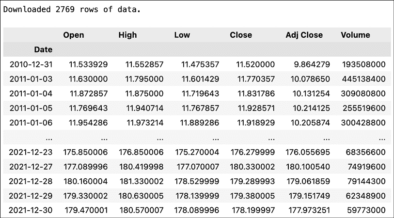

图 1.1：展示下载的股票价格数据框的预览

请求的结果是一个`pandas` DataFrame（2,769 行），包含日常**开盘、最高、最低和收盘**（**OHLC**）价格，以及调整后的收盘价和成交量。

Yahoo Finance 会自动调整**股票拆分**的收盘价，即当公司将其现有股票分割成多个新股票时，通常是为了提高股票的流动性。调整后的收盘价不仅考虑了拆股，还考虑了股息。

## 它是如何工作的…

`download`函数非常直观。在最基本的情况下，我们只需要提供股票代码（符号），它将尝试下载自 1950 年以来的所有可用数据。

在前面的例子中，我们下载了一个特定范围（2011 到 2021 年）的每日数据。

`download`函数的一些附加功能包括：

+   我们可以通过提供股票代码列表（`["AAPL", "MSFT"]`）或多个股票代码的字符串（`"AAPL MSFT"`）来一次性下载多个股票的信息。

+   我们可以设置`auto_adjust=True`来仅下载已调整的价格。

+   我们还可以通过设置`actions='inline'`来下载股息和股票拆分信息。这些操作也可以用于手动调整价格或进行其他分析。

+   指定`progress=False`将禁用进度条。

+   `interval`参数可以用于下载不同频率的数据。只要请求的时间段小于 60 天，我们也可以下载日内数据。

## 还有更多...

`yfinance`还提供了一种通过`Ticker`类下载数据的替代方式。首先，我们需要实例化该类的对象：

```py
aapl_data = yf.Ticker("AAPL") 
```

要下载历史价格数据，我们可以使用`history`方法：

```py
aapl_data.history() 
```

默认情况下，该方法会下载最近一个月的数据。我们可以使用与`download`函数相同的参数来指定范围和频率。

使用`Ticker`类的主要优点是我们可以下载比仅价格更多的信息。一些可用的方法包括：

+   `info`—输出一个包含股票及其公司详细信息的 JSON 对象，例如公司的全名、简短的业务总结、上市的交易所，以及一系列财务指标，如贝塔系数

+   `actions`—输出公司行动信息，例如股息和拆股

+   `major_holders`—显示主要持股人的名字

+   `institutional_holders`—显示机构持有者

+   `calendar`—显示即将到来的事件，例如季度财报

+   `earnings`/`quarterly_earnings`—显示过去几年/季度的盈利信息

+   `financials`/`quarterly_financials`—包含财务信息，如税前收入、净收入、毛利润、EBIT 等

请参阅相应的 Jupyter 笔记本，以获取更多这些方法的示例和输出。

## 另见

欲查看可下载数据的完整列表，请参考`yfinance`的 GitHub 仓库（[`github.com/ranaroussi/yfinance`](https://github.com/ranaroussi/yfinance)）。

你可以查看一些其他库，用于从 Yahoo Finance 下载数据：

+   `yahoofinancials`——与 `yfinance` 类似，这个库提供从 Yahoo Finance 下载各种数据的功能。最大区别在于，所有下载的数据都以 JSON 格式返回。

+   `yahoo_earnings_calendar`——一个小型库，专门用于下载财报日历。

# 从 Nasdaq Data Link 获取数据

**替代数据**可以是任何被认为是非市场数据的内容，例如农业商品的天气数据、追踪石油运输的卫星图像，甚至是反映公司服务表现的客户反馈。使用替代数据的背后理念是获取一个“信息优势”，然后可以用来生成 alpha。简而言之，**alpha**是一个衡量表现的指标，描述投资策略、交易员或投资组合经理超越市场的能力。

**Quandl**曾是投资专业人士（包括量化基金和投资银行）提供替代数据产品的领先供应商。最近，它被纳斯达克收购，现在是 **Nasdaq Data Link** 服务的一部分。新平台的目标是提供统一的可信数据和分析源。它提供了一种通过专门的 Python 库轻松下载数据的方式。

获取金融数据的一个好起点是 WIKI Prices 数据库，其中包含 3,000 家美国上市公司的股票价格、股息和拆股信息。这个数据库的缺点是自 2018 年 4 月起不再支持（意味着没有最新数据）。然而，对于获取历史数据或学习如何访问数据库，它已经足够。

我们使用与前一个示例中相同的例子——我们下载了苹果公司从 2011 年到 2021 年的股价。

## 做好准备

在下载数据之前，我们需要在 Nasdaq Data Link 创建一个账户（[`data.nasdaq.com/`](https://data.nasdaq.com/)），然后验证我们的电子邮件地址（否则在下载数据时可能会出现异常）。我们可以在个人资料中找到自己的 API 密钥（[`data.nasdaq.com/account/profile`](https://data.nasdaq.com/account/profile)）。

## 如何操作…

执行以下步骤从 Nasdaq Data Link 下载数据：

1.  导入库：

    ```py
    import pandas as pd
    import nasdaqdatalink 
    ```

1.  使用你的个人 API 密钥进行认证：

    ```py
    nasdaqdatalink.ApiConfig.api_key = "YOUR_KEY_HERE" 
    ```

    你需要将 `YOUR_KEY_HERE` 替换为你自己的 API 密钥。

1.  下载数据：

    ```py
    df = nasdaqdatalink.get(dataset="WIKI/AAPL",
                            start_date="2011-01-01", 
                            end_date="2021-12-31") 
    ```

1.  检查下载的数据：

    ```py
    print(f"Downloaded {len(df)} rows of data.")
    df.head() 
    ```

    运行代码后将生成以下 DataFrame 预览：

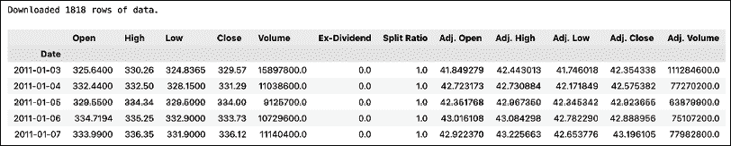

图 1.2：下载的价格信息预览

请求的结果是一个 DataFrame（1,818 行），包含每日 OHLC 价格、调整后的价格、股息和潜在的股票拆分。正如我们在介绍中提到的，这些数据是有限的，仅提供到 2018 年 4 月——最后一条观察数据实际上来自 2018 年 3 月 27 日。

## 工作原理…

导入所需库后的第一步是使用 API 密钥进行身份验证。当提供数据集参数时，我们使用了以下结构：DATASET/TICKER。

我们应该保持 API 密钥的安全和私密，即不要在公共代码库或任何其他地方分享它们。确保密钥保持私密的一种方法是创建一个环境变量（如何操作取决于你的操作系统），然后在 Python 中加载它。为此，我们可以使用 `os` 模块。要加载 `NASDAQ_KEY` 变量，我们可以使用以下代码：`os.environ.get("NASDAQ_KEY")`。

有关 `get` 函数的更多细节如下：

+   我们可以通过使用类似 `["WIKI/AAPL", "WIKI/MSFT"]` 的列表一次指定多个数据集。

+   `collapse` 参数可用于定义频率（可选项包括每日、每周、每月、每季度或每年）。

+   `transform` 参数可用于在下载数据之前对数据进行一些基本的计算。例如，我们可以计算逐行变化（`diff`）、逐行百分比变化（`rdiff`）、累计和（`cumul`）或将系列标准化为从 100 开始（`normalize`）。自然地，我们也可以使用 `pandas` 轻松完成完全相同的操作。

## 还有更多内容...

纳斯达克数据链接区分了两种用于下载数据的 API 调用。我们之前使用的 `get` 函数被归类为时间序列 API 调用。我们还可以使用带有 `get_table` 函数的表格 API 调用。

1.  使用 `get_table` 函数下载多个股票代码的数据：

    ```py
    COLUMNS = ["ticker", "date", "adj_close"]
    df = nasdaqdatalink.get_table("WIKI/PRICES", 
                                  ticker=["AAPL", "MSFT", "INTC"], 
                                  qopts={"columns": COLUMNS}, 
                                  date={"gte": "2011-01-01", 
                                        "lte": "2021-12-31"}, 
                                  paginate=True)
    df.head() 
    ```

1.  运行代码会生成以下 DataFrame 预览：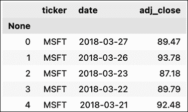

    图 1.3：下载的价格数据预览

    这个函数调用比我们之前使用 `get` 函数时要复杂一些。我们首先指定了要使用的表格。然后，我们提供了一个股票代码的列表。接下来，我们指定了我们感兴趣的表格列。我们还提供了日期范围，其中 `gte` 代表 *大于或等于*，而 `lte` 代表 *小于或等于*。最后，我们还指明了希望使用分页。*tables* API 每次调用的行数限制为 10,000 行。然而，通过在函数调用中使用 `paginate=True`，我们将该限制扩展到 1,000,000 行。

1.  将数据从长格式透视到宽格式：

    ```py
    df = df.set_index("date")
    df_wide = df.pivot(columns="ticker")
    df_wide.head() 
    ```

    运行代码会生成以下 DataFrame 预览：

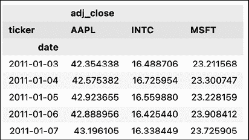

图 1.4：透视后的 DataFrame 预览

`get_tables` 函数的输出是长格式。然而，为了使我们的分析更简便，我们可能更感兴趣的是宽格式。为了重塑数据，我们首先将 `date` 列设置为索引，然后使用 `pd.DataFrame` 的 `pivot` 方法。

请记住，这不是唯一的做法，`pandas` 至少包含一些有用的方法/函数，可以用来将数据从长格式重塑为宽格式，反之亦然。

## 另请参见

+   [`docs.data.nasdaq.com/docs/python`](https://docs.data.nasdaq.com/docs/python)——Python 的`nasdaqdatalink`库的文档。

+   [`data.nasdaq.com/publishers/zacks`](https://data.nasdaq.com/publishers/zacks)——Zacks 投资研究是一个提供各种可能与您的项目相关的金融数据的供应商。请记住，这些数据不是免费的（你总是可以在购买访问权限之前查看数据的预览）。

+   [`data.nasdaq.com/publishers`](https://data.nasdaq.com/publishers)——所有可用数据提供商的列表。

# 从 Intrinio 获取数据

另一个有趣的金融数据来源是 Intrinio，它提供对其免费（有限制）数据库的访问。以下列表仅展示了我们可以通过 Intrinio 下载的一些有趣的数据点：

+   日内历史数据

+   实时股票/期权价格

+   财务报表数据和基本面

+   公司新闻

+   与收益相关的信息

+   IPO（首次公开募股）

+   经济数据，如国内生产总值（GDP）、失业率、联邦基金利率等。

+   30+技术指标

大部分数据是免费的，但对 API 调用频率有一定限制。仅美国股票和 ETF 的实时价格数据需要另一种订阅。

在这个示例中，我们遵循了前面的例子，下载了 2011 到 2021 年的苹果股票价格。这是因为 API 返回的数据不仅仅是一个`pandas`数据框，且需要进行一些有趣的预处理。

## 准备工作

在下载数据之前，我们需要在[`intrinio.com`](https://intrinio.com)注册以获取 API 密钥。

请参见以下链接([`docs.intrinio.com/developer-sandbox`](https://docs.intrinio.com/developer-sandbox))以了解沙盒 API 密钥（免费版）包含的信息。

## 如何操作……

执行以下步骤从 Intrinio 下载数据：

1.  导入库：

    ```py
    import intrinio_sdk as intrinio
    import pandas as pd 
    ```

1.  使用你的个人 API 密钥进行身份验证，并选择 API：

    ```py
    intrinio.ApiClient().set_api_key("YOUR_KEY_HERE")
    security_api = intrinio.SecurityApi() 
    ```

    你需要将`YOUR_KEY_HERE`替换为你自己的 API 密钥。

1.  请求数据：

    ```py
    r = security_api.get_security_stock_prices(
        identifier="AAPL", 
        start_date="2011-01-01",
        end_date="2021-12-31", 
        frequency="daily",
        page_size=10000
    ) 
    ```

1.  将结果转换为数据框：

    ```py
    df = (
        pd.DataFrame(r.stock_prices_dict)
        .sort_values("date")
        .set_index("date")
    ) 
    ```

1.  检查数据：

    ```py
    print(f"Downloaded {df.shape[0]} rows of data.")
    df.head() 
    ```

    输出结果如下：

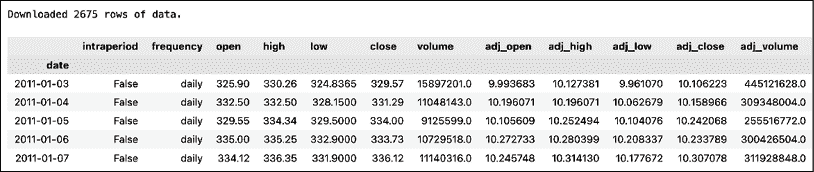

图 1.5：下载的价格信息预览

结果数据框包含 OHLC 价格和交易量，以及它们的调整值。不过，这还不是全部，我们不得不删除一些额外的列，以便让表格适合页面。数据框还包含信息，如拆分比例、股息、价值变化、百分比变化，以及 52 周滚动最高和最低值。

## 如何运作……

导入所需的库后，第一步是使用 API 密钥进行身份验证。然后，我们选择了要在本食谱中使用的 API——在股票价格的情况下，它是`SecurityApi`。

为了下载数据，我们使用了`SecurityApi`类的`get_security_stock_prices`方法。我们可以指定的参数如下：

+   `identifier`—股票代码或其他可接受的标识符

+   `start_date`/`end_date`—这些是不言自明的

+   `frequency`—我们关注的数据频率（可选项：日频、周频、月频、季频或年频）

+   `page_size`—定义每页返回的观察数据数量；我们将其设置为一个较大的数字，以便在一次请求中收集所有所需的数据，无需使用`next_page`令牌

API 返回一个类似 JSON 的对象。我们访问了响应的字典形式，然后将其转换为 DataFrame。我们还使用`pandas` DataFrame 的`set_index`方法将日期设为索引。

## 还有更多...

在本节中，我们展示了 Intrinio 的一些更有趣的功能。

免费层级并不包括所有信息。有关我们可以免费下载哪些数据的更详细概述，请参阅以下文档页面：[`docs.intrinio.com/developer-sandbox`](https://docs.intrinio.com/developer-sandbox)。

### 获取可口可乐的实时股价

您可以使用之前定义的`security_api`来获取实时股价：

```py
security_api.get_security_realtime_price("KO") 
```

代码片段的输出是以下 JSON：

```py
{'ask_price': 57.57,
 'ask_size': 114.0,
 'bid_price': 57.0,
 'bid_size': 1.0,
 'close_price': None,
 'exchange_volume': 349353.0,
 'high_price': 57.55,
 'last_price': 57.09,
 'last_size': None,
 'last_time': datetime.datetime(2021, 7, 30, 21, 45, 38, tzinfo=tzutc()),
 'low_price': 48.13,
 'market_volume': None,
 'open_price': 56.91,
 'security': {'composite_figi': 'BBG000BMX289',
              'exchange_ticker': 'KO:UN',
              'figi': 'BBG000BMX4N8',
              'id': 'sec_X7m9Zy',
              'ticker': 'KO'},
 'source': 'bats_delayed',
 'updated_on': datetime.datetime(2021, 7, 30, 22, 0, 40, 758000, tzinfo=tzutc())} 
```

### 下载与可口可乐相关的新闻文章

生成交易信号的一个潜在方式是聚合市场对某个公司的情绪。我们可以通过分析新闻文章或推文来做到这一点。如果情绪是积极的，我们可以做多，反之亦然。以下，我们展示了如何下载关于可口可乐的新闻文章：

```py
r = intrinio.CompanyApi().get_company_news(
    identifier="KO", 
    page_size=100
)

df = pd.DataFrame(r.news_dict)
df.head() 
```

这段代码返回以下 DataFrame：

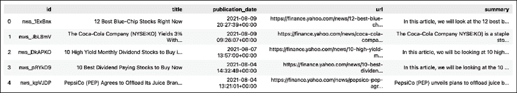

图 1.6：可口可乐公司相关新闻的预览

### 查找与搜索短语相关的公司

运行以下代码片段会返回一份公司列表，这些公司是 Intrinio 的 Thea AI 根据提供的查询字符串识别的：

```py
r = intrinio.CompanyApi().recognize_company("Intel")
df = pd.DataFrame(r.companies_dict)
df 
```

如我们所见，除了明显的搜索结果外，还有相当多的公司在其名称中也包含了“intel”这一词。

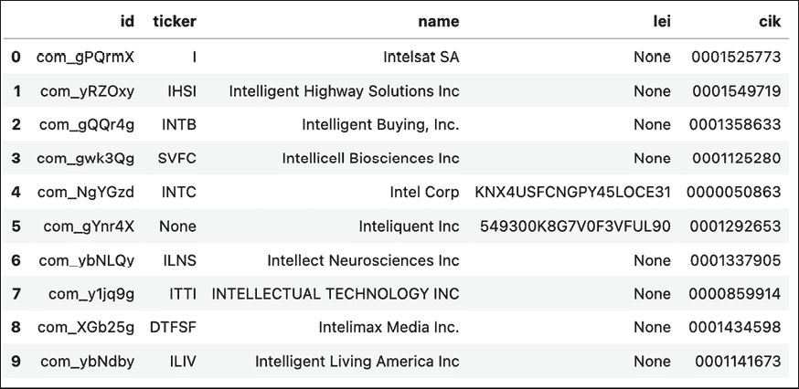

图 1.7：“intel”这一词相关公司的预览

### 获取可口可乐的日内股价

我们还可以使用以下代码片段来获取日内价格：

```py
response = (
    security_api.get_security_intraday_prices(identifier="KO", 
                                              start_date="2021-01-02",
                                              end_date="2021-01-05",
                                              page_size=1000)
)
df = pd.DataFrame(response.intraday_prices_dict)
df 
```

这将返回一个包含日内价格数据的 DataFrame。

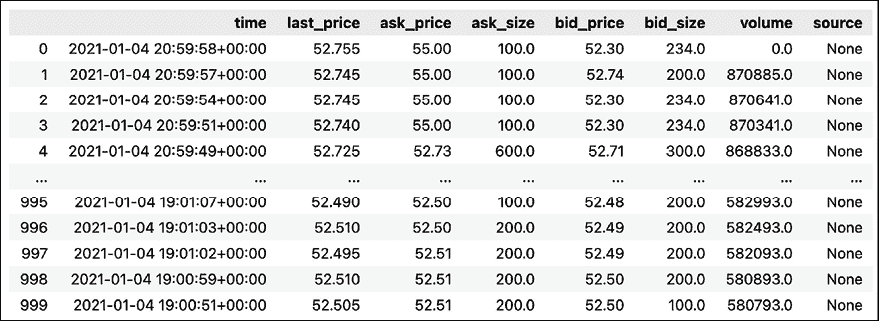

图 1.8：下载的日内价格预览

### 获取可口可乐最新的财报

`security_api`的另一个有趣用途是获取最新的财报记录。我们可以使用以下代码片段来实现：

```py
r = security_api.get_security_latest_earnings_record(identifier="KO")
print(r) 
```

API 调用的输出包含了大量有用的信息。例如，我们可以看到财报电话会议发生的具体时间。这些信息可能用于实施在市场开盘时执行的交易策略。

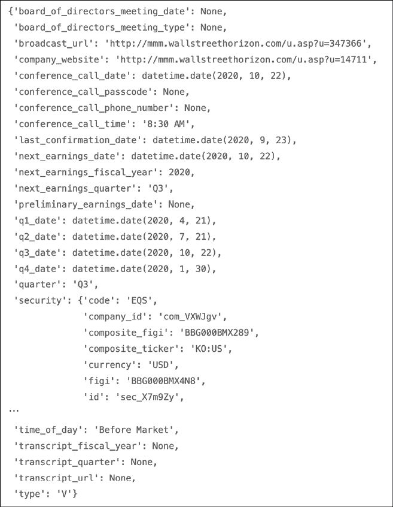

图 1.9：可口可乐最新的财报

## 另见

+   [`docs.intrinio.com/documentation/api_v2/getting_started`](https://docs.intrinio.com/documentation/api_v2/getting_started)—探索 API 的起点

+   [`docs.intrinio.com/documentation/api_v2/limits`](https://docs.intrinio.com/documentation/api_v2/limits)—查询限制的概述

+   [`docs.intrinio.com/developer-sandbox`](https://docs.intrinio.com/developer-sandbox)—免费沙盒环境中包含内容的概述

+   [`docs.intrinio.com/documentation/python`](https://docs.intrinio.com/documentation/python)—Python SDK 的详细文档

# 从 Alpha Vantage 获取数据

Alpha Vantage 是另一家流行的数据供应商，提供高质量的金融数据。通过其 API，我们可以下载以下内容：

+   股票价格，包括日内价格和实时价格（需付费访问）

+   基本面数据：收益、损益表、现金流、财报日历、IPO 日历

+   外汇和加密货币汇率

+   经济指标，如实际 GDP、联邦基金利率、消费者价格指数和消费者信心指数

+   50+ 种技术指标

在本教程中，我们展示了如何下载与加密货币相关的部分数据。我们从历史每日比特币价格开始，然后展示如何查询实时加密货币汇率。

## 准备工作

在下载数据之前，我们需要在 [`www.alphavantage.co/support/#api-key`](https://www.alphavantage.co/support/#api-key) 注册并获取 API 密钥。在某些限制范围内（每分钟 5 次 API 请求；每天 500 次 API 请求），API 及所有端点是免费的（不包括实时股票价格）。

## 如何操作……

执行以下步骤以从 Alpha Vantage 下载数据：

1.  导入库：

    ```py
    from alpha_vantage.cryptocurrencies import CryptoCurrencies 
    ```

1.  使用您的个人 API 密钥进行身份验证并选择 API：

    ```py
    ALPHA_VANTAGE_API_KEY = "YOUR_KEY_HERE"
    crypto_api = CryptoCurrencies(key=ALPHA_VANTAGE_API_KEY,
                                  output_format= "pandas") 
    ```

1.  下载以欧元表示的比特币每日价格：

    ```py
    data, meta_data = crypto_api.get_digital_currency_daily(
        symbol="BTC", 
        market="EUR"
    ) 
    ```

    `meta_data` 对象包含一些关于查询详细信息的有用信息。您可以在下面看到：

    ```py
    {'1\. Information': 'Daily Prices and Volumes for Digital Currency',
     '2\. Digital Currency Code': 'BTC',
     '3\. Digital Currency Name': 'Bitcoin',
     '4\. Market Code': 'EUR',
     '5\. Market Name': 'Euro',
     '6\. Last Refreshed': '2022-08-25 00:00:00',
     '7\. Time Zone': 'UTC'} 
    ```

    `data` DataFrame 包含所有请求的信息。我们获取了 1,000 个每日 OHLC（开盘、最高、最低、收盘）价格、交易量和市值。值得注意的是，所有的 OHLC 价格都以两种货币提供：欧元（EUR，按照我们的请求）和美元（USD，默认货币）。

    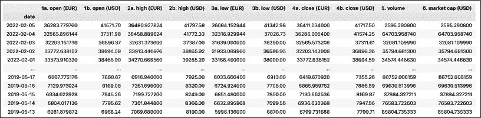

    图 1.10：下载的价格、交易量和市值预览

1.  下载实时汇率：

    ```py
    crypto_api.get_digital_currency_exchange_rate(
        from_currency="BTC", 
        to_currency="USD"
    )[0].transpose() 
    ```

    运行该命令将返回当前汇率的 DataFrame：

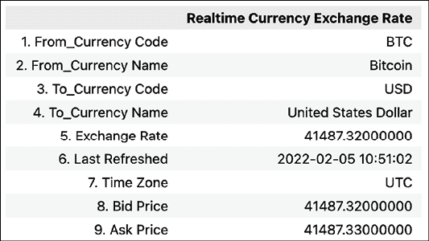

图 1.11：BTC-USD 汇率

## 它是如何工作的……

在导入`alpha_vantage`库后，我们需要使用个人 API 密钥进行身份验证。我们在实例化`CryptoCurrencies`类对象时完成了这一操作。同时，我们指定了希望以`pandas` DataFrame 形式获取输出。其他可能的格式包括 JSON 和 CSV。

在*步骤 3*中，我们使用`get_digital_currency_daily`方法下载了每日比特币价格。此外，我们指定了希望获取欧元（EUR）价格。默认情况下，该方法将返回请求的欧元价格以及其美元（USD）等价价格。

最后，我们使用`get_digital_currency_exchange_rate`方法下载了实时的 BTC/USD 汇率。

## 还有更多...

到目前为止，我们使用了`alpha_vantage`库作为中介来从 Alpha Vantage 下载信息。然而，数据提供商的功能发展速度快于第三方库，学习访问其 API 的其他方式可能会很有趣。

1.  导入所需的库：

    ```py
    import requests
    import pandas as pd
    from io import BytesIO 
    ```

1.  下载比特币的日内数据：

    ```py
    AV_API_URL = "https://www.alphavantage.co/query"
    parameters = {
        "function": "CRYPTO_INTRADAY",
        "symbol": "ETH",
        "market": "USD",
        "interval": "30min",
        "outputsize": "full",
        "apikey": ALPHA_VANTAGE_API_KEY
    }
    r = requests.get(AV_API_URL, params=parameters)
    data = r.json()
    df = (
        pd.DataFrame(data["Time Series Crypto (30min)"])
        .transpose()
    )
    df 
    ```

    运行上述代码片段将返回以下下载的 DataFrame 预览：

    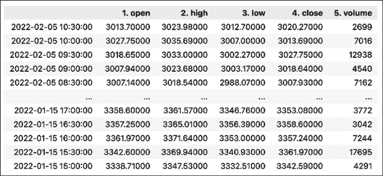

    图 1.12：显示包含比特币日内价格的 DataFrame 预览

    我们首先定义了用于请求信息的基础 URL。然后，定义了一个字典，包含请求的附加参数，包括个人 API 密钥。在我们的函数调用中，我们指定了要下载以美元表示的日内 ETH 价格，并且每 30 分钟采样一次。我们还指明了需要完整的输出（通过指定`outputsize`参数）。另一个选项是`compact`输出，它会下载最新的 100 个观察值。

    在准备好请求的参数后，我们使用了`requests`库中的`get`函数。我们提供了基础 URL 和`parameters`字典作为参数。获取请求响应后，我们可以通过`json`方法以 JSON 格式访问它。最后，我们将感兴趣的元素转换为`pandas` DataFrame。

    Alpha Vantage 的文档展示了另一种稍有不同的下载数据方法，即通过创建一个包含所有参数的长 URL。自然，这也是一种可能性，但上面介绍的选项稍显简洁。要查看文档中展示的完全相同的请求 URL，您可以运行`r.request.url`。

1.  下载未来三个月内的收益公告：

    ```py
    AV_API_URL = "https://www.alphavantage.co/query"
    parameters = {
        "function": "EARNINGS_CALENDAR",
        "horizon": "3month",
        "apikey": ALPHA_VANTAGE_API_KEY
    }
    r = requests.get(AV_API_URL, params=parameters)
    pd.read_csv(BytesIO(r.content)) 
    ```

    运行代码片段将返回以下输出：

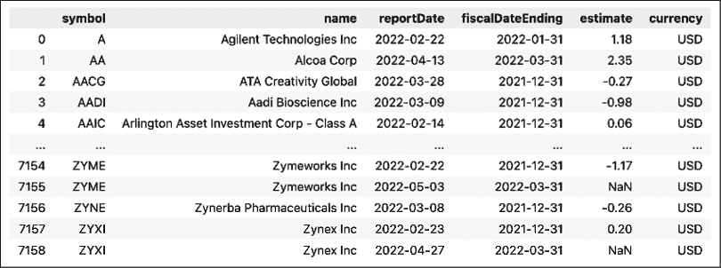

图 1.13：显示包含下载的收益信息的 DataFrame 预览

获取 API 请求的响应与之前的示例非常相似，但处理输出的方法却大不相同。

`r.content`的输出是一个`bytes`对象，包含查询结果的文本。为了模拟一个内存中的普通文件，我们可以使用`io`模块中的`BytesIO`类。然后，我们可以使用`pd.read_csv`函数正常加载这个模拟的文件。

在随附的笔记本中，我们展示了 Alpha Vantage 的更多功能，例如获取季度收益数据、下载即将上市的 IPO 日历，并使用`alpha_vantage`的`TimeSeries`模块下载股票价格数据。

## 另见

+   [`www.alphavantage.co/`](https://www.alphavantage.co/)—Alpha Vantage 主页

+   [`www.alphavantage.co/documentation/`](https://www.alphavantage.co/documentation/)—API 文档

+   [`github.com/RomelTorres/alpha_vantage`](https://github.com/RomelTorres/alpha_vantage)—用于访问 Alpha Vantage 数据的第三方库的 GitHub 仓库

# 从 CoinGecko 获取数据

我们将介绍的最后一个数据源完全专注于加密货币。CoinGecko 是一个流行的数据供应商和加密货币跟踪网站，您可以在上面找到实时汇率、历史数据、交易所信息、即将举行的事件、交易量等更多内容。

我们可以列举出 CoinGecko 的一些优点：

+   完全免费，无需注册 API 密钥

+   除了价格，它还提供有关加密货币的更新和新闻

+   它覆盖了许多币种，不仅仅是最流行的币种

在这个食谱中，我们下载了比特币过去 14 天的 OHLC 数据。

## 如何做……

执行以下步骤从 CoinGecko 下载数据：

1.  导入库：

    ```py
    from pycoingecko import CoinGeckoAPI
    from datetime import datetime
    import pandas as pd 
    ```

1.  实例化 CoinGecko API：

    ```py
    cg = CoinGeckoAPI() 
    ```

1.  获取比特币过去 14 天的 OHLC 价格：

    ```py
    ohlc = cg.get_coin_ohlc_by_id(
        id="bitcoin", vs_currency="usd", days="14"
    )
    ohlc_df = pd.DataFrame(ohlc)
    ohlc_df.columns = ["date", "open", "high", "low", "close"]
    ohlc_df["date"] = pd.to_datetime(ohlc_df["date"], unit="ms")
    ohlc_df 
    ```

    运行上面的代码片段将返回以下 DataFrame：

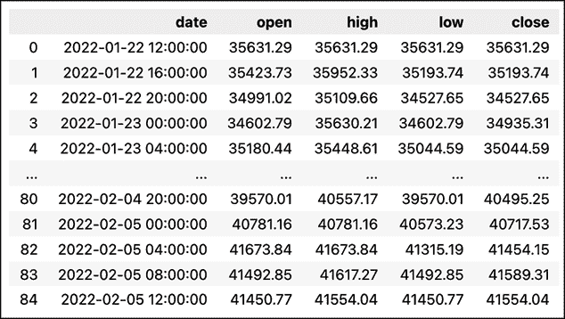

图 1.14：包含请求的比特币价格的 DataFrame 预览

在前面的表格中，我们可以看到我们已获得请求的 14 天数据，数据采样间隔为 4 小时。

## 它是如何工作的……

在导入库之后，我们实例化了 `CoinGeckoAPI` 对象。然后，使用它的 `get_coin_ohlc_by_id` 方法，我们下载了过去 14 天的 BTC/USD 汇率数据。值得一提的是，API 有一些限制：

+   我们只能下载预定义天数的数据。我们可以选择以下选项之一：`1`/`7`/`14`/`30`/`90`/`180`/`365`/`max`。

+   OHLC 蜡烛图的采样频率根据请求的时间范围而变化。对于 1 天或 2 天的请求，它们每 30 分钟采样一次；对于 3 到 30 天的请求，每 4 小时采样一次；超过 30 天的数据，则每 4 天采样一次。

`get_coin_ohlc_by_id` 的输出是一个列表的列表，我们可以将其转换为 `pandas` DataFrame。我们必须手动创建列名，因为 API 并未提供这些信息。

## 还有更多内容……

我们已经看到，使用 CoinGecko API 获取 OHLC 价格相比其他供应商可能稍微复杂一些。然而，CoinGecko 还有其他有趣的信息，我们可以通过其 API 下载。在本节中，我们展示了一些可能性。

### 获取前 7 个热门币种

我们可以使用 CoinGecko 获取前 7 个热门币种——排名是基于过去 24 小时内在 CoinGecko 上的搜索次数。在下载这些信息时，我们还会获取币种的符号、市场资本排名以及最新的 BTC 价格：

```py
trending_coins = cg.get_search_trending()
(
    pd.DataFrame([coin["item"] for coin in trending_coins["coins"]])
    .drop(columns=["thumb", "small", "large"])
) 
```

使用上面的代码片段，我们获得了以下 DataFrame：

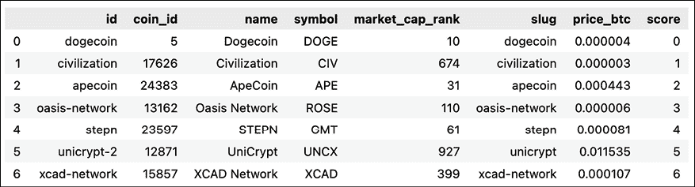

图 1.15：包含 7 个热门币种及其相关信息的 DataFrame 预览

### 获取比特币当前的美元价格

我们还可以提取当前加密货币在各种货币中的价格：

```py
cg.get_price(ids="bitcoin", vs_currencies="usd") 
```

运行上述代码片段会返回比特币的实时价格：

```py
{'bitcoin': {'usd': 47312}} 
```

在随附的笔记本中，我们展示了`pycoingecko`的一些其他功能，例如以除美元外的不同货币获取加密货币价格、下载 CoinGecko 上支持的所有加密货币列表（超过 9,000 种货币）、获取每种加密货币的详细市场数据（市值、24 小时交易量、历史最高价等），以及加载最受欢迎的交易所列表。

## 另见

你可以在这里找到`pycoingecko`库的文档：[`github.com/man-c/pycoingecko`](https://github.com/man-c/pycoingecko)。

# 概述

在本章中，我们介绍了一些最受欢迎的金融数据来源。但这仅仅是冰山一角。下面，你可以找到其他一些可能更适合你需求的有趣数据源。

其他数据源包括：

+   IEX Cloud ([`iexcloud.io/`](https://iexcloud.io/))—一个提供各种金融数据的平台。该平台的一个显著特点是基于 Stocktwits 上的活动（Stocktwits 是一个投资者和交易者的在线社区）提供的每日和每分钟情绪评分。然而，该 API 仅在付费计划中可用。你可以使用官方 Python 库`pyex`来访问 IEX Cloud 的数据。

+   Tiingo ([`www.tiingo.com/`](https://www.tiingo.com/))和`tiingo`库。

+   CryptoCompare ([`www.cryptocompare.com/`](https://www.cryptocompare.com/))—该平台通过 API 提供广泛的与加密货币相关的数据。这个数据供应商的独特之处在于他们提供了订单簿数据。

+   Twelve Data ([`twelvedata.com/`](https://twelvedata.com/))。

+   polygon.io ([`polygon.io/`](https://polygon.io/))—一个可靠的数据供应商，提供实时和历史数据（股票、外汇和加密货币）。被 Google、Robinhood 和 Revolut 等公司信任。

+   Shrimpy ([`www.shrimpy.io/`](https://www.shrimpy.io/))和`shrimpy-python`—Shrimpy 开发者 API 的官方 Python 库。

在下一章，我们将学习如何对下载的数据进行预处理，以便进一步分析。

# 加入我们的 Discord 社区！

要加入本书的 Discord 社区——在这里你可以分享反馈、向作者提问并了解新版本——请扫描下面的二维码：


[`packt.link/ips2H`](https://packt.link/ips2H)
