# 第二章：数据预处理

你经常会听到数据科学行业中的说法，数据科学家通常花费大约 80% 的时间在获取数据、处理数据、清理数据等方面。只有剩下的 20% 的时间才会用于建模，而建模通常被认为是最有趣的部分。在上一章中，我们已经学会了如何从各种来源下载数据。在我们从数据中提取实际洞察之前，我们仍然需要经过几个步骤。

在本章中，我们将讨论数据预处理，即在使用数据之前应用于数据的一般整理/操作。目标不仅是提高模型的表现，还要确保基于这些数据的任何分析的有效性。在本章中，我们将专注于金融时间序列，而在后续章节中，我们还将展示如何处理其他类型的数据。

在本章中，我们将涵盖以下内容：

+   转换价格为收益率

+   调整收益率以考虑通货膨胀

+   改变时间序列数据的频率

+   填补缺失数据的不同方法

+   更换货币

+   聚合交易数据的不同方法

# 转换价格为收益率

许多用于时间序列建模的模型和方法要求时间序列是平稳的。我们将在*第六章*《时间序列分析与预测》中深入讨论这个话题，然而，现在我们可以对其有一个快速的了解。

平稳性假设一个过程的统计量（如序列的均值和方差）随时间不变。基于这一假设，我们可以建立旨在预测该过程未来值的模型。

然而，资产价格通常是非平稳的。它们的统计量不仅随时间变化，还可以观察到一些趋势（随时间变化的一般模式）或季节性（在固定时间间隔内重复的模式）。通过将价格转换为收益率，我们试图使时间序列平稳。

使用收益率而非价格的另一个好处是规范化。这意味着我们可以轻松比较不同的收益率序列，而使用原始股价则不那么简单，因为一只股票可能从 $10 开始，而另一只股票则从 $1,000 开始。

有两种类型的收益率：

+   简单收益率：它们在资产之间进行聚合——一个投资组合的简单收益率是该投资组合中各个资产收益率的加权和。简单收益率定义为：

    *R*[t] = (*P*[t] - *P*[t-1])/*P*[t-1] = *P*[t]/*P*[t-1] -1

+   对数收益率：它们在时间上进行聚合。通过一个例子更容易理解——给定一个月的对数收益率是该月内各个日期对数收益率的总和。对数收益率定义为：

    *r*[t] = log(*P*[t]/*P*[t-1]) = log(*P*[t]) - log(*P*[t-1])

*P*[t] 是时间 *t* 时资产的价格。在前面的例子中，我们没有考虑股息，股息显然会影响收益率，并且需要对公式做出一些小的修改。

在处理股票价格时的最佳实践是使用调整后的值，因为它们考虑了可能的公司行为，例如股票分割。

通常来说，对数回报比简单回报更为常用。可能最重要的原因是，如果我们假设股票价格服从对数正态分布（虽然对于特定时间序列，这可能成立也可能不成立），那么对数回报将服从正态分布。而正态分布与许多经典的时间序列建模统计方法非常契合。此外，对于日常/日内数据，简单回报和对数回报之间的差异通常非常小，这与对数回报通常小于简单回报的普遍规律相符。

在本食谱中，我们展示了如何使用苹果公司股票价格计算两种类型的回报。

## 如何操作……

执行以下步骤下载苹果公司股票价格并计算简单回报/对数回报：

1.  导入库：

    ```py
    import pandas as pd
    import numpy as np
    import yfinance as yf 
    ```

1.  下载数据并只保留调整后的收盘价：

    ```py
    df = yf.download("AAPL",
                     start="2010-01-01",
                     end="2020-12-31",
                     progress=False)
    df = df.loc[:, ["Adj Close"]] 
    ```

1.  使用调整后的收盘价计算简单回报和对数回报：

    ```py
    df["simple_rtn"] = df["Adj Close"].pct_change()
    df["log_rtn"] = np.log(df["Adj Close"]/df["Adj Close"].shift(1)) 
    ```

1.  检查输出结果：

    ```py
    df.head() 
    ```

    结果 DataFrame 如下所示：

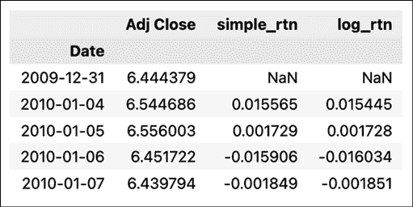

图 2.1：包含苹果公司调整后收盘价和简单/对数回报的 DataFrame 片段

第一行将始终包含**NaN**（**不是数字**）值，因为没有前一个价格可以用来计算回报。

## 它是如何工作的……

在*步骤 2*中，我们从 Yahoo Finance 下载了价格数据，并且只保留了调整后的收盘价，用于回报的计算。

为了计算简单回报，我们使用了 pandas Series/DataFrame 的`pct_change`方法。它计算当前元素与前一个元素之间的百分比变化（我们可以指定滞后数，但在此特定情况下，默认值`1`就足够了）。请注意，前一个元素是指给定行上方的元素。如果我们处理的是时间序列数据，需要确保数据按时间索引排序。

为了计算对数回报，我们遵循了本食谱介绍中的公式。当我们将系列中的每个元素除以其滞后值时，使用了`shift`方法，滞后值为`1`，以访问前一个元素。最后，我们使用`np.log`函数对除法结果取自然对数。

# 调整回报以考虑通货膨胀

在进行不同类型的分析时，特别是长期分析时，我们可能需要考虑通货膨胀。**通货膨胀**是指经济中价格水平普遍上升的现象。换句话说，就是货币购买力的下降。这就是为什么我们可能希望将通货膨胀与股价上涨分开考虑，股价上涨可能是由于公司的增长或发展等因素。

我们当然可以直接调整股票价格，但在本教程中，我们将重点介绍调整收益并计算实际收益。我们可以使用以下公式来实现：

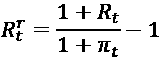

其中 *R*^r[t] 是实际收益，*R*[t] 是时间 *t* 的简单收益，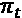 代表通货膨胀率。

对于这个示例，我们使用了 2010 到 2020 年期间的苹果公司股票价格（与之前的教程中一样下载）。

## 如何操作…

执行以下步骤以调整收益以应对通货膨胀：

1.  导入库并进行认证：

    ```py
    import pandas as pd
    import nasdaqdatalink
    nasdaqdatalink.ApiConfig.api_key = "YOUR_KEY_HERE" 
    ```

1.  将日度价格重新采样为月度：

    ```py
    df = df.resample("M").last() 
    ```

1.  从 Nasdaq Data Link 下载通货膨胀数据：

    ```py
    df_cpi = (
        nasdaqdatalink.get(dataset="RATEINF/CPI_USA", 
                           start_date="2009-12-01", 
                           end_date="2020-12-31")
        .rename(columns={"Value": "cpi"})
    )
    df_cpi 
    ```

    运行代码后会生成如下表格：

    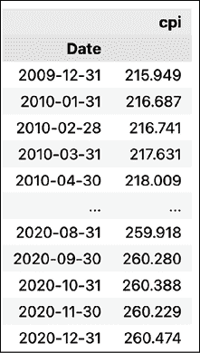

    图 2.2：包含消费者物价指数（CPI）值的 DataFrame 片段

1.  将通货膨胀数据与价格连接：

    ```py
    df = df.join(df_cpi, how="left") 
    ```

1.  计算简单收益和通货膨胀率：

    ```py
    df["simple_rtn"] = df["Adj Close"].pct_change()
    df["inflation_rate"] = df["cpi"].pct_change() 
    ```

1.  调整收益以应对通货膨胀并计算实际收益：

    ```py
    df["real_rtn"] = (
        (df["simple_rtn"] + 1) / (df["inflation_rate"] + 1) - 1
    )
    df.head() 
    ```

    运行代码后会生成如下表格：

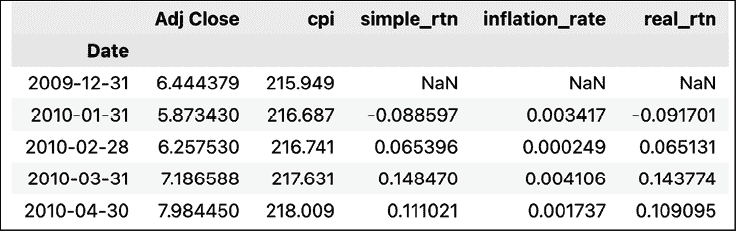

图 2.3：包含计算后的通货膨胀调整收益的 DataFrame 片段

## 工作原理…

首先，我们导入了相关库并通过 Nasdaq Data Link 进行了认证，用于下载与通货膨胀相关的数据。然后，我们需要将苹果公司的股票价格重新采样为月度频率，因为通货膨胀数据是按月提供的。为此，我们将 `resample` 方法与 `last` 方法进行了链式调用。这样，我们就获取了给定月份的最后一个价格。

在*第 3 步*中，我们从 Nasdaq Data Link 下载了每月的**消费者物价指数**（**CPI**）值。它是衡量一篮子消费者商品和服务（如食品、交通等）加权平均价格的指标。

然后，我们使用左连接合并了两个数据集（价格和 CPI）。**左连接**是一种用于合并表格的操作，返回左表中的所有行以及右表中匹配的行，同时将不匹配的行留空。

默认情况下，`join` 方法使用表格的索引来执行实际的连接。我们可以使用 `on` 参数来指定其他需要使用的列。

在将所有数据放入一个 DataFrame 中后，我们使用了 `pct_change` 方法来计算简单收益和通货膨胀率。最后，我们使用介绍中提供的公式来计算实际收益。

## 还有更多内容…

我们已经探索了如何从 Nasdaq Data Link 下载通货膨胀数据。或者，我们可以使用一个名为 `cpi` 的便捷库。

1.  导入库：

    ```py
    import cpi 
    ```

    此时，我们可能会遇到以下警告：

    ```py
    StaleDataWarning: CPI data is out of date 
    ```

    如果是这种情况，我们只需运行以下代码行来更新数据：

    ```py
    cpi.update() 
    ```

1.  获取默认的 CPI 系列：

    ```py
    cpi_series = cpi.series.get() 
    ```

    在这里，我们下载默认的 CPI 指数（`CUUR0000SA0：美国城市平均水平，所有城市消费者，未经季节性调整的所有商品`），它适用于大多数情况。或者，我们可以提供`items`和`area`参数来下载更具针对性的系列。我们还可以使用`get_by_id`函数下载特定的 CPI 系列。

1.  将对象转换为`pandas` DataFrame：

    ```py
    df_cpi_2 = cpi_series.to_dataframe() 
    ```

1.  筛选 DataFrame 并查看前 12 个观测值：

    ```py
    df_cpi_2.query("period_type == 'monthly' and year >= 2010") \
            .loc[:, ["date", "value"]] \
            .set_index("date") \
            .head(12) 
    ```

    运行代码生成的输出如下：

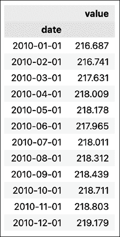

图 2.4：包含 CPI 下载值的 DataFrame 的前 12 个值

在这一步，我们使用了一些过滤操作，将数据与之前从 Nasdaq Data Link 下载的数据进行比较。我们使用`query`方法仅保留 2010 年及以后的月度数据。为了便于比较，我们只显示了两列选定的列和前 12 个观测值。

在后续章节中，我们还将使用`cpi`库，通过`inflate`函数直接对价格进行通胀调整。

## 另见

+   [`github.com/palewire/cpi`](https://github.com/palewire/cpi) — `cpi`库的 GitHub 仓库

# 改变时间序列数据的频率

在处理时间序列，尤其是金融时间序列时，我们常常需要改变数据的频率（周期性）。例如，我们接收到的是每日的 OHLC 价格，但我们的算法需要使用每周数据。或者我们有每日的替代数据，并且想将其与我们的实时日内数据流进行匹配。

改变频率的一般规则可以分解为以下几点：

+   将对数回报乘以或除以时间段数。

+   将波动率乘以或除以时间段数的平方根。

对于任何具有独立增量的过程（例如几何布朗运动），对数回报的方差与时间成正比。例如，r[t3] - r[t1]的方差将是以下两种方差之和：r[t2]−r[t1]和 r[t3]−r[t2]，假设*t*[1]≤*t*[2]≤*t*[3]。在这种情况下，当我们假设过程的参数随时间不变（同质性）时，我们得出方差与时间间隔长度成正比的结论。在实践中，这意味着标准差（波动率）与时间的平方根成正比。

在本示例中，我们展示了如何使用日回报计算 Apple 的月度实际波动率，然后将其年化。我们在分析投资的风险调整绩效时，常常会遇到年化波动率。

实际波动率的公式如下：

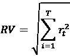

实际波动率通常用于计算基于日内回报的每日波动率。

我们需要采取的步骤如下：

+   下载数据并计算对数回报

+   计算各月的实际波动率

+   通过乘以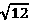将值年化，因为我们正在将月度值转换为年度值。

## 准备就绪

我们假设您已经按照之前的步骤操作，并且拥有一个名为`df`的 DataFrame，其中包含一个`log_rtn`列，时间戳作为索引。

## 如何操作…

执行以下步骤，计算并年化月度实现的波动率：

1.  导入库：

    ```py
    import pandas as pd
    import numpy as np 
    ```

1.  定义计算实现波动率的函数：

    ```py
    def  realized_volatility(x):
        return np.sqrt(np.sum(x**2)) 
    ```

1.  计算月度实现波动率：

    ```py
    df_rv = (
        df.groupby(pd.Grouper(freq="M"))
        .apply(realized_volatility)
        .rename(columns={"log_rtn": "rv"})
    ) 
    ```

1.  年化值：

    ```py
    df_rv.rv = df_rv["rv"] * np.sqrt(12) 
    ```

1.  绘制结果：

    ```py
    fig, ax = plt.subplots(2, 1, sharex=True)
    ax[0].plot(df)
    ax[0].set_title("Apple's log returns (2000-2012)")
    ax[1].plot(df_rv)
    ax[1].set_title("Annualized realized volatility")
    plt.show() 
    ```

    执行该代码片段会生成以下图表：

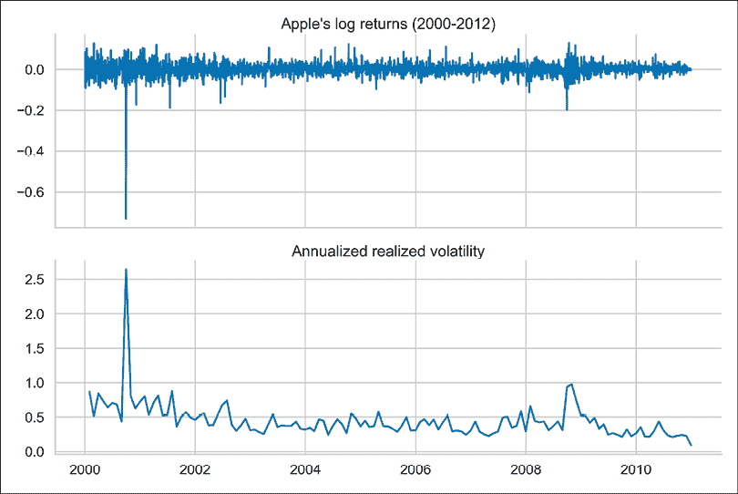

图 2.5：苹果的对数收益率序列及相应的实现波动率（年化）

我们可以看到，波动率的尖峰与一些极端收益率（可能是异常值）相吻合。

## 它是如何工作的…

通常，我们可以使用`pandas` DataFrame 的`resample`方法。假设我们想要计算每月的平均收益率，我们可以使用`df["log_rtn"].resample("M").mean()`。

使用`resample`方法时，我们可以使用`pandas`的任何内置聚合函数，如`mean`、`sum`、`min`和`max`。然而，我们面临的情况有些复杂，因此我们首先定义了一个名为`realized_volatility`的辅助函数。因为我们希望使用自定义函数进行聚合，所以我们通过组合使用`groupby`、`Grouper`和`apply`来复制`resample`的行为。

我们展示了最基本的结果可视化（有关时间序列可视化的详细信息，请参见*第三章*，*金融时间序列的可视化*）。

# 缺失数据插补的不同方法

在处理任何时间序列时，可能会出现一些数据丢失的情况，原因多种多样（有人忘记输入数据、数据库出现随机问题等）。一种可行的解决方案是丢弃缺失值的观测值。然而，假设我们正在同时分析多个时间序列，并且只有其中一个序列由于某些随机错误缺失了一个值。我们是否还要因为这个单一的缺失值而删除其他可能有价值的信息？可能不需要。而且还有许多其他情景，我们更倾向于以某种方式处理缺失值，而不是丢弃这些观测值。

插补缺失时间序列数据的两种最简单方法是：

+   向后填充——用下一个已知的值填充缺失值

+   向前填充——用之前已知的值填充缺失值

在这个食谱中，我们展示了如何使用这些技术来轻松处理 CPI 时间序列中的缺失值。

## 如何操作…

执行以下步骤，尝试不同的缺失数据插补方法：

1.  导入库：

    ```py
    import pandas as pd
    import numpy as np
    import nasdaqdatalink 
    ```

1.  从 Nasdaq Data Link 下载通胀数据：

    ```py
    nasdaqdatalink.ApiConfig.api_key = "YOUR_KEY_HERE"
     df = (
        nasdaqdatalink.get(dataset="RATEINF/CPI_USA", 
                           start_date="2015-01-01", 
                           end_date="2020-12-31")
        .rename(columns={"Value": "cpi"})
    ) 
    ```

1.  随机引入五个缺失值：

    ```py
    np.random.seed(42)
    rand_indices = np.random.choice(df.index, 5, replace=False)
    df["cpi_missing"] = df.loc[:, "cpi"]
    df.loc[rand_indices, "cpi_missing"] = np.nan
    df.head() 
    ```

    在下表中，我们可以看到已成功将缺失值引入数据中：

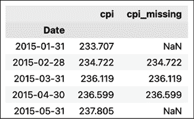

图 2.6：包含下载的 CPI 数据和添加缺失值的 DataFrame 预览

1.  使用不同方法填充缺失值：

    ```py
    for method in ["bfill", "ffill"]:
        df[f"method_{method}"] = (
            df[["cpi_missing"]].fillna(method=method)
        ) 
    ```

1.  通过显示我们创建缺失值的行来检查结果：

    ```py
    df.loc[rand_indices].sort_index() 
    ```

    运行代码会产生以下输出：

    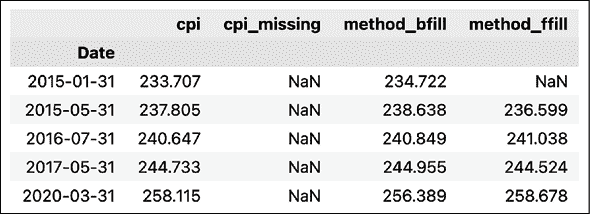

    图 2.7：插补缺失值后的 DataFrame 预览

    我们可以看到，后向填充成功填充了我们创建的所有缺失值。然而，前向填充未能填充一个值。这是因为这是序列中的第一个数据点，因此没有可供前向填充的值。

1.  绘制 2015 到 2016 年间的结果：

    ```py
    df.loc[:"2017-01-01"] \
      .drop(columns=["cpi_missing"]) \
      .plot(title="Different ways of filling missing values"); 
    ```

    运行该代码片段会生成以下图表：

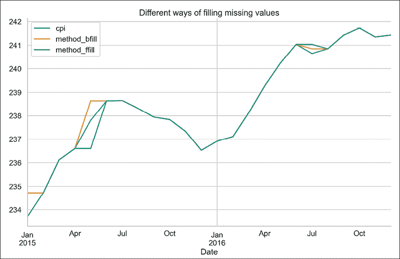

图 2.8：后向填充与前向填充在 CPI 时间序列中的对比

在*图 2.8*中，我们可以清楚地看到前向填充和后向填充在实践中的应用效果。

## 它是如何工作的……

在导入库之后，我们从 Nasdaq Data Link 下载了 6 年的月度 CPI 数据。然后，我们从 DataFrame 中随机选择了 5 个索引，人工创建了缺失值。为此，我们将这些值替换为 NaN。

在*步骤 4*中，我们对时间序列应用了两种不同的插补方法。我们使用了`pandas` DataFrame 的`fillna`方法，并指定`method`参数为`bfill`（后向填充）或`ffill`（前向填充）。我们将插补后的序列保存为新列，以便清晰比较结果。请记住，`fillna`方法会替换缺失值，并保持其他值不变。

我们本可以指定填充缺失数据的方法，比如`0`或`999`等数值。然而，在时间序列数据的情况下，使用任意数值可能没有多大意义，因此不推荐这样做。

我们使用`np.random.seed(42)`使实验结果具有可重复性。每次运行此单元时，都会得到相同的随机数。你可以使用任何数字作为种子，并且每次随机选择的结果都会不同。

在*步骤 5*中，我们检查了插补后的值。为了简洁起见，我们只显示了随机选择的索引。我们使用`sort_index`方法按日期对其进行了排序。这样，我们可以清楚地看到，第一个值没有使用前向填充进行填充，因为它是时间序列中的第一个观测值。

最后，我们绘制了 2015 到 2016 年所有时间序列的图表。在图表中，我们可以清楚地看到后向填充和前向填充如何填补缺失值。

## 还有更多……

在这个示例中，我们探讨了一些简单的填补缺失数据的方法。另一种可能性是使用插值方法，而插值有许多不同的方式。因此，在本例中，我们将使用线性插值。有关插值方法的更多信息，请参考`pandas`文档（链接在*另见*部分中提供）。

1.  使用线性插值填充缺失值：

    ```py
    df["method_interpolate"] = df[["cpi_missing"]].interpolate() 
    ```

1.  检查结果：

    ```py
    df.loc[rand_indices].sort_index() 
    ```

    运行代码片段会生成以下输出：

    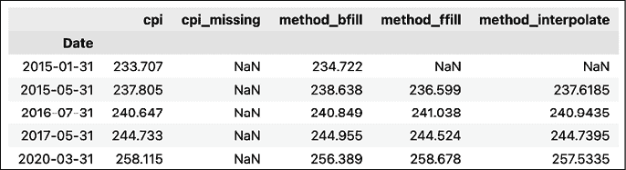

    图 2.9：使用线性插值填补缺失值后的 DataFrame 预览

    不幸的是，线性插值也无法处理位于时间序列开始位置的缺失值。

1.  绘制结果：

    ```py
    df.loc[:"2017-01-01"] \
      .drop(columns=["cpi_missing"]) \
      .plot(title="Different ways of filling missing values"); 
    ```

    运行代码片段会生成以下图形：

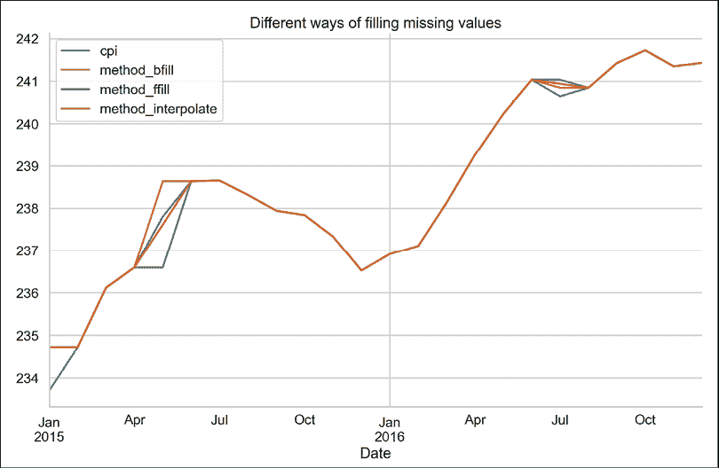

图 2.10：CPI 时间序列中向后填充和向前填充的比较，包括插值

在*图 2.10*中，我们可以看到线性插值是如何通过一条直线连接已知的观测值来填补缺失值的。

在这个示例中，我们探讨了如何为时间序列数据填补缺失值。然而，这些并不是所有可能的方法。例如，我们本可以使用最后几条观测值的移动平均来填补任何缺失的值。实际上，有许多可能的方法可以选择。在*第十三章*，*应用机器学习：识别信用违约*，我们将展示如何处理其他类型数据集中的缺失值问题。

## 另见

+   [`pandas.pydata.org/docs/reference/api/pandas.DataFrame.interpolate.html`](https://pandas.pydata.org/docs/reference/api/pandas.DataFrame.interpolate.html)—在这里，你可以看到`pandas`中所有可用的插值方法。

# 货币转换

另一个在金融任务中相当常见的预处理步骤是货币转换。假设你有一个由多种资产组成的投资组合，这些资产的定价使用不同的货币，并且你想要计算整个投资组合的总价值。最简单的例子可能是美国股票和欧洲股票。

在这个示例中，我们展示了如何轻松地将股票价格从 USD 转换为 EUR。然而，完全相同的步骤也可以用于转换任何货币对。

## 如何操作...

执行以下步骤将股票价格从 USD 转换为 EUR：

1.  导入所需库：

    ```py
    import pandas as pd
    import yfinance as yf
    from forex_python.converter import CurrencyRates 
    ```

1.  下载 2020 年 1 月份的 Apple OHLC 价格：

    ```py
    df = yf.download("AAPL",
                     start="2020-01-01",
                     end="2020-01-31",
                     progress=False)
    df = df.drop(columns=["Adj Close", "Volume"]) 
    ```

1.  实例化`CurrencyRates`对象：

    ```py
    c = CurrencyRates() 
    ```

1.  下载每个所需日期的 USD/EUR 汇率：

    ```py
    df["usd_eur"] = [c.get_rate("USD", "EUR", date) for date in df.index] 
    ```

1.  将 USD 价格转换为 EUR：

    ```py
    for column in df.columns[:-1]:
        df[f"{column}_EUR"] = df[column] * df["usd_eur"]
    df.head() 
    ```

    运行代码片段会生成以下预览：

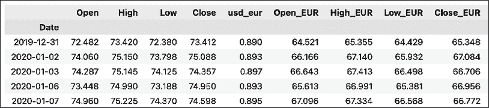

图 2.11：包含原始 USD 价格和转换为 EUR 价格的 DataFrame 预览

我们可以看到，所有四列价格已经成功地转换为 EUR。

## 它是如何工作的…

在 *第 1 步* 中，我们导入了所需的库。然后，我们使用之前介绍过的 `yfinance` 库下载了 2020 年 1 月的 Apple OHLC 数据。

在 *第 3 步* 中，我们实例化了 `forex-python` 库中的 `CurrencyRates` 对象。该库底层使用了 Forex API（[`theforexapi.com`](https://theforexapi.com)），这是一个免费的 API，用于访问欧洲中央银行发布的当前和历史外汇汇率。

在 *第 4 步* 中，我们使用 `get_rate` 方法下载了所有日期的 USD/EUR 汇率，这些日期与股票价格 DataFrame 中的日期匹配。为了高效地执行此操作，我们使用了列表推导并将输出存储在新列中。该库和当前实现的一个潜在缺点是，我们需要单独下载每个汇率，这对于大型 DataFrame 来说可能不具备可扩展性。

在使用该库时，有时会遇到以下错误：`RatesNotAvailableError: Currency Rates Source Not Ready`。最可能的原因是你尝试获取周末的汇率。最简单的解决方案是跳过这些天的列表推导/`for` 循环，并使用之前介绍的某种方法填补缺失值。

在最后一步，我们遍历了初始 DataFrame 的列（除了汇率列），并将 USD 价格与汇率相乘。我们将结果存储在新列中，列名带有 `_EUR` 下标。

## 还有更多内容…

使用 `forex_python` 库，我们可以轻松地一次性下载多种货币的汇率。为此，我们可以使用 `get_rates` 方法。在下面的代码片段中，我们下载了 USD 到 31 种可用货币的当前汇率。我们自然可以指定感兴趣的日期，就像之前那样。

1.  获取当前 USD 汇率到 31 种可用货币：

    ```py
    usd_rates = c.get_rates("USD")
    usd_rates 
    ```

    前五条记录如下所示：

    ```py
    {'EUR': 0.8441668073611345,
     'JPY': 110.00337666722943,
     'BGN': 1.651021441836907,
     'CZK': 21.426641904440316,
     'DKK': 6.277224379537396,
    } 
    ```

    在这个食谱中，我们主要关注了 `forex_python` 库，因为它非常方便且灵活。然而，我们也可以从许多不同的来源下载历史汇率，并得出相同的结果（根据数据提供商的不同，可能会有一些误差）。在 *第一章*《获取金融数据》中描述的许多数据提供商提供历史汇率。下面，我们展示如何使用 Yahoo Finance 获取这些汇率。

1.  从 Yahoo Finance 下载 USD/EUR 汇率：

    ```py
    df = yf.download("USDEUR=X",
                     start="2000-01-01",
                     end="2010-12-31",
                     progress=False)
    df.head() 
    ```

    运行代码片段会得到以下输出：

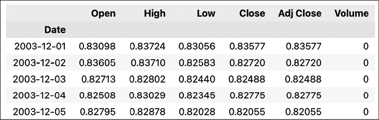图 2.12：下载的汇率 DataFrame 预览

在*图 2.12*中，我们可以看到此数据源的一个限制——该货币对的数据仅自 2003 年 12 月以来可用。另外，Yahoo Finance 提供的是外汇汇率的 OHLC 变种。为了得到一个用于转换的单一数值，可以选择四个值中的任意一个（取决于使用场景），或者计算中间值（低值与高值之间的中间值）。

## 另见

+   [`github.com/MicroPyramid/forex-python`](https://github.com/MicroPyramid/forex-python)—`forex-python`库的 GitHub 仓库

# 不同的交易数据聚合方式

在深入构建机器学习模型或设计交易策略之前，我们不仅需要可靠的数据，还需要将其聚合成便于进一步分析和适合我们选择的模型的格式。**条形图**这一术语指的是一种数据表示方式，包含了任何金融资产价格波动的基本信息。我们已经在*第一章*《获取金融数据》中看到过一种条形图形式，我们在其中探讨了如何从各种来源下载金融数据。

在那里，我们下载了按某一时间段（如月、日或日内频率）采样的 OHLCV 数据。这是最常见的金融时间序列数据聚合方式，称为**时间条**。

按时间采样金融时间序列有一些缺点：

+   时间条掩盖了市场中实际的活动率——它们往往在低活动期（例如中午）过度采样，在高活动期（例如接近市场开盘和收盘时）则采样不足。

+   如今，市场越来越多地由交易算法和机器人控制，因此它们不再遵循人类的日间周期。

+   基于时间的条形图提供的统计特性较差（例如序列相关性、异方差性和回报的非正态性）。

+   鉴于这是最流行的聚合方式，也是最容易获取的一种，它也可能受到操纵的影响（例如冰山订单）。

冰山订单是将大额订单分割成较小的限价单，以隐藏实际的订单数量。它们被称为“冰山订单”，因为可见的订单只是“冰山一角”，而大量的限价单正在等待，随时准备下单。

为了克服这些问题并获得竞争优势，从业者还使用其他类型的聚合方式。理想情况下，他们希望得到一种每个条形图包含相同数量信息的条形图表示。它们正在使用的一些替代方法包括：

+   **刻度条**——命名源于金融市场中交易通常被称为“刻度”（ticks）。这种聚合方式下，我们每当发生预定数量的交易时，就会采样一个 OHLCV 条形图。

+   **成交量条**——我们每当发生预定量的交易（可以用任何单位衡量，例如股票、币种等）时，就会采样一个条形图。

+   **美元条形图**——我们每当交换预定的美元金额时就取一个条形图。自然，我们也可以使用其他任何货币。

每种聚合形式都有其优缺点，我们应当注意。

**交易条形图**提供了一种更好的方式来跟踪市场中的实际活动及其波动性。然而，潜在的问题是，一笔交易可能包含某种资产的任意数量单位。因此，购买一股股票与购买 10,000 股股票的订单被视为相同。

**成交量条形图**试图克服这一问题。然而，它们自身也存在问题。它们不能准确反映资产价格发生重大变化或股票拆分时的情况。这使得它们在面对受此类事件影响的不同时间段时不太可靠。

这时第三种类型的条形图——**美元条形图**就派上用场了。它通常被认为是聚合价格数据的最稳健方式。首先，美元条形图有助于弥补价格波动的差距，尤其对像加密货币这样高度波动的市场尤为重要。其次，以美元为单位的采样有助于保持信息的一致性。第二个原因是，美元条形图不受证券未平仓量的影响，因此不会受到诸如股票拆分、公司回购、新股发行等操作的影响。

在本例中，我们将学习如何使用来自 Binance（最流行的加密货币交易所之一）的交易数据创建上述提到的四种类型的条形图。我们选择使用加密货币数据，因为与股票数据等其他资产类别相比，它更容易获得（且免费）。然而，所展示的方法对于其他资产类别同样适用。

## 如何操作…

执行以下步骤，从 Binance 下载交易数据并将其聚合为四种不同类型的条形图：

1.  导入库：

    ```py
    from binance.spot import Spot as Client
    import pandas as pd
    import numpy as np 
    ```

1.  实例化 Binance 客户端并下载最后 500 笔 `BTCEUR` 交易：

    ```py
    spot_client = Client(base_url="https://api3.binance.com")
    r = spot_client.trades("BTCEUR") 
    ```

1.  将下载的交易数据处理为 `pandas` DataFrame：

    ```py
    df = (
        pd.DataFrame(r)
        .drop(columns=["isBuyerMaker", "isBestMatch"])
    )
    df["time"] = pd.to_datetime(df["time"], unit="ms")
    for column in ["price", "qty", "quoteQty"]:
        df[column] = pd.to_numeric(df[column])
    df 
    ```

    执行代码将返回以下 DataFrame：

    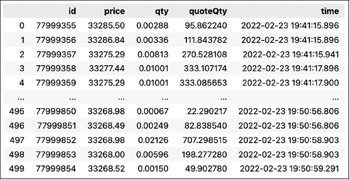

    图 2.13：包含最后 500 笔 BTC-EUR 交易的 DataFrame

    我们可以看到，`BTCEUR`市场中的 500 笔交易发生在大约九分钟的时间内。对于更受欢迎的市场，这一时间窗口可以显著缩短。`qty`列包含交易的 BTC 数量，而 `quoteQty` 列包含交易数量的 EUR 价格，这与将 `price` 列与 `qty` 列相乘相同。

1.  定义一个函数，将原始交易信息聚合成条形图：

    ```py
    def  get_bars(df, add_time=False):
        ohlc = df["price"].ohlc()
        vwap = (
            df.apply(lambda x: np.average(x["price"], weights=x["qty"]))
            .to_frame("vwap")
        )
        vol = df["qty"].sum().to_frame("vol")
        cnt = df["qty"].size().to_frame("cnt")
        if add_time:
            time = df["time"].last().to_frame("time")
            res = pd.concat([time, ohlc, vwap, vol, cnt], axis=1)
        else:
            res = pd.concat([ohlc, vwap, vol, cnt], axis=1)
        return res 
    ```

1.  获取时间条形图：

    ```py
    df_grouped_time = df.groupby(pd.Grouper(key="time", freq="1Min"))
    time_bars = get_bars(df_grouped_time)
    time_bars 
    ```

    运行代码生成以下时间条形图：

    

    图 2.14：带有时间条形图的 DataFrame 预览

1.  获取交易条形图：

    ```py
    bar_size = 50
    df["tick_group"] = (
        pd.Series(list(range(len(df))))
        .div(bar_size)
        .apply(np.floor)
        .astype(int)
        .values
    )
    df_grouped_ticks = df.groupby("tick_group")
    tick_bars = get_bars(df_grouped_ticks, add_time=True)
    tick_bars 
    ```

    运行代码生成以下交易条形图：

    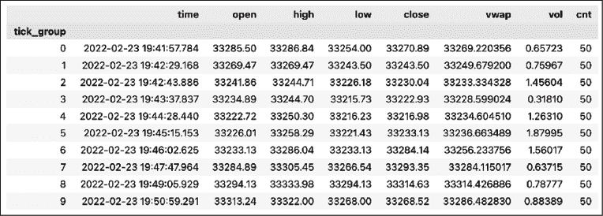

    图 2.15：带有交易条形图的 DataFrame 预览

    我们可以看到每个组包含的交易正好是 50 笔，正如我们所期望的那样。

1.  获取成交量条形图：

    ```py
    bar_size = 1
    df["cum_qty"] = df["qty"].cumsum()
    df["vol_group"] = (
        df["cum_qty"]
        .div(bar_size)
        .apply(np.floor)
        .astype(int)
        .values
    )
    df_grouped_ticks = df.groupby("vol_group")
    volume_bars = get_bars(df_grouped_ticks, add_time=True)
    volume_bars 
    ```

    运行代码生成以下成交量条形图：

    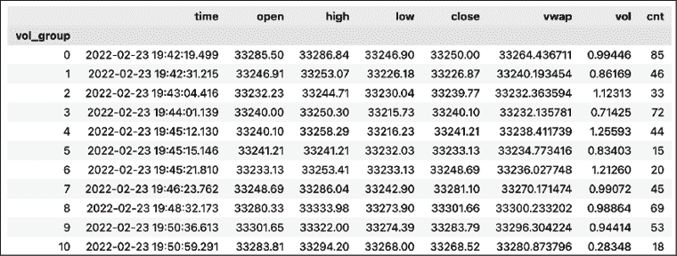

    图 2.16：带有成交量条的 DataFrame 预览

    我们可以看到所有条形图的成交量大致相同。最后一根条形图稍微小一些，因为在 500 笔交易中总成交量不足。

1.  获取美元条形图：

    ```py
    bar_size = 50000
    df["cum_value"] = df["quoteQty"].cumsum()
    df["value_group"] = (
        df["cum_value"]
        .div(bar_size)
        .apply(np.floor)
        .astype(int)
        .values
    )
    df_grouped_ticks = df.groupby("value_group")
    dollar_bars = get_bars(df_grouped_ticks, add_time=True)
    dollar_bars 
    ```

    运行代码生成以下美元条形图：

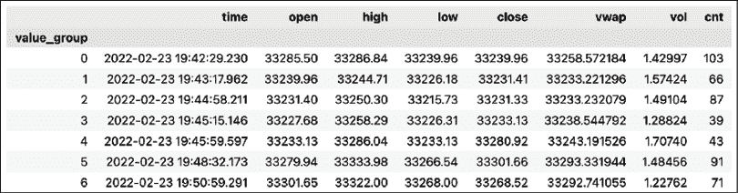

图 2.17：带有美元条形图的 DataFrame 预览

## 它是如何工作的……

在导入库之后，我们实例化了 Binance 客户端，并使用 Binance 客户端的 `trades` 方法下载了 `BTCEUR` 市场中最近的 500 笔交易。我们故意选择了这个市场，因为它不像 `BTCUSD` 那样流行，默认的 500 笔交易实际上跨越了几分钟。我们可以通过 `limit` 参数将交易数量增加到 1,000 笔。

我们使用了最简单的方式来下载最近的 500 笔交易。然而，我们可以做得更好，通过重建更长时间段内的交易记录。为此，我们可以使用 `historical_trades` 方法。该方法包含一个额外的参数 `fromId`，我们可以使用该参数指定从哪个特定交易开始下载。然后，我们可以通过使用最后已知的 ID 将这些 API 调用链式连接，重新构建较长时间段的交易历史。然而，要做到这一点，我们需要拥有 Binance 账户，创建个人 API 密钥，并将其提供给 `Client` 类。

在 *步骤 3* 中，我们为进一步分析准备了数据，即将 Binance 客户端的响应转换为 `pandas` DataFrame，删除了我们不使用的两列，将 `time` 列转换为 `datetime`，并将包含价格和数量的列转换为数值型，因为它们最初是以 `object` 类型表示的，即字符串。

然后，我们定义了一个辅助函数来计算每个组的条形图。该函数的输入必须是 `DataFrameGroupBy` 对象，也就是将 `groupby` 方法应用于 `pandas` DataFrame 后的输出。这是因为该函数计算了一些聚合统计值：

+   使用 `ohlc` 方法的 OHLC 值。

+   通过应用 `np.average` 方法并使用交易数量作为 `weights` 参数来计算 **成交量加权平均价格**（**VWAP**）。

+   总成交量为交易数量的总和。

+   使用 `size` 方法获取每个条形图中的交易数量。

+   可选地，该函数还返回条形图的时间戳，时间戳就是该组的最后一个时间戳。

所有这些都是单独的 DataFrame，最终我们使用 `pd.concat` 函数将它们连接起来。

在*步骤 5*中，我们计算了时间条形图。我们必须使用`groupby`方法结合`pd.Grouper`。我们指定要在`time`列上创建分组，并使用一分钟的频率。然后，我们将`DataFrameGroupBy`对象传递给我们的`get_bars`函数，它返回了时间条形图。

在*步骤 6*中，我们计算了 tick bars。这个过程与时间条有所不同，因为我们首先需要创建一个列来对交易进行分组。这个想法是将交易按 50 为一组进行分组（这个数字是任意的，应根据分析逻辑来决定）。为了创建这样的分组，我们将行号除以选定的条形大小，向下取整（使用`np.floor`），并将结果转换为整数。然后，我们使用新创建的列对交易进行分组，并应用`get_bars`函数。

在*步骤 7*中，我们计算了成交量条形图。这个过程与 tick bars 相似。不同之处在于创建分组列，这次是基于已成交量的累积和。我们选择了 1 BTC 的条形大小。

最后一步是计算美元条形图。这个过程几乎与成交量条形图相同，但我们通过对`quoteQty`列应用累积和来创建分组列，而不是之前使用的`qty`列。

## 还有更多……

本食谱中列举的条形类型并不完全。例如，De Prado（2018）建议使用**不平衡条形图**，它在买卖活动不平衡时采样数据，因为这可能意味着市场参与者之间的信息不对称。这些条形图的逻辑是，市场参与者要么大量购买某一资产，要么大量出售，但他们不会同时做这两件事。因此，在不平衡事件发生时进行采样，有助于聚焦于大幅波动，并减少对没有有趣活动的时期的关注。

## 另见

+   De Prado, M. L. (2018). *金融机器学习进展*。约翰·威利与儿子公司。

+   [`github.com/binance/binance-connector-python`](https://github.com/binance/binance-connector-python)——用于连接到 Binance API 的库的 GitHub 仓库

# 总结

在本章中，我们学习了如何预处理金融时间序列数据。我们首先展示了如何计算回报并可能进行通胀调整。接着，我们介绍了几种常见的填补缺失值的方法。最后，我们解释了不同的交易数据聚合方法，以及为什么选择正确的聚合方式很重要。

我们应始终重视此步骤，因为我们不仅希望提高模型的表现，还要确保任何分析的有效性。在下一章中，我们将继续处理预处理的数据，并学习如何创建时间序列可视化。
