# 3

# 可视化金融时间序列

俗话说，*一图胜千言*，这在数据科学领域非常适用。我们可以使用不同类型的图表，不仅仅是为了探索数据，还能讲述基于数据的故事。

在处理金融时间序列数据时，快速绘制序列就能带来许多有价值的见解，例如：

+   序列是连续的吗？

+   是否存在意外的缺失值？

+   一些值看起来像是离群值吗？

+   是否有任何模式我们可以快速识别并用于进一步分析？

当然，这些仅仅是一些可能有助于我们分析的潜在问题。数据可视化的主要目标是在任何项目开始时让你熟悉数据，进一步了解它。只有这样，我们才能进行适当的统计分析并建立预测序列未来值的机器学习模型。

关于数据可视化，Python 提供了各种库，可以完成这项工作，涵盖不同复杂度（包括学习曲线）和输出质量的差异。一些最受欢迎的可视化库包括：

+   `matplotlib`

+   `seaborn`

+   `plotly`

+   `altair`

+   `plotnine`—这个库基于 R 的`ggplot`，所以对于那些也熟悉 R 的人来说特别有兴趣。

+   `bokeh`

在本章中，我们将使用上面提到的许多库。我们认为使用最合适的工具来完成工作是有道理的，因此如果一个库用一行代码就能创建某个图表，而另一个库则需要 20 行代码，那么选择就非常明确。你很可能可以使用任何一个提到的库来创建本章展示的所有可视化。

如果你需要创建一个非常自定义的图表，而这种图表在最流行的库中没有现成的，那么`matplotlib`应该是你的选择，因为你几乎可以用它创建任何图表。

在本章中，我们将介绍以下几种配方：

+   时间序列数据的基本可视化

+   可视化季节性模式

+   创建交互式可视化

+   创建蜡烛图

# 时间序列数据的基本可视化

可视化时间序列数据的最常见起点是简单的折线图，也就是连接时间序列（y 轴）随时间变化（x 轴）的值的线条。我们可以利用此图快速识别数据中的潜在问题，并查看是否有任何明显的模式。

在本节中，我们将展示创建折线图的最简单方法。为此，我们将下载 2020 年微软的股价。

## 如何做到……

执行以下步骤以下载、预处理并绘制微软的股价和回报系列：

1.  导入库：

    ```py
    import pandas as pd
    import numpy as np
    import yfinance as yf 
    ```

1.  下载 2020 年微软的股价并计算简单回报：

    ```py
    df = yf.download("MSFT",
                     start="2020-01-01",
                     end="2020-12-31",
                     auto_adjust=False,
                     progress=False)
    df["simple_rtn"] = df["Adj Close"].pct_change()
    df = df.dropna() 
    ```

    我们删除了通过计算百分比变化引入的`NaN`值，这只影响第一行。

1.  绘制调整后的收盘价：

    ```py
    df["Adj Close"].plot(title="MSFT stock in 2020") 
    ```

    执行上述一行代码会生成以下图表：

    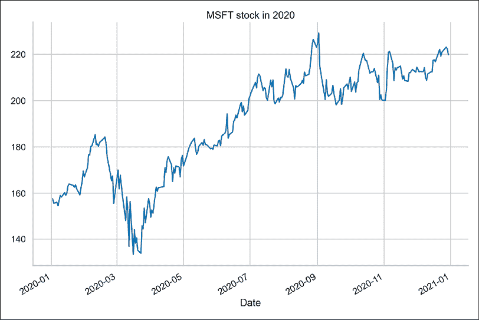

    图 3.1：微软 2020 年的调整后股票价格

    将调整后的收盘价和简单收益绘制在同一张图表中：

    ```py
    (
        df[["Adj Close", "simple_rtn"]]
        .plot(subplots=True, sharex=True, 
              title="MSFT stock in 2020")
    ) 
    ```

    运行代码会生成以下图表：

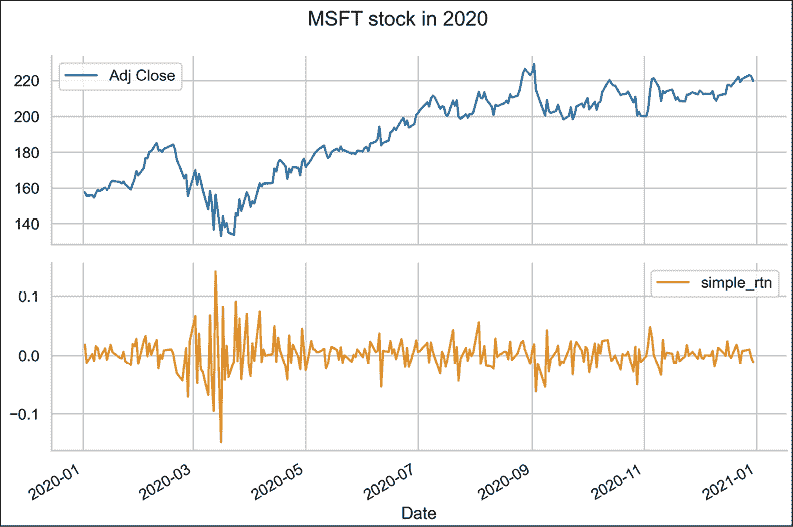

图 3.2：微软 2020 年的调整后股票价格和简单收益

在*图 3.2*中，我们可以清楚地看到 2020 年初的下跌——这是由 COVID-19 大流行开始引起的——导致收益的波动性（变化性）增加。我们将在接下来的章节中更熟悉波动性。

## 它是如何工作的……

在导入库之后，我们从 2020 年开始下载了微软的股票价格，并使用调整后的收盘价计算了简单收益。

然后，我们使用`pandas` DataFrame 的`plot`方法快速创建了一个折线图。我们指定的唯一参数是图表的标题。需要记住的是，我们在从 DataFrame 中子集化出一列数据（实际上是`pd.Series`对象）后才使用`plot`方法，日期自动被选作 x 轴，因为它们是 DataFrame/Series 的索引。

我们也可以使用更明确的表示法来创建完全相同的图表：

```py
df.plot.line(y="Adj Close", title="MSFT stock in 2020") 
```

`plot`方法绝不仅限于创建折线图（默认图表类型）。我们还可以创建直方图、条形图、散点图、饼图等等。要选择这些图表类型，我们需要指定`kind`参数，并选择相应的图表类型。请记住，对于某些类型的图表（如散点图），我们可能需要显式提供两个轴的值。

在*第 4 步*中，我们创建了一个包含两个子图的图表。我们首先选择了感兴趣的列（价格和收益），然后使用`plot`方法，指定我们要创建子图，并且这些子图应共享 x 轴。

## 还有更多内容……

还有许多有趣的内容值得提及，关于创建折线图，但我们将只涵盖以下两点，因为它们在实践中可能是最有用的。

首先，我们可以使用`matplotlib`的面向对象接口创建一个类似于前一个的图表：

```py
fig, ax = plt.subplots(2, 1, sharex=True)
df["Adj Close"].plot(ax=ax[0])
ax[0].set(title="MSFT time series",
          ylabel="Stock price ($)")

df["simple_rtn"].plot(ax=ax[1])
ax[1].set(ylabel="Return (%)")
plt.show() 
```

运行代码会生成以下图表：

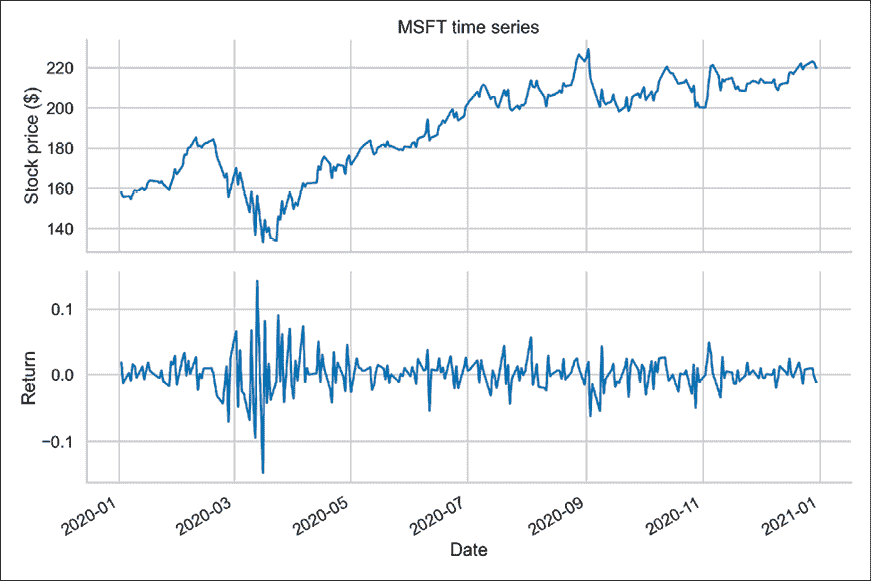

图 3.3：微软 2020 年的调整后股票价格和简单收益

尽管它与之前的图表非常相似，我们在上面加入了一些更多的细节，例如 y 轴标签。

这里有一点非常重要，并且在以后也会非常有用，那就是`matplotlib`的面向对象接口。在调用`plt.subplots`时，我们指示希望在单列中创建两个子图，并且还指定了它们将共享 x 轴。但真正关键的是函数的输出，即：

+   一个名为`fig`的`Figure`类实例。我们可以将其视为绘图的容器。

+   一个名为`ax`的`Axes`类实例（不要与图表的 x 轴和 y 轴混淆）。这些是所有请求的子图。在我们的例子中，我们有两个这样的子图。

*图 3.4* 展示了图形和坐标轴之间的关系：

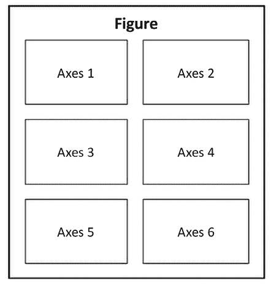

图 3.4：matplotlib 中的图形与坐标轴的关系

对于任何图形，我们可以在某种矩阵形式中安排任意数量的子图。我们还可以创建更复杂的配置，其中顶行可能是一个宽大的子图，而底行可能由两个较小的子图组成，每个子图的大小是大子图的一半。

在构建上面的图表时，我们仍然使用了`pandas` DataFrame 的`plot`方法。不同之处在于，我们明确指定了要在图形中放置子图的位置。我们通过提供`ax`参数来实现这一点。当然，我们也可以使用`matplotlib`的函数来创建图表，但我们希望节省几行代码。

另一个值得提及的事项是，我们可以将`pandas`的绘图后端更改为其他一些库，例如`plotly`。我们可以使用以下代码片段实现：

```py
df["Adj Close"].plot(title="MSFT stock in 2020", backend="plotly") 
```

运行代码生成以下交互式图表：

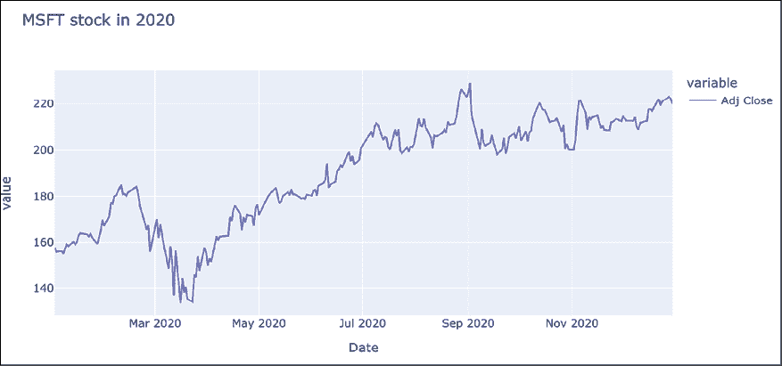

图 3.5：微软 2020 年调整后的股价，使用 plotly 可视化

不幸的是，使用`plotly`后端的优势在打印中是看不出来的。在笔记本中，您可以将鼠标悬停在图表上查看精确的数值（以及我们在工具提示中包含的任何其他信息）、放大特定时间段、筛选多条线（如果有的话）等更多功能。请参阅随附的笔记本（在 GitHub 上提供）以测试可视化的交互式功能。

在更改`plot`方法的后端时，我们应当注意两点：

+   我们需要安装相应的库。

+   一些后端在`plot`方法的某些功能上存在问题，最显著的是`subplots`参数。

为了生成前面的图表，我们在创建图表时指定了绘图后端。这意味着，下一个我们创建的图表如果没有明确指定，将使用默认的后端（`matplotlib`）。我们可以使用以下代码片段更改整个会话/笔记本的绘图后端：`pd.options.plotting.backend = "plotly"`。

## 另见

[`matplotlib.org/stable/index.html`](https://matplotlib.org/stable/index.html)—`matplotlib`的文档是关于该库的宝贵资料库，特别包含了如何创建自定义可视化的有用教程和提示。

# 可视化季节性模式

正如我们将在*第六章*《时间序列分析与预测》中所学到的那样，季节性在时间序列分析中起着非常重要的作用。我们所说的**季节性**是指在一定时间间隔（通常小于一年）内会重复出现的模式。例如，想象一下冰淇淋的销售，夏季销售通常会达到高峰，而冬季则会下降。这些模式每年都会出现。我们展示了如何使用稍微调整过的折线图来高效地研究这些模式。

在本节中，我们将视觉化调查 2014-2019 年间美国失业率的季节性模式。

## 如何操作……

执行以下步骤以创建显示季节性模式的折线图：

1.  导入库并进行身份验证：

    ```py
    import pandas as pd
    import nasdaqdatalink
    import seaborn as sns 

    nasdaqdatalink.ApiConfig.api_key = "YOUR_KEY_HERE" 
    ```

1.  从 Nasdaq 数据链接下载并显示失业数据：

    ```py
    df = (
        nasdaqdatalink.get(dataset="FRED/UNRATENSA", 
                           start_date="2014-01-01", 
                           end_date="2019-12-31")
        .rename(columns={"Value": "unemp_rate"})
    )
    df.plot(title="Unemployment rate in years 2014-2019") 
    ```

    运行代码会生成以下图表：

    

    图 3.6：2014 至 2019 年美国失业率

    失业率表示失业人数占劳动力人口的百分比。该值未做季节性调整，因此我们可以尝试找出一些模式。

    在*图 3.6*中，我们已经可以观察到一些季节性（重复性）模式，例如，每年失业率似乎在 1 月达到最高。

1.  创建包含`year`和`month`的新列：

    ```py
    df["year"] = df.index.year
    df["month"] = df.index.strftime("%b") 
    ```

1.  创建季节性图：

    ```py
    sns.lineplot(data=df, 
                 x="month", 
                 y="unemp_rate", 
                 hue="year",
                 style="year", 
                 legend="full",
                 palette="colorblind")
    plt.title("Unemployment rate - Seasonal plot")
    plt.legend(bbox_to_anchor=(1.05, 1), loc=2) 
    ```

    运行代码的结果如下图所示：

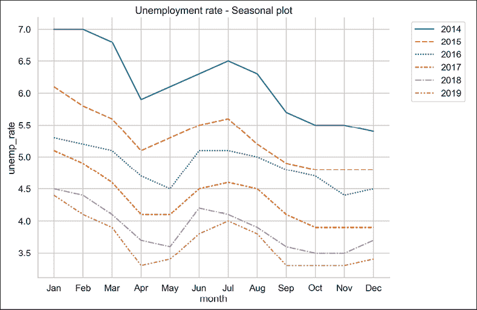

图 3.7：失业率的季节性图

通过展示每年各月的失业率，我们可以清楚地看到一些季节性模式。例如，最高失业率出现在 1 月，而最低失业率出现在 12 月。此外，似乎每年夏季失业率都有持续上升的趋势。

## 工作原理……

在第一步中，我们导入了库并与 Nasdaq 数据链接进行了身份验证。第二步，我们下载了 2014-2019 年的失业数据。为了方便起见，我们将`Value`列重命名为`unemp_rate`。

在*第 3 步*中，我们创建了两个新列，从索引中提取了年份和月份名称（索引为`DatetimeIndex`类型）。

在最后一步中，我们使用了`sns.lineplot`函数来创建季节性折线图。我们指定了要在 x 轴上使用月份，并将每一年绘制为一条独立的线（使用`hue`参数）。

我们也可以使用其他库创建类似的图表。我们使用了`seaborn`（这是`matplotlib`的封装）来展示该库。通常，如果你希望在图表中包括一些统计信息，例如在散点图上绘制最佳拟合线，推荐使用`seaborn`。

## 还有更多……

我们已经调查了在图表中调查季节性最简单的方法。在这一部分，我们还将讨论一些其他的可视化方法，这些方法能揭示更多关于季节性模式的信息。

1.  导入库：

    ```py
    from statsmodels.graphics.tsaplots import month_plot, quarter_plot
    import plotly.express as px 
    ```

1.  创建月份图：

    ```py
    month_plot(df["unemp_rate"], ylabel="Unemployment rate (%)")
    plt.title("Unemployment rate - Month plot") 
    ```

    运行代码生成以下图表：

    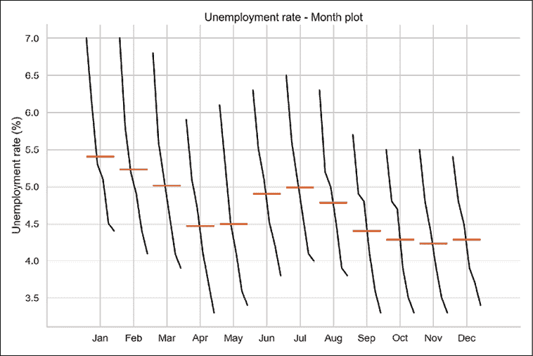

    图 3.8：失业率的月度图

    月度图是一个简单但富有信息的可视化图表。对于每个月，它绘制了一条独立的线，展示了失业率随时间的变化（虽然没有明确显示时间点）。此外，红色的水平线表示这些月份的平均值。

    我们可以通过分析*图 3.8*得出一些结论：

    +   通过查看平均值，我们可以看到之前描述的模式——在 1 月失业率最高，然后失业率下降，接着在夏季几个月反弹，最后在年底继续下降。

    +   多年来，失业率逐渐下降；然而，在 2019 年，下降幅度似乎比之前几年要小。我们可以通过观察 7 月和 8 月的线条角度来看到这一点。

1.  创建季度图：

    ```py
    quarter_plot(df["unemp_rate"].resample("Q").mean(), 
                 ylabel="Unemployment rate (%)")
    plt.title("Unemployment rate - Quarter plot") 
    ```

    运行代码生成以下图表：

    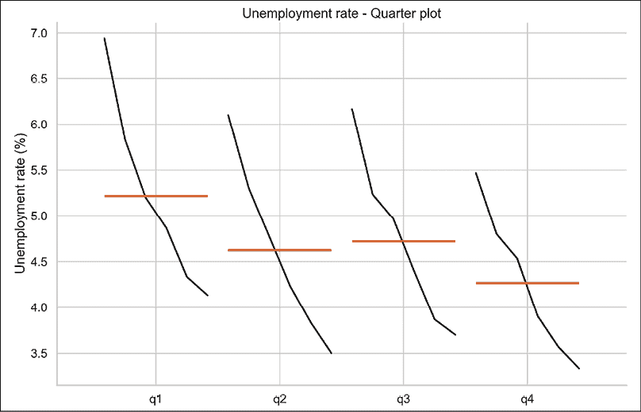

    图 3.9：失业率的季度图

    **季度图**与月度图非常相似，唯一的区别是我们在 x 轴上使用季度而不是月份。为了得到这个图表，我们必须通过取每个季度的平均值来重新采样每月的失业率。我们也可以取最后一个值。

1.  使用`plotly.express`创建极坐标季节性图：

    ```py
    fig = px.line_polar(
        df, r="unemp_rate", theta="month", 
        color="year", line_close=True, 
        title="Unemployment rate - Polar seasonal plot",
        width=600, height=500,
        range_r=[3, 7]
    )
    fig.show() 
    ```

    运行代码生成以下交互式图表：


图 3.10：失业率的极坐标季节性图

最后，我们创建了季节性图的一种变体，其中我们将线条绘制在极坐标平面上。这意味着极坐标图将数据可视化在径向和角度轴上。我们手动限制了径向范围，设置了`range_r=[3, 7]`。否则，图表会从 0 开始，且较难看出线条之间的差异。

我们可以得出的结论与常规季节性图类似，但可能需要一段时间才能适应这种表示方式。例如，通过查看 2014 年，我们可以立即看到失业率在第一季度最高。

# 创建交互式可视化

在第一个食谱中，我们简要预览了如何在 Python 中创建交互式可视化。在本食谱中，我们将展示如何使用三种不同的库：`cufflinks`、`plotly`和`bokeh`来创建交互式折线图。当然，这些并不是唯一可以用来创建交互式可视化的库。另一个你可能想进一步了解的流行库是`altair`。

`plotly`库建立在**d3.js**（一个用于在网页浏览器中创建交互式可视化的 JavaScript 库）之上，因其能够创建高质量的图表并具有高度的交互性（检查观察值、查看某一点的工具提示、缩放等）而闻名。Plotly 还是负责开发该库的公司，并提供我们的可视化托管服务。我们可以创建无限数量的离线可视化，并且可以创建少量的免费可视化分享到网上（每个可视化每天有查看次数限制）。

`cufflinks`是一个建立在`plotly`之上的包装库。在`plotly.express`作为`plotly`框架的一部分发布之前，它已经被发布。`cufflinks`的主要优势是：

+   它使绘图比纯粹的`plotly`更容易。

+   它使我们能够直接在`pandas` DataFrame 上创建`plotly`可视化。

+   它包含了一系列有趣的专业可视化图表，包括一个针对定量金融的特殊类（我们将在下一节中介绍）。

最后，`bokeh`是另一个用于创建交互式可视化的库，特别面向现代网页浏览器。通过使用`bokeh`，我们可以创建美观的交互式图形，从简单的折线图到复杂的交互式仪表板，支持流式数据集。`bokeh`的可视化由 JavaScript 驱动，但实际的 JavaScript 知识并不是创建可视化的必要条件。

在本节中，我们将使用 2020 年的微软股票价格创建一些交互式折线图。

## 如何实现…

执行以下步骤以下载微软的股票价格并创建交互式可视化：

1.  导入库并初始化笔记本显示：

    ```py
    import pandas as pd
    import yfinance as yf
    import cufflinks as cf
    from plotly.offline import iplot, init_notebook_mode
    import plotly.express as px
    import pandas_bokeh
    cf.go_offline()
    pandas_bokeh.output_notebook() 
    ```

1.  下载 2020 年的微软股票价格并计算简单收益：

    ```py
    df = yf.download("MSFT",
                     start="2020-01-01",
                     end="2020-12-31",
                     auto_adjust=False,
                     progress=False)
    df["simple_rtn"] = df["Adj Close"].pct_change()
    df = df.loc[:, ["Adj Close", "simple_rtn"]].dropna()
    df = df.dropna() 
    ```

1.  使用`cufflinks`创建图表：

    ```py
    df.iplot(subplots=True, shape=(2,1),
             shared_xaxes=True,
             title="MSFT time series") 
    ```

    运行代码会生成以下图表：

    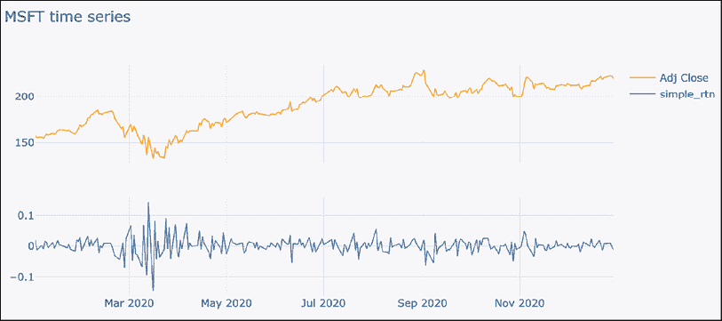

    图 3.11：使用 cufflinks 的时间序列可视化示例

    使用`cufflinks`和`plotly`生成的图表时，我们可以将鼠标悬停在折线图上，查看包含观察日期和确切值（或任何其他可用信息）的工具提示。我们还可以选择图表的某个部分进行缩放，以便更方便地进行分析。

1.  使用`bokeh`创建图表：

    ```py
    df["Adj Close"].plot_bokeh(kind="line", 
                               rangetool=True, 
                               title="MSFT time series") 
    ```

    执行代码会生成以下图表：

    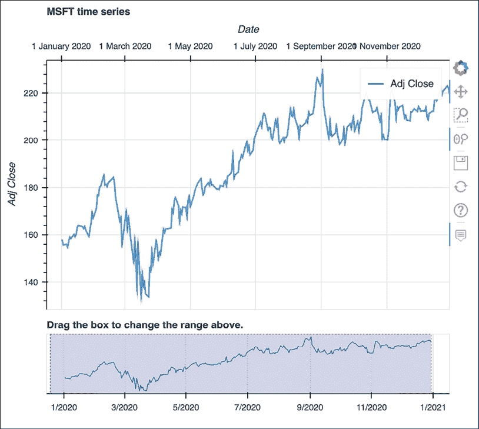

    图 3.12：使用 Bokeh 可视化的微软调整后的股票价格

    默认情况下，`bokeh`图表不仅具有工具提示和缩放功能，还包括范围滑块。我们可以使用它轻松缩小希望在图表中查看的日期范围。

1.  使用`plotly.express`创建图表：

    ```py
    fig = px.line(data_frame=df,
                  y="Adj Close",
                  title="MSFT time series")
    fig.show() 
    ```

    运行代码会产生以下可视化效果：


图 3.13：使用 plotly 的时间序列可视化示例

在*图 3.13*中，您可以看到交互式工具提示的示例，这对于识别分析时间序列中的特定观测值非常有用。

## 它是如何工作的……

在第一步中，我们导入了库并初始化了`bokeh`的`notebook`显示和`cufflinks`的离线模式。然后，我们下载了 2020 年微软的股价数据，使用调整后的收盘价计算了简单收益率，并仅保留了这两列以供进一步绘图。

在第三步中，我们使用`cufflinks`创建了第一个交互式可视化。如介绍中所提到的，得益于`cufflinks`，我们可以直接在`pandas` DataFrame 上使用`iplot`方法。它的工作方式类似于原始的`plot`方法。在这里，我们指示要在一列中创建子图，并共享 x 轴。该库处理了其余的部分，并创建了一个漂亮且互动性强的可视化。

在*步骤 4*中，我们使用`bokeh`创建了一个折线图。我们没有使用纯`bokeh`库，而是使用了一个围绕 pandas 的官方封装——`pandas_bokeh`。得益于此，我们可以直接在`pandas` DataFrame 上访问`plot_bokeh`方法，从而简化了图表创建的过程。

最后，我们使用了`plotly.express`框架，它现在是`plotly`库的一部分（之前是一个独立的库）。使用`px.line`函数，我们可以轻松地创建一个简单但交互性强的折线图。

## 还有更多…

在使用可视化讲述故事或向利益相关者或非技术观众展示分析结果时，有一些技巧可以提高图表传达给定信息的能力。注释就是其中一种技巧，我们可以轻松地将它们添加到`plotly`生成的图表中（我们也可以在其他库中做到这一点）。

我们在下面展示了所需的步骤：

1.  导入库：

    ```py
    from datetime import date 
    ```

1.  为`plotly`图表定义注释：

    ```py
    selected_date_1 = date(2020, 2, 19)
    selected_date_2 = date(2020, 3, 23)
    first_annotation = {
        "x": selected_date_1,
        "y": df.query(f"index == '{selected_date_1}'")["Adj Close"].squeeze(),
        "arrowhead": 5,
        "text": "COVID decline starting",
        "font": {"size": 15, "color": "red"},
    }
    second_annotation = {
        "x": selected_date_2,
        "y": df.query(f"index == '{selected_date_2}'")["Adj Close"].squeeze(),
        "arrowhead": 5,
        "text": "COVID recovery starting",
        "font": {"size": 15, "color": "green"},
        "ax": 150,
        "ay": 10
    } 
    ```

    字典包含了一些值得解释的元素：

    +   `x`/`y`—注释在 x 轴和 y 轴上的位置

    +   `text`—注释的文本

    +   `font`—字体的格式

    +   `arrowhead`—我们希望使用的箭头形状

    +   `ax`/`ay`—从指定点开始的 x 轴和 y 轴上的偏移量

    我们经常使用偏移量来确保注释不会与彼此或图表的其他元素重叠。

    定义完注释后，我们可以简单地将它们添加到图表中。

1.  更新图表的布局并显示它：

    ```py
    fig.update_layout(
     {"annotations": [first_annotation, second_annotation]}
    )
    fig.show() 
    ```

    运行代码片段会生成以下图表：


图 3.14：带有注释的时间序列可视化

使用注释，我们标记了市场因 COVID-19 大流行而开始下跌的日期，以及开始恢复和再次上涨的日期。用于注释的日期是通过查看图表简单选取的。

## 另见

+   [`bokeh.org/`](https://bokeh.org/)—有关`bokeh`的更多信息。

+   [`altair-viz.github.io/`](https://altair-viz.github.io/)—你还可以查看`altair`，这是另一个流行的 Python 交互式可视化库。

+   [`plotly.com/python/`](https://plotly.com/python/)—`plotly`的 Python 文档。该库也可用于其他编程语言，如 R、MATLAB 或 Julia。

# 创建蜡烛图

蜡烛图是一种金融图表，用于描述给定证券的价格波动。单个蜡烛图（通常对应一天，但也可以是其他频率）结合了**开盘价**、**最高价**、**最低价**和**收盘价**（**OHLC**）。

看涨蜡烛图的元素（在给定时间段内收盘价高于开盘价）如*图 3.15*所示：


图 3.15：看涨蜡烛图示意图

对于看跌蜡烛图，我们应该交换开盘价和收盘价的位置。通常，我们还会将蜡烛的颜色改为红色。

与前面介绍的图表相比，蜡烛图传达的信息比简单的调整后收盘价折线图要多得多。这就是为什么它们常用于实际交易平台，交易者通过它们识别模式并做出交易决策的原因。

在这个配方中，我们还添加了移动平均线（它是最基本的技术指标之一），以及表示成交量的柱状图。

## 准备就绪

在本配方中，我们将下载 Twitter 2018 年的（调整后的）股价。我们将使用 Yahoo Finance 下载数据，正如*第一章*《获取金融数据》中所描述的那样。按照以下步骤获取绘图所需的数据：

1.  导入库：

    ```py
    import pandas as pd
    import yfinance as yf 
    ```

1.  下载调整后的价格：

    ```py
    df = yf.download("TWTR",
                     start="2018-01-01",
                     end="2018-12-31",
                     progress=False,
                     auto_adjust=True) 
    ```

## 如何实现…

执行以下步骤以创建交互式蜡烛图：

1.  导入库：

    ```py
    import cufflinks as cf
    from plotly.offline import iplot
    cf.go_offline() 
    ```

1.  使用 Twitter 的股价创建蜡烛图：

    ```py
    qf = cf.QuantFig(
      df, title="Twitter's Stock Price", 
      legend="top", name="Twitter's stock prices in 2018"
    ) 
    ```

1.  向图表添加成交量和移动平均线：

    ```py
    qf.add_volume()
    qf.add_sma(periods=20, column="Close", color="red")
    qf.add_ema(periods=20, color="green") 
    ```

1.  显示图表：

    ```py
    qf.iplot() 
    ```

    我们可以观察到以下图表（在笔记本中是交互式的）：


图 3.16：2018 年 Twitter 股价的蜡烛图

在图表中，我们可以看到**指数移动平均**（**EMA**）比**简单移动平均**（**SMA**）对价格变化的适应速度更快。图表中的一些不连续性是由于我们使用的是日数据，并且周末/节假日没有数据。

## 工作原理…

在第一步中，我们导入了所需的库，并指定我们希望使用`cufflinks`和`plotly`的离线模式。

作为每次运行`cf.go_offline()`的替代方法，我们也可以通过运行`cf.set_config_file(offline=True)`来修改设置，始终使用离线模式。然后，我们可以使用`cf.get_config_file()`查看设置。

在*步骤 2*中，我们通过传入包含输入数据的 DataFrame 以及一些参数（如标题和图例位置），创建了一个`QuantFig`对象的实例。之后，我们本可以直接运行`QuantFig`的`iplot`方法来创建一个简单的蜡烛图。

在*步骤 3*中，我们通过使用`add_sma`/`add_ema`方法添加了两条移动平均线。我们决定考虑 20 个周期（在本例中为天数）。默认情况下，平均值是使用`close`列计算的，但我们可以通过提供`column`参数来更改此设置。

两条移动平均线的区别在于，指数加权移动平均线对最近的价格赋予了更多的权重。通过这样做，它对新信息更为敏感，并且能更快地对整体趋势的变化做出反应。

最后，我们使用`iplot`方法显示了图表。

## 还有更多…

正如本章引言所提到的，通常在 Python 中执行相同任务有多种方式，通常使用不同的库。我们还将展示如何使用纯`plotly`（如果你不想使用像`cufflinks`这样的封装库）和`mplfinance`（`matplotlib`的一个独立扩展，专门用于绘制金融数据）来创建蜡烛图：

1.  导入库：

    ```py
    import plotly.graph_objects as go
    import mplfinance as mpf 
    ```

1.  使用纯`plotly`创建蜡烛图：

    ```py
    fig = go.Figure(data=
      go.Candlestick(x=df.index,
      open=df["Open"],
      high=df["High"],
      low=df["Low"],
      close=df["Close"])
    )
    fig.update_layout(
      title="Twitter's stock prices in 2018",
      yaxis_title="Price ($)"
    )
    fig.show() 
    ```

    运行代码片段会生成以下图表：

    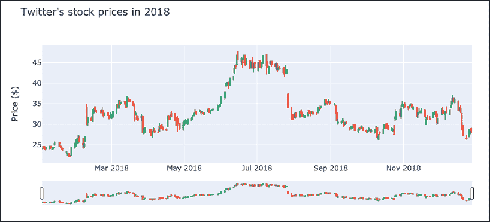

    图 3.17：使用 plotly 生成的蜡烛图示例

    这段代码有点长，但实际上非常简洁。我们需要传入一个`go.Candlestick`类的对象作为图形的`data`参数，图形则通过`go.Figure`来定义。然后，我们使用`update_layout`方法添加了标题和 y 轴标签。

    `plotly`实现的蜡烛图的便利之处在于，它配有一个范围滑块，我们可以用它交互式地缩小显示的蜡烛图范围，从而更详细地查看我们感兴趣的时间段。

1.  使用`mplfinance`创建蜡烛图：

    ```py
    mpf.plot(df, type="candle",
             mav=(10, 20),
             volume=True,
             style="yahoo",
             title="Twitter's stock prices in 2018",
             figsize=(8, 4)) 
    ```

    运行代码生成了以下图表：

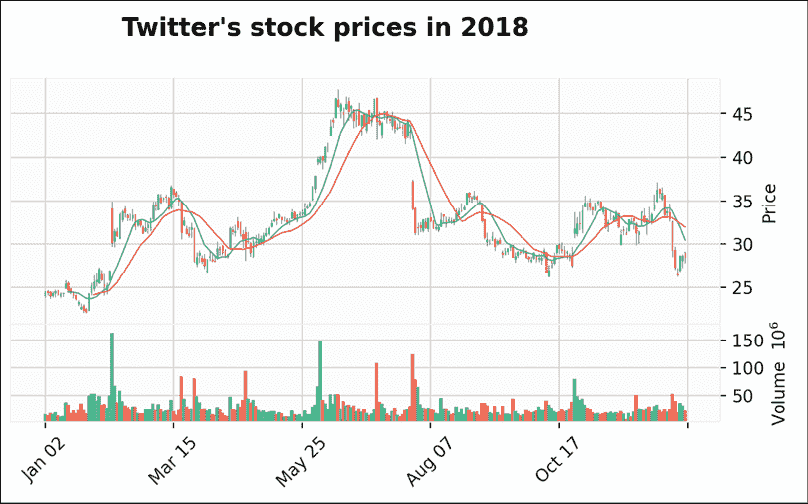

图 3.18：使用 mplfinance 生成的蜡烛图示例

我们使用了`mav`参数来指示我们想要创建两条移动平均线，分别为 10 天和 20 天的平均线。不幸的是，目前无法添加指数加权的变体。不过，我们可以使用`mpf.make_addplot`辅助函数向图形中添加额外的图表。我们还指示希望使用类似于 Yahoo Finance 风格的样式。

你可以使用命令`mpf.available_styles()`来显示所有可用的样式。

## 另见

一些有用的参考资料：

+   [`github.com/santosjorge/cufflinks`](https://github.com/santosjorge/cufflinks)—`cufflinks`的 GitHub 仓库

+   [`github.com/santosjorge/cufflinks/blob/master/cufflinks/quant_figure.py`](https://github.com/santosjorge/cufflinks/blob/master/cufflinks/quant_figure.py)——`cufflinks`的源代码可能对获取更多关于可用方法（不同指标和设置）的信息有帮助。

+   [`github.com/matplotlib/mplfinance`](https://github.com/matplotlib/mplfinance)——`mplfinance`的 GitHub 代码库。

+   [`github.com/matplotlib/mplfinance/blob/master/examples/addplot.ipynb`](https://github.com/matplotlib/mplfinance/blob/master/examples/addplot.ipynb)——这是一个包含如何向`mplfinance`生成的图表中添加额外信息的示例的 Notebook。

# 摘要

在本章中，我们介绍了可视化金融（以及非金融）时间序列的各种方法。绘制数据对于熟悉分析的时间序列非常有帮助。我们可以识别一些模式（例如，趋势或变更点），这些模式可能需要通过统计测试进行验证。数据可视化还可以帮助我们发现序列中的一些异常值（极端值）。这将引出下一章的主题，即自动模式识别和异常值检测。
