# 4

# 探索金融时间序列数据

在前几章中，我们学习了如何预处理和可视化探索金融时间序列数据。这次，我们将使用算法和/或统计测试来自动识别潜在问题（如异常值），并分析数据是否存在趋势或其他模式（例如均值回归）。

我们还将深入探讨资产收益的典型事实。与异常值检测一起，这些方法在处理金融数据时尤为重要。当我们想基于资产价格构建模型/策略时，必须确保它们能够准确捕捉收益的动态变化。

尽管如此，本章中描述的大多数技术不仅限于金融时间序列，也可以在其他领域有效使用。

本章中，我们将涵盖以下方法：

+   使用滚动统计进行异常值检测

+   使用汉佩尔滤波器检测异常值

+   检测时间序列中的变化点

+   检测时间序列中的趋势

+   使用赫斯特指数检测时间序列中的模式

+   调查资产收益的典型事实

# 使用滚动统计进行异常值检测

在处理任何类型的数据时，我们经常遇到与大多数数据明显不同的观察值，即**异常值**。在金融领域，它们可能是由于价格错误、金融市场发生重大事件或数据处理管道中的错误引起的。许多机器学习算法和统计方法可能会受到异常值的严重影响，从而导致错误或有偏的结果。因此，在创建任何模型之前，我们应该识别并处理异常值。

在本章中，我们将重点讨论点异常检测，即调查给定观察值是否与其他值相比显得突出。有不同的算法可以识别整个数据序列为异常。

在此方法中，我们介绍了一种相对简单的类似滤波的方法，通过滚动均值和标准差来检测异常值。我们将使用 2019 年至 2020 年期间的特斯拉股价数据。

## 如何做…

执行以下步骤，使用滚动统计检测异常值并在图表中标出：

1.  导入库：

    ```py
    import pandas as pd
    import yfinance as yf 
    ```

1.  下载 2019 年至 2020 年特斯拉的股价，并计算简单收益：

    ```py
    df = yf.download("TSLA",
                     start="2019-01-01",
                     end="2020-12-31",
                     progress=False)
    df["rtn"] = df["Adj Close"].pct_change()
    df = df[["rtn"]].copy() 
    ```

1.  计算 21 天滚动均值和标准差：

    ```py
    df_rolling = df[["rtn"]].rolling(window=21) \
                            .agg(["mean", "std"])
    df_rolling.columns = df_rolling.columns.droplevel() 
    ```

1.  将滚动数据重新合并到初始 DataFrame 中：

    ```py
    df = df.join(df_rolling) 
    ```

1.  计算上下限阈值：

    ```py
    N_SIGMAS = 3
    df["upper"] = df["mean"] + N_SIGMAS * df["std"]
    df["lower"] = df["mean"] - N_SIGMAS * df["std"] 
    ```

1.  使用先前计算的阈值识别异常值：

    ```py
    df["outlier"] = (
        (df["rtn"] > df["upper"]) | (df["rtn"] < df["lower"])
    ) 
    ```

1.  将收益与阈值一起绘制，并标出异常值：

    ```py
    fig, ax = plt.subplots()
    df[["rtn",  "upper",  "lower"]].plot(ax=ax)
    ax.scatter(df.loc[df["outlier"]].index,
               df.loc[df["outlier"], "rtn"],
               color="black", label="outlier")
    ax.set_title("Tesla's stock returns")
    ax.legend(loc="center left", bbox_to_anchor=(1, 0.5))
    plt.show() 
    ```

    运行代码片段生成以下图表：

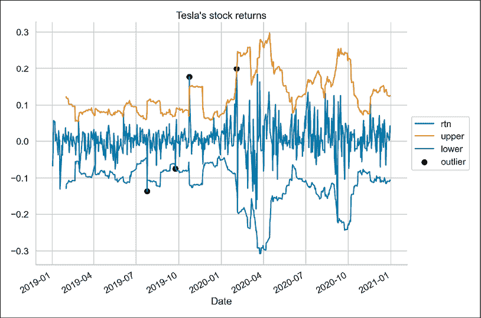

图 4.1：使用过滤算法识别的异常值

在图表中，我们可以观察到标记为黑点的异常值，并与用于确定这些异常值的阈值一起显示。需要注意的一点是，当两个大（绝对值上）收益值彼此接近时，算法将第一个识别为异常值，而将第二个识别为常规观测值。这可能是因为第一个异常值进入了滚动窗口并影响了移动平均/标准差。我们可以在 2020 年第一季度看到类似的情况。

我们还应该意识到所谓的“幽灵效应”。当一个单一的异常值进入滚动窗口时，它会在该异常值停留在窗口内的时间内，膨胀滚动统计量的值。

## 它是如何工作的……

在导入库之后，我们下载了特斯拉的股票价格，计算了收益，并仅保留了一个列——收益列，以便进一步分析。

为了识别异常值，我们首先通过使用 21 天滚动窗口来计算移动统计量。我们选择 21 作为窗口大小，因为这是一个月内的平均交易天数，在本例中，我们使用的是日数据。然而，我们可以选择不同的值，这样移动平均值将对变化作出更快或更慢的反应。如果我们认为对特定情况更有意义，也可以使用（指数）加权移动平均。为了实现移动指标，我们使用了`rolling`方法和`agg`方法结合的`pandas` DataFrame。计算完统计量后，我们删除了`MultiIndex`中的一个级别，以简化分析。

在应用滚动窗口时，我们使用了之前 21 个观测值来计算统计量。因此，第 22 行的数据可以得到第一个值。通过这种方法，我们避免了将未来的信息“泄露”到算法中。然而，可能存在一些情况下，我们并不介意这种信息泄露。在这些情况下，我们可能想使用居中窗口。这样，使用相同的窗口大小，我们将考虑过去 10 个观测值、当前值和接下来的 10 个未来数据点。为了做到这一点，我们可以使用`rolling`方法的`center`参数。

在*步骤 4*中，我们将滚动统计量重新合并到原始 DataFrame 中。然后，我们创建了包含上下决策阈值的额外列。我们决定使用滚动平均值上下方 3 个标准差作为边界。任何超出这些边界的观察值都被视为异常值。我们应该记住，过滤算法的逻辑是基于股票收益服从正态分布的假设。稍后在本章中，我们将看到这个假设在经验上并不成立。在*步骤 6*中，我们将该条件作为一个单独的列进行编码。

在最后一步，我们可视化了收益序列，并标出了上下决策阈值，同时用黑点标记了异常值。为了使图表更易读，我们将图例移出了绘图区域。

在实际应用中，我们不仅需要识别异常值，还需要对其进行处理，例如将它们限制在最大/最小可接受值内，使用插值值替换它们，或采用其他可能的处理方法。

## 还有更多内容…

### 定义函数

在本示例中，我们演示了如何将识别异常值的所有步骤作为对 DataFrame 的单独操作来执行。然而，我们可以快速将所有步骤封装到一个通用函数中，以处理更多的使用场景。下面是一个如何做到这一点的示例：

```py
def identify_outliers(df, column, window_size, n_sigmas):
    """Function for identifying outliers using rolling statistics"""

    df = df[[column]].copy()
    df_rolling = df.rolling(window=window_size) \
                   .agg(["mean", "std"])
    df_rolling.columns = df_rolling.columns.droplevel()
    df = df.join(df_rolling)
    df["upper"] = df["mean"] + n_sigmas * df["std"]
    df["lower"] = df["mean"] - n_sigmas * df["std"]

    return ((df[column] > df["upper"]) | (df[column] < df["lower"])) 
```

该函数返回一个 `pd.Series`，其中包含布尔标志，指示给定观测值是否为异常值。使用函数的一个额外好处是，我们可以轻松地通过不同的参数（例如窗口大小和用于创建阈值的标准差倍数）进行实验。

### 温莎化

另一种处理异常值的流行方法是 **温莎化**。它基于通过替换数据中的异常值来限制它们对任何潜在计算的影响。通过一个示例可以更容易理解温莎化。90% 的温莎化将会把前 5% 的值替换为第 95 百分位数。同样，底部 5% 的值会被替换为第 5 百分位数。我们可以在 `scipy` 库中找到相应的 `winsorize` 函数。

# 使用 Hampel 滤波器进行异常值检测

我们将介绍另一种用于时间序列异常值检测的算法——**Hampel 滤波器**。它的目标是识别并可能替换给定序列中的异常值。它使用一个大小为 2*x* 的居中滑动窗口（给定 *x* 个前后观测值）遍历整个序列。

对于每个滑动窗口，算法计算中位数和中位数绝对偏差（标准差的一种形式）。

为了使中位数绝对偏差成为标准差的一致估计量，我们必须将其乘以一个常数缩放因子 *k*，该因子依赖于分布。对于高斯分布，它大约是 1.4826。

类似于之前介绍的算法，如果观测值与窗口的中位数的差异超过了预定的标准差倍数，我们就将其视为异常值。然后，我们可以用窗口的中位数替换这个观测值。

我们可以通过调整算法超参数的不同设置来进行实验。例如，较高的标准差阈值使得滤波器更加宽容，而较低的标准差阈值则会使更多的数据点被归类为异常值。

在本示例中，我们将使用 Hampel 滤波器查看 2019 年至 2020 年特斯拉股价的时间序列中是否有任何观测值可以视为异常值。

## 如何操作…

执行以下步骤使用 Hampel 滤波器识别异常值：

1.  导入库：

    ```py
    import yfinance as yf
    from sktime.transformations.series.outlier_detection import HampelFilter 
    ```

1.  下载 2019 至 2020 年的特斯拉股价并计算简单收益：

    ```py
    df = yf.download("TSLA",
                     start="2019-01-01",
                     end="2020-12-31",
                     progress=False)
    df["rtn"] = df["Adj Close"].pct_change() 
    ```

1.  实例化 `HampelFilter` 类并使用它来检测异常值：

    ```py
    hampel_detector = HampelFilter(window_length=10, 
                                   return_bool=True)
    df["outlier"] = hampel_detector.fit_transform(df["Adj Close"]) 
    ```

1.  绘制特斯拉的股价并标记异常值：

    ```py
    fig, ax = plt.subplots()
    df[["Adj Close"]].plot(ax=ax)
    ax.scatter(df.loc[df["outlier"]].index,
               df.loc[df["outlier"], "Adj Close"],
               color="black", label="outlier")
    ax.set_title("Tesla's stock price")
    ax.legend(loc="center left", bbox_to_anchor=(1, 0.5))
    plt.show() 
    ```

    运行代码生成了以下图形：

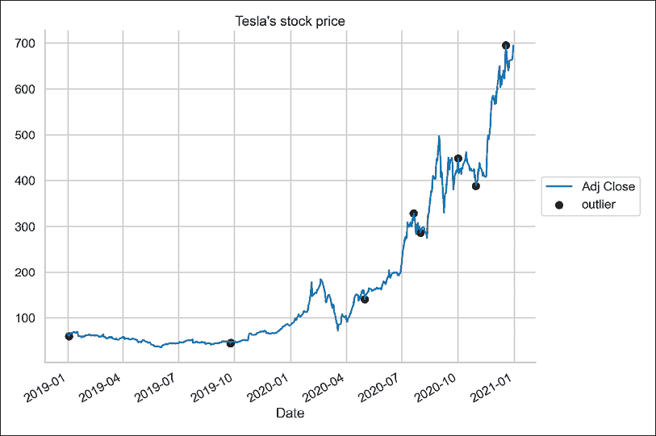

图 4.2：特斯拉股价及使用汉普尔滤波器识别的异常值

使用汉普尔滤波器，我们识别了七个异常值。乍一看，可能会觉得有点意外，甚至有些反直觉，因为 2020 年 9 月左右最大的波动（涨幅和跌幅）并未被检测到，而是之后出现的一些较小波动被识别为异常值。我们需要记住，这个滤波器使用的是一个中心窗口，因此，在观察波动峰值处的数据时，算法也会查看前后各五个数据点，这其中也包含了一些高值。

## 它是如何工作的…

前两步是相当标准的——我们导入了库，下载了股票价格，并计算了简单收益。

在*第 3 步*中，我们实例化了`HampelFilter`类的对象。我们使用了来自`sktime`库的滤波器实现，后者我们将在*第七章*，*基于机器学习的时间序列预测方法*中进一步探讨。我们指定了使用长度为 10 的窗口（前 5 个观察值和后 5 个观察值），并要求滤波器返回一个布尔标志，指示观察值是否为异常值。`return_bool`的默认设置会返回一个新序列，其中异常值会被替换为 NaN。这是因为`sktime`的作者建议使用该滤波器来识别并去除异常值，然后使用一个配套的`Imputer`类来填充缺失值。

`sktime`使用的方法与`scikit-learn`中可用的方法类似，因此我们首先需要将转换器对象`fit`到数据上，然后使用`transform`来获得指示观察值是否为异常值的标志。这里，我们通过将`fit_transform`方法应用于调整后的收盘价，完成了两步操作。

请参阅*第十三章*，*应用机器学习：识别信用违约*，了解更多关于使用`scikit-learn`的 fit/transform API 的信息。

在上一步中，我们绘制了股票价格的折线图，并将异常值标记为黑点。

## 还有更多内容…

为了对比，我们还可以将相同的滤波器应用于使用调整后的收盘价计算的收益。这样我们可以看到算法是否会识别不同的观察值为异常值：

1.  识别股票收益中的异常值：

    ```py
    df["outlier_rtn"] = hampel_detector.fit_transform(df["rtn"]) 
    ```

    由于我们已经实例化了`HampelFilter`，所以不需要再次实例化。我们只需将其拟合到新数据（收益）并进行转换，以获得布尔标志。

1.  绘制特斯拉的每日收益并标记异常值：

    ```py
    fig, ax = plt.subplots()
    df[["rtn"]].plot(ax=ax)
    ax.scatter(df.loc[df["outlier_rtn"]].index,
               df.loc[df["outlier_rtn"], "rtn"],
               color="black", label="outlier")
    ax.set_title("Tesla's stock returns")
    ax.legend(loc="center left", bbox_to_anchor=(1, 0.5))
    plt.show() 
    ```

    运行代码生成了以下图形：

    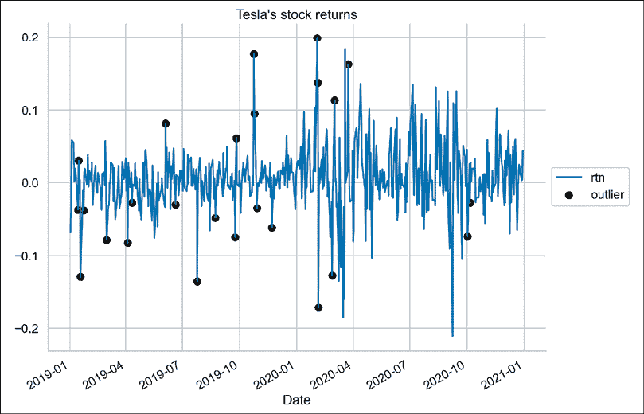

    图 4.3：特斯拉的股市收益及使用汉普尔滤波器识别的异常值

    我们可以立即看到，使用收益而非价格时，算法检测到了更多的异常值。

1.  调查价格和收益中识别出的异常值的重叠情况：

    ```py
    df.query("outlier == True and outlier_rtn == True") 
    ```

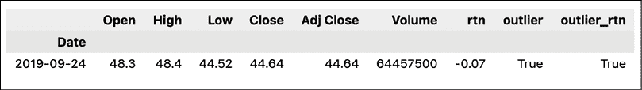

图 4.4：使用价格和收益率识别为离群点的日期

基于价格和收益率，只有一个日期被识别为离群点。

## 另请参见

异常/离群点检测是数据科学中的一个完整领域，存在许多识别可疑观测值的方法。我们已经介绍了两种特别适用于时间序列问题的算法。然而，通常情况下，有很多可能的异常检测方法。我们将在*第十三章*中介绍用于时间序列以外数据的离群点检测方法，*应用机器学习：识别信用违约*。其中一些方法也可以用于时间序列。

这里有一些有趣的异常/离群点检测库：

+   [`github.com/datamllab/tods`](https://github.com/datamllab/tods)

+   [`github.com/zillow/luminaire/`](https://github.com/zillow/luminaire/)

+   [`github.com/signals-dev/Orion`](https://github.com/signals-dev/Orion)

+   [`pycaret.org/anomaly-detection/`](https://pycaret.org/anomaly-detection/)

+   [`github.com/linkedin/luminol`](https://github.com/linkedin/luminol)—由 LinkedIn 创建的一个库；不幸的是，它目前不再积极维护

+   [`github.com/twitter/AnomalyDetection`](https://github.com/twitter/AnomalyDetection)—这个由 Twitter 创建的 R 包非常著名，且已由一些个人贡献者移植到 Python

其他一些参考资料：

+   Hampel F. R. 1974\. “影响曲线及其在稳健估计中的作用。” *美国统计学会期刊*，69: 382-393—介绍 Hampel 滤波器的论文

+   [`www.sktime.org/en/latest/index.html`](https://www.sktime.org/en/latest/index.html)—`sktime`的文档

# 检测时间序列中的变化点

**变化点**可以定义为某一时刻，过程或时间序列的概率分布发生变化的点，例如，当序列中的均值发生变化时。

在本例中，我们将使用**CUSUM**（累积和）方法来检测时间序列中的均值变化。该方法在实现中有两个步骤：

1.  查找变化点——首先在给定时间序列的中间初始化一个变化点，然后基于选定的点执行 CUSUM 方法。接下来的变化点通过寻找前一个 CUSUM 时间序列的最大值或最小值来定位（具体取决于我们想要找到的变化点方向）。我们将继续这个过程，直到找到一个稳定的变化点或超过最大迭代次数。

1.  测试其统计显著性——使用对数似然比检验来测试给定时间序列的均值是否在识别出的变化点处发生了变化。原假设认为序列的均值没有变化。

关于算法实现的进一步说明：

+   该算法可用于检测向上和向下的变化点。

+   该算法最多可以找到一个向上和一个向下的变化点。

+   默认情况下，仅在拒绝原假设时才会报告变化点。

+   在底层，使用高斯分布来计算 CUSUM 时间序列值并执行假设检验。

在这个案例中，我们将应用 CUSUM 算法来识别 2020 年苹果股票价格中的变化点。

## 如何实现…

执行以下步骤以检测苹果公司股票价格中的变化点：

1.  导入库：

    ```py
    import yfinance as yf
    from kats.detectors.cusum_detection import CUSUMDetector
    from kats.consts import TimeSeriesData 
    ```

1.  下载 2020 年苹果公司的股票价格：

    ```py
    df = yf.download("AAPL",
                     start="2020-01-01",
                     end="2020-12-31",
                     progress=False) 
    ```

1.  仅保留调整后的收盘价格，重置索引，并重命名列：

    ```py
    df = df[["Adj Close"]].reset_index(drop=False)
    df.columns = ["time", "price"] 
    ```

1.  将 DataFrame 转换为`TimeSeriesData`对象：

    ```py
    tsd = TimeSeriesData(df) 
    ```

1.  实例化并运行变化点检测器：

    ```py
    cusum_detector = CUSUMDetector(tsd)
    change_points = cusum_detector.detector(
        change_directions=["increase"]
    )
    cusum_detector.plot(change_points) 
    ```

    运行代码会生成以下图表：

    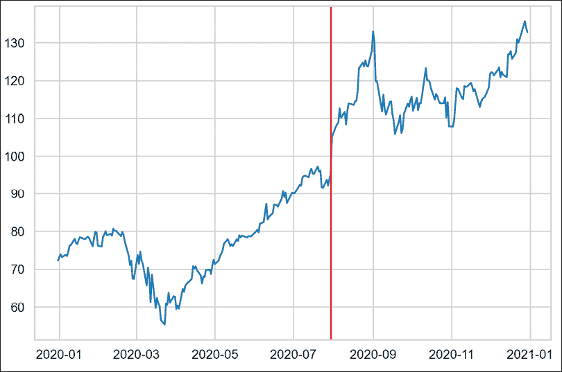

    图 4.5：CUSUM 算法检测到的变化点

    我们看到算法选择了最大的跳跃作为变化点。

1.  更详细地调查检测到的变化点：

    ```py
    point, meta = change_points[0]
    point 
    ```

    返回以下关于检测到的变化点的信息：

    ```py
    TimeSeriesChangePoint(start_time: 2020-07-30 00:00:00, end_time: 2020-07-30 00:00:00, confidence: 1.0) 
    ```

识别出的变化点发生在 7 月 30 日，确实股票价格从当日的$95.4 跃升至次日的$105.4，主要由于强劲的季度财报。

## 它是如何工作的…

在第一步中，我们导入了所需的库。为了检测变化点，我们使用了 Facebook 的`kats`库。接着，我们获取了 2020 年苹果的股票价格。对于这个分析，我们使用了调整后的收盘价格。

为了使用`kats`，我们需要将数据转换为特定格式。因此，在*步骤 3*中，我们仅保留了调整后的收盘价格，重置了索引而没有删除它（因为我们需要该列），并且重命名了列。需要记住的一点是，包含日期/时间的列必须命名为`time`。在*步骤 4*中，我们将 DataFrame 转换为`TimeSeriesData`对象，这是`kats`使用的表示形式。

在*步骤 5*中，我们使用先前创建的数据实例化了`CUSUMDetector`。我们没有更改任何默认设置。然后，我们使用`detector`方法识别变化点。对于这个分析，我们只关心上升的变化点，因此我们指定了`change_directions`参数。最后，我们使用`cusum_detector`对象的`plot`方法绘制检测到的变化点。需要注意的一点是，我们必须将已识别的变化点作为输入提供给该方法。

在最后一步，我们进一步检查了检测到的变化点。返回的对象是一个包含两个元素的列表：`TimeSeriesChangePoint`对象，包含关于变化点的信息，如变化点的日期和算法的置信度，以及一个元数据对象。通过使用后者的`__dict__`方法，我们可以获取有关该点的更多信息：变化的方向、变化点前后的均值、似然比检验的 p 值等。

## 还有更多…

该库还提供了更多有关变点检测的有趣功能。我们将只介绍其中的两种，强烈鼓励你自行进一步探索。

### 限制检测窗口

第一个方法是限制我们想要查找变点的窗口。我们可以通过 `detector` 方法的 `interest_window` 参数来做到这一点。下面，我们只在第 200 到第 250 个观测值之间查找变点（提醒：这是一个交易年份，而非完整的日历年，因此只有大约 252 个观测值）。

缩小我们想要查找变点的窗口：

```py
change_points = cusum_detector.detector(change_directions=["increase"],
                                        interest_window=[200, 250])
cusum_detector.plot(change_points) 
```

我们可以在以下图表中看到修改后的结果：

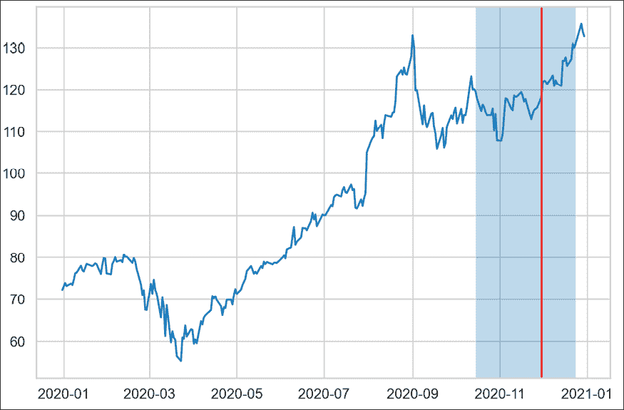

图 4.6：在序列中的第 200^(th) 到第 250^(th) 个观测值之间识别到变点

除了已识别的变点外，我们还可以看到我们选择的窗口。

### 使用不同的变点检测算法

`kats` 库还包含其他有趣的变点检测算法。其之一是 `RobustStatDetector`。不深入讲解算法本身，它在识别兴趣点之前会使用移动平均对数据进行平滑处理。该算法的另一个有趣特点是，它可以在一次运行中检测多个变点。

使用另一个算法检测变点（`RobustStatDetector`）：

```py
from kats.detectors.robust_stat_detection import RobustStatDetector
robust_detector = RobustStatDetector(tsd)
change_points = robust_detector.detector()
robust_detector.plot(change_points) 
```

运行该代码片段会生成以下图表：

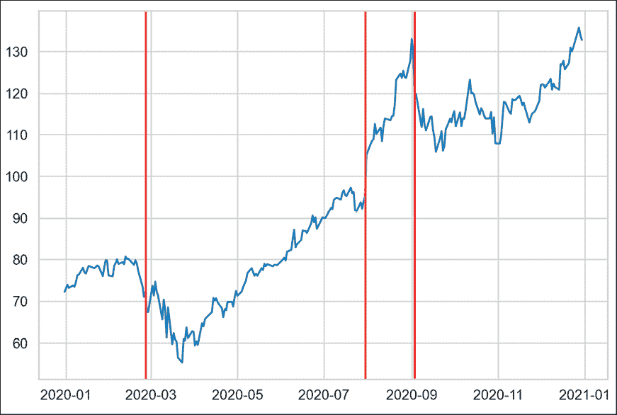

图 4.7：使用 RobustStatDetector 识别变点

这次，算法比之前的尝试多检测到了两个变点。

`kats` 库提供的另一个有趣算法是**贝叶斯在线变点检测**（**BOCPD**），我们在*参见*部分提供了相关参考。

## 参见

+   [`github.com/facebookresearch/Kats`](https://github.com/facebookresearch/Kats)—Facebook Kats 的 GitHub 仓库

+   Page, E. S. 1954\. “连续检验方案。”Biometrika 41(1): 100–115

+   Adams, R. P., & MacKay, D. J. (2007). *贝叶斯在线变点检测*。arXiv 预印本 arXiv:0710.3742

# 时间序列中的趋势检测

在之前的示例中，我们介绍了变点检测。另一类算法可以用于趋势检测，即识别时间序列中的显著且持续的变化。

`kats` 库提供了一种基于非参数**Mann-Kendall**（**MK**）检验的趋势检测算法。该算法会在指定大小的窗口上迭代执行 MK 检验，并返回每个窗口的起始点，在这些窗口中，MK 检验结果显示出统计显著性。

为了检测窗口中是否存在显著的趋势，测试会检查时间序列中的增减是否单调，而不是值变化的幅度。MK 测试使用了一种叫做肯德尔 Tau 的统计量，它的范围从-1 到 1。我们可以这样解读这些值：

+   -1 表示完全单调下降

+   1 表示完全单调增加

+   0 表示序列中没有方向性的趋势

默认情况下，算法只会返回统计上显著的时间段。

你可能会想，为什么要使用算法来检测趋势，当在图表上它们很容易就能看出来呢？这是非常正确的；然而，我们应该记住，使用这些算法的目的是一次性查看多个序列和时间段。我们希望能够大规模地检测趋势，例如，在成百上千的时间序列中找到上升趋势。

在本食谱中，我们将使用趋势检测算法来研究 2020 年 NVIDIA 股票价格中是否存在显著的上升趋势的时间段。

## 如何实现……

执行以下步骤以检测 2020 年 NVIDIA 股票价格中的上升趋势：

1.  导入库：

    ```py
    import yfinance as yf
    from kats.consts import TimeSeriesData
    from kats.detectors.trend_mk import MKDetector 
    ```

1.  下载 2020 年 NVIDIA 的股票价格：

    ```py
    df = yf.download("NVDA",
                     start="2020-01-01",
                     end="2020-12-31",
                     progress=False) 
    ```

1.  仅保留调整后的收盘价，重置索引并重命名列：

    ```py
    df = df[["Adj Close"]].reset_index(drop=False)
    df.columns = ["time", "price"] 
    ```

1.  将 DataFrame 转换为`TimeSeriesData`对象：

    ```py
    tsd = TimeSeriesData(df) 
    ```

1.  实例化并运行趋势检测器：

    ```py
    trend_detector = MKDetector(tsd, threshold=0.9)
    time_points = trend_detector.detector(
        direction="up", 
        window_size=30
    ) 
    ```

1.  绘制检测到的时间点：

    ```py
    trend_detector.plot(time_points) 
    ```

    运行这行代码会得到以下图表：

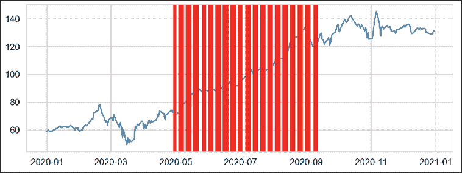

图 4.8：识别出的上升趋势起点

在*图 4.8*中，我们可以看到许多时间段，之间有一些间隔。需要知道的重要信息是，红色的竖条并不是检测到的窗口，而是许多紧挨在一起的检测到的趋势起点。对我们的数据运行选择的算法配置后，识别出了 95 个上升趋势的时间段，这些时间段显然有很大的重叠。

## 它是如何工作的……

前四个步骤与之前的做法非常相似，唯一的不同是这次我们下载了 2020 年 NVIDIA 的股票价格。有关准备数据以便使用`kats`库的更多信息，请参考之前的食谱。

在*步骤 5*中，我们实例化了趋势检测器（`MKDetector`类），并提供了数据，同时将 Tau 系数的阈值更改为 0.9。这样，我们只获得趋势强度更高的时间段。接着，我们使用`detector`方法查找时间点。我们感兴趣的是 30 天窗口内的上升趋势（`direction="up"`）。

还有其他一些检测器的参数可以调整。例如，我们可以通过使用`freq`参数来指定数据中是否存在季节性。

在*步骤 6*中，我们绘制了结果。我们还可以详细检查 95 个检测到的点中的每一个。返回的`time_points`对象是一个元组列表，每个元组包含一个`TimeSeriesChangePoint`对象（包含检测到的趋势期的开始日期）和该点的元数据。在我们的例子中，我们寻找的是 30 天窗口内的上升趋势期。自然地，由于我们识别了多个点，每个点都是该期间的开始，因此这些上升趋势的期间会有很多重叠。如图所示，许多被识别的点是连续的。

## 另见

+   Mann, H. B. 1945. “反趋势的非参数检验。”《经济计量学》13: 245-259。

+   Kendall, M. G. 1948. *秩相关方法*。Griffin。

# 使用赫斯特指数检测时间序列中的模式

在金融领域，许多交易策略基于以下之一：

+   **动量**——投资者试图利用现有市场趋势的持续性来确定其持仓

+   **均值回归**——投资者假设股票回报和波动性等属性会随着时间的推移回归到其长期平均水平（也称为奥恩斯坦-乌伦贝克过程）

虽然我们可以通过视觉检查相对容易地将时间序列分类为两类之一，但这种方法显然不适用大规模分析。这就是为什么我们可以使用赫斯特指数等方法来识别给定的时间序列（不一定是金融类的）是否呈趋势性、均值回归或仅仅是随机游走。

随机游走是一个过程，其中路径由一系列随机步骤组成。应用于股价时，这表明股价的变化具有相同的分布，并且相互独立。这意味着，股票价格的过去走势（或趋势）不能用来预测其未来走势。欲了解更多信息，请参见*第十章，金融中的蒙特卡罗模拟*。

**赫斯特指数** **(H)** 是衡量时间序列长期记忆的一个指标，也就是说，它衡量该序列偏离随机游走的程度。赫斯特指数的值在 0 和 1 之间，具有以下解释：

+   H < 0.5——一个序列是均值回归的。值越接近 0，均值回归过程越强。

+   H = 0.5——一个序列是几何随机游走。

+   H > 0.5——一个序列是趋势性的。值越接近 1，趋势越强。

计算赫斯特指数有几种方法。在这个例子中，我们将专注于基于估算扩散行为速率的方法，该方法基于对数价格的方差。对于实际例子，我们将使用 20 年的标准普尔 500 每日价格数据。

## 如何做……

执行以下步骤，检查标准普尔 500 指数的价格是否呈现趋势性、均值回归性或是随机游走的例子：

1.  导入库：

    ```py
    import yfinance as yf
    import numpy as np
    import pandas as pd 
    ```

1.  下载 2000 到 2019 年间标准普尔 500 的历史价格：

    ```py
    df = yf.download("^GSPC",
                     start="2000-01-01",
                     end="2019-12-31",
                     progress=False)
    df["Adj Close"].plot(title="S&P 500 (years 2000-2019)") 
    ```

    运行代码生成如下图：

    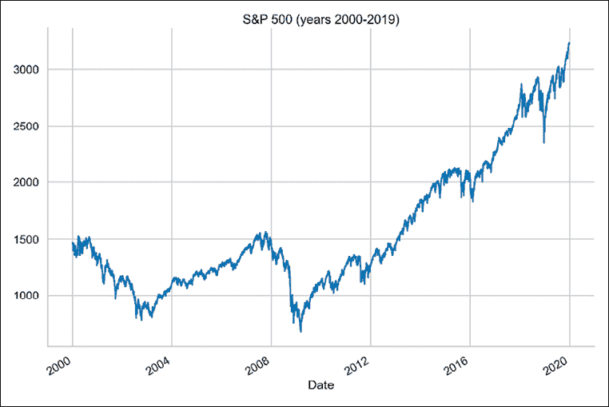

    图 4.9：2000 至 2019 年标准普尔 500 指数

    我们绘制数据，以便对计算出的赫斯特指数有初步的直觉。

1.  定义一个计算赫斯特指数的函数：

    ```py
    def get_hurst_exponent(ts, max_lag=20):
        """Returns the Hurst Exponent of the time series"""
        lags = range(2, max_lag)
        tau = [np.std(np.subtract(ts[lag:], ts[:-lag])) for lag in lags]
        hurst_exp = np.polyfit(np.log(lags), np.log(tau), 1)[0]
        return hurst_exp 
    ```

1.  使用不同的`max_lag`参数值计算赫斯特指数的值：

    ```py
    for lag in [20, 100, 250, 500, 1000]:
        hurst_exp = get_hurst_exponent(df["Adj Close"].values, lag)
        print(f"Hurst exponent with {lag} lags: {hurst_exp:.4f}") 
    ```

    这将返回以下内容：

    ```py
    Hurst exponent with 20 lags: 0.4478
    Hurst exponent with 100 lags: 0.4512
    Hurst exponent with 250 lags: 0.4917
    Hurst exponent with 500 lags: 0.5265
    Hurst exponent with 1000 lags: 0.5180 
    ```

    我们包含的滞后期数越多，越接近得出标准普尔 500 序列是随机游走的结论。

1.  将数据缩小到 2005 至 2007 年，并重新计算赫斯特指数：

    ```py
    shorter_series = df.loc["2005":"2007", "Adj Close"].values
    for lag in [20, 100, 250, 500]:
        hurst_exp = get_hurst_exponent(shorter_series, lag)
        print(f"Hurst exponent with {lag} lags: {hurst_exp:.4f}") 
    ```

    这将返回以下内容：

    ```py
    Hurst exponent with 20 lags: 0.3989
    Hurst exponent with 100 lags: 0.3215
    Hurst exponent with 250 lags: 0.2507
    Hurst exponent with 500 lags: 0.1258 
    ```

看起来 2005 到 2007 年期间的序列具有均值回归特性。作为参考，讨论的时间序列如下所示：

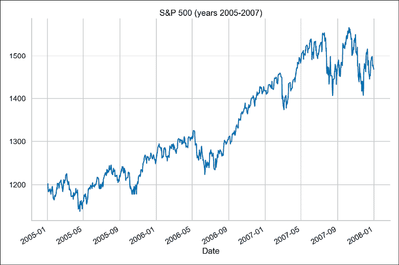

图 4.10：2005 至 2007 年标准普尔 500 指数

## 它是如何工作的……

在导入所需的库之后，我们从雅虎财经下载了 20 年的每日标准普尔 500 指数价格。从图表来看，很难判断该时间序列是纯粹的趋势型、均值回归型，还是随机游走型。尤其是在序列的后半段，似乎有一个明显的上升趋势。

在*步骤 3*中，我们定义了一个用于计算赫斯特指数的函数。对于这种方法，我们需要提供用于计算的最大滞后期数。正如我们稍后将看到的，这个参数对结果有很大影响。

赫斯特指数的计算可以总结为两个步骤：

1.  对于考虑的每个滞后期，我们计算差分序列的标准差（我们将在*第六章*“时间序列分析与预测”中更详细地讨论差分）。

1.  计算滞后期与标准差的对数图的斜率，以获取赫斯特指数。

在*步骤 4*中，我们计算并打印了不同`max_lag`参数值范围内的赫斯特指数。对于较低的参数值，序列可以被视为稍微具有均值回归特性。随着参数值的增加，解释倾向于认为该序列是一个随机游走。

在*步骤 5*中，我们进行了类似的实验，但这次是在一个限制的时间序列上进行的。我们只查看了 2005 至 2007 年的数据。由于在限制时间序列中没有足够的观察值，我们还不得不去除`max_lag`为 1000 的情况。正如我们所见，结果比之前有所变化，从`max_lag`为 20 时的 0.4 变化为 500 滞后期时的 0.13。

在使用赫斯特指数进行分析时，我们应记住，结果可能会因以下因素而有所不同：

+   我们用来计算赫斯特指数的方法

+   `max_lag`参数的值

+   我们正在观察的时期——局部模式可能与全局模式有很大不同

## 还有更多……

正如我们在介绍中提到的，计算赫斯特指数的方法有多种。另一个相当流行的方法是使用**重标范围（R/S）分析**。简要的文献回顾表明，与自相关分析、方差比率分析等其他方法相比，使用 R/S 统计量能取得更好的结果。该方法的一个可能缺点是它对短期依赖关系非常敏感。

要实现基于重标范围分析的赫斯特指数，您可以查看 `hurst` 库。

## 另见

+   [`github.com/Mottl/hurst`](https://github.com/Mottl/hurst)——`hurst` 库的仓库

+   Hurst, H. E. 1951 年。“水库的长期储存能力。” *ASCE Transactions* 116(1): 770–808

+   Kroha, P., & Skoula, M. 2018 年 3 月. *赫斯特指数与基于市场时间序列的交易信号*。载于 *ICEIS* (1): 371–378

# 研究资产收益的典型事实

**典型事实**是许多实证资产收益（跨时间和市场）中存在的统计性质。了解这些性质很重要，因为当我们构建应能表示资产价格动态的模型时，模型应能捕捉/复现这些特性。

在这个案例中，我们使用 2000 到 2020 年间的日度标准普尔 500 指数收益数据来研究五个典型事实。

## 准备工作

由于这是一个较长的案例，并包含更多的子部分，我们将在本节中导入所需的库并准备数据：

1.  导入所需的库：

    ```py
    import pandas as pd
    import numpy as np
    import yfinance as yf
    import seaborn as sns
    import scipy.stats as scs
    import statsmodels.api as sm
    import statsmodels.tsa.api as smt 
    ```

1.  下载标准普尔 500 指数数据并计算收益：

    ```py
    df = yf.download("^GSPC", 
                     start="2000-01-01", 
                     end="2020-12-31",
                     progress=False)

    df = df[["Adj Close"]].rename(
        columns={"Adj Close": "adj_close"}
    )
    df["log_rtn"] = np.log(df["adj_close"]/df["adj_close"].shift(1))
    df = df[["adj_close", "log_rtn"]].dropna() 
    ```

## 如何实现…

在本节中，我们将依次研究标准普尔 500 指数收益系列中的五个典型事实：

### 事实 1：收益的非高斯分布

文献中观察到，（日度）资产收益呈现出以下特征：

+   **负偏度（第三矩）**：大负收益出现的频率大于大正收益

+   **过度峰度**（**四阶矩**）：大（和小）收益比在正态分布下预期的发生得更频繁

矩是描述概率分布的一组统计量。前四个矩如下：期望值（均值）、方差、偏度和峰度。

运行以下步骤，通过绘制收益的直方图和**分位数-分位数**（**Q-Q**）图，来研究第一个事实的存在。

1.  使用观测收益的均值和标准差计算正态**概率密度函数**（**PDF**）：

    ```py
    r_range = np.linspace(min(df["log_rtn"]), 
                          max(df["log_rtn"]), 
                          num=1000)
    mu = df["log_rtn"].mean()
    sigma = df["log_rtn"].std()
    norm_pdf = scs.norm.pdf(r_range, loc=mu, scale=sigma) 
    ```

1.  绘制直方图和 Q-Q 图：

    ```py
    fig, ax = plt.subplots(1, 2, figsize=(16, 8))

    # histogram
    sns.distplot(df.log_rtn, kde=False, 
                 norm_hist=True, ax=ax[0])                                    
    ax[0].set_title("Distribution of S&P 500 returns", 
                    fontsize=16)                                                    
    ax[0].plot(r_range, norm_pdf, "g", lw=2, 
               label=f"N({mu:.2f}, {sigma**2:.4f})")
    ax[0].legend(loc="upper left")

    # Q-Q plot
    qq = sm.qqplot(df.log_rtn.values, line="s", ax=ax[1])
    ax[1].set_title("Q-Q plot", fontsize=16)
    plt.show() 
    ```

    执行代码后会得到以下图表：

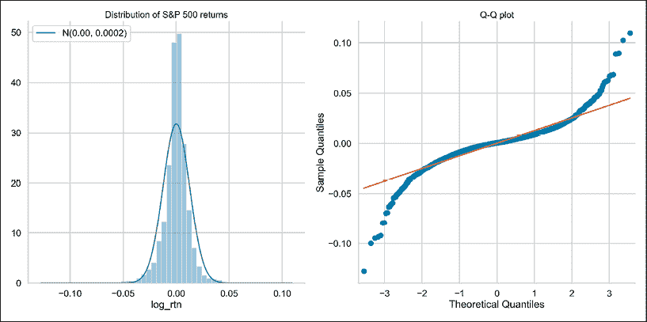

图 4.11：使用直方图和 Q-Q 图可视化标准普尔 500 指数收益的分布

我们可以使用直方图（展示分布的形状）和 Q-Q 图来评估对数收益的正态性。此外，我们还可以打印总结统计量（请参考 GitHub 仓库中的代码）：

```py
---------- Descriptive Statistics ----------
Range of dates: 2000-01-03 – 2020-12-30
Number of observations: 5283
Mean: 0.0002
Median: 0.0006
Min: -0.1277
Max: 0.1096
Standard Deviation: 0.0126
Skewness: -0.3931
Kurtosis: 10.9531
Jarque-Bera statistic: 26489.07 with p-value: 0.00 
```

通过查看均值、标准差、偏度和峰度等度量，我们可以推断它们偏离了我们在正态分布下的预期。标准正态分布的四个矩分别是 0、1、0 和 0。此外，Jarque-Bera 正态性检验使我们有理由拒绝原假设，并表明该分布在 99%的置信水平下是正态的。

回报不服从正态分布这一事实至关重要，因为许多统计模型和方法假设随机变量服从正态分布。

### 事实 2：波动率聚集

**波动率聚集**是指价格的大幅变动往往会被随后的大幅变动（高波动期）所跟随，而价格的小幅变动则会被小幅变动（低波动期）所跟随。

运行以下代码以通过绘制对数回报序列来调查第二个事实：

```py
(
    df["log_rtn"]
    .plot(title="Daily S&P 500 returns", figsize=(10, 6))
) 
```

执行代码后会得到以下图表：

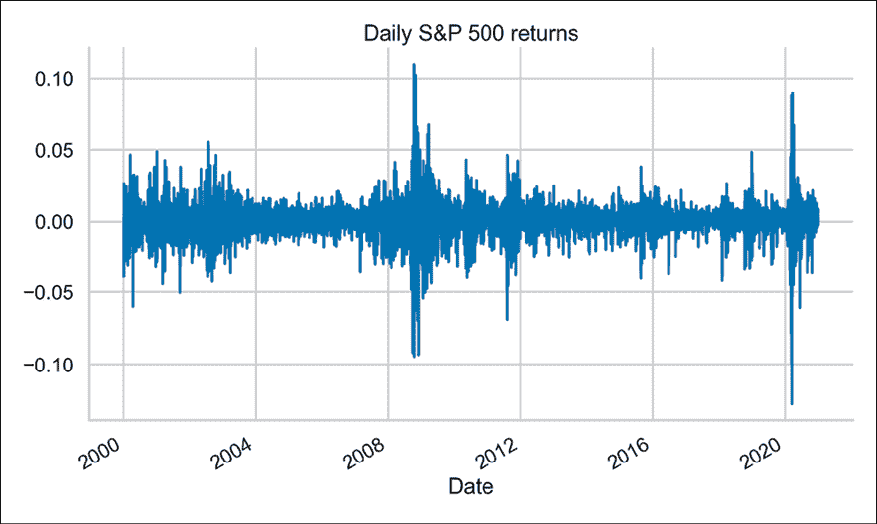

图 4.12：标准普尔 500 指数回报中的波动率聚集示例

我们可以观察到波动率的明显聚集——高正回报和负回报的时期。波动率并非恒定，而且它的变化有一些模式，这一点在我们尝试预测波动率时非常有用，例如使用 GARCH 模型。更多信息，请参考*第九章*，*使用 GARCH 类模型进行波动率建模*。

### 事实 3：回报中不存在自相关

**自相关**（也称为序列相关性）衡量的是给定时间序列与其滞后版本在连续时间间隔中的相似程度。

在下文中，我们通过陈述回报中不存在自相关来调查第三个事实：

1.  定义用于创建自相关图的参数：

    ```py
    N_LAGS = 50
    SIGNIFICANCE_LEVEL = 0.05 
    ```

1.  运行以下代码以创建对数收益的**自相关函数**（**ACF**）图：

    ```py
    acf = smt.graphics.plot_acf(df["log_rtn"],
      lags=N_LAGS,
      alpha=SIGNIFICANCE_LEVEL)
    plt.show() 
    ```

    执行该代码片段后会得到以下图表：

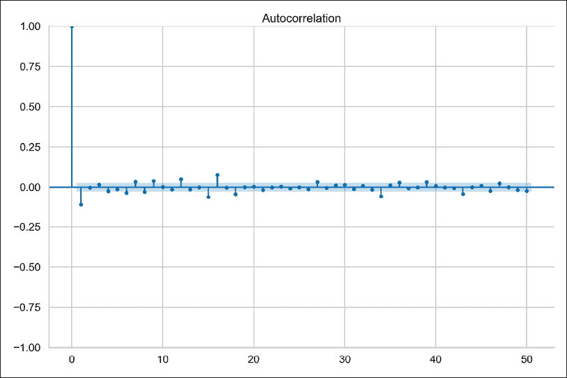

图 4.13：标准普尔 500 指数回报的自相关函数图

只有少数值位于置信区间之外（我们不看滞后期 0），并且可以认为是统计上显著的。我们可以假设已经验证了对数收益序列中不存在自相关。

### 事实 4：平方/绝对回报中存在小且递减的自相关

虽然我们期望回报序列中没有自相关，但通过实证研究已经证明，在回报的简单非线性函数中，例如绝对值或平方回报，能够观察到小而缓慢衰减的自相关（也称为持久性）。这一现象与我们已经研究过的现象有关，即波动率聚集。

平方收益的自相关函数是衡量波动性聚集的常用指标。它也被称为 ARCH 效应，因为它是（G）ARCH 模型的关键组成部分，我们将在*第九章*《使用 GARCH 类模型建模波动性》中讨论。然而，我们应该记住，这一特性是无模型的，并且不仅仅与 GARCH 类模型相关。

我们可以通过创建平方和绝对收益的自相关函数（ACF）图来研究第四个事实：

```py
fig, ax = plt.subplots(2, 1, figsize=(12, 10))
smt.graphics.plot_acf(df["log_rtn"]**2, lags=N_LAGS,
                      alpha=SIGNIFICANCE_LEVEL, ax=ax[0])
ax[0].set(title="Autocorrelation Plots",
          ylabel="Squared Returns")
smt.graphics.plot_acf(np.abs(df["log_rtn"]), lags=N_LAGS,
                      alpha=SIGNIFICANCE_LEVEL, ax=ax[1])
ax[1].set(ylabel="Absolute Returns",
          xlabel="Lag")
plt.show() 
```

执行代码后生成以下图表：

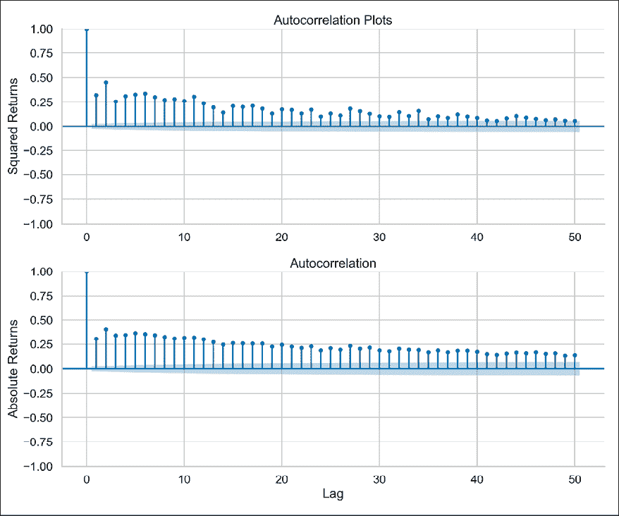

图 4.14：平方和绝对收益的 ACF 图

我们可以观察到平方和绝对收益的自相关值较小且逐渐减小，这与第四个风格化事实一致。

### 事实 5：杠杆效应

**杠杆效应**指的是资产波动性的多数衡量标准与其收益呈负相关的事实。

执行以下步骤来调查标准普尔 500 指数收益序列中杠杆效应的存在：

1.  计算波动性度量作为移动标准差：

    ```py
    df["moving_std_252"] = df[["log_rtn"]].rolling(window=252).std()
    df["moving_std_21"] = df[["log_rtn"]].rolling(window=21).std() 
    ```

1.  绘制所有序列：

    ```py
    fig, ax = plt.subplots(3, 1, figsize=(18, 15),
                           sharex=True)
    df["adj_close"].plot(ax=ax[0])
    ax[0].set(title="S&P 500 time series",
              ylabel="Price ($)")
    df["log_rtn"].plot(ax=ax[1])
    ax[1].set(ylabel="Log returns")
    df["rolling_std_252"].plot(ax=ax[2], color="r",
                               label="Rolling Volatility 252d")
    df["rolling_std_21"].plot(ax=ax[2], color="g",
                               label="Rolling Volatility 21d")
    ax[2].set(ylabel="Moving Volatility",
              xlabel="Date")
    ax[2].legend()
    plt.show() 
    ```

    我们现在可以通过直观地将价格序列与（滚动）波动性指标进行比较来研究杠杆效应：

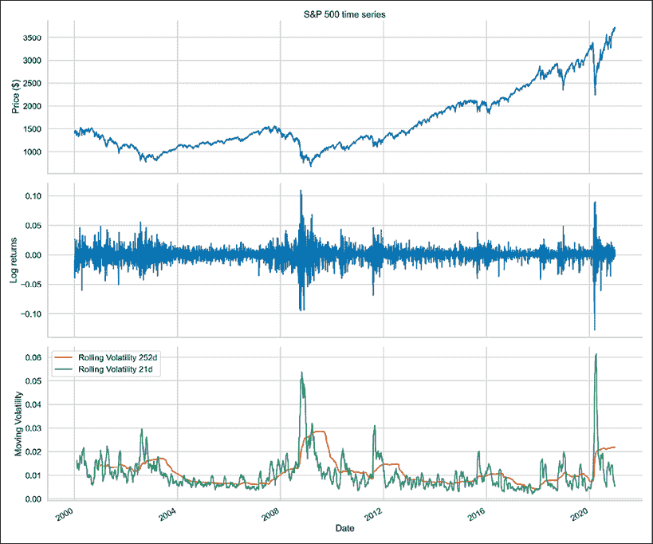

图 4.15：标准普尔 500 指数收益的滚动波动性指标

在*图 4.15*中，我们可以观察到一个模式，即价格下跌时波动性增加，价格上涨时波动性减小。这个观察结果符合该事实的定义。

## 它是如何工作的……

在本节中，我们描述了我们用于调查标准普尔 500 指数对数收益序列中风格化事实存在性的几种方法。

### 事实 1：收益的非高斯分布

我们将把调查这一事实分为三部分。

#### 收益的直方图

调查这一事实的第一步是通过可视化收益分布来绘制直方图。为此，我们使用了`sns.distplot`，同时设置`kde=False`（这不会使用高斯核密度估计）和`norm_hist=True`（此图显示密度而不是计数）。

为了查看我们的直方图与高斯分布之间的差异，我们叠加了一条线，表示考虑的收益序列的均值和标准差所对应的高斯分布的 PDF。

首先，我们使用`np.linspace`指定了计算 PDF 的范围（我们设置了 1000 个点；通常来说，点数越多，线条越平滑），然后使用`scs.norm.pdf`函数计算 PDF。默认参数对应标准正态分布，即均值为零，方差为单位方差。因此，我们分别将`loc`和`scale`参数指定为样本均值和标准差。

为了验证之前提到的模式，我们应该查看以下内容：

+   负偏度：分布的左尾较长，而分布的质量集中在分布的右侧

+   过度峰度：肥尾和尖峰分布

第二点在我们的图中更容易观察到，因为在概率密度函数（PDF）上有一个明显的峰值，并且我们在尾部看到更多的质量。

#### Q-Q 图

在检查完直方图后，我们查看了 Q-Q 图，在该图中我们通过将两个分布（理论分布和观测分布）的分位数相互比较来绘制它们。在我们的案例中，理论分布是高斯分布（正态分布），而观测分布来自标准普尔 500 指数的收益。

为了获得该图，我们使用了 `sm.qqplot` 函数。如果经验分布是正态分布，则绝大多数点将位于红线上。然而，我们看到并非如此，因为图的左侧的点比预期的高斯分布中的点更负（即，较低的经验分位数比预期值小）（由线条表示）。这意味着收益分布的左尾比高斯分布的左尾更重。对右尾也可以得出类似的结论，它比正态分布下的右尾更重。

#### 描述性统计

最后一部分涉及查看一些统计数据。我们使用 `pandas` Series/DataFrame 的适当方法进行了计算。我们立即看到收益表现出负偏度和过度峰度。我们还进行了 Jarque-Bera 检验（`scs.jarque_bera`），以验证收益是否符合高斯分布。由于 p 值为零，我们拒绝了样本数据具有与高斯分布相匹配的偏度和峰度的零假设。

`pandas` 对峰度的实现是文献中所称的过度峰度或费舍尔峰度。使用此度量，高斯分布的过度峰度为 0，而标准峰度为 3。这不应与样式化事实的过度峰度名称混淆，后者仅指峰度高于正态分布的情况。

### 事实 2：波动率聚集

另一个我们在调查样式化事实时应当注意的因素是波动率聚集——高收益期与低收益期交替出现，这表明波动率不是恒定的。为了快速调查这一事实，我们使用 `pandas` DataFrame 的 `plot` 方法绘制了收益图。

### 事实 3：收益中不存在自相关

为了调查收益中是否存在显著的自相关，我们使用 `statsmodels` 库的 `plot_acf` 创建了自相关图。我们检查了 50 个滞后，并使用默认的 `alpha=0.05`，这意味着我们还绘制了 95% 置信区间。超出该区间的值可以被认为是统计显著的。

### 事实 4：平方/绝对收益中的小且递减的自相关

为了验证这一事实，我们还使用了`statsmodels`库中的`plot_acf`函数。然而，这一次，我们将其应用于平方和绝对收益。

### 事实 5：杠杆效应

这一事实表明，大多数资产波动性的度量与其收益率呈负相关。为了验证这一点，我们使用了移动标准差（通过`pandas` DataFrame 的`rolling`方法计算）作为历史波动性的度量。我们使用了 21 天和 252 天的窗口，分别对应一个月和一年的交易数据。

## 还有更多……

我们提出了另一种调查杠杆效应（事实 5）的方法。为此，我们使用了 VIX（CBOE 波动率指数），这是衡量股票市场对波动性预期的一个流行指标。这个度量是由标准普尔 500 指数的期权价格隐含出来的。我们采取以下步骤：

1.  下载并预处理标准普尔 500 指数和 VIX 的价格数据：

    ```py
    df = yf.download(["^GSPC", "^VIX"],
                     start="2000-01-01",
                     end="2020-12-31",
                     progress=False)
    df = df[["Adj Close"]]
    df.columns = df.columns.droplevel(0)
    df = df.rename(columns={"^GSPC": "sp500", "^VIX": "vix"}) 
    ```

1.  计算对数收益（我们同样可以使用简单收益）：

    ```py
    df["log_rtn"] = np.log(df["sp500"] / df["sp500"].shift(1))
    df["vol_rtn"] = np.log(df["vix"] / df["vix"].shift(1))
    df.dropna(how="any", axis=0, inplace=True) 
    ```

1.  绘制一个散点图，将收益率放在坐标轴上，并拟合回归线以识别趋势：

    ```py
    corr_coeff = df.log_rtn.corr(df.vol_rtn)
    ax = sns.regplot(x="log_rtn", y="vol_rtn", data=df,
                     line_kws={"color": "red"})
    ax.set(title=f"S&P 500 vs. VIX ($\\rho$ = {corr_coeff:.2f})",
      ylabel="VIX log returns",
       xlabel="S&P 500 log returns")
    plt.show() 
    ```

    我们还计算了两条序列之间的相关系数，并将其包含在标题中：

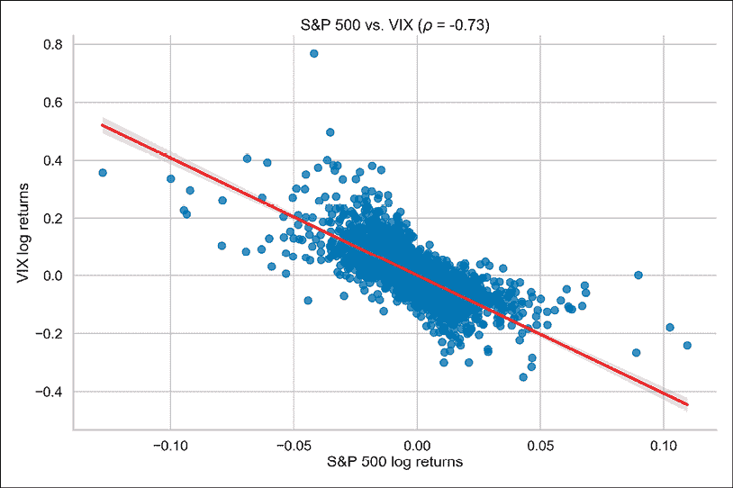

图 4.16：调查标准普尔 500 指数和 VIX 收益之间的关系

我们可以看到，回归线的负斜率以及两条序列之间的强负相关性确认了收益序列中杠杆效应的存在。

## 另见

更多信息，请参阅以下内容：

+   Cont, R. 2001. “资产收益的经验属性：典型事实与统计问题。” *定量金融*，1(2): 223

# 总结

在本章中，我们学习了如何使用一系列算法和统计检验自动识别金融时间序列中的潜在模式和问题（例如，异常值）。有了它们的帮助，我们可以将分析规模扩大到任意数量的资产，而不必手动检查每一条时间序列。

我们还解释了资产收益的典型事实。这些事实非常重要，因为许多模型或策略假设感兴趣变量的某种分布。最常见的假设是正态分布。正如我们所见，经验资产收益并非呈正态分布。因此，在处理这种时间序列时，我们必须采取一些预防措施，以确保我们的分析有效。

在下一章中，我们将探讨广受欢迎的技术分析领域，并查看通过分析资产价格的模式，我们能获得哪些见解。

# 加入我们的 Discord！

要加入本书的 Discord 社区——在这里你可以分享反馈、向作者提问并了解新版本——请扫描以下二维码：


[`packt.link/ips2H`](https://packt.link/ips2H)
