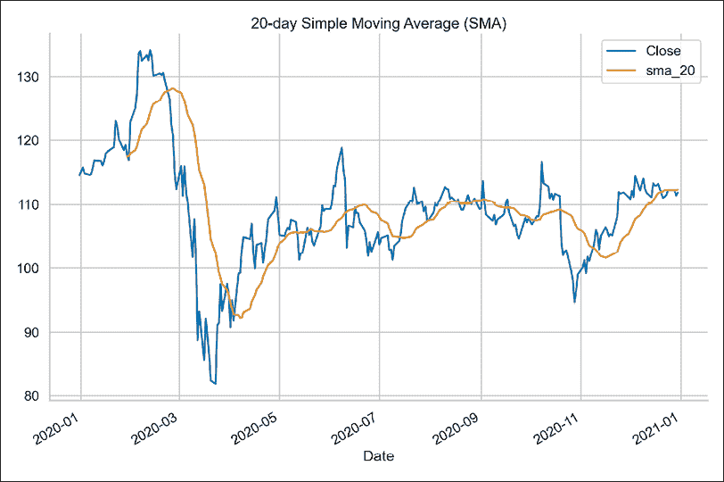
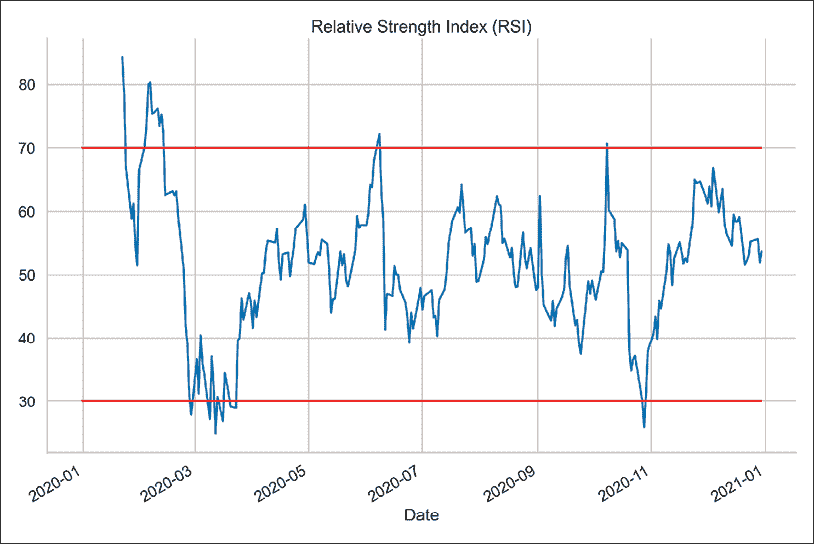
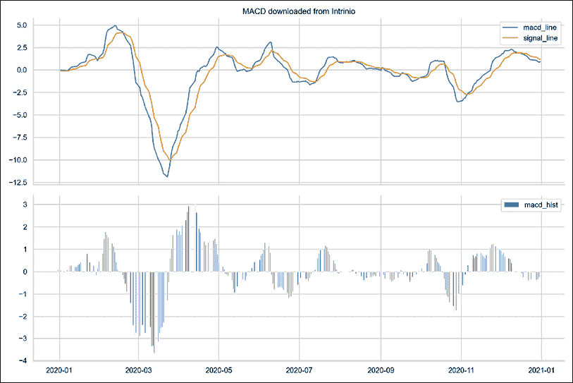
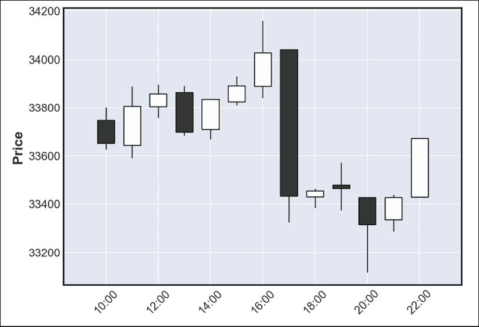
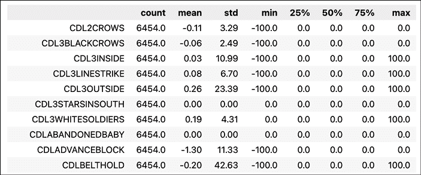
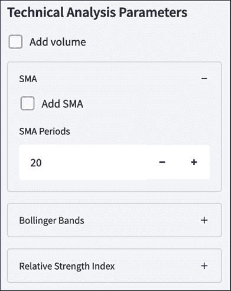
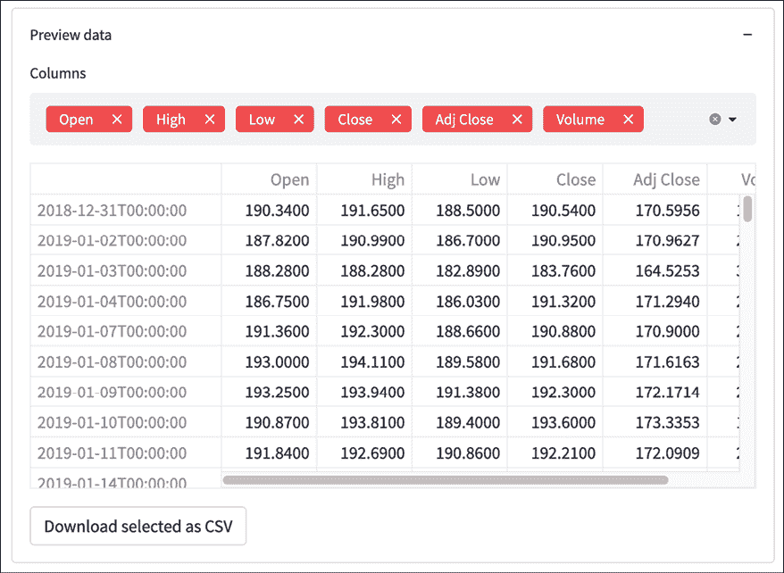
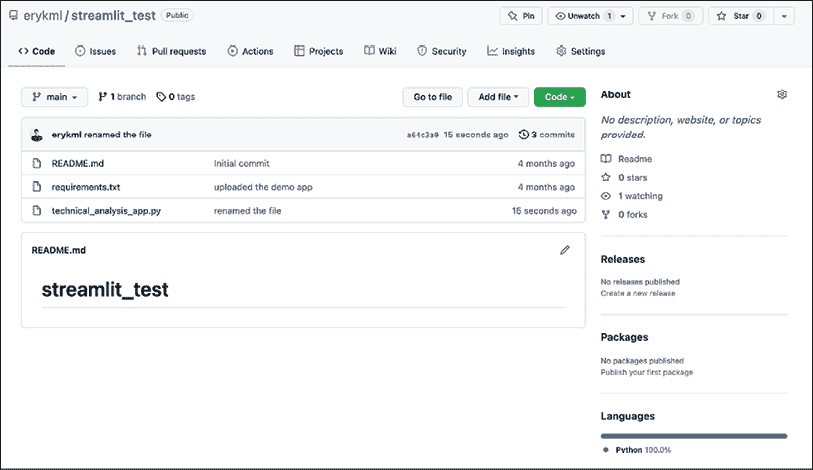
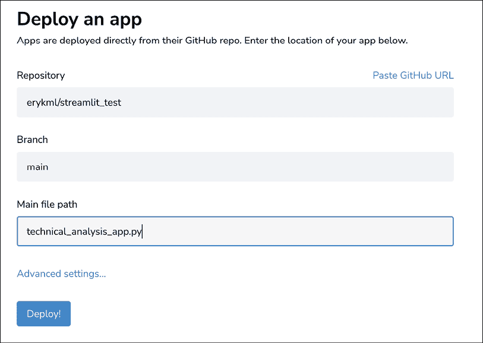

# 第五章：技术分析与构建交互式仪表板

本章我们将介绍如何在 Python 中进行**技术分析**（**TA**）的基础知识。简而言之，技术分析是一种通过研究过去的市场数据（特别是价格本身和交易量）来确定（预测）资产价格未来走势，并识别投资机会的方法论。

我们首先展示如何计算一些最流行的技术分析指标（并提供如何使用选定的 Python 库计算其他指标的提示）。此外，我们还展示如何从可靠的金融数据提供商那里下载预先计算好的技术指标。我们还涉及技术分析的一个子领域——蜡烛图形态识别。

在本章的最后，我们展示如何创建一个 Web 应用，使我们能够以交互的方式可视化和检查预定义的技术分析指标。然后，我们将这个应用部署到云端，使任何人都能随时随地访问。

在本章中，我们介绍以下几个任务：

+   计算最流行的技术指标

+   下载技术指标

+   识别蜡烛图形态

+   使用 Streamlit 构建交互式技术分析 Web 应用

+   部署技术分析应用

# 计算最流行的技术指标

有数百种不同的技术指标，交易者用它们来决定是否进入或退出某个仓位。在本节中，我们将学习如何使用`TA-Lib`库轻松计算其中一些技术指标，`TA-Lib`是最流行的此类任务库。我们将从简要介绍几种精选指标开始。

**布林带**是一种统计方法，用于推导某一资产的价格和波动性随时间变化的信息。为了获得布林带，我们需要计算时间序列（价格）的移动平均和标准差，使用指定的窗口（通常为 20 天）。然后，我们将上轨/下轨设置为*K*倍（通常为 2）移动标准差，位于移动平均线的上方/下方。布林带的解释非常简单：带宽随着波动性的增加而扩大，随着波动性的减少而收缩。

使用 2 个标准差作为布林带的默认设置与关于收益率正态分布的（经验性错误的）假设有关。在高斯分布下，我们假设使用 2 个标准差时，95%的收益率会落在布林带内。

**相对强弱指数**（**RSI**）是一种指标，利用资产的收盘价来识别超卖/超买的状态。通常，RSI 是使用 14 日周期计算的，并且在 0 到 100 的范围内测量（它是一个振荡器）。交易者通常在资产超卖时买入（如果 RSI 低于 30），在资产超买时卖出（如果 RSI 高于 70）。更极端的高/低水平，如 80-20，较少使用，同时意味着更强的动量。

最后考虑的指标是**移动平均收敛/发散**（**MACD**）。它是一个动量指标，显示了给定资产价格的两条指数移动平均线（EMA）之间的关系，通常是 26 日和 12 日的 EMA。MACD 线是快速（短期）和慢速（长期）EMA 之间的差值。最后，我们将 MACD 信号线计算为 MACD 线的 9 日 EMA。交易者可以利用这些线的交叉作为交易信号。例如，当 MACD 线从下方穿越信号线时，可以视为买入信号。

自然地，大多数指标并不是单独使用的，交易者在做出决策之前会参考多个信号。此外，所有指标都可以进一步调整（通过改变其参数），以实现特定的目标。我们将在另一个章节中讨论基于技术指标的交易策略回测。

## 如何进行…

执行以下步骤，使用 2020 年的 IBM 股票价格计算一些最流行的技术指标：

1.  导入库：

    ```py
    import pandas as pd
    import yfinance as yf
    import talib 
    ```

    `TA-Lib`与大多数 Python 库不同，其安装过程略有不同。有关如何操作的更多信息，请参阅*另见*部分提供的 GitHub 仓库。

1.  下载 2020 年的 IBM 股票价格：

    ```py
    df = yf.download("IBM",
                     start="2020-01-01",
                     end="2020-12-31",
                     progress=False,
                     auto_adjust=True) 
    ```

1.  计算并绘制简单移动平均线（SMA）：

    ```py
    df["sma_20"] = talib.SMA(df["Close"], timeperiod=20)
    (
        df[["Close", "sma_20"]]
        .plot(title="20-day Simple Moving Average (SMA)")
    ) 
    ```

    运行代码片段生成以下图表：



图 5.1：IBM 的收盘价和 20 日 SMA

1.  计算并绘制布林带：

    ```py
    df["bb_up"], df["bb_mid"], df["bb_low"] = talib.BBANDS(df["Close"])

    fig, ax = plt.subplots()

    (
        df.loc[:, ["Close", "bb_up", "bb_mid", "bb_low"]]
        .plot(ax=ax, title="Bollinger Bands")
    )

    ax.fill_between(df.index, df["bb_low"], df["bb_up"], 
                    color="gray", 
                    alpha=.4) 
    ```

    运行代码片段生成以下图表：

    

    图 5.2：IBM 的收盘价和布林带

1.  计算并绘制 RSI：

    ```py
    df["rsi"] = talib.RSI(df["Close"])
    fig, ax = plt.subplots()
    df["rsi"].plot(ax=ax,
                   title="Relative Strength Index (RSI)")
    ax.hlines(y=30,
              xmin=df.index.min(),
              xmax=df.index.max(),
              color="red")
    ax.hlines(y=70,
              xmin=df.index.min(),
              xmax=df.index.max(),
              color="red")
    plt.show() 
    ```

    运行代码片段生成以下图表：



图 5.3：使用 IBM 收盘价计算的 RSI

1.  计算并绘制 MACD：

    ```py
    df["macd"], df["macdsignal"], df["macdhist"] = talib.MACD(
        df["Close"], fastperiod=12, slowperiod=26, signalperiod=9
    )
    fig, ax = plt.subplots(2, 1, sharex=True)
    (
        df[["macd", "macdsignal"]].
        plot(ax=ax[0],
             title="Moving Average Convergence Divergence (MACD)")
    )
    ax[1].bar(df.index, df["macdhist"].values, label="macd_hist")
    ax[1].legend() 
    ```

    运行代码片段生成以下图表：


图 5.4：使用 IBM 收盘价计算的 MACD

到目前为止，我们已经计算了技术指标并将其绘制出来。在接下来的章节中，我们将更多地讨论它们的含义，并基于这些指标构建交易策略。

## 它是如何工作的…

导入库后，我们下载了 2020 年的 IBM 股票价格。

在*第 3 步*中，我们使用`SMA`函数计算了 20 日简单移动平均线。自然地，我们也可以通过使用`pandas`数据框的`rolling`方法来计算相同的指标。

在*第 4 步*中，我们计算了布林带。`BBANDS`函数返回了三个对象（上限、下限和移动平均线），我们将它们分配到了 DataFrame 的不同列中。

在下一步中，我们使用默认设置计算了 RSI。我们绘制了这个指标，并添加了两条水平线（使用`ax.hlines`创建），表示常用的决策阈值。

在最后一步，我们也使用默认的 EMA 周期数计算了 MACD。`MACD`函数也返回了三个对象：MACD 线、信号线和 MACD 直方图，这实际上是前两者的差值。我们将它们分别绘制在不同的图表上，这是交易平台上最常见的做法。

## 还有更多内容…

`TA-Lib`是一个非常棒的库，在计算技术指标方面是黄金标准。然而，市面上也有一些替代库，正在逐渐获得关注。其中一个叫做`ta`。与`TA-Lib`（一个 C++库的封装）相比，`ta`是使用`pandas`编写的，这使得探索代码库变得更加容易。

尽管它的功能不如`TA-Lib`那样广泛，但它的一个独特功能是可以在一行代码中计算所有 30 多个可用的指标。这在我们想要为机器学习模型计算大量潜在特征时绝对很有用。

执行以下步骤，用一行代码计算 30 多个技术指标：

1.  导入库：

    ```py
    from ta import add_all_ta_features 
    ```

1.  丢弃之前计算的指标，仅保留所需的列：

    ```py
    df = df[["Open", "High", "Low", "Close", "Volume"]].copy() 
    ```

1.  计算`ta`库中所有可用的技术指标：

    ```py
    df = add_all_ta_features(df, open="Open", high="High",
                             low="Low", close="Close",
                             volume="Volume") 
    ```

最终的 DataFrame 包含 88 列，其中 83 列是通过一次函数调用添加的。

## 另见

以下是`TA-Lib`、`ta`及其他一些有助于技术分析的有趣库的 GitHub 仓库链接：

+   [`github.com/mrjbq7/ta-lib`](https://github.com/mrjbq7/ta-lib)——`TA-lib`的 GitHub 仓库。请参考此资源了解更多关于库的安装细节。

+   [`ta-lib.org/`](https://ta-lib.org/)

+   [`github.com/bukosabino/ta`](https://github.com/bukosabino/ta)

+   [`github.com/twopirllc/pandas-ta`](https://github.com/twopirllc/pandas-ta)

+   [`github.com/peerchemist/finta`](https://github.com/peerchemist/finta)

# 下载技术指标

我们已经在*第一章*，*获取财务数据*中提到过，某些数据提供商不仅提供历史股价，还提供一些最流行的技术指标。在本食谱中，我们将展示如何下载 IBM 股票的 RSI 指标，并且可以将其与我们在上一节中使用`TA-Lib`库计算的 RSI 进行直接对比。

## 如何操作…

执行以下步骤从 Alpha Vantage 下载计算好的 IBM RSI：

1.  导入库：

    ```py
    from alpha_vantage.techindicators import TechIndicators 
    ```

1.  实例化`TechIndicators`类并进行身份验证：

    ```py
    ta_api = TechIndicators(key="YOUR_KEY_HERE", 
                            output_format="pandas") 
    ```

1.  下载 IBM 股票的 RSI：

    ```py
    rsi_df, rsi_meta = ta_api.get_rsi(symbol="IBM", 
                                      time_period=14) 
    ```

1.  绘制下载的 RSI：

    ```py
    fig, ax = plt.subplots()
    rsi_df.plot(ax=ax, 
                title="RSI downloaded from Alpha Vantage")
    ax.hlines(y=30, 
              xmin=rsi_df.index.min(), 
              xmax=rsi_df.index.max(), 
              color="red")
    ax.hlines(y=70, 
              xmin=rsi_df.index.min(), 
              xmax=rsi_df.index.max(), 
              color="red") 
    ```

    运行代码片段生成以下图表：

    

    图 5.5：下载的 IBM 股票价格的 RSI

    下载的 DataFrame 包含了从 1999 年 11 月到最新日期的 RSI 值。

1.  探索元数据对象：

    ```py
    rsi_meta 
    ```

    通过显示元数据对象，我们可以看到以下请求的详细信息：

    ```py
    {'1: Symbol': 'IBM',
    '2: Indicator': 'Relative Strength Index (RSI)',
    '3: Last Refreshed': '2022-02-25',
    '4: Interval': 'daily',
    '5: Time Period': 14,
    '6: Series Type': 'close',
    '7: Time Zone': 'US/Eastern Time'} 
    ```

## 工作原理…

在导入库之后，我们实例化了`TechIndicators`类，该类可以用来下载任何可用的技术指标（通过该类的方法）。在此过程中，我们提供了 API 密钥，并表明希望以`pandas` DataFrame 的形式接收输出结果。

在*第 3 步*中，我们使用`get_rsi`方法下载了 IBM 股票的 RSI。在此步骤中，我们指定了希望使用过去 14 天的数据来计算指标。

下载计算指标时需要注意的一点是数据供应商的定价政策。在撰写本文时，Alpha Vantage 的 RSI 端点是免费的，而 MACD 则是付费端点，需要购买付费计划。

令人有些惊讶的是，我们无法指定感兴趣的日期范围。我们可以在*第 4 步*中清楚地看到这一点，在该步骤中，我们看到数据点可以追溯到 1999 年 11 月。我们还绘制了 RSI 线，就像我们在之前的食谱中做的一样。

在最后一步，我们探讨了请求的元数据，其中包含了 RSI 的参数、我们请求的股票代码、最新的刷新日期，以及用于计算指标的价格序列（在本例中是收盘价）。

## 还有更多…

Alpha Vantage 并不是唯一提供技术指标访问的数据供应商。另一个供应商是 Intrinio。我们在下文演示了如何通过其 API 下载 MACD：

1.  导入库：

    ```py
    import intrinio_sdk as intrinio
    import pandas as pd 
    ```

1.  使用个人 API 密钥进行身份验证并选择 API：

    ```py
    intrinio.ApiClient().set_api_key("YOUR_KEY_HERE")
    security_api = intrinio.SecurityApi() 
    ```

1.  请求 2020 年 IBM 股票的 MACD：

    ```py
    r = security_api.get_security_price_technicals_macd(
        identifier="IBM", 
        fast_period=12, 
        slow_period=26, 
        signal_period=9, 
        price_key="close", 
        start_date="2020-01-01", 
        end_date="2020-12-31",
        page_size=500
    ) 
    ```

    使用 Intrinio 时，我们实际上可以指定想要下载指标的周期。

1.  将请求的输出转换为`pandas` DataFrame：

    ```py
    macd_df = (
        pd.DataFrame(r.technicals_dict)
        .sort_values("date_time")
        .set_index("date_time")
    )
    macd_df.index = pd.to_datetime(macd_df.index).date 
    ```

1.  绘制 MACD：

    ```py
    fig, ax = plt.subplots(2, 1, sharex=True)

    (
        macd_df[["macd_line", "signal_line"]]
        .plot(ax=ax[0], 
              title="MACD downloaded from Intrinio")
    )
    ax[1].bar(df.index, macd_df["macd_histogram"].values, 
              label="macd_hist")
    ax[1].legend() 
    ```

    运行代码片段生成以下图表：



图 5.6：下载的 IBM 股票价格的 MACD

# 识别蜡烛图模式

在本章中，我们已经介绍了一些最受欢迎的技术指标。另一个可以用于做出交易决策的技术分析领域是**蜡烛图模式识别**。总体来说，有数百种蜡烛图模式可以用来判断价格的方向和动能。

与所有技术分析方法类似，在使用模式识别时，我们需要牢记几点。首先，模式只在给定图表的限制条件下有效（在指定的频率下：例如日内、日线、周线等）。其次，模式的预测效能在模式完成后会迅速下降，通常在几个（3–5）K 线之后效果减弱。第三，在现代电子环境中，通过分析蜡烛图模式识别出的许多信号可能不再可靠。部分大玩家也能通过制造虚假的蜡烛图模式设下陷阱，诱使其他市场参与者跟进。

Bulkowski（2021）根据预期结果将模式分为两类：

+   反转模式—此类模式预测价格方向的变化

+   延续模式—此类模式预测当前趋势的延续

在这个实例中，我们尝试在比特币小时价格中识别**三线反转**模式。该模式属于延续型模式。其看跌变体（在整体看跌趋势中识别）由三根蜡烛线组成，每根蜡烛的低点都低于前一根。该模式的第四根蜡烛在第三根蜡烛的低点或更低处开盘，但随后大幅反转并收盘在系列中第一根蜡烛的最高点之上。

## 如何操作……

执行以下步骤以识别比特币小时蜡烛图中的三线反转模式：

1.  导入库：

    ```py
    import pandas as pd
    import yfinance as yf
    import talib
    import mplfinance as mpf 
    ```

1.  下载过去 9 个月的比特币小时价格：

    ```py
    df = yf.download("BTC-USD",
                     period="9mo",
                     interval="1h",
                     progress=False) 
    ```

1.  识别三线反转模式：

    ```py
    df["3_line_strike"] = talib.CDL3LINESTRIKE(
        df["Open"], df["High"], df["Low"], df["Close"]
    ) 
    ```

1.  定位并绘制看跌模式：

    ```py
    df[df["3_line_strike"] == -100].head() 
    ```

    

    图 5.7：看跌三线反转模式的前五个观察点

    ```py
    mpf.plot(df["2021-07-16 05:00:00":"2021-07-16 16:00:00"],
             type="candle") 
    ```

    执行代码片段后会返回以下图表：

    

    图 5.8：识别出的看跌三线反转模式

1.  定位并绘制看涨模式：

    ```py
    df[df["3_line_strike"] == 100] 
    ```

    

    图 5.9：看涨三线反转模式的前五个观察点

    ```py
    mpf.plot(df["2021-07-10 10:00:00":"2021-07-10 23:00:00"],
             type="candle") 
    ```

    执行代码片段后会返回以下图表：



图 5.10：识别出的看涨三线反转模式

我们可以利用识别出的模式来创建交易策略。例如，看跌三线反转通常表示一次小幅回调，随后会继续出现看跌趋势。

## 工作原理……

在导入库后，我们使用`yfinance`库下载了过去 3 个月的比特币小时价格。

在*步骤 3*中，我们使用`TA-Lib`库来识别三线反转模式（通过`CDL3LINESTRIKE`函数）。我们需要单独提供 OHLC（开盘价、最高价、最低价、收盘价）数据作为该函数的输入。我们将函数的输出存储在一个新列中。对于该函数，有三种可能的输出：

+   `100`—表示该模式的看涨变体

+   `0`—未检测到模式

+   `-100`—表示该模式的看跌变体

库的作者警告，用户应考虑当三线打击模式出现在相同方向的趋势中时，其具有显著性（库未验证此点）。

某些函数可能有额外的输出。一些模式还具有-200/200 的值（例如，Hikkake 模式），每当模式中有额外确认时，就会出现这些值。

在*步骤 4*中，我们筛选了 DataFrame 中的看跌模式。它被识别了六次，我们选择了`2021-07-16 12:00:00`的那个模式。然后，我们将该模式与一些相邻的蜡烛图一起绘制。

在*步骤 5*中，我们重复了相同的过程，这次是针对一个看涨模式。

## 还有更多……

如果我们希望将已识别的模式作为模型/策略的特征，可能值得尝试一次性识别所有可能的模式。我们可以通过执行以下步骤来实现：

1.  获取所有可用的模式名称：

    ```py
    candle_names = talib.get_function_groups()["Pattern Recognition"] 
    ```

1.  遍历模式列表并尝试识别所有模式：

    ```py
    for candle in candle_names:
        df[candle] = getattr(talib, candle)(df["Open"], df["High"],
                                            df["Low"], df["Close"]) 
    ```

1.  检查模式的汇总统计：

    ```py
    with pd.option_context("display.max_rows", len(candle_names)):
        display(df[candle_names].describe().transpose().round(2)) 
    ```

    为了简洁起见，我们仅展示返回的 DataFrame 中的前 10 行：



图 5.11：已识别蜡烛图模式的汇总统计

我们可以看到，有些模式从未被识别（最小值和最大值为零），而其他模式则有一个或两个变体（看涨或看跌）。在 GitHub 上提供的笔记本中，我们还尝试了根据此表的输出识别**晚星**模式。

## 另见

+   [`sourceforge.net/p/ta-lib/code/HEAD/tree/trunk/ta-lib/c/src/ta_func/`](https://sourceforge.net/p/ta-lib/code/HEAD/tree/trunk/ta-lib/c/src/ta_func/)

+   Bulkowski, T. N. 2021 *《图表模式百科全书》*。John Wiley & Sons，2021 年。

# 使用 Streamlit 构建技术分析的互动网页应用

在本章中，我们已经介绍了技术分析的基础知识，这些知识可以帮助交易者做出决策。然而，直到现在，一切都是相对静态的——我们下载数据，计算指标，绘制图表，如果我们想更换资产或日期范围，就必须重复所有步骤。那么，是否有更好、更互动的方式来解决这个问题呢？

这正是 Streamlit 发挥作用的地方。Streamlit 是一个开源框架（以及一个同名公司，类似于 Plotly），它允许我们仅使用 Python 在几分钟内构建互动网页应用。以下是 Streamlit 的亮点：

+   它易于学习，并能非常快速地生成结果

+   它仅限于 Python；无需前端开发经验

+   它允许我们专注于应用的纯数据/机器学习部分

+   我们可以使用 Streamlit 的托管服务来部署我们的应用

在本示例中，我们将构建一个用于技术分析的互动应用程序。你将能够选择任何标准普尔 500 指数的成分股，并快速、互动地进行简单的分析。此外，你还可以轻松扩展该应用程序，添加更多的功能，例如不同的指标和资产，甚至可以在应用程序中嵌入交易策略的回测功能。

## 准备就绪

本示例与其他示例略有不同。我们的应用程序代码“存在”于一个单一的 Python 脚本（`technical_analysis_app.py`）中，代码大约有一百行。一个非常基础的应用程序可以更加简洁，但我们希望展示一些 Streamlit 最有趣的功能，即使它们对于构建基础的技术分析应用程序并非绝对必要。

通常，Streamlit 按照自上而下的顺序执行代码，这使得将解释与本书使用的结构相适配更加容易。因此，本示例中的步骤并不是*本身*的步骤——它们不能/不应该单独执行。相反，它们是应用程序所有组件的逐步演示。在构建自己的应用程序或扩展此应用程序时，你可以根据需要自由更改步骤的顺序（只要它们与 Streamlit 框架一致）。

## 如何操作……

以下步骤都位于 `technical_analysis_app.py` 文件中：

1.  导入库：

    ```py
    import yfinance as yf
    import streamlit as st
    import datetime
    import pandas as pd
    import cufflinks as cf
    from plotly.offline import iplot
    cf.go_offline() 
    ```

1.  定义一个从维基百科下载标准普尔 500 指数成分股列表的函数：

    ```py
    @st.cache
    def  get_sp500_components():
        df = pd.read_html("https://en.wikipedia.org/wiki/List_of_S%26P_500_companies")
        df = df[0]
        tickers = df["Symbol"].to_list()
        tickers_companies_dict = dict(
            zip(df["Symbol"], df["Security"])
        )
        return tickers, tickers_companies_dict 
    ```

1.  定义一个使用 `yfinance` 下载历史股票价格的函数：

    ```py
    @st.cache
    def  load_data(symbol, start, end):
        return yf.download(symbol, start, end) 
    ```

1.  定义一个将下载的数据存储为 CSV 文件的函数：

    ```py
    @st.cache
    def  convert_df_to_csv(df):
        return df.to_csv().encode("utf-8") 
    ```

1.  定义侧边栏用于选择股票代码和日期的部分：

    ```py
    st.sidebar.header("Stock Parameters")
    available_tickers, tickers_companies_dict = get_sp500_components()
    ticker = st.sidebar.selectbox(
        "Ticker", 
        available_tickers, 
        format_func=tickers_companies_dict.get
    )
    start_date = st.sidebar.date_input(
        "Start date", 
        datetime.date(2019, 1, 1)
    )
    end_date = st.sidebar.date_input(
        "End date", 
        datetime.date.today()
    )
    if start_date > end_date:
        st.sidebar.error("The end date must fall after the start date") 
    ```

1.  定义侧边栏用于调整技术分析详细参数的部分：

    ```py
    st.sidebar.header("Technical Analysis Parameters")
    volume_flag = st.sidebar.checkbox(label="Add volume") 
    ```

1.  添加一个带有 SMA 参数的展开器：

    ```py
    exp_sma = st.sidebar.expander("SMA")
    sma_flag = exp_sma.checkbox(label="Add SMA")
    sma_periods= exp_sma.number_input(
        label="SMA Periods", 
        min_value=1, 
        max_value=50, 
        value=20, 
        step=1
    ) 
    ```

1.  添加一个带有布林带参数的展开器：

    ```py
    exp_bb = st.sidebar.expander("Bollinger Bands")
    bb_flag = exp_bb.checkbox(label="Add Bollinger Bands")
    bb_periods= exp_bb.number_input(label="BB Periods", 
                                    min_value=1, max_value=50, 
                                    value=20, step=1)
    bb_std= exp_bb.number_input(label="# of standard deviations", 
                                min_value=1, max_value=4, 
                                value=2, step=1) 
    ```

1.  添加一个带有 RSI 参数的展开器：

    ```py
    exp_rsi = st.sidebar.expander("Relative Strength Index")
    rsi_flag = exp_rsi.checkbox(label="Add RSI")
    rsi_periods= exp_rsi.number_input(
        label="RSI Periods", 
        min_value=1, 
        max_value=50, 
        value=20, 
        step=1
    )
    rsi_upper= exp_rsi.number_input(label="RSI Upper", 
                                    min_value=50, 
                                    max_value=90, value=70, 
                                    step=1)
    rsi_lower= exp_rsi.number_input(label="RSI Lower", 
                                    min_value=10, 
                                    max_value=50, value=30, 
                                    step=1) 
    ```

1.  在应用程序的主体中指定标题和附加文本：

    ```py
    st.title("A simple web app for technical analysis")
    st.write("""
     ### User manual
     * you can select any company from the S&P 500 constituents
    """) 
    ```

1.  加载历史股票价格：

    ```py
    df = load_data(ticker, start_date, end_date) 
    ```

1.  添加一个带有下载数据预览的展开器：

    ```py
    data_exp = st.expander("Preview data")
    available_cols = df.columns.tolist()
    columns_to_show = data_exp.multiselect(
        "Columns", 
        available_cols, 
        default=available_cols
    )
    data_exp.dataframe(df[columns_to_show])

    csv_file = convert_df_to_csv(df[columns_to_show])
    data_exp.download_button(
        label="Download selected as CSV",
        data=csv_file,
        file_name=f"{ticker}_stock_prices.csv",
        mime="text/csv",
    ) 
    ```

1.  使用选定的技术分析指标创建蜡烛图：

    ```py
    title_str = f"{tickers_companies_dict[ticker]}'s stock price"
    qf = cf.QuantFig(df, title=title_str)
    if volume_flag:
        qf.add_volume()
    if sma_flag:
        qf.add_sma(periods=sma_periods)
    if bb_flag:
        qf.add_bollinger_bands(periods=bb_periods,
                               boll_std=bb_std)
    if rsi_flag:
        qf.add_rsi(periods=rsi_periods,
                   rsi_upper=rsi_upper,
                   rsi_lower=rsi_lower,
                   showbands=True)
    fig = qf.iplot(asFigure=True)
    st.plotly_chart(fig) 
    ```

    要运行应用程序，打开终端，导航到 `technical_analysis_app.py` 脚本所在的目录，并运行以下命令：

    ```py
    streamlit run technical_analysis_app.py 
    ```

    运行代码后，Streamlit 应用程序将在默认浏览器中打开。应用程序的默认屏幕如下所示：


图 5.12：我们的技术分析应用程序在浏览器中的展示

应用程序对输入完全响应——每当你更改侧边栏或应用程序主体中的输入时，显示的内容将相应调整。实际上，我们甚至可以进一步扩展，将应用程序连接到经纪商的 API。这样，我们可以在应用程序中分析模式，并根据分析结果创建订单。

## 它是如何工作的……

如 *准备工作* 部分所述，这个食谱结构有所不同。步骤实际上是定义我们构建的应用的一系列元素。在深入细节之前，应用代码库的一般结构如下：

+   导入和设置 (*步骤 1*)

+   数据加载函数 (*步骤 2–4*)

+   侧边栏 (*步骤 5–9*)

+   应用程序的主体 (*步骤 10–13*)

在第一步中，我们导入了所需的库。对于技术分析部分，我们决定使用一个库，它能在尽可能少的代码行内可视化一组技术指标。这就是我们选择 `cufflinks` 的原因，它在 *第三章* *《可视化金融时间序列》* 中介绍。然而，如果你需要计算更多的指标，你可以使用任何其他库并自己绘制图表。

在 *步骤 2* 中，我们定义了一个函数，用于从 Wikipedia 加载标准普尔 500 指数成分股的列表。我们使用 `pd.read_html` 直接从表格中下载信息并保存为 DataFrame。该函数返回两个元素：一个有效股票代码的列表和一个包含股票代码及其对应公司名称的字典。

你肯定注意到了我们在定义函数时使用了 `@st.cache` 装饰器。我们不会详细讨论装饰器的一般内容，但会介绍这个装饰器的作用，因为它在使用 Streamlit 构建应用时非常有用。该装饰器表明，应用应该缓存之前获取的数据以供后续使用。因此，如果我们刷新页面或再次调用函数，数据将不会重新下载/处理（除非发生某些条件）。通过这种方式，我们可以显著提高 Web 应用的响应速度并降低最终用户的等待时间。

在幕后，Streamlit 跟踪以下信息，以确定是否需要重新获取数据：

+   我们在调用函数时提供的输入参数

+   函数中使用的任何外部变量的值

+   被调用函数的主体

+   在缓存函数内部调用的任何函数的主体

简而言之，如果这是 Streamlit 第一次看到某种组合的这四个元素，它将执行函数并将其输出存储在本地缓存中。如果下次函数被调用时遇到完全相同的一组元素，它将跳过执行并返回上次执行的缓存输出。

*步骤 3* 和 *4* 包含非常小的函数。第一个用于通过 `yfinance` 库从 Yahoo Finance 获取历史股票价格。接下来的步骤将 DataFrame 的输出保存为 CSV 文件，并将其编码为 UTF-8。

在*步骤 5*中，我们开始着手开发应用程序的侧边栏，用于存储应用程序的参数配置。首先需要注意的是，所有计划放置在侧边栏中的元素都通过`st.sidebar`调用（与我们在定义主界面元素和其他功能时使用的`st`不同）。在这一步中，我们做了以下工作：

+   我们指定了标题。

+   我们下载了可用票证的列表。

+   我们创建了一个下拉选择框，用于选择可用的票证。我们还通过将包含符号-名称对的字典传递给`format_func`参数来提供额外的格式化。

+   我们允许用户选择分析的开始和结束日期。使用`date_input`会显示一个交互式日历，用户可以从中选择日期。

+   我们通过使用`if`语句结合`st.sidebar.error`来处理无效的日期组合（开始日期晚于结束日期）。这将暂停应用程序的执行，直到错误被解决，也就是说，直到提供正确的输入。

此步骤的结果如下所示：


图 5.13：侧边栏的一部分，我们可以在其中选择票证和开始/结束日期

在*步骤 6*中，我们在侧边栏中添加了另一个标题，并使用`st.checkbox`创建了一个复选框。如果选中，该变量将保存`True`值，未选中则为`False`。

在*步骤 7*中，我们开始配置技术指标。为了保持应用程序的简洁，我们使用了展开器（`st.expander`）。展开器是可折叠的框，通过点击加号图标可以触发展开。在其中，我们存储了两个元素：

+   一个复选框，用于指示是否要显示 SMA。

+   一个数字字段，用于指定移动平均的周期数。对于该元素，我们使用了 Streamlit 的`number_input`对象。我们提供了标签、最小/最大值、默认值和步长（当我们按下相应的按钮时，可以逐步增加/减少字段的值）。

使用展开器时，我们首先在侧边栏中实例化了一个展开器，使用`exp_sma = st.sidebar.expander("SMA")`。然后，当我们想要向展开器中添加元素时，例如复选框，我们使用以下语法：`sma_flag = exp_sma.checkbox(label="添加 SMA")`。这样，它就被直接添加到了展开器中，而不仅仅是侧边栏。

*步骤 8*和*步骤 9*非常相似。我们为应用程序中想要包括的其他技术指标——布林带和 RSI——创建了两个展开器。

*步骤 7 到 9*的代码生成了应用程序侧边栏的以下部分：



图 5.14：侧边栏的一部分，我们可以在其中修改所选指标的参数

然后，我们继续定义了应用程序的主体。在*步骤 10*中，我们使用`st.title`添加了应用程序的标题，并使用`st.write`添加了用户手册。在使用后者功能时，我们可以提供一个 Markdown 格式的文本输入。对于这一部分，我们使用了副标题（由`###`表示）并创建了一个项目符号列表（由`*`表示）。为了简洁起见，我们没有包含书中的所有文字，但你可以在书籍的 GitHub 仓库中找到它。

在*步骤 11*中，我们根据侧边栏的输入下载了历史股票价格。我们在这里还可以做的是下载给定股票的完整日期范围，然后使用侧边栏的起始/结束日期来筛选出感兴趣的时间段。这样，我们就不需要每次更改起始/结束日期时重新下载数据。

在*步骤 12*中，我们定义了另一个展开面板，这次是在应用程序的主体中。首先，我们添加了一个多选字段（`st.multiselect`），从中我们可以选择从下载的历史价格中可用的任何列。然后，我们使用`st.dataframe`显示选定的 DataFrame 列，以便进一步检查。最后，我们添加了将选定数据（包括列选择）作为 CSV 文件下载的功能。为此，我们使用了`convert_df_to_csv`函数，并结合使用`st.download_button`。

*步骤 12*负责生成应用程序的以下部分：



图 5.15：应用程序的部分，在这里我们可以检查包含价格的 DataFrame 并将其作为 CSV 下载

在应用程序的最后一步，我们定义了要显示的图表。没有任何技术分析输入时，应用程序将使用`cufflinks`显示一个蜡烛图。我们实例化了`QuantFig`对象，然后根据侧边栏的输入向其添加元素。每个布尔标志触发一个单独的命令，向图表中添加一个元素。为了显示交互式图表，我们使用了`st.plotly_chart`，它与`plotly`图表配合使用（`cufflinks`是`plotly`的一个包装器）。

对于其他可视化库，有不同的命令来嵌入可视化。例如，对于`matplotlib`，我们会使用`st.pyplot`。我们还可以使用`st.altair_chart`显示用 Altair 创建的图表。

## 还有更多……

在本书的第一版中，我们介绍了一种不同的方法来创建用于技术分析的交互式仪表盘。我们没有使用 Streamlit，而是使用`ipywidgets`在 Jupyter 笔记本中构建仪表盘。

通常来说，Streamlit 可能是这个特定任务的更好工具，特别是当我们想要部署应用程序（将在下一个食谱中介绍）并与他人共享时。然而，`ipywidgets`在其他项目中仍然很有用，这些项目可以在笔记本内本地运行。这就是为什么你可以在随附的 GitHub 仓库中找到用于创建非常相似仪表盘（在笔记本内）的代码。

## 另见

+   [`streamlit.io/`](https://streamlit.io/)

+   [`docs.streamlit.io/`](https://docs.streamlit.io/)

# 部署技术分析应用

在前面的教程中，我们创建了一个完整的技术分析 Web 应用，能够轻松在本地运行和使用。然而，这并不是最终目标，因为我们可能希望从任何地方访问该应用，或者与朋友或同事分享它。因此，下一步是将应用部署到云端。

在这个教程中，我们展示了如何使用 Streamlit（该公司）的服务部署应用。

## 准备工作

要将应用部署到 Streamlit Cloud，我们需要在该平台上创建一个账户（[`forms.streamlit.io/community-sign-up`](https://forms.streamlit.io/community-sign-up)）。你还需要一个 GitHub 账户来托管应用的代码。

## 如何操作…

执行以下步骤将 Streamlit 应用部署到云端：

1.  在 GitHub 上托管应用的代码库：

    图 5.16：托管在公共 GitHub 仓库中的应用代码库

    在此步骤中，记得托管整个应用的代码库，它可能分布在多个文件中。此外，请包含某种形式的依赖列表。在我们的例子中，这就是 `requirements.txt` 文件。

1.  访问 [`share.streamlit.io/`](https://share.streamlit.io/) 并登录。你可能需要将 GitHub 账户与 Streamlit 账户连接，并授权它访问你 GitHub 账户的某些权限。

1.  点击 *New app* 按钮。

1.  提供所需的详细信息：个人资料中的仓库名称、分支以及包含应用的文件：



图 5.17：创建应用所需提供的信息

1.  点击 *Deploy!*。

现在，你可以访问提供的链接来使用该应用。

## 它是如何工作的…

在第一步中，我们将应用的代码托管在了一个公共的 GitHub 仓库中。如果你是 Git 或 GitHub 的新手，请参考*另见*部分的链接获取更多信息。在写作时，Streamlit 应用的代码托管只支持 GitHub，无法使用其他版本控制提供商（如 GitLab 或 BitBucket）。文件的最低要求是应用的脚本（在我们的例子中是`technical_analysis_app.py`）和某种形式的依赖列表。最简单的依赖列表是一个包含所有所需库的 `requirements.txt` 文本文件。如果你使用不同的依赖管理工具（如 `conda`、`pipenv` 或 `poetry`），你需要提供相应的文件。

如果你希望在应用中使用多个库，创建包含这些库的 requirements 文件最简单的方法是在虚拟环境激活时运行 `pip freeze > requirements.txt`。

接下来的步骤都非常直观，因为 Streamlit 的平台非常易于使用。需要提到的是，在*步骤 4*中，我们还可以提供一些更高级的设置。这些设置包括：

+   您希望应用使用的 Python 版本。

+   Secrets 字段，您可以在其中存储一些环境变量和秘密信息，如 API 密钥。通常来说，最好不要将用户名、API 密钥和其他秘密信息存储在公开的 GitHub 仓库中。如果您的应用正在从某个提供商或内部数据库获取数据，可以将凭据安全地存储在该字段中，这些凭据将在运行时加密并安全地传递给您的应用。

## 还有更多内容……

在本教程中，我们展示了如何将我们的 Web 应用部署到 Streamlit Cloud。虽然这是最简单的方法，但它并不是唯一的选择。另一个选择是将应用部署到 Heroku，Heroku 是一种**平台即服务**（**PaaS**）类型的平台，能够让你在云端完全构建、运行和操作应用程序。

## 另见

+   [`www.heroku.com/`](https://www.heroku.com/)—关于 Heroku 服务的更多信息

+   [`docs.streamlit.io/streamlit-cloud`](https://docs.streamlit.io/streamlit-cloud)—关于如何部署应用程序以及最佳实践的更多细节

+   [`docs.github.com/en/get-started/quickstart/hello-world`](https://docs.github.com/en/get-started/quickstart/hello-world)—关于如何使用 GitHub 的教程

# 总结

在本章中，我们学习了技术分析。我们从计算一些最流行的技术指标（并下载了预计算的指标）开始：SMA、RSI 和 MACD。我们还探索了如何识别蜡烛图中的图形模式。最后，我们学习了如何创建和部署一个用于技术分析的互动应用。

在后续章节中，我们将通过创建和回测基于我们已经学过的技术指标的交易策略，将这些知识付诸实践。
