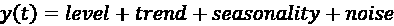
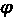

# 6

# 时间序列分析与预测

时间序列在工业和研究领域无处不在。我们可以在商业、技术、医疗、能源、金融等领域找到时间序列的例子。我们主要关注的是金融领域，因为时间维度与交易以及许多金融/经济指标密切相关。然而，几乎每个企业都会生成某种时间序列数据，例如，企业随时间变化的利润或任何其他度量的 KPI。因此，本章和下一章介绍的技术可以用于你在工作中可能遇到的任何时间序列分析任务。

时间序列建模或预测通常可以从不同的角度进行。最流行的两种方法是统计方法和机器学习方法。此外，我们还将在*第十五章*中介绍一些使用深度学习进行时间序列预测的示例，*《金融中的深度学习》*。

在过去，当我们没有强大的计算能力且时间序列数据不够精细（因为数据并不是随处随时收集）时，统计方法主导了这一领域。近年来，情况发生了变化，基于机器学习的方法在生产环境中的时间序列模型中占据主导地位。然而，这并不意味着经典的统计方法已经不再相关——事实上，远非如此。在数据量非常少的情况下（例如，只有 3 年的月度数据），统计方法仍然能够产生最先进的结果，而机器学习模型可能无法从中学习出规律。此外，我们可以看到，统计方法在最近几届 M-Competitions（由 Spyros Makridakis 发起的最大时间序列预测竞赛）中赢得了不少奖项。

本章将介绍时间序列建模的基础知识。我们首先解释时间序列的组成部分以及如何通过分解方法将其分离。然后，我们将讲解平稳性概念——为什么它很重要，如何进行平稳性检验，最终如果原始序列不是平稳的，如何使其平稳。

接下来，我们将介绍两种最广泛使用的统计方法——指数平滑法和 ARIMA 类模型。在这两种方法中，我们都会展示如何拟合模型、评估模型的拟合优度，并预测时间序列的未来值。

本章内容包括以下几个部分：

+   时间序列分解

+   测试时间序列的平稳性

+   校正时间序列的平稳性

+   使用指数平滑法对时间序列建模

+   使用 ARIMA 类模型对时间序列建模

+   使用 auto-ARIMA 寻找最佳拟合的 ARIMA 模型

# 时间序列分解

时间序列分解的目标之一是通过将序列分解为多个组件来增加我们对数据的理解。它提供了关于建模复杂性以及为了准确捕捉/建模每个组件应采取哪些方法的见解。

一个例子可以更好地阐明这些可能性。我们可以想象一个具有明确趋势的时间序列，可能是增长或下降。一方面，我们可以使用分解方法提取趋势组件，并在建模剩余序列之前将其从时间序列中移除。这有助于使时间序列平稳（有关更多细节，请参见下面的步骤）。然后，在考虑了其余组件之后，我们可以将其重新加回来。另一方面，我们也可以提供足够的数据或适当的特征，供算法自行建模趋势。

时间序列的组件可以分为两种类型：系统性和非系统性。系统性组件的特点是具有一致性，可以描述并建模。相反，非系统性组件无法直接建模。

以下是**系统性组件**：

+   **水平**—序列中的平均值。

+   **趋势**—对趋势的估计，即在任何给定时刻，连续时间点之间的值变化。它可以与序列的斜率（增加/减少）相关联。换句话说，它是时间序列在长时间段内的总体方向。

+   **季节性**—由重复的短期周期（具有固定且已知的周期）引起的均值偏差。

以下是非系统性组件：

+   **噪声**—序列中的随机变化。它包括从时间序列中移除其他组件后观察到的所有波动。

传统的时间序列分解方法通常使用两种类型的模型之一：加法模型和乘法模型。

**加法模型**可以通过以下特点进行描述：

+   模型形式—

+   线性模型—随时间变化的幅度一致

+   趋势是线性的（直线）

+   具有相同频率（宽度）和幅度（高度）的线性季节性变化

**乘法模型**可以通过以下特点进行描述：

+   模型形式—

+   非线性模型—随时间变化的幅度不一致，例如指数型变化

+   一条曲线型的非线性趋势

+   具有随时间变化的频率和幅度增加/减少的非线性季节性

为了让事情变得更有趣，我们可以找到具有加法和乘法特征组合的时间序列，例如，具有加法趋势和乘法季节性的序列。

请参考下图以可视化可能的组合。虽然现实世界的问题从来没有那么简单（数据噪声和不断变化的模式），但这些抽象模型提供了一个简单的框架，我们可以用它来分析我们的时间序列，然后再尝试进行建模/预测。


图 6.1：趋势和季节性加法与乘法变体

有时我们可能不想（或者由于某些模型假设不能）使用乘法模型。一个可能的解决方案是通过对数变换将乘法模型转换为加法模型：


在本例中，我们将展示如何进行美国月度失业率的时间序列分解，这些数据是从纳斯达克数据链接下载的。

## 如何操作...

执行以下步骤进行时间序列分解：

1.  导入库并进行身份验证：

    ```py
    import pandas as pd
    import nasdaqdatalink
    import seaborn as sns
    from statsmodels.tsa.seasonal import seasonal_decompose
    nasdaqdatalink.ApiConfig.api_key = "YOUR_KEY_HERE" 
    ```

1.  下载 2010 年至 2019 年间的美国月度失业率数据：

    ```py
    df = (
        nasdaqdatalink.get(dataset="FRED/UNRATENSA",
                           start_date="2010-01-01",
                           end_date="2019-12-31")
        .rename(columns={"Value": "unemp_rate"})
    ) 
    ```

    在*图 6.2*中，我们可以看到时间序列中一些明显的季节性模式。我们没有将最新数据包含在本次分析中，因为 COVID-19 大流行对失业率时间序列中的任何可观察模式造成了相当突兀的变化。我们没有展示生成图表所使用的代码，因为它与*第三章*《可视化金融时间序列》中的代码非常相似。

    

    图 6.2：2010 至 2019 年间美国失业率的季节性图

1.  添加滚动平均和标准差：

    ```py
    WINDOW_SIZE = 12
    df["rolling_mean"] = df["unemp_rate"].rolling(window=WINDOW_SIZE).mean()
    df["rolling_std"] = df["unemp_rate"].rolling(window=WINDOW_SIZE).std()
    df.plot(title="Unemployment rate") 
    ```

    运行代码片段会生成以下图表：

    

    图 6.3：美国失业率及其滚动平均和标准差

    从*图 6.3*的分析中，我们可以推断出趋势和季节性成分似乎呈现线性模式。因此，我们将在下一步中使用加法分解。

1.  使用加法模型进行季节性分解：

    ```py
    decomposition_results = seasonal_decompose(df["unemp_rate"],
                                               model="additive")
    (
        decomposition_results
        .plot()
        .suptitle("Additive Decomposition")
    ) 
    ```

    运行代码片段会生成以下图表：


图 6.4：美国失业率的季节性分解（使用加法模型）

在分解图中，我们可以看到提取的成分序列：趋势、季节性和随机（残差）。为了评估分解是否合理，我们可以查看随机成分。如果没有明显的模式（换句话说，随机成分确实是随机的，并且随时间变化一致），那么分解结果是合理的。在这种情况下，看起来残差的方差在数据集的前半部分略高。这可能表明一个常量的季节性模式不足以准确捕捉所分析时间序列的季节性成分。

## 它是如何工作的...

在*步骤 2*中下载数据后，我们使用`pandas` DataFrame 的`rolling`方法计算滚动统计。我们指定了 12 个月的窗口大小，因为我们处理的是月度数据。

我们使用`statsmodels`库中的`seasonal_decompose`函数进行经典分解。在此过程中，我们指明了希望使用的模型类型——可能的值是`additive`（加法）和`multiplicative`（乘法）。

当使用`seasonal_decompose`处理数字数组时，除非我们使用`pandas` Series 对象，否则必须指定观测的频率（`freq`参数）。如果存在缺失值或希望为时间序列开始和结束处的缺失周期外推残差，我们可以传递额外的参数`extrapolate_trend='freq'`。

## 还有更多……

我们在本配方中使用的季节性分解是最基本的方法。它有一些缺点：

+   由于该算法使用居中移动平均来估计趋势，运行分解时，时间序列的开头和结尾会出现趋势线（和残差）的缺失值。

+   使用此方法估算的季节性模式假设每年都会重复一次。不言而喻，这个假设非常强，特别是对于较长时间序列。

+   趋势线有过度平滑数据的倾向，这会导致趋势线无法充分响应剧烈或突发的波动。

+   该方法对数据中的潜在异常值不稳健。

随着时间的推移，出现了几种替代的时间序列分解方法。在这一节中，我们还将介绍使用**LOESS**（STL 分解）进行的季节性和趋势分解，这在`statsmodels`库中得到了实现。

LOESS 代表**局部估计散点平滑**，它是一种估计非线性关系的方法。

我们不会深入探讨 STL 分解的工作原理；然而，了解它相较于其他方法的优势是有意义的：

+   STL 可以处理任何类型的季节性（不像其他一些方法那样仅限于月度或季度）。

+   用户可以控制趋势的平滑度。

+   季节性成分可能随时间变化（变化率可以由用户控制）。

+   对异常值更稳健——趋势和季节性成分的估计不会受到异常值的影响，尽管它们的影响仍然会在残差成分中可见。

自然地，它并不是万能的解决方案，并且也有一些自身的缺点。例如，STL 仅能用于加法分解，并且不会自动考虑交易日/日历变化。

STL 分解的一个最近变种可以处理多个季节性。例如，一组小时数据的时间序列可以展现出每日/每周/每月的季节性。这种方法被称为**使用 LOESS 的多重季节性趋势分解**（**MSTL**），你可以在*另见*部分找到相关文献。

我们可以通过以下代码片段执行 STL 分解：

```py
from statsmodels.tsa.seasonal import STL
stl_decomposition = STL(df[["unemp_rate"]]).fit()
stl_decomposition.plot() \
                 .suptitle("STL Decomposition") 
```

运行代码会生成以下图表：


图 6.5：美国失业时间序列的 STL 分解

我们可以看到，STL 分解和经典分解的分解图非常相似。然而，在*图 6.5*中存在一些细微差别，显示了 STL 分解相对于经典分解的优势。首先，趋势估计中没有缺失值。其次，季节成分随时间缓慢变化。例如，当你查看不同年份一月的数据时，可以清晰地看到这一点。

`STL`中`seasonal`参数的默认值设置为 7，但该方法的作者建议使用更大的值（必须是大于或等于 7 的奇数）。在内部，该参数的值表示在估算季节成分的每个值时所使用的连续年份数。选择的值越大，季节成分越平滑。反过来，这导致时间序列中观察到的波动较少被归因于季节成分。`trend`参数的解释类似，不过它表示用于估算趋势成分的连续观察值数量。

我们还提到过，STL 分解的一个优点是其对离群值的更高鲁棒性。我们可以使用`robust`参数来启用数据依赖的加权函数。它在估计 LOESS 时重新加权观察值，在这种情况下，LOESS 变成了**LOWESS**（**局部加权散点图平滑**）。在使用鲁棒估计时，模型能够容忍在残差成分图中可见的较大误差。

在*图 6.6*中，你可以看到将两种 STL 分解方法与美国失业数据进行比较——有无鲁棒估计的对比。有关生成该图的代码，请参阅书籍 GitHub 库中的笔记本。


图 6.6：使用鲁棒估计在 STL 分解过程中的效果

我们可以清楚地观察到使用鲁棒估计的效果——较大的误差被容忍，且分析时间序列的前几年中季节性成分的形态有所不同。在这种情况下，鲁棒方法和非鲁棒方法哪个更好并没有明确的答案；这完全取决于我们想用分解做什么。本节中介绍的季节性分解方法也可以作为简单的异常值检测算法。例如，我们可以对序列进行分解，提取残差，并在残差超出 3 倍 **四分位距** (**IQR**) 时将观测值标记为异常值。`kats` 库在其 `OutlierDetector` 类中提供了这种算法的实现。

其他可用的季节性分解方法包括：

+   **ARIMA 时间序列中的季节性提取** (**SEATS**) 分解。

+   X11 分解—这种分解变体为所有观测值创建一个趋势-周期成分，并允许季节性成分随时间缓慢变化。

+   霍德里克-普雷斯科特滤波器—虽然该方法实际上不是一种季节性分解方法，但它是一种数据平滑技术，用于去除与商业周期相关的短期波动。通过去除这些波动，我们可以揭示长期趋势。HP 滤波器常用于宏观经济学中。你可以在 `statsmodels` 的 `hpfilter` 函数中找到它的实现。

## 另见

关于时间序列分解的有用参考资料：

+   Bandara, K., Hyndman, R. J., & Bergmeir, C. 2021\. “MSTL：一种用于具有多种季节性模式的时间序列的季节趋势分解算法。” *arXiv 预印本 arXiv:2107.13462*。

+   Cleveland, R. B., Cleveland, W. S., McRae, J. E., & Terpenning, I. J. 1990\. “基于 LOESS 的季节性趋势分解程序，” *官方统计期刊* *6*(1): 3–73\。

+   Hyndman, R.J. & Athanasopoulos, G. 2021\. *预测：原理与实践*，第 3 版，OTexts：澳大利亚墨尔本。OTexts.com/fpp3

+   Sutcliffe, A. 1993\. *X11 时间序列分解与抽样误差*。澳大利亚统计局。

# 时间序列平稳性检验

时间序列分析中最重要的概念之一是 **平稳性**。简单来说，平稳时间序列是一个其属性不依赖于观察时刻的序列。换句话说，平稳性意味着某一时间序列的 **数据生成过程** (**DGP**) 的统计属性随时间不变。

因此，我们不应该在平稳时间序列中看到任何趋势或季节性模式，因为它们的存在违反了平稳性假设。另一方面，白噪声过程是平稳的，因为无论何时观察，它的表现都几乎相同。

一个没有趋势和季节性但具有周期性行为的时间序列仍然可以是平稳的，因为这些周期的长度并不固定。因此，除非我们明确观察一个时间序列，否则无法确定周期的峰值和谷值的位置。

更正式地说，平稳性有多种定义，有些在假设上更严格。对于实际使用的情况，我们可以使用所谓的**弱平稳性**（或协方差平稳性）。为了将时间序列分类为（协方差）平稳，它必须满足以下三个条件：

+   序列的均值必须是恒定的

+   序列的方差必须是有限且恒定的

+   相隔相同时间的期数之间的协方差必须是恒定的

平稳性是时间序列的一个理想特征，因为它使得建模和未来预测变得更加可行。这是因为平稳序列比非平稳序列更容易预测，因为其统计特性在未来与过去相同。

非平稳数据的一些缺点包括：

+   方差可能会被模型错误指定

+   模型拟合较差，导致预测较差

+   我们无法利用数据中有价值的时间依赖模式

虽然平稳性是时间序列的一个理想特性，但并不是所有统计模型都适用。我们希望在使用某种自回归模型（如 AR、ARMA、ARIMA 等）进行建模时，时间序列是平稳的。然而，也有一些模型不依赖于平稳时间序列，举例来说，依赖时间序列分解的方法（如指数平滑法或 Facebook 的 Prophet）。

在这个示例中，我们将向你展示如何测试时间序列的平稳性。为此，我们将使用以下方法：

+   **扩展的迪基-福勒**（**ADF**）检验

+   **Kwiatkowski-Phillips-Schmidt-Shin**（**KPSS**）检验

+   （部分）自相关函数（PACF/ACF）的图形

我们将研究 2010 至 2019 年间的月度失业率的平稳性。

## 准备工作

我们将使用在 *时间序列分解* 示例中使用的相同数据。在展示失业率滚动均值和标准差的图表中（*图 6.3*），我们已经看到了随时间的负趋势，暗示了非平稳性。

## 如何操作...

执行以下步骤来测试美国月度失业率的时间序列是否平稳：

1.  导入库：

    ```py
    import pandas as pd
    from statsmodels.graphics.tsaplots import plot_acf, plot_pacf
    from statsmodels.tsa.stattools import adfuller, kpss 
    ```

1.  定义运行 ADF 检验的函数：

    ```py
    def  adf_test(x):
        indices = ["Test Statistic", "p-value",
                   "# of Lags Used", "# of Observations Used"]

        adf_test = adfuller(x, autolag="AIC")
        results = pd.Series(adf_test[0:4], index=indices)

        for key, value in adf_test[4].items():
            results[f"Critical Value ({key})"] = value
        return results 
    ```

    定义好函数后，我们可以运行测试：

    ```py
    adf_test(df["unemp_rate"]) 
    ```

    运行该代码片段将生成以下摘要：

    ```py
    Test Statistic             -2.053411
    p-value                     0.263656
    # of Lags Used             12.000000
    # of Observations Used    107.000000
    Critical Value (1%)        -3.492996
    Critical Value (5%)        -2.888955
    Critical Value (10%)       -2.581393 
    ```

    ADF 检验的原假设指出时间序列不是平稳的。当 p 值为 `0.26`（或等效地，测试统计量大于选定置信水平的临界值）时，我们没有理由拒绝原假设，这意味着我们可以得出结论，序列不是平稳的。

1.  定义一个用于运行 KPSS 检验的函数：

    ```py
    def  kpss_test(x, h0_type="c"):    
        indices = ["Test Statistic", "p-value", "# of Lags"]
        kpss_test = kpss(x, regression=h0_type)
        results = pd.Series(kpss_test[0:3], index=indices)

        for key, value in kpss_test[3].items():
            results[f"Critical Value ({key})"] = value
        return results 
    ```

    定义好函数后，我们可以运行检验：

    ```py
    kpss_test(df["unemp_rate"]) 
    ```

    运行代码片段会生成以下总结：

    ```py
    Test Statistic           1.799224
    p-value                  0.010000
    # of Lags                6.000000
    Critical Value (10%)     0.347000
    Critical Value (5%)      0.463000
    Critical Value (2.5%)    0.574000
    Critical Value (1%)      0.739000 
    ```

    KPSS 检验的原假设指出时间序列是平稳的。当 p 值为 `0.01`（或测试统计量大于选定的临界值）时，我们有理由拒绝原假设，支持替代假设，表明序列不是平稳的。

1.  生成 ACF/PACF 图：

    ```py
    N_LAGS = 40
    SIGNIFICANCE_LEVEL = 0.05
    fig, ax = plt.subplots(2, 1)
    plot_acf(df["unemp_rate"], ax=ax[0], lags=N_LAGS,
             alpha=SIGNIFICANCE_LEVEL)
    plot_pacf(df["unemp_rate"], ax=ax[1], lags=N_LAGS,
              alpha=SIGNIFICANCE_LEVEL) 
    ```

    运行代码片段会生成以下图表：


图 6.7：失业率的自相关和偏自相关图

在 ACF 图中，我们可以看到存在显著的自相关（超出 95% 置信区间，对应选定的 5% 显著性水平）。在 PACF 图中，滞后 1 和滞后 4 也存在一些显著的自相关。

## 它是如何工作的……

在*步骤 2*中，我们定义了一个用于运行 ADF 检验并打印结果的函数。我们在调用 `adfuller` 函数时指定了 `autolag="AIC"`，因此考虑的滞后数是根据 **赤池信息量准则**（**AIC**）自动选择的。或者，我们可以手动选择滞后数。

对于 `kpss` 函数（*步骤 3*），我们指定了 `regression` 参数。值为 `"c"` 表示原假设认为序列是水平平稳的，而 `"ct"` 表示趋势平稳的（去除趋势后序列将变为水平平稳的）。

对于所有的检验和自相关图，我们选择了 5% 的显著性水平，这表示当原假设（H0）实际上为真时，拒绝原假设的概率。

## 还有更多……

在本示例中，我们使用了 `statsmodels` 库进行平稳性检验。然而，我们必须将其功能封装在自定义函数中，以便以清晰的方式呈现总结。或者，我们可以使用 `arch` 库中的平稳性检验（当我们在*第九章*《使用 GARCH 类模型建模波动率》深入探讨 GARCH 模型时，将详细介绍该库）。

我们可以使用以下代码片段进行 ADF 检验：

```py
from arch.unitroot import ADF
adf = ADF(df["unemp_rate"])
print(adf.summary().as_text()) 
```

它返回一个格式良好的输出，包含所有相关信息：

```py
 Augmented Dickey-Fuller Results   
=====================================
Test Statistic                 -2.053
P-value                         0.264
Lags                               12
-------------------------------------
Trend: Constant
Critical Values: -3.49 (1%), -2.89 (5%), -2.58 (10%)
Null Hypothesis: The process contains a unit root.
Alternative Hypothesis: The process is weakly stationary. 
```

`arch` 库还包含更多的平稳性检验，包括：

+   Zivot-Andrews 检验（`statsmodels` 中也可用）

+   **菲利普斯-佩龙**（**PP**）检验（`statsmodels` 中不可用）

ADF 和 KPSS 检验的一个潜在缺点是它们不考虑结构性断裂的可能性，即数据生成过程中的均值或其他参数的突变。Zivot-Andrews 检验允许序列中出现一次结构性断裂，并且其发生时间未知。

我们可以使用以下代码片段运行该测试：

```py
from arch.unitroot import ZivotAndrews
za = ZivotAndrews(df["unemp_rate"])
print(za.summary().as_text()) 
```

这将生成摘要：

```py
 Zivot-Andrews Results        
=====================================
Test Statistic                 -2.551
P-value                         0.982
Lags                               12
-------------------------------------
Trend: Constant
Critical Values: -5.28 (1%), -4.81 (5%), -4.57 (10%)
Null Hypothesis: The process contains a unit root with a single structural break.
Alternative Hypothesis: The process is trend and break stationary. 
```

根据测试的 p 值，我们无法拒绝原假设，即该过程是非平稳的。

## 另见

有关其他平稳性检验的更多信息，请参考：

+   Phillips, P. C. B. & P. Perron, 1988\. “在时间序列回归中测试单位根，” *Biometrika* 75: 335-346。

+   Zivot, E. & Andrews, D.W.K., 1992\. “关于大崩盘、石油价格冲击和单位根假设的进一步证据，” *Journal of Business & Economic Studies*, 10: 251-270。

# 纠正时间序列的平稳性

在前一个食谱中，我们学习了如何调查一个给定的时间序列是否平稳。在本食谱中，我们将研究如何通过以下一种（或多种）变换方法将非平稳时间序列转化为平稳序列：

+   通货膨胀调整——使用**消费者物价指数**（**CPI**）来调整货币序列中的通货膨胀

+   应用自然对数——使潜在的指数趋势更接近线性，并减少时间序列的方差

+   差分——计算当前观测值与滞后值（当前观测值之前 *x* 时间点的观测值）之间的差异

对于本次练习，我们将使用 2000 年至 2010 年的月度黄金价格。我们故意选择这个样本，因为在此期间黄金价格呈现持续上涨的趋势——该序列显然是非平稳的。

## 如何操作...

执行以下步骤将序列从非平稳转换为平稳：

1.  导入库并验证并更新通货膨胀数据：

    ```py
    import pandas as pd
    import numpy as np
    import nasdaqdatalink
    import cpi
    from datetime import date
    from chapter_6_utils import test_autocorrelation
    nasdaqdatalink.ApiConfig.api_key = "YOUR_KEY_HERE" 
    ```

    在本食谱中，我们将使用`test_autocorrelation`辅助函数，它结合了我们在前一个食谱中介绍的组件——ADF 和 KPSS 检验，以及 ACF/PACF 图。

1.  下载黄金价格并重新采样为月度数据：

    ```py
    df = (
        nasdaqdatalink.get(dataset="WGC/GOLD_MONAVG_USD",
                           start_date="2000-01-01",
                           end_date="2010-12-31")
        .rename(columns={"Value": "price"})
        .resample("M")
        .last()
    ) 
    ```

    我们可以使用`test_autocorrelation`辅助函数来测试序列是否平稳。我们在笔记本中（可在 GitHub 上找到）已经这样做过了，结果表明，月度黄金价格的时间序列确实是非平稳的。

1.  对黄金价格进行通货膨胀调整（调整到 2010-12-31 的美元值），并绘制结果：

    ```py
    DEFL_DATE = date(2010, 12, 31)
    df["dt_index"] = pd.to_datetime(df.index)
    df["price_deflated"] = df.apply(
        lambda x: cpi.inflate(x["price"], x["dt_index"], DEFL_DATE), 
        axis=1
    )
    (
        df.loc[:, ["price", "price_deflated"]]
        .plot(title="Gold Price (deflated)")
    ) 
    ```

    运行代码片段会生成以下图表：

    

    图 6.8：月度黄金价格与调整通货膨胀后的时间序列

    我们还可以将黄金价格调整到另一个时间点，只要整个序列中的时间点一致即可。

1.  对调整通货膨胀后的序列应用自然对数，并将其与滚动指标一起绘制：

    ```py
    WINDOW = 12
    selected_columns = ["price_log", "rolling_mean_log",
                        "rolling_std_log"]
    df["price_log"] = np.log(df.price_deflated)
    df["rolling_mean_log"] = df.price_log.rolling(WINDOW) \
                               .mean()
    df["rolling_std_log"] = df.price_log.rolling(WINDOW) \
                              .std()
    (
        df[selected_columns]
        .plot(title="Gold Price (deflated + logged)", 
              subplots=True)
    ) 
    ```

    运行代码片段会生成以下图表：

    

    图 6.9：应用通货紧缩和自然对数后的时间序列，以及其滚动统计数据

    从之前的图中，我们可以看到对数转换成功地完成了它的任务，即使指数趋势变为线性。

1.  使用`test_autocorrelation`（本章的辅助函数）来检查序列是否变为平稳：

    ```py
    fig = test_autocorrelation(df["price_log"]) 
    ```

    运行该代码片段会生成以下图表：

    

    图 6.10：转化后的时间序列的自相关和偏自相关图

    我们还打印了统计测试结果：

    ```py
    ADF test statistic: 1.04 (p-val: 0.99)
    KPSS test statistic: 1.93 (p-val: 0.01) 
    ```

    在检查了统计测试结果和自相关/偏自相关图后，我们可以得出结论，通货紧缩和自然算法不足以使月度黄金价格的时间序列变为平稳。

1.  对序列应用差分并绘制结果：

    ```py
    selected_columns = ["price_log_diff", "roll_mean_log_diff",
                        "roll_std_log_diff"]
    df["price_log_diff"] = df.price_log.diff(1)
    df["roll_mean_log_diff"] = df.price_log_diff.rolling(WINDOW) \
                                 .mean()
    df["roll_std_log_diff"] = df.price_log_diff.rolling(WINDOW) \
                                .std()
    df[selected_columns].plot(title="Gold Price (deflated + log + diff)") 
    ```

    运行该代码片段会生成以下图表：

    图 6.11：应用三种类型转换后的时间序列，以及其滚动统计数据

    转化后的黄金价格看起来是平稳的——该序列围绕 0 波动，没有明显的趋势，且方差大致恒定。

1.  测试序列是否变为平稳：

    ```py
    fig = test_autocorrelation(df["price_log_diff"].dropna()) 
    ```

    运行该代码片段会生成以下图表：


图 6.12：转化后的时间序列的自相关和偏自相关图

我们还打印了统计测试结果：

```py
ADF test statistic: -10.87 (p-val: 0.00)
KPSS test statistic: 0.30 (p-val: 0.10) 
```

在应用第一次差分后，序列在 5%的显著性水平下变得平稳（根据两个测试）。在自相关/偏自相关图中，我们可以看到在滞后期 11、22 和 39 处有几个显著的函数值。这可能表明某种季节性，或者仅仅是一个虚假的信号。使用 5%的显著性水平意味着 5%的值可能位于 95%的置信区间之外——即使潜在过程没有显示任何自相关或偏自相关。

## 它是如何工作的...

在导入库、进行身份验证并可能更新 CPI 数据后，我们从纳斯达克数据链接下载了月度黄金价格。序列中有一些重复值。例如，2000-04-28 和 2000-04-30 都有相同的值。为了解决这个问题，我们将数据重新采样为月度频率，取每个月的最后一个可用值。

通过这样做，我们仅仅删除了每个月中的潜在重复项，而没有更改任何实际的数值。在*步骤 3*中，我们使用了`cpi`库，通过考虑美元的通货膨胀来使时间序列进行通货紧缩。该库依赖于美国劳工统计局推荐的 CPI-U 指数。为了使其工作，我们创建了一个包含日期的人工索引列，日期作为`datetime.date`类的对象。`inflate`函数接受以下参数：

+   `value`—我们希望调整的美元价值。

+   `year_or_month`—美元价值的日期来源。

+   `to`——可选参数，表示我们希望调整到的日期。如果不提供此参数，函数将调整到最近的年份。

在*步骤 4*中，我们对所有值应用了自然对数（`np.log`），将看似指数趋势的值转化为线性趋势。此操作应用于已被通货膨胀调整的价格。

作为最后的变换，我们使用了`pandas` DataFrame 的`diff`方法，计算时间点*t*和*t-1*之间的差值（默认设置对应的是一阶差分）。我们可以通过更改`period`参数来指定不同的周期数。

## 还有更多...

所考虑的黄金价格没有明显的季节性。然而，如果数据集显示出季节性模式，还是有一些潜在的解决方案：

+   通过差分进行调整——不使用一阶差分，而是使用高阶差分。例如，如果每月数据中存在年度季节性，可以使用`diff(12)`。

+   通过建模进行调整——我们可以直接对季节性进行建模，然后将其从序列中去除。一种可能性是从`seasonal_decompose`函数或其他更高级的自动分解算法中提取季节性成分。在这种情况下，如果使用加法模型，我们应该从序列中减去季节性成分；如果模型是乘法的，则应除以季节性成分。另一个解决方案是使用`np.polyfit()`拟合选择的时间序列的最佳多项式，然后从原始序列中减去它。

**Box-Cox 变换**是我们可以对时间序列数据进行的另一种调整方法。它结合了不同的指数变换函数，使分布更接近正态（高斯）分布。我们可以使用`scipy`库中的`boxcox`函数，它可以帮助我们自动找到最佳拟合的`lambda`参数值。需要注意的一个条件是序列中的所有值必须为正数，因此在计算一阶差分或任何可能引入负值的变换后，不应使用该变换。

一个名为`pmdarima`的库（关于这个库的更多内容可以在以下的食谱中找到）包含了两个函数，它们使用统计测试来确定我们应该对序列进行多少次差分，以实现平稳性（并去除季节性，即季节平稳性）。

我们可以使用以下测试来检查平稳性：ADF、KPSS 和 Phillips–Perron：

```py
from pmdarima.arima import ndiffs, nsdiffs 

print(f"Suggested # of differences (ADF): {ndiffs(df['price'], test='adf')}")
print(f"Suggested # of differences (KPSS): {ndiffs(df['price'], test='kpss')}")
print(f"Suggested # of differences (PP): {ndiffs(df['price'], test='pp')}") 
```

运行代码片段会返回以下结果：

```py
Suggested # of differences (ADF): 1
Suggested # of differences (KPSS): 2
Suggested # of differences (PP): 1 
```

对于 KPSS 测试，我们还可以指定要检验的零假设类型。默认情况下是水平平稳性（`null="level"`）。测试的结果，或更准确地说，差分的需求，表明未进行任何差分的序列是非平稳的。

该库还包含两个季节差分的测试：

+   **Osborn, Chui, Smith 和 Birchenhall**（**OCSB**）

+   **卡诺瓦-汉森**（**CH**）

为了运行它们，我们还需要指定数据的频率。在我们的例子中，它是 12，因为我们使用的是月度数据：

```py
print(f"Suggested # of differences (OSCB): {nsdiffs(df['price'], m=12,
test='ocsb')}")
print(f"Suggested # of differences (CH): {nsdiffs(df['price'], m=12, test='ch')}") 
```

输出结果如下：

```py
Suggested # of differences (OSCB): 0
Suggested # of differences (CH): 0 
```

结果表明黄金价格没有季节性。

# 使用指数平滑法建模时间序列

**指数平滑法**是两大类经典预测模型之一。其基本思想是，预测值仅仅是过去观测值的加权平均。当计算这些平均值时，更加重视最近的观测值。为了实现这一点，权重随着时间的推移呈指数衰减。这些模型适用于非平稳数据，即具有趋势和/或季节性的数据显示。平滑方法受到欢迎，因为它们计算速度快（需要的计算量不多），并且在预测准确性方面相对可靠。

总的来说，指数平滑法可以通过**ETS 框架**（**误差、趋势和季节性**）来定义，因为它们在平滑计算中结合了基本成分。如同季节性分解的情况一样，这些成分可以通过加法、乘法组合，或直接从模型中省略。

请参见*《预测：原理与实践》*（Hyndman 和 Athanasopoulos）了解更多关于指数平滑方法的分类信息。

最简单的模型称为**简单指数平滑法**（**SES**）。这种模型最适合于时间序列没有趋势或季节性的情况。它们也适用于数据点较少的序列。

该模型由一个平滑参数进行参数化，其值介于 0 和 1 之间。值越大，越重视最近的观测值。当 = 0 时，未来的预测值等于训练数据的平均值。当 = 1 时，所有预测值都与训练集中的最后一个观测值相同。

使用 SES 方法生成的预测是平坦的，也就是说，无论时间跨度多长，所有的预测值都相同（对应于最后的水平成分）。这就是为什么这种方法仅适用于没有趋势或季节性的序列。

**霍尔特线性趋势法**（也称为霍尔特**双重指数平滑法**）是单指数平滑法（SES）的扩展，通过将趋势成分加入模型的规格来考虑数据中的趋势。因此，当数据中存在趋势时，应使用此模型，但它仍然无法处理季节性。

霍尔特模型的一个问题是，趋势在未来是恒定的，这意味着它会无限增加或减少。这就是为什么模型的扩展通过添加衰减参数来平滑趋势，。它使得趋势在未来趋向一个常数值，从而有效地将其平滑。

的值很少小于`0.8`，因为对于较小的值，的衰减效应非常强。最佳实践是将的值限制在`0.8`到`0.98`之间。当 = 1 时，衰减模型等同于没有衰减的模型。

最后，我们将介绍霍尔特方法的扩展——**霍尔特-温特季节性平滑**（也称为霍尔特-温特三重指数平滑）。顾名思义，它考虑了时间序列中的季节性。简单来说，该方法最适用于既有趋势又有季节性的数据显示。

该模型有两种变体，分别具有加法或乘法季节性。在加法季节性模型中，季节性变化在整个时间序列中大致保持不变。而在乘法季节性模型中，变化会随着时间的推移而按比例变化。

在这个例子中，我们将展示如何将所涵盖的平滑方法应用于美国月度失业率（具有趋势和季节性的非平稳数据）。我们将对 2010 至 2018 年的数据进行模型拟合，并对 2019 年进行预测。

## 准备工作

我们将使用在*时间序列分解*实例中使用的相同数据。

## 如何操作...

执行以下步骤，以使用指数平滑方法创建美国失业率的预测：

1.  导入库：

    ```py
    import pandas as pd
    from datetime import date
    from statsmodels.tsa.holtwinters import (ExponentialSmoothing,
                                             SimpleExpSmoothing,
                                             Holt) 
    ```

1.  创建训练/测试数据集：

    ```py
    TEST_LENGTH = 12
    df.index.freq = "MS"
    df_train = df.iloc[:-TEST_LENGTH]
    df_test = df[-TEST_LENGTH:] 
    ```

1.  拟合两个 SES 模型并计算预测：

    ```py
    ses_1 = SimpleExpSmoothing(df_train).fit(smoothing_level=0.5)
    ses_forecast_1 = ses_1.forecast(TEST_LENGTH)
    ses_2 = SimpleExpSmoothing(df_train).fit()
    ses_forecast_2 = ses_2.forecast(TEST_LENGTH)
    ses_1.params_formatted 
    ```

    运行代码片段会生成以下表格：

    

    图 6.13：第一个 SES 模型拟合系数的值

    我们可以使用`summary`方法打印拟合模型的更详细摘要。

1.  将预测结果与拟合值结合并绘制它们：

    ```py
    ses_df = df.copy()
    ses_df["ses_1"] = ses_1.fittedvalues.append(ses_forecast_1)
    ses_df["ses_2"] = ses_2.fittedvalues.append(ses_forecast_2)
    opt_alpha = ses_2.model.params["smoothing_level"]
    fig, ax = plt.subplots()
    ses_df["2017":].plot(style=["-",":","--"], ax=ax,
                         title="Simple Exponential Smoothing")
    labels = [
        "unemp_rate",
        r"$\alpha=0.2$",
        r'$\alpha={0:.2f}$'.format(opt_alpha),
    ]
    ax.legend(labels) 
    ```

    运行代码片段会生成以下图表：

    

    图 6.14：使用 SES 建模时间序列

    在*图 6.14*中，我们可以看到我们在本例介绍中描述的 SES 特性——预测是一个平坦的线条。我们还可以看到通过优化程序选择的最优值为 1。立刻可以看到选择此值的后果：模型的拟合线实际上是观察到的价格线右移的结果，且预测仅仅是最后一个观察值。

1.  拟合三种霍尔特线性趋势模型变体并计算预测：

    ```py
    # Holt's model with linear trend
    hs_1 = Holt(df_train).fit()
    hs_forecast_1 = hs_1.forecast(TEST_LENGTH)
    # Holt's model with exponential trend
    hs_2 = Holt(df_train, exponential=True).fit()
    hs_forecast_2 = hs_2.forecast(TEST_LENGTH)
    # Holt's model with exponential trend and damping
    hs_3 = Holt(df_train, exponential=False,
                damped_trend=True).fit()
    hs_forecast_3 = hs_3.forecast(TEST_LENGTH) 
    ```

1.  将原始序列与模型的预测一起绘制：

    ```py
    hs_df = df.copy()
    hs_df["hs_1"] = hs_1.fittedvalues.append(hs_forecast_1)
    hs_df["hs_2"] = hs_2.fittedvalues.append(hs_forecast_2)
    hs_df["hs_3"] = hs_3.fittedvalues.append(hs_forecast_3)
    fig, ax = plt.subplots()
    hs_df["2017":].plot(style=["-",":","--", "-."], ax=ax,
                        title="Holt's Double Exponential Smoothing")
    labels = [
        "unemp_rate",
        "Linear trend",
        "Exponential trend",
        "Exponential trend (damped)",
    ]
    ax.legend(labels) 
    ```

    运行代码片段会生成以下图表：

    

    图 6.15：使用霍尔特双指数平滑法建模时间序列

    我们已经能够观察到改善，因为与 SES 预测相比，线条不再是平的。

    另外值得一提的是，在 SES 的情况下，我们优化了单一参数 `alpha`（`smoothing_level`），而在这里我们不仅优化了 `beta`（`smoothing_trend`），还可能优化了 `phi`（`damping_trend`）。

1.  拟合两种 Holt-Winters 三重指数平滑法模型并计算预测值：

    ```py
    SEASONAL_PERIODS = 12
    # Holt-Winters' model with exponential trend
    hw_1 = ExponentialSmoothing(df_train,
                                trend="mul",
                                seasonal="add",
                                seasonal_periods=SEASONAL_PERIODS).fit()
    hw_forecast_1 = hw_1.forecast(TEST_LENGTH)
    # Holt-Winters' model with exponential trend and damping
    hw_2 = ExponentialSmoothing(df_train,
                                trend="mul",
                                seasonal="add",
                                seasonal_periods=SEASONAL_PERIODS,
                                damped_trend=True).fit()
    hw_forecast_2 = hw_2.forecast(TEST_LENGTH) 
    ```

1.  将原始序列与模型结果一起绘制：

    ```py
    hw_df = df.copy()
    hw_df["hw_1"] = hw_1.fittedvalues.append(hw_forecast_1)
    hw_df["hw_2"] = hw_2.fittedvalues.append(hw_forecast_2)
    fig, ax = plt.subplots()
    hw_df["2017":].plot(
        style=["-",":","--"], ax=ax,
        title="Holt-Winters' Triple Exponential Smoothing"
    )
    phi = hw_2.model.params["damping_trend"]
    labels = [
        "unemp_rate",
        "Seasonal Smoothing",
        f"Seasonal Smoothing (damped with $\phi={phi:.2f}$)"
    ]
    ax.legend(labels) 
    ```

    运行代码片段生成了以下图表：


图 6.16：使用 Holt-Winters 三重指数平滑法建模时间序列

在前面的图表中，我们可以看到季节性模式现在也被纳入了预测中。

## 它是如何工作的……

在导入库之后，我们使用 `SimpleExpSmoothing` 类及其 `fit` 方法拟合了两个不同的 SES 模型。为了拟合模型，我们仅使用了训练数据。我们本可以手动选择平滑参数（`smoothing_level`）的值，但最佳实践是让 `statsmodels` 为最佳拟合优化该参数。这个优化通过最小化残差（误差）的平方和来完成。我们使用 `forecast` 方法创建了预测值，该方法需要我们希望预测的周期数（在我们的案例中，周期数等于测试集的长度）。

在*步骤 3*中，我们将拟合值（通过拟合模型的 `fittedvalues` 属性访问）和预测值与观察到的失业率一起放入了一个 `pandas` DataFrame 中。然后我们将所有序列进行可视化。为了使图表更易读，我们将数据限制为覆盖训练集和测试集的最后两年。

在*步骤 5*中，我们使用了 `Holt` 类（这是一个包装器，封装了更通用的 `ExponentialSmoothing` 类）来拟合 Holt 的线性趋势模型。默认情况下，模型中的趋势是线性的，但我们可以通过指定 `exponential=True` 来使其变为指数型，并通过 `damped_trend=True` 添加阻尼。与 SES 的情况类似，使用 `fit` 方法且不带任何参数将运行优化例程，以确定参数的最佳值。在*步骤 6*中，我们再次将所有拟合值和预测结果放入一个 DataFrame 中，并可视化了结果。

在*步骤 7*中，我们估计了两种 Holt-Winters 三重指数平滑法模型。这个模型没有单独的类，但我们可以通过添加 `seasonal` 和 `seasonal_periods` 参数来调整 `ExponentialSmoothing` 类。根据 ETS 模型的分类法，我们应该指出这些模型具有加性季节性成分。在*步骤 8*中，我们再次将所有拟合值和预测结果放入一个 DataFrame 中，并将结果以折线图的形式可视化。

在创建`ExponentialSmoothing`类的实例时，我们还可以传递`use_boxcox`参数，以便自动将 Box-Cox 变换应用于分析的时间序列。或者，我们可以通过传递`"log"`字符串来使用对数变换。

## 还有更多...

在本案例中，我们拟合了各种指数平滑模型来预测月度失业率。每次，我们都会指定感兴趣的模型类型，并且大多数时候，我们让`statsmodels`找到最合适的参数。

然而，我们也可以采用不同的方法，即使用一个名为 AutoETS 的过程。简单来说，该过程的目标是根据我们预先提供的一些约束，找到最适合的 ETS 模型。你可以在*另见*部分提到的参考文献中详细了解 AutoETS 过程的工作原理。

AutoETS 过程可以在`sktime`库中使用，该库/框架受到`scikit-learn`的启发，但重点是时间序列分析/预测。

执行以下步骤以使用 AutoETS 方法找到最佳 ETS 模型：

1.  导入库：

    ```py
    from sktime.forecasting.ets import AutoETS
    from sklearn.metrics import mean_absolute_percentage_error 
    ```

1.  拟合`AutoETS`模型：

    ```py
    auto_ets = AutoETS(auto=True, n_jobs=-1, sp=12)
    auto_ets.fit(df_train.to_period())
    auto_ets_fcst = auto_ets.predict(fh=list(range(1, 13))) 
    ```

1.  将模型的预测添加到 Holt-Winters 预测图中：

    ```py
    auto_ets_df = hw_df.to_period().copy()
    auto_ets_df["auto_ets"] = (
        auto_ets
        ._fitted_forecaster
        .fittedvalues
        .append(auto_ets_fcst["unemp_rate"])
    )
    fig, ax = plt.subplots()
    auto_ets_df["2017":].plot(
        style=["-",":","--","-."], ax=ax,
        title="Holt-Winters' models vs. AutoETS"
    )
    labels = [
        "unemp_rate",
        "Seasonal Smoothing",
        f"Seasonal Smoothing (damped with $\phi={phi:.2f}$)",
        "AutoETS",
    ]
    ax.legend(labels) 
    ```

    运行代码段生成以下图表：

    

    图 6.17：AutoETS 预测结果与 Holt-Winters 方法结果的比较图

    在*图 6.17*中，我们可以看到 Holt-Winters 模型和 AutoETS 的样本内拟合非常相似。至于预测，它们确实有所不同，很难说哪一个更好地预测了失业率。

    这就是为什么在下一步中我们计算**平均绝对百分比误差**（**MAPE**）的原因，MAPE 是时间序列预测（及其他领域）中常用的评估指标。

1.  计算 Holt-Winters 预测和 AutoETS 的 MAPE：

    ```py
    fcst_dict = {
        "Seasonal Smoothing": hw_forecast_1,
        "Seasonal Smoothing (damped)": hw_forecast_2,
        "AutoETS": auto_ets_fcst,
    }

    print("MAPEs ----")
    for key, value in fcst_dict.items():
        mape = mean_absolute_percentage_error(df_test, value)
        print(f"{key}: {100 * mape:.2f}%") 
    ```

运行代码段生成以下摘要：

```py
MAPEs ----
Seasonal Smoothing: 1.81%
Seasonal Smoothing (damped): 6.53%
AutoETS: 1.78% 
```

我们可以看到，Holt-Winters 方法和 AutoETS 方法的准确性评分（通过 MAPE 衡量）非常相似。

## 另见

请参阅以下参考文献，了解有关 ETS 方法的更多信息：

+   Hyndman, R. J., Akram, Md., & Archibald, 2008\. “指数平滑模型的可接受参数空间，” *统计数学年刊*，**60**（2）：407–426。

+   Hyndman, R. J., Koehler, A.B., Snyder, R.D., & Grose, S., 2002\. “使用指数平滑方法进行自动预测的状态空间框架，” *国际预测期刊*，**18**（3）：439–454。

+   Hyndman, R. J & Koehler, A. B., 2006\. “重新审视预测准确性度量，” *国际预测期刊*，22（4）：679-688。

+   Hyndman, R. J., Koehler, A.B., Ord, J.K., & Snyder, R.D. 2008\. *使用指数平滑进行预测：状态空间方法*，Springer-Verlag. [`www.exponentialsmoothing.net`](http://www.exponentialsmoothing.net)。

+   Hyndman, R. J. & Athanasopoulos, G. 2021\. *预测：原理与实践*，第 3 版，OTexts：澳大利亚墨尔本。OTexts.com/fpp3。

+   Winters, P.R. 1960\. “通过指数加权移动平均法预测销售额，”*管理科学* 6(3)：324–342。

# 使用 ARIMA 类模型建模时间序列

**ARIMA** 模型是一类统计模型，用于分析和预测时间序列数据。它们通过描述数据中的自相关关系来实现这一目标。ARIMA 代表自回归积分滑动平均模型，是一种比 ARMA 模型更为复杂的扩展形式。附加的积分部分旨在确保序列的平稳性。因为与指数平滑模型不同，ARIMA 模型要求时间序列必须是平稳的。接下来我们将简要介绍模型的构建模块。

AR（自回归）模型：

+   这种模型使用观测值与其 *p* 个滞后值之间的关系。

+   在金融背景下，自回归模型试图解释动量和均值回归效应。

I（积分）：

+   在这种情况下，积分指的是对原始时间序列进行差分（将当前期值减去前一期的值）以使其平稳。

+   负责积分的参数是 *d*（称为差分的度/阶），表示我们需要应用差分的次数。

MA（移动平均）模型：

+   这种模型使用观测值与白噪声项之间的关系（过去 *q* 个观测值中发生的冲击）。

+   在金融背景下，移动平均模型试图解释影响观察到的时间序列的不可预测的冲击（观察到的残差）。这种冲击的例子可能包括自然灾害、与某公司相关的突发新闻等。

+   MA 模型中的白噪声项是不可观察的。由于这一点，我们无法使用 **普通最小二乘法**（**OLS**）来拟合 ARIMA 模型。相反，我们必须使用诸如 **最大似然估计**（**MLE**）等迭代估计方法。

所有这些组件共同作用，并在常用的符号表示法中直接指定：ARIMA (p,d,q)。一般来说，我们应尽量将 ARIMA 参数的值保持尽可能小，以避免不必要的复杂性并防止过拟合训练数据。一个可能的经验法则是将 *d* <= 2，而 *p* 和 *q* 不应大于 5\. 此外，通常情况下，模型中的某一项（AR 或 MA）将占主导地位，导致另一项的参数值相对较小。

ARIMA 模型非常灵活，通过适当设置它们的超参数，我们可以得到一些特殊的情况：

+   ARIMA (0,0,0)：白噪声

+   ARIMA (0,1,0) 无常数项：随机游走

+   ARIMA (p,0,q)：ARMA(p, q)

+   ARIMA (p,0,0)：AR(p) 模型

+   ARIMA (0,0,q)：MA(q) 模型

+   ARIMA (0,1,2)：衰减霍尔特模型

+   ARIMA (0,1,1) 无常数项：SES 模型

+   ARIMA (0,2,2)：霍尔特的线性法与加性误差

ARIMA 模型在工业界仍然非常流行，因为它们提供了接近最先进的性能（主要用于短期预测），特别是在处理小型数据集时。在这种情况下，更高级的机器学习和深度学习模型无法展现其真正的强大能力。

ARIMA 模型在金融领域的已知弱点之一是它们无法捕捉到波动性聚集现象，这在大多数金融资产中都有观察到。

在本食谱中，我们将通过所有必要的步骤来正确估计 ARIMA 模型，并学习如何验证它是否适合数据。对于这个例子，我们将再次使用 2010 到 2019 年间的美国月度失业率数据。

## 准备就绪

我们将使用与*时间序列分解*食谱中相同的数据。

## 如何操作...

执行以下步骤，使用 ARIMA 模型创建美国失业率的预测：

1.  导入库：

    ```py
    import pandas as pd
    import numpy as np
    from statsmodels.tsa.arima.model import ARIMA
    from chapter_6_utils import test_autocorrelation
    from sklearn.metrics import mean_absolute_percentage_error 
    ```

1.  创建训练/测试集拆分：

    ```py
    TEST_LENGTH = 12
    df_train = df.iloc[:-TEST_LENGTH]
    df_test = df.iloc[-TEST_LENGTH:] 
    ```

    我们像之前的做法一样创建训练/测试集拆分。通过这种方式，我们可以比较两种模型的性能。

1.  应用对数变换并计算第一差分：

    ```py
    df_train["unemp_rate_log"] = np.log(df_train["unemp_rate"])
    df_train["first_diff"] = df_train["unemp_rate_log"].diff()
    df_train.plot(subplots=True, 
                  title="Original vs transformed series") 
    ```

    运行代码片段生成以下图形：

    

    图 6.18：应用变换以实现平稳性

1.  测试差分系列的平稳性：

    ```py
    fig = test_autocorrelation(df_train["first_diff"].dropna()) 
    ```

    运行函数产生以下输出：

    ```py
    ADF test statistic: -2.97 (p-val: 0.04)
    KPSS test statistic: 0.04 (p-val: 0.10) 
    ```

    通过分析测试结果，我们可以得出结论，经过对数转换后的系列的第一差分是平稳的。我们还观察相应的自相关图。

    

    图 6.19：对数转换系列的第一差分的自相关图

1.  拟合两个不同的 ARIMA 模型并打印其总结：

    ```py
    arima_111 = ARIMA(
        df_train["unemp_rate_log"], order=(1, 1, 1)
    ).fit()
    arima_111.summary() 
    ```

    运行代码片段生成以下总结：

    图 6.20：拟合的 ARIMA(1,1,1) 模型总结

    第一个模型是普通的 ARIMA(1,1,1)。对于第二个模型，我们使用 ARIMA(2,1,2)。

    ```py
    arima_212 = ARIMA(
        df_train["unemp_rate_log"], order=(2, 1, 2)
    ).fit()
    arima_212.summary() 
    ```

    运行代码片段生成以下总结：

    

    图 6.21：拟合的 ARIMA(2,1,2) 模型总结

1.  将拟合值与预测值结合：

    ```py
    df["pred_111_log"] = (
        arima_111
        .fittedvalues
        .append(arima_111.forecast(TEST_LENGTH))
    )
    df["pred_111"] = np.exp(df["pred_111_log"])

    df["pred_212_log"] = (
        arima_212
        .fittedvalues
        .append(arima_212.forecast(TEST_LENGTH))
    )
    df["pred_212"] = np.exp(df["pred_212_log"])
    df 
    ```

    运行代码片段生成以下表格：

    

    图 6.22：ARIMA 模型的预测——原始值与转换回原始尺度的值

1.  绘制预测并计算 MAPE：

    ```py
    (
        df[["unemp_rate", "pred_111", "pred_212"]]
        .iloc[1:]
        .plot(title="ARIMA forecast of the US unemployment rate")
    ) 
    ```

    运行代码片段生成以下图形：

    

    图 6.23：两个 ARIMA 模型的预测与拟合值

    现在我们也放大测试集，以清晰地看到预测结果：

    ```py
    (
        df[["unemp_rate", "pred_111", "pred_212"]]
        .iloc[-TEST_LENGTH:]
        .plot(title="Zooming in on the out-of-sample forecast")
    ) 
    ```

    运行代码片段生成以下图形：

    图 6.24：两个 ARIMA 模型的预测

    在 *图 6.24* 中，我们可以看到 ARIMA(1,1,1) 的预测几乎是直线，而 ARIMA(2,1,2) 更好地捕捉到了原始序列的模式。

    现在我们计算 MAPEs：

    ```py
    mape_111 = mean_absolute_percentage_error(
        df["unemp_rate"].iloc[-TEST_LENGTH:],
        df["pred_111"].iloc[-TEST_LENGTH:]
    )
    mape_212 = mean_absolute_percentage_error(
        df["unemp_rate"].iloc[-TEST_LENGTH:],
        df["pred_212"].iloc[-TEST_LENGTH:]
    )
    print(f"MAPE of ARIMA(1,1,1): {100 * mape_111:.2f}%")
    print(f"MAPE of ARIMA(2,1,2): {100 * mape_212:.2f}%") 
    ```

    运行该代码片段生成以下输出：

    ```py
    MAPE of ARIMA(1,1,1): 9.14%
    MAPE of ARIMA(2,1,2): 5.08% 
    ```

1.  提取预测结果及其相应的置信区间，并将它们一起绘制：

    ```py
    preds_df = arima_212.get_forecast(TEST_LENGTH).summary_frame()
    preds_df.columns = ["fcst", "fcst_se", "ci_lower", "ci_upper"]
    plot_df = df_test[["unemp_rate"]].join(np.exp(preds_df))
    fig, ax = plt.subplots()
    (
        plot_df[["unemp_rate", "fcst"]]
        .plot(ax=ax,
              title="ARIMA(2,1,2) forecast with confidence intervals")
    )
    ax.fill_between(plot_df.index,
                    plot_df["ci_lower"],
                    plot_df["ci_upper"],
                    alpha=0.3,
                    facecolor="g")
    ax.legend(loc="upper left") 
    ```

    运行该代码片段生成以下图形：


图 6.25：ARIMA(2,1,2) 模型的预测结果及其置信区间

我们可以看到，预测结果跟随观察值的形状。此外，我们还可以看到置信区间呈典型的圆锥形模式——预测的时间范围越长，置信区间越宽，这与不确定性的增加相对应。

## 它是如何工作的...

在 *步骤 2* 中创建训练集和测试集后，我们对训练数据应用了对数变换和第一次差分。

如果我们想对给定的序列应用多次差分操作，我们应使用 `np.diff` 函数，因为它实现了递归差分。使用 DataFrame/Series 的 `diff` 方法并设置 `periods` > 1 会得到当前观察值与前 `periods` 个时期的观察值之差。

在 *步骤 4* 中，我们测试了对对数变换后的序列进行第一次差分后的平稳性。为此，我们使用了自定义的 `test_autocorrelation` 函数。通过查看统计测试的输出，我们看到该序列在 5% 的显著性水平下是平稳的。

查看 ACF/PACF 图时，我们还可以清晰地看到年度季节性模式（在滞后 12 和 24 时）。

在 *步骤 5* 中，我们拟合了两个 ARIMA 模型：ARIMA(1,1,1) 和 ARIMA(2,1,2)。首先，序列在进行第一次差分后变得平稳，因此我们知道积分阶数是 *d=1*。通常，我们可以使用以下一组“规则”来确定 *p* 和 *q* 的值。

确定 AR 模型的阶数：

+   ACF 显示显著的自相关系数直到滞后 *p*，然后逐渐衰减。

+   由于 PACF 仅描述观察值与其滞后值之间的直接关系，我们预计在滞后 *p* 之外不会有显著的相关性。

确定 MA 模型的阶数：

+   PACF 显示显著的自相关系数直到滞后 *q*，然后逐渐衰减。

+   ACF 显示显著的自相关系数直到滞后 *q*，然后会出现急剧下降。

关于 ARIMA 阶数的手动调整，Hyndman 和 Athanasopoulos（2018）警告说，如果 *p* 和 *q* 都为正，ACF/PACF 图可能在确定 ARIMA 模型的规格时不太有用。在下一篇食谱中，我们将介绍一种自动方法来确定 ARIMA 超参数的最优值。

在*步骤 6*中，我们将原始序列与两个模型的预测结果结合起来。我们从 ARIMA 模型中提取了拟合值，并将 2019 年的预测附加到序列的末尾。由于我们将模型拟合于对数转换后的序列，因此我们需要使用指数函数（`np.exp`）来逆转转换。

当处理可能包含 0 值的序列时，最好使用 `np.log1p` 和 `np.exp1m`。这样，我们可以避免对 0 取对数时可能出现的错误。

在*步骤 7*中，我们绘制了预测图并计算了平均绝对百分比误差。ARIMA(2,1,2)提供的预测比简单的 ARIMA(1,1,1)要好得多。

在*步骤 8*中，我们将拟合 ARIMA 模型的 `get_forecast` 方法与 `summary_frame` 方法结合起来，获得预测值及其相应的置信区间。我们必须使用 `get_forecast` 方法，因为 `forecast` 方法仅返回点预测，而没有任何附加信息。最后，我们重命名了列，并将它们与原始序列一起绘制。

## 还有更多...

我们已经拟合了 ARIMA 模型并探索了其预测的准确性。然而，我们也可以研究拟合模型的拟合优度标准。我们可以通过深入分析模型对训练数据的拟合情况，而不只是关注外样本性能。我们通过查看拟合 ARIMA 模型的残差来实现这一点。

首先，我们绘制了拟合 ARIMA(2,1,2) 模型的残差诊断图：

```py
arima_212.plot_diagnostics(figsize=(18, 14), lags=25) 
```

运行这段代码会生成以下图形：


图 6.26：拟合的 ARIMA(2,1,2) 模型的诊断图

下面我们将介绍每个图表的解释：

+   标准化残差随时间变化（左上角）——残差应该表现得像白噪声，也就是说，应该看不到明显的模式。此外，残差应该具有零均值和一致的方差。在我们的案例中，似乎负值比正值更多，因此均值也可能为负。

+   直方图和 KDE 估计（右上角）——残差的 KDE 曲线应与标准正态分布（标记为 N(0,1)）的曲线非常相似。我们可以看到，在我们的模型中情况并非如此，因为分布向负值偏移。

+   Q-Q 图（左下角）——大多数数据点应位于一条直线上。这表明理论分布（标准正态分布）的分位数与经验分位数匹配。如果与对角线有显著偏离，意味着经验分布是偏斜的。

+   自相关图（右下角）——在这里，我们观察的是残差的自相关函数图。我们期望一个拟合良好的 ARIMA 模型的残差不应具有自相关性。在我们的案例中，我们可以清楚地看到在滞后期 12 和 24 存在相关的残差。这表明模型没有捕捉到数据中的季节性模式。

为了继续研究残差的自相关性，我们还可以应用 Ljung-Box 检验以测试是否存在自相关。为此，我们可以使用拟合的 ARIMA 模型中的 `test_serial_correlation` 方法。或者，我们也可以使用 `statsmodels` 中的 `acorr_ljungbox` 函数。

```py
ljung_box_results = arima_212.test_serial_correlation(method="ljungbox")
ljung_box_pvals = ljung_box_results[0][1]
fig, ax = plt.subplots(1, figsize=[16, 5])
sns.scatterplot(x=range(len(ljung_box_pvals)),
                y=ljung_box_pvals,
                ax=ax)
ax.axhline(0.05, ls="--", c="r")
ax.set(title="Ljung-Box test's results",
       xlabel="Lag",
       ylabel="p-value") 
```

运行代码片段会生成以下图表：


图 6.27：Ljung-Box 检验结果——残差中无自相关

所有返回的 p 值都低于 5% 的显著性水平，这意味着我们应该拒绝原假设，认为残差中不存在自相关。这是合理的，因为我们已经观察到由于模型缺少季节性模式，造成了显著的年度相关性。

我们还需要记住，在执行 Ljung-Box 检验时要考虑的滞后数。不同的资料来源建议考虑不同的滞后数。`statsmodels` 中的默认值是 `min(10, nobs // 5)`，适用于非季节性模型，而季节性时间序列的默认值为 `min(2*m, nobs // 5)`，其中 `m` 表示季节周期。其他常用的变体包括 `min(20, nobs − 1)` 和 `ln(nobs)`。在我们的案例中，我们没有使用季节性模型，所以默认值是 10。但正如我们所知，数据确实表现出了季节性模式，因此我们应该考虑更多的滞后数。

拟合的 ARIMA 模型还包含 `test_normality` 和 `test_heteroskedasticity` 方法，我们可以用它们进一步评估模型的拟合度。我们将这些内容作为练习留给读者自行探索。

## 另见

请参考以下资料，了解更多有关拟合 ARIMA 模型的信息，并获取手动选择模型正确阶数的有用规则集合：

+   [`online.stat.psu.edu/stat510/lesson/3/3.1`](https://online.stat.psu.edu/stat510/lesson/3/3.1)

+   [`people.duke.edu/~rnau/arimrule.htm`](https://people.duke.edu/~rnau/arimrule.htm)

有关 Ljung-Box 检验的更多信息：

+   [`robjhyndman.com/hyndsight/ljung-box-test/`](https://robjhyndman.com/hyndsight/ljung-box-test/)

# 使用 auto-ARIMA 寻找最适合的 ARIMA 模型

正如我们在前面的教程中看到的，ARIMA 模型的表现会根据所选的超参数（*p*，*d* 和 *q*）有很大差异。我们可以根据直觉、统计检验和 ACF/PACF 图来尽力选择这些参数。然而，实际操作中这可能会变得相当困难。

这就是为什么在本教程中我们引入了 **auto-ARIMA**，这是一种自动化方法，用于寻找 ARIMA 类模型（包括 ARIMAX 和 SARIMA 等变体）的最佳超参数。

不深入探讨算法的技术细节，它首先使用 KPSS 测试确定差分的次数。然后，算法使用逐步搜索方法遍历模型空间，寻找一个拟合效果更好的模型。比较模型时，常用的评估指标是 **赤池信息量准则**（**AIC**）。该指标提供了模型拟合度与简洁性之间的权衡——AIC 处理了过拟合和欠拟合的风险。当我们比较多个模型时，AIC 值越低，模型越好。有关 auto-ARIMA 方法的更完整描述，请参阅 *另见* 部分提到的资料。

auto-ARIMA 框架也适用于 ARIMA 模型的扩展：

+   **ARIMAX**—向模型中添加外生变量。

+   **SARIMA**（**季节性 ARIMA**）—扩展 ARIMA 以考虑时间序列中的季节性。其完整规格为 SARIMA(p,d,q)(P,D,Q)m，其中大写的参数类似于原始参数，但它们指的是时间序列中的季节性成分。*m* 代表季节性的周期。

在本方案中，我们将再次使用 2010 到 2019 年间的美国月度失业率数据。

## 准备工作

我们将使用与 *时间序列分解* 方案中相同的数据。

## 如何操作...

执行以下步骤，使用 auto-ARIMA 方法找到最佳拟合 ARIMA 模型：

1.  导入库：

    ```py
    import pandas as pd
    import pmdarima as pm
    from sklearn.metrics import mean_absolute_percentage_error 
    ```

1.  创建训练/测试集分割：

    ```py
    TEST_LENGTH = 12
    df_train = df.iloc[:-TEST_LENGTH]
    df_test = df.iloc[-TEST_LENGTH:] 
    ```

1.  使用 auto-ARIMA 方法找到 ARIMA 模型的最佳超参数：

    ```py
    auto_arima = pm.auto_arima(df_train,
                               test="adf",
                               seasonal=False,
                               with_intercept=False,
                               stepwise=True,
                               suppress_warnings=True,
                               trace=True)

    auto_arima.summary() 
    ```

    执行代码片段会生成以下摘要：

    

    图 6.28：使用 auto-ARIMA 方法识别的最佳拟合 ARIMA 模型的摘要

    该程序指示最佳拟合 ARIMA 模型为 ARIMA(2,1,2)。但正如你所看到的，*图 6.28* 和 *图 6.21* 中的结果是不同的。这是因为在后者的情况下，我们将 ARIMA(2,1,2) 模型拟合到对数变换后的系列，而在本方案中，我们没有应用对数变换。

    由于我们设置了 `trace=True`，我们还可以看到关于过程中拟合的模型的以下信息：

    ```py
    Performing stepwise search to minimize aic
     ARIMA(2,1,2)(0,0,0)[0]             : AIC=7.411, Time=0.24 sec
     ARIMA(0,1,0)(0,0,0)[0]             : AIC=77.864, Time=0.01 sec
     ARIMA(1,1,0)(0,0,0)[0]             : AIC=77.461, Time=0.01 sec
     ARIMA(0,1,1)(0,0,0)[0]             : AIC=75.688, Time=0.01 sec
     ARIMA(1,1,2)(0,0,0)[0]             : AIC=68.551, Time=0.01 sec
     ARIMA(2,1,1)(0,0,0)[0]             : AIC=54.321, Time=0.03 sec
     ARIMA(3,1,2)(0,0,0)[0]             : AIC=7.458, Time=0.07 sec
     ARIMA(2,1,3)(0,0,0)[0]             : AIC=inf, Time=0.07 sec
     ARIMA(1,1,1)(0,0,0)[0]             : AIC=78.507, Time=0.02 sec
     ARIMA(1,1,3)(0,0,0)[0]             : AIC=60.069, Time=0.02 sec
     ARIMA(3,1,1)(0,0,0)[0]             : AIC=41.703, Time=0.02 sec
     ARIMA(3,1,3)(0,0,0)[0]             : AIC=10.527, Time=0.10 sec
     ARIMA(2,1,2)(0,0,0)[0] intercept   : AIC=inf, Time=0.08 sec
    Best model:  ARIMA(2,1,2)(0,0,0)[0]          
    Total fit time: 0.740 seconds 
    ```

    类似于使用 `statsmodels` 库估算的 ARIMA 模型，在 `pmdarima`（它实际上是 `statsmodels` 的一个封装）中，我们也可以使用 `plot_diagnostics` 方法通过查看残差来分析模型的拟合情况：

    ```py
    auto_arima.plot_diagnostics(figsize=(18, 14), lags=25) 
    ```

    执行代码片段会生成以下图形：

    图 6.29：最佳拟合 ARIMA 模型的诊断图

    类似于 *图 6.26* 中的诊断图，这个 ARIMA(2,1,2) 模型也未能很好地捕捉到年度季节性模式——我们可以从自相关图中清楚地看到这一点。

1.  使用 auto-ARIMA 方法找到 SARIMA 模型的最佳超参数：

    ```py
    auto_sarima = pm.auto_arima(df_train,
                                test="adf",
                                seasonal=True,
                                m=12,
                                with_intercept=False,
                                stepwise=True,
                                suppress_warnings=True,
                                trace=True)
    auto_sarima.summary() 
    ```

    执行代码片段会生成以下摘要：

    

    图 6.30：使用 auto-ARIMA 程序识别的最佳拟合 SARIMA 模型的总结。

    就像我们之前做的那样，我们还将查看各种残差图：

    ```py
    auto_sarima.plot_diagnostics(figsize=(18, 14), lags=25) 
    ```

    执行代码片段会生成以下图形：

    

    图 6.31：最佳拟合 SARIMA 模型的诊断图。

    我们可以清楚地看到，SARIMA 模型比 ARIMA(2,1,2) 模型拟合得更好。

1.  计算两个模型的预测值并绘制它们：

    ```py
    df_test["auto_arima"] = auto_arima.predict(TEST_LENGTH)
    df_test["auto_sarima"] = auto_sarima.predict(TEST_LENGTH)
    df_test.plot(title="Forecasts of the best ARIMA/SARIMA models") 
    ```

    执行代码片段会生成以下图形：


图 6.32：使用 auto-ARIMA 程序识别的 ARIMA 和 SARIMA 模型的预测结果。

不足为奇的是，SARIMA 模型比 ARIMA 模型更好地捕捉到季节性模式。这一点也反映在下面计算的性能指标中。我们还计算了 MAPEs：

```py
mape_auto_arima = mean_absolute_percentage_error(
    df_test["unemp_rate"], 
    df_test["auto_arima"]
)

mape_auto_sarima = mean_absolute_percentage_error(
    df_test["unemp_rate"], 
    df_test["auto_sarima"]
)

print(f"MAPE of auto-ARIMA: {100*mape_auto_arima:.2f}%")
print(f"MAPE of auto-SARIMA: {100*mape_auto_sarima:.2f}%") 
```

执行代码片段会生成以下输出：

```py
MAPE of auto-ARIMA: 6.17%
MAPE of auto-SARIMA: 5.70% 
```

## 它是如何工作的……

导入库后，我们创建了训练集和测试集，就像在之前的示例中一样。

在*步骤 3*中，我们使用 `auto_arima` 函数来找到 ARIMA 模型的最佳超参数。在使用时，我们指定：

+   我们希望使用增广的迪基-富勒检验作为平稳性检验，而不是 KPSS 检验。

+   我们关闭了季节性，以便拟合一个 ARIMA 模型，而不是 SARIMA。

+   我们希望估算一个没有截距的模型，这也是在 `statsmodels` 中估算 ARIMA 时的默认设置（在 `ARIMA` 类的 `trend` 参数下）。

+   我们想使用逐步算法来识别最佳超参数。当我们将这个设置为`False`时，函数将执行穷尽网格搜索（尝试所有可能的超参数组合），类似于 `scikit-learn` 的 `GridSearchCV` 类。当使用这种情况时，我们可以指定 `n_jobs` 参数来指定可以并行拟合的模型数量。

我们还可以尝试许多不同的设置，例如：

+   选择搜索的超参数起始值。

+   限制搜索中参数的最大值。

+   选择不同的统计测试来确定差异的数量（也包括季节性差异）。

+   选择一个超出样本的评估期（`out_of_sample_size`）。这将使算法在数据的某个时间点（最后一个观测值减去 `out_of_sample_size`）之前拟合模型，并在保留集上进行评估。当我们更关心预测性能而非训练数据的拟合时，这种选择最佳模型的方法可能更为合适。

+   我们可以限制拟合模型的最大时间或尝试的最大超参数组合数量。当估算季节性模型时，尤其是在更细粒度的数据（例如，每周数据）上，这一点尤其有用，因为这种情况往往需要较长时间来拟合。

在*步骤 4*中，我们使用`auto_arima`函数找到了最佳的 SARIMA 模型。为此，我们指定了`seasonal=True`，并通过设置`m=12`表示我们正在处理月度数据。

最后，我们使用`predict`方法计算了两个模型的预测结果，将它们与真实值一起绘制，并计算了 MAPE 值。

## 还有更多内容...

我们可以使用`pmdarima`库中的 auto-ARIMA 框架来估计更复杂的模型或整个管道，这些管道包括变换目标变量或添加新特征。在本节中，我们展示了如何执行这些操作。

我们从导入更多的类开始：

```py
from pmdarima.pipeline import Pipeline
from pmdarima.preprocessing import FourierFeaturizer
from pmdarima.preprocessing import LogEndogTransformer
from pmdarima import arima 
```

对于第一个模型，我们训练了一个带有附加特征（外生变量）的 ARIMA 模型。作为实验，我们尝试提供指示给定观测来自哪个月份的特征。如果这样有效，我们可能就不需要估计 SARIMA 模型来捕捉年度季节性。

我们使用`pd.get_dummies`函数创建**虚拟变量**。每一列包含一个布尔标志，指示该观测是否来自给定月份。

我们还需要从新的 DataFrame 中删除第一列，以避免**虚拟变量陷阱**（完美多重共线性）。我们为训练集和测试集都添加了这些新变量：

```py
month_dummies = pd.get_dummies(
    df.index.month, 
    prefix="month_", 
    drop_first=True
)
month_dummies.index = df.index
df = df.join(month_dummies)

df_train = df.iloc[:-TEST_LENGTH]
df_test = df.iloc[-TEST_LENGTH:] 
```

然后我们使用`auto_arima`函数来找到最佳拟合的模型。与本食谱的*步骤 3*相比，唯一的变化是我们必须通过`exogenous`参数指定外生变量。我们指定了除目标列以外的所有列。或者，我们也可以将附加变量保存在一个具有与目标相同索引的单独对象中：

```py
auto_arimax = pm.auto_arima(
    df_train[["unemp_rate"]],
    exogenous=df_train.drop(columns=["unemp_rate"]),
    test="adf",
    seasonal=False,
    with_intercept=False,
    stepwise=True,
    suppress_warnings=True,
    trace=True
)

auto_arimax.summary() 
```

执行该代码片段生成以下摘要：


图 6.33：带外生变量的 ARIMA 模型的摘要

我们还通过使用`plot_diagnostics`方法查看残差图。似乎通过包含虚拟变量，解决了与年度季节性相关的自相关问题。


图 6.34：带外生变量的 ARIMA 模型的诊断图

最后，我们还展示了如何创建整个数据转换和建模管道，该管道同样能找到最佳拟合的 ARIMA 模型。我们的管道包含三个步骤：

+   我们对目标变量进行了对数变换。

+   我们使用`FourierFeaturizer`创建了新的特征——解释傅里叶级数超出了本书的范围。实际上，使用傅里叶变换可以让我们在不使用季节性模型*本身*的情况下，考虑到季节性时间序列中的季节性。为了提供更多背景信息，这与我们使用月份虚拟变量所做的类似。`FourierFeaturizer`类提供了分解后的季节性傅里叶项，作为外生特征数组。我们需要指定季节性周期* m *。

+   我们使用 auto-ARIMA 过程找到最佳拟合的模型。请记住，当使用管道时，我们必须使用`AutoARIMA`类，而不是`pm.auto_arima`函数。这两个提供相同的功能，只是这次我们必须使用类，以使其与`Pipeline`功能兼容。

```py
auto_arima_pipe = Pipeline([
    ("log_transform", LogEndogTransformer()),
    ("fourier", FourierFeaturizer(m=12)),
    ("arima", arima.AutoARIMA(stepwise=True, trace=1, 
                              error_action="warn",
                              test="adf", seasonal=False, 
                              with_intercept=False, 
                              suppress_warnings=True))
])

auto_arima_pipe.fit(df_train[["unemp_rate"]]) 
```

在拟合管道时生成的日志中，我们可以看到选择的最佳模型是：

```py
Best model:  ARIMA(4,1,0)(0,0,0)[0] intercept 
```

使用管道的最大优点是我们不需要自己执行所有步骤。我们只需定义一个管道，然后将时间序列作为输入提供给`fit`方法。通常，管道（包括我们将在*第十三章*《应用机器学习：信用违约识别》中看到的`scikit-learn`中的管道）是一个非常有用的功能，帮助我们：

+   使代码具有可重用性

+   定义在数据上执行的操作的明确顺序

+   在创建特征和拆分数据时，避免潜在的数据泄漏

使用管道的一个潜在缺点是某些操作不再那么容易追踪（中间结果没有作为单独的对象存储），并且访问管道中特定元素的难度稍微增加。例如，我们不能运行`auto_arima_pipe.summary()`来获取拟合的 ARIMA 模型的摘要。

在下面，我们使用`predict`方法创建预测。关于这一步，有几个值得注意的地方：

+   我们创建了一个新的 DataFrame，只包含目标。这样做是为了移除在本食谱中之前创建的额外列。

+   在使用拟合的 ARIMAX 模型的`predict`方法时，我们还需要提供预测所需的外生变量。它们作为`X`参数传递。

+   当我们使用转换目标变量的管道的`predict`方法时，返回的预测（或拟合值）是以原始输入的相同尺度表示的。在我们的案例中，幕后发生了以下过程。首先，对原始时间序列进行了对数变换。然后，添加了新的特征。接下来，我们从模型中获得预测（仍然是在对数变换的尺度上）。最后，使用指数函数将预测转换回原始尺度。

    ```py
    results_df = df_test[["unemp_rate"]].copy()
    results_df["auto_arimax"] = auto_arimax.predict(
        TEST_LENGTH,
        X=df_test.drop(columns=["unemp_rate"])
    )
    results_df["auto_arima_pipe"] = auto_arima_pipe.predict(TEST_LENGTH)
    results_df.plot(title="Forecasts of the ARIMAX/pipe models") 
    ```

运行代码生成了以下图表：


图 6.35：ARIMAX 模型和 ARIMA 管道的预测

作为参考，我们还添加了这些预测的评分：

```py
MAPE of auto-ARIMAX: 6.88%
MAPE of auto-pipe: 4.61% 
```

在本章中我们尝试的所有 ARIMA 模型中，管道模型表现最好。然而，它的表现仍然明显逊色于指数平滑方法。

在使用`pmdarima`库中 ARIMA 模型/管道的`predict`方法时，我们可以将`return_conf_int`参数设置为`True`。这样，方法不仅会返回点预测，还会返回相应的置信区间。

## 另请参见

+   Hyndman, R. J. & Athanasopoulos, G. 2021. “ARIMA 建模在 Fable 中的应用。” 见于 *Forecasting: Principles and Practice*，第 3 版，OTexts：墨尔本，澳大利亚。OTexts.com/fpp3。访问日期：2022-05-08 – [`otexts.com/fpp3/arima-r.html`](https://otexts.com/fpp3/arima-r.html)。

+   Hyndman, R. J. & Khandakar, Y., 2008. “自动时间序列预测：R 的 forecast 包，” *Journal of Statistical Software*，27：1-22。

# 总结

在这一章中，我们涵盖了时间序列分析与预测的经典（统计学）方法。我们学习了如何将任何时间序列分解为趋势、季节性和残差组成部分。这一步骤在更好地理解所探讨的时间序列时非常有帮助。我们也可以直接将其用于建模目的。

然后，我们解释了如何测试时间序列是否平稳，因为一些统计模型（例如 ARIMA）要求数据是平稳的。我们还解释了如何将非平稳的时间序列转换为平稳序列的步骤。

最后，我们探讨了两种最受欢迎的时间序列预测统计方法——指数平滑方法和 ARIMA 模型。我们还简要介绍了更现代的方法来估计这些模型，这些方法涉及自动调参和超参数选择。

在下一章中，我们将探讨基于机器学习的方法进行时间序列预测。
