# 第七章：基于机器学习的时间序列预测方法

在上一章中，我们简要介绍了时间序列分析，并展示了如何使用统计方法（如 ARIMA 和 ETS）进行时间序列预测。尽管这些方法仍然非常流行，但它们有些过时。在这一章中，我们将重点介绍基于机器学习的时间序列预测方法。

我们首先解释不同的时间序列模型验证方法。然后，我们转向机器学习模型的输入，即特征。我们概述了几种特征工程方法，并介绍了一种自动特征提取工具，它能够为我们生成数百或数千个特征。

在讨论完这两个话题后，我们引入了简化回归的概念，它使我们能够将时间序列预测问题重新框定为常规回归问题。因此，它允许我们使用流行且经过验证的回归算法（如`scikit-learn`、`XGBoost`、`LightGBM`等）来进行时间序列预测。接下来，我们还展示了如何使用 Meta 的 Prophet 算法。最后，我们通过介绍一种流行的 AutoML 工具来结束本章，该工具允许我们仅用几行代码训练和调优数十种机器学习模型。

本章我们将涵盖以下内容：

+   时间序列的验证方法

+   时间序列的特征工程

+   将时间序列预测视为简化回归

+   使用 Meta 的 Prophet 进行预测

+   使用 PyCaret 进行时间序列预测的 AutoML 方法

# 时间序列的验证方法

在上一章中，我们训练了一些统计模型来预测时间序列的未来值。为了评估这些模型的性能，我们最初将数据分为训练集和测试集。然而，这绝对不是验证模型的唯一方法。

一种非常流行的评估模型性能的方法叫做**交叉验证**。它特别适用于选择模型的最佳超参数集或为我们试图解决的问题选择最佳模型。交叉验证是一种技术，它通过提供多次模型性能估计，帮助我们获得模型泛化误差的可靠估计。因此，交叉验证在处理较小数据集时非常有用。

基本的交叉验证方案被称为**k 折交叉验证**，在这种方法中，我们将训练数据随机划分为*k*个子集。然后，我们使用*k*−1 个子集训练模型，并在第*k*个子集上评估模型的性能。我们重复这个过程*k*次，并对结果的分数进行平均。*图 7.1*展示了这一过程。

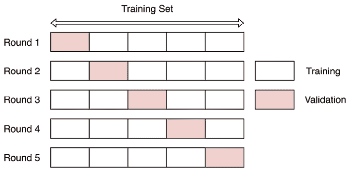

图 7.1：k 折交叉验证的示意图

正如你可能已经意识到的那样，*k*-折交叉验证并不适用于评估时间序列模型，因为它没有保留时间的顺序。例如，在第一轮中，我们使用最后 4 个折叠的数据进行模型训练，并使用第一个折叠进行评估。

由于*k*-折交叉验证对于标准回归和分类任务非常有用，我们将在*第十三章*《应用机器学习：信用违约识别》中对其进行更深入的讨论。

Bergmeir *et al.*（2018）表明，在纯自回归模型的情况下，如果所考虑的模型具有无相关的误差，使用标准*k*-折交叉验证是可行的。

幸运的是，我们可以相当容易地将*k*-折交叉验证的概念适应到时间序列领域。由此产生的方法称为**前向滚动验证**。在这种验证方案中，我们通过一次增加（或多个）折叠来扩展/滑动训练窗口。

*图 7.2* 说明了前向滚动验证的扩展窗口变种，这也被称为锚定前向滚动验证。如你所见，我们在逐步增加训练集的大小，同时保持下一个折叠作为验证集。

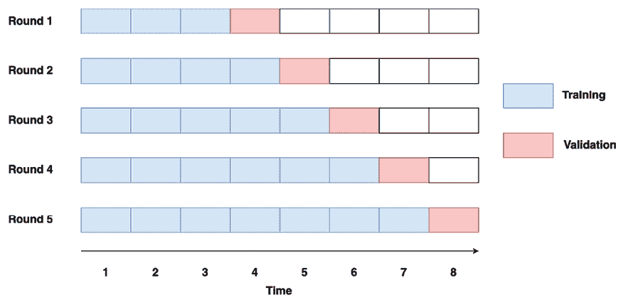

图 7.2：带扩展窗口的前向滚动验证

这种方法带有一定的偏差——在较早的轮次中，我们使用的历史数据比后期的训练数据要少得多，这使得来自不同轮次的误差不能直接比较。例如，在验证的前几轮中，模型可能没有足够的训练数据来正确学习季节性模式。

解决这个问题的一种尝试可能是使用滑动窗口方法，而不是扩展窗口方法。结果是，所有模型都使用相同数量的数据进行训练，因此误差是直接可比的。*图 7.3* 说明了这一过程。

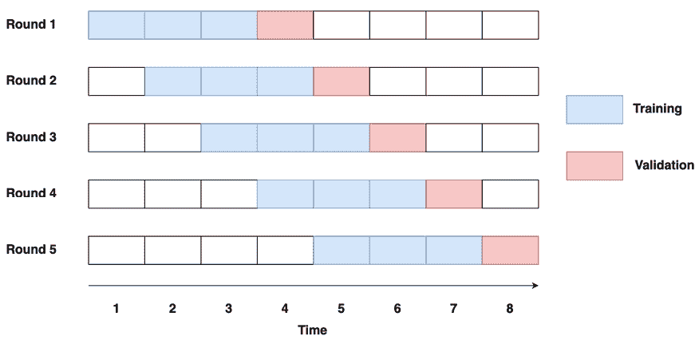

图 7.3：带滑动窗口的前向滚动验证

当我们有大量训练数据时（并且每个滑动窗口提供足够的数据供模型学习模式）或当我们不需要回顾太远的过去来学习用于预测未来的相关模式时，我们可以使用这种方法。

我们可以使用**嵌套交叉验证**方法，同时调整模型的超参数，以获得更准确的误差估计。在嵌套交叉验证中，有一个外部循环用于估计模型的性能，而内部循环则用于超参数调整。我们在*另请参阅*部分提供了一些有用的参考资料。

在这个实例中，我们展示了如何使用前向滚动验证（使用扩展窗口和滑动窗口）来评估美国失业率的预测。

## 如何执行…

执行以下步骤来使用前向滚动验证计算模型的性能：

1.  导入库并进行身份验证：

    ```py
    import pandas as pd
    import numpy as np
    from sklearn.model_selection import TimeSeriesSplit, cross_validate
    from sklearn.linear_model import LinearRegression
    from sklearn.metrics import mean_absolute_percentage_error
    import nasdaqdatalink
    nasdaqdatalink.ApiConfig.api_key = "YOUR_KEY_HERE" 
    ```

1.  下载 2010 年至 2019 年期间的美国月度失业率：

    ```py
    df = (
        nasdaqdatalink.get(dataset="FRED/UNRATENSA",
                           start_date="2010-01-01",
                           end_date="2019-12-31")
        .rename(columns={"Value": "unemp_rate"})
    )
    df.plot(title="Unemployment rate (US) - monthly") 
    ```

    执行代码段会生成以下图表：

    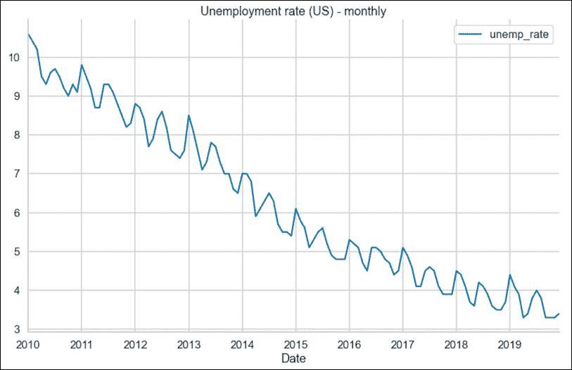

    图 7.4：美国月度失业率

1.  创建简单特征：

    ```py
    df["linear_trend"] = range(len(df))
    df["month"] = df.index.month 
    ```

    由于我们避免使用自回归特征，并且我们知道所有特征的未来值，因此我们能够进行任意长时间范围的预测。

1.  对月份特征使用独热编码：

    ```py
    month_dummies = pd.get_dummies(
        df["month"], drop_first=True, prefix="month"
    )
    df = df.join(month_dummies) \
           .drop(columns=["month"]) 
    ```

1.  将目标与特征分开：

    ```py
    X = df.copy()
    y = X.pop("unemp_rate") 
    ```

1.  定义扩展窗口的前向交叉验证并打印折叠的索引：

    ```py
    expanding_cv = TimeSeriesSplit(n_splits=5, test_size=12)

    for fold, (train_ind, valid_ind) in enumerate(expanding_cv.split(X)):
        print(f"Fold {fold} ----")
        print(f"Train indices: {train_ind}")
        print(f"Valid indices: {valid_ind}") 
    ```

    执行代码段会生成以下日志：

    ```py
    Fold 0 ----
    Train indices: [ 0  1  2  3  4  5  6  7  8  9 10 11 
                    12 13 14 15 16 17 18 19 20 21 22 23 
                    24 25 26 27 28 29 30 31 32 33 34 35 
                    36 37 38 39 40 41 42 43 44 45 46 47 
                    48 49 50 51 52 53 54 55 56 57 58 59]
    Valid indices: [60 61 62 63 64 65 66 67 68 69 70 71]
    Fold 1 ----
    Train indices: [ 0  1  2  3  4  5  6  7  8  9 10 11 
                    12 13 14 15 16 17 18 19 20 21 22 23
                    24 25 26 27 28 29 30 31 32 33 34 35 
                    36 37 38 39 40 41 42 43 44 45 46 47
                    48 49 50 51 52 53 54 55 56 57 58 59 
                    60 61 62 63 64 65 66 67 68 69 70 71]
    Valid indices: [72 73 74 75 76 77 78 79 80 81 82 83]
    Fold 2 ----
    Train indices: [ 0  1  2  3  4  5  6  7  8  9 10 11 
                    12 13 14 15 16 17 18 19 20 21 22 23
                    24 25 26 27 28 29 30 31 32 33 34 35 
                    36 37 38 39 40 41 42 43 44 45 46 47
                    48 49 50 51 52 53 54 55 56 57 58 59 
                    60 61 62 63 64 65 66 67 68 69 70 71
                    72 73 74 75 76 77 78 79 80 81 82 83]
    Valid indices: [84 85 86 87 88 89 90 91 92 93 94 95]
    Fold 3 ----
    Train indices: [ 0  1  2  3  4  5  6  7  8  9 10 11 
                    12 13 14 15 16 17 18 19 20 21 22 23
                    24 25 26 27 28 29 30 31 32 33 34 35 
                    36 37 38 39 40 41 42 43 44 45 46 47
                    48 49 50 51 52 53 54 55 56 57 58 59 
                    60 61 62 63 64 65 66 67 68 69 70 71
                    72 73 74 75 76 77 78 79 80 81 82 83 
                    84 85 86 87 88 89 90 91 92 93 94 95]
    Valid indices: [96 97 98 99 100 101 102 103 104 105 106 107]
    Fold 4 ----
    Train indices: [ 0  1  2  3  4  5  6  7  8  9 10 11  
                    12 13 14 15 16 17 18 19 20 21 22 23
                    24 25 26 27 28 29 30 31 32 33 34 35
                    36 37 38 39 40 41 42 43 44 45 46 47  
                    48 49 50 51 52 53 54 55 56 57 58 59  
                    60 61 62 63 64 65 66 67 68 69 70 71
                    72 73 74 75 76 77 78 79 80 81 82 83  
                    84 85 86 87 88 89 90 91 92 93 94 95  
                    96 97 98 99 100 101 102 103 104 105 106 107]
    Valid indices: [108 109 110 111 112 113 114 115 116 117 118 119] 
    ```

    通过分析日志并记住我们正在使用按月的数据，我们可以看到在第一次迭代中，模型将使用五年的数据进行训练，并使用第六年进行评估。在第二轮中，模型将使用前六年的数据进行训练，并使用第七年进行评估，依此类推。

1.  使用扩展窗口验证评估模型的性能：

    ```py
    scores = []
    for train_ind, valid_ind in expanding_cv.split(X):
        lr = LinearRegression()
        lr.fit(X.iloc[train_ind], y.iloc[train_ind])
        y_pred = lr.predict(X.iloc[valid_ind])
        scores.append(
            mean_absolute_percentage_error(y.iloc[valid_ind], y_pred)
        )
    print(f"Scores: {scores}")
    print(f"Avg. score: {np.mean(scores)}") 
    ```

    执行代码段会生成以下输出：

    ```py
    Scores: [0.03705079312389441, 0.07828415627306308, 0.11981060282173006, 0.16829494012910876, 0.25460459651634165]
    Avg. score: 0.1316090177728276 
    ```

    通过交叉验证轮次的平均性能（通过 MAPE 衡量）为 13.2%。

    我们可以轻松地使用`scikit-learn`中的`cross_validate`函数，而不是手动迭代分割：

    ```py
    cv_scores = cross_validate(
        LinearRegression(),
        X, y,
        cv=expanding_cv,
        scoring=["neg_mean_absolute_percentage_error",
                 "neg_root_mean_squared_error"]
    )
    pd.DataFrame(cv_scores) 
    ```

    执行代码段会生成以下输出：

    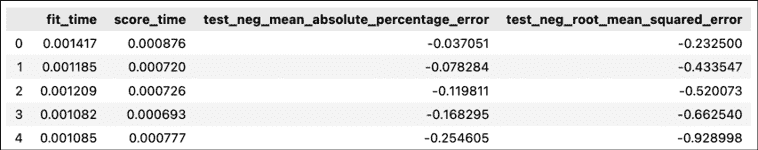

    图 7.5：使用扩展窗口的前向交叉验证中每一轮验证的得分

    通过查看得分，我们发现它们与我们手动迭代交叉验证分割时获得的得分完全相同（除了负号）。

1.  定义滑动窗口验证并打印折叠的索引：

    ```py
    sliding_cv = TimeSeriesSplit(
        n_splits=5, test_size=12, max_train_size=60
    )

    for fold, (train_ind, valid_ind) in enumerate(sliding_cv.split(X)):
        print(f"Fold {fold} ----")
        print(f"Train indices: {train_ind}")
        print(f"Valid indices: {valid_ind}") 
    ```

    执行代码段会生成以下输出：

    ```py
    Fold 0 ----
    Train indices: [ 0  1  2  3  4  5  6  7  8  9 10 11 
                    12 13 14 15 16 17 18 19 20 21 22 23
                    24 25 26 27 28 29 30 31 32 33 34 35 
                    36 37 38 39 40 41 42 43 44 45 46 47
                    48 49 50 51 52 53 54 55 56 57 58 59]
    Valid indices: [60 61 62 63 64 65 66 67 68 69 70 71]
    Fold 1 ----
    Train indices: [12 13 14 15 16 17 18 19 20 21 22 23 
                    24 25 26 27 28 29 30 31 32 33 34 35
                    36 37 38 39 40 41 42 43 44 45 46 47 
                    48 49 50 51 52 53 54 55 56 57 58 59
                    60 61 62 63 64 65 66 67 68 69 70 71]
    Valid indices: [72 73 74 75 76 77 78 79 80 81 82 83]
    Fold 2 ----
    Train indices: [24 25 26 27 28 29 30 31 32 33 34 35 
                    36 37 38 39 40 41 42 43 44 45 46 47
                    48 49 50 51 52 53 54 55 56 57 58 59 
                    60 61 62 63 64 65 66 67 68 69 70 71
                    72 73 74 75 76 77 78 79 80 81 82 83]
    Valid indices: [84 85 86 87 88 89 90 91 92 93 94 95]
    Fold 3 ----
    Train indices: [36 37 38 39 40 41 42 43 44 45 46 47 
                    48 49 50 51 52 53 54 55 56 57 58 59
                    60 61 62 63 64 65 66 67 68 69 70 71 
                    72 73 74 75 76 77 78 79 80 81 82 83
                    84 85 86 87 88 89 90 91 92 93 94 95]
    Valid indices: [96 97 98 99 100 101 102 103 104 105 106 107]
    Fold 4 ----
    Train indices: [48 49 50 51 52 53 54 55 56 57 58 59 
                    60 61 62 63 64 65 66 67 68 69 70 71 
                    72 73 74 75 76 77 78 79 80 81 82 83
                    84 85 86 87 88 89 90 91 92 93 94 95 
                    96 97 98 99 100 101 102 103 104 105 106 107]
    Valid indices: [108 109 110 111 112 113 114 115 116 117 118 119] 
    ```

    通过分析日志，我们可以看到以下内容：

    +   每次，模型将使用恰好五年的数据进行训练。

    +   在交叉验证轮次之间，我们按 12 个月移动。

    +   验证折叠与我们在使用扩展窗口验证时看到的折叠相对应。因此，我们可以轻松比较得分，以查看哪种方法更好。

1.  使用滑动窗口验证评估模型的性能：

    ```py
    cv_scores = cross_validate(
        LinearRegression(),
        X, y,
        cv=sliding_cv,
        scoring=["neg_mean_absolute_percentage_error",
                 "neg_root_mean_squared_error"]
    )
    pd.DataFrame(cv_scores) 
    ```

    执行代码段会生成以下输出：

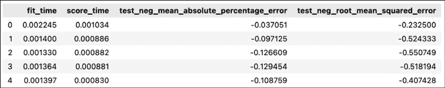

图 7.6：使用滑动窗口的前向交叉验证中每一轮验证的得分

通过聚合 MAPE，我们得到了 9.98%的平均得分。看来在每次迭代中使用 5 年的数据比使用扩展窗口更能获得更好的平均得分。一个可能的结论是，在这种特定情况下，更多的数据并不会导致更好的模型。相反，当只使用最新的数据点时，我们可以获得更好的模型。

## 它是如何工作的……

首先，我们导入了所需的库并进行了 Nasdaq Data Link 的身份验证。在第二步中，我们下载了美国的月度失业率。这是我们在上一章中使用的相同时间序列。

在*步骤 3*中，我们创建了两个简单的特征：

+   线性趋势，简单来说，就是有序时间序列的序数行号。根据对*图 7.4*的检查，我们看到失业率的整体趋势是下降的。我们希望这个特征能够捕捉到这种模式。

+   月份索引，用于标识给定的观测值来自哪个日历月份。

在*步骤 4*中，我们使用`get_dummies`函数对月份特征进行了独热编码。我们在*第十三章*，*应用机器学习：识别信用违约*和*第十四章*，*机器学习项目的高级概念*中详细讲解了独热编码。简而言之，我们创建了新的列，每一列都是一个布尔标志，表示给定的观测值是否来自某个月份。此外，我们删除了第一列，以避免完美的多重共线性（即著名的虚拟变量陷阱）。

在*步骤 5*中，我们使用`pandas` DataFrame 的`pop`方法将特征与目标分开。

在*步骤 6*中，我们使用`scikit-learn`中的`TimeSeriesSplit`类定义了前向验证。我们指定了要进行 5 次分割，并且测试集的大小应为 12 个月。理想情况下，验证方案应当反映模型的实际使用情况。在这种情况下，我们可以说机器学习模型将用于预测未来 12 个月的月度失业率。

然后，我们使用`for`循环打印每一轮交叉验证中使用的训练和验证索引。`TimeSeriesSplit`类的`split`方法返回的索引是序数的，但我们可以轻松将其映射到实际的时间序列索引上。

我们决定不使用自回归特征，因为没有这些特征，我们可以预测未来任意长的时间。自然地，使用 AR 特征我们也可以做到这一点，但我们需要适当地处理它们。这种规范对于这个用例来说更为简便。

在*步骤 7*中，我们使用了一个非常相似的`for`循环，这次是评估模型的性能。在每次循环中，我们使用该轮的训练数据训练线性回归模型，为对应的验证集创建预测，最后计算性能指标，以 MAPE 表示。我们将交叉验证得分添加到一个列表中，然后计算所有 5 轮交叉验证的平均性能。

我们可以使用`scikit-learn`库中的`cross_validate`函数，而不是使用自定义的`for`循环。使用它的一个潜在优点是，它会自动计算模型拟合和预测步骤所花费的时间。我们展示了如何使用这种方法获得 MAPE 和 MSE 得分。

使用`cross_validate`函数（或其他`scikit-learn`功能，如网格搜索）时需要注意的一点是，我们必须提供度量标准的名称，例如`"neg_mean_absolute_percentage_error"`。这是`scikit-learn`的`metrics`模块中使用的约定，即得分值较高比较低的得分值更好。因此，由于我们希望最小化这些度量标准，它们被取反。

以下是用于评估时间序列预测准确性的最常见度量标准列表：

+   **均方误差**（**MSE**）——机器学习中最常见的度量标准之一。由于单位不是很直观（与原始预测的单位不同），我们可以使用 MSE 来比较各种模型在同一数据集上的相对表现。

+   **均方根误差**（**RMSE**）——通过取 MSE 的平方根，这个度量现在与原始时间序列处于相同的尺度。

+   **平均绝对误差**（**MAE**）——我们不是取平方，而是取误差的绝对值。因此，MAE 与原始时间序列具有相同的尺度。而且，MAE 对异常值的容忍度更高，因为在计算平均值时，每个观测值被赋予相同的权重。而对于平方度量，异常值的惩罚更加显著。

+   **平均绝对百分比误差**（**MAPE**）——与 MAE 非常相似，但以百分比表示。因此，对于许多业务相关人员来说，这更容易理解。然而，它有一个严重的缺点——当实际值为零时，度量标准会假设将误差除以实际值，而这是数学上不可行的。

自然，这些只是选定度量标准中的一部分。强烈建议深入研究这些度量标准，以全面理解它们的优缺点。例如，RMSE 通常作为优化度量标准被偏好，因为平方比绝对值更容易处理，特别是在数学优化需要求导时。

在*步骤 8*和*9*中，我们展示了如何使用滑动窗口方法创建验证方案。唯一的不同是，我们在实例化`TimeSeriesSplit`类时指定了`max_train_size`参数。

有时候我们可能会对在交叉验证中创建训练集和验证集之间的间隔感兴趣。例如，在第一次迭代中，训练应使用前五个值进行，然后评估应在第七个值上进行。我们可以通过使用`TimeSeriesSplit`类的`gap`参数轻松地实现这种场景。

## 还有更多…

在本教程中，我们描述了验证时间序列模型的标准方法。然而，实际上有许多更高级的验证方法。实际上，其中大多数来自金融领域，因为基于金融时间序列验证模型在多个方面更为复杂。我们在下面简要提到了一些更高级的方法，以及它们试图解决的挑战。

`TimeSeriesSplit`的一个局限性是它只能在记录级别工作，无法处理分组。假设我们有一个日度股票回报的数据集。根据我们的交易算法的规定，我们是在每周或每月的级别上评估模型的性能，并且观察值不应该在每周/每月的分组之间重叠。*图 7.7*通过使用训练组大小为 3，验证组大小为 1 来说明这一概念。

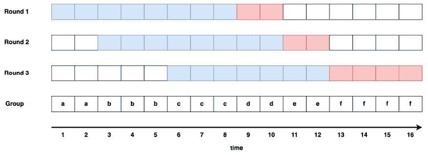

图 7.7：分组时间序列验证的架构

为了考虑这种观察值的分组（按周或按月），我们需要使用**分组时间序列验证**，这是`scikit-learn`的`TimeSeriesSplit`和`GroupKFold`的结合体。互联网上有许多实现这种概念的例子，其中之一可以在`mlxtend`库中找到。

为了更好地说明预测金融时间序列和评估模型性能时可能出现的问题，我们必须扩展与时间序列相关的思维模型。这样的时间序列实际上对每个观察值都有两个时间戳：

+   一个预测或交易时间戳——当机器学习模型做出预测时，我们可能会开盘交易。

+   一个评估或事件时间戳——当预测/交易的响应变得可用时，我们实际上可以计算预测误差。

例如，我们可以有一个分类模型，用来预测某只股票在接下来的 5 个工作日内价格是上涨还是下跌，变化幅度为*X*。基于这个预测，我们做出交易决策。我们可能会选择做多。在接下来的 5 天内，可能会发生很多事情。价格可能会或可能不会变动*X*，止损或止盈机制可能会被触发，我们也可能会直接平仓，或者有其他各种可能的结果。因此，我们实际上只能在评估时间戳进行预测评估，在这个例子中，是 5 个工作日后。

这样的框架存在将测试集信息泄露到训练集中的风险。因此，这很可能会夸大模型的性能。因此，我们需要确保所有数据都是基于时间点的，意味着在模型使用数据时，数据在那个时间点是可用的。

例如，在训练/验证分割点附近，可能会有一些训练样本，其评估时间晚于验证样本的预测时间。这些重叠的样本很可能是相关的，换句话说，不太可能是独立的，这会导致集合之间的信息泄露。

为了解决前瞻偏差，我们可以应用**清洗**。其思路是从训练集中删除任何评估时间晚于验证集最早预测时间的样本。换句话说，我们去除那些事件时间与验证集预测时间重叠的观测值。*图 7.8*展示了一个示例。

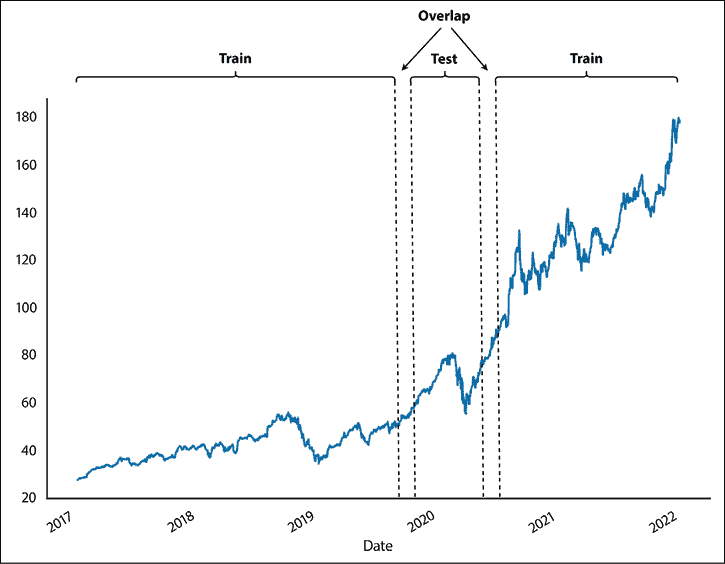

图 7.8：清洗的示例

你可以在*金融机器学习的进展*（De Prado，2018）或`timeseriescv`库中找到运行带清洗的步进交叉验证的代码。

单独进行清洗可能不足以消除所有泄漏，因为样本之间可能存在较长时间跨度的相关性。我们可以尝试通过应用**禁运**来解决这一问题，禁运进一步排除那些跟随验证样本的训练样本。如果一个训练样本的预测时间落在禁运期内，我们会直接从训练集中删除该观测值。我们根据手头的问题估计禁运期所需的大小。*图 7.9*展示了同时应用清洗和禁运的例子。

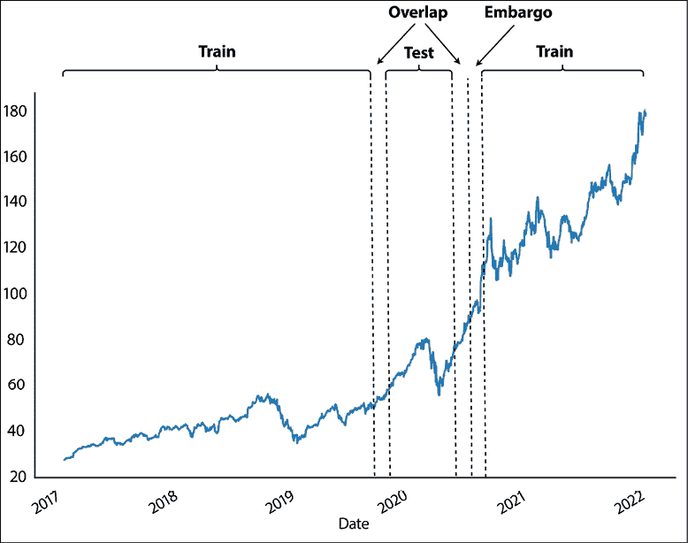

图 7.9：清洗和禁运的示例

有关清洗和禁运的更多细节（以及它们在 Python 中的实现），请参考*金融机器学习的进展*（De Prado，2018）。

De Prado（2018）还介绍了**组合清洗交叉验证算法**，该算法将清洗和禁运的概念与回测结合（我们在*第十二章*，*回测交易策略*中讲解回测交易策略）以及交叉验证。

## 另见

+   Bergmeir, C., & Benítez, J. M. 2012. “关于使用交叉验证进行时间序列预测器评估，”*信息科学*，191: 192-213。

+   Bergmeir, C., Hyndman, R. J., & Koo, B. 2018. “关于交叉验证在评估自回归时间序列预测中的有效性的一些说明，”*计算统计与数据分析*，120: 70-83。

+   De Prado, M. L. 2018. *金融机器学习的进展*。John Wiley & Sons。

+   Hewamalage, H., Ackermann, K., & Bergmeir, C. 2022. 数据科学家的预测评估：常见陷阱与最佳实践。*arXiv 预印本 arXiv:2203.10716*。

+   Tashman, L. J. 2000. “样本外预测准确性测试：分析与回顾，”*国际预测学杂志*，16(4): 437-450。

+   Varma, S., & Simon, R. 2006. “使用交叉验证进行模型选择时的误差估计偏差，”*BMC 生物信息学*，7(1): 1-8。

# 时间序列的特征工程

在上一章中，我们仅使用时间序列作为输入训练了一些统计模型。另一方面，当我们从机器学习（ML）角度进行时间序列预测时，**特征工程**变得至关重要。在时间序列的背景下，特征工程意味着创建有用的变量（无论是从时间序列本身还是使用其时间戳生成），以帮助获得准确的预测。自然，特征工程不仅对纯机器学习模型很重要，我们还可以利用它为统计模型丰富外部回归变量，例如，在 ARIMAX 模型中。

正如我们提到的，创建特征的方法有很多种，关键在于对数据集的深刻理解。特征工程的示例包括：

+   从时间戳中提取相关信息。例如，我们可以提取年份、季度、月份、周数或星期几。

+   基于时间戳添加有关特殊日期的相关信息。例如，在零售行业中，我们可能希望添加有关所有假期的信息。要获取特定国家的假期日历，我们可以使用`holidays`库。

+   添加目标变量的滞后值，类似于 AR 模型。

+   基于聚合值（如最小值、最大值、均值、中位数或标准差）在滚动或扩展窗口内创建特征。

+   计算技术指标。

在某种程度上，特征生成仅受数据、你的创造力或可用时间的限制。在本教程中，我们展示了如何基于时间序列的时间戳创建一组特征。

首先，我们提取月份信息，并将其编码为虚拟变量（独热编码）。在时间序列的上下文中，这种方法的最大问题是缺乏时间的周期性连续性。通过一个例子可以更容易理解这一点。

想象一个使用能源消耗数据的场景。如果我们使用观察到的消耗月份信息，直观上讲，相邻两个月之间应该存在某种联系，例如，12 月与 1 月之间，或 1 月与 2 月之间的联系。相比之下，时间相隔较远的月份之间的联系可能较弱，例如，1 月与 7 月之间的联系。相同的逻辑也适用于其他与时间相关的信息，例如，某一天内的小时。

我们提出了两种将这些信息作为特征纳入的可能方式。第一种方式基于三角函数（正弦和余弦变换）。第二种方式使用径向基函数来编码类似的信息。

在本教程中，我们使用了 2017 年至 2019 年的模拟每日数据。我们选择模拟数据，因为本教程的主要目的是展示不同类型的时间信息编码如何影响模型。使用遵循清晰模式的模拟数据更容易展示这一点。自然，本教程中展示的特征工程方法可以应用于任何时间序列。

## 如何实现…

执行以下步骤以创建与时间相关的特征，并使用它们作为输入拟合线性模型：

1.  导入库：

    ```py
    import numpy as np
    import pandas as pd
    from datetime import date
    from sklearn.linear_model import LinearRegression
    from sklearn.preprocessing import FunctionTransformer
    from sklego.preprocessing import RepeatingBasisFunction 
    ```

1.  生成具有重复模式的时间序列：

    ```py
    np.random.seed(42)
    range_of_dates = pd.date_range(start="2017-01-01",
                                   end="2019-12-31")
    X = pd.DataFrame(index=range_of_dates)
    X["day_nr"] = range(len(X))
    X["day_of_year"] = X.index.day_of_year
    signal_1 = 2 + 3 * np.sin(X["day_nr"] / 365 * 2 * np.pi)
    signal_2 = 2 * np.sin(X["day_nr"] / 365 * 4 * np.pi + 365/2)
    noise = np.random.normal(0, 0.81, len(X))
    y = signal_1 + signal_2 + noise
    y.name = "y"
    y.plot(title="Generated time series") 
    ```

    执行代码片段会生成以下图表：

    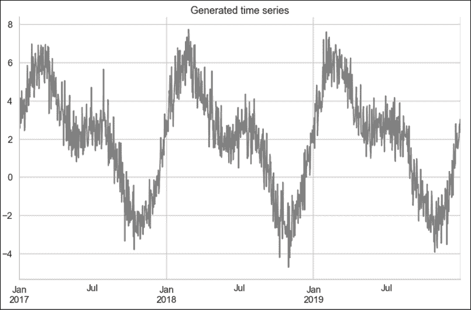

    图 7.10：生成的具有重复模式的时间序列

    由于添加了正弦曲线和一些随机噪声，我们获得了一个具有重复模式的时间序列，且该模式在多年间反复出现。

1.  将时间序列存储在一个新的 DataFrame 中：

    ```py
    results_df = y.to_frame()
    results_df.columns = ["y_true"] 
    ```

1.  将月份信息编码为虚拟特征：

    ```py
    X_1 = pd.get_dummies(
        X.index.month, drop_first=True, prefix="month"
    )
    X_1.index = X.index
    X_1 
    ```

    执行代码片段会生成以下预览，显示带有虚拟编码的月份特征的 DataFrame：

    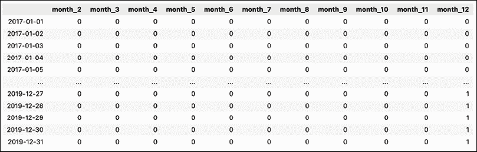

    图 7.11：虚拟编码的月份特征预览

1.  拟合线性回归模型并绘制样本内预测：

    ```py
    model_1 = LinearRegression().fit(X_1, y)
    results_df["y_pred_1"] = model_1.predict(X_1)
    (
        results_df[["y_true", "y_pred_1"]]
        .plot(title="Fit using month dummies")
    ) 
    ```

    执行代码片段会生成以下图表：

    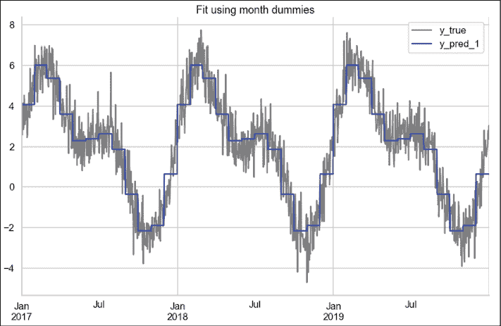

    图 7.12：使用月份虚拟特征进行线性回归得到的拟合

    我们可以清晰地看到拟合的阶梯状模式，对应于月份特征的 12 个唯一值。拟合的锯齿状是由虚拟特征的不连续性引起的。在其他方法中，我们尝试克服这个问题。

1.  定义用于创建周期性编码的函数：

    ```py
    def sin_transformer(period):
        return FunctionTransformer(lambda x: np.sin(x / period * 2 * np.pi))
    def cos_transformer(period):
        return FunctionTransformer(lambda x: np.cos(x / period * 2 * np.pi)) 
    ```

1.  使用周期性编码对月份和日期信息进行编码：

    ```py
    X_2 = X.copy()
    X_2["month"] = X_2.index.month
    X_2["month_sin"] = sin_transformer(12).fit_transform(X_2)["month"]
    X_2["month_cos"] = cos_transformer(12).fit_transform(X_2)["month"]
    X_2["day_sin"] = (
        sin_transformer(365).fit_transform(X_2)["day_of_year"]
    )
    X_2["day_cos"] = (
        cos_transformer(365).fit_transform(X_2)["day_of_year"]
    )
    fig, ax = plt.subplots(2, 1, sharex=True, figsize=(16,8))
    X_2[["month_sin", "month_cos"]].plot(ax=ax[0])
    ax[0].legend(loc="center left", bbox_to_anchor=(1, 0.5))
    X_2[["day_sin", "day_cos"]].plot(ax=ax[1])
    ax[1].legend(loc="center left", bbox_to_anchor=(1, 0.5))
    plt.suptitle("Cyclical encoding with sine/cosine transformation") 
    ```

    执行代码片段会生成以下图表：

    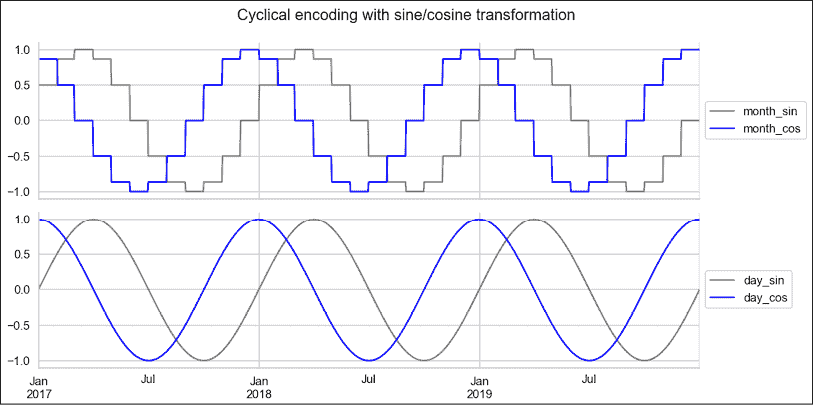

    图 7.13：使用正弦/余弦变换的周期性编码

    从*图 7.13*中，我们可以得出两个结论：

    +   使用月份进行编码时，曲线呈阶梯状。使用每日频率时，曲线则平滑得多。

    +   图表说明了使用两条曲线而不是一条曲线的必要性。由于这些曲线具有重复（周期性）模式，如果我们通过图表为某一年绘制一条水平直线，线会与曲线相交两次。因此，单一的曲线不足以让模型理解观察点的时间，因为存在两种可能性。幸运的是，使用两条曲线时没有这个问题。

    为了清楚地看到通过此转换获得的周期性表示，我们可以将正弦和余弦值绘制在一个散点图上，以表示某一年：

    ```py
    (
        X_2[X_2.index.year == 2017]
        .plot(
            kind="scatter",
            x="month_sin",
            y="month_cos",
            figsize=(8, 8),
            title="Cyclical encoding using sine/cosine transformations"
      )
    ) 
    ```

    执行代码片段会生成以下图表：

    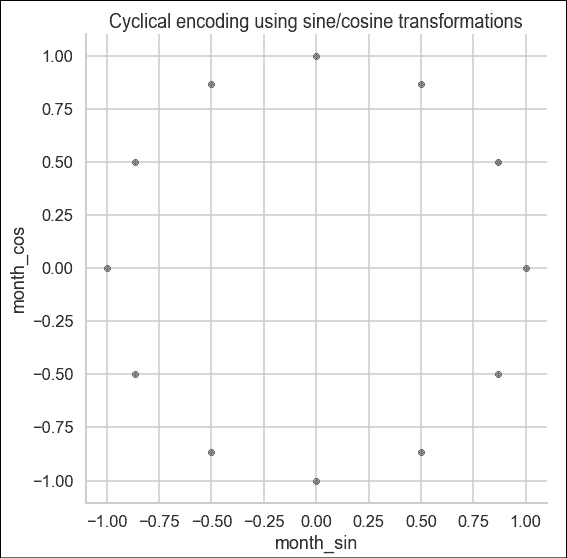

    图 7.14：时间的周期性表示

    在*图 7.14*中，我们可以看到没有重叠的值。因此，两个曲线可以用来确定给定观察点的时间。

1.  使用每日正弦/余弦特征拟合模型：

    ```py
    X_2 = X_2[["day_sin", "day_cos"]]
    model_2 = LinearRegression().fit(X_2, y)
    results_df["y_pred_2"] = model_2.predict(X_2)
    (
        results_df[["y_true", "y_pred_2"]]
        .plot(title="Fit using sine/cosine features")
    ) 
    ```

    执行代码片段会生成以下图表：

    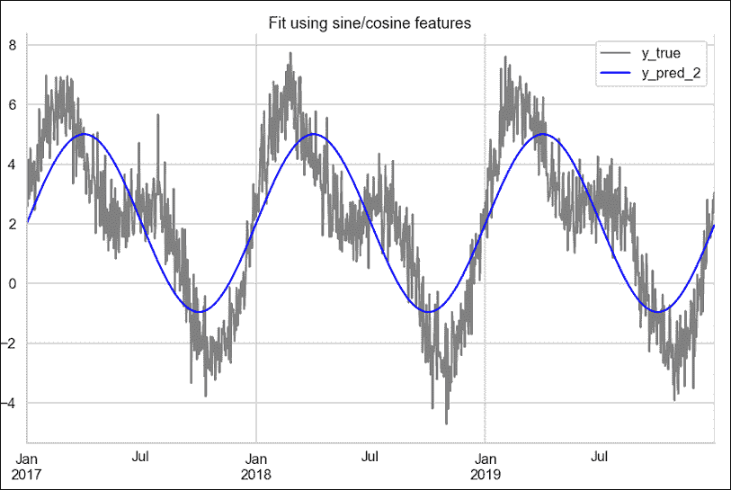

    图 7.15：使用周期性特征进行线性回归得到的拟合

1.  使用径向基函数创建特征：

    ```py
    rbf = RepeatingBasisFunction(n_periods=12,
                                 column="day_of_year",
                                 input_range=(1,365),
                                 remainder="drop")
    rbf.fit(X)
    X_3 = pd.DataFrame(index=X.index,
                       data=rbf.transform(X))
    X_3.plot(subplots=True, sharex=True,
             title="Radial Basis Functions",
             legend=False, figsize=(14, 10)) 
    ```

    执行代码片段会生成以下图表：

    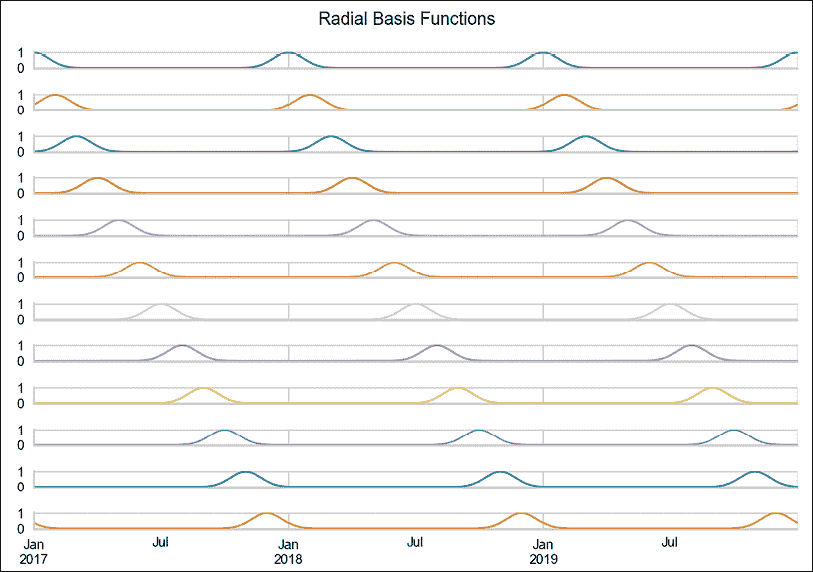

    图 7.16：使用径向基函数创建的特征的可视化

    *图 7.16* 展示了我们使用径向基函数和天数作为输入创建的 12 条曲线。每条曲线告诉我们与一年中特定日期的接近程度。例如，第一条曲线测量了与 1 月 1 日的距离。因此，我们可以观察到每年第一天的峰值，然后随着日期的远离，值对称下降。

    基函数在输入范围上等间隔分布。我们选择创建 12 条曲线，因为我们希望径向基曲线类似于月份。这样，每个函数展示了与该月第一天的近似距离。由于月份的天数不等，所得到的距离是近似值。

1.  使用 RBF 特征拟合模型：

    ```py
    model_3 = LinearRegression().fit(X_3, y)
    results_df["y_pred_3"] = model_3.predict(X_3)
    (
        results_df[["y_true", "y_pred_3"]]
        .plot(title="Fit using RBF features")
    ) 
    ```

    执行代码段会生成以下图表：

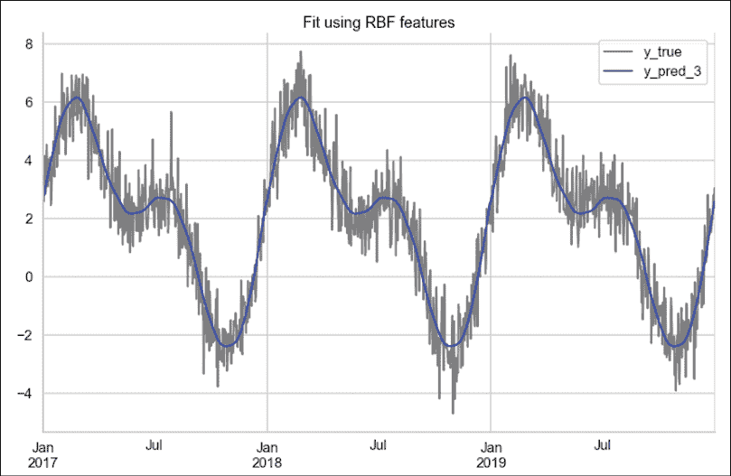

图 7.17：使用线性回归拟合的 RBF 编码特征的拟合结果

我们可以清楚地看到，使用 RBF 特征获得了迄今为止最好的拟合效果。

## 它是如何工作的……

在导入库之后，我们通过将两条信号线（使用正弦曲线创建）和一些随机噪声结合起来生成了人工时间序列。我们创建的时间序列跨越了三年的时间（2017 到 2019）。然后，我们创建了两列以供后续使用：

+   `day_nr`—表示时间流逝的数字索引，等同于顺序行号。

+   `day_of_year`—年份中的天数。

在 *步骤 3* 中，我们将生成的时间序列存储在一个单独的 DataFrame 中。这样做是为了将模型的预测值存储在该 DataFrame 中。

在 *步骤 4* 中，我们使用 `pd.get_dummies` 方法创建了月份虚拟变量。有关这种方法的更多细节，请参考之前的食谱。

在 *步骤 5* 中，我们对特征拟合了线性回归模型，并使用拟合模型的 `predict` 方法获取拟合值。为了进行预测，我们使用与训练相同的数据集，因为我们只关心样本内的拟合结果。

在 *步骤 6* 中，我们定义了用于通过正弦和余弦函数获取循环编码的函数。我们创建了两个单独的函数，但这只是个人偏好问题，也可以创建一个函数来同时生成这两个特征。函数的 `period` 参数对应可用的周期数。例如，在编码月份时，我们使用 12；在编码日期时，我们使用 365 或 366。

在 *步骤 7* 中，我们使用循环编码对月份和日期信息进行了编码。我们已经有了包含天数的 `day_of_year` 列，所以只需要从 `DatetimeIndex` 中提取月份编号。然后，我们创建了四个带有循环编码的列。

在 *步骤 8* 中，我们删除了所有列，保留了年份天数的循环编码列。然后，我们拟合了线性回归模型，计算了拟合值并绘制了结果。

循环编码有一个潜在的重要缺点，这在使用基于树的模型时尤为明显。根据设计，基于树的模型在每次划分时基于单一特征进行分裂。正如我们之前所解释的，正弦/余弦特征应该同时考虑，以便正确识别时间点。

在*第 9 步*中，我们实例化了 `RepeatingBasisFunction` 类，它作为一个 `scikit-learn` 转换器工作。我们指定了要基于 `day_of_year` 列生成 12 条 RBF 曲线，并且输入范围是从 1 到 365（样本中没有闰年）。此外，我们指定了 `remainder="drop"`，这将删除所有在转换前输入 DataFrame 中的其他列。或者，我们也可以将值指定为 `"passthrough"`，这样既保留旧的特征，又保留新的特征。

值得一提的是，使用径向基函数时，我们可以调整两个关键的超参数：

+   `n_periods—`径向基函数的数量。

+   `width`—这个超参数负责创建 RBF 时钟形曲线的形状。

我们可以使用类似网格搜索的方法来识别给定数据集的超参数的最优值。有关网格搜索过程的更多信息，请参阅*第十三章*，*应用机器学习：识别信用违约*。

在*第 10 步*中，我们再次拟合了模型，这次使用了 RBF 特征作为输入。

## 还有更多内容……

在这个案例中，我们展示了如何手动创建与时间相关的特征。当然，这些只是我们可以创建的成千上万种特征中的一小部分。幸运的是，有一些 Python 库可以简化特征工程/提取的过程。

我们将展示其中的两个方法。第一个方法来自 `sktime` 库，这是一个全面的库，相当于 `scikit-learn` 在时间序列中的应用。第二个方法则利用了名为 `tsfresh` 的库。该库允许我们通过几行代码自动生成数百或数千个特征。在后台，它结合了统计学、时间序列分析、物理学和信号处理中的一些已建立算法。

我们将在以下步骤中展示如何使用这两种方法。

1.  导入库：

    ```py
    from sktime.transformations.series.date import DateTimeFeatures
    from tsfresh import extract_features
    from tsfresh.feature_extraction import settings
    from tsfresh.utilities.dataframe_functions import roll_time_series 
    ```

1.  使用 `sktime` 提取日期时间特征：

    ```py
    dt_features = DateTimeFeatures(
        ts_freq="D", feature_scope="comprehensive"
    )
    features_df_1 = dt_features.fit_transform(y)
    features_df_1.head() 
    ```

    执行该代码段生成以下包含提取特征的 DataFrame 预览：

    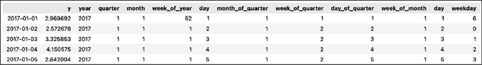

    图 7.18：提取特征的 DataFrame 预览

    在图中，我们可以看到提取的特征。根据我们想要使用的机器学习算法，我们可能需要进一步对这些特征进行编码，例如使用虚拟变量。

    在实例化 `DateTimeFeatures` 类时，我们提供了 `feature_scope` 参数。在此情况下，我们生成了一个全面的特征集。我们也可以选择 `"minimal"` 或 `"efficient"` 特征集。

    提取的特征是基于 `pandas` 的 `DatetimeIndex`。有关从该索引中可以提取的所有特征的详细列表，请参阅 `pandas` 的文档。

1.  使用 `tsfresh` 准备数据集进行特征提取：

    ```py
    df = y.to_frame().reset_index(drop=False)
    df.columns = ["date", "y"]
    df["series_id"] = "a" 
    ```

    为了使用特征提取算法，除了时间序列本身外，我们的 DataFrame 必须包含一个日期列（或时间的顺序编码）和一个 ID 列。后者是必须的，因为 DataFrame 可能包含多个时间序列（以长格式存储）。例如，我们可以有一个包含标准普尔 500 指数所有成分股日常股价的 DataFrame。

1.  创建一个汇总后的 DataFrame 以进行特征提取：

    ```py
    df_rolled = roll_time_series(
        df, column_id="series_id", column_sort="date",
        max_timeshift=30, min_timeshift=7
    ).drop(columns=["series_id"])
    df_rolled 
    ```

    执行该代码片段会生成汇总 DataFrame 的以下预览：

    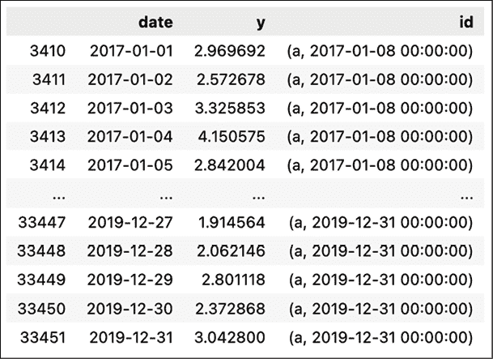

    图 7.19：汇总 DataFrame 的预览

    我们使用滑动窗口来汇总 DataFrame，因为我们希望实现以下目标：

    +   计算对时间序列预测有意义的汇总特征。例如，我们可以计算过去 10 天的最小值/最大值，或者计算 20 天简单移动平均（SMA）技术指标。每次计算时，这些计算都涉及一个时间窗口，因为使用单一观测值来计算这些汇总值显然没有意义。

    +   为所有可用的时间点提取特征，以便我们能够轻松地将它们插入到我们的机器学习预测模型中。通过这种方式，我们基本上一次性创建了整个训练数据集。

    为此，我们使用 `roll_time_series` 函数创建了一个汇总后的 DataFrame，之后该 DataFrame 将用于特征提取。我们指定了最小和最大窗口大小。在我们的情况下，我们将丢弃短于 7 天的窗口，并使用最多 30 天的窗口。

    在*图 7.19*中，我们可以看到新添加的 `id` 列。如我们所见，多个观测值在 `id` 列中具有相同的值。例如，值 `(a, 2017-01-08 00:00:00)` 表示我们正在使用该特定数据点来提取标记为 `a` 的时间序列的特征（我们在上一步中人为创建了这个 ID），时间点包括到 2017-01-08 为止的过去 30 天。准备好汇总 DataFrame 后，我们可以提取特征。

1.  提取最小特征集：

    ```py
    settings_minimal = settings.MinimalFCParameters()
    settings_minimal 
    ```

    执行该代码片段会生成以下输出：

    ```py
    {'sum_values': None,
     'median': None,
     'mean': None,
     'length': None,
     'standard_deviation': None,
     'variance': None,
     'maximum': None,
     'minimum': None} 
    ```

    在字典中，我们可以看到所有将要创建的特征。`None` 值表示该特征没有额外的超参数。我们选择提取最小集的特征，因为其他特征会消耗大量时间。或者，我们可以使用 `settings.EfficientFCParameters` 或 `settings.ComprehensiveFCParameters` 来生成数百或数千个特征。

    使用以下代码片段，我们实际上提取特征：

    ```py
    features_df_2 = extract_features(
        df_rolled, column_id="id",
        column_sort="date",
        default_fc_parameters=settings_minimal
    ) 
    ```

1.  清理索引并检查特征：

    ```py
    features_df_2 = (
        features_df_2
        .set_index(
            features_df_2.index.map(lambda x: x[1]), drop=True
        )
    )
    features_df_2.index.name = "last_date"
    features_df_2.head(25) 
    ```

    执行该代码片段会生成以下输出：

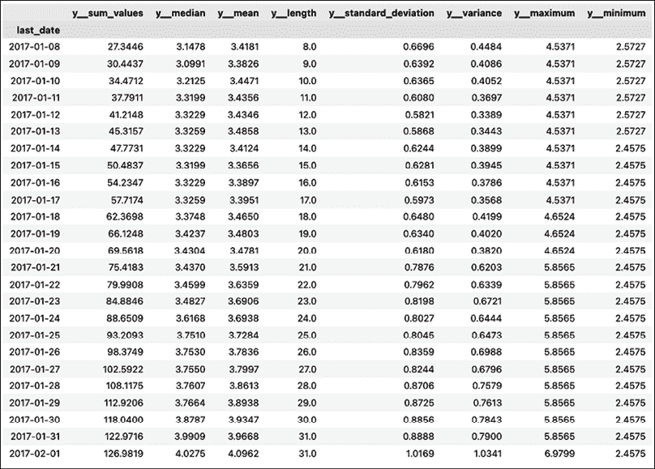

图 7.20：使用 tsfresh 生成的特征预览

在*图 7.20*中，我们可以看到最小窗口长度为 8，而最大窗口长度为 31。这个设计是有意为之，因为我们表示希望使用最小大小 7，这相当于过去 7 天加上当前一天。最大值也是类似的。

`sktime`也为`tsfresh`提供了一个封装。我们可以通过使用`sktime`的`TSFreshFeatureExtractor`类访问特征生成算法。

同时值得一提的是，`tsfresh`还有三个非常有趣的特性：

+   基于假设检验的特征选择算法。由于该库能够生成数百或数千个特征，因此选择与我们使用场景相关的特征至关重要。为此，库使用了*fresh*算法，即*基于可扩展假设检验的特征提取*。

+   通过使用多处理本地机器或使用 Spark 或 Dask 集群（当数据无法适配单台机器时），处理大数据集的特征生成和选择的能力。

+   它提供了转换器类（例如，`FeatureAugmenter`或`FeatureSelector`），我们可以将它们与`scikit-learn`管道一起使用。我们在*第十三章*中讨论了管道，*应用机器学习：识别信用违约*。

    `tsfresh`只是用于时间序列数据自动特征生成的可用库之一。其他库包括`feature_engine`和`tsflex`。

# 时间序列预测作为简化回归

迄今为止，我们大多使用专用的时间序列模型来进行预测任务。另一方面，尝试使用通常用于解决回归任务的其他算法也会很有趣。通过这种方式，我们可能会提高模型的表现。

使用这些模型的原因之一是它们的灵活性。例如，我们可以超越单变量设置，也就是，我们可以通过各种附加特征丰富我们的数据集。我们在之前的食谱中涵盖了一些特征工程的方法。或者，我们可以添加历史上已证明与我们预测目标相关的外部回归变量，如时间序列。

当添加额外的时间序列作为外部回归变量时，我们应当小心它们的可用性。如果我们不知道它们的未来值，我们可以使用它们的滞后值，或者单独预测它们并将其反馈到初始模型中。

由于时间序列数据的时间依赖性（与时间序列的滞后值相关），我们不能直接使用回归模型进行时间序列预测。首先，我们需要将这类时间数据转换为监督学习问题，然后才能应用传统的回归算法。这个过程被称为**简化**，它将某些学习任务（时间序列预测）分解为更简单的任务。然后，这些任务可以重新组合，提供对原始任务的解决方案。换句话说，简化是指使用一个算法或模型来解决一个它最初并未为之设计的学习任务。因此，在**简化回归**中，我们实际上是将预测任务转化为表格回归问题。

在实际操作中，简化方法使用滑动窗口将时间序列拆分成固定长度的窗口。通过一个例子可以更容易理解简化方法是如何工作的。假设有一个从 1 到 100 的连续数字的时间序列。然后，我们使用一个长度为 5 的滑动窗口。第一个窗口包含 1 到 4 的观测值作为特征，第 5 个观测值作为目标。第二个窗口使用 2 到 5 的观测值作为特征，第 6 个观测值作为目标。以此类推。一旦我们将所有这些窗口堆叠在一起，就得到了一种表格格式的数据，允许我们使用传统的回归算法进行时间序列预测。*图 7.21*展示了简化过程。

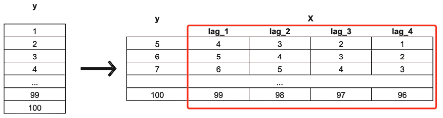

图 7.21：简化过程示意图

还值得一提的是，使用简化回归时存在一些细微差别。例如，简化回归模型失去了时间序列模型的典型特征，即失去了时间的概念。因此，它们无法处理趋势和季节性。这也是为什么通常先去趋势和去季节化数据，再进行简化回归是有用的。直观上，这类似于仅建模 AR 项。首先去季节化和去趋势数据，使得我们可以更容易找到一个更合适的模型，因为我们没有在 AR 项的基础上考虑趋势和季节性。

在这个例子中，我们展示了使用美国失业率数据集进行简化回归的过程示例。

## 准备工作

在这个例子中，我们使用的是已经熟悉的美国失业率时间序列。为了简便起见，我们不重复数据下载的步骤。你可以在附带的笔记本中找到相关代码。对于接下来的内容，假设下载的数据已存储在一个名为`y`的 DataFrame 中。

## 如何操作…

执行以下步骤，以使用简化回归对美国失业率进行 12 步预测：

1.  导入所需的库：

    ```py
    from sktime.utils.plotting import plot_series
    from sktime.forecasting.model_selection import (
        temporal_train_test_split, ExpandingWindowSplitter
    )
    from sktime.forecasting.base import ForecastingHorizon
    from sktime.forecasting.compose import (
        make_reduction, TransformedTargetForecaster, EnsembleForecaster
    )
    from sktime.performance_metrics.forecasting import (
        mean_absolute_percentage_error
    )
    from sktime.transformations.series.detrend import (
        Deseasonalizer, Detrender
    )
    from sktime.forecasting.trend import PolynomialTrendForecaster
    from sktime.forecasting.model_evaluation import evaluate
    from sktime.forecasting.arima import AutoARIMA
    from sklearn.ensemble import RandomForestRegressor 
    ```

1.  将时间序列分成训练集和测试集：

    ```py
    y_train, y_test = temporal_train_test_split(
        y, test_size=12
    )
    plot_series(
        y_train, y_test,
        labels=["y_train", "y_test"]
    ) 
    ```

    执行该代码段生成如下图表：

    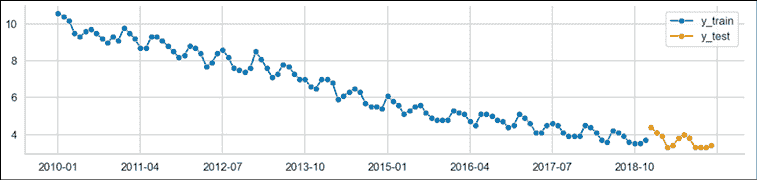

    图 7.22：将时间序列划分为训练集和测试集

1.  设置预测视野为 12 个月：

    ```py
    fh = ForecastingHorizon(y_test.index, is_relative=False)
    fh 
    ```

    执行代码片段生成如下输出：

    ```py
    ForecastingHorizon(['2019-01', '2019-02', '2019-03', '2019-04', '2019-05', '2019-06', '2019-07', '2019-08', '2019-09', '2019-10', '2019-11', '2019-12'], dtype='period[M]', is_relative=False) 
    ```

    每当我们使用这个`fh`对象进行预测时，我们将为 2019 年的 12 个月创建预测。

1.  实例化降维回归模型，拟合数据并生成预测：

    ```py
    regressor = RandomForestRegressor(random_state=42)
    rf_forecaster = make_reduction(
        estimator=regressor,
        strategy="recursive",
        window_length=12
    )
    rf_forecaster.fit(y_train)
    y_pred_1 = rf_forecaster.predict(fh) 
    ```

1.  评估预测的性能：

    ```py
    mape_1 = mean_absolute_percentage_error(
        y_test, y_pred_1, symmetric=False
    )
    fig, ax = plot_series(
        y_train["2016":], y_test, y_pred_1,
        labels=["y_train", "y_test", "y_pred"]
    )
    ax.set_title(f"MAPE: {100*mape_1:.2f}%") 
    ```

    执行代码片段生成如下图：

    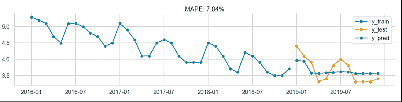

    图 7.23：使用降维随机森林的预测与实际值对比

    几乎平坦的预测结果很可能与我们在引言中提到的降维回归方法的缺点有关。通过将数据重塑为表格格式，我们实际上丧失了趋势和季节性的信息。为了考虑这些因素，我们可以先对时间序列进行去季节性和去趋势处理，然后再使用降维回归方法。

1.  对时间序列进行去季节性处理：

    ```py
    deseasonalizer = Deseasonalizer(model="additive", sp=12)
    y_deseas = deseasonalizer.fit_transform(y_train)
    plot_series(
        y_train, y_deseas,
        labels=["y_train", "y_deseas"]
    ) 
    ```

    执行代码片段生成如下图：

    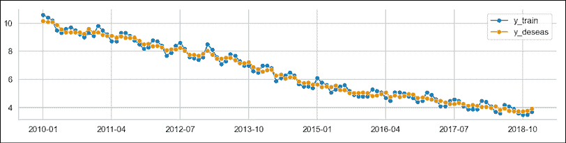

    图 7.24：原始时间序列和去季节性后的时间序列

    为了提供更多背景信息，我们可以绘制提取的季节性成分：

    ```py
    plot_series(
        deseasonalizer.seasonal_,
        labels=["seasonal_component"]
    ) 
    ```

    执行代码片段生成如下图：

    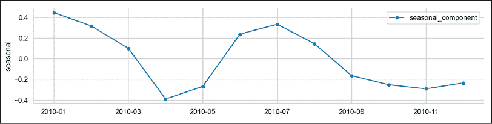

    图 7.25：提取的季节性成分

    在分析*图 7.25*时，我们不应过于关注 x 轴标签，因为提取的季节性模式在每年都是相同的。

1.  去趋势时间序列：

    ```py
    forecaster = PolynomialTrendForecaster(degree=1)
    transformer = Detrender(forecaster=forecaster)
    y_detrend = transformer.fit_transform(y_deseas)
    # in-sample predictions
    forecaster = PolynomialTrendForecaster(degree=1)
    y_in_sample = (
        forecaster
        .fit(y_deseas)
        .predict(fh=-np.arange(len(y_deseas)))
    )
    plot_series(
        y_deseas, y_in_sample, y_detrend,
        labels=["y_deseas", "linear trend", "resids"]
    ) 
    ```

    执行代码片段生成如下图：

    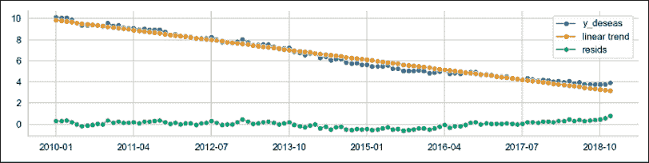

    图 7.26：去季节化时间序列与拟合的线性趋势及相应的残差

    在*图 7.26*中，我们可以看到 3 条线：

    +   来自上一步的去季节性时间序列

    +   拟合到去季节性时间序列的线性趋势

    +   残差，是通过从去季节性时间序列中减去拟合的线性趋势得到的

1.  将各个组件组合成一个管道，拟合到原始时间序列，并获得预测结果：

    ```py
    rf_pipe = TransformedTargetForecaster(
        steps = [
            ("deseasonalize", Deseasonalizer(model="additive", sp=12)),
            ("detrend", Detrender(
                forecaster=PolynomialTrendForecaster(degree=1)
            )),
            ("forecast", rf_forecaster),
        ]
    )
    rf_pipe.fit(y_train)
    y_pred_2 = rf_pipe.predict(fh) 
    ```

1.  评估管道的预测结果：

    ```py
    mape_2 = mean_absolute_percentage_error(
        y_test, y_pred_2, symmetric=False
    )
    fig, ax = plot_series(
        y_train["2016":], y_test, y_pred_2,
        labels=["y_train", "y_test", "y_pred"]
    )
    ax.set_title(f"MAPE: {100*mape_2:.2f}%") 
    ```

    执行代码片段生成如下图：

    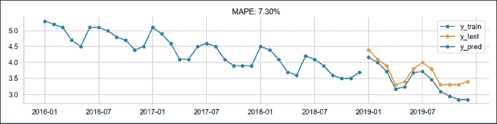

    图 7.27：包含去季节性和去趋势处理后的管道拟合，在执行降维回归之前

    通过分析*图 7.27*，我们可以得出以下结论：

    +   使用管道获得的预测形态与实际值更为相似——它捕捉了趋势和季节性成分。

    +   使用 MAPE 测量的误差似乎比*图 7.23*中几乎平坦的预测线还要差。

1.  使用扩展窗口交叉验证评估性能：

    ```py
    cv = ExpandingWindowSplitter(
        fh=list(range(1,13)),
        initial_window=12*5,
        step_length=12
    )
    cv_df = evaluate(
        forecaster=rf_pipe,
        y=y,
        cv=cv,
        strategy="refit",
        return_data=True
    )
    cv_df 
    ```

    执行代码片段生成如下数据框：

    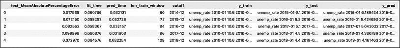

    图 7.28：包含交叉验证结果的数据框

    此外，我们可以调查在交叉验证过程中用于训练和评估管道的日期范围：

    ```py
    for ind, row in cv_df.iterrows():
        print(f"Fold {ind} ----")
        print(f"Training: {row['y_train'].index.min()} - {row['y_train'].index.max()}")
        print(f"Training: {row['y_test'].index.min()} - {row['y_test'].index.max()}") 
    ```

    执行代码片段生成如下输出：

    ```py
    Fold 0 ----
    Training: 2010-01 - 2014-12
    Training: 2015-01 - 2015-12
    Fold 1 ----
    Training: 2010-01 - 2015-12
    Training: 2016-01 - 2016-12
    Fold 2 ----
    Training: 2010-01 - 2016-12
    Training: 2017-01 - 2017-12
    Fold 3 ----
    Training: 2010-01 - 2017-12
    Training: 2018-01 - 2018-12
    Fold 4 ----
    Training: 2010-01 - 2018-12
    Training: 2019-01 - 2019-12 
    ```

    实际上，我们创建了一个 5 折交叉验证，其中扩展窗口在各折之间按 12 个月增长，并且我们始终使用接下来的 12 个月进行评估。

1.  绘制交叉验证折叠的预测结果：

    ```py
    n_fold = len(cv_df)
    plot_series(
        y,
        *[cv_df["y_pred"].iloc[x] for x in range(n_fold)],
        markers=["o", *["."] * n_fold],
        labels=["y_true"] + [f"cv: {x}" for x in range(n_fold)]
    ) 
    ```

    执行该代码片段会生成以下图表：

    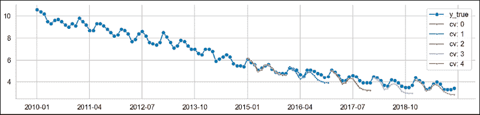

    图 7.29：每个交叉验证折叠的预测结果与实际结果对比图

1.  使用 RF 管道和 AutoARIMA 创建一个集成预测：

    ```py
    ensemble = EnsembleForecaster(
        forecasters = [
            ("autoarima", AutoARIMA(sp=12)),
            ("rf_pipe", rf_pipe)
        ]
    )
    ensemble.fit(y_train)
    y_pred_3 = ensemble.predict(fh) 
    ```

    在这个例子中，我们直接将 AutoARIMA 模型拟合到原始时间序列上。然而，我们也可以先对时间序列进行季节性调整和去趋势处理，然后再拟合模型。在这种情况下，指明季节周期可能就不再是必须的（这取决于季节性在经典分解中去除的效果如何）。

1.  评估集成模型的预测结果：

    ```py
    mape_3 = mean_absolute_percentage_error(
        y_test, y_pred_3, symmetric=False
    )
    fig, ax = plot_series(
        y_train["2016":], y_test, y_pred_3,
        labels=["y_train", "y_test", "y_pred"]
    )
    ax.set_title(f"MAPE: {100*mape_3:.2f}%") 
    ```

    执行该代码片段会生成以下图表：

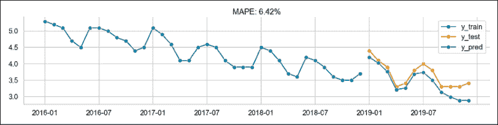

图 7.30：集成模型拟合，包括减少版回归管道和 AutoARIMA

如我们在*图 7.30*中看到的，将这两个模型进行集成，相较于减少版的随机森林管道，能显著提高性能。

## 它是如何工作的…

在导入库后，我们使用了`temporal_train_test_split`函数将数据分为训练集和测试集。我们保留了最后 12 个观测值（整个 2019 年）作为测试集。我们还使用`plot_series`函数绘制了时间序列图，这在我们希望在同一图表中绘制多个时间序列时特别有用。

在*步骤 3*中，我们定义了`ForecastingHorizon`。在`sktime`中，预测时段可以是一个值数组，值可以是相对的（表示与训练数据中最新时间点的时间差）或绝对的（表示特定的时间点）。在我们的例子中，我们使用了绝对值，通过提供测试集的索引并设置`is_relative=False`。

另一方面，预测时段的相对值包括一个步骤列表，列出了我们希望获取预测的时间点。相对时段在进行滚动预测时非常有用，因为每次添加新数据时我们都可以重复使用它。

在*步骤 4*中，我们将一个简化的回归模型拟合到训练数据中。为此，我们使用了`make_reduction`函数并提供了三个参数。`estimator`参数用于指明我们希望在简化回归设置中使用的回归模型。在这种情况下，我们选择了随机森林（更多关于随机森林算法的细节可以参考*第十四章*，*机器学习项目的高级概念*）。`window_length`表示用于创建简化回归任务的过去观测值数量，也就是将时间序列转化为表格数据集。最后，`strategy`参数决定了多步预测的生成方式。我们可以选择以下策略之一来获得多步预测：

+   `直接法`—此策略假设为每一个预测的时间段创建一个单独的模型。在我们的案例中，我们预测 12 步的未来。这意味着该策略将创建 12 个单独的模型来获取预测结果。

+   `递归法`—此策略假设拟合一个单步预测模型。然而，为了生成预测，它使用上一个时间步的输出作为下一个时间步的输入。例如，为了获取未来第二个观测值的预测，它会将未来第一个观测值的预测结果作为特征集的一部分。

+   `多输出法`—在此策略中，我们使用一个模型来预测整个预测时间段内的所有值。此策略依赖于具有一次性预测整个序列能力的模型。

在定义了简化回归模型之后，我们使用`fit`方法将其拟合到训练数据上，并使用`predict`方法获得预测结果。对于后者，我们需要提供作为参数的预测时间段对象。或者，我们也可以提供一个步骤的列表/数组，来获取相应的预测。

在*步骤 5*中，我们通过计算 MAPE 得分并将预测值与实际值进行对比绘图来评估预测效果。为了计算误差指标，我们使用了`sktime`的`mean_absolute_percentage_error`函数。使用`sktime`实现的额外好处是，我们可以通过在调用该函数时指定`symmetric=True`，轻松计算**对称 MAPE**（**sMAPE**）。

在这一点上，我们注意到，简化回归模型存在引言中提到的问题——它没有捕捉到时间序列的趋势和季节性。因此，在接下来的步骤中，我们展示了如何在使用简化回归方法之前对时间序列进行去季节性和去趋势化处理。

在*步骤 6*中，我们对原始时间序列进行了去季节性处理。首先，我们实例化了`Deseasonalizer`转换器。我们通过提供`sp=12`来指明存在月度季节性，并选择了加性季节性，因为季节性模式的幅度似乎随着时间变化不大。在后台，`Deseasonalizer`类执行了在`statsmodels`库中提供的季节性分解（我们在上一章的*时间序列分解*食谱中讨论过），并去除了时间序列中的季节性成分。为了在一步操作中拟合转换器并获得去季节性后的时间序列，我们使用了`fit_transform`方法。拟合转换器后，可以通过访问`seasonal_`属性来检查季节性成分。

在*步骤 7*中，我们从去季节化的时间序列中移除了趋势。首先，我们实例化了`PolynomialTrendForecaster`类，并指定`degree=1`。通过这种方式，我们表示我们对线性趋势感兴趣。然后，我们将实例化的类传递给`Detrender`变换器。使用我们已经熟悉的`fit_transform`方法，我们从去季节化的时间序列中去除了趋势。

在*步骤 8*中，我们将所有步骤结合成一个管道。我们实例化了`TransformedTargetForecaster`类，它用于在我们首先变换时间序列然后再拟合机器学习模型以进行预测时使用。作为`steps`参数，我们提供了一个包含元组的列表，每个元组包含步骤名称和用于执行该步骤的变换器/估计器。在这个管道中，我们串联了去季节化、去趋势处理，以及我们在*步骤 4*中已使用的减少版随机森林模型。然后，我们将整个管道拟合到训练数据上，并获得预测结果。在*步骤 9*中，我们通过计算 MAPE 并绘制预测与实际值的对比图来评估管道的性能。

在这个例子中，我们仅专注于使用原始时间序列创建模型。当然，我们也可以使用其他特征进行预测。`sktime`还提供了创建包含相关变换的回归器管道的功能。然后，我们应该使用`ForecastingPipeline`类将给定的变换器应用到 X（特征）上。我们还可能希望对 X 应用某些变换，对`y`（目标）应用其他变换。在这种情况下，我们可以将包含需要应用于`y`的任何变换器的`TransformedTargetForecaster`作为`ForecastingPipeline`的一步传入。

在*步骤 10*中，我们进行了额外的评估步骤。我们使用了向前滚动交叉验证，采用扩展窗口来评估模型的性能。为了定义交叉验证方案，我们使用了`ExpandingWindowSplitter`类。作为输入，我们需要提供：

+   `fh`—预测的时间范围。由于我们想评估 12 步 ahead 的预测，因此我们提供了一个从 1 到 12 的整数列表。

+   `initial_window`—初始训练窗口的长度。我们将其设置为 60，表示 5 年的训练数据。

+   `step_length`—此值表示扩展窗口每次实际扩展的周期数。我们将其设置为 12，因此每个折叠都会增加一年的训练数据。

定义验证方案后，我们使用了`evaluate`函数来评估*步骤 8*中定义的管道的性能。在使用`evaluate`函数时，我们还必须指定`strategy`参数，用于定义在窗口扩展时如何获取新数据。选项如下：

+   `refit`—在每个训练窗口中，模型都会被重新拟合。

+   `update`—预测器使用窗口中的新训练数据进行更新，但不会重新拟合。

+   `no-update_params`——模型在第一个训练窗口中拟合，然后在没有重新拟合或更新模型的情况下重复使用。

在*步骤 11*中，我们使用了`plot_series`函数，并结合列表推导来绘制原始时间序列和在每个验证折叠中获得的预测。

在最后两步中，我们创建并评估了一个集成模型。首先，我们实例化了`EnsembleForecaster`类，并提供了包含模型名称及其相应类/定义的元组列表。对于这个集成模型，我们结合了带有月度季节性的 AutoARIMA 模型（一个 SARIMA 模型）和在*步骤 8*中定义的降维随机森林管道。此外，我们使用了`aggfunc`参数的默认值`"mean"`。该参数决定了用于生成最终预测的聚合策略。在此案例中，集成模型的预测是单个模型预测的平均值。其他选项包括使用中位数、最小值或最大值。

在实例化模型后，我们使用了已经熟悉的`fit`和`predict`方法来拟合模型并获得预测结果。

## 还有更多……

在本教程中，我们介绍了使用`sktime`进行降维回归。如前所述，`sktime`是一个框架，提供了在处理时间序列时可能需要的所有工具。以下是使用`sktime`及其功能的一些优点：

+   该库不仅适用于时间序列预测，还适用于回归、分类和聚类任务。此外，它还提供了特征提取功能。

+   `sktime`提供了一些简单的模型，这些模型在创建基准时非常有用。例如，我们可以使用`NaiveForecaster`模型来创建预测，该预测仅仅是最后一个已知值。或者，我们可以使用最后一个已知的季节性值，例如，2019 年 1 月的预测将是 2018 年 1 月时序数据的值。

+   它提供了一个统一的 API，作为许多流行时间序列库的封装器，如`statsmodels`、`pmdarima`、`tbats`或 Meta 的 Prophet。要查看所有可用的预测模型，我们可以执行`all_estimators("forecaster", as_dataframe=True)`命令。

+   通过使用降维，能够使用所有与`scikit-learn` API 兼容的估算器进行预测。

+   `sktime`提供了带有时间交叉验证的超参数调优功能。此外，我们还可以调优与降维过程相关的超参数，如滞后数量或窗口长度。

+   该库提供了广泛的性能评估指标（在`scikit-learn`中不可用），并允许我们轻松创建自定义评分器。

+   该库扩展了`scikit-learn`的管道功能，允许将多个转换器（如去趋势、去季节性等）与预测算法结合使用。

+   该库提供了 AutoML 功能，可以自动从众多模型及其超参数中确定最佳预测器。

## 参见

+   Löning, M., Bagnall, A., Ganesh, S., Kazakov, V., Lines, J., & Király, F. J. 2019\. sktime: A Unified Interface for Machine Learning with Time Series. *arXiv preprint arXiv:1909.07872*.

# 使用 Meta 的 Prophet 进行预测

在前面的示例中，我们展示了如何重新构造时间序列预测问题，以便使用常用于回归任务的流行机器学习模型。这次，我们展示的是一个专门为时间序列预测设计的模型。

**Prophet** 是由 Facebook（现为 Meta）在 2017 年推出的，从那时起，它已经成为一个非常流行的时间序列预测工具。它流行的一些原因：

+   大多数情况下，它能够直接提供合理的结果/预测。

+   它是为预测与业务相关的时间序列而设计的。

+   它最适用于具有强季节性成分的每日时间序列，并且至少需要一些季节的训练数据。

+   它可以建模任意数量的季节性（例如按小时、每日、每周、每月、每季度或每年）。

+   该算法对缺失数据和趋势变化具有相当强的鲁棒性（它通过自动变化点检测来应对这一点）。

+   它能够轻松地考虑假期和特殊事件。

+   与自回归模型（如 ARIMA）相比，它不需要平稳时间序列。

+   我们可以通过调整模型的易于理解的超参数，运用业务/领域知识来调整预测。

+   我们可以使用额外的回归量来提高模型的预测性能。

自然地，这个模型并不完美，存在一些问题。在 *参见* 部分，我们列出了一些参考资料，展示了该模型的弱点。

Prophet 的创建者将时间序列预测问题视为一个曲线拟合的练习（这在数据科学社区引发了不少争议），而不是明确地分析时间序列中每个观测值的时间依赖性。因此，Prophet 是一个加性模型（属于广义加性模型或 GAMs 的一种形式），可以表示如下：

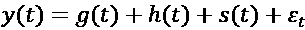

其中：

+   *g(t)* — 增长项，具有分段线性、逻辑或平坦形式。趋势成分模型捕捉时间序列中的非周期性变化。

+   *h(t)* — 描述假期和特殊日期的影响（这些日期可能不规则出现）。它们作为虚拟变量添加到模型中。

+   *s(t)* — 描述使用傅里叶级数建模的各种季节性模式。

+   *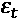* — 误差项，假设其服从正态分布。

逻辑增长趋势特别适用于建模饱和（或受限）增长。例如，当我们预测某个国家的客户数量时，我们不应预测超过该国人口总数的客户数量。使用 Prophet，我们还可以考虑饱和的最小值。

广义加性模型（GAM）是简单却强大的模型，正在获得越来越多的关注。它们假设各个特征与目标之间的关系遵循平滑模式。这些关系可以是线性的，也可以是非线性的。然后，这些关系可以同时估计并加和，生成模型的预测值。例如，将季节性建模为加性组件与 Holt-Winters 指数平滑方法中的做法相同。Prophet 使用的 GAM 公式有其优势。首先，它易于分解。其次，它能容纳新的组件，例如，当我们识别出新的季节性来源时。

Prophet 的另一个重要特点是，在估计趋势的过程中包括变化点，这使得趋势曲线更加灵活。由于变化点的存在，趋势可以调整为适应模式中的突变，例如 COVID 疫情引起的销售模式变化。Prophet 具有自动检测变化点的程序，但也可以接受手动输入日期。

Prophet 是使用贝叶斯方法估计的（得益于使用 Stan，它是一个用 C++编写的统计推断编程语言），该方法允许自动选择变化点，并使用**马尔科夫链蒙特卡罗**（**MCMC**）或**最大后验估计**（**MAP**）等方法创建置信区间。

在本节中，我们展示了如何使用 2015 至 2019 年的数据预测每日黄金价格。虽然我们非常清楚该模型不太可能准确预测黄金价格，但我们将其作为训练和使用模型的示例。

## 如何操作…

执行以下步骤来使用 Prophet 模型预测每日黄金价格：

1.  导入库并使用纳斯达克数据链接进行身份验证：

    ```py
    import pandas as pd
    import nasdaqdatalink
    from prophet import Prophet
    from prophet.plot import add_changepoints_to_plot
    nasdaqdatalink.ApiConfig.api_key = "YOUR_KEY_HERE" 
    ```

1.  下载每日黄金价格：

    ```py
    df = nasdaqdatalink.get(
        dataset="WGC/GOLD_DAILY_USD",
        start_date="2015-01-01",
        end_date="2019-12-31"
    )
    df.plot(title="Daily gold prices (2015-2019)") 
    ```

    执行该代码片段会生成以下图表：

    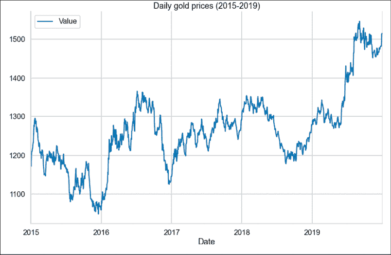

    图 7.31：2015 年至 2019 年的每日黄金价格

1.  重命名列：

    ```py
    df = df.reset_index(drop=False)
    df.columns = ["ds", "y"] 
    ```

1.  将系列分为训练集和测试集：

    ```py
    train_indices = df["ds"] < "2019-10-01"
    df_train = df.loc[train_indices].dropna()
    df_test = (
        df
        .loc[~train_indices]
        .reset_index(drop=True)
    ) 
    ```

    我们任意选择了`2019`年的最后一个季度作为测试集。因此，我们将创建一个预测未来约 60 个观测值的模型。

1.  创建模型实例并将其拟合到数据：

    ```py
    prophet = Prophet(changepoint_range=0.9)
    prophet.add_country_holidays(country_name="US")
    prophet.add_seasonality(
        name="monthly", period=30.5, fourier_order=5
    )
    prophet.fit(df_train) 
    ```

1.  预测 2019 年第四季度的黄金价格并绘制结果：

    ```py
    df_future = prophet.make_future_dataframe(
        periods=len(df_test), freq="B"
    )
    df_pred = prophet.predict(df_future)
    prophet.plot(df_pred) 
    ```

    执行该代码片段会生成以下图表：

    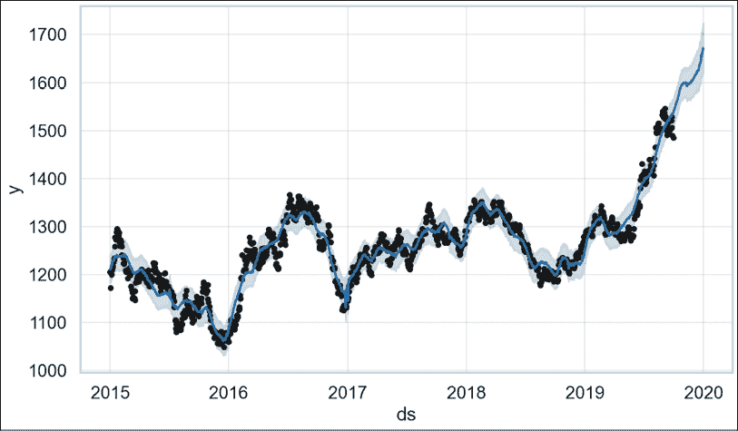

    图 7.32：使用 Prophet 获得的预测

    为了解释该图，我们需要知道：

    +   黑色的点是黄金价格的实际观测值。

    +   代表拟合的蓝线与观测值并不完全匹配，因为模型对数据中的噪音进行了平滑处理（这也减少了过拟合的可能性）。

    +   Prophet 尝试量化不确定性，这通过拟合线周围的浅蓝色区间表示。该区间的计算假设未来趋势变化的平均频率和幅度将与历史数据中的趋势变化相同。

    还可以使用 `plotly` 创建交互式图表。为此，我们需要使用 `plot_plotly` 函数，而不是 `plot` 方法。

    此外，值得一提的是，预测数据框包含了很多可能有用的列：

    ```py
    df_pred.columns 
    ```

    使用代码片段，我们可以看到所有的列：

    ```py
    ['ds', 'trend', 'yhat_lower', 'yhat_upper', 'trend_lower', 
    'trend_upper', 'Christmas Day', 'Christmas Day_lower', 
    'Christmas Day_upper', 'Christmas Day (Observed)', 
    'Christmas Day (Observed)_lower', 'Christmas Day (Observed)_upper', 
    'Columbus Day', 'Columbus Day_lower', 'Columbus Day_upper', 
    'Independence Day', 'Independence Day_lower', 
    'Independence Day_upper', 'Independence Day (Observed)',
    'Independence Day (Observed)_lower', 
    'Independence Day (Observed)_upper', 'Labor Day', 'Labor Day_lower',
    'Labor Day_upper', 'Martin Luther King Jr. Day',
    'Martin Luther King Jr. Day_lower', 
    'Martin Luther King Jr. Day_upper',
    'Memorial Day', 'Memorial Day_lower', 'Memorial Day_upper',
    'New Year's Day', 'New Year's Day_lower', 'New Year's Day_upper',
    'New Year's Day (Observed)', 'New Year's Day (Observed)_lower',
    'New Year's Day (Observed)_upper', 'Thanksgiving', 
    'Thanksgiving_lower', 'Thanksgiving_upper', 'Veterans Day',
    'Veterans Day_lower', 'Veterans Day_upper', 
    'Veterans Day (Observed)', 'Veterans Day (Observed)_lower',
    'Veterans Day (Observed)_upper', 'Washington's Birthday',
    'Washington's Birthday_lower', 'Washington's Birthday_upper',
    'additive_terms', 'additive_terms_lower', 'additive_terms_upper',
    'holidays', 'holidays_lower', 'holidays_upper', 'monthly',
    'monthly_lower', 'monthly_upper', 'weekly', 'weekly_lower',
    'weekly_upper', 'yearly', 'yearly_lower', 'yearly_upper',
    'multiplicative_terms', 'multiplicative_terms_lower',
    'multiplicative_terms_upper', 'yhat'] 
    ```

    通过分析列表，我们可以看到 Prophet 模型返回的所有组件。自然地，我们看到了预测（`yhat`）及其对应的置信区间（`'yhat_lower'` 和 `'yhat_upper'`）。此外，我们还看到了模型的所有个别组件（如趋势、假期效应和季节性），以及它们的置信区间。这些可能对我们有用，考虑到以下几个方面：

    +   由于 Prophet 是一种加性模型，我们可以将所有组件相加，得到最终的预测结果。因此，我们可以将这些值视为一种特征重要性，可以用来解释预测结果。

    +   我们还可以使用 Prophet 模型来获取这些组件的值，然后将它们作为特征输入到另一个模型（例如基于树的模型）中。

1.  向图表中添加变化点：

    ```py
    fig = prophet.plot(df_pred)
    a = add_changepoints_to_plot(
        fig.gca(), prophet, df_pred
    ) 
    ```

    执行代码片段会生成以下图表：

    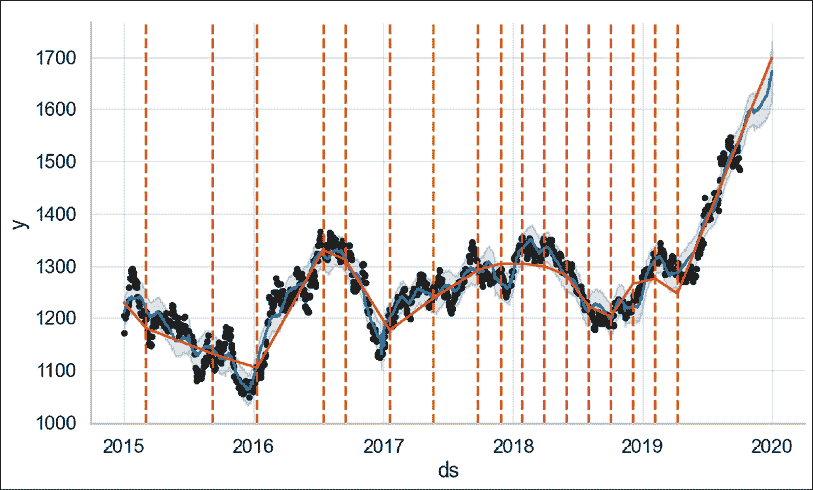

    图 7.33：模型的拟合与识别出的变化点

    我们还可以使用拟合后的 Prophet 模型的 `changepoints` 方法查找被识别为变化点的确切日期。

1.  检查时间序列的分解：

    ```py
    prophet.plot_components(df_pred) 
    ```

    执行代码片段会生成以下图表：

    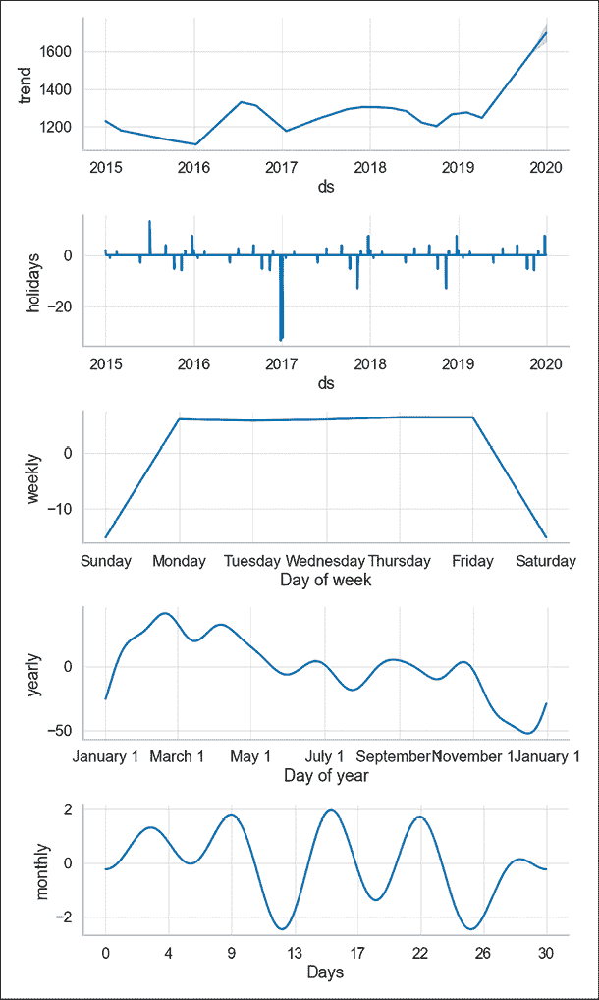

    图 7.34：展示 Prophet 模型个别组件的分解图

    我们没有花太多时间检查组件，因为黄金价格的时间序列可能没有太多季节性影响，或者不应受到美国假期的影响。这尤其适用于假期，因为股市在主要假期时会休市。因此，这些假期的影响可能会在假期前后由市场反映出来。正如我们之前提到的，我们对此有所了解，我们只是想展示 Prophet 是如何工作的。

    有一点需要注意的是，周季节性在星期六和星期天之间明显不同。这是由于黄金价格数据是在工作日收集的。因此，我们可以安全地忽略周末的模式。

    然而，有趣的是观察趋势组件，我们可以在*图 7.33*中看到它，并且与检测到的变化点一起呈现。

1.  将测试集与预测结果合并：

    ```py
    SELECTED_COLS = [
        "ds", "yhat", "yhat_lower", "yhat_upper"
    ]
    df_pred = (
        df_pred
        .loc[:, SELECTED_COLS]
        .reset_index(drop=True)
    )
    df_test = df_test.merge(df_pred, on=["ds"], how="left")
    df_test["ds"] = pd.to_datetime(df_test["ds"])
    df_test = df_test.set_index("ds") 
    ```

1.  绘制测试值与预测值的对比图：

    ```py
    fig, ax = plt.subplots(1, 1)
    PLOT_COLS = [
        "y", "yhat", "yhat_lower", "yhat_upper"
    ]
    ax = sns.lineplot(data=df_test[PLOT_COLS])
    ax.fill_between(
        df_test.index,
        df_test["yhat_lower"],
        df_test["yhat_upper"],
        alpha=0.3
    )
    ax.set(
        title="Gold Price - actual vs. predicted",
        xlabel="Date",
        ylabel="Gold Price ($)"
    ) 
    ```

    执行代码片段生成了以下图表：

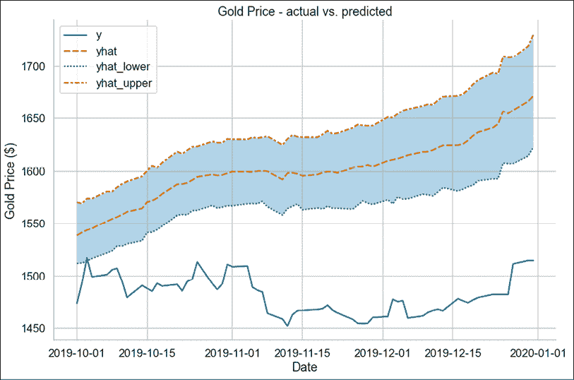

图 7.35：预测值与实际值对比

正如我们在*图 7.35*中看到的，模型的预测结果偏差较大。实际上，80% 置信区间（默认设置，我们可以通过 `interval_width` 超参数来更改）几乎没有捕捉到任何实际值。

## 它是如何工作的…

在导入库之后，我们从 Nasdaq Data Link 下载了每日黄金价格数据。

在*步骤 3*中，我们重命名了数据框的列，以使其与 Prophet 兼容。该算法需要两列数据：

+   `ds`—表示时间戳

+   `y`—目标变量

在*步骤 4*中，我们将数据框拆分为训练集和测试集。我们任意选择了 2019 年第四季度作为测试集。

在*步骤 5*中，我们实例化了 Prophet 模型。期间，我们指定了一些设置：

+   我们将 `changepoint_range` 设置为 `0.9`，这意味着算法可以在训练数据集的前 90% 中识别变化点。默认情况下，Prophet 会在时间序列的前 80% 中添加 25 个变化点。在这种情况下，我们希望捕捉到较新的趋势。

+   我们使用 `add_seasonality` 方法并按照 Prophet 文档建议的值添加了月度季节性。指定 `period` 为 `30.5` 意味着我们期望模式大约每 30.5 天重复一次。另一个参数—`fourier_order`—可以用来指定用于构建特定季节性成分（在此情况下为月度季节性）的 Fourier 项数。通常来说，阶数越高，季节性成分越灵活。

+   我们使用 `add_country_holidays` 方法将美国假期添加到模型中。我们使用的是默认日历（通过 `holidays` 库可用），但也可以添加日历中没有的自定义事件。例如，黑色星期五就是一个例子。还值得一提的是，在提供自定义事件时，我们还可以指定是否预期周围的日期也会受到影响。例如，在零售场景中，我们可能会预期圣诞节后几天的客流/销售会较低。另一方面，我们也许会预期圣诞节前夕会出现销售高峰。

然后，我们使用 `fit` 方法拟合了模型。

在*步骤 6*中，我们使用拟合后的模型获得了预测结果。为了使用 Prophet 创建预测，我们需要使用 `make_future_dataframe` 方法创建一个特殊的数据框。在此过程中，我们指定了希望预测的测试集长度（默认情况下以天数为单位），并且我们希望使用工作日。这一点很重要，因为我们没有周末的黄金价格数据。然后，我们使用拟合模型的 `predict` 方法生成预测结果。

在*步骤 7*中，我们使用`add_changepoints_to_plot`函数将识别出的变更点添加到图表中。这里有一点需要注意的是，我们必须使用所创建图形的`gca`方法来获取其当前坐标轴。我们必须使用它来正确识别我们想要将变更点添加到哪个图表中。

在*步骤 8*中，我们检查了模型的各个组件。为此，我们使用了`plot_components`方法，并将预测数据框作为方法的参数。

在*步骤 9*中，我们将测试集与预测数据框合并。我们使用了左连接，它返回左表（测试集）中的所有行以及右表（预测数据框）中匹配的行，而未匹配的行则为空。

最后，我们绘制了预测结果（连同置信区间）和真实值，以便直观地评估模型的性能。

## 还有更多…

Prophet 提供了很多有趣的功能。虽然在一个单一的实例中提到所有这些功能显然太多，但我们想强调两点。

### 内置交叉验证

为了正确评估模型的表现（并可能调整其超参数），我们确实需要一个验证框架。Prophet 在其`cross_validation`函数中实现了我们已经熟悉的前向交叉验证。在这一小节中，我们展示了如何使用它：

1.  导入库：

    ```py
    from prophet.diagnostics import (cross_validation, 
                                     performance_metrics)
    from prophet.plot import plot_cross_validation_metric 
    ```

1.  运行 Prophet 的交叉验证：

    ```py
    df_cv = cross_validation(
        prophet,
        initial="756 days",
        period="60 days",
        horizon = "60 days"
    )
    df_cv 
    ```

    我们已经指定我们想要：

    +   初始窗口包含 3 年的数据（一年大约有 252 个交易日）

    +   预测期为 60 天

    +   每 60 天计算一次预测

    执行该代码段会生成以下输出：

    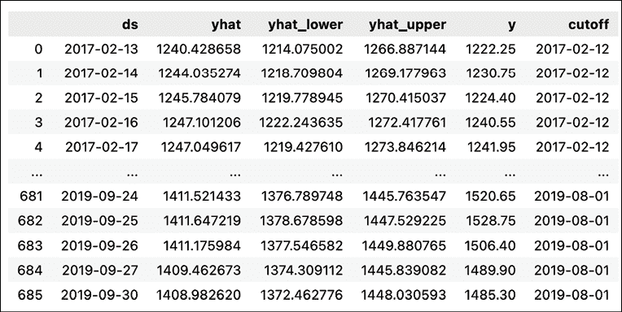

    图 7.36：Prophet 交叉验证的输出

    数据框包含了预测值（包括置信区间）和实际值，针对一组`cutoff`日期（用于生成预测的训练集中的最后一个时间点）和`ds`日期（用于生成预测的验证集中的日期）。换句话说，这个过程为每个介于`cutoff`和`cutoff + horizon`之间的观察点生成预测。

    算法还告诉我们它将要做什么：

    ```py
    Making 16 forecasts with cutoffs between 2017-02-12 00:00:00 and 2019-08-01 00:00:00 
    ```

1.  计算聚合性能指标：

    ```py
    df_p = performance_metrics(df_cv)
    df_p 
    ```

    执行该代码段会生成以下输出：

    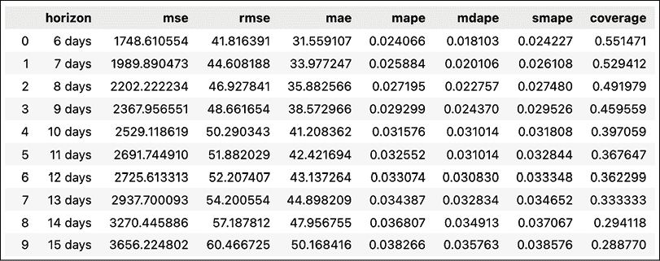

    图 7.37：性能概览的前 10 行

    *图 7.37*展示了包含我们交叉验证结果的聚合性能得分的前 10 行数据框。根据我们的交叉验证方案，整个数据框包含了直到`60 天`的所有预测期。

    请参阅 Prophet 文档，了解由`performance_metrics`函数生成的聚合性能指标背后的确切逻辑。

1.  绘制 MAPE 得分：

    ```py
    plot_cross_validation_metric(df_cv, metric="mape") 
    ```

    执行该代码段会生成以下图表：

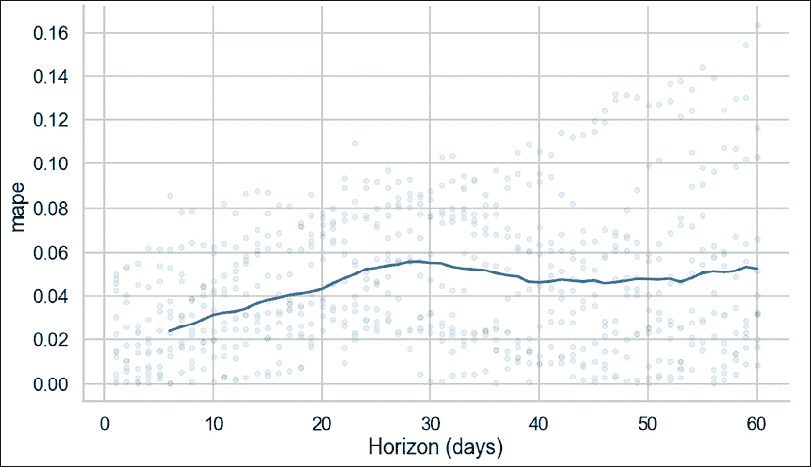

图 7.38：不同预测期的 MAPE 得分

*图 7.38* 中的点表示交叉验证数据框中每个预测的绝对百分比误差。蓝线表示 MAPE。平均值是在点的滚动窗口上计算的。有关滚动窗口的更多信息，请参阅 Prophet 的文档。

### 调整模型

如我们已经看到的，Prophet 有相当多的可调超参数。该库的作者建议以下超参数可能值得调优，以实现更好的拟合：

+   `changepoint_prior_scale`—可能是最具影响力的超参数，它决定了趋势的灵活性。特别是，趋势在趋势变化点的变化程度。过小的值会使趋势变得不那么灵活，可能导致趋势欠拟合，而过大的值可能会导致趋势过拟合（并可能捕捉到年度季节性）。

+   `seasonality_prior_scale`—一个控制季节性项灵活性的超参数。较大的值允许季节性拟合显著的波动，而较小的值则会收缩季节性的幅度。默认值为 10，基本上不进行正则化。

+   `holidays_prior_scale`—与 `seasonality_prior_scale` 非常相似，但它控制拟合假期效应的灵活性。

+   `seasonality_mode`—我们可以选择加法季节性或乘法季节性。选择此项的最佳方法是检查时间序列，看看季节性波动的幅度是否随着时间的推移而增大。

+   `changepoint_range`—此参数对应于算法可以识别变化点的时间序列百分比。确定此超参数的良好值的一条经验法则是查看模型在训练数据的最后 1−`changepoint_range` 百分比中的拟合情况。如果模型在这一部分的表现不佳，我们可能需要增加该超参数的值。

与其他情况一样，我们可能希望使用像网格搜索（结合交叉验证）这样的过程来识别最佳的超参数集，同时尽量避免/最小化对训练数据的过拟合风险。

## 另见

+   Rafferty, G. 2021. *使用 Facebook Prophet 进行时间序列预测*。Packt Publishing Ltd.

+   Taylor, S. J., & Letham, B. 2018. “大规模预测，” *美国统计学家*，72(1)：37-45。

# 使用 PyCaret 进行时间序列预测的 AutoML

我们已经花了一些时间解释了如何构建时间序列预测的机器学习模型，如何创建相关特征，以及如何使用专门的模型（例如 Meta 的 Prophet）来完成任务。将本章以对前述所有部分的扩展——一个 AutoML 工具来结束，是再合适不过了。

可用的工具之一是 PyCaret，它是一个开源、低代码的机器学习库。该工具的目标是自动化机器学习工作流程。通过 PyCaret，我们可以仅用几行代码训练和调优众多流行的机器学习模型。虽然它最初是为经典回归和分类任务构建的，但它也有一个专门的时间序列模块，我们将在本例中介绍。

PyCaret 库本质上是多个流行的机器学习库和框架（如 `scikit-learn`、XGBoost、LightGBM、CatBoost、Optuna、Hyperopt 等）的封装。更准确地说，PyCaret 的时间序列模块建立在 `sktime` 提供的功能之上，例如它的降维框架和管道能力。

在本例中，我们将使用 PyCaret 库来寻找最适合预测美国月度失业率的模型。

## 准备工作

在本例中，我们将使用在前面几个例子中已经使用过的相同数据集。你可以在《*时间序列验证方法*》一节中找到有关如何下载和准备时间序列的更多信息。

## 操作步骤…

执行以下步骤，使用 PyCaret 预测美国失业率：

1.  导入库：

    ```py
    from pycaret.datasets import get_data
    from pycaret.time_series import TSForecastingExperiment 
    ```

1.  设置实验：

    ```py
    exp = TSForecastingExperiment()
    exp.setup(df, fh=6, fold=5, session_id=42) 
    ```

    执行代码片段后生成以下实验总结：

    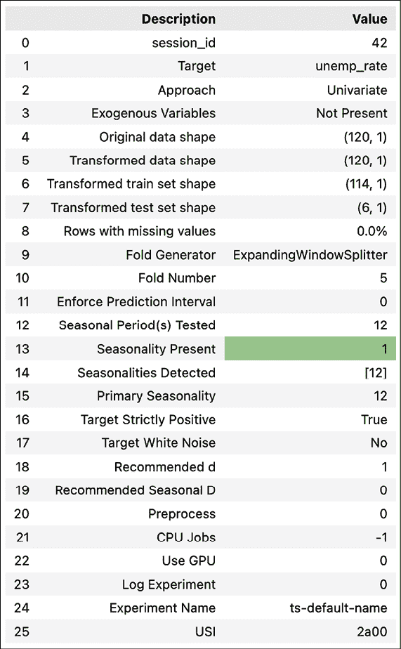

    图 7.39：PyCaret 实验总结

    我们可以看到，该库自动将最后 6 个观测值作为测试集，并识别出所提供时间序列中的月度季节性。

1.  使用可视化工具探索时间序列：

    ```py
    exp.plot_model(
        plot="diagnostics",
        fig_kwargs={"height": 800, "width": 1000}
    ) 
    ```

    执行代码片段后生成以下图表：

    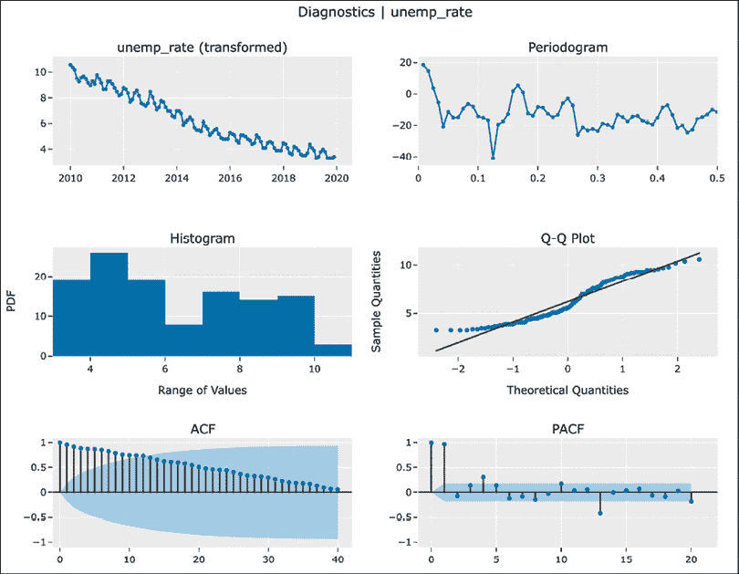

    图 7.40：时间序列的诊断图

    虽然大部分图表已经很熟悉，但新的图表是周期图。我们可以结合快速傅里叶变换图来研究分析时间序列的频率成分。虽然这可能超出了本书的范围，但我们可以提到以下解释这些图表的要点：

    +   在 0 附近的峰值可能表示需要对时间序列进行差分。这可能表明是一个平稳的 ARMA 过程。

    +   在某个频率及其倍数上出现峰值表示季节性。最低的这些频率称为**基本频率**。其倒数即为模型的季节周期。例如，基本频率为 0.0833 时，对应的季节周期为 12，因为 1/0.0833 = 12。

    使用以下代码片段，我们可以可视化将在实验中使用的交叉验证方案：

    ```py
    exp.plot_model(plot="cv") 
    ```

    执行代码片段后生成以下图表：

    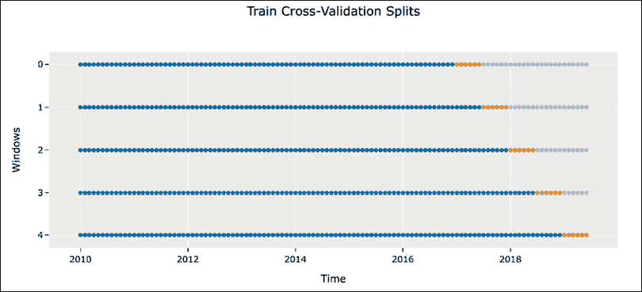

    图 7.41：使用扩展窗口进行的 5 折走步交叉验证示例

    在随附的笔记本中，我们还展示了一些其他可用的图表，例如，季节性分解、**快速傅里叶变换**（**FFT**）等。

1.  对时间序列进行统计检验：

    ```py
    exp.check_stats() 
    ```

    执行该代码片段会生成以下 DataFrame，展示各种测试结果：

    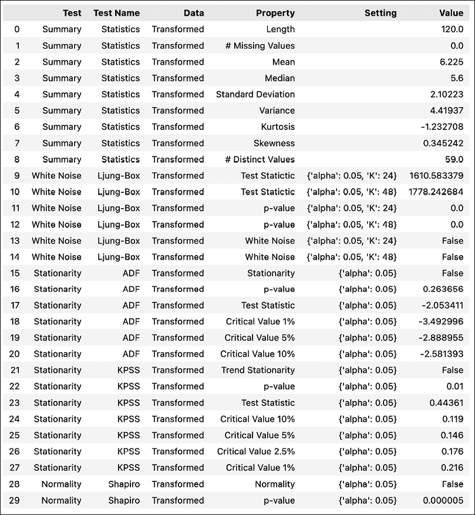

    图 7.42：包含各种统计测试结果的 DataFrame

    我们还可以仅执行所有测试的子集。例如，我们可以使用以下代码片段执行摘要测试：

    ```py
    exp.check_stats(test="summary") 
    ```

1.  找出五个最适合的管道：

    ```py
    best_pipelines = exp.compare_models(
        sort="MAPE", turbo=False, n_select=5
    ) 
    ```

    执行该代码片段会生成以下 DataFrame，展示性能概览：

    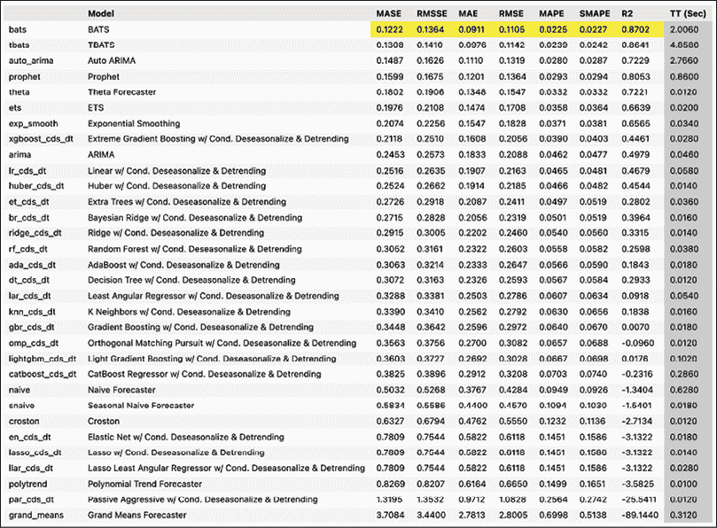

    图 7.43：所有拟合模型的交叉验证得分的 DataFrame

    检查 `best_pipelines` 对象将打印出最佳管道：

    ```py
    [BATS(show_warnings=False, sp=12, use_box_cox=True),
     TBATS(show_warnings=False, sp=[12], use_box_cox=True),
     AutoARIMA(random_state=42, sp=12, suppress_warnings=True),
     ProphetPeriodPatched(), 
    ThetaForecaster(sp=12)] 
    ```

1.  调优最佳管道：

    ```py
    best_pipelines_tuned = [
        exp.tune_model(model) for model in best_pipelines
    ]
    best_pipelines_tuned 
    ```

    调优后，表现最佳的管道如下：

    ```py
    [BATS(show_warnings=False, sp=12, use_box_cox=True),
     TBATS(show_warnings=False, sp=[12], use_box_cox=True,  
           use_damped_trend=True, use_trend=True),
     AutoARIMA(random_state=42, sp=12, suppress_warnings=True),
     ProphetPeriodPatched(changepoint_prior_scale=0.016439324494196616,
                          holidays_prior_scale=0.01095960453692584,
                          seasonality_prior_scale=7.886714129990491),
     ThetaForecaster(sp=12)] 
    ```

    调用 `tune_model` 方法还会打印出每个调优后模型的交叉验证性能摘要。为简洁起见，我们这里不打印出来。然而，你可以查看随附的笔记本，看看调优后性能的变化。

1.  混合这五个调优后的管道：

    ```py
    blended_model = exp.blend_models(
        best_pipelines_tuned, method="mean"
    ) 
    ```

1.  使用混合模型创建预测并绘制预测图：

    ```py
    y_pred = exp.predict_model(blended_model) 
    ```

    执行该代码片段还会生成测试集的性能摘要：

    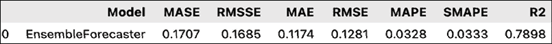

    图 7.44：使用测试集预测计算的得分

    然后，我们绘制测试集的预测图：

    ```py
    exp.plot_model(estimator=blended_model) 
    ```

    执行该代码片段会生成以下图表：

    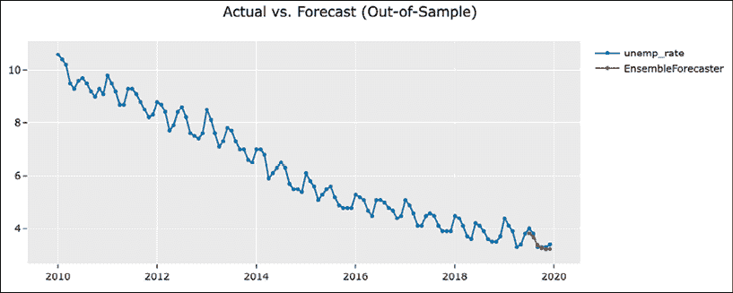

    图 7.45：时间序列及对测试集所做的预测

1.  完成模型：

    ```py
    final_model = exp.finalize_model(blended_model)
    exp.plot_model(final_model) 
    ```

    执行该代码片段会生成以下图表：

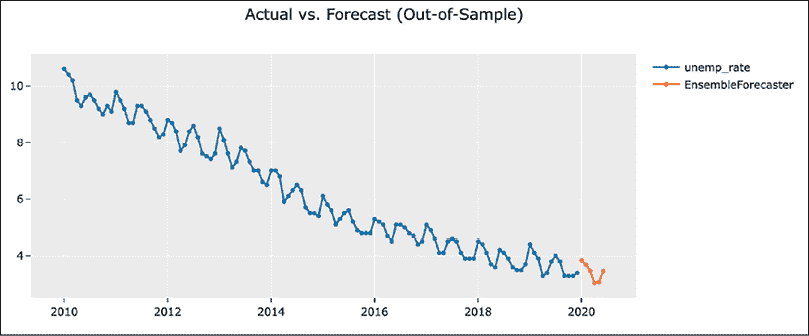

图 7.46：2020 年前 6 个月的样本外预测

仅凭图表来看，似乎预测是合理的，并且包含了一个清晰可识别的季节性模式。我们还可以生成并打印出我们在图表中已经看到的预测：

```py
y_pred = exp.predict_model(final_model)
print(y_pred) 
```

执行该代码片段会生成接下来 6 个月的预测结果：

```py
y_pred
2020-01  3.8437
2020-02  3.6852
2020-03  3.4731
2020-04  3.0444
2020-05  3.0711
2020-06  3.4585 
```

## 它是如何工作的……

导入库后，我们设置了实验。首先，我们实例化了 `TSForecastingExperiment` 类的一个对象。然后，我们使用 `setup` 方法为 DataFrame 提供时间序列、预测时间范围、交叉验证折数以及会话 ID。在我们的实验中，我们指定了要预测未来 6 个月，并且我们希望使用 5 折滚动验证，采用扩展窗口（默认变体）。也可以使用滑动窗口。

PyCaret 提供了两种 API：函数式 API 和面向对象式 API（使用类）。在本例中，我们展示了后者。

在设置实验时，我们还可以指示是否希望对目标时间序列应用某些转换。我们可以选择以下选项之一：`"box-cox"`、`"log"`、`"sqrt"`、`"exp"`、`"cos"`。

要从实验中提取训练集和测试集，我们可以使用以下命令：`exp.get_config("y_train")` 和 `exp.get_config("y_test")`。

在*步骤 3*中，我们使用`TSForecastingExperiment`对象的`plot_model`方法对时间序列进行了快速的探索性数据分析（EDA）。为了生成不同的图表，我们只需更改该方法的`plot`参数。

在*步骤 4*中，我们使用`TSForecastingExperiment`类的`check_stats`方法检查了多种统计检验。

在*步骤 5*中，我们使用`compare_models`方法训练了一系列统计学和机器学习模型，并使用选定的交叉验证方案评估它们的表现。我们指示要根据 MAPE 分数选择五个最佳的管道。我们设置了`turbo=False`，以便训练那些可能需要更多时间来训练的模型（例如，Prophet、BATS 和 TBATS）。

PyCaret 使用管道的概念，因为有时“模型”实际上是由多个步骤构建的。例如，我们可能会先去趋势并去季节化时间序列，然后再拟合回归模型。例如，`Random Forest w/ Cond. Deseasonalize & Detrending`模型是一个`sktime`管道，它首先对时间序列进行条件去季节化。然后，应用去趋势化，最后拟合减少的随机森林。去季节化的条件部分是首先通过统计测试检查时间序列中是否存在季节性。如果检测到季节性，则应用去季节化。

在这一阶段，有一些值得注意的事项：

+   我们可以使用`pull`方法提取带有性能比较的 DataFrame。

+   我们可以使用`models`方法打印所有可用模型的列表，以及它们的引用（指向原始库，因为 PyCaret 是一个包装器），并指示模型是否需要更多时间进行训练，并且是否被`turbo`标志隐藏。

+   我们还可以决定是否只训练某些模型（使用`compare_models`方法的`include`参数），或者是否训练所有模型，除了选择的几个（使用`exclude`参数）。

在*步骤 6*中，我们对最佳管道进行了调优。为此，我们使用列表推导式遍历已识别的管道，然后使用`tune_model`方法进行超参数调优。默认情况下，它使用随机网格搜索（在*第十三章*《应用机器学习：识别信用违约》中有更多介绍），并使用库的作者提供的超参数网格。这些参数作为一个良好的起点，如果我们想调整它们，可以很容易地做到。

在*步骤 7*中，我们创建了一个集成模型，它是五个最佳管道（调优后的版本）的组合。我们决定采用各个模型生成的预测值的均值。或者，我们也可以使用中位数或投票。后者是一种投票机制，每个模型根据提供的权重进行加权。例如，我们可以根据交叉验证误差创建权重，即误差越小，权重越大。

在*步骤 8*中，我们使用混合模型创建了预测。为此，我们使用了`predict_model`方法，并将混合模型作为该方法的参数。在此时，`predict_model`方法会为测试集生成预测。

我们还使用了已熟悉的`plot_model`方法来创建图表。当提供一个模型时，`plot_model`方法可以展示模型的样本内拟合情况、测试集上的预测、样本外预测或模型的残差。

类似于`plot_model`方法的情况，我们也可以结合已创建的模型使用`check_stats`方法。当我们传入估计器时，该方法会对模型的残差进行统计检验。

在*步骤 9*中，我们使用`finalize_model`方法最终确定了模型。正如我们在*步骤 8*中所见，我们获得的预测是针对测试集的。在 PyCaret 的术语中，最终确定模型意味着我们将之前阶段的模型（不更改已选超参数）带入，并使用整个数据集（包括训练集和测试集）重新训练该模型。这样，我们就可以为未来创建预测。

在最终确定模型后，我们使用相同的`predict_model`和`plot_model`方法来创建并绘制 2020 年前 6 个月的预测（这些数据不在我们的数据集内）。调用这些方法时，我们将最终确定的模型作为`estimator`参数传入。

## 还有更多内容……

PyCaret 是一个非常多功能的库，我们仅仅触及了它所提供的表面功能。为了简洁起见，我们只提到它的一些特性：

+   成熟的分类和回归 AutoML 能力。在这个教程中，我们只使用了时间序列模块。

+   时间序列的异常检测。

+   与 MLFlow 的集成，用于实验日志记录。

+   使用时间序列模块，我们可以轻松地训练单一模型，而不是所有可用模型。我们可以通过`create_model`方法做到这一点。作为`estimator`参数，我们需要传入模型的名称。我们可以通过`models`方法获取可用模型的名称。此外，依据所选模型，我们可能还需要传递一些额外的参数。例如，我们可能需要指定 ARIMA 模型的阶数参数。

+   正如我们在可用模型列表中看到的，除了经典的统计模型外，PyCaret 还提供了使用简化回归方法选择的机器学习模型。这些模型还会去趋势化并有条件地去季节化时间序列，从而使回归模型更容易捕捉数据的自回归特性。

你也许还想探索一下`autots`库，它是另一个用于时间序列预测的 AutoML 工具。

# 摘要

在这一章中，我们介绍了基于机器学习的时间序列预测方法。我们首先全面概述了与时间序列领域相关的验证方法。此外，其中一些方法是为了应对金融领域中验证时间序列预测的复杂性而设计的。

然后，我们探索了特征工程和降维回归的概念，这使我们能够使用任何回归算法来进行时间序列预测任务。最后，我们介绍了 Meta 的 Prophet 算法和 PyCaret——一个低代码工具，能够自动化机器学习工作流程。

在探索时间序列预测时，我们尝试介绍了最相关的 Python 库。然而，还有很多其他有趣的库值得一提。你可以在下面找到其中一些：

+   `autots`——AutoTS 是另一个时间序列预测的 AutoML 库。

+   `darts`——类似于`sktime`，它提供了一个完整的时间序列工作框架。该库包含了各种模型，从经典的 ARIMA 模型到用于时间序列预测的各种流行神经网络架构。

+   `greykite`——LinkedIn 的 Greykite 时间序列预测库，包括其 Silverkite 算法。

+   `kats`——Meta 开发的时间序列分析工具包。该库尝试提供一个一站式的时间序列分析平台，包括检测（例如变点）、预测、特征提取等任务。

+   `merlion`——Salesforce 的机器学习库，用于时间序列分析。

+   `orbit`——Uber 的贝叶斯时间序列预测和推理库。

+   `statsforecast`——这个库提供了一些流行的时间序列预测模型（例如 autoARIMA 和 ETS），并通过`numba`进一步优化以提高性能。

+   `stumpy`——一个高效计算矩阵配置文件的库，可用于许多时间序列相关任务。

+   `tslearn`——一个用于时间序列分析的工具包。

+   `tfp.sts`——TensorFlow Probability 中的一个库，用于使用结构化时间序列模型进行预测。

# 加入我们的 Discord 社区！

要加入本书的 Discord 社区——在这里你可以分享反馈、向作者提问并了解新版本发布——请扫描下面的二维码：


[`packt.link/ips2H`](https://packt.link/ips2H)
