# 8

# 多因子模型

本章专注于估算各种因子模型。**因子**是过去与（未来）股票回报相关的变量/属性，预计在未来仍然包含相同的预测信号。

这些风险因子可以被视为理解（预期）回报横截面的一种工具。这也是为什么各种**因子模型**被用来通过一个或多个因子解释某一资产或投资组合的超额回报（相对于无风险利率）。我们可以把这些因子看作是驱动超额回报的风险源。每个因子都有一个风险溢价，整体投资组合/资产的回报是这些溢价的加权平均值。

因子模型在投资组合管理中扮演着至关重要的角色，主要原因是：

+   它们可以用来识别可以加入投资组合的有趣资产，这反过来应当能带来表现更好的投资组合。

+   估算投资组合/资产对各因子的暴露有助于更好的风险管理。

+   我们可以使用这些模型来评估添加新风险因子的潜在增值。

+   它们使得投资组合优化变得更容易，因为通过较少的因素总结多个资产的收益，减少了估算协方差矩阵所需的数据量。

+   它们可以用来评估投资组合经理的表现——无论表现（相对于基准）是由于资产选择和交易时机，还是来自于对已知回报驱动因素（因子）的暴露。

本章结束时，我们将构建一些最流行的因子模型。我们将从最简单但非常流行的单因子模型开始（当考虑的因子是市场回报时，这与**资本资产定价模型**相同），然后解释如何估算更先进的三因子、四因子和五因子模型。我们还将涵盖这些因子代表什么的解释，并提供一个关于它们如何构建的高层次概述。

在本章中，我们将涵盖以下内容：

+   估算资本资产定价模型（CAPM）

+   估算 Fama-French 三因子模型

+   估算资产组合的滚动三因子模型

+   估算四因子和五因子模型

+   使用 Fama-MacBeth 回归估算横截面因子模型

# 估算资本资产定价模型（CAPM）

在本篇中，我们将学习如何估算著名的**资本资产定价模型**（**CAPM**）并获取β系数。该模型表示了风险资产的预期回报与市场风险（也称为系统性风险或不可分散风险）之间的关系。CAPM 可以视为一个单因子模型，基于该模型构建了更复杂的因子模型。

CAPM 由以下方程表示：

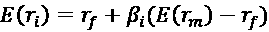

这里，*E*(*r*[i]) 表示资产 *i* 的预期回报，*r*[f] 是无风险利率（例如政府债券），*E*(*r*[m]) 是市场的预期回报，而 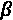 是贝塔系数。

**贝塔值**可以解释为资产回报对市场波动的敏感程度。以下是该系数的可能解释：

+   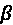 <= -1：资产与基准的方向相反，并且波动幅度大于基准的负值。

+   -1 <  < 0：资产与基准的方向相反。

+    = 0：资产价格波动与市场基准之间没有相关性。

+   0 <  < 1：资产与市场方向相同，但波动幅度较小。一个例子可能是那些不太容易受到日常波动影响的公司股票。

+   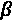 = 1：资产与市场在同一方向上以相同幅度波动。

+    > 1：资产与市场方向相同，但波动幅度较大。一个例子可能是那些对日常市场新闻非常敏感的公司股票。

CAPM 也可以表示为：

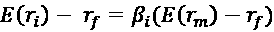

在此模型中，方程的左侧可以解释为风险溢价，而右侧包含市场溢价。同一方程还可以进一步重构为：

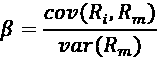

这里，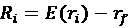 和 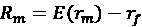。

在这个示例中，我们以亚马逊为例，假设标准普尔 500 指数代表市场。我们使用 5 年（2016 至 2020 年）的月度数据来估计贝塔值。在当前情况下，风险无风险利率非常低，因此为简化起见，我们假设它等于零。

## 如何操作...

执行以下步骤在 Python 中实现 CAPM：

1.  导入所需的库：

    ```py
    import pandas as pd
    import yfinance as yf
    import statsmodels.api as sm 
    ```

1.  指定风险资产、基准和时间范围：

    ```py
    RISKY_ASSET = "AMZN"
    MARKET_BENCHMARK = "^GSPC"
    START_DATE = "2016-01-01"
    END_DATE = "2020-12-31" 
    ```

1.  从 Yahoo Finance 下载所需的数据：

    ```py
    df = yf.download([RISKY_ASSET, MARKET_BENCHMARK],
                     start=START_DATE,
                     end=END_DATE,
                     adjusted=True,
                     progress=False) 
    ```

1.  将数据重采样为月度数据并计算简单收益：

    ```py
    X = (
        df["Adj Close"]
        .rename(columns={RISKY_ASSET: "asset", 
                         MARKET_BENCHMARK: "market"})
        .resample("M")
        .last()
        .pct_change()
        .dropna()
    ) 
    ```

1.  使用协方差方法计算贝塔值：

    ```py
    covariance = X.cov().iloc[0,1]
    benchmark_variance = X.market.var()
    beta = covariance / benchmark_variance 
    ```

    代码的结果是 `beta = 1.2035`。

1.  准备输入数据并通过线性回归估计 CAPM：

    ```py
    # separate target
    y = X.pop("asset")
    # add constant
    X = sm.add_constant(X)
    # define and fit the regression model
    capm_model = sm.OLS(y, X).fit()
    # print results
    print(capm_model.summary()) 
    ```

    *图 8.1* 显示了 CAPM 模型估计结果：

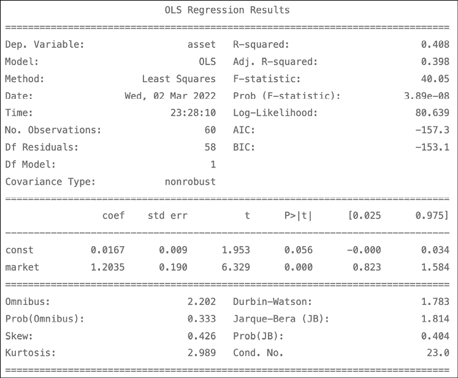

图 8.1：使用 OLS 估计的 CAPM 概述

这些结果表明贝塔值（这里代表市场）为 1.2，这意味着亚马逊的回报波动性是市场的 20%（由标准普尔 500 指数代理）。换句话说，亚马逊的（超额）回报预计将是市场（超额）回报的 1.2 倍。截距值相对较小，在 5% 显著性水平下统计上不显著。

## 它是如何工作的...

首先，我们指定了要使用的资产（亚马逊和标准普尔 500）及时间框架。在*第 3 步*中，我们从 Yahoo Finance 下载了数据。然后，我们只保留了每月最后一个可用的价格，并计算了每月回报率，即后续观测值之间的百分比变化。

在*第 5 步*中，我们计算了β值，它是风险资产与基准之间的协方差与基准方差的比率。

在*第 6 步*中，我们使用`pandas` DataFrame 的`pop`方法将目标（亚马逊的股票回报）和特征（标准普尔 500 回报）分离。之后，我们使用`add_constant`函数向特征中添加常数（实际上是向 DataFrame 中添加了一列 1）。

向回归中添加截距的想法是研究——在估计模型之后——截距（在 CAPM 模型中也称为**詹森的阿尔法**）是否为零。如果它是正值并且显著，意味着——假设 CAPM 模型成立——该资产或投资组合产生了异常高的风险调整回报。这个问题有两种可能的含义：要么市场是无效的，要么有其他尚未发现的风险因子应该被纳入模型中。这个问题被称为**联合假设问题**。

我们也可以使用公式表示法，它会自动添加常数。为此，我们必须导入`statsmodels.formula.api`作为`smf`，然后运行稍微修改过的代码行：`capm_model = smf.ols(formula="asset ~ market", data=X).fit()`。这两种方法的结果是相同的。你可以在随附的 Jupyter notebook 中找到完整的代码。

最后，我们进行了 OLS 回归并打印了总结。这里，我们可以看到市场变量（即 CAPM β值）的系数等于在*第 5 步*中通过资产与市场之间的协方差计算得出的β值。

## 还有更多内容...

在上述示例中，我们假设没有无风险利率，这是现在做出的合理假设。然而，也可能存在我们希望考虑非零无风险利率的情况。为此，我们可以使用以下几种方法之一。

### 使用 Kenneth French 教授网站的数据

市场溢价（*r*[m] - *r*[f]）和无风险利率（由一个月期国库券近似）可以从 Kenneth French 教授的网站下载（有关链接，请参见本食谱的*另请参阅*部分）。

请记住，Prof. French 使用的市场基准的定义与标准普尔 500 指数不同——有关详细描述，请参见他的网站。有关如何轻松下载数据的说明，请参考*实施法马-法 rench 三因子模型*的食谱。

### 使用 13 周期国债券

第二个选择是通过例如 13 周期（3 个月）国债券（Yahoo Finance 代码：`^IRX`）来近似无风险利率。

按照以下步骤学习如何下载数据并将其转换为适当的无风险利率：

1.  定义周期的天数长度：

    ```py
    N_DAYS = 90 
    ```

1.  从雅虎财经下载数据：

    ```py
    df_rf = yf.download("^IRX",
                        start=START_DATE,
                        end=END_DATE,
                        progress=False) 
    ```

1.  将数据重新采样为按月频率（每月取最后一个值）：

    ```py
    rf = df_rf.resample("M").last().Close / 100 
    ```

1.  计算无风险回报（以日值表示），并将值转换为月度：

    ```py
    rf = ( 1 / (1 - rf * N_DAYS / 360) )**(1 / N_DAYS)  
    rf = (rf ** 30) - 1 
    ```

1.  绘制计算出的无风险利率图表：

    ```py
    rf.plot(title="Risk-free rate (13-Week Treasury Bill)") 
    ```

    *图 8.2*显示了无风险利率随时间变化的可视化图：

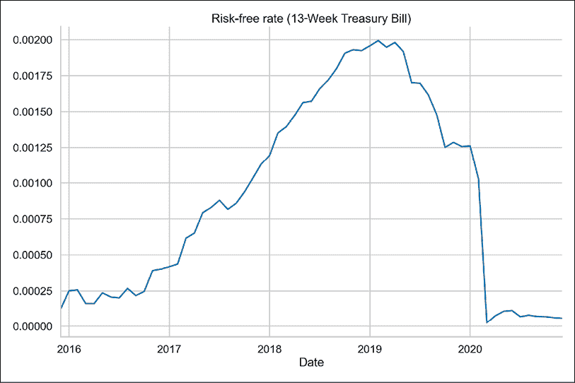

图 8.2：使用 13 周期国库券计算的无风险利率

### 使用 FRED 数据库中的 3 个月期国库券

最后一种方法是使用 3 个月期国库券（次级市场利率）来近似无风险利率，数据可以从**美联储经济数据**（**FRED**）数据库下载。

按照以下步骤学习如何下载数据并将其转换为月度无风险利率：

1.  导入库：

    ```py
    import pandas_datareader.data as web 
    ```

1.  从 FRED 数据库下载数据：

    ```py
    rf = web.DataReader(
        "TB3MS", "fred", start=START_DATE, end=END_DATE
    ) 
    ```

1.  将获得的无风险利率转换为月度值：

    ```py
    rf = (1 + (rf / 100)) ** (1 / 12) - 1 
    ```

1.  绘制计算出的无风险利率图表：

    ```py
    rf.plot(title="Risk-free rate (3-Month Treasury Bill)") 
    ```

    我们可以通过比较无风险利率的图表来对比两种方法的结果：

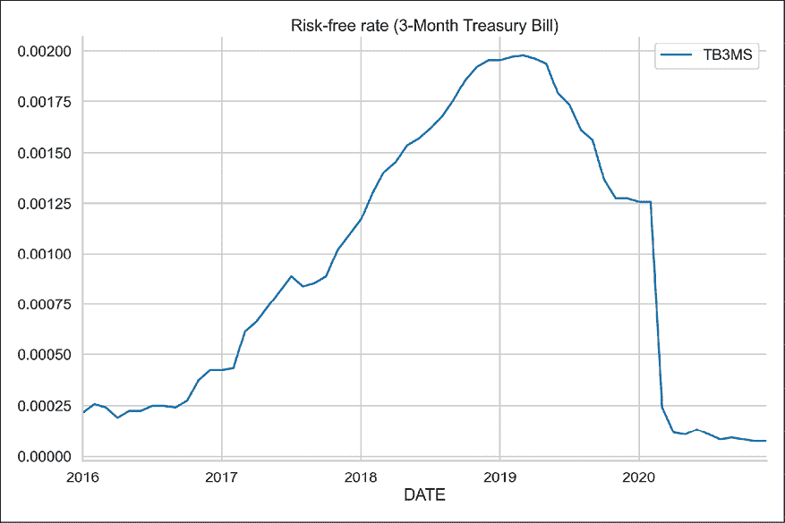

图 8.3：使用 3 个月期国库券计算的无风险利率

上述分析让我们得出结论，图表看起来非常相似。

## 另见

额外的资源可以在此处找到：

+   Sharpe, W. F., “资本资产定价：在风险条件下的市场均衡理论，” *金融学杂志*，19，3（1964）：425–442。

+   Prof. Kenneth French 网站上的无风险利率数据：[`mba.tuck.dartmouth.edu/pages/faculty/ken.french/ftp/F-F_Research_Data_Factors_CSV.zip`](http://mba.tuck.dartmouth.edu/pages/faculty/ken.french/ftp/F-F_Research_Data_Factors_CSV.zip)。

# 估算 Fama-French 三因子模型

在他们的著名论文中，Fama 和 French 通过增加两个额外的因子扩展了 CAPM 模型，用以解释资产或投资组合的超额回报。他们考虑的因子包括：

+   **市场因子**（MKT）：它衡量市场的超额回报，类似于资本资产定价模型（CAPM）中的回报。

+   **规模因子**（SMB；小市值减大市值）：它衡量的是小市值股票相对于大市值股票的超额回报。

+   **价值因子**（HML；高市账比减低市账比）：它衡量价值股相对于成长股的超额回报。价值股具有较高的账面市值比，而成长股的市账比较低。

请参见*另见*部分，了解因子的计算方法。

该模型可以表示如下：

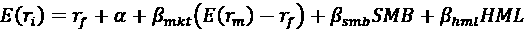

或者以更简单的形式：

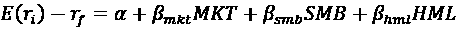

这里，E(r[i])表示资产*i*的预期回报，r[f]是无风险利率（如政府债券），而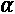是截距项。包括截距项的原因是为了确保它的值为 0。这证明三因子模型正确地评估了超额回报与因子之间的关系。

在统计上显著且不为零的截距项的情况下，模型可能无法正确评估资产/投资组合的回报。然而，作者表示，即使模型未能通过统计检验，三因子模型依然是“相当正确的”。

由于这种方法的流行，这些因素被统称为**法马-弗伦奇因素**或**三因子模型**。它们在学术界和行业中被广泛接受作为股市基准，并且经常被用来评估投资表现。

在这个示例中，我们使用 2016 年到 2020 年的 5 年苹果股票的月度回报来估计三因子模型。

## 如何做...

按照以下步骤在 Python 中实现三因子模型：

1.  导入库：

    ```py
    import pandas as pd
    import yfinance as yf
    import statsmodels.formula.api as smf
    import pandas_datareader.data as web 
    ```

1.  定义参数：

    ```py
    RISKY_ASSET = "AAPL"
    START_DATE = "2016-01-01"
    END_DATE = "2020-12-31" 
    ```

1.  下载包含风险因子的数据集：

    ```py
    ff_dict = web.DataReader("F-F_Research_Data_Factors",
                             "famafrench",
                             start=START_DATE,
                             end=END_DATE) 
    ```

    下载的字典包含三个元素：请求时间框架内的月度因子（索引为`0`）、相应的年度因子（索引为`1`）以及数据集的简短描述（索引为`DESCR`）。

1.  选择合适的数据集并将值除以 100：

    ```py
    factor_3_df = ff_dict[0].rename(columns={"Mkt-RF": "MKT"}) \
                            .div(100)
    factor_3_df.head() 
    ```

    结果数据应如下所示：

    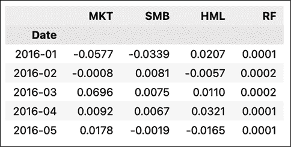

    图 8.4：下载的因子预览

1.  下载风险资产的价格：

    ```py
    asset_df = yf.download(RISKY_ASSET,
                           start=START_DATE,
                           end=END_DATE,
                           adjusted=True) 
    ```

1.  计算风险资产的月度回报：

    ```py
    y = asset_df["Adj Close"].resample("M") \
                             .last() \
                             .pct_change() \
                             .dropna()
    y.index = y.index.to_period("m")
    y.name = "rtn" 
    ```

1.  合并数据集并计算超额回报：

    ```py
    factor_3_df = factor_3_df.join(y)
    factor_3_df["excess_rtn"] = (
        factor_3_df["rtn"] - factor_3_df["RF"]
    ) 
    ```

1.  估计三因子模型：

    ```py
    ff_model = smf.ols(formula="excess_rtn ~ MKT + SMB + HML",
                       data=factor_3_df).fit()
    print(ff_model.summary()) 
    ```

    三因子模型的结果如下所示：

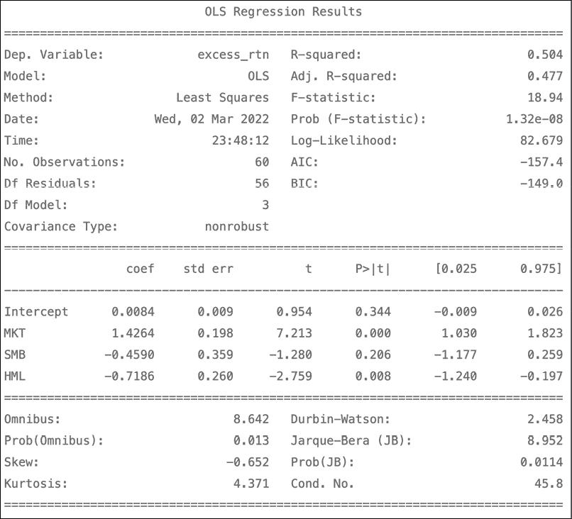

图 8.5：估计的三因子模型摘要

在解释三因子模型的结果时，我们应关注两个问题：

+   截距是否为正且在统计上显著

+   哪些因素在统计上是显著的，并且它们的方向是否与过去的结果（例如，基于文献研究）或我们的假设一致

在我们的案例中，截距项为正，但在 5%的显著性水平下并不显著。在风险因子中，只有 SMB 因子不显著。然而，仍需要进行详细的文献研究，以便对这些因子及其影响方向提出假设。

我们还可以查看回归摘要中呈现的 F 统计量，它用于检验回归的联合显著性。原假设认为，除了截距项之外，所有特征（在此情况下为因子）的系数值均为 0。我们可以看到，相应的*p*值远小于 0.05，这使我们有理由在 5%的显著性水平下拒绝原假设。

## 它是如何工作的...

在前两步中，我们导入了所需的库并定义了参数——风险资产（苹果股票）和考虑的时间范围。

在*步骤 3*中，我们使用 `pandas_datareader` 库的功能下载了数据。我们必须指定要使用的数据集（有关检查可用数据集的信息，请参见*还有更多...*部分）和读取器（`famafrench`），以及起始/结束日期（默认情况下，`web.DataReader` 下载的是过去 5 年的数据）。

在*步骤 4*中，我们仅选择了包含月度数据的数据集（在下载的字典中索引为`0`），重命名了包含 MKT 因子的列，并将所有值除以 100。我们这样做是为了正确编码百分比；例如，数据集中值为 3.45 的表示 3.45%。

在*步骤 5*和*步骤 6*中，我们下载并处理了苹果股票的价格。通过计算月末价格的百分比变化，我们得到了月度收益。在*步骤 6*中，我们还将指数的格式更改为`%Y-%m`（例如，`2000-12`），因为 Fama-French 因子包含的是这种格式的日期。然后，在*步骤 7*中，我们将两个数据集合并。

最后，在*步骤 8*中，我们使用公式符号运行了回归——在执行时，我们不需要手动添加截距。值得一提的是，MKT 变量的系数将不等于 CAPM 的贝塔，因为模型中还有其他因子，且这些因子对超额收益的影响分布不同。

## 还有更多...

我们可以使用以下代码片段查看哪些来自 Fama-French 类别的数据集可供通过`pandas_datareader`下载。为了简洁起见，我们只展示了大约 300 个可用数据集中的 5 个：

```py
from pandas_datareader.famafrench import get_available_datasets
get_available_datasets()[:5] 
```

运行代码片段会返回以下列表：

```py
['F-F_Research_Data_Factors',
 'F-F_Research_Data_Factors_weekly',
 'F-F_Research_Data_Factors_daily',
 'F-F_Research_Data_5_Factors_2x3',
 'F-F_Research_Data_5_Factors_2x3_daily'] 
```

在本书的前一版中，我们还展示了如何使用简单的 Bash 命令直接从 French 教授的网站下载 CSV 文件，并在 Jupyter notebook 中执行。您可以在随附的 notebook 中找到解释如何操作的代码。

## 另见

其他资源：

+   有关所有因子是如何计算的详细信息，请参考 French 教授的网站：[`mba.tuck.dartmouth.edu/pages/faculty/ken.french/Data_Library/f-f_factors.html`](http://mba.tuck.dartmouth.edu/pages/faculty/ken.french/Data_Library/f-f_factors.html)

+   Fama, E. F. 和 French, K. R.，“*股票和债券收益中的共同风险因素*”，《金融经济学期刊》，33 卷，1 期（1993 年）：3-56

# 在资产组合上估计滚动三因子模型

在本食谱中，我们学习如何以滚动的方式估算三因子模型。我们所说的滚动是指，我们始终考虑一个固定大小的估算窗口（在本例中为 60 个月），并将其按期滚动整个数据集。进行此类实验的一个潜在原因是为了测试结果的稳定性。或者，我们也可以使用扩展窗口进行此实验。

与之前的食谱不同，这一次我们使用的是投资组合回报，而不是单一资产。为了简化，我们假设我们的配置策略是将投资组合总价值的相等份额分配到以下股票：亚马逊、谷歌、苹果和微软。对于这项实验，我们使用的是 2010 到 2020 年的股票价格。

## 如何做...

按照以下步骤在 Python 中实现滚动三因子模型：

1.  导入库：

    ```py
    import pandas as pd
    import numpy as np
    import yfinance as yf
    import statsmodels.formula.api as smf
    import pandas_datareader.data as web 
    ```

1.  定义参数：

    ```py
    ASSETS = ["AMZN", "GOOG", "AAPL", "MSFT"]
    WEIGHTS = [0.25, 0.25, 0.25, 0.25]
    START_DATE = "2010-01-01"
    END_DATE = "2020-12-31" 
    ```

1.  下载因子相关数据：

    ```py
    factor_3_df = web.DataReader("F-F_Research_Data_Factors",
                                 "famafrench",
                                 start=START_DATE,
                                 end=END_DATE)[0]
    factor_3_df = factor_3_df.div(100) 
    ```

1.  从 Yahoo Finance 下载风险资产的价格：

    ```py
    asset_df = yf.download(ASSETS,
                           start=START_DATE,
                           end=END_DATE,
                           adjusted=True,
                           progress=False) 
    ```

1.  计算风险资产的月度回报：

    ```py
    asset_df = asset_df["Adj Close"].resample("M") \
                                    .last() \
                                    .pct_change() \
                                    .dropna()
    asset_df.index = asset_df.index.to_period("m") 
    ```

1.  计算投资组合回报：

    ```py
    asset_df["portfolio_returns"] = np.matmul(
        asset_df[ASSETS].values, WEIGHTS
    ) 
    ```

1.  合并数据集：

    ```py
    factor_3_df = asset_df.join(factor_3_df).drop(ASSETS, axis=1)
    factor_3_df.columns = ["portf_rtn", "mkt", "smb", "hml", "rf"]
    factor_3_df["portf_ex_rtn"] = (
        factor_3_df["portf_rtn"] - factor_3_df["rf"]
    ) 
    ```

1.  定义一个滚动*n*因子模型的函数：

    ```py
    def  rolling_factor_model(input_data, formula, window_size):

        coeffs = []
        for start_ind in range(len(input_data) - window_size + 1):        
            end_ind = start_ind + window_size

            ff_model = smf.ols(
                formula=formula, 
                data=input_data[start_ind:end_ind]
            ).fit()

            coeffs.append(ff_model.params)

        coeffs_df = pd.DataFrame(
            coeffs,
            index=input_data.index[window_size - 1:]
        )
        return coeffs_df 
    ```

    如需带有输入/输出说明的版本，请参考本书的 GitHub 仓库。

1.  估算滚动三因子模型并绘制结果：

    ```py
    MODEL_FORMULA = "portf_ex_rtn ~ mkt + smb + hml"
    results_df = rolling_factor_model(factor_3_df,
                                      MODEL_FORMULA,
                                      window_size=60)
    (
        results_df
        .plot(title = "Rolling Fama-French Three-Factor model",
              style=["-", "--", "-.", ":"])
        .legend(loc="center left",bbox_to_anchor=(1.0, 0.5))
    ) 
    ```

    执行代码会生成以下图表：

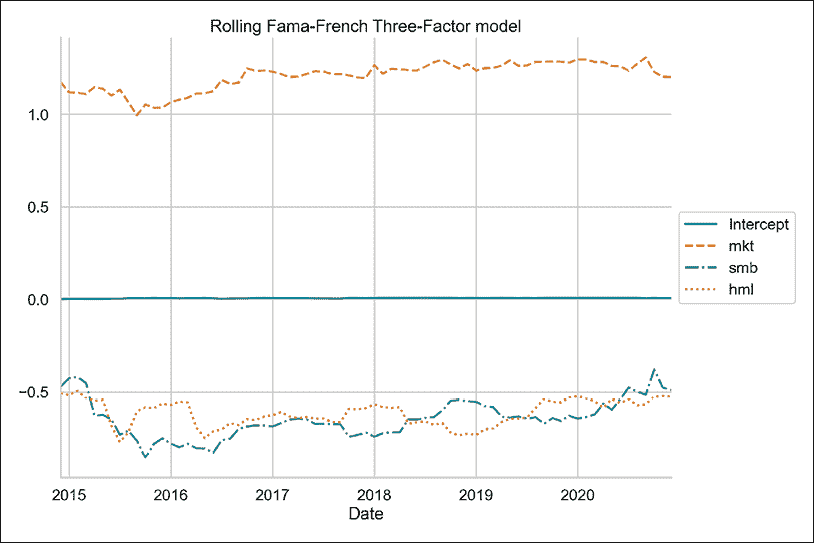

图 8.6：滚动三因子模型的系数

通过检查前面的图表，我们可以看到以下内容：

+   截距几乎保持不变，且非常接近 0。

+   因子之间存在一定的波动性，但没有突如其来的反转或意外的跳跃。

## 它是如何工作的...

在*步骤 3*和*步骤 4*中，我们使用`pandas_datareader`和`yfinance`下载了数据。这与我们在*估计 Fama-French 三因子模型*的食谱中做的非常相似，因此在这一点上我们不会详细讲解。

在*步骤 6*中，我们将投资组合回报计算为投资组合成分（在*步骤 5*中计算）的加权平均值。这是可能的，因为我们正在使用简单回报——更多细节请参考*第二章*《数据预处理》中的*将价格转换为回报*食谱。请记住，这种简单的方法假设在每个月结束时，我们的资产配置始终与所指示的权重相同。这个可以通过**投资组合再平衡**来实现，即在指定时间段后调整配置，以始终匹配预定的权重分布。

之后，我们在*第 7 步*中合并了这两个数据集。在*第 8 步*中，我们定义了一个函数，用于使用滚动窗口估算*n*因子模型。其主要思想是遍历我们在前面步骤中准备的 DataFrame，并为每个月估算法马-法 rench 模型，使用过去五年的数据（60 个月）。通过适当地切片输入的 DataFrame，我们确保从第 60 个月开始估算模型，以确保我们始终有一个完整的观察窗口。

正确的软件工程最佳实践建议编写一些断言，以确保输入的类型符合我们的预期，或者输入的 DataFrame 包含必要的列。然而，为了简洁起见，我们在此没有进行这些操作。

最后，我们将定义的函数应用于准备好的 DataFrame，并绘制了结果。

# 估算四因子和五因子模型

在本食谱中，我们实现了法马-法 rench 三因子模型的两个扩展。

首先，**Carhart 的四因子模型**：该扩展的基本假设是，在短时间内，赢家股票会继续是赢家，而输家股票会继续是输家。一个用来分类赢家和输家的标准可能是过去 12 个月的累计总回报。确定两组之后，我们在一定的持有期内做多赢家，做空输家。

**动量因子**（WML；赢家减去输家）衡量过去 12 个月赢家股票相对于输家股票的超额回报（有关动量因子计算的参考，请参见本食谱中的*另见*部分）。

四因子模型可以表达为如下：

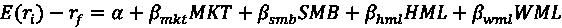

第二个扩展是**法马-法 rench 的五因子模型**。法马和法 rench 通过添加两个因子扩展了他们的三因子模型：

+   **盈利能力因子**（RMW；强盈利减弱盈利）衡量高利润率（强盈利能力）公司的超额回报，相对于那些利润较低（弱盈利能力）的公司。

+   **投资因子**（CMA；保守投资减激进投资）衡量投资政策保守（低投资）的公司相对于那些投资更多（激进投资）公司的超额回报。

五因子模型可以表达为如下：

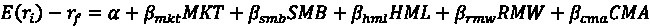

与所有因子模型一样，如果风险因子的暴露捕捉到所有预期回报的可能变化，那么所有资产/投资组合的截距（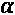）应该等于零。

在本食谱中，我们使用四因子和五因子模型解释了 2016 年至 2020 年期间亚马逊的月度回报。

## 如何操作...

按照以下步骤在 Python 中实现四因子和五因子模型：

1.  导入库：

    ```py
    import pandas as pd
    import yfinance as yf
    import statsmodels.formula.api as smf
    import pandas_datareader.data as web 
    ```

1.  指定风险资产和时间范围：

    ```py
    RISKY_ASSET = "AMZN"
    START_DATE = "2016-01-01"
    END_DATE = "2020-12-31" 
    ```

1.  从法马教授的官方网站下载风险因子：

    ```py
    # three factors
    factor_3_df = web.DataReader("F-F_Research_Data_Factors",
                                 "famafrench",
                                 start=START_DATE,
                                 end=END_DATE)[0]
    # momentum factor
    momentum_df = web.DataReader("F-F_Momentum_Factor",
                                 "famafrench",
                                 start=START_DATE,
                                 end=END_DATE)[0]
    # five factors
    factor_5_df = web.DataReader("F-F_Research_Data_5_Factors_2x3",
                                 "famafrench",
                                 start=START_DATE,
                                 end=END_DATE)[0] 
    ```

1.  从 Yahoo Finance 下载风险资产的数据：

    ```py
    asset_df = yf.download(RISKY_ASSET,
                           start=START_DATE,
                           end=END_DATE,
                           adjusted=True,
                           progress=False) 
    ```

1.  计算月度回报：

    ```py
    y = asset_df["Adj Close"].resample("M") \
                             .last() \
                             .pct_change() \
                             .dropna()
    y.index = y.index.to_period("m")
    y.name = "rtn" 
    ```

1.  合并四因子模型的数据集：

    ```py
    # join all datasets on the index
    factor_4_df = factor_3_df.join(momentum_df).join(y)
    # rename columns
    factor_4_df.columns = ["mkt", "smb", "hml", "rf", "mom", "rtn"]
    # divide everything (except returns) by 100
    factor_4_df.loc[:, factor_4_df.columns != "rtn"] /= 100
    # calculate excess returns
    factor_4_df["excess_rtn"] = (
        factor_4_df["rtn"] - factor_4_df["rf"]
    ) 
    ```

1.  合并五因子模型的数据集：

    ```py
    # join all datasets on the index
    factor_5_df = factor_5_df.join(y)
    # rename columns
    factor_5_df.columns = [
        "mkt", "smb", "hml", "rmw", "cma", "rf", "rtn"
    ]
    # divide everything (except returns) by 100
    factor_5_df.loc[:, factor_5_df.columns != "rtn"] /= 100
    # calculate excess returns
    factor_5_df["excess_rtn"] = (
        factor_5_df["rtn"] - factor_5_df["rf"]
    ) 
    ```

1.  估计四因子模型：

    ```py
    four_factor_model = smf.ols(
        formula="excess_rtn ~ mkt + smb + hml + mom",
        data=factor_4_df
    ).fit()
    print(four_factor_model.summary()) 
    ```

    *图 8.7* 显示了结果：

    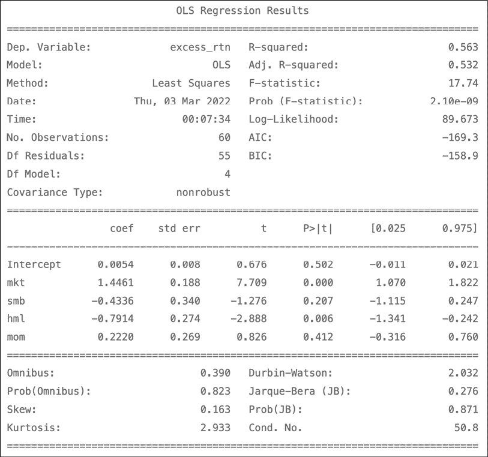

    图 8.7：四因子模型估计结果的总结

1.  估计五因子模型：

    ```py
    five_factor_model = smf.ols(
        formula="excess_rtn ~ mkt + smb + hml + rmw + cma",
        data=factor_5_df
    ).fit()
    print(five_factor_model.summary()) 
    ```

    *图 8.8* 显示了结果：

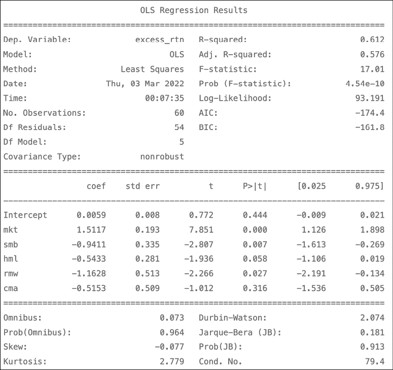

图 8.8：五因子模型估计结果的总结

根据五因子模型，亚马逊的超额收益与大多数因素（除了市场因素）呈负相关。这里，我们提供了一个系数解释的例子：市场因素增加 1 个百分点，导致超额收益增加 0.015 个百分点。换句话说，对于市场因素的 1%收益，我们可以预期我们的投资组合（亚马逊股票）将超过无风险利率回报 1.5117 * 1%。

类似于三因子模型，如果五因子模型完全解释了超额股票收益，估计的截距应该在统计上与零无显著差异（对于所考虑的问题来说，确实是这种情况）。

## 它是如何工作的...

在*步骤 2*中，我们定义了参数——所考虑的股票的代码和时间范围。

在*步骤 3*中，我们使用`pandas_datareader`下载了所需的数据集，它为我们提供了一种方便的方式来下载与风险因子相关的数据，而无需手动下载 CSV 文件。有关此过程的更多信息，请参阅*估计法马-法兰西三因子模型*的食谱。

在*步骤 4*和*步骤 5*中，我们下载了亚马逊的股票价格，并使用先前解释的方法计算了月度回报。

在*步骤 6*和*步骤 7*中，我们合并了所有数据集，重命名了列，并计算了超额收益。当使用`join`方法而不指定连接条件（即`on`参数）时，默认情况下使用 DataFrame 的索引进行连接。

这样，我们准备了四因子和五因子模型所需的所有输入。我们还需要将从法兰西教授网站下载的所有数据除以 100，以得到正确的尺度。

五因子数据集中的 SMB 因子计算方法与三因子数据集中的计算方法不同。有关更多详细信息，请参阅本食谱中“另请参见”部分的链接。

在*步骤 8*和*步骤 9*中，我们使用`statsmodels`库中的 OLS 回归的函数形式来估计模型。函数形式会自动将截距添加到回归方程中。

## 另请参见

有关因子计算的详细信息，请参见以下链接：

+   动量因子： [`mba.tuck.dartmouth.edu/pages/faculty/ken.french/Data_Library/det_mom_factor.html`](https://mba.tuck.dartmouth.edu/pages/faculty/ken.french/Data_Library/det_mom_factor.html)

+   五因子模型： [`mba.tuck.dartmouth.edu/pages/faculty/ken.french/Data_Library/f-f_5_factors_2x3.html`](https://mba.tuck.dartmouth.edu/pages/faculty/ken.french/Data_Library/f-f_5_factors_2x3.html)

对于介绍四因子和五因子模型的论文，请参考以下链接：

+   Carhart, M. M. (1997), “*On Persistence in Mutual Fund Performance*,” The Journal of Finance, 52, 1 (1997): 57-82

+   Fama, E. F. 和 French, K. R. 2015 年. “五因子资产定价模型,”《金融经济学杂志》，116(1): 1-22：[`doi.org/10.1016/j.jfineco.2014.10.010`](https://doi.org/10.1016/j.jfineco.2014.10.010)

# 使用 Fama-MacBeth 回归估算横截面因子模型

在之前的步骤中，我们已经涵盖了使用单一资产或投资组合作为因变量来估算不同因子模型。然而，我们也可以使用横截面（面板）数据来一次估算多个资产的因子模型。

按照这种方法，我们可以：

+   估算投资组合对风险因素的敞口，并了解这些因素对投资组合回报的影响

+   通过了解市场为某一因子的暴露支付的溢价，理解承担特定风险的价值

知道风险溢价后，只要我们能够近似该投资组合对风险因素的敞口，就可以估算任何投资组合的回报。

在估计横截面回归时，由于某些线性回归假设可能不成立，我们可能会遇到多种问题。可能遇到的问题包括：

+   异方差性和序列相关性，导致残差的协方差

+   多重共线性

+   测量误差

为了解决这些问题，我们可以使用一种叫做**Fama-MacBeth 回归**的技术，这是一种专门设计的两步法，用于估计市场对某些风险因素暴露所奖励的溢价。

步骤如下：

1.  通过估计*N*（投资组合/资产的数量）次序列回归，获取因子载荷：

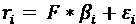

1.  通过估算*T*（时期的数量）横截面回归，每个时期一个，获得风险溢价：

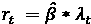

在本步骤中，我们使用五个风险因子和 12 个行业投资组合的回报来估算 Fama-MacBeth 回归，数据也可以在法兰西教授的网站上获得。

## 如何操作……

执行以下步骤来估算 Fama-MacBeth 回归：

1.  导入库：

    ```py
    import pandas as pd
    import pandas_datareader.data as web
    from linearmodels.asset_pricing import LinearFactorModel 
    ```

1.  指定时间范围：

    ```py
    START_DATE = "2010"
    END_DATE = "2020-12" 
    ```

1.  从法兰西教授的网站下载并调整风险因素：

    ```py
    factor_5_df = (
        web.DataReader("F-F_Research_Data_5_Factors_2x3",
                       "famafrench",
                       start=START_DATE,
                       end=END_DATE)[0]
        .div(100)
    ) 
    ```

1.  从法兰西教授的网站下载并调整 12 个行业投资组合的回报：

    ```py
    portfolio_df = (
        web.DataReader("12_Industry_Portfolios",
                       "famafrench",
                       start=START_DATE,
                       end=END_DATE)[0]
        .div(100)
        .sub(factor_5_df["RF"], axis=0)
    ) 
    ```

1.  从因子数据集中去除无风险利率：

    ```py
    factor_5_df = factor_5_df.drop("RF", axis=1) 
    ```

1.  估算 Fama-MacBeth 回归并打印摘要：

    ```py
    five_factor_model = LinearFactorModel(
        portfolios=portfolio_df,
        factors=factor_5_df
    )
    result = five_factor_model.fit()
    print(result) 
    ```

    运行代码片段将生成以下摘要：

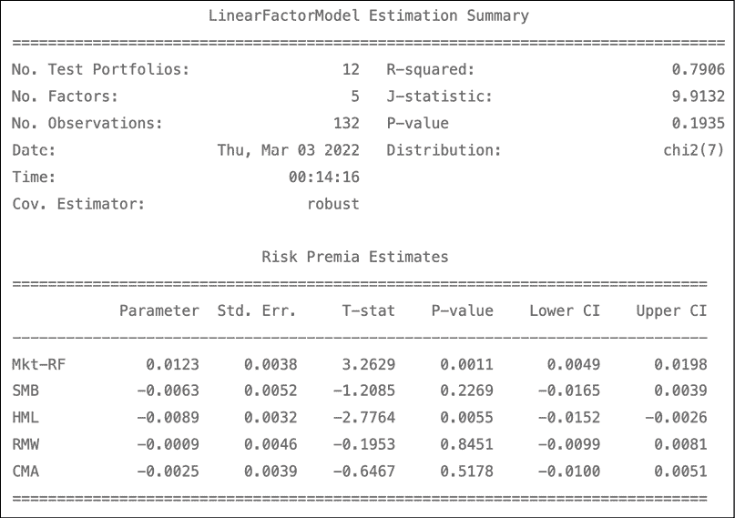

图 8.9：Fama-MacBeth 回归的结果

表中的结果是来自*T*横截面回归的平均风险溢价。

我们还可以打印完整的总结（包括风险溢价和每个投资组合的因子负荷）。为此，我们需要运行以下代码：

```py
print(result.full_summary) 
```

## 它是如何工作的……

在前两步中，我们导入了所需的库，并定义了我们的练习的开始和结束日期。总共，我们将使用 11 年的月度数据，共计 132 个变量观察值（记作*T*）。对于结束日期，我们必须指定`2020-12`。仅使用`2020`将导致下载的数据集在 2020 年 1 月结束。

在*步骤 3*中，我们使用`pandas_datareader`下载了五因子数据集。我们通过将数值除以 100 来调整这些值，以表示百分比。

在*步骤 4*中，我们从法兰西教授的网站下载了 12 个行业投资组合的回报数据（更多数据集详情请参见*另见*部分中的链接）。我们还通过将数值除以 100 来调整这些值，并通过从每个投资组合数据集的列中减去无风险利率（该数据可在因子数据集中找到）来计算超额回报。由于时间段完全匹配，我们可以轻松地使用`sub`方法进行计算。

在*步骤 5*中，我们去除了无风险利率，因为我们将不再使用它，而且没有冗余列的数据框（DataFrame）将使得估计 Fama-MacBeth 回归模型更加简便。

在最后一步中，我们实例化了`LinearFactorModel`类的对象，并将两个数据集作为参数提供。然后，我们使用`fit`方法估计了模型。最后，我们打印了总结。

你可能会注意到`linearmodels`和`scikit-learn`之间存在一些小差异。在后者中，我们在调用`fit`方法时提供数据。而在`linearmodels`中，我们必须在创建`LinearFactorModel`类的实例时提供数据。

在`linearmodels`中，你还可以使用公式符号（就像我们在使用`statsmodels`估计因子模型时做的那样）。为此，我们需要使用`from_formula`方法。一个例子可能如下所示：`LinearFactorModel.from_formula(formula, data)`，其中`formula`是包含公式的字符串，而`data`是一个包含投资组合/资产和因子的对象。

## 还有更多……

我们已经使用`linearmodels`库估计了 Fama-MacBeth 回归。然而，亲自手动执行这两个步骤可能有助于加深我们对该过程的理解。

执行以下步骤，将 Fama-MacBeth 程序的两个步骤分别进行：

1.  导入库：

    ```py
    from statsmodels.api import OLS, add_constant 
    ```

1.  对于 Fama-MacBeth 回归的第一步，估计因子负荷：

    ```py
    factor_loadings = []
    for portfolio in portfolio_df:
        reg_1 = OLS(
            endog=portfolio_df.loc[:, portfolio],
            exog=add_constant(factor_5_df)
        ).fit()
        factor_loadings.append(reg_1.params.drop("const")) 
    ```

1.  将因子负荷存储在数据框中：

    ```py
    factor_load_df = pd.DataFrame(
        factor_loadings, 
        columns=factor_5_df.columns, 
        index=portfolio_df.columns
    )
    factor_load_df.head() 
    ```

    运行代码会生成包含因子负荷的以下表格：

    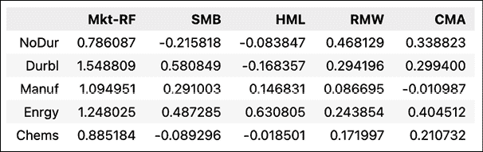

    图 8.10：Fama-MacBeth 回归的第一步——估计的因子负荷

    我们可以将这些数字与`linearmodels`库的完整总结的输出进行比较。

1.  对于 Fama-MacBeth 回归的第二步，估计风险溢价：

    ```py
    risk_premia = []
    for period in portfolio_df.index:
        reg_2 = OLS(
            endog=portfolio_df.loc[period, factor_load_df.index], 
            exog=factor_load_df
        ).fit()
        risk_premia.append(reg_2.params) 
    ```

1.  将风险溢价存储在 DataFrame 中：

    ```py
    risk_premia_df = pd.DataFrame(
        risk_premia, 
        index=portfolio_df.index,
        columns=factor_load_df.columns.tolist())
    risk_premia_df.head() 
    ```

    运行代码会生成以下包含风险溢价随时间变化的表格：

    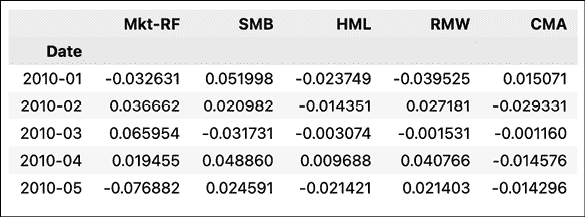

    图 8.11：Fama-MacBeth 回归的第二步——随时间变化的估计风险溢价

1.  计算平均风险溢价：

    ```py
    risk_premia_df.mean() 
    ```

    运行代码片段返回：

    ```py
    Mkt-RF    0.012341
    SMB      -0.006291
    HML      -0.008927
    RMW      -0.000908
    CMA      -0.002484 
    ```

上述计算的风险溢价与从 `linearmodels` 库中得到的结果相匹配。

## 另见

+   `linearmodels` 库的文档是学习面板回归模型的一个很好的资源（不仅仅是这些，它还包含工具来处理工具变量模型等），并展示了如何在 Python 中实现这些模型：[`bashtage.github.io/linearmodels/index.html`](https://bashtage.github.io/linearmodels/index.html)

+   12 个行业投资组合数据集的描述：[`mba.tuck.dartmouth.edu/pages/faculty/ken.french/data_library/det_12_ind_port.html`](https://mba.tuck.dartmouth.edu/pages/faculty/ken.french/data_library/det_12_ind_port.html)

关于 Fama-MacBeth 程序的进一步阅读：

+   Fama, E. F., 和 MacBeth, J. D., “*风险、回报与均衡：实证检验*,” 《政治经济学杂志》, 81, 3 (1973): 607-636

+   Fama, E. F., “*市场效率、长期收益与行为金融*,” 《金融经济学杂志》, 49, 3 (1998): 283-306

# 总结

在本章中，我们构建了一些最流行的因子模型。我们从最简单的单因子模型（CAPM）开始，然后解释了如何处理更复杂的三因子、四因子和五因子模型。我们还描述了如何使用 Fama-MacBeth 回归估计多资产的因子模型，并使用适当的横截面（面板）数据。
