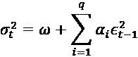

# 9

# 使用 GARCH 类模型对波动性建模

在*第六章*，*时间序列分析与预测*中，我们探讨了多种时间序列建模方法。然而，像**ARIMA**（**自回归积分滑动平均**）这样的模型无法解释随时间变化的非恒定波动性（异方差性）。我们已经解释过，一些变换（如对数变换或 Box-Cox 变换）可以用于调整轻微的波动性变化，但我们希望更进一步，对其进行建模。

本章中，我们专注于**条件异方差性**，这是一种当波动性增加时，与波动性的进一步增加相关联的现象。一个例子可能有助于理解这一概念。假设由于某些与公司相关的突发新闻，某项资产的价格大幅下跌。这种突然的价格下跌可能会触发某些投资基金的风险管理工具，导致它们开始卖出股票，以应对前期价格下跌。这可能会导致价格进一步暴跌。条件异方差性在*研究资产回报的风格化事实*这一章节中也表现得十分明显，我们展示了回报率呈现波动性聚集现象。

我们想简要说明本章的动机。波动性是金融中一个极其重要的概念，它与风险同义，并在量化金融中有广泛应用。首先，它在期权定价中至关重要，因为布莱克-斯科尔斯模型依赖于标的资产的波动性。其次，波动性对风险管理有重大影响，它被用来计算投资组合的**风险价值**（**VaR**）、夏普比率等多个指标。第三，波动性也出现在交易中。通常，交易者基于对资产价格上升或下降的预测来做决策。然而，我们也可以根据预测是否存在任何方向的波动来进行交易，即是否会有波动性。**波动性交易**在某些全球事件（例如疫情）导致市场剧烈波动时尤为吸引人。对于波动性交易者来说，一个可能感兴趣的产品是**波动性指数**（**VIX**），它基于标普 500 指数的波动。

在本章结束时，我们将介绍一系列 GARCH（广义自回归条件异方差）模型——包括单变量和多变量模型——它们是建模和预测波动性最流行的方法之一。掌握了基础知识后，实施更高级的模型变得相当简单。我们已经提到过波动性在金融中的重要性，通过了解如何对其进行建模，我们可以使用这些预测来替代许多实际应用中，风险管理或衍生品估值中之前使用的简单预测。

在本章中，我们将涵盖以下内容：

+   使用 ARCH 模型对股票收益波动性建模

+   使用 GARCH 模型对股票收益波动性建模

+   使用 GARCH 模型预测波动性

+   使用 CCC-GARCH 模型进行多元波动性预测

+   使用 DCC-GARCH 预测条件协方差矩阵

# 使用 ARCH 模型对股票收益波动性建模

在本篇中，我们通过**自回归条件异方差**（**ARCH**）模型来研究股票收益条件波动性的建模问题。

简单来说，ARCH 模型将误差项的方差表示为过去误差的函数。更准确地说，它假设误差的方差遵循自回归模型。ARCH 方法的整个逻辑可以通过以下方程表示：




第一个方程将收益序列表示为期望收益μ和意外收益的组合！[](../Images/B18112_09_004.png)。！[](../Images/B18112_09_005.png)具有白噪声特性——条件均值为零，并且具有时变的条件方差！[](../Images/B18112_09_006.png)。

误差项是序列无相关的，但不需要是序列独立的，因为它们可能表现出条件异方差性。

也被称为均值修正收益、误差项、创新或——最常见的——残差。

通常，ARCH（以及 GARCH）模型应仅对应用于原始时间序列的其他模型的残差进行拟合。在估计波动性模型时，我们可以假设均值过程的不同规格，例如：

+   零均值过程——这意味着收益仅由残差描述，例如！[](../Images/B18112_09_008.png)

+   一个常数均值过程（！[](../Images/B18112_09_009.png)）

+   使用线性模型（如 AR、ARMA、ARIMA 或更新的异质自回归（HAR）过程）估计均值

在第二个方程中，我们将误差序列表示为一个随机成分！[](../Images/B18112_09_010.png)和一个条件标准差！[](../Images/B18112_09_011.png)，后者控制残差的典型大小。随机成分也可以解释为标准化残差。

第三个方程展示了 ARCH 公式，其中！[](../Images/B18112_09_012.png)和！[](../Images/B18112_09_013.png)。关于 ARCH 模型的一些重要点包括：

+   ARCH 模型明确识别了时间序列的无条件方差和条件方差之间的差异。

+   它将条件方差建模为过去残差（误差）的函数，这些残差来自均值过程。

+   它假设无条件方差在时间上是恒定的。

+   可以使用普通最小二乘法（OLS）方法估计 ARCH 模型。

+   我们必须在模型中指定先前残差的数量（*q*）——类似于 AR 模型。

+   残差应呈现出离散白噪声的观察形式——零均值且平稳（没有趋势或季节性效应，即没有明显的序列相关性）。

在原始 ARCH 符号中，以及在 Python 的`arch`库中，滞后超参数用*p*表示。然而，我们使用*q*作为相应的符号，与接下来介绍的 GARCH 符号一致。

ARCH 模型的最大优点是，它所生成的波动率估计呈现出过度峰度（相比正态分布有更胖的尾部），这与股票回报的经验观察一致。当然，它也有缺点。第一个缺点是，该模型假设正负波动冲击的效应相同，但实际上并非如此。其次，它没有解释波动率的变化。这也是为什么该模型可能会过度预测波动率，因为它对回报序列中大规模孤立冲击的响应较慢。

在本食谱中，我们将 ARCH(1)模型拟合到 2015 至 2021 年间谷歌的每日股票回报数据。

## 如何操作...

执行以下步骤来拟合 ARCH(1)模型：

1.  导入库：

    ```py
    import pandas as pd 
    import yfinance as yf 
    from arch import arch_model 
    ```

1.  指定风险资产和时间跨度：

    ```py
    RISKY_ASSET = "GOOG"
    START_DATE = "2015-01-01"
    END_DATE = "2021-12-31" 
    ```

1.  从 Yahoo Finance 下载数据：

    ```py
    df = yf.download(RISKY_ASSET, 
                     start=START_DATE, 
                     end=END_DATE, 
                     adjusted=True) 
    ```

1.  计算每日回报：

    ```py
    returns = 100 * df["Adj Close"].pct_change().dropna()
    returns.name = "asset_returns"
    returns.plot(
        title=f"{RISKY_ASSET} returns: {START_DATE} - {END_DATE}"
    ) 
    ```

    运行代码后生成以下图表：

    

    图 9.1：2015 至 2021 年间谷歌的简单回报

    在图表中，我们可以观察到一些突如其来的尖峰和明显的波动率聚集现象。

1.  指定 ARCH 模型：

    ```py
    model = arch_model(returns, mean="Zero", vol="ARCH", p=1, q=0) 
    ```

1.  估计模型并打印摘要：

    ```py
    fitted_model = model.fit(disp="off")
    print(fitted_model.summary()) 
    ```

    运行代码后返回以下摘要：

    ```py
     Zero Mean - ARCH Model Results                        
    ===================================================================
    Dep. Variable:      asset_returns   R-squared:                 0.000
    Mean Model:         Zero Mean       Adj. R-squared:             .001
    Vol Model:          ARCH            Log-Likelihood:         -3302.93
    Distribution:       Normal          AIC:                     6609.85
    Method:             Maximum         BIC:                     6620.80
                        Likelihood
                                        No. Observations:        1762
    Date:           Wed, Jun 08 2022    Df Residuals:            1762
    Time:                   22:25:16    Df Model:                0
                            Volatility Model
    ===================================================================
                 coef      std err        t      P>|t|  95.0% Conf. Int.
    -------------------------------------------------------------------
    omega        1.8625    0.166      11.248  2.359e-29 [ 1.538, 2.187]
    alpha[1]     0.3788    0.112       3.374  7.421e-04 [ 0.159, 0.599]
    =================================================================== 
    ```

1.  绘制残差和条件波动率：

    ```py
    fitted_model.plot(annualize="D") 
    ```

    运行代码后生成以下图表：


图 9.2：标准化残差和拟合 ARCH 模型的年化条件波动率

我们可以观察到一些标准化残差值较大（绝对值大），并且对应于高波动期。

## 它是如何工作的...

在*步骤 2*到*4*中，我们下载了谷歌的每日股票价格并计算了简单回报。在使用 ARCH/GARCH 模型时，当数值非常小的时候，可能会出现收敛警告。这是由于`scipy`库中底层优化算法的不稳定性。为了解决这个问题，我们将回报乘以 100，转化为百分比表示。

在*步骤 5*中，我们定义了 ARCH(1)模型。对于均值模型，我们选择了零均值方法，这对于许多流动性较高的金融资产是适用的。另一个可行的选择是常数均值。我们可以选择这些方法，而不是例如 ARMA 模型，因为回报序列的序列依赖性可能非常有限。

在*步骤 6*中，我们使用`fit`方法拟合了模型。此外，我们将`disp="off"`传递给`fit`方法，以抑制优化步骤中的输出。为了使用`arch`库拟合模型，我们需要采取与熟悉的`scikit-learn`方法类似的步骤：我们首先定义模型，然后将其拟合到数据上。一个区别是，在`arch`中，我们在创建模型实例时就必须提供数据对象，而不是像在`scikit-learn`中那样将数据传递给`fit`方法。然后，我们使用`summary`方法打印了模型的摘要。

在*步骤 7*中，我们还通过绘制图形检查了标准化残差和条件波动率序列。标准化残差是通过将残差除以条件波动率来计算的。我们将`annualize="D"`传递给`plot`方法，以便将条件波动率序列从日数据年化。

## 还有更多内容...

关于 ARCH 模型的几点注意事项：

+   选择零均值过程在处理来自单独估计模型的残差时非常有用。

+   为了检测 ARCH 效应，我们可以观察某个模型（如 ARIMA 模型）残差平方的自相关图。我们需要确保这些残差的均值为零。我们可以使用偏自相关函数（PACF）图来推断*q*的值，这与 AR 模型的处理方法类似（更多细节请参阅*使用 ARIMA 类模型建模时间序列*的相关内容）。

+   为了检验模型的有效性，我们可以检查标准化残差和标准化残差的平方是否没有序列自相关（例如，使用`statsmodels`中的`acorr_ljungbox`函数，进行 Ljung-Box 或 Box-Pierce 检验）。或者，我们可以使用**拉格朗日乘子检验**（LM 检验，也称为恩格尔自回归条件异方差性检验）来确保模型捕捉到所有 ARCH 效应。为此，我们可以使用`statsmodels`中的`het_arch`函数。

在以下代码片段中，我们使用 LM 检验对 ARCH 模型的残差进行检验：

```py
from statsmodels.stats.diagnostic import het_arch
het_arch(fitted_model.resid) 
```

运行代码会返回以下元组：

```py
(98.10927835448403,
 1.3015895084238874e-16,
 10.327662606705564,
 4.2124269229123006e-17) 
```

元组中的前两个值是 LM 检验统计量及其对应的 p 值。后两个是 F 检验的 f 统计量（另一种检测 ARCH 效应的方法）及其对应的 p 值。我们可以看到，这两个 p 值都低于常见的显著性水平 0.05，这使我们能够拒绝原假设，即残差是同方差的。这意味着 ARCH(1)模型未能捕捉到残差中的所有 ARCH 效应。

`het_arch`函数的文档建议，如果残差来自回归模型，则应修正该模型中估计的参数数量。例如，如果残差来自 ARMA(2, 1)模型，则应将额外的参数`ddof = 3`传递给`het_arch`函数，其中`ddof`表示自由度。

## 另见

这里有更多资源：

+   Engle, R. F. 1982 年，“具有英国通货膨胀方差估计的自回归条件异方差模型”，*Econometrica*，50(4): 987-1007

# 使用 GARCH 模型对股票收益的波动性进行建模

在本教程中，我们展示了如何使用 ARCH 模型的扩展——**广义自回归条件异方差**（**GARCH**）模型。GARCH 可以看作是应用于时间序列方差的 ARMA 模型——ARCH 模型已经表达了 AR 部分，而 GARCH 则额外加入了移动平均部分。

GARCH 模型的方程可以表示为：


尽管其解释与前述 ARCH 模型非常相似，但不同之处在于最后一个方程，其中可以看到一个额外的组件。参数受到约束，以满足以下条件：，并且。

在 GARCH 模型中，系数有额外的约束。例如，在 GARCH(1,1)模型中，必须小于 1。否则，模型将不稳定。

GARCH 模型的两个超参数可以描述为：

+   *p:* 滞后方差的数量

+   *q:* 来自均值过程的滞后残差误差的数量

GARCH(0, *q*)模型等价于 ARCH(q)模型。

推断 ARCH/GARCH 模型的滞后阶数的一种方法是使用来自预测原始时间序列均值的模型的平方残差。由于残差围绕零中心分布，它们的平方对应于它们的方差。我们可以检查平方残差的 ACF/PACF 图，以识别序列方差自相关的模式（类似于我们在识别 ARMA/ARIMA 模型阶数时所做的）。

一般来说，GARCH 模型继承了 ARCH 模型的优点和缺点，不同之处在于它更好地捕捉到过去冲击的影响。请参见*更多内容*部分，了解一些弥补原始模型缺点的 GARCH 模型扩展。

在本教程中，我们将 GARCH(1,1)模型应用于与之前教程相同的数据，以清晰地突出两种建模方法之间的差异。

## 如何做到……

执行以下步骤以在 Python 中估计 GARCH(1,1)模型：

1.  指定 GARCH 模型：

    ```py
    model = arch_model(returns, mean="Zero", vol="GARCH", p=1, q=1) 
    ```

1.  估计模型并打印摘要：

    ```py
    fitted_model = model.fit(disp="off")
    print(fitted_model.summary()) 
    ```

    运行代码后返回以下摘要：

    ```py
     Zero Mean - GARCH Model Results                        
    ====================================================================
    Dep. Variable:      asset_returns   R-squared:                 0.000
    Mean Model:         Zero Mean       Adj. R-squared:            0.001
    Vol Model:          GARCH           Log-Likelihood:         -3246.71
    Distribution:       Normal          AIC:                     6499.42
    Method:             Maximum         BIC:                     6515.84
                        Likelihood
                                        No. Observations:        1762
    Date:           Wed, Jun 08 2022    Df Residuals:            1762
    Time:                   22:37:27    Df Model:                0
                              Volatility Model
    ===================================================================
                 coef      std err     t      P>|t|     95.0% Conf. Int.
    -------------------------------------------------------------------
    omega        0.2864    0.186     1.539   0.124   [-7.844e-02, 0.651]
    alpha[1]     0.1697  9.007e-02   1.884 5.962e-02 [-6.879e-03, 0.346]
    beta[1]      0.7346    0.128     5.757  8.538e-09    [ 0.485, 0.985]
    =================================================================== 
    ```

    根据 *市场风险分析*，在稳定市场中，参数的常见取值范围为  和 。然而，我们应该记住，尽管这些范围不太可能严格适用，但它们已经为我们提供了一些我们应期望的值的线索。

    我们可以看到，与 ARCH 模型相比，log-likelihood 增加了，这意味着 GARCH 模型更好地拟合了数据。然而，我们在得出这样的结论时应谨慎。每当我们增加更多预测变量时（如我们在 GARCH 中所做的），log-likelihood 很可能会增加。如果预测变量的数量发生变化，我们应进行似然比检验，以比较两个嵌套回归模型的拟合优度标准。

1.  绘制残差和条件波动率：

    ```py
    fitted_model.plot(annualize="D") 
    ```

    在下图中，我们可以观察到将额外的成分（滞后的条件波动率）纳入模型规范后的效果：


图 9.3：拟合的 GARCH 模型的标准化残差和年化条件波动率

使用 ARCH 时，条件波动率序列会出现许多峰值，然后立即回落到较低水平。在 GARCH 的情况下，由于模型还包括滞后的条件波动率，因此它需要更多的时间才能回到峰值前观察到的水平。

## 它是如何工作的...

在这个案例中，我们使用了与之前相同的数据来比较 ARCH 和 GARCH 模型的结果。有关下载数据的更多信息，请参阅 *建模股票收益波动率（ARCH 模型）* 中的 *步骤 1* 至 *4*。

由于 `arch` 库的便利性，调整先前用于拟合 ARCH 模型的代码变得非常容易。为了估计 GARCH 模型，我们必须指定想要使用的波动率模型类型，并设置一个额外的参数：`q=1`。

为了比较，我们将均值过程保持为零均值过程。

## 还有更多...

在本章中，我们已经使用了两个模型来解释并可能预测时间序列的条件波动率。然而，GARCH 模型有许多扩展版本，以及不同的配置，供我们实验以找到最适合的数据模型。

在 GARCH 框架中，除了超参数（例如在普通 GARCH 模型中 *p* 和 *q*），我们还可以修改接下来描述的模型。

### 条件均值模型

如前所述，我们将 GARCH 类模型应用于在拟合其他模型之后获得的残差。均值模型的一些流行选择包括：

+   零均值

+   常数均值

+   ARIMA 模型的任何变体（包括可能的季节性调整，以及外部回归变量）——文献中一些流行的选择包括 ARMA 甚至 AR 模型

+   回归模型

在建模条件均值时，我们需要注意一件事。例如，我们可能先对时间序列拟合 ARMA 模型，然后对第一个模型的残差拟合 GARCH 模型。然而，这并不是首选方法。因为通常情况下，ARMA 估计值是不一致的（或者在仅有 AR 项而没有 MA 项的情况下，即使一致也不高效），这也会影响后续的 GARCH 估计。由于第一个模型（ARMA/ARIMA）假设条件同方差性，而我们在第二步中用 GARCH 模型显式建模条件异方差性，因此不一致性会出现。正因为如此，首选方法是同时估计两个模型，例如使用`arch`库（或者 R 的`rugarch`包）。

### 条件波动性模型

GARCH 框架有许多扩展。以下是一些常见的模型：

+   GJR-GARCH：GARCH 模型的一种变体，考虑了回报的非对称性（负回报对波动性的影响通常比正回报更强）

+   EGARCH：指数 GARCH

+   TGARCH：阈值 GARCH

+   FIGARCH：分数积分 GARCH，用于非平稳数据

+   GARCH-MIDAS：在这一类模型中，波动性被分解为短期 GARCH 成分和由额外解释变量驱动的长期成分

+   多元 GARCH 模型，例如 CCC-/DCC-GARCH

前三种模型使用略微不同的方法将非对称性引入条件波动性规范。这与负面冲击对波动性的影响通常强于正面冲击的观点一致。

### 误差分布

在*资产回报的样式化事实研究*一节中，我们看到回报的分布并非正态分布（偏斜，且具有重尾）。因此，除了高斯分布外，其他分布可能更适合 GARCH 模型中的误差。

一些可能的选择包括：

+   学生 t 分布

+   偏斜 t 分布（Hansen, 1994 年）

+   广义误差分布（GED）

+   偏斜广义误差分布（SGED）

`arch`库不仅提供了上述大部分模型和分布，它还允许使用自定义的波动性模型/误差分布（只要它们符合预定义格式）。有关更多信息，请参考出色的文档。

## 参见

额外资源可在此处获得：

+   Alexander, C. 2008 年。*市场风险分析，实用金融计量经济学*（第 2 卷）。约翰·威利父子公司。

+   Bollerslev, T., 1986 年。“广义自回归条件异方差模型。*计量经济学杂志*，31（3）：307–327。：[`doi.org/10.1016/0304-4076(86)90063-1`](https://doi.org/10.1016/0304-4076(86)90063-1)

+   Glosten, L. R., Jagannathan, R., and Runkle, D. E., 1993\. “股票的名义超额收益与波动率的关系，”*金融学报*，48 (5): 1779–1801: https://doi.org/10.1111/j.1540-6261.1993.tb05128.x

+   Hansen, B. E., 1994\. “自回归条件密度估计，”*国际经济评论*，35(3): 705–730: https://doi.org/10.2307/2527081

+   `arch` 库的文档—[`arch.readthedocs.io/en/latest/index.html`](https://arch.readthedocs.io/en/latest/index.html)

# 使用 GARCH 模型预测波动率

在之前的案例中，我们已经看到了如何将 ARCH/GARCH 模型拟合到收益序列。然而，使用 ARCH 类模型最有趣/相关的情况是预测波动率的未来值。

使用 GARCH 类模型预测波动率有三种方法：

+   分析法——由于 ARCH 类模型的固有结构，分析预测总是可用的，适用于一步前的预测。多步分析预测可以通过前向递归获得；然而，这仅适用于残差平方线性模型（如 GARCH 或异质 ARCH 模型）。

+   模拟法——基于模拟的预测使用 ARCH 类模型的结构，通过假设的残差分布向前模拟可能的波动率路径。换句话说，它们使用随机数生成器（假设特定分布）来抽取标准化残差。该方法创建了*x*条可能的波动率路径，然后将其平均作为最终预测。基于模拟的预测总是适用于任何时间范围。随着模拟次数向无穷增加，基于模拟的预测将趋近于分析预测。

+   自助法（也称为过滤历史模拟法）——这些预测与基于模拟的预测非常相似，不同之处在于它们使用实际输入数据和估计参数生成（准确来说，是有放回抽样）标准化的残差。该方法在生成预测之前，所需的样本内数据量极少。

由于 ARCH 类模型的规格，第一次的样本外预测将始终是固定的，无论我们使用哪种方法。

在本案例中，我们将 2015 至 2020 年微软的股票收益拟合到一个 GARCH(1,1)模型，并使用学生 t 分布的残差。然后，我们为 2021 年的每一天创建了 3 步前的预测。

## 如何操作...

执行以下步骤以使用 GARCH 模型创建 3 步前的波动率预测：

1.  导入库：

    ```py
    import pandas as pd
    import yfinance as yf
    from datetime import datetime
    from arch import arch_model 
    ```

1.  从 Yahoo Finance 下载数据并计算简单收益：

    ```py
    df = yf.download("MSFT",
                     start="2015-01-01",
                     end="2021-12-31",
                     adjusted=True)
    returns = 100 * df["Adj Close"].pct_change().dropna()
    returns.name = "asset_returns" 
    ```

1.  指定 GARCH 模型：

    ```py
    model = arch_model(returns, mean="Zero", vol="GARCH", dist="t",
                       p=1, q=1) 
    ```

1.  定义分割日期并拟合模型：

    ```py
    SPLIT_DATE = datetime(2021, 1, 1)
    fitted_model = model.fit(last_obs=SPLIT_DATE, disp="off") 
    ```

1.  创建并检查分析预测：

    ```py
    forecasts_analytical = fitted_model.forecast(horizon=3,
                                                 start=SPLIT_DATE,
                                                 reindex=False)
    forecasts_analytical.variance.plot(
        title="Analytical forecasts for different horizons"
    ) 
    ```

    运行代码片段生成以下图表：

    

    图 9.4：1、2 和 3 步的分析预测

    使用下面的代码片段，我们可以检查生成的预测结果。

    ```py
    forecasts_analytical.variance 
    ```

    

    图 9.5：展示 1、2、3 期分析预测的表格

    每一列包含在索引所指示的日期生成的*h*步预测。当预测生成时，`Date`列中的日期对应于用于生成预测的最后一个数据点。例如，日期为 2021-01-08 的列包含了 1 月 9 日、10 日和 11 日的预测。这些预测是使用直到 1 月 8 日（包括这一天）的数据生成的。

1.  创建并检查模拟预测：

    ```py
    forecasts_simulation = fitted_model.forecast(
        horizon=3, 
        start=SPLIT_DATE, 
        method="simulation", 
        reindex=False
    ) 

    forecasts_simulation.variance.plot( 
        title="Simulation forecasts for different horizons" 
    ) 
    ```

    运行代码片段后生成以下图表：

    

    图 9.6：基于模拟的 1、2、3 期预测

1.  创建并检查自助法预测：

    ```py
    forecasts_bootstrap = fitted_model.forecast(horizon=3,
                                                start=SPLIT_DATE,
                                                method="bootstrap",
                                                reindex=False)
    forecasts_bootstrap.variance.plot(
        title="Bootstrap forecasts for different horizons"
    ) 
    ```

    运行代码片段后生成以下图表：


图 9.7：基于自助法的 1、2、3 期预测

检查这三个图表后得出的结论是，三种不同方法得到的波动率预测形态非常相似。

## 它是如何工作的...

在前两个步骤中，我们导入了所需的库，并下载了 2015 年至 2021 年间微软的股票价格。我们计算了简单收益率，并将值乘以 100，以避免在优化过程中出现潜在的收敛问题。

在*步骤 3*中，我们指定了我们的 GARCH 模型，即零均值的 GARCH(1, 1)，且残差服从学生 t 分布。

在*步骤 4*中，我们定义了一个日期（`datetime`对象），用于拆分训练集和测试集。然后，我们使用`fit`方法拟合模型。这一次，我们指定了`last_obs`参数，表示训练集的结束时间。我们传入了`datetime(2021, 1, 1)`，这意味着实际用于训练的最后一个观测值是 2020 年 12 月的最后一天。

在*步骤 5*中，我们使用拟合好的 GARCH 模型的`forecast`方法创建了分析预测。我们指定了预测的期数和起始日期（即与我们在拟合模型时提供的`last_obs`相同）。然后，我们为每个期数绘制了预测图。

通常，使用`forecast`方法会返回一个`ARCHModelForecast`对象，其中包含四个我们可能需要的主要属性：

+   `mean`—条件均值的预测

+   `variance`—过程的条件方差预测

+   `residual_variance`—残差方差的预测。当模型具有均值动态时，例如 AR 过程，`residual_variance`的值将与`variance`中的值不同（对于期数大于 1 的情况）。

+   `simulations`—一个对象，包含了生成预测所用的各个单独的模拟结果（仅适用于模拟和自助法方法）。

在*步骤 6*和*步骤 7*中，我们使用模拟和自助法生成了类比的 3 步 ahead 预测。我们只需向`forecast`方法中添加可选的`method`参数，指示我们希望使用哪种预测方法。默认情况下，这些方法使用 1,000 次模拟来生成预测，但我们可以根据需要更改此数字。

## 还有更多内容...

我们可以很容易地直观比较使用不同预测方法得到的预测差异。在这种情况下，我们希望比较 2020 年内分析法和自助法的预测。我们选择 2020 年作为训练样本中使用的最后一年。

执行以下步骤以比较 2020 年的 10 步 ahead 波动率预测：

1.  导入所需的库：

    ```py
    import numpy as np 
    ```

1.  使用分析法和自助法估算 2020 年的 10 步 ahead 波动率预测：

    ```py
    FCST_HORIZON = 10
    vol_analytic = (
        fitted_model.forecast(horizon=FCST_HORIZON,
                              start=datetime(2020, 1, 1),
                              reindex=False)
        .residual_variance["2020"]
        .apply(np.sqrt)
    )
    vol_bootstrap = (
        fitted_model.forecast(horizon=FCST_HORIZON,
                              start=datetime(2020, 1, 1),
                              method="bootstrap",
                              reindex=False)
        .residual_variance["2020"]
        .apply(np.sqrt)
    ) 
    ```

    在创建预测时，我们改变了预测的时间范围和开始日期。我们从拟合模型中恢复了残差方差，过滤出 2020 年内的预测，然后取平方根以将方差转换为波动率。

1.  获取 2020 年的条件波动率：

    ```py
    vol = fitted_model.conditional_volatility["2020"] 
    ```

1.  创建刺猬图：

    ```py
    ax = vol.plot(
        title="Comparison of analytical vs bootstrap volatility forecasts",
        alpha=0.5
    )
    ind = vol.index
    for i in range(0, 240, 10):
        vol_a = vol_analytic.iloc[i]
        vol_b = vol_bootstrap.iloc[i]
        start_loc = ind.get_loc(vol_a.name)
        new_ind = ind[(start_loc+1):(start_loc+FCST_HORIZON+1)]
        vol_a.index = new_ind
        vol_b.index = new_ind
        ax.plot(vol_a, color="r")
        ax.plot(vol_b, color="g")

    labels = ["Volatility", "Analytical Forecast", 
              "Bootstrap Forecast"]
    legend = ax.legend(labels) 
    ```

    运行该代码片段生成了以下图表：


图 9.8：分析方法与基于自助法的波动率预测比较

刺猬图是一种有用的可视化方法，用于展示两种预测方法在较长时间段内的差异。在本例中，我们每 10 天绘制一次 10 步 ahead 预测。

有趣的是，2020 年 3 月发生了波动率的峰值。我们可以看到，在接近峰值时，GARCH 模型预测未来几天波动率将下降。为了更好地理解这个预测是如何生成的，我们可以参考基础数据。通过检查包含观察到的波动率和预测的 DataFrame，我们可以得出结论：峰值发生在 3 月 17 日，而绘制的预测是使用直到 3 月 16 日的数据生成的。

在逐个检查单一波动率模型时，使用拟合后的`arch_model`的`hedgehog_plot`方法来创建类似的图表可能会更容易。

# 使用 CCC-GARCH 模型进行多变量波动率预测

在本章中，我们已经考虑了多个单变量条件波动率模型。这就是为什么在这个方法中，我们转向了多变量设置。作为起点，我们考虑了 Bollerslev 的**常数条件相关 GARCH**（**CCC-GARCH**）模型。其背后的思想相当简单。该模型由*N*个单变量 GARCH 模型组成，通过一个常数条件相关矩阵**R**相互关联。

和以前一样，我们从模型的规格开始：


在第一个方程中，我们表示回报序列。与先前教程中展示的表示方式的主要区别在于，这次我们考虑的是多变量回报。这就是为什么**r**[t]实际上是一个回报向量**r**[t] = (*r*[1t], …, *r*[nt])。均值和误差项的表示方式类似。为了突出这一点，当考虑向量或矩阵时，我们使用粗体字。

第二个方程显示，误差项来自一个均值为零的多变量正态分布，且具有条件协方差矩阵！[](../Images/B18112_09_025.png)（大小为 N x N）。

条件协方差矩阵的元素定义为：

+   对角线：

+   非对角线：

第三个方程展示了条件协方差矩阵的分解。**D**[t]表示包含对角线上的条件标准差的矩阵，**R**是相关性矩阵。

该模型的关键思想如下：

+   该模型通过将其分解为方差和相关性，避免了保证正定性问题！[](../Images/B18112_09_028.png)。

+   误差项之间的条件相关性随时间保持不变。

+   单独的条件方差遵循单变量 GARCH(1,1)模型。

在本教程中，我们估计了三家美国科技公司股票回报序列的 CCC-GARCH 模型。有关 CCC-GARCH 模型估计的更多细节，请参阅*它是如何工作的...*部分。

## 如何操作...

执行以下步骤，在 Python 中估计 CCC-GARCH 模型：

1.  导入库：

    ```py
    import pandas as pd
    import numpy as np
    import yfinance as yf
    from arch import arch_model 
    ```

1.  指定风险资产和时间范围：

    ```py
    RISKY_ASSETS = ["GOOG", "MSFT", "AAPL"]
    START_DATE = "2015-01-01"
    END_DATE = "2021-12-31" 
    ```

1.  从 Yahoo Finance 下载数据：

    ```py
    df = yf.download(RISKY_ASSETS, 
                     start=START_DATE, 
                     end=END_DATE, 
                     adjusted=True) 
    ```

1.  计算每日回报：

    ```py
    returns = 100 * df["Adj Close"].pct_change().dropna()
    returns.plot(
        subplots=True, 
        title=f"Stock returns: {START_DATE} - {END_DATE}"
    ) 
    ```

    运行代码片段生成如下图：

    

    图 9.9：苹果、谷歌和微软的简单回报

1.  定义用于存储对象的列表：

    ```py
    coeffs = [] 
    cond_vol = [] 
    std_resids = [] 
    models = [] 
    ```

1.  估计单变量 GARCH 模型：

    ```py
    for asset in returns.columns:
        model = arch_model(returns[asset], mean="Constant", 
                           vol="GARCH", p=1, q=1)
        model = model.fit(update_freq=0, disp="off");
        coeffs.append(model.params)
        cond_vol.append(model.conditional_volatility)
        std_resids.append(model.std_resid)
        models.append(model) 
    ```

1.  将结果存储在 DataFrames 中：

    ```py
    coeffs_df = pd.DataFrame(coeffs, index=returns.columns)
    cond_vol_df = (
        pd.DataFrame(cond_vol)
        .transpose()
        .set_axis(returns.columns,
                  axis="columns")
    )
    std_resids_df = (
        pd.DataFrame(std_resids)
        .transpose()
        .set_axis(returns.columns
                  axis="columns")
    ) 
    ```

    下表包含每个回报序列的估计系数：

    

    图 9.10：估计的单变量 GARCH 模型系数

1.  计算常数条件相关性矩阵（R）：

    ```py
    R = (
        std_resids_df
        .transpose()
        .dot(std_resids_df)
        .div(len(std_resids_df))
    ) 
    ```

1.  计算条件协方差矩阵的单步预测：

    ```py
    # define objects
    diag = []
    D = np.zeros((len(RISKY_ASSETS), len(RISKY_ASSETS)))

    # populate the list with conditional variances
    for model in models:
        diag.append(model.forecast(horizon=1).variance.iloc[-1, 0])
    # take the square root to obtain volatility from variance
    diag = np.sqrt(diag)
    # fill the diagonal of D with values from diag
    np.fill_diagonal(D, diag)

    # calculate the conditional covariance matrix
    H = np.matmul(np.matmul(D, R.values), D) 
    ```

计算的单步预测如下所示：

```py
array([[2.39962391, 1.00627878, 1.19839517],
       [1.00627878, 1.51608369, 1.12048865],
       [1.19839517, 1.12048865, 1.87399738]]) 
```

我们可以将此矩阵与使用更复杂的 DCC-GARCH 模型得到的矩阵进行比较，后者将在下一个教程中介绍。

## 它是如何工作的...

在*步骤 2*和*步骤 3*中，我们下载了谷歌、微软和苹果的每日股价。然后，我们计算了简单回报，并将其乘以 100，以避免遇到收敛错误。

在*步骤 5*中，我们定义了空列表，用于存储后续阶段所需的元素：GARCH 系数、条件波动性、标准化残差以及模型本身（用于预测）。

在*步骤 6*中，我们遍历了包含股票回报率的 DataFrame 列，并为每个序列拟合了单变量 GARCH 模型。我们将结果存储在预定义的列表中。然后，我们对数据进行了处理，以便将残差等对象存储在 DataFrame 中，从而方便后续操作。

在*步骤 8*中，我们计算了常数条件相关性矩阵 (**R**) 作为 **z**[t] 的无条件相关性矩阵：


这里，**z**[t] 表示来自单变量 GARCH 模型的时间 *t* 标准化残差。

在最后一步，我们获得了单步预测的条件协方差矩阵 **H**[t+1]。为此，我们进行了以下操作：

+   我们使用 `np.zeros` 创建了一个全零矩阵 **D**[t+1]。

+   我们将单步预测的条件方差（来自单变量 GARCH 模型）存储在一个名为 `diag` 的列表中。

+   使用 `np.fill_diagonal`，我们将名为 `diag` 的列表中的元素放置到矩阵 **D**[t+1] 的对角线上。

+   根据引言中的方程 3，我们使用矩阵乘法（`np.matmul`）获得了单步预测。

## 另见

额外资源请见此处：

+   Bollerslev, T.1990\. “建模短期名义汇率的相干性：一种多元广义 ARCH 方法”，*经济学与统计学评论*，72(3)：498–505：https://doi.org/10.2307/2109358

# 使用 DCC-GARCH 预测条件协方差矩阵

在这个食谱中，我们介绍了 CCC-GARCH 模型的扩展：Engle 的 **动态条件相关性 GARCH**（**DCC-GARCH**）模型。两者的主要区别在于，后者的条件相关性矩阵随着时间变化——我们使用 **R**[t] 而不是 **R**。

在估计过程中存在一些细节差异，但大体框架与 CCC-GARCH 模型相似：

+   估计单变量 GARCH 模型的条件波动率

+   估计 DCC 模型的条件相关性

在估计 DCC 模型的第二步中，我们使用了一个新的矩阵 **Q**[t]，代表代理相关过程。


第一个方程描述了条件相关性矩阵 **R**[t] 与代理过程 **Q**[t] 之间的关系。第二个方程表示代理过程的动态变化。最后一个方程显示了  的定义，它被定义为来自单变量 GARCH 模型的标准化残差的无条件相关性矩阵。

这种 DCC 模型的表示使用了一种叫做 **相关性目标**的方法。它意味着我们实际上将需要估计的参数数量减少到两个： 和 。这类似于在单变量 GARCH 模型中的波动率目标，后续会在 *更多内容...* 部分进行详细描述。

截至目前，没有可以用来估计 DCC-GARCH 模型的 Python 库。一种解决方案是从头开始编写这样的库。另一种更节省时间的解决方案是使用成熟的 R 包来完成这一任务。这就是为什么在本配方中，我们还介绍了如何在一个 Jupyter 笔记本中高效地让 Python 和 R 一起工作（这也可以在普通的`.py`脚本中完成）。`rpy2`库是两种语言之间的接口。它不仅允许我们在同一个笔记本中运行 R 和 Python，还可以在两个环境之间传递对象。

在本配方中，我们使用了与前一个配方相同的数据，以便突出方法和结果的差异。

## 准备工作

有关如何轻松安装 R 的详细信息，请参考以下资源：

+   [`cran.r-project.org/`](https://cran.r-project.org/)

+   [`docs.anaconda.com/anaconda/user-guide/tasks/using-r-language/`](https://docs.anaconda.com/anaconda/user-guide/tasks/using-r-language/)

如果您使用`conda`作为包管理器，设置过程可以大大简化。如果您仅通过`conda install rpy2`命令安装`rpy2`，包管理器会自动安装最新版本的 R 及其他一些必要的依赖项。

在执行以下代码之前，请确保运行了前面配方中的代码，以确保数据可用。

## 如何操作...

执行以下步骤以在 Python 中估计 DCC-GARCH 模型（使用 R）：

1.  使用`rpy2`建立 Python 和 R 之间的连接：

    ```py
    %load_ext rpy2.ipython 
    ```

1.  安装`rmgarch` R 包并加载它：

    ```py
    %%R 

    install.packages('rmgarch', repos = "http://cran.us.r-project.org") 
    library(rmgarch) 
    ```

    我们只需要安装一次`rmgarch`包。安装后，您可以安全地注释掉以`install.packages`开头的那行代码。

1.  将数据集导入 R：

    ```py
    %%R -i returns
    print(head(returns)) 
    ```

    使用前面的命令，我们打印 R `data.frame`的前五行：

    ```py
     AAPL       GOOG       MSFT
    2015-01-02 00:00:00 -0.951253138 -0.3020489  0.6673615
    2015-01-05 00:00:00 -2.817148406 -2.0845731 -0.9195739
    2015-01-06 00:00:00  0.009416247 -2.3177049 -1.4677364
    2015-01-07 00:00:00  1.402220689 -0.1713264  1.2705295
    2015-01-08 00:00:00  3.842214047  0.3153082  2.9418228 
    ```

1.  定义模型规范：

    ```py
    %%R

    # define GARCH(1,1) model
    univariate_spec <- ugarchspec(
        mean.model = list(armaOrder = c(0,0)),
        variance.model = list(garchOrder = c(1,1), 
                              model = "sGARCH"),
        distribution.model = "norm"
    )

    # define DCC(1,1) model
    n <- dim(returns)[2]
    dcc_spec <- dccspec(
        uspec = multispec(replicate(n, univariate_spec)),
        dccOrder = c(1,1),
        distribution = "mvnorm"
    ) 
    ```

1.  估计模型：

    ```py
    %%R 
    dcc_fit <- dccfit(dcc_spec, data=returns) 
    dcc_fit 
    ```

    以下表格包含了模型的规范总结、估计的系数以及一些拟合优度标准的选择：

    ```py
    *---------------------------------*
    *          DCC GARCH Fit          *
    *---------------------------------*
    Distribution         :  mvnorm
    Model                :  DCC(1,1)
    No. Parameters       :  17
    [VAR GARCH DCC UncQ] : [0+12+2+3]
    No. Series           :  3
    No. Obs.             :  1762
    Log-Likelihood       :  -8818.787
    Av.Log-Likelihood    :  -5 
    Optimal Parameters
    --------------------------------------------------------------------
                   Estimate  Std. Error  t value Pr(>|t|)
    [AAPL].mu      0.189285    0.037040   5.1102 0.000000
    [AAPL].omega   0.176370    0.051204   3.4445 0.000572
    [AAPL].alpha1  0.134726    0.026084   5.1651 0.000000
    [AAPL].beta1   0.811601    0.029763  27.2691 0.000000
    [GOOG].mu      0.125177    0.040152   3.1176 0.001823
    [GOOG].omega   0.305000    0.163809   1.8619 0.062614
    [GOOG].alpha1  0.183387    0.089046   2.0595 0.039449
    [GOOG].beta1   0.715766    0.112531   6.3606 0.000000
    [MSFT].mu      0.149371    0.030686   4.8677 0.000001
    [MSFT].omega   0.269463    0.086732   3.1068 0.001891
    [MSFT].alpha1  0.214566    0.052722   4.0698 0.000047
    [MSFT].beta1   0.698830    0.055597  12.5695 0.000000
    [Joint]dcca1   0.060145    0.016934   3.5518 0.000383
    [Joint]dccb1   0.793072    0.059999  13.2180 0.000000
    Information Criteria
    ---------------------

    Akaike       10.029
    Bayes        10.082
    Shibata      10.029
    Hannan-Quinn 10.049 
    ```

1.  计算五步 ahead 的预测值：

    ```py
    forecasts <- dccforecast(dcc_fit, n.ahead = 5) 
    ```

1.  获取预测结果：

    ```py
    %%R 

    # conditional covariance matrix 
    forecasts@mforecast$H 
    # conditional correlation matrix 
    forecasts@mforecast$R 
    # proxy correlation process 
    forecasts@mforecast$Q 
    # conditional mean forecasts 
    forecasts@mforecast$mu 
    ```

下图显示了条件协方差矩阵的五步 ahead 预测值：

```py
[[1]]
, , 1

         [,1]     [,2]     [,3]
[1,] 2.397337 1.086898 1.337702
[2,] 1.086898 1.515434 1.145010
[3,] 1.337702 1.145010 1.874023

, , 2

         [,1]     [,2]     [,3]
[1,] 2.445035 1.138809 1.367728
[2,] 1.138809 1.667607 1.231062
[3,] 1.367728 1.231062 1.981190

, , 3

         [,1]     [,2]     [,3]
[1,] 2.490173 1.184169 1.395189
[2,] 1.184169 1.804434 1.308254
[3,] 1.395189 1.308254 2.079076
, , 4
         [,1]     [,2]     [,3]
[1,] 2.532888 1.224255 1.420526
[2,] 1.224255 1.927462 1.377669
[3,] 1.420526 1.377669 2.168484

, , 5

         [,1]     [,2]     [,3]
[1,] 2.573311 1.259997 1.444060
[2,] 1.259997 2.038083 1.440206
[3,] 1.444060 1.440206 2.250150 
```

我们现在可以将这个预测（第一步）与使用更简单的 CCC-GARCH 模型获得的预测进行比较。对于 CCC-GARCH 和 DCC-GARCH 模型，单步 ahead 的条件协方差预测值非常相似。

## 它是如何工作的...

在本配方中，我们使用了与前一个配方相同的数据，以便比较 CCC-GARCH 和 DCC-GARCH 模型的结果。有关如何下载数据的更多信息，请参考前一个配方中的*步骤 1*至*4*。

为了同时使用 Python 和 R，我们使用了 `rpy2` 库。在本食谱中，我们展示了如何将该库与 Jupyter Notebook 结合使用。有关如何在 `.py` 脚本中使用该库的更多详情，请参阅官方文档。此外，我们不会深入讨论 R 代码的细节，因为这超出了本书的范围。

在*第 1 步*中，除了加载任何库，我们还必须使用以下魔法命令：`%load_ext rpy2.ipython`。它使我们能够通过在 Notebook 单元格前添加 `%%R` 来运行 R 代码。因此，请假设本章中的任何代码块都是单独的 Notebook 单元格（更多信息，请参见随附 GitHub 仓库中的 Jupyter Notebook）。

在*第 2 步*中，我们必须安装所需的 R 依赖项。为此，我们使用了 `install.packages` 函数，并指定了我们想要使用的仓库。

在*第 3 步*中，我们将 `pandas` DataFrame 移动到 R 环境中。为此，我们在使用 `%%R` 魔法命令时传递了额外的代码 `-i returns`。我们本可以在随后的任何步骤中导入数据。

当你想将 Python 对象移到 R 中，进行一些操作/建模，然后将最终结果移回 Python 时，你可以使用以下语法：`%%R -i input_object -o output_object`。

在*第 4 步*中，我们定义了 DCC-GARCH 模型的规格。首先，我们使用 `ugarchspec` 定义了单变量 GARCH 规格（用于条件波动率估计）。该函数来自一个名为 `rugarch` 的包，这是单变量 GARCH 建模的框架。通过不指定 ARMA 参数，我们选择了一个常数均值模型。对于波动率，我们使用了 GARCH(1,1) 模型，且创新项服从正态分布。其次，我们还指定了 DCC 模型。为此，我们：

+   为每个收益系列复制了单变量规格——在此案例中，共有三个。

+   指定了 DCC 模型的阶数——在此案例中为 DCC(1,1)。

+   指定了多元分布——在此案例中为多元正态分布。

我们可以通过调用 `dcc_spec` 对象来查看规格的摘要。

在*第 5 步*中，我们通过调用 `dccfit` 函数并将规格和数据作为参数来估计模型。之后，我们使用 `dccforecast` 函数获得了五步预测，这个函数返回了嵌套对象，如下所示：

+   `H`：条件协方差矩阵

+   `R`：条件相关矩阵

+   `Q`：相关矩阵的代理过程

+   `mu`：条件均值

它们每个都包含了五步预测，存储在列表中。

## 还有更多内容……

在这一部分，我们还希望讨论一些估计 GARCH 模型的更多细节。

### 估计详情

在估计 DCC-GARCH 模型的第一步中，我们可以额外使用一种称为**方差目标**的方法。其思想是减少我们在 GARCH 模型中需要估计的参数数量。

为此，我们可以稍微修改 GARCH 方程。原始方程如下所示：


无条件波动率定义为：


我们现在可以将其代入 GARCH 方程，得到以下结果：


在最后一步，我们用收益率的样本方差替换了无条件波动率：


通过这样做，我们为每个 GARCH 方程减少了一个参数需要估计。此外，模型所隐含的无条件方差保证等于无条件样本方差。为了在实际中使用方差目标化，我们在 `ugarchspec` 函数调用中添加了一个额外的参数：`ugarchspec(..., variance.targeting = TRUE)`。

### 单变量和多变量 GARCH 模型

同时值得一提的是，`rugarch` 和 `rmgarch` 可以很好地配合使用，因为它们都是由同一位作者开发的，并作为一个统一的框架创建，用于在 R 中估计 GARCH 模型。在估计 DCC-GARCH 模型的第一步中，我们已经在使用 `ugarchspec` 函数时积累了一些经验。关于这个包，还有更多可以探索的内容。

### 并行化多变量 GARCH 模型的估计

最后，DCC-GARCH 模型的估计过程可以轻松地并行化，借助 `parallel` R 包。

为了通过并行化可能加速计算，我们重用了该配方中的大部分代码，并添加了几行额外的代码。首先，我们必须使用 `parallel` 包中的 `makePSOCKcluster` 设置一个集群，并指示我们希望使用三个核心。然后，我们使用 `multifit` 定义并行化的规格。最后，我们拟合了 DCC-GARCH 模型。与之前使用的代码相比，这里的区别在于我们额外传递了 `fit` 和 `cluster` 参数到函数调用中。当我们完成估计时，我们停止集群。下面是完整的代码片段：

```py
%%R
# parallelized DCC-GARCH(1,1)
library("parallel")
# set up the cluster
cl <- makePSOCKcluster(3)
# define parallelizable specification
parallel_fit <- multifit(multispec(replicate(n, univariate_spec)),
                         returns,
                         cluster = cl)
# fit the DCC-GARCH model
dcc_fit <- dccfit(dcc_spec,
                  data = returns,
                  fit.control = list(eval.se = TRUE),
                  fit = parallel_fit,
                  cluster = cl)
# stop the cluster
stopCluster(cl) 
```

使用上述代码，我们可以显著加速 DCC-GARCH 模型的估计。当处理大量数据时，性能提升尤为明显。此外，结合 `parallel` 包和 `multifit` 的方法，也可以用于加速 `rugarch` 和 `rmgarch` 包中各种 GARCH 和 ARIMA 模型的计算。

## 参见

其他资源：

+   Engle, R.F., 2002\. “动态条件相关性：一类简单的多变量广义自回归条件异方差模型，”《商业与经济*统计学*》, 20(3): 339–350: [`doi.org/10.1198/073500102288618487`](https://doi.org/10.1198/073500102288618487)

+   Ghalanos, A. (2019). `rmgarch` 模型：背景和属性。 (版本 1.3–0): [`cran.r-project.org/web/packages/rmgarch/vignettes/The_rmgarch_models.pdf`](https://cran.r-project.org/web/packages/rmgarch/vignettes/The_rmgarch_models.pdf)

+   `rpy2`的文档：[`rpy2.github.io/`](https://rpy2.github.io/)

# 摘要

波动性建模和预测近年来受到了广泛关注，主要因为它们在金融市场中的重要性。本章介绍了 GARCH 模型（包括单变量和多变量模型）在波动性预测中的实际应用。通过了解如何使用 GARCH 类模型进行波动性建模，我们可以用更准确的波动性预测来替代许多实际应用中的简单估计，例如风险管理、波动性交易和衍生品估值。

我们重点介绍了 GARCH 模型，因为它能够捕捉波动性聚集现象。然而，波动性建模还有其他方法。例如，状态切换模型假设数据中存在某些重复的模式（状态）。因此，我们应该能够通过使用基于过去观察的参数估计来预测未来的状态。
