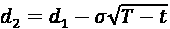
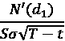

# 第十章：金融中的蒙特卡罗模拟

蒙特卡罗模拟是一类计算算法，通过反复随机抽样解决任何具有概率解释的问题。在金融领域，蒙特卡罗方法之所以流行，是因为它们可以准确估计积分。蒙特卡罗模拟的主要思想是生成大量的样本路径（可能的情景/结果），通常是在给定时间段内进行。然后将时间区间分成若干个时间步骤，这一过程被称为离散化。其目标是近似描述金融工具定价所发生的连续时间。

所有这些模拟的样本路径结果可以用来计算一些指标，例如事件发生的频率、在最后一步时工具的平均值等。历史上，蒙特卡罗方法的主要问题是它需要大量的计算能力来计算所有考虑的情景。如今，这不再是大问题，因为我们可以在台式电脑或笔记本电脑上运行相当先进的模拟，如果计算能力不足，我们还可以使用云计算及其更强大的处理器。

在本章结束时，我们将看到如何在各种场景和任务中使用蒙特卡罗方法。在其中一些任务中，我们将从头开始创建模拟，而在其他任务中，我们将使用现代 Python 库来简化过程。由于该方法的灵活性，蒙特卡罗是计算金融学中最重要的技术之一。它可以适应各种问题，比如定价没有封闭解的衍生品（如美式期权/奇异期权）、债券估值（例如，零息债券）、估算投资组合的不确定性（例如，通过计算风险价值和预期亏损）、以及在风险管理中进行压力测试。本章中，我们将向你展示如何解决其中一些问题。

在本章中，我们将覆盖以下内容：

+   使用几何布朗运动模拟股票价格动态

+   使用模拟定价欧洲期权

+   使用最小二乘蒙特卡罗定价美式期权

+   使用 QuantLib 定价美式期权

+   定价障碍期权

+   使用蒙特卡罗估算风险价值

# 使用几何布朗运动模拟股票价格动态

模拟股票价格在许多衍生品定价中起着至关重要的作用，尤其是期权。由于价格波动的随机性，这些模拟依赖于**随机微分方程**（**SDEs**）。当一个随机过程满足以下 SDE 时，它被认为遵循**几何布朗运动**（**GBM**）：


这里我们有以下内容：

+   *S*[t]—股票价格

+   **—漂移系数，即给定时间段内的平均回报或瞬时预期回报

+   **—扩散系数，即漂移中的波动性有多大

+   *W*[t] —布朗运动

+   *d*—表示在所考虑的时间增量内变量的变化，而 *dt* 是时间的变化

我们不会过多探讨**布朗运动**的性质，因为这超出了本书的范围。简而言之，布朗增量是通过标准正态随机变量  与时间增量的平方根的乘积来计算的。

另一种说法是，布朗增量来自于 ，其中 *t* 是时间增量。我们通过对布朗增量求累积和来获得布朗路径。

上述 SDE 是少数几个具有封闭解的方程之一：


其中 *S*[0] = S(0) 是过程的初始值，在本例中是股票的初始价格。前述方程展示了时间 *t* 的股价与初始股价之间的关系。

对于模拟，我们可以使用以下递归公式：


其中 *Z*[i] 是标准正态随机变量，*i = 0, 1, …, T-1* 是时间索引。之所以可以这样指定，是因为 *W* 的增量是独立的且服从正态分布。欲了解公式的来源，请参考欧拉离散化方法。

GBM 是一种不考虑均值回归和时间相关波动性的过程。因此，它通常用于股票，而不用于债券价格，后者往往显示长期回归面值的特性。

在本食谱中，我们使用蒙特卡罗方法和 GBM 来模拟 IBM 未来一个月的股价——使用 2021 年的数据，我们将模拟 2022 年 1 月的可能路径。

## 如何实现……

执行以下步骤来模拟 IBM 未来一个月的股价：

1.  导入库：

    ```py
    import numpy as np
    import pandas as pd
    import yfinance as yf 
    ```

1.  从雅虎财经下载 IBM 的股价：

    ```py
    df = yf.download("IBM",
                     start="2021-01-01",
                     end="2022-01-31",
                     adjusted=True) 
    ```

1.  计算并绘制每日回报：

    ```py
    returns = df["Adj Close"].pct_change().dropna()
    returns.plot(title="IBM's returns") 
    ```

    运行该代码片段会生成以下图表：

    

    图 10.1：IBM 的简单回报

1.  将数据分为训练集和测试集：

    ```py
    train = returns["2021"]
    test = returns["2022"] 
    ```

1.  指定模拟的参数：

    ```py
    T = len(test)
    N = len(test)
    S_0 = df.loc[train.index[-1], "Adj Close"]
    N_SIM = 100
    mu = train.mean()
    sigma = train.std() 
    ```

1.  定义用于模拟的函数：

    ```py
     def  simulate_gbm(s_0, mu, sigma, n_sims, T, N, 
     random_seed=42):
        np.random.seed(random_seed)

        dt = T/N
        dW = np.random.normal(scale=np.sqrt(dt), size=(n_sims, N))
        W = np.cumsum(dW, axis=1)

        time_step = np.linspace(dt, T, N)
        time_steps = np.broadcast_to(time_step, (n_sims, N))

        S_t = (
            s_0 * np.exp((mu - 0.5 * sigma**2) * time_steps + sigma * W)
        )
        S_t = np.insert(S_t, 0, s_0, axis=1)

        return S_t 
    ```

1.  运行模拟并将结果存储在 DataFrame 中：

    ```py
    gbm_simulations = simulate_gbm(S_0, mu, sigma, N_SIM, T, N)
    sim_df = pd.DataFrame(np.transpose(gbm_simulations),
                          index=train.index[-1:].union(test.index)) 
    ```

1.  创建一个包含每个时间步长的平均值以及对应实际股价的 DataFrame：

    ```py
    res_df = sim_df.mean(axis=1).to_frame()
    res_df = res_df.join(df["Adj Close"])
    res_df.columns = ["simulation_average", "adj_close_price"] 
    ```

1.  绘制模拟结果：

    ```py
    ax = sim_df.plot(
        alpha=0.3, legend=False, title="Simulation's results"
    )
    res_df.plot(ax=ax, color = ["red", "blue"]) 
    ```

    在*图 10.2*中，我们观察到预测的股价（每个时间步长的模拟平均值）呈现出轻微的上升趋势。这可以归因于正漂移项  = 0.07%。然而，由于模拟次数非常少，我们应对这一结论持保留态度。


图 10.2：模拟路径及其平均值

请记住，这种可视化只适用于合理数量的样本路径。在实际情况中，我们希望使用远远超过 100 条的样本路径。蒙特卡洛模拟的一般方法是，样本路径越多，结果越准确/可靠。

## 它是如何工作的...

在*步骤 2*和*步骤 3*中，我们下载了 IBM 的股票价格并计算了简单收益率。在接下来的步骤中，我们将数据划分为训练集和测试集。虽然这里没有显式地训练任何模型，但我们使用训练集计算了收益率的平均值和标准差。然后，我们将这些值作为漂移项（`mu`）和扩散项（`sigma`）系数用于我们的模拟。此外，在*步骤 5*中，我们定义了以下参数：

+   `T`: 预测时域；在本例中，即测试集中的天数。

+   `N`: 预测时域中的时间增量数。对于我们的模拟，我们保持 `N` = `T`。

+   `S_0`: 初始价格。在此模拟中，我们使用训练集中的最后一个观测值。

+   `N_SIM`: 模拟路径的数量。

蒙特卡洛模拟使用了一种称为离散化的过程。其思想是通过将考虑的时间范围划分为大量的离散区间，来近似金融资产的连续定价。这就是为什么除了考虑预测时域外，我们还需要指定要融入时域的时间增量数。

在*步骤 6*中，我们定义了运行模拟的函数。为此类问题定义一个函数/类是良好的实践，因为它在后续步骤中也会派上用场。该函数执行以下步骤：

1.  定义时间增量（`dt`）和布朗增量（`dW`）。在布朗增量矩阵中（大小：`N_SIM` × `N`），每一行描述一个样本路径。

1.  通过对每行进行累加求和（`np.cumsum`），计算布朗运动路径（`W`）。

1.  创建一个包含时间步长（`time_steps`）的矩阵。为此，我们创建了一个在区间内均匀分布的值数组（即模拟的时域）。为此，我们使用了 `np.linspace` 函数。之后，我们使用 `np.broadcast_to` 将该数组广播到目标形状。

1.  使用闭式公式计算每个时间点的股票价格。

1.  将初始值插入到每行的第一个位置。

没有显式需要广播包含时间步的向量。它本应自动广播以匹配所需的维度（`W` 的维度）。通过手动处理，我们可以更好地控制操作，从而使代码更易于调试。我们还应该意识到，在像 R 这样的语言中，是没有自动广播的。

在函数定义中，我们可以将漂移项表示为`(mu - 0.5 * sigma ** 2) * time_steps`，而扩散项则是`sigma * W`。此外，在定义这个函数时，我们采用了向量化的方法。通过这样做，我们避免了编写任何`for`循环，因为在大规模模拟的情况下，`for`循环效率低下。

为了确保结果可复现，在模拟路径之前使用`np.random.seed`。

在*步骤 7*中，我们进行了模拟并将结果（样本路径）存储在一个 DataFrame 中。在此过程中，我们对数据进行了转置，以便每条路径占据一列，这样更方便使用`pandas` DataFrame 的`plot`方法。为了获得合适的索引，我们使用了`DatetimeIndex`的`union`方法，将训练集最后一个观测值的索引和测试集的索引连接起来。

在*步骤 8*中，我们计算了每个时间点的预测股票价格，方法是对所有模拟结果求平均，并将这些结果存储在 DataFrame 中。然后，我们还将每个日期的实际股票价格合并进去。

在最后一步，我们可视化了模拟得到的样本路径。在可视化模拟路径时，我们选择了`alpha=0.3`来使线条变得透明。这样更容易看到表示预测（平均）路径和实际路径的两条线。

## 还有更多……

有一些统计方法可以使蒙特卡罗模拟的工作更为简便（更高的准确度，更快的计算速度）。其中之一是一个叫做**对立变量**的方差减少方法。在这种方法中，我们通过在一对随机抽样之间引入负相关性，来减少估计量的方差。具体来说：在创建样本路径时，对于每一个，我们还取对立值，即。

这种方法的优点包括：

+   为了生成*N*条路径，减少（减少一半）需要抽取的标准正态样本数

+   样本路径方差的减少，同时提高了准确性

我们在改进版的`simulate_gbm`函数中实现了这种方法。此外，我们通过将大部分计算合并成一行，使得函数变得更简短。

在我们实现这些变化之前，我们对初始版本的函数进行了计时：

```py
%timeit gbm_simulations = simulate_gbm(S_0, mu, sigma, N_SIM, T, N) 
```

得分如下：

```py
71 µs ± 126 ns per loop (mean ± std. dev. of 7 runs, 10000 loops each) 
```

新函数定义如下：

```py
def  simulate_gbm(s_0, mu, sigma, n_sims, T, N, random_seed=42, 
 antithetic_var=False):
    np.random.seed(random_seed)

    # time increment
    dt = T/N

    # Brownian
    if antithetic_var:
        dW_ant = np.random.normal(scale = np.sqrt(dt),
                                  size=(int(n_sims/2), N + 1))
        dW = np.concatenate((dW_ant, -dW_ant), axis=0)
    else:
        dW = np.random.normal(scale = np.sqrt(dt),
                              size=(n_sims, N + 1))

    # simulate the evolution of the process
    S_t = s_0 * np.exp(np.cumsum((mu - 0.5*sigma**2)*dt + sigma*dW,
                                 axis=1))
    S_t[:, 0] = s_0

    return S_t 
```

首先，我们在没有对立变量的情况下运行了模拟：

```py
%timeit gbm_simulations = simulate_gbm(S_0, mu, sigma, N_SIM, T, N) 
```

得分如下：

```py
50.3 µs ± 275 ns per loop (mean ± std. dev. of 7 runs, 10000 loops each) 
```

然后，我们在使用对立变量的情况下运行了模拟：

```py
%timeit gbm_simulations = simulate_gbm(S_0, mu, sigma, N_SIM, T, N, antithetic_var=True) 
```

得分如下：

```py
38.2 µs ± 623 ns per loop (mean ± std. dev. of 7 runs, 10000 loops each) 
```

我们成功地使得函数运行得更快。如果你对纯性能感兴趣，可以使用 Numba、Cython 或多线程进一步加速这些模拟。

其他可能的方差减少技术包括控制变量和公共随机数。

## 另请参见

在本例中，我们展示了如何使用几何布朗运动模拟股票价格。然而，还有其他可以使用的随机过程，其中一些包括：

+   跳跃扩散模型：Merton, R. “当标的股票回报不连续时的期权定价”，*Journal of Financial Economics*, 3, 3 (1976)：125–144

+   平方根扩散模型：Cox, John, Jonathan Ingersoll 和 Stephen Ross，“利率期限结构理论”，*Econometrica*, 53, 2 (1985)：385–407

+   随机波动率模型：Heston, S. L., “带有随机波动率的期权闭式解法及其在债券和货币期权中的应用”，*The Review of Financial Studies*, 6(2)：327-343。

# 使用模拟定价欧洲期权

期权是一种衍生工具，因为其价格与标的证券的价格（例如股票）相关联。购买期权合约赋予了在特定日期前以设定价格（称为行权价）买入或卖出标的资产的权利，但不是义务。期权受欢迎的主要原因是它们可以对冲资产价格朝不利方向波动的风险。

在本示例中，我们将重点介绍一种期权类型，即欧洲期权。**欧洲看涨/看跌期权**赋予我们在特定到期日（通常表示为*T*）买入/卖出某项资产的权利（但同样没有义务）。

期权估值有许多可能的方法，例如使用：

+   解析公式（只有某些类型的期权有此公式）

+   二项树方法

+   有限差分

+   蒙特卡洛模拟

欧洲期权是一个例外，因为它们的估值存在解析公式，这对于更复杂的衍生品（如美式期权或奇异期权）并不适用。

为了使用蒙特卡洛模拟定价期权，我们采用风险中性估值方法，在这种方法下，衍生品的公允价值是其未来支付的期望值。换句话说，我们假设期权溢价以与无风险利率相同的速度增长，并使用无风险利率对其进行贴现到现值。对于每条模拟路径，我们计算期权到期时的支付额，取所有路径的平均值，然后将其贴现到现值。

在本示例中，我们展示了如何编写黑-斯科尔斯模型的闭式解法，并使用蒙特卡洛模拟方法。为了简化，我们使用虚拟的输入数据，但实际数据也可以类比使用。

## 如何操作...

执行以下步骤，使用解析公式和蒙特卡洛模拟定价欧洲期权：

1.  导入库：

    ```py
    import numpy as np
    from scipy.stats import norm
    from chapter_10_utils import simulate_gbm 
    ```

    在本示例中，我们使用在前一个示例中定义的`simulate_gbm`函数。为了方便起见，我们将其存储在一个单独的`.py`脚本中，并从中导入。

1.  定义期权的估值参数：

    ```py
    S_0 = 100
    K = 100
    r = 0.05
    sigma = 0.50
    T = 1 
    N = 252 
    dt = T / N 
    N_SIMS = 1_000_000 
    discount_factor = np.exp(-r * T) 
    ```

1.  使用解析解法准备估值函数：

    ```py
     def  black_scholes_analytical(S_0, K, T, r, sigma, type="call"):
        d1 = (
            np.log(S_0 / K) + (r + 0.5*sigma**2) * T) / (sigma*np.sqrt(T)
        )
        d2 = d1 - sigma * np.sqrt(T)
        if type == "call":
            N_d1 = norm.cdf(d1, 0, 1)
            N_d2 = norm.cdf(d2, 0, 1)
            val = S_0 * N_d1 - K * np.exp(-r * T) * N_d2
        elif type == "put":
            N_d1 = norm.cdf(-d1, 0, 1)
            N_d2 = norm.cdf(-d2, 0, 1)
            val = K * np.exp(-r * T) * N_d2 - S_0 * N_d1
        else:
            raise ValueError("Wrong input for type!")

        return val 
    ```

1.  使用指定参数估值看涨期权：

    ```py
    black_scholes_analytical(S_0=S_0, K=K, T=T, 
                             r=r, sigma=sigma, 
                             type="call") 
    ```

    使用指定参数计算欧洲看涨期权的价格为`21.7926`。

1.  使用`simulate_gbm`函数模拟股票路径：

    ```py
    gbm_sims = simulate_gbm(s_0=S_0, mu=r, sigma=sigma,
                            n_sims=N_SIMS, T=T, N=N) 
    ```

1.  计算期权的溢价：

    ```py
    premium = (
        discount_factor * np.mean(np.maximum(0, gbm_sims[:, -1] - K))
    )
    premium 
    ```

计算出的期权溢价为 21.7562。请记住，我们在 `simulate_gbm` 函数中使用了固定的随机种子，以便获得可重复的结果。一般来说，在进行模拟时，我们可以预期结果中会有一定的随机性。

在这里，我们可以看到，通过蒙特卡洛模拟计算出的期权溢价与 Black-Scholes 模型的封闭解计算出的期权溢价接近。为了提高模拟的精度，我们可以增加模拟路径的数量（使用 `N_SIMS` 参数）。

## 工作原理...

在 *第 2 步* 中，我们定义了用于本方法的参数：

+   `S_0`：初始股票价格

+   `K`：执行价，即在到期时我们可以买入/卖出的价格

+   `r`：年化无风险利率

+   `sigma`：标的股票波动率（年化）

+   `T`：到期时间（以年为单位）

+   `N`：模拟的时间增量数量

+   `N_SIMS`：模拟的样本路径数量

+   `discount_factor`：折扣因子，用于计算未来收益的现值

在 *第 3 步* 中，我们定义了一个函数，通过使用 Black-Scholes 模型的封闭解来计算期权溢价（适用于非派息股票）。我们在 *第 4 步* 中使用它来计算蒙特卡洛模拟的基准。

看涨期权和看跌期权的解析解定义如下：




其中 *N()* 代表标准正态分布的**累积分布函数**（**CDF**），*T - t* 是以年为单位表示的到期时间。公式 1 表示欧式看涨期权的价格公式，而公式 2 则表示欧式看跌期权的价格。非正式地，公式 1 中的两个项可以理解为：

+   股票的当前价格，按行使期权买入股票的概率加权 (*N*(*d*[1]))——换句话说，可能获得的收益

+   行使期权（执行价）的折扣价格，按行使期权的概率加权 (*N*(*d*[2]))——换句话说，就是我们将要支付的金额

在 *第 5 步* 中，我们使用了之前方法中的 GBM 模拟函数，获得了 1,000,000 条潜在的标的资产路径。为了计算期权溢价，我们只看了每条路径的终值，并按以下方式计算收益：

+   *max*(*S*[T] *- K, 0*) 用于看涨期权

+   *max*(*K - S*[T]*, 0*) 用于看跌期权

在 *第 6 步* 中，我们取了收益的平均值，并使用折扣因子将其折算到当前价值。

## 还有更多...

### 改进估值函数，通过蒙特卡洛模拟

在前面的步骤中，我们展示了如何重复使用 GBM 模拟来计算欧洲看涨期权溢价。然而，我们可以让计算更快，因为在欧洲期权中，我们只关心终端股票价格，过程中的中间步骤不重要。这就是为什么我们只需要模拟时间*T*时的价格，并使用这些值来计算预期的收益。我们通过一个例子展示如何做到这一点，例子是使用与之前相同参数的欧洲看跌期权。

我们从使用解析公式计算期权溢价开始：

```py
black_scholes_analytical(S_0=S_0, K=K, T=T, r=r, sigma=sigma, type="put") 
```

计算得出的期权溢价为 `16.9155`。

然后，我们定义了修改后的模拟函数，它仅关注模拟路径的终端值：

```py
def  european_option_simulation(S_0, K, T, r, sigma, n_sims,
  type="call", random_seed=42):
    np.random.seed(random_seed)
    rv = np.random.normal(0, 1, size=n_sims)
    S_T = S_0 * np.exp((r - 0.5 * sigma**2) * T + sigma * np.sqrt(T) * rv)
    if type == "call":
        payoff = np.maximum(0, S_T - K)
    elif type == "put":
        payoff = np.maximum(0, K - S_T)
    else:
        raise ValueError("Wrong input for type!")

    premium = np.mean(payoff) * np.exp(-r * T)
    return premium 
```

然后，我们运行模拟：

```py
european_option_simulation(S_0, K, T, r, sigma, N_SIMS, type="put") 
```

结果值为 16.9482，接近前一个值。进一步增加模拟路径的数量应该会提高估值的准确性。

### 使用希腊字母衡量价格敏感度

在讨论期权定价时，还值得一提著名的**希腊字母**——表示金融衍生品价格对一个基础参数变化的敏感度。这些敏感度通常用希腊字母表示，因此得名。以下是五个最常见的敏感度：

+   Delta ()：期权理论价值对基础资产价格变化的敏感度。

+   Vega ()：期权理论价值对基础资产波动率的敏感度。

+   Theta ()：期权理论价值对期权到期时间变化的敏感度。

+   Rho ()：期权理论价值对利率变化的敏感度。

+   Gamma ()：这是一个二阶希腊字母的例子，它表示期权的 delta () 对基础资产价格变化的敏感度。

下表展示了如何使用我们已经用来计算期权溢价的值，表示欧洲看涨期权和看跌期权的希腊字母：

|  | **What** | **Calls** | **Puts** |
| --- | --- | --- | --- |
| **delta** |  |  |  |
| **gamma** |  |  |
| **vega** |  |  |
| **theta** |  |  |  |
| **rho** |  |  |  |

N'() 符号表示**标准正态分布的概率密度函数**（**PDF**）。如你所见，希腊字母实际上是模型价格（在这种情况下是欧洲看涨期权或看跌期权）相对于模型参数之一的偏导数。我们还应记住，希腊字母因模型不同而有所不同。

# 使用最小二乘蒙特卡罗法对美式期权定价

在这个方法中，我们学习如何对美式期权进行估值。欧洲期权和美式期权的主要区别在于，美式期权可以在到期日前的任何时间行使——基本上，只要标的资产的价格对期权持有者有利，便可以行使。

这种行为给估值带来了额外的复杂性，并且该问题没有封闭形式的解。在使用蒙特卡罗模拟时，我们不能仅仅看每个样本路径上的终端价值，因为期权的行使可以发生在路径的任何地方。因此，我们需要采用一种更复杂的方法，称为**最小二乘蒙特卡罗法**（**LSMC**），该方法由 Longstaff 和 Schwartz（2001）提出。

首先，将时间轴从 [0, *T*] 离散化为有限个等距区间，提前行使只能发生在这些特定的时间步骤上。实际上，美式期权被近似为百慕大期权。对于任何时间步 *t*，当即时行使的收益大于继续价值时，会进行提前行使。

这可以通过以下公式表示：


这里，*h*[t]*(s)* 代表期权的收益（也称为期权的内在价值，按欧洲期权的方式计算），*C*[t]*(s)* 是期权的继续价值，其定义为：


这里，*r* 是无风险利率，*dt* 是时间增量，且  是给定标的价格下的风险中性期望。继续价值基本上是指在某个时间点不行使期权的期望回报。

在使用蒙特卡罗模拟时，我们可以为每条路径 *i* 和时间 *t* 定义继续价值 *e*^(-rdt)V[t+dt,i]。直接使用该值是不可能的，因为这意味着完美的预见性。因此，LSMC 算法使用线性回归来估算期望的继续价值。在该算法中，我们将折现后的未来价值（从保持期权中获得）回归到现货价格（时间 *t* 的价格）的一组基函数上。最简单的方法是使用 *x* 次多项式回归。基函数的其他选项包括勒让德多项式、厄米特多项式、切比雪夫多项式、盖根鲍尔多项式或雅可比多项式。

我们将这个算法从后向前迭代（从时间*T-1*到 0），在最后一步取平均折现值作为期权溢价。欧洲期权的溢价代表了美国期权溢价的下限。两者之间的差异通常被称为提前行使溢价。

## 如何操作...

执行以下步骤，通过最小二乘蒙特卡罗方法定价美国期权：

1.  导入库：

    ```py
    import numpy as np
    from chapter_10_utils import (simulate_gbm,
                                  black_scholes_analytical,
                                  lsmc_american_option) 
    ```

1.  定义期权的参数：

    ```py
    S_0 = 36
    K = 40
    r = 0.06
    sigma = 0.2
    T = 1 # 1 year
    N = 50
    dt = T / N
    N_SIMS = 10 ** 5
    discount_factor = np.exp(-r * dt)
    OPTION_TYPE = "put"
    POLY_DEGREE = 5 
    ```

1.  使用 GBM 模拟股票价格：

    ```py
    gbm_sims = simulate_gbm(s_0=S_0, mu=r, sigma=sigma, 
                            n_sims=N_SIMS, T=T, N=N) 
    ```

1.  计算支付矩阵：

    ```py
    payoff_matrix = np.maximum(K - gbm_sims, np.zeros_like(gbm_sims)) 
    ```

1.  定义价值矩阵并填充最后一列（时间*T*）：

    ```py
    value_matrix = np.zeros_like(payoff_matrix)
    value_matrix[:, -1] = payoff_matrix[:, -1] 
    ```

1.  迭代计算给定时间内的继续价值和价值向量：

    ```py
    for t in range(N - 1, 0 , -1):
        regression = np.polyfit(
            gbm_sims[:, t], 
            value_matrix[:, t + 1] * discount_factor, 
            POLY_DEGREE
        )
        continuation_value = np.polyval(regression, gbm_sims[:, t])
        value_matrix[:, t] = np.where(
            payoff_matrix[:, t] > continuation_value,
            payoff_matrix[:, t],
            value_matrix[:, t + 1] * discount_factor
        ) 
    ```

1.  计算期权的溢价：

    ```py
    option_premium = np.mean(value_matrix[:, 1] * discount_factor)
    option_premium 
    ```

    指定的美国看跌期权的溢价为`4.465`。

1.  计算具有相同参数的欧洲看跌期权的溢价：

    ```py
    black_scholes_analytical(S_0=S_0, K=K, T=T, r=r, sigma=sigma,
                             type="put") 
    ```

    具有相同参数的欧洲看跌期权价格为`3.84`。

1.  作为额外的检查，计算美国和欧洲看涨期权的价格：

    ```py
    european_call_price = black_scholes_analytical(
        S_0=S_0, K=K, T=T, r=r, sigma=sigma
    )
    american_call_price = lsmc_american_option(
        S_0=S_0, K=K, T=T, N=N, r=r, 
        sigma=sigma, n_sims=N_SIMS, 
        option_type="call", 
        poly_degree=POLY_DEGREE
    )
    print(f"European call's price: {european_call_price:.3f}")
    print(f"American call's price: {american_call_price:.3f}") 
    ```

欧洲看涨期权的价格为`2.17`，而美国看涨期权的价格（使用 100,000 次模拟）为`2.10`。

## 它是如何工作的...

在*第 2 步*中，我们再次定义了所考虑的美国期权的参数。为了比较，我们采用了 Longstaff 和 Schwartz（2001）使用的相同值。在*第 3 步*中，我们使用之前配方中的`simulate_gbm`函数模拟了股票的演变。然后，我们使用与欧洲期权相同的公式计算了看跌期权的支付矩阵。

在*第 5 步*中，我们准备了一个期权价值的时间矩阵，我们将其定义为与支付矩阵大小相同的零矩阵。我们用支付矩阵的最后一列填充价值矩阵的最后一列，因为在最后一步没有进一步的计算要进行——支付等于欧洲期权。

在*第 6 步*中，我们从时间*T-1*到 0 执行了算法的反向部分。在每一步中，我们将预期的继续价值估计为横截面的线性回归。我们使用`np.polyfit`将 5 次多项式拟合到数据中。

然后，我们在特定值处评估多项式（使用`np.polyval`），这与从线性回归中获得拟合值相同。我们将预期的继续价值与支付进行比较，以判断是否应该行使期权。如果支付值高于继续价值的预期值，我们将其设定为支付值。否则，我们将其设定为折现的下一步值。我们使用`np.where`进行此选择。

也可以使用`scikit-learn`进行多项式拟合。为此，需要将`LinearRegression`与`PolynomialFeatures`结合使用。

在算法的*第 7 步*中，我们通过取折现后的*t = 1*值向量的平均值来获得期权溢价。

在最后两步中，我们进行了某些有效性检查。首先，我们计算了具有相同参数的欧洲看跌期权的溢价。其次，我们重复了所有步骤，获取了具有相同参数的美式和欧式看涨期权的溢价。为了简化操作，我们将整个 LSMC 算法放入一个函数中，该函数可在本书的 GitHub 仓库中找到。

对于看涨期权，美式和欧式期权的溢价应相等，因为在没有股息的情况下，行使期权永远不是最优选择。我们的结果非常接近，但通过增加模拟样本路径的数量，可以获得更准确的价格。

原则上，Longstaff-Schwartz 算法应该低估美式期权的价值，因为通过基函数近似的延续价值只是一个近似。因此，该算法并不总是能做出正确的行权决策。这意味着期权的价值将低于最优行权的情况。

## 另见

额外资源可在此处获取：

+   Longstaff, F. A., & Schwartz, E. S. 2001\. “通过模拟估值美式期权：一种简单的最小二乘方法，” *金融研究评论*，14(1)：113-147

+   Broadie, M., Glasserman, P., & Jain, G. 1997\. “使用随机树方法对美式期权进行估值的替代方法。对美式期权价格的增强蒙特卡洛估计，” *衍生品期刊*，5：25-44。

# 使用 QuantLib 定价美式期权

在上一条食谱中，我们展示了如何手动编码 Longstaff-Schwartz 算法。然而，我们也可以使用已经存在的框架来进行衍生品估值。其中最受欢迎的之一是 QuantLib。它是一个开源的 C++ 库，提供用于金融工具估值的工具。通过使用 **简化包装器和接口生成器**（**SWIG**），可以在 Python（以及一些其他编程语言，如 R 或 Julia）中使用 QuantLib。在本条食谱中，我们展示了如何对上一条食谱中定价的相同美式看跌期权进行定价，但该库本身还有许多更有趣的功能值得探索。

## 准备工作

执行上一条食谱中的*步骤 2*，以获取我们将使用 QuantLib 估值的美式看跌期权的参数。

## 操作步骤...

执行以下步骤以使用 QuantLib 估值美式期权：

1.  导入库：

    ```py
    import QuantLib as ql 
    ```

1.  指定日历和日期计数方式：

    ```py
    calendar = ql.UnitedStates()
    day_counter = ql.ActualActual() 
    ```

1.  指定期权的估值日期和到期日期：

    ```py
    valuation_date = ql.Date(1, 1, 2020)
    expiry_date =  ql.Date(1, 1, 2021)
    ql.Settings.instance().evaluationDate = valuation_date 
    ```

1.  定义期权类型（看涨/看跌）、行权方式（美式）和支付：

    ```py
    if OPTION_TYPE == "call":
        option_type_ql = ql.Option.Call
    elif OPTION_TYPE == "put":
        option_type_ql = ql.Option.Put

    exercise = ql.AmericanExercise(valuation_date, expiry_date)
    payoff = ql.PlainVanillaPayoff(option_type_ql, K) 
    ```

1.  准备与市场相关的数据：

    ```py
    u = ql.SimpleQuote(S_0)
    r = ql.SimpleQuote(r)
    sigma = ql.SimpleQuote(sigma) 
    ```

1.  指定与市场相关的曲线：

    ```py
    underlying = ql.QuoteHandle(u)
    volatility = ql.BlackConstantVol(0, ql.TARGET(),
                                     ql.QuoteHandle(sigma),
                                     day_counter)
    risk_free_rate = ql.FlatForward(0, ql.TARGET(),
                                    ql.QuoteHandle(r),
                                    day_counter) 
    ```

1.  将与市场相关的数据插入到 Black-Scholes 过程：

    ```py
    bs_process = ql.BlackScholesProcess(
        underlying,
        ql.YieldTermStructureHandle(risk_free_rate),
        ql.BlackVolTermStructureHandle(volatility),
    ) 
    ```

1.  实例化美式期权的蒙特卡洛引擎：

    ```py
    engine = ql.MCAmericanEngine(
        bs_process, "PseudoRandom", timeSteps=N, 
        polynomOrder=POLY_DEGREE, 
        seedCalibration=42, 
        requiredSamples=N_SIMS
    ) 
    ```

1.  实例化`option`对象并设置其定价引擎：

    ```py
    option = ql.VanillaOption(payoff, exercise)
    option.setPricingEngine(engine) 
    ```

1.  计算期权溢价：

    ```py
    option_premium_ql = option.NPV()
    option_premium_ql 
    ```

美式看跌期权的价值为 `4.457`。

## 它是如何工作的...

由于我们想将获得的结果与之前食谱中的结果进行比较，因此我们使用了与之前相同的设置。为了简洁起见，我们在此不展示所有代码，但我们应该运行之前食谱中的*步骤 2*。

在*步骤 2*中，我们指定了日历和日计数约定。日计数约定决定了各种金融工具（如债券）随时间积累利息的方式。`actual/actual`约定意味着我们使用实际经过的天数和实际的一年天数，即 365 天或 366 天。还有许多其他约定，如`actual/365 (fixed)`、`actual/360`等。

在*步骤 3*中，我们选择了两个日期——估值日期和到期日期——因为我们关注的是定价一个将在一年后到期的期权。重要的是要将`ql.Settings.instance().evaluationDate`设置为所考虑的估值日期，以确保计算正确进行。在这种情况下，日期仅决定时间的流逝，意味着期权将在一年内到期。如果我们使用不同的日期但它们之间的间隔相同，我们会得到相同的结果（由于模拟的随机组件，会有一些误差）。

我们可以通过运行以下代码来检查到期时间（以年为单位）：

```py
T = day_counter.yearFraction(valuation_date, expiry_date) 
print(f'Time to expiry in years: {T}') 
```

执行代码片段后返回以下内容：

```py
Time to expiry in years: 1.0 
```

接下来，我们定义了期权类型（看涨/看跌）、行使类型（欧式、美式或百慕大式）以及支付方式（普通）。在*步骤 5*中，我们准备了市场数据。我们将值用引号包围（`ql.SimpleQuote`），这样这些值就可以更改，并且这些更改会被正确地注册到工具中。这是计算希腊字母（*后续内容…*）中的一个重要步骤。

在*步骤 6*中，我们定义了相关的曲线。简而言之，`TARGET`是一个包含哪些天是节假日的日历。

在此步骤中，我们指定了**Black-Scholes**（**BS**）过程的三个重要组成部分，它们是：

+   标的资产的价格

+   波动率，假设它是恒定的

+   无风险利率，假设它随时间保持不变

我们将所有这些对象传递给了 Black-Scholes 过程（`ql.BlackScholesProcess`），该过程在*步骤 7*中定义。然后，我们将该过程对象传递给用于定价美式期权的特殊引擎，该引擎使用蒙特卡洛模拟（针对不同类型的期权和定价方法有许多预定义的引擎）。此时，我们提供了所需的模拟次数、离散化的时间步数以及 LSMC 算法中多项式的度/阶数。此外，我们还提供了随机种子（`seedCalibration`），以确保结果可复现。

在*步骤 9*中，我们通过提供之前定义的支付方式和行使方式类型，创建了一个`ql.VanillaOption`实例。我们还通过`setPricingEngine`方法将定价引擎设置为在*步骤 8*中定义的引擎。

最后，我们使用`NPV`方法得出了期权的价格。

我们可以看到，使用 QuantLib 得到的期权溢价与之前计算的结果非常相似，这进一步验证了我们的结果。这里需要注意的关键点是，针对各种不同衍生品的估值流程大致相似，因此熟悉这一流程非常重要。我们也可以通过替换几个类，将其用于蒙特卡洛模拟来定价欧洲期权。

QuantLib 还允许我们使用方差减少技术，如反向值或控制变量。

## 还有更多…

现在我们已经完成了前面的步骤，可以计算希腊字母。如前所述，希腊字母表示衍生品价格对某一标的参数（如标的资产价格、到期时间等）变化的敏感度。

当有用于计算希腊字母的解析公式时（例如，当标的 QuantLib 引擎使用解析公式时），我们只需运行代码，例如`option.delta()`，即可访问希腊字母。然而，在使用二叉树或模拟等方法估值时，没有解析公式，我们会收到错误提示（`RuntimeError: delta not provided`）。这并不意味着无法计算它，而是我们需要采用数值微分法并自行计算。

在这个例子中，我们只提取 delta。因此，相关的双侧公式是：


这里，*P(S)*是给定标的资产价格*S*下的工具价格；*h*是一个非常小的增量。

运行以下代码块来计算 delta：

```py
u_0 = u.value() # original value
h = 0.01
u.setValue(u_0 + h)
P_plus_h = option.NPV()
u.setValue(u_0 - h)
P_minus_h = option.NPV()
u.setValue(u_0) # set back to the original value
delta = (P_plus_h - P_minus_h) / (2 * h) 
```

delta 的最简单解释是，期权的 delta 为-1.36，意味着如果标的股票的价格每股上涨 1 美元，期权每股将下降 1.36 美元；否则，一切保持不变。

# 定价障碍期权

**障碍期权**是一种属于外来期权类别的期权。这是因为它们比普通的欧洲期权或美式期权更为复杂。障碍期权是一种路径依赖型期权，因为它们的收益以及价值都取决于标的资产的价格路径。

更准确地说，收益取决于标的资产是否达到或超过了预定的价格阈值。障碍期权通常分为以下几类：

+   一种敲出期权，即如果标的资产的价格超过某个阈值，期权将变得毫无价值

+   一种敲入期权，即期权在标的资产价格达到某个阈值之前没有任何价值

考虑到上述障碍期权的类别，我们可以处理以下几类：

+   向上出场：期权开始时处于激活状态，当标的资产价格上涨到障碍水平时，期权变为无效（失效）

+   向上入场：期权开始时处于非激活状态，当标的资产价格上涨到障碍水平时，期权变为激活状态（击中）

+   向下出场：期权开始时处于激活状态，当标的资产价格下跌到障碍水平时，期权变为击中（失效）

+   向下入场：期权开始时处于非激活状态，当标的资产价格下跌到障碍水平时，期权变为激活状态

除了上述描述的行为外，障碍期权的表现类似于标准的看涨和看跌期权。

在这个实例中，我们使用蒙特卡罗模拟为“向上入场”欧式看涨期权定价，标的资产当前交易价格为 55 美元，行权价为 60 美元，障碍水平为 65 美元，距离到期时间为 1 年。

## 如何操作……

执行以下步骤来为“向上入场”欧式看涨期权定价：

1.  导入库：

    ```py
    import numpy as np
    from chapter_10_utils import simulate_gbm 
    ```

1.  定义估值的参数：

    ```py
    S_0 = 55
    K = 60
    BARRIER = 65
    r = 0.06
    sigma = 0.2
    T = 1
    N = 252
    dt = T / N
    N_SIMS = 10 ** 5
    OPTION_TYPE = "call"
    discount_factor = np.exp(-r * T) 
    ```

1.  使用`simulate_gbm`函数模拟股票路径：

    ```py
    gbm_sims = simulate_gbm(s_0=S_0, mu=r, sigma=sigma,
                            n_sims=N_SIMS, T=T, N=N) 
    ```

1.  计算每条路径的最大值：

    ```py
    max_value_per_path = np.max(gbm_sims, axis=1) 
    ```

1.  计算支付：

    ```py
    payoff = np.where(max_value_per_path > BARRIER,
                      np.maximum(0, gbm_sims[:, -1] - K),
                      0) 
    ```

1.  计算期权的溢价：

    ```py
    premium = discount_factor * np.mean(payoff)
    premium 
    ```

所考虑的“向上入场”欧式看涨期权的溢价为`3.6267`。

## 它是如何工作的……

在前两步中，我们导入了库（包括已在本章中使用的辅助函数`simulate_gbm`），并定义了估值的参数。

在*步骤 3*中，我们使用几何布朗运动模拟了 100,000 条可能的路径。然后，我们计算了每条路径中标的资产的最高价格。因为我们处理的是“向上入场”期权，我们只需要知道标的资产的最高价格是否达到了障碍水平。如果达到了，那么期权在到期时的支付将等同于一个普通的欧式看涨期权的支付。如果障碍水平未达到，那么该路径的支付将为零。我们在*步骤 5*中编码了这个支付条件。

最后，我们按照之前处理欧式看涨期权的方式进行操作——取平均支付并使用折现因子进行折现。

我们可以对障碍期权的价格建立一些直觉。例如，“向上出场”障碍期权的价格应该低于其普通等效期权的价格。这是因为，除了“向上出场”障碍期权可能会在到期前被击出这一额外的风险外，两者的支付是相同的。这个额外的风险应该反映在“向上出场”障碍期权的较低价格中，与其普通对等期权相比。

在这个实例中，我们手动为“向上入场”欧式看涨期权定价。然而，我们也可以使用 QuantLib 库来完成此任务。由于这将与之前的实例中有大量代码重复，因此我们在本书中没有展示。

但是强烈建议你查看 GitHub 上附带的笔记本中使用 QuantLib 的解决方案。我们只是提到，通过 QuantLib 解决方案得到的期权溢价为 3.6457，与我们手动计算的结果非常接近。差异可以归因于模拟的随机成分。

## 还有更多…

障碍期权的估值比较复杂，因为这些金融工具是路径依赖的。我们已经提到过如何使用蒙特卡罗模拟来定价此类期权；然而，还有几种替代方法：

+   使用静态复制投资组合（普通期权）来模拟障碍期权在到期时以及在障碍期内几个离散时间点的价值。然后，可以使用 Black-Scholes 模型对这些期权进行定价。通过这种方法，我们可以获得所有类型障碍期权的封闭形式价格和复制策略。

+   使用二项树方法进行期权定价。

+   使用**偏微分方程**（**PDE**），并可能将其与有限差分法结合使用。

# 使用蒙特卡罗模拟估算风险价值

**风险价值**（**VaR**）是一个非常重要的金融指标，用于衡量与某个头寸、投资组合等相关的风险。通常缩写为 VaR，不要与**向量自回归**（缩写为 **VAR**）混淆。VaR 报告在特定置信水平下，在正常市场条件下某个时间段内的最坏预期损失。理解 VaR 最简单的方式是通过一个例子。假设我们的投资组合 1 天 95% VaR 为 $100。这意味着在正常市场条件下，95% 的时间里，我们持有该投资组合 1 天不会损失超过 $100。

通常，VaR 给出的损失是以正值（绝对值）呈现的。这就是为什么在这个例子中，VaR 为 $100 表示损失不超过 $100。不过，负 VaR 也是可能的，它表示有较高的获利概率。例如，1 天 95% VaR 为 $-100 表示我们的投资组合在接下来的 1 天内有 95% 的概率会赚取超过 $100。

计算 VaR 的方法有很多，包括：

+   参数法（方差-协方差）

+   历史模拟法

+   蒙特卡罗模拟

在本方案中，我们仅考虑最后一种方法。我们假设我们持有一个由两种资产（英特尔和 AMD 的股票）组成的投资组合，并且我们想计算 1 天的风险价值。

## 如何做...

执行以下步骤，通过蒙特卡罗模拟估算风险价值：

1.  导入库：

    ```py
    import numpy as np
    import pandas as pd
    import yfinance as yf
    import seaborn as sns 
    ```

1.  定义将用于此方案的参数：

    ```py
    RISKY_ASSETS = ["AMD", "INTC"]
    SHARES = [5, 5]
    START_DATE = "2020-01-01"
    END_DATE = "2020-12-31"
    T = 1
    N_SIMS = 10 ** 5 
    ```

1.  从 Yahoo Finance 下载价格数据：

    ```py
    df = yf.download(RISKY_ASSETS, start=START_DATE,
                     end=END_DATE, adjusted=True) 
    ```

1.  计算每日收益：

    ```py
    returns = df["Adj Close"].pct_change().dropna()
    returns.plot(title="Intel's and AMD's daily stock returns in 2020") 
    ```

    运行代码片段后，得到以下图形。

    

    图 10.3：2020 年英特尔和 AMD 的简单收益

    此外，我们计算了两组数据之间的皮尔逊相关系数（使用`corr`方法），其值为`0.5`。

1.  计算协方差矩阵：

    ```py
    cov_mat = returns.cov() 
    ```

1.  对协方差矩阵进行 Cholesky 分解：

    ```py
    chol_mat = np.linalg.cholesky(cov_mat) 
    ```

1.  从标准正态分布中抽取相关的随机数：

    ```py
    rv = np.random.normal(size=(N_SIMS, len(RISKY_ASSETS)))
    correlated_rv = np.transpose(
        np.matmul(chol_mat, np.transpose(rv))
    ) 
    ```

1.  定义将用于模拟的指标：

    ```py
    r = np.mean(returns, axis=0).values
    sigma = np.std(returns, axis=0).values
    S_0 = df["Adj Close"].values[-1, :]
    P_0 = np.sum(SHARES * S_0) 
    ```

1.  计算所考虑股票的终端价格：

    ```py
    S_T = S_0 * np.exp((r - 0.5 * sigma ** 2) * T +
                       sigma * np.sqrt(T) * correlated_rv) 
    ```

1.  计算终端投资组合价值和投资组合收益率：

    ```py
    P_T = np.sum(SHARES * S_T, axis=1)
    P_diff = P_T - P_0 
    ```

1.  计算所选置信度水平的 VaR：

    ```py
    P_diff_sorted = np.sort(P_diff)
    percentiles = [0.01, 0.1, 1.]
    var = np.percentile(P_diff_sorted, percentiles)
    for x, y in zip(percentiles, var):
        print(f'1-day VaR with {100-x}% confidence: ${-y:.2f}') 
    ```

    运行代码片段将生成如下输出：

    ```py
    1-day VaR with 99.99% confidence: $2.04
    1-day VaR with 99.9% confidence: $1.48
    1-day VaR with 99.0% confidence: $0.86 
    ```

1.  在图表中展示结果：

    ```py
    ax = sns.distplot(P_diff, kde=False)
    ax.set_title("""Distribution of possible 1-day changes
     in portfolio value 1-day 99% VaR""", 
                  fontsize=16)
    ax.axvline(var[2], 0, 10000) 
    ```

运行代码片段将生成如下图形：


图 10.4：投资组合价值可能变化的 1 天分布和 1 天 99% VaR

*图 10.4* 展示了未来 1 天投资组合可能价值变化的分布。我们用垂直线表示 99%的风险价值（VaR）。

## 它是如何工作的...

在*步骤 2* 到 *步骤 4* 中，我们下载了 2020 年 Intel 和 AMD 的每日股票价格，提取了调整后的收盘价，并将其转换为简单收益率。我们还定义了几个参数，例如模拟次数和我们投资组合中持有的股票数量。

计算 VaR 有两种方法：

+   根据价格计算 VaR：通过使用股票数量和资产价格，我们可以计算出投资组合当前的价值以及未来 X 天的可能价值。

+   根据收益率计算 VaR：通过使用投资组合中每个资产的百分比权重和资产的预期收益率，我们可以计算出未来 X 天的预期投资组合收益率。然后，我们可以根据该收益率和当前投资组合价值，将 VaR 表示为美元金额。

蒙特卡洛方法用于确定资产价格，通过从标准正态分布中抽取随机变量。在计算投资组合 VaR 时，我们需要考虑到投资组合中的资产可能存在相关性。为此，在*步骤 5* 到 *步骤 7* 中，我们生成了相关的随机变量。具体步骤是：首先，我们计算了历史协方差矩阵；然后，我们对其进行了 Cholesky 分解，并将得到的矩阵与包含随机变量的矩阵相乘。

另一种使随机变量相关的方法是使用**奇异值分解**（**SVD**）替代 Cholesky 分解。我们可以使用的函数是`np.linalg.svd`。

在*步骤 8*中，我们计算了资产收益的历史平均值、伴随的标准差、最后已知的股票价格和初始投资组合价值。在*步骤 9*中，我们应用了几何布朗运动 SDE 的解析解，计算了两只资产的可能 1 天后的股票价格。

为了计算投资组合 VaR，我们计算了可能的 1 天前投资组合价值及其相应差异（P[T] - P[0]）。然后，我们将这些差异按升序排列。X%的 VaR 就是排序后的投资组合差异的(1-X)百分位。

银行通常会计算 1 天和 10 天 VaR。为了计算后者，它们可以通过 1 天的步长（离散化）模拟其资产在 10 天期间的价值。然而，它们也可以计算 1 天 VaR，并将其乘以 10 的平方根。如果这样做可以降低资本要求，银行可能会觉得这种方法更有利。

## 还有更多...

如我们所提到的，计算风险价值的方法有多种，每种方法都有一套潜在的缺点，其中一些包括：

+   假设使用参数化分布（方差-协方差方法）

+   假设日收益/损失是独立同分布的（IID）

+   未能捕捉足够的尾部风险

+   没有考虑所谓的黑天鹅事件（除非它们已经出现在历史样本中）

+   历史 VaR 可能对新的市场条件适应较慢

+   历史模拟方法假设过去的回报足以评估未来的风险（与之前的观点相关）

最近在使用深度学习技术进行 VaR 估计方面有一些有趣的进展，例如，生成对抗网络（GANs）。

VaR 的另一个普遍缺点是，当潜在损失超过 VaR 设定的阈值时，它无法提供关于损失大小的信息。这时**预期短缺**（也称为条件 VaR 或预期尾部损失）就派上用场了。它简单地说明了在最坏的 X%的情境下，预期损失是多少。

计算预期短缺有很多方法，但我们展示了一种与 VaR 易于连接且可以通过蒙特卡洛模拟进行估算的方法。

以双资产投资组合为例，我们希望知道以下内容：如果损失超过 VaR，它将有多大？为了得到这个数字，我们需要筛选出所有高于 VaR 给定值的损失，并通过取平均值来计算它们的预期值。

我们可以使用以下代码片段来实现这一点：

```py
var = np.percentile(P_diff_sorted, 5)
expected_shortfall = P_diff_sorted[P_diff_sorted<=var].mean() 
```

请记住，计算预期短缺时，我们只使用了为计算 VaR 而进行的所有模拟中的一小部分。在*图 10.4*中，我们只考虑 VaR 线左侧的观察值。这就是为什么，为了得到合理的预期短缺结果，整体样本必须足够大的原因。

1 天 95%VaR 为$0.29，而伴随的预期短缺为$0.64。我们可以这样解读这些结果：如果损失超过 95% VaR，我们可以预期持有投资组合 1 天将损失$0.64。

# 总结

在本章中，我们介绍了蒙特卡洛模拟，这是一种在许多金融任务中都非常有用的多功能工具。我们演示了如何利用它们通过几何布朗运动模拟股票价格，定价各种类型的期权（欧洲期权、美式期权和障碍期权），以及计算风险价值（Value-at-Risk）。

然而，在本章中，我们仅仅触及了蒙特卡洛模拟所有可能应用的皮毛。在接下来的章节中，我们还将展示如何使用它们来获得用于资产配置的有效前沿。

# 加入我们的 Discord 社区！

要加入本书的 Discord 社区——在这里你可以分享反馈、向作者提问并了解新版本——请扫描下面的二维码：


[`packt.link/ips2H`](https://packt.link/ips2H)
