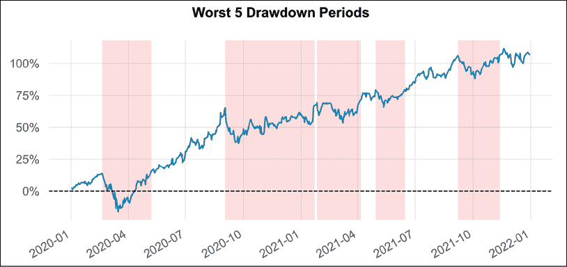

# 11

# 资产配置

资产配置是每个投资者都必须面对的最重要的决策，且没有一种“万能”解决方案适用于所有投资者。资产配置是指将投资者的总投资金额分配到特定资产上（无论是股票、期权、债券或其他任何金融工具）。在进行配置时，投资者希望平衡风险和潜在的回报。同时，配置还依赖于诸如个人目标（预期回报）、风险承受能力（投资者愿意接受的风险程度）或投资期限（短期或长期投资）等因素。

资产配置中的关键框架是**现代投资组合理论**（**MPT**，也称为**均值-方差分析**）。该理论由诺贝尔奖获得者哈里·马科维茨提出，描述了风险厌恶型投资者如何构建投资组合，以在给定的风险水平下最大化预期回报（利润）。MPT 的主要见解是，投资者不应单独评估某一资产的表现（例如预期回报或波动性），而应调查其对投资组合整体表现的影响。

MPT 与多样化的概念密切相关，多样化的基本含义是拥有不同种类的资产能够降低风险，因为某一特定证券的亏损或收益对整体投资组合的表现影响较小。另一个需要注意的关键概念是，虽然投资组合的回报是各个资产回报的加权平均，但对于风险（波动性）并非如此。这是因为波动性还受到资产之间相关性的影响。有趣的是，通过优化资产配置，有可能拥有一个波动性低于组合中所有资产的最低单一资产波动性的投资组合。原则上，资产之间的相关性越低，对于多样化越有利。如果资产之间具有完全的负相关性，我们可以将所有的风险进行多样化。

现代投资组合理论的主要假设是：

+   投资者是理性的，旨在最大化回报，同时尽量避免风险。

+   投资者共同的目标是最大化预期回报。

+   所有投资者对潜在投资拥有相同的信息水平。

+   手续费、税费和交易成本未被考虑在内。

+   投资者可以以无风险利率借贷资金（没有限制）。

在本章中，我们从最基本的资产配置策略开始，在此基础上学习如何评估投资组合的表现（同样适用于单个资产）。随后，我们展示三种不同的方法来获得有效前沿，同时放宽 MPT 的一些假设。学习如何解决优化问题的一个主要好处是，它们可以很容易地进行重构，例如，通过优化不同的目标函数或添加特定的权重约束。这只需要对代码进行轻微修改，而框架的大部分内容保持不变。最后，我们探索一种基于图论和机器学习相结合的新型资产配置方法——层次风险平价。

本章涵盖以下配方：

+   评估等权重投资组合的表现

+   使用蒙特卡罗模拟找到有效前沿

+   使用`SciPy`优化找到有效前沿

+   使用`CVXPY`通过凸优化找到有效前沿

+   使用层次风险平价寻找最优投资组合

# 评估等权重投资组合的表现

我们从检查最基本的资产配置策略开始：**等权重**（**1/n**）**投资组合**。其思路是对所有考虑的资产分配相等的权重，从而实现投资组合的多元化。尽管听起来很简单，但 DeMiguel、Garlappi 和 Uppal（2007）表明，使用更先进的资产配置策略可能很难超越*1/n*投资组合的表现。

本配方的目标是展示如何创建由 FAANG 公司（Facebook/Meta、Amazon、Apple、Netflix 和 Google/Alphabet）组成的*1/n*投资组合，计算其回报，并使用`quantstats`库快速获得所有相关的投资组合评估指标，以便生成一张快速汇总的报告。历史上，快速汇总报告是简明（通常是单页）的文件，总结了公开公司重要的信息。

## 如何操作...

执行以下步骤来创建并评估*1/n*投资组合：

1.  导入库：

    ```py
    import yfinance as yf
    import numpy as np
    import pandas as pd
    import quantstats as qs 
    ```

1.  定义考虑的资产并从 Yahoo Finance 下载其价格：

    ```py
    ASSETS = ["META", "AMZN", "AAPL", "NFLX", "GOOG"]
    n_assets = len(ASSETS)
    prices_df = yf.download(ASSETS,
                            start="2020-01-01",
                            end="2021-12-31",
                            adjusted=True) 
    ```

1.  计算单个资产回报：

    ```py
    returns = prices_df["Adj Close"].pct_change().dropna() 
    ```

1.  定义权重：

    ```py
    portfolio_weights = n_assets * [1 / n_assets] 
    ```

1.  计算投资组合回报：

    ```py
    portfolio_returns = pd.Series(
        np.dot(portfolio_weights, returns.T), 
        index=returns.index
    ) 
    ```

1.  生成基本的表现评估图：

    ```py
    qs.plots.snapshot(portfolio_returns,
                      title="1/n portfolio's performance",
                      grayscale=True) 
    ```

    执行此代码片段生成以下图形：

    

    图 11.1：1/n 投资组合的选定评估指标

    创建的快照包括累积投资组合回报、显示回撤期的水下图（我们将在*如何运作...*部分进行解释）和每日回报。

1.  计算基本的投资组合评估指标：

    ```py
    qs.reports.metrics(portfolio_returns,
                       benchmark="SPY",
                       mode="basic",
                       prepare_returns=False) 
    ```

    执行此代码片段会返回我们投资组合和基准的以下指标：


图 11.2：1/n 投资组合与标准普尔 500 基准的表现评估指标

我们将在接下来的章节中描述*图 11.2*中呈现的一些指标。

## 它是如何工作的...

在*步骤 1*到*步骤 3*中，我们遵循了已经建立的方法——导入库，设置参数，下载了 2020 年至 2021 年期间 FAANG 公司（Facebook, Apple, Amazon, Netflix, Google）的股票价格，并使用调整后的收盘价计算了简单回报。

在*步骤 4*中，我们创建了一个权重列表，每个权重等于`1/n_assets`，其中`n_assets`是我们希望在投资组合中包含的资产数量。接下来，我们将投资组合的回报计算为投资组合权重与资产回报转置矩阵的矩阵乘法（也称为点积）。为了转置矩阵，我们使用了`pandas` DataFrame 的`T`方法。然后，我们将投资组合回报存储为`pandas` Series 对象，因为这是后续步骤的输入。

在本书的第一版中，我们使用`pyfolio`库探索了*1/n*投资组合的表现。然而，自那时以来，负责该库的公司（Quantopian）已关闭，且该库不再积极维护。尽管如此，该库仍然可以使用，正如我们在书籍的 GitHub 仓库中提供的附加笔记本所展示的那样。或者，你也可以使用`pyfolio-reloaded`，这是原始库的一个分支，由《*机器学习与算法交易*》的作者 Stefan Jansen 维护。

在*步骤 6*中，我们使用`quantstats`库生成了一个包含基本投资组合评估图的图表。虽然我们已经熟悉了显示每日回报的图表，但另外两个是新的：

+   **累计回报图**：它展示了投资组合价值随时间的变化。

+   **水下图**：该图从悲观的角度呈现投资情况，重点关注亏损。它展示了所有回撤期及其持续时间，即直到价值反弹至新高的时刻。我们可以从中得到的一个洞察是亏损期持续了多长时间。

最后，我们生成了投资组合评估指标。在此过程中，我们还提供了一个基准。我们选择了 SPY，这是一个**交易所交易基金**（**ETF**），旨在跟踪标准普尔 500 指数。我们可以将基准提供为股票代码或包含价格/回报的`pandas` DataFrame/Series。该库可以处理这两种选项，我们可以通过`prepare_returns`参数指示是否希望通过价格计算回报。

在*图 11.2*中我们看到的最重要的指标是：

+   **夏普比率**：这是最受欢迎的绩效评估指标之一，衡量单位标准差的超额回报（超过无风险利率）。如果没有提供无风险利率，默认假设其为 0%。夏普比率越大，投资组合的风险调整后绩效越好。

+   **Sortino 比率**：Sharpe 比率的修改版，其中分母中的标准差被下行偏差所取代。

+   **Omega 比率**：一个基于概率加权的收益与损失的比率，针对一个确定的回报目标阈值（默认设置为 0）。与 Sharpe 比率的主要区别在于，Omega 比率通过构造方式考虑了回报分布的所有时刻，而后者仅考虑了前两个（均值和方差）。

+   **最大回撤**：投资组合的下行风险指标，它衡量的是投资过程中最大峰值到谷值的损失（以百分比表示）。最大回撤越小，越好。

+   **尾部** **比率**：日回报的 95 百分位与 5 百分位之间的比率（绝对值）。尾部比率约为 0.8 意味着损失约为利润的 1.25 倍。

下行偏差类似于标准差；然而，它只考虑负回报——它丢弃了所有的正向变化。它还允许我们定义不同水平的最低可接受回报（取决于投资者），低于该阈值的回报将用于计算下行偏差。

## 还有更多内容...

到目前为止，我们主要生成了`quantstats`库中可用的基本图表和指标。然而，这个库提供了更多的功能。

### 完整的分析报告

`quantstats`允许我们生成一个完整的 HTML 报告，包含所有可用的图表和指标（包括与基准的比较）。我们可以使用以下命令创建这样的报告：

```py
qs.reports.html(portfolio_returns, 
                benchmark="SPY", 
                title="1/n portfolio",
                download_filename="EW portfolio evaluation.html") 
```

执行它会生成一个 HTML 文件，其中包含我们等权重投资组合的详尽分析报告，并与 SPY 进行比较。请参阅 GitHub 上的`EW portfolio evaluation.html`文件。

首先，让我们解释一些在生成报告中看到的新的但相关的指标：

+   **Calmar 比率**：这个比率定义为平均年化复合回报率除以同一时期的最大回撤。比率越高越好。

+   **偏斜度**：偏斜度衡量的是非对称性的程度，即给定的分布（这里指的是投资组合回报）的偏斜程度，相对于正态分布的偏斜程度。负偏斜度（左偏分布）意味着大幅负回报出现的频率高于大幅正回报。

+   **峰度**：它衡量的是分布尾部的极值。具有大峰度的分布表现为尾部数据超过高斯分布的尾部，意味着大幅和小幅回报出现的频率更高。

+   **Alpha**：它描述了一个策略击败市场的能力。换句话说，它是投资组合超越基准回报的超额回报。

+   **Beta**：它衡量投资组合的整体系统性风险。换句话说，它是投资组合波动性与整个市场系统性风险的对比度量。投资组合的 beta 等于该投资组合中所有个别资产 beta 系数的加权平均值。

指标还包括了 10 个最差回撤。这些指标显示了每个回撤的严重程度、恢复日期以及回撤持续时间。这些信息补充了我们之前提到的水下图表的分析。


图 11.3：评估期间的 10 个最差回撤

然后，报告还包含了一些新的图表，下面我们进行解释：

+   **滚动夏普比率**：与其报告一个随时间变化的数值，不如看看夏普比率的稳定性。这就是为什么下图呈现了基于滚动计算的该指标，使用了 6 个月的数据。


图 11.4：滚动（6 个月）夏普比率

+   五个最差回撤期也在单独的图表中进行了可视化。有关回撤开始和结束的确切日期，请参阅*图 11.3*。值得一提的是，回撤期是叠加在累积回报图上的。通过这种方式，我们可以清楚地确认回撤的定义，即我们的投资组合从峰值回落多少，之后再回升到峰值水平。



图 11.5：评估期间五个最差回撤期

+   展示月度回报分布的直方图，包括 **核密度估计**（**KDE**）和平均值。这有助于分析回报的分布。在图表中，我们可以看到，评估期间的月度平均回报为正。


图 11.6：月度回报的分布（直方图 + KDE）

+   一个热图，总结了某些月份/年份的回报情况。


图 11.7：呈现年际月度回报的热图

+   一个分位数图，显示回报在不同频率下的分布。


图 11.8：将回报聚合到不同频率的分位数图

在生成综合 HTML 报告之前，我们使用 `qs.reports.plots` 和 `qs.reports.metrics` 函数生成了基本的图表和指标。我们还可以通过适当指定 `mode` 参数，使用这些函数获取与报告中相同的指标/图表。要获取所有指标，我们应传递 `"full"` 而不是默认值 `"basic"`。

### 丰富 pandas DataFrame/Series 的新方法

`quantstats`库的另一个有趣特性是，它可以通过新的方法扩展`pandas` DataFrame 或 Series，用于计算库中提供的所有指标。为此，我们首先需要执行以下命令：

```py
qs.extend_pandas() 
```

然后，我们可以直接从包含回报序列的 DataFrame 中访问这些方法。例如，我们可以使用以下代码快速计算夏普比率和索提诺比率：

```py
print(f"Sharpe ratio: {portfolio_returns.sharpe():.2f}")
print(f"Sortino ratio: {portfolio_returns.sortino():.2f}") 
```

返回如下：

```py
Sharpe ratio: 1.36
Sortino ratio: 1.96 
```

这些数值与我们之前使用`qs.reports.metrics`函数计算的结果一致。有关可用方法的完整列表，可以运行以下代码：

```py
[method for method in dir(qs.stats) if method[0] != "_"] 
```

## 另见

这里有更多资源可供参考：

+   DeMiguel, V., Garlappi, L., & Uppal, R. 2007, “Optimal versus naive diversification: how inefficient is the 1/N portfolio strategy?” *The Review of Financial Studies*, 22(5): 1915-1953: [`doi.org/10.1093/rfs/hhm075`](https://doi.org/10.1093/rfs/hhm075)

# 使用蒙特卡洛模拟找到有效前沿

根据现代投资组合理论，**有效前沿**是在风险-收益谱上最优投资组合的集合。这意味着位于前沿上的投资组合：

+   提供在给定风险水平下的最高预期回报

+   在给定预期回报水平下提供最低的风险水平

所有位于有效前沿曲线下方的投资组合都被视为次优投资组合，因此最好选择位于前沿上的投资组合。

在本教程中，我们展示了如何通过蒙特卡洛模拟找到有效前沿。在展示基于优化的更优雅方法之前，我们采用了一种暴力破解方法，通过随机分配权重来构建数千个投资组合。然后，我们可以计算这些投资组合的表现（预期回报/波动率），并利用这些数值来确定有效前沿。为了进行这个练习，我们使用了四家美国科技公司 2021 年的回报数据。

## 如何做到这一点……

执行以下步骤，通过蒙特卡洛模拟找到有效前沿：

1.  导入库：

    ```py
    import yfinance as yf
    import numpy as np
    import pandas as pd 
    ```

1.  设置参数：

    ```py
    N_PORTFOLIOS = 10 ** 5
    N_DAYS = 252
    ASSETS = ["META", "TSLA", "TWTR", "MSFT"]
    ASSETS.sort()
    n_assets = len(ASSETS) 
    ```

1.  从 Yahoo Finance 下载股票价格：

    ```py
    prices_df = yf.download(ASSETS,
                            start="2021-01-01",
                            end="2021-12-31",
                            adjusted=True) 
    ```

1.  计算年化平均回报和相应的标准差：

    ```py
    returns_df = prices_df["Adj Close"].pct_change().dropna()
    avg_returns = returns_df.mean() * N_DAYS
    cov_mat = returns_df.cov() * N_DAYS 
    ```

1.  模拟随机投资组合权重：

    ```py
    np.random.seed(42)
    weights = np.random.random(size=(N_PORTFOLIOS, n_assets))
    weights /=  np.sum(weights, axis=1)[:, np.newaxis] 
    ```

1.  计算投资组合指标：

    ```py
    portf_rtns = np.dot(weights, avg_returns)
    portf_vol = []
    for i in range(0, len(weights)):
        vol = np.sqrt(
            np.dot(weights[i].T, np.dot(cov_mat, weights[i]))
        )
        portf_vol.append(vol)
    portf_vol = np.array(portf_vol)  
    portf_sharpe_ratio = portf_rtns / portf_vol 
    ```

1.  创建一个包含所有数据的 DataFrame：

    ```py
    portf_results_df = pd.DataFrame(
        {"returns": portf_rtns,
         "volatility": portf_vol,
         "sharpe_ratio": portf_sharpe_ratio}
    ) 
    ```

    DataFrame 的样式如下：

    

    图 11.9：每个生成投资组合的选定指标

1.  定位创建有效前沿的点：

    ```py
    N_POINTS = 100
    ef_rtn_list = []
    ef_vol_list = []
    possible_ef_rtns = np.linspace(portf_results_df["returns"].min(),
                                   portf_results_df["returns"].max(),
                                   N_POINTS)
    possible_ef_rtns = np.round(possible_ef_rtns, 2)    
    portf_rtns = np.round(portf_rtns, 2)
    for rtn in possible_ef_rtns:
        if rtn in portf_rtns:
            ef_rtn_list.append(rtn)
            matched_ind = np.where(portf_rtns == rtn)
            ef_vol_list.append(np.min(portf_vol[matched_ind])) 
    ```

1.  绘制有效前沿：

    ```py
    MARKERS = ["o", "X", "d", "*"]
    fig, ax = plt.subplots()
    portf_results_df.plot(kind="scatter", x="volatility",
                          y="returns", c="sharpe_ratio",
                          cmap="RdYlGn", edgecolors="black",
                          ax=ax)
    ax.set(xlabel="Volatility",
           ylabel="Expected Returns",
           title="Efficient Frontier")
    ax.plot(ef_vol_list, ef_rtn_list, "b--")
    for asset_index in range(n_assets):
        ax.scatter(x=np.sqrt(cov_mat.iloc[asset_index, asset_index]),
                   y=avg_returns[asset_index],
                   marker=MARKERS[asset_index],
                   s=150, color="black",
                   label=ASSETS[asset_index])
    ax.legend()
    plt.show() 
    ```

    执行该代码段会生成包含所有随机创建投资组合的图表，其中四个点表示单个资产，有效前沿也被标出。


图 11.10：通过蒙特卡洛模拟确定的有效前沿

在*图 11.10*中，我们可以看到有效前沿典型的子弹状形态。

我们从分析有效前沿中可以得出的一些见解：

+   在效率前沿的线的左侧的任何部分都是不可实现的，因为我们无法在如此低的波动水平下获得相应的预期回报。

+   仅由微软股票组成的投资组合的表现非常接近效率前沿。

理想情况下，我们应该寻找一个提供卓越回报的投资组合，并且其综合标准差低于各个资产的标准差。例如，我们不应考虑仅由 Meta 股票组成的投资组合（它不是高效的），而应该考虑位于效率前沿上方的投资组合。因为后者在相同的预期波动水平下提供了更好的预期回报。

## 它是如何工作的……

在*第 2 步*中，我们定义了这个方案所用的参数，例如考虑的时间框架、我们希望用于构建投资组合的资产，以及模拟的次数。这里需要注意的一点是，我们还运行了`ASSETS.sort()`来按字母顺序对列表进行排序。这一点在解释结果时非常重要，因为当使用`yfinance`库从 Yahoo Finance 下载数据时，获取的价格是按字母顺序排列的，而不是按照提供的列表中的顺序。下载了股票价格后，我们使用`pct_change`方法计算了简单回报，并删除了包含 NaN 值的第一行。

在评估潜在的投资组合时，我们需要计算平均（预期）年回报和相应的协方差矩阵。我们通过使用 DataFrame 的`mean`和`cov`方法得到了这些数据。我们还将这两个指标年化，方法是将它们乘以 252（每年交易日的平均数量）。

我们需要协方差矩阵，因为在计算投资组合波动率时，还需要考虑资产之间的相关性。为了获得显著的多样化效果，资产之间的相关性应该是低的正相关或负相关。

在*第 5 步*中，我们计算了随机投资组合的权重。根据现代投资组合理论的假设（参见章节介绍作为参考），权重需要为正，并且总和为 1。为了实现这一点，我们首先使用`np.random.random`生成了一个随机数矩阵（值介于 0 和 1 之间）。矩阵的大小为`N_SIMULATIONS`行，`n_assets`列。为了确保权重的总和为 1，我们将矩阵的每一行除以该行的总和。

在*第 6 步*中，我们计算了投资组合的指标——回报、标准差和夏普比率。为了计算预期的年投资组合回报，我们需要将权重与先前计算的年均值相乘。对于标准差，我们需要使用以下公式：，其中是权重向量，是历史协方差矩阵。我们通过`for`循环迭代了所有模拟的投资组合。

在这种情况下，`for`循环实现实际上比矢量化矩阵的等价实现更快：`np.diag(np.sqrt(np.dot(weights, np.dot(cov_mat, weights.T))))`。原因在于需要计算的对角线外元素数量迅速增加，而这些元素对于我们关注的度量没有影响。对于较少数量的模拟（约 100 个），这种方法比`for`循环更快。

在这个示例中，我们假设无风险利率为 0%，因此投资组合的夏普比率可以通过投资组合回报除以投资组合的波动率来计算。另一种可能的方法是计算 2021 年期间的平均年化无风险利率，并使用投资组合的超额回报来计算该比率。

在寻找最优资产配置并评估其表现时需要记住的一点是，我们是在进行历史优化。我们使用过去的表现来选择最适合的配置，前提是市场条件没有发生变化。正如我们所知，市场条件很少保持不变，因此过去的表现并不总是能预测未来的表现。

最后三个步骤导致了结果的可视化。首先，我们将所有相关的度量放入一个`pandas` DataFrame 中。其次，我们识别了有效前沿的点。为此，我们从样本中创建了一个预期回报的数组。我们使用了`np.linspace`，其中最小值和最大值来自于计算出的投资组合回报。我们将数字四舍五入到小数点后两位，以使计算更加平滑。对于每个预期回报，我们找到了最小观察波动率。在没有匹配的情况下，比如当线性空间上均匀分布的点没有匹配时，我们跳过了该点。

在最后一步，我们将模拟的投资组合、单个资产以及近似的有效前沿绘制在同一个图表中。前沿的形状有些参差不齐，这在仅使用一些在极端区域不常见的模拟值时是可以预期的。此外，我们根据夏普比率的值给表示模拟投资组合的点着色。根据夏普比率的定义，图表的左上部分显示了一个“甜点”区域，那里具有每单位预期波动率下的最高预期回报。

你可以在`matplotlib`文档中找到可用的色图。根据实际问题的需要，可能会有更合适的色图（顺序色图、发散色图、定性色图等）。

## 还有更多内容...

在模拟了 100,000 个随机投资组合之后，我们还可以调查哪个组合具有最高的夏普比率（每单位风险的最大预期回报，也称为**切线投资组合**）或最小波动率。为了在模拟的投资组合中找到这些组合，我们使用了`np.argmin`和`np.argmax`函数，它们分别返回数组中最小/最大值的索引。

代码如下：

```py
max_sharpe_ind = np.argmax(portf_results_df["sharpe_ratio"])
max_sharpe_portf = portf_results_df.loc[max_sharpe_ind]
min_vol_ind = np.argmin(portf_results_df["volatility"])
min_vol_portf = portf_results_df.loc[min_vol_ind] 
```

我们还可以调查这些组合的组成部分及其预期表现。在这里，我们只关注结果，但用于生成总结的代码可以在本书的 GitHub 仓库中找到。

最大夏普比率组合将大部分资源（约 95%）分配给微软，几乎没有分配给 Twitter。这是因为 Twitter 2021 年的年化平均回报是负的：

```py
Maximum Sharpe Ratio portfolio ----
Performance
returns: 45.14% volatility: 20.95% sharpe_ratio: 215.46%
Weights
META: 2.60% MSFT: 95.17% TSLA: 2.04% TWTR: 0.19% 
```

最小波动率组合将约 78% 的权重分配给微软，因为它是波动率最低的股票（可以通过查看协方差矩阵来检查）：

```py
Minimum Volatility portfolio ----
Performance
returns: 40.05% volatility: 20.46% sharpe_ratio: 195.76%
Weights
META: 17.35% MSFT: 78.16% TSLA: 0.23% TWTR: 4.26% 
```

最后，我们将在有效前沿图上标出这两个组合。为此，我们添加了两个额外的散点图，每个图上有一个点对应于所选组合。然后，我们使用`marker`参数定义标记的形状，并使用`s`参数定义标记的大小。我们增加了标记的大小，以便在所有其他点中更容易看到这些组合。

代码如下：

```py
fig, ax = plt.subplots()
portf_results_df.plot(kind="scatter", x="volatility",
                      y="returns", c="sharpe_ratio",
                      cmap="RdYlGn", edgecolors="black",
                      ax=ax)
ax.scatter(x=max_sharpe_portf["volatility"],
           y=max_sharpe_portf["returns"],
           c="black", marker="*",
           s=200, label="Max Sharpe Ratio")
ax.scatter(x=min_vol_portf["volatility"],
           y=min_vol_portf["returns"],
           c="black", marker="P",
           s=200, label="Minimum Volatility")
ax.set(xlabel="Volatility", ylabel="Expected Returns",
       title="Efficient Frontier")
ax.legend()
plt.show() 
```

执行该代码段将生成以下图形：


图 11.11：具有全球最小波动率和最大夏普比率组合的有效前沿

我们没有绘制单个资产和有效前沿的线条，以避免图表变得过于杂乱。该图与我们在分析*图 11.10*时建立的直觉一致。首先，最小波动率组合位于前沿的最左侧部分，对应于最低的预期波动率。其次，最大夏普比率组合位于图表的左上方，在这个区域，预期回报与波动率的比率最高。

# 使用 SciPy 优化找到有效前沿

在前面的例子中，*使用蒙特卡洛模拟寻找有效前沿*，我们采用了基于蒙特卡洛模拟的蛮力方法来可视化有效前沿。在本例中，我们使用了一种更精细的方法来找到前沿。

根据定义，有效前沿是由一组组合组成，这些组合在特定波动率下提供最高的预期组合回报，或者在某一预期回报水平下提供最低的风险（波动率）。我们可以利用这一事实，并在数值优化中加以应用。

优化的目标是通过调整目标变量，并考虑一些边界和约束（这些约束会影响目标变量），找到目标函数的最佳（最优）值。在这个例子中，目标函数是返回组合波动率的函数，目标变量是组合权重。

数学上，这个问题可以表示为：


在这里，是权重向量，是协方差矩阵，是回报向量，而是预期投资组合回报。

为了找到高效前沿，我们对用于寻找最佳投资组合权重的优化过程进行迭代，涵盖了预期投资组合回报的范围。

在这个流程中，我们使用与之前相同的数据集，以展示两种方法获得的结果相似。

## 做好准备

这个流程要求运行*使用蒙特卡洛模拟寻找高效前沿*流程中的所有代码。

## 如何做到……

执行以下步骤，通过使用`SciPy`进行优化来找到高效前沿：

1.  导入库：

    ```py
    import numpy as np
    import scipy.optimize as sco
    from chapter_11_utils import print_portfolio_summary 
    ```

1.  定义计算投资组合回报和波动率的函数：

    ```py
    def  get_portf_rtn(w, avg_rtns):
        return np.sum(avg_rtns * w)
    def  get_portf_vol(w, avg_rtns, cov_mat):
        return np.sqrt(np.dot(w.T, np.dot(cov_mat, w))) 
    ```

1.  定义计算高效前沿的函数：

    ```py
    def  get_efficient_frontier(avg_rtns, cov_mat, rtns_range):

        efficient_portfolios = []

        n_assets = len(avg_returns)
        args = (avg_returns, cov_mat)
        bounds = tuple((0,1) for asset in range(n_assets))
        initial_guess = n_assets * [1. / n_assets, ]

        for ret in rtns_range:
            constr = (
                {"type": "eq",
                 "fun": lambda x: get_portf_rtn(x, avg_rtns) - ret},
                {"type": "eq", 
                 "fun": lambda x: np.sum(x) - 1}
            )
            ef_portf = sco.minimize(get_portf_vol, 
                                    initial_guess, 
                                    args=args, method="SLSQP", 
                                    constraints=constr,
                                    bounds=bounds)
            efficient_portfolios.append(ef_portf)

        return efficient_portfolios 
    ```

1.  定义考虑的预期投资组合回报范围：

    ```py
    rtns_range = np.linspace(-0.1, 0.55, 200) 
    ```

1.  计算高效前沿：

    ```py
    efficient_portfolios = get_efficient_frontier(avg_returns,
                                                  cov_mat,
                                                  rtns_range) 
    ```

1.  提取高效投资组合的波动率：

    ```py
    vols_range = [x["fun"] for x in efficient_portfolios] 
    ```

1.  绘制计算出的高效前沿图，并与模拟的投资组合一起展示：

    ```py
    fig, ax = plt.subplots()
    portf_results_df.plot(kind="scatter", x="volatility",
                          y="returns", c="sharpe_ratio",
                          cmap="RdYlGn", edgecolors="black",
                          ax=ax)
    ax.plot(vols_range, rtns_range, "b--", linewidth=3)
    ax.set(xlabel="Volatility",
           ylabel="Expected Returns",
           title="Efficient Frontier")
    plt.show() 
    ```

    下图展示了使用数值优化计算出的高效前沿的图形：

    

    图 11.12：通过数值优化识别的高效前沿，与之前生成的随机投资组合一起展示

    我们看到高效前沿的形状与使用蒙特卡洛模拟得到的形状非常相似。唯一的区别是这条线更加平滑。

1.  确定最小波动率投资组合：

    ```py
    min_vol_ind = np.argmin(vols_range)
    min_vol_portf_rtn = rtns_range[min_vol_ind]
    min_vol_portf_vol = efficient_portfolios[min_vol_ind]["fun"]
    min_vol_portf = {
        "Return": min_vol_portf_rtn,
        "Volatility": min_vol_portf_vol,
        "Sharpe Ratio": (min_vol_portf_rtn / min_vol_portf_vol)
    } 
    ```

1.  打印性能总结：

    ```py
    print_portfolio_summary(min_vol_portf,
                            efficient_portfolios[min_vol_ind]["x"],
                            ASSETS,
                            name="Minimum Volatility") 
    ```

运行代码片段后得到以下摘要：

```py
Minimum Volatility portfolio ----
Performance
Return: 40.30% Volatility: 20.45% Sharpe Ratio: 197.10%
Weights
META: 15.98% MSFT: 79.82% TSLA: 0.00% TWTR: 4.20% 
```

最小波动率投资组合通过主要投资于微软和 Meta，而完全不投资特斯拉来实现。

## 它是如何工作的……

如引言中所述，我们延续了上一个流程的例子。这就是为什么我们必须从那里运行*步骤 1*到*步骤 4*（为简洁起见，这里不展示）以获取所有所需的数据。作为额外的前提，我们需要从`SciPy`导入优化模块。

在*步骤 2*中，我们定义了两个函数，给定历史数据和投资组合权重，它们分别返回预期的投资组合回报和波动率。我们必须定义这些函数，而不是直接计算这些指标，因为我们将在优化过程中后续使用它们。算法会反复尝试不同的权重，并且需要能够使用目标变量（权重）的当前值来得到它试图优化的指标。

在*步骤 3*中，我们定义了一个名为`get_efficient_frontier`的函数。它的目标是返回一个包含高效投资组合的列表，给定历史指标和考虑的预期投资组合回报范围。这是该流程中最重要的步骤，包含了很多细节。我们依次描述该函数的逻辑：

1.  该函数的轮廓是，它针对考虑的范围内每个预期的投资组合回报运行优化程序，并将得到的最优投资组合存储在一个列表中。

1.  在`for`循环外，我们定义了几个对象并将其传递给优化器：

    +   传递给目标函数的参数。在这种情况下，这些参数是历史平均回报和协方差矩阵。我们优化的函数必须接受这些参数作为输入。这就是为什么我们将回报传递给`get_portf_vol`函数（在*步骤 2*中定义），即使这些回报在计算中不必要并且在函数内没有使用。

    +   `bounds`（一个嵌套元组）——对于每个目标变量（权重），我们提供一个包含边界值的元组，即最小和最大允许值。在这种情况下，值的范围从 0 到 1（根据现代投资组合理论，权重不能为负）。

    +   `initial_guess`，即目标变量的初始猜测。使用初始猜测的目的是让优化运行得更快、更高效。在这种情况下，猜测是等权重配置。

1.  在`for`循环内部，我们定义了用于优化的最后一个元素——约束。我们定义了两个约束：

    +   预期的投资组合回报必须等于提供的值。

    +   权重之和必须等于 1。

    第一个约束是为什么约束的元组在循环中定义的原因。那是因为循环遍历了预期的投资组合回报范围，对于每个值，我们找到了最优的风险水平。

1.  我们使用**序列最小二乘法编程**（**SLSQP**）算法运行优化器，该算法通常用于一般的最小化问题。对于需要最小化的函数，我们传递之前定义的`get_portfolio_vol`函数。

优化器将等式（`eq`）约束设置为 0。这就是为什么预期的约束`np.sum(weights) == 1`被表达为`np.sum(weights) - 1 == 0`。

在*步骤 4*和*步骤 5*中，我们定义了预期投资组合回报的范围（基于我们在之前的步骤中经验性观察到的范围），并运行了优化函数。

在*步骤 6*中，我们遍历了有效投资组合的列表，并提取了最优的波动率。我们通过访问`scipy.optimize.OptimizeResult`对象中的`fun`元素来提取波动率。这个元素代表优化后的目标函数，在此情况下是投资组合的波动率。

在*步骤 7*中，我们在之前的图表上叠加了计算得到的有效前沿，之前的图表来自于*通过蒙特卡罗模拟寻找有效前沿*。所有模拟的投资组合都位于有效前沿上方或下方，这正是我们预期的结果。

在*步骤 8*和*步骤 9*中，我们确定了最小波动率投资组合，打印了性能指标，并展示了投资组合的权重（从有效前沿提取）。

现在我们可以比较两个最小波动率投资组合：一个是通过蒙特卡洛模拟得到的，另一个是通过优化得到的。配置中的主要模式相同——将大部分可用资源分配给 Meta 和微软。我们还可以看到，优化策略的波动率略低。这意味着，在 10 万个投资组合中，我们并没有模拟出实际的最小波动率投资组合（在考虑的预期投资组合回报范围内）。

## 还有更多内容...

我们还可以使用优化方法来找到生成具有最高预期夏普比率的投资组合的权重，即切线投资组合。为此，我们首先需要重新定义目标函数，现在的目标函数是夏普比率的负值。之所以使用负值，是因为优化算法是最小化问题。我们可以通过改变目标函数的符号，轻松将最大化问题转化为最小化问题：

1.  定义新的目标函数（负夏普比率）：

    ```py
    def  neg_sharpe_ratio(w, avg_rtns, cov_mat, rf_rate):
        portf_returns = np.sum(avg_rtns * w)
        portf_volatility = np.sqrt(np.dot(w.T, np.dot(cov_mat, w)))
        portf_sharpe_ratio = (
            (portf_returns - rf_rate) / portf_volatility
        )
        return -portf_sharpe_ratio 
    ```

    第二步与我们之前处理有效前沿时非常相似，只不过这次没有使用`for`循环，因为我们只需寻找一组权重。我们在参数中包括无风险利率（尽管我们假设其为 0%，为了简化计算），并且只使用一个约束条件——目标变量的总和必须等于 1。

1.  查找优化后的投资组合：

    ```py
    n_assets = len(avg_returns)
    RF_RATE = 0
    args = (avg_returns, cov_mat, RF_RATE)
    constraints = ({"type": "eq",
                    "fun": lambda x: np.sum(x) - 1})
    bounds = tuple((0,1) for asset in range(n_assets))
    initial_guess = n_assets * [1. / n_assets]
    max_sharpe_portf = sco.minimize(neg_sharpe_ratio,
                                    x0=initial_guess,
                                    args=args,
                                    method="SLSQP",
                                    bounds=bounds,
                                    constraints=constraints) 
    ```

1.  提取最大夏普比率投资组合的信息：

    ```py
    max_sharpe_portf_w = max_sharpe_portf["x"]
    max_sharpe_portf = {
        "Return": get_portf_rtn(max_sharpe_portf_w, avg_returns),
        "Volatility": get_portf_vol(max_sharpe_portf_w, 
                                    avg_returns,
                                    cov_mat),
        "Sharpe Ratio": -max_sharpe_portf["fun"]
    } 
    ```

1.  打印性能总结：

    ```py
    print_portfolio_summary(max_sharpe_portf,
                            max_sharpe_portf_w,
                            ASSETS,
                            name="Maximum Sharpe Ratio") 
    ```

运行代码片段将打印出以下最大化夏普比率的投资组合总结：

```py
Maximum Sharpe Ratio portfolio ----
Performance
Return: 45.90% Volatility: 21.17% Sharpe Ratio: 216.80%
Weights
META: 0.00% MSFT: 96.27% TSLA: 3.73% TWTR: 0.00% 
```

为了实现最大夏普比率，投资者应将大部分资金投资于微软（>96%的配比），并且将 Meta 和 Twitter 的配比设置为 0%。

## 另见

+   Markowitz, H., 1952 年。“投资组合选择”，*《金融学杂志》*，7(1): 77–91

# 使用 CVXPY 进行凸优化寻找有效前沿

在之前的方案中，*使用优化和* *SciPy 寻找有效前沿*，我们使用`SciPy`库的数值优化方法找到了有效前沿。我们以投资组合波动率作为希望最小化的度量指标。然而，也可以稍微不同地表述同样的问题，利用凸优化来找到有效前沿。

我们可以将均值-方差优化问题重新构建为一个风险厌恶框架，其中投资者希望最大化风险调整后的回报：


这里，是风险厌恶参数，约束条件指定权重总和必须为 1，并且不允许卖空。的值越高，投资者的风险厌恶程度越高。

卖空意味着借入一种资产并在公开市场上出售，之后以更低的价格回购该资产。我们的收益是偿还初始借款后的差额。在本食谱中，我们使用与前两个食谱相同的数据，以确保结果具有可比性。

## 准备工作

本食谱需要运行前面食谱中的所有代码：

+   *使用蒙特卡洛模拟寻找有效前沿*

+   *使用 SciPy 优化寻找有效前沿*

## 如何做...

执行以下步骤，使用凸优化寻找有效前沿：

1.  导入库：

    ```py
    import cvxpy as cp 
    ```

1.  将年化平均收益和协方差矩阵转换为`numpy`数组：

    ```py
    avg_returns = avg_returns.values
    cov_mat = cov_mat.values 
    ```

1.  设置优化问题：

    ```py
    weights = cp.Variable(n_assets)
    gamma_par = cp.Parameter(nonneg=True)
    portf_rtn_cvx = avg_returns @ weights
    portf_vol_cvx = cp.quad_form(weights, cov_mat)
    objective_function = cp.Maximize(
        portf_rtn_cvx - gamma_par.*.portf_vol_cvx
    )
    problem = cp.Problem(
        objective_function,
        [cp.sum(weights) == 1, weights >= 0]
    ) 
    ```

1.  计算有效前沿：

    ```py
    N_POINTS = 25
    portf_rtn_cvx_ef = []
    portf_vol_cvx_ef = []
    weights_ef = []
    gamma_range = np.logspace(-3, 3, num=N_POINTS)
    for gamma in gamma_range:
        gamma_par.value = gamma
        problem.solve()
        portf_vol_cvx_ef.append(cp.sqrt(portf_vol_cvx).value)
        portf_rtn_cvx_ef.append(portf_rtn_cvx.value)
        weights_ef.append(weights.value) 
    ```

1.  绘制不同风险厌恶参数值下的资产配置：

    ```py
    weights_df = pd.DataFrame(weights_ef,
                              columns=ASSETS,
                              index=np.round(gamma_range, 3))
    ax = weights_df.plot(kind="bar", stacked=True)
    ax.set(title="Weights allocation per risk-aversion level",
           xlabel=r"$\gamma$",
           ylabel="weight")
    ax.legend(bbox_to_anchor=(1,1)) 
    ```

    在*图 11.13*中，我们可以看到在不同风险厌恶参数范围内的资产配置（）：

    

    图 11.13：不同风险厌恶水平下的资产配置

    在*图 11.13*中，我们可以看到，对于非常小的值，投资者会将 100%的资金分配给特斯拉。随着风险厌恶度的增加，分配给特斯拉的比例逐渐减小，更多的资金被分配到微软和其他资产上。在该参数的另一端，投资者将不再分配任何资金给特斯拉。

1.  绘制有效前沿，并标出各个资产：

    ```py
    fig, ax = plt.subplots()
    ax.plot(portf_vol_cvx_ef, portf_rtn_cvx_ef, "g-")
    for asset_index in range(n_assets):
         plt.scatter(x=np.sqrt(cov_mat[asset_index, asset_index]),
                     y=avg_returns[asset_index],
                     marker=MARKERS[asset_index],
                     label=ASSETS[asset_index],
                     s=150)
    ax.set(title="Efficient Frontier",
           xlabel="Volatility",
           ylabel="Expected Returns")
    ax.legend() 
    ```

    图*11.14*展示了通过解决凸优化问题得到的有效前沿。


图 11.14：通过解决凸优化问题识别的有效前沿

生成的前沿与*图 11.10*中的前沿类似（该前沿是通过蒙特卡洛模拟生成的）。当时，我们已经确定由微软股票组成的投资组合非常接近有效前沿。现在，我们也可以对完全由特斯拉股票组成的投资组合做出相同的判断。在使用蒙特卡洛模拟时，我们在收益/波动性平面的那部分没有足够的观测数据，因此无法为该投资组合绘制有效前沿线。在*更多内容...*部分，我们还将此前沿与上一部分使用`SciPy`库得到的前沿进行比较。

## 工作原理...

正如在引言中提到的，我们延续了前两个食谱中的示例。因此，我们必须运行*步骤 1*到*步骤 4*（“使用蒙特卡洛模拟寻找有效前沿”食谱中的步骤，未在此展示以简化内容）以获取所有所需数据。作为额外步骤，我们需要导入`cvxpy`凸优化库。我们还将历史平均收益和协方差矩阵转换为`numpy`数组。

在*步骤 3*中，我们设置了优化问题。我们首先定义了目标变量（`weights`），风险厌恶参数（`gamma_par`，其中“par”用于突出它是优化程序的参数），投资组合的回报和波动性（都使用之前定义的 `weights` 对象），最后是目标函数——我们希望最大化的风险调整回报。然后，我们创建了 `cp.Problem` 对象，并将目标函数和约束列表作为参数传入。

我们使用 `cp.quad_form(x, y)` 来表示以下乘法：*x*^T*yx*。

在*步骤 4*中，我们通过求解多个风险厌恶参数值的凸优化问题找到了有效前沿。为了定义考虑的值，我们使用 `np.logspace` 函数获取了 25 个值的 。对于每个参数值，我们通过运行 `problem.solve()` 找到了最优解。我们将感兴趣的值存储在专用的列表中。

`np.logspace` 类似于 `np.linspace`；不同之处在于，前者在对数刻度上均匀分布数字，而不是在线性刻度上。

在*步骤 5*中，我们根据不同的风险厌恶水平绘制了资产配置。最后，我们绘制了有效前沿，并展示了各个单独的资产。

## 还有更多……

### 比较资产配置问题的两种形式的结果

我们还可以绘制两个有效前沿以供比较——一个是通过最小化波动性以达到预期回报水平计算的，另一个是使用凸优化并最大化风险调整回报的：

```py
x_lim = [0.2, 0.6]
y_lim = [0.4, 0.6]
fig, ax = plt.subplots(1, 2)
ax[0].plot(vols_range, rtns_range, "g-", linewidth=3)
ax[0].set(title="Efficient Frontier - Minimized Volatility",
          xlabel="Volatility",
          ylabel="Expected Returns",
          xlim=x_lim,
          ylim=y_lim)
ax[1].plot(portf_vol_cvx_ef, portf_rtn_cvx_ef, "g-", linewidth=3)
ax[1].set(title="Efficient Frontier - Maximized Risk-Adjusted Return",
          xlabel="Volatility",
          ylabel="Expected Returns",
          xlim=x_lim,
          ylim=y_lim) 
```

执行代码片段生成了以下图表：


图 11.15：通过最小化波动性以达到预期回报水平（左侧）和通过最大化风险调整回报（右侧）生成的有效前沿的比较

如我们所见，生成的有效前沿非常相似，只有一些细微的差异。首先，使用最小化方法获得的有效前沿更平滑，因为我们使用了更多的点来计算前沿。其次，右侧的前沿定义了一个稍大范围的可能波动性/回报对。

### 允许杠杆

另一个我们可以纳入分析的有趣概念是最大允许杠杆。我们用最大杠杆约束替代了权重上的非负性约束，使用了向量的范数。

在接下来的代码片段中，我们只展示了在*步骤 3*中定义的内容之上添加的部分：

```py
max_leverage = cp.Parameter()
prob_with_leverage = cp.Problem(objective_function, 
                                [cp.sum(weights) == 1, 
                                cp.norm(weights, 1) <= max_leverage]) 
```

在接下来的代码片段中，我们修改了代码，这次包含了两个循环——一个遍历风险厌恶参数的潜在值，另一个指示最大允许的杠杆。最大杠杆为 1（意味着没有杠杆）时，结果类似于之前的优化问题（只是这次没有非负性约束）。

我们还重新定义了占位符对象（用于存储结果），使其为二维矩阵（`np.ndarrays`）或在权重的情况下包含第三维。

```py
LEVERAGE_RANGE = [1, 2, 5]
len_leverage = len(LEVERAGE_RANGE)
N_POINTS = 25

portf_vol_l = np.zeros((N_POINTS, len_leverage))
portf_rtn_l = np.zeros(( N_POINTS, len_leverage))
weights_ef = np.zeros((len_leverage, N_POINTS, n_assets))

for lev_ind, leverage in enumerate(LEVERAGE_RANGE):
    for gamma_ind in range(N_POINTS):
        max_leverage.value = leverage
        gamma_par.value = gamma_range[gamma_ind]
        prob_with_leverage.solve()
        portf_vol_l[gamma_ind, lev_ind] = cp.sqrt(portf_vol_cvx).value
        portf_rtn_l[gamma_ind, lev_ind] = portf_rtn_cvx.value
        weights_ef[lev_ind, gamma_ind, :] = weights.value 
```

在以下代码片段中，我们绘制了不同最大杠杆水平下的有效前沿。我们可以清晰地看到，较高的杠杆提高了回报，同时也带来了更大的波动性。

```py
fig, ax = plt.subplots()
for leverage_index, leverage in enumerate(LEVERAGE_RANGE):
    plt.plot(portf_vol_l[:, leverage_index], 
             portf_rtn_l[:, leverage_index], 
             label=f"{leverage}")
ax.set(title="Efficient Frontier for different max leverage",
       xlabel="Volatility",
       ylabel="Expected Returns")
ax.legend(title="Max leverage") 
```

执行代码将生成以下图形。


图 11.16：不同最大杠杆值下的有效前沿

最后，我们还重新绘制了显示不同风险厌恶水平下权重分配的图表。在最大杠杆为 1 的情况下，不允许卖空。

```py
fig, ax = plt.subplots(len_leverage, 1, sharex=True)
for ax_index in range(len_leverage):
    weights_df = pd.DataFrame(weights_ef[ax_index], 
                              columns=ASSETS, 
                              index=np.round(gamma_range, 3))
    weights_df.plot(kind="bar", 
                    stacked=True, 
                    ax=ax[ax_index], 
                    legend=None) 
    ax[ax_index].set(
        ylabel=(f"max_leverage = {LEVERAGE_RANGE[ax_index]}"
                "\n weight")
    )
ax[len_leverage - 1].set(xlabel=r"$\gamma$")
ax[0].legend(bbox_to_anchor=(1,1))
ax[0].set_title("Weights allocation per risk aversion level",
                fontsize=16) 
```

执行代码片段将生成以下图形。


图 11.17：不同风险厌恶水平和最大杠杆下的资产配置

我们可以发现一个明显的模式：随着风险厌恶的增加，投资者完全停止使用杠杆，并趋向于在所有最大允许杠杆水平下趋向相似的配置。

# 使用层次风险平价（Hierarchical Risk Parity）找到最优投资组合

De Prado（2018）解释道，二次优化器往往会提供不可靠的解决方案，原因在于其不稳定性、集中性和表现不佳。所有这些问题的主要原因是需要对协方差矩阵进行求逆，而当矩阵数值条件不良时，求逆容易导致较大的误差。他还提到了**马科维茨的诅咒**，这意味着投资之间相关性越大，对多样化的需求越强，而这又会导致投资组合权重估计误差的加大。

一个潜在的解决方案是引入层次结构，这意味着小的估计误差将不再导致完全不同的配置。这是因为二次优化器可以完全自由地重新调整权重（除非施加了某些明确的约束条件）。

**层次风险平价**（**HRP**）是一种创新的投资组合优化方法，它结合了图论和机器学习技术，以便根据协方差矩阵中的信息构建多样化的投资组合。从高层次上看，该算法的工作原理如下：

1.  根据资产的相关性（协方差矩阵）计算距离矩阵。

1.  使用层次聚类（基于距离矩阵）将资产聚类成树形结构。

1.  在树的每个分支中计算最小方差投资组合。

1.  遍历树的各个层次，并合并每个节点上的投资组合。

有关算法的更详细描述，请参见 De Prado（2018）。

我们还提到了一些 HRP 方法的优点：

+   它充分利用协方差矩阵中的信息，并且不需要对其进行求逆。

+   它将聚类的资产视为互补关系，而不是替代关系。

+   算法产生的权重更加稳定且具有鲁棒性。

+   通过可视化帮助，可以直观地理解这个解决方案。

+   我们可以添加额外的约束条件。

+   文献表明，该方法在样本外表现优于经典的均值-方差方法。

在这个示例中，我们应用了层次风险平价算法，从美国十大科技公司股票中构建一个投资组合。

## 如何操作…

执行以下步骤，以使用 HRP 找到最佳资产配置：

1.  导入库：

    ```py
    import yfinance as yf
    import pandas as pd
    from pypfopt.expected_returns import returns_from_prices
    from pypfopt.hierarchical_portfolio import HRPOpt
    from pypfopt.discrete_allocation import (DiscreteAllocation, 
                                             get_latest_prices)
    from pypfopt import plotting 
    ```

1.  下载美国十大科技公司的股票价格：

    ```py
    ASSETS = ["AAPL", "MSFT", "AMZN", "GOOG", "META",
              "V", "NVDA", "MA", "PYPL", "NFLX"]
    prices_df = yf.download(ASSETS,
                            start="2021-01-01",
                            end="2021-12-31",
                            adjusted=True)
    prices_df = prices_df["Adj Close"] 
    ```

1.  从价格计算回报：

    ```py
    rtn_df = returns_from_prices(prices_df) 
    ```

1.  使用层次风险平价找到最佳配置：

    ```py
    hrp = HRPOpt(returns=rtn_df)
    hrp.optimize() 
    ```

1.  显示（已清洗的）权重：

    ```py
    weights = hrp.clean_weights()
    print(weights) 
    ```

    这会返回以下投资组合权重：

    ```py
    OrderedDict([('AAPL', 0.12992), ('AMZN', 0.156), ('META', 0.08134), ('GOOG', 0.08532), ('MA', 0.10028), ('MSFT', 0.1083), ('NFLX', 0.10164), ('NVDA', 0.04466), ('PYPL', 0.05326), ('V', 0.13928)]) 
    ```

1.  计算投资组合的表现：

    ```py
    hrp.portfolio_performance(verbose=True, risk_free_rate=0); 
    ```

    该方法返回以下评估指标：

    ```py
    Expected annual return: 23.3%
    Annual volatility: 19.2%
    Sharpe Ratio: 1.21 
    ```

1.  可视化用于寻找投资组合权重的层次聚类：

    ```py
    fig, ax = plt.subplots()
    plotting.plot_dendrogram(hrp, ax=ax)
    ax.set_title("Dendogram of cluster formation")
    plt.show() 
    ```

    运行该代码片段会生成如下图表：

    

    图 11.18：可视化聚类过程的树状图

    在*图 11.18*中，我们可以看到 Visa 和 MasterCard 等公司被聚集在一起。在图中，y 轴表示需要合并的两个叶子节点之间的距离。

    这是有道理的，因为如果我们想投资像 Visa 这样的美国上市信用卡公司，我们可能会考虑增加或减少对另一家非常相似公司（如 MasterCard）的配置。同样，对于 Google 和 Microsoft 也是如此，尽管这两家公司之间的差异较大。这正是将层次结构应用于资产之间的相关性的核心思想。

1.  使用 50,000 美元找到需要购买的股票数量：

    ```py
    latest_prices = get_latest_prices(prices_df)
    allocation_finder = DiscreteAllocation(weights,
                                           latest_prices,
                                           total_portfolio_value=50000)
    allocation, leftover = allocation_finder.lp_portfolio()
    print(allocation)
    print(leftover) 
    ```

运行该代码片段会打印出建议购买的股票数量和剩余现金的字典：

```py
{'AAPL': 36, 'AMZN': 2, 'META': 12, 'GOOG': 2, 'MA': 14, 'MSFT': 16, 'NFLX': 8, 'NVDA': 7, 'PYPL': 14, 'V': 31}
12.54937744140625 
```

## 它是如何工作的…

在导入库之后，我们下载了 2021 年美国十大科技公司的股票价格。在*第 3 步*中，我们使用`returns_from_prices`函数创建了一个包含每日股票回报的 DataFrame。

在*第 4 步*中，我们实例化了`HRPOpt`对象并将股票回报传入作为输入。然后，我们使用`optimize`方法来找到最优的权重。一个好奇的读者可能会注意到，在描述该算法时，我们提到它是基于协方差矩阵的，而我们却使用了回报序列作为输入。实际上，当我们传入`returns`参数时，该类会为我们计算协方差矩阵。或者，我们也可以直接使用`cov_matrix`参数传入协方差矩阵。

直接传递协方差矩阵时，我们可以通过使用协方差矩阵的替代形式而非样本协方差来获益。例如，我们可以使用 Ledoit-Wolf 收缩法或**oracle 近似收缩**（**OAS**）。你可以在*另见*部分找到这些方法的参考资料。

然后，我们使用`clean_weights`方法显示了清理后的权重。它是一个辅助方法，可以将权重四舍五入到 5 位小数（可以调整），并将低于某一阈值的权重设置为 0。在*第 6 步*中，我们使用`portfolio_performance`方法计算了投资组合的预期表现。在此过程中，我们将默认的无风险利率更改为 0%。

在*第 7 步*中，我们使用`plot_dendogram`函数绘制了层次聚类的结果。该函数生成的图形非常有助于理解算法的工作原理以及哪些资产被聚类在一起。

在*第 8 步*中，我们根据计算出的权重进行了离散配置。我们假设有 50,000 美元，并希望尽可能多地使用 HRP 权重进行配置。首先，我们从下载的价格中恢复了最新的价格，即 2021-12-30 的价格。然后，我们通过提供权重、最新价格和预算，实例化了`DiscreteAllocation`类的一个对象。最后，我们使用`lp_portfolio`方法，通过线性规划计算我们应该购买多少股票，同时确保在预算范围内。输出结果为两个对象：一个包含资产及对应股票数量的字典，以及剩余的资金。

线性规划的替代方法是采用贪婪迭代搜索，可以通过`greedy_portfolios`方法实现。

## 还有更多...

`PyPortfolioOpt`提供的功能远不止我们所涵盖的内容。例如，它大大简化了获取有效前沿的过程。我们可以通过以下步骤来计算它：

1.  导入库：

    ```py
    from pypfopt.expected_returns import mean_historical_return
    from pypfopt.risk_models import CovarianceShrinkage
    from pypfopt.efficient_frontier import EfficientFrontier
    from pypfopt.plotting import plot_efficient_frontier 
    ```

1.  获取预期收益和协方差矩阵：

    ```py
    mu = mean_historical_return(prices_df)
    S = CovarianceShrinkage(prices_df).ledoit_wolf() 
    ```

    正如我们在本章中多次提到的，均值-方差优化需要两个组成部分：资产的预期收益和它们的协方差矩阵。`PyPortfolioOpt`提供了多种计算这两者的方式。虽然我们已经提到过协方差矩阵的替代方法，但你可以使用以下方法来计算预期收益：历史均值收益、指数加权历史均值收益和资本资产定价模型（CAPM）收益估算。在这里，我们计算了历史均值和 Ledoit-Wolf 收缩估计的协方差矩阵。

1.  查找并绘制有效前沿：

    ```py
    ef = EfficientFrontier(mu, S)
    fig, ax = plt.subplots()
    plot_efficient_frontier(ef, ax=ax, show_assets=True)
    ax.set_title("Efficient Frontier") 
    ```

    运行该代码片段会生成以下图形：

    

    图 11.19：使用 Ledoit-Wolf 收缩估计的协方差矩阵获得的有效前沿

1.  确定切线投资组合：

    ```py
    ef = EfficientFrontier(mu, S)
    weights = ef.max_sharpe(risk_free_rate=0)
    print(ef.clean_weights()) 
    ```

    这将返回以下投资组合权重：

    ```py
    OrderedDict([('AAPL', 0.0), ('AMZN', 0.0), ('META', 0.0), ('GOOG', 0.55146), ('MA', 0.0), ('MSFT', 0.11808), ('NFLX', 0.0), ('NVDA', 0.33046), ('PYPL', 0.0), ('V', 0.0)]) 
    ```

`EfficientFrontier`类不仅仅用于识别切线投资组合。我们还可以使用以下方法：

+   `min_volatility`：找到具有最小波动率的投资组合。

+   `max_quadratic_utility`：在给定风险厌恶程度的情况下，寻找最大化二次效用的组合。这与我们在前一个方法中介绍的方法相同。

+   `efficient_risk`：寻找一个在给定目标风险下最大化收益的组合。

+   `efficient_return`：寻找一个最小化风险的组合，以达到给定的目标收益。

对于最后两个选项，我们可以生成市场中性组合，即权重和为零的组合。

正如我们之前提到的，我们展示的功能只是冰山一角。使用该库，我们还可以探索以下内容：

+   融入行业约束：假设你希望拥有一个来自各个行业的股票组合，同时保持一些条件，例如，至少有 20%的资金投入到科技行业。

+   优化交易成本：如果我们已经有一个组合并且想要重新平衡，完全重新平衡可能会非常昂贵（而且正如我们之前讨论的，均值-方差优化的不稳定性可能是一个很大的缺点）。在这种情况下，我们可以增加一个额外的目标，以在尽量降低交易成本的同时重新平衡组合。

+   在优化组合时使用 L2 正则化：通过使用正则化，我们可以防止许多权重归零的情况。我们可以尝试不同的 gamma 参数值，找到最适合我们的配置。你可能已经通过著名的岭回归算法熟悉了 L2 正则化。

+   使用 Black-Litterman 模型可以得到比仅使用历史平均收益更稳定的预期收益模型。这是一种贝叶斯方法，通过将收益的先验估计与对某些资产的看法结合，得出后验的预期收益估计。

在 GitHub 上的笔记本中，你还可以找到一些简短的例子，演示如何在允许做空或使用 L2 正则化的情况下找到有效前沿。

你还可以尝试不使用预期收益。文献表明，由于难以准确估计预期收益，最小方差组合在样本外的表现通常优于最大夏普比率组合。

## 另请参见

与该方法相关的附加资源：

+   Black, F; & Litterman, R. 1991\. “Combining investor views with market equilibrium,” *The Journal of Fixed Income*, 1, (2): 7-18: https://doi.org/10.3905/jfi.1991.408013

+   Black, F., & Litterman, R. 1992\. “Global portfolio optimization,” *Financial Analysts Journal*, *48(5):* 28-43

+   Chen, Y., Wiesel, A., Eldar, Y. C., & Hero, A. O. 2010\. “Shrinkage Algorithms for MMSE Covariance Estimation,” IEEE Transactions on Signal Processing, 58(10): 5016-5029: [`doi.org/10.1109/TSP.2010.2053029`](https://doi.org/10.1109/TSP.2010.2053029)

+   De Prado, M. L. 2016\. “构建超越样本外表现的多元化投资组合，” *投资组合管理期刊*, *42*(4): 59-69: https://doi.org/10.3905/jpm.2016.42.4.059.

+   De Prado, M. L. 2018\. *金融机器学习的进展*。John Wiley & Sons

+   Ledoit, O., & Wolf, M. 2003 “Improved estimation of the covariance matrix of stock returns with an application to portfolio selection,” *实证金融期刊*, *10*(5): 603-621

+   Ledoit, O., & Wolf, M. 2004\. “Honey, I shrunk the sample covariance matrix,” *投资组合管理期刊*, *30*(4): 110-119: https://doi.org/10.3905/jpm.2004.110

# 总结

在本章中，我们学习了资产配置的相关内容。我们从最简单的等权重投资组合开始，证明了即使采用先进的优化技术，想要超越这种组合也相当困难。然后，我们探讨了通过均值-方差优化来计算有效前沿的各种方法。最后，我们还简单介绍了资产配置领域的一些最新进展，即分层风险平价算法。

如果你想深入了解如何用 Python 进行资产配置，以下参考资料可能会对你有帮助：

+   `Riskfolio-Lib` ([`github.com/dcajasn/Riskfolio-Lib`](https://github.com/dcajasn/Riskfolio-Lib)): 另一个流行的投资组合优化库，包含多种算法和评估指标。

+   `deepdow` ([`github.com/jankrepl/deepdow`](https://github.com/jankrepl/deepdow)): 一个将投资组合优化与深度学习相结合的 Python 库。

在下一章中，我们将介绍多种回测交易和资产配置策略的方法。
