# 13

# 应用机器学习：识别信用违约

近年来，我们见证了机器学习在解决传统商业问题方面越来越受到欢迎。时不时就会有新的算法发布，超越当前的最先进技术。各行各业的企业试图利用机器学习的强大能力来改进其核心功能，似乎是自然而然的事情。

在本章开始具体讨论我们将专注的任务之前，我们首先简要介绍一下机器学习领域。机器学习可以分为两个主要方向：监督学习和无监督学习。在监督学习中，我们有一个目标变量（标签），我们尽力预测其尽可能准确的值。在无监督学习中，没有目标变量，我们试图利用不同的技术从数据中提取一些洞见。

我们还可以进一步将监督学习问题细分为回归问题（目标变量是连续数值，比如收入或房价）和分类问题（目标是类别，可能是二分类或多分类）。无监督学习的一个例子是聚类，通常用于客户细分。

在本章中，我们解决的是一个金融行业中的二分类问题。我们使用的数据集贡献自 UCI 机器学习库，这是一个非常流行的数据存储库。本章使用的数据集是在 2005 年 10 月由一家台湾银行收集的。研究的动机是——当时——越来越多的银行开始向愿意的客户提供信用（无论是现金还是信用卡）。此外，越来越多的人无论其还款能力如何，积累了大量债务。这一切导致了部分人无法偿还未结清的债务，换句话说，他们违约了。

该研究的目标是利用一些基本的客户信息（如性别、年龄和教育水平），结合他们的过往还款历史，来预测哪些客户可能会违约。该设置可以描述如下——使用前 6 个月的还款历史（2005 年 4 月到 9 月），我们尝试预测该客户是否会在 2005 年 10 月违约。自然，这样的研究可以推广到预测客户是否会在下个月、下个季度等时段违约。

在本章结束时，你将熟悉一个机器学习任务的实际操作流程，从数据收集和清理到构建和调优分类器。另一个收获是理解机器学习项目的一般方法，这可以应用于许多不同的任务，无论是客户流失预测，还是估算某个区域新房地产的价格。

在本章中，我们将重点介绍以下内容：

+   加载数据与管理数据类型

+   探索性数据分析

+   将数据分为训练集和测试集

+   识别和处理缺失值

+   编码类别变量

+   拟合决策树分类器

+   使用管道组织项目

+   使用网格搜索和交叉验证调优超参数

# 加载数据并管理数据类型

在本教程中，我们展示了如何将数据集从 CSV 文件加载到 Python 中。相同的原则也可以应用于其他文件格式，只要它们被 `pandas` 支持。一些常见的格式包括 Parquet、JSON、XLM、Excel 和 Feather。

`pandas` 拥有非常一致的 API，这使得查找其函数变得更加容易。例如，所有用于从各种来源加载数据的函数都有 `pd.read_xxx` 这样的语法，其中 `xxx` 应替换为文件格式。

我们还展示了如何通过某些数据类型转换显著减少 DataFrame 在我们计算机内存中的大小。这在处理大型数据集（GB 或 TB 级别）时尤为重要，因为如果不优化其使用，它们可能根本无法适应内存。

为了呈现更现实的场景（包括杂乱的数据、缺失值等），我们对原始数据集应用了一些转换。有关这些更改的更多信息，请参阅随附的 GitHub 仓库。

## 如何实现...

执行以下步骤将数据集从 CSV 文件加载到 Python 中：

1.  导入库：

    ```py
    import pandas as pd 
    ```

1.  从 CSV 文件加载数据：

    ```py
    df = pd.read_csv("../Datasets/credit_card_default.csv", 
                     na_values="")
    df 
    ```

    运行代码片段会生成数据集的以下预览：

    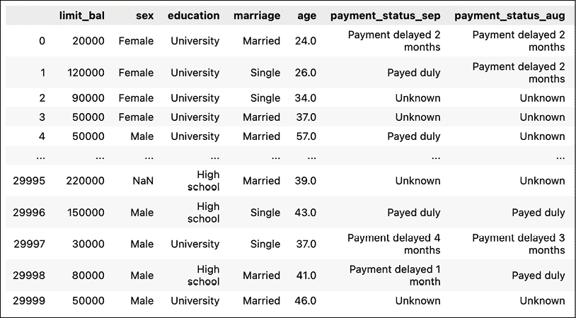

    图 13.1：数据集预览。并非所有列都被显示

    该 DataFrame 有 30,000 行和 24 列。它包含数字型和类别型变量的混合。

1.  查看 DataFrame 的摘要：

    ```py
    df.info() 
    ```

    运行代码片段会生成以下摘要：

    ```py
    RangeIndex: 30000 entries, 0 to 29999
    Data columns (total 24 columns):
     #   Column                      Non-Null Count  Dtype  
    ---  ------                      --------------  -----  
     0   limit_bal                   30000 non-null  int64  
     1   sex                         29850 non-null  object
     2   education                   29850 non-null  object
     3   marriage                    29850 non-null  object
     4   age                         29850 non-null  float64
     5   payment_status_sep          30000 non-null  object
     6   payment_status_aug          30000 non-null  object
     7   payment_status_jul          30000 non-null  object
     8   payment_status_jun          30000 non-null  object
     9   payment_status_may          30000 non-null  object
     10  payment_status_apr          30000 non-null  object
     11  bill_statement_sep          30000 non-null  int64  
     12  bill_statement_aug          30000 non-null  int64  
     13  bill_statement_jul          30000 non-null  int64  
     14  bill_statement_jun          30000 non-null  int64  
     15  bill_statement_may          30000 non-null  int64  
     16  bill_statement_apr          30000 non-null  int64  
     17  previous_payment_sep        30000 non-null  int64  
     18  previous_payment_aug        30000 non-null  int64  
     19  previous_payment_jul        30000 non-null  int64  
     20  previous_payment_jun        30000 non-null  int64  
     21  previous_payment_may        30000 non-null  int64  
     22  previous_payment_apr        30000 non-null  int64  
     23  default_payment_next_month  30000 non-null  int64  
    dtypes: float64(1), int64(14), object(9)
    memory usage: 5.5+ MB 
    ```

    在摘要中，我们可以看到关于列及其数据类型、非空（换句话说，非缺失）值的数量、内存使用情况等信息。

    我们还可以观察到几种不同的数据类型：浮点数（如 3.42）、整数和对象。最后一种是 `pandas` 对字符串变量的表示。紧挨着 `float` 和 `int` 的数字表示该类型用于表示特定值时所使用的位数。默认类型使用 64 位（或 8 字节）的内存。

    基本的 `int8` 类型覆盖的整数范围是：-128 到 127。`uint8` 表示无符号整数，覆盖相同的范围，但仅包含非负值，即 0 到 255。通过了解特定数据类型覆盖的值范围（请参见 *另见* 部分中的链接），我们可以尝试优化内存分配。例如，对于表示购买月份（范围为 1-12 的数字）这样的特征，使用默认的 `int64` 类型没有意义，因为一个更小的数据类型就足够了。

1.  定义一个函数来检查 DataFrame 的准确内存使用情况：

    ```py
    def  get_df_memory_usage(df, top_columns=5):
        print("Memory usage ----")
        memory_per_column = df.memory_usage(deep=True) / (1024 ** 2)
        print(f"Top {top_columns} columns by memory (MB):")
        print(memory_per_column.sort_values(ascending=False) \
                               .head(top_columns))
        print(f"Total size: {memory_per_column.sum():.2f} MB") 
    ```

    我们现在可以将该函数应用于我们的 DataFrame：

    ```py
    get_df_memory_usage(df, 5) 
    ```

    运行代码片段会生成以下输出：

    ```py
    Memory usage ----
    Top 5 columns by memory (MB):
    education             1.965001
    payment_status_sep    1.954342
    payment_status_aug    1.920288
    payment_status_jul    1.916343
    payment_status_jun    1.904229
    dtype: float64
    Total size: 20.47 MB 
    ```

    在输出中，我们可以看到`info`方法报告的 5.5+ MB 实际上几乎是 4 倍的值。虽然这在当前机器的能力范围内仍然非常小，但本章中展示的节省内存的原则同样适用于以 GB 为单位测量的 DataFrame。

1.  将数据类型为`object`的列转换为`category`类型：

    ```py
    object_columns = df.select_dtypes(include="object").columns
    df[object_columns] = df[object_columns].astype("category")
    get_df_memory_usage(df) 
    ```

    运行代码片段会生成以下概览：

    ```py
    Memory usage ----
    Top 5 columns by memory (MB):
    bill_statement_sep      0.228882
    bill_statement_aug      0.228882
    previous_payment_apr    0.228882
    previous_payment_may    0.228882
    previous_payment_jun    0.228882
    dtype: float64
    Total size: 3.70 MB 
    ```

    仅通过将`object`列转换为`pandas`原生的分类表示，我们成功地将 DataFrame 的大小减少了约 80%！

1.  将数字列降级为整数：

    ```py
    numeric_columns = df.select_dtypes(include="number").columns
    for col in numeric_columns:
        df[col] = pd.to_numeric(df[col], downcast="integer")
    get_df_memory_usage(df) 
    ```

    运行代码片段会生成以下概览：

    ```py
    Memory usage ----
    Top 5 columns by memory (MB):
    age                     0.228882
    bill_statement_sep      0.114441
    limit_bal               0.114441
    previous_payment_jun    0.114441
    previous_payment_jul    0.114441
    dtype: float64
    Total size: 2.01 MB 
    ```

    在总结中，我们可以看到，在进行几次数据类型转换后，占用最多内存的列是包含顾客年龄的那一列（你可以在`df.info()`的输出中看到这一点，这里为了简洁未显示）。这是因为它使用了`float`数据类型，并且未对`float`列应用`integer`类型的降级。

1.  使用`float`数据类型降级`age`列：

    ```py
    df["age"] = pd.to_numeric(df["age"], downcast="float")
    get_df_memory_usage(df) 
    ```

运行代码片段会生成以下概览：

```py
Memory usage ----
Top 5 columns by memory (MB):
bill_statement_sep      0.114441
limit_bal               0.114441
previous_payment_jun    0.114441
previous_payment_jul    0.114441
previous_payment_aug    0.114441
dtype: float64
Total size: 1.90 MB 
```

通过各种数据类型转换，我们将 DataFrame 的内存大小从 20.5 MB 减少到了 1.9 MB，减少了 91%。

## 它是如何工作的...

导入`pandas`后，我们使用`pd.read_csv`函数加载了 CSV 文件。在此过程中，我们指示空字符串应视为缺失值。

在*步骤 3*中，我们展示了 DataFrame 的摘要以检查其内容。为了更好地理解数据集，我们提供了变量的简化描述：

+   `limit_bal`—授予的信用额度（新台币）

+   `sex`—生物性别

+   `education`—教育水平

+   `marriage`—婚姻状况

+   `age`—顾客的年龄

+   `payment_status_{month}`—前 6 个月中某个月的支付状态

+   `bill_statement_{month}`—前 6 个月中某个月的账单金额（新台币）

+   `previous_payment_{month}`—前 6 个月中某个月的支付金额（新台币）

+   `default_payment_next_month`—目标变量，表示顾客是否在下个月出现违约

一般来说，`pandas`会尽可能高效地加载和存储数据。它会自动分配数据类型（我们可以通过`pandas` DataFrame 的`dtypes`方法查看）。然而，有些技巧可以显著改善内存分配，这无疑使得处理更大的表格（以百 MB 甚至 GB 为单位）更加容易和高效。

在*步骤 4*中，我们定义了一个函数来检查 DataFrame 的确切内存使用情况。`memory_usage`方法返回一个`pandas`的 Series，列出每个 DataFrame 列的内存使用量（以字节为单位）。我们将输出转换为 MB，以便更易理解。

在使用`memory_usage`方法时，我们指定了`deep=True`。这是因为与其他数据类型（dtypes）不同，`object`数据类型对于每个单元格并没有固定的内存分配。换句话说，由于`object`数据类型通常对应文本，它的内存使用量取决于每个单元格中的字符数。直观来说，字符串中的字符越多，该单元格使用的内存就越多。

在*步骤 5*中，我们利用了一种特殊的数据类型`category`来减少 DataFrame 的内存使用。其基本思想是将字符串变量编码为整数，`pandas`使用一个特殊的映射字典将其解码回原始形式。这个方法在处理有限的不同值时尤其有效，例如某些教育水平、原籍国家等。为了节省内存，我们首先使用`select_dtypes`方法识别出所有`object`数据类型的列。然后，我们将这些列的数据类型从`object`更改为`category`。这一过程是通过`astype`方法完成的。

我们应该知道什么时候使用`category`数据类型从内存角度上来说是有利的。一个经验法则是，当唯一观测值与总观测值的比例低于 50%时，使用该数据类型。

在*步骤 6*中，我们使用`select_dtypes`方法识别了所有数值列。然后，通过一个`for`循环遍历已识别的列，使用`pd.to_numeric`函数将值转换为数值。虽然看起来有些奇怪，因为我们首先识别了数值列，然后又将它们转换为数值，但关键点在于该函数的`downcast`参数。通过传递`"integer"`值，我们通过将默认的`int64`数据类型降级为更小的替代类型（`int32`和`int8`），优化了所有整数列的内存使用。

尽管我们将该函数应用于所有数值列，但只有包含整数的列成功进行了转换。这就是为什么在*步骤 7*中，我们额外将包含客户年龄的`float`列进行了降级处理。

## 还有更多方法……

在本教程中，我们提到如何优化`pandas` DataFrame 的内存使用。我们首先将数据加载到 Python 中，然后检查了各列，最后我们将一些列的数据类型转换以减少内存使用。然而，这种方法可能并不总是可行，因为数据可能根本无法适配内存。

如果是这种情况，我们还可以尝试以下方法：

+   按块读取数据集（通过使用`pd.read_csv`的`chunk`参数）。例如，我们可以仅加载前 100 行数据。

+   只读取我们实际需要的列（通过使用`pd.read_csv`的`usecols`参数）。

+   在加载数据时，使用`column_dtypes`参数定义每一列的数据类型。

举例来说，我们可以使用以下代码片段加载数据集，并在加载时指定选中的三列应具有 `category` 数据类型：

```py
column_dtypes = {
    "education": "category",
    "marriage": "category",
    "sex": "category"
}
df_cat = pd.read_csv("../Datasets/credit_card_default.csv",
                     na_values="", dtype=column_dtypes) 
```

如果以上方法都无效，我们也不应该放弃。虽然 `pandas` 无疑是 Python 中操作表格数据的黄金标准，但我们可以借助一些专门为此类情况构建的替代库。下面是你在处理大数据量时可以使用的一些库的列表：

+   `Dask`：一个开源的分布式计算库。它可以同时在单台机器或者 CPU 集群上运行多个计算任务。库内部将一个大数据处理任务拆分成多个小任务，然后由 `numpy` 或 `pandas` 处理。最后一步，库会将结果重新组合成一个一致的整体。

+   `Modin`：一个旨在通过自动将计算任务分配到系统中所有可用 CPU 核心上来并行化 `pandas` DataFrame 的库。该库将现有的 DataFrame 分割成不同的部分，使得每个部分可以被发送到不同的 CPU 核心处理。

+   `Vaex`：一个开源的 DataFrame 库，专门用于懒加载的外部数据框架。Vaex 通过结合懒加载评估和内存映射的概念，能够在几乎不占用 RAM 的情况下，检查和操作任意大小的数据集。

+   `datatable`：一个开源库，用于操作二维表格数据。在许多方面，它与 `pandas` 相似，特别强调速度和数据量（最多支持 100 GB），并且可以在单节点机器上运行。如果你曾使用过 R，可能已经熟悉相关的 `data.table` 包，这是 R 用户在进行大数据快速聚合时的首选工具。

+   `cuDF`：一个 GPU DataFrame 库，是 NVIDIA RAPIDS 生态系统的一部分，RAPIDS 是一个涉及多个开源库并利用 GPU 强大计算能力的数据科学生态系统。`cuDF` 允许我们使用类似 `pandas` 的 API，在无需深入了解 CUDA 编程的情况下，享受性能提升的好处。

+   `polars`：一个开源的 DataFrame 库，通过利用 Rust 编程语言和 Apache Arrow 作为内存模型，达到了惊人的计算速度。

## 另见

额外资源：

+   Dua, D. 和 Graff, C.（2019）。UCI 机器学习库 [[`archive.ics.uci.edu/ml`](http://archive.ics.uci.edu/ml)]。加利福尼亚州尔湾：加利福尼亚大学信息与计算机科学学院。

+   Yeh, I. C. 和 Lien, C. H.（2009）。"数据挖掘技术比较对信用卡客户违约概率预测准确性的影响。" *Expert Systems with Applications*, 36(2), 2473-2480。 [`doi.org/10.1016/j.eswa.2007.12.020`](https://doi.org/10.1016/j.eswa.2007.12.020)。

+   Python 中使用的不同数据类型列表：[`numpy.org/doc/stable/user/basics.types.html#.`](https://numpy.org/doc/stable/user/basics.types.html#.)

# 探索性数据分析

数据科学项目的第二步是进行**探索性数据分析**（**EDA**）。通过这样做，我们可以了解需要处理的数据。这也是我们检验自己领域知识深度的阶段。例如，我们所服务的公司可能假设其大多数客户年龄在 18 到 25 岁之间。但事实真的是这样吗？在进行 EDA 时，我们可能会发现一些自己无法理解的模式，这时就可以成为与利益相关者讨论的起点。

在进行 EDA 时，我们可以尝试回答以下问题：

+   我们到底拥有何种类型的数据，应该如何处理不同的数据类型？

+   变量的分布情况如何？

+   数据中是否存在离群值，我们该如何处理它们？

+   是否需要进行任何变换？例如，一些模型在处理（或要求）服从正态分布的变量时表现更好，因此我们可能需要使用诸如对数变换之类的技术。

+   不同群体（例如性别或教育水平）之间的分布是否存在差异？

+   我们是否有缺失数据？这些数据的频率是多少？它们出现在哪些变量中？

+   某些变量之间是否存在线性关系（相关性）？

+   我们是否可以使用现有的变量集创建新的特征？例如，可能从时间戳中推导出小时/分钟，或者从日期中推导出星期几，等等。

+   是否有一些变量可以删除，因为它们与分析无关？例如，随机生成的客户标识符。

自然地，这个列表并不详尽，进行分析时可能会引发比最初更多的问题。EDA 在所有数据科学项目中都极为重要，因为它使分析师能够深入理解数据，有助于提出更好的问题，并且更容易选择适合所处理数据类型的建模方法。

在实际案例中，通常先对所有相关特征进行单变量分析（一次分析一个特征），以便深入理解它们。然后，可以进行多变量分析，即比较每组的分布，相关性等。为了简洁起见，我们这里只展示对某些特征的选定分析方法，但强烈建议进行更深入的分析。

## 准备就绪

我们继续探索在上一个步骤中加载的数据。

## 如何进行...

执行以下步骤以进行贷款违约数据集的探索性数据分析（EDA）：

1.  导入所需的库：

    ```py
    import pandas as pd
    import numpy as np
    import seaborn as sns 
    ```

1.  获取数值变量的摘要统计：

    ```py
    df.describe().transpose().round(2) 
    ```

    运行该代码片段会生成以下摘要表格：

    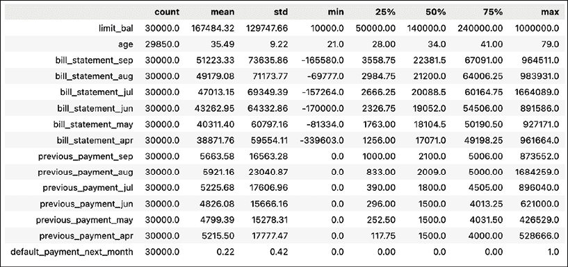

    图 13.2：数值变量的摘要统计

1.  获取分类变量的摘要统计：

    ```py
    df.describe(include="object").transpose() 
    ```

    运行代码片段生成了以下汇总表：

    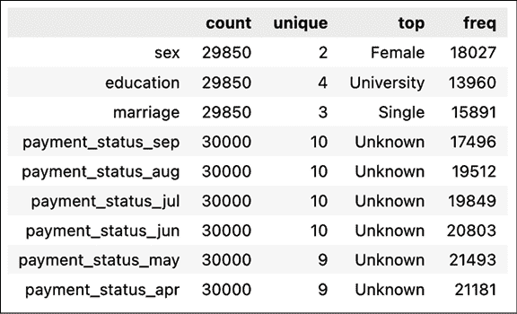

    图 13.3：分类变量的汇总统计

1.  绘制年龄分布并按性别划分：

    ```py
    ax = sns.kdeplot(data=df, x="age",
                     hue="sex", common_norm=False,
                     fill=True)
    ax.set_title("Distribution of age") 
    ```

    运行代码片段生成了以下图：

    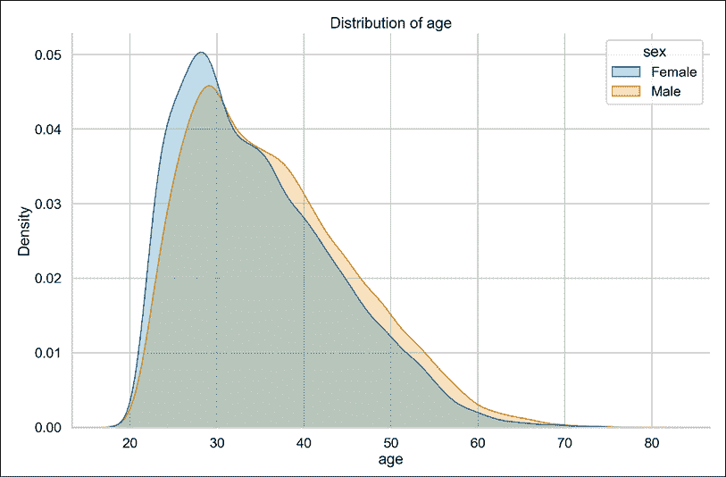

    图 13.4：按性别分组的年龄 KDE 图

    通过分析**核密度估计**（**KDE**）图，我们可以看出，每个性别的分布形态差异不大。女性样本的年龄略微偏小。

1.  创建选定变量的对角图：

    ```py
    COLS_TO_PLOT = ["age", "limit_bal", "previous_payment_sep"]
    pair_plot = sns.pairplot(df[COLS_TO_PLOT], kind="reg",
                             diag_kind="kde", height=4,
                             plot_kws={"line_kws":{"color":"red"}})
    pair_plot.fig.suptitle("Pairplot of selected variables") 
    ```

    运行代码片段生成了以下图：

    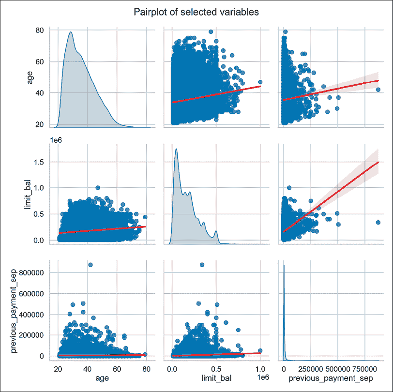

    图 13.5：带有 KDE 图的对角图和每个散点图中的回归线拟合

    我们可以从创建的对角图中得出一些观察结果：

    +   `previous_payment_sep`的分布高度偏斜——它有一个非常长的尾巴。

    +   与前述内容相关，我们可以在散点图中观察到`previous_payment_sep`的极端值。

    +   从散点图中很难得出结论，因为每个散点图中都有 30,000 个观察值。当绘制如此大量的数据时，我们可以使用透明标记来更好地可视化某些区域的观察密度。

    +   离群值可能对回归线产生显著影响。

    此外，我们可以通过指定`hue`参数来区分性别：

    ```py
    pair_plot = sns.pairplot(data=df,
                             x_vars=COLS_TO_PLOT,
                             y_vars=COLS_TO_PLOT,
                             hue="sex",
                             height=4)
    pair_plot.fig.suptitle("Pairplot of selected variables") 
    ```

    运行代码片段生成了以下图：

    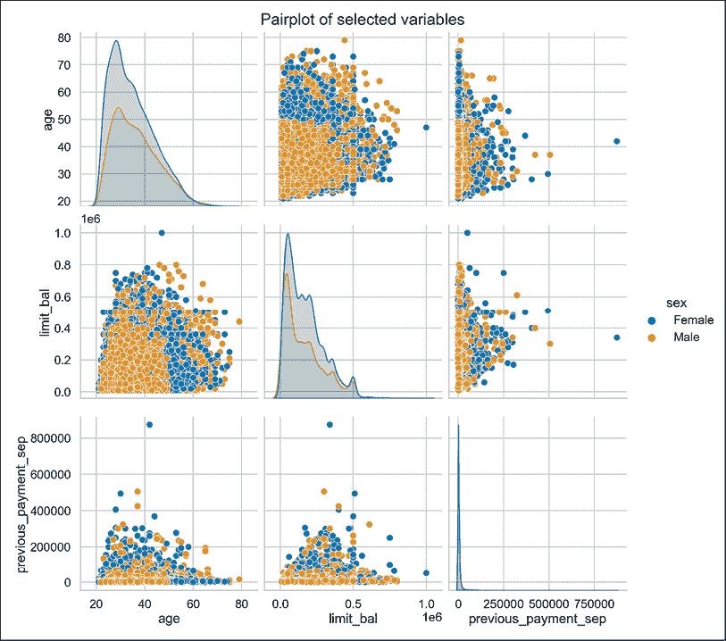

    图 13.6：每个性别分别标记的对角图

    尽管通过性别划分后的对角图能提供更多的见解，但由于绘制数据量庞大，散点图仍然相当难以解读。

    作为潜在解决方案，我们可以从整个数据集中随机抽样，并只绘制选定的观察值。该方法的一个可能缺点是，我们可能会遗漏一些具有极端值（离群值）的观察数据。

1.  分析年龄与信用额度余额之间的关系：

    ```py
    ax = sns.jointplot(data=df, x="age", y="limit_bal", 
                       hue="sex", height=10)
    ax.fig.suptitle("Age vs. limit balance") 
    ```

    运行代码片段生成了以下图：

    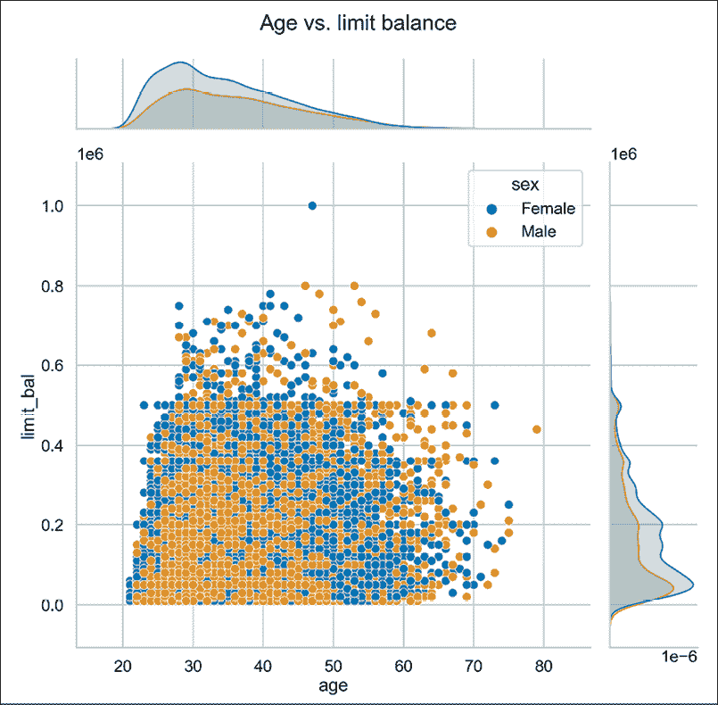

    图 13.7：显示年龄与信用额度余额关系的联合图，按性别分组

    联合图包含了大量有用的信息。首先，我们可以在散点图中看到两个变量之间的关系。接下来，我们还可以使用沿坐标轴的 KDE 图来分别调查两个变量的分布（我们也可以选择绘制直方图）。

1.  定义并运行一个绘制相关性热图的函数：

    ```py
    def  plot_correlation_matrix(corr_mat):
        sns.set(style="white")
        mask = np.zeros_like(corr_mat, dtype=bool)
        mask[np.triu_indices_from(mask)] = True
        fig, ax = plt.subplots()
        cmap = sns.diverging_palette(240, 10, n=9, as_cmap=True)
        sns.heatmap(corr_mat, mask=mask, cmap=cmap, 
                    vmax=.3, center=0, square=True, 
                    linewidths=.5, cbar_kws={"shrink": .5}, 
                    ax=ax)
        ax.set_title("Correlation Matrix", fontsize=16)
        sns.set(style="darkgrid")
    corr_mat = df.select_dtypes(include="number").corr()    
    plot_correlation_matrix(corr_mat) 
    ```

    运行代码片段生成了以下图：

    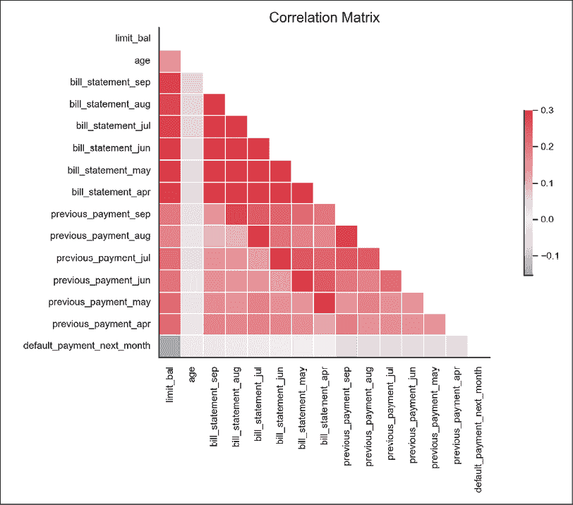

    图 13.8：数值特征的相关性热图

    我们可以看到，年龄似乎与其他特征没有显著的相关性。

1.  使用箱型图分析分组后的年龄分布：

    ```py
    ax = sns.boxplot(data=df, y="age", x="marriage", hue="sex")
    ax.set_title("Distribution of age") 
    ```

    运行代码片段生成了以下图：

    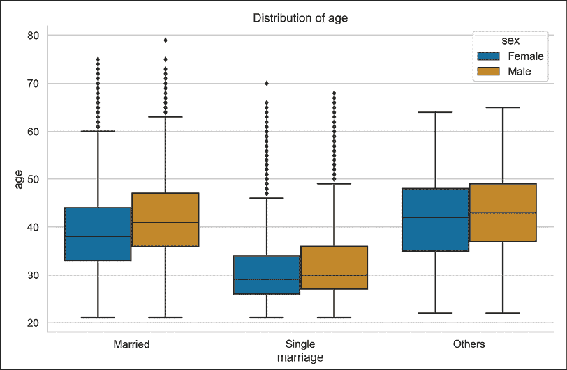

    图 13.9：按婚姻状况和性别分组的年龄分布

    从分布来看，婚姻状况组内似乎相似，男性的中位数年龄总是较高。

1.  绘制每个性别和教育水平的信用额度分布：

    ```py
    ax = sns.violinplot(x="education", y="limit_bal", 
                        hue="sex", split=True, data=df)
    ax.set_title(
        "Distribution of limit balance per education level", 
        fontsize=16
    ) 
    ```

    运行代码片段会生成以下图表：

    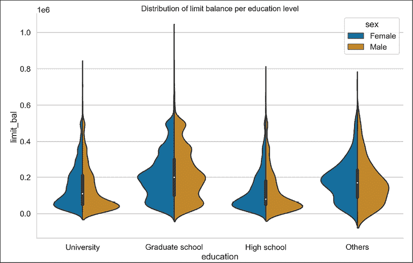

    图 13.10：按教育水平和性别划分的信用额度分布

    检查图表可以揭示一些有趣的模式：

    +   最大的余额出现在*研究生*教育水平的组别中。

    +   每个教育水平的分布形状不同：*研究生*水平类似于*其他*类别，而*高中*水平则与*大学*水平相似。

    +   总体来说，性别之间的差异较小。

1.  调查按性别和教育水平划分的目标变量分布：

    ```py
    ax = sns.countplot("default_payment_next_month", hue="sex",
                       data=df, orient="h")
    ax.set_title("Distribution of the target variable", fontsize=16) 
    ```

    运行代码片段会生成以下图表：

    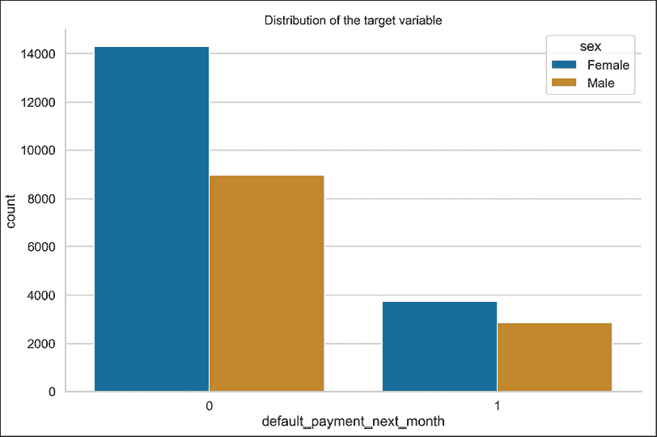

    图 13.11：按性别划分的目标变量分布

    通过分析图表，我们可以得出结论：男性客户的违约比例较高。

1.  调查每个教育水平的违约百分比：

    ```py
    ax = df.groupby("education")["default_payment_next_month"] \
           .value_counts(normalize=True) \
           .unstack() \
           .plot(kind="barh", stacked="True")
    ax.set_title("Percentage of default per education level",
                 fontsize=16)
    ax.legend(title="Default", bbox_to_anchor=(1,1)) 
    ```

    运行代码片段会生成以下图表：

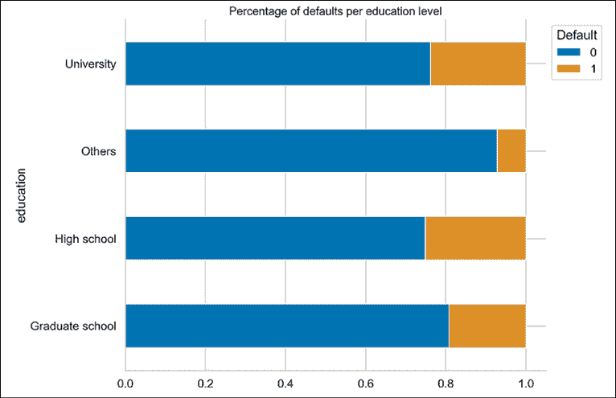

图 13.12：按教育水平划分的违约百分比

相对而言，大多数违约发生在高中教育的客户中，而违约最少的则出现在*其他*类别中。

## 它是如何工作的...

在前一节中，我们已经探索了两个在开始探索性数据分析时非常有用的 DataFrame 方法：`shape`和`info`。我们可以使用它们快速了解数据集的形状（行数和列数）、每个特征的数据类型等。

在本节中，我们主要使用了`seaborn`库，因为它是探索数据时最常用的库。然而，我们也可以使用其他绘图库。`pandas` DataFrame 的`plot`方法非常强大，可以快速可视化数据。作为替代，我们也可以使用`plotly`（及其`plotly.express`模块）来创建完全交互的数据可视化。

在本节中，我们通过使用`pandas` DataFrame 中的一种非常简单但强大的方法——`describe`，开始了分析。它打印了所有数值变量的汇总统计信息，如计数、均值、最小值/最大值和四分位数。通过检查这些指标，我们可以推断出某个特征的值范围，或者分布是否偏斜（通过查看均值和中位数的差异）。此外，我们还可以轻松发现不合常理的值，例如负数或过年轻/年老的年龄。

我们可以通过传递额外的参数（例如，`percentiles=[.99]`）在`describe`方法中包含更多的百分位数。在这种情况下，我们添加了第 99 百分位。

计数度量表示非空观察值的数量，因此它也是确定哪些数值特征包含缺失值的一种方法。另一种检查缺失值存在的方法是运行`df.isnull().sum()`。有关缺失值的更多信息，请参见*识别和处理缺失值*的配方。

在*第 3 步*中，我们在调用`describe`方法时添加了`include="object"`参数，以便单独检查分类特征。输出与数值特征不同：我们可以看到计数、唯一类别的数量、最常见的类别以及它在数据集中出现的次数。

我们可以使用`include="all"`来显示所有特征的汇总度量——只有给定数据类型可用的度量会出现，其余则会填充为`NA`值。

在*第 4 步*中，我们展示了调查变量分布的一种方法，在这种情况下是顾客的年龄。为此，我们创建了一个 KDE 图。它是一种可视化变量分布的方法，非常类似于传统的直方图。KDE 通过在一个或多个维度中使用连续的概率密度曲线来表示数据。与直方图相比，它的一个优点是生成的图形更加简洁，且更容易解释，特别是在同时考虑多个分布时。

关于 KDE 图，常见的困惑来源于密度轴的单位。一般而言，核密度估计结果是一个概率分布。然而，曲线在每一点的高度给出的是密度，而不是概率。我们可以通过对密度在某一范围内进行积分来获得概率。KDE 曲线已被归一化，使得所有可能值的积分总和等于 1。这意味着密度轴的尺度取决于数据值。更进一步地，如果我们在一个图中处理多个类别，我们可以决定如何归一化密度。如果我们使用`common_norm=True`，每个密度都会根据观察值的数量进行缩放，使得所有曲线下的总面积之和为 1。否则，每个类别的密度会独立归一化。

与直方图一起，KDE 图是检查单一特征分布的最流行方法之一。要创建直方图，我们可以使用`sns.histplot`函数。或者，我们也可以使用`pandas` DataFrame 的`plot`方法，并指定`kind="hist"`。我们在附带的 Jupyter 笔记本中展示了创建直方图的示例（可在 GitHub 上找到）。

通过使用成对图（pairplot），可以扩展此分析。它创建一个图矩阵，其中对角线显示单变量直方图或核密度估计图（KDE），而非对角线的图为两特征的散点图。通过这种方式，我们还可以尝试查看两个特征之间是否存在关系。为了更容易识别潜在的关系，我们还添加了回归线。

在我们的例子中，我们只绘制了三个特征。这是因为对于 30,000 个观测值，绘制所有数值列的图表可能会耗费相当长的时间，更不用说在一个矩阵中包含如此多小图时会导致图表难以读取。当使用成对图时，我们还可以指定`hue`参数来为某一类别（如性别或教育水平）进行拆分。

我们还可以通过联合图（`sns.jointplot`）来放大查看两个变量之间的关系。这是一种结合了散点图和核密度估计图或直方图的图，既可以分析双变量关系，也可以分析单变量分布。在*步骤 6*中，我们分析了年龄与限额余额之间的关系。

在*步骤 7*中，我们定义了一个绘制热图表示相关矩阵的函数。在该函数中，我们使用了一些操作来遮蔽上三角矩阵和对角线（相关矩阵的所有对角元素都为 1）。这样，输出结果更容易解读。使用`annot`参数的`sns.heatmap`，我们可以在热图中添加底层数字。然而，当分析的特征数量过多时，我们应该避免这么做，否则数字将变得难以阅读。

为了计算相关性，我们使用了 DataFrame 的`corr`方法，默认计算**皮尔逊相关系数**。我们只对数值特征进行了此操作。对于分类特征，也有计算相关性的方法；我们在*更多内容...*部分提到了一些方法。检查相关性至关重要，特别是在使用假设特征线性独立的机器学习算法时。

在*步骤 8*中，我们使用箱型图来研究按婚姻状况和性别划分的年龄分布。箱型图（也叫箱形图）通过一种便于比较分类变量各个层级之间的分布方式呈现数据分布。箱型图通过 5 个数值摘要展示数据分布信息：

+   中位数（第 50 百分位数）—由箱体内的水平黑线表示。

+   **四分位距**（**IQR**）—由箱体表示。它表示第一四分位数（25 百分位数）和第三四分位数（75 百分位数）之间的范围。

+   须须线—由从箱体延伸出的线表示。须须线的极值（标记为水平线）定义为第一四分位数 - 1.5 IQR 和第三四分位数 + 1.5 IQR。

我们可以使用箱型图从数据中获取以下见解：

+   标记在须外的点可以视为异常值。这种方法被称为**Tukey’s fences**，是最简单的异常值检测技术之一。简而言之，它假设位于[Q1 - 1.5 IQR, Q3 + 1.5 IQR]范围之外的观测值为异常值。

+   分布的潜在偏斜度。当中位数接近箱子的下限，而上须比下须长时，可以观察到右偏（正偏）的分布。*反之*，左偏分布则相反。*图 13.13*展示了这一点。

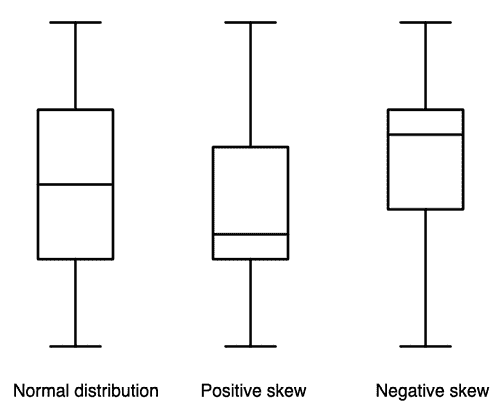

图 13.13：使用箱线图确定分布的偏斜度

在*步骤 9*中，我们使用小提琴图来研究限额余额特征在教育水平和性别上的分布。我们通过使用`sns.violinplot`来创建这些图表。我们用`x`参数表示教育水平，并且设置了`hue="sex"`和`split=True`。这样，小提琴的每一半就代表不同的性别。

一般来说，小提琴图与箱线图非常相似，我们可以在其中找到以下信息：

+   中位数，用白色点表示。

+   四分位距，表示为小提琴中央的黑色条形。

+   下邻值和上邻值，由从条形延伸出的黑线表示。下邻值定义为第一四分位数 - 1.5 IQR，而上邻值定义为第三四分位数 + 1.5 IQR。同样，我们可以使用邻值作为简单的异常值检测技术。

小提琴图是箱线图和核密度估计图（KDE 图）的结合。与箱线图相比，小提琴图的一个明显优点是它能够清晰地展示分布的形状。当处理多峰分布（具有多个峰值的分布）时，尤其有用，比如在*研究生*教育类别中的限额余额小提琴图。

在最后两步中，我们分析了目标变量（违约）在性别和教育水平上的分布。在第一种情况下，我们使用了`sns.countplot`来显示每种性别下两种可能结果的出现次数。在第二种情况下，我们选择了不同的方法。我们想要绘制每个教育水平的违约百分比，因为比较不同组之间的百分比比比较名义值更容易。为此，我们首先按教育水平分组，选择感兴趣的变量，计算每组的百分比（使用`value_counts(normalize=True)`方法），去除多重索引（通过 unstack），然后使用已经熟悉的`plot`方法生成图表。

## 还有更多内容...

在这个示例中，我们介绍了一些可能的方法来调查手头的数据。然而，每次进行探索性数据分析（EDA）时，我们需要编写许多行代码（其中有相当多是模板代码）。幸运的是，有一个 Python 库简化了这一过程。这个库叫做 `pandas_profiling`，只需一行代码，它就能生成数据集的全面概述，并以 HTML 报告的形式呈现。

要生成报告，我们需要运行以下代码：

```py
from pandas_profiling import ProfileReport
profile = ProfileReport(df, title="Loan Default Dataset EDA")
profile 
```

我们还可以通过 `pandas_profiling` 新添加的 `profile_report` 方法，基于一个 `pandas` DataFrame 创建个人资料。

出于实际考虑，我们可能更倾向于将报告保存为 HTML 文件，并在浏览器中查看，而不是在 Jupyter notebook 中查看。我们可以使用以下代码片段轻松实现：

```py
profile.to_file("loan_default_eda.html") 
```

报告非常详尽，包含了许多有用的信息。请参见以下图例作为示例。

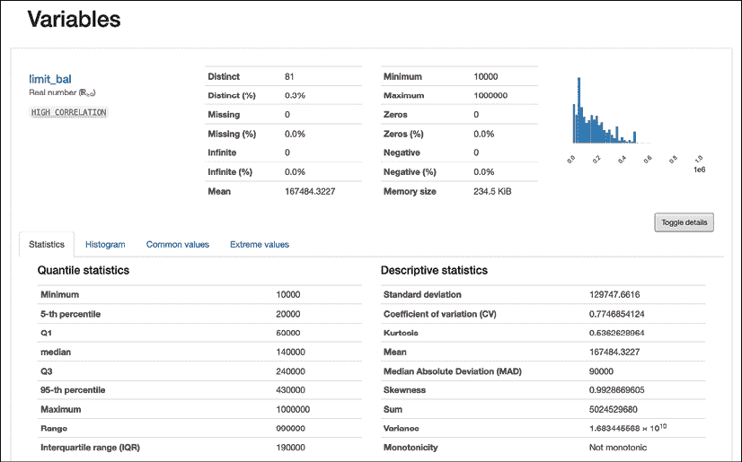

图 13.14：深入分析限额平衡特征的示例

为了简洁起见，我们将只讨论报告中的选定部分：

+   概述提供了有关 DataFrame 的信息（特征/行的数量、缺失值、重复行、内存大小、按数据类型的划分）。

+   警告我们关于数据中潜在问题的警报，包括重复行的高比例、高度相关（且可能冗余）的特征、具有高比例零值的特征、高度偏斜的特征等。

+   不同的相关性度量：Spearman’s 、Pearson’s r、Kendall’s 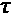、Cramér’s V 和 Phik (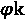)。最后一个特别有趣，因为它是一个最近开发的相关系数，可以在分类、顺序和区间变量之间始终如一地工作。此外，它还能够捕捉非线性依赖性。有关该度量的参考论文，请参见 *See also* 部分。

+   详细分析缺失值。

+   对每个特征的详细单变量分析（更多细节可以通过点击报告中的 *Toggle details* 查看）。

`pandas-profiling` 是 Python 库生态系统中最流行的自动化 EDA 工具，但它绝对不是唯一的。你还可以使用以下工具进行调查：

+   `sweetviz`—[`github.com/fbdesignpro/sweetviz`](https://github.com/fbdesignpro/sweetviz)

+   `autoviz`—[`github.com/AutoViML/AutoViz`](https://github.com/AutoViML/AutoViz)

+   `dtale`—[`github.com/man-group/dtale`](https://github.com/man-group/dtale)

+   `dataprep`—[`github.com/sfu-db/dataprep`](https://github.com/sfu-db/dataprep)

+   `lux`—[`github.com/lux-org/lux`](https://github.com/lux-org/lux)

每个工具对 EDA 的处理方式有所不同。因此，最好是探索它们所有，并选择最适合你需求的工具。

## 参见

关于 Phik 的更多信息（），请参阅以下论文：

+   Baak, M., Koopman, R., Snoek, H., & Klous, S. (2020). “一种新的相关系数，适用于具有皮尔逊特征的分类、序数和区间变量。” *计算统计与数据分析*，*152*，107043。 [`doi.org/10.1016/j.csda.2020.107043`](https://doi.org/10.1016/j.csda.2020.107043)。

# 将数据分为训练集和测试集

完成 EDA 后，下一步是将数据集分为训练集和测试集。这个思路是将数据分为两个独立的数据集：

+   训练集——在这部分数据上，我们训练机器学习模型

+   测试集——这部分数据在训练过程中没有被模型看到，用于评估模型的性能

通过这种方式拆分数据，我们希望防止过拟合。**过拟合**是指当模型在训练数据上找到过多模式，并且仅在这些数据上表现良好时发生的现象。换句话说，它无法泛化到看不见的数据。

这是分析中的一个非常重要的步骤，因为如果操作不当，可能会引入偏差，例如**数据泄漏**。数据泄漏是指在训练阶段，模型观察到它本不应该接触到的信息。我们接下来举个例子。一个常见的情况是使用特征的均值填补缺失值。如果我们在拆分数据之前就进行了填补，测试集中的数据也会被用来计算均值，从而引入泄漏。这就是为什么正确的顺序应该是先将数据拆分为训练集和测试集，然后进行填补，使用在训练集上观察到的数据。同样的规则也适用于识别异常值的设置。

此外，拆分数据确保了一致性，因为未来看不见的数据（在我们的案例中，是模型将要评分的新客户）将与测试集中的数据以相同的方式处理。

## 如何操作...

执行以下步骤将数据集分为训练集和测试集：

1.  导入库：

    ```py
    import pandas as pd
    from sklearn.model_selection import train_test_split 
    ```

1.  将目标与特征分开：

    ```py
    X = df.copy()
    y = X.pop("default_payment_next_month") 
    ```

1.  将数据分为训练集和测试集：

    ```py
    X_train, X_test, y_train, y_test = train_test_split(
        X, y, test_size=0.2, random_state=42
    ) 
    ```

1.  在不打乱顺序的情况下将数据分为训练集和测试集：

    ```py
    X_train, X_test, y_train, y_test = train_test_split(
        X, y, test_size=0.2, shuffle=False
    ) 
    ```

1.  使用分层法将数据分为训练集和测试集：

    ```py
    X_train, X_test, y_train, y_test = train_test_split(
        X, y, test_size=0.2, stratify=y, random_state=42
    ) 
    ```

1.  验证目标比例是否保持一致：

    ```py
    print("Target distribution - train")
    print(y_train.value_counts(normalize=True).values)
    print("Target distribution - test")
    print(y_test.value_counts(normalize=True).values) 
    ```

运行代码片段会生成以下输出：

```py
Target distribution - train
[0.77879167 0.22120833]
Target distribution - test
[0.77883333 0.22116667] 
```

在两个数据集中，支付违约的比例大约为 22.12%。

## 它是如何工作的...

在导入库之后，我们使用`pandas` DataFrame 的`pop`方法将目标与特征分开。

在*步骤 3*中，我们展示了如何进行最基本的拆分。我们将`X`和`y`对象传递给了`train_test_split`函数。此外，我们还指定了测试集的大小，以所有观察值的一个比例表示。为了可重复性，我们还指定了随机状态。我们必须将函数的输出分配给四个新对象。

在*步骤 4*中，我们采用了不同的方法。通过指定`test_size=0.2`和`shuffle=False`，我们将数据的前 80%分配给训练集，剩下的 20%分配给测试集。当我们希望保持观察数据的顺序时，这种方法很有用。

在*步骤 5*中，我们还通过传递目标变量（`stratify=y`）指定了分层划分的参数。使用分层划分数据意味着训练集和测试集将具有几乎相同的指定变量分布。这个参数在处理不平衡数据时非常重要，例如欺诈检测的情况。如果 99%的数据是正常的，只有 1%的数据是欺诈案件，随机划分可能导致训练集中没有欺诈案例。因此，在处理不平衡数据时，正确划分数据至关重要。

在最后一步，我们验证了分层的训练/测试划分是否在两个数据集中产生了相同的违约比例。为此，我们使用了`pandas` DataFrame 的`value_counts`方法。

在本章的其余部分，我们将使用从分层划分中获得的数据。

## 还有更多内容...

将数据划分为三个数据集也是常见做法：训练集、验证集和测试集。**验证集**用于频繁评估和调整模型的超参数。假设我们想训练一个决策树分类器，并找到`max_depth`超参数的最优值，该超参数决定树的最大深度。

为此，我们可以多次使用训练集训练模型，每次使用不同的超参数值。然后，我们可以使用验证集评估所有这些模型的表现。我们选择其中表现最好的模型，并最终在测试集上评估其性能。

在以下代码片段中，我们演示了使用相同的`train_test_split`函数创建训练集-验证集-测试集划分的一种可能方法：

```py
import numpy as np

# define the size of the validation and test sets
VALID_SIZE = 0.1
TEST_SIZE = 0.2

# create the initial split - training and temp
X_train, X_temp, y_train, y_temp = train_test_split(
    X, y, 
    test_size=(VALID_SIZE + TEST_SIZE), 
    stratify=y, 
    random_state=42
)

# calculate the new test size
new_test_size = np.around(TEST_SIZE / (VALID_SIZE + TEST_SIZE), 2)

# create the valid and test sets
X_valid, X_test, y_valid, y_test = train_test_split(
    X_temp, y_temp, 
    test_size=new_test_size, 
    stratify=y_temp, 
    random_state=42
) 
```

我们基本上执行了两次`train_test_split`。重要的是，我们必须调整`test_size`输入的大小，以确保最初定义的比例（70-10-20）得以保持。

我们还验证了所有操作是否按计划进行：数据集的大小是否与预定的划分一致，且每个数据集中的违约比例是否相同。我们使用以下代码片段来完成验证：

```py
print("Percentage of data in each set ----")
print(f"Train: {100 * len(X_train) / len(X):.2f}%")
print(f"Valid: {100 * len(X_valid) / len(X):.2f}%")
print(f"Test: {100 * len(X_test) / len(X):.2f}%")
print("")
print("Class distribution in each set ----")
print(f"Train: {y_train.value_counts(normalize=True).values}")
print(f"Valid: {y_valid.value_counts(normalize=True).values}")
print(f"Test: {y_test.value_counts(normalize=True).values}") 
```

执行代码片段将生成以下输出：

```py
Percentage of data in each set ----
Train: 70.00%
Valid: 9.90%
Test: 20.10%
Class distribution in each set ----
Train: [0.77879899 0.22120101]
Valid: [0.77878788 0.22121212]
Test: [0.77880948 0.22119052] 
```

我们已经验证原始数据集确实按预期的 70-10-20 比例进行了拆分，并且由于分层，违约（目标变量）的分布得以保持。有时，我们没有足够的数据将其拆分成三组，要么是因为我们总共有的数据样本不够，要么是因为数据高度不平衡，导致我们会从训练集中移除有价值的训练样本。因此，实践中经常使用一种叫做交叉验证的方法，具体内容请参见 *使用网格搜索和交叉验证调整超参数* 配方。

# 识别和处理缺失值

在大多数实际情况中，我们并不处理干净、完整的数据。我们可能会遇到的一个潜在问题就是缺失值。我们可以根据缺失值发生的原因对其进行分类：

+   **完全随机缺失**（**MCAR**）——缺失数据的原因与其他数据无关。一个例子可能是受访者在调查中不小心漏掉了一个问题。

+   **随机缺失**（**MAR**）——缺失数据的原因可以从另一列（或多列）数据中推断出来。例如，某个调查问题的缺失回答在某种程度上可以由性别、年龄、生活方式等其他因素条件性地确定。

+   **非随机缺失**（**MNAR**）——缺失值背后存在某种潜在原因。例如，收入非常高的人往往不愿透露收入。

+   **结构性缺失数据**——通常是 MNAR 的一个子集，数据缺失是由于某种逻辑原因。例如，当一个表示配偶年龄的变量缺失时，我们可以推测该人没有配偶。

一些机器学习算法可以处理缺失数据，例如，决策树可以将缺失值视为一个独立且独特的类别。然而，许多算法要么无法做到这一点，要么它们的流行实现（如 `scikit-learn`）并未包含此功能。

我们应该只对特征进行填充，而不是目标变量！

一些常见的处理缺失值的解决方案包括：

+   删除包含一个或多个缺失值的观测值——虽然这是最简单的方法，但并不总是最佳选择，特别是在数据集较小的情况下。我们还需要注意，即使每个特征中只有很小一部分缺失值，它们也不一定出现在相同的观测（行）中，因此我们可能需要删除的行数会远高于预期。此外，在数据缺失并非随机的情况下，删除这些观测可能会引入偏差。

+   如果某一列（特征）大部分值都缺失，我们可以选择删除整列。然而，我们需要小心，因为这可能已经是我们模型的一个有信息的信号。

+   使用远远超出可能范围的值来替换缺失值，这样像决策树这样的算法可以将其视为特殊值，表示缺失数据。

+   在处理时间序列时，我们可以使用前向填充（取缺失值之前的最后一个已知观测值）、后向填充（取缺失值之后的第一个已知观测值）或插值法（线性或更高级的插值）。

+   **热备填充法**——在这个简单的算法中，我们首先选择一个或多个与包含缺失值的特征相关的其他特征。然后，我们按这些选定特征对数据集的行进行排序。最后，我们从上到下遍历行，将每个缺失值替换为同一特征中前一个非缺失的值。

+   使用聚合指标替换缺失值——对于连续数据，我们可以使用均值（当数据中没有明显的异常值时）或中位数（当数据中存在异常值时）。对于分类变量，我们可以使用众数（集合中最常见的值）。均值/中位数填充的潜在缺点包括减少数据集的方差并扭曲填充特征与数据集其余部分之间的相关性。

+   使用按组计算的聚合指标替换缺失值——例如，在处理与身体相关的指标时，我们可以按性别计算均值或中位数，以更准确地替代缺失数据。

+   基于机器学习的方法——我们可以将考虑的特征作为目标，使用完整的数据训练一个模型并预测缺失观测值的值。

通常，探索缺失值是探索性数据分析（EDA）的一部分。在分析使用`pandas_profiling`生成的报告时，我们简要提到了这一点。但我们故意在现在之前没有详细讨论，因为在训练/测试集拆分后进行任何类型的缺失值填充非常关键。否则，我们会导致数据泄漏。

在这个方案中，我们展示了如何识别数据中的缺失值以及如何填补它们。

## 准备工作

对于这个方案，我们假设已经有了前一个方案“*将数据拆分为训练集和测试集*”中的分层训练/测试集拆分输出。

## 如何做到这一点...

执行以下步骤以调查并处理数据集中的缺失值：

1.  导入库：

    ```py
    import pandas as pd
    import missingno as msno
    from sklearn.impute import SimpleImputer 
    ```

1.  检查 DataFrame 的信息：

    ```py
    X.info() 
    ```

    执行该代码段会生成以下摘要（缩略版）：

    ```py
    RangeIndex: 30000 entries, 0 to 29999
    Data columns (total 23 columns):
     #   Column                Non-Null Count  Dtype  
    ---  ------                --------------  -----  
     0   limit_bal             30000 non-null  int64  
     1   sex                   29850 non-null  object
     2   education             29850 non-null  object
     3   marriage              29850 non-null  object
     4   age                   29850 non-null  float64
     5   payment_status_sep    30000 non-null  object
     6   payment_status_aug    30000 non-null  object
     7   payment_status_jul    30000 non-null  object 
    ```

    我们的数据集有更多的列，但缺失值仅存在于摘要中可见的四列中。为了简洁起见，我们没有包括其余的输出。

1.  可视化 DataFrame 的空值情况：

    ```py
    msno.matrix(X) 
    ```

    运行这行代码会生成以下图表：

    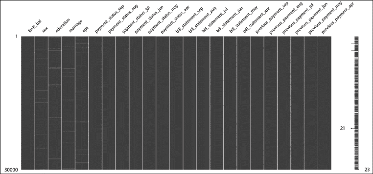

    图 13.15：贷款违约数据集的空值矩阵图

    在列中可见的白色条形代表缺失值。我们应该记住，在处理大数据集且仅有少量缺失值时，这些白色条形可能相当难以察觉。

    图表右侧的线条描述了数据完整性的形状。这两组数字表示数据集中的最大和最小空值数量。当一个观察值没有缺失值时，线条将位于最右边的位置，并且值等于数据集中的列数（此例中为 23）。随着缺失值数量在一个观察值中开始增加，线条会向左移动。空值为 21 表示数据集中有一行包含 2 个缺失值，因为该数据集的最大值是 23（列数）。

1.  按数据类型定义包含缺失值的列：

    ```py
    NUM_FEATURES = ["age"]
    CAT_FEATURES = ["sex", "education", "marriage"] 
    ```

1.  填充数值特征：

    ```py
    for col in NUM_FEATURES:
        num_imputer = SimpleImputer(strategy="median")
        num_imputer.fit(X_train[[col]])
        X_train.loc[:, col] = num_imputer.transform(X_train[[col]])
        X_test.loc[:, col] = num_imputer.transform(X_test[[col]]) 
    ```

1.  填充类别特征：

    ```py
    for col in CAT_FEATURES:
        cat_imputer = SimpleImputer(strategy="most_frequent")
        cat_imputer.fit(X_train[[col]])
        X_train.loc[:, col] = cat_imputer.transform(X_train[[col]])
        X_test.loc[:, col] = cat_imputer.transform(X_test[[col]]) 
    ```

我们可以通过`info`方法验证训练集和测试集都不包含缺失值。

## 它是如何工作的...

在*步骤 1*中，我们导入了所需的库。然后，我们使用`pandas` DataFrame 的`info`方法查看列的信息，如其类型和非空观测值的数量。总观测值数与非空观测值数的差值对应缺失观测值的数量。检查每列缺失值数量的另一种方式是运行`X.isnull().sum()`。

除了填充，我们也可以删除包含缺失值的观测值（甚至是列）。要删除所有包含任何缺失值的行，我们可以使用`X_train.dropna(how="any", inplace=True)`。在我们的示例中，缺失值的数量不大，但在实际数据集中，缺失值可能会很多，或者数据集太小，分析人员无法删除观测值。或者，我们还可以指定`dropna`方法的`thresh`参数，指明一个观测值（行）需要在多少列中缺失值才会被删除。

在*步骤 3*中，我们利用`missingno`库可视化了 DataFrame 的空值情况。

在*步骤 4*中，我们定义了包含我们希望填充的特征的列表，每种数据类型一个列表。这样做的原因是，数值特征的填充策略与类别特征的填充策略不同。对于基本的填充，我们使用了来自`scikit-learn`的`SimpleImputer`类。

在*步骤 5*中，我们遍历了数值特征（在此案例中仅为年龄特征），并使用中位数来替换缺失值。在循环内，我们定义了具有正确策略（`"median"`）的填充对象，将其拟合到训练数据的指定列，并对训练数据和测试数据进行了转换。这样，中位数的估算仅使用了训练数据，从而防止了潜在的数据泄露。

在本节中，我们使用`scikit-learn`处理缺失值的填充方法。然而，我们也可以手动处理。为此，对于每个包含缺失值的列（无论是在训练集还是测试集），我们需要使用训练集计算给定的统计量（均值/中位数/众数），例如，`age_median = X_train.age.median()`。然后，我们需要使用这个中位数来填充年龄列中的缺失值（在训练集和测试集中都使用`fillna`方法）。我们将在书籍的 GitHub 仓库中的 Jupyter 笔记本里展示如何操作。

*步骤 6*与*步骤 5*类似，都是使用相同的方法遍历分类列。不同之处在于所选的策略——我们使用了给定列中最频繁的值（`"most_frequent"`）。该策略适用于分类特征和数值特征。在后者情况下，它对应的是众数。

## 还有更多内容…

在处理缺失值时，还有一些值得注意的事项。

### 在 missingno 库中有更多的可视化工具

在本节中，我们已经覆盖了数据集中缺失值的空值矩阵表示。然而，`missingno`库提供了更多有用的可视化工具：

+   `msno.bar`——生成一个条形图，表示每一列的空值情况。这可能比空值矩阵更容易快速解释。

+   `msno.heatmap`——可视化空值相关性，也就是一个特征的存在/缺失如何影响另一个特征的存在。空值相关性的解释与标准的皮尔逊相关系数非常相似。它的取值范围从-1（当一个特征出现时，另一个特征肯定不出现）到 0（特征的出现或缺失彼此之间没有任何影响），再到 1（如果一个特征出现，则另一个特征也一定会出现）。

+   `msno.dendrogram`——帮助我们更好地理解变量之间的缺失相关性。在底层，它使用层次聚类方法，通过空值相关性将特征进行分箱。

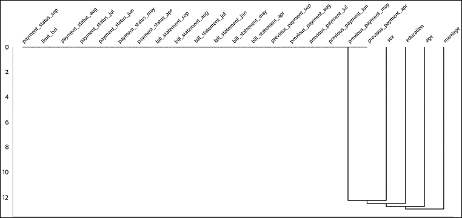

图 13.16：空值树状图示例

为了解释该图，我们需要从上到下分析它。首先，我们应该查看聚类叶节点，它们在距离为零时被连接在一起。这些特征可以完全预测彼此的存在，也就是说，当一个特征存在时，另一个特征可能总是缺失，或者它们可能总是同时存在或同时缺失，依此类推。距离接近零的聚类叶节点能够很好地预测彼此。

在我们的例子中，树状图将每个观测值中都存在的特征联系在一起。我们对此非常确定，因为我们设计上仅在四个特征中引入了缺失值。

### 基于机器学习的缺失值填充方法

在本教程中，我们提到过如何填补缺失值。像用一个大值或均值/中值/众数替换缺失值的方法被称为**单次填补方法**，因为它们用一个特定的值来替代缺失值。另一方面，还有**多次填补方法**，其中之一是**链式方程的多重填补**（**MICE**）。

简而言之，该算法运行多个回归模型，每个缺失值是基于非缺失数据点的条件值来确定的。使用基于机器学习的方法进行填补的潜在好处是减少了单次填补方法带来的偏差。MICE 算法可以在`scikit-learn`中找到，命名为`IterativeImputer`。

另外，我们可以使用**最近邻填补**（在`scikit-learn`的`KNNImputer`中实现）。KNN 填补的基本假设是，缺失的值可以通过来自最接近观测值的同一特征的其他观测值来近似。观测值之间的接近度是通过其他特征和某种距离度量来确定的，例如欧几里得距离。

由于该算法使用 KNN，它也有一些缺点：

+   需要调节超参数*k*以获得最佳性能

+   我们需要对数据进行标准化，并预处理类别特征

+   我们需要选择一个合适的距离度量（特别是在我们有类别和数值特征混合的情况下）

+   该算法对异常值和数据中的噪声较为敏感

+   由于需要计算每一对观测值之间的距离，因此计算开销可能较大

另一种可用的基于机器学习的算法叫做**MissForest**（可在`missingpy`库中找到）。简而言之，该算法首先用中值或众数填补缺失值。然后，使用随机森林模型来预测缺失的特征，模型通过其他已知特征训练得到。该模型使用我们知道目标值的观测数据进行训练（即在第一步中未填补的观测数据），然后对缺失特征的观测数据进行预测。在下一步中，初始的中值/众数预测将被来自随机森林模型的预测值替代。这个过程会循环多次，每次迭代都试图改进前一次的结果。当满足某个停止准则或耗尽允许的迭代次数时，算法停止。

MissForest 的优点：

+   可以处理数值型和类别型特征中的缺失值

+   不需要数据预处理（如标准化）

+   对噪声数据具有鲁棒性，因为随机森林几乎不使用无信息特征

+   非参数化——它不对特征之间的关系做任何假设（而 MICE 假设线性关系）

+   可以利用特征之间的非线性和交互效应来提高插补性能。

MissForest 的缺点：

+   插补时间随观测值数量、特征数量以及包含缺失值的特征数量的增加而增加。

+   与随机森林类似，解释起来不太容易。

+   这是一种算法，而不是我们可以存储在某个地方（例如，作为 pickle 文件）并在需要时重新使用的模型对象，用于插补缺失值。

## 另见

额外的资源可以在这里找到：

+   Azur, M. J., Stuart, E. A., Frangakis, C., & Leaf, P. J. (2011). “链式方程法的多重插补：它是什么？它是如何工作的？” *国际精神病学研究方法杂志*，20(1)，40-49\。 [`doi.org/10.1002/mpr.329`](https://doi.org/10.1002/mpr.329)。

+   Buck, S. F. (1960). “一种适用于电子计算机的多元数据缺失值估算方法。” *皇家统计学会学报：B 系列（方法论）*，22(2)，302-306\。 [`www.jstor.org/stable/2984099`](https://www.jstor.org/stable/2984099)。

+   Stekhoven, D. J. & Bühlmann, P. (2012). “MissForest——适用于混合数据类型的非参数缺失值插补。” *生物信息学*，*28*(1)，112-118。

+   van Buuren, S. & Groothuis-Oudshoorn, K. (2011). “MICE：基于链式方程的多重插补（R 语言）。” *统计软件杂志* 45 (3): 1–67\。

+   Van Buuren, S. (2018). *缺失数据的灵活插补*。CRC 出版社。

+   `miceforest`——一个用于快速、内存高效的 MICE 与 LightGBM 的 Python 库。

+   `missingpy`——一个 Python 库，包含 MissForest 算法的实现。

# 编码类别变量

在之前的配方中，我们看到一些特征是类别变量（最初表示为`object`或`category`数据类型）。然而，大多数机器学习算法只能处理数字数据。这就是为什么我们需要将类别特征编码为与机器学习模型兼容的表示形式。

编码类别特征的第一种方法叫做**标签编码**。在这种方法中，我们用不同的数字值替代特征的类别值。例如，对于三种不同的类别，我们使用以下表示：[0, 1, 2]。

这与转换为`pandas`中的`category`数据类型的结果非常相似。假设我们有一个名为`df_cat`的 DataFrame，它有一个叫做`feature_1`的特征。这个特征被编码为`category`数据类型。我们可以通过运行`df_cat["feature_1"].cat.codes`来访问类别的编码值。此外，我们可以通过运行`dict(zip(df_cat["feature_1"].cat.codes, df_cat["feature_1"]))`来恢复映射。我们也可以使用`pd.factorize`函数得到一个非常相似的表示。

标签编码的一个潜在问题是，它会在类别之间引入一种关系，而实际中这种关系可能并不存在。在一个三类的例子中，关系如下：0 < 1 < 2。如果这些类别是例如国家，这就没有多大意义。然而，这对表示某种顺序的特征（有序变量）来说是有效的。例如，标签编码可以很好地用于服务评级，评级范围为差-中等-好。

为了解决前述问题，我们可以使用**独热编码**。在这种方法中，对于特征的每个类别，我们都会创建一个新的列（有时称为虚拟变量），通过二进制编码表示某行是否属于该类别。该方法的一个潜在缺点是，它会显著增加数据集的维度（**维度灾难**）。首先，这会增加过拟合的风险，特别是在数据集中观测值不多时。其次，高维数据集对于任何基于距离的算法（例如 k-最近邻）来说都是一个重大问题，因为在高维情况下，多个维度会导致所有观测值彼此之间看起来等距。这自然会使基于距离的模型变得无效。

另一个需要注意的问题是，创建虚拟变量会给数据集引入一种冗余的形式。事实上，如果某个特征有三个类别，我们只需要两个虚拟变量就能完全表示它。因为如果一个观测值不是其中两个，它就必须是第三个。这通常被称为**虚拟变量陷阱**，最佳实践是总是从这种编码中删除一列（称为参考值）。在没有正则化的线性模型中，这一点尤其重要。

总结一下，我们应该避免使用标签编码，因为它会给数据引入虚假的顺序，这可能导致错误的结论。基于树的方法（决策树、随机森林等）可以与分类数据和标签编码一起工作。然而，对于线性回归、计算特征之间距离度量的模型（例如 k-means 聚类或 k-最近邻）或**人工神经网络**（**ANN**）等算法，独热编码是分类特征的自然表示。

## 准备就绪

对于本食谱，我们假设我们已经得到了前一个食谱*识别和处理缺失值*的填充训练集和测试集的输出。

## 如何操作...

执行以下步骤，使用标签编码和独热编码对分类变量进行编码：

1.  导入库：

    ```py
    import pandas as pd
    from sklearn.preprocessing import LabelEncoder, OneHotEncoder
    from sklearn.compose import ColumnTransformer 
    ```

1.  使用标签编码器对选定的列进行编码：

    ```py
    COL = "education"
    X_train_copy = X_train.copy()
    X_test_copy = X_test.copy()
    label_enc = LabelEncoder()
    label_enc.fit(X_train_copy[COL])
    X_train_copy.loc[:, COL] = label_enc.transform(X_train_copy[COL])
    X_test_copy.loc[:, COL] = label_enc.transform(X_test_copy[COL])
    X_test_copy[COL].head() 
    ```

    运行该代码片段会生成转换后的列的以下预览：

    ```py
    6907     3
    24575    0
    26766    3
    2156     0
    3179     3
    Name: education, dtype: int64 
    ```

    我们创建了`X_train`和`X_test`的副本，仅仅是为了展示如何使用`LabelEncoder`，但我们不希望修改我们稍后打算使用的实际数据框。

    我们可以通过使用`classes_`属性访问在已拟合的`LabelEncoder`中存储的标签。

1.  选择进行独热编码的类别特征：

    ```py
    cat_features = X_train.select_dtypes(include="object") \
                          .columns \
                          .to_list()
    cat_features 
    ```

    我们将对以下列应用独热编码：

    ```py
    ['sex', 'education',  'marriage', 'payment_status_sep', 'payment_status_aug', 'payment_status_jul', 'payment_status_jun', 'payment_status_may', 'payment_status_apr'] 
    ```

1.  实例化`OneHotEncoder`对象：

    ```py
    one_hot_encoder = OneHotEncoder(sparse=False,
                                    handle_unknown="error",
                                    drop="first") 
    ```

1.  使用独热编码器创建列转换器：

    ```py
    one_hot_transformer = ColumnTransformer(
        [("one_hot", one_hot_encoder, cat_features)],
        remainder="passthrough",
        verbose_feature_names_out=False
    ) 
    ```

1.  适配转换器：

    ```py
    one_hot_transformer.fit(X_train) 
    ```

    执行代码片段会打印出以下列转换器的预览：

    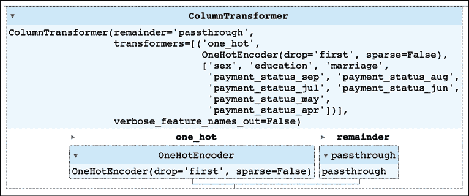

    图 13.17：使用独热编码的列转换器预览

1.  对训练集和测试集应用转换：

    ```py
    col_names = one_hot_transformer.get_feature_names_out()
    X_train_ohe = pd.DataFrame(
        one_hot_transformer.transform(X_train), 
        columns=col_names, 
        index=X_train.index
    )
    X_test_ohe = pd.DataFrame(one_hot_transformer.transform(X_test),
                              columns=col_names,
                              index=X_test.index) 
    ```

如我们之前所提到的，独热编码可能带来增加数据集维度的缺点。在我们的例子中，我们一开始有 23 列，应用独热编码后，最终得到了 72 列。

## 它是如何工作的...

首先，我们导入了所需的库。第二步中，我们选择了要进行标签编码的列，实例化了`LabelEncoder`，将其拟合到训练数据上，并转换了训练集和测试集。我们不想保留标签编码，因此我们对数据框进行了副本操作。

我们展示了使用标签编码，因为它是可用选项之一，但它有相当严重的缺点。因此在实际应用中，我们应避免使用它。此外，`scikit-learn`的文档警告我们以下声明：*此转换器应当用于编码目标值，即 y，而非输入 X。*

在*步骤 3*中，我们开始为独热编码做准备，通过创建一个包含所有类别特征的列表。我们使用`select_dtypes`方法选择所有`object`数据类型的特征。

在*步骤 4*中，我们创建了`OneHotEncoder`的实例。我们指定不希望使用稀疏矩阵（这是一种特殊的数据类型，适用于存储具有较高零值比例的矩阵），我们删除了每个特征的第一列（以避免虚拟变量陷阱），并指定了当编码器在应用转换时遇到未知值时该如何处理（`handle_unknown='error'`）。

在*步骤 5*中，我们定义了`ColumnTransformer`，这是一种方便的方法，可以将相同的转换（在本例中是独热编码器）应用于多列。我们传递了一个步骤列表，其中每个步骤都由一个元组定义。在这个例子中，它是一个包含步骤名称（`"one_hot"`）、要应用的转换以及我们希望应用该转换的特征的元组。

在创建`ColumnTransformer`时，我们还指定了另一个参数`remainder="passthrough"`，这实际上仅对指定的列进行了拟合和转换，同时保持其余部分不变。`remainder`参数的默认值是`"drop"`，会丢弃未使用的列。我们还将`verbose_feature_names_out`参数的值设置为`False`。这样，稍后使用`get_feature_names_out`方法时，它将不会在所有特征名称前加上生成该特征的转换器名称。

如果我们没有更改它，某些特征将具有`"one_hot__"`前缀，而其他特征将具有`"remainder__"`前缀。

在*步骤 6*中，我们使用`fit`方法将列转换器拟合到训练数据。最后，我们使用`transform`方法对训练集和测试集应用了转换。由于`transform`方法返回的是`numpy`数组而不是`pandas` DataFrame，我们必须自己进行转换。我们首先使用`get_feature_names_out`提取特征名称。然后，我们使用转换后的特征、新的列名和旧的索引（以保持顺序）创建了一个`pandas` DataFrame。

类似于处理缺失值或检测异常值，我们仅将所有转换器（包括独热编码）拟合到训练数据，然后将转换应用于训练集和测试集。通过这种方式，我们可以避免潜在的数据泄漏。

## 还有更多内容...

我们还想提及一些关于类别变量编码的其他事项。

### 使用 pandas 进行独热编码

除了`scikit-learn`，我们还可以使用`pd.get_dummies`对类别特征进行独热编码。示例语法如下：

```py
pd.get_dummies(X_train, prefix_sep="_", drop_first=True) 
```

了解这种替代方法是有益的，因为它可能更易于使用（列名会自动处理），特别是在创建快速概念验证（PoC）时。然而，在将代码投入生产时，最佳方法是使用`scikit-learn`的变体，并在管道中创建虚拟变量。

### 为 OneHotEncoder 指定可能的类别

在创建`ColumnTransformer`时，我们本可以另外提供一个包含所有考虑特征的可能类别的列表。以下是一个简化的示例：

```py
one_hot_encoder = OneHotEncoder(
    categories=[["Male", "Female", "Unknown"]],
    sparse=False,
    handle_unknown="error",
    drop="first"
)
one_hot_transformer = ColumnTransformer(
    [("one_hot", one_hot_encoder, ["sex"])]
)
one_hot_transformer.fit(X_train)
one_hot_transformer.get_feature_names_out() 
```

执行该代码片段将返回以下内容：

```py
array(['one_hot__sex_Female', 'one_hot__sex_Unknown'], dtype=object) 
```

通过传递一个包含每个特征可能类别的列表（列表的列表），我们考虑到了一种可能性，即某个特定值在训练集中可能没有出现，但可能会出现在测试集中（或在生产环境中新观测值的批次中）。如果是这种情况，我们就会遇到错误。

在前面的代码块中，我们向表示性别的列添加了一个名为`"Unknown"`的额外类别。因此，我们会为该类别生成一个额外的“虚拟”列。男性类别被作为参考类别而被删除。

### 类别编码器库

除了使用`pandas`和`scikit-learn`，我们还可以使用另一个名为`Category Encoders`的库。它属于一组与`scikit-learn`兼容的库，并提供了一些编码器，采用类似的 fit-transform 方法。这也是为什么它可以与`ColumnTransformer`和`Pipeline`一起使用的原因。

我们展示了一个替代的一热编码实现。

导入库：

```py
import category_encoders as ce 
```

创建编码器对象：

```py
one_hot_encoder_ce = ce.OneHotEncoder(use_cat_names=True) 
```

此外，我们可以指定一个名为`drop_invariant`的参数，表示我们希望丢弃没有方差的列，例如仅填充一个唯一值的列。这可以帮助减少特征数量。

拟合编码器，并转换数据：

```py
one_hot_encoder_ce.fit(X_train)
X_train_ce = one_hot_encoder_ce.transform(X_train) 
```

这种一热编码器的实现会自动编码仅包含字符串的列（除非我们通过将类别列的列表传递给`cols`参数来指定只编码部分列）。默认情况下，它还返回一个`pandas` DataFrame（与`scikit-learn`实现中的`numpy`数组相比），并调整了列名。这种实现的唯一缺点是，它不允许丢弃每个特征的一个冗余虚拟变量列。

### 关于一热编码和基于决策树的算法的警告

尽管基于回归的模型自然能处理一热编码特征的 OR 条件，但决策树算法却不那么简单。从理论上讲，决策树可以在不需要编码的情况下处理类别特征。

然而，`scikit-learn`中流行的实现仍然要求所有特征必须是数值型的。简单来说，这种方法偏向于连续数值型特征，而不是一热编码的虚拟变量，因为单个虚拟变量只能将特征信息的一部分带入模型。一个可能的解决方案是使用另一种编码方式（标签/目标编码）或使用能够处理类别特征的实现，例如`h2o`库中的随机森林或 LightGBM 模型。

# 拟合决策树分类器

**决策树**分类器是一种相对简单但非常重要的机器学习算法，既可以用于回归问题，也可以用于分类问题。这个名字来源于模型创建一组规则（例如，`if x_1 > 50 and x_2 < 10 then y = 'default'`），这些规则加起来可以被可视化为一棵树。决策树通过在某个值处反复划分特征，将特征空间划分为若干较小的区域。为此，它们使用**贪心算法**（结合一些启发式方法）来找到一个分裂点，以最小化子节点的总体杂质。在分类任务中，杂质通过基尼杂质或熵来衡量，而在回归问题中，树使用均方误差或均绝对误差作为衡量标准。

在二分类问题中，算法试图获得包含尽可能多来自同一类别的观测数据的节点，从而最小化不纯度。分类问题中，终端节点（叶子节点）的预测是基于众数，而回归问题则是基于均值。

决策树是许多复杂算法的基础，例如随机森林、梯度提升树、XGBoost、LightGBM、CatBoost 等。

决策树的优点包括以下几点：

+   以树形结构轻松可视化——具有很高的可解释性

+   快速的训练和预测阶段

+   需要调整的超参数相对较少

+   支持数值型和分类特征

+   可以处理数据中的非线性关系

+   通过特征工程可以进一步改善，但并不需要强制这样做

+   不需要对特征进行缩放或标准化

+   通过选择划分样本的特征，整合其特征选择的版本

+   非参数模型——不对特征/目标的分布做任何假设

另一方面，决策树的缺点包括以下几点：

+   不稳定性——决策树对输入数据中的噪声非常敏感。数据中的一个小变化可能会显著改变模型。

+   过拟合——如果我们没有提供最大值或停止准则，决策树可能会过度生长，导致模型的泛化能力差。

+   决策树只能进行内插，但不能进行外推——对于训练数据的特征空间边界之外的观测数据，它们做出恒定的预测。

+   底层的贪心算法无法保证选择全局最优的决策树。

+   类别不平衡可能导致决策树出现偏差。

+   决策树中类别变量的信息增益（熵的减少）会导致具有较多类别的特征结果偏向。

## 准备工作

对于这个食谱，我们假设已经得到了前一个食谱《*编码分类变量*》中的一热编码训练集和测试集的输出。

## 如何做…

执行以下步骤来拟合决策树分类器：

1.  导入库：

    ```py
    from sklearn.tree import DecisionTreeClassifier, plot_tree
    from sklearn import metrics
    from chapter_13_utils import performance_evaluation_report 
    ```

    在本食谱及随后的食谱中，我们将使用`performance_evaluation_report`辅助函数。它绘制了用于评估二分类模型的有用指标（混淆矩阵、ROC 曲线）。此外，它还返回一个字典，包含更多的评估指标，我们将在*工作原理*部分进行介绍。

1.  创建模型实例，将其拟合到训练数据，并生成预测：

    ```py
    tree_classifier = DecisionTreeClassifier(random_state=42)
    tree_classifier.fit(X_train_ohe, y_train)
    y_pred = tree_classifier.predict(X_test_ohe) 
    ```

1.  评估结果：

    ```py
    LABELS = ["No Default", "Default"]
    tree_perf = performance_evaluation_report(tree_classifier,
                                              X_test_ohe,
                                              y_test, labels=LABELS,
                                              show_plot=True) 
    ```

    执行代码片段会生成以下图表：

    

    图 13.18：拟合后的决策树分类器的性能评估报告

    `tree_perf`对象是一个字典，包含更多相关的评估指标，可以进一步帮助我们评估模型的性能。我们在下面展示这些指标：

    ```py
    {'accuracy': 0.7141666666666666,
     'precision': 0.3656509695290859,
     'recall': 0.39788997739261495,
     'specificity': 0.8039803124331265,
     'f1_score': 0.3810898592565861,
     'cohens_kappa': 0.1956931046277427,
     'matthews_corr_coeff': 0.1959883714391891,
     'roc_auc': 0.601583581287813,
     'pr_auc': 0.44877724015824927,
     'average_precision': 0.2789754297204212} 
    ```

    要获取更多关于评估指标解释的见解，请参考*它是如何工作的……*部分。

1.  绘制拟合决策树的前几层：

    ```py
    plot_tree(tree_classifier, max_depth=3, fontsize=10) 
    ```

    执行代码片段会生成以下图形：

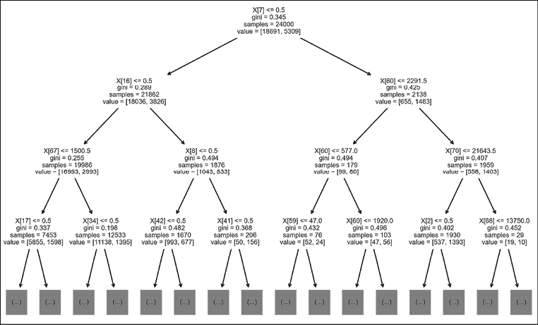

图 13.19：拟合的决策树，最大深度限制为 3

使用单行代码，我们已经能够可视化出大量信息。我们决定只绘制决策树的 3 层，因为拟合的树实际上达到了 44 层的深度。正如我们所提到的，不限制`max_depth`超参数可能会导致这种情况，这也很可能会导致过拟合。

在树中，我们可以看到以下信息：

+   用于拆分树的特征以及拆分的值。不幸的是，使用默认设置时，我们只看到列号，而不是特征名称。我们将很快修正这个问题。

+   基尼不纯度的值。

+   每个节点/叶子中的样本数量。

+   每个节点/叶子中各类的观察数量。

我们可以通过`plot_tree`函数的几个附加参数向图形中添加更多信息：

```py
plot_tree(
    tree_classifier,
    max_depth=2,
    feature_names=X_train_ohe.columns,
    class_names=["No default", "Default"],
    rounded=True,
    filled=True,
    fontsize=10
) 
```

执行代码片段会生成以下图形：

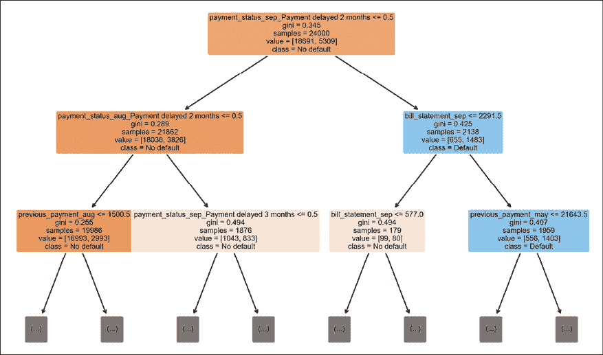

图 13.20：拟合的决策树，最大深度限制为 2

在*图 13.20*中，我们看到了一些额外的信息：

+   用于创建拆分的特征名称

+   每个节点/叶子中占主导地位的类别名称

可视化决策树有许多好处。首先，我们可以深入了解哪些特征用于创建模型（这可能是特征重要性的一种衡量标准），以及哪些值用于创建拆分。前提是这些特征具有清晰的解释，这可以作为一种理智检查，看看我们关于数据和所考虑问题的初步假设是否成立，是否符合常识或领域知识。它还可以帮助向业务利益相关者呈现清晰、一致的故事，他们可以很容易地理解这种简单的模型表示。我们将在下一章深入讨论特征重要性和模型可解释性。

## 它是如何工作的……

在*步骤 2*中，我们使用了典型的`scikit-learn`方法来训练机器学习模型。首先，我们创建了`DecisionTreeClassifier`类的对象（使用所有默认设置和固定的随机状态）。然后，我们使用`fit`方法将模型拟合到训练数据（需要传入特征和目标）。最后，我们通过`predict`方法获得预测结果。

使用`predict`方法会返回一个预测类别的数组（在本例中是 0 或 1）。然而，也有一些情况我们对预测的概率或分数感兴趣。为了获取这些值，我们可以使用`predict_proba`方法，它返回一个`n_test_observations`行，`n_classes`列的数组。每一行包含所有可能类别的概率（这些概率的总和为 1）。在二分类的情况下，当对应的概率超过 50%时，`predict`方法会自动将正类分配给该观察值。

在*步骤 3*中，我们评估了模型的表现。我们使用了一个自定义函数来展示所有的结果。我们不会深入探讨它的具体细节，因为它是标准的，且是通过使用`scikit-learn`库中的`metrics`模块的函数构建的。有关该函数的详细描述，请参考附带的 GitHub 仓库。

**混淆矩阵**总结了所有可能的预测值与实际目标值之间的组合。可能的值如下：

+   **真正阳性**（**TP**）：模型预测为违约，且客户违约了。

+   **假阳性**（**FP**）：模型预测为违约，但客户未违约。

+   **真正阴性**（**TN**）：模型预测为好客户，且客户未违约。

+   **假阴性**（**FN**）：模型预测为好客户，但客户违约了。

在上面呈现的场景中，我们假设违约是由正类表示的。这并不意味着结果（客户违约）是好或正面的，仅仅表示某事件发生了。通常情况下，多数类是“无关”的情况，会被赋予负标签。这是数据科学项目中的典型约定。

使用以上呈现的值，我们可以进一步构建多个评估标准：

+   **准确率** [表示为 (*TP* + *TN*) / (*TP* + *FP* + *TN* + *FN*)]——衡量模型正确预测观察值类别的整体能力。

+   **精确度** [表示为 *TP* / (*TP* + *FP*)]——衡量所有正类预测（在我们的案例中是违约）中，实际为正类的比例。在我们的项目中，它回答了这个问题：*在所有违约预测中，实际违约的客户有多少*？或者换句话说：*当模型预测违约时，它的准确率有多高？*

+   **召回率** [表示为 *TP* / (*TP* + *FN*)]——衡量所有正类样本中被正确预测的比例。也叫做敏感度或真正阳性率。在我们的案例中，它回答了这个问题：*我们正确预测了多少实际发生的违约事件？*

+   **F-1 分数**—精确度和召回率的调和平均数。使用调和平均数而非算术平均数的原因是它考虑了两个分数之间的协调性（相似性）。因此，它惩罚极端结果，并避免高度不平衡的值。例如，一个精确度为 1 而召回率为 0 的分类器，在使用简单平均时得分为 0.5，而在使用调和平均时得分为 0。

+   **特异性** [表示为 *TN* / (*TN* + *FP*)]—衡量负类案例（没有违约的客户）中实际上没有违约的比例。理解特异性的一个有用方法是将其视为负类的召回率。

理解这些指标背后的细微差别对于正确评估模型性能非常重要。在类别不平衡的情况下，准确率可能会非常具有误导性。假设 99%的数据不是欺诈的，只有 1%是欺诈的。那么，一个将每个观察值都分类为非欺诈的天真模型可以达到 99%的准确率，但实际上它是毫无价值的。这就是为什么在这种情况下，我们应该参考精确度或召回率：

+   当我们尽力实现尽可能高的精确度时，我们将减少假阳性，但代价是增加假阴性。当假阳性的代价很高时，我们应该优化精确度，例如在垃圾邮件检测中。

+   在优化召回率时，我们将减少假阴性，但代价是增加假阳性。当假阴性的代价很高时，我们应该优化召回率，例如在欺诈检测中。

关于哪种指标最好，没有一刀切的规则。我们试图优化的指标应根据使用场景来选择。

第二张图包含**接收者操作特征**（**ROC**）曲线。ROC 曲线展示了不同概率阈值下真实正类率（TPR，召回率）与假阳性率（FPR，即 1 减去特异性）之间的权衡。概率阈值决定了当预测概率超过某一值时，我们判断观察结果属于正类（默认值为 50%）。

一个理想的分类器将具有 0 的假阳性率和 1 的真实正类率。因此，ROC 图中的最佳点是图中的(0,1)点。一个有技巧的模型曲线将尽可能接近这个点。另一方面，一个没有技巧的模型将会有一条接近对角线（45°）的线。为了更好地理解 ROC 曲线，请考虑以下内容：

+   假设我们将决策阈值设置为 0，也就是说，所有观察结果都被分类为违约。这得出两个结论。首先，没有实际的违约被预测为负类（假阴性），这意味着真实正类率（召回率）为 1。其次，没有良好的客户被分类为正类（真实负类），这意味着假阳性率也为 1。这对应于 ROC 曲线的右上角。

+   让我们假设另一种极端情况，假设决策阈值为 1，也就是说，所有客户都被分类为优质客户（无违约，即负类）。由于完全没有正预测，这将导致以下结论：首先，没有真正例（TPR = 0）。其次，没有假正例（FPR = 0）。这种情况对应于曲线的左下角。

+   因此，曲线上的所有点都对应于分类器在两个极端（0 和 1）之间的各个阈值下的得分。该曲线应接近理想点，即真正例率为 1，假正例率为 0。也就是说，所有违约客户都不被分类为优质客户，所有优质客户都不被分类为可能违约。换句话说，这是一个完美的分类器。

+   如果性能接近对角线，说明模型对违约和非违约客户的分类大致相同，等同于随机猜测。换句话说，这个分类器与随机猜测一样好。

一个位于对角线下方的模型是可能的，实际上比“无技能”模型更好，因为它的预测可以简单地反转，从而获得更好的性能。

总结模型性能时，我们可以通过一个数字来查看**ROC 曲线下的面积**（**AUC**）。它是衡量所有可能决策阈值下的综合性能的指标。AUC 的值介于 0 和 1 之间，它告诉我们模型区分各类的能力。AUC 为 0 的模型总是错误的，而 AUC 为 1 的模型总是正确的。AUC 为 0.5 表示模型没有任何技能，几乎等同于随机猜测。

我们可以用概率的角度来解读 AUC。简而言之，它表示正类概率与负类概率的分离程度。AUC 代表一个模型将一个随机正类样本排得比一个随机负类样本更高的概率。

一个例子可能会更容易理解。假设我们有一些来自模型的预测结果，这些预测结果按得分/概率升序排列。*图 13.21* 展示了这一点。AUC 为 75% 意味着，如果我们随机选择一个正类样本和一个负类样本，那么它们以 75% 的概率会被正确排序，也就是说，随机的正类样本位于随机负类样本的右侧。

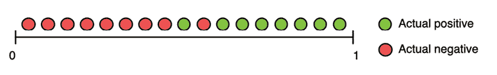

图 13.21：按预测得分/概率排序的模型输出

实际上，我们可能使用 ROC 曲线来选择一个阈值，从而在假正例和假负例之间取得适当的平衡。此外，AUC 是比较不同模型性能差异的一个好指标。

在上一步中，我们使用`plot_tree`函数可视化了决策树。

## 还有更多...

我们已经涵盖了使用机器学习模型（在我们的案例中是决策树）解决二分类任务的基础内容，并且讲解了最常用的分类评估指标。然而，仍然有一些有趣的主题值得至少提及。

### 更深入地探讨分类评估指标

我们已经深入探讨了一个常见的评估指标——ROC 曲线。它的一个问题是，在处理（严重）类别不平衡时，它在评估模型表现时失去了可信度。在这种情况下，我们应该使用另一种曲线——**精确率-召回率曲线**。这是因为，在计算精确率和召回率时，我们不使用真正负类，而只考虑少数类（即正类）的正确预测。

我们首先提取预测得分/概率，并计算不同阈值下的精确率和召回率：

```py
y_pred_prob = tree_classifier.predict_proba(X_test_ohe)[:, 1]
precision, recall, _ = metrics.precision_recall_curve(y_test,
                                                      y_pred_prob) 
```

由于我们实际上并不需要阈值，我们将该函数的输出替换为下划线。

计算完所需元素后，我们可以绘制该曲线：

```py
ax = plt.subplot()
ax.plot(recall, precision,
        label=f"PR-AUC = {metrics.auc(recall, precision):.2f}")
ax.set(title="Precision-Recall Curve",
       xlabel="Recall",
       ylabel="Precision")
ax.legend() 
```

执行代码片段后会生成以下图表：

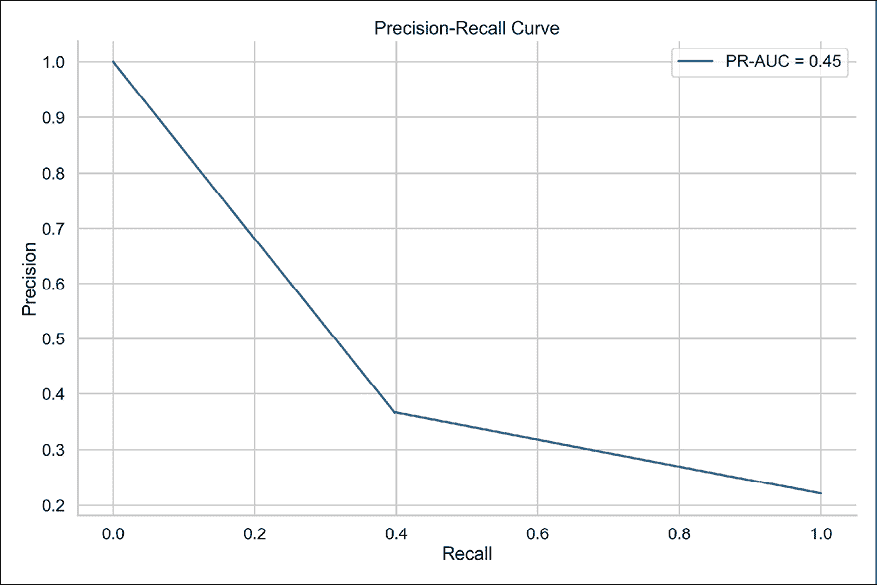

图 13.22：拟合的决策树分类器的精确率-召回率曲线

类似于 ROC 曲线，我们可以如下分析精确率-召回率曲线：

+   曲线中的每个点都对应一个不同决策阈值下的精确率和召回率值。

+   当决策阈值为 0 时，精确率 = 0，召回率 = 1。

+   当决策阈值为 1 时，精确率 = 1，召回率 = 0。

+   作为总结性指标，我们可以通过近似计算精确率-召回率曲线下的面积。

+   PR-AUC 的范围从 0 到 1，其中 1 表示完美的模型。

+   一个 PR-AUC 为 1 的模型可以识别所有正类样本（完美召回率），同时不会错误地将任何负类样本标记为正类（完美精确率）。完美的点位于（1, 1），即图表的右上角。

+   我们可以认为那些弯向（1, 1）点的模型是有技巧的。

*图 13.22* 中的 PR 曲线可能存在一个潜在问题，那就是由于在绘制每个阈值的精确率和召回率时进行的插值，它可能会显得过于乐观。通过以下代码片段，可以获得更为现实的表示：

```py
ax = metrics.PrecisionRecallDisplay.from_estimator(
    tree_classifier, X_test_ohe, y_test
)
ax.ax_.set_title("Precision-Recall Curve") 
```

执行代码片段后会生成以下图表：

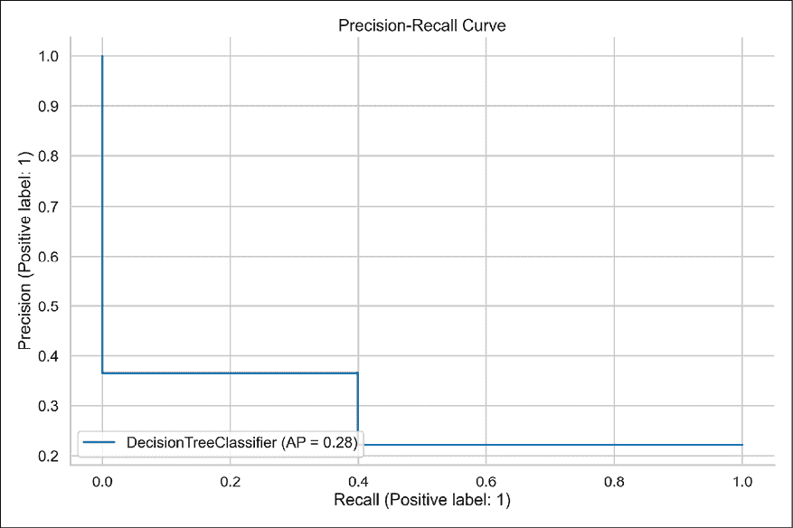

图 13.23：拟合的决策树分类器的更为现实的精确率-召回率曲线

首先，我们可以看到，尽管形状不同，但我们可以轻松识别出图形的模式以及插值实际的作用。我们可以想象将图表的极端点与单个点（两个指标的值大约为 0.4）连接起来，这样就能得到通过插值得到的形状。

其次，我们还可以看到得分大幅下降（从 0.45 降至 0.28）。在第一个案例中，我们通过 PR 曲线的梯形插值法计算得分（`auc(precision, recall)`在`scikit-learn`中）。在第二个案例中，得分实际上是另一种指标——平均精度。**平均精度**将精确度-召回曲线总结为每个阈值下精确度的加权平均，其中权重是通过从前一个阈值到当前阈值的召回率增加量来计算的。

尽管这两种指标在许多情况下产生非常相似的估计值，但它们在本质上是不同的。第一种方法使用了过于乐观的线性插值，并且其影响可能在数据高度偏斜/不平衡时更为明显。

我们已经介绍过 F1 得分，它是精确度和召回率的调和平均数。实际上，它是一个更一般的指标的特例，这个指标被称为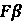-得分，其中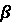因子定义了召回率的权重，而精确度的权重为 1。为了确保权重的和为 1，两者都通过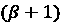进行归一化。这样的得分定义意味着以下几点：

+   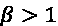——将更多权重放在召回率上

+   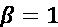——与 F1 得分相同，因此召回率和精确度被视为同等重要

+   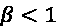——将更多权重放在精确度上

使用精确度、召回率或 F1 得分的一些潜在陷阱包括这些指标是非对称的，也就是说，它们侧重于正类。通过查看它们的公式，我们可以清楚地看到它们从未考虑真实负类。这正是**Matthew 相关系数**（也叫*phi 系数*）试图克服的问题：

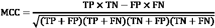

分析公式揭示了以下几点：

+   在计算得分时，混淆矩阵的所有元素都被考虑在内

+   该公式类似于用于计算皮尔逊相关系数的公式

+   MCC 将真实类别和预测类别视为两个二元变量，并有效地计算它们的相关系数

MCC 的值介于-1（分类器总是错误分类）和 1（完美分类器）之间。值为 0 表示分类器不比随机猜测好。总体而言，由于 MCC 是一个对称指标，要获得高值，分类器必须在预测正类和负类时都表现良好。

由于 MCC 不像 F1 得分那样直观且容易解释，它可能是一个较好的指标，尤其是在低精度和低召回率的代价未知或无法量化时。在这种情况下，MCC 可能比 F1 得分更好，因为它提供了一个更平衡（对称）的分类器评估。

### 使用 dtreeviz 可视化决策树

`scikit-learn` 中的默认绘图功能绝对可以认为足够好，用于可视化决策树。然而，我们可以通过使用 `dtreeviz` 库将其提升到一个新层次。

首先，我们导入库：

```py
from dtreeviz.trees import * 
```

然后，我们训练一个最大深度为 3 的较小决策树。这样做只是为了使可视化更易于阅读。不幸的是，`dtreeviz`没有选项仅绘制树的 *x* 层级：

```py
small_tree = DecisionTreeClassifier(max_depth=3,
                                    random_state=42)
small_tree.fit(X_train_ohe, y_train) 
```

最后，我们绘制树：

```py
viz = dtreeviz(small_tree,
               x_data=X_train_ohe,
               y_data=y_train,
               feature_names=X_train_ohe.columns,
               target_name="Default",
               class_names=["No", "Yes"],
               title="Decision Tree - Loan default dataset")
viz 
```

运行代码片段生成以下图表：

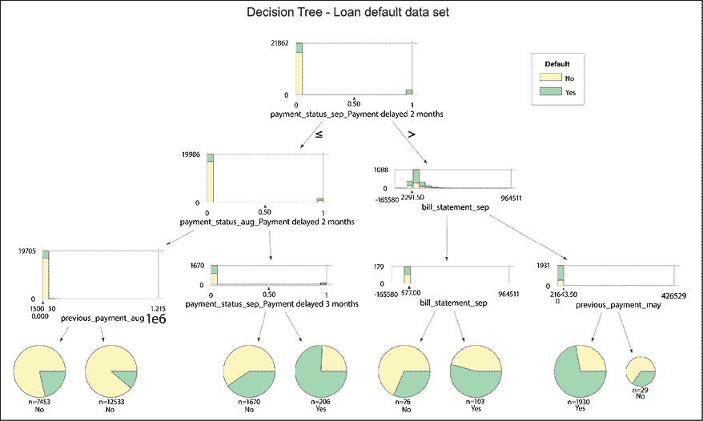

图 13.24：使用 dtreeviz 可视化的决策树

与之前生成的图相比，使用`dtreeviz`创建的图表额外展示了用于分割的特征分布（针对每个类别分别显示），并附有分割值。此外，叶节点以饼图的形式呈现。

如需更多使用 `dtreeviz` 的示例，包括在树的所有分割中添加一个跟踪特定观测值的路径，请参考书籍 GitHub 仓库中的笔记本。

## 另见

使用 ROC-AUC 作为性能评估指标的危险性信息：

+   Lobo, J. M., Jiménez‐Valverde, A., & Real, R. (2008). “AUC：一个误导性的预测分布模型性能度量。” *全球生态学与生物地理学*，17(2)，145-151。

+   Sokolova, M. & Lapalme, G. (2009). “分类任务性能度量的系统分析。” *信息处理与管理*，45(4)，427-437。

关于精确度-召回率曲线的更多信息：

+   Davis, J. & Goadrich, M. (2006 年 6 月). “精确度-召回率与 ROC 曲线的关系。”发表于 *第 23 届国际机器学习会议论文集*（第 233-240 页）。

关于决策树的附加资源：

+   Breiman, L., Friedman, J., Olshen, R., & Stone, C. (1984) *分类与回归树*。Chapman & Hall，Wadsworth，New York。

+   Breiman, L. (2017). *分类与回归树*。Routledge。

# 使用管道组织项目

在之前的示例中，我们展示了构建机器学习模型所需的所有步骤——从加载数据、将其划分为训练集和测试集、填补缺失值、编码分类特征，到最终拟合决策树分类器。

该过程需要按照一定顺序执行多个步骤，在进行大量管道修改时有时会变得复杂。这就是 `scikit-learn` 引入管道的原因。通过使用管道，我们可以依次将一系列转换应用于数据，然后训练给定的估算器（模型）。

需要注意的一个重要点是，管道的中间步骤必须具有 `fit` 和 `transform` 方法，而最终的估算器只需要 `fit` 方法。

在`scikit-learn`的术语中，我们将包含`fit`和`transform`方法的对象称为**变换器**。我们用它们来清洗和预处理数据。一个例子是我们已经讨论过的`OneHotEncoder`。类似地，我们使用**估计器**一词来指代包含`fit`和`predict`方法的对象。它们是机器学习模型，例如`DecisionTreeClassifier`。

使用管道有几个好处：

+   流程更加容易阅读和理解——对给定列执行的操作链条清晰可见。

+   使避免数据泄漏变得更加容易，例如，在缩放训练集并使用交叉验证时。

+   步骤的顺序由管道强制执行。

+   提高了可重复性。

在本配方中，我们展示了如何创建整个项目的管道，从加载数据到训练分类器。

## 如何实现...

执行以下步骤来构建项目的管道：

1.  导入库：

    ```py
    import pandas as pd
    from sklearn.model_selection import train_test_split
    from sklearn.impute import SimpleImputer
    from sklearn.preprocessing import OneHotEncoder
    from sklearn.compose import ColumnTransformer
    from sklearn.tree import DecisionTreeClassifier
    from sklearn.pipeline import Pipeline
    from chapter_13_utils import performance_evaluation_report 
    ```

1.  加载数据，分离目标变量，并创建分层的训练-测试集：

    ```py
    df = pd.read_csv("../Datasets/credit_card_default.csv", 
                     na_values="")
    X = df.copy()
    y = X.pop("default_payment_next_month")
    X_train, X_test, y_train, y_test = train_test_split(
        X, y, 
        test_size=0.2, 
        stratify=y, 
        random_state=42
    ) 
    ```

1.  准备数值/类别特征的列表：

    ```py
    num_features = X_train.select_dtypes(include="number") \
                          .columns \
                          .to_list()
    cat_features = X_train.select_dtypes(include="object") \
                          .columns \
                          .to_list() 
    ```

1.  定义数值管道：

    ```py
    num_pipeline = Pipeline(steps=[
        ("imputer", SimpleImputer(strategy="median"))
    ]) 
    ```

1.  定义类别管道：

    ```py
    cat_list = [
        list(X_train[col].dropna().unique()) for col in cat_features
    ]

    cat_pipeline = Pipeline(steps=[
        ("imputer", SimpleImputer(strategy="most_frequent")),
        ("onehot", OneHotEncoder(categories=cat_list, sparse=False, 
                                 handle_unknown="error", 
                                 drop="first"))
    ]) 
    ```

1.  定义`ColumnTransformer`对象：

    ```py
    preprocessor = ColumnTransformer(
        transformers=[
            ("numerical", num_pipeline, num_features),
            ("categorical", cat_pipeline, cat_features)
        ],
        remainder="drop"
    ) 
    ```

1.  定义包括决策树模型的完整管道：

    ```py
    dec_tree = DecisionTreeClassifier(random_state=42)
    tree_pipeline = Pipeline(steps=[
        ("preprocessor", preprocessor),
        ("classifier", dec_tree)
    ]) 
    ```

1.  将管道拟合到数据：

    ```py
    tree_pipeline.fit(X_train, y_train) 
    ```

    执行该代码段会生成管道的以下预览：

    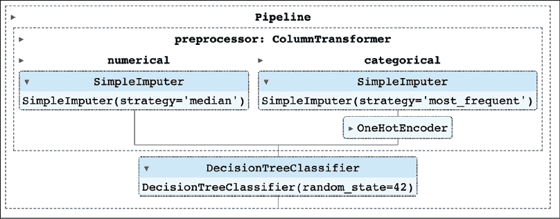

    图 13.25：管道的预览

1.  评估整个管道的性能：

    ```py
    LABELS = ["No Default", "Default"]
    tree_perf = performance_evaluation_report(tree_pipeline, X_test,
                                              y_test, labels=LABELS,
                                              show_plot=True) 
    ```

    执行该代码段会生成以下图表：

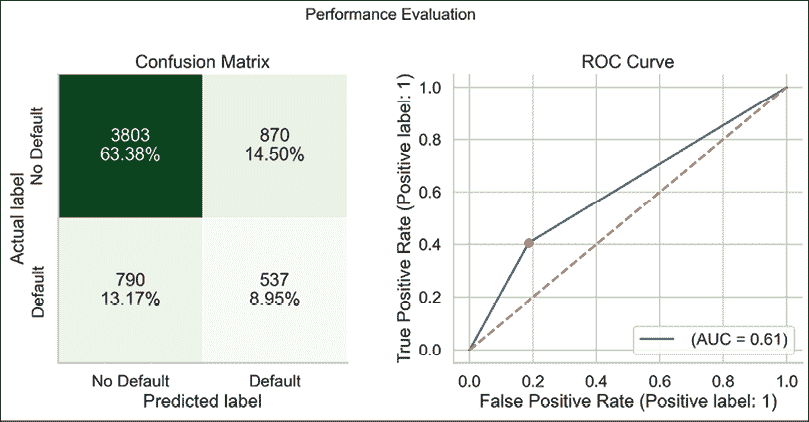

图 13.26：拟合管道的性能评估报告

我们看到，模型的性能与我们通过单独执行所有步骤所取得的结果非常相似。考虑到变化如此之小，这正是我们预期要实现的。

## 它是如何工作的...

在*步骤 1*中，我们导入了所需的库。列表可能看起来有些令人畏惧，但这是因为我们需要结合多个在前面的配方中使用的函数/类。

在*步骤 2*中，我们从 CSV 文件加载数据，将目标变量与特征分开，最后创建了一个分层的训练-测试集。然后，我们还创建了两个列表，分别包含数值特征和类别特征的名称。这样做是因为我们将根据特征的数据类型应用不同的变换。为了选择适当的列，我们使用了`select_dtypes`方法。

在*步骤 4*中，我们定义了第一个`Pipeline`，其中包含了我们希望应用于数值特征的变换。事实上，我们只想使用中位数值填补特征的缺失值。在创建`Pipeline`类的实例时，我们提供了一个包含步骤的元组列表，每个元组由步骤的名称（便于识别和访问）和我们希望使用的类组成。在这种情况下，我们使用的是在*识别和处理缺失值*配方中涉及的`SimpleImputer`类。

在*步骤 5*中，我们为类别特征准备了一个类似的流水线。不过，这一次，我们链式操作了两个不同的操作——插补器（使用最频繁的值）和独热编码器。对于编码器，我们还指定了一个名为`cat_list`的列表，其中列出了所有可能的类别。我们仅基于`X_train`提供了这些信息。这样做是为了为下一个步骤做准备，在这个步骤中，我们引入了交叉验证，期间可能会出现某些随机抽样不包含所有可用类别的情况。

在*步骤 6*中，我们定义了`ColumnTransformer`对象。通常，当我们希望对不同组的列/特征应用不同的转换时，会使用`ColumnTransformer`。在我们的案例中，我们为数值特征和类别特征分别定义了不同的流水线。同样，我们传递了一个元组列表，每个元组包含一个名称、我们之前定义的流水线之一和一个需要应用转换的列列表。我们还指定了`remainder="drop"`，以删除未应用任何转换的额外列。在这种情况下，所有特征都应用了转换，因此没有列被删除。需要注意的是，`ColumnTransformer`返回的是`numpy`数组，而不是`pandas`数据框！

`scikit-learn`中还有一个有用的类是`FeatureUnion`。当我们希望以不同的方式转换相同的输入数据，并将这些输出作为特征使用时，可以使用它。例如，我们可能正在处理文本数据，并希望应用两种变换：**TF-IDF**（词频-逆文档频率）向量化和提取文本的长度。这些输出应该附加到原始数据框中，以便我们将它们作为模型的特征。

在*步骤 7*中，我们再次使用了`Pipeline`将`preprocessor`（之前定义的`ColumnTransformer`对象）与决策树分类器链式连接（为了可重复性，我们将随机状态设置为 42）。最后两步涉及将整个流水线拟合到数据，并使用自定义函数评估其性能。

`performance_evaluation_report`函数的构建方式使其可以与任何具有`predict`和`predict_proba`方法的估计器或`Pipeline`一起使用。这些方法用于获取预测值及其对应的分数/概率。

## 还有更多...

### 向流水线添加自定义变换器

在本教程中，我们展示了如何为数据科学项目创建整个流水线。然而，还有许多其他的变换可以作为预处理步骤应用于数据。其中一些包括：

+   **缩放数值特征**：换句话说，由于不同特征的量度范围不同，这会给模型带来偏差，因此需要对特征进行缩放。当我们处理那些计算特征间某种距离的模型（如 k 最近邻）或线性模型时，应该特别关注特征缩放。`scikit-learn`中一些常用的缩放选项包括`StandardScaler`和`MinMaxScaler`。

+   **离散化连续变量**：我们可以将一个连续变量（例如年龄）转换为有限数量的区间（例如：<25 岁、26-50 岁、>51 岁）。当我们想要创建特定的区间时，可以使用`pd.cut`函数，而`pd.qcut`可以用于基于分位数进行划分。

+   **转换/移除异常值**：在进行探索性数据分析（EDA）时，我们经常会看到一些极端的特征值，这些值可能是由于某种错误造成的（例如，在年龄中多加了一位数字），或者它们与其他数据点不兼容（例如，在一群中产阶级公民中有一位千万富翁）。这样的异常值会影响模型的结果，因此处理它们是一种良好的实践。一个解决方案是将它们完全移除，但这样做可能会影响模型的泛化能力。我们也可以将它们调整为更接近常规值的范围。

基于决策树的机器学习模型不需要任何缩放处理。

在这个示例中，我们展示了如何创建一个自定义变换器来检测并修改异常值。我们应用一个简单的经验法则——我们将超过/低于均值加减 3 倍标准差的值限制在范围内。我们为此任务创建了一个专门的变换器，这样我们就可以将异常值处理整合到之前建立的管道中：

1.  从`sklearn`导入基本的估算器和变换器类：

    ```py
    from sklearn.base import BaseEstimator, TransformerMixin
    import numpy as np 
    ```

    为了使自定义变换器与`scikit-learn`的管道兼容，它必须具有诸如`fit`、`transform`、`fit_transform`、`get_params`和`set_params`等方法。

    我们可以手动定义所有这些内容，但更具吸引力的做法是使用 Python 的**类继承**来简化过程。这就是为什么我们从`scikit-learn`导入了`BaseEstimator`和`TransformerMixin`类的原因。通过继承`TransformerMixin`，我们无需再指定`fit_transform`方法，而继承`BaseEstimator`则自动提供了`get_params`和`set_params`方法。

    作为一种学习体验，深入了解`scikit-learn`中一些更流行的变换器/估算器的代码是非常有意义的。通过这样做，我们可以学到很多面向对象编程的最佳实践，并观察（并欣赏）这些类是如何始终如一地遵循相同的指导原则/原则的。

1.  定义`OutlierRemover`类：

    ```py
    class  OutlierRemover(BaseEstimator, TransformerMixin):
        def  __init__(self, n_std=3):
            self.n_std = n_std

        def  fit(self, X, y = None):
            if np.isnan(X).any(axis=None):
                raise ValueError("""Missing values in the array! 
     Please remove them.""")

            mean_vec = np.mean(X, axis=0)
            std_vec = np.std(X, axis=0)

            self.upper_band_ = pd.Series(
                mean_vec + self.n_std * std_vec
            )
            self.upper_band_ = (
                self.upper_band_.to_frame().transpose()
            )
            self.lower_band_ = pd.Series(
                mean_vec - self.n_std * std_vec
            )
            self.lower_band_ = (
                self.lower_band_.to_frame().transpose()
            )
            self.n_features_ = len(self.upper_band_.columns)

            return self 

        def  transform(self, X, y = None):
            X_copy = pd.DataFrame(X.copy())

            upper_band = pd.concat(
                [self.upper_band_] * len(X_copy), 
                ignore_index=True
            )
            lower_band = pd.concat(
                [self.lower_band_] * len(X_copy), 
                ignore_index=True
            )

            X_copy[X_copy >= upper_band] = upper_band
            X_copy[X_copy <= lower_band] = lower_band

            return X_copy.values 
    ```

    该类可以分解为以下几个组件：

    +   在`__init__`方法中，我们存储了确定观察值是否会被视为异常值的标准差数量（默认为 3）。

    +   在`fit`方法中，我们存储了作为异常值的上下限阈值，以及一般的特征数量。

    +   在`transform`方法中，我们对所有超过`fit`方法中确定的阈值的值进行了限制。

    或者，我们也可以使用`pandas` DataFrame 的`clip`方法来限制极端值。

    该类的一个已知限制是它无法处理缺失值。这就是为什么当存在缺失值时我们会抛出`ValueError`的原因。此外，我们在插补后使用`OutlierRemover`来避免这个问题。当然，我们也可以在转换器中处理缺失值，但这会使代码更长且可读性更差。我们将此作为留给读者的练习。请参考`scikit-learn`中`SimpleImputer`的定义，了解如何在构建转换器时掩盖缺失值的示例。

1.  将`OutlierRemover`添加到数值管道中：

    ```py
    num_pipeline = Pipeline(steps=[
        ("imputer", SimpleImputer(strategy="median")),
        ("outliers", OutlierRemover())
    ]) 
    ```

1.  执行管道的其余部分以比较结果：

    ```py
    preprocessor = ColumnTransformer(
        transformers=[
            ("numerical", num_pipeline, num_features),
            ("categorical", cat_pipeline, cat_features)
        ],
        remainder="drop"
    )
    dec_tree = DecisionTreeClassifier(random_state=42)
    tree_pipeline = Pipeline(steps=[("preprocessor", preprocessor),
                                    ("classifier", dec_tree)])
    tree_pipeline.fit(X_train, y_train)
    tree_perf = performance_evaluation_report(tree_pipeline, X_test,
                                              y_test, labels=LABELS,
                                              show_plot=True) 
    ```

    执行该代码片段会生成以下图表：

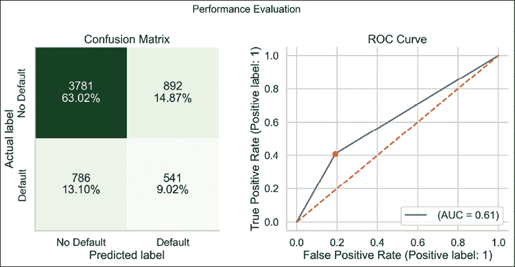

图 13.27：拟合后的管道性能评估报告（包括处理异常值）

包括异常值限制转换并未对整个管道的性能产生任何显著变化。

### 访问管道的元素

虽然管道使我们的项目更易于复现并减少数据泄露的风险，但它也有一个小缺点。访问管道元素以进行进一步检查或替换变得有点困难。让我们通过几个例子来说明。

我们通过以下代码片段开始显示整个管道，以字典形式表示：

```py
tree_pipeline.named_steps 
```

使用该结构（为简洁起见，此处未打印），我们可以通过我们分配给它的名称访问管道末端的机器学习模型：

```py
tree_pipeline.named_steps["classifier"] 
```

当我们想深入了解`ColumnTransformer`时，事情变得有点复杂。假设我们想检查拟合后的`OutlierRemover`的上带限（在`upper_bands_`属性下）。为此，我们必须使用以下代码片段：

```py
(
    tree_pipeline
    .named_steps["preprocessor"]
    .named_transformers_["numerical"]["outliers"]
    .upper_band_
) 
```

首先，我们遵循了与访问管道末端估计器时相同的方法。这一次，我们只使用包含`ColumnTransformer`的步骤名称。然后，我们使用`named_transformers_`属性访问转换器的更深层次。我们选择了数值管道，然后使用它们相应的名称选择了异常值处理步骤。最后，我们访问了自定义转换器的上带限。

在访问`ColumnTransformer`的步骤时，我们本可以使用`transformers_`属性，而不是`named_transformers_`。然而，那样的话，输出将是一个元组列表（与我们在定义`ColumnTransformer`时手动提供的相同），我们必须使用整数索引来访问其元素。我们在 GitHub 上提供的笔记本中展示了如何使用`transformers_`属性访问上层数据。

# 使用网格搜索和交叉验证调整超参数

在之前的示例中，我们使用了决策树模型来预测客户是否会违约。正如我们所见，树的深度达到了 44 级，这使得我们无法将其绘制出来。然而，这也可能意味着模型过拟合了训练数据，在未见过的数据上表现不佳。最大深度实际上是决策树的超参数之一，我们可以通过调整它来在欠拟合和过拟合之间找到平衡（偏差-方差权衡），以提高性能。

首先，我们概述一些超参数的属性：

+   模型的外部特征

+   未基于数据进行估算

+   可以视为模型的设置

+   在训练阶段之前设置

+   调整它们可以提高性能

我们还可以考虑一些参数的属性：

+   模型的内部特征

+   基于数据进行估算，例如线性回归的系数

+   在训练阶段学习到的

在调整模型的超参数时，我们希望评估其在未用于训练的数据上的表现。在*将数据划分为训练集和测试集*的示例中，我们提到可以创建一个额外的验证集。验证集专门用于调整模型的超参数，在最终使用测试集评估之前。然而，创建验证集是有代价的：用于训练（并可能用于测试）的数据被牺牲掉，这在处理小数据集时尤其有害。

这就是**交叉验证**变得如此流行的原因。它是一种技术，能够帮助我们可靠地估计模型的泛化误差。通过一个例子，最容易理解它是如何工作的。在进行*k*折交叉验证时，我们将训练数据随机拆分为*k*折。然后，我们使用*k*-1 折进行训练，并在第*k*折上评估模型的表现。我们重复这个过程*k*次，并对结果得分取平均值。

交叉验证的一个潜在缺点是计算成本，尤其是在与网格搜索调参一起使用时。

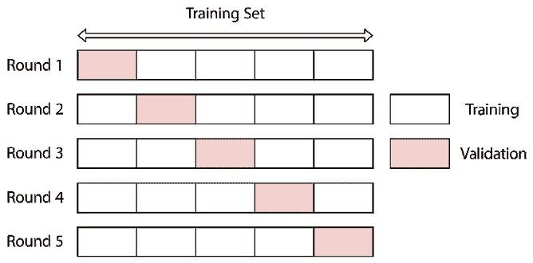

图 13.28：5 折交叉验证过程示意图

我们已经提到过**网格搜索**是一种用于调整超参数的技术。其基本思路是创建所有可能的超参数组合网格，并使用每一种组合训练模型。由于其详尽的暴力搜索方法，这种方法可以保证在网格中找到最优的参数。缺点是，当增加更多的参数或考虑更多的值时，网格的大小呈指数级增长。如果我们还使用交叉验证，所需的模型拟合和预测数量将显著增加！

让我们通过一个例子来说明，假设我们正在训练一个具有两个超参数的模型：*a* 和 *b*。我们定义一个覆盖以下超参数值的网格：`{"a": [1, 2, 3], "b": [5, 6]}`。这意味着我们的网格中有 6 种独特的超参数组合，算法将会进行 6 次模型拟合。如果我们还使用 5 折交叉验证程序，这将导致在网格搜索过程中拟合 30 个独特的模型！

作为解决网格搜索中遇到问题的潜在方案，我们还可以使用**随机搜索**（也称为**随机化网格搜索**）。在这种方法中，我们选择一组随机的超参数，训练模型（也使用交叉验证），返回评分，并重复整个过程，直到达到预定义的迭代次数或计算时间限制。对于非常大的网格，随机搜索优于网格搜索。因为前者可以探索更广泛的超参数空间，通常会在更短的时间内找到与最优超参数集（通过详尽的网格搜索获得）非常相似的超参数集。唯一的问题是：多少次迭代足以找到一个好的解决方案？不幸的是，无法简单回答这个问题。大多数情况下，它由可用的资源来决定。

## 准备工作

在这个示例中，我们使用了在*使用管道组织项目*食谱中创建的决策树管道，包括*更多内容…*部分中的异常值处理。

## 如何操作...

执行以下步骤以在我们在*使用管道组织项目*食谱中创建的决策树管道上运行网格搜索和随机搜索：

1.  导入库：

    ```py
    from sklearn.model_selection import (
        GridSearchCV, cross_val_score, 
        RandomizedSearchCV, cross_validate, 
        StratifiedKFold
    )
    from sklearn import metrics 
    ```

1.  定义交叉验证方案：

    ```py
    k_fold = StratifiedKFold(5, shuffle=True, random_state=42) 
    ```

1.  使用交叉验证评估管道：

    ```py
    cross_val_score(tree_pipeline, X_train, y_train, cv=k_fold) 
    ```

    执行代码片段会返回一个包含估计器默认评分（准确度）值的数组：

    ```py
    array([0.72333333, 0.72958333, 0.71375, 0.723125, 0.72]) 
    ```

1.  为交叉验证添加额外的度量：

    ```py
    cv_scores = cross_validate(
        tree_pipeline, X_train, y_train, cv=k_fold, 
        scoring=["accuracy", "precision", "recall", 
                 "roc_auc"]
    )
    pd.DataFrame(cv_scores) 
    ```

    执行代码片段会生成以下表格：

    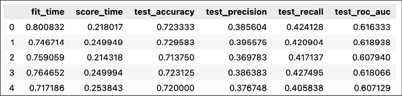

    图 13.29：5 折交叉验证的结果

    在*图 13.29*中，我们可以看到每个 5 折交叉验证的 4 个请求的度量值。这些度量值在每个测试折中非常相似，这表明使用分层拆分的交叉验证如预期般有效。

1.  定义参数网格：

    ```py
    param_grid = {
        "classifier__criterion": ["entropy", "gini"],
        "classifier__max_depth": range(3, 11),
        "classifier__min_samples_leaf": range(2, 11),
        "preprocessor__numerical__outliers__n_std": [3, 4]
    } 
    ```

1.  运行详尽的网格搜索：

    ```py
    classifier_gs = GridSearchCV(tree_pipeline, param_grid,
                                 scoring="recall", cv=k_fold,
                                 n_jobs=-1, verbose=1)
    classifier_gs.fit(X_train, y_train) 
    ```

    下面我们可以看到，通过详尽搜索将拟合多少个模型：

    ```py
    Fitting 5 folds for each of 288 candidates, totalling 1440 fits 
    ```

    从详尽的网格搜索中得到的最佳模型如下：

    ```py
    Best parameters: {'classifier__criterion': 'gini', 'classifier__max_depth': 10, 'classifier__min_samples_leaf': 7, 'preprocessor__numerical__outliers__n_std': 4}
    Recall (Training set): 0.3858
    Recall (Test set): 0.3775 
    ```

1.  评估调优后的管道性能：

    ```py
    LABELS = ["No Default", "Default"]
    tree_gs_perf = performance_evaluation_report(
        classifier_gs, X_test, 
        y_test, labels=LABELS, 
        show_plot=True
    ) 
    ```

    执行该代码段会生成以下图表：

    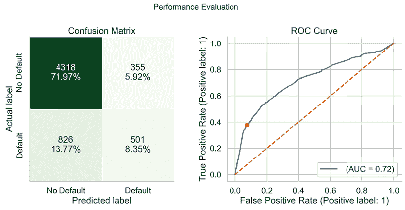

    图 13.30：由详尽网格搜索识别出的最佳管道的性能评估报告

1.  运行随机网格搜索：

    ```py
    classifier_rs = RandomizedSearchCV(tree_pipeline, param_grid, 
                                       scoring="recall", cv=k_fold, 
                                       n_jobs=-1, verbose=1, 
                                       n_iter=100, random_state=42)
    classifier_rs.fit(X_train, y_train)
    print(f"Best parameters: {classifier_rs.best_params_}")
    print(f"Recall (Training set): {classifier_rs.best_score_:.4f}")
    print(f"Recall (Test set): {metrics.recall_score(y_test, classifier_rs.predict(X_test)):.4f}") 
    ```

    下面我们可以看到，随机搜索将训练比详尽搜索更少的模型：

    ```py
    Fitting 5 folds for each of 100 candidates, totalling 500 fits 
    ```

    从随机网格搜索中得到的最佳模型如下：

    ```py
    Best parameters: {'preprocessor__numerical__outliers__n_std': 3, 'classifier__min_samples_leaf': 7, 'classifier__max_depth': 10, 'classifier__criterion': 'gini'}
    Recall (Training set): 0.3854
    Recall (Test set): 0.3760 
    ```

在随机搜索中，我们查看了 100 组随机超参数组合，这大约覆盖了详尽搜索中的 1/3 的可能性。尽管随机搜索没有找到与详尽搜索相同的最佳模型，但两者在训练集和测试集上的性能非常相似。

## 它是如何工作的...

在*步骤 2*中，我们定义了 5 折交叉验证方案。由于数据本身没有固有的顺序，我们使用了洗牌并指定了随机种子以确保可重复性。分层抽样确保每一折在目标变量的类别分布上保持相似。这种设置在处理类别不平衡的问题时尤为重要。

在*步骤 3*中，我们使用`cross_val_score`函数评估了在*使用管道组织项目*这一食谱中创建的管道。我们将估计器（整个管道）、训练数据和交叉验证方案作为参数传递给该函数。

我们也可以为`cv`参数提供一个数字（默认值为 5）——在分类问题中，它会自动应用分层*k*折交叉验证。然而，通过提供自定义方案，我们也确保了定义了随机种子并且结果是可重复的。

我们可以明显观察到使用管道的另一个优势——在执行交叉验证时我们不会泄漏任何信息。如果没有管道，我们会使用训练数据拟合我们的变换器（例如，`StandardScaler`），然后分别对训练集和测试集进行变换。这样，我们就不会泄漏测试集中的任何信息。然而，如果在这种已变换的训练集上进行交叉验证，我们仍然会泄漏一些信息。因为用于验证的折叠是利用整个训练集的信息进行变换的。

在*步骤 4*中，我们通过使用`cross_validate`函数扩展了交叉验证。这个函数在多个评估标准上提供了更多的灵活性（我们使用了准确率、精确度、召回率和 ROC AUC）。此外，它还记录了训练和推断步骤所花费的时间。我们以`pandas`数据框的形式打印了结果，以便于阅读。默认情况下，该函数的输出是一个字典。

在*步骤 5*中，我们定义了用于网格搜索的参数网格。这里需要记住的一个重要点是，使用`Pipeline`对象时的命名规范。网格字典中的键是由步骤/模型的名称与超参数名称通过双下划线连接构成的。在这个例子中，我们在决策树分类器的三个超参数上进行了搜索：

+   `criterion`—用于确定分裂的度量，可以是熵或基尼重要性。

+   `max_depth`—树的最大深度。

+   `min_samples_leaf`—叶子节点中的最小观察值数。它可以防止在叶子节点中创建样本数量过少的树。

此外，我们还通过使用均值的三倍或四倍标准差来进行异常值变换，来指示一个观察值是否为异常值。请注意名称的构造，名称中包含了以下几个信息：

+   `preprocessor`—管道中的步骤。

+   `numerical`—它在`ColumnTransformer`中的哪个管道内。

+   `outliers`—我们访问的那个内部管道的步骤。

+   `n_std`—我们希望指定的超参数名称。

当仅调整估算器（模型）时，我们应直接使用超参数的名称。

我们决定根据召回率选择表现最佳的决策树模型，即模型正确识别的所有违约事件的百分比。当我们处理不平衡类别时，这一评估指标无疑非常有用，例如在预测违约或欺诈时。在现实生活中，假阴性（预测没有违约时，实际上用户违约了）和假阳性（预测一个好客户违约）通常有不同的成本。为了预测违约，我们决定可以接受更多的假阳性成本，以换取减少假阴性的数量（漏掉的违约）。

在*步骤 6*中，我们创建了`GridSearchCV`类的一个实例。我们将管道和参数网格作为输入提供。我们还指定了召回率作为用于选择最佳模型的评分指标（这里可以使用不同的指标）。我们还使用了自定义的交叉验证方案，并指定我们希望使用所有可用的核心来加速计算（`n_jobs=-1`）。

在使用`scikit-learn`的网格搜索类时，我们实际上可以提供多个评估指标（可以通过列表或字典指定）。当我们希望对拟合的模型进行更深入的分析时，这一点非常有帮助。我们需要记住的是，当使用多个指标时，必须使用`refit`参数来指定应使用哪个指标来确定最佳的超参数组合。

然后我们使用了`GridSearchCV`对象的`fit`方法，就像在`scikit-learn`中使用其他估算器一样。从输出结果中，我们看到网格包含了 288 种不同的超参数组合。对于每一组，我们都进行了五次模型拟合（5 折交叉验证）。

`GridSearchCV`的默认设置`refit=True`意味着，在整个网格搜索完成后，最佳模型会自动再次进行拟合，这次是使用整个训练集。然后，我们可以直接通过运行`classifier_gs.predict(X_test)`来使用这个估算器（根据指定的标准进行识别）进行推断。

在*第 8 步*中，我们创建了一个随机化网格搜索实例。它类似于常规网格搜索，不同之处在于我们指定了最大迭代次数。在这种情况下，我们从参数网格中测试了 100 种不同的组合，大约是所有可用组合的 1/3。

穷举法和随机化法网格搜索之间还有一个额外的区别。在后者中，我们可以提供一个超参数分布，而不是一组离散的值。例如，假设我们有一个描述 0 到 1 之间比率的超参数。在穷举法网格搜索中，我们可能会指定以下值：`[0, 0.2, 0.4, 0.6, 0.8, 1]`。在随机化搜索中，我们可以使用相同的值，搜索会从列表中随机（均匀地）选取一个值（无法保证所有值都会被测试）。或者，我们可能更倾向于从均匀分布（限制在 0 到 1 之间的值）中随机抽取一个值作为超参数的值。

在幕后，`scikit-learn`应用了以下逻辑。如果所有超参数都以列表形式呈现，算法会执行不放回的抽样。如果至少有一个超参数是通过分布表示的，则会改为使用有放回的抽样。

## 还有更多...

### 使用逐步减半实现更快的搜索

对于每一组候选超参数，穷举法和随机法网格搜索都会使用所有可用数据来训练一个模型/管道。`scikit-learn`还提供了一种叫做“逐步减半网格搜索”的方法，它基于**逐步减半**的思想。

该算法的工作原理如下。首先，使用可用训练数据的小子集拟合所有候选模型（通常使用有限的资源）。然后，挑选出表现最好的候选模型。在接下来的步骤中，这些表现最好的候选模型将使用更大的训练数据子集进行重新训练。这些步骤会不断重复，直到找到最佳的超参数组合。在这种方法中，每次迭代后，候选超参数的数量会减少，而训练数据的大小（资源）会增加。

逐次减半网格搜索的默认行为是将训练数据作为资源。然而，我们也可以使用我们尝试调整的估计器的另一个超参数，只要它接受正整数值。例如，我们可以使用随机森林模型的树木数量（`n_estimators`）作为每次迭代中增加的资源。

算法的速度取决于两个超参数：

+   `min_resources`—任何候选者允许使用的最小资源量。实际上，这对应于第一次迭代中使用的资源数量。

+   `factor`—缩减参数。`factor`的倒数（1 / `factor`）决定了每次迭代中作为最佳模型被选择的候选者比例。`factor`与上一迭代的资源数量的乘积决定了当前迭代的资源数量。

虽然手动进行这些计算以充分利用大部分资源可能看起来有些令人望而生畏，但`scikit-learn`通过`min_resources`参数的`"exhaust"`值使得这一过程变得更加简单。这样，算法将为我们确定第一次迭代中使用的资源数量，以便最后一次迭代使用尽可能多的资源。在默认情况下，它将导致最后一次迭代使用尽可能多的训练数据。

与随机网格搜索类似，`scikit-learn`还提供了随机化的逐次减半网格搜索。与我们之前描述的唯一区别是，在一开始，会从参数空间中随机抽取固定数量的候选者。这个数量由`n_candidates`参数决定。

下面我们展示如何使用`HalvingGridSearchCV`。首先，在导入之前，我们需要明确允许使用实验特性（未来，当该特性不再是实验性的时，这一步可能会变得多余）：

```py
from sklearn.experimental import enable_halving_search_cv
from sklearn.model_selection import HalvingGridSearchCV 
```

然后，我们为我们的决策树管道找到最佳的超参数：

```py
classifier_sh = HalvingGridSearchCV(tree_pipeline, param_grid,
                                    scoring="recall", cv=k_fold,
                                    n_jobs=-1, verbose=1,
                                    min_resources="exhaust", factor=3)
classifier_sh.fit(X_train, y_train) 
```

我们可以在以下日志中看到逐次减半算法在实践中的表现：

```py
n_iterations: 6
n_required_iterations: 6
n_possible_iterations: 6
min_resources_: 98
max_resources_: 24000
aggressive_elimination: False
factor: 3
----------
iter: 0
n_candidates: 288
n_resources: 98
Fitting 5 folds for each of 288 candidates, totalling 1440 fits
----------
iter: 1
n_candidates: 96
n_resources: 294
Fitting 5 folds for each of 96 candidates, totalling 480 fits
----------
iter: 2
n_candidates: 32
n_resources: 882
Fitting 5 folds for each of 32 candidates, totalling 160 fits
----------
iter: 3
n_candidates: 11
n_resources: 2646
Fitting 5 folds for each of 11 candidates, totalling 55 fits
----------
iter: 4
n_candidates: 4
n_resources: 7938
Fitting 5 folds for each of 4 candidates, totalling 20 fits
----------
iter: 5
n_candidates: 2
n_resources: 23814
Fitting 5 folds for each of 2 candidates, totalling 10 fits 
```

如前所述，`max_resources`是由训练数据的大小决定的，也就是 24,000 个观测值。然后，算法计算出它需要从 98 的样本大小开始，以便在结束时获得尽可能大的样本。在这种情况下，在最后一次迭代中，算法使用了 23,814 个训练观测值。

在下表中，我们可以看到每个我们在本节中介绍的 3 种网格搜索方法选择的超参数值。它们非常相似，测试集上的性能也是如此（具体的比较可以在 GitHub 上的笔记本中查看）。我们将所有这些算法的拟合时间比较留给读者作为练习。

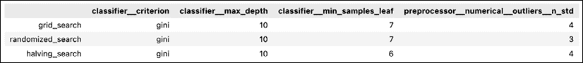

图 13.31：通过详尽、随机化和二分网格搜索识别的最佳超参数值

### 使用多个分类器进行网格搜索

我们还可以创建一个包含多个分类器的网格。这样，我们可以看到哪个模型在我们的数据上表现最好。为此，我们首先从`scikit-learn`导入另一个分类器。我们将使用著名的随机森林：

```py
from sklearn.ensemble import RandomForestClassifier 
```

我们选择了这个模型，因为它是一个决策树集成，因此也不需要对数据进行进一步的预处理。例如，如果我们想使用一个简单的逻辑回归分类器（带正则化），我们还应该通过在数值预处理管道中添加一个额外步骤来对特征进行缩放（标准化/归一化）。我们将在下一章中更详细地介绍随机森林模型。

再次，我们需要定义参数网格。这一次，它是一个包含多个字典的列表——每个分类器一个字典。决策树的超参数与之前相同，我们选择了随机森林的最简单超参数，因为这些超参数不需要额外的解释。

值得一提的是，如果我们想调整管道中的其他超参数，我们需要在列表中的每个字典中指定它们。这就是为什么`preprocessor__numerical__outliers__n_std`在下面的代码片段中出现了两次：

```py
param_grid = [
    {"classifier": [RandomForestClassifier(random_state=42)],
     "classifier__n_estimators": np.linspace(100, 500, 10, dtype=int),
     "classifier__max_depth": range(3, 11),
     "preprocessor__numerical__outliers__n_std": [3, 4]},
    {"classifier": [DecisionTreeClassifier(random_state=42)],
     "classifier__criterion": ["entropy", "gini"],
     "classifier__max_depth": range(3, 11),
     "classifier__min_samples_leaf": range(2, 11),
     "preprocessor__numerical__outliers__n_std": [3, 4]}
] 
```

其余的过程和之前完全相同：

```py
classifier_gs_2 = GridSearchCV(tree_pipeline, param_grid, 
                               scoring="recall", cv=k_fold, 
                               n_jobs=-1, verbose=1)

classifier_gs_2.fit(X_train, y_train)

print(f"Best parameters: {classifier_gs_2.best_params_}") 
print(f"Recall (Training set): {classifier_gs_2.best_score_:.4f}") 
print(f"Recall (Test set): {metrics.recall_score(y_test, classifier_gs_2.predict(X_test)):.4f}") 
```

运行代码片段会生成以下输出：

```py
Best parameters: {'classifier': DecisionTreeClassifier(max_depth=10, min_samples_leaf=7, random_state=42), 'classifier__criterion': 'gini', 'classifier__max_depth': 10, 'classifier__min_samples_leaf': 7, 'preprocessor__numerical__outliers__n_std': 4}
Recall (Training set): 0.3858
Recall (Test set): 0.3775 
```

结果表明，经过调整的决策树表现优于树的集成。正如我们将在下一章看到的，我们可以通过对随机森林分类器进行更多的调整来轻松改变结果。毕竟，我们只调整了可用的多个超参数中的两个。

我们可以使用以下代码片段来提取并打印所有考虑的超参数/分类器组合，从最佳的那个开始：

```py
pd.DataFrame(classifier_gs_2.cv_results_).sort_values("rank_test_score") 
```

## 另见

关于随机化搜索过程的额外资源可以在这里找到：

+   Bergstra, J. & Bengio, Y. (2012). “随机搜索用于超参数优化。” *机器学习研究期刊*, 13(2 月), 281-305\. [`www.jmlr.org/papers/volume13/bergstra12a/bergstra12a.pdf`](http://www.jmlr.org/papers/volume13/bergstra12a/bergstra12a.pdf).

# 总结

在本章中，我们已经涵盖了处理任何机器学习项目所需的基础知识，这些知识不仅限于金融领域。我们做了以下几件事：

+   导入数据并优化其内存使用

+   彻底探索了数据（特征分布、缺失值和类别不平衡），这应该已经提供了一些关于潜在特征工程的思路

+   识别了数据集中的缺失值并进行了填充

+   学会了如何编码类别变量，使其能被机器学习模型正确解读

+   使用最流行且最成熟的机器学习库——`scikit-learn`，拟合了一个决策树分类器

+   学会了如何使用管道组织我们的整个代码库

+   学会了如何调整模型的超参数，以挤压出一些额外的性能，并找到欠拟合和过拟合之间的平衡。

理解这些步骤及其意义至关重要，因为它们可以应用于任何数据科学项目，而不仅仅是二元分类问题。例如，对于回归问题（如预测房价），步骤几乎是相同的。我们将使用略微不同的估算器（虽然大多数估算器适用于分类和回归），并使用不同的指标评估性能（如 MSE、RMSE、MAE、MAPE 等）。但基本原则不变。

如果你有兴趣将本章的知识付诸实践，我们推荐以下资源，供你寻找下一个项目的数据：

+   Google 数据集： [`datasetsearch.research.google.com/`](https://datasetsearch.research.google.com/)

+   Kaggle： [`www.kaggle.com/datasets`](https://www.kaggle.com/datasets)

+   UCI 机器学习库： [`archive.ics.uci.edu/ml/index.php`](https://archive.ics.uci.edu/ml/index.php)

在下一章中，我们将介绍一些有助于进一步改进初始模型的技术。我们将涵盖包括更复杂的分类器、贝叶斯超参数调优、处理类别不平衡、探索特征重要性和选择等内容。

# 加入我们的 Discord 群组！

要加入本书的 Discord 社区，在这里你可以分享反馈、向作者提问并了解新版本发布，请扫描下面的二维码：


[`packt.link/ips2H`](https://packt.link/ips2H)
