# 14

# 机器学习项目的高级概念

在上一章中，我们介绍了解决现实问题的可能工作流程，使用机器学习从数据清洗、模型训练和调优，到最后评估其表现。然而，这通常并不是项目的终点。在那个项目中，我们使用了一个简单的决策树分类器，它通常可以作为基准或最小可行产品（MVP）。在本章中，我们将介绍一些更高级的概念，这些概念有助于提升项目的价值，并使其更容易被业务利益相关者采纳。

在创建了最小可行产品（MVP）作为基准之后，我们希望提高模型的表现。在尝试改善模型时，我们还应该平衡欠拟合和过拟合。实现这一点有几种方法，其中包括：

+   收集更多数据（观测数据）

+   添加更多特征——无论是通过收集额外的数据（例如，使用外部数据源）还是通过特征工程使用当前可用的信息

+   使用更复杂的模型

+   只选择相关特征

+   调整超参数

有一个常见的刻板印象认为，数据科学家在一个项目中花费 80%的时间收集和清理数据，剩下的 20%才用于实际的建模。按照这一刻板印象，增加更多数据可能会大大提高模型的表现，尤其是在处理分类问题中的不平衡类别时。但寻找额外的数据（无论是观测数据还是特征）并不总是可行，或者可能会变得非常复杂。那么，另一个解决方案可能是使用更复杂的模型，或者调整超参数以挤压出一些额外的性能。

本章开始时，我们将介绍如何使用更先进的分类器，这些分类器同样基于决策树。其中一些（如 XGBoost 和 LightGBM）在机器学习竞赛中常常被用来获胜（例如 Kaggle 上的竞赛）。此外，我们还介绍了堆叠多个机器学习模型的概念，以进一步提高预测性能。

另一个常见的现实问题是处理不平衡数据，也就是当某一类别（如违约或欺诈）在实际中很少出现时。这使得训练一个准确捕捉少数类别观测值的模型变得特别困难。我们介绍了几种处理类别不平衡的常见方法，并在信用卡欺诈数据集上比较了它们的表现，其中少数类别仅占所有观测值的 0.17%。

然后，我们还扩展了超参数调优的内容，这在前一章中已有解释。之前，我们使用了穷尽的网格搜索或随机搜索，这两种方法都是在无信息的情况下进行的。这意味着在选择下一个要探索的超参数集时，并没有底层逻辑。这一次，我们介绍了贝叶斯优化方法，在这种方法中，过去的尝试被用来选择下一个要探索的超参数集。这种方法可以显著加速我们项目的调优阶段。

在许多行业（尤其是金融行业），理解模型预测背后的逻辑至关重要。例如，银行可能在法律上被要求提供拒绝信用请求的实际理由，或者它可以通过预测哪些客户可能违约来尝试限制损失。为了更好地理解模型，我们探讨了确定特征重要性和模型可解释性的各种方法。后者在处理复杂模型时尤为重要，因为这些模型通常被认为是黑箱，即无法解释的。我们还可以利用这些见解，仅选择最相关的特征，这可以进一步提高模型的性能。

在本章中，我们介绍以下几种方法：

+   探索集成分类器

+   探索编码分类特征的替代方法

+   探讨处理不平衡数据的不同方法

+   利用群众智慧的堆叠集成模型

+   贝叶斯超参数优化

+   探讨特征重要性

+   探索特征选择技术

+   探索可解释的人工智能技术

# 探索集成分类器

在*第十三章*，*应用机器学习：识别信用违约*中，我们学习了如何构建一个完整的机器学习管道，其中包含预处理步骤（填补缺失值、编码分类特征等）和机器学习模型。我们的任务是预测客户违约，即无法偿还债务。我们使用了决策树模型作为分类器。

决策树被认为是简单模型，它们的一个缺点是对训练数据的过拟合。它们属于高方差模型，这意味着对训练数据的微小变化会极大地影响树的结构和预测结果。为了克服这些问题，决策树可以作为更复杂模型的构建块。**集成模型**通过结合多个基础模型（例如决策树）的预测，以提高最终模型的泛化能力和鲁棒性。这样，它们将最初的高方差估计器转变为低方差的综合估计器。

从高层次来看，我们可以将集成模型分为两组：

+   **平均法**—多个模型独立估计，然后将它们的预测结果平均。其基本原理是，组合模型比单一模型更好，因为其方差减少了。示例：随机森林和极度随机化树。

+   **提升方法**—在这种方法中，多个基本估计器被顺序构建，每个估计器都试图减少组合估计器的偏差。其基本假设是，多个弱模型的组合会产生一个强大的集成模型。示例：梯度提升树、XGBoost、LightGBM 和 CatBoost。

在这个食谱中，我们使用了一些集成模型来尝试提升决策树方法的性能。由于这些模型基于决策树，关于特征缩放（不需要显式进行）的相同原则适用，因此我们可以重用之前创建的大部分管道。

## 准备工作

在这个食谱中，我们基于上一章的*通过管道组织项目*食谱中的内容，创建了默认的预测管道，从加载数据到训练分类器。

在这个食谱中，我们使用的是不包含异常值去除程序的变体。我们将用更复杂的集成模型替换最后一步（分类器）。此外，我们首先将决策树管道拟合到数据中，以获得基线模型用于性能比较。为了方便起见，我们在本章附带的笔记本中重申了所有必需的步骤。

## 如何实现…

执行以下步骤以训练集成分类器：

1.  导入库：

    ```py
    from sklearn.ensemble import (RandomForestClassifier,
                                  GradientBoostingClassifier)
    from xgboost.sklearn import XGBClassifier
    from lightgbm import LGBMClassifier
    from chapter_14_utils import performance_evaluation_report 
    ```

    在本章中，我们还使用了已经熟悉的 `performance_evaluation_report` 辅助函数。

1.  定义并拟合随机森林管道：

    ```py
    rf = RandomForestClassifier(random_state=42)
    rf_pipeline = Pipeline(
        steps=[("preprocessor", preprocessor),
               ("classifier", rf)]
    )
    rf_pipeline.fit(X_train, y_train)
    rf_perf = performance_evaluation_report(rf_pipeline, X_test,
                                            y_test, labels=LABELS,
                                            show_plot=True,
                                            show_pr_curve=True) 
    ```

    随机森林的性能可以通过以下图表总结：

    

    图 14.1：随机森林模型的性能评估

1.  定义并拟合梯度提升树管道：

    ```py
    gbt = GradientBoostingClassifier(random_state=42)
    gbt_pipeline = Pipeline(
        steps=[("preprocessor", preprocessor),
               ("classifier", gbt)]
    )
    gbt_pipeline.fit(X_train, y_train)
    gbt_perf = performance_evaluation_report(gbt_pipeline, X_test,
                                             y_test, labels=LABELS,
                                             show_plot=True,
                                             show_pr_curve=True) 
    ```

    梯度提升树的性能可以通过以下图表总结：

    

    图 14.2：梯度提升树模型的性能评估

1.  定义并拟合 XGBoost 管道：

    ```py
    xgb = XGBClassifier(random_state=42)
    xgb_pipeline = Pipeline(
        steps=[("preprocessor", preprocessor),
               ("classifier", xgb)]
    )
    xgb_pipeline.fit(X_train, y_train)
    xgb_perf = performance_evaluation_report(xgb_pipeline, X_test,
                                             y_test, labels=LABELS,
                                             show_plot=True,
                                             show_pr_curve=True) 
    ```

    XGBoost 的性能可以通过以下图表总结：

    

    图 14.3：XGBoost 模型的性能评估

1.  定义并拟合 LightGBM 管道：

    ```py
    lgbm = LGBMClassifier(random_state=42)
    lgbm_pipeline = Pipeline(
        steps=[("preprocessor", preprocessor),
               ("classifier", lgbm)]
    )
    lgbm_pipeline.fit(X_train, y_train)
    lgbm_perf = performance_evaluation_report(lgbm_pipeline, X_test,
                                              y_test, labels=LABELS,
                                              show_plot=True,
                                              show_pr_curve=True) 
    ```

    LightGBM 的性能可以通过以下图表总结：


图 14.4：LightGBM 模型的性能评估

从报告来看，所有考虑的模型的 ROC 曲线和精确率-召回率曲线形状非常相似。我们将在*更多内容…*部分查看各个模型的得分。

## 它是如何工作的…

本示例展示了使用不同分类器是多么简单，只要我们希望使用它们的默认设置。在第一步中，我们从各自的库中导入了分类器。

在这个示例中，我们使用了`scikit-learn` API，结合了像 XGBoost 或 LightGBM 这样的库。然而，我们也可以使用它们的原生方法来训练模型，这可能需要一些额外的工作，例如将`pandas` DataFrame 转换为这些库接受的格式。使用原生方法可以带来一些额外的好处，例如可以访问某些超参数或配置设置。

在*步骤 2*到*步骤 5*中，我们为每个分类器创建了一个独立的流水线。我们将已经建立的`ColumnTransformer`预处理器与相应的分类器结合在一起。然后，我们将每个流水线拟合到训练数据并展示了性能评估报告。

一些考虑的集成模型在`fit`方法中提供了额外的功能（而不是在实例化类时设置超参数）。例如，使用 LightGBM 的`fit`方法时，我们可以传入分类特征的名称/索引。这样，算法就知道如何使用其自身的方法处理这些特征，而无需显式地进行独热编码。同样，我们还可以使用各种可用的回调函数。

多亏了现代 Python 库，拟合所有考虑的分类器变得异常简单。我们只需将流水线中的模型类替换为另一个模型类。考虑到尝试不同模型是多么简单，理解这些模型的工作原理以及它们的优缺点是非常重要的。这就是为什么下面我们提供了对所考虑算法的简要介绍。

### 随机森林

**随机森林**是一个集成模型的例子，即它训练多个模型（决策树），并利用这些模型来进行预测。在回归问题中，它取所有树的平均值；在分类问题中，它使用多数投票。随机森林不仅仅是训练多棵树并汇总它们的结果。

首先，它使用**Bagging**（自助聚合法）——每棵树都在所有可用观测值的子集上进行训练。这些观测值是通过有放回的随机抽样得到的，因此——除非另行指定——每棵树使用的观测值总数与训练集中的总观测值数相同。即使单棵树可能会因为 Bagging 的原因在特定数据集上有较高的方差，但整个森林的方差将会较低，而不会增加偏差。此外，这种方法还可以减少数据中异常值的影响，因为它们不会出现在所有的树中。为了增加更多的随机性，每棵树只考虑所有特征的一个子集来创建每个分裂。我们可以使用一个专门的超参数来控制这个数字。

多亏了这两种机制，森林中的树彼此之间没有关联，并且是独立构建的。后者使得树构建步骤可以并行化。

随机森林提供了复杂度与性能之间的良好平衡。通常——即使没有任何调优——我们也能比使用更简单的算法（如决策树或线性/逻辑回归）获得更好的性能。这是因为随机森林具有较低的偏差（由于其灵活性）和较小的方差（由于聚合多个模型的预测）。

### 梯度提升树

**梯度提升树**是另一种集成模型。其思想是训练许多弱学习器（具有高偏差的浅层决策树/树桩），并将它们组合起来以获得一个强学习器。与随机森林相比，梯度提升树是一个顺序/迭代算法。在**提升**中，我们从第一个弱学习器开始，每个后续的学习器都试图从前一个学习器的错误中学习。它们通过拟合前一个模型的残差（误差项）来实现这一点。

我们创建一组弱学习器而不是强学习器的原因是，在强学习器的情况下，错误/标注错误的数据点很可能是数据中的噪音，因此整体模型最终会对训练数据发生过拟合。

*梯度*这个术语来源于树是使用**梯度下降**构建的，而梯度下降是一种优化算法。简而言之，它利用损失函数的梯度（斜率）来最小化整体损失并实现最佳性能。损失函数表示实际值和预测值之间的差异。实际上，为了在梯度提升树中执行梯度下降过程，我们会将这样一棵树添加到模型中，使其遵循梯度。换句话说，这样的树会降低损失函数的值。

我们可以通过以下步骤描述提升过程：

1.  该过程从一个简单的估算开始（均值、中位数等）。

1.  一棵树被拟合到该预测的误差。

1.  预测通过使用树的预测值进行调整。然而，它并不会完全调整，而只是调整到一定程度（基于学习率超参数）。

1.  另一棵树被拟合到更新后的预测误差，并且预测值像之前的步骤那样进一步调整。

1.  算法会继续迭代地减少误差，直到达到指定的轮次（或其他停止准则）。

1.  最终预测是初始预测与所有调整（按学习率加权的误差预测值）之和。

与随机森林相比，梯度提升树使用所有可用数据来训练模型。然而，我们可以通过使用`subsample`超参数对每棵树进行不重复的随机采样。这样，我们就得到了**随机梯度提升树**。此外，类似于随机森林，我们可以让树在进行分裂时只考虑特征的一个子集。

### XGBoost

**极端梯度提升（XGBoost）**是梯度提升树的一个实现，融合了一系列改进，从而提供了更优的性能（无论是在评估指标还是估计时间上）。自发布以来，该算法已成功用于赢得许多数据科学竞赛。

在本食谱中，我们仅提供了 XGBoost 一些可辨识特性的概述。欲了解更详细的概述，请参考原始论文（Chen *et al.* (2016)）或文档。XGBoost 的关键概念如下：

+   XGBoost 将预排序算法与基于直方图的算法相结合，用于计算最佳分裂。这解决了梯度提升树的一个重大低效问题，即在创建新分支时，算法需要考虑所有可能的分裂的潜在损失（特别是在考虑数百或数千个特征时，尤其重要）。

+   该算法使用牛顿-拉夫森方法来近似损失函数，这使我们能够使用更广泛的损失函数。

+   XGBoost 有一个额外的随机化参数，用于减少树与树之间的相关性。

+   XGBoost 结合了 Lasso（L1）和 Ridge（L2）正则化，以防止过拟合。

+   它提供了一种更高效的树修剪方法。

+   XGBoost 有一个名为单调约束的特性——该算法牺牲一些准确性并增加训练时间，以提高模型的可解释性。

+   XGBoost 不接受类别特征作为输入——我们必须对它们进行某种编码。

+   该算法可以处理数据中的缺失值。

### LightGBM

**LightGBM**由微软发布，是另一种赢得比赛的梯度提升树实现。由于一些改进，LightGBM 的性能与 XGBoost 相似，但训练时间更快。其主要特点包括：

+   速度的差异是由树的生长方式造成的。一般来说，算法（例如 XGBoost）采用层级（水平）方式。另一方面，LightBGM 采用叶子生长方式（垂直）。叶子生长算法选择具有最大损失函数减少的叶子。这类算法通常比层级方式更快收敛；然而，它们更容易过拟合（尤其是在小数据集上）。

+   LightGBM 采用一种名为**基于梯度的单边采样**（**GOSS**）的技术，来过滤出用于寻找最佳切分值的数据实例。直观地说，梯度较小的观测值已经得到了较好的训练，而梯度较大的观测值还有更多改进空间。GOSS 保留了梯度较大的实例，并且从梯度较小的观测值中随机采样。

+   LightGBM 使用**独特特征捆绑**（**EFB**）技术来利用稀疏数据集，并将互斥的特征（它们在同一时刻永远不会同时为零）捆绑在一起。这有助于减少特征空间的复杂性（维度）。

+   该算法使用基于直方图的方法将连续特征值分桶到离散的区间，以加速训练并减少内存使用。

后来，叶节点算法也被添加到了 XGBoost 中。要使用它，我们需要将`grow_policy`设置为`"lossguide"`。

## 还有更多...

在本节中，我们展示了如何使用选定的集成分类器来提高我们预测客户违约贷款的能力。更有趣的是，这些模型有数十个超参数可以调整，这可能会显著提高（或降低）它们的性能。

为了简便起见，我们将在这里不讨论这些模型的超参数调优。我们建议您查阅附带的 Jupyter 笔记本，里面简要介绍了如何使用随机网格搜索方法来调优这些模型。在这里，我们仅呈现一个包含结果的表格。我们可以比较默认设置下模型的性能与调优后的模型性能。


图 14.5：比较不同分类器性能的表格

对于使用随机搜索调整的模型（包括名称中带有`_rs`后缀的模型），我们使用了 100 组随机的超参数集。由于所考虑的问题涉及不平衡的数据（少数类约占 20%），因此我们通过召回率来评估模型的性能。

看起来基本的决策树在测试集上达到了最佳的召回率。这是以牺牲比更复杂模型低得多的精度为代价的。这就是为什么决策树的 F1 得分（精度与召回率的调和均值）最低的原因。我们可以看到，默认的 LightGBM 模型在测试集上达到了最佳的 F1 得分。

这些结果并不意味着更复杂的模型就较差——它们可能只是需要更多的调优或者一组不同的超参数。例如，集成模型强制设定了树的最大深度（由相应的超参数决定），而决策树没有这样的限制，并且它的深度达到了 37。模型越复杂，越需要更多的努力才能“做对”。

有许多不同的集成分类器可供实验。一些可能性包括：

+   AdaBoost——第一种提升算法。

+   极端随机树——该算法提供了比随机森林更强的随机性。与随机森林类似，在进行分裂时会考虑特征的随机子集。然而，与寻找最具区分性的阈值不同，每个特征的阈值是随机抽取的。然后，从这些随机阈值中选择最好的作为分裂规则。这种方法通常可以减少模型的方差，同时略微增加其偏差。

+   CatBoost——另一种提升算法（由 Yandex 开发），它特别强调处理分类特征并在少量超参数调整下实现高性能。

+   NGBoost——从非常高的层次看，这个模型通过使用自然梯度将不确定性估计引入梯度提升中。

+   基于直方图的梯度提升——一种在 `scikit-learn` 中提供的梯度提升树变体，灵感来源于 LightGBM。通过将连续特征离散化（分箱）为预定数量的唯一值，它们加速了训练过程。

虽然一些算法首先引入了某些特性，但其他流行的梯度提升树实现通常也会采用这些特性。例如，基于直方图的连续特征离散化方法。虽然它是在 LightGBM 中引入的，但后来也被添加到了 XGBoost 中。对于生长树的叶子方向方法也是如此。

## 另见

我们提供了更多关于本食谱中提到的算法的资源：

+   Breiman, L. 2001\. “随机森林。” *机器学习* 45(1): 5–32。

+   Chen, T., & Guestrin, C. 2016 年 8 月。Xgboost：一个可扩展的树提升系统。在 *第 22 届国际知识发现与数据挖掘会议论文集*，785–794。ACM。

+   Duan, T., Anand, A., Ding, D. Y., Thai, K. K., Basu, S., Ng, A., & Schuler, A. 2020 年 11 月。Ngboost：用于概率预测的自然梯度提升。在 *国际机器学习会议*，2690–2700。PMLR。

+   Freund, Y., & Schapire, R. E. 1996 年 7 月。关于一种新提升算法的实验。在 *国际机器学习会议*，96：148–156。

+   Freund, Y., & Schapire, R. E. 1997\. “在线学习的决策理论推广及其在提升中的应用。” *计算机与系统科学学报*，55(1)，119–139。

+   Friedman, J. H. 2001\. “贪婪函数逼近：一种梯度提升机。” *统计年鉴*，29(5): 1189–1232。

+   Friedman, J. H. 2002\. “随机梯度提升。” *计算统计与数据分析*，38(4): 367–378。

+   Ke, G., Meng, Q., Finley, T., Wang, T., Chen, W., Ma, W., ... & Liu, T. Y. 2017\. “Lightgbm：一个高效的梯度提升决策树。” 在 *神经信息处理系统*。

+   Prokhorenkova, L., Gusev, G., Vorobev, A., Dorogush, A. V., & Gulin, A. 2018\. CatBoost：具有分类特征的无偏提升。在 *神经信息处理系统*。

# 探索编码分类特征的替代方法

在前一章中，我们介绍了独热编码（one-hot encoding）作为编码分类特征的标准解决方案，使得机器学习算法能够理解这些特征。回顾一下，独热编码将分类变量转换为多个二进制列，其中值为 1 表示该行属于某个类别，值为 0 则表示不属于。

这种方法的最大缺点是数据集维度迅速扩展。例如，如果我们有一个特征表示观察数据来自美国的哪个州，那么对该特征进行独热编码将会创建 50 个新列（如果去掉参考值，则为 49 列）。

使用独热编码的其他问题包括：

+   创建这么多布尔特征会给数据集引入稀疏性，而决策树对此处理不佳。

+   决策树的分裂算法将所有的独热编码虚拟变量视为独立特征。这意味着当决策树使用其中一个虚拟变量进行分裂时，每次分裂的纯度增益较小。因此，决策树不太可能在接近根节点时选择某个虚拟变量。

+   与前一点相关，连续特征的特征重要性通常高于独热编码的虚拟变量，因为一个虚拟变量最多只能将其对应的分类特征的部分信息引入模型。

+   梯度提升树（Gradient Boosted Trees）不擅长处理高基数特征，因为基本学习器的深度有限。

处理连续变量时，分裂算法会对样本进行排序，并且可以在任何位置对这个排序后的列表进行分裂。而二进制特征只能在一个地方进行分裂，具有*k*个唯一类别的分类特征则可以有种分裂方式。

我们通过一个示例来说明连续特征的优势。假设分裂算法将一个连续特征在值为 10 的位置进行分裂，分成两组：“小于 10”和“大于等于 10”。在下一次分裂时，它可以进一步分裂这两组中的任意一组，例如，“小于 6”和“大于等于 6”。而对于二进制特征来说，这是不可能的，因为我们最多只能用它将数据分成“是”或“否”两组。*图 14.6*展示了使用或不使用独热编码所创建的决策树之间可能的差异。


图 14.6：没有独热编码的密集决策树（左）和具有独热编码的稀疏决策树（右）示例

这些缺点，以及其他一些因素，促使了几种替代分类特征编码方法的发展。在本节中，我们将介绍其中的三种方法。

第一种方法称为**目标编码**（也叫均值编码）。在这种方法中，针对分类特征应用如下转换，具体取决于目标变量的类型：

+   类别目标——某个特征会被替换为在给定特定类别下目标的后验概率与所有训练数据中目标的先验概率的混合。

+   连续目标——某个特征会被替换为在给定特定类别下目标的期望值与所有训练数据中目标的期望值的混合。

实际应用中，最简单的情况假设每个特征中的类别都会被该类别目标值的均值替换。*图 14.7* 展示了这一点。


图 14.7：目标编码示例

目标编码能更直接地表示类别特征与目标之间的关系，同时不会添加任何新列。这也是它在数据科学竞赛中非常流行的原因。

不幸的是，它并不是编码类别特征的万灵药，并且带有一些缺点：

+   该方法非常容易过拟合。因此，它假设类别均值与全局均值的混合/平滑。特别是当某些类别非常罕见时，我们应该特别小心。

+   这与过拟合的风险相关，我们实际上是在将目标信息泄露到特征中。

实际应用中，当我们拥有高基数特征并且使用某种形式的梯度提升树作为机器学习模型时，目标编码效果相当好。

我们讨论的第二种方法叫做**留一法编码**（**Leave One Out Encoding, LOOE**），它与目标编码非常相似。它通过在计算类别平均值时排除当前行的目标值来尝试减少过拟合。这样，算法就避免了按行泄露。这个方法的另一个结果是，相同类别在多个观察值中可以在编码列中具有不同的值。*图 14.8* 展示了这一点。


图 14.8：留一法编码示例

使用 LOOE，机器学习模型不仅会接触到每个编码类别的相同值（如目标编码中那样），还会接触到一系列值。这就是为什么它应该学会更好地泛化。

最后我们讨论的编码方法叫做**证据权重**（**Weight of Evidence, WoE**）编码。这种方法特别有趣，因为它起源于信用评分领域，在那里它被用来提高违约概率估算。它被用来区分违约客户与成功偿还贷款的客户。

证据权重（Weight of Evidence, WoE）源自逻辑回归。与 WoE 来源相同的另一个有用指标叫做**信息值**（**Information Value, IV**）。它衡量一个特征为预测提供了多少信息。换句话说，它帮助根据特征在模型中的重要性对变量进行排序。

证据权重表示独立变量相对于目标变量的预测能力。换句话说，它衡量证据在多大程度上支持或削弱一个假设。它定义为赔率比的自然对数：


*图 14.9* 说明了计算过程。


图 14.9：WoE 编码示例

尽管编码源于信用评分，但这并不意味着它只能在类似情况下使用。我们可以将优秀客户视为非事件或负类，而将差的客户视为事件或正类。该方法的一个限制是，与前两者不同，它只能用于二元类别目标。

WoE（证据权重）在历史上也用于编码类别特征。例如，在信用评分数据集中，我们可以将连续特征如年龄分箱为离散区间：20-29 岁、30-39 岁、40-49 岁，依此类推，然后计算这些类别的 WoE。选择多少个区间用于编码，取决于具体应用和特征的分布情况。

在本篇教程中，我们将展示如何在实践中使用这三种编码器，使用我们之前已经用过的默认数据集。

## 准备就绪

在本篇教程中，我们使用之前教程中使用的管道。作为估算器，我们使用随机森林分类器。为了方便起见，我们在本章附带的 Jupyter 笔记本中重述了所有必要步骤。

使用独热编码的随机森林管道在测试集上的召回率为`0.3542`。我们将尝试通过其他编码方法来提高这个分数。

## 如何操作…

执行以下步骤以使用不同的类别编码器拟合机器学习管道：

1.  导入库：

    ```py
    import category_encoders as ce
    from sklearn.base import clone 
    ```

1.  使用目标编码拟合管道：

    ```py
    pipeline_target_enc = clone(rf_pipeline)
    pipeline_target_enc.set_params(
        preprocessor__categorical__cat_encoding=ce.TargetEncoder()
    )
    pipeline_target_enc.fit(X_train, y_train)
    target_enc_perf = performance_evaluation_report(
        pipeline_target_enc, X_test,
        y_test, labels=LABELS,
        show_plot=True,
        show_pr_curve=True
    )
    print(f"Recall: {target_enc_perf['recall']:.4f}") 
    ```

    执行代码片段会生成以下图表：

    

    图 14.10：使用目标编码进行管道性能评估

    使用此管道获得的召回率为`0.3677`。这使得分数提高了略超过 1 个百分点。

1.  使用“留一编码”拟合管道：

    ```py
    pipeline_loo_enc = clone(rf_pipeline)
    pipeline_loo_enc.set_params(
       preprocessor__categorical__cat_encoding=ce.LeaveOneOutEncoder()
    )
    pipeline_loo_enc.fit(X_train, y_train)
    loo_enc_perf = performance_evaluation_report(
        pipeline_loo_enc, X_test,
        y_test, labels=LABELS,
        show_plot=True,
        show_pr_curve=True
    )
    print(f"Recall: {loo_enc_perf['recall']:.4f}") 
    ```

    执行代码片段会生成以下图表：

    

    图 14.11：使用“留一编码”进行管道性能评估

    使用此管道获得的召回率为`0.1462`，明显低于目标编码方法。

1.  使用证据权重编码拟合管道：

    ```py
    pipeline_woe_enc = clone(rf_pipeline)
    pipeline_woe_enc.set_params(
        preprocessor__categorical__cat_encoding=ce.WOEEncoder()
    )
    pipeline_woe_enc.fit(X_train, y_train)
    woe_enc_perf = performance_evaluation_report(
        pipeline_woe_enc, X_test,
        y_test, labels=LABELS,
        show_plot=True,
        show_pr_curve=True
    )
    print(f"Recall: {woe_enc_perf['recall']:.4f}") 
    ```

    执行代码片段会生成以下图表：


图 14.12：使用证据权重编码进行管道性能评估

使用此管道获得的召回率为`0.3708`，相较于目标编码有小幅提升。

## 它是如何工作的……

首先，我们执行了*准备工作*部分的代码，即实例化了一个使用独热编码和随机森林作为分类器的管道。

在导入库后，我们使用`clone`函数克隆了整个管道。然后，我们使用`set_params`方法将`OneHotEncoder`替换为`TargetEncoder`。正如调优管道的超参数时，我们必须使用相同的双下划线表示法来访问管道中的特定元素。编码器位于`preprocessor__categorical__cat_encoding`下。接着，我们使用`fit`方法拟合管道，并通过`performance_evaluation_report`辅助函数打印评估结果。

正如我们在介绍中提到的，目标编码容易导致过拟合。这就是为什么算法不仅仅用相应的平均值替换类别，而是能够将后验概率与先验概率（全局平均）结合起来的原因。我们可以通过两个超参数来控制这种混合：`min_samples_leaf` 和 `smoothing`。

在*步骤 3*和*4*中，我们按照与目标编码相同的步骤操作，但分别将编码器替换为`LeaveOneOutEncoder`和`WOEEncoder`。

和目标编码一样，其他编码器也使用目标来构建编码，因此也容易出现过拟合。幸运的是，它们也提供了一些防止过拟合的措施。

在 LOOE 的情况下，我们可以向编码中添加正态分布噪声以减少过拟合。我们可以通过`sigma`参数控制用于生成噪声的正态分布的标准差。值得一提的是，随机噪声仅添加到训练数据中，测试集的转换不受影响。仅通过向我们的管道中添加随机噪声（`sigma = 0.05`），我们可以将测量的召回率从`0.1462`提高到大约`0.35`（具体取决于随机数生成）。

同样，我们可以为 WoE 编码器添加随机噪声。我们通过`randomized`（布尔标志）和`sigma`（正态分布的标准差）参数来控制噪声。此外，还有`regularization`参数，它可以防止由于除零错误而导致的错误。

## 还有更多……

编码分类变量是一个非常广泛的活跃研究领域，不时会发布新的方法。在切换主题之前，我们还想讨论一些相关概念。

### 使用 k 折目标编码处理数据泄露

我们已经提到了一些减少目标编码器过拟合问题的方法。Kaggle 从业者中非常流行的一个解决方案是使用 *k* 折目标编码。这个想法类似于 k 折交叉验证，它允许我们使用所有可用的训练数据。我们首先将数据划分为 *k* 个折叠——这些折叠可以是分层的，也可以是完全随机的，具体取决于应用场景。然后，我们用除第 *l* 个折叠之外的所有折叠计算出的目标均值来替换第 *l* 个折叠中的观察值。这样，我们就避免了同一折叠中目标泄漏的问题。

一位好奇的读者可能已经注意到，LOOE 是 *k* 折目标编码的一种特殊情况，其中 *k* 等于训练数据集中的观察数量。

### 更多编码器

`category_encoders` 库提供了近 20 种不同的分类特征编码转换器。除了我们已经提到的编码器外，你还可以探索以下内容：

+   **有序编码**——与标签编码非常相似；然而，它确保编码保留特征的有序性质。例如，坏 < 中立 < 好的层级关系被保留下来。

+   **计数编码器**（频率编码器）——将特征的每个类别映射到属于该类别的观察数。

+   **总和编码器**——将给定类别的目标均值与目标的总体均值进行比较。

+   **Helmert 编码器**——将某个类别的均值与后续级别的均值进行比较。如果我们有类别 [A, B, C]，算法会先比较 A 与 B 和 C，然后再比较 B 与 C。此种编码在类别特征的级别有顺序的情况下非常有用，例如从低到高的顺序。

+   **反向差异编码器**——类似于 Helmert 编码器，不同之处在于它将当前类别的均值与前一个类别的均值进行比较。

+   **M-估计编码器**——目标编码器的简化版本，只有一个可调参数（负责正则化强度）。

+   **James-Stein 编码器**——一种目标编码的变体，旨在通过将类别的均值收缩到中心/全局均值来提高估计精度。它的单一超参数控制着收缩的强度（在这个上下文中，这与正则化相同）——超参数值越大，全球均值的权重越大（这可能导致欠拟合）。另一方面，减少超参数值可能会导致过拟合。通常，最佳值是通过交叉验证来确定的。该方法的最大缺点是，James-Stein 估计器仅适用于正态分布，而这并不适用于任何二元分类问题。

+   **二进制编码器**—将类别转换为二进制数字，每个数字都有一个单独的列。得益于这种编码方法，我们生成的列数远少于 OHE。例如，对于一个具有 100 个独特类别的类别特征，二进制编码只需创建 7 个特征，而 OHE 则需要 100 个。

+   **哈希编码器**—使用哈希函数（通常用于数据加密）来转换类别特征。其结果与 OHE 相似，但特征更少（我们可以通过编码器的超参数来控制这一点）。它有两个显著的缺点。首先，编码会导致信息丢失，因为算法将所有可用类别转换为更少的特征。第二个问题称为碰撞，发生在我们将潜在的大量类别转换为较小的特征集时。此时，不同的类别可能会被相同的哈希值表示。

+   **Catboost 编码器**—一种改进的 Leave One Out 编码变种，旨在克服目标泄漏问题。

## 另请参见

+   Micci-Barreca, D. 2001. “分类与预测问题中高基数类别属性的预处理方案。” *ACM SIGKDD Explorations Newsletter* 3(1): 27–32.

# 调查处理不平衡数据的不同方法

在处理分类任务时，一个非常常见的问题是**类别不平衡**，即当一个类别的样本数量远少于另一个类别时（这也可以扩展到多类别问题）。通常，当两个类别的比例不是 1:1 时，我们就面临不平衡问题。在某些情况下，轻微的不平衡并不是大问题，但在一些行业或问题中，我们可能会遇到 100:1、1000:1 或甚至更极端的比例。

处理高度不平衡的类别可能导致机器学习模型的性能较差。这是因为大多数算法隐式地假设类别分布是平衡的。它们通过旨在最小化总体预测误差来实现这一点，而根据定义，少数类对总体误差的贡献非常小。因此，在不平衡数据上训练的分类器会偏向多数类。

解决类别不平衡的潜在解决方案之一是对数据进行重采样。总体而言，我们可以对多数类进行欠采样，对少数类进行过采样，或者将这两种方法结合起来。然而，这只是一个大致的思路。实际上，有很多处理重采样的方法，下面我们描述了几种常见的方法。

在使用重采样技术时，我们只对训练数据进行重采样！测试数据保持不变。


图 14.13：多数类的欠采样与少数类的过采样

最简单的欠采样方法称为**随机欠采样**。在这种方法中，我们对多数类进行欠采样，也就是说，从多数类中随机抽取样本（默认情况下，无放回抽样），直到类别平衡（比例为 1:1 或其他所需的比例）。该方法最大的问题是由于丢弃大量数据（通常是整个训练数据集的大部分）而导致信息丢失。因此，在欠采样数据上训练的模型可能会表现得较差。另一个可能的影响是分类器偏向，导致更多的假阳性，因为重采样后训练集和测试集的分布不一致。

类似地，最简单的过采样方法称为**随机过采样**。在这种方法中，我们从少数类中进行多次有放回的抽样，直到达到期望的比例。该方法通常比随机欠采样效果更好，因为没有因丢弃训练数据而导致信息丢失。然而，随机过采样存在过拟合的风险，因为它通过复制少数类的观察值来增加数据。

**合成少数类过采样技术**（**SMOTE**）是一种更先进的过采样算法，它通过少数类创建新的合成观察值。通过这种方式，它克服了前面提到的过拟合问题。

为了创建合成样本，算法从少数类中选取一个观察值，识别其*k*-最近邻（使用*k*-NN 算法），然后在连接（插值）观察值和最近邻的线段上创建新的观察值。然后，该过程会重复进行，直到其他少数类观察值的样本也得到平衡。

除了减少过拟合问题外，SMOTE 不会丢失任何信息，因为它不会丢弃属于多数类的观察值。然而，SMOTE 可能会无意中向数据中引入更多噪声，并导致类别重叠。这是因为在创建合成观察值时，它没有考虑到多数类的观察值。此外，该算法在高维数据上效果不佳（由于维度灾难）。最后，SMOTE 的基本变种仅适用于数值特征。然而，SMOTE 的扩展（在*更多内容...*部分提到）可以处理分类特征。

考虑的最后一种过采样技术叫做**自适应合成采样**（**ADASYN**），它是 SMOTE 算法的一种改进。在 ADASYN 中，为某个少数类点创建的观测值数量是由密度分布决定的（而不是像 SMOTE 中那样为所有点提供统一的权重）。这种自适应特性使得 ADASYN 能够为来自难以学习的邻域的观测值生成更多的合成样本。例如，如果存在许多与少数类观察值特征值非常相似的多数类观察值，则该少数类观察值会变得难以学习。我们可以通过仅考虑两个特征的情况来更容易地理解这种情况。在散点图中，这样的少数类观察值可能会被许多多数类观察值包围。

还有两个额外的要点值得提及：

+   与 SMOTE 不同，合成点并不局限于两点之间的线性插值。它们还可以位于由三个或更多观测值创建的平面上。

+   在创建合成观测值后，算法会加入少量随机噪声以增加方差，从而使得样本更加真实。

ADASYN 的潜在缺点包括：

+   由于其自适应性，算法的精度可能会下降（产生更多的假阳性）。这意味着该算法可能会在具有大量多数类观测值的区域生成更多观测值。这些合成数据可能与多数类观测值非常相似，从而可能导致更多的假阳性。

+   处理稀疏分布的少数类观测值时，某些邻域可能仅包含一个或极少数的点。

重采样并不是解决类别不平衡问题的唯一潜在方案。另一个方法是基于调整类别权重，从而增加少数类的权重。在后台，类别权重会被纳入到损失函数的计算中。实际上，这意味着将少数类观测值分类错误会显著增加损失函数的值，而多数类观测值分类错误的影响则较小。

在这个示例中，我们展示了一个信用卡欺诈问题的例子，其中欺诈类在整个样本中的比例仅为 0.17%。在这种情况下，收集更多的数据（特别是欺诈类数据）可能根本不可行，我们需要依赖其他技术来帮助我们提升模型的性能。

## 准备工作

在进入编码部分之前，我们简要描述了本次练习中选用的数据集。你可以从 Kaggle 下载该数据集（链接在*另请参见*部分）。

数据集包含了 2013 年 9 月欧洲持卡人在两天内进行的信用卡交易信息。由于保密原因，几乎所有特征（28 个中的 30 个）都通过使用**主成分分析**（**PCA**）进行了匿名化。唯一两个有明确解释的特征是`Time`（每笔交易与数据集中第一笔交易之间的秒数）和`Amount`（交易金额）。

最后，数据集严重失衡，正类在所有交易中只占 0.173%。准确地说，在 284,807 笔交易中，有 492 笔被识别为欺诈交易。

## 如何实现...

执行以下步骤以研究不同处理类别失衡的方法：

1.  导入库：

    ```py
    import pandas as pd
    from sklearn.model_selection import train_test_split
    from sklearn.ensemble import RandomForestClassifier
    from sklearn.preprocessing import RobustScaler
    from imblearn.over_sampling import RandomOverSampler, SMOTE, ADASYN
    from imblearn.under_sampling import RandomUnderSampler
    from imblearn.ensemble import BalancedRandomForestClassifier
    from chapter_14_utils import performance_evaluation_report 
    ```

1.  加载和准备数据：

    ```py
    RANDOM_STATE = 42
    df = pd.read_csv("../Datasets/credit_card_fraud.csv")
    X = df.copy().drop(columns=["Time"])
    y = X.pop("Class")
    X_train, X_test, y_train, y_test = train_test_split(
        X, y,
        test_size=0.2,
        stratify=y,
        random_state=RANDOM_STATE
    ) 
    ```

    使用`y.value_counts(normalize=True)`我们可以确认正类在 0.173%的观察值中出现。

1.  使用`RobustScaler`对特征进行缩放：

    ```py
    robust_scaler = RobustScaler()
    X_train = robust_scaler.fit_transform(X_train)
    X_test = robust_scaler.transform(X_test) 
    ```

1.  训练基准模型：

    ```py
    rf = RandomForestClassifier(
        random_state=RANDOM_STATE, n_jobs=-1
    )
    rf.fit(X_train, y_train) 
    ```

1.  对训练数据进行欠采样，并训练一个随机森林分类器：

    ```py
    rus = RandomUnderSampler(random_state=RANDOM_STATE)
    X_rus, y_rus = rus.fit_resample(X_train, y_train)
    rf.fit(X_rus, y_rus)
    rf_rus_perf = performance_evaluation_report(rf, X_test, y_test) 
    ```

    随机欠采样后，类别的比例如下：`{0: 394, 1: 394}`。

1.  对训练数据进行过采样，并训练一个随机森林分类器：

    ```py
    ros = RandomOverSampler(random_state=RANDOM_STATE)
    X_ros, y_ros = ros.fit_resample(X_train, y_train)
    rf.fit(X_ros, y_ros)
    rf_ros_perf = performance_evaluation_report(rf, X_test, y_test) 
    ```

    随机过采样后，类别的比例如下：`{0: 227451, 1: 227451}`。

1.  使用 SMOTE 对训练数据进行过采样：

    ```py
    smote = SMOTE(random_state=RANDOM_STATE)
    X_smote, y_smote = smote.fit_resample(X_train, y_train)
    rf.fit(X_smote, y_smote)
    rf_smote_perf = peformance_evaluation_report(
        rf, X_test, y_test, 
    ) 
    ```

    使用 SMOTE 过采样后，类别的比例如下：`{0: 227451, 1: 227451}`。

1.  使用 ADASYN 对训练数据进行过采样：

    ```py
    adasyn = ADASYN(random_state=RANDOM_STATE)
    X_adasyn, y_adasyn = adasyn.fit_resample(X_train, y_train)
    rf.fit(X_adasyn, y_adasyn)
    rf_adasyn_perf = performance_evaluation_report(
        rf, X_test, y_test, 
    ) 
    ```

    使用 ADASYN 过采样后，类别的比例如下：`{0: 227451, 1: 227449}`。

1.  在随机森林分类器中使用样本权重：

    ```py
    rf_cw = RandomForestClassifier(random_state=RANDOM_STATE,
                                   class_weight="balanced",
                                   n_jobs=-1)
    rf_cw.fit(X_train, y_train)
    rf_cw_perf = performance_evaluation_report(
        rf_cw, X_test, y_test, 
    ) 
    ```

1.  训练`BalancedRandomForestClassifier`：

    ```py
    balanced_rf = BalancedRandomForestClassifier(
        random_state=RANDOM_STATE
    )
    balanced_rf.fit(X_train, y_train)
    balanced_rf_perf = performance_evaluation_report(
        balanced_rf, X_test, y_test,
    ) 
    ```

1.  使用平衡类别训练`BalancedRandomForestClassifier`：

    ```py
    balanced_rf_cw = BalancedRandomForestClassifier(
        random_state=RANDOM_STATE,
        class_weight="balanced",
        n_jobs=-1
    )
    balanced_rf_cw.fit(X_train, y_train)
    balanced_rf_cw_perf = performance_evaluation_report(
        balanced_rf_cw, X_test, y_test,
    ) 
    ```

1.  将结果合并到一个 DataFrame 中：

    ```py
    performance_results = {
        "random_forest": rf_perf,
        "undersampled rf": rf_rus_perf,
        "oversampled_rf": rf_ros_perf,
        "smote": rf_smote_perf,
        "adasyn": rf_adasyn_perf,
        "random_forest_cw": rf_cw_perf,
        "balanced_random_forest": balanced_rf_perf,
        "balanced_random_forest_cw": balanced_rf_cw_perf,
    }                       
    pd.DataFrame(performance_results).round(4).T 
    ```

    执行该代码片段将打印以下表格：


图 14.14：处理失衡数据的各种方法的性能评估指标

在*图 14.14*中，我们可以看到我们在本食谱中尝试的各种方法的性能评估。由于我们面临的是一个严重失衡的问题（正类占所有观察值的 0.17%），我们可以清楚地观察到**准确率悖论**的情况。许多模型的准确率约为 99.9%，但它们仍然未能检测出欺诈案件，而欺诈案件才是最重要的。

准确率悖论指的是当将准确率作为评估指标时，会给人留下一个非常好的分类器印象（如 90%的得分，甚至是 99.9%），而实际上它只是反映了类别的分布情况。

考虑到这一点，我们使用了考虑类别不平衡的评估指标来比较模型的表现。在查看精确度时，表现最佳的方案是使用类别权重的随机森林。当将召回率作为最重要的评估指标时，表现最好的方法是先进行欠采样然后使用随机森林模型，或者使用平衡随机森林模型。在 F1 分数方面，最好的方法似乎是原始的随机森林模型。

还需要指出的是，本实验中没有进行超参数调优，这可能会提升所有方法的性能。

## 它是如何工作的...

在导入库后，我们从 CSV 文件加载了信用卡欺诈数据集。在同一步骤中，我们额外删除了`Time`特征，使用`pop`方法将目标与特征分开，并创建了一个 80-20 的分层训练-测试集拆分。在处理类别不平衡时，记得使用分层抽样非常重要。

在本教程中，我们仅专注于处理不平衡数据。因此，我们没有涵盖任何探索性数据分析（EDA）、特征工程等内容。由于所有特征都是数值型的，我们不需要进行特殊的编码。

我们所做的唯一预处理步骤是使用`RobustScaler`对所有特征进行缩放。虽然随机森林不需要显式的特征缩放，但一些重采样方法在底层使用了*k*-最近邻算法。而对于这种基于距离的算法，特征缩放是很重要的。我们只使用训练数据来拟合缩放器，然后对训练集和测试集进行转换。

在*步骤 4*中，我们拟合了一个原始的随机森林模型，并将其作为更复杂方法的基准。

在*步骤 5*中，我们使用了`imblearn`库中的`RandomUnderSampler`类，随机欠采样多数类以匹配少数类样本的大小。方便的是，`imblearn`中的类遵循了`scikit-learn`的 API 风格。因此，我们首先定义了类及其参数（我们只设置了`random_state`）。然后，我们应用了`fit_resample`方法来获得欠采样的数据。我们重新使用了随机森林对象，基于欠采样数据训练模型，并存储了结果以供后续比较。

*步骤 6*与*步骤 5*类似，唯一的区别是使用`RandomOverSampler`来随机过采样少数类，以匹配多数类的样本大小。

在*步骤 7*和*步骤 8*中，我们应用了 SMOTE 和 ADASYN 变体的过采样方法。由于`imblearn`库使得应用不同的采样方法变得非常简单，我们不会深入描述该过程。

在所有提到的重采样方法中，我们实际上可以通过向`sampling_strategy`参数传递一个浮动值来指定类别之间的期望比例。该数字表示少数类样本与多数类样本的观察数之比。

在*步骤 9*中，我们没有重采样训练数据，而是使用了`RandomForestClassifier`的`class_weight`超参数来解决类别不平衡问题。通过传递`"balanced"`，算法会自动分配与训练数据中类别频率成反比的权重。

使用`class_weight`超参数有不同的可能方法。传递`"balanced_subsample"`将得到与`"balanced"`类似的权重分配；然而，权重是基于每棵树的自助样本计算的。或者，我们可以传递一个包含期望权重的字典。一种确定权重的方法是使用`sklearn.utils.class_weight`中的`compute_class_weight`函数。

`imblearn`库还提供了一些流行分类器的修改版本。在*步骤 10*和*步骤 11*中，我们使用了修改过的随机森林分类器，即**平衡随机森林**。不同之处在于，在平衡随机森林中，算法会随机欠采样每个自助样本，以平衡类别。实际上，其 API 与普通的`scikit-learn`实现几乎相同（包括可调节的超参数）。

在最后一步，我们将所有结果合并成一个单独的 DataFrame 并展示了结果。

## 还有更多...

在本教程中，我们仅介绍了一些可用的重采样方法。以下是更多的一些可能性。

欠采样：

+   **NearMiss**—这个名称指的是一组欠采样方法，基本上是基于最近邻算法的启发式规则。它们基于从多数类和少数类的观察之间的距离来选择要保留的多数类观察。其余的则被删除，以实现类别平衡。例如，NearMiss-1 方法选择那些与三个位于少数类的观察点距离最小的多数类观察。

+   **编辑最近邻**—这种方法删除任何多数类的观察，该观察的类别与其三个最近邻中的至少两个的类别不同。其基本思想是删除那些位于类别边界附近的多数类实例。

+   **Tomek 链接**—在这个欠采样启发式方法中，我们首先识别出所有最接近的观察对（它们是最近邻）且属于不同类别的对。这些对称为 Tomek 链接。然后，从这些对中，我们删除属于多数类的观察。其基本思想是通过从 Tomek 链接中删除这些观察，我们可以增加类别之间的分离度。

过采样：

+   **SMOTE-NC**（**用于名义和连续特征的合成少数类过采样技术**）—SMOTE 的变体，适用于包含数值和类别特征的数据集。普通的 SMOTE 可能会为独热编码特征创建不合逻辑的值。

+   **边界 SMOTE**——这种 SMOTE 算法的变种会在两个类别之间的决策边界上创建新的合成观察点，因为这些点更容易被错误分类。

+   **SVM SMOTE**——SMOTE 的一种变体，使用 SVM 算法来指示哪些观察点应被用于生成新的合成观察点。

+   **K-means SMOTE**——在这种方法中，我们首先应用*k*-均值聚类来识别具有大量少数类观察点的聚类。然后，将原始 SMOTE 应用于选定的聚类，每个聚类都会生成新的合成观察点。

另外，我们可以结合欠采样和过采样方法。其基本思想是，首先使用过采样方法创建重复或人工观察点，然后使用欠采样方法减少噪声或删除不必要的观察点。

例如，我们可以先使用 SMOTE 对数据进行过采样，然后使用随机下采样进行欠采样。`imbalanced-learn`提供了两种组合重采样方法——SMOTE 后接 Tomek 链接或编辑最近邻。

在本食谱中，我们只涵盖了可用方法的一小部分。在切换话题之前，我们想提一些关于解决不平衡类问题的通用注意事项：

+   不要在测试集上应用欠采样/过采样。

+   在评估不平衡数据问题时，使用考虑类不平衡的度量标准，例如精确度、召回率、F1 分数、Cohen's kappa 或 PR-AUC。

+   在创建交叉验证的折叠时使用分层采样。

+   在交叉验证过程中引入欠采样/过采样，而不是之前。这样做会导致高估模型的性能！

+   在使用`imbalanced-learn`库创建具有重采样的管道时，我们还需要使用`imbalanced-learn`的管道变种。这是因为重采样器使用`fit_resample`方法，而不是`scikit-learn`管道所需的`fit_transform`方法。

+   考虑从不同的角度框架问题。例如，我们可以将任务视为一个异常检测问题，而不是分类任务。然后，我们可以使用不同的技术，例如**孤立森林**。

+   尝试选择不同于默认 50%的概率阈值，以可能调优模型性能。我们可以使用使用不平衡数据集训练的模型绘制假阳性率和假阴性率与决策阈值的关系图，而不是重新平衡数据集。然后，我们可以选择一个在性能上最适合我们需求的阈值。

我们使用决策阈值来确定在哪个概率或得分（分类器的输出）上，我们认为给定的观察属于正类。默认情况下，这个值是 0.5。

## 另请参见

我们在本食谱中使用的数据集可以在 Kaggle 上找到：

+   [`www.kaggle.com/datasets/mlg-ulb/creditcardfraud`](https://www.kaggle.com/datasets/mlg-ulb/creditcardfraud)

额外资源可在此处获取：

+   Chawla, N. V., Bowyer, K. W., Hall, L. O., & Kegelmeyer, W. P. 2002. “SMOTE: 合成少数类过采样技术。” *人工智能研究期刊* 16: 321–357.

+   Chawla, N. V. 2009. “面向不平衡数据集的数据挖掘：概述。” *数据挖掘与知识发现手册*：875–886.

+   Chen, C., Liaw, A., & Breiman, L. 2004. “使用随机森林学习不平衡数据。” *加利福尼亚大学伯克利分校* 110: 1–12.

+   Elor, Y., & Averbuch-Elor, H. 2022. “是使用 SMOTE，还是不使用 SMOTE？” *arXiv 预印本 arXiv:2201.08528*.

+   Han, H., Wang, W. Y., & Mao, B. H. 2005 年 8 月。边界-SMOTE：一种在不平衡数据集学习中的新过采样方法。在 *智能计算国际会议*，878–887. Springer，柏林，海德堡。

+   He, H., Bai, Y., Garcia, E. A., & Li, S. 2008 年 6 月。ADASYN：用于不平衡学习的自适应合成采样方法。在 *2008 年 IEEE 国际神经网络联合会议（IEEE 世界计算智能大会）*，1322–1328. IEEE.

+   Le Borgne, Y.-A., Siblini, W., Lebichot, B., & Bontempi, G. 2022. 可重复的机器学习在信用卡欺诈检测中的应用——实践手册。

+   Liu, F. T., Ting, K. M., & Zhou, Z. H. 2008 年 12 月。隔离森林。在 *2008 年第八届 IEEE 国际数据挖掘会议*，413–422. IEEE.

+   Mani, I., & Zhang, I. 2003 年 8 月。kNN 方法用于不平衡数据分布：一个涉及信息提取的案例研究。在 *从不平衡数据集学习研讨会论文集*，126: 1–7. ICML.

+   Nguyen, H. M., Cooper, E. W., & Kamei, K. 2009 年 11 月。边界过采样用于不平衡数据分类。在 *计算智能与应用国际研讨会论文集*，2009(1): 24–29. IEEE SMC 广岛分会。

+   Pozzolo, A.D. 等. 2015. 使用欠采样进行概率校准以应对不平衡分类，*2015 年 IEEE 计算智能学会年会*。

+   Tomek, I. (1976). CNN 的两种修改，IEEE 系统 *人类与通信学报*，6: 769-772.

+   Wilson, D. L. (1972). “使用编辑数据的最近邻规则的渐近性质。” *IEEE 系统、人类与控制论学报* 3: 408–421.

# 利用集体智慧与堆叠集成

**堆叠**（堆叠泛化）是指创建潜在异质的机器学习模型集成的一种技术。堆叠集成的架构包括至少两个基础模型（称为第 0 层模型）和一个元模型（第 1 层模型），后者将基础模型的预测进行组合。下图展示了一个包含两个基础模型的示例。


图 14.15：具有两个基础学习器的堆叠集成的高级结构图

堆叠的目标是将一系列表现良好的模型的能力结合起来，获得的预测结果有可能比集成中任何单一模型的性能更好。这是可能的，因为堆叠集成试图利用基础模型的不同优势。因此，基础模型通常应该是复杂和多样的。例如，我们可以使用线性模型、决策树、各种集成方法、k 近邻、支持向量机、神经网络等等。

堆叠可能比之前介绍的集成方法（如自助法、提升法等）更难理解，因为在分割数据、处理潜在的过拟合和数据泄漏时，堆叠有至少几种变体。在本食谱中，我们遵循`scikit-learn`库中使用的方法。

创建堆叠集成的方法可以通过三个步骤来描述。我们假设已经有了代表性的训练集和测试集。

*步骤 1*：训练层次 0 模型

这一过程的本质是，每个层次 0 模型都在完整的训练数据集上进行训练，然后这些模型被用来生成预测。

然后，我们需要考虑一些关于集成的事项。首先，我们必须选择想要使用的预测类型。对于回归问题，这很简单，因为我们没有其他选择。然而，在处理分类问题时，我们可以使用预测的类别或预测的概率/分数。

其次，我们可以仅使用预测结果（无论选择了哪个变体）作为层次 1 模型的特征，或者将原始特征集与层次 0 模型的预测结果结合。在实践中，结合特征通常会效果更好。当然，这在很大程度上取决于使用场景和考虑的数据集。

*步骤 2*：训练层次 1 模型

层次 1 模型（或元模型）通常相当简单，理想情况下可以提供对层次 0 模型所做预测的平滑解释。这就是为什么线性模型通常被选用于此任务的原因。

**融合**一词通常指的是使用简单的线性模型作为层次 1 模型。这是因为层次 1 模型的预测是层次 0 模型预测的加权平均值（或融合）。

在这个*步骤*中，层次 1 模型使用前一步的特征（可能仅是预测结果，或者与最初的特征集结合）以及某种交叉验证方案进行训练。后者用于选择元模型的超参数和/或考虑用于集成的基础模型集。


图 14.16：具有两个基础学习器的堆叠集成的低级结构图

在`scikit-learn`的堆叠方法中，我们假设任何基础模型可能会过拟合，这可能是由于算法本身或其超参数的某种组合导致的。但如果确实如此，应该通过其他没有同样问题的基础模型来进行补偿。这就是为什么交叉验证应用于调优元模型，而不是基础模型。

在选择最佳的超参数/基础学习器后，最终估计器将在整个训练数据集上进行训练。

*步骤 3*：对未见过的数据进行预测

这个步骤是最简单的，因为我们本质上是将所有基础模型拟合到新的观测数据上，以获得预测结果，这些预测结果随后由元模型用于生成堆叠集成的最终预测。

在这个食谱中，我们创建了一个堆叠模型集成，应用于信用卡欺诈数据集。

## 如何实现...

执行以下步骤以创建堆叠集成：

1.  导入库：

    ```py
    import pandas as pd
    from sklearn.model_selection import (train_test_split,
                                         StratifiedKFold)
    from sklearn.metrics import recall_score
    from sklearn.preprocessing import RobustScaler
    from sklearn.svm import SVC
    from sklearn.naive_bayes import GaussianNB
    from sklearn.tree import DecisionTreeClassifier
    from sklearn.linear_model import LogisticRegression
    from sklearn.ensemble import RandomForestClassifier
    from sklearn.ensemble import StackingClassifier 
    ```

1.  加载并预处理数据：

    ```py
    RANDOM_STATE = 42
    df = pd.read_csv("../Datasets/credit_card_fraud.csv")
    X = df.copy().drop(columns=["Time"])
    y = X.pop("Class")
    X_train, X_test, y_train, y_test = train_test_split(
        X, y,
        test_size=0.2,
        stratify=y,
        random_state=RANDOM_STATE
    )
    robust_scaler = RobustScaler()
    X_train = robust_scaler.fit_transform(X_train)
    X_test = robust_scaler.transform(X_test) 
    ```

1.  定义基础模型列表：

    ```py
    base_models = [
        ("dec_tree", DecisionTreeClassifier()),
        ("log_reg", LogisticRegression()),
        ("svc", SVC()),   
        ("naive_bayes", GaussianNB())
    ] 
    ```

    在随附的 Jupyter 笔记本中，我们指定了所有适用模型的随机状态。这里为了简洁起见，省略了这一部分。

1.  训练选定的模型并使用测试集计算召回率：

    ```py
    for model_tuple in base_models:
        clf = model_tuple[1]
        if "n_jobs" in clf.get_params().keys():
            clf.set_params(n_jobs=-1)
        clf.fit(X_train, y_train)
        recall = recall_score(y_test, clf.predict(X_test))
        print(f"{model_tuple[0]}'s recall score: {recall:.4f}") 
    ```

    执行代码片段会生成以下输出：

    ```py
    dec_tree's recall score: 0.7551
    log_reg's recall score: 0.6531
    svc's recall score: 0.7041
    naive_bayes's recall score: 0.8469 
    ```

    在考虑的模型中，朴素贝叶斯分类器在测试集上达到了最佳的召回率。

1.  定义、拟合并评估堆叠集成：

    ```py
    cv_scheme = StratifiedKFold(n_splits=5,
                                shuffle=True,
                                random_state=RANDOM_STATE)
    meta_model = LogisticRegression(random_state=RANDOM_STATE)
    stack_clf = StackingClassifier(
        base_models,
        final_estimator=meta_model,
        cv=cv_scheme,
        n_jobs=-1
    )
    stack_clf.fit(X_train, y_train)
    recall = recall_score(y_test, stack_clf.predict(X_test))
    print(f"The stacked ensemble's recall score: {recall:.4f}") 
    ```

    执行代码片段会生成以下输出：

    ```py
    The stacked ensemble's recall score: 0.7449 
    ```

    我们的堆叠集成的得分比最好的单个模型还要差。然而，我们可以尝试进一步改善集成。例如，我们可以允许集成使用初始特征作为元模型，并将逻辑回归元模型替换为随机森林分类器。

1.  使用额外的特征和更复杂的元模型来改进堆叠集成：

    ```py
    meta_model = RandomForestClassifier(random_state=RANDOM_STATE)
    stack_clf = StackingClassifier(
        base_models,
        final_estimator=meta_model,
        cv=cv_scheme,
        passthrough=True,
        n_jobs=-1
    )
    stack_clf.fit(X_train, y_train) 
    ```

第二个堆叠集成的召回率为`0.8571`，优于最好的单个模型。

## 如何工作...

在*步骤 1*中，我们导入了所需的库。然后，我们加载了信用卡欺诈数据集，将目标变量与特征分开，删除了`Time`特征，将数据拆分为训练集和测试集（使用分层拆分），最后，使用`RobustScaler`对数据进行了缩放。尽管树模型不需要这种转换，但我们使用了各种分类器（每个分类器对输入数据有不同的假设）作为基础模型。为了简单起见，我们没有调查特征的不同属性，比如正态性。有关这些处理步骤的更多细节，请参阅之前的食谱。

在*步骤 3*中，我们定义了一组用于堆叠集成的基础学习器。我们决定使用几个简单的分类器，如决策树、朴素贝叶斯分类器、支持向量分类器和逻辑回归。为了简洁起见，我们这里不描述所选分类器的属性。

在准备基础学习器列表时，我们还可以提供整个管道，而不仅仅是估计器。当只有某些机器学习模型需要专门处理特征预处理（如特征缩放或编码分类变量）时，这一点非常有用。

在*步骤 4*中，我们遍历了分类器列表，使用默认设置将每个模型拟合到训练数据，并使用测试集计算召回率得分。此外，如果估计器具有`n_jobs`参数，我们将其设置为`-1`，以便使用所有可用核心进行计算。通过这种方式，我们可以加速模型的训练，前提是我们的机器有多个核心/线程可用。本步骤的目标是研究各个基础模型的性能，以便将它们与堆叠集成进行比较。

在*步骤 5*中，我们首先定义了元模型（逻辑回归）和 5 折分层交叉验证方案。然后，我们通过提供基础分类器列表、交叉验证方案和元模型来实例化`StackingClassifier`。在`scikit-learn`的堆叠实现中，基础学习器使用整个训练集进行拟合。然后，为了避免过拟合并提高模型的泛化能力，元估计器使用选定的交叉验证方案对模型进行训练，使用的是外样本。准确来说，它使用`cross_val_predict`来完成这项任务。

这种方法的一个可能缺点是，仅对元学习器应用交叉验证可能导致基础学习器的过拟合。不同的库（在*更多内容*部分中提到）采用不同的堆叠集成交叉验证方法。

在最后一步，我们尝试通过修改堆叠集成的两个特征来提高其性能。首先，我们将一级模型从逻辑回归更改为随机森林分类器。其次，我们允许一级模型使用由零级基础模型使用的特征。为此，我们在实例化`StackingClassifier`时，将`passthrough`参数设置为`True`。

## 更多内容...

为了更好地理解堆叠集成，我们可以查看*步骤 1*的输出，即用于训练一级模型的数据。为了获得这些数据，我们可以使用拟合后的`StackedClassifier`的`transform`方法。或者，当分类器没有拟合时，我们可以使用熟悉的`fit_transform`方法。在我们的案例中，我们查看堆叠集成，使用预测和原始数据作为特征：

```py
level_0_names = [f"{model[0]}_pred" for model in base_models]
level_0_df = pd.DataFrame(
    stack_clf.transform(X_train),
    columns=level_0_names + list(X.columns)
)
level_0_df.head() 
```

执行这段代码会生成如下表格（简写版）：


图 14.17：堆叠集成中一级模型输入的预览

我们可以看到前四列对应于基础学习器做出的预测。在这些预测旁边，我们可以看到其余的特征，也就是基础学习器用于生成预测的特征。

还值得一提的是，当使用`StackingClassifier`时，我们可以将基础模型的不同输出作为一级模型的输入。例如，我们可以使用预测的概率/得分或预测的标签。使用`stack_method`参数的默认设置，分类器会尝试使用以下类型的输出（按此特定顺序）：`predict_proba`、`decision_function`和`predict`。

如果我们使用`stack_method="predict"`，我们会看到四列零和一，对应于模型的类别预测（使用默认的 0.5 决策阈值）。

在本配方中，我们展示了一个堆叠集成的简单示例。我们可以尝试进一步改进它的多种方式。一些可能的扩展包括：

+   向堆叠集成中添加更多层

+   使用更多样化的模型，例如 k-NN、增强树、神经网络等

+   调整基础分类器和/或元模型的超参数

`scikit-learn`的`ensemble`模块还包含一个`VotingClassifier`，它可以聚合多个分类器的预测结果。`VotingClassifier`使用两种可用的投票方案之一。第一种是`hard`投票，即简单的多数投票。`soft`投票方案使用预测概率的和的`argmax`来预测类别标签。

还有其他库提供堆叠功能：

+   `vecstack`

+   `mlxtend`

+   `h2o`

这些库在堆叠方法上也有所不同，例如它们如何划分数据或如何处理潜在的过拟合和数据泄漏问题。有关更多详细信息，请参阅相应的文档。

## 另见

其他资源可以在此处获得：

+   Raschka, S. 2018. “MLxtend: 为 Python 的科学计算堆栈提供机器学习和数据科学工具及扩展。” *The Journal of Open Source Software* 3(24): 638。

+   Wolpert, D. H. 1992. “堆叠泛化”。*Neural networks* 5(2): 241–259。

# 贝叶斯超参数优化

在上一章的*使用网格搜索和交叉验证调优超参数*配方中，我们描述了如何使用不同形式的网格搜索来找到模型的最佳超参数。在本配方中，我们介绍了一种基于贝叶斯方法找到最优超参数集的替代方法。

贝叶斯方法的主要动机在于，无论是网格搜索还是随机化搜索，都会做出无知的选择，要么是通过对所有组合的穷举搜索，要么是通过随机抽样。这样，它们会花费大量时间评估那些远未达到最佳性能的组合，从而基本上浪费了时间。这就是为什么贝叶斯方法会根据已知信息选择下一个需要评估的超参数集合，从而减少寻找最佳集合所花费的时间。可以说，贝叶斯方法通过在选择要研究的超参数时投入更多时间，从而限制了评估目标函数所花费的时间，最终在计算上更加高效。

贝叶斯方法的一个形式化是**基于序列模型的优化**（**SMBO**）。从非常高层次看，SMBO 利用替代模型和获取函数，通过迭代（因此称为“序列”）选择搜索空间中最有前景的超参数，以逼近实际的目标函数。

在贝叶斯超参数优化（HPO）的背景下，真实目标函数通常是已训练机器学习模型的交叉验证误差。计算这些目标函数可能非常昂贵，可能需要数小时（甚至数天）才能计算完成。这就是为什么在 SMBO 中我们创建了**替代模型**，它是一个基于历史评估构建的目标函数的概率模型。它将输入值（超参数）映射到真实目标函数的得分概率。因此，我们可以将其视为对真实目标函数的近似。在我们采用的方法中（即`hyperopt`库所使用的方法），替代模型是通过**树状****帕尔岑估计器**（**TPE**）构建的。其他可能的选择包括高斯过程或随机森林回归。

在每次迭代中，我们首先将替代模型拟合到迄今为止对目标函数的所有观察数据。然后，我们应用获取函数（例如**期望改进**）来根据超参数的预期效用确定下一组超参数。从直观上讲，这种方法利用过去评估的历史数据，为下一次迭代做出最佳选择。与过去表现良好的值接近的超参数，较可能提升整体性能，而那些历史上表现不佳的值则不太可能带来改进。获取函数还在超参数空间的探索新领域和利用已知能提供良好结果的领域之间定义了一种平衡。

贝叶斯优化的简化步骤如下：

1.  创建真实目标函数的替代模型。

1.  找到在替代模型中表现最好的超参数集合。

1.  使用该集合评估真实目标函数。

1.  使用评估真实目标的结果更新替代模型。

1.  重复*步骤 2-4*，直到达到停止准则（指定的最大迭代次数或时间量）。

从这些步骤中可以看出，算法运行的时间越长，代理函数就越接近真实目标函数。这是因为每次迭代都会根据真实目标函数的评估来更新，因此每次运行时都会“少一些错误”。

正如我们已经提到的，贝叶斯超参数优化的最大优势是它减少了寻找最优参数集的时间。这一点在参数数量较多且评估真实目标计算代价高的情况下尤其重要。然而，它也有一些可能的缺点：

+   SMBO 程序的一些步骤无法并行执行，因为算法会根据过去的结果顺序选择一组超参数。

+   为超参数选择合适的分布/尺度可能会很棘手。

+   探索与开发的偏差——当算法找到局部最优解时，它可能会集中在该解附近的超参数值上，而不是探索在搜索空间中远离它的潜在新值。随机搜索不会遇到这个问题，因为它不会集中于任何值。

+   超参数的值是独立选择的。例如，在梯度提升树中，建议联合考虑学习率和估计器的数量，以避免过拟合并减少计算时间。TPE 无法发现这种关系。在我们知道有这种关系的情况下，可以通过使用不同的选择来定义搜索空间，从而部分解决这个问题。

在这简短的介绍中，我们提供了该方法论的高层次概述。然而，关于代理模型、获取函数等方面还有很多内容需要涵盖。因此，我们在*另见*部分参考了更多论文，以便进行更深入的解释。

在本例中，我们使用贝叶斯超参数优化来调整 LightGBM 模型。我们选择这个模型，因为它在性能和训练时间之间提供了非常好的平衡。我们将使用已经熟悉的信用卡欺诈数据集，这是一个高度不平衡的数据集。

## 如何实现...

执行以下步骤以运行 LightGBM 模型的贝叶斯超参数优化：

1.  加载库：

    ```py
    import pandas as pd
    import numpy as np
    from sklearn.model_selection import train_test_split
    from sklearn.model_selection import (cross_val_score,
                                         StratifiedKFold)
    from lightgbm import LGBMClassifier
    from hyperopt import hp, fmin, tpe, STATUS_OK, Trials, space_eval
    from hyperopt.pyll import scope
    from hyperopt.pyll.stochastic import sample
    from chapter_14_utils import performance_evaluation_report 
    ```

1.  定义后续使用的参数：

    ```py
    N_FOLDS = 5
    MAX_EVALS = 200
    RANDOM_STATE = 42
    EVAL_METRIC = "recall" 
    ```

1.  加载并准备数据：

    ```py
    df = pd.read_csv("../Datasets/credit_card_fraud.csv")
    X = df.copy().drop(columns=["Time"])
    y = X.pop("Class")
    X_train, X_test, y_train, y_test = train_test_split(
        X, y,
        test_size=0.2,
        stratify=y,
        random_state=RANDOM_STATE
    ) 
    ```

1.  使用默认超参数训练基准 LightGBM 模型：

    ```py
    clf = LGBMClassifier(random_state=RANDOM_STATE)
    clf.fit(X_train, y_train)
    benchmark_perf = performance_evaluation_report(
        clf, X_test, y_test, 
        show_plot=True, 
        show_pr_curve=True
    )
    print(f'Recall: {benchmark_perf["recall"]:.4f}') 
    ```

    执行代码片段会生成以下图形：

    

    图 14.18：基准 LightGBM 模型的性能评估

    此外，我们了解到基准模型在测试集上的召回率得分为 `0.4286`。

1.  定义目标函数：

    ```py
    def objective(params, n_folds=N_FOLDS, 
     random_state=RANDOM_STATE, 
     metric=EVAL_METRIC):

        model = LGBMClassifier(**params, random_state=random_state)
        k_fold = StratifiedKFold(n_folds, shuffle=True,
                                 random_state=random_state)
        scores = cross_val_score(model, X_train, y_train,
                                 cv=k_fold, scoring=metric)
        loss = -1 * scores.mean()

        return {"loss": loss, "params": params, "status": STATUS_OK} 
    ```

1.  定义搜索空间：

    ```py
    search_space = {
        "n_estimators": hp.choice("n_estimators", [50, 100, 250, 500]),
        "boosting_type": hp.choice(
            "boosting_type", ["gbdt", "dart", "goss"]
        ),
        "is_unbalance": hp.choice("is_unbalance", [True, False]),
        "max_depth": scope.int(hp.uniform("max_depth", 3, 20)),
        "num_leaves": scope.int(hp.quniform("num_leaves", 5, 100, 1)),
        "min_child_samples": scope.int(
            hp.quniform("min_child_samples", 20, 500, 5)
        ),
        "colsample_bytree": hp.uniform("colsample_bytree", 0.3, 1.0),
        "learning_rate": hp.loguniform(
            "learning_rate", np.log(0.01), np.log(0.5)
        ),
        "reg_alpha": hp.uniform("reg_alpha", 0.0, 1.0),
        "reg_lambda": hp.uniform("reg_lambda", 0.0, 1.0),
    } 
    ```

    我们可以使用 `sample` 函数从样本空间中生成一个单一的抽样：

    ```py
    sample(search_space) 
    ```

    执行代码片段将打印以下字典：

    ```py
    {'boosting_type': 'gbdt',
     'colsample_bytree': 0.5718346953027432,
     'is_unbalance': False,
     'learning_rate': 0.44862566076557925,
     'max_depth': 3,
     'min_child_samples': 75,
     'n_estimators': 250,
     'num_leaves': 96,
     'reg_alpha': 0.31830737977056545,
     'reg_lambda': 0.637449220342909} 
    ```

1.  使用贝叶斯 HPO 寻找最佳超参数：

    ```py
    trials = Trials()
    best_set = fmin(fn=objective,
                    space=search_space,
                    algo=tpe.suggest,
                    max_evals=MAX_EVALS,
                    trials=trials,
                    rstate=np.random.default_rng(RANDOM_STATE)) 
    ```

1.  检查最佳超参数集：

    ```py
    space_eval(search_space , best_set) 
    ```

    执行代码片段将打印出最佳超参数的列表：

    ```py
    {'boosting_type': 'dart',
     'colsample_bytree': 0.8764301395665521,
     'is_unbalance': True,
     'learning_rate': 0.019245717855584647,
     'max_depth': 19,
     'min_child_samples': 160,
     'n_estimators': 50,
     'num_leaves': 16,
     'reg_alpha': 0.3902317904740905,
     'reg_lambda': 0.48349252432635764} 
    ```

1.  使用最佳超参数拟合新模型：

    ```py
    tuned_lgbm = LGBMClassifier(
        **space_eval(search_space, best_set),
        random_state=RANDOM_STATE
    )
    tuned_lgbm.fit(X_train, y_train) 
    ```

1.  在测试集上评估拟合的模型：

    ```py
    tuned_perf = performance_evaluation_report(
        tuned_lgbm, X_test, y_test, 
        show_plot=True, 
        show_pr_curve=True
    )
    print(f'Recall: {tuned_perf["recall"]:.4f}') 
    ```

    执行代码片段将生成以下图表：


图 14.19：调优后的 LightGBM 模型的性能评估

我们可以看到，调优后的模型在测试集上表现更好。为了更具体地说明，它的召回率得分为`0.8980`，而基准值为`0.4286`。

## 它是如何工作的……

加载所需库后，我们定义了一组在本配方中使用的参数：交叉验证的折数、优化过程中的最大迭代次数、随机状态和用于优化的指标。

在*第 3 步*中，我们导入了数据集并创建了训练集和测试集。我们在之前的配方中描述了一些预处理步骤，更多信息请参考这些内容。接着，我们使用默认超参数训练了基准的 LightGBM 模型。

使用 LightGBM 时，我们实际上可以定义几个随机种子。每个树的装袋和特征子集选择都有各自的种子。此外，还有一个`deterministic`标志，我们可以指定它。为了使结果完全可重复，我们还应该确保这些额外的设置被正确指定。

在*第 5 步*中，我们定义了真实目标函数（贝叶斯优化将为其创建代理函数）。该函数将超参数集作为输入，并使用分层的 5 折交叉验证计算要最小化的损失值。在欺诈检测的情况下，我们希望尽可能多地检测到欺诈，即使这意味着产生更多的假阳性。因此，我们选择召回率作为关注的指标。由于优化器将最小化该函数，我们将其乘以-1，以将问题转化为最大化问题。该函数必须返回一个单一值（损失）或一个包含至少两个键值对的字典：

+   `loss`—真实目标函数的值。

+   `status`—指示损失值是否正确计算的指标。它可以是`STATUS_OK`或`STATUS_FAIL`。

此外，我们还返回了用于评估目标函数的超参数集。在*更多内容…*部分我们将回到这一点。

我们使用`cross_val_score`函数计算验证得分。然而，在某些情况下，我们可能希望手动遍历由`StratifiedKFold`创建的折。例如，我们希望访问 LightGBM 原生 API 的更多功能，例如早期停止。

在*第 6 步*中，我们定义了超参数网格。搜索空间被定义为一个字典，但与为`GridSearchCV`定义的空间相比，我们使用了`hyperopt`的内置函数，例如以下内容：

+   `hp.choice(label,` `list)`—返回所指定选项中的一个。

+   `hp.uniform(label,` `lower_value,` `upper_value)`—在两个值之间的均匀分布。

+   `hp.quniform(label,` `low,` `high,` `q)`—在两个值之间的量化（或离散）均匀分布。实际上，这意味着我们得到的是均匀分布、间隔均匀（由 `q` 确定）的整数。

+   `hp.loguniform(label,` `low,` `high)`—返回值的对数是均匀分布的。换句话说，返回的数字在对数尺度上是均匀分布的。这种分布对于探索跨越多个数量级变化的值非常有用。例如，在调节学习率时，我们希望测试像 0.001、0.01、0.1 和 1 这样的值，而不是在 0 和 1 之间均匀分布的值集。

+   `hp.randint(label,` `upper_value)`—返回一个范围在 `[0, upper_value)` 之间的随机整数。

请记住，在这个设置中，我们必须将超参数的名称（上面代码片段中的 `label`）定义两次。此外，在某些情况下，我们希望强制值为整数，可以使用 `scope.int`。

在 *步骤 7* 中，我们运行了贝叶斯优化，以寻找最佳的超参数集。首先，我们定义了 `Trials` 对象，用于存储搜索的历史记录。我们甚至可以使用它来恢复搜索或扩展已经完成的搜索，也就是说，通过使用已经存储的历史记录来增加迭代次数。

其次，我们通过传递目标函数、搜索空间、代理模型、最大迭代次数和 `trials` 对象（用于存储历史记录）来运行优化。有关调节 TPE 算法的更多细节，请参阅 `hyperopt` 的文档。此外，我们还设置了 `rstate` 的值，它是 `hyperopt` 中相当于 `random_state` 的设置。我们可以轻松地将 `trials` 对象存储到 pickle 文件中，以便以后使用。为此，我们可以使用 `pickle.dump` 和 `pickle.load` 函数。

运行贝叶斯优化（Bayesian HPO）后，`trials` 对象包含了许多有趣且有用的信息。我们可以通过 `trials.best_trial` 找到最佳的超参数集，而 `trials.results` 则包含了所有探索过的超参数集。我们将在 *还有更多内容…* 部分使用这些信息。

在 *步骤 8* 中，我们检查了最佳的超参数集。我们不仅仅是打印字典，而是必须使用 `space_eval` 函数。这是因为仅打印字典时，我们会看到任何分类特征的索引，而不是它们的名称。例如，打印 `best_set` 字典时，我们可能会看到 `0`，而不是 `boosting_type` 超参数中的 `'gbdt'`。

在最后两步中，我们使用确定的超参数训练了一个 LightGBM 分类器，并在测试集上评估了它的性能。

## 还有更多内容...

仍然有很多有趣且有用的内容需要提及关于贝叶斯超参数优化的内容。我们尝试在以下小节中进行介绍。为了简洁起见，我们不在此展示所有代码。如需完整的代码示例，请参考书籍 GitHub 仓库中的 Jupyter notebook。

### 条件超参数空间

条件超参数空间在我们想尝试不同的机器学习模型时非常有用，每个模型都有完全不同的超参数。或者，有些超参数彼此之间根本不兼容，在调优模型时需要考虑这一点。

对于 LightGBM，一个例子可能是以下的超参数组合：`boosting_type` 和 `subsample`/`subsample_freq`。提升类型 `"goss"` 与子采样不兼容，也就是说，在每次迭代中仅选择一部分训练样本进行训练。这就是为什么在使用 GOSS 时，我们希望将 `subsample` 设置为 1，但在其他情况下进行调优。`subsample_freq` 是一个补充性超参数，决定我们在每 *n-* 次迭代中应使用多少频率的子采样。

我们在以下代码片段中使用 `hp.choice` 定义了一个条件搜索空间：

```py
conditional_search_space = {
    "boosting_type": hp.choice("boosting_type", [
        {"boosting_type": "gbdt",
         "subsample": hp.uniform("gdbt_subsample", 0.5, 1),
         "subsample_freq": scope.int(
            hp.uniform("gdbt_subsample_freq", 1, 20)
         )},
        {"boosting_type": "dart",
         "subsample": hp.uniform("dart_subsample", 0.5, 1),
         "subsample_freq": scope.int(
            hp.uniform("dart_subsample_freq", 1, 20)
         )},
        {"boosting_type": "goss",
         "subsample": 1.0,
         "subsample_freq": 0},
    ]),
    "n_estimators": hp.choice("n_estimators", [50, 100, 250, 500]),
} 
```

下面是从该空间中提取的一个示例：

```py
{'boosting_type': {'boosting_type': 'dart',
  'subsample': 0.9301284507624732,
  'subsample_freq': 17},
 'n_estimators': 250} 
```

在我们能够使用这种抽取值进行贝叶斯超参数优化之前，还有一步需要完成。由于搜索空间最初是嵌套的，我们需要将抽取的样本分配到字典中的顶层键。我们可以通过以下代码片段来实现：

```py
# draw from the search space
params = sample(conditional_search_space)
# retrieve the conditional parameters, set to default if missing
subsample = params["boosting_type"].get("subsample", 1.0)
subsample_freq = params["boosting_type"].get("subsample_freq", 0)
# fill in the params dict with the conditional values
params["boosting_type"] = params["boosting_type"]["boosting_type"]
params["subsample"] = subsample
params["subsample_freq"] = subsample_freq
params 
```

`get` 方法从字典中提取所请求键的值，如果请求的键不存在，则返回默认值。

执行该代码片段会返回一个格式正确的字典：

```py
{'boosting_type': 'dart',
 'n_estimators': 250
 'subsample': 0.9301284507624732,
 'subsample_freq': 17} 
```

最后，我们应该将清理字典的代码放入目标函数中，然后将其传递给优化过程。

在 Jupyter notebook 中，我们还使用条件搜索空间对 LightGBM 进行了调优。它在测试集上达到了 `0.8980` 的召回率，和没有使用条件搜索空间的模型得分相同。


图 14.20：使用条件搜索空间调优后的 LightGBM 模型的性能评估

### 深入探索已探索的超参数

我们已经提到过，`hyperopt` 提供了多种分布供我们进行采样。当我们实际看到这些分布的样子时，理解起来会更加容易。首先，我们检查学习率的分布。我们将其指定为：

```py
hp.loguniform("learning_rate", np.log(0.01), np.log(0.5)) 
```

在下图中，我们可以看到从学习率的对数均匀分布中抽取的 10,000 个随机值的 **核密度估计**（**KDE**）图。


图 14.21：学习率的分布

正如预期的那样，我们可以看到分布在几个数量级的观测值上赋予了更多的权重。

下一个值得检查的分布是我们为`min_child_samples`超参数使用的量化均匀分布。我们将其定义为：

```py
scope.int(hp.quniform("min_child_samples", 20, 500, 5)) 
```

在下图中，我们可以看到分布反映了我们为其设置的假设，即均匀分布的整数是均匀分布的。在我们的例子中，我们每次采样一个间隔为 5 的整数。为了保持图表的可读性，我们只显示了前 20 个条形图。但完整的分布范围为 500，正如我们所指定的那样。


图 14.22：`min_child_samples`超参数的分布

到目前为止，我们只查看了搜索空间中可用的信息。然而，我们还可以从`Trials`对象中推导出更多信息，它存储了整个贝叶斯 HPO 过程的历史记录，即探索了哪些超参数，以及相应的得分是多少。

在这一部分，我们使用了包含搜索历史的`Trials`对象，使用不包含条件`boosting_type`调优的搜索空间。为了便于探索这些数据，我们准备了一个包含每次迭代所需信息的 DataFrame：超参数和损失函数的值。我们可以从`trials.results`中提取这些信息。这也是我们在定义`objective`函数时额外传递`params`对象到最终字典中的原因。

最初，超参数作为字典存储在一列中。我们可以使用`json_normalize`函数将其拆分为单独的列：

```py
from pandas.io.json import json_normalize
results_df = pd.DataFrame(trials.results)
params_df = json_normalize(results_df["params"])
results_df = pd.concat([results_df.drop("params", axis=1), params_df],
                       axis=1)
results_df["iteration"] = np.arange(len(results_df)) + 1
results_df.sort_values("loss") 
```

执行该代码段后，会打印出以下表格：


图 14.23：包含所有探索的超参数组合及其对应损失的 DataFrame 片段

为了简洁起见，我们只打印了几个可用的列。利用这些信息，我们可以进一步探索优化过程，以便找到最佳的超参数组合。例如，我们可以看到最佳得分是在第 151 次迭代时取得的（DataFrame 的第一行索引为`150`，而 Python 的索引从`0`开始）。

在下图中，我们绘制了`colsample_bytree`超参数的两种分布：一种是我们定义的用于采样的先验分布，另一种是在贝叶斯优化过程中实际采样的分布。此外，我们还绘制了超参数随迭代的变化，并添加了回归线以指示变化的方向。

在左侧图中，我们可以看到`colsample_bytree`的后验分布集中在右侧，表明考虑的值处于较高范围。通过检查 KDE 图，我们发现对于大于 1 的值似乎存在非零密度，而这些值是不允许的。

这只是使用绘图方法时的产物；在`Trials`对象中我们可以确认在优化过程中没有采样到任何超过 1.0 的值。在右侧的图中，`colsample_bytree`的值似乎散布在允许的范围内。通过观察回归线，似乎存在一定的上升趋势。

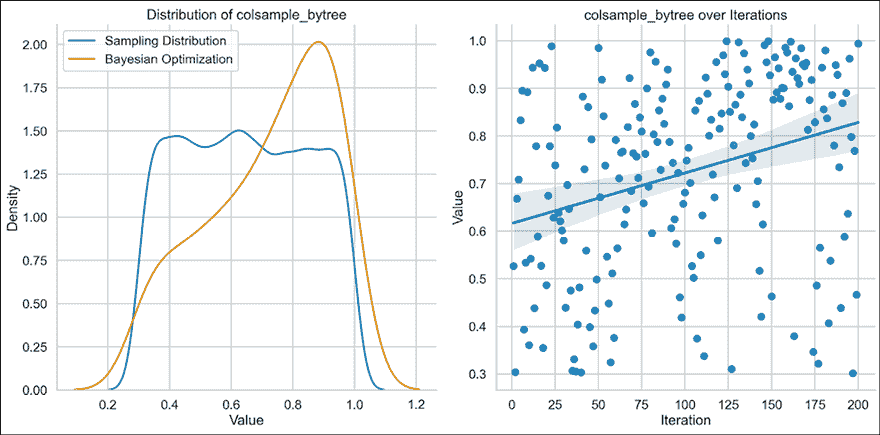

图 14.24：`colsample_bytree`超参数的分布

最后，我们可以观察损失随迭代的演变。损失表示平均召回率的负值（来自训练集上的 5 折交叉验证）。最低值（对应最大平均召回率）为`-0.90`，发生在第 151 次迭代中。除了一些例外，损失在`-0.75`到`-0.85`之间相对稳定。

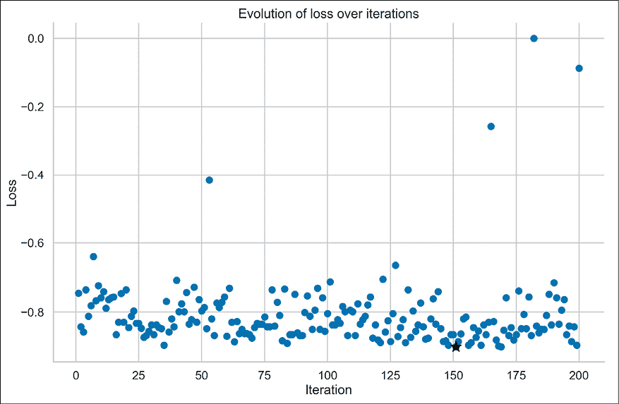

图 14.25：损失（平均召回率）随迭代的演变。最佳迭代用星号标记

### 其他流行的超参数优化库

`hyperopt`是最流行的超参数优化 Python 库之一。然而，它绝对不是唯一的。下面是一些流行的替代方案：

+   `optuna`——一个提供广泛超参数调优功能的库，包括详尽的网格搜索、随机搜索、贝叶斯超参数优化和进化算法。

+   `scikit-optimize`——一个提供`BayesSearchCV`类的库，`BayesSearchCV`是`scikit-learn`的`GridSearchCV`的贝叶斯替代品。

+   `hyperopt-sklearn`——`hyperopt`的衍生库，提供`scikit-learn`中机器学习算法的模型选择。它允许在预处理步骤和机器学习模型之间搜索最佳选项，从而涵盖了整个机器学习管道的范围。该库涵盖了几乎所有在`scikit-learn`中可用的分类器/回归器/预处理变换器。

+   `ray[tune]`——Ray 是一个开源的通用分布式计算框架。我们可以使用它的`tune`模块进行分布式超参数调优。也可以将`tune`的分布式计算能力与其他成熟的库（如`hyperopt`或`optuna`）结合使用。

+   `Tpot`——TPOT 是一个使用遗传编程优化机器学习管道的 AutoML 工具。

+   `bayesian-optimization`——一个提供通用贝叶斯全局优化的库，采用高斯过程。

+   `smac`——SMAC 是一个用于优化任意算法参数的通用工具，包括机器学习模型的超参数优化。

## 另见

其他资源可以在这里找到：

+   Bergstra, J. S., Bardenet, R., Bengio, Y., & Kégl, B. 2011\. 超参数优化算法。载于《*神经信息处理系统进展*》：2546–2554。

+   Bergstra, J., Yamins, D., & Cox, D. D. 2013 年 6 月。Hyperopt：一个用于优化机器学习算法超参数的 Python 库。载于《*第 12 届 Python 科学会议论文集*》：13–20。

+   Bergstra, J., Yamins, D., Cox, D. D. 2013\. 使模型搜索成为科学：视觉架构的*数百维度的超参数优化*。第 30 届国际机器学习大会（ICML 2013）论文集。

+   Claesen, M., & De Moor, B. 2015\. “机器学习中的超参数搜索。” *arXiv 预印本 arXiv:1502.02127*。

+   Falkner, S., Klein, A., & Hutter, F. 2018 年 7 月。BOHB：大规模的稳健高效的超参数优化。在 *国际机器学习大会*：1437–1446。PMLR。

+   Hutter, F., Kotthoff, L., & Vanschoren, J. 2019\. *自动化机器学习：方法、系统、挑战*：219。Springer Nature。

+   Klein, A., Falkner, S., Bartels, S., Hennig, P., & Hutter, F. 2017 年 4 月。大规模数据集上的机器学习超参数的快速贝叶斯优化。在 *人工智能与统计学*：528–536。PMLR。

+   Komer B., Bergstra J., & Eliasmith C. 2014\. “Hyperopt-Sklearn：Scikit-learn 的自动化超参数配置” Proc. SciPy。

+   Li, L., Jamieson, K., Rostamizadeh, A., Gonina, E., Hardt, M., Recht, B., & Talwalkar, A. 2018\. 大规模并行超参数调优： [`doi.org/10.48550/arXiv.1810.05934`](https://doi.org/10.48550/arXiv.1810.05934)

+   Shahriari, B., Swersky, K., Wang, Z., Adams, R. P., & De Freitas, N. 2015\. *从循环中去除人类：贝叶斯优化综述*。*IEEE*会议录，104(1)：148–175。

+   Snoek, J., Larochelle, H., & Adams, R. P. 2012\. 机器学习算法的实用贝叶斯优化。*神经信息处理系统进展*：*25*。

# 调查特征重要性

我们已经花费了相当多的时间来创建整个管道并调优模型，以实现更好的性能。然而，同样重要——甚至在某些情况下更重要——的是模型的可解释性。这意味着不仅要给出准确的预测，还需要能够解释其背后的原因。例如，我们可以查看客户流失的案例。了解客户离开的实际预测因素可能有助于改善整体服务，并有可能让他们停留更长时间。

在金融环境中，银行通常使用机器学习来预测客户偿还信用或贷款的能力。在许多情况下，他们必须为自己的推理提供正当理由，即如果他们拒绝了一份信用申请，他们需要确切知道为什么这位客户的申请没有被批准。对于非常复杂的模型来说，这可能是困难的，甚至是不可能的。

通过了解特征的重要性，我们可以从多个方面受益：

+   通过理解模型的逻辑，我们可以理论上验证其正确性（如果某个合理的特征是一个好的预测因素），同时也能通过只关注重要变量来尝试改进模型。

+   我们可以使用特征重要性来保留*前 x*个最重要的特征（这些特征贡献了指定百分比的总重要性），这不仅能通过去除潜在的噪音提高性能，还能缩短训练时间。

+   在一些现实案例中，为了可解释性，牺牲一些准确性（或其他任何性能指标）是合理的。

同时需要注意的是，模型的准确性（就指定的性能指标而言）越高，特征重要性就越可靠。这就是为什么我们在调整模型后会调查特征的重要性。请注意，我们还应考虑过拟合，因为过拟合的模型不会返回可靠的特征重要性。

在这个配方中，我们展示了如何在随机森林分类器的示例中计算特征重要性。然而，大多数方法都是与模型无关的。在其他情况下，通常也有等效的方法（例如在 XGBoost 和 LightGBM 的情况下）。我们会在*更多内容...*部分提到其中的一些方法。我们简要介绍了计算特征重要性的三种选定方法。

**不纯度的平均减少**（**MDI**）：这是随机森林（在`scikit-learn`中使用的默认特征重要性），也称为基尼重要性。正如我们所知，决策树使用一种不纯度度量（基尼指数/熵/MSE）来创建最佳分裂。在训练决策树时，我们可以计算每个特征在减少加权不纯度方面的贡献。为了计算整个森林的特征重要性，算法会计算所有树的不纯度减少的平均值。

在使用基于不纯度的指标时，我们应该关注变量的排名（相对值），而不是特征重要性的绝对值（这些值也已归一化，使其总和为 1）。

以下是这种方法的优点：

+   快速计算

+   易于获取

以下是这种方法的缺点：

+   偏倚—它倾向于高估连续（数值型）特征或高卡方类别变量的重要性。这有时会导致荒谬的情况，其中一个额外的随机变量（与当前问题无关）在特征重要性排名中得分很高。

+   基于不纯度的特征重要性是基于训练集计算的，并不能反映模型对未见数据的泛化能力。

**丢列特征重要性**：这种方法背后的理念非常简单。我们将一个包含所有特征的模型与一个去掉某个特征的模型进行比较，进行训练和推断。我们对所有特征都重复这个过程。

以下是这种方法的优点：

+   通常被认为是最准确/最可靠的特征重要性度量

以下是这种方法的缺点：

+   由于对每个数据集变体进行重新训练，可能会导致最高的计算成本

**置换特征重要性**：这种方法通过观察每个预测变量的随机重排如何影响模型性能来直接测量特征重要性。置换过程破坏了特征与目标之间的关系。因此，模型性能的下降反映了模型在多大程度上依赖于某个特定特征。如果在重排特征后，性能的下降较小，则说明该特征本身并不是非常重要。相反，如果性能下降显著，则可以认为该特征对模型来说是重要的。

算法的步骤如下：

1.  训练基准模型并记录感兴趣的得分。

1.  随机打乱（重排）某个特征的值，然后使用整个数据集（包含已重排的特征）进行预测并记录得分。特征重要性是基准得分与重排数据集得分之间的差异。

1.  对所有特征重复第二步。

在评估模型性能时，我们可以使用训练数据或验证/测试集。使用后两者中的任意一个的额外好处是能够获得有关模型泛化能力的洞察。例如，某些在训练集上重要但在验证集上不重要的特征，可能实际上会导致模型过拟合。有关该话题的更多讨论，请参阅*可解释机器学习*书籍（在*另见*部分中有参考）。

以下是这种方法的优点：

+   模型无关

+   合理高效——无需在每一步都重新训练模型

+   重排操作保持了变量的分布

以下是这种方法的缺点：

+   在计算上比默认特征重要性更为昂贵

+   当特征高度相关时，可能会产生不可靠的重要性（请参阅 Strobl *et al.* 以获取详细解释）

在本方案中，我们将使用在*探索集成分类器*方案中已经探索过的信用卡违约数据集来探讨特征重要性。

## 准备工作

对于这个方案，我们使用了拟合的随机森林管道（称为`rf_pipeline`），该管道来自*探索集成分类器*方案。请参阅 Jupyter 笔记本中的这一步骤，以查看此处未包含的所有初始步骤，避免重复。

## 如何做到……

执行以下步骤以评估随机森林模型的特征重要性：

1.  导入所需的库：

    ```py
    import numpy as np
    import pandas as pd
    from sklearn.inspection import permutation_importance
    from sklearn.metrics import recall_score
    from sklearn.base import clone 
    ```

1.  从拟合管道中提取分类器和预处理器：

    ```py
    rf_classifier = rf_pipeline.named_steps["classifier"]
    preprocessor = rf_pipeline.named_steps["preprocessor"] 
    ```

1.  从预处理变换器中恢复特征名称，并转换训练/测试集：

    ```py
    feat_names = list(preprocessor.get_feature_names_out())
    X_train_preprocessed = pd.DataFrame(
        preprocessor.transform(X_train),
        columns=feat_names
    )
    X_test_preprocessed = pd.DataFrame(
        preprocessor.transform(X_test),
        columns=feat_names
    ) 
    ```

1.  提取 MDI 特征重要性并计算累计重要性：

    ```py
    rf_feat_imp = pd.DataFrame(rf_classifier.feature_importances_,
                               index=feat_names,
                               columns=["mdi"])
    rf_feat_imp["mdi_cumul"] = np.cumsum(
        rf_feat_imp
        .sort_values("mdi", ascending=False)
        .loc[:, "mdi"]
    ).loc[feat_names] 
    ```

1.  定义一个函数，用于绘制按重要性排序的前* x *个特征：

    ```py
    def plot_most_important_features(feat_imp, title, 
     n_features=10, 
     bottom=False):   
        if bottom:
            indicator = "Bottom"
            feat_imp = feat_imp.sort_values(ascending=True)
        else:
            indicator = "Top"
            feat_imp = feat_imp.sort_values(ascending=False)

        ax = feat_imp.head(n_features).plot.barh()
        ax.invert_yaxis()
        ax.set(title=f"{title} ({indicator}  {n_features})",
               xlabel="Importance",
               ylabel="Feature")

        return ax 
    ```

    我们使用以下函数：

    ```py
    plot_most_important_features(rf_feat_imp["mdi"],
                                 title="MDI Importance") 
    ```

    执行代码片段生成以下图表：

    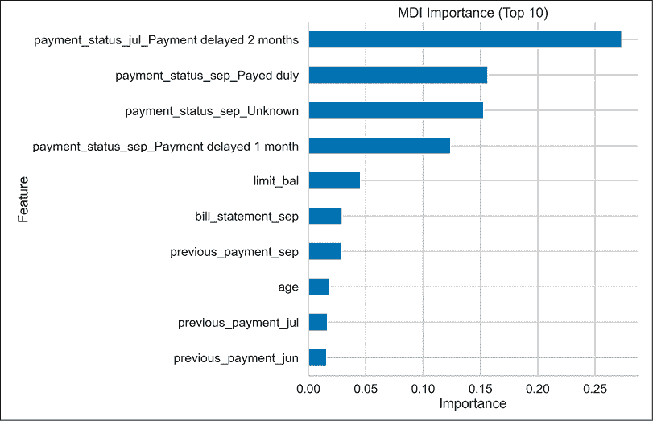

    图 14.26：使用 MDI 指标计算的前 10 个最重要特征

    最重要的特征是分类特征，表示 7 月和 9 月的支付状态。在这四个特征之后，我们可以看到连续特征，如`limit_balance`、`age`、各种账单声明和之前的付款。

1.  绘制特征的重要性累积图：

    ```py
    x_values = range(len(feat_names))
    fig, ax = plt.subplots()
    ax.plot(x_values, rf_feat_imp["mdi_cumul"].sort_values(), "b-")
    ax.hlines(y=0.95, xmin=0, xmax=len(x_values),
              color="g", linestyles="dashed")
    ax.set(title="Cumulative MDI Importance",
           xlabel="# Features",
           ylabel="Importance") 
    ```

    执行该代码片段会生成以下图形：

    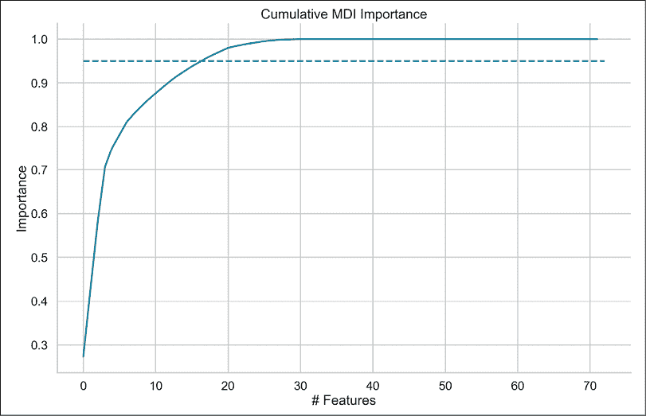

    图 14.27：累积 MDI 重要性

    前 10 个特征占总重要性的 86.23%，而前 17 个特征占总重要性的 95%。

1.  使用训练集计算并绘制置换重要性：

    ```py
    perm_result_train = permutation_importance(
        rf_classifier, X_train_preprocessed, y_train,
        n_repeats=25, scoring="recall",
        random_state=42, n_jobs=-1
    )
    rf_feat_imp["perm_imp_train"] = (
        perm_result_train["importances_mean"]
    )
    plot_most_important_features(
        rf_feat_imp["perm_imp_train"],
        title="Permutation importance - training set"
    ) 
    ```

    执行该代码片段会生成以下图形：

    

    图 14.28：根据训练集计算的置换重要性排名前 10 的特征

    我们可以看到，最重要特征的集合与 MDI 重要性相比发生了重新排列。现在最重要的特征是`payment_status_sep_Unknown`，这是`payment_status_sep`分类特征中的一个未定义标签（在原文中没有明确赋予意义）。我们还可以看到，`age`不在使用这种方法确定的前 10 个最重要特征之中。

1.  使用测试集计算并绘制置换重要性：

    ```py
    perm_result_test = permutation_importance(
        rf_classifier, X_test_preprocessed, y_test,
        n_repeats=25, scoring="recall",
        random_state=42, n_jobs=-1
    )
    rf_feat_imp["perm_imp_test"] = (
        perm_result_test["importances_mean"]
    )
    plot_most_important_features(
        rf_feat_imp["perm_imp_test"],
        title="Permutation importance - test set"
    ) 
    ```

    执行该代码片段会生成以下图形：

    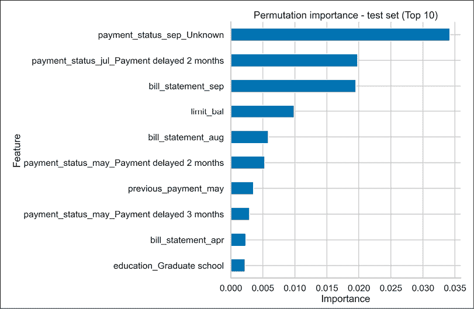

    图 14.29：根据测试集计算的置换重要性排名前 10 的特征

    通过查看这些图形，我们可以得出结论，使用训练集和测试集选择的四个最重要特征是相同的。其他特征则略有调整。

    如果我们发现使用训练集和测试集计算的特征重要性有显著差异，应该调查模型是否存在过拟合的情况。为了解决这个问题，我们可能需要应用某种形式的正则化。在这种情况下，我们可以尝试增加`min_samples_leaf`超参数的值。

1.  定义一个计算移除列特征重要性的函数：

    ```py
    def drop_col_feat_imp(model, X, y, metric, random_state=42):
        model_clone = clone(model)
        model_clone.random_state = random_state
        model_clone.fit(X, y)
        benchmark_score = metric(y, model_clone.predict(X))

        importances = []

        for ind, col in enumerate(X.columns):
            print(f"Dropping {col} ({ind+1}/{len(X.columns)})")
            model_clone = clone(model)
            model_clone.random_state = random_state
            model_clone.fit(X.drop(col, axis=1), y)
            drop_col_score = metric(
                y, model_clone.predict(X.drop(col, axis=1))
            )
            importances.append(benchmark_score - drop_col_score)

        return importances 
    ```

    有两点值得注意：

    +   我们固定了`random_state`，因为我们特别关注的是移除一个特征所导致的性能变化。因此，在估计过程中，我们控制了变异性的来源。

    +   在此实现中，我们使用训练数据进行评估。我们将修改该函数以接受额外的评估对象作为练习留给读者。

1.  计算并绘制移除列特征重要性：

    ```py
    rf_feat_imp["drop_column_imp"] = drop_col_feat_imp(
        rf_classifier.set_params(**{"n_jobs": -1}),
        X_train_preprocessed,
        y_train,
        metric=recall_score,
        random_state=42
    ) 
    ```

    首先，绘制最重要的前 10 个特征：

    ```py
    plot_most_important_features(
        rf_feat_imp["drop_column_imp"], 
        title="Drop column importance"
    ) 
    ```

    执行该代码片段会生成以下图形：

    

    图 14.30：根据移除列特征重要性计算的前 10 个最重要特征

    使用删除列特征重要性（在训练数据上评估），最重要的特征是`payment_status_sep_Unknown`。通过置换特征重要性计算得出的最重要特征也是这个。

    然后，绘制 10 个最不重要的特征：

    ```py
    plot_most_important_features(
        rf_feat_imp["drop_column_imp"], 
        title="Drop column importance", 
        bottom=True
    ) 
    ```

    执行该代码段将生成以下图表：

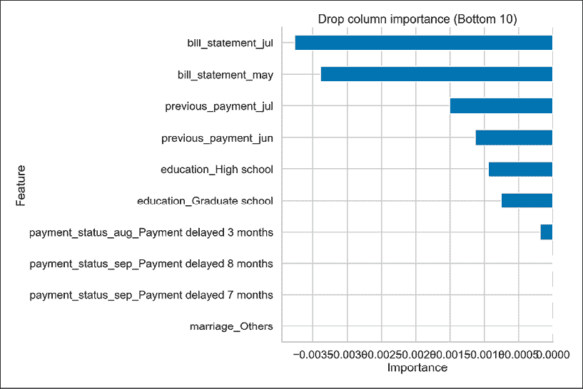

图 14.31：根据删除列特征重要性评估的 10 个最不重要的特征

在删除列特征重要性的情况下，负的特征重要性意味着从模型中删除某个特征实际上会提高模型的性能。这种情况在所考虑的度量标准将较高的值视为更好的时候是成立的。

我们可以使用这些结果来移除具有负面重要性的特征，从而可能提高模型的性能和/或减少训练时间。

## 它是如何工作的...

在*步骤 1*中，我们导入了所需的库。接着，我们从管道中提取了分类器和`ColumnTransformer`预处理器。在这个示例中，我们使用了调优后的随机森林分类器（使用*探索集成分类器*示例中确定的超参数）。

在*步骤 3*中，我们首先使用`get_feature_names_out`方法从预处理器中提取了列名。然后，通过应用预处理器的转换，我们准备了训练集和测试集。

在*步骤 4*中，我们使用拟合后的随机森林分类器的`feature_importances_`属性提取了 MDI 特征重要性。值被自动归一化，使其加起来等于`1`。此外，我们计算了累积特征重要性。

在*步骤 5*中，我们定义了一个辅助函数来绘制最重要/最不重要的特征，并绘制了通过计算平均减少不纯度得到的前 10 个最重要的特征。

在*步骤 6*中，我们绘制了所有特征的累积重要性。通过此图表，我们可以决定是否希望减少模型中的特征数量，以考虑总重要性的某一百分比。通过这样做，我们可能会减少模型的训练时间。

在*步骤 7*中，我们使用`scikit-learn`中的`permutation_importance`函数计算了置换特征重要性。我们决定使用召回率作为评分标准，并将`n_repeats`参数设置为`25`，这样算法就会将每个特征重新排列`25`次。该过程的输出是一个包含三个元素的字典：原始特征重要性、每个特征的平均值和相应的标准差。此外，在使用`permutation_importance`时，我们可以通过提供选定的度量标准列表来同时评估多个指标。

我们决定使用`scikit-learn`的置换特征重要性实现。然而，也有其他可用的选项，例如在`rfpimp`或`eli5`库中。前者还包含删除列特征重要性。

在*第 8 步*中，我们计算并评估了置换特征重要性，这一次使用了测试集。

我们在介绍中提到过，当数据集中存在相关特征时，置换重要性可能会返回不可靠的得分，也就是说，重要性得分会分散到相关特征上。我们可以尝试以下方法来克服这个问题：

+   将相关特征组进行置换。`rfpimp`在`importances`函数中提供了此功能。

+   我们可以对特征的 Spearman 等级相关性进行层次聚类，选择一个阈值，然后仅保留每个识别出的簇中的单个特征。

在*第 9 步*中，我们定义了一个计算删除列特征重要性的函数。首先，我们使用所有特征训练并评估了基准模型。作为评分指标，我们选择了召回率。然后，我们使用`scikit-learn`的`clone`函数创建了一个与基准模型完全相同的模型副本。接着，我们迭代地在没有某个特征的数据集上训练模型，计算所选的评估指标，并存储得分差异。

在*第 10 步*中，我们应用了删除列特征重要性函数并绘制了结果，包括最重要和最不重要的特征。

## 还有更多...

我们已经提到过，`scikit-learn`的随机森林默认的特征重要性是 MDI/Gini 重要性。值得一提的是，流行的提升算法（我们在*探索集成分类器*一节中提到过）也适配了已拟合模型的`feature_importances_`属性。然而，根据不同的算法，它们使用了不同的特征重要性度量标准。

对于 XGBoost，我们有以下几种可能性：

+   `weight`—衡量特征在所有树中用于分裂数据的次数。类似于 Gini 重要性，但它不考虑样本数量。

+   `gain`—衡量使用特征时在树中获得的平均增益。直观地，我们可以将其视为 Gini 重要性度量，其中 Gini 不纯度被梯度提升模型的目标所取代。

+   `cover`—衡量在树中使用该特征时的平均覆盖率。覆盖率定义为受到分裂影响的样本数。

`cover`方法可以克服`weight`方法的潜在问题之一——仅仅计算分裂次数可能具有误导性，因为有些分裂可能只影响少数几个观测值，因此并不是真正相关的。

对于 LightGBM，我们有以下几种可能性：

+   `split`—衡量特征在模型中使用的次数。

+   `gain`—衡量使用特征时分裂的总增益。

## 另请参见

更多资源可以在此处找到：

+   Altmann, A., Toloşi, L., Sander, O., & Lengauer, T. 2010。“置换重要性：一种修正的特征重要性度量。”*生物信息学*, 26(10): 1340–1347。

+   Louppe, G. 2014\. “理解随机森林：从理论到实践。” *arXiv 预印本 arXiv:1407.7502*。

+   Molnar, C. 2020\. *可解释的机器学习：* [`christophm.github.io/interpretable-ml-book/`](https://christophm.github.io/interpretable-ml-book/)

+   Hastie, T., Tibshirani, R., Friedman, J. H., & Friedman, J. H. 2009\. *统计学习的元素：数据挖掘、推理与预测*, 2: 1–758\. 纽约：Springer。

+   Hooker, G., Mentch, L., & Zhou, S. 2021\. “无限制排列强迫外推：变量重要性至少需要一个模型，否则没有自由的变量重要性。” *统计与计算*, 31(6): 1–16。

+   Parr, T., Turgutlu, K., Csiszar, C., & Howard, J. 2018\. 小心默认的随机森林重要性度量。2018 年 3 月 26 日。[`explained.ai/rf-importance/`](https://explained.ai/rf-importance/)。

+   Strobl, C., Boulesteix, A. L., Kneib, T., Augustin, T., & Zeileis, A. 2008\. “随机森林的条件变量重要性。” *BMC 生物信息学*, 9(1): 307。

+   Strobl, C., Boulesteix, A. L., Zeileis, A., & Hothorn, T. 2007\. “随机森林变量重要性度量中的偏差：插图、来源及解决方案。” *BMC 生物信息学*, 8(1): 1–21。

# 探索特征选择技术

在前一个教程中，我们展示了如何评估用于训练机器学习模型的特征的重要性。我们可以利用这些知识进行特征选择，即仅保留最相关的特征，并舍弃其余的特征。

特征选择是任何机器学习项目中至关重要的一部分。首先，它允许我们剔除那些完全不相关或对模型的预测能力贡献不大的特征。这可以在多个方面为我们带来好处。可能最重要的好处是，这些不重要的特征实际上可能会对我们模型的性能产生负面影响，因为它们引入了噪声并导致过拟合。正如我们之前所确定的——*垃圾进，垃圾出*。此外，减少特征通常意味着更短的训练时间，并帮助我们避免维度灾难。

其次，我们应该遵循奥卡姆剃刀原则，保持我们的模型简单且可解释。当我们拥有适量的特征时，解释模型中实际发生的事情会更容易。这对机器学习项目获得利益相关者的支持至关重要。

我们已经确定了特征选择的*为什么*。现在是时候探讨*怎么做*了。从高层次来看，特征选择方法可以分为三类：

+   **过滤方法**—一类通用的单变量方法，它们指定某个统计度量，然后基于该度量过滤特征。这个方法组不涉及任何特定的机器学习算法，因此其特点是（通常）较低的计算时间，并且不易过拟合。这个方法组的潜在缺点是它们会单独评估目标变量与每个特征之间的关系，这可能导致它们忽视特征之间的重要关系。示例包括相关性、卡方检验、**方差分析**（**ANOVA**）、信息增益、方差阈值等。

+   **包装方法**—这一类方法将特征选择视为一个搜索问题，即它使用某些程序反复评估特定的机器学习模型，并使用不同的特征集合来寻找最佳的特征集。其特点是计算成本最高，且过拟合的可能性也最高。示例包括前向选择、后向消除、逐步选择、递归特征消除等。

+   **嵌入方法**—这一类方法使用具有内置特征选择的机器学习算法，例如带正则化的 Lasso 或随机森林。通过使用这些隐式的特征选择方法，算法试图防止过拟合。在计算复杂度方面，这种方法通常介于过滤方法和包装方法之间。

在本节中，我们将应用一系列特征选择方法来处理信用卡欺诈数据集。我们认为这个数据集是一个很好的示例，特别是因为许多特征已被匿名化，我们并不知道它们背后的确切含义。因此，也很可能其中一些特征对模型的性能贡献并不大。

## 准备工作

在本节中，我们将使用在*研究不同处理不平衡数据的方法*中介绍的信用卡欺诈数据集。为了方便起见，我们在本节中已包含了来自随附 Jupyter 笔记本的所有必要准备步骤。

应用特征选择方法的另一个有趣挑战是 BNP Paribas Cardif Claims Management（数据集可以在 Kaggle 上找到——链接见*另见*部分）。与本节中使用的数据集类似，它包含 131 个匿名特征。

## 如何操作……

执行以下步骤来尝试不同的特征选择方法：

1.  导入库：

    ```py
    from sklearn.ensemble import RandomForestClassifier
    from sklearn.metrics import recall_score
    from sklearn.feature_selection import (RFE, RFECV, 
                                           SelectKBest, 
                                           SelectFromModel, 
                                           mutual_info_classif)
    from sklearn.model_selection import StratifiedKFold 
    ```

1.  训练基准模型：

    ```py
    rf = RandomForestClassifier(random_state=RANDOM_STATE,
                                n_jobs=-1)
    rf.fit(X_train, y_train)
    recall_train = recall_score(y_train, rf.predict(X_train))
    recall_test = recall_score(y_test, rf.predict(X_test))
    print(f"Recall score training: {recall_train:.4f}")
    print(f"Recall score test: {recall_test:.4f}") 
    ```

    执行代码片段后会生成以下输出：

    ```py
    Recall score training: 1.0000
    Recall score test: 0.8265 
    ```

    从召回率得分来看，模型显然对训练数据过拟合。通常，我们应该尝试解决这个问题。然而，为了简化操作，我们假设该模型已经足够好，可以继续进行。

1.  使用互信息选择最佳特征：

    ```py
    scores = []
    n_features_list = list(range(2, len(X_train.columns)+1))
    for n_feat in n_features_list:
        print(f"Keeping {n_feat} most important features")
        mi_selector = SelectKBest(mutual_info_classif, k=n_feat)
        X_train_new = mi_selector.fit_transform(X_train, y_train)
        X_test_new = mi_selector.transform(X_test)
        rf.fit(X_train_new, y_train)
        recall_scores = [
            recall_score(y_train, rf.predict(X_train_new)),
            recall_score(y_test, rf.predict(X_test_new))
        ]
        scores.append(recall_scores)
    mi_scores_df = pd.DataFrame(
        scores,
        columns=["train_score", "test_score"],
        index=n_features_list
    ) 
    ```

    使用下一个代码片段，我们绘制结果：

    ```py
    (
        mi_scores_df["test_score"]
        .plot(kind="bar",
              title="Feature selection using Mutual Information",
              xlabel="# of features",
              ylabel="Recall (test set)")
    ) 
    ```

    执行代码片段后会生成以下图表：

    

    图 14.32：模型的性能与所选特征数量的关系。特征是使用互信息准则选择的

    通过检查图表，我们可以看到，使用 `8`、`9`、`10` 和 `12` 个特征时，在测试集上达到了最佳的召回得分。由于我们追求简洁，最终决定选择 `8` 个特征。使用以下代码片段，我们提取出 8 个最重要特征的名称：

    ```py
    mi_selector = SelectKBest(mutual_info_classif, k=8)
    mi_selector.fit(X_train, y_train)
    print(f"Most importance features according to MI: {mi_selector.get_feature_names_out()}") 
    ```

    执行代码片段会返回以下输出：

    ```py
    Most importance features according to MI: ['V3' 'V4' 'V10' 'V11' 'V12' 'V14' 'V16' 'V17'] 
    ```

1.  使用 MDI 特征重要性选择最佳特征，重新训练模型，并评估其性能：

    ```py
    rf_selector = SelectFromModel(rf)
    rf_selector.fit(X_train, y_train)
    mdi_features = X_train.columns[rf_selector.get_support()]
    rf.fit(X_train[mdi_features], y_train)
    recall_train = recall_score(
        y_train, rf.predict(X_train[mdi_features])
    )
    recall_test = recall_score(y_test, rf.predict(X_test[mdi_features]))
    print(f"Recall score training: {recall_train:.4f}")
    print(f"Recall score test: {recall_test:.4f}") 
    ```

    执行代码片段会生成以下输出：

    ```py
    Recall score training: 1.0000
    Recall score test: 0.8367 
    ```

    使用以下代码片段，我们提取用于特征选择的阈值和最相关的特征：

    ```py
    print(f"MDI importance threshold: {rf_selector.threshold_:.4f}")
    print(f"Most importance features according to MI: {rf_selector.get_feature_names_out()}") 
    ```

    这生成了以下输出：

    ```py
    MDI importance threshold: 0.0345
    Most importance features according to MDI: ['V10' 'V11' 'V12' 'V14' 'V16' 'V17'] 
    ```

    阈值对应于 RF 模型的平均特征重要性。

    使用类似于*步骤 3*中的循环，我们可以生成一个条形图，展示模型的性能与保留特征数量的关系。我们根据 MDI 迭代地选择前 *k* 个特征。为了避免重复，这里不包含代码（代码可以在随附的 Jupyter notebook 中找到）。通过分析图表，我们可以看到，模型在使用`10`个特征时取得了最佳得分，这比前一种方法更多。

    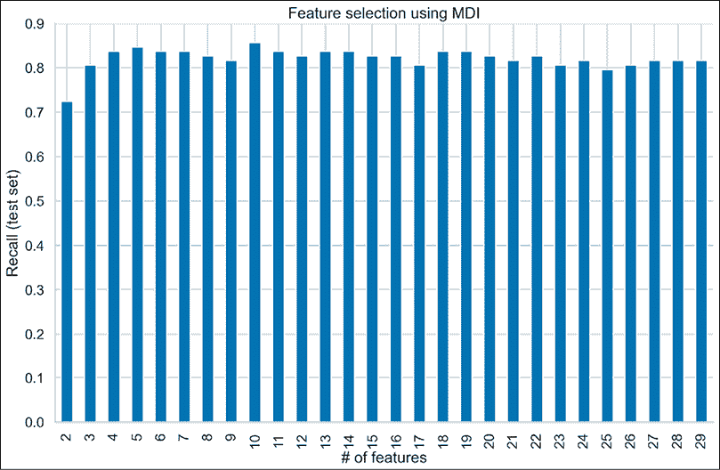

    图 14.33：模型的性能与所选特征数量的关系。特征是使用均值减少不纯度特征重要性选择的

1.  使用递归特征消除法（Recursive Feature Elimination）选择最佳的 10 个特征：

    ```py
    rfe = RFE(estimator=rf, n_features_to_select=10, verbose=1)
    rfe.fit(X_train, y_train) 
    ```

    为了避免重复，我们展示了最重要的特征及其附带的分数，而没有包括代码，因为它与我们在前面步骤中所涉及的内容几乎相同：

    ```py
    Most importance features according to RFE: ['V4' 'V7' 'V9' 'V10' 'V11' 'V12' 'V14' 'V16' 'V17' 'V26']
    Recall score training: 1.0000
    Recall score test: 0.8367 
    ```

1.  使用带交叉验证的递归特征消除法选择最佳特征：

    ```py
    k_fold = StratifiedKFold(5, shuffle=True, random_state=42)
    rfe_cv = RFECV(estimator=rf, step=1,
                   cv=k_fold,
                   min_features_to_select=5,
                   scoring="recall",
                   verbose=1, n_jobs=-1)
    rfe_cv.fit(X_train, y_train) 
    ```

    下面展示了特征选择的结果：

    ```py
    Most importance features according to RFECV: ['V1' 'V4' 'V6' 'V7' 'V9' 'V10' 'V11' 'V12' 'V14' 'V15' 'V16' 'V17' 'V18'
     'V20' 'V21' 'V26']
    Recall score training: 1.0000
    Recall score test: 0.8265 
    ```

    该方法导致选择了`16`个特征。总体而言，在考虑的各个方法中，每个方法都有`6`个特征：`V10`、`V11`、`V12`、`V14`、`V16` 和 `V17`。

    此外，使用以下代码片段，我们可以可视化交叉验证得分，也就是每个考虑的特征保留数量下，`5`折交叉验证的平均召回率。由于我们选择在`RFECV`过程中至少保留`5`个特征，因此必须将`5`加到数据框的索引中：

    ```py
    cv_results_df = pd.DataFrame(rfe_cv.cv_results_)
    cv_results_df.index += 5
    (
        cv_results_df["mean_test_score"]
        .plot(title="Average CV score over iterations",
              xlabel="# of features retained",
              ylabel="Avg. recall")
    ) 
    ```

    执行代码片段会生成以下图表：

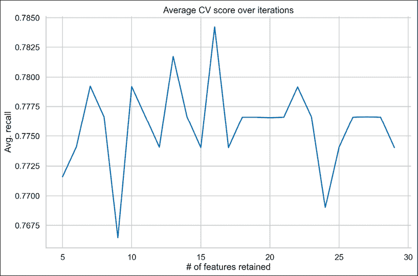

图 14.34：RFE 过程每一步的平均交叉验证得分

检查图表确认，使用 16 个特征时获得了最高的平均召回率。

在评估特征选择的好处时，我们应考虑两种情况。在更显而易见的一种情况下，当我们去除一些特征时，模型的表现得到了改善。这无需进一步解释。第二种情况则更为有趣。去除特征后，我们可能会得到与初始表现非常相似或者稍差的结果。然而，这并不一定意味着我们失败了。假设我们去除了约 60%的特征，同时保持了相同的表现。这可能已经是一个重要的改进，具体改进的程度取决于数据集和模型，可能会将训练时间减少几个小时甚至几天。此外，这样的模型也会更容易解释。

## 它是如何工作的……

导入所需的库后，我们训练了一个基准随机森林分类器，并打印了训练集和测试集的召回率分数。

在*第 3 步*中，我们应用了考虑的第一个特征选择方法。这是一个属于单变量*过滤器*类别的特征选择技术示例。作为统计标准，我们使用了互信息分数（Mutual Information score）。为了计算该指标，我们使用了`mutual_info_classif`函数，该函数来自`scikit-learn`，仅适用于分类目标和数值特征。因此，任何分类特征都需要提前进行适当的编码。幸运的是，在这个数据集中我们只有连续的数值特征。

**互信息**（**MI**）分数是两个随机变量之间互依赖性的度量。当分数为零时，表示这两个变量是独立的。分数越高，变量之间的依赖性越强。通常，计算 MI 需要了解每个特征的概率分布，而我们通常并不清楚这些分布。这就是为什么`scikit-learn`的实现使用基于 k-最近邻距离的非参数近似法的原因。使用 MI 的一个优点是它能够捕捉特征之间的非线性关系。

接下来，我们将 MI 标准与`SelectKBest`类结合使用，该类允许我们根据任意指标选择*k*个最佳特征。使用这种方法时，我们通常无法提前知道希望保留多少个特征。因此，我们遍历了所有可能的值（从`2`到`29`，后者是数据集中特征的总数）。`SelectKBest`类采用了熟悉的`fit`/`transform`方法。在每次迭代中，我们将该类拟合到训练数据（此步骤需要特征和目标变量）上，然后对训练集和测试集进行转换。转换的结果是根据 MI 标准仅保留最重要的*k*个特征。接着，我们再次使用仅包含选定特征的训练数据来拟合随机森林分类器，并记录相关的召回率分数。

`scikit-learn`使我们可以轻松地将不同的度量与`SelectKBest`类一起使用。例如，我们可以使用以下评分函数：

+   `f_classif`—ANOVA F 值，用于估算两个变量之间的线性依赖程度。F 统计量是通过计算组间变异性与组内变异性的比值来得出的。在这种情况下，组即为目标的类别。该方法的一个潜在缺点是它仅考虑了线性关系。

+   `chi2`—卡方统计量。该度量仅适用于非负特征，如布尔值或频率，或者更一般地，适用于分类特征。直观地说，它评估一个特征是否与目标变量独立。如果是这样，它在分类观察值时也不提供有用信息。

除了选择*最优*的 k 个特征外，`scikit-learn`的`feature_selection`模块还提供了其他类，允许根据最高得分的百分位、假阳性率测试、估计的假发现率或家族错误率来选择特征。

在*步骤 4*中，我们探索了*嵌入式*特征选择技术的一个示例。在这一组方法中，特征选择作为模型构建阶段的一部分进行。我们使用了`SelectFromModel`类，根据模型的内置特征重要性度量（在此情况下为 MDI 特征重要性）来选择最佳特征。在实例化该类时，我们可以提供`threshold`参数来确定用于选择最相关特征的阈值。特征的权重/系数高于该阈值的将被保留在模型中。我们还可以使用“`mean`”（默认值）和“`median`”关键字，使用所有特征重要性的均值/中位数作为阈值。我们还可以将这些关键字与缩放因子结合使用，例如，`"1.5*mean"`。通过使用`max_features`参数，我们可以确定允许选择的最大特征数量。

`SelectFromModel`类适用于任何具有`feature_importances_`（例如，随机森林、XGBoost、LightGBM 等）或`coef_`（例如，线性回归、逻辑回归和 Lasso）属性的估算器。

在此步骤中，我们演示了两种恢复已选择特征的方法。第一种是`get_support`方法，它返回一个包含布尔标志的列表，指示给定的特征是否被选择。第二种是`get_feature_names_out`方法，它直接返回所选特征的名称。在拟合随机森林分类器时，我们手动选择了训练数据集的列。然而，我们也可以使用已拟合的`SelectFromModel`类的`transform`方法，自动提取相关特征并以`numpy`数组的形式返回。

在*第 5 步*中，我们使用了*包装*方法的示例。**递归特征消除**（**RFE**）是一种递归训练机器学习模型、计算特征重要性（通过`coef_`或`feature_importances_`），并删除最不重要的特征的算法。

该过程首先使用所有特征训练模型。然后，从数据集中删除最不重要的特征。接下来，使用减少后的特征集重新训练模型，并再次删除最不重要的特征。这个过程会重复，直到达到所需的特征数量。在实例化`RFE`类时，我们提供了随机森林估计器以及要选择的特征数量。此外，我们还可以提供`step`参数，它决定了每次迭代中要删除多少个特征。

RFE 可能是一个计算开销较大的算法，尤其是在特征集较大且进行交叉验证时。因此，使用 RFE 之前，最好先应用一些其他的特征选择技术。例如，我们可以使用筛选方法，去除一些相关性较高的特征。

如我们之前所提到的，我们很少知道最佳的特征数量。这就是为什么在*第 6 步*中我们尝试解决这个缺点。通过将 RFE 与交叉验证结合使用，我们可以通过 RFE 过程自动确定保留的最佳特征数量。为此，我们使用了`RFECV`类并提供了一些额外的输入。我们必须指定交叉验证方案（5 折分层交叉验证，因为我们处理的是不平衡数据集）、评分指标（召回率）以及保留的最小特征数量。对于最后一个参数，我们任意选择了 5。

最后，为了更深入地探讨交叉验证得分，我们通过已拟合的`RFECV`类的`cv_results_`属性访问了每个折的交叉验证得分。

## 还有更多…

### 其他一些可用的方法

我们已经提到了一些单变量筛选方法。其他一些值得注意的方法包括：

+   **方差阈值**—这种方法仅删除方差低于指定阈值的特征。因此，它可以用来去除常量特征和准常量特征。后者指的是那些几乎所有值都相同，变化性非常小的特征。根据定义，这种方法仅查看特征，而不考虑目标值。

+   **基于相关性**—有多种方式可以衡量相关性，因此我们只关注这种方法的基本逻辑。首先，我们确定特征与目标之间的相关性。然后我们可以选择一个阈值，高于该阈值的特征将保留用于建模。

然后，我们还应考虑去除那些高度相关的特征。我们应该识别这些特征组，并从每个组中只保留一个特征在我们的数据集中。另一种方法是使用**方差膨胀因子**（**VIF**）来判断多重共线性，并根据较高的 VIF 值去除特征。VIF 可以在`statsmodels`中使用。

我们在这个方法中没有考虑使用相关性作为标准，因为信用卡欺诈数据集中的特征是 PCA 的结果。因此，按定义，它们是正交的，也就是不相关的。

也有多变量筛选方法可用。例如，**最大相关最小冗余**（**MRMR**）是一类算法，旨在识别与目标变量高度相关且相互冗余较小的特征子集。

我们还可以探索以下*包装*技术：

+   **前向特征选择**—我们从没有特征开始。我们单独测试每个特征，看看哪个特征最能改善模型。然后，我们将该特征添加到我们的特征集。接着，我们依次训练模型，添加第二个特征。类似地，在此步骤中，我们再次单独测试所有剩余特征。我们选择最佳的特征并将其添加到已选择的特征池中。我们继续一次一个地添加特征，直到达到停止标准（最大特征数或没有进一步改进）。传统上，添加的特征是根据特征的 p 值来决定的。然而，现代库使用交叉验证度量的改进作为选择标准。

+   **向后特征选择**—类似于前一种方法，但我们从所有特征开始，逐一去除每个特征，直到没有进一步的改进（或所有特征都是统计显著的）。该方法与 RFE 的不同之处在于，它不使用系数或特征重要性来选择要去除的特征。相反，它通过交叉验证得分的差异来优化性能提升。

+   **穷举特征选择**—简单来说，在这种暴力方法中，我们尝试所有可能的特征组合。自然地，这是所有包装技术中计算开销最大的一种，因为特征组合的数量随着特征数量的增加而指数级增长。例如，如果我们有 3 个特征，我们需要测试 7 个组合。假设我们有特征`a`、`b`和`c`，我们需要测试以下组合：[a, b, c, ab, ac, bc, abc]。

+   **逐步选择**——一种结合了前向和后向特征选择的混合方法。该过程从零特征开始，并使用最低显著性 p 值逐一添加特征。在每一步添加时，过程还会检查当前特征中是否有任何在统计学上不显著的特征。如果有，这些特征将从特征集中过滤掉，算法继续进行下一步添加。该过程允许最终模型只包含统计学上显著的特征。

前两种方法已在`scikit-learn`中实现。或者，你可以在`mlxtend`库中找到所有四种方法。

我们还应该提到一些关于上述*包装器*技术的注意事项：

+   最佳特征数量取决于机器学习算法。

+   由于其迭代性质，它们能够检测特征之间的某些交互作用。

+   这些方法通常会为给定的机器学习算法提供最佳表现的特征子集。

+   它们的计算成本最高，因为它们采用贪婪算法，并多次重训练模型。

作为最后一种包装器方法，我们将提到**Boruta**算法。不深入细节，它创建了一组影像特征（原始特征的置换副本），并使用一个简单的启发式规则选择特征：如果某个特征的表现优于所有随机化特征中的最佳者，那么该特征是有用的。整个过程会重复多次，直到算法返回最佳特征集。该算法兼容`scikit-learn`的`ensemble`模块中的机器学习模型，以及 XGBoost 和 LightGBM 等算法。有关该算法的更多细节，请参见*另见*部分中的论文。Boruta 算法已在`boruta`库中实现。

最后，值得一提的是，我们还可以结合多种特征选择方法，以提高其可靠性。例如，我们可以使用几种方法选择特征，然后最终选择所有方法中出现过的特征。

### 结合特征选择和超参数调优

正如我们已经确定的那样，我们无法事先知道应保留的最佳特征数量。因此，我们可能希望将特征选择与超参数调优相结合，并将保留的特征数量视为另一个超参数。

我们可以通过使用`scikit-learn`中的`pipelines`和`GridSearchCV`轻松实现：

```py
from sklearn.pipeline import Pipeline
from sklearn.model_selection import GridSearchCV
pipeline = Pipeline(
   [
    ("selector", SelectKBest(mutual_info_classif)),
    ("model", rf)
   ]
)
param_grid = {
   "selector__k": [5, 10, 20, 29],
   "model__n_estimators": [10, 50, 100, 200]  
}
gs = GridSearchCV(
   estimator=pipeline,
   param_grid=param_grid,
   n_jobs=-1,
   scoring="recall",
   cv=k_fold,
   verbose=1
)
gs.fit(X_train, y_train)
print(f"Best hyperparameters: {gs.best_params_}") 
```

执行代码片段将返回最佳的超参数集：

```py
Best hyperparameters: {'model__n_estimators': 50, 'selector__k': 20} 
```

当将过滤特征选择方法与交叉验证结合使用时，我们应该在交叉验证过程中进行特征过滤。否则，我们就会使用所有可用的观测值来选择特征，从而引入偏差。

需要记住的一点是，在交叉验证的不同折中选择的特征可能不同。假设我们有一个`5`折交叉验证过程，并选择了`3`个特征。可能在某些`5`折交叉验证轮次中，这`3`个选定的特征不会重叠。然而，它们不应差异太大，因为我们假设数据中的整体模式和特征的分布在各个折之间非常相似。

## 另见

该主题的附加参考文献：

+   Bommert, A., Sun, X., Bischl, B., Rahnenführer, J., & Lang, M. 2020\. “高维分类数据中特征选择过滤方法的基准。” *计算统计与数据分析*，143：106839。

+   Ding, C., & Peng, H. 2005\. “来自微阵列基因表达数据的最小冗余特征选择。” *生物信息学与计算生物学杂志*，3(2)：185–205。

+   Kira, K., & Rendell, L. A. 1992\. 特征选择的实用方法。发表于*机器学习论文集*，*1992*：249–256\. Morgan Kaufmann。

+   Kira, K., & Rendell, L. A. 1992 年 7 月。特征选择问题：传统方法与新算法。发表于 Aaai, 2(1992a)：129-134。

+   Kuhn, M., & Johnson, K. 2019\. *特征工程与选择：预测模型的实用方法*。CRC 出版社。

+   Kursa M., & Rudnicki W. 2010 年 9 月。“使用 Boruta 包进行特征选择” *统计软件杂志*，36(11)：1-13。

+   Urbanowicz, RJ., 等. 2018\. “基于 Relief 的特征选择：介绍与回顾。” *生物医学信息学杂志*，85：189–203。

+   Yu, L., & Liu, H. 2003\. 高维数据的特征选择：一种快速的基于相关性的过滤方法。发表于*第 20 届国际机器学习会议（ICML-03）*：856–863。

+   Zhao, Z., Anand, R., & Wang, M. 2019 年 10 月。用于营销机器学习平台的最大相关性和最小冗余特征选择方法。发表于*2019 IEEE 国际数据科学与高级分析会议（DSAA）*：442–452\. IEEE。

你可以在*准备就绪*部分找到提到的附加数据集：

+   [`www.kaggle.com/competitions/bnp-paribas-cardif-claims-management`](https://www.kaggle.com/competitions/bnp-paribas-cardif-claims-management)

# 探索可解释的 AI 技术

在之前的一些案例中，我们探讨了特征重要性，作为更好理解模型内部工作原理的一种手段。尽管在线性回归的情况下，这可能是一个相对简单的任务，但随着模型复杂度的增加，这一任务变得愈加困难。

机器学习/深度学习领域的一个大趋势是**可解释 AI**（**XAI**）。它指的是允许我们更好地理解黑箱模型预测的各种技术。尽管目前的 XAI 方法无法将黑箱模型转变为完全可解释的模型（或白箱模型），但它们无疑有助于我们更好地理解为什么模型在给定的特征集上返回特定的预测。

拥有可解释 AI 模型的一些好处如下：

+   建立对模型的信任——如果模型的推理（通过其解释）符合常识或人类专家的信念，它可以增强对模型预测的信任

+   促进模型或项目在业务利益相关者中的采纳

+   通过提供模型决策过程的推理，提供有助于人类决策的见解

+   使调试变得更加容易

+   可以引导未来数据收集或特征工程的方向

在提到具体的 XAI 技术之前，值得澄清**可解释性**和**可解释性**之间的区别。**可解释性**可以看作是可解释性的一个更强版本。它提供基于因果关系的模型预测解释。另一方面，**可解释性**用于理解黑箱模型的预测，这些模型可能是不可解释的。具体来说，XAI 技术可以用来解释模型预测过程中的发生情况，但它们无法因果性地证明为什么做出某个预测。

在这个方案中，我们介绍了三种 XAI 技术。请参见*更多内容...*部分以了解更多可用的方法。

第一种技术被称为**个体条件期望**（**ICE**），它是一种局部且与模型无关的可解释性方法。*局部*部分指的是这项技术描述了在观察级别上特征（们）的影响。ICE 通常以图表的形式呈现，展示了当给定特征的值发生变化时，观察值的预测如何变化。

为了获得数据集中单个观察值及其特征的 ICE 值，我们需要创建多个该观察值的副本。在所有副本中，保持其他特征的值不变（除了被考虑的特征），同时将感兴趣特征的值替换为网格中的值。最常见的做法是，网格包含该特征在整个数据集中的所有不同值（对于所有观察值）。然后，我们使用（黑箱）模型对每个修改过的原始观察值副本进行预测。这些预测结果将绘制成 ICE 曲线。

优点：

+   计算简单，直观理解曲线表示的内容

+   ICE 可以揭示异质关系，即当特征对目标的影响方向因被探索特征值的区间不同而不同。

缺点：

+   我们一次只能有意义地展示一个特征。

+   绘制许多 ICE 曲线（对于多个观测值）可能会使图表过于拥挤，难以解读。

+   ICE 假设特征之间是独立的——当特征相关时，曲线中的某些点实际上可能是无效数据点（根据联合特征分布，它们可能是极不可能出现的，或者根本不可能出现）。

第二种方法叫做**部分依赖图**（**PDP**），它与 ICE 密切相关。它也是一种模型无关的方法，但它是全局的。这意味着 PDP 描述的是特征对目标的影响，考虑的是整个数据集的上下文。

PDP 呈现特征对预测的边际效应。直观地讲，我们可以将部分依赖看作是目标的预期响应作为感兴趣特征的函数的映射。它还可以显示特征与目标之间的关系是线性还是非线性的。就 PDP 的计算而言，它实际上是所有 ICE 曲线的平均值。

优点：

+   与 ICE 类似，PDP 计算起来很容易，且直观地可以理解曲线代表的含义。

+   如果感兴趣的特征与其他特征不相关，那么 PDP 就能完美地表示所选特征对预测的影响（平均而言）。

+   PDP 的计算具有因果解释（在模型内部）——通过观察特征变化所引起的预测变化，我们分析特征与预测之间的因果关系。

缺点：

+   PDP 还假设特征之间是独立的。

+   PDP 可能会掩盖由交互作用产生的异质关系。例如，我们可能会观察到目标与某个特征之间存在线性关系。然而，ICE 曲线可能显示出该模式存在例外情况，例如，在某些特征的范围内，目标保持不变。

+   PDP 可以用于分析至多两个特征。

我们在本节中讨论的最后一种 XAI 技术叫做**SHapley Additive exPlanations**（**SHAP**）。它是一个模型无关的框架，通过结合博弈论和局部解释来解释预测结果。

本方法涉及的具体方法论和计算超出了本书的范围。我们可以简要提到，**Shapley 值**是博弈论中使用的一种方法，涉及对游戏中合作的参与者进行公平的收益和成本分配。由于每个玩家对联盟的贡献不同，Shapley 值确保每个参与者根据他们的贡献获得公平的份额。

我们可以将其与机器学习（ML）设置进行比较，其中特征是玩家，合作游戏是创建机器学习模型的预测，而收益是实例的平均预测与所有实例的平均预测之间的差异。因此，对于某个特征的 Shapley 值的解释如下：该特征为该观察的预测贡献了*x*，与数据集的平均预测相比。

在讲解完 Shapley 值后，现在该解释 SHAP 是什么了。它是一种解释任何机器学习/深度学习模型输出的方法。SHAP 结合了最优信用分配和局部解释，利用了 Shapley 值（源自博弈论）及其扩展。

SHAP 提供了以下内容：

+   这是一种计算 Shapley 值的计算效率高且理论上稳健的方法，适用于机器学习模型（理想情况下只需要训练模型一次）。

+   KernelSHAP——一种替代的基于核的 Shapley 值估计方法，灵感来源于局部替代模型。

+   TreeSHAP——一种高效的基于树的模型估计方法。

+   基于 Shapley 值的各种全局解释方法。

为了更好地理解 SHAP，建议同时了解 LIME。请参考*更多内容…*部分以获取简要描述。

优势：

+   Shapley 值具有坚实的理论基础（效率、公平、虚拟和加法公理）。Lundberg *等*（2017）解释了这些公理与 SHAP 值的对应属性（即局部准确性、缺失性和一致性）之间的微小差异。

+   由于其高效性，SHAP 可能是唯一一个能将预测公平分配到特征值中的框架。

+   SHAP 提供了全局可解释性——它展示了特征的重要性、特征之间的依赖关系、相互作用，以及某个特征是否对模型预测产生正面或负面影响。

+   SHAP 提供了局部可解释性——尽管许多技术仅关注整体可解释性，我们可以为每个单独的预测计算 SHAP 值，以了解特征是如何影响该特定预测的。

+   SHAP 可以用于解释多种模型，包括线性模型、基于树的模型和神经网络。

+   TreeSHAP（针对基于树的模型的快速实现）使得在实际应用中使用这种方法变得可行。

劣势：

+   计算时间——考虑的特征数量越多，特征的可能组合数量呈指数增长，这反过来增加了计算 SHAP 值的时间。因此，我们需要依赖近似方法。

+   与置换特征重要性相似，SHAP 值对特征之间的高度相关性敏感。如果出现这种情况，这些特征对模型评分的影响可能会在这些特征之间被任意分配，从而使我们认为它们的重要性低于实际情况。另外，相关特征可能会导致使用不现实/不可能的特征组合。

+   由于 Shapley 值并未提供预测模型（如 LIME 的情况），因此不能用来陈述输入变化如何对应预测变化。例如，我们不能说“如果特征 *Y* 的值增加 50 个单位，那么预测概率将增加 1 个百分点”。

+   KernelSHAP 运行较慢，且与其他基于置换的解释方法类似，忽略了特征之间的依赖关系。

## 准备工作

在本教程中，我们将使用我们在*调查不同处理不平衡数据方法*教程中介绍的信用卡欺诈数据集。为了方便起见，我们已经将所有必要的准备步骤包含在了伴随的 Jupyter notebook 的这一部分中。

## 如何操作…

执行以下步骤以调查对训练在信用卡欺诈数据集上的 XGBoost 模型预测进行解释的不同方法：

1.  导入库：

    ```py
    from xgboost import XGBClassifier
    from sklearn.metrics import recall_score
    from sklearn.inspection import (partial_dependence,
                                    PartialDependenceDisplay)
    import shap 
    ```

1.  训练机器学习模型：

    ```py
    xgb = XGBClassifier(random_state=RANDOM_STATE,
                        n_jobs=-1)
    xgb.fit(X_train, y_train)
    recall_train = recall_score(y_train, xgb.predict(X_train))
    recall_test = recall_score(y_test, xgb.predict(X_test))
    print(f"Recall score training: {recall_train:.4f}")
    print(f"Recall score test: {recall_test:.4f}") 
    ```

    执行代码片段会生成如下输出：

    ```py
    Recall score training: 1.0000
    Recall score test: 0.8163 
    ```

    我们可以得出结论，模型对训练数据过拟合，理想情况下我们应该尝试通过例如在训练 XGBoost 模型时使用更强的正则化来解决这个问题。为了保持练习的简洁性，我们假设模型已准备好进行进一步分析。

    与调查特征重要性类似，我们应首先确保模型在验证集/测试集上有令人满意的表现，然后再开始解释其预测。

1.  绘制 ICE 曲线：

    ```py
    PartialDependenceDisplay.from_estimator(
        xgb, X_train, features=["V4"], 
        kind="individual", 
        subsample=5000, 
        line_kw={"linewidth": 2},
        random_state=RANDOM_STATE
    ) 
    plt.title("ICE curves of V4") 
    ```

    执行代码片段会生成如下图表：

    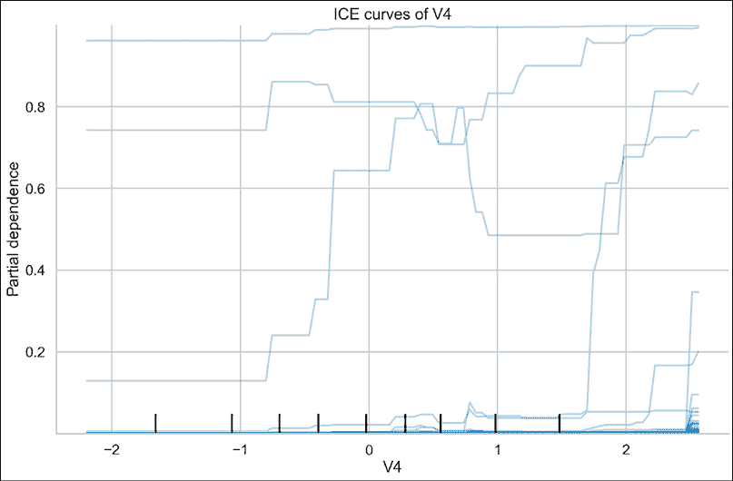

    图 14.35：使用来自训练数据的 5,000 个随机样本创建的 V4 特征的 ICE 图

    *图 14.35* 展示了 `V4` 特征的 ICE 曲线，这些曲线是使用来自训练数据的 `5,000` 个随机观测值计算得出的。从图中可以看到，绝大多数观测值都位于 `0` 附近，而少数曲线则显示出预测概率的显著变化。

    图表底部的黑色标记表示特征值的百分位数。默认情况下，ICE 图和 PDP 被限制在特征值的第 5 和第 95 百分位数；然而，我们可以通过 `percentiles` 参数更改这一设置。

    ICE 曲线的一个潜在问题是，很难看出曲线是否在不同观察值之间有所不同，因为它们的预测值起点不同。一个解决方案是将曲线集中在某一点，并仅显示与该点相比的预测差异。

1.  绘制集中 ICE 曲线：

    ```py
    PartialDependenceDisplay.from_estimator(
        xgb, X_train, features=["V4"], 
        kind="individual", 
        subsample=5000,
        centered=True,
        line_kw={"linewidth": 2},
        random_state=RANDOM_STATE
    )
    plt.title("Centered ICE curves of V4") 
    ```

    执行代码片段后会生成如下图表：

    

    图 14.36：使用训练数据中 5,000 个随机样本创建的 V4 特征的集中 ICE 图

    集中 ICE 曲线的解释仅略有不同。我们不再直接观察特征值变化对预测的影响，而是观察相对于平均预测的预测值变化。这种方式使得分析预测值变化的方向变得更加容易。

1.  生成部分依赖图：

    ```py
    PartialDependenceDisplay.from_estimator(
        xgb, X_train, 
        features=["V4"], 
        random_state=RANDOM_STATE
    )
    plt.title("Partial Dependence Plot of V4") 
    ```

    执行代码片段后会生成如下图表：

    

    图 14.37：使用训练数据准备的 V4 特征的部分依赖图

    通过分析该图表，平均来看，随着`V4`特征的增加，预测概率似乎只有非常小的增加。

    与 ICE 曲线类似，我们也可以对 PDP 进行集中处理。

    为了获得更多的见解，我们可以生成 PDP 并结合 ICE 曲线。我们可以使用以下代码片段来实现：

    ```py
    PartialDependenceDisplay.from_estimator(
        xgb, X_train, features=["V4"], 
        kind="both", 
        subsample=5000, 
        ice_lines_kw={"linewidth": 2},
        pd_line_kw={"color": "red"},
        random_state=RANDOM_STATE
    ) 
    plt.title("Partial Dependence Plot of V4, together with ICE curves") 
    ```

    执行代码片段后会生成如下图表：

    

    图 14.38：V4 特征的部分依赖图（使用训练数据准备），并结合 ICE 曲线展示

    如我们所见，部分依赖（PD）线几乎在 0 处水平。由于尺度的差异（请参阅*图 14.37*），在这样的图中，PD 线几乎没有任何意义。为了使图表更加易读或更容易解释，我们可以尝试使用`plt.ylim`函数限制 y 轴的范围。通过这种方式，我们可以集中关注 ICE 曲线大多数集中区域，同时忽略那些远离大部分曲线的少数曲线。然而，我们应该记住，这些异常值曲线对于分析也同样重要。

1.  生成两个特征的单独 PDP 以及一个联合 PDP：

    ```py
    fig, ax = plt.subplots(figsize=(20, 8))
    PartialDependenceDisplay.from_estimator(
        xgb,
        X_train.sample(20000, random_state=RANDOM_STATE),
        features=["V4", "V8", ("V4", "V8")],
        centered=True,
        ax=ax
    )
    ax.set_title("Centered Partial Dependence Plots of V4 and V8") 
    ```

    执行代码片段后会生成如下图表：

    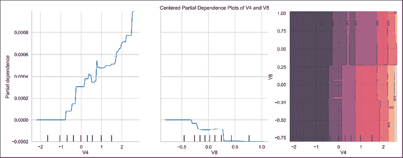

    图 14.39：V4 和 V8 特征的集中部分依赖图，分别和联合展示

    通过联合绘制两个特征的 PDP，我们能够可视化它们之间的交互关系。通过观察*图 14.39*，我们可以得出结论：`V4`特征更为重要，因为在最右侧图中，绝大多数线条是垂直于`V4`轴并且与`V8`轴平行的。然而，由`V8`特征决定的决策线会有所偏移，例如，在`0.25`值附近。

1.  实例化一个解释器并计算 SHAP 值：

    ```py
    explainer = shap.TreeExplainer(xgb)
    shap_values = explainer.shap_values(X)
    explainer_x = explainer(X) 
    ```

    `shap_values`对象是一个`284807`行`29`列的`numpy`数组，包含计算得到的 SHAP 值。

1.  生成 SHAP 汇总图：

    ```py
    shap.summary_plot(shap_values, X) 
    ```

    执行代码片段后会生成如下图表：

    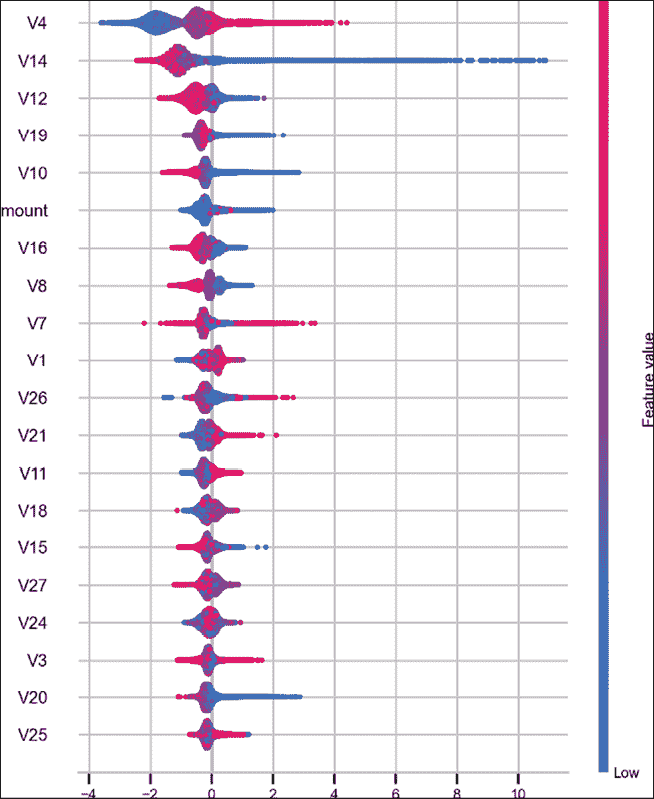

    图 14.40：使用 SHAP 值计算的汇总图

    在查看汇总图时，我们需要注意以下几点：

    +   特征按所有观察值的 SHAP 值绝对值的总和排序。

    +   点的颜色显示该特征对于该观察值是否具有高或低的值。

    +   图表中的横向位置显示该特征值的效应是导致更高还是更低的预测。

    +   默认情况下，图表显示的是`20`个最重要的特征。我们可以使用`max_display`参数调整这个数值。

    +   重叠的点在*y*轴方向上进行了抖动。因此，我们可以感知每个特征的 SHAP 值的分布情况。

    +   与其他特征重要性度量（例如置换重要性）相比，这种类型的图表的优势在于它包含更多的信息，可以帮助理解全局特征重要性。例如，假设某个特征的重要性适中。使用此图，我们可以查看该中等重要性的特征值是否对某些观察的预测有较大影响，但通常对其他预测没有影响。或者它可能对所有预测都有中等大小的影响。

    在讨论了总体考虑因素之后，让我们提及一些来自*图 14.40*的观察结果：

    +   总体而言，`V4`特征（最重要的特征）较高的值有助于提高预测值，而较低的值则导致较低的预测值（观察结果更不可能为欺诈行为）。

    +   `V14`特征对预测的整体影响是负面的，但对于一些特征值较低的观察，其结果却导致更高的预测值。

    另外，我们可以使用条形图展示相同的信息。这样，我们就可以关注特征的重要性汇总，而忽略对特征效应的深入理解：

    ```py
    shap.summary_plot(shap_values, X, plot_type="bar") 
    ```

    执行该代码片段会生成以下图表：

    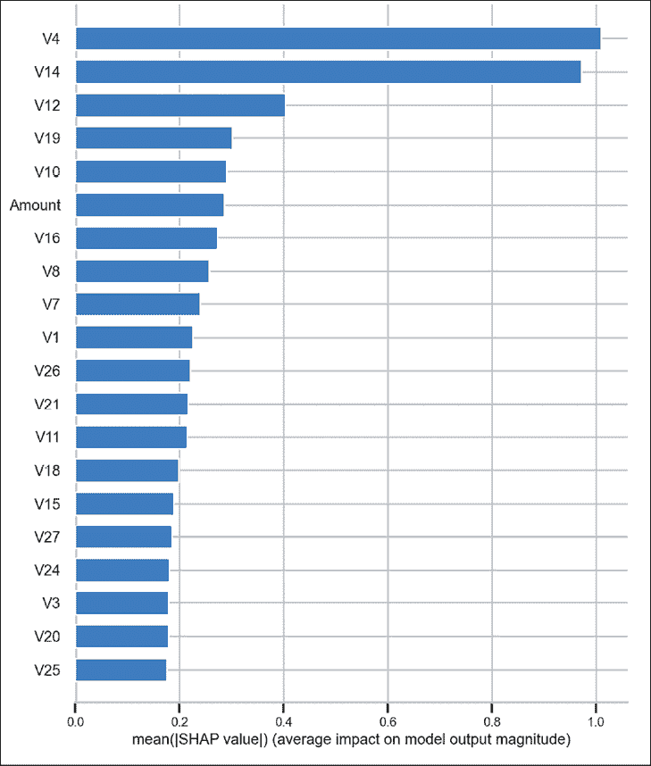

    图 14.41：使用 SHAP 值计算的汇总图（条形图）

    自然地，特征的顺序（它们的重要性）与*图 14.40*中的顺序相同。我们可以将这个图作为替代的置换特征重要性。然而，我们应该牢记其中的基本区别。置换特征重要性基于模型性能的下降（使用选择的度量标准来衡量），而 SHAP 则基于特征归因的大小。

    我们可以使用以下命令获取汇总图的更简洁表示：`shap.plots.bar(explainer_x)`。

1.  定位属于正类和负类的观察结果：

    ```py
    negative_ind = y[y == 0].index[0]
    positive_ind = y[y == 1].index[0] 
    ```

1.  解释这些观察结果：

    ```py
    shap.force_plot(
        explainer.expected_value,
        shap_values[negative_ind, :],
        X.iloc[negative_ind, :]
    ) 
    ```

    执行该代码片段会生成以下图表：

    

    图 14.42：解释属于负类的观察值的（简化版）力图

    简而言之，力图展示了特征如何将预测从基准值（平均预测）推向实际预测。由于该图包含了更多的信息且过宽，无法适应页面，因此我们仅展示了最相关的部分。请参考随附的 Jupyter 笔记本以查看完整图表。

    以下是我们基于 *图 14.42* 可以做出的一些观察：

    +   基准值 (*-8.589*) 是整个数据集的平均预测值。

    +   *f(x) = -13.37* 是此观察值的预测结果。

    +   我们可以将箭头解释为给定特征对预测结果的影响。红色箭头表示预测结果的增加，蓝色箭头表示预测结果的减少。箭头的大小对应于特征影响的大小。特征名称旁边的值显示了特征的值。

    +   如果我们将红色箭头的总长度从蓝色箭头的总长度中减去，就可以得到从基准值到最终预测的距离。

    +   因此，我们可以看到，相较于平均预测，导致预测减少的最大因素是特征 `V14` 的值 -*0.3112*。

    然后我们对正类观察值执行相同的步骤：

    ```py
    shap.force_plot(
        explainer.expected_value,
        shap_values[positive_ind, :],
        X.iloc[positive_ind, :]
    ) 
    ```

    执行该代码片段生成以下图表：

    

    图 14.43：解释属于正类的观察值的（简化版）力图

    与 *图 14.42* 相比，我们可以清楚地看到蓝色特征（负面影响预测，标记为 *lower*）与红色特征（标记为 *higher*）之间的失衡。我们还可以看到，两个图形具有相同的基准值，因为这是数据集的平均预测值。

1.  为正类观察值创建瀑布图：

    ```py
    shap.plots.waterfall(explainer(X)[positive_ind]) 
    ```

    执行该代码片段生成以下图表：

    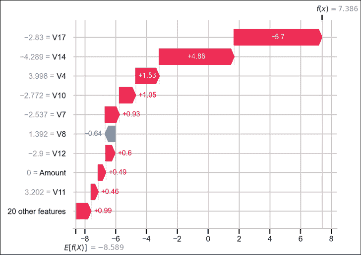

    图 14.44：解释来自正类的观察值的瀑布图

    检查 *图 14.44* 可以发现它与 *图 14.43* 有许多相似之处，因为这两个图表使用稍有不同的可视化方式解释了同一个观察值。因此，解读瀑布图的大部分见解与力图相同。一些细微差别包括：

    +   图表的底部从基准值开始（模型的平均预测值）。然后，每一行显示了每个特征对该特定观察值模型最终预测的正面或负面贡献。

    +   SHAP 通过其边际输出解释 XGBoost 分类器。这意味着 *x* 轴上的单位是对数几率单位。负值表示该观察值为欺诈行为的概率低于 `0.5`。

    +   最不重要的特征被合并为一个联合项。我们可以使用该函数的 `max_display` 参数来控制这一点。

1.  创建 `V4` 特征的依赖图：

    ```py
    shap.dependence_plot("V4", shap_values, X) 
    ```

    执行该代码片段生成以下图表：

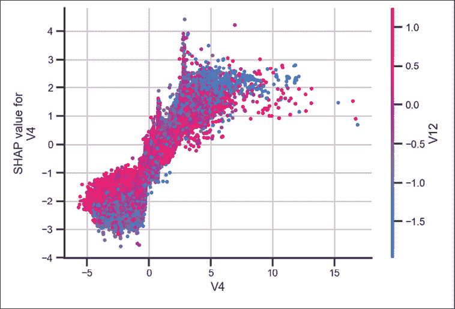

图 14.45：展示 V4 和 V12 特征之间依赖关系的依赖图

关于依赖图的一些要点：

+   它可能是最简单的全局解释图。

+   这种类型的图是部分依赖图的替代方案。虽然 PDP 显示了平均效应，SHAP 依赖图还额外展示了*y*轴上的方差。因此，它包含了关于效应分布的信息。

+   该图展示了特征值（*x*轴）与该特征的 SHAP 值（*y*轴）在数据集中所有观测值中的关系。每个点代表一个单独的观测值。

+   由于我们正在解释一个 XGBoost 分类模型，*y*轴的单位是属于欺诈案件的对数几率。

+   颜色对应于可能与我们指定的特征存在交互效应的第二个特征。它由`shap`库自动选择。文档中指出，如果两个特征之间存在交互效应，它将以一种独特的垂直颜色模式显示。换句话说，我们应该注意观察在同一*x*轴值上，不同颜色之间是否有明显的垂直扩展。

为了完成分析，我们可以提到从*图 14.45*中得到的潜在结论。不幸的是，这将不会非常直观，因为特征已经被匿名化。

例如，假设我们查看特征`V4`值大约为 5 的观测值。对于这些样本，特征`V12`值较低的观测值比特征`V12`值较高的观测值更有可能是欺诈的。

## 它是如何工作的…

在导入库之后，我们训练了一个 XGBoost 模型来检测信用卡欺诈。

在*第 3 步*中，我们使用`PartialDependenceDisplay`类绘制了 ICE 曲线。我们必须提供拟合的模型、数据集（我们使用了训练集）和感兴趣的特征。此外，我们还提供了`subsample`参数，指定了用于绘制 ICE 曲线的数据集中的随机观测值数量。由于数据集有超过*200,000*个观测值，我们任意选择了*5,000*个曲线作为可管理的绘制数量。

我们提到过，计算 ICE 曲线时使用的网格通常由数据集中的所有唯一值组成。`scikit-learn`默认创建一个等距网格，覆盖特征的极值范围。我们可以使用`grid_resolution`参数自定义网格的密度。

`PartialDependenceDisplay`的`from_estimator`方法也接受`kind`参数，可以取以下值：

+   `kind="individual"`—该方法将绘制 ICE 曲线。

+   `kind="average"`—该方法将显示部分依赖图（PDP）。

+   `kind="both"`—该方法将显示 PDP 和 ICE 曲线。

在*第 4 步*中，我们绘制了相同的 ICE 曲线；然而，我们将它们居中于原点。我们通过将`centered`参数设置为`True`来实现这一点。这实际上是从目标向量中减去平均目标值，并将目标值居中于`0`。

在*第 5 步*中，我们绘制了部分依赖图，同样使用了`PartialDependenceDisplay.from_estimator`。由于 PDP 是默认值，我们无需指定`kind`参数。我们还展示了在同一图中绘制 PDP 和 ICE 曲线的结果。由于绘制双向 PDP 需要相当长的时间，我们从训练集中随机抽取了（不放回）*20,000*个样本。

需要注意的是，`PartialDependenceDisplay`将分类特征视为数值特征。

部分依赖图（PDP）也可以在`pdpbox`库中找到。

在*第 6 步*中，我们使用相同的`PartialDependenceDisplay`功能创建了一个更复杂的图形。在一个图中，我们绘制了两个特征（`V4`和`V8`）的单独 PD 图，以及它们的联合（也叫双向）PD 图。为了获得最后一个图，我们需要将这两个感兴趣的特征作为元组提供。通过指定`features=["V4", "V8", ("V4", "V8")]`，我们表明希望绘制两个单独的 PD 图，然后绘制这两个特征的联合图。当然，没有必要将所有`3`个图都绘制在同一图中。我们可以使用`features=[("V4", "V8")]`只绘制联合 PDP。

另一个有趣的角度是叠加两个部分依赖图，它们是针对相同特征但使用不同的机器学习模型计算的。然后，我们可以比较不同模型之间对预测的预期影响是否相似。

我们集中于绘制 ICE 曲线和部分依赖线。然而，我们也可以在不自动绘制它们的情况下计算这些值。为此，我们可以使用`partial_dependence`函数。它返回一个包含`3`个元素的字典：用于创建评估网格的值、数据集中所有样本的所有网格点的预测值（用于 ICE 曲线）以及每个网格点的预测值的平均值（用于 PDP）。

在*第 7 步*中，我们实例化了`explainer`对象，这是用于通过`shap`库解释任何机器学习/深度学习模型的主要类。更准确地说，我们使用了`TreeExplainer`类，因为我们尝试解释的是 XGBoost 模型，即基于树的模型。然后，我们使用实例化的`explainer`的`shap_values`方法计算了 SHAP 值。为了说明模型的预测，我们使用了整个数据集。在这一点上，我们也可以选择使用训练集或验证/测试集。

根据定义，SHAP 值的计算非常复杂（属于 NP 难问题）。然而，得益于线性模型的简单性，我们可以从部分依赖图中读取 SHAP 值。有关此主题的更多信息，请参阅`shap`文档。

在*第 8 步*中，我们首先使用全局解释方法。我们使用`shap.summary_plot`函数生成了两种版本的总结图。第一个是每个特征的 SHAP 值的密度散点图。它结合了整体特征重要性和特征效应。我们可以利用这些信息评估每个特征对模型预测的影响（也包括观察级别的影响）。

第二个图表是一个条形图，显示了整个数据集中绝对 SHAP 值的平均值。在这两种情况下，我们都可以使用图表来推断通过 SHAP 值计算的特征重要性；然而，第一个图表提供了更多的信息。为了生成这个图表，我们在调用`shap.summary_plot`函数时必须额外传入`plot_type="bar"`参数。

在查看了全局解释后，我们希望查看局部解释。为了使分析更有趣，我们想要展示属于正类和负类观察的解释。这就是为什么在*第 9 步*中我们识别了这些观察的索引。

在*第 10 步*中，我们使用`shap.force_plot`来解释两个观察的观察级预测。在调用该函数时，我们必须提供三个输入：

+   基准值（整个数据集的平均预测值），该值在解释器对象中可用（`explainer.expected_value`）

+   特定观察的 SHAP 值

+   特定观察的特征值

在*第 11 步*中，我们还创建了一个观察级别的图表来解释预测结果；然而，我们使用了略微不同的表示方法。我们创建了一个瀑布图（使用`shap.plots.waterfall`函数）来解释正向观察。值得一提的是，该函数需要一个`Explanation`对象的单行作为输入。

在最后一步，我们使用`shap.dependence_plot`函数创建了一个 SHAP 依赖图（全局级别的解释）。我们需要提供感兴趣的特征、SHAP 值和特征值。作为被考虑的特征，我们选择了`V4`，因为它在总结图中被确定为最重要的特征。第二个特征（`V12`）由库自动确定。

## 还有更多内容……

在本节中，我们只提供了 XAI 领域的一个初步了解。随着可解释方法在实践者和企业中的重要性日益增加，这一领域也在不断发展壮大。

另一种流行的 XAI 技术被称为 LIME，代表**局部可解释模型无关解释**。它是一种观察级别的方法，用于以可解释且忠实的方式解释任何模型的预测结果。为了获得解释，LIME 通过可解释模型（如带正则化的线性模型）在局部近似选择的难以解释的模型。可解释模型是在原始观察的微小扰动（带有附加噪声）上进行训练，从而提供良好的局部近似。

**Treeinterpreter** 是另一种观察级别的 XAI 方法，适用于解释随机森林模型。其思路是利用底层的树结构来解释每个特征对最终结果的贡献。预测被定义为每个特征贡献的总和，以及由基于整个训练集的初始节点给出的平均值。通过这种方法，我们可以观察预测值如何沿着决策树中的预测路径（每次分裂后）变化，并结合导致分裂的特征信息，也就是预测变化的原因。

自然地，还有许多其他可用的方法，例如：

+   假设不变轮廓

+   分解图

+   累积局部效应（ALE）

+   全局代理模型

+   反事实解释

+   锚点

我们建议调查以下专注于人工智能可解释性的 Python 库：

+   `shapash`—将 SHAP/LIME 的各种可视化结果编译为交互式仪表板 Web 应用。

+   `explainerdashboard`—准备一个仪表板 Web 应用程序，用于解释与 `scikit-learn` 兼容的机器学习模型。该仪表板涵盖模型性能、特征重要性、特征对单个预测的贡献、“如果”分析、PDP、SHAP 值、单个决策树的可视化等。

+   `dalex`—该库涵盖了各种 XAI 方法，包括变量重要性、PDP 和 ALE 图、分解图和 SHAP 瀑布图等。

+   `interpret`—InterpretML 库由微软创建。它涵盖了流行的黑箱模型解释方法（如 PDP、SHAP、LIME 等），并允许训练所谓的玻璃箱模型，这些模型是可解释的。例如，`ExplainableBoostingClassifier` 被设计为完全可解释，但同时提供与最先进算法相似的准确性。

+   `eli5`—一个可解释性库，提供各种全局和局部解释。它还涵盖文本解释（由 LIME 提供支持）和置换特征重要性。

+   `alibi`—一个专注于模型检查和解释的库。它涵盖了诸如锚点解释、集成梯度、反事实示例、对比解释方法以及累积局部效应等方法。

## 另见

额外资源可以在此获取：

+   Biecek, P., & Burzykowski, T. 2021\. *解释性模型分析：探索、解释和检查预测模型*。Chapman and Hall/CRC。

+   Friedman, J. H. 2001\. “贪婪函数逼近：梯度提升机。” *统计年鉴*：1189–1232。

+   Goldstein, A., Kapelner, A., Bleich, J., & Pitkin, E. 2015\. “窥视黑盒：通过个体条件期望的可视化图形展示统计学习。” *计算与图形统计学杂志*，24(1)：44–65。

+   Hastie, T., Tibshirani, R., Friedman, J. H., & Friedman, J. H. 2009\. *统计学习要素：数据挖掘、推理与预测*，2：1–758）。纽约：Springer。

+   Lundberg, S. M., Erion, G., Chen, H., DeGrave, A., Prutkin, J. M., Nair, B., ... & Lee, S. I. 2020\. “从局部解释到全局理解：树的可解释 AI。” *自然机器智能*，2(1)：56–67。

+   Lundberg, S. M., Erion, G. G., & Lee, S. I. 2018\. “树集成方法的一致性个性化特征归因。” *arXiv 预印本 arXiv:1802.03888*。

+   Lundberg, S. M., & Lee, S. I. 2017\. 一种统一的模型预测解释方法。*神经信息处理系统进展*，*30*。

+   Molnar, C. 2020\. *可解释的机器学习*。 [`christophm.github.io/interpretable-ml-book/`](https://christophm.github.io/interpretable-ml-book/)。

+   Ribeiro, M.T., Singh, S., & Guestrin, C. 2016\. “我为什么要相信你？：解释任何分类器的预测。” *第 22 届 ACM SIGKDD 国际知识发现与数据挖掘会议*论文集。ACM。

+   Saabas, A. *解释随机森林*。 [`blog.datadive.net/interpreting-random-forests/`](http://blog.datadive.net/interpreting-random-forests/)。

# 总结

在本章中，我们涵盖了各种有助于改进几乎所有机器学习（ML）或深度学习（DL）项目的有用概念。我们从探讨更复杂的分类器开始（这些分类器也有相应的回归问题变种），考虑了对分类特征编码的替代方法，创建了堆叠集成，并研究了可能解决类别不平衡的方案。我们还展示了如何使用贝叶斯方法进行超参数调优，以便比使用更流行但信息不足的网格搜索方法更快地找到最优的超参数组合。

我们还深入探讨了特征重要性和 AI 可解释性的话题。通过这种方式，我们可以更好地理解所谓的黑盒模型中发生的事情。这不仅对从事 ML/DL 项目的人至关重要，对任何业务相关方也同样如此。此外，我们可以将这些见解与特征选择技术结合起来，可能进一步提升模型的性能或减少其训练时间。

自然，数据科学领域不断发展，每天都有越来越多有用的工具可供使用。我们无法涵盖所有工具，但在下面您可以找到一份简短的库/工具列表，您可能会在项目中找到有用的资源：

+   `DagsHub`—一个类似于 GitHub 的平台，但专门为数据科学家和机器学习从业者量身定制。通过集成 Git、DVC、MLFlow 和 Label Studio 等强大的开源工具，并为用户完成 DevOps 的繁重工作，您可以轻松地构建、管理和扩展您的机器学习项目——一切都在一个地方。

+   `deepchecks`—一个开源的 Python 库，用于测试机器学习/深度学习模型和数据。我们可以在整个项目中使用该库进行各种测试和验证需求；例如，我们可以验证数据的完整性，检查特征和目标的分布，确认数据分割是否有效，并评估模型的性能。

+   `DVC`—一个开源的机器学习项目版本控制系统。通过**DVC**（**数据版本控制**），我们可以将不同版本的数据（无论是表格数据、图片还是其他类型）和模型信息存储在 Git 中，同时将实际数据存储在其他地方（如 AWS、GCS、Google Drive 等云存储）。使用 DVC，我们还可以创建可复现的数据管道，同时存储数据集的中间版本。为了简化使用，DVC 采用与 Git 相同的语法。

+   `MLFlow`—一个开源平台，用于管理机器学习生命周期。它涵盖了实验、可复现性、部署和模型注册等方面。

+   `nannyML`—一个开源的 Python 库，用于部署后数据科学。我们可以使用它来识别数据漂移（训练模型时使用的数据与生产环境推断时特征分布的变化）或估计在没有真实标签的情况下模型的性能。后者对于那些真实标签在长时间后才可获得的项目尤其有趣，例如，预测贷款违约后几个月的情况。

+   `pycaret`—一个开源的低代码 Python 库，自动化机器学习工作流中的许多组件。例如，我们可以通过极少的代码训练和调优多个分类或回归任务的机器学习模型。它还包含用于异常检测或时间序列预测的独立模块。
