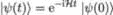
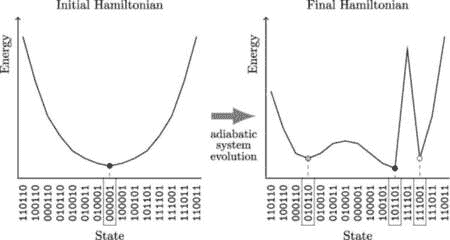
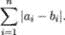
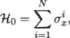

## 2

绝热量子计算

搜索算法是计算机科学中最重要和最基础的算法之一，最基本的例子就是在包含*N*个项目的列表中找到一个特定项。已知经典算法在时间上与问题规模*N*成正比解决这个问题，当*N*变得非常大时，问题变得非常难以处理。1996 年，格罗弗（Grover）[117]设计了一种量子算法，可以在时间上实现二次加速来解决此类搜索问题，但显然在那个时候量子计算机尚不存在。不久之后，法希（Farhi）、戈德斯通（Goldstone）、古特曼（Gutmann）和西普瑟（Sipser）[98]通过绝热演化的量子计算方法将格罗弗问题重新表述为可满足性问题。

另一个难以用经典方法解决的难题是组合优化问题。卡车调度问题最早由丹齐格（Dantzig）和拉姆塞尔（Ramser）提出[78]，旨在寻找最佳的送货卡车路线，它是著名的旅行商问题（TSP）的推广。其他同类著名的优化问题还包括划分问题和二进制整数线性规划，等等。精确算法仅对小规模问题有效。启发式算法和元启发式算法（例如，进化搜索启发式算法，如遗传算法和粒子群优化算法）通常更适用于实际应用，因为现实世界中的问题规模通常较大。由于搜索时间随着问题规模呈指数增长，因此一直有强烈的动力寻找替代方法来解决这些具有广泛实际应用的问题，尤其是在金融领域。绝热量子计算（AQC）准备进入舞台。

### 2.1 计算问题的复杂度

在本章及随后的章节中，我们将常常讨论对经典计算机来说难以处理，但可以通过量子算法和硬件高效解决的计算问题。我们如何量化计算问题的难度呢？一种方法是从计算资源的角度来分析问题：解决这些问题需要多少时间和内存？这引出了*复杂度类*的概念。以下是一些重要的示例：

+   P 类（*多项式*）是指可以通过确定性图灵机在多项式时间内解决的决策问题的集合。

+   NP 类（*非确定性多项式*）是指可以通过非确定性图灵机在多项式时间内解决的决策问题的集合。

这些定义要求我们进一步指定以下对象：

+   *决策问题*是指可以将输入值表示为是/否问题的计算问题。

+   *多项式时间*意味着算法的运行时间在算法输入的大小上被一个多项式表达式所上界。

+   *图灵机* 是一种计算的抽象模型，其通用性足以涵盖任何计算机问题。

+   *确定性图灵机* 是最基本类型的图灵机，它使用一组固定的规则来确定其未来的操作。

+   *非确定性图灵机* 是一种能够从给定状态探索多个备选未来操作的图灵机。

在计算难度方面，我们将特别关注那些 *NP 完全* 和 *NP 难* 的问题。

当一个问题是 NP 完全问题时

1.  每个解的正确性都可以在多项式时间内验证，且蛮力搜索算法可以通过尝试所有可能的解来找到一个解；

1.  它可以用来模拟其他每个我们能够在多项式时间内验证其解是否正确的问题。

NP 完全问题是最困难的，它们的解可以快速（在多项式时间内）被验证。如果我们能够快速找到某些 NP 完全问题的解，那么我们就能快速找到每个其他问题的解，只要给定的解能够容易地被验证。

当 NP 中的每个问题都能在多项式时间内归约到该问题时，该问题是 NP 难的。或者说，当每个 NP 完全问题都能在多项式时间内归约到该问题时，该问题是 NP 难的。由于 NP 中的每个问题都能在多项式时间内归约到一个 NP 完全问题，因此第二个定义也意味着第一个定义。

NP 难类不限于决策问题，还包括搜索问题和优化问题。这意味着 NP 难问题不必属于复杂度类 NP。

可以说，计算机科学中最重要的未解问题是 P = NP 是否成立。尽管尚未证明，但广泛认为 P *≠* NP。图 2.1 展示了两种情形下复杂度类之间的关系。

图 2.1：P、NP、NP 完全和 NP 难问题集之间关系的示意图。

### 2.2 绝热量子计算的原理

绝热量子优化是一种有前景的方法，用于解决 NP 完全和 NP 难问题 [97]。假设优化问题的解被编码在量子哈密顿量 ℋ[F] 的基态（即对应于最低本征值的量子态）中。根据量子力学的第二公设（第 1.2.2 节），量子系统的动力学完全由其哈密顿量来指定。如果我们知道如何将我们想要最小化的目标函数编码到量子系统的哈密顿量中，那么找到哈密顿量的基态就等同于找到最小化目标函数的决策变量集。

作为一个简单的例子，考虑一个函数 *f* ：{0*,*1}^n →ℝ，它需要被最小化，并且取哈密顿量

显然，对于任何 z[0] ∈{0*,*1}^n，

由于计算基（）[z∈{0,1}^n] 是正交归一的。因此，任何 z[0] ∈{0*,*1}^n 都是 ℋ[F] 的本征态，具有本征值 *f*(z[0])。因此，最小化 *f* 显然等同于找到哈密顿量 ℋ[F] 的最低本征值。

让我们进一步假设有另一个量子哈密顿量 ℋ[0]，其基态易于找到并且容易在实验设置中准备。那么，如果我们将量子系统准备在 ℋ[0] 的基态，然后绝热地（缓慢地）改变系统哈密顿量 ℋ(*t*)，从 *t* = 0 时的 ℋ[0] 到 *t* = *τ* 时的 ℋ[F]，根据以下时间演化：

|  |  |
| --- | --- |

然后，如果 *τ* 足够大，并且 ℋ[0] 与 ℋ[F] 不对易，则量子系统将始终保持在基态，按照量子绝热定理进行。测量 *t* = *τ* 时的量子状态将产生我们问题的解（一个编码二进制决策变量最优配置的比特串）。

我们在第 2.2.1 节中提供了详细的绝热量子优化算法解释以及量子绝热定理的说明。就与最佳经典算法相比，可能实现的量子加速而言，对于大小为 *N* 的问题，量子优化器在时间上按以下比例解决 NP-困难的组合优化问题：

|  |  |
| --- | --- |

随着 *N* 趋向无穷大，对于正系数 *β* 和 *γ*，它们可能小于已知的经典算法 [197]。事实上，早期实现绝热量子计算原理的量子退火器实验展示了数个数量级的量子加速（忽略各种计算开销，随着量子退火技术的成熟，这些开销可能会减少） [175，201，296]。

系数 *γ* 迄今为止是最重要的。这可以通过以下表格来说明，表中提供了计算时间的估算值，作为问题规模的函数。假设单次操作需要 1 微秒，且操作次数按 2^N（“经典基准”）或 e^()（“量子优化”时 *γ* = 0*.*5）来变化，我们得到以下结果：

| *N* | 2^(*N*) | e^() |
| --- | --- | --- |
| 10 | 1 毫秒 | 0.024 毫秒 |
| 50 | 35.7 年 | 1.2 毫秒 |
| 100 | 4 × 10¹⁶ 年 | 22 毫秒 |
| 500 | 10¹³⁷ 年 | 1.4 小时 |

表 2.1：计算时间与问题规模的关系。

绝热系统演化持续时间 *T* 的渐近估计是问题规模的指数函数，它来源于系统应始终保持在局部哈密顿量的基态这一要求。随着基态与第一激发态之间的能量间隙变小，系统演化过程应相应减缓。

然而，如果我们仅对近似解感兴趣（并愿意接受所得到解的质量有所下降），我们可以预期，当 *N* 变大时，NP-困难的组合问题能够在多项式时间内得到解决，且解的时间与 *N*^γ 成正比，其中 *γ >* 0 [23, 253]。

绝热量子计算的优势在于它能够通过物理系统的自然演化解决困难的计算问题。

#### 2.2.1 量子绝热定理

在薛定谔方程 (1.2.2) 中（归一化时取ℏ = 1）且哈密顿量 ℋ 恒定的情况下，如果系统从  开始，则解会发展到

在时刻 *t* ≥ 0 时。这尤其意味着，任何哈密顿量 ℋ 的本征态 ，满足 ℋ = *λ*[0] 对某个本征值 *λ*[0]，将通过薛定谔方程从  演化到

即本征态仅获得一个相位 e^(−iλ[0]t)，且不同本征态之间不存在时间上的跃迁。我们现在考虑的更有趣的情况是时间依赖的哈密顿量。

再次考虑薛定谔方程 (1.2.2)（归一化时取ℏ = 1），时间区间为 [0*,τ*]，其中哈密顿量 ℋ 是时间的函数。时间变化 *t*(⋅)，使得 *t*(0) = 1 且 *t*(1) = *τ*，得出

|  |  |
| --- | --- |

在单位时间区间 [0*,*1] 内。需要注意的是，哈密顿量 ℋ 与时间区间 *τ* 本身无关。特别是，这排除了具有多个时间尺度的哈密顿量，如在 [206] 中所述。在这里，我们主要关注的是（稍微推广的）形式为 (2.2) 的哈密顿量，

|  |  |
| --- | --- |

对于给定的两个哈密顿量 ℋ[0] 和 ℋ[F]，其中 *r*(⋅) 是一个连续的绝热演化路径，从 *r*(0) = 1 递减到 *r*(1) = 0。标准的绝热调度由 *r*(*s*) = 1 − *s* 给出。

量子绝热定理的核心内容如下。假设系统从 ℋ[0] 的基态开始。如果哈密顿量的时间演化足够缓慢，则系统将保持在随时间演化的哈密顿量的基态，直到时间 1。该定理最初由 Born 和 Fock 提出 [41]，并通过 Kato [156] 使用线性算符扰动理论进行了推广。

为了正确陈述，设  为施罗丁格方程 (2.2.1) 的解，因此对于任意 *s* ∈ [0*,*1]，存在一个单位算符 𝒰，使得

考虑形式为 (2.2.1) 的哈密顿量和时间变化 *t*(*s*) = *sτ*（因此 *t*′(*s*) = *τ*），使得施罗丁格演化动态可以写作

|  |  |
| --- | --- |

在区间 [0*,*1] 上，对于每个 *t* ∈ [0*,*1]，我们用  表示 ℋ[t] 的基态。

我们最终呈现以下量子绝热定理的版本，该定理由 Jansen、Seiler 和 Ruskai 提出 [149]。我们回顾一下，如果存在与某个特征值关联的唯一特征态，则该特征值称为非简并的。对于任意 *t* ∈ [0*,*1]，给定哈密顿量 ℋ(*t*)，我们用 Δ[t] 表示 ℋ[t] 的最低特征值和下一个特征值之间的（严格正的）能隙。

**定理 7**（量子绝热定理）。*假设对于任意* *t* ∈ [0*,*1] *哈密顿量 ℋ(*t*) 具有非简并的基态，并且存在* *𝜀 >* 0 *使得*

![2 { ∥ℋ ′(0)∥ ∥ℋ ′(1)∥ ∫ 1[( ) ∥ℋ′(s)∥2 ∥ℋ ′′(s)∥] } -- c0----2---+ c1----2---+ 3c21 + c1 + c3 ----3---+ c2----2--- ds ≤ τ. 𝜀 Δ0 Δ 1 0 Δ s Δs ](img/file275.jpg)

*然后，从状态*  = * 开始系统，*施罗丁格演化在时间* 1 *时给出一个状态*  *满足*

这种量化版本的绝热定理提供了一个估计，说明时间范围 *τ* 需要多大才能达到足够的精度 *𝜀*。例如，考虑插值方案 (2.2.1)，其中 *r*(*s*) = 1 − *s*，因此

因此，ℋ′(*s*) = −ℋ[0] + ℋ[F] 且 ℋ′′(*s*) = 0。在这种情况下，定理 7 中的定量估计简化为以下形式：

**推论 1**。*在定理* *7* *中的相同假设下，并且采用上述插值方案，定量估计*

*并且* Δ := min[s∈[0,1]]Δ[s]*，再次确保* ≤ *𝜀**。

这个推论特别突出了谱隙 Δ的重要性。它越小，等待绝热特性变得高效的时间就越长。量子绝热定理有不同的版本，每个版本有稍微不同的假设。Avron 和 Elgart [19] 以及 Bornemann [40] 证明了没有谱隙条件的弱形式。

量子绝热定理的证明相当技术性且有多个版本，每个版本的证明略有不同。然而，它们都依赖于分析对应于哈密顿量的演化算符 𝒰(⋅)，显然它能够解决

|  |  |
| --- | --- |

从恒等式出发，特别是需要构造一个绝热算符 𝒰A，它解决相同的薛定谔方程，将 ℋ(⋅)替换为其绝热版本。

| ![ -i ′ ℋA (t) = ℋ (t)+ τ [𝒫 (t),𝒫(t)], ](img/file284.jpg) |  |
| --- | --- |

其中 𝒫(*t*)表示投影算符，投影到 ℋ(*t*)的期望本征态。然后，证明跟随通过展示随着 *τ*增大，𝒰[A]和𝒰变得足够接近。

通过将量子系统的绝热极限的几何特性与向量束中的平行运输联系起来，Berry [33] 和 Simon [267] 的研究催生了几何量子计算。Van Dam、Mosca 和 Vazirani [291] 证明了可以构造出一个离散时间的演化算符 𝒰的近似，且只需要多项式时间的开销。

量子绝热定理为绝热量子计算提供了理论背景。

#### 2.2.2 优化与元启发式算法

元启发式算法用于寻找“一般”优化问题的“良好”近似解。通俗来说，元启发式算法是一种搜索策略，通过在某些点评估优化函数 *f*(⋅)，来探索优化过程。存在无数的元启发式算法，它们根据函数评估的历史决定接下来（在哪个 x 值）评估 *f*(x)，但所有这些算法都基于同一基本原则，即好的解往往靠近其他好的解，换句话说，优化表面具有一定的平滑性。这揭示了所有元启发式算法必须权衡的探索与开发的取舍。

元启发式算法可以通过逐步下降来利用其“当前”状态。风险在于，这可能会返回一个（可能并不太好的）局部最小值。另一方面，元启发式算法可以通过进行“较大移动”来探索优化表面，以发现是否有其他部分的优化表面返回更小的*f*(x)值。在这种情况下，可能会找到全局最小值，但返回的 x 值可能只是实际全局最小值的一个相当差的近似值。

##### 模拟退火

模拟退火是一种受热退火启发的元启发式算法。考虑在某个定义域 *D* ⊂ℝ^n 上最小化给定函数 *f* : *D* →ℝ。算法的工作流程如下：

1.  从初始值 x ∈ *D* 开始，并计算 *f*(x)。

1.  随机选择一个邻居 y 作为 x 的邻居，并计算 *f*(y)。

1.  如果 *f*(y) *< f*(x)，则设 x = y。

1.  否则，保持 x 不变或设 x = y。

1.  重复直到达到结束标准。

关键步骤是步骤 4 中的随机选择，旨在避免陷入局部最小值，并且至少在算法的开始阶段，偏向于探索而非开发利用。在 *f*(y) ≥ *f*(x) 的情况下，我们将以概率 yx 进行切换。

|  |  |
| --- | --- |

其中，*τ* 充当热退火温度：当系统较热时，粒子会移动（探索），而当需要精细化（开发）时，它会冷却下来。

##### 量子退火与量子隧穿

量子退火将模拟退火的思想与量子绝热定理结合，通过考虑时间依赖的哈密顿量。

|  |  |
| --- | --- |

其中，ℋ[F] 是最终的**纵向场**哈密顿量，其基态编码了优化问题的最优解，ℋ[0] 是初始的**横向场**哈密顿量，假设与 ℋ[F] 不对易。函数 Γ 是**横向场系数**，它充当热退火的温度，即一个随着 *t* 接近最终时间时逐渐趋近于零的连续下降函数。根据量子绝热定理（定理 7），如果系统处于 ℋ(0) 的基态，并且 ℋ(⋅) 随时间缓慢演化，那么它将始终保持在每个时刻的 ℋ(*t*) 基态，因此会收敛到 ℋ[F] 的基态（从而收敛到问题的最优解）。顺便提一下，模拟退火框架中跨越局部山丘的量子等价物是量子隧穿。

图 2.2：量子退火求解优化问题的示意图。目标是通过绝热演化将系统保持在ℋ(t)的基态。

图 2.2 说明了量子退火在解决优化问题中的实际应用。我们首先将系统置于某个易于准备的横向场哈密顿量 ℋ[0] 的基态中。然后，初始哈密顿量缓慢（绝热地）转变为最终的纵向场哈密顿量 ℋ[F]。如果系统在整个量子退火过程中始终保持在局部哈密顿量的基态，那么读取结果将为我们提供与最终哈密顿量中编码的目标函数全局最小值对应的二进制决策变量（量子比特值）的最优配置。

回顾以下两个（比特）字符串之间的哈明距离定义：

**定义 8.** 设 a := (*a*[1]*,…,a*[n]) 和 b := (*b*[1]*,…,b*[n]) 表示两个比特字符串，属于 {0*,*1}^n。a 和 b 之间的哈明距离定义为

在寻找全局最小值的过程中，有两个重要的机制：热退火和量子隧穿。在图 2.2 中，最终哈密顿量在状态 101101 处具有全局最小值，而在状态 `010110` 和 `111001` 处具有两个局部最小值。尽管两个局部最小值的能量相同，但它们与全局最小值的哈明距离不同。状态 `010110` 和全局最小值状态 `101101` 之间的哈明距离是 5：需要翻转 5 位才能从这个局部最小值状态到达全局最小值。状态 `111001` 和全局最小值之间的哈明距离是 2。然而，由于它们之间有高能量障碍，从状态 `111001` 到全局最小值状态 `101101` 更为困难，而从状态 `010110` 到全局最小值则相对简单：通过热退火，可以通过一个相对较低且平坦的能量障碍进行一系列连续的比特翻转。幸运的是，我们还拥有量子隧穿效应，这使得系统能够穿越高但窄的能量障碍。一次性翻转 5 位（宽障碍）对于量子隧穿来说可能是一个具有挑战性的任务，但翻转 2 位（窄障碍）则是一个可以以足够高的概率发生的过程。

量子退火是绝热量子计算原理的实际实现，可以与其经典对手——模拟退火进行对比。量子退火的强大来自两个来源：热退火和量子隧穿。正是这些经典和量子效应的结合，使得量子退火能够实现卓越的性能。

### 2.3 AQC 的实现

我们如何构建量子退火器？它们的物理实现是什么？我们能找到一种合适的度量标准来客观量化它们的性能吗？我们在它们的发展过程中是否观察到稳定的进展？在本节中，我们将提供这些问题的答案，这些答案是二十年来深入研究的成果。

#### 2.3.1 量子退火的简短历史

第一个主要的专利由 Amin 和 Steininger 为 D-Wave Systems 设计[11]，并导致了开创性的论文[151]。从那时起，许多研究探讨了 D-Wave 计算机的价值，特别是 McGeoch 和 Wang[211]，他们证明了在早期的 D-Wave 处理器（D-Wave Two，512 量子比特）上针对特定问题的显著加速。此后，更多的实验跟进了这一早期研究，其中有两个结果，毋庸置疑，它们从许多其他有趣的发现中脱颖而出。

首先，D-Wave 量子退火器的性能已经通过在 D-Wave Two [38]上的实验确立了量子隧穿的贡献。观察到了多量子比特隧穿，并且实验表明它在可编程量子退火器中发挥了计算作用。

然后，Denchev *et al.* [83] 在一个精心设计的、具有高且窄能量屏障并通过这些屏障将局部极小值分开的问题上，在 1,152 量子比特的 D-Wave 2X 处理器上，相对于经典基准（模拟退火），实现了 8 个数量级的加速。对于具有 945 个变量的实例，D-Wave 2X 量子退火器的 99%成功概率的时间比在单个处理器核心上运行的模拟退火快了 1 亿倍。

此外，Venturelli 和 Kondratyev 通过在较新的 2,048 量子比特 D-Wave 2000Q 处理器上执行正向和反向量子退火，解决了一个完全连接图问题[175，296]。第三章提供了这一用例的详细描述。

截至撰写本文时，最先进的 D-Wave 机器是 5,760 量子比特的 Advantage 系统，它还具有更低的噪声和更好的量子比特连接性——一个物理量子比特可以直接连接最多 15 个其他物理量子比特，而在 D-Wave 2000Q 中，一个物理量子比特最多只能与 6 个其他物理量子比特连接[92]。因此，表示二进制变量的逻辑量子比特由更短且更稳定的物理量子比特链组成。例如，对于问题规模*N* = 64（对应于可以嵌入 D-Wave 2000Q 的最大完全连接图），D-Wave 2000Q *Chimera* 图的链长为 17，而 Advantage *Pegasus* 图的链长仅为 7。

有趣的是，量子计算算法促使了经典算法的密集改进，并且最近在优化经典算法方面的进展证明[259]，它们至少能够与 D-Wave 机器匹敌。

#### 2.3.2 D-Wave 量子退火器的跨代比较

D-Wave 量子退火器的技术进展已被 Pokharel *等人* [235]研究过。研究了四代 D-Wave 量子退火器在解决一类参数化调度问题集合中的表现。这些问题是 NP 难的，并且有许多实际应用。

量子退火器的性能通过一种叫做“解决时间”（TTS）的指标来衡量。在基准测试研究中，使用量子退火器多次运行收集的数据来计算给定可调参数配置下找到基态解的概率。这个概率由以下公式给出：

|  |  |
| --- | --- |

等效 TTS 定义为在成功概率为 *α* 的情况下，至少一次获得基态解所需的期望时间，计算公式为：

|  |  |
| --- | --- |

其中 *t*[run] 是量子退火器单次运行的退火时间，*α* 默认取值为 99%。

由于调度问题是 NP 难的，TTS 应该在渐近极限下随着问题大小 *N* 指数级增长，如公式(2.2)所示，*γ* = 1。这是一个关于参数 *β*（缩放指数）取什么值最能符合实验结果的问题。

|  |  |
| --- | --- |

对于某些常数 *T*[0] *>* 0。正如在[235]中所确定的，缩放指数从 D-Wave Two 的 1*.*01 到 D-Wave Advantage 的 0*.*17 不等。

为了说明这种改进的规模，我们设定 *N* = 10，并且对于两种情况（*β* = 1*.*01 和 *β* = 0*.*17），TTS = 100 微秒。这产生了表 2.2 中所示的 TTS 作为 *N* 的函数的以下显著结果：

| *N* | TTS (*β* = 1*.*01) | TTS (*β* = 0*.*17) |
| --- | --- | --- |
| 10 | 100 微秒 | 100 微秒 |
| 15 | 16 毫秒 | 234 微秒 |
| 20 | 2.4 秒 | 547 微秒 |
| 25 | 6.3 分钟 | 1.3 毫秒 |
| 30 | 16.5 小时 | 3.0 毫秒 |

表 2.2：TTS 作为问题大小 *N* 的函数，适用于不同的缩放指数值。

#### 2.3.3 量子退火器的物理实现

量子退火机是一种通过首先指定具有容易计算的基态的初始哈密顿量，然后慢慢演化到最终问题哈密顿量的设备。硬件方面，为了确保量子相干性，系统处于封闭环境中，远离外部磁源，并保持在极低的温度下。系统的状态被视为量子比特的叠加态，每个量子比特都通过超导环表示，从而量子比特的状态定义为环中的电流方向。在计算过程中，电流的方向是未知的，但当系统解相干（由于观测或噪声）时，电流方向变得已知。每个量子比特的自旋方向通过施加在环上的磁场物理表示，磁场作为噪声可能扰动量子比特的自旋。量子比特之间还通过铁磁性（反铁磁性）耦合相连接，迫使它们的自旋朝同一方向或相反方向排列。

D-Wave 量子退火机依赖于哈密顿量的 Ising 公式化。这一做法得到了验证，因为 Barahona [24] 显示，求解 Ising 自旋玻璃的基态是 NP-hard 的。这意味着任何 NP 完全问题都可以通过多项式时间复杂度的开销转化为 Ising 自旋玻璃问题（参见第 2.1 节）。从数学上讲，优化问题被公式化为代价函数的最小化问题。

|  |  |
| --- | --- |

其中 s := (*s*[1]*,…,s*[N]) 是二进制决策变量的向量（经典自旋变量取值 {−1*,*+1}），而 (*g*[i])[i=1,…,N] 和 (*J*[ij])[1≤i<j≤N] 是编码优化问题参数的系数。

根据量子力学中自旋的描述，我们需要将经典自旋变量替换为相应的算符——保利算符 *σ*[x]、*σ*[y] 和 *σ*[z]（它们的矩阵表示请参见第 6.3.3 节）。然后，*问题* 或 *最终* 哈密顿量呈现以下 Ising 形式 [147]：

|  |  |
| --- | --- |

其中 *g*[i] 是施加在量子比特 *i* 上的偏置，而 *J*[ij] 是量子比特 *i* 和 *j* 之间的耦合。

*初始* 哈密顿量的形式为

|  |  |
| --- | --- |

其中算符 *σ*[x]（见第 6.3.3 节）是量子 NOT 门，用于翻转量子比特的状态：

回忆在 (1.2.3) 中定义的量子态  和 ，我们得到

| NOT | = NOT +  =  +  =  |
| --- | --- |
| NOT | = NOT− = − = −*,* |

因此， 和  是两个本征态。

初始哈密顿量的本征态（2.3.3）是所有单独量子比特的状态和的等权重叠加：

![[ ]⊗N √1-(|0⟩+ |1⟩) . 2 ](img/file327.jpg)

哈密顿量ℋ[0]是*横场*哈密顿量。它的作用是制造无序，防止自旋彼此对齐（沿*z*轴）。哈密顿量ℋ[F]是*纵场*哈密顿量。在退火过程结束时，当横场和*σ*[x]项趋于零时，自旋应该沿*z*方向彼此对齐，可能是平行的，也可能是反平行的（这取决于相应耦合因子的值及其各自的偏差）。

D-Wave 量子退火机的架构基于一个特定的图（在 D-Wave 2000Q 的情况下是*Chimera*图，或在 Advantage 系统中的情况下是*Pegasus*图），该图实现了物理量子比特之间的特定连接模式。如前所述，这些图并不是完全连接的，这意味着要在量子退火机上解决的具体优化问题必须首先转换（*嵌入*）为一个图。我们请读者参考[63, 64]，其中给出了这些嵌入的理论描述。在这里，我们仅展示*Chimera*图的示意图，并展示如何从多个物理量子比特的链中构建逻辑量子比特。

除了 D-Wave，Steffen [273] 还使用核磁共振构建了一种在室温下可用的绝热量子计算，基于量子绝热定理的离散时间近似。另一个核磁共振实现是[305]中为整数因式分解开发的。

最后，有必要提到一种基于中性原子技术的类比量子计算机的构建方法[131, 163]。中性原子量子退火器有可能超越其他技术构建的量子退火器，并缩小 NISQ 和容错优势之间的差距。

#### 2.3.4 Chimera 图和逻辑量子比特的嵌入

*Chimera* 图拓扑结构[76, 91]具有一个重复出现的二分图结构，称为*单元格*，如图 2.3 所示。单元格由两组各包含四个量子比特的组构成，不同组之间的量子比特有配对连接，而同一组内的量子比特之间没有连接。因此，每个单元格图由 8 个顶点（物理量子比特）和 16 条边（物理量子比特之间的连接）构成。这些物理量子比特（超导回路）通过*内部耦合器*连接。单元格之间的连接通过*外部耦合器*实现。

每个物理量子比特在*Chimera* 图中与其他六个物理量子比特相连（通过四个内部耦合器和两个外部耦合器）。如果我们希望在二进制决策变量（逻辑量子比特）和相应的物理量子比特之间建立一对一映射，这就对可嵌入图中的问题类型提出了严峻的限制。然而，如果逻辑量子比特可以通过一串物理量子比特表示，那么逻辑量子比特之间的有效连接可以得到改善。这将使我们能够到达图的遥远角落，从而解决完全连接图的问题。图 2.3 展示了由量子比特 A、B、C 和 D（由粗线连接的深色阴影量子比特）形成的量子比特链的示例。尽管单个量子比特只有六个连接，量子比特链 A-B-C-D 却有 18 个外部连接。

图 2.3: Chimera 图。图中展示了四个单元格的裁剪视图。每个物理量子比特以圆圈表示，内部耦合器以直线表示，外部耦合器以弯曲线表示。量子比特 A、B、C 和 D 形成一个量子比特链（逻辑量子比特）。

为了确保量子比特 A、B、C 和 D 作为一个单一的逻辑量子比特工作，我们需要使它们之间的连接足够强，以便它们的状态始终保持对齐，并且在逻辑量子比特翻转时它们能够同时翻转。由于它们现在表示一个单一的二进制决策变量（逻辑量子比特），相应的偏置*g*（见 (2.3.3) 和 (2.3.3))将在链中的所有四个物理量子比特之间均匀共享。

我们期望链中的所有物理量子比特在测量后具有相同的值，但实际情况并不总是如此。当量子比特链条过长，且物理量子比特之间的内部和外部耦合器过多时，链条可能在某个点断裂。这将表现为构成链条的物理量子比特之间的分歧——其中一些会被测量为-1，另一些为+1。解决方法是应用*多数投票*规则：逻辑量子比特的值由所有组成物理量子比特值的众数决定。例如，如果物理量子比特 A、B 和 C 被测量为-1，而量子比特 D 被测量为+1，则逻辑量子比特的值假定为-1。链条越长，断裂的可能性越大。这就是为什么与旧的*Chimera*图相比，新的*Pegasus*图改进了连接性，从而为完全连接的图问题生成更短的链条，并导致 TTS 显著减少的原因。

量子退火已成功地通过超导量子比特实现，超导量子比特由微波辐射脉冲控制。近年来，在提高连接性和扩大系统规模方面取得了显著进展，量子退火器已经展示了其作为强大优化器的潜力。

### 2.4 AQC 的普适性

量子计算在理论上具有能够同时表示指数数量的状态的优势，从而相比经典算法证明了指数级的加速。历史上重要的例子包括 Shor 的整数因式分解 [265] 和 Grover 的数据库搜索 [117]。然而，在实践层面，仍然不清楚这种加速是否真正触手可及，尤其是对于 NP 难问题。

绝热量子计算（AQC）是一种与门模型量子计算完全不同的范式——尽管它们有些相似——并且基于量子绝热定理。与门模型量子计算不同，AQC 具有固有的容错性，如 [61] 所证明。由于其性能依赖于绝热定理中的谱间隙，可以通过在比该间隙低得多的温度下运行 AQC 设备来最小化环境去相干。

连接门模型量子计算和其绝热版本的关键见解由 Aharonov *等人* 提供[7]，以及由 Farhi *等人* 提供[97]。前者证明了 AQC 可以模拟任何算法，而相比于门模型量子计算，其仅需多项式级别的额外开销；后者则展示了门模型量子计算机能够重现任何 AQC 计算。因此，这两项结果意味着 AQC 和门模型量子计算在多项式意义上是等价的。[7]中的证明假设在绝热公式中，初始和最终的哈密顿量是所谓的*k*局部的，意味着它们可以表示为多个独立哈密顿量的和，每个哈密顿量仅作用于*k*个量子比特。现有的 AQC 算法依赖于关于最终哈密顿量的若干假设，其中主要假设是该哈密顿量的非对角元素为零，且具有 2 局部的连通性结构，如 D-Wave 量子退火机的情况。不幸的是，这一假设目前不在[7]的范围内，因此关于这一设置的普适性仍然是一个未解之谜。还有其他 AQC 算法，特别是涉及 stoquastic 哈密顿量[45]，其非对角元素为实数且为非正数，或更为严格的考虑[35]。

比较算法（无论是经典的、量子的还是绝热的）的标准背景是复杂性类别。在这里我们不会深入探讨太多技术细节，而是参阅[197]以获取更多信息。在那里，给出了针对大量 NP 完全和 NP 难问题的 Ising 问题（AQC 解决的标准问题）的数学公式，其中包括对 Karp 提出的 21 个基础 NP 完全问题[155]的精确表述，这是一个完美的比较量子算法的实验平台。

### 摘要

在本章开始时，我们介绍了几种基本的复杂性类别并讨论了它们之间的关系。解决 NP 难题所需的时间随问题规模的增长呈指数级增长，这为探索替代方法（如模拟的绝热量子计算）提供了强大的动力。尽管量子优化器在时间上也以问题规模的指数增长解决 NP 难的组合优化问题，但其指数中的前因子可能比已知的经典算法要小。此外，我们还可以期待在多项式时间内找到一个近似解，这为绝热量子计算的许多实际应用提供了强大的动力。

我们接着介绍了基于绝热量子定理的 AQC 原理。AQC 的物理实现——量子退火——与其经典对应物——模拟退火进行了对比。我们强调了量子退火计算能力的两个主要来源：热退火，它帮助我们找到目标函数在宽而适中的能量障碍下的最小值；以及量子隧穿，它使我们能够穿越狭窄而陡峭的能量障碍。两者的结合确保了在许多实际问题中能够高效地收敛到目标函数的全局最小值。

在确立了 AQC 的原理和相应的理论框架后，我们考察了基于超导量子比特的量子退火器形式的 AQC 实际应用。我们还介绍了伊辛模型，它为量子退火器可解决的问题提供了数学描述。

我们学习了量子芯片布局（图）的重要性，以及如何将多个物理量子比特耦合在一起，形成一个表示单一逻辑量子比特的链条。最后，我们触及了 AQC 的普适性。

在下一章中，我们将学习量子退火如何用于解决实际的 NP 难优化问题，如离散投资组合优化。

### 加入我们书籍的 Discord 空间

加入我们的 Discord 社区，结识志同道合的人，与超过 2000 名成员一起学习，链接：[`packt.link/quantum`](https://packt.link/quantum)

