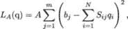
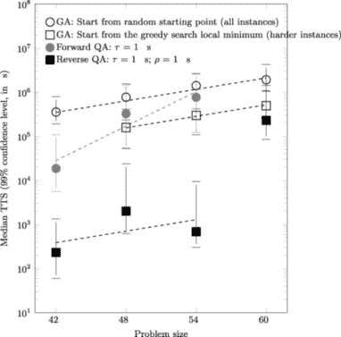

## 3

二次无约束二进制优化

毋庸置疑，二次无约束二进制优化（QUBO）是量子退火的旗舰应用。只需要仔细观察这一类优化问题的名称，就能理解其原因：

+   量子退火器操作在二进制自旋变量上。二进制决策变量（由逻辑量子比特表示）与自旋变量之间的映射非常直接。

+   二次优化问题的目标函数只有线性项和二次项。这大大简化了模型，并允许其嵌入现有的量子退火硬件中。

+   无约束优化意味着尽管 QUBO 允许我们指定必须满足的条件，但这些条件并不是硬性约束。约束的违反通过 QUBO 目标函数中的附加项来惩罚，但仍然有可能找到违反指定约束的解。

所有这些特性使得 QUBO 问题可以在量子退火器上求解。同时，QUBO 形式也适用于许多重要的 NP 难的组合优化问题，如图划分、作业车间调度、二进制整数线性规划等。此类问题还包括我们在本章中考虑的离散投资组合优化问题。我们还应在此提到一些最近使用经典方法解决离散投资组合优化问题的尝试，例如 Vaezi *等*人提出的背包问题形式 [289]，以及 Anagnostopoulos 和 Mamanis 使用遗传算法等进化搜索方法的应用 [12]。背包问题和遗传算法将在本章中讨论。

### 3.1 二次无约束二进制优化原理

QUBO 表示需要在所有可能的 2^N 个变量赋值中最小化 *N* 个二进制变量 *q*[1]*,…,q*[N] 的二次函数的优化问题。需要最小化的函数称为 *成本函数*，可以表示为

|  |  |
| --- | --- |

其中 q := (*q*[1]*,…,q*[N]) ∈{0*,*1}^N 表示 *N* 个二进制决策变量的赋值。

一类具有许多实际应用的优化问题可以采用 QUBO 公式化 [197]。为了精确求解困难的 QUBO 问题，已知的经典算法需要指数级的时间（时间复杂度以二进制决策变量数量 *N* 为基础）[120]。已经有几种近似经典方法被设计出来以降低计算成本；然而，快速发展的量子退火技术旨在证明在最困难的 QUBO 问题上，如 NP-hard 离散投资组合优化问题，能够显著提高计算速度 [175, 296]。

#### 3.1.1 QUBO 到 Ising 转换

QUBO 问题可以很容易地转化为一个可以在量子退火机上求解的 Ising 问题。*N* 个自旋变量 s := (*s*[1]*,…,s*[N]) ∈{−1*,*+1}^N 的 Ising 代价函数为：

|  |  |
| --- | --- |

Ising 模型和 QUBO 模型通过转换 *s*[i] = 2*q*[i] − 1 相关联，因此与 (3.1) 的关系为：

忽略优化中不重要的常数偏移量。

#### 3.1.2 QUBO 问题示例

有许多重要的 QUBO 问题示例可以直接应用于金融领域的实际案例。这里，按照 Lucas [197] 的做法，我们列举了其中一些传统的公式化问题。

##### 数字划分

给定一组 *N* 个正数 {*n*[1]*,…,n*[N]}，是否可以将这组数字划分为两个不相交的子集，使得两个子集中的元素和相等？例如，我们可以将这组数字 {*n*[1]*,…,n*[N]} 看作必须平等分配给两个方的资产。该问题的 Ising 公式化为：

|  |  |
| --- | --- |

其中自旋变量 (*s*[i])[i=1,…,N] ∈{−1*,*+1} 是决策变量。如果 Ising 模型有解且 *L* = 0，那么就存在一种自旋配置，使得对于 +1 自旋的 *n*[i] 的和与 −1 自旋的 *n*[i] 的和相同。数字划分问题在经济学和金融中有广泛的应用，从路由和调度问题 [71] 到信号检测和时间序列分析 [148]。

##### 图划分

考虑一个无向图

其中 *V* 代表顶点集合，*E* 代表边集合，且顶点数 *N* 为偶数。任务是将集合 *V* 划分为两个大小相等的子集 *N∕*2，使得连接这两个子集的边的数量最小化。这个问题有许多应用：找到这些划分可以让我们在两个划分上并行运行一些图算法，然后根据连接边数较少的情况进行一些修改 [36]。自旋变量表示图的顶点，值 +1 和 −1 表示顶点属于 {+} 集合或 {−} 集合。该问题通过由两个部分组成的成本函数来求解：

|  |  |
| --- | --- |

其中

|  |  |
| --- | --- |

如果 {+} 集合中的元素数量与 {−} 集合中的元素数量不相等，则会提供惩罚，且

|  |  |
| --- | --- |

是一个术语，每当一条边连接来自不同子集的顶点时，都会提供惩罚。如果 *B >* 0，则我们希望最小化两个子集之间的边数；如果 *B <* 0，则我们会选择最大化这个数字。如果选择 *B <* 0，必须确保 *B* 足够小，以便永远不会违反 *L*[A] 约束。图划分问题可应用于研究金融市场中的聚类 [271]。

这两个问题，数目问题和图划分问题，都是 NP-困难问题 [155]。

##### 二进制整数线性规划

令 q := (*q*[1]*,…,q*[N]) 为 *N* 个二进制变量的向量。任务是最大化 c ⋅ q，对于某个向量 c，给定约束条件

|  |  |
| --- | --- |

其中 S ∈ℳm,N，b ∈ℝ^m。许多问题可以表述为二进制整数线性规划，例如，在监管约束下最大化利润 [255]。

与该问题相关的成本函数 *L*(q) 可以构造为两项之和，*L*(q) = *L*A + *L*B，其中第一项是

|  |  |
| --- | --- |

对于某个常数 *A >* 0。注意 *L*[A] = 0 强制执行约束 Sq = b。第二项是

|  |  |
| --- | --- |

另有一个正的常数 *B < A*。

##### 背包问题（整数权重）

我们有一个 *N* 个对象的列表，按索引 *i* = 1*,…,N* 标记，每个对象的权重为 *w*[i] ∈ℕ，值为 *c*[i]，并且我们有一个只能容纳最大重量 *W*[max] ∈ℕ 的背包。如果 *q*[i] 是一个二进制变量，表示对象 *i* 是否包含在背包中（*q*[i] = 1），则背包中的总重量为

|  |  |
| --- | --- |

总值为

|  |  |
| --- | --- |

任务是最大化*C*，同时约束*W* ≤ *W*[max]。背包问题在经济学和金融中有多种应用[159, 289]。

我们为每个*n* = 1*,…,W*[max]引入一个二进制变量，*y*[n]，当背包的最终重量为*n*时，*y*[n]为 1，否则为 0。如前所述，成本函数由两项组成，*L*(q) = *L*A + *L*B，其中

|  |  |
| --- | --- |

这确保了重量只能取一个值，并且背包中物品的重量等于我们声明的值，且

|  |  |
| --- | --- |

由于我们要求不能找到一个解，其中*L*[A]在*L*[B]变得更加负的情况下被弱违反，因此我们要求 0 *< B* max[i=1,…,N]*c*[i] *< A*（即不允许向背包中添加一个使其过重的物品）。

许多其他著名的 NP-hard 优化问题可以在量子退火器上解决。在这里，我们可以提到图着色问题[76]和作业车间调度问题[295]，它们已在 D-Wave 量子退火器上成功解决。在本章中，我们详细描述并分析了一个与金融相关的重要 QUBO 问题——Venturelli 和 Kondratyev 研究的离散投资组合优化问题[175, 296]。这是一个困难的完全连接图问题，最适合使用新开发的反向量子退火技术来解决。

许多著名的 NP-hard 问题可以在量子退火器上通过 QUBO 形式有效解决，即使是包含非平凡数量变量的情况。这使得量子退火成为处理经典难度优化问题的有用工具。

### 3.2 正向和反向量子退火

在定义了 QUBO 问题之后，我们现在回顾量子退火如何作为一种高效的求解器。

#### 3.2.1 正向量子退火

量子退火协议受到量子力学中绝热原理的启发，详细内容见第二章，它要求将系统从初始哈密顿量ℋ[0]的易于准备的基态驱动到问题哈密顿量ℋ[F]的未知低能量子空间，理想情况下达到与目标函数全局最小值对应的最低能量状态。这一*正向*量子退火过程可以理想地描述为试图驱动时间依赖哈密顿量的演化

|  |  |
| --- | --- |

从以下开始

|  |  |
| --- | --- |

其中，ℋ[0]是描述每个自旋系统中独立局部横向磁场的哈密顿量（*σ*[x]是保利 X 自旋算符，或量子 NOT 门，详见第 6.3.3 节）。

在表达式(3.2.1)中，第一个求和符号遍历所有*逻辑量子比特*，它们代表 QUBO 优化问题中二进制决策变量，而第二个求和符号遍历所有代表逻辑量子比特的链中的*物理量子比特*。从一链物理量子比特构建逻辑量子比特的过程在第二章中有详细说明，图 2.3 展示了在*Chimera*图上的量子比特链的示例嵌入。任何物理量子比特不能属于多个量子比特链。假设采用最密集的嵌入方案，我们有*N* × *N*[c] = *K*，其中*K*是量子芯片中物理量子比特的总数。然而，在实际应用中，对于大多数需要逻辑量子比特间完全连接的现实规模问题，*N* × *N*[c] *< K*。例如，在一个由*K* = 2,048 个物理量子比特构成的 D-Wave 2000Q *Chimera*图中，最大数量的完全连接逻辑量子比特为 64，链中物理量子比特的最大数量为 17，这意味着*N* × *N*[c] = 1,088。

图 3.1 展示了*A*(*t*)和*B*(*t*)在总退火时间*τ*尺度上是如何变化的。

图 3.1：正向退火计划示意图。A(t)表示横向磁场的强度，B(t)表示纵向磁场的强度。

在退火过程结束时，*A*(*τ*) = 0，系统通过对每个量子比特的磁化测量投影到计算基上。退火的持续时间*τ*是一个自由参数，因此通常有必要定义退火进度的分数完成度*s* = *t∕τ*。

#### 3.2.2 反向量子退火

图 3.2 展示了当量子退火机被设置为反向退火机时的量子退火协议。

图 3.2：反向退火计划示意图。A(t)表示横向磁场的强度，B(t)表示纵向磁场的强度。

系统初始化时，*B*(0) = max{*B*}，*A*(0) = 0，且自旋设置为经典的比特串。随后，演化过程进行逆过程调度，直到哈密顿量的时间依赖性被暂时暂停。参考哈密顿量演化（见 3.2.1），我们为该协议编程的横场演化是以下的三阶段函数（对于*B*(*t*)的类比方程）：

![ AR (t) := A(τ + (sp − 1)t) 逆退火：t ∈ [0,τ ], AP (t) := A (spτ) 退火暂停：t ∈ [τ,τ + ρ], F A (t) := A ((1− sp)(t− ρ)− (1 − 2sp)τ) 前向退火：t ∈ [τ + ρ,2τ + ρ], ](img/file348.jpg)

其中，*ρ*是暂停的持续时间，*s*[p] ∈ [0*,*1]表示实施暂停的前向调度的位置。所选的逆退火协议的总持续时间为 2*τ* + *ρ*，而前向退火的持续时间为*τ*。尽管逆退火的理论才刚刚开始被研究，逆退火的物理学原理可以在这个过于简化的观点中找到：如果系统初始化为状态𝒮，该状态对应于目标函数的局部最小值，那么量子波动和热波动的相互作用可能有助于在逆退火过程中让状态从能量陷阱中“隧穿”出来，而退火暂停（以及在某种程度上最终的前向退火）则允许系统在新发现的最小值邻域内热化并放松。初始状态𝒮的质量可能会显著影响逆退火过程。对于本章介绍的投资组合优化应用案例，可以使用经典的贪婪算法来设定𝒮，具体方法见[296]。

逆量子退火与经典贪婪搜索算法的结合有潜力大幅加速 QUBO 求解器，从而实现一种有前景的混合量子-经典算法。

### 3.3 离散投资组合优化

最优投资组合构建问题是量化金融中最广泛研究的问题之一。现代投资组合理论（MPT）[202]为极具影响力的均值-方差投资组合优化方法奠定了基础。根据 MPT，典型的投资组合优化问题可以表述如下。令*N*为资产数量，*μ*[i]为资产*i*的预期回报，Σ[ij]为资产*i*和资产*j*之间的回报协方差，*R*为目标投资组合回报。那么决策变量为权重*w*[i]，即与资产*i*相关的投资额（*w*[i] ∈ℝ）。标准的马科维茨均值-方差方法包括受约束的二次优化问题。

|  |  |
| --- | --- |

这种形式的二次问题可以通过标准计算方法（例如，带线性约束的二次规划）有效求解，前提是协方差矩阵是正定的。然而，相关的离散投资组合优化问题（带有离散权重*w*[i]）则更难解决。事实上，它们被认为是 NP 完全的[158]。

有趣的是，这个问题也可以转化为一个无约束的二次优化问题，这对于量子退火器是一个合适的模型[116, 205, 234, 251]。我们要解决的问题是从已知特征（如资产回报率、波动率和成对相关性）的资产集合中构建最优投资组合。一个典型的投资组合优化问题是从*N*个可投资资产中选择*M*个资产。这些*M*个资产应该根据某些标准，理想地是最优选择。

我们所针对的场景是一个基金组合经理，他面临着选择最佳基金的任务，这些基金遵循特定的交易策略，以根据某个模型最大化风险调整后的回报[175]，并且有一个约束条件，即资产选择时要赋予相等的偏好权重[82]。如果我们希望通过更大比例的分配给某一特定资产来推广投资组合，我们可以通过克隆资产并将其视为新资产，从而允许参考权重的倍数。

#### 3.3.1 QUBO 编码

选择*M*个基金（*无* *替换*）的问题可以通过二次形式进行编码：

|  |  |
| --- | --- |

其中，*q*[i] = 1 表示选择了资产*i*，*q*[i] = 0 表示未选择资产*i*。任务就是找到一个 q := (*q*[1]*,…,q*[N])的配置，使得*L*(q)最小化，并满足基数约束（即选择恰好*M*个资产）。解决基数约束的常见方法是，在成本函数中添加一个项*L*penalty，根据(3.3.1)，使得不满足约束的选择会受到一个大值*P* ≫ 1 的惩罚，从而迫使全局最小值满足∑ [i=1]^N*q*[i] = *M*：

|  |  |
| --- | --- |

系数(*a*[i])[1≤i≤N] 反映了资产的独立吸引力，可以通过单个资产的预期风险调整回报来推导得出。具有较大预期风险调整回报的资产应该通过负值的*a*[i]来奖励，而具有较小预期风险调整回报的资产则应该通过正值的*a*[i]来惩罚。系数(*b*[ij])[1≤i<j≤N] 反映了成对的多样化惩罚（正值）和奖励（负值）。这些系数可以通过成对的相关性来推导得出。

给定的 QUBO 代价函数的最小化（见 3.3.1 和 3.3.1）应通过使用夏普比率的度量优化风险调整后的回报。夏普比率（以资产波动率单位衡量的超额资产回报）计算公式为(*r* − *r*[0])*∕σ*，其中 *r* 是预期的年化资产回报，*r*[0] 是适用的无风险利率，*σ* 是资产波动率（资产回报的年化标准差）。基金的夏普比率越高，意味着基金相对于其承担的风险所获得的回报越好。波动率可以通过净资产价值回报（每股）的历史年化标准差来估算。预期回报可以通过基金投资的历史回报来估算，或者由分析师/投资组合经理独立推算，考虑未来基金表现的不同因素。

#### 3.3.2 粗粒度编码方案

与其使用从金融数据中获得的原始实数作为 QUBO 系数，我们选择将单个基金的夏普比率及其相互相关性粗粒度化为整数值，方法是将区间分组到桶中（样本映射方案见表 3.1）。通过使用桶化值，我们定义了一个评分卡，该评分卡松散地基于过去的基金表现，但可以由投资组合经理根据他们的个人观点以及任何尚未反映在基金报告中的新信息进行轻松调整。

| 夏普比率桶 | 系数 a[i] |
| --- | --- |
| 等间距桶， | 映射方案： |
| 从最差到最好 | A | B | C |
| 第一 | 15 | 25 | 30 |
| 第二 | 12 | 16 | 24 |
| 第三 | 9 | 9 | 18 |
| 第四 | 6 | 4 | 12 |
| 第五 | 3 | 1 | 6 |
| 第六 | 0 | 0 | 0 |
| 第七 | −3 | −1 | −6 |
| 第八 | −6 | −4 | −12 |
| 第九 | −9 | −9 | −18 |
| 第十 | −12 | −16 | −24 |
| 第十一 | −15 | −25 | −30 |
| 相关性桶 | 系数 b[ij] |
|  | 映射方案： |
|  | D | E | F |
| −1.00 ≤ρ[ij] < −0.25 | −5 | −9 | −10 |
| −0.25 ≤ρ[ij] < −0.15 | −3 | −4 | −6 |
| −0.15 ≤ρ[ij] < −0.05 | −1 | −1 | −2 |
| −0.05 ≤ρ[ij] < 0.05 | 0 | 0 | 0 |
| 0.05 ≤ρ[ij] < 0.15 | 1 | 1 | 2 |
| 0.15 ≤ρ[ij] < 0.25 | 3 | 4 | 6 |
| 0.25 ≤ρ[ij] ≤1.00 | 5 | 9 | 10 |

表 3.1：来自净资产值时间序列市场数据的样本 QUBO 系数规格。

QUBO 系数选择为小整数是由现有量子退火器架构的技术实现所决定的（超导芯片电路的精度）。在这一限制下，投资组合经理可以为 QUBO 系数选择任何线性或非线性比例。例如，二次映射方案 B 强烈惩罚低夏普比率基金，并且强烈奖励高夏普比率基金。线性映射方案 A 和 C 则能更好地区分表现一般的基金。类似地，映射方案 E 比映射方案 D 更强烈地惩罚大正相关，并奖励大负相关。

#### 3.3.3 数值实验的实例集构建

我们案例研究中使用的实例集是通过模拟资产价值获得的，借助于相关几何布朗运动过程，具有常数相关性*ρ*、漂移*μ*和对数正态波动率*σ*。这些参数的具体值来源于广泛的基金行业研究（见[79]，关于夏普比率分布的部分），因此，可以视为行业的代表。模拟的时间范围选择为一年，时间步长设为一个月。

每个模拟（或“实际”）的投资组合场景都包含每个资产的 12 个月回报率。根据这些回报率，我们计算了每个资产的总实际回报和实际波动率（显然，它们与其预期值*μ*和*σ*不同），以及整个投资组合的总回报和波动率。我们还根据输入的统一相关性*ρ*计算了所有资产之间的实际成对相关性。最后，我们计算了单个资产和投资组合的夏普比率。作为参考，当*ρ* = 0.1，*μ* = 0.075，*σ* = 0.15，且常数无风险利率设定为*r*[0] = 0.015 时，投资组合中每个资产的预期夏普比率为 0.4。由于资产之间的多样化和低相关性，*N*资产投资组合的预期夏普比率要显著更高，例如，对于一个 48 个资产的投资组合，我们预计夏普比率的值将在 0.5（第 25 百分位）到 2.1（第 75 百分位）之间，均值约为 1.4。

#### 3.3.4 经典基准 – 遗传算法

我们选择遗传算法（GA）作为经典基准启发式方法，GA 是解决难度较大的组合优化问题的流行选择。遗传算法是一种通过应用模仿自然遗传继承的算子并模拟达尔文生存斗争来搜索解空间的自适应方法。遗传算法在投资组合优化问题中的应用有着丰富的历史，最近的研究包括[172，179]。

在投资组合优化的情况下，解（染色体）是一个向量 q := (*q*[1]*,…,q*[N])，由 *N* 个元素（基因）组成，这些元素可以取二进制值 {0*,*1}。任务是找到一种基因组合，最小化代价（适应度）函数 *L*(q)。由于解由相对较短的比特字符串表示，我们不使用交叉重组机制，因为它对提高算法收敛性几乎没有价值。算法 1 对 GA 程序进行了详细描述。

![--------------------------------------------------------------------- 算法 1：GA − 具有基数约束的投资组合优化 ------------------------------------------------------------ 结果：最优投资组合。 1：通过从可能的元素值池 {0, 1} 中随机抽取生成 L 个初始解，要求“1”分配给恰好 M 个元素的值，“0”分配给剩余 N − M 个元素的值。 2：评估每个解的代价（适应度）函数。 3：根据代价函数评估结果将解从“最好”到“最差”进行排序。 对于从 0 到迭代次数 − 1 的每次迭代，执行 | | | a) 从上一代选择 K 个最佳解，并通过随机交换两个具有相反值的元素的值来生成 L 个新解。若 L = mK，则每个“最佳”解都会用来生成 m 个新解。 | | | b) 评估每个解的代价（适应度）函数。 | | c) 根据代价函数评估结果将解从“最好”到“最差”进行排序。 结束 --------------------------------------------------------------------- ](img/file352.jpg)

参数 *L* 和 *K* 的最佳值依赖于问题规模和具体的 QUBO 系数映射方案，可以通过反复试验来找到。这里的目标是通过最少的目标函数调用次数实现目标收敛。

我们的首要任务是验证所提出的映射方案是否合理，即最小化目标函数（3.3.1）和（3.3.1）是否确实能够构建最优投资组合。选择从 *N* 个可投资资产中挑选出 *M* 个最佳资产的问题的一个可能方法是根据各自的 Sharpe 比率选择 *M* 个单独最佳的资产。此方法忽视了某些单独最佳资产之间可能存在的较大正相关性对多样化的负面影响，因此没有理由相信这样的投资组合是最优的。因此，我们应该要求，通过最小化 *L*(q) + *L*penalty 构建的最优投资组合应优于 *M* 个单独最佳资产的投资组合。

例如，我们可以比较从 48 个资产的集合中选择的最优 24 资产投资组合的结果（对于 10,000 个投资组合实例，模拟条件为*ρ* = 0*.*1，*μ* = 0*.*075，*σ* = 0*.*15；如前所述，假设一个恒定的无风险利率*r*[0] = 0*.*015）。表 3.2 显示了根据表 3.1 提供的样本 QUBO 系数映射方案获得的夏普比率分布统计[296]。结果以以下格式呈现：**平均值**（第 25 百分位；第 75 百分位）。

|  |  |
| --- | --- |

* * *

|

* * *

|

* * *

|

|  |  | b [ij] 映射方案 |
| --- | --- | --- |
|  |  |

* * *

|

* * *

|

* * *

|

|  |  | D | E | F |
| --- | --- | --- | --- | --- |
|  |  |  |  |  |
| 映射 | A | 4.7 (2.5; 6.4) | 4.5 (2.1; 6.1) | 4.0 (1.7; 5.5) |
|  |

* * *

|

* * *

|

* * *

|

* * *

|

| 方案 | B | 4.8 (2.7; 6.5) | 4.3 (2.0; 5.9) | 4.2 (2.0; 5.8) |
| --- | --- | --- | --- | --- |
|  |

* * *

|

* * *

|

* * *

|

* * *

|

| 对于 a[i] | C | 5.0 (3.0; 6.7) | 4.8 (2.6; 6.3) | 4.6 (2.5; 6.1) |
| --- | --- | --- | --- | --- |
|  |  |  |  |  |

表 3.2：不同映射方案的夏普比率分布统计。

对于个别最佳资产的投资组合，夏普比率分布统计如下：

平均值：3.8，第 25 百分位：2.6，第 75 百分位：4.7

平均而言，最优投资组合的夏普比率比个别最佳资产的投资组合高 0*.*8，尽管一些 QUBO 系数映射方案的结果优于其他方案。图 3.3 展示了通过最小化成本函数*L*(q) + *L*penalty 找到的最优投资组合相对于由 24 个个别最佳资产组成的投资组合，在映射方案 A 和 D 中的表现更好。

我们的第二个任务是了解解决方案所需的时间如何随着问题规模的变化而变化，以及量子退火是否能与经典算法相比表现出显著的加速效果。移除最优投资组合中资产数量的约束将会是一个有趣的实验。图 3.3 中展示的投资组合优化结果是针对*M* = *N∕*2 的情况获得的，这可能是最难的组合优化问题之一，因为它涉及到资产数量的约束，基于搜索空间的大小[175]。从蛮力方法的角度来看，如果我们去掉这个约束，问题将变得更加困难，因为解空间会随着*N*的增加而增长，变成 2^N，而不是。

图 3.3：夏普比率直方图（QUBO 系数映射方案 A 和 D）。M = N∕2\。

去除基数约束也是必要的，因为表达式(3.3.1)中的大能量尺度 *P* 通常与量子退火机器的模拟性质相关，并且与量子芯片局部元件上可控编程的最大能量物理限制有关。然而，可以采取多种混合量子-经典策略来克服这一限制。

例如，我们观察到，通过常量±Δ人为地调整夏普比率值（并根据所选的规定添加桶，例如表 3.1），本质上相当于迫使无约束问题的基态解选出大致期望数量的资产。因此，尽管没有解决相同的问题，我们可以想象一种解算器，它可以解决类似约束的问题，将量子退火过程封装在一个经典循环中，检查最优解中选定的资产数量 *m*(Δ)，并且当Δ = 0 时，根据 *m* 大于或小于 *M* 来增加或减少资产的单独期望值，并再次运行，直到 *m*(Δ) = *M* 且 Δ = Δ^⋆。尽管在这种情况下这是对原始问题的一种近似，但这种混合方案在量子辅助解算器中并不少见[285]，且预期的运行轮次应按二分查找的方式与 log 2 成比例增长，这为解决时间复杂度引入了一个常数因子，应该能够保持可管理。也可以提出其他混合方法来应对约束，例如在预处理过程中通过样本持久性来固定一些资产选择[154]。

根据前述论点，在我们的基准案例研究中，我们集中精力运行无约束问题，设置 Δ = 0。表 3.3 提供了基准实例集的特征[296]。对于给定大小的问题，该表报告了在 30 个实例中，无约束投资组合优化问题的最优投资组合中资产的中位数（括号中为最小值和最大值）。

| 问题 | 资产数量 |
| --- | --- |
| 大小 | 在最优投资组合中 |
| N | （无约束问题） |
| 42 | 16 (−7,+6) |
| 48 | 17 (−6,+5) |
| 54 | 19 (−7,+12) |
| 60 | 23 (−13,+15) |

表 3.3：基准实例集特征。

#### 3.3.5 建立量子加速

目标是解决在 D-Wave 2000Q 量子退火器编程能力极限下的代表性投资组合实例。D-Wave 2000Q 拥有 2,048 个物理量子比特；然而，由于 D-Wave 2000Q 的*Chimera*图的连接性有限，我们最多可以在完全连接的图上嵌入 64 个逻辑二进制变量。实际上，我们将自己限制为最多使用 60 个逻辑量子比特，这意味着我们基准测试的最大搜索空间约为 60!*∕*(30!)² ≃ 10¹⁷，如果*M* = *N∕*2。这个限制决定了实例集的配置，实例集由 30 个随机生成的实例组成，*N* = {42*,*48*,*54*,*60}个资产。

如第二章所述，一个常用的衡量非确定性迭代启发式方法与量子退火性能的标准是解决时间（TTS）[250]。后者定义为在给定概率（置信水平）*α* ∈ (0*,*1)下，找到基态所需的量子退火器独立运行次数的期望值。

|  |  |
| --- | --- |

其中*t*[run]是单次运行的运行时间——对于正向退火是*τ*（见第 3.2.1 节），对于反向退火是 2*τ* + *ρ*（见第 3.2.2 节）——而*p*是该单次实验中找到目标函数最优解的概率。

图 3.4 显示了 GA、正向量子退火求解器（QA）和反向量子退火求解器（QA）对于使用映射方案 A 和 D 编码的无约束投资组合优化问题的 TTS 结果[296]。图中，标记表示中位数值，误差条表示在 30 实例集上的第 30 和第 70 百分位数。所有 TTS 都已测量，但不包括运行初始化初始假设𝒮的贪婪下降所需的时间，也不包括操作量子退火器的开销时间。

图 3.4：解决时间（99%置信水平）：GA、正向和反向量子退火。使用映射方案 A 和 D 对无约束投资组合优化问题进行编码。

GA 也可以通过贪婪搜索启发式方法初始化，这也减少了 GA 找到全局最小值所需的 TTS。实验研究表明，最佳结果出现在最小可能的退火时间和暂停时间（1 微秒）下[296]。在中位数情况下，应用反向量子退火相比正向量子退火或经典基准，能观察到一到三个数量级的加速。

很可能，*N* = 54 时反向量子退火 TTS 的非单调行为并非具有根本意义，而是由于我们实例集的有限、小规模噪声所致。尽管实例集的规模较小使得很难对量子退火与问题规模之间的扩展性做出明确结论，但似乎反向量子退火在*N* = 54 个资产的投资组合中显示出与遗传算法类似的扩展性——如虚线回归线所示。对于*N* = 60 个资产的极限情况，表现较差的扩展性可能是由于此时物理量子比特链条过长，且更容易断裂。值得注意的是，出于同样的原因，*N* = 60 也是正向退火的一个非常困难的情况。与正向退火相比，反向退火显示出显著更好的扩展性。当正向退火中的参数*β*为 0.3 时，反向退火中的*β*为 0.1。

离散投资组合优化是一个 NP 难度问题，可以通过量子退火器使用混合量子-经典反向退火技术来解决，量子加速比可达到几个数量级（忽略测量和系统重置的计算开销）。尽管目前还为时过早，无法确定量子退火是否能成为一种广泛应用的投资组合优化工具，但有迹象表明，随着技术和理论的进步，它可能会成为一个可行的选择。

### 总结

在这一章中，我们应用量子退火解决离散投资组合优化问题。我们从二次无约束二进制优化的原理开始，研究了几个 NP 难度优化问题及其 QUBO 表述。

然后，我们引入了量子退火协议的概念，并指定了两种此类协议：正向退火和反向退火。我们还指定了经典基准：遗传算法，一种理想适用于二进制变量操作的进化搜索启发式方法。

一旦我们拥有所有必要的构建模块，我们将一个样本离散投资组合优化问题转化为 QUBO，并在 D-Wave 2000Q 量子退火器上尝试解决它的实例。我们收集了足够的统计数据，涵盖了各种问题规模，以便将正向和反向量子退火的表现与经典基准进行比较。在 TTS 方面，我们特别对反向量子退火协议取得的令人鼓舞的结果表示满意。

在下一章，我们将学习如何将量子退火应用于构建一个强健分类器的问题。所提的解决方案——量子提升——是一种混合量子-经典分类器（量子训练，经典运行），其性能与标准的经典模型相当，且有时能够超越它们。

### 加入我们书籍的 Discord 空间

加入我们的 Discord 社区，与志同道合的人一起学习，和超过 2000 名成员共同成长，网址：[`packt.link/quantum`](https://packt.link/quantum)

