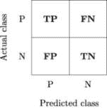
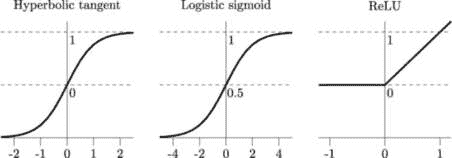

## 4

量子提升

在本章中，我们考虑经典提升元算法的量子版本——这是一类机器学习算法，能够将弱分类器转化为强分类器。经典的提升包括两个主要操作：i）对弱分类器进行自适应（迭代）训练，从而提高它们的个体性能，ii）在将弱学习器组合成一个强学习器时，找到一组最优的权重配置。

自适应学习包括对训练数据集中的样本进行迭代重新加权，迫使模型通过赋予难以分类的样本更高的权重来提高其性能。这些权重在每次算法迭代时都会进行调整。可以说，最著名和最成功的这种算法示例就是流行的*自适应提升*（AdaBoost）模型。该模型最早由 Freund 和 Schapire 于 1997 年提出[107]，他们的工作在 2003 年获得了著名的 Gödel 奖。

AdaBoost 的主要原理是基分类器（弱学习器）按顺序训练，每个基分类器都使用加权形式的数据集进行训练：与每个样本相关的加权系数取决于前一个分类器的性能。被某个基分类器误分类的样本，在用来训练下一个基分类器时会被赋予更大的权重。一旦所有基分类器都训练完成，它们的预测结果通过某种加权多数投票方案结合起来[37]。因此，AdaBoost 可以被看作是一个通用框架，允许多种实现方式，具有不同程度的复杂性，而不是一个狭义定义的算法。

与 AdaBoost 不同，提升方法通过为个体弱学习器找到一组最优权重（弱学习器按常规方式训练）来实现，这种方法易于实现，并依赖于标准的优化程序。然而，当引入额外约束条件时，这一任务变成了一个复杂的组合问题。当权重只能取二进制值时，该问题自然可以表述为一个 QUBO 问题。

量子退火在这里发挥着作用，正如我们在第三章中所看到的那样。对于足够数量的弱分类器，搜索空间会变得巨大，经典算法（如各种进化搜索启发式方法）可能需要相当长的时间才能找到最优的权重配置（或者至少找到一个好的近似解）。这是量子退火展示其优势的理想场景，包括实现物质量子加速的可能性。

量子提升是一种基于 QUBO 的技术，通过构造二进制分类器的最优线性组合，将单个弱学习器组合成一个强分类器。它是透明的、易于解释的，并且抗过拟合。

### 4.1 量子退火与机器学习

量子提升是我们在本书中将要考虑的第一个 QML 算法。这也是最能发挥量子退火自然优势的算法。

#### 4.1.1 QBoost 算法的一般原理

我们先从量子提升（QBoost）算法的一般原理开始，再探讨一个具体的与金融相关的应用。在 QBoost 的公式中，我们将使用以下定义和符号：

| 对象 | 定义 |
| --- | --- |
| x[τ] = (*x*1*,x*2*,…,x*N) | *N*个变量（特征）的向量 |
| *y*[τ] = ±1 | 二进制标签，表示 x[τ]是否对应类别 0（−1）或类别 1（+1） |
| {x[τ]*,y*[τ]}[τ=1,…,M] | 训练事件集 |
| *c*i = ± | 弱分类器*i*在事件*τ*上的值 |
| q := (*q*[1]*,q*[2]*,…,q*[N]) | 与每个弱分类器相关联的二进制（0 或 1）权重的向量 |

表 4.1：QBoost 算法符号

我们首先指定样本*τ*的分类误差，该误差由平方误差给出：

|  |  |
| --- | --- |

最小化的总成本函数是所有样本的平方误差之和：

|  |  |
| --- | --- |

请注意，*y*[τ]²不依赖于 q，因此对*L*的最小化没有影响。为了防止过拟合，添加一个惩罚项*λ >* 0，因此最小化的目标函数为：

|  |  |
| --- | --- |

与

|  |  |
| --- | --- |

**备注：** 添加一个由系数*λ*控制的惩罚项类似于 LASSO 回归方法[6]，其使用*L*[1]惩罚项，在机器学习中非常常见。岭回归[243]使用*L*[2]惩罚项，也可以使用，并且也会导致一个 QUBO 问题。

#### 4.1.2 从 QUBO 到 Ising

如在第 3.1.1 章中所述，我们现在执行从 QUBO 到 Ising 的转换，使用二进制决策变量 q := (*q*[1]*,…,q*[N]) ∈{0*,*1}^N 到自旋变量 s := (*s*[1]*,…,s*[N]) ∈{−1*,*+1}^N 的转换：

|  |  |
| --- | --- |

因此，量子退火器上待解决的 Ising 问题可以表示为

|  |  |
| --- | --- |

由于这三个术语

不依赖于 s，它们可以从成本函数中移除。替换 *λ* = *λ* 后，得到最终的 Ising 问题

|  |  |
| --- | --- |

量子退火尝试解决的问题是最小化 ℋ 并返回最小化的基态自旋配置（*s*[i]^g)[i=1,…,N]。然后，强分类器被构建为

| ![ N ∑ g R (x) = sici(x) ∈ [− 1,1], i=1 ](img/file367.jpg) |  |
| --- | --- |

对于我们希望分类的每一个新事件 x [218]。

### 4.2 QBoost 在金融领域的应用

量子退火在机器学习（QAML）领域已经成功应用于广泛的金融和非金融用例。与传统的经典机器学习模型（如基于二叉决策树的极端梯度提升（XGBoost）和深度神经网络（DNN）分类器）相比，QAML 在处理相对较小的数据集时表现出明显的性能优势。QAML 的应用案例来自多个不同领域，如高能物理（希格斯玻色子的探测[218]）和计算生物学（转录因子结合的分类和排名[186]）。在金融领域，QAML 的最明显应用是信用评分和欺诈检测，以及通过大量弱二进制（买/卖）交易信号构建强交易信号。

在本节中，我们分析了 QBoost 在更常见的二元分类问题上的表现——预测信用卡客户违约。我们还提供了经典基准（梯度提升和前馈神经网络分类器），并从不同角度分析了 QBoost 的表现。选择的数据集相对较大，包含数万样本，应该能够帮助标准经典分类器避免过拟合，并展示它们的最佳性能。

已有研究表明[218]，QBoost 算法具有抗过拟合的能力，因为它通过显式地线性化相关性（因此在较小数据集上的表现优于经典基准）。该模型的另一个有用特点是它具有可解释性，每个弱分类器都对应一个特定的特征或特征组合（或它们的函数），而强分类器则是这些特征的简单线性组合。这与“黑箱”机器学习判别方法（如使用梯度提升或深度神经网络）相比，具有显著优势。对于面向零售客户的金融产品，这一点尤为重要。

#### 4.2.1 信用卡违约

信用卡客户违约（DCCC）数据集可以从 UCI 机器学习库获得 [307, 308]。该数据集包含 30,000 个样本，进行二分类：客户违约（类 1）和客户未违约（类 0）。共有 23 个特征（F1-F23），这些特征至少具有一定的预测能力，可以用于分类决策：

+   F1：给定信用额度（新台币）：包括个人消费者信用和其家庭（附加）信用。

+   F2：性别（1 = 男；2 = 女）。

+   F3：教育程度（1 = 研究生；2 = 大学；3 = 高中；4 = 其他）。

+   F4：婚姻状况（1 = 已婚；2 = 单身；3 = 其他）。

+   F5：年龄（岁）。

+   F6-F11：过去支付历史。F6 – 上个月的还款状态，F7 – 两个月前的还款状态，依此类推。还款状态的测量标准为：−1 = 按时还款；1 = 延迟一个月还款；2 = 延迟两个月还款；*…*；8 = 延迟八个月还款；9 = 延迟九个月及以上还款。

+   F12-F17：账单金额（新台币）。F12 – 上个月的账单金额，F13 – 两个月前的账单金额，依此类推。

+   F18-F23：上一期付款金额（新台币）。F18 – 上个月支付的金额，F19 – 两个月前支付的金额，依此类推。

弱分类器的构建方式如下：每个特征单独作为输入，用于逻辑回归分类器，目的是做出二分类预测：−1*∕N*表示类别 0（无违约），+1*∕N*表示类别 1（有违约），其中*N* = 23 表示弱分类器的总数（数据集中的特征数量）。需要注意的是，这不是唯一可能的方法。通过某些（可能是非线性的）特征组合来构建弱分类器是完全可行的。每当我们清楚地了解哪些特征组合能产生更有意义和洞察力的结果时，就应该采用这种方法。然而，在这个特定的例子中，我们的目的是阐明 QBoost 算法的基本原理，因此我们并不假设拥有足够的专业知识来构建更好的衍生特征。

我们使用了来自`scikit-learn`包的`sklearn.linear_model.LogisticRegression` [230] 作为弱分类器。数据集按照 70:30 的比例被划分为训练集和测试集，并借助 sklearn.model_selection.train_test_split 模块完成。根据 QBoost 算法的要求，类标签被编码为−1 表示类别 0（无违约），+1 表示类别 1（有违约）。

构建弱分类器数据集时使用了以下`LogisticRegression`模型配置（其他所有参数均设置为默认值）：

+   penalty = ‘l2’

+   C = 1.0

+   solver = ‘lbfgs’

+   max_iter = 1000

因此，我们有一个训练数据集（21,000 个样本）和一个测试数据集（9,000 个样本），每个数据集都包含 23 个弱分类器的预测（取值{−1*∕*23, +1*∕*23}）和类标签（取值{−1, +1}）。如果强分类器的预测由弱分类器的预测和（简单多数投票方法）给出，那么其值将位于[−1*,*1]范围内，只有当所有弱分类器完全一致时，才会得到−1 或+1 的值。

QBoost 通过找到最优配置的弱分类器来改进这一方法，使得多数投票仅在部分可用的弱分类器上执行。换句话说，对所有弱分类器执行的多数投票只是 QBoost 的一种特殊情况（即其中一种可能的配置）。因此，有必要将 QBoost 的性能与更先进的经典机器学习模型（如梯度提升和神经网络）进行比较。我们将在第 4.3 节提供这种比较。

#### 4.2.2 QUBO 分类结果

DCCC 数据集中的每个特征都唯一地映射到相应的（弱）逻辑回归分类器，并与二进制决策变量(*q*[i])[i=1,…,23]相关联。这些决策变量在 QUBO/Ising 形式的优化问题中由逻辑量子比特/自旋变量表示。

非零决策变量（权重）的数量取决于我们希望施加的正则化程度。表 4.2 展示了作为训练数据集惩罚*λ*的函数，权重的最优配置。考虑到我们例子中的弱分类器数量相对较少，可以通过穷举搜索找到最优配置。正如预期的那样，惩罚*λ*值越大，非零权重的数量越小。

| *λ* | 非零权重 |
| --- | --- |
| 500 | {*q*[1]*,q*[6]*,q*[7]*,q*[8]*,q*[9]*,q*[10]*,q*[11]} |
| 600 | {*q*[6]*,q*[7]*,q*[8]*,q*[9]*,q*[10]*,q*[11]} |
| 700 | {*q*[6]*,q*[7]*,q*[10]*,q*[11]} |
| 800 | {*q*[6]*,q*[10]*,q*[11]} |
| 900 | {*q*[6]*,q*[11]} |
| 1000 | {*q*[6]} |

表 4.2：不同惩罚*λ*值下 QUBO 权重* q*的最优配置。最优配置列出了所有非零权重。

给定一组权重配置，我们可以按照(4.1.2)构建强分类器。然后，我们可以比较获得的强分类器在训练（样本内）和测试（样本外）数据集上的表现。选择的性能指标是*准确率*、*精确度*和*召回率*。分类器的性能也可以借助*混淆矩阵*来可视化。以下是它们的定义。

+   **准确率**是正确预测的观察结果与总观察结果的比例。准确率是评估类别大小大致相同且重要性相当时的一个良好指标。然而，在我们的例子中，它是一个不太理想的指标：类别 0 样本（无违约）远比类别 1 样本（违约）多，但类别 1 样本的相对重要性要高得多。

+   **精确度**是正确预测的正类观察结果与总预测正类观察结果的比例。高精确度意味着低假阳性率。在信用卡违约的背景下，如果错误的违约预测代价高昂，这个指标是我们希望最大化的。

+   **召回率**是正确预测的正类观察结果与所有正类观察结果的比例。在信用卡违约的背景下，这个指标显示了有多少实际违约被分类器预测出来。从风险管理的角度来看，我们希望最大化这一指标。

+   **混淆矩阵**是二分类器的一个 2 × 2 矩阵，其元素是分类器预测的真实正例（TP）、真实负例（TN）、假正例（FP）和假负例（FN）的计数，如图 4.1 所示。

图 4.1：二分类器的混淆矩阵。

准确率、精确度和召回率的定义如下：

| 准确率 | := *,* |
| --- | --- |
| 精确度 | := *,* |
| 召回率 | := *.* |

图 4.2 显示了强 QBoost 分类器的样本内和样本外混淆矩阵，假设类别 1（违约）为正类，类别 0（无违约）为负类。惩罚参数设置为 *λ* = 10³，从而强制执行强正则化。

样本内和样本外的结果非常接近，正如从一个强正则化的分类器所期望的那样。表 4.3 总结了结果。

图 4.2：QBoost 分类器的混淆矩阵（DCCC 数据集）。

|  | 准确率 | 精确度 | 召回率 |
| --- | --- | --- | --- |
| 样本内 | 0.82 | 0.69 | 0.33 |
| 样本外 | 0.83 | 0.71 | 0.33 |

表 4.3：QBoost 分类器在 DCCC 数据集上训练和测试后的准确率、精确度和召回率。

### 4.3 经典基准

经典基准测试是量子算法测试中的一个重要组成部分。小规模（甚至是风格化的）问题非常适合这个任务。让我们看看 QBoost 模型与标准经典机器学习分类器（神经网络和梯度提升）相比的表现。

#### 4.3.1 人工神经网络

人工神经网络（ANN）是由互联的 *激活* *单元*（或 *人工神经元*）组成的网络，其中每个激活单元执行三项主要功能（图 4.3）：

+   输入信号的求和（*x*[i]）[i=1,…,N]，来自所有上游单元，并与相应的权重（*w*[i]）[i=1,…,N] 相乘；

+   聚合输入的非线性变换；

+   将结果发送到其连接的下游单元。

有时，激活单元还执行二值化（或更一般地，数字化）输出任务——通常，这是作为分类器训练的 ANN 输出层中的激活单元的任务。

图 4.3：人工神经元（感知器）的示意图。

在最简单的形式下，ANN 组织为激活单元的层次结构：输入层、输出层以及一个或多个隐藏层，如图 4.4 所示。

图 4.4：前馈人工神经网络的示意图。

图 4.3 中的激活单元被称为 *感知器*，由感知器层组成的人工神经网络（ANN）被称为多层感知器（MLP）。MLP 是 *前馈* 神经网络：信号从输入层沿一个方向传递到输出层。ANN 也可以以不同方式组织，信号在各层之间来回传递，我们将在下一章探讨其中一个模型。然而，在构建分类器时，简单的前馈架构在实践中效果很好。

人工神经网络架构的实际方法基于 Cybenko 获得的基本结果[75]。该结果表明，任意的决策区域可以通过仅包含一个隐藏层和任何连续的 sigmoid 非线性激活函数的连续前馈神经网络进行任意逼近。Hornik、Stinchcombe 和 White[141]进一步将这一结果推广到了更广泛的激活函数范围。研究表明，具有单个隐藏层并且隐藏层激活函数平滑的多层前馈网络能够以任意精度逼近任何任意函数及其导数。事实上，这些网络甚至可以逼近那些在经典意义上不可微的函数，而只具有广义导数[224]。

#### 4.3.2 训练人工神经网络

训练人工神经网络的过程是找到一组网络参数（权重和偏置）的最佳配置，使得新的未见输入能以期望的方式转化。网络是在所谓的*训练数据集*上进行训练的。训练数据集中的样本可以是*有标签的*（每个样本都被分配一个类标签，可能是数值的，也可能是分类的）。在这种情况下，我们可以执行*监督学习*，其中网络的任务是学习特征与类标签之间的映射——在监督学习模式下训练的人工神经网络变成了分类器。当样本没有标签时，我们可以将网络训练为回归器。虽然作为分类器训练的人工神经网络似乎是最明显的实际决策工具，但回归器在各种定量金融领域也有着广泛的应用，例如用于学习利率曲线的自然动态和变化[169]。

然而，我们希望在这里重点讨论有标签的数据集，因为我们的目标是考虑 QBoost 分类器的经典对照。训练前馈人工神经网络的标准方法是通过梯度下降的*反向传播*误差[113]。我们简要解释这种方法的主要思想。

起点是指定一些合适的代价函数，以指示我们与正确分类的距离。为了不失一般性，假设我们使用一个包含*M*个样本的训练数据集，其中每个样本是一个*N*维特征向量和一个二进制类标签的组合：

|  |  |
| --- | --- |

令 (*ŷ*^j)[j=1,…,M] 为人工神经网络根据某个网络权重配置 w = (*w*[1]*,…,w*[K]) 分配给相应训练样本的类标签。然后，我们可以定义代价函数为

|  |  |
| --- | --- |

其中*g*(*y*^j*,ŷ*^j(w))是样本*j*的估计误差。指定误差函数的方法有很多种，最常见的是平方误差。

|  |  |
| --- | --- |

给定代价函数*L*(⋅)，我们可以计算其敏感度（导数）*∂L*(w)*∕∂w*[k]，对于每个*k* = 1*,…,K*，即对于网络权重的敏感度。然后我们可以通过在与对应梯度相反的方向上更新权重，从而减少估计误差：

|  |  |
| --- | --- |

其中系数*η*称为*学习率*，它可以是常数或动态的。我们接着按照（4.3.2）、（4.3.2）和（4.3.2）给出的步骤进行迭代，直到估计误差降到预定阈值以下或达到最大迭代次数。学习率通常初始设置为较大的值，然后随着迭代次数的增加呈指数衰减。

梯度可以通过数值方法（例如，使用有限差分法）或解析法计算，后者显然更为可取。最常用的非线性激活函数及其梯度列在表 4.4 中，相关图形展示在图 4.5 中：

表 4.4: 激活函数。

图 4.5: 激活函数。

**备注：** Sigmoid 激活函数，如逻辑 Sigmoid 和双曲正切，是浅层神经网络（只有少数隐藏层）的首选激活函数。在这种情况下，可以利用 Sigmoid 函数的平滑性来实现对我们试图学习的函数的最佳近似。然而，对于具有大量隐藏层的深层神经网络，我们面临梯度消失的问题——当*x* → ±∞时，*σ*(*x*)和 tanh(*x*)的梯度变为零。同时，ReLU 对于所有*x >* 0 总是具有非零梯度，这使得它成为深层神经网络中首选的激活函数，特别是当可以为了非零梯度而牺牲激活函数的平滑性时。

最后，过拟合问题可以通过向（4.3.2）中添加正则化惩罚项来解决，例如以下的*L*[2]惩罚项，它能抑制与强非线性相关的大权重：

|  |  |
| --- | --- |

其中参数*λ*控制正则化的程度。

#### 4.3.3 决策树与梯度提升

决策树分类方法基于通过可用特征划分数据集的概念，以最大化*信息增益*，定义为

|  |  |
| --- | --- |

其中，*D* 是父节点的数据集，(*d*[j])[j=1,…,M] 是父节点被划分成的子节点的数据集，*N* 是父节点中的样本数，(*N*[j])[j=1,…,M] 是子节点中的样本数，*I* 是选择的*不纯度度量*。后者表示同一节点中来自不同类别的样本的存在：如果节点只包含某一类的样本，则为零；如果节点包含来自所有类别的样本，则为最大。因此，信息增益的最大化通过最小化子节点的不纯度来实现。

图 4.6 提供了基于二元（"雨天/非雨天"）和连续（"风速"）特征的决策树的示意图。决策树算法从*根节点*开始，在图中显示为阴影框。基于根特征划分数据集会产生最大的 信息增益。划分导致了*分支*（图中以箭头表示，从父节点指向子节点）和*叶子*（图中以白色框表示）的生成。终端叶子（类）以虚线框表示。划分持续进行，直到无法再创建更多分支或达到最大允许深度为止。通过施加*剪枝*（限制树的最大深度）来避免构建过深的树是一个好习惯，以避免过拟合。

图 4.6：决策树的示意图。

最常用的不纯度度量是*基尼不纯度*和*熵*。设 (*p*[i]^l)[i=1,…,C] 为节点 *l* 中属于类 *i* 的样本比例。那么不纯度度量定义为

决策树可以视为弱学习器，可以通过*提升*变成强学习器。将弱分类器组合成一个强分类器的最流行方法之一是*梯度提升*。梯度提升的主要原理如下[185]。

目标是通过迭代过程改进弱分类器，改进的度量是最小化估计误差（例如，由(4.3.2)给出的平方误差）。如前所述，假设我们处理的是二分类问题（4.3.2）。进一步假设在第*k*次迭代中，弱学习器为样本 x^j 返回估计值*ŷ*k。为了改进分类结果，算法应该添加一些估计器*h*[k]，使得对于给定的样本 x^j，我们有

其中*y*^j 是样本 x^j 的正确类别标签。换句话说，任务是将新的估计器*h*[k]拟合到残差*y*^j −*ŷ*k，*j* = 1*,…,M*。我们还注意到，估计器*h*[k]与平方误差(4.3.2)相对于*ŷ*[k]的负梯度成正比：

因此，梯度提升将提升与梯度下降算法结合起来。

#### 4.3.4 与标准经典分类器的基准比较

经典的基准选择是 MLP 分类器（`sklearn.neural_network.MLPClassifier`）和梯度提升分类器（`sklearn.ensemble.GradientBoostingClassifier`）。表 4.5 列出了经过弱优化的模型参数：我们没有寻找绝对最优的模型参数集，而是尝试了少数几种配置。可以将其看作是一种非常粗略的网格搜索方法，产生了一个可行的模型参数配置，但不一定是最优的。所有其他模型参数都设置为默认值。

| 梯度提升分类器 | MLP 分类器 |
| --- | --- |
| loss = ‘deviance’ | hidden_layer_sizes = (20) |
| learning_rate = 0.1 | activation = ‘tanh’ |
| n_estimators = 1000 | solver = ‘adam’ |
| criterion = ‘friedman_mse’ | alpha = 0.1 |
| max_depth = 3 | max_iter = 5000 |
|  | alpha = 0.01 |

表 4.5：经典基准模型参数。

图 4.7 显示了经典基准模型的外部样本混淆矩阵，表 4.6 提供了 QBoost 和经典分类器的外部样本结果的直接对比。

图 4.7：梯度提升和 MLP 分类器的混淆矩阵（DCCC 数据集，外部样本结果）。

|  | 准确度 | 精度 | 召回率 |
| --- | --- | --- | --- |
| 梯度提升 | 0.83 | 0.69 | 0.35 |
| MLP | 0.83 | 0.69 | 0.35 |
| QBoost | 0.83 | 0.71 | 0.33 |

表 4.6：QBoost、梯度提升和 MLP 分类器在 DCCC 数据集上的外部样本准确度、精度和召回率。

QBoost 在样本外的表现与梯度提升和多层感知器（MLP）分类器相似。样本内和样本外的 QBoost 性能对比证明了 QBoost 能够施加强大的正则化并避免过拟合。与此同时，QBoost 提供了对强分类器所依赖的特征的完全透明性。我们还可以为任何给定的正则化程度获得明确的最优特征配置。传统的机器学习模型则不同，可能需要广泛分析敏感性和特征重要性，才能揭示其“黑盒”机制。

量子提升可以应用于金融优化问题，特别是在强调透明性、可解释性和鲁棒性的场景中。

### 总结

在本章中，我们学习了如何应用量子退火将多个弱分类器组合成一个强分类器。我们从量子提升的基本原理及其对应的 QUBO 公式开始。

我们接着演示了如何将 QBoost 算法应用于解决实际的金融问题，即预测信用卡客户违约的情况。所选的数据集既足够大又足够复杂，能够提供有意义的挑战，同时结果易于理解和解释。

与对应的经典模型进行客观对比是非常重要的。为此，我们介绍了几种基于前馈神经网络和决策树概念的经典分类器。我们使用准确率、精确度和召回率等指标，将 QBoost 与 MLP 和梯度提升模型进行了基准测试。

在下一章中，我们将学习量子退火如何帮助训练强大的生成式机器学习模型。

### 加入我们书籍的 Discord 空间

加入我们的 Discord 社区，与志同道合的人一起学习，和 2000 多名成员共同成长：[`packt.link/quantum`](https://packt.link/quantum)

