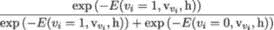
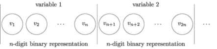

## 5

量子玻尔兹曼机

正如我们在第三章和第四章中看到的，量子退火可以用来解决难度较大的优化问题。然而，量子退火的应用范围远不止于此。在本章中，我们将讨论两个不同但相关的应用案例，这些应用超出了优化问题的解决：采样和训练深度神经网络。具体来说，我们将重点介绍量子玻尔兹曼机（QBM）——一种生成模型，是经典限制玻尔兹曼机（RBM）和深度玻尔兹曼机（DBM）的直接量子退火对应物——以及深度玻尔兹曼机（DBM）——一种由多层潜在变量组成的深度神经网络，层与层之间有连接，但层内单元之间没有连接。

我们首先提供经典 RBM 的详细描述，包括相应的训练算法。由于 RBM 在随机二进制激活单元上操作，因此可以建立 RBM 图与嵌入到量子芯片上的 QUBO 图之间的对应关系。这为使用量子退火进行玻尔兹曼采样（RBM 和 DBM 训练过程中的关键阶段）提供了主要动力。

DBM 可以作为生成模型和判别模型进行训练。在这两种情况下，由于 DBM 可以通过堆叠 RBM 层来构建，因此高效的玻尔兹曼采样是训练过程中的关键元素。量子退火可以集成到混合量子经典训练过程中，具有提高速度和准确度的潜力。量子加速是预期量子优势中特别有吸引力的元素，因为它不仅可以在 RBM 训练阶段实现，还可以在生成新样本的过程中实现。

### 5.1 从图论到玻尔兹曼机

我们在此提供一个简短的图论自包含回顾，以介绍玻尔兹曼机（或能量模型），它们可以视为特定类型的连接图或网络。

*图* 是一组顶点（点或节点）和连接顶点的边。*有向图* 是一种包含有序顶点对的图，而*无向图* 是一种包含无序顶点对的图。

我们考虑一个图 𝒢 = (𝒱*,*ℰ)，其中𝒱表示有限个顶点，ℰ表示无向边。对于给定的顶点 *v* ∈𝒱，其邻域被定义为与它通过某条边相连的所有顶点的集合，或者

最后，*团* 𝒞是𝒱的一个子集，满足𝒞中的所有顶点通过ℰ中的某条边成对相连。

对于每个顶点 *v* ∈𝒱，我们将关联一个随机变量 *X*[v]，它的取值来自某个空间 𝒳。向量 *X* ∈𝒳^(|𝒱|) 被称为马尔可夫随机场，如果

以下定理最初由哈默斯利和克利福德[125]（另见[167，定理 4.2]）证明，提供了一种在图上以方便的形式表达马尔可夫随机场法则的方法。马尔可夫性质在此处至关重要，因为动态（例如，从隐藏层到可见层的信号传递，在 RBM 网络中）应仅依赖于当前状态，而不依赖于系统所经过的整个路径。

**定理 8**（哈默斯利-克利福德定理）**。** *A* *严格正分布仅当且仅当它在无向图上进行因式分解时，才满足马尔可夫性质。*

换句话说，定理表明，如果其分布可以表示为

|  |  |
| --- | --- |

对于一个函数集{*ψ*[C]}[C∈𝒞]，这些函数被称为所有团体*C* ∈𝒞上的潜力函数，其中*Z*是一个归一化常数，确保概率的积分为 1。在这里，x[C]自然对应于向量 x 在团体*C*上的元素。分解通常是在所谓的*最大团体*上进行的，即那些如果添加任何节点就不再是团体的团体。如果*X*的分布严格为正，那么{*ψ*[C]}[C∈𝒞]也是正的，因此(5.1)可以写为

|  |  |
| --- | --- |

对于所有 x ∈𝒳^(|𝒱|)。该函数

该函数称为*能量*函数。由于它们在统计物理学中的应用，马尔可夫随机场的严格正分布，形式为(5.1)，也被称为玻尔兹曼分布或吉布斯分布。

基于能量的模型是生成模型，通过对观察到的和潜在变量的每种配置应用兼容性度量（标量能量）来发现数据依赖性。推理的目标是寻找潜在变量的值，在给定观察变量值的情况下，使得能量最小化。基于能量的模型具有许多有用的属性（简洁性、稳定性、灵活性、可组合性）——这使得它们成为学习复杂多变量概率分布的首选模型。

### 5.2 限制玻尔兹曼机

#### 5.2.1 RBM 作为一种基于能量的模型

RBM 对应于这种图的特殊结构，称为二分图，其中顶点集 𝒱 可以被拆分成两个组，分别是可见顶点 𝒱[V] 和隐藏顶点 𝒱[H]，使得边集 ℰ 仅由形式为 {*v,h*}∈𝒱[V] ×𝒱[H] 的元素组成。图  5.1 提供了实现二分图结构的 RBM 的示意图。这特别意味着，团只能是大小为一（所有单点节点）或二（所有 (*v,h*) 对）在 𝒱[V] ×𝒱[H] 中。为了简化，我们将 v 表示为 𝒳^(|𝒱[V] |) 的一个元素，h 表示为 𝒳^(|𝒱[H]|) 的一个元素，并将随机变量 *X* 与顶点对应。以下引理给出了 RBM 的能量函数的一般形式（5.1）。

**引理 6**（RBM 能量引理）**.** *在限制玻尔兹曼机中，能量函数的形式为*

|  |  |
| --- | --- |

*对于任何* v := (*v*[1]*,…,v*[N]) ∈𝒳^(|𝒱[V] |)*,* h := (*h*[1]*,…,h*[M]) ∈𝒳^(|𝒱[H]|)*. 这里，*N* 是可见顶点的数量，*M* 是隐藏顶点的数量。*

*证明。* 根据哈默斯利-克利福德定理，对于任何 v ∈𝒳^(|𝒱[V] |)，h ∈𝒳^(|𝒱[H]|)，我们有以下分解式：

| ℙ(v*,*h) | = ∏ [C∈𝒞]*ψ*C ∈ *C*) |
| --- | --- |
|  | = ∏ [{{v}:v∈𝒱[V] }]*ψ*{v}∏ [{{h}:h∈𝒱[H]}]*ψ*{h}∏ [{{v,h}∈𝒱[V] ×𝒱[H]}]*ψ*{v,h} |
|  | = exp*,* |

在所有单点集（大小为一的团）和二点集（大小为二的团）上，其中项 −*E*(v*,*h) 表示

| − *E*(v*,*h) | = log  |
| --- | --- |
|  | = log  |
|  | + log  |
|  | + log  |
|  | = ∑ [{{v}:v∈𝒱[V] }]log  |
|  | + ∑ [{{h}:h∈𝒱[H]}]log  |
|  | + ∑ [{{v,h}∈𝒱[V] ×𝒱[H]}]log  |
|  | = −∑ [i=1]^N*E* v −∑ [j=1]^M*E* h −∑ [i=1]^N ∑ [j=1]^M*E* v,h*,* |

这就完成了引理的证明。□

RBM 的标准示例是当随机变量服从伯努利分布时，即 𝒳 = {0*,*1}^(|𝒱|)。在这种情况下，它们的能量为

|  |  |
| --- | --- |

对于某些参数 *a*[i]，*b*[j]，*w*[ij]，*i* = 1*,…,N*，*j* = 1*,…,M*。特别地，对于给定的 *v*[i]，我们可以使用贝叶斯公式表示：

| ℙ(*v*[i] = 1&#124;v[v[i]]*,*h) | =  |
| --- | --- |
|  | = *.* | (5.2.1) |  |

其中我们表示 v[v[i]] 为 𝒱∖{*v*[i]} 中所有节点的状态。现在，使用 RBM 能量引理，我们可以利用(5.2.1)将来自特定节点 *v* 的能量单独提取出来，如下所示：

其中

|  |  |
| --- | --- |

将此代入(5.2.1)后得到

|  |  |
| --- | --- |

因为 Φv = 0，其中

|  |  |
| --- | --- |

是 Sigmoid 函数。

类似地，我们可以使用 RBM 能量引理将给定隐藏节点 *h*[j] 上的能量贡献单独提取出来：

其中

| ![ ∑N [ ∑N ] Φh (hj) := bjhj + wijvihj = bj + wijvi hj, i=1 i=1 N M N M Ψ (v,h ) := ∑ a v + ∑ b h + ∑ ∑ w vh . h hj i i k k ik i k i=1 k=1(k⁄=j) i=1k=1(k⁄=j) ](img/file413.jpg) |  |
| --- | --- |

将此代入(5.2.1)后得到

|  |  |
| --- | --- |

因为再次有 Φh = 0\。

#### 5.2.2 RBM 网络架构

如上所示，RBM 是一个浅层的两层神经网络，操作在随机二进制激活单元上。该网络形成一个二分图，将随机二进制输入（可见单元）与随机二进制特征检测器（隐藏单元）连接，且同一层内的单元之间没有连接，如图 5.1 所示 [102]。

图 5.1：具有可见层单元（白色）和隐藏层单元（深色）形成二分图的 RBM 的示意图。

只有网络的可见层暴露给训练数据集，输入 v := (*v*[1]*,…,v*[N]) 流经网络（前向传播）到达隐藏层，在此它们被聚合并添加到隐藏层偏置 b := (*b*[1]*,…,b*[M])。隐藏层的 Sigmoid 激活函数(5.2.1)将聚合的输入转换为概率。然后每个隐藏单元以随机方式“触发”，并输出一个 {0*,*1} 的伯努利随机变量，其相关概率为：

|  |  |
| --- | --- |

来自隐藏层的输出 h := (*h*[1]*,…,h*[M]) 随后反向传递（反向传播）到可见层，在那里它们被聚合并加到可见层的偏置 a := (*a*[1]*,…,a*[N])。与隐藏层类似，可见层的 sigmoid 激活函数首先将聚合的输入转换为概率，然后转化为伯努利随机变量：

|  |  |
| --- | --- |

因此，每个单元最多传递一个比特的信息。这对于隐藏单元尤为重要，因为这个特性实现了信息瓶颈结构，作为一种强正则化器[134]。如果网络被组织并训练成自编码器，网络的隐藏层可以学习数据集的低维概率表示。

#### 5.2.3 样本编码

图 5.2 展示了输入信号的二进制表示，信号通过可见层进入网络。可见层中激活单元的数量由我们需要编码的特征数和其二进制表示的所需精度决定。例如，如果我们的样本由 *m* 个连续特征组成，并且每个特征被编码为 *n* 位二进制数，则可见层中的激活单元总数为 *m* × *n*。

图 5.2：连续变量的示意二进制编码。

#### 5.2.4 博尔兹曼分布

网络通过尝试从训练数据集（可见单元值）重建输入，来学习可见和隐藏激活单元配置的概率分布 ℙ(v*,*h) —— 即博尔兹曼分布 —— 通过找到网络权重和偏置的最佳集：

|  |  |
| --- | --- |

其中能量函数为

|  |  |
| --- | --- |

这里，*Z* 是配分函数：

|  |  |
| --- | --- |

然而，我们通常感兴趣的是，如果我们希望生成与原始训练数据集具有相同统计性质的新样本，则学习可见层配置的概率分布，或者如果我们希望构建一个深度神经网络，其中 RBM 层执行特征提取和降维功能，则学习隐藏层配置的概率分布。可见（隐藏）状态的概率是通过对所有可能的隐藏（可见）向量求和得到的：

|  |  |
| --- | --- |

最常用的 RBM 训练算法 *k-step Contrastive Divergence* 是由 Hinton 提出的 [134，133]。该算法旨在最大化训练向量的对数概率，即找到一组网络权重和偏置，使得“能量”函数 *E* 对训练数据集中的样本最小化（能量值越小，配置的概率越大）。*k*-步 CD 算法在第 5.3.2 节中有完整说明，感兴趣的读者还可以通过 Fischer 和 Igel 的工作 [103] 获得有关 RBM 训练的精彩介绍。

#### 5.2.5 伯努利 RBM 的扩展

我们上述讨论的标准伯努利 RBM 设置将可见层 v 限制为伯努利分布。事实上，只要哈默斯利-克利福德定理成立，我们可以考虑任何分布或任何形式的能量函数。例如，[62，178] 中曾表明，隐藏层的伯努利分布与可见层的高斯分布是与如下形式的能量函数兼容的：

对于某些参数 *a*[i]、*σ*[i]、*b*[j]、*w*[ij]，*i* = 1*,…,N*，*j* = 1*,…,M*。在这种情况下，对于任何 *h*[j]，条件概率 ℙ(*h*[j] = 1|v) 保持 sigmoid 形式，并且可见层的条件分布为高斯分布，如下所示：

我们考虑的 RBM 不考虑时间序列，即具有时间依赖性的概率结构。通过扩大相应的图，特别是添加一个具有有向连接的条件层到经典的隐藏层和可见层，Taylor [280] 表示可以考虑这种依赖性。

RBM（受限玻尔兹曼机）是一种由二分图表示的神经网络。其强大之处在于操作随机二进制激活单元。它是一种生成模型，通过其权重和偏置编码学习到的概率分布，然后生成与原始数据集中的样本在统计上无法区分的新样本。

如果它被组织为具有瓶颈信息结构的自编码器，RBM 能够学习数据集的低维表示。这一特性表明，RBM 可以作为机器学习管道中的特征提取层，用于某些监督和无监督学习问题。

### 5.3 训练和运行 RBM

构建神经网络意味着指定网络架构和训练算法。在前一节中已经描述了 RBM 的架构，现在我们概述训练流程。

#### 5.3.1 使用玻尔兹曼采样训练 RBM

RBM 训练的目标是估计模型参数（权重和偏置）的最优向量 𝜃，使得 ℙ𝜃 = ℙdata。对于给定的训练样本 v := (*v*[1]*,…,v*[N])，RBM 旨在最大化对数似然函数，即

其中，对于任何 v，

标准优化方法，如 [133] 所提出的，是一种标准的梯度上升方法，即从初始猜测 𝜃⁰ 开始，我们按以下方式更新：

直到我们达到足够好的收敛。为了计算它，首先需要计算联合概率 ℙ(*v*[i]*,h*[j])，这通常通过玻尔兹曼（吉布斯）采样完成 [3]，因为我们确切知道条件分布。

#### 5.3.2 对比散度算法

在训练 RBM 时，可以使用玻尔兹曼采样，但这通常是非常昂贵的。为了提高效率，提出了一种更高效的训练算法——*k*-步对比散度（CD）算法，参考了 [134]。

![--------------------------------------------------------------------- -算法---2:-k-步-对比-散度-------------------------- 结果：权重和偏置更新。输入： • 训练小批量 S； • 模型参数 ai,bj,wij，对于 i = 1,...,N,j = 1,...,M（更新前）。初始化：对所有 i,j : Δwij = Δai = Δbj = 0 对于 v ∈ S 做 | v(0) ← v | | 对 t = 0,...,k − 1 做 | | 对 j = 1,...,M 做 | | | (t) (t) | | | 采样伯努利随机变量 hj ∼ ℙ(hj|v ) | | 结束 | | | | 对 i = 1,...,N 做 | | | 采样伯努利随机变量 v(t+1) ∼ ℙ(vi|h(t)) | | i | 结束 | 结束 | | 对 i = 1,...,N, j = 1(,...,M 做 ) | | (0) (0) (k) (k) | Δwij ← Δwij + η ℙ(hj = 1|v )vi − ℙ(hj = 1|v )vi | 结束 | | 对 i = 1,...,N 做( ) | | Δai ← Δai + η v(0) − v(k) | i i | 结束 | | 对 j = 1,...,M 做( ) | | Δbj ← Δbj + η ℙ(hj = 1|v(0)) − ℙ(hj = 1|v(k)) | 结束 结束 --------------------------------------------------------------------- ](img/file428.jpg)

*k* 的选择平衡了准确性和速度。对于许多实际应用，*k* = 1 是一个最佳选择，尽管在这种情况下，期望值可能会有偏差。然而，这种偏差往往是很小的 [53]。网络通过更新权重和偏置来训练，这些更新增加了训练向量的对数概率，更新公式如下：

|  |  |
| --- | --- |
|  |  |
|  |  |

其中 ⟨⋅⟩ 表示在下标所指定的分布下的期望，*η* 是选择的学习率。期望 ⟨⋅⟩[data] 可以直接从训练数据集计算，而获得无偏样本 ⟨⋅⟩[model] 则需要在模型的玻尔兹曼分布中进行交替采样一段较长时间（这是为了实现热平衡状态），并且从某个随机初始化的状态开始。然而，*k* 步骤的 CD 方法可以用来近似 ⟨⋅⟩[model]，通过另一个更易计算的期望，如算法 2 所示。

#### 5.3.3 合成样本的生成

一旦网络完全训练好，就可以用来从学习到的分布中生成新的样本。例如，RBM 可以作为一个市场生成器，生成新的市场情景，这些新样本来自于网络权重和偏置中编码的市场风险因素的多元分布。

第一步是生成一个随机输入：每个可见单元都被初始化为一个随机生成的二进制变量。第二步是在可见层和隐藏层之间进行大量的前向和后向传播，直到系统达到*热平衡*状态：即初始的随机向量被转换为从学习到的分布中抽取的样本。达到热平衡状态所需的周期数取决于具体问题，是网络架构和网络参数（权重和偏置）的函数。在某些情况下，生成独立样本需要进行 10³ − 10⁴次前向和后向传播[173]。最后一步是从可见层读取输出，这将给我们一个比特串，编码了来自目标分布的样本。

图 5.3 展示了从两个股票指数的每日回报分布中抽取的样本的 QQ 图：德国 DAX 和巴西 BOVESPA。回想一下，分位数-分位数（或 QQ）图是通过将两个分位数集相互对照，绘制成的散点图。如果这两个集来自同一分布，所有点应该接近对角线。数据集包含 536 个样本– 从 2009 年 1 月 5 日到 2011 年 2 月 22 日之间观察到的每日指数回报（UCI 机器学习库[10，9]）。"Normal"分布将每日回报建模为正态分布，其均值和方差与历史数据集中的匹配。"RBM"分布是 RBM 生成的样本数据集，理想情况下应具有与原始历史数据集完全相同的统计特性。如果从两个分布中抽取的样本具有相同的分位数，QQ 图中的所有点都将位于对角线处，我们可以得出结论，这两个分布是相同的。图 5.3 显示，来自"Data"和"RBM"分布的样本确实符合这一点（具有相当好的准确性），而两者在与拟合的正态分布相比时，显示出更重的尾部。

图 5.3 中显示的结果是通过在每日回报数据集上训练的 RBM 得到的。每个来自训练数据集的回报都被转换为一个 12 位二进制数。二进制数的每一位被当作一个独立的二进制特征处理（每个索引有 12 个特征；总共有 24 个特征）– 这要求在 RBM 网络的可见层中放置 24 个激活单元。隐藏单元的数量设置为 16。因此，网络作为一个强正则化的自编码器进行训练。生成的回报（以二进制格式）随后被转换回它们的连续表示。该模型是来自开源`scikit-learn`包的 Bernoulli RBM（sklearn.neural_network.BernoulliRBM）[230]，其参数设置如下：

+   n_components = 16 – 隐藏激活单元的数量

+   learning_rate = 0.0005

+   batch_size = 10 – 训练小批量的大小

+   n_iter = 40000 – 迭代次数

合成数据生成方法可以表述为算法 3。

![--------------------------------------------------------------------- -算法---3:-合成数据生成----------------------------- 1: 原始数据集二进制表示的构建：a) 连续特征可以转换为具有所需精度的等效二进制表示。b) 整数特征 x ∈ {x1,...,xn} 可以通过标准程序转换为 N 位二进制数，其中 N−1 N 2 ≤ 1m≤ajx≤n(xj)− 1m≤ijn≤n(xj) < 2。c) 类别特征可以通过独热编码方法或与整数特征相同的程序进行二值化，因为类别值可以枚举。d) 类别标签同样适用，包括整数和类别类型。2: 使用 1 步 CD 算法在原始数据集的二进制表示上训练 RBM。3: 生成所需数量的新合成样本（以二进制格式）。4: 对于每个合成数据样本：将生成的二进制特征转换为相应的类别、整数和连续表示。5: 生成的合成数据集已准备好用于各种分类器和回归器的训练。 ---------------------------------------------------------------------](img/file432.jpg)

图 5.3：生成的和历史回报的 QQ 图。a)-c) DAX. d)-f) BOVESPA。RBM 学习了股票指数回报的重尾经验分布。

Kondratyev 和 Schwarz [173] 提出了基于 RBM 的市场生成器，并研究了其在日常外汇对数回报数据集上的属性。四个货币对的对数回报时间序列涵盖了 20 年的时间间隔（1999-2019），这使得 RBM 能够学习多变量分布的依赖结构，并成功重建线性和秩相关性以及联合尾部行为。此外，还表明，RBM 可以用于执行条件采样（例如，从低波动/高波动状态），并通过调整热化参数来实现所需的自相关程度。RBM 基于的合成数据生成器的其他有效应用包括数据匿名化、对抗过拟合和异常值检测，正如 Kondratyev、Schwarz 和 Horvath [174] 所展示的那样。

除了在随机二进制激活单元上操作外，RBM 还通过自编码器架构和使用随机梯度上升法进行训练，从而增强了对过拟合的抵抗力。这使得 RBM 能够从相对较小的数据集中学习复杂的多变量概率分布，同时避免了过拟合。

### 5.4 量子退火与玻尔兹曼采样

将量子退火应用于玻尔兹曼采样基于 RBM 能量函数（见 5.2.4）与量子退火中的哈密顿量之间的直接对应关系。回顾第二章，量子退火基于绝热演化的原则，从初态 *t* = 0 开始，由哈密顿量ℋ[0]定义，到最终状态 *t* = *T* 结束，由哈密顿量ℋ[F]定义，系统在时间 *t* ∈ [0, T]时的哈密顿量为：

|  |  |
| --- | --- |

其中 *r*(*t*) 从 1 递减到 0，随着 *t* 从 0 到 *T* 变化。理想的绝热演化场景设想系统始终保持在ℋ(*t*)的基态：如果系统从ℋ[0]的基态开始，且演化过程足够缓慢以满足量子绝热定理的条件（见第二章），那么系统最终将达到ℋ[F]的基态。

实际上，现有的量子退火硬件并没有严格满足量子绝热定理的条件。量子退火器在约 15mK 的非常低温下工作[90]，但仍然存在一些残余的热噪声。同时，量子比特之间也会有一些串扰，物理量子比特的链条代表逻辑量子比特时，这些链条可能会被破坏。串扰是指某个或多个量子比特的期望操作不小心影响到其他一个或多个量子比特。在某些情况下，串扰是计算错误的主要来源。这对量子退火器解决优化问题提出了严重的挑战，尤其是当主要目标是找到精确的基态时。但是，如果我们想将量子退火器作为采样器使用，一定量的残余热噪声和电磁噪声是可以接受的。

#### 5.4.1 玻尔兹曼采样

量子退火器作为采样引擎的基础是中心提议[4]，即激发态的分布可以被建模为玻尔兹曼分布：

|  |  |
| --- | --- |

其中 *β* 是某个参数（可以视为有效的倒数温度），*Z* 是配分函数：

|  |  |
| --- | --- |

如果我们将二进制向量 x 定义为可见节点向量 v 和隐藏节点向量 h 的连接：

|  |  |
| --- | --- |

然后，通过比较 5.2.4 和 5.4.1，我们可以建立能量函数 *E* 与哈密顿量ℋ[F]之间的直接对应关系。因此，我们可以提出一种替代方法来计算期望值 ⟨⋅⟩[model]，该方法按照以下算法[4]进行：

使用量子退火进行玻尔兹曼采样有两个主要的动机，如算法 4 所述。首先，它绕过了运行对比散度算法（算法 2）的需要，该算法仅提供对期望值⟨⋅⟩[model]的近似值（尽管这些近似可以非常准确）。其次，从玻尔兹曼分布生成新样本所需的退火时间约为∼1 微秒，与图的大小无关。在经典的 RBM 中，情况并非如此，通常需要进行数千次的前向和反向传播，才能读取到网络权重和偏置中编码的玻尔兹曼分布的独立新样本[173]。对于大的 RBM 图，在标准硬件上可能需要花费数十毫秒。因此，我们可以从准确性和加速两个方面来探索量子退火为玻尔兹曼采样带来的潜在量子优势。

#### 5.4.2 映射

在量子退火器上执行玻尔兹曼采样的第一步是将 RBM 映射到量子退火硬件图上。我们从为 RBM 能量函数*E*写出以下形式的表达式开始：

|  |  |
| --- | --- |

这里，*Q*是一个(*N* + *M*) × (*N* + *M*)矩阵，其元素是 RBM 的权重和偏置：

| ![ ⌊ &#124; ⌋ &#124;a1 0 ... 0 &#124;w11 w12 ... w1M &#124; &#124;&#124; 0 a2 ... 0 &#124;w21 w22 ... w2M &#124;&#124; &#124;&#124; . . . . &#124; . . . . &#124;&#124; &#124; .. .. .. .. &#124; .. .. .. .. &#124; &#124;&#124; 0 0 ... a &#124;w w ... w &#124;&#124; Q = 1-&#124;&#124;-------------N--&#124;--N1---N2--------NM--&#124;&#124;. β &#124;&#124; 0 0 ... 0 &#124; b1 0 ... 0 &#124;&#124; &#124;&#124; &#124; &#124;&#124; &#124;&#124; 0 0 ... 0 &#124; 0 b2 ... 0 &#124;&#124; &#124; ... ... ... ... &#124; ... ... ... ... &#124; ⌈ &#124; ⌉ 0 0 ... 0 &#124; 0 0 ... bM ](img/file440.jpg) |  |
| --- | --- |

量子退火器操作的是自旋变量{−1*,*+1}，而不是二进制变量{0, 1}。二进制变量向量 x 可以通过以下方式转换为自旋变量向量 s：

|  |  |
| --- | --- |

然后我们得到 RBM 能量的以下表达式：

|  |  |
| --- | --- |

其中，对于 *i* = 1, …, N 和 *j* = *N* + 1, …, *N* + *M*，

|  |  |
| --- | --- |

并且 (*s*[i])[i=1,…,N] 是对应可见节点的自旋变量，而 (*s*[j])[j=N+1,…,N+M] 是对应隐藏节点的自旋变量。

我们可以忽略 RBM 能量表达式中的常数项 (5.4.2)，因为相同的因子将在 ℙ(v*,*h) 的分子和分母中出现。因此，我们得到：

|  |  |
| --- | --- |

为了使用量子力学描述自旋来表达伊辛哈密顿量，我们用相应的保利算符替换自旋变量：

|  |  |
| --- | --- |

其中 *σ*[z]^i 是表示伊辛量子自旋的常用保利矩阵。初始哈密顿量为：

|  |  |
| --- | --- |

随时间变化的哈密顿量 (5.4) 形式为：

|  |  |
| --- | --- |

#### 5.4.3 硬件嵌入和参数优化

在现有量子退火器的标准编程实践中，每个自旋变量 *s*[i] 理想情况下应分配给一个特定的芯片元素，即超导量子通量比特，模型为量子二能级系统，可以表示量子哈密顿量。

|  |  |
| --- | --- |

虽然每个量子比特支持 *g*[i] 项的编程，但 *J*[ij] 参数可以通过电感元件以能量方式实现，这些元件旨在表示。

|  |  |
| --- | --- |

仅当量子比特 *i* 和 *j* 之间存在所需的电路时才能实现，否则它们在处理器的空间布局中不能制造得太远，以避免工程上的问题 [296]。换句话说，除非 (*i,j*) ∈ *G*，否则 *J*[ij] = 0，其中 *G* 是特定的量子退火图（例如，在 D-Wave 量子退火器的情况下，*Chimera* 或 *Pegasus* 图）。

如果所有物理量子比特都已互相连接，则将最终的哈密顿量 (5.4.2) 嵌入到量子芯片上是很简单的。遗憾的是，实际情况并非如此。现有的量子退火器的量子比特连接性非常有限。例如，在 *Chimera* (*Pegasus*) 图中，一个物理量子比特最多与六个（十五个）其他物理量子比特连接。

为了绕过这一限制，标准的做法是采用次要嵌入编译技术来处理完全连接的图。通过这一过程，我们得到另一个伊辛模型形式，其中量子比特按顺序排列成 1D 链（形成代表自旋变量的*逻辑*量子比特），并交错于量子退火器图上：

| ![ N∑ [Nc∑−1 ] N+∑M [Nc∑−1 ] ℋIsing = − &#124;JF&#124; σicσi(c+1) − &#124;JF &#124; σjcσj(c+1) i=1 c=1 z z j=N+1 c=1 z z ](img/file450.jpg) |  |
| --- | --- |
| ![ N [ Nc ] N+M [ Nc ] − ∑ gi- ∑ σic − ∑ gj- ∑ σjc Nc z Nc z i=1 c=1 j=N+1 c=1 ](img/file451.jpg) |  |
|  |  |

在 (5.4.3)中，我们显式地分离出*逻辑*量子变量的编码：经典二进制变量*s*[i]与*N*[c]个伊辛自旋*σ*[z]^(ic)相关联，通过耦合强度*J*[F] 直接发生铁磁耦合，形成一个有序的 1D 链子图*G*。如果在计算基下测量，每个自旋的磁化强度值应足够强，以便能够相关联（⟨*σ*[z]^(ic)⟩ = ⟨*σ*[z]^(i(c+1))⟩）。

在 (5.4.3)和 (5.4.3)中，我们通过扩展的变量集对伊辛哈密顿量 (5.4.2)进行编码：局部场*g*[i]均匀分布在属于逻辑链*i*的所有量子比特上，每个耦合器*J*[ij]仅在一对特定的量子比特之间激活（*σ*[z]^(ic[i]^⋆)*,σ*[z]^(jc[j]^⋆)），该对量子比特由邻接检查函数*δ*[ij]^G(*c*[i]*,c*[j])指定，只有当(*c*[i] = *c*[i]^⋆)且(*c*[j] = *c*[j]^⋆)时，函数值为 1，否则为 0。

在这个特定的嵌入方案下，我们可以将注意力集中在实验性地寻找参数*β*的最优值上（见 5.4.2），这一点只能通过实验来完成。由于最终的哈密顿量是在量子退火器上使用无量纲系数编程的，因此参数*β*不能用常规形式 1*∕kT* 来表示，其中*k*是玻尔兹曼常数，*T*是有效温度。相反，它应该被视为一个经验参数，依赖于网络架构、嵌入方案以及量子退火器的物理特性（例如工作温度、退火时间、超导流量量子比特系统的能量尺度等）。

估算*β*的实验方法包括以下五个步骤 [4]：

1.  构建一个 RBM。

1.  将 RBM 映射到假设特定*β*值的最终哈密顿量（算法 4-第 1 步）。

1.  运行量子退火（算法 4-第 2 步）。

1.  使用量子样本计算模型期望值（算法 4-第 3 步）。

1.  将结果期望值与“正确”的基准值进行比较（例如，使用经典 CD 算法获得的值）。

这个过程会针对不同的*β*值进行重复。然后，可以使用给定 RBM 架构的最佳拟合的*β*值。如在[4]中所述，即使对于*β*的最优设置，模型期望值的估计仍然会有一定误差。然而，与对比散度算法中玻尔兹曼采样相关的噪声相比，这可能足以估计 5.3.2 中的梯度，5.3.2 中的梯度，以及 5.3.2 中的梯度。

#### 5.4.4 生成模型

到目前为止，我们考虑的玻尔兹曼采样的主要应用是在提供无偏估计模型期望值上，正如算法 4 中所指定的那样。一旦通过量子退火完成充分训练，RBM 就可以以传统的经典方式，用于从已学习的概率分布中生成新的合成样本。在这种情况下，量子退火仅作为混合量子-经典训练协议中的一个子程序使用。

然而，完全可以将量子退火器本身作为生成器使用。量子退火器不仅仅协助训练经典的 RBM，它还可以根据最终哈密顿量(5.4.2)编码的分布输出连续样本的二进制表示。量子变分自编码器[162]是另一个 QBM 的例子，它可以通过最大化明确定义的代价函数来端到端地训练：量子变分下界近似对数似然。

玻尔兹曼采样是 RBM 训练和新样本生成的关键元素。通过用量子采样替代经典的玻尔兹曼采样，量子退火可以提供数量级的加速。

### 5.5 深度玻尔兹曼机

深度玻尔兹曼机（DBM）可以由多个 RBM 构成，其中第一个 RBM 的隐藏层成为第二个 RBM 的可见层，依此类推，如图 5.4 所示。

图 5.4：DBM 的示意图。

DBM 可以逐层训练，每次训练一个 RBM。这将生成一个强大的生成模型，能够学习复杂的多变量分布和依赖结构。然而，DBM 的生成训练可以作为构建判别模型的第一步，如果训练数据集的样本有标签。在这种情况下，所有通过 CD 或量子玻尔兹曼采样算法获得的 DBM 权重和偏置，都会被视为相应前馈神经网络权重和偏置的初始值。判别模型将包括原始 DBM 的所有层，并增加一个额外的输出层，用于分类标签的分配。通过标准的误差反向传播算法，可以对判别模型进行微调。

#### 5.5.1 使用量子退火训练 DBM

DBM 的生成训练可以看作是判别模型的预训练。图 5.5 提供了混合量子-经典训练过程的示意图。

图 5.5：DBM 的生成训练与判别训练。

在图 5.5 所示的 DBM 训练方案中，只有步骤 1 依赖于量子退火。步骤 2 和步骤 3 完全是经典的。步骤 3 是可选的：没有它，我们就拥有一个标准的机器学习“管道”，其中一个或多个 RBM（步骤 1）通过构建数据集样本的低维表示来执行“特征提取”，从而帮助判别模型（步骤 2）实现更好的分类结果。

#### 5.5.2 一个 DBM 管道示例

管道方法可以使用 UCI 机器学习库中的流行数据集“国王+车 vs. 国王+兵”来说明[262, 263]。任务是分类残局，其中黑色兵即将升变，而白方（国王+车）即将走子。可能的结果是“白方可以赢”（类 1）和“白方不能赢”（类 0）。棋盘由 36 个类别属性描述，可以编码为 38 个二进制变量。数据集包含 3196 个样本（在数据集的所有案例中，白方可以赢 52%）。

`scikit-learn`包提供了构建 DBM 管道经典部分所需的所有组件。可以借助`sklearn.pipeline.make_pipeline`构建管道本身。DBM 是由两个 RBM 构建的，这些 RBM 是通过`sklearn.neural_network.BernoulliRBM`实现的。RBM #1 在可见层有 38 个节点，在隐藏层有 30 个节点；RBM #2 在可见层有 30 个节点，在隐藏层有 20 个节点。确切的管道配置如下（所有其他参数设置为默认值）：

| RBM #1 | RBM #2 | MLP 分类器 |
| --- | --- | --- |
| n_components = 30 | n_components = 20 | hidden_layer_sizes = (20) |
| learning_rate = 0.00025 | learning_rate = 0.00025 | activation = 'tanh' |
| batch_size = 10 | batch_size = 10 | solver = 'adam' |
| n_iter = 100000 | n_iter = 100000 | alpha = 0.1 |
|  |  | max_iter = 5000 |

表 5.1：用于“国王+车 vs. 国王+兵”分类问题的 DBM 管道配置。

因此，两个 RBM 都被训练为自编码器：DBM 将每个 38 特征的样本转换为其 20 特征的低维表示。这些新的“提取”特征，理想情况下，应该比原始特征具有更高的预测能力，前提是两个 RBM 都学到了数据集的主要特征和依赖结构，并剔除了噪声或不太重要的特征。判别器是`sklearn.neural_network.MLPClassifier`，其单一隐藏层中有 20 个 tanh 激活单元。

在这个设置下，DBM 在以下的样本外分类结果（数据集按 70:30 比例分为训练集和测试集，使用`sklearn.model_selection.train_test_split`）中取得了以下成绩：

+   分类准确率：95.2%

这与例如集成学习分类器如随机森林（`sklearn.ensemble.RandomForestClassifier`）相比具有优势。设置 1000 个估计器和最大深度为 5 的随机森林分类器在样本外分类结果上取得了以下成绩：

+   分类准确率：94.9%

DBM 的架构使其可以作为生成模型或判别模型进行训练。在这两种情况下，玻尔兹曼采样都可以在提高其性能方面发挥重要作用。

### 摘要

在本章中，我们学习了基于能量的模型——一种强大的生成模型的特殊类型。我们学习了如何构建、训练和运行 RBM，以生成与原始训练数据集统计上无法区分的合成样本。

我们熟悉了玻尔兹曼采样和对比散度算法。玻尔兹曼采样可以在 NISQ 时代的量子退火机上高效执行，这可能提高模型的质量，并在生成新样本时实现数量级的加速。

我们学习了如何将单个 RBM 结合起来构建 DBM。量子退火可以有效地应用于 DBM 的预训练，然后将其微调为深度前馈神经网络分类器。

最后，我们探索了使用 RBM 和 DBM 作为机器学习管道中第一个模型进行去噪和特征提取的可能性。

在下一章中，我们将转向门模型量子计算。我们将从经典二进制数字（bit）和经典逻辑门的概念开始，然后介绍它们的量子对应物：量子二进制数字（qubit）和单量子比特/多量子比特量子逻辑门及量子电路。

### 加入我们书籍的 Discord 空间

加入我们的 Discord 社区，结识志同道合的人，并与超过 2000 名成员一起学习： [`packt.link/quantum`](https://packt.link/quantum)

