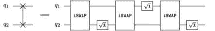
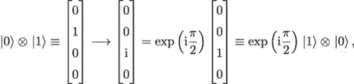
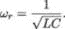

## 6

量子比特和量子逻辑门

计算可以广义地定义为一种将一个记忆状态转换为另一个记忆状态的过程。换句话说，计算是一个将信息转换的函数[281]。在经典数字计算的情况下，基本的记忆单元是*二进制数字*（比特）信息。对比特信息执行操作的函数被称为*逻辑门*。逻辑门是布尔函数，它们可以组合成*电路*，执行加法、乘法以及更复杂的操作。在逻辑门中，输出比特的数量不必与输入比特的数量相同。

计算可能看起来是一个抽象的数学概念，但它总是需要某种物理系统来执行。这个物理系统是什么并不重要：台球、电子开关、晶体管或任何其他物体——计算是与底层物质无关的。然而，始终是某种物理过程以受控的方式改变系统的状态。

经典数字计算要求物理实现两个不同的确定性状态（通常表示为 0 和 1），并且需要一组执行受控转换的逻辑门。在接下来的章节中，我们将看到经典数字计算如何实现，所需的基础操作集是什么，以及如何将经典计算的逻辑扩展到更一般的量子计算逻辑，而经典计算仅是量子计算的一个特例。

### 6.1 二进制数字（比特）与逻辑门

本节中，我们将快速回顾经典逻辑门及其普适性，以便稍后与量子门进行对比。

#### 6.1.1 逻辑门

逻辑门是布尔函数的实现，它是在一个或多个二进制输入上执行的逻辑操作，产生一个单一的二进制输出。逻辑门通过其*真值表*表示。真值表为每个输入变量提供一列，并且有一列最终显示该表表示的逻辑操作的所有可能结果。真值表的每一行包含输入变量的一个可能配置（一个比特或比特串），以及对于这些值的操作结果。

图表 6.1、6.2、6.3 和 6.4 是与门、或门、与非门（非与门）和异或门（排他或门）逻辑门的示意电路图及其对应的真值表。

图 6.1: 与门电路图和真值表。

图 6.2: 或门电路图和真值表。

图 6.3: 与非门电路图和真值表。

图 6.4：XOR 门的图示和真值表。

#### 6.1.2 NAND 作为通用逻辑门

逻辑门可以组合成电路，其中一个门的输出作为另一个门的输入。这使得我们能够 i) 实现比基本布尔函数更复杂的运算符，ii) 仅使用少量易于构建的逻辑门来实现所有必要的布尔函数。例如，所有布尔函数都可以仅使用 NAND 门和扇出操作来构建。这使得 NAND 成为经典计算中的 *通用* 门。图 6.5 通过展示将四个基本逻辑门（NOT、AND、OR、XOR）分解为仅由 NAND 门组成的电路来说明这一点。

图 6.5：逻辑门分解为 NAND 门和扇出操作的示例。

#### 6.1.3 利用 NAND 门构建加法运算符

图 6.6 展示了如何将 NAND 门和 XOR 门结合成一个实现基本加法运算符的电路。正如我们所知道的，XOR 门本身可以通过组合 NAND 门来构建。加法运算符接受三个 1 位二进制数作为输入，并输出两个 1 位二进制数，这可以作为一个 2 位二进制数（2-bit bitstring）进行读取。这个 2 位二进制数可以转换为它的整数表示——一个介于 0 到 3 之间的整数，如真值表（表 6.1）所示。

图 6.6：加法运算符：输入是三个 1 位二进制数，输出是一个 2 位二进制数。

| 输入 1 | 输入 2 | 输入 3 | 输出 1 | 输出 2 | 二进制 | 整数 |
| --- | --- | --- | --- | --- | --- | --- |
| 0 | 0 | 0 | 0 | 0 | 00 | 0 |
| 0 | 0 | 1 | 0 | 1 | 01 | 1 |
| 0 | 1 | 0 | 0 | 1 | 01 | 1 |
| 1 | 0 | 0 | 0 | 1 | 01 | 1 |
| 0 | 1 | 1 | 1 | 0 | 10 | 2 |
| 1 | 0 | 1 | 1 | 0 | 10 | 2 |
| 1 | 1 | 0 | 1 | 0 | 10 | 2 |
| 1 | 1 | 1 | 1 | 1 | 11 | 3 |

表 6.1：加法运算符真值表。

计算是将一种内存状态转换为另一种内存状态的过程。执行这种转换的函数被称为逻辑门。逻辑门由它们的真值表完全定义。一个通用逻辑门是指从它可以构建所有其他布尔函数的逻辑门。我们只需要找到一个通用门的高效物理实现，就可以执行任意复杂度的计算。

### 6.2 经典比特和逻辑门的物理实现

到目前为止，我们已经从计算机科学理论的角度定义了比特和经典逻辑门。接下来，我们将概述实现这些操作的最有效硬件技术。

#### 6.2.1 NAND 门的实现

NAND 门（与扇出操作符一起）是经典数字计算中的通用门。因此，只需找到 NAND 布尔函数的一个实用物理实现，就足以构建一个通用计算机。图 6.7 展示了使用不同技术（从电气开关到半导体）实现 NAND 门的几种可能方式。

**继电器逻辑：** 开关被解释为位，0 = 开，1 = 闭。当 A 和 B 开关都闭合时，电磁铁会打开 C 开关。如果 A 和 B 中的任意一个或两个开关都为开，则电路断开，电磁铁无法打开 C 开关。

**电阻-晶体管（RT）逻辑：** 电压被解释为位，0 = 0 伏，1 = 3 伏。当 A 和 B 两根导线都为+3 伏时，两个晶体管导通，C 线降至零伏。如果 A 和 B 的输入之一或两者都为零伏，则相应的晶体管不导通，输出 C 保持在+3 伏。

**互补金属氧化物半导体（CMOS）逻辑：** 与 RT 逻辑类似，电压被解释为位，0 = 0 伏，1 = 3 伏。当输入为 1（+3 伏）时，PMOS 晶体管导通；当输入为 0（零伏）时，PMOS 晶体管关闭。NMOS 与 PMOS 的逻辑相反。PMOS 电路位于电压源与输出之间，NMOS 电路位于输出与地之间。

如果 A 和 B 输入都为高电平，则两个 NMOS 晶体管都会导通，两个 PMOS 晶体管都不会导通，输出端 C 与地之间将形成导电通路，从而使输出变为低电平。如果 A 和 B 输入都为低电平，则两个 NMOS 晶体管都不会导通，而两个 PMOS 晶体管都会导通，输出端与电压源之间将形成导电通路，使输出变为高电平。如果 A 或 B 输入之一为低电平，则一个 NMOS 晶体管不会导通，一个 PMOS 晶体管会导通，输出端与电压源之间将形成导电通路，使输出变为高电平。因此，该电路实现了 NAND 门，因为只有在两个输入都为高电平时，输出才会为低电平。

图 6.7：NAND 门的物理实现。

#### 6.2.2 RAM 存储单元的实现

随机存取存储器（RAM）用于存储 CPU 当前使用的指令和数据。它被称为*易失性存储器*，因为当计算机关闭时，它的内容会被清除。RAM 可能由数十亿个基本的*存储单元*组成，每个存储单元能够存储一个位的信息。

现在我们知道如何构建一个通用逻辑门，我们可以尝试设计一个电路，来实现我们需要构建 RAM 的基本存储单元。例如，图 6.8 展示了如何利用四个 NAND 逻辑门构建存储单元。

图 6.8：通过 NAND 门构建基本存储单元。

| D | E | Q | Q |
| --- | --- | --- | --- |
| 0 | 1 | 0 | 1 |
| 1 | 1 | 1 | 0 |
| 0 | 0 | Q | Q |
| 1 | 0 | Q | Q |

表 6.2：存储单元真值表。

图 6.8 中的电路有两个输入端口，D（数据）和 E（使能），以及两个输出端口，Q 和 Q（非 Q）。存储单元电路的真值表（表 6.2）解释了它的工作原理：

+   当使能输入 E 设为 1 时，输出 Q 可以设置为数据输入 D。

+   当使能输入 E 设为 0 时，输出 Q 无法改变——它会保持原值。

这些是使电路能够作为存储单元的关键特性。

计算是平台无关的。任何可以存在于两个离散、稳定状态之间，并且能够在它们之间进行受控转变的物理系统，都可以用来实现门模型的数字计算。同时，有些实现方式比其他方式更高效（更快、更便宜、更可靠）。

这些经典逻辑门提供了一个自然的框架，用于理解它们的量子化形式，接下来我们将对其进行探讨。

### 6.3 量子二进制数字（量子比特）和量子逻辑门

量子比特和量子逻辑门是量子计算中对应于经典比特和逻辑门的概念。虽然它们共享一些共同特征，但量子特性带来了许多具体的性质，这正是本节讨论的内容。

#### 6.3.1 根据量子力学定律进行计算

经典逻辑门作用于比特，执行布尔函数，构成了数字经典计算的基础。正如我们所见，经典比特的物理实现有很多种方式——一个具有两个不同、稳定状态并且能够在它们之间进行受控转变的系统。从量子力学的角度看，我们能如何描述这样的系统呢？

正如我们从第一章所知，任何这样的系统可能存在于状态的叠加态中，且量子比特的状态  可以通过以下表达式来描述：

其中*α*和*β*是满足条件的复数

|  |  |
| --- | --- | --- | --- | --- | --- |

系数 *α* 和 *β* 是 *概率振幅*。任何对状态  的 *测量* 都会以概率 |*α*|² 得到 ，以概率 |*β*|² 得到 。测量过程将量子系统与环境耦合，导致叠加态坍缩。测量后，系统处于已测量状态，之后对相同基的进一步测量将始终得到相同的结果。

由于量子比特状态  由两个满足 (6.3.1) 的复概率振幅描述，我们可以说量子比特的状态是二维复向量空间中的单位向量。换句话说，状态  可以写作向量

|  |  |
| --- | --- |

这意味着基态  和  被表示为标准正交基向量

|  |  |
| --- | --- |

标准正交基  和  并不是唯一可选的基向量。来自复二维向量空间的任何一对 *线性无关* 单位向量  和  都可以作为基：

|  |  |
| --- | --- |

例如，我们可以使用由 {*,*} 定义的 Hadamard 基

|  |  |
| --- | --- |

基是由测量过程或量子计算机的物理实现决定的 [80]。

明确选择基底非常重要。例如，向量

|  |  |
| --- | --- |

在标准正交基（*计算基*）下测量时，结果  和  以相同的概率 1*∕*2 得出。在 Hadamard 基下测量时，结果是 ，其概率为 1\。

两量子比特系统的状态可以由四维复向量空间中的单位向量表示。在这种情况下，标准正交基由四个正交单位向量组成

|  |  |
| --- | --- |

系统状态由四个概率振幅来描述：

|  |  |
| --- | --- |

其中 *α,β,γ,δ* ∈ℂ，且 |*α*|² + |*β*|² + |*γ*|² + |*δ*|² = 1。两个量子比特状态的基向量 (6.3.1) 是单个量子比特基向量的 *张量积*。

|  |  |
| --- | --- |
|  |  |

通常，*n* 量子比特系统可以存在于 2^n 个基态的任意叠加中，并且需要 2^n 个概率振幅来完全指定。

计算是记忆状态的转换。量子比特状态通过应用量子逻辑门进行转换。量子逻辑门是单位线性算符，由单位矩阵表示。量子逻辑门作用于特定量子状态的方式是将表示该门的单位矩阵与表示该状态的向量相乘。结果是新的量子状态。

#### 6.3.2 量子比特

将量子比特的状态可视化为单位球上的一个点是很方便的，这个球体被命名为 Bloch 球，得名于物理学家费利克斯·布洛赫。Bloch 球上的每一个点都可以通过两个角度 *𝜃* ∈ [0*,π*] 和 *ϕ* ∈ [0*,*2*π*] 来唯一指定，如图 6.3.2 所示。

图 6.9：Bloch 球上的量子态 。

通过映射

|  |  |
| --- | --- |

我们得到量子比特状态的标准表示：

|  |  |
| --- | --- |

量子比特状态的转换可以通过从 Bloch 球上的一个点转移到另一个点来可视化。因此，执行此转换的单位矩阵（量子逻辑门）可以看作是一个旋转算符，我们可以将 *旋转* 视为门操作的同义词，将 *旋转角度* 视为门的参数。

#### 6.3.3 单量子比特量子逻辑门

与经典计算不同，经典计算中我们只能定义在单个位上操作的两个逻辑门（恒等门和非门），而量子计算中有无限多种单量子比特逻辑门：任何单位 2 × 2 矩阵（旋转）都是一个量子逻辑门。某些逻辑门比其他门更为重要（或更容易实现）。下面我们将详细描述其中一些，首先是恒等门 I 和保利矩阵 X、Y 和 Z。I 门的作用显而易见——它保持量子比特的状态不变；保利矩阵分别绕*x*、*y*、*z*轴进行*π*弧度的旋转：

|  |  |
| --- | --- |

我们可以通过简单的代数运算轻松验证 X 门翻转位的功能，以及 Z 门翻转相位的功能：

|  |  |
| --- | --- |

这些操作可以通过以下量子门的图形表示来进行可视化：

图 6.10：X 和 Z 门的图形表示。

这里，水平线表示*量子寄存器*，而框表示量子门。量子寄存器和量子门一起构成了*量子电路*的图形表示——量子电路是一系列量子门，通过它们转换量子状态，从而实现量子计算。量子电路的读取顺序是从左到右：量子电路的左端展示了初始量子状态，右端展示了最终状态。通常，量子寄存器上的最后一个操作符是*测量*操作符。测量后（在计算基中），量子比特被转化为经典比特，其值是一个已知的二进制数。

由于 X 门会翻转量子比特的状态，它也被称为非门。同样，翻转量子比特状态相位的 Z 门被称为*相位门*。

我们可以将经典计算中的非门与量子计算中的非门进行直接类比，但也有些量子门执行的是经典计算中不存在的操作。一个例子是门（由第 1.2.1 节中引入的矩阵 M 表示）。在经典计算中，我们没有一个函数，应用两次后能反转位的状态。但在量子计算中，这样的函数是存在的：

|  |  |
| --- | --- |

我们知道，量子计算的主要动力之一来自于量子比特（qubit）能够处于基态叠加态的能力。但是，我们如何将一个初始化为 （或 ）的量子比特放入状态  和  的叠加态中呢？答案是哈达玛门（Hadamard gate），H，它在作用于状态  或状态  时，会创建一个等概率的叠加态  和 ：

|  |  |
| --- | --- |
|  |  |

图 6.11：哈达玛 H 门的图形表示。

有趣的是，哈达玛 H 门是它自己的逆门，因此第二次应用哈达玛门会逆转第一次的操作（从数学上讲，H² = I，或 H = H^(-1)）：

图 6.12：哈达玛 H 门的两次应用。

其他一些有用的单量子比特门是 *相位移* 门，其中相位变化为 *π∕2* 和 *π∕4*，而不是 Z（相位）门中的 *π*：

|  |  |
| --- | --- |

最后，需要提到的是 *可调* 的单量子比特门，它们通过任意角度 *𝜃* 将量子比特状态绕特定轴旋转。对于任何给定的门 G，定义为：

使用第一章中的引理，我们可以立即计算出 R[X]、R[Y] 和 R[Z]：

|  |  |
| --- | --- |

可调门在参数化量子电路（PQC）中起着非常重要的作用，我们将在本书接下来的章节中讨论这一点。

#### 6.3.4 两量子比特量子逻辑门

类似于由单位 2 × 2 矩阵指定的单量子比特门，我们可以构造任意数量的多量子比特门。*n* 量子比特门将由 2^n × 2^n 的单位矩阵表示。由于多量子比特门可以同时作用于多个量子比特，它们可以用来 *纠缠* 量子比特——即让它们的状态相互依赖。我们还可以创建条件运算符，其中只有当控制量子比特处于状态  时，才会对目标量子比特应用操作。这种门被称为 *受控* 门，以下我们将讨论一些受控门。

受控门在量子电路中通常通过一条直线连接两个量子寄存器来表示。一个量子寄存器表示控制量子比特，并通过连接量子寄存器的线的末端处的点来表示。另一个量子寄存器表示目标量子比特：所需的条件算符作用于这个寄存器。图 6.13 通过展示一个受控 Y (CY) 门来说明这一点。在这里，*q*[1] 是表示控制量子比特的量子寄存器，*q*[2] 是表示目标量子比特的量子寄存器，施加于目标量子比特的算符是 Y。

|  |  |
| --- | --- |

图 6.13：CY 门。

受控非门，通常表示为 CNOT 或 CX，是另一个两量子比特受控门的例子。它的作用是当控制量子比特处于状态  时，应用保利 X 门到目标量子比特，其单位矩阵为：

|  |  |
| --- | --- |

该门在量子电路中通常通过在目标量子比特寄存器上放置一个 XOR 逻辑符号（圈中的加号）来表示，因为它的真值表（针对目标量子比特）与 XOR 逻辑门的真值表一致。

图 6.14：CX (CNOT) 门。

| *q*[1] | *q*[2] | *q*′[1] | *q*′[2] |
| --- | --- | --- | --- |
| 0 | 0 | 0 | 0 |
| 0 | 1 | 0 | 1 |
| 1 | 0 | 1 | 1 |
| 1 | 1 | 1 | 0 |

表 6.3：CX (CNOT) 门的真值表。

换个角度看，注意到实际上我们有以下等式

对于任意 *q*[1]*,q*[2] ∈{0*,*1}，其中 ⊕ 表示模 2 加法。

CZ 门是对目标量子比特应用的保利 Z (相位翻转) 操作，前提是控制量子比特处于状态 ，其单位矩阵为：

|  |  |
| --- | --- |

有趣的是，对于 CZ 门，实际上目标量子比特和控制量子比特的顺序并不重要——结果是一样的：

图 6.15：CZ (CPHASE) 门。

SWAP 门交换两个量子比特的状态。 门是一个通用门，因为任何多量子比特门都可以仅由  门和单量子比特门构造而成。

|  |  |
| --- | --- |

很多时候，从一组通用门中选择所有其他门可以构建的门集，是由用于执行量子计算的物理系统的特性决定的。是利用交换相互作用的系统中的*本地门*[221]。相关的门如 iSWAP 和是具有类似伊辛相互作用的系统中的自然门[244]：

|  |  |
| --- | --- |

一个可调节的双量子比特门的例子是 XY 门，它是通过某个角度*𝜃*在和态之间的旋转：

|  |  |
| --- | --- |

请注意，XY(*π*) = iSWAP，XY(*π∕*2) = 。与 CZ 门一起，iSWAP 门在量子电路的构建中起着重要作用，因为任何双量子比特门都可以用最多三个 CZ 门或三个 iSWAP 门表示[2]。

#### 6.3.5 Toffoli 门

经典的 Toffoli 门由 Tommaso Toffoli 发明[284]，是一个三位逻辑门，在经典计算中是通用的。在量子计算中，它是一个三量子比特的受控受控非门（CCNOT），由以下量子电路表示，其中量子比特 C 是目标量子比特，量子比特 A 和 B 是控制量子比特：

图 6.16: Toffoli (CCNOT) 门。

经典的 Toffoli 门由以下真值表给出：

| A | B | C | A′ | B′ | C′ |
| --- | --- | --- | --- | --- | --- |
| 0 | 0 | 0 | 0 | 0 | 0 |
| 1 | 0 | 0 | 1 | 0 | 0 |
| 0 | 1 | 0 | 0 | 1 | 0 |
| 1 | 1 | 0 | 1 | 1 | 1 |
| 0 | 0 | 1 | 0 | 0 | 1 |
| 1 | 0 | 1 | 1 | 0 | 1 |
| 0 | 1 | 1 | 0 | 1 | 1 |
| 1 | 1 | 1 | 1 | 1 | 0 |

表 6.4: Toffoli 门的真值表。

量子 Toffoli 门由单位矩阵表示：

|  |  |
| --- | --- |

从 Toffoli 门的真值表可以看出，它也实现了 AND 门和 NAND 门。当 C = 0 时，它可以视为 AND 门：

|  |  |
| --- | --- |

当 C = 1 时，它可以视为 NAND 门：

|  |  |
| --- | --- |

Toffoli 门可以分解为由 CNOT 和单量子比特门组成的量子电路：

图 6.17：Toffoli（CCNOT）门的分解。门符号后面的“†”上标，如 T^†，表示*伴随*算子（参见第 1.1.1 节）。

Toffoli 电路能够实现 NAND 门，而 NAND 门在经典计算中是通用的，这证明了量子计算可以执行所有经典计算机可以执行的操作。换句话说，量子计算机可以模拟经典计算机。同时，我们也见过一些量子操作，它们在经典计算中没有类似的对应操作。在最一般的情况下，模拟一个*n*量子比特的量子系统需要存储 2^n 的概率振幅——对于*n*大于几百的情况，这几乎是不可能的任务，因为在可见宇宙中没有足够的物质来实现这样的经典存储器。因此，量子计算比经典计算更加通用。作为一个概念，计算实际上就是量子计算，经典计算只是量子计算的一个特例 [32]。

量子计算提供了比经典计算更广泛的逻辑门。

Toffoli 门证明了量子计算机可以执行所有经典计算机可以实现的操作。同时，尝试在经典计算机上模拟量子计算将立即面临内存问题。

如前所述，量子门对应于酉矩阵，酉矩阵具有可逆的特性。由于量子电路本质上是经典的，并且是这些矩阵的张量积，因此它们可以轻松地被逆转，从而引出了*可逆计算*的概念，我们将在下一节中重点讨论。

### 6.4 可逆计算

Toffoli 门的重要性不仅仅在于其通用性。它是一个通用的*可逆*逻辑门，这意味着它可以作为可逆计算的基础。在这里，我们应注意，*所有*由酉矩阵表示的量子逻辑门都是可逆的。那么，可逆计算是什么意思呢？

可逆计算是一种计算模型，其中计算过程是时间可逆的。这也意味着在计算过程中没有信息丢失，我们始终可以重建初始状态。由于信息丢失与热量产生之间存在深刻的物理联系，因此物理实现可逆计算具有巨大的重要性。

根据兰道尔提出的原理 [183]，为了使一个计算过程在物理上可逆，它也必须是逻辑上可逆的。从根本上讲，这是因为计算行为只能通过某个物理系统执行，并且受到热力学物理法则的制约。

信息的丧失导致信息熵的增加。类似地，热力学熵的增加会导致热量的产生。在这两种情况下，我们都在从更有序的状态转向更无序的状态，这是一个不可逆的过程。

这一点可以通过统计力学和信息理论中熵的定义来说明。统计力学中的熵定义为

|  |  |
| --- | --- |

其中 *k*[B] 是玻尔兹曼常数，*p*[i] 是来自平衡集（宏观热力学状态）的微观状态 *i* 的概率，而信息理论中的熵定义为

|  |  |
| --- | --- |

其中 *p*[i] 是从消息空间中获取的消息 *i* 的概率。

特定微观状态的高概率和特定消息的高概率表示具有低熵的高度有序系统。当微观状态/消息均匀分布时，熵最大化（信息最小化）。

任何概率分布都可以通过某种热力学系统近似得非常精确 [219]。如果 *h* 是每个粒子的位数信息，那么对于 *N* 个粒子，在 *自然信息单位*（1 位 = log(2) 纳特）下测量的熵由以下公式给出

|  |  |
| --- | --- |

在能量单位中，每丢失一位信息会产生 *k*[B]*T* log(2) 的热量。这里，*T* 是热源的温度（以开尔文为单位）。例如，如果我们取 *T* = 300K（约 27 摄氏度），那么擦除一位信息所需的最小能量是 2.87 zJ（zeptojoule）。

从实际角度来看，这意味着每个 *逻辑不可逆* 操作（例如 NAND 或 XOR 门）都必须伴随相应的熵增加和热量产生。随着计算过程的能效变得越来越重要，发展可逆计算的努力也在增加，因为如果不使用可逆计算原理，基于经典物理法则的传统技术可能很难在当前能效水平上取得更大进展 [106]。

与经典计算不同，所有量子计算操作都是可逆的（除了测量）。这意味着量子优势不仅可能体现在量子加速和量子电路的表达能力上，还可能体现在实现更高的能效上。

到目前为止，我们已经看到了前向和反向（可逆）量子操作。然而，根本上区分量子计算和经典计算的是纠缠的概念。

### 6.5 纠缠

量子计算的关键方面是纠缠，它使得量子态能够编码比其单独组成部分之和更多的信息。我们在这里详细解释这一点，并为二量子比特系统提供示例。

#### 6.5.1 量子纠缠及其重要性

一个*n*量子比特系统可以存在于 2^n 个基态的任意叠加中：

with

如果这样的状态可以表示为单独量子比特态的张量积，则这些量子比特态*不是纠缠的*。例如，可以很容易地验证

|  |  |
| --- | --- |
|  | = ⊗⊗*,* | (6.5.1) |  |

以便量子态不是纠缠态（仅为叠加态）。一个*纠缠*态不能表示为单独量子比特态的张量积。

例如，二量子比特态

|  |  |
| --- | --- |

不允许张量积分解。即，对于任意*a,b,c,d* ∈ℂ，使得 |*a*|² + |*b*|² = |*c*|² + |*d*|² = 1，我们有

|  |  |
| --- | --- |

我们注意到，描述(6.5.1)左侧的状态需要 2^n 个概率振幅，而描述右侧的状态只需要 2*n*个概率振幅。完全描述一个系统状态所需的概率振幅的数量与该系统能够存储的信息量直接相关。纠缠使我们能够编码比单独的独立量子比特更多的信息。可以说，量子机械系统状态中编码的大多数信息是以量子比特状态之间的相关性形式非局部存储的。这种信息的非局部性是量子计算与经典计算的主要区别特征之一，并且对于许多应用至关重要。

如果我们测量纠缠的量子比特，会发生什么？在(6.5.1)中，两个量子比特处于相等的叠加态，即，如果我们测量第一个量子比特，我们将以 1/2 的概率得到 0 和 1。如果我们测量第二个量子比特，我们也会以相等的概率得到 0 和 1。然而，如果我们在第一个量子比特已经被测量之后再测量第二个量子比特，情况则完全不同。在这种情况下，第二个量子比特的状态完全由第一个量子比特的测量行为决定，不再存在任何不确定性：如果第一个量子比特被测量为 0，第二个量子比特也处于状态 0；如果第一个量子比特被测量为 1，第二个量子比特也处于状态 1。换句话说，测量一个量子比特会坍缩叠加态，并立即影响另一个量子比特。

#### 6.5.2 使用双量子比特门纠缠量子比特状态

量子比特状态可以通过双量子比特门来纠缠。由(6.5.1)给出的双量子比特状态被称为四个最大纠缠贝尔态之一。它可以从未纠缠状态  构造出来：

|  |  |
| --- | --- |

通过应用由 H 门和 CNOT 门组成的*贝尔电路*：

图 6.18：贝尔电路。

在未纠缠的状态上运行该电路，、 和 ，将生成其他三个贝尔态：

|  |  |
| --- | --- |
|  |  |
|  |  |

其他双量子比特门也可以实现纠缠。根据硬件实现的不同，可能是 SWAP 门、CPHASE 门或其他固定的双量子比特门，或者是可调的双量子比特门，如 XY(*𝜃*)。

纠缠使我们能够将大部分信息存储在量子比特状态之间的相关性中，而不是存储在单个量子比特的状态中。

纠缠是量子电路表现力的主要来源之一，它支撑着我们寻找量子优势的努力。

我们看到，纠缠是量子计算的一个独特特征。现在我们来看它如何在分析经典逻辑门分解的量子等价物时发挥作用，这些内容在第 6.1 节中进行了研究。

### 6.6 量子门分解

最广泛使用的 NISQ 计算技术是困陷离子和超导量子比特。在这两种情况下，单量子比特门比双量子比特门快得多（快一个数量级）。此外，单量子比特门的保真度要高得多[46，164]。这意味着我们可以将单量子比特门视为计算上不昂贵的，且不必过于担心它们的数量。同时，我们必须在使用双量子比特门时保持节俭：在两个等效电路中，具有更少双量子比特门的电路通常表现得更好。因此，我们应当意识到任何特定系统的本地双量子比特门——那些可以通过标准硬件控制技术自然实现的门。更复杂的门可以分解为本地门的子电路，但更好的解决方案是指定能够利用本地门并绕过非本地双量子比特门的算法。例如，Rigetti 的 Aspen 系统[275]基于超导量子比特，拥有两个本地双量子比特门 CZ 和 XY——基于这些门而非例如 SWAP 门来构建电路会实现更好的性能。

然而，使一个算法硬件依赖并不总是可行或理想的。而且由于本地门的选择不可避免地有限，因此记住几个基本的分解是有用的。以下关系可以通过直接计算验证，并在量子电路构建中发挥重要作用：

图 6.19：CZ 门分解为 CX 和 Hadamard 门。

图 6.20：CX 门分解为 CZ 和 Hadamard 门。

鉴于 NISQ 设备的连接性有限（大多数量子比特的最近邻连接），SWAP 门（交换量子比特的状态）特别有用，并且使用可用的本地门高效实现它非常重要。SWAP 门可以通过一个由三个 CX 门组成的子电路表示：

图 6.21：SWAP 门分解为三个 CX 门。

考虑到图 6.20 中 CX 和 CZ 门的关系，SWAP 门也可以分解为一个包含三个 CZ 门和一些单量子比特 Hadamard 门的子电路：

图 6.22：SWAP 门分解为三个 CZ 门和六个 Hadamard 门。

另外，SWAP 门也可以通过三个 iSWAP 门来实现：

图 6.23：SWAP 门分解为三个 iSWAP 门（iSWAP = XY(π)）和三个门。

通过直接计算，很容易验证图 6.23 右侧的电路执行以下变换：

系数 exp是一个*全局相位*，可以忽略。我们之所以这样做，是因为全局相位是不可*观察*的：对状态和 exp(i*ϕ*)进行测量时，无论ϕ的值为何，结果（即相同的状态和相同的概率）都是相同的。换句话说，仅由全局相位不同的两个状态表示的是相同的物理系统。

最后，我们提到 CNOT 门的 iSWAP 表示。为此，我们需要两个 iSWAP 门和若干一量子比特门，如图 6.24 所示。

图 6.24：CNOT 门分解为两个 iSWAP 门（iSWAP = XY(π)）和多个一量子比特旋转门。

当控制量子比特处于状态时，CNOT 门将对目标量子比特应用 NOT 门，同时保持控制量子比特的状态不变。这正是当我们将图 6.24 右侧所示电路应用于状态和时所观察到的效果：

此处，累积的不可观察全局相位为 exp。

将非原生的两量子比特门分解为由原生的两量子比特门和高保真度的一量子比特门组成的子电路，使我们能够构建硬件无关的量子算法。

模仿经典逻辑门的设置，我们现在研究量子比特和量子逻辑门如何有效（物理上）实现。

### 6.7 量子比特和量子门的物理实现

现在，量子比特和量子门的理论框架已经确立，理解如何从硬件角度实现这些概念非常重要。

#### 6.7.1 DiVincenzo 标准

构建量子计算硬件的现代方法标志着 2000 年 DiVincenzo 提出的一系列量子计算物理实现要求[87]。这些要求现在被称为“DiVincenzo 标准”，具体如下：

**1\. 一个可扩展的物理系统，具有良好表征的量子比特。** 量子比特的“良好表征”意味着以下内容：

+   其物理参数应准确已知，包括量子比特的内部哈密顿量，它决定了量子比特的能量本征态。通常，基态被视为，第一激发态被视为；

+   量子比特其他状态的存在以及与这些状态的耦合；

+   操作量子比特状态所需的与外部场的耦合；

+   量子比特之间的相互作用，这是实现多量子比特门所必需的。

**2\. 能够将系统的状态初始化为简单的基准** **状态，例如全零状态。** 这一要求源于在计算开始之前，明确需要将量子寄存器初始化为已知值。另一个动机是，量子错误校正需要持续提供处于低熵状态的量子比特（ 状态）。持续提供 0 而非仅仅是初始的 0，这一需求是一个非平凡的问题，可能会排除一些潜在有前景的量子比特实现方式。

**3\. 长时间的相关去相干时间，远远长于门操作时间。** 去相干可以被视为量子系统向环境丧失信息的过程。与环境的耦合导致系统与环境之间的纠缠，并且量子信息向周围转移。因此，系统的动力学不再是单一的，计算变得不可逆（尽管整个系统与环境的结合体依然是单一演化的）。这意味着量子计算机表现得像一台经典机器。因此，保持足够长时间的相干性至关重要，以确保这一计算方式的独特量子特性有机会发挥作用。术语“相关的”强调了一个实现量子比特的物理系统可能具有许多不同自由度的去相干时间，但其中许多对系统作为量子比特的功能可能无关紧要。

**4\. 一组通用的量子门。** 在所有物理实现中，只有特定类型的哈密顿量可以被开关。在大多数情况下，我们只能进行两体（两量子比特）相互作用。这对基于多量子比特单元变换的量子计算提出了问题。幸运的是，这些可以始终通过一系列一量子比特和两量子比特门重新表达，而两量子比特门可以只有一种类型，这种类型是某个特定实现的“原生”门（例如 CNOT、CPHASE 或 XY）。

**5\. 量子比特特定的测量能力。** 这是量子计算过程中高效运行的直接要求：计算结果必须能够读取，而这需要能够测量特定的量子比特。

有许多可能的量子计算机实现方式可以满足 DiVincenzo 标准。量子计算机的基本构建模块——量子比特——可以由电子、光子、困缚离子、中性原子、超导电路等构成，以上仅是其中一些可能性。从本质上讲，任何能够在两个不同状态之间存在叠加，并且可以进行受控转变的量子力学系统，都可以作为量子比特的物理实现。这可以是电子的自旋（“上”、“下”）或光子的偏振（“垂直”、“水平”）。在本节中，我们将首先考虑如何通过超导量子比特来满足 DiVincenzo 标准。

#### 6.7.2 超导量子比特

由微小超导电路构成的量子比特是数字量子计算原则可扩展物理实现的有力候选者。在普通导体中，电荷载体是单个电子。电子是自旋- 基本粒子（费米子），满足泡利原理：两个费米子不能同时占据相同的状态。在超导电路中，基本的电荷载体是电子对（称为库珀对），它们是玻色子（库珀对的总自旋是整数），可以占据相同的量子能级。这个效应被称为玻色-爱因斯坦凝聚。凝聚态波函数使得设计和测量宏观量子效应成为可能。超导电路的参数可以通过设置组成它们的电学元件的经典值来设计，例如调整电容和电感。

这为我们提供了一个具体的思路，说明如何构建具有所需量子特性的宏观量子比特。首先，我们来看看图 6.25 中示意的量子谐振子（QHO）系统。在解释其物理方面之前，让我们先来看一下它的数学依据。

##### 从经典到量子谐振子

考虑一个简单的谐振子，即一个放置在光滑无摩擦表面上的弹簧，一侧连接着一个不可动的物体，另一侧连接着一个可移动的物体（比如一个重物）。在平衡状态下，静止位置时没有任何运动。在施加某种力量后，比如通过拉动（或推）可移动物体，弹簧开始由于其恢复力*F*[R]而振荡。胡克定律指出，这个力与伸长量成正比，即

从 *x*(0) = *x*[0] ∈ℝ 开始，其中 *x*(*t*) 表示弹簧在时间 *t* 的位置，*k* 是弹簧常数。牛顿第二定律也指出：

对于 *t* ≥ 0，其中 *a*(*t*) 表示时间 *t* 时的加速度，*m* 是弹簧的质量。由于 *a*(*t*) = *ẍ*(*t*)，将两个方程结合，可以得到，对于每个 *t* ≥ 0，

从 *x*(0) = *x*[0] 开始，这是简单振子的运动方程。它是一个简单的一维二阶线性常微分方程，可以通过以下方式简单求解：

|  |  |
| --- | --- |

其中

分别是振子的自然频率和速度。三角函数操作显示（6.7.2）可以等效地写成：

|  |  |
| --- | --- |

其中

现在回忆起，势能 𝔙 是当振子被拉伸或压缩时储存的能量，即（考虑 *x* = 0 作为平衡状态），

系统的总能量是动能和势能的和：

| 𝔈total | = 𝔈kinetic + 𝔙(*x*(*t*)) |
| --- | --- |
|  | = *v*(*t*)² + *x*(*t*)²*.* |

使用显式解（6.7.2），并且 *ω* := ，我们得到：

| 𝔈total | = ² + *α* cos(*ωt* − *φ*)² |
| --- | --- |
|  | = sin(*ωt* − *φ*)² + cos(*ωt* − *φ*)² |
|  | =  = *.* |

在这个经典情形中，我们看到系统的总能量可以取一系列连续值。量子对应物则截然不同，我们将在下文看到它实际上是量子化的（这就是“量子”理论的由来），正如 1913 年玻尔最初提出的，之后由 1926 年的薛定谔和海森堡详细阐述。现在回顾一下描述系统随时间演化的时间相关的薛定谔方程的通式：

|  |  |
| --- | --- |

其中 ℋ 表示系统的哈密顿量。由于后者（表示系统的能量）是动能和势能之和，我们有

其中 *m* 是粒子的质量，ℏ 是普朗克常数，𝔙 是表示环境的势能，*p* 是动量算符：

将此哈密顿量代入 (6.7.2) 可得

|  |  |
| --- | --- |

由于势能 𝔙 不依赖于时间，通过变量分离，设Ψ(*x,t*) = *ψ*(*x*)*u*(*t*)，得

或者

由于两边依赖于不同的变量，它们必须等于一个常数，设为 *E*，因此我们得到常微分方程

以及本征值方程

|  |  |
| --- | --- |

第一个方程立即得到解，且标准化为 *u*(0) = 1，

本征值方程 (6.7.2) 可以通过谱方法求解。例如，可以证明（有关详细信息，请参见 [258，第 3.1 节]）该算符 ℋ 在此处具有有限的谱，(本征值，本征函数) 集合为 {(*E*[n]*,ψ*[n])}[n≥0]，具体为

|  |  |
| --- | --- |

对于每个 *n* ≥ 0,*x* ∈ℝ，其中 *H*[n] 表示第 *n* 个物理学家的 Hermite 多项式

##### QHO 的物理表示

QHO 的示意图见图 6.25。在此系统中，能量在电容器 *C* 中的电能和电感器 *L* 中的磁能之间振荡。

图 6.25：量子谐振子（QHO）。

该系统的哈密顿量与描述粒子在一维二次势能中的哈密顿量相同 [177]。上述本征值问题的解（参见 (6.7.2)) 给出了本征态的无限级数 ()[n≥0]，其对应的本征能量 (*E*[n])[n≥0] 是等间隔的，如从 (6.7.2) 中所示：

|  |  |
| --- | --- |

其中共振频率，*ω*[r]，由汤普森公式给出 [283]。

|  |  |
| --- | --- |

我们的首要任务是定义一个仅包含两个能量状态的计算子空间，![

因此，我们需要向系统中加入非谐性（或非线性）。我们要求本征态之间的跃迁频率 *ω*[01]，即  和  之间的跃迁频率，及 *ω*[12]，即  和  之间的跃迁频率，要足够不同，以便能够单独寻址。所需的非线性可以通过用约瑟夫森结模块 *J* 替代电感 *L* 来引入，如图 6.7.2 所示。

图 6.26：作为量子非谐振荡器（QAO）实现的量子比特。两个最低能量本征态  和  形成量子比特的计算空间。

约瑟夫森结是将超导电路转变为量子比特的关键元素。约瑟夫森效应（库珀对的量子隧穿）的描述超出了本书的范围，但有兴趣的读者可以通过费曼的《物理学讲义》 [101]进一步学习。

在电路中引入约瑟夫森模块后（约瑟夫森结的电路符号为“X”），势能不再呈现抛物线形状（作为超导相的函数），而是采取余弦型形式，这使得能量谱变得非等距。现在，我们可以将两个最低能量本征态识别为量子比特的计算子空间 [177, 204]。

一个具有两个约瑟夫森结在每个臂上的超导回路对所包围的磁通非常敏感 [119]。接下来，我们将为约瑟夫森结子电路使用更紧凑的符号：

图 6.27：约瑟夫森结模块子电路。

**备注：** 也可能通过使用三个最低能量本征态来形成计算子空间：、和。在这种情况下，我们将拥有一个物理实现的*qutrit*，其叠加态矢量，，可以表示为三个正交归一基态的线性组合：

其中，*α,β,γ* ∈ℂ是概率幅度，满足|*α*|² + |*β*|² + |*γ*|² = 1。Qutrits 增加了单个元素中编码信息的量，启用了减少读取错误的技术[200]，并且降低了将三量子比特门分解为基本二量子比特组件的成本[132]。

##### 控制与测量超导量子比特

满足第一个 DiVincenzo 要求（良定义的量子比特）后，我们必须展示如何控制超导量子比特，如何将它们耦合以构建可扩展系统，并且如何进行测量。我们从超导量子比特态的控制和测量开始。

共振器（或馈线）与超导量子比特之间的电容耦合使得微波控制成为可能，从而实现单量子比特旋转以及某些双量子比特门[177]。图 6.28 展示了超导量子比特与微波源耦合的示意图（也称为*量子比特驱动*）。量子比特通过微波辐射脉冲进行控制。控制参数包括频率、相位和脉冲持续时间。

图 6.28：量子比特与馈线的电容耦合。

图 6.29 展示了一个量子比特，它与微波共振器（非线性）通过电容耦合，且其频率会受到量子比特状态的影响[254]。这种频率偏移被用于通过色散读出方法读取量子比特状态。当向共振器发送微波脉冲时，反射（或透射）信号的相位传递了量子比特状态的信息。

图 6.29：特征为带有约瑟夫森结的非线性共振器的量子比特读出电路。

##### 与超导量子比特的纠缠

为了实现多量子比特门（因此也实现纠缠），量子比特必须连接在一起。超导量子比特的连接通过电容耦合实现——可以是直接连接，或者通过耦合器帮助连接，如图 6.30 所示，其中通过线性共振器实现电容耦合[177]。

固定频率超导量子比特通常具有更长的相干时间，并且对磁通噪声的敏感性较低。为这些量子比特开发的两比特门是交叉共振门 CR。在通过线性谐振器耦合的两个固定频率超导量子比特的示意电路图中（图 6.30），当量子比特 1 以量子比特 2 的频率驱动时，就实现了 CR 门。

图 6.30：通过耦合器（线性谐振器）进行的电容耦合。量子比特 1 和量子比特 2 分别是频率为 ω[1] 和 ω[2] 的固定频率量子比特。

CR(*𝜃*) 门的单位矩阵表示如下 [240]：

|  |  |
| --- | --- |

其中有效旋转角度 *𝜃* 是量子比特、耦合器和驱动微波脉冲的物理特性的函数。

由于形式的原因 (6.7.2)，CR(*𝜃*) 门也可以表示为 ZX(*𝜃*) 门。这也告诉我们如何利用交叉共振门结合仅有的单量子比特门生成 CNOT 门（最多带有全局相位 exp(−i*π∕*4)）：

图 6.31：CNOT 门分解为 ZX、R[X] 和 R[Z] 门。

#### 6.7.3 光子量子比特

在撰写本文时，尚不清楚哪种量子比特构建技术将成为行业标准（如果有的话）。我们面临着许多激动人心的实验和技术突破。超导量子比特显然满足 DiVincenzo 标准，但也有许多其他有趣的解决方案，处于不同的开发阶段。

其中一种可能性是将量子比特编码在光子中。单光子几乎不受噪声影响，并且可以轻松操控以实现单量子比特门。量子比特可以通过多个光子的自由度进行编码：时间、路径和偏振。可以使用 *双折射波片* 实现单量子比特门，而偏振与路径编码之间的转换可以通过 *偏振分束器* 实现 [225]，其中  或  分别表示光子在上路径或下路径中（见图 6.33）。

正如我们所知，为了纠缠量子比特，我们需要找到适合的物理实现来实现两量子比特门。让我们看看使用光子量子比特实现 CNOT 门的可能性。首先，我们注意到 CNOT 门可以通过 CPHASE 门来表达，而 CPHASE 门可以自然地在光子硬件上实现：

图 6.32：CNOT 门分解为 CPHASE 和 H 门。

当控制量子比特处于状态时，两个 H 门互相抵消，而当其处于状态时，门的组合则充当一个 NOT 门。

图 6.33 展示了 CNOT 门的可能光子实现的示意图[225]。用于编码目标量子比特的两条路径在一个 50%反射的光束分 splitter（BS）处混合，后者执行 Hadamard 操作。如果不施加相位偏移，第二个光束分 splitter（第二个 Hadamard 门）通过将目标量子比特返回到其初始状态来取消第一个操作。这是经典干涉的一个例子。如果施加了*π*相位偏移，目标量子比特则被翻转。

图 6.33：CNOT 门的光子实现。

当控制量子比特处于状态时，不施加*π*相位偏移，而当控制量子比特处于状态时，则施加该相位偏移。当控制量子比特处于路径时，CNOT 门必须实现此相位偏移，否则不需要。

尽管 CNOT 门的提出实现原理上简单，但要找到一种具有足够强光学非线性的材料来实现条件相位偏移仍然是一个困难的实际问题[225]。然而，借助单光子源、单光子探测器和由光束分 splitter 组成的线性光学电路，仍然可以实现 CNOT 门，正如 Knill、Laflamme 和 Milburn 提出的那样[165]。第一个集成光子 CNOT 门用于极化编码量子比特的实验在[74]中得到了展示。

#### 6.7.4 受限离子量子比特

另一种有前景的大规模量子计算机构建方法是基于受限离子技术[68]。离子（失去一个电子的带正电原子）被*困*在电磁场势能中，从而固定了它们在空间中的位置。量子芯片被冷却并放置在真空腔内。离子本身通过激光束被冷却，激光束通过快速的吸收-发射光子过程使其几乎静止（离子发射的光子频率略高于吸收的光子频率，从而失去动能）。

最广泛使用的技术是图 6.34 所示的*线性阱*。第 *i* 个量子比特的两种状态可以与相应离子的内部状态对应：基态 [i] 和激发态 [i]。被困离子并不完全静止，而是可以围绕其平衡位置振荡。图 6.34 描述了 *N* 个离子被限制在一个线性阱中，并与不同的激光束以驻波配置相互作用 [67]。

沿 *x*、*y* 和 *z* 轴的运动约束可以通过具有频率 *ω*[x] ≪ *ω*[y] 和 *ω*[z] 的谐波势能来描述。此外，正电荷离子之间的库仑排斥提供了沿 *x* 轴离子运动的耦合。沿 *x* 轴的集体运动（激发），如果存在，表现为一种准粒子，称为*声子*。我们将沿 *x* 方向移动的 *N* 个离子的质心（CM）模式的状态表示为 （无声子）或 （一个声子）。

图 6.34：线性离子阱的示意图。

通过以正确的频率施加激光束，可以仅激发单个离子或质心（CM）模式。单个离子的寻址（从而实现一量子比特门）是直接的。让我们看看如何实现所需的多量子比特门，以创建纠缠。

以下协议实现了由 Cirac 和 Zoller 提出的两量子比特门[68]。首先，我们注意到激发态 [i] 不是唯一的，取决于施加到离子 *i* 上的激光束的偏振。如果我们有两种可能的偏振，分别记为 *q* = 0 和 *q* = 1，那么对应的激发态分别记为 [i] 和 [i]。计算基为 {[i]*,*[i]}。该协议如下：

1.  对第 *i* 个离子施加偏振 *q* = 0 的*π* 激光脉冲以激发该离子。*π* 激光脉冲的意义是施加一个持续时间为 *π∕ω* 的激光脉冲，其中 *ω* 是困束离子系统的特征频率。

1.  将激光引导到第 *j* 个离子，并在偏振 *q* = 1 的情况下开启激光，持续时间为 2*π* 脉冲。

1.  将激光引导回第 *i* 个离子，并在偏振 *q* = 0 的情况下开启激光，持续时间为 *π* 脉冲时间。

该过程的效果是仅当两个离子最初都被激发时，才会改变状态的符号，如表 6.5 所示。

表 6.5：使用困束离子量子比特的两量子比特门（CPHASE）。

我们注意到，在该过程后，CM 模态的状态恢复到初始状态 （没有声子）。该协议实现了 CPHASE 二量子比特门。

基于囚禁离子的量子比特具有比超导量子比特更长的相干时间（量子态存活的时间）和更高的保真度（门操作的准确性）。但另一方面，超导量子比特享有数量级更短的门时间。

类似于经典比特的许多可能物理实现，量子计算技术也有许多竞争者。目前尚无法确定哪种技术将成为最终的赢家，或者是否多种技术会通过各自占据不同的市场领域而共同存在。

现在我们拥有了所有的工具，包括理论工具和物理工具，可以真正开始构建量子电路。在下一节中，我们将讨论量子硬件和量子模拟器，这些工具可以帮助我们实现这一目标。

### 6.8 量子硬件与模拟器

当前的量子计算技术在量子比特保真度和相干时间方面展现了令人印象深刻的表现：

+   由超导电路构成的量子比特（相干时间：∼ 10µs） [164]

    | 单量子比特门 |  | 二量子比特门 |  |
    | --- | --- | --- | --- |
    | 门时间： | ∼ 10^(−2)µs | 门时间： | ∼ 10^(−2)-10^(−1)µs |
    | 保真度： | 99.9% | 保真度： | 99.7% |

    表 6.6：超导量子比特。

+   由囚禁离子构成的量子比特（相干时间：*>* 10⁷µs） [46]

    | 单量子比特门 |  | 二量子比特门 |  |
    | --- | --- | --- | --- |
    | 门时间： | ∼ 1-10µs | 门时间： | ∼ 10µs |
    | 保真度： | 99.9999% | 保真度： | 99.9% |

    表 6.7：囚禁离子量子比特。

更为重要的是，技术进步的步伐依然非常快速。麻省理工学院研究人员最近对超导量子比特进行的实验 [277] 展示了显著降低二量子比特门错误的可能性，使得 CZ 和 iSWAP 门的二量子比特门保真度接近 99.9%。有趣的是，这一二量子比特门保真度的提高是通过引入可调耦合器实现的（图 6.30 示意图展示了通过耦合器实现的二量子比特交互）。为了消除产生错误的量子比特-量子比特交互，耦合器的高能级被用来抵消有问题的交互。如图 6.7.2 所示，通常会忽略这些高能级，尽管它们对系统的贡献不可忽视。更好的耦合器控制和设计是根据需要定制量子比特-量子比特交互的关键。

这是实现*错误修正*的一个重要步骤：可以通过增加额外的量子比特来提高量子计算的鲁棒性。量子比特的错误可以通过增加冗余来主动解决。然而，为了让硬件冗余具备实用性，需要更高的量子比特保真度。不同的错误修正协议需要不同的保真度阈值，而 99.9%的双量子比特门保真度是一个不错的起点。

然而，我们距离足够容错的量子计算机还有数年之遥。这就是为什么实验量子模拟器是有用的（甚至是必要的）——量子模拟器是根据量子计算逻辑操作的经典计算机。除了内存需求过高外，没有任何障碍阻止经典数字计算机根据量子计算的规律进行操作。一个*n*量子比特量子系统的状态可以作为 2^n 个概率幅度存储在经典内存中。这使得大多数经典计算机无法在超过 35-40 个量子比特上执行量子计算操作。但在最多 25-30 个量子寄存器上运行量子计算程序是完全可行的。

尽管量子模拟器只能在相对较少的量子比特上运行，但它们是*理想的*量子计算机，不会受到任何类型的量子硬件缺陷的影响。这使得它们在测试量子算法的原理和小规模版本时具有不可或缺的价值。它们可以用于概念验证，并帮助在实际量子硬件仍然噪声较大且不易获取的情况下开发新思想。

有许多开源量子模拟器（甚至是专门的量子计算编程语言）。在本书中，我们使用`Qiskit`  [238]研究各种量子算法的性能——这是一个开源的 Python 包，以直观且用户友好的方式实现量子计算的逻辑。Qiskit 的流行还归功于一本编写精良且富有教育意义的教科书，里面有许多深思熟虑的示例，使学习量子计算原理变得十分愉快。`Qiskit`包和教科书可在以下网站获得：

`https://qiskit.org/`

和

`https://qiskit.org/textbook/preface.html`

量子编程领域正在快速发展，多个编程语言或软件开发工具包现在正在竞争。量子指令集，如`Quil`、`cQASM`、`OpenQASM`和`Blackbird`，使我们能够将高级算法转换为在量子计算机上运行的物理指令。它们被用于量子软件开发工具包（QSDKs）中，表示量子电路。在本文写作时，最重要的 QSDK 包括：

+   `Ocean`（D-Wave）

+   `Forest`（Rigetti）

+   `Qiskit`（IBM）

+   `Cirq`（Google）

+   `Quantum Development Kit`（Microsoft）

+   `Braket SDK`（Amazon）

+   `ProjectQ`（苏黎世联邦理工学院）

+   `Strawberry Fields`（Xanadu）

与这些 QSDK 并行，量子编程语言也已开发出来，包括命令式类型（逐步指令）如`QCL`、`QMASM`和`Silq`，以及函数式类型如`QML`、`量子λ演算`、`QFC`、`QPL`和`Q`*♯*。

我们观察到，量子计算硬件在过去几年里发展速度异常迅猛，取得了多个技术突破。此外，量子软件开发方面的进展有助于放宽构建容错量子计算机所需的物理量子比特的要求。

### 总结

在本章中，我们介绍并对比了经典计算和量子计算的基本元素。我们从基本的存储单元（比特）概念开始，并讨论了变换存储状态的功能（逻辑门）。我们还提供了逻辑门和存储单元可能的物理实现示例——这突显了经典计算和量子计算的根本二元性：计算是与底层材料无关的，但它的实际实现需要存在适当的物理系统。

接着，我们介绍了量子比特的概念及其规范的数学表示。借助 Bloch 球的可视化，量子比特可以自然地表示为旋转操作符，从而直观地表现单量子比特量子门。

随后，我们研究了两比特门及其矩阵表示。我们学习了如何将单量子比特门和多量子比特门组合成量子电路——一个好的例子是贝尔电路，它从完全不纠缠的初始态创建了两个量子比特的最大纠缠态。我们还涉及了可逆计算和前沿量子硬件的重要话题。

在下一章，我们将介绍一种特定类型的量子电路——所谓的参数化量子电路，它为应用提供了极大的灵活性。我们还将探讨各种数据编码方案——将经典数据集中的样本映射到相应的量子态。

### 加入我们书籍的 Discord 空间

加入我们的 Discord 社区，结识志同道合的人，并与超过 2000 名成员一起学习，网址：[`packt.link/quantum`](https://packt.link/quantum)

