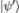
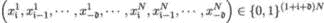
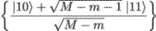
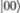

## 7

参数化量子电路和数据编码

在构建了量子硬件之后，如何在其规模、连接性和保真度下最大限度地发挥其效用呢？这个问题可以通过将其分为两个部分来更好地回答。首先，哪些问题原则上可以在 NISQ 计算机上求解？其次，如何将经典数据编码为量子态？

本书的其余部分集中讨论第一部分：那些可以以不需要大量量子比特的方式进行表述，并且至少在某种程度上具有噪声容忍性的模型和问题。朝着这个方向迈出的第一步是参数化量子电路（PQC）的概念，作为一种通用的量子机器学习模型。

第二部分——数据编码——同样重要，并依赖于本章中描述的几种实用方法。这是一个活跃的研究领域，我们可以预计大多数进展将来自量子软件方面。

### 7.1 参数化量子电路

我们已经看到如何组合量子门以形成任意宽度和深度的量子电路。量子电路通过应用一系列单元算符，将初始量子态  转换为最终量子态 。

|  |  |
| --- | --- |

在这里，(U[i])[i=1,…,m] 和 (𝜃[i])[i=1,…,m] 分别表示个别门和与之关联的门参数向量。有些门可能是*固定的*（例如，一个二比特 CNOT 门，视为围绕*x*轴以固定角度*𝜃* = *π*控制旋转目标量子比特的状态），而有些门可能是*可调的*（例如，一个一比特的 RX 门，绕*x*轴以任意角度*𝜃* ∈ [−*π,π*]旋转量子比特状态）。

一旦最终量子态  被构造出来，个别量子比特就可以被测量。测量后，量子比特的状态会保持在其测量时所使用的基态中，我们通常假定该基态为标准计算基态，除非特别指定。 因此，运行量子电路并测量量子比特（不一定所有量子比特都需要测量）的最终输出是一个经典的比特串。

我们刚才描述的是一个参数化量子电路，示意图见图 7.1。PQC 可以以多种方式使用。首先，让我们注意到 PQC 可以被*训练*。训练 PQC 意味着在给定整体 PQC*ansatz*（架构）的情况下，找到一组最佳的可调参数（例如上面提到的向量𝜃[1]*，…，*𝜃[m]）。所谓的“最佳”是问题依赖的，但通常意味着一组可调参数的配置，它确保最终量子态  与某个目标量子态尽可能接近，这个目标量子态对应于我们要编码的特定概率分布。

图 7.1：参数化量子电路的示意表示。

在接下来的章节中，我们将看到如何将 PQC 作为判别式机器学习模型（第八章）、生成式机器学习模型（第九章）以及优化器（第十章和第十一章）来使用：

+   在变分量子特征求解器的情况下，PQC 被用来构建最终的量子态，该态接近于问题哈密顿量的本征态，对应于最小本征值（与代价函数最小值相关的基态能量）。

+   当我们构建一个量子判别模型——一个作为分类器训练的量子神经网络时，我们只关注测量少数几个量子比特（甚至只有一个量子比特）。这应该给我们提供一个二进制表示的“类标签”用于给定的样本。输入（初始量子态）编码了我们想要分类的样本。

+   当我们的目标是构建一个量子生成模型——量子电路 Born 机时，我们测量所有的量子比特。这将给我们一个比特串，这是从最终量子态中编码的概率分布生成的样本。初始状态初始化为^(⊗n)。

PQC 通常使用混合量子-经典协议进行训练。混合方法在图 7.2 中以示意图的形式展示，由三个部分组成：用户、经典计算机和量子计算机[29]。

图 7.2：训练 PQC - 示意流程。

用户为问题提供模型；经典计算机预处理数据并生成 PQC 的初始参数集；量子计算机通过按照 PQC 的要求准备量子态并进行测量来运行 PQC。测量结果随后由经典计算机进行后处理，经典计算机会根据选定的训练算法（如误差反向传播与梯度下降、不可微学习方法等）更新模型参数。整体算法在经典计算机与量子计算机之间以闭环形式运行。

PQC 是将 NISQ 计算机应用于解决非平凡现实世界问题的最成功框架之一。它遵循混合量子-经典计算协议的范式，并可用于实验广泛的量子机器学习模型。

### 7.2 角度编码

让我们回到布洛赫球（图 7.2），它可视化了量子比特态的标准表示——二维复向量空间中的单位向量：

|  |  |
| --- | --- |

角度 *𝜃* ∈ [0*,π*] 和 *ϕ* ∈ [0*,*2*π*] 唯一地确定量子比特在单位球上的位置。由于我们需要两个连续变量来指定量子比特的状态，因此一个量子比特可以编码两个实值特征。

图 7.3：量子态  在布洛赫球上的表示。

#### 7.2.1 基本编码方案

我们可以用以下示意例子来说明这一点：假设我们有一个包含 *N* 个样本的 8 特征数据集，所有特征 *X*[1]*,…,X*[8] 都是实值，并且可以计算出它们的极值 *X*[i]^(min) 和 *X*[i]^(max)，*i* = 1*,…,*8。然后，对于数据集中每个样本 *j* = 1*,…,N*，我们可以建立一个特征值 *X*[i]^j 与对应旋转角度 *𝜃*[i]^j 之间的一对一映射关系：

|  |  |
| --- | --- |

其中 *X*[i]^(min) := min[j]*X*[i]^j 和 *X*[i]^(max) := max[j]*X*[i]^j。旋转角度 *𝜃*[i]^j 推广了图 7.2 中的角度 *𝜃* 和 *ϕ*。

图 7.4：特征编码 – 绕 y 轴旋转。量子比特 q[1],…,q[4] 在同一布洛赫球上的状态。所有量子比特的初始状态为 ，绕 y 轴旋转角度 𝜃[1],…,𝜃[4] 后的最终状态分别表示为 A、B、C 和 D。

8 特征样本可以编码为一个 4 量子比特状态（非纠缠）。例如，从四个初始化为  的量子寄存器开始，我们可以首先在 *y* 轴上进行旋转：量子比特 1 按角度 *𝜃*[1] 旋转，量子比特 2 按角度 *𝜃*[2] 旋转，依此类推。这在图 7.2.1 中示意展示，量子比特从其初始状态  移动到状态 *A*、*B*、*C* 和 *D*。

#### 7.2.2 每个量子寄存器编码两个特征

之后，我们通过在 *z* 轴上进行旋转来编码剩余特征：量子比特 1 按角度 *𝜃*[5] 旋转，量子比特 2 按角度 *𝜃*[6] 旋转，依此类推，正如图 7.5 中所示。

图 7.5：特征编码 – 绕 z 轴旋转。量子比特 q[1],…,q[4] 的初始状态分别为 A,B,C,D。在绕 z 轴旋转角度 𝜃[5],…,𝜃[8] 后，最终的量子比特状态为 E,F,G,H。

量子比特状态从*A*转移到*E*，从*B*转移到*F*，从*C*转移到*G*，从*D*转移到*H*。对应的量子电路如下所示：

图 7.6：8 特征样本编码的 4 量子比特量子电路。

#### 7.2.3 将经典数据样本映射到量子状态

我们可以将角度编码方案总结如下。对于经典数据样本*X*^j := (*X*[1]^j*,…,X*[K]^j) ∈ℝ^K，*j* = 1*,…,N*，角度编码通过构造映射来工作

其中角度（*𝜃*[i]^j)[i=1,…,K;j=1,…,N]由表达式(7.2.1)给出。该方案仅需要为每个量子比特旋转门，因此可以编码与量子比特数量相同数量的特征。然而，我们知道单个量子寄存器可以编码两个实数变量。以下方案在附加相位门的帮助下将经典样本映射到量子状态：

该方案允许我们使用*n*个量子比特编码 2*n*个特征。

*n*个量子寄存器具有仅通过两层单量子比特门就能编码 2*n*个连续特征的能力。

### 7.3 振幅编码

到目前为止，我们还没有利用纠缠所提供的信息编码可能性，尽管从理论上讲，大多数大规模量子系统中的信息可以存储在关联中。在前一节中考虑的 8 特征数据集示例中，如果使用纠缠，我们可以将所需量子比特的数量减少到仅三个。前六个旋转角度*𝜃*[1]*，…，𝜃*[6]仍然可以用于单量子比特旋转 R[Y]*，*R[Z]。最后两个角度，*𝜃*[7]和*𝜃*[8]，可以用于受控旋转，纠缠量子比特 1 和 2 以及量子比特 2 和 3，如图 7.7 所示：

图 7.7：8 特征样本编码的 3 量子比特量子电路。

从理论上讲，由于*n*量子比特状态可以通过指定 2^n 个概率振幅来唯一描述，我们只需要*n*个量子比特就可以编码 2^n 个特征。然而，这种超密编码并不总是实用或可取的。*振幅* *编码*曾在 Harrow、Hassidim 和 Lloyd 的开创性工作中使用[126]，但对于现实规模的问题，获得振幅编码是一项非平凡的任务，这通常是许多量子算法的主要瓶颈[184]。

振幅编码可以通过以下方式形式化。考虑一个*N*维度（*N* = 2^n）的数据点 x := (*x*[1]*，…，x*[N]) ∈ℂ^N。我们可以将量子振幅与坐标关联，如下所示：

其中 ∥x∥ := ∑ [i=1]^N|*x*[i]|² 是归一化因子。因此，我们可以将由 *M* 个点组成的数据集 D := (x¹*,…,*x^M) 编码为

对于某个整数 *p*，其中

是所有数据点的拼接，且 *C*[D] 是一个归一化常数。因此，约束条件为 2^p ≥ *MN*，即 *p* ≥ log 2。注意，在 2^p *> MN* 的情况下，可能会再次出现稀疏性。

明显的优点是它可以用仅 *n* 个量子比特存储 2^n 个特征，但不幸的是其深度为 𝒪(2*n*)，因此很难构建。

通过幅度编码，*n* 个量子寄存器可以编码 2^n 个连续特征。然而，这需要构建深度量子电路，且电路深度随着 𝒪(2*n*) 增长。因此，当处理大量特征时，对于 NISQ 计算机而言，这种方案可能并不实际。

### 7.4 二进制输入到基态

考虑一个实数 *x* ∈ℝ，用二进制表示法近似

|  |  |
| --- | --- |

对于一些非负整数𝔦*，*𝔡，其中 *x*[𝔦] ∈{0*,*1}表示 *x* 的符号，且 (*x*[j])[j=0,…,𝔦−1] ∈{0*,*1}^(𝔦) 和 (*x*[j])[j=−1,…,−𝔡] ∈{0*,*1}^(𝔡)分别表示 *x* 的整数部分和小数部分。现在考虑一个向量 x := (*x*¹*,…,x*^N) ∈ℝ^N。我们可以将所有二进制近似值 *x*¹*,…,**x*^N 拼接成一个向量。

以 (1 + 𝔦 + 𝔡)*N* 个量子比特的形式获得量子态表示

由于由此获得的向量仅包含 0 和 1，从量子态 ^(⊗(1+𝔦+𝔡)N) 开始，我们只需在相应值为 1 时应用非门 X，因此编码电路仅需读取

虽然该算法直接且只需要使用单量子比特门 X，但它需要大量的量子比特，并且通常在实际中效率较低。实际上，对于给定的维度 *N*，存在 2^N 种可能的基态。如果一个数据集只包含 *M* 个点，且 *M* 远小于 *N*，那么量子表示将会非常稀疏。

**示例：** 考虑一个数据集 D = (*x*¹*,x*²)，其中 *x*¹*,x*² ∈ [−2*,*2]，每个用四个量子比特近似表示：

和

对于每个*i* = 1*,*2 和 *k* = −2*,*−1*,*0*,*1，*x*[k]^i ∈{0*,*1}。因此，它们的量子嵌入为！|x1x1x1 x1 ⟩ 1 0 − 1 −2 和 ，因此编码数据集的量子电路采用如下形式：

![ [( 1 1 1 1 ) ( 2 2 2 2 )] |0⟩⊗8 ↦−→ Xx1 ⊗ Xx0 ⊗ Xx−1 ⊗ Xx−2 ⊗ Xx1 ⊗ Xx0 ⊗ Xx−1 ⊗ Xx−2 |0⟩⊗8\. ](img/file695.jpg)

### 7.5 叠加编码

正如[287, 294]中所述，可以在时间上与数据点和特征数量成线性关系地构建这样的数据叠加。我们再次考虑一个数据集 D := (x¹*,…,*x^M)，其中 x^k := (*x*[1]^k*,…,x*[n]^k) ∈{0*,*1}^n 对于每个 *k* = 1*,…,M*。我们使用一个量子系统，其形式为：

其中最左边的部分包含*n*个量子比特，称为加载寄存器，而最右边的部分（同样包含*n*个量子比特）是存储寄存器。中间部分是一个辅助寄存器，用于控制加载寄存器和存储寄存器之间的操作。编码算法是递归工作的。我们首先对第二个辅助量子比特应用 Hadamard 门，并将第一个数据点 x¹ 存入存储寄存器。由于

这可以通过应用酉算符（在 Hadamard 操作之后）来实现。

由第二个辅助量子比特控制，得到的量子态为：

这可以通过（参见下文引理 7 的证明）轻松转化为

在*m*步之后，我们得到了如下形式的量子态：

|  |  |
| --- | --- |

以下引理保证了算法的有效性：

**引理 7.** *存在一个酉算符* U *使得*

*证明。* 证明是构造性的，精确地展示了算符 U 的形态。

1.  构造连续的映射

    |  |
    | --- |

    第一步可以通过应用算符 ⊗I^(⊗2) ⊗I^(⊗n) 到  来轻松实现。第二步是通过控制门，利用辅助寄存器的第二个量子比特作为控制来实现。最后一步通过在第一个辅助量子比特上使用 CNOT 门，以第二个辅助量子比特为控制实现，过程非常简单。

1.  现在定义这个单位门

    

    并且请注意，控制版本（由第一个辅助量子比特 *a*[1] 控制）[a[1]]U 的作用是

    | [a[1]]U | = *,* |
    | --- | --- |
    | [a[1]]U | = ⊗ = *.* |

    将其应用于步骤 1 中的辅助寄存器 （并保持其他量子比特不变）将得到

    |  | = I^(⊗n) ⊗ [a[1]]U⊗I^(⊗n) |
    | --- | --- |
    |  | = ∑ [k=1]^m |
    |  | +  |
    |  | = ∑ [k=1]^m |
    |  | +  |

    然后，我们在  的情况下将第一个辅助量子比特翻转为 0（可以通过 SWAP 和 CNOT 门轻松实现），并将相同的辅助项重新组合在一起，得到

    

    如同在 (7.5) 中所示，重置寄存器得到

    

    完成引理的证明。

□

### 7.6 哈密顿量模拟

哈密顿量编码，量子机器学习中的一个热门概念，灵感来自于薛定谔方程 (1.2.2)，其表达式为

对于某些哈密顿量 ℋ，其中 ℏ 是普朗克常数，并且在 *t* = 0 时满足某些边界条件。该方程的解为

哈密顿量编码的思想是将初始数据编码到哈密顿量 ℋ 中。考虑一个点云 X ∈ℳn,n。如果 X 是厄米矩阵，我们可以定义哈密顿量矩阵 ℋ[X] := X，否则使用扩展版本

按照构造是厄米的。

我们的目标是，对于给定的精度级别*𝜀*，找到一个态（或生成此态的算法），使得

对于某个给定的范数∥⋅∥，其中解了薛定谔方程。

该方法的一个重要瓶颈是计算 exp（为简便起见我们忽略了比率−i*∕*ℏ）。假设哈密顿量ℋ[X]可以写成和的形式

由易于计算的哈密顿量（ℋ[i]）[i=1,…,p]组成。如果后者不对易，那么身份

不成立，但一阶铃木-特罗特[220，286]公式（Lloyd 在[191]中使用）

对于足够小的*t*，我们可以绕过这个问题。

事实上，即使*t*并不那么小，我们也可以选择*δ >* 0 足够小并使用分解

![ ⌊ ( ) ⌋ ( ∑p ) ∑ t∕δ [ p∏ ]t∕δ exp ℋit = ⌈exp ( ℋiδ) ⌉ = eℋiδ + 𝒪 (δ2) , i=1 i=1,...,p i=1 ](img/file745.jpg)

它具有较小的误差（尽管需要多次计算该操作）。一般来说，任何*n*-量子比特哈密顿量ℋ都可以分解为最多 4^n 个基础哈密顿量（帕利形式），如

其中*σ*[i[k]]是一个帕利算符。当然，4^n 对帕利算符的要求通常可能过大，但哈密顿量的局部特性（如稀疏[34]、稀释或度数降低的[8]哈密顿量）有助于减少复杂度。

**备注：** 另一种方法，尤其是对于下一章分析的量子机器学习（QML）问题，是使用量子随机存取存储器（QRAM）对数据进行编码，本质上使用了由[110]开发的桶传递算法（参见[140，15]），我们将感兴趣的读者引导至[65]，以了解当前最先进算法的良好总结。

将经典数据编码到量子计算机中，最近取得了许多进展，现在有多种竞争性的技术可供选择，具体使用哪种技术取决于正在研究的问题。

### 摘要

在本章中，我们介绍了参数化量子电路的概念，作为通用的 QML 模型。PQC 可以训练并用作判别和生成 QML 模型以及优化器。它们还可以用来将经典数据样本编码为相应的量子态。

我们考虑了几种流行的数据编码方法。可以说，最简单且最易实现的方法是角度编码算法——我们将在下一章中使用这种方法。其他方法也有其优点，尽管它们通常在硬件要求方面更为苛刻，或更适合某些特定应用。

在下一章，我们将应用到目前为止所学的内容，构建一个作为分类器训练的量子神经网络，并将其在二分类问题上的表现与标准经典机器学习模型进行比较。

### 加入我们书籍的 Discord 空间

加入我们的 Discord 社区，与志同道合的人交流，并与超过 2000 名成员一起学习，网址：[`packt.link/quantum`](https://packt.link/quantum)

