## 8

量子神经网络

量子神经网络 [100] 是参数化的量子电路，可以作为生成型或判别型机器学习模型进行训练，直接类比于其经典对应物。在本章中，我们将考虑将量子电路作为分类器进行训练的情况。在最一般的情况下，分类器是一个函数，它接受一个 *N* 维的输入，并返回 *M* 个可能类别值中的一个。分类器可以通过调整可配置的模型参数，在已知类别标签的样本数据集上进行训练，从而最小化分类误差。一旦分类器完全训练好，它就可以接受新的、未见过的样本，而这些样本的正确类别标签是未知的。因此，避免过拟合训练数据集并确保分类器能很好地推广到新数据是至关重要的。

量子神经网络和经典神经网络之间有许多相似之处。在这两种情况下，关键元素是信号（输入）的前向传播，这个信号通过网络的激活函数进行转换。量子神经网络和经典神经网络都可以通过误差反向传播（可微分学习）以及各种非可微分学习技术进行训练。然而，它们也存在一些根本性的差异。例如，经典神经网络的强大之处在于输入的非线性变换。相比之下，所有的量子门都是线性算符，量子神经网络的力量来自于将输入映射到高维的希尔伯特空间，在这个空间中，分类更容易进行。

### 8.1 量子神经网络

图 8.1 提供了典型的量子神经网络（QNN）作为分类器训练的示意图。让我们来看一下量子电路，了解它是如何工作的。网络由 *n* 个量子寄存器、一系列的单量子比特门和双量子比特门，以及 *m* 个测量算符组成。输入是一个量子态 ，它编码了来自数据集的第 *k* 个样本。如果我们的数据集是经典的，那么每个经典样本应首先编码成输入量子态（如前一章所述）。通过 *m* 个测量算符，输出是一个比特串，可以编码最多 2^m 个整数值（类别标签）。对于二分类器，只需要对单个量子比特进行测量即可。

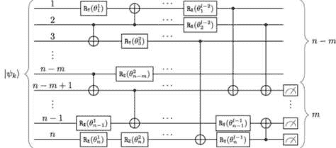

图 8.1：量子神经网络的示意图——带参数的量子电路——由单量子比特和双量子比特门以及在一个或多个量子寄存器上的测量算符组成。初始状态编码了数据集中第 k 个样本。

测量过程从量子态中编码的概率分布中产生一个单一的样本。因此，我们需要对相同的输入多次运行量子电路，以便为我们进行测量的每个量子比特收集足够的统计数据。

例如，如果我们的 QNN 被组织为一个分类器，能够预测四个可能的类别之一（“0”，“1”，“2”和“3”），那么我们需要对 2 个量子比特进行测量，可能的结果是对应类别“0”，对应类别“1”，对应类别“2”，以及对应类别“3”。假设我们已经运行了量子电路 1,000 次，并观察到如表 8.1 所示的结果：

| 测量位串 | 类别标签 | 观察次数 |
| --- | --- | --- |
| 00 | 0 | 100 |
| 01 | 1 | 550 |
| 10 | 2 | 200 |
| 11 | 3 | 150 |

表 8.1：量子电路的 1,000 次运行。

然后我们可以得出结论，对于给定的输入，最可能的类别标签是类别“1”（概率为 55%）。同时，我们还获得了所有其他可能类别值的概率，这在某些情况下可能会有用。

网络组织为 *l* 层的单量子比特和双量子比特门。门可以是*可调的*，意味着它们可以通过可调参数（如旋转角度）来控制，或者它们也可以是*固定的*。图 8.1 中的双量子比特门是固定的 CX 门，但原则上，它们可以是可调的受控旋转门。尽管图 8.1 中示意性地展示的网络最多可以有 *n* × *l* 个可调参数（*𝜃*[i]^j)[i=1,…,n; j=1,…,l]），但通常情况下，双量子比特门是固定的，我们在训练网络时只有单量子比特旋转作为可用的自由度。

类似于经典神经网络，QNNs 可以通过可微分学习（例如，使用梯度下降的误差反向传播）或非可微分学习（例如，进化搜索启发式算法）进行训练。两种方法各有其相对的优缺点。从理论上讲，可微分学习可能更快，但由于著名的“荒原平台”问题（即梯度变得极其微小[207]），其收敛性并不能得到保证，且受具体问题的影响。非可微分学习通常较慢，但避免了被困在局部最小值，并且在代价函数不光滑的情况下表现良好。第 8.2 节和第 8.3 节提供了 QNN 训练过程的详细描述。

显然，使用量子分类器的最强动力是它们能够处理量子数据。必须分类的输入量子态可能是其他量子电路的输出。由于我们可能无法将这些量子态中编码的信息以经典方式存储，量子分类器成为了一个不可或缺的工具。然而，量子分类器也有可能在纯经典数据上展示其优势。以下是几个动机，促使我们有兴趣尝试将 QNNs 应用于经典数据集。

首先，参数化量子电路的表达能力大于等效的经典神经网络。其次，量子电路结构上能够高效地应对过拟合问题。最后，在量子计算发展的初期阶段，对于特定的使用案例，某些类型的量子硬件上是可以实现量子加速的。第十二章更详细地探讨了这些问题。

在本章中，我们重点介绍如何使用量子神经网络（QNNs）高效地解决特定的与金融相关的分类问题，并与多种标准的经典分类器进行对比。虽然通过实验证明量子加速和量子神经网络更大表达能力的优势需要强大的量子硬件，但 QNNs 如何应对过拟合的问题可以在相对较小且浅的量子电路上进行验证，并借助开源量子模拟器实现。

QNNs 是作为机器学习模型（如分类器）进行训练的参数化量子电路。量子神经网络在处理量子数据时，相比经典神经网络具有天然的优势。然而，经典数据集也可以编码为量子态，并通过 QNNs 进行处理，借助它们更强大的表达能力、有效应对过拟合的能力，最终实现量子加速。

正如我们在第五章中学到的，单单指定神经网络的架构不足以构建有效的机器学习模型——还需要指定训练算法。在接下来的章节中，我们将展示如何通过可微和不可微的学习方法来训练量子神经网络。

### 8.2 使用梯度下降训练量子神经网络

由于我们不仅仅关注构建作为独立工具的量子神经网络，还希望将其与经典神经网络进行比较和对比，因此我们首先回顾使用梯度下降法训练量子神经网络——这是一个普遍使用的经典机器学习算法。

#### 8.2.1 有限差分方案

训练量子神经网络包括指定并执行一个程序，该程序可以找到可调旋转参数𝜃的最优配置。假设一个量子神经网络被指定在*n*个量子寄存器上，并具有*l*层可调量子门，其中每个可调门由一个单一参数控制（*𝜃*[i]^j)[i=1,…,n; j=1,…,l]）。在这种情况下，𝜃 ∈ℳ[n,l]是一个*n*×*l*的可调网络参数矩阵：

| 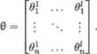 |  |
| --- | --- |

在不失一般性的前提下，我们假设使用的是二分类器。该分类器接收一个输入（一个量子态，编码了来自数据集的一个样本），应用一系列量子门（由最多*n* × *l* 可调参数控制的参数化量子电路），并对选定的量子寄存器进行可观察量*M*的测量。一个可观察量的例子是保利 Z 门，对于一个量子比特，若其处于态或，单次测量的结果分别为±1。测量到的可观察量值会映射为二元变量{0，1}的值。这个过程会针对每个样本重复*N*次，以便收集足够的统计数据用于分类结果。

寻找可调参数𝜃的最优配置的第一步是选择一个合适的成本函数——一个表示在分类训练数据集样本时总误差的目标函数，且可以通过改变可调网络参数来最小化。设 y := (*y*[1]*,…,y*[K])为二元标签向量，f(𝜃) := (*f*1*,…,f*K)为训练数据集中*K*个样本的二分类器预测结果向量。那么，成本函数*L*(𝜃)可以定义为，举例来说，训练数据集所有样本的平方误差之和：

| 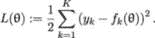 |  |
| --- | --- |

下一步是沿着能够减少代价函数值的方向进行可调参数的迭代更新。这个方向由代价函数的梯度给出——因此该方法得名。参数沿着代价函数的最速下降方向进行更新。在第 *u* + 1 步，我们将系统更新为：

| 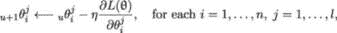 |  |
| --- | --- |

其中 *η* 是学习率，即控制更新幅度的超参数。对于每个 *i* = 1*,…,n*，*j* = 1*,…,l*，可以使用有限差分法来数值计算导数：

| 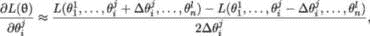 |  |
| --- | --- |

误差的阶数为 𝒪((Δ*𝜃*[i]^j)²)，其中 Δ*𝜃*[i]^j 是一个小的旋转角度增量。NISQ 设备的物理特性对这一增量的最小值有所限制：在大多数情况下，Δ*𝜃*[i]^j 不应小于 0*.*1 弧度。其余的训练过程遵循经典的神经网络训练算法，通过反向传播误差并使用梯度下降法进行优化。

#### 8.2.2 分析梯度方法

一种替代有限差分法的方法是分析梯度法，它能有效避免由于截断和舍入误差导致的不稳定和病态情况（无论是对于参数化量子电路 [29]，还是对于经典神经网络 [27]），它对于具有可调单量子比特门和固定多量子比特门的参数化量子电路是一个可行的选择。从(8.2.1)中可以得出，代价函数相对于参数 *𝜃*[i]^j 的梯度为：

| 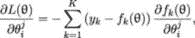 |  |
| --- | --- |

因此，计算代价函数梯度的任务可以简化为计算每个样本量子态的测量算符的期望值的偏导数，该量子态编码了来自训练数据集的经典样本。设  为编码训练数据集中的第 *k* 个样本的量子态，且设 U(𝜃) 为表示一系列 QNN 门的幺正算符，这些门将初始态 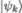 转换为最终状态。那么，测量算符 M 的期望值为：

| 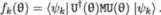 |  |
| --- | --- |

根据我们在构造 QNN 假设时使用的约定，参数 *𝜃*[i]^j 仅影响一个单独的门，我们将其表示为 G(*𝜃*[i]^j)。因此，门序列 U(𝜃) 可以表示为：

| 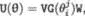 |  |
| --- | --- |

其中 W 和 V 是在门 G(*𝜃*[i]^j) 之前和之后的门序列。我们可以将 V 吸收到厄米观测量 Q = V^†MV 中，并将 W 吸收到量子态 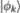 = W 中：

| 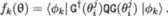 |  |
| --- | --- |

然后，*f*k 关于参数 *𝜃*[i]^j 的偏导数计算为

| 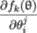 | =  ⟨*ϕ*[k]&#124;G^†(*𝜃* [i]^j)QG(*𝜃* [i]^j) |
| --- | --- |
|  | = ⟨*ϕ*[k]&#124;^†QG(*𝜃* [i]^j) + ⟨*ϕ*[k]&#124;G^†(*𝜃* [i]^j)Q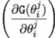*.* | (8.2.1) |  |

让我们表示

| 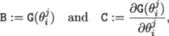 |  |
| --- | --- |

并且注意到

| 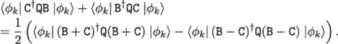 |  |
| --- | --- |

因此，如果我们能够找到实现操作符 B±C 作为整体单位演化的一部分的方法，那么我们可以直接计算 (8.2.1)。

#### 8.2.3 分析梯度计算的参数偏移规则

根据 [257]，我们概述了具有两个不同特征值的生成元的门的参数偏移规则——这涵盖了所有单量子比特门。作为单位操作，门 G(*𝜃*[i]^j) 可以表示为

| 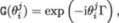 |  |
| --- | --- |

对于某些厄米算符 Γ（定理 6）。关于 *𝜃*[i]^j 的偏导数为

| 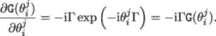 |  |
| --- | --- |

将 (8.2.3) 代入 (8.2.1) 得到

| 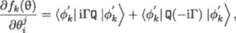 |  |
| --- | --- |

其中 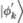 = G(*𝜃*[i]^j)。如果 Γ 只有两个不同的特征值，我们可以将特征值移至 ±*r*，因为全局相位是不可观察的 [257]。用 I 表示单位算符，我们可以将 (8.2.3) 重写为

| 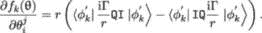 |  |
| --- | --- |

表示

| 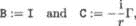 |  |
| --- | --- |

并使用 (8.2.2) 我们从 (8.2.3) 中得到：

| ![ [ ] ∂f (𝜃) r ′ ( i ) † ( i ) ′⟩ ′ ( i )† ( i ) ′⟩ --k-j--= -- ⟨ϕk&#124; I− - Γ Q I− -Γ &#124;ϕk − ⟨ϕk&#124; I + -Γ Q I + - Γ &#124;ϕk . ∂𝜃i 2 r r r r ](img/file784.jpg) |  |
| --- | --- |

一个直接的计算 [257, Theorem 1] 显示，如果单位算符 G(*𝜃*) = exp(−i*𝜃*Γ) 的厄米生成元 Γ 至多具有两个唯一特征值 ±*r*，那么

| 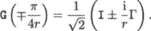 |  |
| --- | --- |

在这种情况下，可以使用两个额外的量子电路评估来估算梯度。应该在原始电路中将门 G(*π∕*(4*r*))或门 G(−*π∕*(4*r*))放置在我们要微分的门旁边。由于对于单位生成的单参数门 G(*a*)G(*b*) = G(*a* + *b*)，这相当于偏移门参数，因此我们获得了“参数偏移规则”[257]，其中偏移量*s* = *π∕*(4*r*)：

| 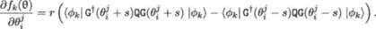 |  |
| --- | --- |

如果Γ是由保利 X、Y 和 Z 算符给出的单量子比特旋转生成器，则*r* = 1*∕*2，*s* = *π∕*2[213，257]：

| 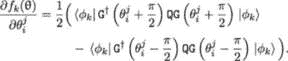 |  |
| --- | --- |

因此，我们需要做的事情是执行两次电路*N*次以收集统计数据，并计算(8.2.3)右侧的期望值。第一个电路将门参数偏移*π∕*2，第二个电路将门参数偏移−*π∕*2。

尽管这个过程不一定比有限差分方案更快，但它可以提供更准确的代价函数梯度估计。这里的主要论点是 NISQ 硬件在有限精度下运行。最先进的超导量子比特具有单量子比特门保真度≤99*.*9%和双量子比特门保真度≤99*.*7%，且旋转角度精度为 0.05 弧度。因此，有限差分方案不能假设无穷小的旋转角度Δ*𝜃* – 它们不应小于大约 0.1 弧度（并且在大多数情况下，可能要大得多）。这意味着使用有限差分方案获得的梯度具有一定程度的固有不确定性，只有通过进一步改善 NISQ 硬件才能解决。

QNN 可以通过梯度下降算法进行训练，完全类比于经典神经网络中的误差反向传播。梯度可以通过解析方法计算，或者通过数值方法估算。

### 8.3 使用粒子群优化训练 QNN

在上一节中已经指定了用于训练 QNN 的梯度下降方案，接下来我们将注意力转向一种基于强大进化搜索算法的不可微学习方法。

#### 8.3.1 粒子群优化算法

粒子群优化（PSO）算法属于广泛的进化搜索启发式算法类，每次算法迭代（在进化算法的术语中称为“代”）时，解的种群（“染色体”或“粒子”）会根据其与环境的适应度进行评估。在标准的 PSO 公式中 [236]，一组粒子被放置在某个问题的解空间中，并且每个粒子会评估其当前位置的适应度。每个粒子接着结合自己适应度值的历史记录和一个或多个群体成员的适应度历史，来决定其在解空间中的移动，并以由这些成员的位置和处理后的适应度值以及一些随机扰动所决定的速度进行移动。

这是一个标准过程 [127, 172]，在指定 PSO 算法时需要遵循三个步骤。首先，我们初始化每个粒子 *i* 在时间 *k* 时刻的位置信息 x[k]^i := (*x*[k]^i(1)*,…,x*[k]^i(*n*)) ∈ℝ^n，粒子在 *n* 维搜索空间中移动并取值于某个范围 [x[min]*,*x[max]]。接下来，我们初始化群体中每个粒子的速度 v[k]^i := (*v*[k]^i(1)*,…,v*[k]^i(*n*)) ∈ℝ^n。初始化过程包括将群体粒子随机分布到解空间中：

| 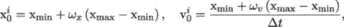 |  |
| --- | --- |

其中 *ω*[x] 和 *ω*[v] 是均匀分布在 [0*,*1] 区间上的随机变量，Δ*t* 是算法迭代之间的时间步长。

然后，我们根据指定的目标函数更新所有粒子在时间 *k* + 1 时刻的速度，该目标函数依赖于粒子在解空间中时间 *k* 时刻的当前位置。目标函数的值决定了当前群体中哪个粒子拥有最佳位置 p[k]^(global)，并且还决定了每个粒子随时间变化的最佳位置 p^i，即在当前及所有先前的移动中。速度更新公式使用这两部分信息（粒子的当前运动 v[k]^i）来提供下一个迭代的搜索方向 p[k+1]^i。该公式还包括随机参数，以确保解空间的良好覆盖并避免陷入局部最优。影响新搜索方向的三个值是当前运动、粒子自身的记忆和群体的影响。这些通过求和方法与三个权重因子结合：惯性 *w*、自信度 *c*[1] 和群体自信度 *c*[2]：

| 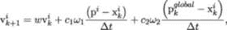 |  |
| --- | --- |

其中 *ω*[1] 和 *ω*[2] 是均匀分布在 [0*,*1] 区间上的随机变量。

最后，使用每个粒子的速度向量来更新其位置：

| 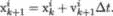 |  |
| --- | --- |

这些步骤会重复进行，直到满足期望的收敛标准或达到最大迭代次数。可以设计各种反射规则（在边界处停止，镜像反射回允许的领域等）[190]，以应对新的位置 x[k+1]^i 超出[x[min]*,*x[max]]边界的情况，并且可以通过Δ*t* ≡ 1 来规范化动态。如果*K*是算法的最后一次迭代，那么 PSO 找到的最佳解是 p[K]^(global)。图 8.2 提供了粒子在三种力的作用下通过解空间的示意图：动量、吸引全体粒子在上一次迭代中找到的全局最佳解，以及吸引给定粒子在所有前次迭代中找到的最佳解。

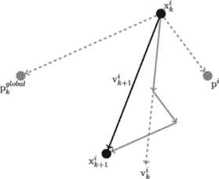

图 8.2：PSO 算法的示意图。每个粒子在三种力的作用下在解空间中移动：动量、对前一次迭代中所有粒子找到的全局最佳解的吸引力，以及对给定粒子在所有前次迭代中找到的最佳解的吸引力。

#### 8.3.2 用于训练量子神经网络的 PSO 算法

现在我们准备指定 PSO 算法来训练量子神经网络（QNN）。我们考虑一个* n * × * l *的可调参数（旋转）矩阵𝜃，其中*n*是量子寄存器的数量，*l*是网络层数。我们寻找的解决方案是可调参数矩阵(8.2.1)，它最小化所选的成本函数。

成本函数可以通过多种方式指定，具体取决于我们希望鼓励或惩罚哪些特定方面。给定训练数据集，我们希望找到一种可调参数𝜃的配置，使得尽可能多的样本被正确分类。例如，一种可能的成本函数选择是错误分类与正确分类决策的比率。然而，分类过程本质上是概率性的——我们在多次运行量子电路后决定样本标签，这些运行产生了足够的统计数据。因此，每个分类决策不仅仅是对错的问题，它也可以被看作是“更对”或“更错”。如果正确的样本标签是“1”，而我们 51%的时间得到“0”，那么分类器略微错误：这种情况下，类似的样本有可能被正确分类，或者只需对可调的网络参数进行小的调整即可纠正分类过程。但如果我们 90%的时间得到“0”，那么分类器就是“非常错”，我们需要更积极地惩罚这一结果。

一种可能的代价函数实现方式，考虑到上述参数如下：不失一般性，假设我们使用二分类标签"0"和"1"，并且设 y := (*y*[1]*,…,y*[K]) 为一个样本标签向量（标签为"0"或"1"），来自训练数据集。进一步，设 ℙ(𝜃) := (ℙ1*,…,*ℙK) 为 QNN 估计的样本预测为类别"1"的概率向量（即量子电路运行中返回"1"的次数除以总运行次数）。那么，代价函数 *L*(𝜃) 由以下伪代码给出：

```py
cost_function = 0 

for i in range(K): 

    if y[i] == 0: 

        if P[i] > 0.7: 

            cost_function += 4 

        if P[i] > 0.6 and P[i] <= 0.7: 

            cost_function += 2 

        if P[i] > 0.5 and P[i] <= 0.6: 

            cost_function += 1 

    else: 

        if P[i] < 0.5 and P[i] >= 0.4: 

            cost_function += 1 

        if P[i] < 0.4 and P[i] >= 0.3: 

            cost_function += 2 

        if P[i] < 0.3: 

            cost_function += 4
```

该代价函数对类别概率估计的较大误差比小误差惩罚更重，且表示训练数据集中所有样本的总误差。

我们现在可以制定 QNN 训练算法，该算法的输入如下：

| 变量 | 含义 |
| --- | --- |
| X := (X[1]*,…,*X[K]) ∈ℝ^(M×K) | 编码为特征的训练数据集 |
|  | 旋转角度范围为 [0*,π*] |
| y := (*y*[1]*,…,y*[K]) ∈{0*,*1}^K | 二进制标签向量 |
| *N*[iter] | 迭代次数 |
| *N*[runs] | 量子电路运行次数 |
| *M* | 粒子（解）的数量 |
| *w* | 动量系数 |
| *c* [1] | 粒子记忆系数 |
| *c*[2] | 群体影响系数 |
| *n* | 量子寄存器的数量 |
| *l* | QNN 层数 |

表 8.2：QNN 训练算法的输入

该算法作用于以下对象，其中 *m* = 1*,…,M* 表示第 *m* 个粒子，*t* = 0*,…,N*[iter] 表示算法的迭代步骤：

+   𝜃(*t*;*m*) ∈ℳnl: 第 *m* 个粒子在时间 *t* 的位置；

+   v(*t*;*m*) ∈ℳnl: 第 *m* 个粒子在时间 *t* 的速度；

+   Ξ(*m*) ∈ ℳnl: 第 *m* 个粒子在所有迭代中的最佳位置；

+   Φ(*t*) ∈ ℳnl: 所有粒子在时间 *t* 找到的全局最佳位置；

+   *L*(𝜃): 解 𝜃 的代价函数值。

![--------------------------------------------------------------------- -算法---5:-粒子群优化--------------------------- 结果：可调 QNN 参数的最优配置 ∗ 𝜃 := argmin L(𝜃)。初始解集的初始化与评估（我们在（8.3.1）中将 Δt 设置为 1）：对每个粒子 m = 1,...,M 做 | 对 i = 1,...,n, j = 1,...,l 做 | | 从 𝒰 ([− π,π]) 中随机抽取旋转角度 𝜃j(0;m )。 | | i | | 从 𝒰 ([− π,π]) 中随机抽取旋转角度 vji(0;m )。 | 结束 | | | 初始化单独的最佳解： | | Ξ(m ) ← 𝜃(0;m ) | | 对 k = 1,...,K 做 | | 使用配置 | | | 𝜃(0;m ) 在样本 Xk 上运行量子电路 Nruns 次，以估算 | | 读取目标量子比特为 "1" 的概率 ℙk。 | | 结束 | | 评估给定概率的代价函数 L(𝜃(0;m )) | ℙ := (ℙ1,...,ℙK ) 结束 按代价函数值从最优（最小代价函数）到最差（最大代价函数）排序解。Φ (0) ← 对应代价函数最小值的配置。初始化最优配置： ∗ 𝜃 ← Φ (0) --------------------------------------------------------------------- ](img/file792.jpg)

![--------------------------------------------------------------------- 迭代：对于 t = 1,...,Niter 做 | | 对 m = 1,...,M 做 | | 对 i = 1,...,n, j = 1,...,l 做 | | | 生成独立的随机数 ω ∼ U [0,1 ] 和 | | | 1 | | | ω2 ∼ U[0,1]。 | | | 动量 ← wvj (t − 1;m ) | | | i | | | 粒子 ← c1ω1[Ξji(m )− 𝜃ji(t− 1;m)] | | | 群体 ← c ω [Φj (t − 1)− 𝜃j(t− 1;m )] | | | 2 2 i i | | | vji(t;m ) ← 动量 + 粒子 + 群体 | | | j j j | | | 𝜃i(t;m ) ← 𝜃i(t− 1;m ) + vi(t;m ) | | 结束 | | | | 对 k = 1,...,K 做 | | 使用配置 | | | 𝜃(t;m ) 在样本 X 上运行量子电路 Nruns 次，以估算 | | | k k | | 读取目标量子比特为 "1" 的概率 ℙ。 | | 结束 | | | | 评估给定概率的代价函数 L(𝜃(t;m )) | | | | ℙ := (ℙ1,...,ℙK )。 | | 如果 L(𝜃(t;m)) < L(Ξ (m ))，则 | | | Ξ(m ) ← 𝜃(t;m ) | | | | 结束 | | 结束 | 按代价函数值从最优（代价函数最小值）到最差（代价函数最大值）排序解。 | | Φ (t) ← 对应代价函数最小值的配置。 | | 如果 L(𝜃∗) < L (Φ(t))，则 | 𝜃 ∗ ← Φ(t) | | 结束 结束 --------------------------------------------------------------------- ](img/file793.jpg)

基于进化搜索启发式的不可微学习在处理具有多个局部极小值的不规则、非凸目标函数时效果良好。

### 8.4 QNN 在 NISQ QPU 上的嵌入

理想情况下，参数化量子电路应该以与硬件无关的方式构建，仅由待解决问题的特征驱动。然而，这将需要存在大型且连接极为良好的量子计算系统，具有非常高的量子比特保真度和相干时间。换句话说，我们需要的 QPU 功能远远超过现有 NISQ 设备的能力。这样的强大量子计算系统的到来可能比预期的更早，但我们仍然需要找到一种在 NISQ QPU 上高效运行 PQC 的方法。

#### 8.4.1 NISQ QPU 连接性

设计可在 NISQ QPU 上执行的 PQC 的典型方法是，从观察量子计算系统的两个主要特征开始：图（量子比特连接性）和原生门集。我们可以通过查看图 8.3 中 Rigetti 的 Aspen 系统 [72] 来说明这些要点。

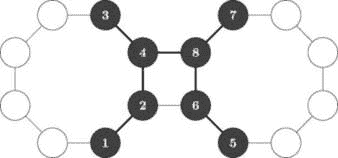

图 8.3: Rigetti 的 Aspen 系统。

如我们所见，大多数量子比特仅与线性网格上的最近邻量子比特连接，只有四个量子比特有三个连接。这些额外的连接形成了两个 8 量子比特岛之间的桥梁，否则它们将是完全独立的。

#### 8.4.2 QNN 嵌入方案

图 8.3 中的阴影量子比特可以用于构建 8 量子比特树网络，能够处理最多具有 16 个连续特征（每个量子寄存器两个特征）的数据集，如图 8.4 所示。图 8.3 中的粗线表示用于构建 QNN 的量子比特连接。细线表示所有其他未在 QNN 假设中使用的量子比特连接。

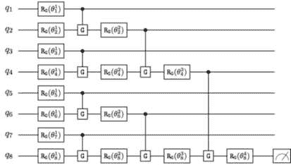

图 8.4: Aspen 系统的 QNN；门 G 是 {X,Y,Z} 任意门。

由于现有量子处理单元（QPU）的连接性有限，我们需要充分利用量子芯片的图结构来实现最有效的 QNN 嵌入，并提取最佳性能。

### 8.5 QNN 作为分类器的训练

我们现在演示如何使用非可微分学习方法，在经典信用审批数据集上训练二元 QNN 分类器。

#### 8.5.1 ACA 数据集与 QNN 假设

二分类器在金融领域最基本的应用之一是信用批准。UCI 机器学习数据库[241, 242]包含澳大利亚信用批准（ACA）数据集，该数据集由 690 个样本组成。数据集包含 14 个特征（包括二进制、整数、连续特征），代表潜在借款人的各种属性，以及一个二进制类别标签（接受/拒绝信用申请）。由于特征的预测能力有限以及数据集相对较小，经典分类器处理起来相当困难。这使得它成为测试和基准化 QNN 性能的理想选择。

我们从最简单的树形网络开始，该网络可以映射到前一节中描述的 Rigetti Aspen 系统图。图 8.5 显示了完整的量子电路，包括样本编码和样本处理模块[171]。该方案使我们能够利用绕*x*轴和*y*轴的旋转，在每个量子寄存器中最多编码两个连续特征。

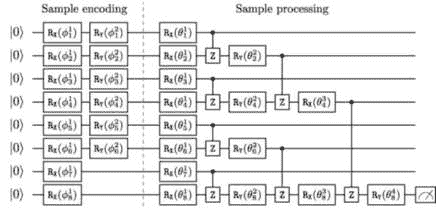

图 8.5：用于信用批准分类器的 PQC。

特征作为旋转角度*ϕ* ∈ [0*,π*]进行编码，按照第 7.2 节中描述的编码方案进行。所有量子比特初始化为计算基态的，这确保了编码样本的唯一性。样本处理模块由可调的一量子比特门（绕*x*轴和*y*轴的旋转）和固定的二量子比特门（CZ）组成。我们使用`sklearn.model_selection`模块提供的 train_test_split()函数，将 ACA 数据集按 50:50 分为训练集和测试集。我们的目标是训练 QNN 和各种经典分类器（经典基准）在训练集上的表现，并比较它们在测试集上的外推性能。经典分类器具有一些超参数，可以进行微调，以优化分类器在给定数据集上的性能。相比之下，QNN 架构（单量子比特和双量子比特门的位置和类型）是固定的。

#### 8.5.2 使用 PSO 算法训练 ACA 分类器

我们首先验证 QNN 是否能够通过粒子群优化算法（PSO）高效训练——一种不可微分的学习方法。图 8.6 展示了 PSO 算法在表 8.3 中给定 PSO 参数集下的收敛情况。

| 参数 | 符号 | 值 |
| --- | --- | --- |
| 惯性系数 | *w* | 0.25 |
| 自信系数 | *c* [1] | 0.25 |
| 群体自信系数 | *c* [2] | 0.25 |
| 粒子数量 | *M* | 10 |
| 迭代次数 | *N*[iter] | 20 |
| 量子电路运行次数 | *N*[runs] | 1000 |

表 8.3：PSO 参数。

样本算法运行在仅用十个粒子的情况下，通过`Qiskit`量子模拟器探索搜索空间，仅在四次迭代中就达到了目标函数的最小值。

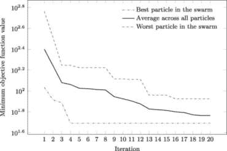

图 8.6：各个粒子找到的目标函数最小值。

PSO 算法找到的对应于目标函数最小值的可调参数（旋转）的配置由(8.5.2)给出。

|  |  |
| --- | --- |

图 8.7 显示了通过 Qiskit 量子模拟器获得的 QNN 分类器的内外样本混淆矩阵，假设类 0 为正类。

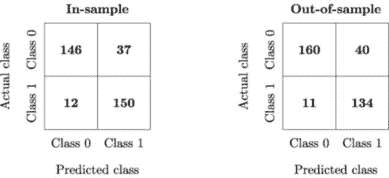

图 8.7：QNN 分类器的混淆矩阵（ACA 数据集）。

结果具有鲁棒性，内样本准确率为 0.86，外样本准确率为 0.85。值得注意的是，内样本和外样本结果非常接近，表明 QNN 提供了强有力的正则化。量子与经典神经网络正则化的问题将在第十二章中讨论。

### 8.6 经典基准

在第四章中，我们介绍了两种经典分类器：前馈人工神经网络（多层感知器）和决策树算法。现在，我们通过添加支持向量机（SVM）[70]、逻辑回归[31]和随机森林[136]来扩展经典基准分类器的范围。基于*核方法*的 SVM 方法将在第十三章中讨论。这里，我们简要解释逻辑回归和随机森林分类器的主要原理。

#### 8.6.1 逻辑回归与随机森林

逻辑回归可以看作是一个具有单个隐藏层的前馈神经网络的特例，隐藏层由具有逻辑激活函数的激活单元组成。该模型的运作如图 4.3 所示。

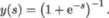

标准的逻辑回归模型是一个*线性分类器*，因为结果始终依赖于（加权）输入的总和。因此，逻辑回归在处理类之间或多或少是线性可分的数据集时表现良好。

随机森林是一种*集成学习*模型，顾名思义，它基于结合多个决策树的分类结果。随机森林使用的集成技术称为*自助聚合*（*bootstrap aggregation*），或*bagging*，通过从数据集中选择随机子集。因此，每棵决策树都是从原始数据集的样本中通过有放回抽样生成的（行抽样）。这种有放回的行抽样步骤被称为*自助法*（*bootstrap*）。每棵决策树都是独立训练的。给定样本的最终输出是基于所有单独决策树结果的*多数投票*，这是*聚合*步骤。

#### 8.6.2 与标准经典分类器的基准测试

经典基准测试可以通过训练几个流行的`scikit-learn`模型来完成。表 8.4 提供了几个（弱优化的）`scikit-learn`分类器的样本外*F*[1]分数的经典基准测试结果：

+   前馈神经网络（MLP）分类器：`neural_network.MLPClassifier`

+   支持向量机分类器：`svm.SVC`

+   一种集成学习模型：`ensemble.RandomForestClassifier`

+   逻辑回归分类器：`linear_model.LogisticRegression`

*F*[1] 分数是两个性能指标——精度和召回率——的调和平均值：

| 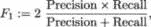 |  |
| --- | --- |

两者都在第四章中介绍。在信用审批的背景下，优化召回率有助于最小化错误批准应被拒绝的信用申请的机会。然而，这会导致一些高质量借款人的信用申请未能获得批准。如果我们优化精度，那么我们会提高决策的整体正确性，但这也可能导致一些信用不良的申请者被批准。*F*[1] 分数用于平衡精度和召回率优化中的正负效果。

| 分类器 | 平均 *F*[1] 分数 |
| --- | --- |
| 逻辑回归分类器 | 0.88 |
| 随机森林分类器 | 0.87 |
| MLP 分类器 | 0.86 |
| QNN 分类器 | 0.85 |
| 支持向量分类器 | 0.84 |

表 8.4：在 ACA 数据集上训练的经典和 QNN 分类器的样本外*F*[1]分数。

QNN 分类器的性能，依据类别 0 和类别 1 的平均*F*[1]分数来衡量，位于所选经典基准测试样本外*F*[1]分数的范围中间。这是令人鼓舞的，因为 QNN 的初始设置是固定的，我们没有优化 QNN 的超参数——即两量子比特门的放置和类型。通过部署标准的集成学习技术（如下一节所述），可以进一步提高分类器的性能。

QNN 可有效用于经典金融相关数据集的分类任务。

### 8.7 使用集成学习提升性能

集成学习方法将不同的弱分类器组合成一个强分类器，其泛化能力优于每个单独的独立分类器。在第四章中，我们看到集成学习的原理如何与量子退火方法结合使用。这里，我们从 QNN 的角度来看待这些方法。

#### 8.7.1 多数投票

常见的集成学习方法包括多数投票（用于二分类）和多数投票（用于多类分类）。多数投票的意思就是：给定样本的类别标签是获得超过一半个体投票的类别。多数投票选择获得最多投票的类别（即众数）。

个别分类器的集成可以通过不同的分类算法来构建。例如，通过组合神经网络分类器、支持向量机、决策树等。另一方面，可以通过选择不同的超参数配置和不同的训练数据集子集，使用相同的基本分类算法来生成多个分类器。随机森林分类器就是通过结合不同的决策树分类器来说明后一种方法。

考虑到这些因素，我们通过在 QPU 量子比特连接性所限制的范围内改变 QNN ansatz，构建了一个由多个独立 QNN 分类器组成的强分类器。为了测试多数投票方法，我们通过在基准参数化量子电路中添加一些额外的两量子比特 CZ 门，构建了两个新的 QNN 分类器，如图 8.8 和 8.9 所示。

在 PQC #2 的情况下，我们增加了两个额外的 CZ 门，利用了 Aspen 系统的“桥接”结构（图 8.3）。这改善了整个系统的纠缠，并允许实现更丰富的量子态。相比基准电路，PQC #3 增加了三个额外的 CZ 门。这些新的分类器可以使用相同的算法（PSO）在相同的训练数据集上进行训练，但会有不同的可调参数的最佳配置，并在测试数据集上做出略有不同的分类决策。

使用三个 QNN 分类器时，多数投票会导致一致的或 2:1 的决策。当三个分类器完全一致时，ACA 数据集的表现略有提升。多数投票的增值作用仅体现在少数几个实例上，但这使得平均外样本*F*[1]得分从 0.85 提高到 0.87——与在相同数据集上训练的随机森林分类器持平。

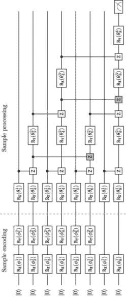

图 8.8：用于信用审批分类器的 PQC #2。新的固定 2 量子比特门以灰色阴影显示。

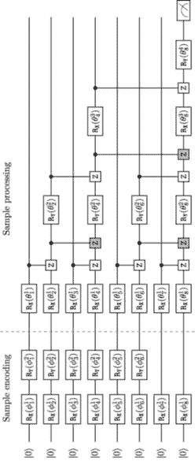

图 8.9：用于信用审批分类器的 PQC #3。新的固定 2 量子比特门以灰色阴影显示。

通过对不同子集的训练数据集进行训练，可以实现类似的结果。这些子集是通过从原始训练数据集中抽取自助样本（带有替换的随机样本）产生的。然后，可以将这些不同训练的 QNN 分类器结合成一个强大的单一分类器，使用上述的多数投票方法。

#### 8.7.2 量子提升

我们首先介绍了集成学习的概念，其中通过经典的多数投票方法将由多个 QNN 产生的预测结果合并成一个更为稳健的统一预测。然而，我们也可以采取另一种集成学习的方法：将多个经典分类器的预测结果作为输入传递给 QNN，QNN 会对这些结果进行聚合并给出统一的预测。换句话说，QNN 作为量子增强器，类似于第四章中介绍的基于 QUBO 的 QBoost 模型。

让我们回到第 8.5 节中使用的经典基准。这里有四种不同的机器学习模型执行二元分类。它们的输出（“0”表示类别 0，“1”表示类别 1）作为输入传递给 4 量子比特 QNN 分类器。由于所有量子寄存器都初始化为 ，所以各个分类器的输出可以通过以下方式进行编码：对于类别 0 输出不做任何操作（等同于应用恒等操作 I），或者对于类别 1 输出应用 NOT 门 X。

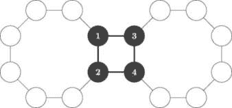

图 8.10：将 4 量子比特 QNN 嵌入到 Rigetti 的 Aspen 系统的桥接部分。

图 8.10 显示了如何将 4 量子比特 QNN 高效地嵌入到 QPU 中，图 8.11 显示了对应的参数化量子电路，具有可调的单量子比特门（R[X]*,*R[Y]）和固定的两量子比特门（CZ）。

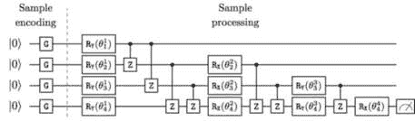

图 8.11：QBoost 电路。样本编码门 G 如果输入为“0”则为恒等门 I，如果输入为“1”则为 NOT 门 X。

集成学习可以像提高经典弱学习者的性能一样，提高 QNN 的性能。

### 摘要

在这一章，我们介绍了量子神经网络的概念，它是一个作为分类器训练的参数化量子电路。我们考虑了两种训练 QNN 的方法：可微（梯度下降）和不可微（粒子群优化）方法。梯度下降通常更快，但可能会遇到荒漠高原（梯度消失）问题。进化搜索启发式方法可能较慢，但能够处理多个局部最小值，并在探索与利用之间找到合适的平衡。

我们还探讨了在具有有限量子比特连接性的 NISQ QPU 上嵌入 QNN 的问题。作为示例，我们考虑了 Rigetti 的 Aspen 系统，并提出了一种高效的嵌入方案，镜像了 QNN 的“树结构”架构。

一旦我们的量子神经网络（QNN）完全定义并嵌入到量子处理单元（QPU）图中，我们就会研究其在实际信用审批数据集上的表现，并与几种标准的经典分类器进行比较。

最后，我们介绍了几种集成学习技术，这些技术有助于在混合量子经典协议的背景下提升 QNN 的表现。

在下一章，我们将学习一个强大的生成型 QML 模型——量子电路 Born 机，这是经典受限玻尔兹曼机（Restricted Boltzmann Machine）在量子领域的直接对应物，我们在第五章中讨论过该经典模型。

### 加入我们书籍的 Discord 社区

加入我们的 Discord 社区，结识志同道合的人，并与超过 2000 名成员一起学习，地址为：[`packt.link/quantum`](https://packt.link/quantum)


