## 9

量子电路博恩机器

量子计算这一新计算范式的到来以及量子计算硬件的进展，促使了对量子机器学习模型，特别是量子生成模型的深入研究，这些模型可以看作是经典 RBM 的量子对应物，后者在第五章中有介绍。经典生成模型是无监督机器学习技术中最重要的类别之一，广泛应用于金融领域，如合成市场数据的生成[48, 173]、系统性交易策略的开发[176]，或数据匿名化[174]，仅举几例。

量子生成模型具备在 NISQ 设备上建立量子优势所需的所有必要特性。最著名的此类模型之一是量子电路博恩机器（QCBM），它由若干层可调和固定门组成，后面跟随测量操作符。输入是一个量子态，其中所有量子比特在计算基底中初始化为|0⟩。输出是一个比特串，这是通过对初始状态应用可调和固定门构建的最终态中编码的概率分布中提取的样本。

实验验证量子优势的期望来自以下观察：首先，当只允许多项式数量的参数时（QCBM 中的量子比特数量或 RBM 中可见激活单元的数量），QCBM 的表达能力明显大于经典 RBM[88]。其次，在 QCBM 的情况下，可以通过量子电路的一次运行生成从已学习分布中独立的样本——相比之下，RBM 需要通过网络进行最多 10³到 10⁴次的前向和反向传播才能达到热平衡状态[173]。这表明了量子加速的可能性。第三，量子生成模型可以用于将数据加载到量子态中，从而促进多种有前景的量子算法的实现[314]。

### 9.1 构建 QCBM

正如我们在第八章中所见，构建可以在 NISQ 计算机上运行的 QML 模型的艺术在于寻找一个最优的 PQC 架构，以便将其嵌入到所选的 QPU 图中。在本节中，我们将展示如何为与 IBM 的墨尔本和罗切斯特系统兼容的 QCBM 构建此架构。

#### 9.1.1 QCBM 架构

QCBM 是一个参数化量子电路，其中一层可调的单量子比特门后面跟着一层固定的双量子比特门。这样的模式可以重复多次，构建一个逐渐加深的电路。输入是一个量子态，所有量子比特都初始化为|0⟩，以计算基表示。最终层由测量算符组成，从学习到的分布中生成一个比特串样本。因此，指定 QCBM 架构意味着指定层数、每层的可调门类型以及每层的固定门类型。由于 PQC 的理论仍在发展中[29]，我们可以依靠 PQC 和经典神经网络之间的相似性和类比，提出一些关于可能 QCBM 架构的初步猜测。

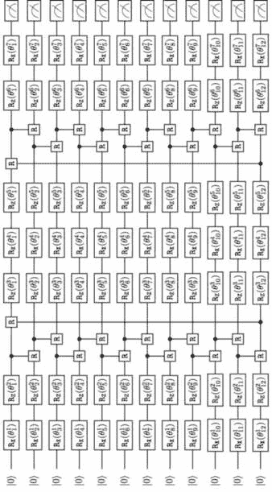

图 9.1：QCBM(12, 7)。

图 9.1 显示了一个 12 量子比特的 QCBM，具有两层受控旋转门 R = RG，其中 G ∈{X*,*Y*,*Z}且*ϕ* ∈ [−*π,π*]，其中 G 和*ϕ*是固定的，以及三层单量子比特门 RX 和 RZ，每个量子寄存器总共有七个可调门。该电路足够宽且足够深，可以学习一个连续随机变量的复杂分布，同时仍能在现有的 NISQ 设备上实现：一个连续随机变量的 12 位二进制表示提供足够的精度，而每个量子比特的七个可调参数（旋转角度）提供足够的灵活性。同时，电路的深度又不会过大，以至于受到现有量子硬件可实现的门保真度的影响[46, 164]。

#### 9.1.2 QCBM 嵌入

选择的 QCBM 架构与当前一代量子处理器中观察到的有限连接性兼容。例如，所提议的电路需要顺序的量子比特连接，其中量子比特*n*直接连接量子比特*n*− 1 和*n* + 1，但不需要直接连接其他量子比特。该架构例如可以由 IBM 的墨尔本系统[208]支持，如图 9.2 所示，其中 12 个阴影部分的量子比特对应图 9.1 中的 12 个量子寄存器。粗线表示 QCBM Ansatz 中使用的连接，而细线表示所有其他可用的量子比特连接。

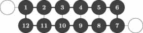

图 9.2：IBM 的墨尔本系统。

图 9.3 中的 53 量子比特罗切斯特设备[208]也可以用来实现这个 QCBM 架构。在这里，我们有几种选择来嵌入 QCBM 电路（12 个线性连接的量子比特形成一个闭环）；阴影量子比特显示了其中一种可能性。

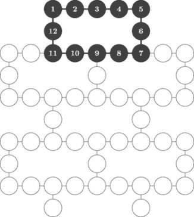

图 9.3：IBM 的罗切斯特系统。

IBM 系统，如墨尔本和罗切斯特，基于超导量子比特。基础技术的选择意味着存在一组本地门——这些量子门直接来自于在给定量子芯片技术实现中发生的相互作用类型。

对于 IBM 设备，交叉共振门产生 ZX 相互作用，从而导致 CNOT 门。对于一比特门，我们注意到 R[Z]是一个对角门，由(6.3.3)给出，并且可以通过帧变换在硬件中虚拟实现（在零误差和持续时间下）[239]。因此，仅需一个 X 驱动就足以旋转 Bloch 球上的量子比特（借助两个门 R[X]和 R[Z]，就可以在 Bloch 球上将量子比特从一个任意点移动到另一个任意点）。

这意味着我们不仅可以从连接性角度，还可以从一比特和两比特门的选择角度引入*硬件高效*架构的概念。考虑到图 6.19 和 6.20 中展示的 CNOT 和 CPHASE 门分解，墨尔本和罗切斯特系统的硬件高效 QCBM 架构将由可调节的 R[X]和 R[Z]单比特门以及固定的 CNOT 和 CPHASE 两比特门组合而成[153, 30]。

QCBM 是作为生成式机器学习模型训练的 PQC。QCBM 作用于*N*量子寄存器，将初始量子态^(⊗N)转化为编码学习到的概率分布的量子态。

### 9.2 QCBM 的可微学习

QCBM 电路的输出是一个比特串，表示从量子态中编码的概率分布中抽取的样本。电路本身本质上是一个机制，将初始态|0⟩^(⊗n)转化为最终态，然后通过测量量子比特（在计算基中）生成样本。

一比特和多比特门的不同配置编码了不同的概率分布——QCBM 的训练包括寻找一个最佳的电路配置（ansatz）和一组最佳的可调参数，以最小化最终量子态（测量之前，或称“采样之前”）中编码的概率分布与训练数据集的概率分布之间的距离。

按照我们在第八章中采用的结构，我们首先介绍可微学习方法，然后再介绍基于另一种进化搜索启发式方法的非可微学习方法——遗传算法。

#### 9.2.1 样本编码

在最一般的情况下，训练数据集由包含连续、整数和类别特征的样本组成。然而，QCBM 仅处理二进制变量。因此，我们需要设计一种方法将连续特征转换为二进制特征，并设计一种方法将生成的二进制 QCBM 输出（采样）转换为连续变量。整数和二进制特征可以视为连续特征的特例，类别特征可以通过一热编码转换为二进制特征。此方法可以实现为两步过程（算法 6）：

1.  将连续变量转换为相应的整数变量。

1.  将整数变量转换为相应的二进制变量。

给定生成的二进制输出，可以使用相同的过程以反向模式生成连续样本（算法 7）：

1.  将生成的二进制 QCBM 输出转换为整数样本。

1.  将整数样本转换为相应的连续样本。

![--------------------------------------------------------------------- 算法 6：连续到整数到二进制转换（训练阶段）--------------------------------------------------------------------- 结果：将连续变量转换为 M 位二进制特征。（（n））输入：Xreal(l) l=1,...,Nsamples；n=1,...,Nvariables - 连续数据样本。对于 n = 1,...,Nvariables 做：（） | X (mni)n ← minl=1,...,Nsamples X (rnea)l(l) − 𝜖(nm)in, 如果 𝜖(nm)in ≥ 0 | （n） （（n）） （n） （n） | X max ← maxl=1,...,Nsamples X real(l) + 𝜖max, 如果 𝜖max ≥ 0 | | 对于 l = 1,...,Nsamples 做（ ） | | （n） （ M ） X (nre)al(l)− X (mni)n | | X integer(l) ← int 2 − 1 ---(n)-----(n)- | | X max − X min | | （n） （（n）） | | Xbinary(l) ← bin X integer(l) | | 结束 结束 每个数据样本由一个 M 位二进制数表示，每一位成为一个独立的特征。特征总数为 M × Nvariables。--------------------------------------------------------------------- ](img/file812.jpg)

![--------------------------------------------------------------------- 算法 7：二进制到整数到连续转换（采样阶段）--------------------------------------------------------------------- 结果：将生成的 M 位二进制样本转换为连续样本。（ ^（n））输入：X[m] m=0,...,M −1；n=1,...,Nvariables - 生成的 M 位二进制样本。对于 n = 1,...,Nvariables 做 | （n） M∑−1 （n） | X^integer := 2m X^[M −1−m ] | m=0 | （n） （n） 1 （n） （（n）） | ^X real ← X min +-M----X^integer Xm(na)x − X min | 2 − 1 结束 --------------------------------------------------------------------- ](img/file813.jpg)

算法 6 和 7 描述了将连续变量转换为 *M* 位二进制变量，然后再转换回连续变量的过程[173]。需要特别注意参数 *𝜖*[min] 和 *𝜖*[max] 的作用。它们是非负的，并且扩展了变量定义的区间。在 *𝜖*[min] = *𝜖*[max] = 0 的情况下，这个区间由训练数据集中的变量最小值和最大值决定。通过允许 *𝜖*[min] 和 *𝜖*[max] 取正值，我们可以扩展变量可以取值的区间。这使得模型能够生成更广泛的可能场景：在某些（小）概率下，生成的值可能会落在训练数据集样本所给出的区间之外。

二进制表示的精度是特征特定的。更重要的特征可以拥有更精细的表示。精度的正确选择对于具有有限量子寄存器的 NISQ 设备非常重要。例如，图 9.1 中所示的 QCBM 假设可以用来编码两个连续变量，每个变量使用 6 位二进制精度。或者，更重要的变量可以使用例如 8 位二进制精度进行编码，而较不重要的变量则只使用 4 位二进制精度。

图 9.2 演示了如何将来自 12 个量子寄存器的读出结果转化为由两个连续变量组成的样本：第一个变量的值被编码为一个 7 位二进制数，第二个变量的值被编码为一个 5 位二进制数。在这个例子中，我们假设两个变量都取值于区间 [−1*,*1]。

![图 9.4：示例 QCBM 读出和数据变换，针对取值在区间 [−1,1] 的两个连续变量，并且我们设置了 𝜖[min] = 𝜖[max] = 0\.](img/file814.jpg)

图 9.4：示例 QCBM 读出和数据变换，针对取值在区间 [−1,1] 的两个连续变量，并且我们设置了 𝜖[min] = 𝜖[max] = 0\。

#### 9.2.2 选择合适的成本函数

QCBM 的可微学习遵循与训练量子神经网络相同的原则，详见第 8 章：通过梯度下降法最小化成本函数。主要的区别在于成本函数的形式。在基于 QNN 的分类器中，成本函数表示分类错误，而 QCBM 的成本函数表示两个概率分布之间的距离：训练数据集中的样本分布和生成数据集中的样本分布。

令 𝜃 表示可调节的 QCBM 参数集合，*p*𝜃 为 QCBM 分布，*π*(⋅) 为数据分布。那么我们可以将成本函数 *L*(𝜃) 定义为

| 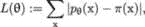 |  |
| --- | --- |

其中求和遍历数据集中的所有样本 x。这个成本函数是一个强有力的度量，但可能不是最容易处理的[73]。一个有效的替代选择是*最大均值* *偏差* [189]：

| ![L(𝜃) := 𝔼 [K (x,y)]− 2 𝔼 [K (x,y)]+ 𝔼 [K (x,y)], x∼p𝜃,y∼p𝜃 x∼p𝜃,y∼π x∼π,y∼π ](img/file816.jpg) |  |
| --- | --- |

其中*K*(⋅*,*⋅)是*核函数*，即样本空间中点之间相似度的度量。一个流行的核函数选择是高斯混合模型：

| 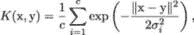 |  |
| --- | --- |

对于某些*c* ∈ℕ，并且(*σ*[i])[i=1,…,c]是每个高斯核的带宽参数，∥⋅∥是*L*[2]范数。

我们还可以探索使用*量子核*的可能性。量子核在计算上难以处理的核函数上，相比经典方法可以提供一定的优势。例如，我们可以考虑一种非变分量子核方法[232]，该方法利用量子电路 U(x)通过*特征映射*将真实数据映射到量子态|*ϕ*⟩：

| 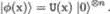 |  |
| --- | --- |

核函数被定义为平方内积

| 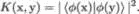 |  |
| --- | --- |

这个量子核在量子计算机上进行评估，而在经典计算机上则难以计算[129]。我们将在第十二章探讨各种模型的表达能力问题，并在第十三章对量子核方法进行详细分析。考虑到映射（9.2.2）并且表示 = ^(⊗n)，核函数变为

| 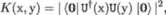 |  |
| --- | --- |

这是测量全零结果的概率。它可以通过在计算基底上测量运行电路 U(y)所得到的状态，再测量 U^†(x)的结果来计算。

### 9.3 非可微分的 QCBM 学习

我们为 QCBM 架构提出的硬件高效假设虽然简单直观，但可能容易受到贫瘠平台（即梯度消失的指数区域）的影响，这使得训练变得不可行[54, 139, 299]。这为探索非可微分学习的替代方法提供了强有力的动机，比如遗传算法。

#### 9.3.1 遗传算法原理

遗传算法（GA）是一种强大的进化搜索启发式方法[214]，它在第三章中进行了介绍。GA 通过维护一个给定问题的候选解（染色体）种群，进行多方向搜索。每个解在一个固定字母表中表示，并且具有既定的含义（基因）。种群经历模拟进化，较好的解决方案产生后代，继而替代较差的解，并且解决方案的质量通过某些目标函数（环境）进行估计。GA 已被应用于金融定量分析（如投资组合优化问题[172]）以及绝热量子计算实验（作为经典基准[296]）。

模拟过程分为三个基本步骤。在选择步骤中，通过随机抽样（有放回）形成新的种群。然后，新选中的种群成员会进行重组。最后，所有新的个体会重新评估。配对过程（重组）基于两种操作符：突变和交叉。突变向种群引入随机变异，而交叉则交换两个染色体的随机片段，旨在传播部分解决方案。

图 9.1 所示的 QCBM 训练过程包括找到旋转角度的最佳配置（*𝜃*[i]^j)[i=1,…,12; j=1,…,7]，以最小化给定特定 2 量子比特门的成本函数。由于我们仅处理 84 个可调参数（而不是数万个），我们不需要实现交叉机制，可以依赖参数突变来实现遗传算法收敛到成本函数的最小值。这大大简化了算法。

#### 9.3.2 使用遗传算法训练 QCBM

算法 8 概述了提出的方法。然而，在我们提供算法的正式描述之前，我们需要明确算法的主要组成部分。

+   **解决方案。** 解决方案是一个 12 × 7 的旋转角度矩阵：

    | 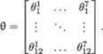 |  |
    | --- | --- |

    在遗传算法语言中，矩阵𝜃充当染色体的角色，而其组成部分*𝜃*[i]^j 充当单个基因的角色。

+   **突变。** 基因可以在代际间发生突变。突变率可以是常数值，也可以随时间变化。例如，突变率可以从一个较大的值开始，然后以指数方式减小，使得每经过*κ*代，突变率减半。在算法 8 中，我们采用以下突变动态：

    +   旋转角度（基因）可以以相等的概率突变为任何允许的离散值。

    +   变异是由一个单一的全局参数 *α* ∈ (0*,*1] 控制的，该参数可以是常数，或者以某个固定的速率 *β* ≥ 0 逐渐减小。

    +   每一列的变异是独立发生的。

    +   对于 𝜃 中的每一列，在每一代中，以 *α* 的概率发生一次单一的旋转角度变异。所有旋转角度发生变异的概率相同。之后，以 *α∕*2 的概率发生另一次变异。再次地，所有旋转角度发生变异的概率相同。这确保了我们可以有这样的情况，即同一列中的两个旋转角度可以同时发生变异。

+   **搜索空间。** 旋转角度 *𝜃*[i]^j 定义在 [−*π,π*] 范围内，我们将其分割成 2^m 个相等的子区间，使得 *𝜃*[i]^j 的可能取值为 (−*π* + *nπ∕*2^(m−1))[n=0,…,2^m−1]。一个旋转角度可以变异为这些值中的任何一个。即使对于相对较小的 *m* 值，搜索空间也可以迅速变得庞大。例如，对于 *m* = 7，每个旋转角度有 128 个可能的取值，使得可能的配置总数大约为 10¹⁷⁷。遗传算法只能探索搜索空间的极小部分。但由于遗传算法能够传播最佳解并避免陷入局部最小值，算法能够在接近全局最小值的区域内迅速收敛。关于遗传算法收敛速率的详细分析，感兴趣的读者可以参考 [130, 264]。

+   **成本函数。** 成本函数是衡量生成样本的分布与训练数据集中原始样本分布之间差异的度量。设 u := (*u*[1]*,…,u*[K]) 为来自训练数据集的样本，v(𝜃) := (*v*1*,…,v*K) 为来自 QCBM 生成数据集的样本，对应于某一特定的旋转角度配置 𝜃。我们将这些样本按从小到大的顺序排列，使用任何合适的 sort(⋅) 函数：

    | 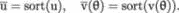 |  |
    | --- | --- |

    成本函数 *L*(⋅) 可以定义为

    | 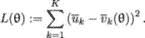 |  |
    | --- | --- |

在 (9.3.2) 中的 sort(⋅) 函数可以是，例如，快速排序 [137] 或归并排序 [166]，它们属于分治算法类别。或者，它可以是例如堆排序 [303] —— 一种基于比较的排序算法。

![--------------------------------------------------------------------- -算法---8:-遗传算法------------------------------------ 结果：最优配置的 QCBM 参数集𝜃∗，最小化代价函数。 输入： • u ∈ ℝK：样本训练数据集的向量； • L：迭代次数（代数）； • M：当前代中选出的最佳解的数量，用于进一步变异； • N：每代中的解的数量（N = DM，D ∈ ℕ）； • α，β：变异参数； • m：搜索空间参数。（旋转角度的可能值为− π + -νπ-- . 2m− 1 ν=0,...,2m− 1 初始化并评估第一代解：对于 n = 1,...,N，执行以下操作 | 随机抽取每个旋转角度𝜃j(0;n)在旋转角度的可能值集合上， | 并生成配置𝜃(0;n)。 | | 对于 k = 1,...,K，执行以下操作 | | 运行量子电路，使用配置𝜃(0;n)并 | | 生成新的样本 v(𝜃(0;n))。 | k | 结束 | 评估代价函数 L(𝜃(0;n))。 结束 将解从最优（代价函数最小）到最差（代价函数最大）进行排序。 𝜃∗ ← 对应于代价函数最小值的配置。 --------------------------------------------------------------------- ](img/file826.jpg)

![--------------------------------------------------------------------- --------------------------------------------------------------------- 迭代：对于 l = 1,...,L，执行以下操作 | −β | α ← αe | | 从上一代 l − 1 中选择 M 个最佳解并生成新的 | | 解（𝜃(l;n ))n=1,...,N，方法是通过使用更新后的变异率α来变换旋转角度。每一个 M 个最佳解都 | | 用于生成 D 个新的解。 | | 对于 n = 1,...,N，执行以下操作 | | 对于 k = 1,...,K，执行以下操作 | | | | | | 运行量子电路，使用𝜃(l;n)并生成新的 | | | 样本 vk(𝜃 (l;n))。 | | 结束 | | | | | 评估代价函数 L(𝜃(l;n))。 | 结束 | | 将解从最优（代价函数最小）到最差（代价函数最大）进行排序。 | | 𝜃∗(l) ← 对应于代价函数最小值的配置 | | （第 l 代）。 | | 如果 L(𝜃∗(l)) < L(𝜃∗)，则 | 𝜃∗ ← 𝜃∗(l) | 结束 结束 --------------------------------------------------------------------- ](img/file827.jpg)

在描述了训练算法之后，我们现在指定经典基准，然后再比较量子生成模型和经典生成模型在样本数据集上的结果。

### 9.4 经典基准

QCBM 与其经典对应物——限制玻尔兹曼机（RBM）之间存在深刻的联系 [60]。RBM 在量子退火的背景下被介绍并讨论，详见第五章，是一种受到统计物理启发的生成模型，其中某个特定数据样本 v 的概率由玻尔兹曼分布给出：

| 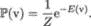 |  |
| --- | --- |

这里，*E*(v)是数据样本的（正）*能量*（具有较低能量的数据样本具有较高的概率），*Z*是配分函数，即概率密度的归一化因子：

| 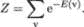 |  |
| --- | --- |

或者，我们可以利用量子力学固有的概率性质，利用量子态来建模概率分布 ：

| 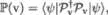 |  |
| --- | --- |

其中𝒫[v]是第 1.2.3 节中介绍的测量算符，并且由于量子态  是单位向量，我们有

| 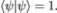 |  |
| --- | --- |

我们在量子电路 Born 机器（Quantum Circuit Born Machine, QCBM）中实现了这种方法，其中生成的概率密度建模被转化为学习一个量子态。QCBM 的参数化电路的唯一目的是生成量子态 ，该态编码了从初始状态|0⟩^(⊗n)开始的期望概率分布，采样是通过施加测量算符来执行的。

因此，提供 QCBM 的经典基准的方法是找到一个合适的 RBM 配置，使我们能够比较生成概率分布ℙ(v)的两种方法：一种是由 (9.4) 产生的 RBM 方法，另一种是由 (9.4) 产生的 QCBM 方法  [170]。

图 9.5 展示了一个具有 12 个随机二进制可见激活单元和 7 个随机二进制隐藏激活单元的 RBM，其中 (*a*[i])[i=1,…,12]，(*b*[j])[j=1,…,7] 和 (*w*[ij])[i=1,…,12; j=1,…,7] 分别表示可见层和隐藏层的偏置以及网络权重。

该网络架构使得 RBM 等价于 QCBM，如第 9.1 节中所述，因为这两种生成模型具有相同数量的可调参数（RBM 的权重数量等于 QCBM 中可调旋转角度的数量），并且可见激活单元的数量等于量子寄存器的数量。后者确保这两种生成模型能够以相同的精度（12 位二进制表示）学习连续随机变量的经验分布。

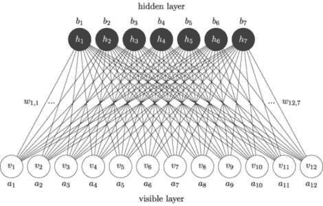

图 9.5: RBM(12, 7).

QCBM 的性能应与其经典对应物——限制玻尔兹曼机（RBM）的性能进行比较。两种模型都在数据集的二进制表示上操作，并且具有相似数量的可调参数。

### 9.5 QCBM 作为市场生成器

QCBM 最明显的金融应用是作为市场生成器。例如，从风险因子的联合分布中抽样，进行高效的现实市场情境生成，是今天定量金融领域中最重要和最具挑战性的问题之一。因此，我们需要调查 QCBM 如何执行这一任务，并将其与经典基准进行比较。

#### 9.5.1 市场风险因子的非参数建模

从历史上看，解决生成可靠的合成市场情境的问题通常是通过从一些易于校准的参数模型中进行抽样来完成的，例如风险因子对数收益（股票）的多元正态分布，或结合多元正态依赖结构和单个风险因子的重尾单变量边际分布（信用）的高斯 copula。然而，这种方法存在一些众所周知的问题，这些问题往往超过了其在简洁性和透明性上的优势[217]。

参数模型往往是现实的一个较差近似。为了有效，它必须相对简单：应该能够用少量参数描述风险因子分布的关键特征，从而最好地拟合从历史数据中推导出的经验分布或从市场中观察到的交易工具价格（在模型校准时）。将参数模型做得过于复杂会导致过拟合和较差的泛化能力。

建模一个现实的依赖结构更为困难。大多数蒙特卡洛风险引擎中常用的典型参数化方法是首先独立地建模各种风险因子的动态，然后通过相关相应的随机驱动因素来强加一个依赖结构。这些驱动因素几乎总是布朗运动，它们之间的线性相关性应该足以构建风险因子的联合分布。

一种替代方法是使用非参数建模，其中风险因子的联合分布和边际分布是直接从可用数据集学习得出的。经典地，我们可以借助限制玻尔兹曼机（Restricted Boltzmann Machine）来实现这一方法——前一节中描述的经典基准，且已成功应用于多个金融案例[173, 174]。另一种可能性是使用生成对抗网络（GAN）框架，其中通过生成神经网络从数据集中学习到的分布被判别神经网络测试，后者试图判断样本是来自真实分布（数据）还是来自重建分布（生成的样本）[114]。

第 12 章探讨了 QCBM 在表达能力上与经典神经网络（RBM）相比的问题。然而，第一步应该是对它们的性能特征进行实验验证。考虑到这一点，我们希望测试 QCBM 和 RBM 在学习相对复杂的概率分布方面的能力，然后高效地从中采样。

#### 9.5.2 从学习到的概率分布中采样

我们将测试 QCBM 和 RBM 在两个数据集上的表现：

+   **数据集 A**。2009 年 1 月 5 日至 2011 年 2 月 22 日之间观察到的 S&P 500 指数回报的重尾分布（UCI 机器学习库 [10， 9]）。数据集包含 536 个样本。

+   **数据集 B**。一个特别构造的连续随机变量分布，具有高度尖锐的概率密度函数（pdf），该分布被建模为多个正态分布的混合。数据集由 5,000 个样本组成，这些样本来自四个正态分布的混合，具有以下均值、标准差和权重：

    | 均值 | 标准差 | 权重 |
    | --- | --- | --- |
    | −3 | 0.3 | 0.1 |
    | −1 | 0.3 | 0.2 |
    | 1 | 0.3 | 0.3 |
    | 3 | 0.3 | 0.4 |

    表 9.1：标准正态分布混合的参数。

在这两种情况下，我们将连续样本转换为相应的 12 位二进制表示，按照算法 6。一旦网络训练完成（QCBM 使用算法 8，RBM 使用算法 2），我们生成新样本：数据集 A 生成 536 个新样本，数据集 B 生成 5,000 个新样本。这使我们能够通过生成经验 pdf 和 QQ 图来可视化生成样本的质量，正如图 9.6 和 9.7 所示，它们展示了完全训练模型的样本模拟结果。我们可以看到，QCBM(12, 7) 和 RBM(12, 7) 都能成功学习复杂的经验分布（数据集 A 为重尾分布，数据集 B 为轻尾且具有尖锐 pdf 的分布）。我们选择了 CX 门作为 QCBM 中的固定门，并使用 Qiskit 量子模拟器来模拟训练和采样算法中的量子部分。

以下超参数集用于训练模型：

+   **用于训练 QCBM 的遗传算法（算法 ****8****）** *N* = 1000, *M* = 25, *m* = 7, *α* = 1*.*0, *β* = 0*.*013863, *κ* = 50, *L* = 200。*β* 的值确保每隔 *κ* 代变异率减半。

+   **用于训练 RBM 的对比散度算法** (`sklearn.neural_network.BernoulliRBM`)

    n_components = 7 – RBM(12, 7) 的隐藏激活单元数  

尽管从图 9.6 和图 9.7 中的概率密度函数（pdf）和 QQ 图来看，QCBM 和 RBM 都在从学习到的经验分布中生成高质量样本方面表现良好，但我们希望能有一个更客观的模型性能衡量标准。特别是在我们处理生成模型时，单次模型运行得出的结论非常有限。

针对某一特定模型参数配置（例如，通过遗传算法（GA）找到的最优旋转角度集）多次运行量子电路，会产生目标函数值的分布。这使我们能够了解可以用来衡量 QCBM 和 RBM 性能的度量标准[170]。我们在训练 QCBM 时使用的成本函数（9.3.2）可以通过 RBM 生成的样本计算得到。换句话说，我们可以通过比较这两种模型生成的样本计算出的成本函数值的分布，来比较 QCBM 和 RBM 的性能。

表 9.2 展示了针对 QCBM(12, 7) 和 RBM(12, 7) 进行 100 次训练的成本函数的均值和标准差。每次训练都从学习到的经验分布中生成 5000 个样本（模型是在数据集 B 上训练的，数据集 B 包含 5000 个来自四个正态分布混合的样本）。

| 模型 | 平均值 | 标准差 |
| --- | --- | --- |
| QCBM(12, 7) | 30.5 | 23.6 |
| RBM(12, 7) | 39.6 | 30.8 |

表 9.2：在数据集 B 上训练的模型的成本函数统计数据。

从表 9.2 可以明显看出，QCBM(12, 7) 在使用弱优化的超参数设置时，比使用同样弱优化的超参数（较小的学习率与较大的迭代次数以及小批量的大小[134]）训练的 RBM(12, 7) 表现更好。虽然这不能视为量子优势的确凿证据，但它无疑为有前景的进一步研究开辟了大门。

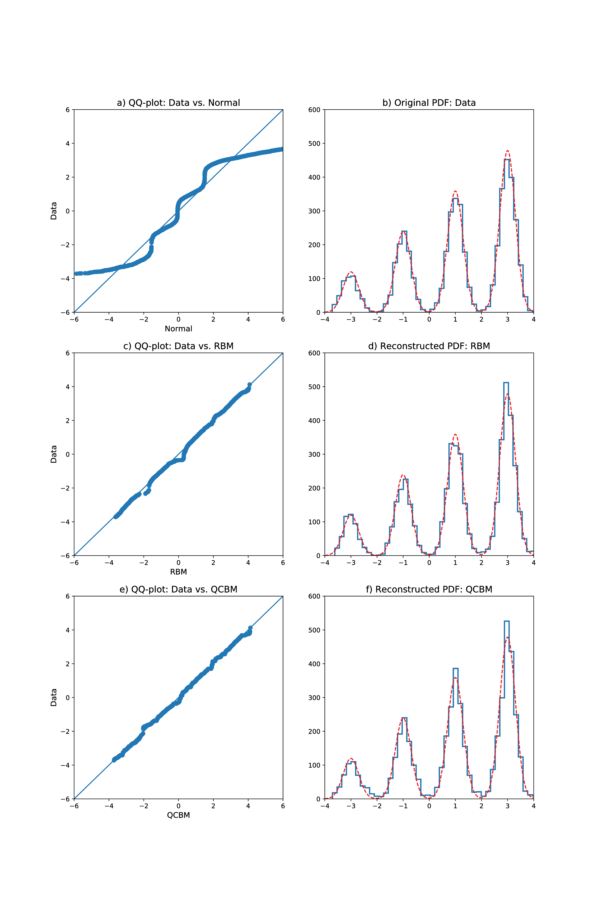

图 9.6：正态分布混合模型。

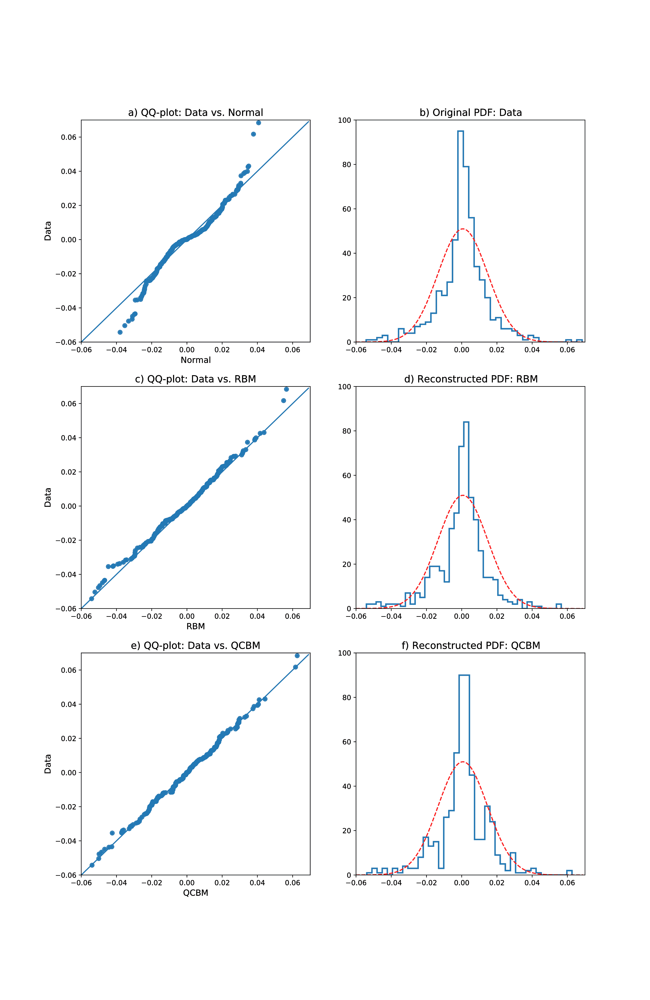

图 9.7：标准普尔 500 指数回报分布。

现在让我们关注数据集 A。该数据集仅包含 536 个样本，正如我们在图 9.7 中看到的，经验概率密度函数显示出明显的重尾现象，这在与正态分布的 QQ 图中也清晰可见。样本数量相对较少意味着我们必须处理大量噪声。因此，我们需要使用稳健的统计检验来比较 QCBM 和 RBM。由于我们处理的是单变量分布，因此我们可以使用 Kolmogorov-Smirnov 检验[233]来估算生成样本的质量。

表格 9.3 提供了 RBM 和 QCBM 生成的样本的 p 值和 Kolmogorov-Smirnov 统计量，以及通过匹配前两个矩得到的拟合到原始数据集的正态分布。p 值表示获得支持零假设的测试结果的概率，即两个数据集来自相同分布的概率。在我们的数值实验中，p 值越大，生成的样本越可能来自正确的分布。

| 分布 | p 值 | K-S 统计量 |
| --- | --- | --- |
| 正态分布 | 0.004 ± 0.009 | 0.121 ± 0.017 |
| RBM 生成样本 | 0.46 ± 0.23 | 0.055 ± 0.011 |
| QCBM 生成样本 | 0.46 ± 0.11 | 0.053 ± 0.005 |

表格 9.3：正态分布、RBM 和 QCBM 生成样本的 p 值和 K-S 统计量，格式为：均值 ± 标准差。正态分布、RBM 和 QCBM 生成的数据集数量：20。每个生成的数据集的样本数：536（与原始数据集中的样本数相等）。

K-S 统计量取所有随机变量值下两个分布函数之间的最大绝对差。K-S 统计量越大，生成样本来自正确分布的可能性就越小。K-S 统计量可以与给定置信水平和样本数量计算得到的临界值进行比较。例如，对应于 95%置信水平和 536 个样本的临界值是 0*.*0587。如果 K-S 统计量较大，那么我们可以以 95%的置信度拒绝“536 个生成样本来自正确分布”的零假设。

第一个观察结果是，我们可以明确拒绝“每日 S&P 500 指数回报服从正态分布”的零假设。相应的 p 值远小于 1，K-S 统计量是临界值的两倍。更重要的是，QCBM 在 p 值和 K-S 统计量方面的表现与 RBM 相当：因此我们无法拒绝 QCBM 和 RBM 生成的样本来自与原始数据集相同分布的零假设。

#### 9.5.3 训练算法收敛性和超参数优化

接下来，我们希望探讨 GA 在不同模型配置下的表现。特别是，调查不同类型固定门（不仅仅是 CX）和不同变异率选择下的算法收敛性是非常有趣的。图 9.8 中的图表确认了我们的直觉：给定单量子比特门的配置（图 9.1），CX 是最佳的固定门选择，而指数衰减的变异率优于常数变异率。这里，我们继续使用数据集 B。

正如我们在图 9.1 中所见，固定门两侧是执行绕 *z* 轴旋转的单量子比特门。因此，通过 *ϕ* = *π* 进行的绕 *z* 轴旋转（Z = RZ）可能无法提供与绕 *x* 轴旋转（X = RX）相同的灵活性。绕 *z* 轴的控制旋转角度 *ϕ < π* 可能表现得更差。这正是我们在图 9.8（左图）中对三种不同类型的固定门（CX、CZ 和 CRZ）所看到的情况。

我们对变异率最佳选择的直觉表明，开始时使用一个非常大的变异率应该是有益的，以便尽可能广泛地探索搜索空间（“探索”阶段）。然后，随着算法逐步找到更好的解决方案，减少变异率应该会更有利，以便在找到的最佳解决方案附近进行更详细的搜索（“开发”阶段）。随着算法的收敛，我们可能希望通过仅变异一个或两个参数来进行越来越精细的搜索。图 9.8（右图）显示了这一点。这里，变异率的最大值为 *α* = 1*.*0，最小值为 *α* = 0*.*0625——这是在变异率初始值 *α* = 1*.*0 和指数衰减因子 *β* = 0*.*013863 的条件下，算法经过 *L* = 200 次迭代后达到的值。

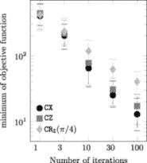

图 9.8：左图：GA 收敛性与固定门类型的关系。右图：GA 收敛性与 CX 固定门的变异率关系。圆点表示均值，误差条表示第 10 和第 90 百分位数。GA 参数：N = 1000，M = 25，m = 7，进行 20 次 GA 运行。

最后，我们需要研究算法的收敛性，作为旋转角度离散化方案的函数。从原则上讲，任意旋转都会带来问题，因为它必须通过一系列离散门进行逼近，因为只有离散的门集合才能够容错实现 [180]。由于遗传算法（GA）在离散的旋转角度集合上运行，我们面临一个折衷问题，即通过更精细的离散化方案实现更高的精度，还是在较不精细的旋转角度集合下提高实现效率。此外，所有旋转门都可以在有限精度下执行，离散化方案应该考虑到这一点。因此，为了促进旋转门 RX 和 RZ 的高效实现，GA 在取离散值的旋转角度 *𝜃* 上运行，这些值为 (−*π* + *νπ∕*2^(m−1))[ν=0,…,2^m−1]，从而将 [−*π,π*] 区间分成 2^m 个相等的子区间。

因此，我们必须回答关于 GA 收敛性的问题，针对不同的 *m* 值。图 9.9 显示了目标函数的最小值（9.3.2）作为算法迭代次数的函数，对于三种不同的 *m* 值：

+   *m* = 3，旋转角度步长 Δ*𝜃* = *π∕*4；

+   *m* = 5，旋转角度步长 Δ*𝜃* = *π∕*16；

+   *m* = 7，旋转角度步长 Δ*𝜃* = *π∕*64。

我们可以看到，当 *m >* 5 时，GA 的性能仅有轻微提升。这是个好消息，表明使用旋转角度步长 Δ*𝜃* = *π∕*16 就足以在学习目标分布时达到期望的精度。

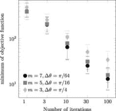

图 9.9：GA 收敛性作为旋转角度离散化方案的函数，针对固定的 CX 门和指数下降的突变率。点表示平均值，误差条表示 10th 和 90th 百分位数。GA 参数：N = 1000，M = 25，α = 1.0，β = 0.013863，进行 20 次 GA 运行。

使用遗传算法（GA）进行 QCBM 的非可微学习是一种可行的 PQC 训练方法。用 GA 训练的 QCBM 至少能够与等效的经典神经网络（RBM）表现相当。QCBM 和其经典对比模型在两个不同的数据集上进行了测试（分别来源于金融时间序列的重尾分布样本和从特别构造的分布中提取的轻尾分布样本，并且其概率密度函数为尖峰型），在这两种情况下，QCBM 都展示了它学习经验分布并生成新的合成样本的能力，这些新样本具有与原始样本相同的统计特性，如概率密度函数和 QQ 图所示。

分析不同超参数集的遗传算法收敛性时，我们观察到最佳结果是在 CX 固定门和指数衰减的变异率下实现的（从变异率的最大值开始，并将衰减率设置为一个合理的小值）。更重要的是，我们发现，更细粒度的旋转角度离散化方案在某个临界点之后提供的增量价值逐渐减小。这意味着，对于许多实际应用而言，实现Δ*𝜃* = *π∕*16 的旋转即可，在足够深的 QCBM 架构中（至少两层固定 2 量子比特门）就能以所需的准确度编码目标分布。由于在 NISQ 设备上量子比特旋转可以实现有限精度，这确保了 QCBM 可以在许多实际应用中有效使用。

QCBM 是构建市场生成器的可行选择。它的表现至少与其经典对手 RBM 相当，并展示了在近端量子处理器上实现量子优势的潜力。

### 摘要

在本章中，我们学习了如何构建和训练一个生成型 QML 模型——量子电路出生机。我们从 PQC 作为生成模型的总体概念开始，在该模型中，读取操作从 PQC 参数中编码的概率分布中生成一个样本。

接下来，我们介绍了硬件高效 PQC 假设的概念。此外，为了构建一个与 QPU 连接性兼容并且能轻松嵌入 QPU 图的模型，我们尝试使用给定系统的原生量子门集中的可调（单量子比特）和固定（双量子比特）门。

接下来，我们研究了可微分和不可微分的学习算法，并进行了使用遗传算法训练的 QCBM 实验。与经典基准（RBM）的比较展示了量子生成 QML 模型实现量子优势的现实可能性。

最后，我们探讨了不同模型参数集的训练算法收敛性问题。

在下一章中，我们将研究另一种重要且极具潜力的 QML 模型——变分量子特征求解器。

### 加入我们书籍的 Discord 空间

加入我们的 Discord 社区，与志同道合的人交流，并与超过 2000 名成员一起学习，网址：[`packt.link/quantum`](https://packt.link/quantum)

