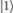
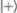
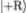
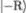
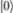

## 10

变分量子本征求解器

参数化量子电路可以在量子机器学习之外找到许多潜在应用，这些应用超出了前几章讨论的用例。它们可以用来解决如投资组合优化[168]和蛋白质折叠[248]等多种不同问题。然而，无论具体的算法细节如何，有一个方面始终相同：通过最优的 PQC 配置（假设）和可调 PQC 参数集来构建具有所需特性的量子态。反过来，这通常是通过最小化某些成本函数来完成的——例如，在 QNN 分类器的情况下，它可以是分类错误；在 QCBM 的情况下，它可以是两个分布之间的距离。

变分量子本征求解器（VQE）是一种基于量子电路的算法，旨在找到问题哈密顿量的最小本征值（最低能量）。正如我们在第三章中了解到的，许多 NP 难度的组合优化问题的目标函数可以编码在量子系统的哈密顿量中——因此，找到哈密顿量的基态可以为我们提供目标函数的最小值。VQE 最早在[231]中提出，并迅速成为实验解决 NISQ 设备上可解的各种优化问题的最流行工具之一[153，215]。该算法的变分部分指的是通过尝试不同的量子电路（PQC）假设和可调 PQC 参数配置，系统地搜索基态的最佳近似——即变分方法。

### 10.1 变分方法

让我们首先回顾一下训练判别性（QNN）和生成性（QCBM）模型的细节。在这两种情况下，我们的任务是找到 PQC 参数的最佳配置（例如，可调单量子比特门的旋转角度），以使得得到的量子态具有所需的特性：我们可以从编码的概率分布中采样（生成模型）或为给定的样本获取类别标签（判别模型）。寻找 PQC 参数的最佳配置的过程在处理量子机器学习用例时称为*学习*。这种学习可以是可微分的，也可以是不可微分的，但它总是通过改变可调电路参数来最小化某些成本函数。

如果我们想要最小化的成本函数被编码在问题哈密顿量中，并且任务被表述为寻找它的基态呢？在第三章中，我们看到了如何在量子退火机上解决这个问题。但在 PQC 框架内，也可以使用门模型量子计算机找到量子系统的最低能量态（或者至少是一个好的近似）。

哈密顿量 ℋ 的特征方程为

|  |  |
| --- | --- |

其中  是与特征值 *E*[i] 相关的特征态。目标是找到 ℋ 的最小特征值 *E*[0]（最低能量），对应于基态（最低能量态）。如果基态已知，这将是一个简单的任务，因为 ℋ 的特征值（能量）实际上就是 ℋ 的期望值：

|  |  |
| --- | --- |

我们将在下面解释如何在量子计算机上计算这个期望值。然而，在大多数情况下，基态是未知的。实际上，任务是通过寻找能够最小化 ℋ 的期望值的状态来找到基态，从而编码优化问题的解决方案。我们可以做的是构造一个逐步改进的基态近似，从而为基态能量 *E*[0] 提供一个越来越紧的上界。

变分方法的动机来源于第一章中引入的谱定理，它允许我们将厄米哈密顿量 ℋ 展开为

|  |  |
| --- | --- |

假设我们构造了一个状态 ，它是实际基态  的近似。正如我们在第一章中所知道的，ℋ 在状态  中的期望值是 ⟨*ψ*|ℋ。将 (10.1) 中给出的 ℋ 代入其中，通过线性运算，我们得到

|  |  |
| --- | --- |

表达式 (10.1) 显示，ℋ 在任何状态  中的期望值可以表示为 ℋ 的特征值的线性组合，所有权重都大于或等于零，因为 ||² ≥ 0 对于每个 *i* 都成立。因此，我们得到

|  |  |
| --- | --- |

因为 *E*[0] 是 ℋ 的最小特征值，并且线性组合中的所有系数（权重）(10.1)都是非负的。

PQC 的作用是生成候选态 。算法的*变分*部分由候选态的迭代改进（可调参数的迭代更新）组成。这是可以作为混合量子-经典协议中的经典部分来执行的。算法的量子部分包括运行 PQC，然后在构建的量子态上测量 ℋ，以获得 ℋ 的期望值。

变分方法使我们能够在数字门模型量子计算机上求解编码在哈密顿量中的困难优化问题——这是与绝热量子计算的替代方案，因为并非所有优化问题都能有效地以 QUBO 格式表述。

### 10.2 在量子计算机上计算期望值

VQE 算法的关键元素是期望值的计算。我们现在展示如何在量子计算机上执行这一过程。我们从单量子比特情况开始，然后将所提出的方法推广到双量子比特和多量子比特的情况。

#### 10.2.1 单量子比特情况

考虑最简单的单量子比特系统的情况。由于任何 2 × 2 单位矩阵和厄米矩阵都可以始终分解为 Pauli 矩阵 X、Y、Z 以及单位矩阵 I 的和（在第 10.2.3 节中有更多讨论），我们可以将任何单量子比特哈密顿量表示为

|  |  |
| --- | --- |

其中 *a*、*b*、*c* 和 *d* 是一些实系数。对于给定的态 ，哈密顿量的期望值（10.2.1）为

|  |  |
| --- | --- |

ℋ 的期望值是通过将其所有项的期望值相加来计算的，这意味着我们可以独立地计算 Pauli 项的期望值，然后将它们相加以得到 。我们可以通过首先构建态 （利用 PQC 的帮助）并在计算基上执行测量来完成这一过程。构建态和执行测量的过程应当重复足够多次，以获得准确的统计数据。让我们逐项查看哈密顿量的项（10.2.1），看看如何执行。

我们从最后一项开始，它是单位算符 I 乘以系数 *d*。这是一个简单的情况，我们甚至不需要运行量子电路来计算其期望值，因为 I 的期望值为 1：

|  |  |
| --- | --- |

因此，这一项将对  贡献 *d*。

现在我们转向下一个项 *c*Z。测量在计算基进行，这是 *z* 基。在该基中， 可以表示为基态  和  的叠加态，如下所示

|  |  |
| --- | --- |

有 *α*[z]*,β*[z] ∈ℂ。期望 ⟨*ψ*|Z 然后计算为

| ⟨*ψ*&#124;Z | = &#124;*α*[z]&#124;² ⟨0&#124;Z + *α* [z]^∗*β* [z] ⟨0&#124;Z + *α*[z]*β*[z]^∗⟨1&#124;Z + &#124;*β* [z]&#124;² ⟨1&#124;Z |
| --- | --- |
|  | = &#124;*α*[z]&#124;²− *α* [z]^∗*β* [z] + *α*[z]*β*[z]^∗−&#124;*β* [z]&#124;² |
|  | = &#124;*α*[z]&#124;² −&#124;*β* [z]&#124;²*,* |

使用 Z 门的定义（第六章）和基态的正交性。

根据定义，|*α*[z]|² 和 |*β*[z]|² 是在 *z* 基测量后，量子态 分别变为  或  的概率。为了求得该值，我们应当运行量子电路（构造态 ），然后进行*N*次测量。找到量子比特处于状态  的概率估计为 *n*[0]*∕N*，其中 *n*[0] 是测量到状态  的次数。类似地，找到量子比特处于状态  的概率可以估计为 *n*[1]*∕N*，其中 *n*[1] 是测量到状态  的次数。

因此，Z 项对  的贡献为

|  |  |
| --- | --- |

现在我们可以转向右侧的前两个项 (10.2.1)。回想一下， 和  是 Z 的本征态，具有对应的本征值 +1 和 −1，即

|  |  |
| --- | --- |

此外，X 的本征态是

|  |  |
| --- | --- |

Y 的本征态是

|  |  |
| --- | --- |

它们对应的本征值也是 +1 和 −1，因此

|  |  |
| --- | --- |

因此，量子态  也可以分解为基态的叠加，{*,*} (*y*-基) 和 {*,*} (*x*-基)：

|  |  |
| --- | --- |

如果我们能够在 *x*-基和 *y*-基中进行测量，期望值 ⟨*ψ*|X 和 ⟨*ψ*|Y 可以以与期望值 ⟨*ψ*|Z 相同的方式计算，即

|  |  |
| --- | --- |

这里，*n*[+] 和 *n*[−] 分别是对应于 *x*-基中  和  测量结果的次数，*n*[R] 和 *n*[L] 分别是对应于 *y*-基中  和  测量结果的次数。

然而，可能我们只能在 *z*-基中进行测量。在这种情况下，我们需要在测量前对  应用一些附加的门，以使在 *z*-基中测量  的概率与在 *x*-基中测量  的概率相同，如果我们在计算 ⟨*ψ*|X，或者在 *z*-基中测量  的概率与在 *y*-基中测量  的概率相同，如果我们在计算 ⟨*ψ*|Y。这些门记作 H 和 G，得到

|  |  |
| --- | --- |

使用 H =  和 H = ，并且

|  |  |
| --- | --- |

使用 G =  和 G = 。

运算符 H（即哈达玛尔运算符）和 G 的矩阵表示为

|  |  |
| --- | --- |

#### 10.2.2 两个量子比特的情况

如果问题的哈密顿量包含涉及多个量子比特的项怎么办？考虑一个包含保利矩阵张量积的哈密顿量，如 X⊗Y, Y⊗Z 等。一般方法保持不变：哈密顿量的期望值由所有项的期望值之和组成。因此，我们需要知道如何计算保利矩阵乘积的期望值。为了不失一般性，考虑 X⊗Y 这一项——相同的逻辑适用于所有其他保利张量积。

记住，X⊗Y 是两个保利算符 X 和 Y 的张量积，每个算符作用于各自的量子比特，而不是将 X 和 Y 门按顺序应用于同一个量子比特。事实上，考虑两个单位算符 U[1] 和 U[2]，张量积 U[1] ⊗U[2] 在二量子比特系统的状态上作用如下

|  |  |
| --- | --- |

我们立即从 (10.2.2) 看到，X 和 Y 的特征向量的张量积是 X⊗Y 的特征向量。事实上，如果 U = *E*[U]，其中 *E*[U] ∈ℂ，且 U ∈{X*,*Y}，则

我们还记得所有保利算符的特征向量的特征值要么是 +1，要么是 −1（详细信息见 (10.2.1) 和 (10.2.1)）。现在，对于 X⊗Y 保利项，特征值为 +1 的特征向量是

而特征值为 −1 的特征向量是

这些直接来自于计算结果

|  |  |
| --- | --- |

让我们写出二量子比特系统的量子态表示  = ⊗ 在 X⊗Y 特征向量基底下的表示：

|  |  |
| --- | --- |

其中 (*α*[x]*,β*[x]*,α*[y]*,β*[y]) ∈ℂ⁴。我们希望应用一个算符，使得我们可以在 *z* 基底下进行测量，同时相应态的概率幅保持不变。很容易看出，这个算符是 H 和 G 门的张量积：

| (H⊗G) | = (H⊗G) |
| --- | --- |
|  | = *α*[x]*α*y⊗ + *α*[x]*β*y⊗ |
|  | + *β*[x]*α*y⊗ + *β*[x]*β*y⊗ |
|  | = *α*[x]*α*y⊗G) + *α*[x]*β*y⊗G) |
|  | + *β*[x]*α*y⊗G) + *β*[x]*β*y⊗G) |
|  | = *α*[x]*α*y⊗) + *α*[x]*β*y⊗) + *β*[x]*α*y⊗) + *β*[x]*β*y⊗) |
|  | = *α*[x]*α*[y] + *α*[x]*β*[y] + *β*[x]*α*[y] + *β*[x]*β*[y]*.* |

Z⊗Z 的本征值对应于本征态 {*,**,**,*}，与 X⊗Y 对应的本征值相同，本征态为 {*,**,**,*}：

|  |  |
| --- | --- |

因此，期望 ⟨*ϕ*|Z⊗Z，其中

|  |  |
| --- | --- |

在 *z* 基础上给出的

|  |  |
| --- | --- |

概率的值 |*α*[x]*α*[y]|², |*α*[x]*β*[y]|², |*β*[x]*α*[y]|², 和 |*β*[x]*β*[y]|² 可以通过量子计算机按与一比特情况相同的方式计算得出。通过统计结果的数量 *n*[ij]（对于 *i,j* ∈{0,*1}，其中 ∑ [i,j∈{0,1}]*n*[ij] = *N*），X⊗Y 的期望值为

|  |  |
| --- | --- |

#### 10.2.3 多量子比特情况

将这种方法扩展到更复杂的保利乘积和更大的哈密顿量是简单的，因为任何哈密顿量都可以表示为

|  |  |
| --- | --- |

对于实数 *h*，其中上标 *i,j,…* 标识算符作用的子系统（量子比特），下标 *α,β,…* 标识保利算符。例如，*i* = 1, *α* = *x*，且 *σ*[x]¹ = X 作用于量子比特 1。对于这个展开式的有效性，不需要对厄米哈密顿量的维度或结构做任何假设 [231]。

我们已经使用了量子可观察量的线性特性，这使我们能够将哈密顿量的期望值计算为各个项期望值的总和：

|  |  |
| --- | --- |

只要我们考虑可以写成关于系统大小的多项式项数的哈密顿量，评估就简化为一些量子态的简单保利算符的期望值之和，并乘以一些实常数。正如我们上面所见，量子计算机可以高效地评估任意数量简单保利算符的张量积的期望值[227]。

量子计算机可以用来高效地计算由保利算符的张量积组成的哈密顿量的期望值。任何哈密顿量都可以表示为保利算符（X、Y、Z 和 I 门）的张量积之和。

### 10.3 构建 PQC

如何构建用于计算期望值的高质量候选态是一个至关重要的问题。除非我们对基态以及在 *n* 量子比特系统的希尔伯特空间中查找基态的位置有一定的先验知识，否则首要任务是生成一系列候选态，这些态能够覆盖整个希尔伯特空间，而不会在任何一个区域过于集中。让我们看看如何在单量子比特和多量子比特系统中实现这一点。

#### 10.3.1 单量子比特的 Ansatz

我们回到布洛赫球，它可视化了单量子比特系统的可能状态。图 10.1 展示了量子比特状态如何从其初始状态变化到中间状态，然后通过绕 *y* 轴旋转，再绕 *z* 轴旋转，最终到达状态。

图 10.1：布洛赫球：单量子比特旋转的可视化。

从开始，通过绕任何两条正交轴旋转两次，可以到达布洛赫球上的任何一点。相应的电路如图 10.2 所示。

图 10.2：单量子比特系统的 PQC。

如图 10.2 所示的 PQC 是在单量子比特情况下，如果问题哈密顿量中仅包含 Z 和 I 项时我们所需的一切。如果我们想要计算 X 项的期望值，我们必须在电路中添加一个 H 门，如图 10.3 所示。

图 10.3：使用 H 门的 PQC 来计算。

类似地，如果我们想要计算 Y 项的期望值，我们需要在电路中添加一个 G 门，如下所示：

图 10.4: 使用 G 门计算的 PQC。

#### 10.3.2 多量子比特的安扎特

现在我们来看多量子比特的情况，假设优化问题被编码在两量子比特哈密顿量中。

|  |  |
| --- | --- |

对于一些系数*a, b, c* ∈ℝ。如我们所知，哈密顿量的期望值（10.3.2）由各个项的期望值之和给出：

|  |  |
| --- | --- |

我们需要计算所有这些期望值，对于相同的量子态。为了做到这一点，我们需要构建一个量子电路，使用足够灵活的可调门，以支持一系列可能的候选态。由于问题哈密顿量作用于两量子比特态，构建候选态的 PQC 可能如下图 10.5 所示：

图 10.5: 用于构建候选态的 PQC。

在图 10.5 所示的 PQC 中，参数（旋转角度）*𝜃*[1]和*𝜃*[2]唯一地指定了第一量子比特的态，而参数*𝜃*[3]和*𝜃*[4]唯一地指定了第二量子比特的态。计算期望值的完整量子电路如图 10.6 所示，其中门 H（第一个量子寄存器）和 G（第二个量子寄存器）形成了在计算基中测量之前的基变换层。图 10.7 和 10.8 展示了用于计算和的 PQC。

图 10.6: 用于计算项的 PQC。

图 10.7: 用于计算项的 PQC。

图 10.8: 用于计算项的 PQC。

请注意，图 10.6-10.8 所示的态构建电路由单量子比特门组成，并不包含会产生纠缠的两量子比特门。添加两量子比特门（如 CNOT 和 CPHASE）将有助于探索更广泛的量子态范围，正如我们在之前的章节中所知道的那样，应该理所当然地进行。然而，我们在这里的任务是说明一般原理，并将通过运行 PQC 得到的结果与手动计算的结果进行比较，正如我们将在下一节中看到的那样。

### 10.4 运行 PQC

我们现在进行一些数值实验，以优化问题的哈密顿量(10.3.2)为编码，并将获得的结果与直接计算进行比较，以更好地理解算法的机制并建立直觉。

#### 10.4.1 两量子比特初始态的实验

根据变分方法，并考虑图 10.5 中指定的 PQC 架构，我们需要构建由四个可调参数*𝜃*[1]、*𝜃*[2]、*𝜃*[3]和*𝜃*[4]控制的候选态。在第八章和第九章中，我们考虑了训练 PQC 的两种可能方法：可微分学习和不可微分学习。两种方法各有优缺点，可以用来找到任意大小 PQC 的最优可调参数集。然而，图 10.5 中展示的 PQC 仅为两层深、两量子寄存器宽，因此在这种情况下应用暴力搜索方法是完全可行的。

暴力搜索方法包括将旋转角度的可能值范围离散化，并保持合理小的基本步长（增量）。参数*𝜃*[1]和*𝜃*[3]是绕*y*-轴的旋转角度，定义在区间[0*,π*]上，我们将其离散化为：

|  |  |
| --- | --- |

对于某些整数*m*，同样地，*𝜃*[2]和*𝜃*[4]是绕*z*-轴的旋转角度，定义在[0*,*2*π*]区间内，范围为：

|  |  |
| --- | --- |

在这两种情况下，增量是*π∕m*。例如，取*m* = 8 是速度与精度之间的合理折衷。更重要的是，一旦找到最优的可调参数配置，我们可以在候选最优配置附近进行一次额外的、更细粒度的搜索，以进一步改进它。

算法如下所示。对于从集合(10.4.1)和(10.4.1)中提取的给定 R[Y]和 R[Z]旋转角度配置，我们在 Qiskit 量子模拟器上执行 100,000 次 PQCs 运行，如图 10.6、10.7 和 10.8 所示。这将给出量子态 = ⊗的 X⊗Y、Y⊗Z 和 Z⊗X 的期望值，其中：

以及

我们选择状态，其对应的值最小，如（10.3.2）所示，并表示对应的旋转角度*𝜃*[1]^∗*,…,𝜃*[4]^∗。随后，我们在的邻域内进行更精细的搜索。此时，旋转角度的新集合为：

|  |  |
| --- | --- |

增量为 *π∕*(4*m*)。我们再次选择量子态 ，其具有最小的  值，并表示相应的旋转角度 *𝜃*′[1]*,…,𝜃*′[4]。

当 *m* = 8，*a* = 4，*b* = 3，*c* = 2 时，我们得到表 10.1 中的结果：

| 第 1 次搜索： | 𝜃[1]^∗ = 1.7671 | 𝜃[2]^∗ = 3.0434 | 𝜃[3]^∗ = 1.7671 | 𝜃[4]^∗ = 1.4726 | [min] = −3.93 |
| --- | --- | --- | --- | --- | --- |
| 第 2 次搜索： | 𝜃′[1] = 1.5708 | 𝜃′[2] = 3.1416 | 𝜃′[3] = 1.5708 | 𝜃′[4] = 1.5708 | [min] = −4.00 |

表 10.1：最小化哈密顿量期望值的可调 PQC 参数的最优配置。

在表 10.1 中， 的值是以系数 *a*、*b* 和 *c* 为单位，旋转角度的值是以弧度为单位。注意，3*.*1416 = *π* 和 1*.*5708 = *π∕*2。因此，最小化  的旋转角度的最优配置是

相应的量子态为

#### 10.4.2 获得结果的分析

获得的结果合理吗？由于问题规模较小且电路不深，我们可以通过直接手工计算来验证结果。首先，我们可视化状态  和 。图 10.4.2 展示了它们在布洛赫球上的位置。状态  是 *x* 轴与赤道交点处的黑点。我们通过围绕 *y* 轴进行 *π∕*2 弧度旋转，再围绕 *z* 轴进行 *π* 弧度旋转，从状态  得到状态 。状态  是位于 *y* 轴与赤道交点处的灰点，它是通过围绕 *y* 轴进行 *π∕*2 弧度旋转，再围绕 *z* 轴进行 *π∕*2 弧度旋转，从状态  得到的。

图 10.9：状态 （黑点）和 （灰点）的可视化。

考虑期望值 。算符 X 作用在  上，后者是其在 *x* 基中的本征态之一：

并且 Y 作用在 上，后者也是其在 *y* 基中的本征态之一：

然后我们在计算基（*z*基）上进行测量。在测量前，Hadamard 操作符 H 将 = 变换为，这是*z*基中的一个基态。同样，操作符 G 将 = 变换为，这也是*z*基中的一个基态。

因此，在*z*基上测量将给我们状态⊗ = ，其概率为 1。如果我们进行*N*次测量，我们将得到状态 *N*次，并且对应的期望值将为

X⊗Y 项前的系数*a*的值设为 4。因此，第一项对哈密顿量期望值的贡献是−4（见 10.3.2）。

期望值和的计算同样简单。我们从开始。操作符 Y 作用于状态中的第一个量子比特。由于我们在*z*基上测量得到的状态，我们需要在测量前应用 G 操作符。操作符 G 将变换为

在*z*基上进行测量将以相等的概率 1*∕*2 得到和。

操作符 Z 作用于状态中的第二个量子比特。由于我们在*z*基上测量操作符 Z，因此无需应用任何门。对在*z*基上进行测量也将以相等的概率 1*∕*2 得到和。因此，我们有相等的概率测量所有四个基态 (, , , 和)，概率为 1*∕*4，并且，随着*N*趋近于无穷大，我们实验中的期望值应收敛于

现在剩下的是。操作符 Z 作用于。测量在*z*基上进行，因此无需变换。测量将以相等的概率 1*∕*2 得到状态和。操作符 X 作用于状态中的第二个量子比特。测量在*z*基上进行，因此我们需要在测量前应用 Hadamard 门 H。将 H 门应用于后，它将变为

在*z*基底测量中，产生的结果是  和 ，其概率为 1*∕*2。因此，我们发现自己处于与  相同的情况：所有基态的概率是相等的。随着*N*趋于无穷大，期望值  也应趋于

这正是我们在数值实验中观察到的结果。给定*ℋ*的所有三个项的总贡献，由(10.3.2)表示，且*a* = 4，*b* = 3，*c* = 2 时，其值为−4。X⊗Y 项具有最大的系数，因此可以理解为*ℋ*的基态是最小化期望值的状态 （期望值  和  为零）。

PQC 可用于构建 VQE 算法的候选状态。候选状态的选择和改进是通过经典方法进行的。这使得 VQE 成为混合量子-经典算法的完美示例。

### 10.5 使用 VQE 进行离散投资组合优化

在第三章中，我们研究了量子退火在 NP 难离散投资组合优化问题中的应用。相同类型的 QUBO 问题可以借助混合 VQE 算法在门模型量子计算机上求解。离散投资组合优化问题的 QUBO 形式化包含了最小化成本函数 (3.3.1)：

|  |  |
| --- | --- |

其中 q := (*q*[1]*,…,q*[N]) 是一个二进制决策变量向量，用于指示从*N*个可投资资产中选择了哪些（等权重）资产：*q*[i] = 1 表示资产*i*被选中，*q*[i] = 0 表示资产*i*未被选中。任务是找到一个使*L*(q)最小化的 q 配置。

对于每个 *i,j* = 1*,…N*，系数 *a*[i]、*a*[j] 和 *b*[ij] 分别反映了资产*i*和*j*的个别吸引力和联合吸引力。例如，具有较高预期回报和较低波动性的资产会被赋予较大的负值 *a*。类似地，具有低正相关或负相关的资产对会被赋予负值 *b*，以奖励多样化。预期回报较低、波动性较高并且与其他资产强相关的资产会被赋予正值 *a* 和 *b*，以进行惩罚。

量子退火器在其 Ising 模型公式化中求解 QUBO 问题，其中二进制决策变量 q := (*q*[1]*,…,q*[N]) 被转化为自旋变量 s := (*s*[1]*,…,s*[N])，其取值为 {+1,*−1}，通过变换 *s*[i] = 2*q*[i] − 1 进行。我们分析了一个包含仅两个资产的可投资宇宙的最简单情况。在这种情况下，QUBO 成本函数为：

|  |  |
| --- | --- |

或者，在伊辛模型的表述中，

|  |  |
| --- | --- |

其中

|  |  |
| --- | --- |

(10.5)中的常数项与决策变量*s*[1]和*s*[2]无关，因此可以忽略。我们要最小化的成本函数变为

|  |  |
| --- | --- |

正如我们在第二章中所知，从经典描述到量子力学描述的过渡，意味着将对应物理可观察量的经典变量替换为其相应的算符。在 QUBO 问题的伊辛模型表述中，它意味着将经典自旋变量替换为相应的保利算符*σ*[x]、*σ*[y]和*σ*[z]，它们在量子电路中分别由量子门 X、Y 和 Z 表示。

正如我们在第三章中记得的那样，伊辛成本函数(10.5)对应于以下*最终*哈密顿量，它编码了相同的优化问题：

|  |  |
| --- | --- |

在这里，经典自旋变量*s*[1]和*s*[2]被*σ*[z]算符替换，*σ*[z]¹是作用在量子比特 1 上的 Z 门，而*σ*[z]²是作用在量子比特 2 上的 Z 门。

注意，二进制 QUBO 决策变量*q*、经典自旋变量*s*与 Z 的本征态之间的映射关系如下：

|  |  |
| --- | --- |

和

|  |  |
| --- | --- |

现在我们求解 QUBO 问题(10.5)，其表达式为

|  |  |
| --- | --- |

使用经典方法（在这种情况下，由于解空间仅包含四个可能的解，因此是一个简单的穷举搜索）和变分量子算法（VQE）方法。

经典的穷举搜索结果可以通过直接计算轻松获得，并总结在表格 10.2 中，最优解 q^∗ = (1*,*0)：资产 1 被选择，而资产 2 未被选择。

| q[1] | q[2] | L(q) |
| --- | --- | --- |
| 0 | 0 | 0 |
| 0 | 1 | 3 |
| 1 | 0 | -2 |
| 1 | 1 | -1 |

表格 10.2：经典穷举搜索结果。

VQE 计算如下。我们首先将哈密顿量(10.5)重写为量子门形式：

|  |  |
| --- | --- |

其中 Z¹是作用在量子比特 1 上的 Z 门，Z²是作用在量子比特 2 上的 Z 门，Z¹ ⊗Z²是作用在量子比特 1 和 2 上的 Z 门的张量积。

下一步是计算期望值和。正如我们所知，Z 是一个相位门，它会翻转量子比特的相位：

因此，我们有

|  |
| --- |

在这里，我们通过解析方法计算了算符 Z 和 Z⊗Z 的期望值，但如果我们按照第 10.2 节的描述使用量子计算机计算，得到的结果将完全相同。现在我们需要通过变换 (10.5) 计算系数 *g*[1]、*g*[2] 和 *J*[12] 的值。

ℋ[F] 在态 、、、 中的期望值可以计算为

|  : |  = *g*[1] ⋅ (+1) + *g*[2] ⋅ (+1) + *J*[12] ⋅ (+1) = −1*,* |
| --- | --- |
|  : |  = *g*[1] ⋅ (+1) + *g*[2] ⋅ (−1) + *J*[12] ⋅ (−1) = −2*,* |
|  : |  = *g*[1] ⋅ (−1) + *g*[2] ⋅ (+1) + *J*[12] ⋅ (−1) = 3*,* |
|  : |  = *g*[1] ⋅ (−1) + *g*[2] ⋅ (−1) + *J*[12] ⋅ (+1) = 0*.* |

使用 VQE 找到的最佳解是  = ⊗，即选中了资产 1 而未选中资产 2，这与穷举搜索得到的最佳解相同。

VQE 是解决与金融相关的 NP 难优化问题的可行工具。

### 总结

在本章中，我们介绍了变分量子本征求解器（VQE）算法，这是一种基于变分方法的强大量子机器学习模型，能够帮助我们解决困难的优化问题。我们学习了如何使用量子计算机计算期望值，以及如何构建量子电路（PQC），从而创建候选量子态。

我们还实验性地运行了 VQE 模型，针对一个编码为二量子比特哈密顿量的示例问题，并通过手动计算分析和验证了结果。最后，我们展示了 VQE 在与金融相关的优化问题中的应用，特别是离散投资组合优化的样例。

在下一章中，我们将介绍量子近似优化算法（QAOA），这又是另一种混合量子经典方法，用于解决困难的优化问题。

### 加入我们书籍的 Discord 空间

加入我们的 Discord 社区，和志同道合的人一起学习，和超过 2000 名成员一起交流：[`packt.link/quantum`](https://packt.link/quantum)

