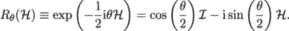
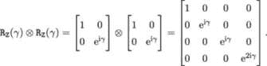

## 11

量子近似优化算法

正如名字所示，量子近似优化算法（QAOA）是一种优化算法。它受到了前几章中讨论的两种优化算法的启发：AQC 和 VQE。QAOA 从 AQC 中借用了通过将相应的目标函数编码到问题哈密顿量中来解决优化问题的概念，然后通过这种方式演化系统，使得最终哈密顿量的基态提供我们所追求的解决方案（以比特串格式表示）。QAOA 从 VQE 中借用了适用于参数化量子电路的变分原理。粗略地说，QAOA 是优化求解器的门模型版本，而这种优化本来可以通过模拟 AQC 方法来解决。我们也可以将 QAOA 看作是 VQE 的特例，其中对哈密顿量的形式有限制。

QAOA 在 Farhi、Goldstone 和 Gutmann 于 2014 年的开创性工作中被提出[96]，并且其在建立量子霸权方面的潜力在 Farhi 和 Harrow 的研究中得到了探讨[99]。QAOA 及其推广算法——量子交替算符假设（同样的首字母缩写！）已在多个金融应用案例中进行了测试。这里我们可以提到 Hodson、Ruck、Ong、Garvin 和 Dulma 的工作[138]，该工作涉及投资组合再平衡实验，以及 Barkoutsos、Nannicini、Robert、Tavernelli 和 Woerner 的研究[26]，他们使用条件风险价值（CVaR）作为 QAOA 的目标函数。该算法具有显著潜力，并有望成为量子计算方法中针对金融应用的标准工具。

### 11.1 时间演化

再次考虑量子力学系统的动态描述，这在第一章（作为量子力学的公设之一）和第二章（在其中介绍了绝热量子计算的原理）中简要讨论过。这些动态由薛定谔方程（1.2.2）支配：

|  |  |
| --- | --- |

给定一些初始条件 ，其中 是时间 *t* 处的量子态，ℋ是时间无关的哈密顿量。其解由 (1.2.2)给出，即

|  |  |
| --- | --- |

其中算符 𝒰(0*,t*)是通过 (1.2.2)从哈密顿量 ℋ得到的：

|  |  |
| --- | --- |

我们采用单位制，其中 ℏ设为 1，因此系统的动态可表示为：

|  |  |
| --- | --- |

如果已知系统的初始状态 ，则可以知道系统在时间 *t* 时的状态，该状态由哈密顿量 ℋ 在时间 *t* 内的作用决定。

然而，解（11.1）假设系统哈密顿量是时间无关的。与此同时，AQC 工作于时间依赖的哈密顿量，形式为（2.2）：

|  |  |
| --- | --- |

对于某些*初始*哈密顿量 ℋ[0] 和某些*最终*或*问题*（编码优化问题）哈密顿量 ℋ[F]，我们如何调和这个不匹配呢？答案是我们可以*近似*[272] 由一系列时间无关的哈密顿量来近似时间依赖的哈密顿量 ℋ(*t*)，它在 [0*,T*] 时间段内变换系统状态：

在相应的较短时间间隔内变换系统状态：

![[t0 = 0,t1], [t1,t2], ..., [tm−1,tm = T ]. ](img/file1125.jpg)

一个好的类比是用分段线性函数近似连续函数（例如，sin(⋅)），如图 11.1 所示。时间间隔 [*t*[i−1]*,t*[i]] 越细化，近似越好。

图 11.1：tsin(t)的分段线性近似。

类似地，我们可以将算符 𝒰(0*,T*) 近似为

|  |  |
| --- | --- |

同样，较大的 *n* 值会给出更好的近似。

量子力学系统在较长时间间隔内的演化可以被建模为一系列时间无关的哈密顿量，通过相应的较短时间间隔变换系统状态。

### 11.2 Suzuki-Trotter 展开式

可以使用 Suzuki-Trotter 展开式[279]获得对 𝒰(0*,T*)的一个特别有用的近似。如果 𝒜[1]*, 𝒜[2]*,…, 𝒜[k] 是不一定对易的算符，则

| ![ ( ) [ ( 𝒜 ) ( 𝒜 ) (𝒜 ) ]m exp 𝒜1 + 𝒜2 + ...+ 𝒜k = lim exp -1- exp -2- ⋅⋅⋅exp --k . m →∞ m m m ](img/file1129.jpg) |  |
| --- | --- |

回想一下，两个算符 𝒜 和 ℬ 如果满足 𝒜ℬ = ℬ𝒜，则称它们对易。在前几章中引入的许多算符是不对易的，例如，不同轴上的旋转是不对易的，最终结果（最终量子态）取决于旋转的顺序。

如第一章所述，厄米算符的期望值是实数，并且对应于物理可观察量（例如，厄米哈密顿量的期望值是物理上可观察的能量）。如果算符对易，我们可以*按任意顺序测量*它们并得到相同的结果。相应物理可观察量的值没有不确定性。

然而，铃木-托特展开不要求算符对易就能保持有效。这对 QAOA 有重要的影响，正如我们接下来将看到的。如果𝒰(0*,T*)的形式为 exp([𝒜 + ℬ]*T*)，则我们可以使用铃木-托特展开得到

![ [ ( ) ( ) ] 𝒜T-- ℬT- m exp([𝒜 + ℬ]T) = mli→m∞ exp m exp m , ](img/file1130.jpg)

即[𝒜 + ℬ]*T*的时间演化可以通过在时间间隔*T∕m*内交替应用𝒜和ℬ来近似。

在第三章中，我们介绍了 AQC 的详细规范，其中哈密顿量ℋ[0]和ℋ[F]具有一般形式。

|  |  |
| --- | --- |

对于一些系数(*a*[i])[i=1,…,n]和(*b*[ij])[i,j=1,…,n]。我们还将感兴趣的读者引导至 [304]，以便了解 QAOA 与 AQC 之间的精确联系，特别是在有限步骤*m*的情况下。

初始哈密顿量ℋ[0]是算符𝒜——称为*混合*哈密顿量——最终哈密顿量ℋ[F]是算符ℬ——称为*相位*哈密顿量。回顾第十章，保利算符*σ*[x]、*σ*[y]和*σ*[z]分别由量子门 X、Y 和 Z 表示，*σ*[x]^i 中的上标 i 表示作用的比特。

初始状态设置为所有可能解的等超位置状态 [122]：

这是𝒜的基态，可以通过对每个比特应用哈达玛门 H，从^(⊗n)轻松构造得到，即：

**备注：** 对于一个单比特系统，𝒜是 X 门，初始状态为

正如我们在第十章中所知，状态是 X 的特征状态，其特征值为 1，即 X = 。

### 11.3 算法规范

现在一切就绪，可以开始制定 QAOA 程序 [122]。

![--------------------------------------------------------------------- -算法---9:-量子--近似-优化-算法----------- 输入: 𝒜 和 ℬ. 1: 通过交替应用运算符 𝒜 1 m 和 ℬ 进行 m 轮操作，创建一个参数化的量子态 |ψ(β, γ)⟩，其中 β := (β1,...,βm )，γ := (γ ,...,γ )，每一轮的持续时间由参数 β 和 γ 分别指定： i i ( ⊗n) |ψ (β, γ)⟩ = e− iβm𝒜e −iγmℬ ⋅⋅⋅e−iβ2𝒜e− iγ2ℬe−iβ1𝒜e −iγ1ℬ H ⊗n |0⟩ 。 2: 对所得量子态进行计算基（z 基）测量，返回一个候选解。重复上述量子态准备和测量过程，从返回的解样本中统计估计成本函数 f 的期望值 ⟨f⟩ = ⟨ψ(β,γ)|ℬ |ψ(β,γ )⟩（如第十章所述）。 3: 然后，可以在经典优化循环中使用更新后的时间参数 β 和 γ 进行上述步骤的重复——这是算法的变分部分——目标是最小化成本函数 ⟨f⟩ 的期望值。结果：算法返回找到的最佳解。 --------------------------------------------------------------------- ](img/file1139.jpg)

交替应用运算符 exp(−i*β*𝒜) 和 exp(−i*γ*ℬ) 以确保我们不会陷入局部最小值是非常重要的。同样重要的是，𝒜 和 ℬ 必须不对易 [272]。事实上，只有应用 exp(−i*γ*ℬ) 时，我们可能会陷入相位哈密顿量的本征态。如果发生这种情况，我们将被困在那里：对其本征向量进一步应用线性运算符可能会改变其长度，但不会改变其方向。对于两个对易算符交替操作的情况也是如此：如果 𝒜 和 ℬ 对易，则可以得到一组同时是 𝒜 和 ℬ 本征态的基态，一旦进入这些本征态中的一个，就会被困在其中。然而，由于 *σ*[x] 和 *σ*[z] 不对易，总是有机会逃离局部最小值。

QAOA 潜力的持续探索始于 Farhi、Goldstone 和 Gutmann 的基础性论文 [96]，该论文展示了 QAOA 在连通的 3-正则图上的 Max-Cut 问题中超越了经典算法。正则图是指每个顶点都有相同数量的邻居。在 3-正则图（也称为 *立方* 图）的情况下，每个顶点与三个其他顶点相连。我们在下一节中考虑 Max-Cut 问题的最一般形式。这一决定性结果促使了经典算法的积极发展，最终由 Barak *et al* [25] 构建了一个渐近性能更好的算法。这反过来又引发了进一步的研究：Hastings 在 [128] 中研究了 QAOA 和最佳经典算法之间的性能比较，而 Bravyi、Kliesch、Koenig 和 Tang [44] 证明了 QAOA 的局部性和对称性严重限制了其性能。为了克服这些局限性，他们提出了一种非局部版本，它在随机 3-正则图上的挫败 Ising 模型中显著优于标准 QAOA。

### 11.4 Max-Cut 问题

Max-Cut 问题是图划分问题的特殊情况之一，该问题在第三章中有所介绍。其目标是将图的顶点分成两组，使得要么最大数量的边在这两组之间被“切割”（如果所有边的权重相同），要么这些边的总权重最大化（如果边的权重不同）。

总权重（或切割边的数量）最大化的问题可以表述为代价函数的最小化，该代价函数是所有单独边的代价之和。与连接顶点 *i* 和 *j* 的边相关的每个单独代价 *c*[ij] 由以下公式给出：

|  |  |
| --- | --- |

其中 *s*[i] 和 *s*[j] 是经典自旋变量，取值为 {−1,*+1}，而 *w*[ij] 是与连接顶点 *i* 和 *j* 的边相关联的权重。两个顶点组是指自旋变量取相同值的组（要么是 −1，要么是 +1）。从 (11.4) 中可以看出，当 *s*[i] 和 *s*[j] 的符号相同，代价 *c*[ij] 为零；然而，当 *s*[i] 和 *s*[j] 的符号相反时，代价 *c*[ij] 等于权重 *w*[ij]。

整个图的代价函数具有以下形式：

|  |  |
| --- | --- |

其中 s := (*s*[1]*,…,s*[n]) 是与 *n* 节点图 *G* 相关联的决策变量集，求和遍历所有通过图边连接的节点对。

Max-Cut 问题在金融中的应用有很多种，例如*客户聚类*或*客户细分*，其中任务可以通过创建一个包含每个客户的节点和每对客户之间的边的图来进行建模。连接任意两位客户的边的权重由客户特征的相对接近程度决定：客户越接近，连接它们的边的权重越小。通过找到最大权重割得到的集群具有这样的性质：同一集群中的客户与其他集群中的客户更加不同。

然而，Max-Cut 在金融领域的代表性应用是投资组合优化。Dees、Stanković、Constantinides 和 Mandi [81] 已经展示了，基于图切分的图论投资组合分割技术能够通过严格的图框架帮助设计出稳健且可处理的资产配置方案，考虑到较小的、计算上可行的、且在经济上有意义的资产集群。Barkoutsos、Nannicini、Robert、Tavernelli 和 Woerner [26] 通过使用条件价值风险（CVaR）技术改进了变分量子优化，该技术在金融风险管理中广泛使用。一个投资组合优化的 QAOA 应用实例，通过在量子模拟器上求解最大独立集问题进行了展示，见[276]。此外，还需要提到 Hodson、Ruck、Ong、Garvin 和 Dulma [138] 进行的使用量子交替算符假设的投资组合再平衡实验。

#### 11.4.1 QAOA 门

对应于成本函数（11.4）的混合哈密顿量 𝒜 和相位哈密顿量 ℬ 表示为

|  |  |
| --- | --- |

其中，旋转变量*s*被对应的泡利算符*σ*替代。因此，我们需要找到这些算符的量子门表示

|  |  |
| --- | --- |

为此，我们需要以下内容（参见引理 1，虽然证明略有不同）：

**定理 9.** *假设*ℐ *表示单位算符，以下对于任何* *单位厄米算符*ℋ *和任意* *𝜃* ∈ℝ*成立：*

|  |  |
| --- | --- |

*证明.* 由于ℋ是单位厄米算符，其本征值为+1 和−1（见第一章）。令 𝒫[±] 为分别投影到本征值±1 的本征空间的投影算符，因此

|  |  |
| --- | --- |

当一个函数（在本例中为*R*[𝜃]）应用到一个矩阵（在本例中为ℋ）时，它应用到矩阵的每一个本征值上：

|  |  |
| --- | --- |

从 (11.4.1) 我们得到：

|  |  |
| --- | --- |

将 (11.4.1) 代入 (11.4.1) 得到：

| *R*𝜃 | = exp(ℐ + ℋ) + exp(ℐ−ℋ) |
| --- | --- |
|  | = ![[ ( ) ( )] exp − 1i𝜃 + exp 1i𝜃 2 2](img/file1153.jpg)ℐ + ![[ ( ) ( )] exp − 1i𝜃 − exp 1i𝜃 2 2](img/file1155.jpg)ℋ |
|  | = cosℐ− isinℋ*.* |

□

我们可以使用 (9) 来写下矩阵形式的算符表达式 (11.4.1)。我们从第一个算符开始：

|  |  |
| --- | --- |

由于算符 RX 的矩阵表示如下：

|  |  |
| --- | --- |

（见例如，第六章 或 定理 9），我们得到：

因此，算符 exp(−i*βσ*[x]^i) 应该在电路中由量子寄存器 *i* 上的门 RX 来表示。

我们现在可以继续处理算符 exp 的门表示，其中 *σ*[z]*σ*[z] 代表两个作用于不同量子比特的 *σ*[z] 算符的张量积：

| ![ ( 1 ) (γ ) ( γ) exp − -iγσzσz = cos -- I ⊗ I − isin -- Z⊗ Z 2 ⌊ ⌋2 ⌊ 2 ⌋ 1 0 0 0 1 0 0 0 ( )&#124;&#124; &#124;&#124; ( ) &#124;&#124; &#124;&#124; = cos γ- &#124;&#124; 0 1 0 0 &#124;&#124;− isin γ- &#124;&#124;0 − 1 0 0&#124;&#124; 2 &#124; 0 0 1 0 &#124; 2 &#124;0 0 − 1 0&#124; ⌈ ⌉ ⌈ ⌉ 0 0 0 1 0 0 0 1 ⌊ (γ) (γ) ⌋ &#124;cos 2 − isin 2 ( ) 0 ( ) 0 0 &#124;&#124; &#124;&#124; 0 cos γ2 + isin γ2 0 0 &#124;&#124; = &#124;&#124; (γ ) (γ) &#124;&#124; ⌈ 0 0 cos 2 + isin 2 ( ) 0 ( )⌉ 0 0 0 cos γ − isin γ ⌊ ⌋ 2 2 e−iγ∕2 0 0 0 &#124;&#124; iγ∕2 &#124;&#124; = &#124;&#124; 0 e 0 0 &#124;&#124; . &#124;⌈ 0 0 eiγ∕2 0 &#124;⌉ −iγ∕2 0 0 0 e ](img/file1162.jpg) |  |
| --- | --- |

我们利用了以下事实：

和

以下引理提供了算符 exp 的量子电路表示：

**引理 8.** *算符* exp *可以通过以下电路表示：*

*证明。* 从 (6.3.3)，我们可以写出：

|  |  |
| --- | --- |

乘子 exp是一个不可观测的全球相位，可以忽略。现在，

|  |  |
| --- | --- |

最后，CRz 门的矩阵表示为

|  |  |
| --- | --- |

和整个电路的矩阵表示如引理所示

|  |  |
| --- | --- |

同样，全球相位可以忽略，我们得到了与 exp相同的矩阵表达式。□

#### 11.4.2 QAOA 电路

正如在章节 8 和 9 中指出的，现有的量子处理器通常具有有限的量子比特连通性，因此我们需要使用特定的嵌入方案，将 Max-Cut 图映射到 QPU 图中。最简单的情况是图节点和连通边的一对一映射。图 11.2 展示了这样的一个图（在 Rigetti 的 Aspen 系统中实现），由八个节点（嵌入在量子比特 1*，…，*8 中）和八条边组成。节点 1、3、5 和 7 各有一个连接，而节点 2、4、6 和 8 各有三个连接。

图 11.2：Max-Cut 优化问题在 Rigetti 的 Aspen 系统中的嵌入。

对应的 QAOA 电路如图 11.3 所示。

图 11.3：Max-Cut 问题的 QAOA 电路。

该电路由四个不同的层组成。第一层是一个 Hadamard 门层，创建了状态和的均等叠加——将基态转化为基态。第二层表示由可调参数*γ*控制的相位哈密顿量的作用。第三层表示由可调参数*β*控制的混合哈密顿量的作用。最后一层由测量算符组成。第二层和第三层可以多次应用，且参数*γ*和*β*的值可以不同。

使用`Qiskit`量子模拟器通过 QAOA 找到的最佳解决方案，针对权重相等的情况（*w*[ij] = 1，对于所有{*i,j*}∈ *G*），如图 11.4 所示。最佳解为比特串 10011001，并由虚线曲线表示，将节点分成两个相等的子集并切割所有图的边。

图 11.4：Max-Cut 问题解决方案的可视化。

在这里，图中的节点（量子比特）{1*,*4*,*5*,*8}属于组“1”，而节点{2*,*3*,*6*,*7}属于组“0”。

在不等权重的情况下，电路布局保持不变，但可调门参数反映了分配给不同边的权重的相对大小。例如，如果分配给节点 1 和节点 2 之间连接的权重从 1 增加到 5，且所有其他权重保持为 1，则对应于节点 1 和节点 2 之间连接的相位哈密顿量项从 exp变化为 exp，并且量子电路的相应部分变更为图 11.5 所示，电路的其余部分保持不变。

图 11.5：权重*w*[12]从 1 增加到 5\。

QAOA 可以成功解决其 QUBO 形式的 NP 难度组合优化问题。

### 总结

在本章中，我们研究了一种受到量子系统绝热演化原理启发的量子优化算法。在这方面，QAOA 可以看作是 AQC 方法的量子门模型对应用，用于解决经典难以处理的优化问题。

我们讨论了铃木-托特展开式，它提供了量子力学系统时间演化的近似，并且是算法的核心。我们展示了 QAOA 在 Max-Cut 问题上的实现（门和电路），该问题在金融领域有广泛应用。

在下一章中，我们将探讨参数化量子电路的动力来源。
