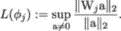
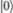
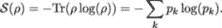
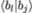
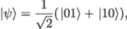
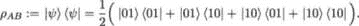

## 12

参数化量子电路的力量

正如我们在前几章中看到的，基于参数化量子电路的量子机器学习（QML）模型种类繁多。其原因之一是它们对噪声的耐受性[222]，这在我们使用 NISQ 硬件时尤为重要。然而，这并不能完全解释 PQC 的流行，或它们为何被认为是经典机器学习模型的强劲竞争者。PQC 必定有一些基本特性，使其优于经典对等模型。在本章中，我们讨论了两种这样的特性：抗过拟合能力和更强的表达能力。

抗过拟合能力是一个直接后果，因为典型的 PQC——没有中途测量的 PQC——可以通过线性单位 ary 算符来表示。线性模型强烈施加正则化，从而防止过拟合。同时，由于输入被映射到更高维的希尔伯特空间，模型仍然保持强大，如果 PQC 作为判别模型（QNN）进行训练，则在该空间中可能更容易执行分类。

表达能力与模型表达变量之间不同关系的能力相关，即其学习复杂数据结构的能力。看来，作为生成模型（QCBM）训练的参数化量子电路（PQC）相比于其对应的经典版本（如 RBM），具有严格更大的表达能力。

### 12.1 强正则化

作为分类器训练的参数化量子电路面临着与经典模型相同的挑战：需要良好地推广到未见过的数据点。经典上，我们有许多监督学习模型和正则化技术可供选择。这些应对过拟合的正则化技术是模型特定的。例如，我们可以尝试限制决策树的深度，或在训练神经网络时在代价函数中施加惩罚项。

考虑一个传统的前馈神经网络，可以说它是量子分类器最直接的经典对等物。在经典和量子两种情况下，信号都通过网络单向传递，量子门层可以与经典激活单元的层进行比较。无论我们是应用*L*[1]（Lasso）或*L*[2]（Ridge）惩罚项，还是使用 dropout 技术，我们都希望网络中存在某种正则化的度量。这是一个有趣的理论问题，同时也是一个重要的实践任务，它让我们能够制定应对过拟合的最佳策略。理想情况下，这种度量应适用于经典和量子神经网络，以提供对比它们各自正则化特性的有意义比较。

通常，相对较小的网络权重与较高程度的正则化相关联，而较高的网络权重则是过拟合的症状。然而，拥有一个正式的数学工具来量化网络的过拟合能力是非常理想的。Lipschitz 常数就是一种可能的、能够捕捉正则化程度的明确量度。

#### 12.1.1 Lipschitz 常数

根据 Gouk [115]，给定两个度量空间 (𝒳*,d*[𝒳]) 和 (*,d*)，如果存在一个常数*k* ≥ 0，使得一个函数*f* : 𝒳 → 被称为 Lipschitz 连续的，则满足：

| ![d (f (x1),f(x2)) ≤ kd𝒳(x1,x2), for all x1,x2 ∈ 𝒳 .  |  |
| --- | --- |

*k*的值被称为 Lipschitz 常数，且该函数被称为*k*-Lipschitz 函数。我们关注的是最小的 Lipschitz 常数，或者至少是其上界。为了获得上界估计，我们应当注意前馈神经网络的一些有用性质。

在前馈神经网络的*j*层中，x[1]和 x[2]是前一层*j* − 1 的*n*维样本输出，*f*(x[1])和*f*(x[2])是第*j*层的*m*维输出。度量*d*[𝒳]和*d*可以是*L*[1]或*L*[2]范数。

由*l*个完全连接层组成的前馈神经网络可以表示为一系列函数组合：

|  |  |
| --- | --- |

其中，每个*ϕ*[j]实现了*x*的第*j*层仿射变换，该变换由*m* × *n*的权重矩阵 W[j]和*m*维的偏置向量 b[j]来参数化：

|  |  |
| --- | --- |

一个*k*[1]-Lipschitz 函数与一个*k*[2]-Lipschitz 函数的组合是一个*k*[1]*k*[2]-Lipschitz 函数 [115]。因此，我们可以分别计算每一层的 Lipschitz 常数，并将它们组合在一起，从而获得整个网络 Lipschitz 常数的上界。

选择*d*[𝒳]和*d*为*L*[2]范数∥⋅∥[2]。在这种情况下，我们从 Lipschitz 连续性的定义中得到以下关系，对于完全连接网络层*j*：

|  |  |
| --- | --- |

引入 a = x[1] − x[2]并假设 x[1] *≠* x[2]，我们得到估计

|  |  |
| --- | --- |

完全连接网络层的最小 Lipschitz 常数，*L*(*ϕ*[j])，等于不等式左侧的上确界 (12.1.1):

|  |  |
| --- | --- |

操作符范数(12.1.1)由权重矩阵 W[j]的最大奇异值给出，它对应于谱范数——矩阵拉伸向量的最大比例。可以通过任何适用的开源包轻松计算，例如来自`scikit-learn`包的 sklearn.decomposition.TruncatedSVD。

在量子神经网络的情况下，任何在*n*个量子比特上操作的参数化量子电路，无论其多么复杂和深度，都可以通过一个 2^n × 2^n 的幺正矩阵表示。由于幺正矩阵的所有奇异值都等于 1，这为比较不同网络的正则化能力提供了一个自然的基准。

#### 12.1.2 正则化示例

我们在第八章分析的澳大利亚信用审批（ACA）数据集[241，242]可以作为一个很好的示例。我们可以比较经典和量子神经网络的性能，同时监控由 Lipschitz 常数衡量的正则化。

经典神经网络是一个具有两层隐藏层的 MLP 分类器。每一层隐藏层的激活单元数量与 ACA 数据集中的特征数量（14）相同，因此我们需要为两个 14 × 14 的方阵计算最大的奇异值。这些特征使用`sklearn.preprocessing.StandardScaler`进行了标准化。我们还使用`sklearn.neural_network.MLPClassifier`来构建具有表格 12.1 中所示超参数集的分类器：

| 超参数 | 值 |
| --- | --- |
| 隐藏层数量： | 2 |
| 每层的激活单元数量： | 14 |
| 激活函数： | tanh |
| 求解器： | adam |
| 初始学习率： | 0.01 |
| 迭代次数： | 5000 |
| 随机状态： | 0 |
| 正则化参数，*α*： | 可变 |

表格 12.1：MLP 分类器超参数。

MLP 分类器的正则化参数*α*是我们的控制变量。它控制网络代价函数中的*L*[2]正则化项：这个参数越大，越多的大网络权重会受到惩罚。所有其他参数都设置为默认值。

量子神经网络如图 8.5 所示。该参数化量子电路仅由 7 个固定的两量子比特门（CZ）和 15 个可调的一量子比特门（R[X]和 R[Y]）组成。表格 12.2 比较了 MLP 和 QNN 分类器在样本内和样本外数据集上的表现（ACA 数据集使用`sklearn.preprocessing.StandardScaler`被分割成 50:50 的训练集和测试集）。

我们观察到 QNN 提供了强大的正则化，且在样本内和样本外数据集上的表现如预期一致，这与由幺正矩阵表示的网络相符。

| 分类器 | 平均*F*[1]得分 | 平均*F*[1]得分 | Lipschitz 常数 |
| --- | --- | --- | --- |
|  | （样本内） | （样本外） | （上限） |
| MLP, *α* = 0*.*001 | 1.00 | 0.78 | 36.2 |
| MLP, *α* = 0*.*01 | 1.00 | 0.79 | 33.5 |
| MLP, *α* = 0*.*1 | 1.00 | 0.80 | 18.6 |
| MLP, *α* = 1 | 0.99 | 0.83 | 7.4 |
| MLP, *α* = 10 | 0.90 | 0.86 | 1.3 |
| MLP, *α* = 40 | 0.85 | 0.86 | 0.5 |
| MLP, *α* = 50 | 0.35 | 0.37 | 1e-05 |
| QNN | 0.86 | 0.85 | 1.0 |

表 12.2：MLP 和 QNN 分类器在 ACA 数据集上训练的 F[1]得分和 Lipschitz 常数。

此外，我们观察到，等效的正则化程度只能通过 MLP 在正则化参数*α*取极大值时才能实现。将*α*进一步增大将完全破坏网络的学习能力。对于所选的 MLP 配置，*α*的临界值在 40 到 50 之间。

参数化量子电路可以表示为（高维）保持范数的单位 ary 矩阵。这确保了量子神经网络的强正则化特性。

现在我们可以进入参数化量子电路的下一个特性：它们的表达能力。我们可以将 PQC 的表达能力定义为电路生成纯量子态的能力，这些量子态能够很好地代表希尔伯特空间[266]。换句话说，从 QML 的角度来看，PQC 的表达能力是它学习（“表达”）复杂数据结构的能力。在接下来的章节中，我们将尝试量化不同类型 PQC 固有的表达能力。

### 12.2 表达能力

我们在前面的章节中看到，PQC 可以应用于解决优化问题（QAOA 和 VQE），以及各种机器学习任务，包括判别性（QNN 分类器）和生成性（QCBM 市场生成器）用例。一般来说，我们用于量子机器学习任务的 PQC 可以分为两类[88]：张量网络 PQC（类似于图 8.4 中的 QNN 电路）和多层 PQC（类似于图 9.1 中的 QCBM 电路）。它们的表达能力如何，我们又该如何对它们进行排名呢？在尝试回答这个问题之前，让我们先来看一个简单的示例：在单一量子寄存器上指定的量子电路。

图 12.1：具有不同表达能力的 PQC。

图 12.1 展示了四个具有显著不同表达能力的单量子比特电路，其中*U*[−*π,π*]表示闭区间[−*π,π*]上的均匀分布。让我们逐个分析它们。

PQC A 以量子比特状态初始化开始，如 – Bloch 球上的北极（图 7.2）。唯一的门是 Hadamard 门 H，它将变换为 ( + )*∕*。因此，状态只能是 Bloch 球上的一个单点。

PQC B 也从量子比特状态初始化为开始，应用 Hadamard 门将初始状态转化为 ( + )*∕*，然后围绕*z*-轴应用旋转 R[Z]，角度*𝜃*[z]从区间[−*π,π*]上的均匀分布中抽取。最终状态可以是赤道上的任何一点，且所有这些点的概率相等。

PQC C 通过旋转 R[X]向 PQC B 添加一个旋转角度*𝜃*[x]，该角度从区间[−*π,π*]上的均匀分布中抽取。通过围绕两个正交轴的两次旋转，我们可以到达 Bloch 球上的任何点。然而，若角度*𝜃*[z]和*𝜃*[x]从区间[−*π,π*]上的均匀分布中抽取，则在状态下，Bloch 球上的点并不呈均匀分布。我们观察到，在点 ( + )*∕* 和 (−)*∕* 附近，密度最高，而在 90^∘和 270^∘经线沿线，密度最低。

最后，PQC D 在*y*轴上通过一个旋转 R[Y]添加了一个角度*𝜃*[y]，该角度从区间[−*π,π*]的均匀分布中抽取。这个旋转使得之前聚集的点在 Bloch 球上更加均匀地分布，从而使 Bloch 球上的所有点都能被平等地访问。

因此，关于我们探索希尔伯特空间的能力，我们可以将上述 PQC 的表达能力层次分为以下几类：

现在我们可以回到前几章开发的 PQC。

#### 12.2.1 多层 PQC

多层量子电路（MPQC）由多个量子电路块组成，每个块中的量子门排列是相同的[28，189]。图 12.2 展示了 MPQC 的示意图。

图 12.2：多层 PQC 的示意图。

以下数学形式可以用来描述 MPQC。输入的*n*量子比特量子态，所有量子比特初始化为的计算基态，为^(⊗n)，总共的电路块数为*l*，第*i*个块表示为 U(𝜃^i)，其中参数的数量与量子比特数成正比，*n*与生成数据的维度呈对数关系（这反映了我们关于数据编码方案的假设）。因此，电路生成的输出态为

|  |  |
| --- | --- |

#### 12.2.2 张量网络 PQC

张量网络 PQC（TPQC）将每个块视为局部张量。这些块的排列遵循特定的网络结构，如矩阵积态或树形张量网络[144]。图 12.3 展示了 TPQC 的示意图。

图 12.3：张量网络 PQC 的示意图。

从数学上讲，第*i*块 U(𝜃^i)由*M*[i]个局部张量块组成，其中*M*[i] ∝ *n∕*2^i，表示为 U(𝜃^i) = ⊗ [j=1]^(M[i])U(𝜃[j]^i)。请注意，这些张量块中的许多可能是恒等算符。因此，生成的状态呈现以下形式：

|  |  |
| --- | --- |

#### 12.2.3 表达能力的度量

主要问题是回答 MPQC 和 TPQC 与其经典对应物（如经典神经网络）相比，是否具有更大的表达能力。模型的表达能力可以通过多种方式定义，例如作为模型表达不同变量之间关系的能力[22]。深度神经网络是能够学习复杂数据结构的强大模型的一个很好的例子[94]。因此，模型的能力可以通过其复杂性量化，而*Vapnik-Chervonenkis* *维度*是衡量复杂性的选择度量[293]。目标是提供一个关于模型如何泛化到未见数据的估计。

另一种流行的方法是*费舍尔信息*，它描述了模型参数空间的几何结构[247]。可以说，基于费舍尔信息的*有效维度*，而非 Vapnik-Chervonenkis 维度，是研究量子和经典神经网络能力的更好度量[1]。

然而，最自然的表达能力度量之一是*纠缠*熵，它使我们能够为量子和经典机器学习模型建立一个明确的排名。在本章中，我们将展示基于纠缠熵在[88]中为 TPQC 和 MPQC 获得的表达能力估计。

让我们回顾一下在统计力学中引入的熵的定义（吉布斯熵*S*）和在信息论中引入的熵的定义（香农熵 H），详见第六章：

|  |  |
| --- | --- |

在这里，*p*[i]是吉布斯熵情况下从平衡集中取出微观状态*i*的概率，而在香农熵的情况下，它是从消息空间中选择消息*i*的概率。

这些熵的定义可以扩展到量子情况。在第一章中，我们介绍了密度矩阵作为描述纯态和混合量子态的通用工具：

其中 ()[i=1,…,N] 是给定量子系统的基向量。*冯·诺依曼熵* 𝒮 定义为

|  |  |
| --- | --- |

由于密度矩阵是厄米的，它是*可对角化*的，因此存在一个基 ()[k=1,…,N]，使得

算符 *ρ*log(*ρ*) 的特征值为 (*p*[k] log(*p*[k]))[k=1,…,N]，因此我们可以得到冯·诺依曼熵的以下表达式：

|  |  |
| --- | --- |

从 (12.2.3) 和 (12.2.3) 可以看出，对于量子态的正交混合，量子熵和经典熵是相同的。

如果系统有两个组成部分，*A* 和 *B*，我们可以将*约化* *密度矩阵* 定义为对不感兴趣的希尔伯特空间子空间上的密度矩阵的*部分迹*。令 ()[i=1,...,N] 为系统 *A* 的希尔伯特空间 ℍ[A] 的标准正交基，且 ()[j=1,...,M] 为系统 *B* 的希尔伯特空间 ℍ[B] 的标准正交基。则双体系统 *AB* 在张量积希尔伯特空间 ℍ[A] ⊗ℍ[B] 上的密度矩阵 *ρ*[AB] 可表示为

|  |  |
| --- | --- |

对某些系数 *c*[ijkl]，部分迹为

|  |  |
| --- | --- |

这是一种在 ℍ[A] 上的约化密度矩阵 *ρ*[A]，并且

|  |  |
| --- | --- |

这是一种在 ℍ[B] 上的约化密度矩阵 *ρ*[B]。请注意，Tr(⟨*a*[k]|) =  和 Tr(⟨*b*[l]|) = 。

**示例：** 考虑处于状态中的两比特系统

这是四种最大纠缠贝尔态之一（见第 6.5.2 节）。我们假设第一个量子比特是系统 *A*，第二个量子比特是系统 *B*。该状态对应以下密度矩阵：

现在让我们对这个状态施加部分迹 TrB：

|  |  |
| --- | --- |

在(12.2.3)中的约化密度矩阵*ρ*[A]与(1.3.3)中的密度矩阵*ρ*相同，后者描述了一个统计集合，其中包括状态和（混合态），即，物理系统以相等概率准备处于状态或状态。

双体系统*AB*的*纠缠熵*定义为

|  |  |
| --- | --- |

并且可以作为衡量模型表现力的度量，方法如下。首先，注意到 TPQC、MPQC 和经典神经网络与*张量网络*（如矩阵积态 MPS）有着密切的联系[88]。关键问题是，给定的量子系统是否可以通过 MPS 高效表示。

满足*面积定律*（其纠缠熵与边界面积成比例增长）的量子系统具有高效的矩阵积态（MPS）表示。同时，满足*体积定律*（其纠缠熵与体积成比例增长）的量子系统不能通过 MPS 有效表示[88]。

#### 12.2.4 PQC 的表现力

在第五章中，我们介绍了受限玻尔兹曼机（RBM）——一种操作在随机二进制激活单元上的神经网络，是参数化量子电路的自然经典对应物。我们考虑了两种类型的 RBM：

+   一个浅层的两层网络，其中可见层的激活单元与隐藏层的激活单元相连，但同一层内的激活单元之间没有连接；

+   更深层次的多层堆叠式受限玻尔兹曼机（RBM）网络，其中第*k*层 RBM 的隐藏层作为第(*k* + 1)层 RBM 的可见层。这种堆叠式 RBM（按顺序训练）称为深度玻尔兹曼机（DBM）。

还可以对 RBM 层之间的连接施加进一步的限制。在*短程*RBM 中，我们限制隐藏层激活单元的连接性，使它们只能连接到可见层中相互接近的少数激活单元（局部连接）[84]。在*长程*RBM 中，我们允许隐藏层激活单元与可见层激活单元之间的连接不一定是局部的。

邓、李和萨尔马已经确定了所有短程 RBM 态的纠缠熵满足任意维度和二分几何的面积定律[85]。对于长程 RBM 态，这些态可能表现出体积定律的纠缠。因此，长程 RBM 能够表示具有大纠缠的量子态。

可能并不令人惊讶的是，DBM 的表达能力甚至比单一的 RBM 更强。然而，利用纠缠熵作为表达能力的度量，Du、Hsieh、Liu 和 Tao 在[88]中证明了 MPQC 的表达能力严格大于 DBM。主要结果可以表述为以下定理：

**定理 10**（表达能力定理）**。** *MPQC 和* *TPQC 的表达能力，使用* 𝒪(*poly*(*n*)) *个单量子比特门和* CNOT *门，以及具有* 𝒪(*poly*(*n*)) *可训练参数的经典神经网络，其中* *n* *表示量子比特或可见单元的数量，可以排序为*

|  |  |
| --- | --- |

定理 10 为旨在确立基于 PQC 的 QML 模型量子优势的实验工作提供了坚实的理论基础。与经典模型相比，PQC 更强的表达能力促使了近年来许多此类模型的发展。例如，针对 NISQ 设备并利用量子纠缠更强表达能力的混合量子-经典方法，已在[59]中提出。通过数值模拟表明，量子长短期记忆（QLSTM）模型比具有相似网络参数的经典 LSTM 学习得更快。此外，QLSTM 的收敛性比其经典对手更加稳定。在[58]中提出了量子卷积神经网络（QCNN），由于其更强的表达能力，达到了比经典 CNN 更高的测试精度。其表达能力的来源是用基于变分量子电路的量子卷积核替代了经典的卷积滤波器。

多层参数化量子电路，如 QCBM，在只允许多项式数量的参数时，比经典模型如 RBM 具有更强的表达能力。对于表现出量子优势的系统，经典模型无法学习重现统计数据，除非它使用指数级的资源[29]。

### 摘要

在本章中，我们学习了参数化量子电路的力量来自何处。我们从观察到量子神经网络在其架构中具有强大的正则化开始。这是因为任何 PQC，无论多么宽广和深度，都是一个单位线性算符。

接下来，我们考虑了参数化量子电路的表达能力，并建立了表达能力层级的概念。主要结果（定理 10）支持了实验结果，这些实验表明在与 NISQ 设备主要特性兼容的各种 QML 模型中存在量子优势的元素。

在下一章中，我们将深入探讨新量子算法这一较少研究的领域，这是一个非常活跃的研究方向。

### 加入我们书籍的 Discord 空间

加入我们的 Discord 社区，与志同道合的人一起学习，和超过 2000 名成员共同探讨：[`packt.link/quantum`](https://packt.link/quantum)

