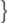
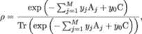
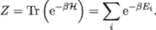
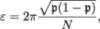
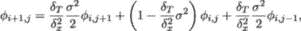

## 13

展望未来

第一代量子算法出现在 1990 年代，那时量子计算机仅仅是一个概念。一方面，缺乏实际的量子硬件是一个巨大的劣势，因为这使得直接实验变得不可能；另一方面，这也激发了理论研究，而理论研究不受早期量子计算机的不完美限制和约束。研究人员专注于设计可以实现二次甚至指数级加速的算法，假设有一天将会出现强大的、无误差的量子计算机。这正是 Shor 的素因数分解算法[265]和 Grover 的搜索算法[117]被发现的时期。顺便提一下，在本书即将发布之际，Peter Shor 被授予 2022 年基础物理学突破奖的四位获奖者之一（与 C. H. Bennett、G. Brassard 和 D. Deutsch 一起），以表彰他们在量子信息领域的奠基性工作。许多此类算法依赖于基本的构建模块，如量子相位估计和量子傅里叶变换[278]。这些算法在展示通用门模型量子计算机的能力方面发挥了重要作用——如果它们当时存在的话！

25 年后，我们面临了一个不同的问题：开发实用的量子计算算法和技术，使我们能够从 NISQ 计算机中提取价值。虽然量子计算硬件以惊人的速度在进步，但它仍然远未达到能够破解 RSA 加密的程度。现有的量子计算机能够做什么？与经典计算机相比，它们的相对优势在哪里？在本章中，我们将探讨几种新的、适用于 NISQ 的算法，这些算法让我们更接近实现量子优势的目标。

### 13.1 量子核方法

我们首先介绍流行的经典核方法，然后描述基于参数化量子电路的量子版本。

#### 13.1.1 经典核方法

*核方法*是强大经典监督学习算法的关键元素：支持向量机（SVM）。与目标是最小化分类误差的前馈神经网络分类器不同，SVM 的目标是最大化边界，即定义为分隔超平面（分隔属于不同类别的样本的决策边界）与距离该超平面最近的训练样本之间的距离[243]。距离分隔超平面最近的样本被称为*支持向量*，因此该算法得名。

边际最大化降低了泛化误差，并有助于抵抗过拟合。这是一个非常重要的性质，但对于非线性可分的数据，寻找分隔超平面并非易事。幸运的是，核方法允许我们通过创建原始特征的非线性组合，并将其投影到一个高维空间，从而克服这个困难，在该空间中数据样本变得线性可分。

而具有线性可分数据的支持向量机(SVM)操作在训练样本的内积上，其广义版本对于非线性可分数据则操作在核函数上

|  |  |
| --- | --- |

其中*ϕ* : ℝ^N → ℝ^M，且*M* ≫ *N*，是将*N*维特征 x := (*x*[1]*,…,x*[N])投影到*M*维特征空间的特征映射。直接计算内积(13.1.1)将计算代价高昂，但核函数计算代价较低——这就是所谓的*核技巧*。核函数可以看作是对一对样本操作的相似性函数。例如，径向基函数

|  |  |
| --- | --- |

将样本 x^i 和 x^j 之间的距离（定义在[0*,*∞)^N 上）转化为相似性分数（定义在区间[0*,*1]上）。

核函数的选择可以使分类任务变得更加容易。然而，一些核函数可能计算起来比较困难。这时，量子计算可能通过提供高效的量子电路来计算它们，发挥重要作用。

#### 13.1.2 量子核方法

王、杜、罗和塔 [298]展示了经典核和量子核之间的密切对应关系。特征映射*ϕ*(⋅)与通过参数化量子电路𝒰(⋅)准备量子态相吻合，后者将输入数据样本映射到由*n*个量子比特描述的高维希尔伯特空间中：

|  |  |
| --- | --- |

然后，核函数与对准备好的量子态进行测量相吻合：

|  |  |
| --- | --- |

并且与替代方法相比，能够支持更具表现力的模型

|  |  |
| --- | --- |

黄*等* [143]认为，尽管核函数 (13.1.2) 似乎更自然，但量子核 (13.1.2) 可以学习任意深度的量子神经网络（深度 PQC）。这是一个强有力的结果，特别是结合了参数化量子电路（第十二章，公式 (10)）的表现力层级。

Havlíček *等人* [129]描述了量子计算机如何用于估计核函数。核函数项是不同特征向量之间的*保真度*（类似于经典核方法中的相似度得分）。Burnham、Cleve、Watrous 和 R. de Wolf [50]，以及 Cincio、Subaşi、Sornborger 和 Coles [66]研究了各种保真度估计方法，如量子指纹识别和机器学习方法（这两者都依赖于应用 CSWAP 门实现交换测试）。然而，通过利用特征空间中的状态并非任意的这一事实，量子态之间的重叠可以通过转移概率进行估计：

|  |  |
| --- | --- |

其中，为了简便，我们使用了符号 := ^(⊗n)。第一步是将两个连续的特征映射电路（表示操作符𝒰(x^i)和𝒰^†(x^j)）应用于初始态。第二步是在计算基下对最终态进行*K*次测量，并计数所有零字符串的数量*κ*。所有零字符串的频率*κ∕K*是转移概率（即“相似度得分”）的估计值。

剩下的监督学习协议是经典的，允许量子计算的核函数自然嵌入到整体框架中：该算法本质上仍然是经典的，只有经典计算中困难的任务被外包给量子芯片。

#### 13.1.3 特征映射的量子电路

图 13.1 展示了特征映射电路的示意图。在这个示例中，我们处理的是一个 8 维数据集，其特征通过旋转角度进行编码，因此样本 x^i := (*x*[1]^i*,…,x*[8]^i)可以直接映射到可调电路参数向量𝜃^i := (*𝜃*[1]^i*,…,𝜃*[8]^i)。电路的第一部分实现了操作符𝒰(x^i)，由于固定的两量子比特 CZ 门层，它创建了一个纠缠态，而电路的第二部分实现了𝒰^†(x^j)。这里我们使用以下事实：

很容易看出，如果样本 x^i 和 x^j 相同（即𝜃^i = 𝜃^j），则𝒰(x^i)𝒰^†(x^j) = ℐ，并且所有*K*次测量都将返回所有零字符串。

图 13.1：示意量子核电路。

剩下的协议是经典的——量子计算机用于辅助分类器计算核函数，如果仅有经典计算资源，则无法实现该计算。

现在，让我们将量子内核方法应用于澳大利亚信用审批数据集（在第八章中介绍），以估计来自同一类别的样本和来自两个不同类别的样本之间的相似度。ACA 数据集由 690 个样本组成，其中 383 个样本被标记为类别 0，307 个样本被标记为类别 1，因此数据集在类别上是合理平衡的。每个样本由 14 个特征（连续、整数、二进制）组成。在第八章中，我们构建了一个 QNN 分类器，并在 ACA 数据集上测试了其性能，采用了第 7.2 节中解释的*角度编码*方案。我们希望构建一个与角度编码方案一致的特征映射，并且不需要构建一个过深的 PQC。事实上，我们希望使用 PQC 构建一个尽可能接近图 13.1 所示的特征映射。该方案可以嵌入到本书之前讨论的所有现有 NISQ 系统中。例如，我们可以使用图 13.2 所示的 IBM 墨尔本系统。

图 13.2：量子内核电路嵌入到 IBM 的墨尔本系统中。

我们知道，如果采用角度编码方案，7 个量子寄存器（如图 13.2 中以粗线连接的阴影量子比特所示）可以编码一个 14 特征的数据样本。对应的电路如图 13.3 所示。物理量子比特之间的线性顺序连接使得选择 2 量子比特门变得非常直接（实际上，与图 13.1 中的相似）。

图 13.3：ACA 数据集的量子内核电路。

在图 13.3 所示的电路中，角度𝜃^i 和𝜃^j 分别编码数据样本 x^i 和 x^j，这些样本可以来自同一类别，也可以来自两个不同类别。运行电路*K*次并计算所有全零比特串的数量*κ*（测量后）可以给出样本 x^i 和 x^j 之间的相似度度量（估计为比率*κ∕K*）。图 13.4 显示了通过在 Qiskit 模拟器上运行量子电路*K* = 10,000 次得到的量子内核（13.1.2）的转移概率（相似度分数）均值。均值是通过计算来自相应类别的所有可能样本对的结果得到的。

图 13.4：ACA 数据集的量子内核（13.1.2）的均值。

正如预期，从同一类别中抽取的样本相比于来自两个不同类别的样本，量子核所给出的相似度得分通常显著更大。

可以在量子计算机上高效计算的量子核具有提升混合量子-经典机器学习模型性能的潜力。

### 13.2 量子生成对抗网络

生成对抗网络（GANs）是强大的统计技术，用于生成（按需）足够接近给定样本的数据（在某种意义上）。它们在[114]中首次提出，并最初在图像数据上进行测试。从那时起，它们在金融领域得到了广泛应用，包括时间序列生成[301, 302]，交易模型调优[176]，投资组合管理[196]，合成数据生成[17]以及各种类型的欺诈检测[261]。其核心思想是通过生成器和判别器互相竞争，从而提升自身能力：生成器通过变得更擅长从随机噪声中生成接近真实数据的样本（即，好的样本）而提升，而判别器则通过能够识别真实数据和“假数据”（即生成的数据）来提升。生成器和判别器通常都是构建为神经网络，并具有待优化的超参数。数学上，给定一个生成器(⋅*,*𝜃^()和一个判别器(⋅*,*𝜃^()，其中𝜃^(和𝜃^(表示超参数，问题可以表述为如下：

| ![ { } min max 𝔼x∼ℙdata [log ((x;𝜃 )]+ 𝔼z∼ℙ ) [log (1− ((z;𝜃);𝜃 ))] , 𝜃 𝜃 (⋅,𝜃 ](img/file1258.jpg) |  |
| --- | --- |

其中 x ∼ℙ[data] 表示从原始数据集中生成的某个样本 x，而 z ∼ℙ 表示从生成器生成的样本。我们建议有兴趣的读者参考[[95]，了解生成对抗网络在金融中的优点和陷阱。鉴于其流行以及量子神经网络的存在（第八章），因此探索生成对抗网络是否可以扩展到量子世界，以及这样做是否存在任何优势，显得十分自然。

量子生成对抗网络（QGAN）的主要原则——由 Lloyd 和 Weedbrook[192]以及 Dallaire-Demers 和 Killoran[77]同时提出——保持不变，依赖于两个参与者，生成器和判别器，相互竞争。在[192]中，作者将经典问题转化为密度矩阵的语言（在 1.3.1 节中描述）：给定一些由密度矩阵*σ*（不一定描述纯态）表示的数据和生成器生成的输出密度矩阵*ρ*，判别器的任务是从假数据中识别真实数据。更具体地，它通过正算符值测量（见 1.2.3 节）产生结果 T（代表真实）或（代表假）。给定真实数据，测量得出正向答案的概率是

给定生成数据的情况下，它得出正向答案的概率是

对抗游戏，与经典情况类似，因此可表示为

|  |  |
| --- | --- |

请注意，正测量算符集 T（其 1-范数小于 1）和密度矩阵集*ρ*是凸集，这确保了优化问题(13.2)至少存在一个最优解。然而，这两个集合是无限维的，使得优化问题难以求解。通过类似的论证，Dallaire-Demers 和 Killoran[77]进一步提出将生成器和判别器建模为由描述旋转角度等参数的参数化变分量子电路。一个自然的问题是是否存在某种最优的变分量子电路架构。尽管目前没有明确答案——据我们所知——近期的发展已改善了我们对这种电路的理解和其能力。

从*n*个量子比特开始，一个量子生成器： ℂ^(2^n) →ℂ^(2^n) 采取多层量子神经网络的形式，例如如下所示：

|  |  |
| --- | --- |

对于每一层*l* ∈{1*,…,L*}，单元门 Ul 同时作用于所有*n*个量子比特，并依赖于一组参数（或超参数）𝜃[l]。为了避免（过于昂贵的）高阶量子比特门，纠缠采用成对控制单元门的形式，因此我们假设，对于每个*l* ∈{1*,…,L*}，U[l]仅由一比特或二比特门组成。一种可能的（虽然不是唯一的）参数化 U[l]的方法是基于以下原则：

+   任何一个比特单元门都可以分解成三个旋转门 R[Z]、R[X]和 R[Y]的序列，如在[223，定理 4.1]中所证明；

+   按照[256]，*非原始*两比特门（即将乘积态映射到非乘积态的两比特门），结合单比特门，确保量子通用性[47]。特别地，分解式 RXQ(*ϕ*)是通用的[47，补充定理 9.2]，其中*𝜃, ϕ* ∈ 0*,*2*π*)，在此

     |  |
| --- | --- |

其中 Q^i 表示比特*i*是控制比特，门作用于比特(*i* + 1)。注意，1 + (*i *mod* n*) = 1 + *i* 当 *i* ∈{1*,…,n*− 1} 时，并且当 *i* = *n* 时等于 1。因此，每层的超参数总数为 5*n*，总共为 5*nL*。判别器本身可能是量子性质的，也可能不是（遵循类似生成器的构造），具体取决于实际问题（例如，它在[18]中有，但在[268]中没有），并且问题的性质 – 尤其是可能需要将数据从量子编码/解码为经典（成本较高）可能会影响这一选择。

有限维优化(13.2)通常通过某些梯度下降方法进行；梯度本身是通过在[77]中的独立量子电路计算的，或者更高效地 – 使用在 8.2.3 节中解释的参数偏移规则（参见[257]），该规则允许通过原始电路精确计算梯度。

QGANs 是一个非常新的活跃研究领域，预计 NISQ 基础的算法将在此领域特别有成果。它们与 QNNs 的整体发展密切相关，当前该领域的进展涉及以下内容，我们鼓励读者在未来几年密切关注：

+   QGAN 用于生成概率分布：我们建议感兴趣的读者参考[18，268，314]，主要是在金融领域的单变量分布，以及[5，312]，涉及多变量分布；

+   量子卷积神经网络：在[160]中，作者展示了如何处理（量子）深度神经网络中的非线性问题；[69，300]解释了如何减少电路中所需的门数量（即旋转参数的数量），而[142]强调了两比特交互的重要性和充分性，更适用于 NISQ 设备；

+   量子 Wasserstein GAN：在[55]中——模仿经典 Wasserstein GAN 的最新结果[13，121]——作者引入了量子数据之间的 Wasserstein 半度量，用于减少所需量子门的数量。

### 13.3 贝叶斯量子电路

参数化量子电路可以用来构造具有期望特性的量子态，并以受控的方式对其进行修改。然后，测量最终的量子态相当于从概率分布中绘制一个比特串样本。这是我们在第九章中考虑的量子电路 Born 机（QCBM）背后的关键概念。贝叶斯量子电路（BQC）是另一种量子生成式机器学习模型，扩展了 QCBM 的功能[88]。与仅在*数据*量子比特上操作并编码期望概率分布的 QCBM 不同，BQC 具有额外的*辅助*量子比特，编码*先验*分布。BQC 电路如图 13.5 所示。

图 13.5：BQC 的示意图。

电路中的前*m*个量子寄存器是辅助量子比特。应用*K*操作符块 U(*γ*^i)[i=1,…,K]到初始态^(⊗m)之后，我们构造出态，

|  |  |
| --- | --- |

并通过测量该态生成来自先验分布的样本。

接下来的*n*个量子寄存器是数据量子比特。对它们进行的量子门操作依赖于辅助量子比特的状态。条件性地将*l* × *m*个操作符块应用到*n*个数据量子比特后，我们得到一个条件于的态。测量该态将生成来自条件分布的样本，这正是实现贝叶斯模型所需的。贝叶斯建模允许我们使用贝叶斯定理[57]根据一些观测数据*D*推断模型参数𝜃的*后验*分布。

|  |  |
| --- | --- |

其中ℙ(*D*|𝜃)是似然，ℙ(*D*)是边际似然或证据，ℙ(𝜃)是先验。我们通过反复测量由(13.3)给出的状态得到ℙ(𝜃)，通过反复测量在应用条件算符 U(*β*)后的最终状态得到ℙ(*D*|𝜃)，并通过反复测量在无条件应用算符 U(*β*)后的最终状态得到ℙ(*D*)。

对于 BQC，先验由参数γ := (*γ*¹*,…,γ*^K)进行参数化。后验可以用来通过*后验* *预测* [105]来建模新的未见数据，*D*^∗：

|  |  |
| --- | --- |

这个积分对所有可能模型的预测进行加权平均，权重由后验概率给出，这叫做*贝叶斯模型平均*。

BQC 可以通过最小化第九章中描述的最大均值差异成本函数进行训练。在表现力方面，Du、Hsieh、Liu 和 Tao [88]展示了与 MPQC 相比，从计算复杂度角度来看，BQC 具有更强的表现力。

贝叶斯网络可以用于金融资产价格预测 [21，56]，预测限价单市场的动态 [199]，预测企业破产 [52]，以及建模、分析和理解交易行为 [282]。

贝叶斯量子电路模型通过增加编码先验分布的辅助量子寄存器，扩展了作为生成模型（QCBM）训练的参数化量子电路的能力。因此，它比 MPQC 具有更强的表现力。

### 13.4 量子半正定规划

在半正定规划（SDP）中，优化一个线性函数，受限于对称矩阵的仿射组合是正半定的这一约束。这样的约束是非线性和非光滑的，但却是凸的，因此半正定规划是凸优化问题。半正定规划统一了几种标准问题（例如线性规划和二次规划），并在工程和组合优化中找到许多应用 [292]。类似于寻找经典核方法的量子对应物，我们可以指定 SDP 的量子版本。

#### 13.4.1 经典半正定规划

SDP 通常可以定义为以下优化问题：

| ![ max Tr(CX ), subject to Tr(AjX ) ≤ bj, for all j ∈ [[M ]], X∈ℳ+N(ℝ) ](img/file1273.jpg) |  |
| --- | --- |

其中[[*M*]] := {1*,…,M*}，ℳ[n]^+(ℝ)表示大小为*N* × *N*的正半定矩阵集合。这里，厄米矩阵(A[j])[j=1,…,M]和 C 位于ℳN 中，(*b*[j])[j∈[[M]]] ∈ℝ^M 是问题的输入。

SDP 可应用于复杂的 NP 难优化问题 [112]，例如各种投资组合优化问题。例如，通常认为资产收益的分布是已知的，这是一种不现实的假设。所需的信息可能不完整，估计也可能受到估计误差和建模误差的影响（例如，假设分布是平稳的）。

#### 13.4.2 最大风险分析

假设资产收益协方差矩阵 Σ 的估计存在不确定性，经典的最大风险分析问题可以表述为

| ![ ⊤ L U Σ∈mℳa+x(ℝ)w Σw, subject to Σij ≤ Σij ≤ Σ ij, for all i,j ∈ [[N ]], N ](img/file1274.jpg) |  |
| --- | --- |

其中，w 是固定的权重向量，Σ 是问题变量。对于每个 *i,j* ∈ [[*N*]]，矩阵 Σ[ij]^L 和 Σ[ij]^U 是 ℳ[N]^+(ℝ) 中的固定约束条件。任务是确定已知资产配置下，给定资产收益协方差矩阵估计的不确定性，最大可能的投资组合风险。该问题可以表示为以下的 SDP [229]：

| ![ max Tr(w ⊤Σw ) , Σ∈ℳ+N(ℝ) ({ L subject to Tr(− EijΣ) ≤ − Σ ij, for all (i,j) ∈ [[N ]]× [[N ]], ( Tr(EijΣ ) ≤ ΣU , ij ](img/file1275.jpg) |  |
| --- | --- |

其中我们表示 (*E*[ij])[αβ] := *δ*[iα]*δ*[jβ]。最大风险分析问题可以用相同的形式表达，只是使用不同的风险度量，如 VaR 或预期短缺。

#### 13.4.3 稳健投资组合构建

稳健投资组合构建问题旨在找到一种资产配置方法，使得建议的资产配置权重在估计误差最小化方面表现最优。该问题在 [194] 中通过蒙特卡罗模拟方法得以解决，从而确定了对于给定投资组合中输入协方差矩阵的小变化，最稳健的资产配置方法。

在最一般的情况下，它可以被表述为最小-最大问题

|  |  |
| --- | --- |

其中

| 𝒮 | := Σ ∈ℳ[N]^+(ℝ) : Σ [ij]^L ≤ Σ [ij] ≤ Σ[ij]^U*,* for all *i,j* ∈ [[*N*]]*,* |
| --- | --- |
| 𝒲 | := *,* |

其中 w 是权重向量，*μ* 是预期资产收益向量，Σ 是资产收益的协方差矩阵。

以下定理（最早由冯·诺依曼于 1928 年证明 [297]) 确立了最小最大和最大最小优化问题的等价性 [288]：

**定理 11**（最小最大定理）**.** *设* 𝒳 ⊂ℝ^n *且* 𝒴 ⊂ℝ^m *是紧致的* *凸集。如果函数* *f* : 𝒳 ×𝒴 →ℝ *对于固定的**y* 以**x* 为变量是连续的且凹的，并且对于固定的**x*，以**y* 为变量是连续的且凸的，则*

因此，一般来说，最小-最大鲁棒投资组合构建问题（在 *w* 中是凸的，在 *Σ* 中是凹的）等价于最大-最小问题，并且可以表达为上述约束下的一个 SDP 形式，涵盖所有变量[229]。

#### 13.4.4 量子半定规划

量子半定规划（QSDP）背后的关键思想是基于这样一个观察：一个归一化的正半定矩阵可以自然地表示为量子态。在量子计算机上，量子态的操作有时比经典矩阵操作在计算上更为廉价。这一思想促使了针对 SDPs 的量子算法的发展[42]。

考虑 SDP (13.4.1) 并设 *𝜀 >* 0 为一个小值。如果对于所有输入 *g* ∈ ℝ 和 *ζ* ∈ (0, 1)，该算法能以成功概率 1 −*ζ* 找到一个向量 y ∈ ℝ^(M+1) 和一个实数 *z*，使得对于密度矩阵

|  |  |
| --- | --- |

我们得到 *zρ* 是一个 *𝜀*-可行解，其目标值至少为 *g* − *𝜀*，即

| ![( { Tr(z ρAj) ≤ bj + 𝜀, 对所有 j ∈ [[M ]], ( Tr(z ρC) ≥ g − 𝜀, ](img/file1282.jpg) |
| --- |

或者得出结论，即使我们设定 *𝜀* = 0，也不存在这样的 *z* 和 y。

Brandão 和 Svore 在 Arora-Kale 框架[14]下实现了一个通用的稀疏矩阵 QSDP 求解器[42]。他们观察到，密度矩阵*ρ* 在 (13.4.4) 中实际上是一个对数(*N*)-量子比特的吉布斯状态，并且可以高效地在量子计算机上准备为量子态。

读者应已熟悉吉布斯态（吉布斯分布）形式

|  |  |
| --- | --- |

其中 ℋ 是问题哈密顿量，Tr(exp(−*β*ℋ)) 是配分函数。吉布斯（玻尔兹曼）采样和吉布斯（玻尔兹曼）分布在第五章讨论过（在 (5.4.1) 和 (5.4.1) 中）。配分函数的形式在 (13.4.4) 中不应令人困惑。回顾 (10.1)，由于哈密顿量是一个厄米算符，其谱分解产生的表示是

|  |  |
| --- | --- |

该密度矩阵给出了吉布斯态的以下表达式：

|  |  |
| --- | --- |

其中配分函数 *Z* 为

QSDP 相较于任何经典方法，在求解 SDP 问题上提供了平方根无条件加速，无论是在 *N* 还是 *M* 维度上[42]。

量子半定规划是另一个可以通过量子加速实现的例子，因为在量子计算机上对量子态进行的运算，比在经典计算机上进行相应的矩阵运算要计算开销小得多。

我们希望以一瞥超越 NISQ 计算机能力的视角来结束本章（以及本书！）。最后一节介绍了几种重要的算法，这些算法有一天将成为许多量子计算应用的主要构建模块。

### 13.5 超越 NISQ

本节开始介绍许多重要量子算法的核心部分——量子傅里叶变换（QFT），然后转向其旗舰应用——量子相位估计（QPE），最后讨论如何通过量子蒙特卡洛（QMC）和量子线性求解器（QLS）算法实现量子加速的可能性。

#### 13.5.1 量子傅里叶变换

在经典设置中，离散傅里叶变换将向量 x := (*x*[0]*,…,x*[2^n−1]) ∈ℂ^(2^n) 映射到向量 y := (*y*[0]*,…,y*[2^n−1]) ∈ℂ^(2^n)，其分量为

|  |  |
| --- | --- |

类似地，量子傅里叶变换是线性映射

|  |  |
| --- | --- |

和运算符

表示傅里叶变换矩阵，它是单位矩阵，因为 qℱqℱ^† = ℐ。在一个 *n* 比特系统中，基态为 (*,…,*)，对于给定的态 ，我们使用二进制表示

|  |  |
| --- | --- |

其中 (*j*[1]*,…,j*[n]) ∈{0*,*1}^n，使得  =  = ⊗*…*⊗。同样，符号 0*.j*[1]*j*[2]*…j*[n] 表示二进制小数 ∑ [i=1]^n2^(−i)*j*[i]。基础代数（参见 [223，第 5.1 节] 了解详细信息）得出

|  |  |
| --- | --- |

#### 13.5.2 量子相位估计

QPE 的目标是估计给定单位算符 𝒰 的未知相位 *φ* ∈ 0*,*1)，该算符具有特征向量 

因此，使用 *b*^∗ = *b*[1]*b*[m]，我们得到 2^(−m)*b*^∗ = 0*.b*[1]*b*[m]是*φ*的最佳*m*-位下界近似。QPE 过程使用两个寄存器，第一个包含*m*个量子比特，初始状态为。选择*m*依赖于对*φ*的估计精度的位数，以及希望成功进行相位估计过程的概率。

QPE 允许我们对任何厄米算符实施测量。请注意，我们总是测量单个量子比特。如果我们想要测量更复杂的可观察量，可以使用实现冯·诺依曼测量方案的 QPE [212]。该例程在一个寄存器中准备厄米算符的特征状态，并在第二个寄存器中存储相应的特征值。

经过 SWAP 变换后，量子相位电路[223，第 5.2 节]给出了输出

|  |  |
| --- | --- |

它与状态 = 的 QFT 完全相等，如(13.5.1)所示，因此 = qℱ。由于 QFT 是一个单位变换，我们可以逆向操作以恢复。下面的算法 10 提供了 QPE 过程的伪代码，感兴趣的读者可以参考[223，第 5.2 章]以获取详细的解释。

![--------------------------------------------------------------------- -算法---10:-量子-相位-估计--------------------------- 输入：• 单位矩阵（门）U，其中 U |u⟩ = e2πiφ |u⟩； • m 个辅助量子位初始化为|0 ⟩。 ⊗m 1: 准备初始状态，其中|0⟩为 m 量子比特辅助寄存器，|u⟩为 n 量子比特特征状态寄存器。 2: 使用 Hadamard 门对辅助寄存器进行操作，将其映射到 2m− 1 √-1-- ∑ |j⟩ |u ⟩ 2m j=0。 3: 使用控制 Uj 门将其映射到 2m∑− 1 2m∑ −1 √-1-- |j⟩Uj |u⟩ = √1-- |j⟩e2πijφ |u ⟩ 2m j=0 2m j=0。 4: 使用逆量子傅里叶变换（QFT）计算|φ^⟩ |u⟩，其中φ^是φ的 m 量子比特近似值。 5: 测量得到φ^。 结果：相位估计^φ。 --------------------------------------------------------------------- ](img/file1310.jpg)

#### 13.5.3 蒙特卡罗加速

利用量子相位估计提供的加速，Montanaro [216] 设计了一种蒙特卡罗方案，相比经典方法提供量子加速。

##### 经典蒙特卡罗

蒙特卡洛技术代表了一系列模拟随机过程统计的广泛方法。我们推荐感兴趣的读者参考出色的专著 [111]，以获得完整的描述和分析。考虑一个一维随机变量 *X* 和一个函数 *ϕ* : ℝ → [0*,*1]，使得 𝔭 := 𝔼[*ϕ*(*X*)] 和 *σ*² := 𝕍[*ϕ*(*X*)] 都是良好定义的。根据中心极限定理，给定一组独立同分布的随机变量 (*X*[1]*,…,X*[N])，它们的分布与 *X* 相同，则

当 *N* 趋于无穷时，收敛到具有单位方差的中心高斯分布 𝒩(0*,*1)，其中 𝔭[N] :=  ∑ [i=1]^N*X*[i] 是经验均值。这意味着，对于任意 *𝜀 >* 0，我们可以估计

因此，对于任意 *z >* 0 和 *δ* ∈ (0*,*1)，为了得到形式为 ℙ = 1 − *δ* 的估计，我们需要 *N* = 𝒪(1*∕𝜀*²) 个样本。

##### 量子蒙特卡洛

现在考虑一个形式为 𝒜 的算子

对于某个 *k* ≤ *n*，其中每个  是一个具有 *n*−*k* 量子位的量子态， 是一个具有 *k* 量子位的量子态，*α*[x] ∈ℂ 是某个幅度，其含义将在下文明确。我们假设 {}[x∈{0,1}^k] 形成一个正交家族，实际上是“垃圾量子位”，即例如用作受控量子位来根据数据构建解向量 。给定编码数据 ，进一步假设存在算子 𝒲：

例如，可以通过使用以下引理来实现这一点。

**引理 9**（条件旋转。定理 3.5 在 [184])）**。** *给定一个量子态 **，编码* *a* ∈ [−1*,*−1] *在**q* *量子位中，存在一个量子电路执行单位映射* *a* + *.*

现在考虑算子 ℳ：

其中 ℐ^(n−k) 表示作用在 *n* − *k* 量子位上的单位算子，因此

|  | := ℳ^(⊗(n+1)) |
| --- | --- |
|  | = ℐ^(n−k) ⊗𝒲 |
|  | = ∑ [x∈{0,1}^k]*α*[x]ℐ^(n−k) ⊗𝒲 |
|  | = ∑ [x∈{0,1}^k]*α*[x] |
|  | =:  + *,* | (13.5.1) |  |

其中 ,

|  |  |
| --- | --- |

代表“坏”状态，并且 ,

|  |  |
| --- | --- |

代表“好”状态。

现在考虑投影算符 𝒫 := ℐ^n⟨1| 并测量最后一个量子比特 处于状态 的概率，即

| ⟨*ψ*&#124;𝒫^†𝒫 | = ⟨*ψ*&#124;𝒫 |
| --- | --- |
|  | = ⟨0&#124;⟨Ψ[B]&#124; + ⟨1&#124;⟨Ψ[G]&#124;𝒫 +  |
|  | = ⟨0&#124;⟨Ψ[B]&#124; + ⟨1&#124;⟨Ψ[G]&#124; +  |
|  | = ⟨0&#124;⟨Ψ[B]&#124; + ⟨1&#124;⟨Ψ[G]&#124; |
|  | = ⟨0&#124; + ⟨1&#124; |
|  | =  +  = &#124;Ψ[G]&#124;²*.* |

现在，由于{}[x]这一家族是正交的，从 (13.5.3) 可以很容易地看出

| &#124;Ψ[G]&#124;² | =  |
| --- | --- |
|  | =  |
|  | = ∑ [x,y∈{0,1}^k]*α*[x]^∗*α* [y]⟨x&#124; |
|  | = ∑ [x∈{0,1}^k]&#124;*α*[x]&#124;²*ϕ*(x)*,* |

这正好对应于期望值 𝔼[*ϕ*(*X*)]，其中随机变量 *X* 在标签为 {0*,*1}^k 的集合上离散化，每个 |*α*[x]|² 对应于 *X* 处于 x 的离散概率。

为了得到我们需要的期望，我们因此只需运行对应于ℳ的电路，测量计算基中的输出，并确定观察到状态的概率。

##### QMC 加速

QMC 的实际加速来自于对*振幅* *估计*定理和*幂法则*的微妙应用，下面我们将进行介绍。

**定理 12**（振幅估计。定理 12 见[43]）。*假设我们可以访问一个量子幺正操作符* 𝒰 *，使得* 𝒰 = +*，对于某些状态**，**。然后，*对于任意* *N* ∈ℕ*，振幅估计算法输出估计值* 𝔭 *，使得

*以至少* 8*∕π*²*的概率。这需要恰好**N* *次迭代。*

**引理 10**（幂法则。引理 6.1 见[150]）。*设* 𝔭 *为要估计的量，* 𝒰 *为一个算法，输出* 𝔭 *，使得*  ≤ *𝜀* *，除非* *以小于* 1*∕2*的概率。然后，对于任意* *δ* ∈ (0*,*1)*，只需* *重复 *𝒰 *大约* 𝒪(log(1*∕δ*)) *次，并取中位数，以获得* ≤ *𝜀* *，以至少* 1 − *δ**的概率。

根据(13.5.1)，振幅估定理结合幂法则显示，为了获得经验均值的估计

以至少 1 − *δ*的概率（对于任意*δ* ∈ (0*,*1)），即，

只需将操作符ℳ和𝒫应用大约𝒪(*N* log(1*∕δ*))次，其中

这样，对于任意固定的*δ* ∈ (0*,*1)，计算成本的阶数为𝒪(1*∕𝜀*)，相比经典蒙特卡洛方法实现了二次加速。

#### 13.5.4 量子线性求解器

Harrow、Hassidim 和 Lloyd [126]设计了一种量子算法来求解线性系统，超越了经典计算时间。线性系统在应用中无处不在，许多定量金融的方面依赖于能够求解这样的（低维或高维）系统。我们在下面强调两个在金融中具有基础性重要性的关键示例：求解偏微分方程（PDE）和投资组合优化。

##### 理论方面

问题可以表述为：给定矩阵 A ∈ℳN 和向量 b ∈ℂ^N，找到向量 x ∈ℂ^N，使得

|  |  |
| --- | --- |

为了使算法有效，矩阵 A 需要是厄米矩阵。如果 A 不是这样，我们仍然可以考虑扩展系统

类似于 7.6 节中的哈密顿嵌入。我们从现在开始假设 A 确实是厄米的。算法的第一步是假设向量 b 可以被编码成量子态，然后将(13.5.4)重写为

|  |  |
| --- | --- |

现在我们寻找的解不再是ℂ^N 的元素，而是一个量子态。

由于 A 是厄米的，它承认谱分解（见 1.1.5 节）

其中*λ*[0]*,…,*λ*[N−1]是其（不一定是不同的）严格正的特征值，对应的特征态为*,…,*，我们立即得到其逆的表示为

我们还可以将分解为基态 ()[j=0,…,N−1]，如下所示：

因此，(13.5.4)的解为

因此，QLS 算法的目标是构造这样的态，我们在下面总结了算法 11。请注意，由于 A 是厄米的，因此对于任何*t* ∈ℝ，U := exp(iA*t*)是幺正的，其分解为

总体而言，QLS 算法需要*n*[l] + *n*[b] + 1 个量子比特，其中*n*[l]是用于编码(*λ*[j])[j=0,…,N−1]的*n*[l]位二进制表示的量子比特数，*n*[b]是用于将 b 转换为的量子比特数（也是用于写出解态的量子比特数）。

在计算时间方面，Harrow、Hassidim 和 Lloyd 证明，假设 A 是稀疏的且条件数为*κ*，则所述运行时间的阶为 poly(log(*N*)*,κ*)，与经典的𝒪(*N*)运行时间相比，提供了指数级的加速。

![--------------------------------------------------------------------- -算法---11:-HHL--量子--线性--求解器-------------------------- 输入：厄米矩阵 A 和 nl + nb + 1 个量子比特，初始化为 ⊗nl ⊗nb |0⟩ |0⟩ |0⟩。 1: 使用 n 个量子比特将数据 b 加载到 |b⟩ 中（其中 N = 2nb）。 b 2: 应用量子相位估计（QPE），U := exp(iAt)，之后寄存器的量子态为 N∑ −1 bj |λj⟩n |ϕj⟩n |0⟩ . j=0 l b 3: 通过 |λj⟩n 控制的辅助量子比特 |0⟩ 旋转，得到 l N∑− 1 ( ∘ ------2 ) bj |λj⟩ |ϕj⟩ 1 − C--|0⟩+ C-|1⟩ , j=0 nl nb λ2j λj 对某个归一化常数 C（|C | < minj λj）。 4: 应用逆量子相位估计，得到 N −1 ( ∘ ------- ) ∑ b |0⟩ |ϕ ⟩ 1− C2- |0⟩ + C--|1⟩ . j nl j nb λ2j λj j=0 5: 在计算基上测量辅助量子比特。如果结果为 |1⟩，则寄存器处于测量后的状态 N∑− 1 C bi |0⟩n |ϕj⟩ , j=0 λi l nb 该状态与解对应，直到归一化因子。 结果：解 |x⟩: N −1 −1 ∑ bj- |x⟩ = A |b ⟩ = λj |ϕj⟩。 j=0 --------------------------------------------------------------------- ](img/file1429.jpg)

##### 求解偏微分方程（PDEs）

一个重要的例子是有限差分法用于求解偏微分方程；标准工具可以参考 [269]，并且在金融领域的具体应用可见于 [89]。

例如，考虑布莱克-斯科尔斯抛物型偏微分方程：

|  |  |
| --- | --- |

在边界条件 *V* [T] (*S*) 下（例如，对于到期时间 *T >* 0 和执行价格 *K >* 0 的欧式看涨期权，*V* [T] (*S*) = [+] := max）。在尝试求解之前，通常先进行简化。令 *τ* := *T* − *t*，并定义 *g*τ := *V* t，则 *∂*[t]*V* t = −*∂*[τ]*g*τ，因此

在边界条件 *g*0 下。现在引入 *f*τ := e^(rτ)*g*τ，从而

在边界条件 *f*0 下。变换 *x* := log(*S*) 和映射 *ψ*τ := *f*τ，经过简化后，

|  |  |
| --- | --- |

在边界条件 *ψ*0 下。最后，通过设定 *ϕ*[τ] 通过 *ψ*τ =: e^(αx+βτ)*ϕ*τ，

表明方程 (13.5.4) 变为热方程

|  |  |
| --- | --- |

对于所有 *x* ∈ℝ，在（狄利克雷）边界条件下，*ϕ*0 = e^(−αx)*ψ*0。

我们现在使用显式方案对该 PDE 进行离散化，其中时间导数*∂*[τ]通过前向差分法评估，而空间导数*∂*[xx]使用中心差分法进行近似（隐式方案或更一般的*𝜃*-方案遵循类似逻辑）。我们考虑(13.5.4)，其中*τ >* 0，*x*位于某个区间[*x*[L]*,x*[U]] ∈ℝ内，具有（Dirichlet）边界条件*ϕ*(0*,x*) = *f*(*x*)（到期时的收益），*ϕ*(*τ,x*[L]) = *f*L，和*ϕ*(*τ,x*[U]) = *f*U。

我们首先构造近似方案的时空网格。对于两个整数*m*和*n*，我们考虑一个均匀网格，即将空间轴分成*m*个区间，将时间轴分成*n*个区间，记𝒱 := {0*,*1*,…,n*}和𝒲 := {0*,*1*,…,m*}。这意味着网格上的每个点的坐标为(*iδ*[T] *,x*[L] + *jδ*[x])，其中*i* ∈𝒱，*j* ∈𝒲，且

在每个节点上，我们令*ϕ*[i,j] := *ϕ*(*iδ*[T] *,x*[L] + *jδ*[x])表示函数*u*的值。特别注意，边界条件意味着

更准确地说，我们考虑以下近似。

| *∂*[τ]*ϕ*(*τ,x*) | =  + 𝒪*,* |
| --- | --- |
| *∂*[xx]*ϕ*(*τ,x*) | =  + 𝒪*.* |

忽略*δ*[T]和*δ*[x]²中的项时，节点(*iδ*[T] *,x*[L] + *jδ*[x])上的热方程变为

|  |  |
| --- | --- |

我们可以将其重写为

|  |  |
| --- | --- |

对于所有 *i* = 0*,…,n*− 1，*j* = 1*,…,m*− 1，重写为矩阵形式时，定义每个*i* = 0*,…,n*，[i] ∈ℝ^(m−1)，B[i] ∈ℝ^(m−1) 和矩阵 A ∈ℳm−1 为

| [i] | := ^⊤*,* |
| --- | --- |
| B[i] | := ^⊤*,* |
| A | := T[m−1]*,* |

其中

其中 Tm−1 表示维度为(*m*− 1) × (*m*− 1)的三对角矩阵。

递推式(13.5.4)因此变为

|  |  |
| --- | --- |

具有时间边界条件

忽略边界项 B[i]，递推式(13.5.4)因此完全符合形式(13.5.4)，因此可以使用 HHL 算法来处理。

这是调查 HHL 类型算法在量化金融中应用的显而易见的第一步，进一步的发展已经在[104, 108, 188, 310]中提出，无论是否考虑金融应用。

##### 应用于投资组合优化

QLS 在金融中的第二个直接应用是投资组合优化。事实上，标准的 Markowitz 类型问题（如第 3.3 节中的形式）很容易被表述为线性问题（至少在权重属于{0,1}时），约束条件仅通过拉格朗日乘子增加维度。我们在此不会深入细节，因为这是一个相当新颖的开发，具有巨大的潜力，但迄今为止结果有限，我们建议读者参考[306, 187]以了解有前景的实现和细节。

### 总结

在本章中，我们介绍了几种有前景的新型量子算法。首先，我们了解了量子核，可以替代混合量子经典协议中的经典核。

接下来，我们介绍了贝叶斯量子电路模型，它将贝叶斯神经网络的概念扩展到参数化量子电路。BQC 是一种有前景的生成模型，其表达能力大于 QCBM/MPQC（在第九章和第十二章中介绍）。

然后我们研究了量子 SDP 及其超越经典 SDP 的潜力。这是一个活跃的研究课题。

最后，我们介绍了几种重要的量子算法，这些算法依赖于具备超越当前可用 NISQ 计算机能力的量子计算硬件的存在。然而，这些算法的存在及其实现二次甚至指数级加速的潜力，提供了推动量子计算机快速发展的强大动力。

本章完成了本书的内容。展望未来，我们看到了量子计算的光明前景。在更新的量子计算发展路线图[145]中，IBM 概述了一个激动人心的愿景，目标是构建量子中心的超级计算机。后者将集成量子处理器、经典处理器、量子通信网络和经典网络。预期的近期交付物包括 433 量子比特的*Osprey*处理器（预计于 2022 年发布）和 1,121 量子比特的*Condor*处理器（预计于 2023 年发布）。下一步将是开发将处理器连接成模块化系统的方法，能够在没有物理限制的情况下进行扩展。

模块化的多芯片扩展技术同样是 Rigetti 所设想的。Rigetti 预计将在 2023 年推出下一代单芯片 84 量子比特量子计算机，并于 2023 年晚些时候推出 336 量子比特多芯片处理器。预计 336 量子比特多芯片处理器将结合 84 量子比特处理器的预期改进与 Rigetti Aspen-M 机器的模块化、多芯片扩展技术。这些机器预计将在速度、规模和保真度等关键维度上提供更强的性能[246]。

我们还预计在捕获离子领域看到显著进展。IonQ 宣布了一些重大突破，这些突破可能会对量子算法的设计和在捕获离子量子计算硬件上的运行方式产生重大影响。例如，这包括一种新的*n*量子比特门，像*n*量子比特 Toffoli 门，当且仅当所有其他量子比特处于特定状态时，才翻转一个选定的量子比特。与标准的双量子比特量子计算门不同，*n*量子比特 Toffoli 门一次作用于多个量子比特，从而实现更高效的操作[146]。

量子退火技术正日益强大。在最近的白皮书中[39]，D-Wave 推出了新的*Zephyr*图，相比其前代产品*Chimera*和*Pegasus*，具有更好的连接性。计划在 2023-2024 年推出基于*Zephyr*的 7,000 量子比特芯片[93]。早期基于 500+量子比特的小规模原型系统的基准测试已展示出更紧凑的嵌入、较低的错误率、改进的解决方案质量，以及更高的找到最优解的概率[210]。

但归根结底，用户需要在各种用例中尝试和测试不同的硬件和软件解决方案。我们鼓励读者尝试并将量子计算方法应用到自己感兴趣的领域，发现新的量子算法和应用。这是一次激动人心的旅程，也是参与实现量子优势、造福更广泛社会的集体努力的绝佳机会。
