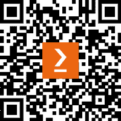

## 您可能会喜欢的其他书籍

如果您喜欢这本书，您可能会对 Packt 出版的其他书籍感兴趣：

**算法交易中的机器学习 - 第二版**

斯特凡·詹森

ISBN: 978-1-83921-771-5

+   利用市场、基本面和替代文本与图像数据

+   使用统计学、Alphalens 和 SHAP 值研究和评估 alpha 因子

+   实施机器学习技术来解决投资和交易问题

+   使用 Zipline 和 Backtrader 回测并评估基于机器学习的交易策略

+   使用 pandas、NumPy 和 pyfolio 优化投资组合风险和表现分析

+   基于协整性创建美国股票和 ETF 的配对交易策略

+   使用 AlgoSeek 的高质量交易和报价数据训练梯度提升模型，以预测日内回报

**使用 Python 和 IBM Quantum 学习量子计算** **体验**

罗伯特·洛雷多

ISBN: 978-1-83898-100-6

+   探索量子计算原理，如叠加态和量子纠缠

+   熟悉 IBM Quantum Experience 的内容和布局

+   理解量子门及其如何作用于量子比特

+   发现量子信息科学工具包及其元素，如 Terra 和 Aer

+   掌握量子算法，如贝尔态、Deutsch-Jozsa 算法、Grover 算法和 Shor 算法

+   如何创建和可视化量子电路

**与量子比特共舞**

罗伯特·S·苏托博士

ISBN: 978-1-83882-736-6

+   了解量子计算如何工作，深入数学原理，探索它的独特之处以及为什么它如此强大，通过这本量子计算教科书

+   探索支撑量子系统的复杂、令人费解的机制

+   理解经典计算与量子计算背后的必要概念

+   刷新并扩展您对基础数学、计算机科学和量子理论的理解

+   探索量子计算在科学计算、人工智能等领域的主要应用

+   详细了解量子比特、量子电路和量子算法

### Packt 正在寻找像您这样的作者

如果您有兴趣成为 Packt 的作者，请访问 [authors.packtpub.com](https://authors.packtpub.com) 并立即申请。我们与成千上万的开发者和技术专家合作，帮助他们将自己的见解分享给全球技术社区。您可以提交一般申请，申请我们正在招聘作者的特定热门话题，或提交您的创意。

### 分享您的想法

现在你已经读完了*量子机器学习与优化* *金融领域中的应用*，我们很希望听到你的想法！如果你是从亚马逊购买的这本书，请[点击这里直接访问亚马逊的`书籍评价页面`](https://packt.link/r/1801813574)，并分享你的反馈或在购买网站上留下评论。

你的评论对我们以及技术社区至关重要，能帮助我们确保提供卓越的内容质量。

[www.packt.com](https://www.packt.com)

订阅我们的在线数字图书馆，全面访问超过 7,000 本书籍和视频，以及行业领先的工具，帮助你规划个人发展并推进职业生涯。更多信息，请访问我们的网站。

### 为什么订阅？

+   用来自 4000 多位行业专业人士的实用电子书和视频，减少学习时间，增加编码时间

+   提升学习效果，享受专为你定制的技能规划

+   每月获得一本免费电子书或视频

+   完全可搜索，轻松访问重要信息

+   复制、粘贴、打印和收藏内容

你知道吗？Packt 提供了每本书的电子书版本，并提供 PDF 和 ePub 格式文件？你可以在 packt.com 升级到电子书版本，作为印刷版书籍的购买者，你还可以享受电子书的折扣。详情请联系 customercare@packtpub.com。

在[www.packt.com](https://www.packt.com)，你还可以阅读一系列免费的技术文章，注册各种免费的内容。

### 下载本书的免费 PDF 副本

感谢购买本书！

你喜欢在路上阅读，但无法随身携带印刷书籍吗？你的电子书购买无法在你选择的设备上使用吗？

不用担心，现在每本 Packt 书籍都包含一份免费的无 DRM 保护的 PDF 版本。

随时随地，在任何设备上阅读。直接从你最喜欢的技术书籍中搜索、复制并粘贴代码到你的应用程序中。

福利还不止这些，你可以独享折扣、新闻简报，并每日收到丰富的免费内容。

按照这些简单步骤获取福利：

1.  扫描二维码或访问以下链接：

    

    [`packt.link/free-ebook/9781801813570`](https://packt.link/free-ebook/9781801813570)

1.  提交你的购买凭证

1.  就是这样！我们会将你的免费 PDF 和其他福利直接发送到你的邮箱。
